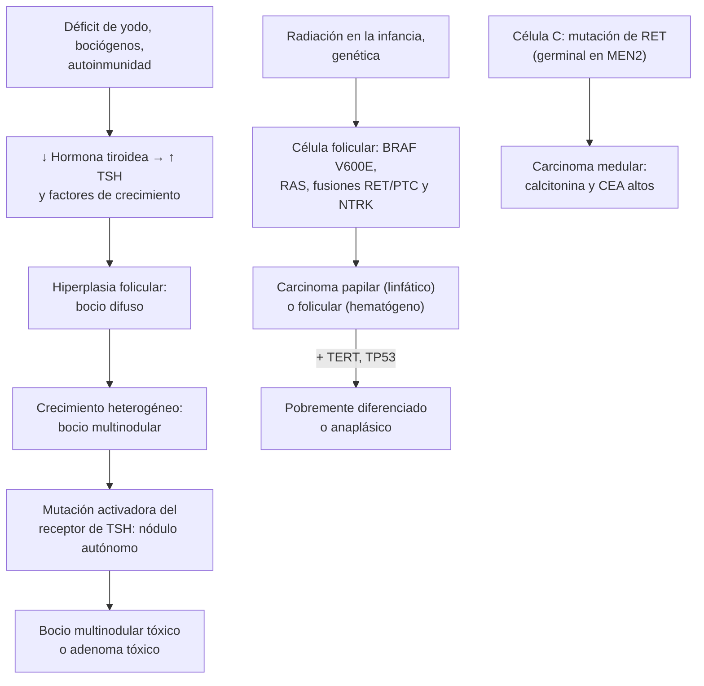

---
tags:
  - Endocrinología
  - GES
---

# Bocio, nódulo tiroideo y cáncer de tiroides

**Subespecialidad**
Endocrinología · Cirugía de cabeza y cuello · Oncología · Medicina nuclear

**Guías principales**
ETA 2023: nódulo tiroideo y bocio multinodular · ACR TI-RADS 2017: clasificación ecográfica · Bethesda 2023: citología tiroidea · ATA 2025: cáncer diferenciado de tiroides · ATA 2015: carcinoma medular · ATA 2021: carcinoma anaplásico · MINSAL 2024: guía de práctica clínica del cáncer de tiroides diferenciado y medular

**Otras fuentes**
GLOBOCAN 2022 (Bray 2024) · Incidencia del cáncer de tiroides en Chile (Sapunar 2014 y 2020) · Estado de yodo en Chile (Iodine Global Network 2025; Muzzo 2023) · Sobrediagnóstico en Corea (Ahn 2014) · Figuras: Durante 2023 (ETA) y Borges 2023, ambas CC BY 4.0

**GES**
**Cáncer de tiroides en personas de 15 años y más (GES 82)**, desde la confirmación diagnóstica: etapificación en ≤ 45 días (anaplásico ≤ 7 días); cirugía en ≤ 90 días si es diferenciado de alto riesgo o medular, ≤ 6 meses si es de riesgo intermedio y ≤ 9 meses si es de bajo riesgo (anaplásico ≤ 7 días); tratamiento complementario en ≤ 90 días y sistémico en ≤ 60 días. Copago: FONASA 0 %, isapre 20 %. El estudio del nódulo y el bocio benigno **no** son GES.

**EUNACOM**
1.03.1.001 Bocio (específico, inicial, derivar) · 1.03.1.021 Nódulo tiroideo (específico, inicial, derivar) · 1.03.1.004 Cáncer del tiroides (sospecha, inicial, derivar)

**Revisado**
Octubre 2026

!!! abstract "Resumen en 60 segundos"
    - Los **nódulos tiroideos** son muy frecuentes: la ecografía los muestra en hasta el **60 %** de los adultos. Solo **1–5 %** son cáncer. **No** se hace tamizaje ecográfico en personas sin síntomas.
    - **Frente a un nódulo, lo primero es la TSH**:
        - **TSH baja** → **cintigrafía**. Un nódulo **caliente** (hiperfuncionante) casi nunca es maligno: **no se punciona**; se trata el hipertiroidismo.
        - **TSH normal o alta** → **ecografía** con clasificación de riesgo (**EU-TIRADS** o **ACR TI-RADS**).
    - La **punción con aguja fina (PAAF)** se indica según el riesgo ecográfico y el tamaño. EU-TIRADS: **5 > 10 mm**, **4 > 15 mm**, **3 > 20 mm**. Siempre si hay **adenopatía sospechosa**.
    - La citología se informa con **Bethesda 2023** (I a VI). **II benigno**: control. **V y VI**: cirugía. **III y IV** (indeterminados): repetir PAAF, estudio molecular o lobectomía diagnóstica.
    - **No** usar **levotiroxina** para "achicar" nódulos o bocios eutiroideos.
    - **Bocio**: tratar si hay **compresión** (disnea, estridor, disfagia, signo de **Pemberton**), crecimiento, sospecha de cáncer o hipertiroidismo: **cirugía** o **radioyodo**.
    - **Cáncer de tiroides**: **papilar** ~85 % (excelente pronóstico), folicular ~10 %, **medular** 2–3 % (**calcitonina**, **RET**, MEN2), anaplásico < 3 % (letal; urgencia).
        - La ATA 2025 favorece la **lobectomía** en tumores pequeños de bajo riesgo, la **vigilancia activa** del microcarcinoma papilar seleccionado y **no** dar radioyodo de rutina en bajo riesgo.
        - **GES 82** desde la confirmación.
    - **Alarma**: nódulo **duro y fijo**, crecimiento rápido, **disfonía**, adenopatías, irradiación cervical en la infancia, antecedente familiar de cáncer medular o MEN2.

## Definición

| Concepto | Definición |
|---|---|
| **Bocio** | **Aumento de tamaño** de la tiroides. Puede ser **difuso** o **nodular** (uni o multinodular), **eutiroideo** o **tóxico**, cervical o **endotorácico** (subesternal) |
| **Nódulo tiroideo** | Lesión **discreta** dentro de la tiroides, **distinta del parénquima** que la rodea en la ecografía (ETA 2023). Un "nódulo" palpable que no se ve en la ecografía no es un nódulo |
| **Bocio multinodular** | Tiroides aumentada con **varios nódulos**. En zonas con déficit de yodo es la forma más frecuente de bocio en el adulto |
| **Incidentaloma tiroideo** | Nódulo descubierto en una imagen pedida por **otro motivo** (ecografía carotídea, TC, RM o PET) |
| **Nódulo caliente / frío** | Capta más / menos radiotrazador que el resto de la tiroides en la **cintigrafía**. El caliente es **autónomo** y casi siempre benigno |
| **Cáncer diferenciado de tiroides** | Carcinomas derivados del **epitelio folicular** que conservan funciones de la célula tiroidea (captan yodo, producen **tiroglobulina**): **papilar**, **folicular** y **oncocítico** |
| **Microcarcinoma papilar** | Carcinoma papilar de **≤ 1 cm** |

**Escala clínica del bocio (OMS)**: **grado 0**, no palpable ni visible; **grado 1**, palpable pero no visible con el cuello en posición normal; **grado 2**, visible con el cuello en posición normal.

## Epidemiología

### Mundial

- **Nódulos** (ETA 2023):
    - Con ecografía se encuentran en **hasta el 60 %** de los adultos. La prevalencia sube con la **edad** y es mayor en las **mujeres** y en zonas con **déficit de yodo**.
    - Solo **1–5 %** de los nódulos no seleccionados son cáncer.
- **Cáncer de tiroides** (GLOBOCAN 2022):
    - **~821.000 casos nuevos** y **~47.500 muertes** al año en el mundo.
    - Es unas **3 veces** más frecuente en las mujeres (MINSAL 2024).
- **Sobrediagnóstico**:
    - La incidencia aumentó mucho en las últimas décadas, sobre todo por tumores **< 2 cm** detectados por **ecografía**, **sin aumento de la mortalidad**.
    - El ejemplo clásico es **Corea del Sur**, donde el tamizaje ecográfico multiplicó la incidencia unas **15 veces** sin cambiar la mortalidad (Ahn 2014).
- El **déficit de yodo** sigue siendo la principal causa de bocio en el mundo, aunque la **sal yodada** lo ha controlado en la mayoría de los países.

!!! chile "Datos nacionales"
    - **Incidencia de cáncer de tiroides**:
        - **2,3** (hombres) y **7,0** (mujeres) por 100.000, ajustada, en 2003–2010 (MINSAL 2024).
        - Al menos **7,86 por 100.000** en 2011, según informes de anatomía patológica de todo el país (Sapunar 2014). El **92 %** era **papilar**.
        - En una clínica oncológica privada de Santiago, **48,7–60,8 por 100.000** en 2016–2018 (Sapunar 2020). Refleja más acceso a la ecografía y a la cirugía.
    - **Sobrevida global a 5 años**: **86,6 %** en Chile (MINSAL 2024).
    - **Yodo**:
        - La sal se yoda por norma desde **1979** (100 ppm). Por una excreción urinaria de yodo elevada, el Reglamento Sanitario de los Alimentos del año **2000** la **redujo a 40 ppm** (Muzzo 2023).
        - Hoy la ingesta es **adecuada**: mediana de yoduria de **201 µg/L** en adultos (2017; Iodine Global Network 2025). El bocio por déficit de yodo es hoy **raro** en Chile.
    - **GES 82** (incorporado en 2019, para 15 años y más):
        - Cubre **etapificación**, **cirugía**, **radioyodo**, **tratamiento sistémico** y **seguimiento** desde la **confirmación diagnóstica**.
        - Los plazos dependen del riesgo: ver la ficha.

## Etiología

- **Bocio difuso**:
    - **Déficit de yodo** (endémico).
    - **Autoinmune**: **Hashimoto** (bocio firme, hipotiroidismo) y **Graves** (bocio difuso con soplo, hipertiroidismo). Ver [hipotiroidismo e hipertiroidismo](hipotiroidismo-e-hipertiroidismo.md).
    - **Bociógenos y fármacos**: **litio**, **amiodarona**, exceso de yodo.
    - **Fisiológico**: pubertad, embarazo.
    - Raros: tiroiditis infiltrativas (Riedel), defectos de la síntesis hormonal, adenoma productor de TSH.
- **Nódulos benignos** (la gran mayoría):
    - Nódulo **coloide** o **hiperplásico** (adenomatoso), **quistes**.
    - **Adenoma folicular**, **adenoma tóxico**.
    - Pseudonódulos del **Hashimoto**.
- **Nódulos malignos**:
    - **Carcinoma diferenciado**: papilar, folicular, oncocítico.
    - **Carcinoma medular** (células C): esporádico o **hereditario** (~25 %; **MEN2A**, **MEN2B**, familiar), por mutación del **proto-oncogén RET**.
    - **Carcinoma pobremente diferenciado** y **anaplásico**.
    - **Linfoma tiroideo** (casi siempre sobre un **Hashimoto**).
    - **Metástasis** (riñón, pulmón, mama, melanoma).
- **Factores de riesgo de cáncer** (MINSAL 2024; ETA 2023):
    - **Radiación ionizante** de cabeza y cuello, sobre todo en la **infancia**: el factor más importante.
    - **Antecedente familiar** de cáncer de tiroides, de carcinoma medular o de **MEN2**; síndromes hereditarios.
    - Sexo **femenino** (más casos) pero un nódulo en un **hombre** tiene más riesgo de ser maligno.
    - **Obesidad**.
    - En ~95 % de los casos no se identifica un factor predisponente.

## Fisiopatología

- **Bocio**:
    - Con poco yodo, o cuando la síntesis está bloqueada, baja la hormona tiroidea y sube la **TSH**.
    - La TSH y otros **factores de crecimiento** estimulan la **hiperplasia** de los folículos y producen el **bocio difuso**.
    - Con los años, los folículos crecen de forma **heterogénea**: aparecen **nódulos** (bocio multinodular).
    - Algunos nódulos adquieren **mutaciones activadoras del receptor de TSH** y se vuelven **autónomos**. Producen hormona sin control: **bocio multinodular tóxico** o **adenoma tóxico**.
- **Cáncer diferenciado**:
    - Mutaciones que activan la vía de las **MAPK** y de **PI3K/AKT**.
    - **Papilar**: **BRAF V600E** (la más frecuente), fusiones **RET/PTC** y **NTRK**.
    - **Folicular**: mutaciones de **RAS**.
    - La desdiferenciación (**pobremente diferenciado**, **anaplásico**) agrega mutaciones del promotor de **TERT** y de **TP53**. Esas células pierden la captación de yodo.
- **Carcinoma medular**: nace de las **células C** (parafoliculares), que producen **calcitonina**. Mutación de **RET**: germinal en las formas hereditarias, somática en las esporádicas.
- **Diseminación**:
    - El **papilar** se disemina por vía **linfática** a los ganglios cervicales.
    - El **folicular**, por vía **hematógena** (pulmón, hueso).

*Figura 1. Del bocio al nódulo autónomo, y vías moleculares del cáncer de tiroides. Esquema propio.*

## Clasificación

### Riesgo ecográfico del nódulo

<figure markdown>
![Esquema en dos paneles. A la izquierda, las cinco características ecográficas de ACR TI-RADS con sus puntos: composición (quístico o espongiforme 0, mixto 1, sólido 2), ecogenicidad (anecoico 0, hiper o isoecoico 1, hipoecoico 2, muy hipoecoico 3), forma (más ancho que alto 0, más alto que ancho 3), márgenes (lisos o mal definidos 0, lobulados o irregulares 2, extensión extratiroidea 3) y focos ecogénicos (ninguno o cola de cometa 0, macrocalcificaciones 1, calcificación periférica 2, focos puntiformes 3). A la derecha, los niveles: TR1 0 puntos y TR2 2 puntos sin PAAF; TR3 3 puntos, PAAF si mide 2,5 cm o más; TR4 4 a 6 puntos, PAAF desde 1,5 cm; TR5 7 o más puntos, PAAF desde 1 cm; con los tamaños de seguimiento y su frecuencia. Abajo, los umbrales europeos EU-TIRADS 3 mayor de 20 mm, 4 mayor de 15 mm y 5 mayor de 10 mm](../assets/figuras/nodulo-tiroideo/acr-ti-rads.svg){ loading=lazy }
<figcaption>Figura 2. Clasificación ecográfica del nódulo tiroideo: puntaje ACR TI-RADS, umbrales de PAAF y seguimiento, y su equivalente europeo (EU-TIRADS). Esquema propio basado en Tessler 2017 y en la guía ETA 2023.</figcaption>
</figure>

| EU-TIRADS (ETA 2023) | Ecografía | Riesgo de malignidad | PAAF si |
|---|---|---|---|
| **1** Normal | Sin nódulos | — | No |
| **2** Benigno | **Quiste puro** o nódulo **completamente espongiforme** | ~0 % | No (salvo que se vaya a tratar) |
| **3** Bajo riesgo | Ovalado, liso, **iso o hiperecoico**, sin rasgos de alto riesgo | 2–4 % | **> 20 mm** |
| **4** Riesgo intermedio | Ovalado, liso, **levemente hipoecoico**, sin rasgos de alto riesgo | 6–17 % | **> 15 mm** |
| **5** Alto riesgo | **Al menos un rasgo de alto riesgo**: forma **no ovalada** (más alto que ancho), **márgenes irregulares**, **microcalcificaciones**, **marcada hipoecogenicidad** | 26–87 % | **> 10 mm** (5–10 mm solo si hay adenopatías sospechosas, extensión extratiroidea o ubicación de riesgo) |

!!! perla "Qué hace sospechoso a un nódulo en la ecografía"
    - Son **sólidos** e **hipoecoicos**, **más altos que anchos**, de **márgenes irregulares** y con **microcalcificaciones** (focos puntiformes).
    - Los rasgos **tranquilizadores** son el **quiste puro**, el aspecto **espongiforme**, el **halo** fino y la **cola de cometa** (coloide).
    - Los **ganglios** sospechosos tienen áreas **quísticas**, microcalcificaciones, aspecto parecido a la tiroides y vascularización caótica **sin hilio**.

<figure markdown>
{ loading=lazy }
<figcaption>Figura 3. Nódulos tiroideos en la ecografía. <strong>A</strong>: mixto con componente sólido isoecoico (ACR 2 / EU 3). <strong>B</strong>: sólido marcadamente hipoecoico (ACR 4 / EU 5). <strong>C</strong>: sólido isoecoico con focos ecogénicos puntiformes, flecha (ACR 4 / EU 5). <strong>D</strong>: sólido hipoecoico más alto que ancho (ACR 4 / EU 5). <strong>E</strong>: hipoecoico que abomba el contorno posterior, sugerente de extensión extratiroidea (ACR 5 / EU 4). Fuente: Borges AP, Antunes C, Caseiro-Alves F, Donato P. Analysis of 665 thyroid nodules using both EU-TIRADS and ACR TI-RADS classification systems. <em>Thyroid Res.</em> 2023;16:12, figura 5. Licencia <a href="https://creativecommons.org/licenses/by/4.0/">CC BY 4.0</a>.</figcaption>
</figure>

### Citología: sistema Bethesda 2023

| Categoría | Riesgo de malignidad, media (rango) | Conducta (Bethesda 2023 y ETA 2023) |
|---|---|---|
| **I. No diagnóstica** | 13 % (5–20) | **Repetir la PAAF** guiada por ecografía (salvo un quiste puro). Si sigue no diagnóstica: biopsia con aguja gruesa, vigilancia o cirugía |
| **II. Benigna** (coloide, hiperplásico, tiroiditis) | 4 % (2–7) | **Seguimiento ecográfico**. Repetir la PAAF si la ecografía es de **alto riesgo** (discordancia) o si **crece**. No repetir tras dos benignas |
| **III. Atipia de significado indeterminado** | 22 % (13–30) | **Repetir la PAAF**. Si se repite: vigilancia, **estudio molecular** o cirugía según el riesgo ecográfico |
| **IV. Neoplasia folicular** | 30 % (23–34) | **Lobectomía diagnóstica** (la citología no distingue el adenoma del carcinoma folicular) o estudio molecular |
| **V. Sospechosa de malignidad** | 74 % (67–83) | **Cirugía**. Ojo: el **linfoma** suele informarse aquí y no se opera |
| **VI. Maligna** | 97 % (97–100) | **Cirugía** (GES 82). Vigilancia activa en el microcarcinoma papilar seleccionado |

### Tipos de cáncer de tiroides

| Tipo | Frecuencia | Claves |
|---|---|---|
| **Papilar** | ~**85 %** (92 % en Chile) | Mujer de **30–50 años**. Diseminación **linfática** (ganglios del cuello). Núcleos en "vidrio esmerilado", **cuerpos de psamoma**. BRAF V600E. Pronóstico **excelente** |
| **Folicular** | ~**10 %** | Algo mayor. Diseminación **hematógena** (**pulmón, hueso**). Se diagnostica por **invasión capsular o vascular** en la histología, no por la citología |
| **Oncocítico** (de células de Hürthle) | Poco frecuente | Capta **menos yodo**; algo más agresivo |
| **Medular** | **2–3 %** | Células C: **calcitonina** y **CEA** altos. **~25 % hereditario** (**MEN2A**: feocromocitoma e hiperparatiroidismo; **MEN2B**: feocromocitoma, neuromas mucosos, hábito marfanoide). No capta yodo |
| **Pobremente diferenciado y anaplásico** | **< 3 %** (con otros de alto grado) | **Adulto mayor** con una masa **dura** que **crece en semanas**, compresión de la vía aérea, disfonía. **Muy letal**. **GES 82: cirugía en ≤ 7 días** |
| **Linfoma tiroideo** | Raro | Mujer mayor con **Hashimoto** y un **bocio que crece rápido**. Se trata con **quimioterapia** (no cirugía) |

### Etapificación y riesgo del cáncer diferenciado

- **TNM (AJCC, 8.ª edición, 2017)**: la **edad de corte es 55 años**.
    - **< 55 años**: solo hay **etapa I** (sin metástasis a distancia) o **etapa II** (con metástasis a distancia), sea cual sea el tumor o los ganglios.
    - **≥ 55 años**:
        - **I**: T1–T2 N0.
        - **II**: T1–T2 N1, o T3 (> 4 cm o con extensión extratiroidea macroscópica solo a los músculos pretiroideos).
        - **III**: T4a (laringe, tráquea, esófago, nervio laríngeo recurrente).
        - **IVA**: T4b (fascia prevertebral, carótida o vasos del mediastino).
        - **IVB**: metástasis a distancia.
    - La etapa predice la **mortalidad**.
- **Riesgo de recurrencia (ATA)**: la ATA 2025 lo divide en **bajo, intermedio-bajo, intermedio-alto y alto**. Se calcula con la histología, los ganglios, la etapa, las imágenes y la tiroglobulina postoperatoria.
    - Ejemplos clásicos de **bajo riesgo** (ATA 2015): papilar **intratiroideo**, sin histología agresiva ni invasión vascular, sin ganglios o con ≤ 5 micrometástasis < 0,2 cm, resección completa.
    - Ejemplos clásicos de **alto riesgo** (ATA 2015):
        - Extensión extratiroidea **macroscópica** o resección **incompleta**.
        - **Metástasis a distancia**.
        - Ganglio metastásico **> 3 cm**.
        - Folicular con invasión vascular extensa (> 4 vasos).
        - Tiroglobulina postoperatoria que sugiere metástasis.
- **Respuesta al tratamiento** (se reevalúa en cada control):

| Respuesta | Después de tiroidectomía total + radioyodo |
|---|---|
| **Excelente** | Imágenes negativas y **tiroglobulina** suprimida **< 0,2 ng/mL** (o estimulada < 1 ng/mL) |
| **Indeterminada** | Hallazgos inespecíficos en las imágenes, tiroglobulina suprimida 0,2–1 ng/mL (estimulada 1–10), o anticuerpos antitiroglobulina **estables o en descenso** |
| **Bioquímica incompleta** | Tiroglobulina suprimida **> 1 ng/mL** (estimulada > 10) o anticuerpos antitiroglobulina **en aumento**, **sin** enfermedad visible |
| **Estructural incompleta** | Enfermedad **locorregional o a distancia** demostrada por imagen o biopsia |

## Clínica

- **Nódulo**:
    - La mayoría son **asintomáticos** y se descubren al palpar el cuello o en una **imagen por otro motivo**.
    - **Dolor súbito** con aumento de volumen: **hemorragia dentro de un nódulo** (benigno).
- **Bocio**:
    - **Aumento de volumen cervical**, sensación de **"cuerpo extraño"**.
    - **Compresión**:
        - **Tráquea**: disnea, **estridor**, tos, disnea al acostarse.
        - **Esófago**: **disfagia**.
        - **Vena cava superior** (bocio **endotorácico**): edema y plétora facial.
        - **Signo de Pemberton**: plétora facial, ingurgitación yugular o estridor al **levantar ambos brazos** sobre la cabeza.
    - La **disfonía** por parálisis del nervio laríngeo recurrente es **rara en el bocio benigno**: sugiere **cáncer**.
    - Hipertiroidismo si es **tóxico** (sobre todo adultos mayores: FA, baja de peso). Riesgo de **tirotoxicosis tras contraste yodado** (Jod-Basedow).
- **Cáncer**:
    - Casi siempre **asintomático**: un nódulo como cualquier otro.
    - **Datos que aumentan la sospecha** (MINSAL 2024; ETA 2023):
        - Nódulo **duro**, **fijo** a planos profundos, de **crecimiento rápido**.
        - **Adenopatías** cervicales.
        - **Disfonía** persistente, **disfagia**, **disnea**, tos irritativa persistente.
        - **Dolor cervical anterior** irradiado a los oídos.
        - **Irradiación** de cabeza y cuello en la infancia.
        - **Antecedente familiar** de cáncer medular o MEN2.
        - Edad **joven** y sexo **masculino**.
    - **Carcinoma medular**: puede dar **diarrea** y **rubor** (calcitonina alta) en la enfermedad avanzada; buscar feocromocitoma e hiperparatiroidismo (MEN2).
    - **Anaplásico**: adulto mayor con una masa cervical **dura que crece en días o semanas**, **estridor**, **disfagia** y disfonía.

!!! alarma "Derivar con urgencia o hospitalizar"
    - **Compromiso de la vía aérea** por un bocio o una masa tiroidea: **estridor**, disnea de reposo, ortopnea. Asegurar la vía aérea (intubación difícil; idealmente con anestesista experto) y llamar al cirujano.
    - **Masa tiroidea que crece en semanas** en un adulto mayor: sospechar **carcinoma anaplásico** o **linfoma**. Derivación **inmediata** (GES 82: etapificación y cirugía del anaplásico en **≤ 7 días**).
    - **Hematoma cervical tras una tiroidectomía** con dificultad respiratoria: **abrir la herida** en la cama (retirar las suturas y evacuar el hematoma) y llamar al cirujano. Es una emergencia vital.
    - **Hipocalcemia sintomática** tras una tiroidectomía (parestesias, Chvostek, Trousseau, **tetania**): **gluconato de calcio EV**. Ver [trastornos del calcio](trastornos-del-calcio-fosforo-y-magnesio.md).
    - **Tormenta tiroidea** en un bocio tóxico (por ejemplo, tras un contraste yodado). Ver [hipertiroidismo](hipotiroidismo-e-hipertiroidismo.md).

## Diagnóstico

<figure markdown>
![Algoritmo de la guía europea en dos paneles, en inglés. Panel A, primera línea: según la categoría EU-TIRADS y el tamaño, PAAF o vigilancia. EU-TIRADS 2 con riesgo menor de 1 por ciento: vigilancia; EU-TIRADS 3 con riesgo de 2 a 4 por ciento: PAAF si mide más de 20 milímetros; EU-TIRADS 4 con riesgo de 6 a 17 por ciento: PAAF si mide más de 15 milímetros; EU-TIRADS 5 con riesgo de 26 a 87 por ciento: PAAF si mide más de 10 milímetros. Se detallan las frecuencias de control ecográfico. Panel B, segunda línea: conducta según la categoría de Bethesda I a VI y la categoría EU-TIRADS: repetir la PAAF, controlar con ecografía, estudio molecular o cirugía](../assets/figuras/nodulo-tiroideo/algoritmo-nodulo-eta-2023.jpg){ loading=lazy }
<figcaption>Figura 4. Estudio del nódulo tiroideo recién diagnosticado según la ETA 2023. <strong>A</strong>: primera línea, ecografía con EU-TIRADS (PAAF o vigilancia según la categoría y el tamaño). <strong>B</strong>: segunda línea, conducta según la citología Bethesda. FNA: punción con aguja fina; ROM: riesgo de malignidad; US: ecografía; CNB: biopsia con aguja gruesa. Fuente: Durante C, Hegedüs L, Czarniecka A, et al. 2023 European Thyroid Association Clinical Practice Guidelines for thyroid nodule management. <em>Eur Thyroid J.</em> 2023;12(5):e230067, figura 2. Licencia <a href="https://creativecommons.org/licenses/by/4.0/">CC BY 4.0</a>.</figcaption>
</figure>

!!! guia "Estudio del nódulo tiroideo (ETA 2023)"
    1. **Historia** (irradiación, antecedente familiar, síntomas de compresión, velocidad de crecimiento), **examen físico** del cuello y **TSH**.
    2. **Según la TSH**:
        - **Baja**: T4 libre (± T3), y **cintigrafía**.
            - Nódulo **caliente**: **no** se punciona; se trata el hipertiroidismo.
            - Nódulo **frío**: sigue el estudio ecográfico como un nódulo con TSH normal.
        - **Normal**: **ecografía** con clasificación de riesgo.
        - **Alta**: T4 libre y **anti-TPO** (Hashimoto). Igual se evalúa el nódulo con ecografía.
    3. **Ecografía cervical** a todos los que tienen un nódulo sospechado o un **incidentaloma**. Incluye la tiroides y los **ganglios** de los compartimentos central y lateral. Describir el tamaño, la ubicación y la categoría **EU-TIRADS** (o ACR TI-RADS).
    4. **PAAF guiada por ecografía** según la categoría y el tamaño (tabla y figura 2), **decidida en conjunto con el paciente**:
        - Siempre si hay una **adenopatía sospechosa** (PAAF del ganglio con **tiroglobulina** o **calcitonina** en el lavado de la aguja) o **extensión extratiroidea**.
        - Aumentan la indicación: **sexo masculino**, **edad joven**, nódulo **solitario**, síntomas de **compresión**, antecedente familiar de cáncer medular o MEN2, irradiación en la infancia, **calcitonina alta**, captación focal en el **PET**.
        - La disminuyen: **bocio multinodular** estable por años, **expectativa de vida limitada**, comorbilidad importante, preferencia del paciente.
    5. **Citología Bethesda** → conducta (tabla y figura 4).
    6. **Nódulos sin indicación de PAAF**:
        - EU-TIRADS 2 y 3 de **5–10 mm**: sin más controles.
        - EU-TIRADS 2 > 10 mm y EU-TIRADS 3 de 10–20 mm: **ecografía en 3–5 años**.
        - EU-TIRADS 4 < 15 mm: ecografía en **1 año**.
        - EU-TIRADS 5 < 10 mm: ecografía cada **6–12 meses** (espaciar si no cambia en 2 años).
    7. **Crecimiento significativo**: aumento **≥ 20 % en al menos dos diámetros** (mínimo **2 mm**) o **> 50 % del volumen**, o síntomas de compresión. Indica repetir la evaluación o la PAAF.

- **Bocio**:
    - **TSH** (y T4 libre si está alterada), anti-TPO si la TSH está alta.
    - **Ecografía** para caracterizar los nódulos (cada nódulo sospechoso se estudia como un nódulo aislado).
    - **TC de cuello y tórax** si se sospecha extensión **endotorácica** o compresión. Ojo con el **contraste yodado** en un bocio nodular (riesgo de tirotoxicosis).
    - **Espirometría** con curva flujo-volumen si hay síntomas respiratorios (obstrucción de la vía aérea alta).
- **Cáncer confirmado** (MINSAL 2024; ATA 2025):
    - **Ecografía cervical preoperatoria** de los ganglios centrales y laterales y de la **extensión extratiroidea**.
    - **PAAF con tiroglobulina en el lavado** de los ganglios laterales sospechosos (> 8–10 mm en el eje menor), en vez de una biopsia rápida.
    - **Evaluación de la voz y la laringe** antes de la cirugía.
    - **TC o RM** si hay enfermedad avanzada (invasión de la vía aérea o el esófago, ganglios voluminosos).
- **Carcinoma medular** (ATA 2015): **calcitonina** y **CEA**, estudio **germinal de RET** a todos, **metanefrinas plasmáticas** (descartar un **feocromocitoma antes de operar**) y **calcio** con PTH.

## Laboratorio

| Examen | Interpretación |
|---|---|
| **TSH** | **Primer examen** ante cualquier nódulo o bocio. **Baja**: cintigrafía (nódulo autónomo) |
| **T4 libre (± T3)** | Si la TSH está alterada |
| **Anti-TPO** | Si la TSH está alta: Hashimoto. El Hashimoto produce **pseudonódulos** y se asocia al **linfoma** |
| **Calcitonina** | **No** de rutina (ni a favor ni en contra en la ETA 2023). Pedirla si hay **antecedente familiar** de cáncer medular o MEN2, o sospecha clínica. Sugiere cáncer medular si es **> 30 pg/mL** en mujeres o **> 34 pg/mL** en hombres |
| **Tiroglobulina** | **No sirve** para evaluar un nódulo. Es un **marcador tumoral** solo **después** de la tiroidectomía total (y del radioyodo). Medir siempre junto con los **anticuerpos antitiroglobulina** (interfieren) |
| **CEA** | Carcinoma medular (junto con la calcitonina) |
| **Calcio y PTH** | Antes y **después** de una tiroidectomía total (hipoparatiroidismo); en el carcinoma medular (MEN2A) |
| **Estudio molecular de la citología** | En nódulos **indeterminados** (Bethesda III y IV) si está disponible. Poco accesible en Chile |

## Imágenes

- **Ecografía tiroidea y cervical**: el examen **central**. Más sensible y específica que la palpación. Clasifica el riesgo, mide, guía la PAAF y evalúa los ganglios.
- **Cintigrafía** (Tc-99m o I-123): **solo si la TSH está baja** (o en el límite bajo). Distingue el nódulo **caliente** (no se punciona) del **frío**. En el bocio multinodular muestra las zonas autónomas y define la indicación de radioyodo.
- **TC o RM de cuello y tórax**: **no** para estudiar el nódulo. Se piden para la extensión **endotorácica**, la **compresión** o la invasión local de un cáncer.
- **Radiografía de tórax**: puede mostrar una **desviación traqueal** o un ensanchamiento del mediastino superior.
- **Incidentalomas**:
    - En la **TC o la RM**: riesgo de malignidad **5–13 %**.
    - En el **PET-CT**, la captación **focal** tiene ~**35 %** de riesgo.
    - En ambos casos se estudian con **ecografía** como cualquier nódulo (ETA 2023). La captación **difusa** en el PET suele ser tiroiditis.
- **Rastreo corporal con yodo-131 e imágenes de seguimiento**: las indica el especialista después de la tiroidectomía.

## Diagnóstico diferencial

| Condición | Claves |
|---|---|
| **Quiste tirogloso** | Línea **media**, se **mueve al sacar la lengua**. Niños y jóvenes |
| **Quiste branquial** | **Lateral**, borde anterior del esternocleidomastoideo |
| **Adenopatía cervical** (reactiva, TBC, linfoma, metástasis) | Fuera de la tiroides en la ecografía; buscar el primario de cabeza y cuello |
| **Adenoma de paratiroides** | Posterior a la tiroides; **hipercalcemia** con PTH alta |
| **Tiroiditis subaguda** | **Dolor** cervical, fiebre, VHS alta, tirotoxicosis con **captación baja**. Ver [tiroiditis](hipotiroidismo-e-hipertiroidismo.md) |
| **Hemorragia dentro de un nódulo** | Dolor y crecimiento **súbitos**; quiste con contenido en la ecografía |
| **Tiroiditis aguda supurada** | Fiebre, dolor, eritema, absceso; a veces por una fístula del seno piriforme |
| **Hashimoto con pseudonódulos** | Tiroides heterogénea, anti-TPO positivos |
| **Graves** | Bocio **difuso** con **soplo**, tirotoxicosis, orbitopatía |
| **Linfoma tiroideo** | Hashimoto previo con crecimiento **rápido**, síntomas B |
| **Lipoma, laringocele, divertículo de Zenker** | Ecografía o TC |

## Tratamiento

### Nódulo y bocio benignos

!!! guia "Tratamiento del nódulo y el bocio benignos (ETA 2023)"
    - **Vigilancia** clínica y ecográfica: es la conducta para la **mayoría** de los nódulos benignos y asintomáticos.
    - **Levotiroxina**: **no** está indicada en las personas **eutiroideas** con nódulos o bocio. Es poco eficaz y aumenta el riesgo de **FA** y **osteoporosis**.
    - **Yodo o selenio**: **no**, salvo que haya **déficit**.
    - **Nódulo hiperfuncionante (adenoma tóxico)**: **radioyodo** de elección; alternativas: cirugía o técnicas mínimamente invasivas.
    - **Bocio multinodular**:
        - **Normofuncionante**: considerar el **radioyodo** como alternativa a la cirugía.
        - **Tóxico**: radioyodo o cirugía. Ver [hipertiroidismo](hipotiroidismo-e-hipertiroidismo.md).
    - **Quiste** puro o predominantemente quístico:
        - **Aspiración**.
        - Si recidiva, **ablación con etanol** como primera línea.
    - **Nódulo sólido benigno sintomático**: **ablación térmica** (radiofrecuencia, láser) como alternativa a la cirugía, con dos citologías benignas previas (salvo EU-TIRADS 2).
    - **Cirugía** (lobectomía o tiroidectomía total):
        - Nódulo o bocio **sintomático** (compresión, molestia estética).
        - Bocio **endotorácico** con compresión.
        - **Calcitonina** sobre el punto de corte.
        - Citología **indeterminada** (Bethesda III y IV) que no es apta para vigilancia.
        - **Bethesda V y VI**.

### Cáncer diferenciado de tiroides (GES 82)

!!! guia "Cáncer diferenciado de tiroides (ATA 2025 y MINSAL 2024)"
    - **Vigilancia activa** (nuevo en la ATA 2025):
        - Es una opción para el **microcarcinoma papilar** (**cT1a N0 M0**, ≤ 1 cm), intratiroideo, sin adenopatías y lejos de la tráquea y del nervio laríngeo recurrente. Se decide **en conjunto con el paciente** (MINSAL 2024: vigilancia activa o cirugía).
        - Control con **ecografía cervical**; **no** se mide la tiroglobulina.
        - **Operar** si crece **> 3 mm**, aparecen ganglios o metástasis, hay extensión extratiroidea o crecimiento posterior, o el paciente lo prefiere.
        - La **ablación percutánea** es otra alternativa en casos seleccionados.
    - **Extensión de la cirugía** (ATA 2025):
        - **< 2 cm** (cT1 N0 M0) sin extensión extratiroidea: **lobectomía** de primera elección, salvo tumores bilaterales u otro motivo para sacar el lóbulo contralateral.
        - **2–4 cm** (cT2 N0 M0) de bajo riesgo: **lobectomía** o **tiroidectomía total** según los nódulos contralaterales y la preferencia. MINSAL 2024: lobectomía o tiroidectomía total en el bajo riesgo.
        - **> 4 cm**, extensión extratiroidea **macroscópica**, **ganglios clínicos (cN1)** o **metástasis a distancia**: **tiroidectomía total + disección ganglionar**.
        - Disección **central profiláctica**: **no** en la mayoría de los papilares pequeños sin ganglios (cT1–T2 cN0) ni en los foliculares; puede considerarse en los T3–T4 cN0. Con ganglios clínicos, la disección es **terapéutica**.
        - Si la lobectomía muestra rasgos de mayor riesgo: **completar la tiroidectomía**.
    - **Radioyodo (I-131) después de la tiroidectomía total**:
        - **Bajo riesgo**: **no** de rutina. Si se usa, **30 mCi** (1,1 GBq) en vez de 100 mCi (MINSAL 2024).
        - **Riesgo intermedio** (bajo o alto): **considerar**. MINSAL: 30–50 o 100 mCi.
        - **Alto riesgo** o **metástasis a distancia**: **de rutina**. MINSAL: **100 mCi** en vez de 150 mCi.
        - Preparación con **TSH recombinante humana** en vez de suspender la levotiroxina (MINSAL 2024), y **dieta baja en yodo**.
    - **Levotiroxina y meta de TSH** según la **respuesta** al tratamiento (ATA 2025):
        - Respuesta **excelente o indeterminada**: TSH **dentro del rango normal**. MINSAL 2024: **0,5–2,0 mUI/L** en el bajo riesgo con buena respuesta, en vez de < 0,1.
        - Respuesta **bioquímica o estructural incompleta**: TSH **bajo el rango normal**.
        - Ya **no** se suprime la TSH de rutina: la supresión no mejora el pronóstico del bajo riesgo y causa **FA**, **osteoporosis** y fracturas.
    - **Enfermedad avanzada refractaria al radioyodo**:
        - **Inhibidores de tirosina quinasa**: **lenvatinib** en vez de sorafenib (MINSAL 2024).
        - **Inhibidores selectivos de RET** si hay fusión **RET** (pralsetinib).
        - Radioterapia externa en casos seleccionados.

### Carcinoma medular y anaplásico

- **Medular** (ATA 2015):
    - Descartar un **feocromocitoma** antes de operar; si existe, se opera **primero** el feocromocitoma.
    - **Tiroidectomía total** + **disección del compartimento central** (más disección lateral según los ganglios y la calcitonina).
    - **No** responde al radioyodo ni a la supresión de TSH. Seguimiento con **calcitonina y CEA**.
    - Estudio de **RET** en la familia y **tiroidectomía profiláctica** en los portadores, con la edad según el riesgo de la mutación.
    - Enfermedad avanzada: inhibidores de **RET** (pralsetinib, selpercatinib).
- **Anaplásico** (ATA 2021):
    - **Urgencia**: asegurar la **vía aérea**, etapificar en días y conversar los **objetivos del cuidado** desde el inicio.
    - Estudiar **BRAF V600E**: si está presente, **dabrafenib + trametinib** (MINSAL 2024).
    - Cirugía si es resecable; radioterapia y quimioterapia; **cuidados paliativos**.
- **Linfoma tiroideo**: **quimioterapia** (± radioterapia), según el tipo. Ver [hemato-oncología](../hematologia/index.md).

!!! dosis "Dosis clave"
    - **Levotiroxina después de una tiroidectomía total**: dosis de reemplazo de **~1,6 µg/kg/día** en ayunas. Ajustar a las **6–8 semanas** según la meta de TSH que defina el especialista. Iniciar con menos en los adultos mayores o con cardiopatía coronaria.
    - **Radioyodo** (MINSAL 2024): **30 mCi** en el bajo riesgo seleccionado; **30–50 o 100 mCi** en el riesgo intermedio; **100 mCi** en el alto riesgo.
    - **TSH recombinante humana** (tirotropina alfa): **0,9 mg IM** al día por **2 días**; el radioyodo se da al día siguiente de la segunda dosis.
    - **Hipocalcemia sintomática tras una tiroidectomía**: **gluconato de calcio al 10 %, 10–20 mL EV en 10 minutos** con monitor ECG, luego infusión; **calcio oral + calcitriol 0,25–0,5 µg/día** si hay hipoparatiroidismo. Ver [trastornos del calcio](trastornos-del-calcio-fosforo-y-magnesio.md).
    - **Adenoma tóxico o bocio multinodular tóxico**: tiamazol para llegar al eutiroidismo antes del tratamiento definitivo. Ver [hipertiroidismo](hipotiroidismo-e-hipertiroidismo.md).

## Complicaciones

- **Del bocio**:
    - **Compresión** de la **tráquea** (estridor, obstrucción de la vía aérea alta), el **esófago** (disfagia) o la **vena cava superior**.
    - **Hipertiroidismo** (bocio multinodular tóxico), a veces desencadenado por **contraste yodado** o **amiodarona**.
    - **Hemorragia** dentro de un nódulo.
- **Del cáncer**:
    - Metástasis **ganglionares** (papilar) y a **pulmón y hueso** (folicular).
    - Invasión de la tráquea, el esófago y el nervio laríngeo recurrente (anaplásico, avanzados).
- **De la tiroidectomía**:
    - **Hipoparatiroidismo**: en Chile, transitorio en ~**29 %** y permanente en ~**1 %** (ver [trastornos del calcio](trastornos-del-calcio-fosforo-y-magnesio.md)).
    - **Lesión del nervio laríngeo recurrente**: **disfonía**; si es **bilateral**, **estridor** y obstrucción de la vía aérea.
    - **Hematoma cervical** con compresión de la vía aérea (primeras horas).
    - **Hipotiroidismo** (necesita levotiroxina de por vida tras la tiroidectomía total).
- **Del radioyodo**: sialoadenitis, **sequedad bucal**, alteraciones del gusto. Evitar el **embarazo** por al menos 6 meses.
- **De la supresión de la TSH**: **fibrilación auricular** y **osteoporosis**.

## Pronóstico y seguimiento

- **Nódulos benignos**:
    - El riesgo de que se haya pasado por alto un cáncer en 5 años es muy bajo (~**0,6 %**).
    - Por eso se controlan con ecografía en **3–5 años** y se puede **dejar de controlar** si no cambian.
- **Cáncer diferenciado**:
    - Pronóstico **excelente**. En EE. UU., la sobrevida a 5 años es de **98,1 %** (**99,9 %** si es localizado; **55,5 %** con metástasis a distancia). En Chile, la sobrevida global a 5 años es de **86,6 %** (MINSAL 2024).
    - Seguimiento por el especialista:
        - **Tiroglobulina** con anticuerpos antitiroglobulina a las **6–12 semanas** de la tiroidectomía total.
        - **Ecografía cervical** a los **6–12 meses**.
        - Luego, según el riesgo y la **respuesta** al tratamiento.
    - Tras una **lobectomía**, la tiroglobulina tiene poco valor y el seguimiento es sobre todo **ecográfico**.
- **Medular**: depende de la etapa; la **calcitonina** y el **CEA** postoperatorios, y su tiempo de duplicación, predicen la recurrencia.
- **Anaplásico**: el más letal; la sobrevida suele medirse en **meses**.
- **En APS**: controlar la **TSH** de los pacientes con levotiroxina según la meta indicada, y vigilar la **calcemia** y los síntomas de hipocalcemia tras la cirugía.

## Perlas para el internado

- **TSH primero**: un nódulo con **TSH baja** va a **cintigrafía**, no a punción.
- No pidas **tiroglobulina** para estudiar un nódulo: solo sirve **después** de la tiroidectomía total.
- No uses **levotiroxina** para "achicar" un nódulo o un bocio en un paciente eutiroideo.
- **Disfonía + nódulo** = sospecha de cáncer hasta demostrar lo contrario.
- **Bethesda IV** (neoplasia folicular) **no** es cáncer: hay que ver la **cápsula y los vasos** en la histología. Por eso se opera para diagnosticar.
- Antes de operar un **carcinoma medular**, descarta el **feocromocitoma** con metanefrinas.
- Cuidado con el **contraste yodado** en un **bocio multinodular** de un adulto mayor: puede desencadenar una **tirotoxicosis**.
- Tras una tiroidectomía total, pregunta por **parestesias peribucales** y de los dedos y busca **Chvostek** y **Trousseau**.
- Un **bocio que crece en semanas** en una mujer mayor con Hashimoto: piensa en **linfoma**; en un adulto mayor sin antecedentes, en **anaplásico**.
- El **microcarcinoma papilar** suele ser indolente: la **vigilancia activa** es una opción válida.

## Preguntas de repaso

??? repaso "1. Mujer de 45 años con un nódulo tiroideo de 2,2 cm descubierto en una ecografía carotídea. Asintomática. ¿Qué pides primero y qué conducta sigues según el resultado?"
    **TSH** primero.

    - **TSH baja**: T4 libre y **cintigrafía**. Si el nódulo es **caliente**, **no se punciona** (riesgo de cáncer muy bajo); se trata el hipertiroidismo (radioyodo de elección).
    - **TSH normal o alta**: **ecografía cervical** con clasificación de riesgo (EU-TIRADS o ACR TI-RADS) y evaluación de los **ganglios**.
        - Con 2,2 cm, se punciona si es **EU-TIRADS 3, 4 o 5** (umbrales > 20, > 15 y > 10 mm).
        - Si es un **quiste puro** o espongiforme (EU-TIRADS 2), **no** se punciona.
    - No pedir tiroglobulina ni empezar levotiroxina.

??? repaso "2. La ecografía muestra un nódulo sólido, marcadamente hipoecoico, más alto que ancho, con microcalcificaciones, de 14 mm. ¿Cómo se clasifica y qué haces?"
    Tiene **rasgos de alto riesgo**: **EU-TIRADS 5**. En ACR TI-RADS: sólido 2 + muy hipoecoico 3 + más alto que ancho 3 + focos puntiformes 3 = **11 puntos (TR5)**.

    - Riesgo de malignidad de **26–87 %**.
    - **PAAF guiada por ecografía** (umbral > 10 mm), y evaluar los **ganglios** cervicales.
    - Si la citología es **Bethesda VI** (maligna), el caso entra al **GES 82** desde la confirmación y se deriva a cirugía.

??? repaso "3. La PAAF de un nódulo EU-TIRADS 4 de 25 mm informa \"neoplasia folicular\" (Bethesda IV). La paciente pregunta si tiene cáncer. ¿Qué le respondes y qué se hace?"
    **No se sabe todavía**. El riesgo de malignidad de Bethesda IV es de ~**30 %** (23–34 %).

    - La citología **no distingue** el adenoma folicular del **carcinoma folicular**: el diagnóstico requiere ver la **invasión capsular o vascular** en la pieza operatoria.
    - Conducta: **lobectomía diagnóstica** (o estudio molecular si está disponible).
    - Si la histología muestra un carcinoma con rasgos de riesgo, se decide completar la tiroidectomía.

??? repaso "4. Hombre de 38 años con un nódulo tiroideo de 2 cm. Su padre y su tío fueron operados de un \"cáncer de tiroides\" y su padre tuvo además un tumor suprarrenal. ¿Qué sospechas y qué examen es clave antes de operarlo?"
    **Carcinoma medular** en el contexto de una **MEN2A** (carcinoma medular + **feocromocitoma** + hiperparatiroidismo), por mutación germinal de **RET**.

    - Pedir **calcitonina** y **CEA**, **estudio germinal de RET**, **calcio y PTH**.
    - Antes de cualquier cirugía: **metanefrinas plasmáticas** para descartar un **feocromocitoma**. Si existe, se opera primero (con bloqueo alfa), para evitar una crisis hipertensiva en el pabellón.
    - Tratamiento: **tiroidectomía total + disección central**. Estudio de RET a la familia y tiroidectomía profiláctica en los portadores.

??? repaso "5. Mujer de 72 años con un bocio multinodular conocido hace 20 años, eutiroidea. Consulta por disnea al acostarse y disfagia a sólidos. Al levantar los brazos se pone pletórica. ¿Qué sospechas, cómo la estudias y qué tratamiento corresponde?"
    **Bocio multinodular con extensión endotorácica y compresión** de la tráquea y el esófago (**signo de Pemberton** positivo).

    - **TSH** y T4 libre; **ecografía** de los nódulos (PAAF de los sospechosos).
    - **TC de cuello y tórax** para ver la extensión subesternal y la tráquea (cuidado con el **contraste yodado**: riesgo de tirotoxicosis). Espirometría con curva flujo-volumen.
    - Tratamiento: **cirugía** (tiroidectomía total) por los síntomas compresivos. El radioyodo es una alternativa si no es candidata a cirugía.
    - **No** levotiroxina para reducir el bocio.
    - Si aparece **estridor** de reposo: urgencia de vía aérea.

??? repaso "6. Hombre de 35 años con un carcinoma papilar de 8 mm, intratiroideo, lejos de la tráquea y del nervio recurrente, sin ganglios en la ecografía. ¿Qué opciones tiene y qué meta de TSH tendrá si se opera y queda con respuesta excelente?"
    Es un **microcarcinoma papilar cT1a N0 M0** de bajo riesgo.

    - **Opciones** (ATA 2025; MINSAL 2024), con **decisión compartida**:
        - **Vigilancia activa** con ecografía cervical (operar si crece > 3 mm o aparecen ganglios o extensión extratiroidea).
        - **Lobectomía**.
        - Ablación percutánea en centros con experiencia.
    - **No** requiere radioyodo.
    - Con **respuesta excelente**, la TSH se mantiene **dentro del rango normal** (MINSAL: 0,5–2,0 mUI/L); **no** se suprime.
    - Cubierto por el **GES 82**: cirugía del cáncer diferenciado de **bajo riesgo** en ≤ 9 meses desde la indicación.

## Referencias

1. Durante C, Hegedüs L, Czarniecka A, et al. 2023 European Thyroid Association Clinical Practice Guidelines for thyroid nodule management. *Eur Thyroid J.* 2023;12(5):e230067. doi:[10.1530/ETJ-23-0067](https://doi.org/10.1530/ETJ-23-0067)
2. Tessler FN, Middleton WD, Grant EG, et al. ACR Thyroid Imaging, Reporting and Data System (TI-RADS): white paper of the ACR TI-RADS Committee. *J Am Coll Radiol.* 2017;14(5):587–595. doi:[10.1016/j.jacr.2017.01.046](https://doi.org/10.1016/j.jacr.2017.01.046)
3. Ali SZ, Baloch ZW, Cochand-Priollet B, et al. The 2023 Bethesda System for Reporting Thyroid Cytopathology. *Thyroid.* 2023;33(9):1039–1044. doi:[10.1089/thy.2023.0141](https://doi.org/10.1089/thy.2023.0141)
4. Ringel MD, Sosa JA, Baloch Z, et al. 2025 American Thyroid Association Management Guidelines for Adult Patients with Differentiated Thyroid Cancer. *Thyroid.* 2025;35(8):841–985. doi:[10.1177/10507256251363120](https://doi.org/10.1177/10507256251363120)
5. Uludag M, Unlu MT, Cetinoglu I, et al. What has changed in the 2025 American Thyroid Association management guidelines for adult patients with differentiated thyroid cancer? Part 2: postoperative initial treatment. *Sisli Etfal Hastan Tip Bul.* 2025;59(3):273–283. doi:[10.14744/SEMB.2025.30906](https://doi.org/10.14744/SEMB.2025.30906)
6. Haugen BR, Alexander EK, Bible KC, et al. 2015 American Thyroid Association Management Guidelines for Adult Patients with Thyroid Nodules and Differentiated Thyroid Cancer. *Thyroid.* 2016;26(1):1–133. doi:[10.1089/thy.2015.0020](https://doi.org/10.1089/thy.2015.0020)
7. Wells SA Jr, Asa SL, Dralle H, et al. Revised American Thyroid Association guidelines for the management of medullary thyroid carcinoma. *Thyroid.* 2015;25(6):567–610. doi:[10.1089/thy.2014.0335](https://doi.org/10.1089/thy.2014.0335)
8. Bible KC, Kebebew E, Brierley J, et al. 2021 American Thyroid Association Guidelines for Management of Patients with Anaplastic Thyroid Cancer. *Thyroid.* 2021;31(3):337–386. doi:[10.1089/thy.2020.0944](https://doi.org/10.1089/thy.2020.0944)
9. Ministerio de Salud de Chile. Resumen ejecutivo. Guía de práctica clínica de cáncer de tiroides diferenciado y medular en personas de 15 años y más. 2024. [diprece.minsal.cl](https://diprece.minsal.cl/wp-content/uploads/2024/04/Resumen-ejecutivo-GPC-cancer-Tiroides-v2.pdf)
10. Superintendencia de Salud. Problema de salud 82: cáncer de tiroides en personas de 15 años y más (ficha GES). [superdesalud.gob.cl](https://www.superdesalud.gob.cl/app/uploads/2024/03/articles-18926_archivo_fuente.pdf)
11. Bray F, Laversanne M, Sung H, et al. Global cancer statistics 2022: GLOBOCAN estimates of incidence and mortality worldwide for 36 cancers in 185 countries. *CA Cancer J Clin.* 2024;74(3):229–263. doi:[10.3322/caac.21834](https://doi.org/10.3322/caac.21834)
12. Ahn HS, Kim HJ, Welch HG. Korea's thyroid-cancer "epidemic": screening and overdiagnosis. *N Engl J Med.* 2014;371(19):1765–1767. doi:[10.1056/NEJMp1409841](https://doi.org/10.1056/NEJMp1409841)
13. Sapunar J, Muñoz S, Roa JC. Epidemiología del cáncer de tiroides en Chile: resultados del estudio INCATIR. *Rev Med Chil.* 2014;142(9):1099–1105. doi:[10.4067/S0034-98872014000900002](https://doi.org/10.4067/S0034-98872014000900002)
14. Sapunar J, Ferrer P. Epidemiología del cáncer de tiroides en un instituto oncológico: efecto de las nuevas recomendaciones clínicas. *Rev Med Chil.* 2020;148(5):573–581. doi:[10.4067/S0034-98872020000500573](https://doi.org/10.4067/S0034-98872020000500573)
15. Iodine Global Network. Global scorecard of iodine nutrition in 2025. [ign.org](https://ign.org/app/uploads/2025/10/Scorecard_2025_FINAL_22-April-2025.pdf)
16. World Health Organization, UNICEF, ICCIDD. Assessment of iodine deficiency disorders and monitoring their elimination: a guide for programme managers. 3rd ed. Geneva: WHO; 2007. [who.int](https://www.who.int/publications/i/item/9789241595827)
17. Borges AP, Antunes C, Caseiro-Alves F, Donato P. Analysis of 665 thyroid nodules using both EU-TIRADS and ACR TI-RADS classification systems. *Thyroid Res.* 2023;16:12. doi:[10.1186/s13044-023-00155-7](https://doi.org/10.1186/s13044-023-00155-7)
18. Díez JJ, Anda E, Alcazar V, et al. Improved adequacy of levothyroxine treatment in low-risk differentiated thyroid cancer using the 2025 ATA criteria: a multicenter real-world analysis of 1,016 patients. *Eur Thyroid J.* 2026;15(3). doi:[10.1530/ETJ-26-0066](https://doi.org/10.1530/ETJ-26-0066)
19. Muzzo S, Leiva L, Burrows R. La nutrición de yodo en Chile: su importancia y evolución en las últimas décadas. 2023. [pediatriaysalud.cl](https://pediatriaysalud.cl/la-nutricion-de-yodo-en-chile-su-importancia-y-evolucion-en-las-ultimas-decadas/)
20. Amin MB, Edge SB, Greene FL, et al., eds. *AJCC Cancer Staging Manual.* 8th ed. New York: Springer; 2017.
