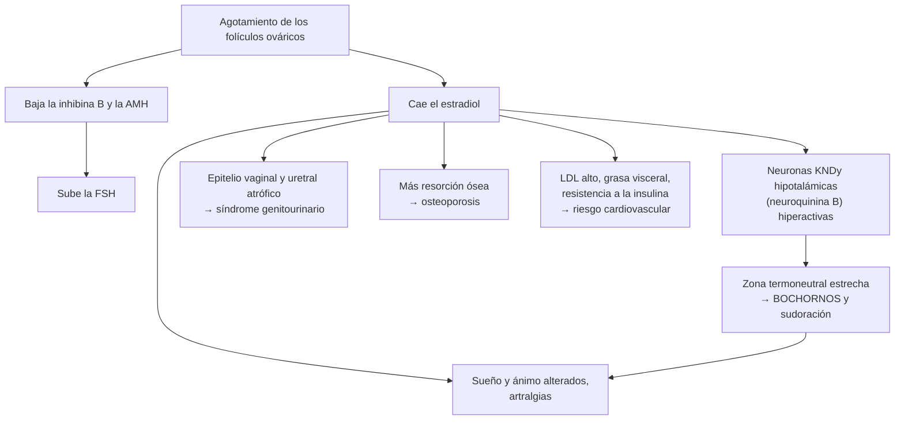
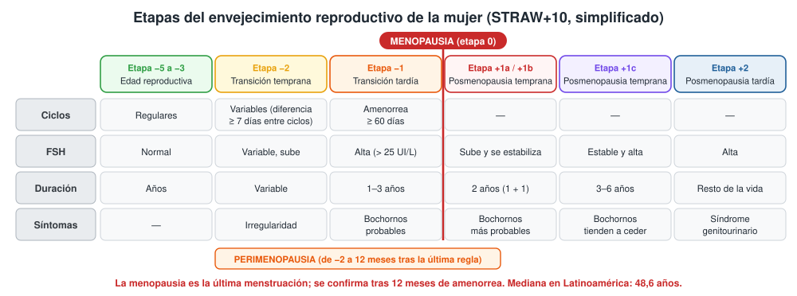
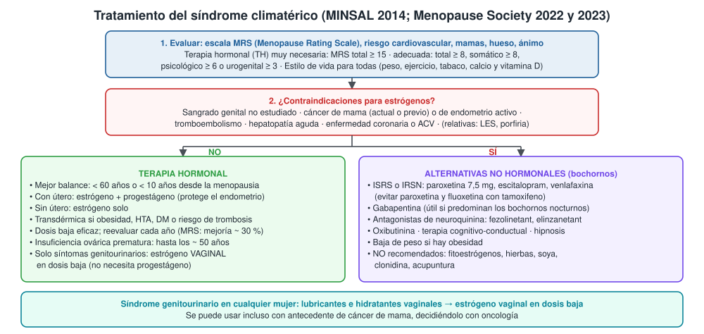

---
tags:
  - Endocrinología
---

# Síndrome climatérico y menopausia

**Subespecialidad**
Ginecología (climaterio) · Endocrinología · Medicina interna · Atención primaria

**Guías principales**
MINSAL 2014: orientaciones técnicas para la atención integral de la mujer en edad de climaterio en APS · The Menopause Society (ex-NAMS) 2022: terapia hormonal · The Menopause Society 2023: terapias no hormonales de los síntomas vasomotores

**Otras fuentes**
STRAW+10 (etapas del envejecimiento reproductivo, 2012) · WHI (2002 y seguimiento a 18 años, 2017) · SWAN (duración de los bochornos, 2015) · Fezolinetant (SKYLIGHT 1, 2023) y elinzanetant (OASIS 1 y 2, 2024) · Panel de expertos de la FDA y retiro de la advertencia de recuadro negro (2025) · Edad de la menopausia en Latinoamérica (REDLINC, 2006)

**GES**
No. El **control de climaterio** (45–64 años) es parte del Programa de Salud de la Mujer en la APS, con la escala MRS y terapia hormonal en el nivel primario.

**EUNACOM**
1.03.1.011 Síndrome climatérico (específico, completo, completo)

**Revisado**
Octubre 2026

!!! abstract "Resumen en 60 segundos"
    - **Menopausia**: última menstruación por agotamiento folicular; se confirma tras **12 meses de amenorrea**. Mediana en Latinoamérica: **48,6 años**.
        - **Climaterio**: período de transición que rodea a la menopausia.
        - **Prematura**: antes de los **40 años** (insuficiencia ovárica prematura). **Temprana**: entre los 40 y 45 años.
    - **Diagnóstico clínico** en la mujer **> 45 años** con síntomas típicos: **no se necesita FSH**.
    - **Síntomas**: **bochornos** y sudoración nocturna (la mayoría de las mujeres; duran una mediana de **7,4 años**), alteraciones del sueño y del ánimo, artralgias, **síndrome genitourinario** (sequedad vaginal, dispareunia, urgencia, ITU recurrente).
    - **Consecuencias a largo plazo**: **osteoporosis**, aumento del riesgo **cardiovascular** y cambios metabólicos.
    - **Evaluación en Chile**: escala **MRS** (Menopause Rating Scale).
        - Terapia hormonal **muy necesaria** con MRS total **≥ 15**.
        - **Adecuada** con total **≥ 8**, somático **≥ 8**, psicológico **≥ 6** o urogenital **≥ 3**.
    - **Terapia hormonal (TH)**: el tratamiento **más eficaz** de los bochornos y del síndrome genitourinario; previene la pérdida ósea.
        - Balance favorable si se inicia antes de los **60 años** o dentro de **10 años** de la menopausia.
        - **Con útero**: estrógeno **+ progestágeno**. **Sin útero**: estrógeno solo.
        - **Transdérmica** si hay obesidad, HTA, diabetes o riesgo de trombosis.
        - **Contraindicaciones**: cáncer de mama, sangrado no estudiado, tromboembolismo, enfermedad coronaria o ACV, hepatopatía aguda.
    - **Sin TH**: ISRS/IRSN (paroxetina 7,5 mg, escitalopram, venlafaxina), gabapentina, antagonistas de neuroquinina (fezolinetant, elinzanetant), terapia cognitivo-conductual.
    - **Síndrome genitourinario aislado**: **estrógeno vaginal** en dosis baja (no necesita progestágeno).

## Definición

- **Menopausia**: cese permanente de la menstruación por pérdida de la actividad folicular del ovario. Es un diagnóstico **retrospectivo**: se confirma tras **12 meses de amenorrea** sin otra causa.
- **Climaterio**: período de transición desde la etapa reproductiva hasta la no reproductiva; comienza con la disminución de la fertilidad y se extiende hasta la senectud.
- **Perimenopausia** (transición menopáusica): desde el inicio de la irregularidad menstrual hasta **12 meses después** de la última menstruación.
- **Posmenopausia**: desde la última menstruación en adelante.
- **Síndrome climatérico**: conjunto de síntomas (vasomotores, psicológicos, somáticos y urogenitales) asociados a la caída de los estrógenos, que **afectan la calidad de vida**.
- **Síndrome genitourinario de la menopausia**: síntomas y signos genitales (sequedad, ardor, dispareunia) y urinarios (urgencia, disuria, ITU recurrente) por el **hipoestrogenismo**. Antes se llamaba atrofia vulvovaginal.
- **Menopausia prematura** (insuficiencia ovárica prematura): antes de los **40 años**. **Temprana**: entre los **40 y 45 años**.
- **Menopausia inducida**: por ooforectomía bilateral, quimioterapia o radioterapia.

## Epidemiología

### Mundial

- La edad de la menopausia natural se sitúa alrededor de los **50 años** en los países de altos ingresos.
- **Bochornos**: los presenta la mayoría de las mujeres. En el estudio **SWAN** (Avis 2015):
    - La duración mediana de los bochornos frecuentes fue de **7,4 años**, y persistieron **4,5 años** después de la última regla.
    - Cuando comenzaban antes de la menopausia duraron **más de 11,8 años**.
    - Se asociaron a más duración: menor edad, menor nivel educacional, estrés, ansiedad y síntomas depresivos.
- **Síndrome genitourinario**: es **progresivo** y no mejora sin tratamiento; afecta a una gran proporción de las posmenopáusicas.
- **Terapia hormonal**: su uso cayó bruscamente tras el **WHI (2002)**. En noviembre de **2025**, la **FDA** recomendó **retirar la advertencia de recuadro negro** de los estrógenos, tras revisar 20 años de evidencia (en especial para el estrógeno vaginal).

### Chile

!!! chile "Datos nacionales"
    - **Edad de la menopausia** (REDLINC, 17.150 mujeres de 47 ciudades de 15 países latinoamericanos, incluido Chile): mediana de **48,6 años** (rango entre ciudades: 43,8 a 53 años). Fue más precoz en mujeres de menor nivel educacional, en países de menores ingresos y en ciudades sobre 2.000 metros de altura.
    - **Población objetivo**: el MINSAL define a las mujeres de **45 a 64 años** como grupo estratégico. Eran ~ **2,2 millones** en 2015 y se estimaban ~ **2,36 millones** en 2020.
    - **Cobertura**: el control de climaterio en el sistema público alcanzaba solo el **11,9 %** de este grupo (orientaciones técnicas 2014).
    - **Modelo chileno** (orientaciones técnicas MINSAL 2014):
        - La TH la indica un **médico capacitado de la APS** y la puede controlar una **matrona** capacitada, con supervisión médica.
        - Las mujeres sanas o de baja complejidad se tratan en la APS. La **HTA** y la **diabetes compensadas no contraindican** la TH (se prefiere la vía transdérmica).
        - Los casos con contraindicaciones se derivan al nivel secundario.
    - En la **ENS 2009–2010**, los síntomas depresivos del último año eran **3 veces** más frecuentes en las mujeres que en los hombres (**25,7 %** frente a 8,5 %). El climaterio es un período de mayor vulnerabilidad.

## Etiología y factores de riesgo

- **Menopausia natural**: **agotamiento de los folículos** ováricos, determinado por la genética (la edad de la menopausia de la madre) y por factores ambientales.
- **Adelantan la menopausia**: **tabaquismo**, nuliparidad, bajo nivel socioeconómico, vivir en la altura, quimioterapia, radioterapia pélvica, cirugía ovárica, enfermedades autoinmunes, alteraciones genéticas (Turner, premutación del FMR1).
- **Factores asociados a síntomas vasomotores más intensos o prolongados**: obesidad, tabaquismo, inicio precoz de los bochornos, ansiedad, depresión, estrés, menor nivel educacional, menopausia quirúrgica.

## Fisiopatología

- **Agotamiento folicular** → baja la **inhibina B** y la **hormona antimülleriana** → sube la **FSH** (primero en forma intermitente) → ciclos irregulares, primero cortos y luego largos, con **anovulación** frecuente.
    - Por eso en la perimenopausia puede haber **exceso relativo de estrógenos sin progesterona** → sangrado uterino anormal, hiperplasia endometrial, mastalgia.
- Tras la menopausia, el **estradiol cae** y la FSH y la LH quedan **altas**. El principal estrógeno pasa a ser la **estrona**, producida en el tejido graso a partir de los andrógenos suprarrenales.
- **Bochornos**: la caída del estrógeno **activa las neuronas KNDy** (kisspeptina, **neuroquinina B**, dinorfina) del hipotálamo, que **estrechan la zona termoneutral**. Pequeñas alzas de la temperatura central disparan la vasodilatación y la sudoración.
    - Es la base de los **antagonistas del receptor de neuroquinina 3** (fezolinetant) y de los receptores 1 y 3 (elinzanetant).
- **Hueso**: el hipoestrogenismo aumenta la resorción → pérdida ósea **acelerada** en los primeros años de la posmenopausia → osteoporosis.
- **Cardiometabólico**: aumentan el **colesterol LDL** y la grasa visceral y hay más resistencia a la insulina.
- **Tejido genitourinario**: el epitelio vaginal y uretral depende de los estrógenos → adelgazamiento, menos lubricación y elasticidad, pH vaginal alto y cambio de la flora (menos lactobacilos) → **ITU recurrente**.

*Figura 1. Fisiopatología del síndrome climatérico. Esquema propio basado en las declaraciones de The Menopause Society 2022 y 2023.*

## Clasificación

**Etapas del envejecimiento reproductivo (STRAW+10)**

<figure markdown>
{ loading=lazy }
<figcaption>Figura 2. Etapas del envejecimiento reproductivo de la mujer. Esquema propio simplificado a partir de STRAW+10 (Harlow 2012); la edad mediana de la menopausia corresponde a Latinoamérica (Castelo-Branco 2006).</figcaption>
</figure>

**Escala MRS (Menopause Rating Scale), usada en la APS chilena**

| Dominio | Síntomas que evalúa (11 en total, cada uno de 0 a 4 puntos) | Umbral para TH "adecuada" (MINSAL) |
|---|---|---|
| **Somático** | Bochornos y sudoración, molestias cardíacas (palpitaciones), trastornos del sueño, **molestias musculares y articulares** | **≥ 8** |
| **Psicológico** | Ánimo depresivo, irritabilidad, ansiedad, cansancio físico y mental | **≥ 6** |
| **Urogenital** | Problemas sexuales, problemas urinarios, sequedad vaginal | **≥ 3** |
| **Total** | Suma de los tres dominios (0–44) | **≥ 8** "adecuada" · **≥ 15** "muy necesaria" |

- Un puntaje **psicológico alto** con somático y urogenital **bajos** sugiere un problema de **salud mental** más que hormonal: evaluar depresión (GES de depresión si corresponde).

## Clínica

| Grupo | Síntomas |
|---|---|
| **Vasomotores** | **Bochornos** (calor súbito en cara y tórax, 1–5 minutos, con rubor y sudoración), **sudoración nocturna**, palpitaciones, escalofríos |
| **Menstruales** (perimenopausia) | Ciclos irregulares, más cortos y luego más largos; sangrado abundante; amenorrea |
| **Sueño y ánimo** | Insomnio, despertares nocturnos, irritabilidad, ánimo depresivo, ansiedad, dificultad de concentración y de memoria ("niebla mental") |
| **Musculoesqueléticos** | **Artralgias** y mialgias (síntoma muy frecuente en la población chilena según el MINSAL) |
| **Genitourinarios** | **Sequedad vaginal**, ardor, **dispareunia**, disminución de la libido, **urgencia**, disuria, **ITU recurrente**, incontinencia |
| **Piel y otros** | Piel seca y más delgada, caída del cabello, aumento de peso y de la grasa abdominal |
| **Silenciosos** | **Pérdida ósea** (osteoporosis), aumento del LDL y del riesgo cardiovascular |

- **Examen**: presión arterial, IMC y cintura, mamas, examen ginecológico (atrofia: mucosa pálida, delgada, sin pliegues, con petequias), tiroides.

!!! alarma "Signos de alarma: estudiar o derivar"
    - **Sangrado genital en la posmenopausia** (≥ 12 meses sin reglas): descartar **cáncer de endometrio** (ecografía transvaginal; biopsia si el endometrio está engrosado o el sangrado persiste).
    - Sangrado **muy abundante**, intermenstrual o poscoital en la perimenopausia.
    - **Nódulo mamario**, secreción por el pezón o mamografía alterada.
    - Bochornos en una mujer **< 40 años** (insuficiencia ovárica prematura) o con **pérdida de peso, diarrea, palpitaciones** (hipertiroidismo), **crisis hipertensivas** (feocromocitoma), **flushing con diarrea** (carcinoide).
    - **Depresión grave o ideación suicida**.
    - Con TH: **dolor o aumento de volumen de una pierna**, disnea súbita, dolor torácico, déficit neurológico → suspender y consultar en urgencia.

## Diagnóstico

!!! guia "Diagnóstico y evaluación (MINSAL 2014; The Menopause Society 2022)"
    - El diagnóstico de la menopausia y del síndrome climatérico es **clínico**: mujer **> 45 años** con alteración menstrual o amenorrea y síntomas típicos.
    - **No medir FSH ni estradiol** de rutina en mayores de 45 años. Sí pueden ser útiles:
        - Mujer **< 40 años** (insuficiencia ovárica prematura) o de 40–45 años con síntomas.
        - Mujer **histerectomizada** con ovarios (no tiene reglas que orienten).
        - Usuaria de anticonceptivos hormonales (la FSH es difícil de interpretar).
    - **Aplicar la escala MRS** para medir la intensidad y orientar el tratamiento; repetirla al año.
    - **Evaluación integral** antes de indicar TH:
        - Riesgo **cardiovascular** (PA, perfil lipídico, glicemia, tabaco, IMC).
        - **Mamas**: examen y **mamografía** según el programa nacional.
        - **Cuello uterino**: PAP o test de VPH según el programa.
        - **Hueso**: FRAX u ORAI; **densitometría** si el riesgo es alto (ORAI > 8 puntos).
        - **Ánimo**: tamizaje de depresión.
        - **TSH** si hay síntomas sugerentes.
    - Descartar otras causas de los síntomas: **hipertiroidismo**, fármacos (tamoxifeno, inhibidores de la aromatasa, análogos de GnRH), ansiedad, infecciones y, rara vez, feocromocitoma o carcinoide.

## Laboratorio

| Examen | Utilidad |
|---|---|
| **FSH** | **No es necesaria** después de los 45 años. **> 25 UI/L** en la mujer < 40 años con amenorrea = insuficiencia ovárica prematura. En la perimenopausia **fluctúa** mucho: un valor normal no la descarta |
| **Estradiol** | Muy variable en la perimenopausia; poco útil |
| **β-hCG** | Amenorrea en la perimenopausia: todavía puede haber ovulación |
| **TSH** | Hipertiroidismo (bochornos, palpitaciones) o hipotiroidismo (cansancio, ánimo) |
| **Perfil lipídico, glicemia** | Riesgo cardiovascular antes de la TH |
| **Pruebas hepáticas** | Antes del fezolinetant y en los primeros meses de uso |
| **Prolactina** | Si hay galactorrea o amenorrea sin síntomas vasomotores |

## Imágenes

- **Mamografía**: antes de iniciar la TH (si corresponde por edad) y luego según el programa nacional de cáncer de mama.
- **Ecografía transvaginal**: **sangrado posmenopáusico** o anormal (grosor endometrial), masa pélvica.
- **Densitometría ósea**: mujeres con factores de riesgo de osteoporosis o puntaje FRAX u ORAI alto; todas las de 65 años o más (ver [osteoporosis](osteoporosis.md)).

## Diagnóstico diferencial

| Cuadro | Claves para diferenciar |
|---|---|
| **Hipertiroidismo** | Taquicardia en reposo, baja de peso, temblor, bocio; **TSH baja** |
| **Embarazo** | Amenorrea con β-hCG positiva (posible en la perimenopausia) |
| **Insuficiencia ovárica prematura** | < 40 años, FSH > 25 UI/L (ver [amenorrea](hirsutismo-amenorrea-y-ovario-poliquistico.md)) |
| **Hiperprolactinemia** | Amenorrea con galactorrea; prolactina alta |
| **Fármacos** | Tamoxifeno, inhibidores de la aromatasa, análogos de GnRH, ISRS, opioides, niacina, bloqueadores de calcio |
| **Trastornos de ansiedad y depresión** | Pueden coexistir; MRS con dominio psicológico predominante |
| **Infecciones** (tuberculosis, VIH, endocarditis) | Sudoración nocturna con **fiebre**, baja de peso |
| **Linfoma** | Sudoración nocturna con fiebre, baja de peso y adenopatías |
| **Feocromocitoma, carcinoide** | Crisis con HTA y palpitaciones, o flushing con diarrea |
| **Vaginitis, ITU, liquen escleroso** | Síntomas genitourinarios con secreción, lesiones o cultivo positivo |

## Tratamiento

### Medidas generales (todas las mujeres)

- **Educación**: es una etapa normal; explicar los síntomas y las opciones.
- **Estilo de vida**: actividad física, alimentación saludable, **baja de peso** si hay obesidad (reduce los bochornos), dejar de **fumar**, moderar el alcohol.
- **Hueso**: calcio (dieta) y **vitamina D**; ejercicio con carga.
- **Factores de riesgo cardiovascular**: tratar la HTA, la dislipidemia y la diabetes.
- **Talleres grupales** y evaluación psicosocial (modelo de la APS chilena).

### Terapia hormonal

- **Indicaciones**:
    - **Síntomas vasomotores** molestos (la indicación principal).
    - **Síndrome genitourinario** (si es aislado, preferir el estrógeno **vaginal**).
    - **Prevención de la pérdida ósea** en mujeres con riesgo de fractura y síntomas.
    - **Menopausia prematura o temprana**: TH hasta al menos la edad promedio de la menopausia (~ 50 años), aunque no haya síntomas.
- **Momento de inicio** (The Menopause Society 2022):
    - **< 60 años** o **< 10 años** desde la menopausia, sin contraindicaciones: el balance beneficio-riesgo es **favorable**.
    - Inicio **> 60 años** o **> 10 años** después: más riesgo absoluto de enfermedad coronaria, ACV, tromboembolismo y demencia.
- **Esquemas**:
    - **Con útero**: estrógeno **+ progestágeno** (protege del cáncer de endometrio), cíclico o continuo.
    - **Sin útero** (histerectomizada): **estrógeno solo**.
    - **Vía transdérmica** (parche o gel) si hay **obesidad**, **HTA** tratada, **diabetes** estable o **riesgo de trombosis**: no aumenta el tromboembolismo como la vía oral.
    - **Tibolona**: alternativa con efecto estrogénico, progestagénico y androgénico.
- **Duración**: individualizada; **no hay un límite fijo** de años. Reevaluar **cada año** el beneficio y el riesgo, idealmente con la menor dosis eficaz.
- **Contraindicaciones** (MINSAL 2014 y The Menopause Society 2022):
    - **Absolutas**: sangrado genital **no estudiado**, **cáncer de mama** actual o previo, **cáncer de endometrio** activo, **tromboembolismo** venoso (o embolia pulmonar), **hepatopatía aguda**, **enfermedad coronaria o ACV**.
    - **Relativas**: antecedente de tromboembolismo, lupus, porfiria, hipertrigliceridemia grave (preferir la vía transdérmica).
- **Riesgos** (WHI 2002, estrógeno + progestágeno en mujeres de 50–79 años, edad media 63 años): por cada **10.000 mujeres al año**, **8 cánceres de mama**, 8 ACV, 8 embolias pulmonares y 7 eventos coronarios **más**, y **6 cánceres colorrectales** y **5 fracturas de cadera menos**.
    - En el seguimiento a **18 años** no aumentó la mortalidad total, cardiovascular ni por cáncer.
    - El efecto sobre la mortalidad fue **más favorable** en las mujeres de **50–59 años** que en las de 70–79 años.
- **Cuándo suspender** (MINSAL): sangrado anómalo, efectos adversos (mastalgia, cefalea), cáncer hormonodependiente, trombosis venosa, evento arterial, o si los riesgos superan a los beneficios.

### Tratamiento no hormonal de los bochornos (The Menopause Society 2023)

- **Recomendados**:
    - **ISRS o IRSN**: paroxetina 7,5 mg, escitalopram, citalopram, venlafaxina, desvenlafaxina. **Evitar paroxetina y fluoxetina con tamoxifeno**: inhiben su activación.
    - **Gabapentina** (útil si los síntomas son nocturnos; produce somnolencia).
    - **Fezolinetant** (antagonista del receptor de neuroquinina 3) y **elinzanetant** (antagonista de neuroquinina 1 y 3), donde estén disponibles.
    - **Oxibutinina**.
    - **Terapia cognitivo-conductual** e **hipnosis clínica**.
    - **Baja de peso**.
- **No recomendados**: **fitoestrógenos y soya**, suplementos y hierbas, respiración pautada, acupuntura, yoga, **clonidina**, pregabalina, cannabinoides.

### Síndrome genitourinario

- **Primera línea**: **hidratantes** vaginales de uso regular y **lubricantes** en las relaciones sexuales.
- Si no basta: **estrógeno vaginal en dosis baja** (estriol en crema u óvulos, estradiol en tabletas vaginales). **No necesita progestágeno**.
    - Se puede usar en sobrevivientes de cáncer de mama, decidiéndolo con el oncólogo.
- Alternativas: DHEA vaginal (prasterona) u ospemifeno oral, donde estén disponibles.

<figure markdown>
{ loading=lazy }
<figcaption>Figura 3. Tratamiento del síndrome climatérico. Esquema propio basado en las orientaciones técnicas MINSAL 2014 y en las declaraciones de The Menopause Society 2022 (terapia hormonal) y 2023 (terapias no hormonales).</figcaption>
</figure>

!!! dosis "Dosis de referencia (orientaciones técnicas MINSAL 2014, salvo indicación)"
    | Fármaco | Dosis | Observaciones |
    |---|---|---|
    | **Estradiol micronizado** o **valerato de estradiol** (oral) | **1 mg/día** | Con progestágeno si tiene útero |
    | **Estrógenos conjugados** (oral) | **0,3–0,4 mg/día** | Con progestágeno si tiene útero |
    | **Estradiol transdérmico** | Gel **0,5–0,75 mg/día**; parche de 50 µg/día | Preferir en obesidad, HTA, diabetes o riesgo de trombosis |
    | **Progesterona micronizada** | **200 mg/noche por 10–14 días** al mes (cíclico) o **100 mg/noche** continuo | Oral o vaginal; protege el endometrio |
    | **Didrogesterona** | 10–20 mg/día por 10–14 días (cíclico) o 5 mg/día continuo | |
    | **Acetato de medroxiprogesterona** | 5–10 mg/día por 10–14 días (cíclico) o 2,5 mg/día continuo | MINSAL: uso menor de 5 años |
    | **DIU con levonorgestrel** (20 µg/día) | Por 5 años | Protección endometrial y anticoncepción en la perimenopausia |
    | **Tibolona** | **2,5 mg/día** continuo | No usar en la perimenopausia (sangrado) |
    | **Estriol vaginal** (crema u óvulos) o **estradiol vaginal** | Diario por 2 semanas, luego 2 veces por semana | Síndrome genitourinario |
    | **Paroxetina** | **7,5 mg/día** (dosis aprobada para bochornos) | Evitar con tamoxifeno |
    | **Venlafaxina** | 37,5–75 mg/día | Útil con tamoxifeno |
    | **Escitalopram** | 10–20 mg/día | |
    | **Gabapentina** | 300 mg en la noche; subir hasta 900 mg/día | Somnolencia, mareo |
    | **Fezolinetant** | 45 mg/día | Medir transaminasas antes y en los primeros meses |

## Complicaciones

- **Osteoporosis** y fracturas por fragilidad (vertebrales, de cadera, de muñeca).
- **Enfermedad cardiovascular**: tras la menopausia aumenta el riesgo coronario; la menopausia **prematura** o **temprana** lo aumenta más.
- **Síndrome genitourinario**: dispareunia, disfunción sexual, **ITU recurrente**, incontinencia.
- **Alteraciones del sueño y del ánimo**: insomnio, depresión.
- **De la terapia hormonal**: tromboembolismo venoso (sobre todo oral), ACV, cáncer de mama (estrógeno + progestágeno, con más años de uso), cáncer de endometrio si se usa estrógeno solo en una mujer con útero, colelitiasis, mastalgia, sangrado.

## Pronóstico y seguimiento

- Los bochornos suelen **ceder con los años**, pero en muchas mujeres duran **más de 7 años**; el síndrome genitourinario **progresa** si no se trata.
- **Control al menos una vez al año** (MINSAL):
    - Repetir la **MRS al año**: con TH se espera una mejoría de **~ 30 %** del puntaje; si es menor, reevaluar. La mejoría demora desde **20 días** hasta algunos meses.
    - Buscar **nuevas contraindicaciones**, efectos adversos y sangrados anormales.
    - Mamografía según el programa; presión arterial, peso, perfil lipídico y glicemia.
    - Reevaluar el riesgo de fractura.
- **Suspender la TH**: no hay una edad obligatoria. Se puede disminuir en forma gradual o suspender de una vez (los síntomas pueden reaparecer en cualquiera de los dos casos).

## Perlas para el internado

!!! perla "Para recordar en la sala"
    - Mujer **> 45 años** con bochornos e irregularidad menstrual: el diagnóstico es **clínico**; **no pedir FSH**.
    - **Sangrado en la posmenopausia = cáncer de endometrio hasta demostrar lo contrario**: ecografía transvaginal.
    - **Con útero, nunca estrógeno solo**: siempre con progestágeno (o DIU con levonorgestrel).
    - El estrógeno **vaginal** en dosis baja **no** necesita progestágeno y se puede usar casi siempre.
    - **Ventana de oportunidad**: la TH es más segura si se inicia **antes de los 60 años** o en los primeros **10 años** de la menopausia.
    - HTA o diabetes **compensadas** no contraindican la TH: preferir la **vía transdérmica**.
    - **Menopausia antes de los 40 años**: hay que dar TH hasta los ~ 50 años, aunque no tenga síntomas (hueso, corazón, cerebro).
    - Con **tamoxifeno**: para los bochornos usar **venlafaxina** o gabapentina, no paroxetina ni fluoxetina.
    - Los **fitoestrógenos** y la soya **no** son eficaces para los bochornos.
    - En la perimenopausia todavía hay ovulaciones: **anticoncepción** hasta 12 meses de amenorrea (o 2 años si es menor de 50).

## Preguntas de repaso

??? repaso "1. Mujer de 51 años con 8 meses de amenorrea, 10 bochornos diarios, insomnio y artralgias. MRS total 18 (somático 10). Sana, no fuma, PA 124/78 mmHg, IMC 26. Tiene útero. ¿Qué le ofrece?"
    - **Síndrome climatérico** con MRS ≥ 15: TH **muy necesaria** (MINSAL). No necesita FSH.
    - Está en la **ventana favorable** (< 60 años, < 10 años de la menopausia) y no tiene contraindicaciones.
    - **Antes**: mamografía según el programa, perfil lipídico, glicemia; revisar el PAP o el test de VPH.
    - **TH con útero**: estradiol 1 mg/día oral (o transdérmico) **+ progesterona micronizada** 200 mg/noche por 12–14 días al mes (o 100 mg continuo).
    - **Control al año** con MRS (se espera ~ 30 % de mejoría) y evaluación de nuevas contraindicaciones.

??? repaso "2. Mujer de 54 años, hipertensa en tratamiento (PA 132/82 mmHg) y con IMC 33, con bochornos intensos que no la dejan dormir. ¿Puede usar terapia hormonal? ¿Qué vía prefiere?"
    - **Sí**: la HTA **controlada** y la obesidad **no son contraindicaciones** (MINSAL).
    - Preferir **estradiol transdérmico** (gel 0,5–0,75 mg/día o parche de 50 µg/día), que no aumenta el riesgo de trombosis como la vía oral.
    - Si tiene útero: agregar **progestágeno** (progesterona micronizada).
    - Además: baja de peso, actividad física y control del riesgo cardiovascular.

??? repaso "3. Mujer de 49 años con cáncer de mama tratado, en tratamiento con tamoxifeno, con bochornos intensos. ¿Qué indica?"
    - La **TH sistémica está contraindicada** (cáncer de mama).
    - **No hormonal**: **venlafaxina** (37,5–75 mg/día) o **gabapentina**. **Evitar paroxetina y fluoxetina**: inhiben el CYP2D6 y reducen la activación del tamoxifeno.
    - Otras opciones: terapia cognitivo-conductual, oxibutinina; los antagonistas de neuroquinina, según disponibilidad y con el oncólogo.
    - **No** usar fitoestrógenos ni soya.

??? repaso "4. Mujer de 62 años con dispareunia, sequedad vaginal y 3 ITU en el último año. No tiene bochornos. ¿Qué tratamiento le da?"
    - **Síndrome genitourinario de la menopausia**.
    - **Hidratantes vaginales** de uso regular y **lubricantes** en las relaciones.
    - **Estrógeno vaginal en dosis baja** (estriol en crema u óvulos): diario por 2 semanas y luego 2 veces por semana. **No necesita progestágeno** y reduce las ITU recurrentes.
    - No necesita TH sistémica: no tiene síntomas vasomotores (además, a los 62 años y > 10 años de la menopausia, el balance de la TH sistémica es menos favorable).

??? repaso "5. Mujer de 57 años usuaria de TH combinada consulta por un sangrado genital escaso por 2 semanas, fuera del patrón esperado. ¿Qué hace?"
    - Sangrado **no esperado** en la posmenopausia con TH: hay que descartar **patología endometrial** (hiperplasia, pólipo, **cáncer**).
    - **Ecografía transvaginal** (grosor endometrial) y derivar a ginecología; **biopsia endometrial** si el endometrio está engrosado o el sangrado persiste.
    - Revisar la **adherencia al progestágeno** y el esquema.
    - El MINSAL indica **suspender la TH** ante un flujo rojo anómalo hasta aclarar la causa.

??? repaso "6. Mujer de 36 años con amenorrea de 6 meses y bochornos. FSH 72 UI/L en dos ocasiones. ¿Es un síndrome climatérico habitual? ¿Qué cambia en el manejo?"
    - Es una **insuficiencia ovárica prematura** (< 40 años), no una menopausia habitual.
    - Estudiar la causa: **cariotipo**, **premutación del FMR1**, anticuerpos anti-21-hidroxilasa, TSH; densitometría.
    - **TH en dosis de reemplazo completo** (estradiol 2 mg oral o 100 µg transdérmico + progestágeno) **hasta los ~ 50 años**, aunque no tenga síntomas: protege el hueso, el corazón y la cognición.
    - Puede haber ovulaciones esporádicas: anticoncepción si no desea embarazarse (ver [amenorrea](hirsutismo-amenorrea-y-ovario-poliquistico.md)).

## Referencias

1. Ministerio de Salud de Chile. Orientaciones técnicas para la atención integral de la mujer en edad de climaterio en el nivel primario de la red de salud (APS). Santiago: MINSAL; 2014. [minsal.cl](https://www.minsal.cl/wp-content/uploads/2015/09/OTCLIMATERIOinteriorValenteindd04022014.pdf)
2. The 2022 hormone therapy position statement of The North American Menopause Society. *Menopause.* 2022;29(7):767–794. doi:[10.1097/GME.0000000000002028](https://doi.org/10.1097/GME.0000000000002028)
3. The 2023 nonhormone therapy position statement of The North American Menopause Society. *Menopause.* 2023;30(6):573–590. doi:[10.1097/GME.0000000000002200](https://doi.org/10.1097/GME.0000000000002200)
4. Harlow SD, Gass M, Hall JE, et al. Executive summary of the Stages of Reproductive Aging Workshop + 10: addressing the unfinished agenda of staging reproductive aging. *J Clin Endocrinol Metab.* 2012;97(4):1159–1168. doi:[10.1210/jc.2011-3362](https://doi.org/10.1210/jc.2011-3362)
5. Rossouw JE, Anderson GL, Prentice RL, et al. Risks and benefits of estrogen plus progestin in healthy postmenopausal women: principal results from the Women's Health Initiative randomized controlled trial. *JAMA.* 2002;288(3):321–333. doi:[10.1001/jama.288.3.321](https://doi.org/10.1001/jama.288.3.321)
6. Manson JE, Aragaki AK, Rossouw JE, et al. Menopausal hormone therapy and long-term all-cause and cause-specific mortality: the Women's Health Initiative randomized trials. *JAMA.* 2017;318(10):927–938. doi:[10.1001/jama.2017.11217](https://doi.org/10.1001/jama.2017.11217)
7. Avis NE, Crawford SL, Greendale G, et al. Duration of menopausal vasomotor symptoms over the menopause transition. *JAMA Intern Med.* 2015;175(4):531–539. doi:[10.1001/jamainternmed.2014.8063](https://doi.org/10.1001/jamainternmed.2014.8063)
8. Lederman S, Ottery FD, Cano A, et al. Fezolinetant for treatment of moderate-to-severe vasomotor symptoms associated with menopause (SKYLIGHT 1): a phase 3 randomised controlled study. *Lancet.* 2023;401(10382):1091–1102. doi:[10.1016/S0140-6736(23)00085-5](https://doi.org/10.1016/S0140-6736(23)00085-5)
9. Pinkerton JV, Simon JA, Joffe H, et al. Elinzanetant for the treatment of vasomotor symptoms associated with menopause: OASIS 1 and 2 randomized clinical trials. *JAMA.* 2024;332(16):1343–1354. doi:[10.1001/jama.2024.14618](https://doi.org/10.1001/jama.2024.14618)
10. Pinkerton JV, Simon JA, Hodis HN, et al. Report of the FDA's expert panel on hormone therapy. *Menopause.* 2026;33(10):1118–1126. doi:[10.1097/GME.0000000000002768](https://doi.org/10.1097/GME.0000000000002768)
11. Castelo-Branco C, Blümel JE, Chedraui P, et al. Age at menopause in Latin America. *Menopause.* 2006;13(4):706–712. doi:[10.1097/01.gme.0000227338.73738.2d](https://doi.org/10.1097/01.gme.0000227338.73738.2d)
