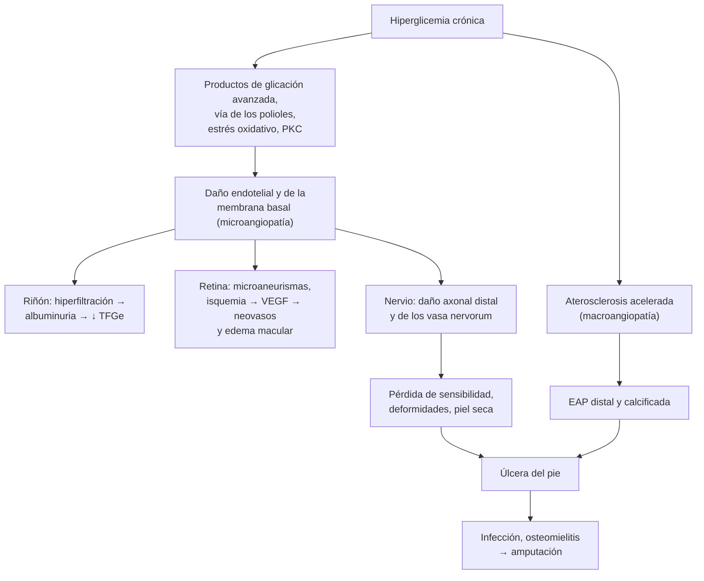

---
tags:
  - Endocrinología
  - GES
  - Frecuente en sala
---

# Complicaciones crónicas de la diabetes: nefropatía, retinopatía, neuropatía, enfermedad arterial periférica y pie diabético

**Subespecialidad**
Endocrinología · Nefrología · Oftalmología · Neurología · Cirugía vascular

**Guías principales**
ADA Standards of Care 2026 (secciones 11 y 12) · KDIGO 2022: diabetes en la ERC · Declaración de posición ADA 2017: neuropatía diabética · IWGDF 2023: pie diabético · ESC 2024: enfermedad arterial periférica

**Otras fuentes**
Ensayos FIDELIO-DKD (finerenona, 2020) y FLOW (semaglutida, 2024) · Infección de pie diabético en Chile (Fica 2026)

**GES**
**Diabetes mellitus tipo 2** (incluye el pie diabético) · **Retinopatía diabética (GES 31)** · ERC: prevención secundaria y etapas 4–5

**EUNACOM**
1.02.1.010 Nefropatía incipiente (específico, completo, completo) · 1.02.1.011 Neuropatía diabética (sospecha, inicial, derivar) · 1.02.1.015 Retinopatía diabética (sospecha, inicial, derivar) · 1.02.1.019 Vasculopatía periférica (sospecha, inicial, derivar)

**Revisado**
Septiembre 2026

!!! abstract "Resumen en 60 segundos"
    - Las complicaciones crónicas son **microvasculares** (nefropatía, retinopatía, neuropatía) y **macrovasculares** (coronaria, cerebrovascular, **arterial periférica**). Se **buscan activamente**: son silentes hasta etapas avanzadas.
    - **Tamizaje anual** en la DM2 desde el diagnóstico (en la DM1, desde los 5 años de evolución):
        - **TFGe** y **razón albúmina/creatinina** (RAC).
        - **Fondo de ojo** (cada 1–2 años si es normal).
        - **Examen del pie**: monofilamento, pulsos, piel.
    - **Nefropatía incipiente** = **RAC 30–300 mg/g** (albuminuria moderada) confirmada en 2 de 3 muestras.
        - Tratamiento: **IECA o ARA-II** en dosis máxima tolerada + **iSGLT2** (TFGe ≥ 20).
        - Si persiste la albuminuria: **finerenona** o **semaglutida**. Meta de PA **< 130/80**.
    - **Retinopatía**: no proliferativa → **proliferativa** y **edema macular**. Derivar a oftalmología (**GES 31**): anti-VEGF, láser, vitrectomía.
    - **Neuropatía**:
        - **Polineuropatía distal simétrica** "en calcetín" (hasta la mitad de los diabéticos). Pérdida de la **sensibilidad protectora** = riesgo de **úlcera**.
        - Dolor: **pregabalina, duloxetina, gabapentina** o amitriptilina.
        - Descartar el **déficit de B12** (metformina).
    - **Enfermedad arterial periférica**: claudicación, pulsos ausentes, **índice tobillo-brazo ≤ 0,90** (en diabéticos puede ser falsamente alto: usar el índice dedo-brazo).
        - Tratamiento: **estatina, antiagregante, dejar de fumar** y **ejercicio supervisado**.
        - **Isquemia crítica** (dolor de reposo, úlcera, gangrena) = **derivación urgente**.
    - **Pie diabético**: clasificar el riesgo (IWGDF 0–3) en cada control. Úlcera = **descarga**, desbridamiento, tratar la infección y la isquemia. En Chile, el **85,7 %** de los hospitalizados por infección del pie terminó en **amputación** (Fica 2026).

## Definición

| Complicación | Definición |
|---|---|
| **Enfermedad renal diabética** | ERC atribuida a la diabetes: **albuminuria** persistente y/o **TFGe < 60** por ≥ 3 meses |
| **Nefropatía incipiente** | Término clásico para la **albuminuria moderada** (**RAC 30–300 mg/g**, antes "microalbuminuria"), con TFGe habitualmente conservada |
| **Retinopatía diabética** | Microangiopatía de la retina: **no proliferativa** (microaneurismas, hemorragias, exudados), **proliferativa** (neovasos) y **edema macular** |
| **Polineuropatía diabética** | Daño simétrico, distal y dependiente de la longitud de los nervios sensitivos y motores, tras descartar otras causas |
| **Neuropatía autonómica** | Compromiso del sistema nervioso autónomo: cardiovascular, gastrointestinal, genitourinario, sudomotor |
| **Enfermedad arterial periférica (EAP)** | Aterosclerosis de las arterias de las extremidades inferiores; en la diabetes es **distal** (infrapoplítea) y calcificada |
| **Pie diabético** | Infección, ulceración o destrucción de los tejidos del pie asociada a **neuropatía** y/o **EAP** en una persona con diabetes |
| **Isquemia crítica (amenazante) de la extremidad** | EAP con **dolor de reposo**, **úlcera** o **gangrena** |

## Epidemiología

### Mundial

- La diabetes es la **principal causa de ERC terminal**, de **ceguera** en la edad laboral y de **amputación no traumática** de las extremidades inferiores.
- La **polineuropatía** afecta hasta a la **mitad** de las personas con diabetes de larga evolución (ADA 2017); muchos son **asintomáticos**.
- La **úlcera del pie** precede a la mayoría de las amputaciones. Tras una úlcera, la recurrencia es muy frecuente: por eso el pie en **remisión** requiere un seguimiento estrecho (IWGDF 2023).
- **FIDELIO-DKD** (5.734 pacientes con DM2 y ERC): la **finerenona** redujo el resultado renal compuesto (HR **0,82**).
- **FLOW** (3.533 pacientes con DM2 y ERC): la **semaglutida** redujo el resultado renal principal en **24 %** (HR **0,76**) y la mortalidad cardiovascular.

### Chile

!!! chile "Datos nacionales"
    - **Diabetes**: **12,3 %** de los adultos (ENS 2016–2017). La **nefropatía diabética** es la **principal causa de ingreso a diálisis** (~ 35–45 % de los pacientes; ver [ERC](../nefrologia/enfermedad-renal-cronica.md)).
    - **Infección del pie diabético** en un centro chileno, 2017–2022 (126 pacientes con cultivos intraoperatorios; Fica 2026):
        - El **85,7 %** requirió una **amputación**; la estadía mediana fue de **14 días**.
        - El **54 %** se rehospitalizó en el primer año, y el **37 %** murió en un seguimiento mediano de 33 meses (la mayoría por causas no infecciosas).
        - Predominaron los **cocos grampositivos** (93 %) en los pacientes sin amputación previa, y los **bacilos gramnegativos** (52 %), con más resistencia, en los ya amputados.
    - **GES**:
        - **DM2** incluye la **curación avanzada del pie diabético**.
        - **Retinopatía diabética (GES 31)**, desde la sospecha: confirmación en **≤ 90 días**; tratamiento en **≤ 30 días** si es proliferativa y en **≤ 60 días** si no lo es.
        - **ERC**: prevención secundaria y terapia de reemplazo renal en las etapas 4–5.

## Etiología y factores de riesgo

| Complicación | Factores de riesgo |
|---|---|
| **Todas las microvasculares** | **Duración** de la diabetes, **mal control glicémico** (HbA1c alta), **HTA**, tabaquismo, dislipidemia, predisposición genética |
| **Nefropatía** | Además: **obesidad**, antecedente familiar de ERC, raza, ingesta alta de sal y proteínas |
| **Retinopatía** | Además: **embarazo**, pubertad, **descenso rápido de la HbA1c** (empeoramiento transitorio), nefropatía, anemia |
| **Neuropatía** | Además: talla alta, **alcohol**, déficit de **vitamina B12** (metformina), hipotiroidismo, ERC |
| **EAP** | **Tabaquismo** (el más potente), edad, HTA, dislipidemia, ERC |
| **Úlcera del pie** | **Pérdida de sensibilidad protectora**, **EAP**, **deformidades**, úlcera o amputación previa, **ERC terminal**, mala visión, calzado inadecuado, vivir solo |

## Fisiopatología

*Figura 1. Mecanismos de las complicaciones crónicas de la diabetes y del pie diabético. Esquema propio.*

- **Riñón**: la hiperglicemia produce **hiperfiltración** glomerular (dilatación de la arteriola aferente), luego engrosamiento de la membrana basal y **expansión mesangial** (glomeruloesclerosis de Kimmelstiel-Wilson), **albuminuria** y caída de la TFGe.
    - Los **IECA/ARA-II** y los **iSGLT2** reducen la presión intraglomerular.
    - La **finerenona** bloquea la inflamación y la fibrosis mediadas por el receptor de mineralocorticoides.
- **Retina**: la pérdida de pericitos y la oclusión capilar causan **isquemia**, que libera **VEGF** y produce **neovasos** frágiles (hemorragia vítrea, desprendimiento traccional) y aumento de la permeabilidad (**edema macular**). De ahí el uso de los **anti-VEGF**.
- **Nervio**: el daño metabólico y microvascular afecta primero a las fibras **más largas**: distribución "en calcetín y guante".
- **Pie**: la **neuropatía** (sensitiva, motora y autonómica: piel seca y agrietada) más la **isquemia** y los traumatismos que el paciente no siente llevan a la **úlcera**, la infección y la amputación.

## Clasificación

**Enfermedad renal: TFGe (G1–G5) × albuminuria (KDIGO)**

| Categoría | RAC (mg/g) | Término |
|---|---|---|
| **A1** | < 30 | Normal o levemente aumentada |
| **A2** | **30–300** | **Moderadamente aumentada** ("nefropatía incipiente") |
| **A3** | > 300 | Gravemente aumentada |

**Retinopatía diabética**

| Etapa | Hallazgos | Conducta |
|---|---|---|
| **Sin retinopatía** | Fondo de ojo normal | Control cada 1–2 años |
| **No proliferativa leve** | Solo microaneurismas | Control anual |
| **No proliferativa moderada** | Más que leve, menos que grave | Control en 6–12 meses |
| **No proliferativa grave** (regla 4-2-1) | Hemorragias en **4** cuadrantes, rosarios venosos en **2**, o anomalías microvasculares intrarretinianas en **1** | Oftalmología pronto; considerar el láser |
| **Proliferativa** | **Neovasos**, hemorragia vítrea o prerretiniana | Tratamiento urgente: **panfotocoagulación** o anti-VEGF |
| **Edema macular** (en cualquier etapa) | Engrosamiento o exudados en la mácula; OCT | **Anti-VEGF** intravítreo si compromete el centro |

**Neuropatía diabética**: **polineuropatía distal simétrica** (la más frecuente) · **autonómica** · **mononeuropatías** (III par con pupila respetada, túnel carpiano, peroneo) · **radiculoplexopatía lumbosacra** (amiotrofia diabética: dolor y debilidad proximal del muslo con baja de peso).

**Enfermedad arterial periférica**: asintomática · **claudicación intermitente** · **isquemia crítica** (dolor de reposo, úlcera, gangrena). **Índice tobillo-brazo (ITB)**: normal 1,00–1,40 · **≤ 0,90 = EAP** · **> 1,40 = arterias no compresibles** (calcificadas; usar el índice dedo-brazo, anormal < 0,70).

**Pie diabético**:

- **Riesgo IWGDF 0–3** (Figura 2).
- Úlceras: clasificación de **Wagner** (0–5, muy usada en Chile) o **SINBAD**.
- Infección **leve, moderada o grave** (IWGDF/IDSA).

## Clínica

- **Nefropatía**: **asintomática** hasta etapas avanzadas; luego HTA, edema, síndrome nefrótico, síntomas urémicos.
- **Retinopatía**: asintomática hasta el **edema macular** (visión borrosa) o la **hemorragia vítrea** (pérdida brusca de la visión, "moscas volantes").
- **Polineuropatía**:
    - **Síntomas positivos**: **dolor urente**, parestesias, alodinia, peor en la **noche**.
    - **Negativos**: hipoestesia "en calcetín", pérdida de la vibración y la propiocepción, arreflexia aquiliana, **inestabilidad** (caídas).
    - Pie **insensible**: úlceras indoloras en las zonas de apoyo.
- **Neuropatía autonómica**:
    - **Taquicardia de reposo**, **hipotensión ortostática** (ver [caídas](../geriatria/caidas-hipotension-ortostatica-y-fractura-de-cadera.md)), isquemia silente.
    - **Gastroparesia** (saciedad precoz, vómitos, glicemias erráticas), diarrea o constipación.
    - **Disfunción eréctil**, **vejiga neurogénica** (retención, ITU).
    - Anhidrosis de los pies, **hipoglicemias inadvertidas**.
- **EAP**:
    - **Claudicación** de la pantorrilla que cede con el reposo (muchos diabéticos no la tienen por la neuropatía).
    - **Pulsos** disminuidos o ausentes, piel fría, pálida, sin vello, uñas gruesas, **llene capilar lento**, palidez a la elevación.
    - **Isquemia crítica**: dolor de reposo nocturno que mejora al colgar el pie, úlceras dolorosas en los dedos o el talón, **gangrena**.
- **Pie diabético**:
    - **Úlcera neuropática**: plantar, en zonas de presión, indolora, con **callo** alrededor, pie caliente con pulsos.
    - **Úlcera isquémica**: en los bordes y los dedos, dolorosa, pie frío sin pulsos.
    - **Infección**: eritema, calor, secreción, crepitación, fiebre (a menudo ausente). Una **sonda que toca el hueso** sugiere **osteomielitis**.
    - **Pie de Charcot agudo**: pie **caliente, rojo e hinchado**, sin herida, en un paciente con neuropatía; se confunde con una celulitis o una TVP.

<figure markdown>
![A la izquierda, la planta del pie derecho con tres puntos rojos donde se aplica el monofilamento de 10 gramos: el pulpejo del ortejo mayor y las cabezas del primer y del quinto metatarsiano. Al centro, lo que se examina cada año: la sensibilidad protectora con el monofilamento, aplicado perpendicular hasta que se curva durante 1 a 2 segundos sin que el paciente mire; más una prueba adicional (diapasón de 128 Hz en el dorso del ortejo mayor, pinchazo, reflejo aquiliano o sensibilidad térmica); la enfermedad arterial (pulsos pedio y tibial posterior, claudicación, índice tobillo-brazo, y dedo-brazo si el índice tobillo-brazo es mayor de 1,4); y la piel, las uñas y las deformidades (callos, grietas, micosis, dedos en garra, hallux valgus, pie de Charcot, calzado). A la derecha, las categorías de riesgo IWGDF: 0 muy bajo (sin pérdida de sensibilidad protectora ni enfermedad arterial), control anual; 1 bajo (pérdida de sensibilidad o enfermedad arterial), cada 6 a 12 meses; 2 moderado (pérdida de sensibilidad más enfermedad arterial, o cualquiera de ellas más deformidad), cada 3 a 6 meses; 3 alto (pérdida de sensibilidad o enfermedad arterial más úlcera o amputación previa, o ERC terminal), cada 1 a 3 meses](../assets/figuras/diabetes/examen-pie-diabetico.svg){ loading=lazy }
<figcaption>Figura 2. Examen anual del pie diabético y categorías de riesgo IWGDF con la frecuencia de control. Esquema propio basado en las guías prácticas IWGDF 2023 (Schaper 2024).</figcaption>
</figure>

## Diagnóstico

!!! guia "Tamizaje de las complicaciones crónicas (ADA 2026)"
    | Complicación | DM2 | DM1 | Examen |
    |---|---|---|---|
    | **Nefropatía** | Al diagnóstico y **anual** | Desde los 5 años de evolución, anual | **TFGe + RAC** en orina aislada |
    | **Retinopatía** | Al diagnóstico | En los primeros 5 años | **Fondo de ojo dilatado** o **retinografía**; luego cada **1–2 años** si es normal, anual si hay retinopatía. En el **embarazo**: antes y en cada trimestre |
    | **Neuropatía y pie** | Al diagnóstico y **anual** | Desde los 5 años de evolución | **Monofilamento de 10 g** + otra prueba, pulsos, inspección (Figura 2) |
    | **EAP** | Anamnesis y pulsos en cada control | Igual | **ITB** si hay síntomas, pulsos disminuidos o factores de riesgo |

- **Albuminuria**: confirmar con **2 de 3** muestras alteradas en 3–6 meses. Pueden elevarla transitoriamente el **ejercicio**, la **fiebre**, la **ITU**, la IC, la hiperglicemia marcada y la menstruación.
- **Sospechar otra causa de ERC** (derivar a nefrología) si:
    - La albuminuria aparece **sin retinopatía** o de forma **brusca**, o hay **síndrome nefrótico**.
    - Hay **hematuria** activa, caída rápida de la TFGe o menos de 5 años de evolución en la DM1.
- **Neuropatía**: el diagnóstico es **clínico**. Descartar otras causas: déficit de **B12**, **hipotiroidismo**, **alcohol**, ERC, VIH, fármacos, paraproteinemias. La electromiografía se reserva para los casos atípicos (asimetría, predominio motor, progresión rápida).
- **EAP**: **ITB ≤ 0,90** confirma; si es > 1,40, **índice dedo-brazo** o presión en el ortejo. **Eco-Doppler arterial** para localizar las lesiones; angio-TC o angiografía antes de revascularizar.
- **Osteomielitis del pie**: **sonda que toca el hueso**, **radiografía** (puede ser normal al inicio), **VHS o PCR** altas, **RM**; biopsia ósea para el cultivo.

## Laboratorio

| Examen | Utilidad |
|---|---|
| **HbA1c** | Control glicémico (meta habitual < 7 %, individualizada) |
| **Creatinina, TFGe** y **RAC** | Nefropatía; dosis de fármacos |
| **Potasio** | Antes y 2–4 semanas después de iniciar IECA, ARA-II o finerenona |
| **Perfil lipídico** | Meta de LDL según el riesgo (casi todos son de alto o muy alto riesgo) |
| **Vitamina B12** | Neuropatía, usuarios de **metformina** |
| **TSH** | Neuropatía (hipotiroidismo) |
| **Orina completa** | Hematuria (otra glomerulopatía), ITU |
| **Hemograma, PCR, VHS**, hemocultivos | Infección del pie; la VHS alta sugiere osteomielitis |
| **Cultivo de tejido profundo** o hueso (no torulado superficial) | Úlcera infectada |

## Imágenes

- **Retinografía** o **fondo de ojo** con pupila dilatada; **OCT** para el edema macular.
- **ITB** y **eco-Doppler arterial** en la EAP.
- **Radiografía del pie** en toda úlcera profunda o infectada (osteomielitis, gas, cuerpo extraño) y en el **pie de Charcot**; **RM** si la radiografía es normal y persiste la sospecha.
- **Ecocardiograma** y estudio coronario según los síntomas (la isquemia es a menudo silente).

## Diagnóstico diferencial

| Cuadro | Claves |
|---|---|
| **Otras glomerulopatías** (vs nefropatía diabética) | Hematuria, síndrome nefrótico o nefrítico, sin retinopatía, caída rápida de la TFGe (ver [síndromes glomerulares](../nefrologia/sindromes-glomerulares.md)) |
| **Neuropatía por B12, alcohol, hipotiroidismo, ERC, fármacos** | Exámenes específicos; contexto |
| **Radiculopatía lumbar** o estenosis del canal | Asimétrica, dolor lumbar, claudicación neurógena (mejora al flectarse) |
| **Claudicación neurógena** (vs vascular) | Pulsos normales, dolor al estar de pie que mejora al sentarse |
| **Celulitis o TVP** (vs pie de Charcot agudo) | Charcot: sin herida ni fiebre, en un pie con neuropatía; la temperatura alta persiste con el pie elevado |
| **Oclusión arterial aguda** | Dolor súbito, **palidez, ausencia de pulsos, parestesias, parálisis**, frialdad: emergencia vascular |

## Tratamiento

### Bases para todas las complicaciones

- **Control glicémico** individualizado (HbA1c < 7 % en la mayoría), sin hipoglicemias.
- **PA < 130/80 mmHg** con **IECA o ARA-II** si hay albuminuria.
- **Estatina** (alta intensidad en prevención secundaria o riesgo alto).
- **Dejar de fumar**, actividad física, nutrición. Ver [diabetes tipo 2](diabetes-mellitus-tipo-2.md).

### Nefropatía (albuminuria moderada o grave)

!!! dosis "Protección renal en la diabetes (KDIGO 2022, ADA 2026)"
    1. **IECA o ARA-II** titulados a la **dosis máxima tolerada** (p. ej., **losartán 50–100 mg/día** o **enalapril 10–20 mg c/12 h**) en la HTA o la albuminuria.
        - Controlar la **creatinina y el potasio** a las 2–4 semanas: un alza de la creatinina de hasta **30 %** es aceptable.
        - **No** combinar IECA con ARA-II.
    2. **iSGLT2** (**dapagliflozina 10 mg** o **empagliflozina 10 mg/día**) si la **TFGe es ≥ 20**. Se mantiene aunque la TFGe baje, hasta la diálisis. Protege el riñón y el corazón independientemente de la glicemia.
    3. **Finerenona** (10–20 mg/día) si persiste la **albuminuria ≥ 30 mg/g** con IECA o ARA-II, TFGe ≥ 25 y potasio normal (FIDELIO-DKD).
    4. **arGLP-1**: **semaglutida** SC semanal (FLOW) para el control glicémico y la protección renal.
    5. **Metformina**: dosis máxima de 1.000 mg/día con TFGe 30–44; **suspender si es < 30**.
    6. Dieta con **proteínas ~ 0,8 g/kg/día** y **sodio < 2 g/día**. Evitar los nefrotóxicos (AINE, contraste innecesario).
    7. **Derivar a nefrología** si la TFGe es < 30, la albuminuria es > 300 mg/g persistente, la caída es rápida o hay dudas diagnósticas.

### Retinopatía (sospechar, iniciar y derivar)

- **Control** de la glicemia, la PA y los lípidos. El **fenofibrato** puede frenar la progresión en la DM2 con retinopatía.
- **Derivar a oftalmología** (GES 31):
    - **Edema macular** que compromete el centro: **anti-VEGF** intravítreo (primera línea).
    - **Retinopatía proliferativa**: **panfotocoagulación con láser** o anti-VEGF.
    - **Hemorragia vítrea** que no se reabsorbe o desprendimiento de retina traccional: **vitrectomía**.
- Al bajar rápido la HbA1c (insulina, **semaglutida**) en un paciente con retinopatía avanzada puede haber un **empeoramiento transitorio**: control oftalmológico estrecho.
- La **aspirina no** está contraindicada en la retinopatía.

### Neuropatía

!!! dosis "Dolor neuropático diabético (ADA 2017; ADA 2026)"
    | Fármaco | Dosis | Precauciones |
    |---|---|---|
    | **Pregabalina** | 75 mg c/12 h → **150–300 mg c/12 h** | Somnolencia, mareo, edema, aumento de peso; ajustar a la función renal |
    | **Duloxetina** | 30 mg/día → **60 mg/día** | Náuseas; evitar en la hepatopatía y con otros serotoninérgicos |
    | **Gabapentina** | 300 mg en la noche → **900–3.600 mg/día** en 3 dosis | Somnolencia; ajustar a la función renal |
    | **Amitriptilina** | **10–25 mg** en la noche → hasta 75 mg | Efectos **anticolinérgicos**, arritmias: evitar en los adultos mayores y los cardiópatas |
    | Capsaicina tópica | Parche o crema | Ardor local |

    - **Evitar los opioides** (tramadol incluido) como tratamiento de largo plazo.
    - La meta es **reducir el dolor ~ 30–50 %** y mejorar el sueño y la función; rara vez se elimina.
    - Tratar las causas asociadas: **B12**, alcohol, hipotiroidismo.

- **Neuropatía autonómica**:
    - **Hipotensión ortostática**: medidas generales, midodrina o fludrocortisona.
    - **Gastroparesia**: comidas pequeñas y bajas en grasa; procinéticos por períodos cortos.
    - **Disfunción eréctil**: inhibidores de la PDE-5 (sin nitratos).
    - **Vejiga neurogénica**: vaciamiento programado, cateterismo si es necesario.
- **Derivar a neurología**: neuropatía atípica (asimétrica, motora, rápidamente progresiva), amiotrofia diabética.

### Enfermedad arterial periférica

!!! dosis "EAP en la diabetes (ESC 2024; IWGDF/ESVS/SVS 2023)"
    - **Dejar de fumar** (la medida más importante).
    - **Estatina de alta intensidad**: meta de **LDL < 55 mg/dL** y reducción ≥ 50 % (riesgo muy alto).
    - **Antiagregación**: **aspirina 75–100 mg/día** o **clopidogrel 75 mg/día** en la EAP sintomática. Considerar **rivaroxabán 2,5 mg c/12 h + aspirina** si el riesgo isquémico es alto y el de sangrado es bajo.
    - **Ejercicio supervisado**: caminar hasta el dolor, **≥ 3 veces por semana**, 30–60 minutos, por **≥ 12 semanas**.
    - **Cilostazol 100 mg c/12 h** para aumentar la distancia de marcha (**contraindicado en la IC**).
    - **PA** y **glicemia** controladas; iSGLT2 o arGLP-1 según indicación.
    - **Revascularización** (endovascular o quirúrgica): **isquemia crítica** (siempre evaluar) o claudicación invalidante pese al ejercicio.

### Pie diabético

- **Prevención** (todos, según el riesgo IWGDF):
    - **Inspección diaria** de los pies (con un espejo o un familiar).
    - **No caminar descalzo**, calzado adecuado, secar entre los dedos, hidratar la piel (no entre los dedos).
    - Cortar las uñas rectas; manejo de callos y uñas por **podología**.
    - **Plantillas o calzado** a medida si hay deformidades o una úlcera previa.
- **Úlcera** (derivar a una unidad o policlínico de pie diabético):
    1. **Descarga** de la presión (bota o yeso de contacto total, calzado de descarga): la clave de la cicatrización de la úlcera neuropática.
    2. **Desbridamiento** del tejido necrótico y del callo, curación avanzada (GES).
    3. **Evaluar la isquemia** (pulsos, ITB, dedo-brazo) y **revascularizar** si es necesario.
    4. **Tratar la infección**:
        - **Leve**: antibióticos orales contra los **cocos grampositivos** (cefadroxilo, amoxicilina-ácido clavulánico o clindamicina) por **1–2 semanas**.
        - **Moderada o grave**: hospitalizar, antibióticos EV de amplio espectro (considerar los **gramnegativos**, sobre todo si hubo amputaciones previas) y **cirugía** (drenaje, desbridamiento, amputación menor).
        - **Osteomielitis**: ~ **6 semanas** de antibióticos, o menos si se reseca el hueso infectado.
        - **No** tratar con antibióticos las úlceras **no infectadas**.
    5. **Control glicémico** y educación.
- **Pie de Charcot agudo**: **inmovilizar sin apoyo** (yeso de contacto total) y derivar urgente.

## Complicaciones

- **Nefropatía**: ERC progresiva, **diálisis**, hiperkalemia, anemia, enfermedad mineral ósea, **riesgo cardiovascular** muy alto.
- **Retinopatía**: **ceguera** por hemorragia vítrea, desprendimiento de retina, **glaucoma neovascular**, edema macular.
- **Neuropatía**: **úlceras**, **amputaciones**, **caídas**, pie de Charcot, dolor crónico, **muerte súbita** e isquemia silente (autonómica), hipoglicemias inadvertidas.
- **EAP**: úlceras isquémicas, **gangrena**, amputación mayor; es un marcador de enfermedad coronaria y cerebrovascular.
- **Pie diabético**: infección, **osteomielitis**, sepsis, **amputación**, rehospitalizaciones y alta mortalidad a mediano plazo.

## Pronóstico y seguimiento

- El **control precoz** de la glicemia, la PA y los lípidos reduce las complicaciones microvasculares. Los **iSGLT2**, la **finerenona** y la **semaglutida** cambiaron el pronóstico de la enfermedad renal diabética.
- La retinopatía detectada y tratada a tiempo rara vez lleva a la ceguera.
- Tras una **úlcera**, el pie queda en **remisión**, no curado: el riesgo de recurrencia es alto y requiere controles cada 1–3 meses (IWGDF categoría 3).
- **Seguimiento en APS** (PSCV y GES DM2):
    - **Anual**: TFGe, RAC, fondo de ojo (o cada 2 años si es normal) y examen del pie.
    - **En cada control**: PA, peso y revisión de los pies en los de riesgo alto.

## Perlas para el internado

!!! perla "Para la sala y el turno"
    - **Saca los calcetines** a todo diabético hospitalizado: muchas úlceras se descubren en la sala.
    - **RAC alta aislada**: repítela (fiebre, ITU, ejercicio y descompensación la elevan) antes de rotularla.
    - Diabético con albuminuria: **IECA o ARA-II + iSGLT2**. Controla el potasio y la creatinina en 2–4 semanas.
    - Dolor urente nocturno "en calcetín": **pregabalina o duloxetina**; y pide una **B12** si usa metformina.
    - **ITB normal o > 1,4** en un diabético con pie frío y sin pulsos **no descarta** la EAP: arterias calcificadas.
    - **Sonda que toca el hueso** en una úlcera = **osteomielitis** hasta demostrar lo contrario.
    - Pie **rojo, caliente e hinchado sin herida** en un neuropático: **Charcot** (inmovilizar), no siempre celulitis.
    - En la úlcera infectada, cultiva **tejido profundo** o hueso, no la superficie.

## Preguntas de repaso

??? repaso "1. Hombre de 58 años con DM2 de 6 años, HbA1c 7,8 %, PA 142/88, TFGe 72 mL/min y RAC de 120 mg/g en dos muestras separadas por 3 meses. ¿Diagnóstico y tratamiento?"
    **Enfermedad renal diabética con albuminuria moderada** (A2, "nefropatía incipiente"), con TFGe conservada (G2).

    - **IECA o ARA-II** en dosis máxima tolerada (losartán 100 mg o enalapril 20 mg c/12 h); controlar la creatinina y el potasio a las 2–4 semanas.
    - **iSGLT2** (dapagliflozina o empagliflozina 10 mg/día).
    - Meta de **PA < 130/80**, HbA1c individualizada (~ 7 %), estatina, dejar de fumar, sodio < 2 g/día.
    - Si la albuminuria persiste: **finerenona** o **semaglutida**.
    - Control anual de la TFGe y la RAC (más seguido si progresa).

??? repaso "2. Mujer de 64 años con DM2 de 12 años, sin controles oftalmológicos, que consulta por visión borrosa progresiva del ojo derecho. ¿Qué sospechas y qué haces?"
    **Retinopatía diabética con edema macular** probable (la visión borrosa progresiva sugiere compromiso macular).

    - **Derivar a oftalmología** (**GES 31**: confirmación en ≤ 90 días; si es proliferativa, tratamiento en ≤ 30 días).
    - Fondo de ojo dilatado y **OCT**. Si hay edema macular que compromete el centro: **anti-VEGF** intravítreo. Si es proliferativa: **panfotocoagulación** o anti-VEGF.
    - Optimizar la glicemia (sin descensos bruscos), la PA y los lípidos.
    - Buscar las otras complicaciones: TFGe y RAC, examen del pie.

??? repaso "3. Hombre de 70 años con DM2 y metformina hace 10 años, con ardor y hormigueo nocturno en ambos pies. Tiene hipoestesia en calcetín, vibración abolida en los ortejos y reflejos aquilianos ausentes. ¿Diagnóstico, estudio y tratamiento?"
    **Polineuropatía diabética distal simétrica** dolorosa, con **pérdida de sensibilidad protectora** probable.

    - Descartar otras causas: **vitamina B12** (usa metformina), **TSH**, función renal, alcohol.
    - **Dolor**: **pregabalina** (75 mg c/12 h, subiendo) o **duloxetina** 60 mg/día; evitar la amitriptilina en un adulto mayor. Suplementar la B12 si está baja.
    - **Pie**: monofilamento y pulsos para la **categoría IWGDF**; educación, calzado adecuado, inspección diaria, podología.
    - Evaluar el riesgo de **caídas** (propiocepción alterada).

??? repaso "4. Hombre de 66 años, diabético y fumador, con dolor en la pantorrilla derecha al caminar 200 metros que cede al detenerse. Pulsos pedio y tibial posterior ausentes a derecha. ITB 0,68. ¿Diagnóstico y manejo?"
    **Enfermedad arterial periférica con claudicación intermitente** (ITB ≤ 0,90).

    - **Dejar de fumar** (la intervención más importante).
    - **Estatina de alta intensidad** (LDL < 55), **antiagregante** (aspirina o clopidogrel) y control de la PA y la glicemia.
    - **Ejercicio supervisado** (≥ 3 veces por semana por ≥ 12 semanas); **cilostazol** si no tiene IC.
    - **Eco-Doppler**, y derivar a cirugía vascular si la claudicación es invalidante pese al tratamiento, o **de urgencia** si aparece dolor de reposo, úlcera o gangrena.
    - Buscar enfermedad coronaria y carotídea.

??? repaso "5. Mujer de 60 años con DM2 y neuropatía, con una úlcera plantar indolora bajo la cabeza del primer metatarsiano, con eritema de 3 cm alrededor y secreción purulenta, sin fiebre. Al introducir una sonda estéril se toca hueso. Pulsos presentes. ¿Qué haces?"
    **Úlcera neuropática infectada** (infección moderada: eritema > 2 cm) con probable **osteomielitis** (la sonda toca el hueso).

    - **Radiografía del pie** (y RM si es normal), **VHS y PCR**, hemograma, glicemia, creatinina.
    - **Cultivo de tejido profundo o de hueso** (no un torulado superficial).
    - Derivar a la unidad de pie diabético u hospitalizar: **desbridamiento**, antibióticos (cubrir los cocos grampositivos; considerar los gramnegativos según la gravedad y el antecedente de amputaciones), y cirugía si es necesaria.
    - **Descarga** de la presión, control glicémico, evaluación vascular aunque tenga pulsos.
    - Osteomielitis: ~ 6 semanas de antibióticos, o menos si se reseca el hueso.

??? repaso "6. Hombre de 55 años con DM2 y neuropatía grave, con el pie izquierdo rojo, caliente e hinchado desde hace 1 semana, sin herida ni fiebre. Temperatura del pie 3 °C mayor que la del contralateral. PCR normal. ¿Qué sospechas?"
    **Pie de Charcot agudo** (neuroartropatía): pie caliente, rojo y edematoso, sin herida, en un paciente con neuropatía, con inflamación sistémica ausente.

    - **Radiografía** (puede ser normal al inicio) y **RM** si es normal.
    - **Inmovilizar sin apoyo** de inmediato (yeso de contacto total o bota) y **derivar urgente** a la unidad de pie diabético o traumatología.
    - Diferencial: celulitis, TVP, gota, osteomielitis (sin úlcera es poco probable).
    - Sin tratamiento evoluciona a una **deformidad** (pie en mecedora) con úlceras y amputaciones.

## Referencias

1. American Diabetes Association Professional Practice Committee. Standards of Care in Diabetes—2026. *Diabetes Care.* 2026;49(Suppl 1). Secciones 11 (ERC) y 12 (retinopatía, neuropatía y pie). [diabetesjournals.org/care](https://diabetesjournals.org/care/issue/49/Supplement_1)
2. Kidney Disease: Improving Global Outcomes (KDIGO) Diabetes Work Group. KDIGO 2022 clinical practice guideline for diabetes management in chronic kidney disease. *Kidney Int.* 2022;102(5S):S1–S127. doi:[10.1016/j.kint.2022.06.008](https://doi.org/10.1016/j.kint.2022.06.008)
3. Pop-Busui R, Boulton AJ, Feldman EL, et al. Diabetic neuropathy: a position statement by the American Diabetes Association. *Diabetes Care.* 2017;40:136–154. doi:[10.2337/dc16-2042](https://doi.org/10.2337/dc16-2042)
4. Schaper NC, van Netten JJ, Apelqvist J, et al. Practical guidelines on the prevention and management of diabetes-related foot disease (IWGDF 2023 update). *Diabetes Metab Res Rev.* 2024;40:e3657. doi:[10.1002/dmrr.3657](https://doi.org/10.1002/dmrr.3657)
5. Fitridge R, Chuter V, Mills J, et al. The intersocietal IWGDF, ESVS, SVS guidelines on peripheral artery disease in people with diabetes and a foot ulcer. *J Vasc Surg.* 2023;78:1101–1131. doi:[10.1016/j.jvs.2023.07.020](https://doi.org/10.1016/j.jvs.2023.07.020)
6. Mazzolai L, Teixido-Tura G, Lanzi S, et al. 2024 ESC Guidelines for the management of peripheral arterial and aortic diseases. *Eur Heart J.* 2024;45:3538–3700. doi:[10.1093/eurheartj/ehae179](https://doi.org/10.1093/eurheartj/ehae179)
7. Bakris GL, Agarwal R, Anker SD, et al. Effect of finerenone on chronic kidney disease outcomes in type 2 diabetes. *N Engl J Med.* 2020;383:2219–2229. doi:[10.1056/NEJMoa2025845](https://doi.org/10.1056/NEJMoa2025845)
8. Perkovic V, Tuttle KR, Rossing P, et al. Effects of semaglutide on chronic kidney disease in patients with type 2 diabetes. *N Engl J Med.* 2024;391:109–121. doi:[10.1056/NEJMoa2403347](https://doi.org/10.1056/NEJMoa2403347)
9. Fica A, Carrasco Escobar G. [Diabetic foot infection: exploratory analysis of its clinical profile, microbiology, and outcomes] (artículo en español). *Rev Med Chil.* 2026;154:13–24. doi:[10.4067/s0034-98872026000100013](https://doi.org/10.4067/s0034-98872026000100013)
10. Superintendencia de Salud. Retinopatía diabética (GES 31). [superdesalud.gob.cl](https://www.superdesalud.gob.cl/orientacion-en-salud/retinopatia-diabetica/)
