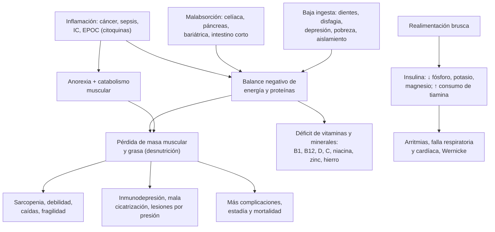

---
tags:
  - Endocrinología
  - Geriatría
  - Frecuente en sala
---

# Desnutrición, malnutrición y síndromes carenciales de vitaminas y minerales

**Subespecialidad**
Nutrición clínica · Geriatría · Medicina interna · Gastroenterología

**Guías principales**
GLIM 2019 (con actualización 2025): diagnóstico de la desnutrición · ESPEN 2017: definiciones y terminología · ESPEN 2019 y guía práctica 2022: nutrición e hidratación en geriatría · ASPEN 2020: síndrome de realimentación · PROT-AGE 2013: proteínas en personas mayores

**Otras fuentes**
MNA-SF (Kaiser 2009) · NRS-2002 (Kondrup 2003) · Estudio ELAN de desnutrición hospitalaria en Latinoamérica (2003) · Déficit de B12 y folato en mayores chilenos (Cabrera 2014) · Vitamina D en mayores chilenos (Álamos 2026) · PACAM (MINSAL)

**GES**
No es GES. El **PACAM** (Programa de Alimentación Complementaria del Adulto Mayor) entrega alimentos fortificados a los beneficiarios de FONASA de **70 años y más** (y de 65 años o más en tratamiento de tuberculosis).

**EUNACOM**
1.02.1.001 Desnutrición (específico, inicial, derivar) · 1.07.1.014 Malnutrición (específico, completo, derivar) · 1.02.1.017 Síndromes carenciales de vitaminas y minerales (específico, inicial, derivar)

**Revisado**
Octubre 2026

!!! abstract "Resumen en 60 segundos"
    - **Malnutrición** incluye la **desnutrición** (déficit) y la malnutrición por **exceso** (obesidad). En Chile predomina el exceso en la población general, pero la **desnutrición** es frecuente en los **hospitalizados** (50 % en Latinoamérica, estudio ELAN) y en los **adultos mayores** frágiles.
    - **Tamizaje** a todo adulto mayor y a todo paciente que se hospitaliza: **MNA-SF** (≤ 11 = riesgo) o **NRS-2002** (≥ 3 = riesgo).
    - **Diagnóstico GLIM**: ≥ 1 criterio **fenotípico** (baja de peso > 5 % en 6 meses, IMC bajo, masa muscular baja) + ≥ 1 **etiológico** (ingesta reducida o malabsorción, inflamación).
    - **Tratamiento**:
        - Tratar la causa (dientes, deglución, depresión, fármacos, cáncer, pobreza o aislamiento).
        - **Enriquecer la dieta**, **suplementos orales** (≥ 400 kcal y ≥ 30 g de proteína al día).
        - **Nutrición enteral** si la vía oral no alcanza y el intestino funciona.
        - Metas: **~30 kcal/kg/día** y **≥ 1 g/kg/día de proteínas** en el adulto mayor.
    - **Síndrome de realimentación**: en el desnutrido, **tiamina 100 mg antes** de alimentar, empezar con **10–20 kcal/kg** y vigilar **fósforo, potasio y magnesio**.
    - **Carencias que hay que reconocer**:
        - **B1** (Wernicke, beriberi).
        - **B12** (anemia megaloblástica, neuropatía, deterioro cognitivo; **11 %** de los mayores chilenos).
        - **Vitamina D** (osteomalacia, caídas; **58 %** de los mayores chilenos con déficit).
        - **Niacina** (pelagra: dermatitis, diarrea, demencia).
        - **Vitamina C** (escorbuto).
        - **Hierro**, **zinc**, **vitamina K**, **vitamina A**.

## Definición

| Concepto | Definición |
|---|---|
| **Malnutrición** | Alteración del estado nutricional por **déficit** o **exceso** de energía, proteínas u otros nutrientes, con efectos en la composición corporal, la función y el pronóstico |
| **Desnutrición** | Estado por **ingesta o absorción insuficiente** de nutrientes que lleva a una **composición corporal alterada** (menos masa magra) y a **peor función** física y mental y peor evolución de las enfermedades (ESPEN 2017) |
| **Desnutrición relacionada con la enfermedad con inflamación** | **Aguda** (UCI, sepsis, trauma, quemados) o **crónica** (= **caquexia**: cáncer, insuficiencia cardíaca, EPOC, ERC, artritis reumatoide) |
| **Desnutrición relacionada con la enfermedad sin inflamación** | Disfagia, anorexia nerviosa, malabsorción, obstrucción digestiva |
| **Desnutrición sin enfermedad** | Por **hambre** (pobreza), factores **socioeconómicos** o **psicológicos** (aislamiento, duelo, dependencia) |
| **Marasmo** | Desnutrición calórico-proteica crónica: pérdida de grasa y músculo, sin edema |
| **Kwashiorkor** | Desnutrición proteica con **edema** e hipoalbuminemia (en adultos, se ve en la enfermedad aguda grave) |
| **Síndrome carencial** | Manifestaciones clínicas del déficit de una **vitamina** o un **mineral** específico |
| **Síndrome de realimentación** | Alteraciones electrolíticas (**hipofosfatemia**, hipokalemia, hipomagnesemia), déficit de **tiamina** y sobrecarga de volumen al **reiniciar la alimentación** en un desnutrido |

## Epidemiología

### Mundial

- **Hospitales**: en el estudio multicéntrico **ELAN** (Latinoamérica), el **50,2 %** de los hospitalizados estaba desnutrido y el **11,2 %**, gravemente. Menos del **23 %** de las fichas tenía información nutricional y solo el **8,8 %** recibía terapia nutricional (Correia 2003).
- La desnutrición se asocia a la **edad > 60 años**, el **cáncer**, las **infecciones** y una **estadía más larga**.
- En los **adultos mayores**, la desnutrición y el riesgo de desnutrición son frecuentes, sobre todo en los **hospitalizados** y los **institucionalizados**. Se superponen con la **fragilidad** y la **sarcopenia**.

!!! chile "Datos nacionales"
    - En la **población general chilena** predomina la malnutrición por **exceso** (obesidad 31,2 %, ENS 2016–2017). Ver [obesidad](obesidad-y-sindrome-metabolico.md).
    - **Déficit de vitamina B12** en ≥ 65 años (ENS 2009–2010, 1.013 personas; Cabrera 2014):
        - **11,3 %** en total, mayor en el **norte** (**19,1 %**) que en el centro (10,5 %) y el sur (5,7 %).
        - El déficit de **folato** fue de solo **0,7 %**: la harina se fortifica con ácido fólico desde el año 2000.
    - **Vitamina D** en ≥ 65 años (ENS 2016–2017; Álamos 2026): **58,3 %** con **déficit** (< 20 ng/mL) y **88,3 %** con ≤ 30 ng/mL.
    - La **sal** se yoda por norma desde 1979: el bocio por déficit de yodo es hoy raro. Ver [bocio](bocio-nodulo-y-cancer-de-tiroides.md).
    - **PACAM** (Programa de Alimentación Complementaria del Adulto Mayor):
        - Para beneficiarios de **FONASA** de **≥ 70 años** (y ≥ 65 años en tratamiento de tuberculosis).
        - Entrega mensual de **Crema Años Dorados** y **Bebida Láctea Años Dorados**, alimentos fortificados.
        - Requiere estar inscrito en el CESFAM y tener al día el **EMPAM**, el control cardiovascular y las vacunas.

## Etiología

| Mecanismo | Causas |
|---|---|
| **Baja ingesta** | **Problemas dentales**, **disfagia**, **anorexia** (enfermedad, fármacos, envejecimiento), **depresión**, **demencia**, dependencia para comer, **pobreza**, **aislamiento**, alcoholismo, dietas restrictivas innecesarias (sin sal, sin azúcar en el adulto mayor) |
| **Malabsorción** | **Enfermedad celíaca**, insuficiencia pancreática exocrina, **cirugía bariátrica** o gastrectomía, intestino corto, enfermedad inflamatoria intestinal, sobrecrecimiento bacteriano |
| **Aumento de requerimientos o pérdidas** | **Inflamación** (sepsis, trauma, quemaduras, cáncer, EPOC, insuficiencia cardíaca), **lesiones por presión** y heridas, fístulas, diarrea, diálisis, hipertiroidismo |
| **Fármacos** | **Polifarmacia**; anorexia y náuseas (digoxina, metformina, ISRS, opioides, antibióticos), boca seca (anticolinérgicos), disgeusia; **metformina** e **IBP** (B12), **anticonvulsivantes** (folato, vitamina D) |

| Carencia | Grupos de riesgo |
|---|---|
| **Tiamina (B1)** | **Alcoholismo**, cirugía bariátrica, hiperemesis, vómitos prolongados, desnutrición, **realimentación**, diálisis |
| **B12** | **Adultos mayores** (gastritis atrófica), **anemia perniciosa**, **metformina**, **IBP**, gastrectomía y bariátrica, veganos estrictos, enfermedad ileal |
| **Folato** | Alcoholismo, malabsorción, embarazo, metotrexato, anticonvulsivantes (raro en Chile por la fortificación) |
| **Niacina (B3)** | Alcoholismo, malabsorción, **isoniazida**, síndrome carcinoide, dietas basadas en maíz |
| **Vitamina C** | Dieta sin frutas ni verduras (adultos mayores solos, alcoholismo, trastornos de la conducta alimentaria) |
| **Vitamina D** | **Adultos mayores**, poca exposición al sol, institucionalizados, obesidad, malabsorción, ERC, hepatopatía |
| **Vitaminas liposolubles (A, D, E, K)** | **Malabsorción de grasas**: colestasia, insuficiencia pancreática, celíaca, bariátrica; antibióticos (K) |
| **Hierro** | Pérdidas digestivas o menstruales, malabsorción (celíaca, bariátrica, IBP). Ver [anemias](../hematologia/anemias.md) |
| **Zinc** | Diarrea crónica, malabsorción, alcoholismo, quemaduras, cirugía bariátrica |

## Fisiopatología

- **Ayuno simple** (sin inflamación): el cuerpo se **adapta**. Baja la insulina, usa el glucógeno en 24–48 h y luego la **grasa** (cetonas), y **ahorra proteínas**. El gasto energético disminuye. Se pierde peso, sobre todo grasa, y la albúmina se mantiene.
- **Desnutrición con inflamación** (caquexia, enfermedad aguda):
    - Las **citoquinas** (IL-6, TNF-α) producen **anorexia**, **catabolismo muscular** y resistencia a la insulina.
    - Se pierde **músculo** aunque se aporte energía.
    - La **albúmina** baja por la inflamación (es un reactante de fase aguda negativo), **no** por la desnutrición en sí.
- **Consecuencias**: pérdida de masa muscular (**sarcopenia**), debilidad, **inmunodepresión** (infecciones), mala **cicatrización**, **lesiones por presión**, caídas, **delirium**, más complicaciones y mortalidad.
- **Realimentación**: al dar carbohidratos tras un ayuno, la **insulina** mete **fosfato, potasio y magnesio** a las células y aumenta el consumo de **tiamina**. Caen bruscamente en el plasma: arritmias, insuficiencia respiratoria y cardíaca, **Wernicke**.

*Figura 1. Mecanismos de la desnutrición, sus consecuencias y el síndrome de realimentación. Esquema propio.*

## Clasificación

<figure markdown>
![Esquema en tres pasos. Paso 1, tamizaje de riesgo con MNA-SF (adulto mayor; 11 o menos es riesgo), NRS-2002 (hospital; 3 o más es riesgo) u otros. Paso 2, evaluación: al menos un criterio fenotípico (baja de peso involuntaria de más de 5 % en 6 meses o más de 10 % en más de 6 meses; IMC menor de 20 en menores de 70 años o de 22 en mayores de 70; masa muscular reducida) y al menos uno etiológico (ingesta de 50 % o menos de lo necesario por más de 1 semana, o cualquier reducción por más de 2 semanas, o malabsorción; inflamación por enfermedad aguda, trauma o enfermedad crónica). Paso 3, gravedad: moderada con baja de peso de 5 a 10 % en 6 meses, IMC menor de 20 o 22, o déficit muscular leve a moderado; grave con baja de peso de más de 10 % en 6 meses, IMC menor de 18,5 o 20, o déficit muscular grave. A la izquierda, los tipos de desnutrición de ESPEN: con inflamación aguda o crónica (caquexia), sin inflamación y sin enfermedad](../assets/figuras/desnutricion/criterios-glim.svg){ loading=lazy }
<figcaption>Figura 2. Diagnóstico de la desnutrición en tres pasos según los criterios GLIM, y tipos de desnutrición según ESPEN. Esquema propio basado en GLIM (Cederholm 2019; actualización 2025) y ESPEN (Cederholm 2017).</figcaption>
</figure>

| Herramienta de tamizaje | Población | Punto de corte |
|---|---|---|
| **MNA-SF** (Mini Nutritional Assessment, forma corta; 6 preguntas: ingesta, baja de peso, movilidad, estrés agudo, problemas neuropsicológicos, IMC o pantorrilla) | **Adultos mayores** | **12–14** normal · **8–11** riesgo · **0–7** desnutrición |
| **NRS-2002** | **Hospitalizados** | **≥ 3** = riesgo nutricional: iniciar un plan |
| **MUST** | Comunidad y hospital | ≥ 2 = riesgo alto |

## Clínica

- **Historia**:
    - **Peso** habitual y actual, velocidad de la baja de peso.
    - **Ingesta**: cuánto come respecto a lo habitual y desde cuándo.
    - Síntomas digestivos (disfagia, náuseas, diarrea).
    - **Dentadura**, olfato y gusto.
    - **Ánimo**, cognición, **dependencia** para comprar, cocinar y comer.
    - Situación social y económica, alcohol, **fármacos**.
- **Examen**:
    - Peso, talla, **IMC**; pérdida de **grasa** (cara, brazos) y de **músculo** (sienes, clavículas, hombros, cuádriceps).
    - **Edema** y ascitis (enmascaran la baja de peso).
    - **Circunferencia de pantorrilla** (< 31 cm sugiere masa muscular baja).
    - **Fuerza de prensión**.
    - Piel, pelo, uñas, boca y lengua (signos carenciales).

| Carencia | Clínica |
|---|---|
| **Tiamina (B1)** | **Wernicke** (confusión, oftalmoplejia, ataxia), **beriberi seco** (polineuropatía) y **húmedo** (insuficiencia cardíaca de alto gasto), **acidosis láctica** |
| **B12** | **Anemia megaloblástica**, **glositis**, **neuropatía** y **degeneración combinada subaguda** (propiocepción, Romberg +), **deterioro cognitivo**, depresión. El daño neurológico puede ocurrir **sin anemia** |
| **Folato** | Anemia megaloblástica, glositis (sin compromiso neurológico); defectos del tubo neural en el embarazo |
| **Niacina (B3)** | **Pelagra**: las "**3 D**": **dermatitis** fotosensible (collar de Casal), **diarrea**, **demencia** (y la cuarta D: **muerte**) |
| **Vitamina C** | **Escorbuto**: **encías** inflamadas y sangrantes, **petequias perifoliculares**, pelos en sacacorchos, equimosis, mala cicatrización, anemia, dolor óseo |
| **Vitamina D** | **Osteomalacia** (dolor óseo, debilidad proximal, fracturas), **caídas**, hipocalcemia e hiperparatiroidismo secundario. Ver [calcio](trastornos-del-calcio-fosforo-y-magnesio.md) y [osteoporosis](osteoporosis.md) |
| **Vitamina A** | **Ceguera nocturna**, xeroftalmia (manchas de Bitot), piel seca, infecciones |
| **Vitamina K** | **Sangrado** con **TP/INR prolongado** (TTPA normal o algo prolongado); corrige con vitamina K. Ver [coagulopatías](../hematologia/coagulopatias-cid-y-reversion-de-anticoagulantes.md) |
| **Vitamina E** | Neuropatía, **ataxia** espinocerebelosa, hemólisis |
| **Hierro** | **Anemia microcítica**, glositis, queilitis, coiloniquia, **pica**, piernas inquietas |
| **Zinc** | **Dermatitis** periorificial y acral (similar a la acrodermatitis enteropática), **alopecia**, **diarrea**, **disgeusia**, mala cicatrización |
| **Cobre** | Anemia y neutropenia, **mielopatía** similar a la de B12 (tras bariátrica o por exceso de zinc) |
| **Yodo** | **Bocio**, hipotiroidismo |

!!! alarma "Situaciones graves"
    - **Desnutrición grave** (IMC < 16, baja de peso rápida, ingesta casi nula > 10 días): **riesgo alto de realimentación**. Hospitalizar, **tiamina** antes de alimentar, empezar con poco aporte y controlar los **electrolitos** cada 12 horas.
    - **Wernicke**: confusión + ataxia + oftalmoplejia en un alcohólico, desnutrido o posbariátrico. **Tiamina EV en dosis altas antes de la glucosa**. Ver [Wernicke](../neurologia/abstinencia-alcoholica-y-wernicke.md).
    - **Beriberi húmedo**: insuficiencia cardíaca de alto gasto con acidosis láctica en un alcohólico; responde rápido a la tiamina.
    - **Déficit de B12 con compromiso neurológico**: tratar con **B12 IM** sin demora (el daño puede ser irreversible).
    - **Sangrado por déficit de vitamina K**: vitamina K EV y, si es grave, complejo protrombínico o plasma.
    - **Baja de peso no explicada**: estudiar un **cáncer**, enfermedades endocrinas (hipertiroidismo, diabetes descompensada, insuficiencia suprarrenal), depresión, malabsorción y, en el adulto mayor, **maltrato** o abandono.

## Diagnóstico

!!! guia "Diagnóstico de la desnutrición (GLIM 2019)"
    1. **Tamizaje** de riesgo con una herramienta validada: **MNA-SF** en el adulto mayor, **NRS-2002** en el hospital, MUST.
    2. **Evaluación** del que tiene riesgo: diagnóstico de desnutrición con **≥ 1 criterio fenotípico + ≥ 1 criterio etiológico**.
        - **Fenotípicos**: **baja de peso** involuntaria (> 5 % en 6 meses o > 10 % en más de 6 meses); **IMC bajo** (< 20 en < 70 años; < 22 en ≥ 70 años); **masa muscular reducida**.
        - **Etiológicos**: **ingesta reducida** (≤ 50 % de los requerimientos por > 1 semana, cualquier reducción por > 2 semanas) o **malabsorción**; **inflamación** (enfermedad aguda o crónica).
    3. **Gravedad** (moderada o grave) según el criterio fenotípico.

!!! guia "Nutrición en geriatría (ESPEN 2019 y 2022)"
    - **Tamizaje** de desnutrición en todo adulto mayor (MNA-SF), y **evaluación** con un plan individual si hay riesgo.
    - **Energía**: guía de **~30 kcal/kg/día**, ajustada al estado nutricional, la actividad y la enfermedad.
    - **Proteínas**: **≥ 1 g/kg/día**.
    - **Evitar las dietas restrictivas** innecesarias en el adulto mayor.
    - **Suplementos orales** si la dieta enriquecida no alcanza: **≥ 400 kcal/día** y **≥ 30 g de proteína/día**, por al menos **1 mes**.
    - **Nutrición enteral** si la vía oral es insuficiente y el pronóstico es razonable. **No** usar sonda en la **demencia grave** (no mejora la sobrevida ni previene la aspiración).

- **Síndromes carenciales**: sospechar por el **grupo de riesgo** y la **clínica**; confirmar con niveles (cuando son útiles) y la **respuesta al tratamiento**. En los pacientes de alto riesgo (alcoholismo, realimentación), **tratar sin esperar** los niveles (tiamina).

## Laboratorio

| Examen | Interpretación |
|---|---|
| **Hemograma** | Anemia: microcítica (hierro), macrocítica (B12, folato, alcohol); linfopenia (desnutrición) |
| **Albúmina** | **No** es un marcador de desnutrición: baja por la **inflamación**, la hepatopatía y las pérdidas (riñón, intestino). Sirve como marcador de **gravedad** y pronóstico |
| **Prealbúmina** | Vida media corta (2 días); también baja con la inflamación |
| **PCR** | Inflamación: orienta al tipo de desnutrición |
| **Fósforo, potasio, magnesio** | **Antes** de alimentar y durante la realimentación |
| **Vitamina B12** (± ácido metilmalónico si es limítrofe) | Déficit de B12 |
| **Folato** | Déficit de folato (raro en Chile) |
| **25-OH vitamina D** | Déficit si < 20 ng/mL |
| **Ferritina, saturación de transferrina** | Déficit de hierro (la ferritina sube con la inflamación) |
| **TP/INR** | Déficit de vitamina K |
| **Zinc, cobre, vitamina A** | Según la sospecha (malabsorción, bariátrica) |
| **TSH, glicemia, función renal y hepática** | Causas de baja de peso y comorbilidad |
| **Anticuerpos antitransglutaminasa**, elastasa fecal | Malabsorción (celíaca, insuficiencia pancreática) |

## Imágenes

- No hay imágenes rutinarias para la desnutrición.
- **DXA** o **bioimpedancia**: masa muscular (criterio fenotípico GLIM).
- **TC** de abdomen: masa muscular en L3 como hallazgo de oportunidad; estudio de la causa de la baja de peso (cáncer).
- **Endoscopía alta** y **colonoscopía**, **videofluoroscopía** de la deglución, según la causa sospechada.

## Diagnóstico diferencial

| Condición | Claves |
|---|---|
| **Cáncer** | Baja de peso rápida, anorexia, síntomas B, anemia, PCR alta |
| **Hipertiroidismo** | Baja de peso **con apetito conservado**, taquicardia, temblor; TSH baja |
| **Diabetes descompensada** | Poliuria, polidipsia, hiperglicemia |
| **Depresión** | Anorexia, anhedonia, aislamiento |
| **Insuficiencia suprarrenal** | Baja de peso, hipotensión, hiponatremia, hiperkalemia. Ver [insuficiencia suprarrenal](insuficiencia-suprarrenal.md) |
| **Malabsorción** | Diarrea, esteatorrea, déficits de vitaminas liposolubles y hierro |
| **Trastorno de la conducta alimentaria** | Mujer joven, miedo a engordar, conductas compensatorias |
| **Infecciones crónicas** | **Tuberculosis**, **VIH** |
| **Insuficiencia de órganos** | Insuficiencia cardíaca (caquexia cardíaca), EPOC, ERC, cirrosis |

## Tratamiento

- **Tratar la causa**:
    - **Dentista** (prótesis), **evaluación de la deglución**, tratar la **depresión**.
    - **Revisar los fármacos** que quitan el apetito o causan náuseas.
    - Apoyo social: compras, comida preparada, **PACAM**, compañía al comer.
    - Tratar la enfermedad de base.
- **Escalera de la intervención nutricional**:
    1. **Consejería** y **enriquecimiento de la dieta**: comidas pequeñas y frecuentes, alimentos densos en energía y proteínas (leche en polvo, huevo, aceite), colaciones. Liberar las dietas restrictivas.
    2. **Suplementos nutricionales orales** (fórmulas hiperproteicas e hipercalóricas) entre las comidas.
    3. **Nutrición enteral** por sonda nasogástrica (corto plazo) o **gastrostomía** (> 4–6 semanas) si la vía oral no alcanza y el intestino funciona, según el pronóstico y los objetivos de cuidado.
    4. **Nutrición parenteral** solo si el intestino **no** se puede usar.
- **Metas**:
    - **Energía**: 25–30 kcal/kg/día (más en la recuperación de una desnutrición grave, una vez superado el riesgo de realimentación).
    - **Proteínas**: **1,0–1,5 g/kg/día** (más alto con enfermedad o lesiones por presión).
    - Ajustar el peso si hay obesidad o edema.
- **Prevenir el síndrome de realimentación** (ASPEN 2020):
    - Identificar el riesgo: IMC muy bajo, baja de peso importante, ingesta casi nula por días, alcoholismo, electrolitos bajos antes de alimentar.
    - **Tiamina 100 mg** antes de iniciar la alimentación o la glucosa EV, y luego por 5–7 días.
    - Empezar con **10–20 kcal/kg** (o 100–150 g de glucosa) las primeras 24 h y avanzar un tercio de la meta cada 1–2 días.
    - **Fósforo, potasio y magnesio** cada 12 horas los primeros 3 días en los de alto riesgo; reponerlos.
    - Vigilar el balance hídrico y los signos de insuficiencia cardíaca.
- **Ejercicio de fuerza** junto con la nutrición para recuperar músculo. Ver [fragilidad](../geriatria/fragilidad-y-sarcopenia.md).
- **Desnutrición en la demencia avanzada o al final de la vida**: priorizar el **confort** (alimentación de placer, asistida a mano); la sonda no mejora la sobrevida.

!!! dosis "Reposición de vitaminas y minerales (dosis habituales del adulto)"
    - **Tiamina**:
        - **Wernicke**: **200–500 mg EV c/8 h** según el protocolo (ver [Wernicke](../neurologia/abstinencia-alcoholica-y-wernicke.md)).
        - **Realimentación**: 100 mg antes de alimentar y por 5–7 días.
        - **Déficit sin Wernicke**: 100 mg/día.
    - **B12**:
        - **Con compromiso neurológico o anemia grave**: cianocobalamina **1.000 µg IM** diaria o en días alternos por 1–2 semanas, luego semanal y después cada 1–3 meses.
        - **Sin compromiso neurológico**: **1.000–2.000 µg/día VO**.
        - Ver [anemias](../hematologia/anemias.md).
    - **Ácido fólico**: **5 mg/día VO** por 4 meses, **siempre después de descartar o tratar el déficit de B12**.
    - **Vitamina D3**: ≥ 800 UI/día de mantención; en el déficit, carga de ~300.000 UI en 6–10 semanas. Ver [calcio](trastornos-del-calcio-fosforo-y-magnesio.md).
    - **Niacina (pelagra)**: **nicotinamida ~300 mg/día** en dosis divididas por 3–4 semanas.
    - **Vitamina C (escorbuto)**: **300–1.000 mg/día VO** hasta la resolución (habitualmente semanas); los síntomas mejoran en días.
    - **Vitamina K**: **10 mg EV lento** si hay sangrado o INR alto por déficit; 1–10 mg VO en los casos leves.
    - **Vitamina A (xeroftalmia, OMS)**: 200.000 UI VO los días 1, 2 y 14 (no en mujeres que pueden embarazarse: dosis menores).
    - **Hierro**: sulfato ferroso **1 comprimido de 200 mg (≈ 65 mg de hierro elemental) al día o en días alternos**. Ver [anemias](../hematologia/anemias.md).
    - **Suplemento oral nutricional**: **≥ 400 kcal y ≥ 30 g de proteína al día** (ESPEN).

## Complicaciones

- **Infecciones** (inmunodepresión), **neumonía** aspirativa.
- **Lesiones por presión** y mala cicatrización. Ver [inmovilidad y úlceras por presión](../geriatria/inmovilidad-y-ulceras-por-presion.md).
- **Sarcopenia**, **caídas**, fracturas, **fragilidad**, dependencia.
- **Delirium**, deterioro cognitivo (B12, B1, niacina).
- **Síndrome de realimentación**: arritmias, insuficiencia respiratoria y cardíaca, Wernicke, muerte.
- **Secuelas irreversibles** de las carencias: neuropatía y mielopatía por B12, síndrome de Korsakoff (B1), ceguera (vitamina A).
- Más **estadía hospitalaria**, reingresos y **mortalidad**.

## Pronóstico y seguimiento

- La desnutrición es un **predictor independiente** de complicaciones, estadía y mortalidad; se puede revertir, sobre todo si se detecta **antes** de la pérdida grave de músculo.
- La respuesta a los suplementos es mejor cuando se combinan con **ejercicio**.
- Las carencias vitamínicas responden rápido al tratamiento (la anemia por B12 da **reticulocitosis** en **5–7 días**; el escorbuto y la pelagra mejoran en días), pero el **daño neurológico** puede quedar.
- **Seguimiento**:
    - **Peso** en cada control (registrar el peso habitual).
    - Repetir el **MNA-SF** o el NRS-2002.
    - Ingesta y adherencia a los suplementos.
    - En los de riesgo permanente (bariátrica, gastrectomía, metformina prolongada, malabsorción), **controlar B12, hierro, vitamina D** y otros micronutrientes periódicamente.

## Perlas para el internado

- **Pesa al paciente** al ingreso y pregunta su **peso habitual**: una baja > 5 % en 6 meses ya es un criterio de desnutrición.
- La **albúmina baja** en un paciente inflamado **no** significa desnutrición: mira el peso, la ingesta y el músculo.
- Un **IMC normal o alto no descarta** la desnutrición (obesidad sarcopénica, edema).
- Antes de alimentar a un desnutrido o alcohólico: **tiamina**, poco aporte inicial y **fósforo, potasio y magnesio**.
- **Nunca** des ácido fólico solo en una macrocitosis sin medir la **B12**.
- Paciente con **metformina o IBP** por años y neuropatía o deterioro cognitivo: pide **B12**.
- **Dermatitis en zonas expuestas al sol + diarrea + confusión** en un alcohólico: **pelagra**.
- **Encías sangrantes y petequias perifoliculares** en un adulto mayor que vive solo: **escorbuto**.
- Revisa la **dentadura** y la **deglución** antes de recetar un suplemento.

## Preguntas de repaso

??? repaso "1. Mujer de 81 años, viuda, vive sola. En 6 meses bajó de 58 a 52 kg; come una vez al día porque \"no tiene ganas de cocinar\". IMC 21. ¿Tiene desnutrición según GLIM? ¿Qué hace?"
    **Sí**: baja de peso de **~10 % en 6 meses** (criterio fenotípico) + **ingesta reducida** por > 2 semanas (criterio etiológico). Por la baja de peso, la gravedad es **moderada** (5–10 %) a grave (> 10 %). Además, a los ≥ 70 años un IMC < 22 ya es un criterio fenotípico.

    - Buscar las causas: **depresión** (Yesavage), **deterioro cognitivo**, dentadura, deglución, fármacos, enfermedades (TSH, glicemia, hemograma, función renal, PCR; estudiar un cáncer si no hay explicación), situación social.
    - **Plan**: enriquecer la dieta, **suplemento oral** (≥ 400 kcal y 30 g de proteína al día), **PACAM**, apoyo para las comidas (red social, municipio), ejercicio de fuerza.
    - Control del peso en 2–4 semanas.

??? repaso "2. Hombre de 55 años, alcohólico, con ingesta casi nula hace 2 semanas, IMC 16. Se hospitaliza para alimentarlo. ¿Qué riesgo tiene y cómo lo maneja?"
    **Riesgo alto de síndrome de realimentación** (y de **Wernicke**).

    - **Tiamina** antes de cualquier glucosa o alimentación (en el alcohólico con riesgo de Wernicke, dosis altas EV).
    - Medir y corregir **fósforo, potasio y magnesio** antes de empezar.
    - Iniciar con **10–20 kcal/kg/día** y avanzar lento (un tercio de la meta cada 1–2 días).
    - Controlar los electrolitos **cada 12 horas** los primeros 3 días, el balance hídrico y el ECG.
    - Tratar también la abstinencia alcohólica.

??? repaso "3. Hombre de 72 años con diabetes tipo 2 en metformina hace 12 años y omeprazol diario. Consulta por parestesias en los pies, inestabilidad y olvidos. Hb 12,1 g/dL, VCM 103 fL. ¿Qué sospecha y cómo lo trata?"
    **Déficit de vitamina B12** (metformina e IBP prolongados, edad), con **neuropatía**, probable **ataxia sensitiva** y **deterioro cognitivo**, y macrocitosis.

    - **B12** (y ácido metilmalónico si es limítrofe), folato, frotis, reticulocitos; examen de la sensibilidad profunda y el Romberg.
    - Tratamiento: con compromiso neurológico, **cianocobalamina 1.000 µg IM** diaria o en días alternos por 1–2 semanas, luego semanal y después mensual. Seguir con B12 mientras use metformina.
    - **No** dar ácido fólico solo.
    - Reevaluar la necesidad del IBP.

??? repaso "4. Hombre de 48 años, bebedor intenso, con lesiones eritematosas y descamativas en el dorso de las manos, la cara y el cuello (zonas expuestas al sol), diarrea de semanas y confusión. ¿Diagnóstico y tratamiento?"
    **Pelagra** (déficit de niacina): las "3 D" (**dermatitis** fotosensible, **diarrea**, **demencia**). El collar en el cuello es el **collar de Casal**.

    - Tratamiento: **nicotinamida ~300 mg/día** en dosis divididas por 3–4 semanas, más **complejo B** (tiamina) y una dieta adecuada.
    - Buscar otras carencias (B1, B12, folato, zinc), y tratar el alcoholismo.
    - Considerar la **isoniazida** y el síndrome carcinoide como otras causas.

??? repaso "5. ¿Por qué la albúmina no sirve para diagnosticar la desnutrición y qué usa GLIM en su lugar?"
    - La **albúmina** baja por la **inflamación** (reactante de fase aguda negativo), la **hepatopatía**, las **pérdidas** (síndrome nefrótico, enteropatía) y la dilución. En el ayuno simple puede ser **normal** pese a una desnutrición importante.
    - Es un marcador de **gravedad** y **pronóstico**, no del estado nutricional.
    - **GLIM** usa criterios **fenotípicos** (baja de peso, IMC bajo, masa muscular reducida) y **etiológicos** (ingesta reducida o malabsorción, inflamación).

??? repaso "6. Mujer de 85 años con demencia avanzada (escala clínica de fragilidad 8), con ingesta cada vez menor y episodios de atoro. La familia pregunta por una gastrostomía. ¿Qué responde?"
    En la **demencia grave**, la alimentación por sonda (nasogástrica o gastrostomía) **no** mejora la sobrevida, **no** previene la neumonía aspirativa y **no** mejora la calidad de vida (ESPEN geriatría).

    - Recomendar la **alimentación asistida a mano**, con texturas adaptadas, en pequeñas cantidades y según la tolerancia (alimentación de confort).
    - Conversar los **objetivos de cuidado** y la planificación anticipada con la familia; considerar los **cuidados paliativos**.
    - Tratar lo reversible: dolor, boca (dentadura, candidiasis), constipación, fármacos.

## Referencias

1. Cederholm T, Jensen GL, Correia MITD, et al. GLIM criteria for the diagnosis of malnutrition: a consensus report from the global clinical nutrition community. *Clin Nutr.* 2019;38(1):1–9. doi:[10.1016/j.clnu.2018.08.002](https://doi.org/10.1016/j.clnu.2018.08.002)
2. Cederholm T, Jensen GL, Correia MITD, et al. The GLIM consensus approach to diagnosis of malnutrition: a 5-year update. *Clin Nutr.* 2025;49:11–20. doi:[10.1016/j.clnu.2025.03.018](https://doi.org/10.1016/j.clnu.2025.03.018)
3. Cederholm T, Barazzoni R, Austin P, et al. ESPEN guidelines on definitions and terminology of clinical nutrition. *Clin Nutr.* 2017;36(1):49–64. doi:[10.1016/j.clnu.2016.09.004](https://doi.org/10.1016/j.clnu.2016.09.004)
4. Volkert D, Beck AM, Cederholm T, et al. ESPEN guideline on clinical nutrition and hydration in geriatrics. *Clin Nutr.* 2019;38(1):10–47. doi:[10.1016/j.clnu.2018.05.024](https://doi.org/10.1016/j.clnu.2018.05.024)
5. Volkert D, Beck AM, Cederholm T, et al. ESPEN practical guideline: clinical nutrition and hydration in geriatrics. *Clin Nutr.* 2022;41(4):958–989. doi:[10.1016/j.clnu.2022.01.024](https://doi.org/10.1016/j.clnu.2022.01.024)
6. da Silva JSV, Seres DS, Sabino K, et al. ASPEN consensus recommendations for refeeding syndrome. *Nutr Clin Pract.* 2020;35:178–195. doi:[10.1002/ncp.10474](https://doi.org/10.1002/ncp.10474)
7. Bauer J, Biolo G, Cederholm T, et al. Evidence-based recommendations for optimal dietary protein intake in older people: a position paper from the PROT-AGE Study Group. *J Am Med Dir Assoc.* 2013;14(8):542–559. doi:[10.1016/j.jamda.2013.05.021](https://doi.org/10.1016/j.jamda.2013.05.021)
8. Kaiser MJ, Bauer JM, Ramsch C, et al. Validation of the Mini Nutritional Assessment short-form (MNA-SF): a practical tool for identification of nutritional status. *J Nutr Health Aging.* 2009;13(9):782–788. doi:[10.1007/s12603-009-0214-7](https://doi.org/10.1007/s12603-009-0214-7)
9. Kondrup J, Rasmussen HH, Hamberg O, Stanga Z. Nutritional risk screening (NRS 2002): a new method based on an analysis of controlled clinical trials. *Clin Nutr.* 2003;22(3):321–336. doi:[10.1016/s0261-5614(02)00214-5](https://doi.org/10.1016/s0261-5614(02)00214-5)
10. Correia MI, Campos AC; ELAN Cooperative Study. Prevalence of hospital malnutrition in Latin America: the multicenter ELAN study. *Nutrition.* 2003;19(10):823–825. doi:[10.1016/s0899-9007(03)00168-0](https://doi.org/10.1016/s0899-9007(03)00168-0)
11. Cabrera S, Benavente D, Alvo M, et al. Vitamin B12 deficiency is associated with geographical latitude and solar radiation in the older population. *J Photochem Photobiol B.* 2014;140:8–13. doi:[10.1016/j.jphotobiol.2014.07.001](https://doi.org/10.1016/j.jphotobiol.2014.07.001)
12. Álamos M, Leyton B, Parada A, et al. Vitamin D deficiency, obesity, and metabolic parameters in Chilean older adults. *J Pers Med.* 2026;16:90. doi:[10.3390/jpm16020090](https://doi.org/10.3390/jpm16020090)
13. ChileAtiende. Programa de Alimentación Complementaria del Adulto Mayor (PACAM). [chileatiende.gob.cl](https://www.chileatiende.gob.cl/fichas/15622-programa-de-alimentacion-complementaria-del-adulto-mayor-pacam)
