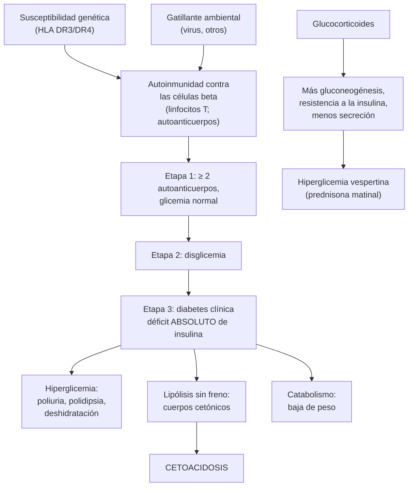

---
tags:
  - Endocrinología
  - GES
---

# Diabetes mellitus tipo 1, otros tipos de diabetes (LADA, MODY) y diabetes por corticoides

**Subespecialidad**
Endocrinología y diabetes · Medicina interna · Pediatría (inicio) · Atención primaria

**Guías principales**
ADA/EASD 2026: manejo de la diabetes tipo 1 en adultos (consenso actualizado) · ADA Standards of Care in Diabetes 2026 · Endocrine Society 2022: hiperglicemia en el paciente hospitalizado (incluida la inducida por corticoides)

**Otras fuentes**
Teplizumab para retrasar la diabetes tipo 1 (Herold, *NEJM* 2019) · Incidencia de diabetes tipo 1 en Chile 2007–2023 (Kutz, *Pediatrics* 2026) · Superintendencia de Salud: GES diabetes tipo 1 y Ley Ricarte Soto (diabetes tipo 1 inestable severa)

**GES**
Sí: diabetes mellitus tipo 1 (problema de salud n.º 6), en personas de **cualquier edad**, desde la **sospecha**. La **diabetes tipo 1 inestable severa** tiene cobertura de **bomba de insulina con sensor** por la **Ley Ricarte Soto**.

**EUNACOM**
1.02.1.004 Diabetes mellitus tipo 1 (específico, inicial, derivar) · 1.02.1.006 Diabetes por corticoides (específico, inicial, derivar)

**Revisado**
Octubre 2026

!!! abstract "Resumen en 60 segundos"
    - **Diabetes tipo 1 (DM1)**: destrucción **autoinmune** de las células beta → **déficit absoluto de insulina**. Dependencia **vital** de la insulina.
        - Sospechar ante **poliuria, polidipsia, baja de peso**, a menudo en niños y adultos jóvenes delgados, o ante una **cetoacidosis** (en Chile, **71 %** de los niños debuta con cetoacidosis).
        - **Diagnóstico**: criterios de glicemia de la ADA + **autoanticuerpos** (anti-GAD65, IA-2, ZnT8) y **péptido C** bajo.
        - **Etapas**: 1 (≥ 2 autoanticuerpos, glicemia normal), 2 (autoanticuerpos + disglicemia), 3 (diabetes clínica). El **teplizumab** retrasa la etapa 3.
    - **Tratamiento**: **insulina basal-bolo** (análogos) o **bomba**; idealmente **monitoreo continuo de glucosa** y **sistemas automatizados**. Dosis inicial **~ 0,4–0,6 U/kg/día**.
        - **Metas**: HbA1c **< 7 %** y **tiempo en rango (70–180 mg/dL) > 70 %**, con **< 4 %** bajo 70 mg/dL.
        - **Nunca suspender la insulina basal**: el paciente con DM1 sin insulina hace una **cetoacidosis** en horas.
    - **Otros tipos**: **LADA** (autoinmune del adulto, de progresión lenta), **MODY** (monogénica, autosómica dominante, anticuerpos negativos; las formas *HNF1A* responden a las **sulfonilureas**).
    - **Diabetes por corticoides**: hiperglicemia **vespertina** (con prednisona matinal), con **ayuno casi normal**. Medir la glicemia **antes del almuerzo y la cena**. Tratar con **insulina NPH matinal** según la dosis del corticoide y **bajarla** al reducir el corticoide.
    - **GES 6**: especialista en **7 días** desde la sospecha; **tratamiento en 24 horas** desde la confirmación; glicemia en **30 minutos** si hay sospecha de descompensación.

## Definición

- **Diabetes mellitus tipo 1**: diabetes por **destrucción autoinmune de las células beta** del páncreas, con **déficit absoluto de insulina** y **dependencia vital** de la insulina exógena.
    - **Etapas** (ADA 2026):

| Etapa | Autoinmunidad | Glicemia | Síntomas |
|---|---|---|---|
| **1** | **≥ 2 autoanticuerpos** de islotes | **Normal** | No |
| **2** | ≥ 2 autoanticuerpos | **Disglicemia** (glicemia de ayuno alterada, intolerancia a la glucosa o HbA1c 5,7–6,4 %) | No |
| **3** | Autoanticuerpos (pueden negativizarse con el tiempo) | **Diabetes** | Sí (poliuria, polidipsia, baja de peso, cetoacidosis) |

- **LADA** (diabetes autoinmune latente del adulto): diabetes autoinmune que aparece en el **adulto** (en general > 30–35 años), con **anticuerpos** positivos (sobre todo anti-GAD) y una **progresión lenta** a la dependencia de insulina (meses o años). Se confunde con la DM2.
- **MODY** (diabetes monogénica del joven): diabetes por una mutación de **un solo gen** de la célula beta, de herencia **autosómica dominante**; aparece antes de los **25–35 años**, sin obesidad ni autoinmunidad.
- **Diabetes por corticoides** (inducida por glucocorticoides): hiperglicemia que cumple los criterios de diabetes durante el uso de **glucocorticoides**, en personas sin diabetes previa (o empeoramiento de una diabetes conocida).
- **Criterios de diabetes** (iguales para todos los tipos; ADA 2026): glicemia de ayuno **≥ 126 mg/dL**, **HbA1c ≥ 6,5 %**, glicemia a las 2 horas de la PTGO **≥ 200 mg/dL**, o glicemia al azar **≥ 200 mg/dL** con síntomas o una crisis hiperglicémica.

## Epidemiología

### Mundial

- La DM1 corresponde al **5–10 %** de las personas con diabetes.
- Es la diabetes más frecuente en **niños y adolescentes**, pero **puede aparecer a cualquier edad**; una proporción importante de los casos nuevos se diagnostica en **adultos**, a menudo confundida con una DM2.
- Su **incidencia aumenta** en el mundo; es mayor en el norte de Europa (Finlandia, Escandinavia).
- **Enfermedades autoinmunes asociadas**: **tiroiditis autoinmune** (la más frecuente), **enfermedad celíaca**, gastritis atrófica (anemia perniciosa), insuficiencia suprarrenal (Addison), vitíligo.
- **Diabetes por corticoides**: la hiperglicemia es **frecuente** en los pacientes hospitalizados con dosis altas de corticoides (EPOC, COVID-19, enfermedades autoinmunes, quimioterapia, trasplante).

### Chile

!!! chile "Datos nacionales"
    - **Registro nacional de DM1 en menores de 20 años** (2007–2023; 9583 personas; Kutz 2026):
        - La **incidencia** subió de **7,4** (2007) a **13,9 por 100 000** menores de 20 años (2023).
        - Mayor incidencia entre los **10 y 14 años** y en **invierno**.
        - Durante la **pandemia de COVID-19** (2020–2021) la incidencia fue **mayor** que la esperada, y luego volvió a la tendencia previa.
        - En 3 centros terciarios, el **71 %** de los pacientes **debutó con cetoacidosis**, con un aumento de **64,3 % a 75,9 %** en 2020–2023.
    - **GES 6: diabetes mellitus tipo 1** (Superintendencia de Salud), personas de **cualquier edad** con sospecha o diagnóstico y **dependencia vital de la insulina**:
        - **Consulta con especialista**: **7 días** desde la sospecha por exámenes alterados.
        - **Glicemia**: **30 minutos** desde la atención médica si hay sospecha de **descompensación**.
        - **Inicio del tratamiento**: **24 horas** desde la confirmación diagnóstica.
        - Copago **0 %** en FONASA (medicamentos, insumos y exámenes del listado).
    - **Ley Ricarte Soto: diabetes tipo 1 inestable severa**: cubre el **monitoreo continuo de glicemia** y la **bomba de insulina con sensor** con sus insumos, en los pacientes que cumplen los criterios del protocolo del Ministerio de Salud (postula el diabetólogo o endocrinólogo por FONASA).

## Etiología y factores de riesgo

- **DM1**:
    - **Genética**: genes **HLA** (DR3-DQ2 y DR4-DQ8) y otros; riesgo de ~ 5–6 % en hermanos y mayor en gemelos idénticos.
    - **Ambiente** (gatillantes propuestos): **infecciones virales** (enterovirus), factores de la dieta en la infancia, microbiota.
    - **Inmunoterapia oncológica** (inhibidores de PD-1 y PD-L1): puede causar una **DM1 fulminante**, a menudo con cetoacidosis.
- **LADA**: mismos factores que la DM1, a una edad mayor; a veces con sobrepeso.
- **MODY**: mutaciones heredadas (*GCK*, *HNF1A*, *HNF4A*, *HNF1B*): **antecedente familiar** de diabetes en **3 generaciones**.
- **Diabetes por corticoides**:
    - **Dosis** (mayor riesgo con ≥ 20 mg/día de prednisona o equivalente) y **duración**.
    - **Edad** avanzada, **obesidad**, **prediabetes**, antecedente familiar de diabetes, **diabetes gestacional** previa.
    - Uso de otros fármacos hiperglicemiantes (tacrolimus, tiazidas).

## Fisiopatología

- **DM1**:
    - En personas con **susceptibilidad genética**, un gatillante ambiental inicia una **respuesta autoinmune** (linfocitos T) contra las células beta. Aparecen **autoanticuerpos** (marcadores, no la causa del daño).
    - La masa de células beta **cae progresivamente** durante meses o años (etapas 1 y 2) hasta que la insulina no alcanza (etapa 3).
    - El **déficit absoluto de insulina** produce:
        - **hiperglicemia** (más producción hepática de glucosa y menos captación);
        - **lipólisis** sin freno → ácidos grasos → **cuerpos cetónicos** → **cetoacidosis**;
        - **catabolismo**: baja de peso y masa muscular.
    - Tras el inicio de la insulina puede haber una **"luna de miel"** (remisión parcial): las necesidades de insulina bajan por semanas o meses.
- **MODY**: defecto **intrínseco** de la célula beta (por ejemplo, la glucoquinasa en *GCK* ajusta el "termostato" de la glucosa a un nivel más alto: hiperglicemia leve y estable).
- **Diabetes por corticoides**:
    - Los glucocorticoides **aumentan la gluconeogénesis** hepática, producen **resistencia a la insulina** en el músculo y el tejido adiposo, y **reducen la secreción** de insulina.
    - Con una dosis **matinal** de prednisona (acción intermedia), la hiperglicemia aparece **4–8 horas después**: predomina en la **tarde y la noche**, y la glicemia de **ayuno** suele ser **casi normal**.
    - La **dexametasona** (acción larga) eleva la glicemia durante **todo el día**.

*Figura 1. Fisiopatología de la diabetes tipo 1 (etapas) y de la diabetes por corticoides. Esquema propio basado en ADA 2026 y ADA/EASD 2026.*

## Clasificación

| Tipo | Edad y fenotipo | Autoanticuerpos | Péptido C | Cetosis | Tratamiento |
|---|---|---|---|---|---|
| **DM1** | Niños y adultos jóvenes (también adultos), **delgados**, inicio **rápido** | **Positivos** | **Bajo o indetectable** | **Frecuente** (debut con cetoacidosis) | **Insulina** basal-bolo o bomba desde el inicio |
| **LADA** | Adultos > 30–35 años; puede tener sobrepeso; progresión en meses o años | **Positivos** (anti-GAD) | Bajo, en descenso | Tardía | **Insulina** precoz (no sulfonilureas) |
| **MODY** | < 25–35 años, **sin obesidad**, **antecedente familiar** en 3 generaciones | **Negativos** | **Conservado** | Rara | *GCK*: **sin tratamiento**; *HNF1A*/*HNF4A*: **sulfonilureas** en dosis bajas |
| **DM2** | Adultos con **obesidad**, síndrome metabólico | Negativos | Normal o alto | Rara (puede ocurrir) | Estilo de vida, metformina, iSGLT2, arGLP-1, insulina (ver [DM2](diabetes-mellitus-tipo-2.md)) |
| **Diabetes por corticoides** | Durante el uso de corticoides | Negativos | Normal | Rara | Insulina NPH o basal-bolo; ajustar al corticoide |
| **Pancreatogénica (tipo 3c)** | Pancreatitis crónica, cirugía, fibrosis quística | Negativos | Bajo | Rara; **hipoglicemias** | Insulina (ver [pancreatitis crónica](../gastroenterologia/cancer-de-pancreas-y-pancreatitis-cronica.md)) |

## Clínica

- **DM1 (etapa 3)**:
    - **Poliuria**, **polidipsia**, **polifagia**, **baja de peso** en días o semanas, cansancio, visión borrosa.
    - **Enuresis** secundaria en los niños; candidiasis genital.
    - **Cetoacidosis** como debut: dolor abdominal, vómitos, **respiración de Kussmaul**, aliento cetónico, deshidratación, compromiso de conciencia (ver [cetoacidosis](cetoacidosis-y-estado-hiperosmolar.md)).
- **LADA**: un adulto "con DM2" que **no responde** a los fármacos orales, es **delgado** o pierde peso, o tiene otras enfermedades autoinmunes.
- **MODY**: hiperglicemia **leve y estable** encontrada en un examen de rutina (*GCK*) o diabetes en un joven no obeso con fuerte **historia familiar**.
- **Diabetes por corticoides**: a menudo **asintomática**; se detecta en los controles de glicemia, sobre todo en la **tarde**. Puede llegar a un **estado hiperosmolar** en los adultos mayores.

!!! alarma "Signos de alarma: derivar de inmediato"
    - **Cetoacidosis**: vómitos, dolor abdominal, respiración rápida y profunda, compromiso de conciencia, **cetonemia o cetonuria** con glicemia alta.
    - **Hipoglicemia grave** (requiere ayuda de otra persona) o **hipoglicemias inadvertidas**.
    - Un paciente con DM1 **que no puede comer o vomita** ("días de enfermedad"): riesgo de cetoacidosis aunque la glicemia no sea muy alta.
    - **Debut** de DM1 en un niño (GES: glicemia en 30 minutos si hay sospecha de descompensación).
    - Hiperglicemia **> 300 mg/dL** con corticoides en un adulto mayor deshidratado (estado hiperosmolar).

## Diagnóstico

- **Confirmar la diabetes** con los criterios de la ADA (glicemia de ayuno, HbA1c, PTGO o glicemia al azar con síntomas).
- **¿Es tipo 1?** Sospecharla si hay:
    - edad **< 35 años**, **delgadez** o baja de peso, inicio **rápido**;
    - **cetosis o cetoacidosis**;
    - **glicemia muy alta** al diagnóstico;
    - **otras enfermedades autoinmunes** o antecedente familiar de DM1;
    - **falla rápida** de los fármacos orales.
- **Exámenes**:
    - **Autoanticuerpos**: **anti-GAD65** primero (el más sensible en los adultos); luego **IA-2** y **ZnT8**. Anti-insulina solo antes de iniciar la insulina.
    - **Péptido C** (con glicemia simultánea): **bajo** en la DM1 (sobre todo después de 3 años de evolución); conservado en la DM2 y el MODY.
- **Sospechar MODY**: diabetes antes de los 35 años, **anticuerpos negativos**, **péptido C conservado**, sin obesidad, **historia familiar** en varias generaciones → **estudio genético** (calculadora de probabilidad de MODY).
- **Diabetes por corticoides**:
    - Medir la glicemia capilar **antes del almuerzo y de la cena** (o 2 horas después del almuerzo) en todos los pacientes que reciben dosis altas de corticoides, **no solo en ayunas**.
    - Glicemias **≥ 200 mg/dL** en forma repetida confirman la hiperglicemia que requiere tratamiento.
    - La **HbA1c** no sirve para el diagnóstico agudo (tarda 2–3 meses en cambiar), pero una HbA1c **≥ 6,5 %** al inicio sugiere una diabetes previa no diagnosticada.

!!! guia "Puntos clave (ADA 2026; ADA/EASD 2026)"
    - Ante una **diabetes de reciente diagnóstico** en un **adulto** con rasgos de DM1, medir **autoanticuerpos** (empezando por el anti-GAD65); el **péptido C** ayuda en los casos dudosos o de larga evolución.
    - El **tamizaje** con autoanticuerpos se ofrece a **familiares** de personas con DM1 (y cada vez más a la población general en programas específicos), para detectar las **etapas 1 y 2**, educar sobre los síntomas, **prevenir la cetoacidosis** del debut y considerar el **teplizumab** en la etapa 2.
    - Todos los adultos con DM1 deberían tener acceso al **monitoreo continuo de glucosa** y considerar los **sistemas automatizados de administración de insulina**.

## Laboratorio

| Examen | Para qué |
|---|---|
| **Glicemia**, **HbA1c** | Diagnóstico y control (HbA1c cada **3 meses** si no está en meta) |
| **Autoanticuerpos** (anti-GAD65, IA-2, ZnT8) | Confirmar la **autoinmunidad** (DM1, LADA) |
| **Péptido C** | Reserva de insulina (DM1 frente a DM2 o MODY) |
| **Cetonemia** (β-hidroxibutirato) o **cetonuria**, **gases venosos**, electrolitos | **Cetoacidosis** al debut o en los días de enfermedad |
| **TSH** (y anticuerpos antitiroideos) | **Tiroiditis autoinmune**: al diagnóstico y luego periódicamente |
| **Anticuerpos antitransglutaminasa IgA** (con IgA total) | **Enfermedad celíaca** al diagnóstico y periódicamente (ver [celíaca](../gastroenterologia/enfermedad-celiaca-intolerancia-a-la-lactosa-y-malabsorcion.md)) |
| **Vitamina B12** | Gastritis atrófica autoinmune (anemia perniciosa) |
| **Perfil lipídico**, creatinina, **albuminuria**, fondo de ojo | Riesgo cardiovascular y complicaciones crónicas (desde los **5 años** de evolución en la DM1 de inicio en la infancia; al diagnóstico en los adultos) |
| **Monitoreo continuo de glucosa** | **Tiempo en rango** (70–180 mg/dL), tiempo bajo el rango y variabilidad |

## Imágenes

- **No se requieren** para el diagnóstico de la DM1 ni de la diabetes por corticoides.
- **TC o RM de páncreas**: si se sospecha una diabetes **pancreatogénica** (pancreatitis crónica, cáncer de páncreas en un adulto mayor con diabetes de inicio reciente y baja de peso).
- **Fondo de ojo** o retinografía para el tamizaje de la retinopatía.

<figure markdown>
![Dos paneles. A: esquema basal-bolo en la diabetes tipo 1, con el tiempo de 6 de la mañana a 6 de la mañana del día siguiente: la insulina basal (glargina, degludec) es una línea plana durante todo el día, y sobre ella hay tres peaks de insulina rápida antes del desayuno, el almuerzo y la cena. B: hiperglicemia por prednisona en la mañana: con la prednisona y la insulina NPH a las 8 horas, la glicemia es casi normal en ayunas, sube en la tarde con un peak alrededor de las 16 horas sobre 180 mg/dL y baja en la noche; la curva punteada del efecto de la NPH tiene su peak entre 4 y 8 horas después de la dosis, coincidiendo con la hiperglicemia. Abajo: en la diabetes tipo 1, dosis total inicial cercana a 0,4–0,6 unidades por kilo al día, 50 por ciento basal y 50 por ciento en bolos, y nunca suspender la insulina basal por el riesgo de cetoacidosis; con corticoides, medir la glicemia antes del almuerzo y de la cena, no solo en ayunas; NPH matinal cercana a 0,1 unidades por kilo por cada 10 mg de prednisona, máximo 0,4 unidades por kilo; y bajar la insulina cada vez que se reduce la dosis del corticoide](../assets/figuras/diabetes/basal-bolo-y-corticoides.svg){ loading=lazy }
<figcaption>Figura 2. (A) Esquema basal-bolo en la diabetes tipo 1; (B) perfil de la hiperglicemia por prednisona matinal y su tratamiento con insulina NPH. Esquema propio basado en ADA 2026 y Endocrine Society 2022.</figcaption>
</figure>

## Diagnóstico diferencial

| Situación | Diferencial |
|---|---|
| **Adulto joven con diabetes** | DM1, **LADA**, **DM2 en jóvenes con obesidad**, **MODY**, diabetes pancreatogénica (fibrosis quística, pancreatitis) |
| **Cetoacidosis en un adulto** | DM1 de debut, DM2 con **cetosis** (diabetes "propensa a la cetosis", más en adultos con obesidad), **iSGLT2** (cetoacidosis euglicémica), DM1 por **inmunoterapia**, cetoacidosis alcohólica o por ayuno |
| **Hiperglicemia en un hospitalizado** | Diabetes previa no diagnosticada (HbA1c ≥ 6,5 %), **hiperglicemia de estrés**, **corticoides**, nutrición parenteral o enteral, fármacos (tacrolimus, antipsicóticos atípicos) |
| **Poliuria y polidipsia sin hiperglicemia** | **Diabetes insípida**, polidipsia psicógena, hipercalcemia, hipokalemia |

## Tratamiento

### Diabetes tipo 1 (ADA/EASD 2026; ADA 2026)

- **Insulina desde el diagnóstico**, de por vida:
    - **Múltiples dosis** (basal-bolo) con **análogos**: insulina **basal** (glargina, degludec o detemir) + insulina **rápida** antes de cada comida (lispro, aspart, glulisina).
    - **Bomba de insulina** (infusión subcutánea continua), idealmente **integrada al monitoreo continuo** en un **sistema automatizado** ("páncreas artificial híbrido"), que ajusta la basal según la glucosa.
    - **Dosis inicial**: **0,4–0,6 U/kg/día** (más en la pubertad, la cetoacidosis o la obesidad; menos en la luna de miel), **50 % basal** y **50 % prandial**.
    - **Bolos**: según los **carbohidratos** de la comida (razón insulina/carbohidratos, por ejemplo 1 U por cada 10–15 g) + **factor de corrección** (cuánto baja la glicemia con 1 U).
- **Monitoreo**:
    - **Monitoreo continuo de glucosa** (de elección) o glicemia capilar **antes de cada comida y al acostarse**.
    - **Metas**: HbA1c **< 7 %** (< 6,5 % si se logra sin hipoglicemias; menos estricta en adultos mayores o con hipoglicemias inadvertidas); **tiempo en rango 70–180 mg/dL > 70 %**; tiempo **< 70 mg/dL < 4 %** y **< 54 mg/dL < 1 %**.
- **Educación** (lo más importante): conteo de carbohidratos, ajuste de dosis, ejercicio, alcohol, **manejo de la hipoglicemia** (regla de 15 g de carbohidratos; **glucagón** para la familia) y **días de enfermedad**.
- **Días de enfermedad**: **nunca suspender la insulina basal**; controlar la glicemia y las **cetonas** cada 2–4 horas; hidratarse; dosis extra de insulina rápida si hay cetonas; consultar si hay vómitos persistentes o cetonas altas.
- **Hospitalizado** (ver [hipoglicemia](hipoglicemia.md) y [cetoacidosis](cetoacidosis-y-estado-hiperosmolar.md)): **mantener la insulina basal** aunque esté en ayunas (en general ~ 75–80 % de la dosis habitual) + corrección; **nunca** dejar solo una "escala de insulina rápida".
- **Riesgo cardiovascular**: **presión < 130/80**, **estatina** según la edad y el riesgo, no fumar.
- **Tamizaje de complicaciones**: retina, albuminuria y pies (ver [complicaciones crónicas](complicaciones-cronicas-de-la-diabetes.md)); **tiroides** y **celíaca**.
- **Salud mental**: tamizar el **distrés por la diabetes**, la depresión y los **trastornos de la conducta alimentaria** (omisión de insulina para bajar de peso).
- **Prevenir la etapa 3**: **teplizumab** (anticuerpo anti-CD3) en personas **≥ 8 años** en **etapa 2**: en el ensayo pivotal, retrasó el diagnóstico de la diabetes clínica (mediana de **48,4 frente a 24,4 meses** con placebo).
- **Otros**: **trasplante de páncreas o de islotes** en casos seleccionados (hipoglicemias graves inadvertidas, trasplante renal).

### LADA y MODY

- **LADA**: insulina **precoz** (sobre todo si el péptido C es bajo o hay muchos anticuerpos); **evitar las sulfonilureas** (aceleran la falla de la célula beta); los fármacos de la DM2 pueden usarse al inicio si el péptido C está conservado.
- **MODY**:
    - ***GCK***: **no necesita tratamiento** (salvo en el embarazo, según el genotipo fetal).
    - ***HNF1A*** y ***HNF4A***: **sulfonilureas en dosis bajas** (muy sensibles); pueden permitir suspender la insulina.
    - ***HNF1B***: insulina; quistes renales y malformaciones genitourinarias.

### Diabetes por corticoides

- **Prevención**: usar la **menor dosis** y el **menor tiempo** posibles; controlar la glicemia en todos los pacientes con dosis altas.
- **Hospitalizado** (Endocrine Society 2022: NPH o basal-bolo):
    - **Prednisona o metilprednisolona una vez al día en la mañana**: **insulina NPH** en la mañana, **junto con el corticoide**, porque su peak coincide con la hiperglicemia vespertina. Un esquema práctico frecuente: **~ 0,1 U/kg por cada 10 mg de prednisona** (o equivalente), **hasta 0,4 U/kg/día**, más insulina rápida de corrección.
    - **Dexametasona** o corticoides **varias veces al día**: insulina **basal** de acción larga o **basal-bolo**.
    - **Pacientes con DM previa** en tratamiento con insulina: aumentar sobre todo las dosis **prandiales** del almuerzo y la cena (y la NPH matinal).
- **Ambulatorio**:
    - Hiperglicemia leve: hipoglicemiantes orales (por ejemplo, **sulfonilurea o iDPP-4 en la mañana**) o NPH matinal.
    - Hiperglicemia marcada: **insulina NPH** matinal ajustada.
- **Al bajar el corticoide**: **reducir la insulina en la misma proporción** (riesgo de **hipoglicemia**); al suspenderlo, la hiperglicemia suele desaparecer, pero hay que **reevaluar** con HbA1c a los 3 meses (puede persistir una diabetes).

!!! dosis "Dosis de referencia (adulto)"
    - **DM1, inicio**: dosis total **0,4–0,6 U/kg/día**:
        - **basal** (glargina o degludec) **una vez al día** = 50 % del total;
        - **rápida** (lispro, aspart, glulisina) **antes de cada comida** = 50 % del total, repartido en 3 (ajustado a los carbohidratos).
        - Ejemplo (60 kg × 0,5 U/kg = 30 U/día): glargina **15 U** al día + **5 U** de rápida antes del desayuno, el almuerzo y la cena.
    - **Factor de corrección** aproximado: **1800 ÷ dosis total diaria** = mg/dL que baja 1 U de insulina rápida (con 30 U/día, 1 U baja ~ 60 mg/dL).
    - **Razón insulina/carbohidratos** aproximada: **500 ÷ dosis total diaria** = gramos de carbohidratos que cubre 1 U (con 30 U/día, 1 U por ~ 15 g).
    - **Hipoglicemia leve**: **15 g de glucosa** oral; repetir la glicemia a los 15 minutos. **Grave**: **glucagón 1 mg IM o SC** (o 3 mg intranasal) o **glucosa EV** (por ejemplo, 25 g).
    - **Diabetes por corticoides**: **NPH matinal ~ 0,1 U/kg por cada 10 mg de prednisona**, máximo **0,4 U/kg/día**; ajustar cada 1–2 días según las glicemias de la tarde.
    - **Teplizumab** (etapa 2): infusión EV diaria por **14 días** (en centros especializados).

## Complicaciones

| Complicación | Claves |
|---|---|
| **Cetoacidosis** | Debut, omisión de insulina, infecciones, falla de la bomba; principal causa de muerte en niños y jóvenes con DM1 |
| **Hipoglicemia** | Grave o **inadvertida** (pérdida de los síntomas de alarma tras hipoglicemias repetidas); ejercicio, alcohol, error de dosis |
| **Microvasculares** | Retinopatía, nefropatía y neuropatía; dependen del control glicémico (DCCT) |
| **Macrovasculares** | Enfermedad coronaria precoz; la principal causa de muerte en los adultos con DM1 |
| **Autoinmunes asociadas** | Hipotiroidismo, celíaca (mal control o hipoglicemias inexplicadas), Addison (hipoglicemias y menor necesidad de insulina) |
| **Psicosociales** | Distrés, depresión, trastornos de la conducta alimentaria (omisión de insulina) |
| **Lipodistrofia** | Por inyectar siempre en el mismo sitio: absorción errática |
| **Diabetes por corticoides** | Estado hiperosmolar, infecciones, hipoglicemia al reducir el corticoide sin ajustar la insulina |

## Pronóstico y seguimiento

- El **buen control glicémico precoz** reduce las complicaciones a largo plazo (DCCT/EDIC: "memoria metabólica").
- La expectativa de vida de las personas con DM1 ha mejorado mucho, pero sigue **más corta** que la de la población general, sobre todo por la enfermedad cardiovascular y renal.
- **Seguimiento**:
    - Control por **diabetólogo o endocrinólogo**; **HbA1c cada 3 meses**; revisión de los datos del monitoreo continuo.
    - **Anual**: fondo de ojo, albuminuria y creatinina, examen de los pies, perfil lipídico, TSH.
    - **Transición** organizada desde la pediatría a la atención de adultos (riesgo de abandono y de cetoacidosis).
    - **Planificación del embarazo**: HbA1c < 6,5 % antes de la concepción y ácido fólico.
- **Diabetes por corticoides**: reevaluar con **glicemia y HbA1c** a los **3 meses** de suspender el corticoide.

## Perlas para el internado

!!! perla "Para recordar en la sala"
    - **Paciente con DM1: nunca dejar sin insulina basal**, ni en ayunas ni en pabellón. Una "escala de insulina rápida" sola lleva a la **cetoacidosis**.
    - **Niño o adolescente con poliuria, polidipsia y baja de peso**: glicemia **ya** (GES: 30 minutos si hay sospecha de descompensación).
    - **Adulto delgado "con DM2" que no responde a los orales**: pedir **anti-GAD** (LADA).
    - **Diabetes en un joven no obeso con padre y abuelo diabéticos y anticuerpos negativos**: pensar en un **MODY**.
    - **Hiperglicemia por corticoides**: la glicemia de **ayuno puede ser normal**; mide la de la **tarde**. Trata con **NPH en la mañana** junto con la prednisona.
    - **Al bajar el corticoide, baja la insulina**, o el paciente hará una hipoglicemia.
    - **DM1 con hipoglicemias nuevas e inexplicadas**: pensar en **celíaca**, **Addison**, insuficiencia renal o gastroparesia.
    - **Cetoacidosis euglicémica**: posible con los **iSGLT2**; estos fármacos **no** están aprobados en la DM1.
    - Los pacientes con DM1 deben tener **glucagón** en casa y familiares que sepan usarlo.

## Preguntas de repaso

??? repaso "1. Adolescente de 14 años con 3 semanas de poliuria, polidipsia, baja de 5 kg y, desde hoy, vómitos y dolor abdominal. Glicemia 486 mg/dL, pH 7,12, bicarbonato 8 mEq/L, cetonemia 5,8 mmol/L. ¿Qué tiene y cómo se maneja?"
    - **Debut de diabetes tipo 1 con cetoacidosis grave** (pH < 7,2; bicarbonato < 10).
    - **Manejo** (ver [cetoacidosis](cetoacidosis-y-estado-hiperosmolar.md)):
        - Hospitalizar en una **unidad de paciente crítico** pediátrica.
        - **Volumen** con cristaloides (en los niños, de forma cuidadosa por el riesgo de **edema cerebral**).
        - **Insulina en infusión** (0,05–0,1 U/kg/h) después de iniciar el volumen y con potasio ≥ 3,3 mEq/L.
        - **Potasio** en la hidratación; controlar la glicemia cada hora y los electrolitos cada 2–4 horas.
    - **Después**: insulina **basal-bolo** (iniciar la basal **antes** de suspender la infusión), **educación**, autoanticuerpos, TSH y antitransglutaminasa. Es **GES**.

??? repaso "2. Mujer de 38 años, IMC 22, diagnosticada de DM2 hace 1 año. Pese a metformina y una sulfonilurea, su HbA1c subió de 7,2 % a 9,4 % y bajó 4 kg. Tiene hipotiroidismo por tiroiditis de Hashimoto. ¿Qué sospecha y qué hace?"
    - **LADA** (diabetes autoinmune latente del adulto): adulta **delgada**, falla rápida de los orales, baja de peso y otra **enfermedad autoinmune**.
    - **Estudio**: **anticuerpos anti-GAD65** (y IA-2, ZnT8), **péptido C**.
    - **Tratamiento**: iniciar **insulina** (basal y luego basal-bolo según la reserva); **suspender la sulfonilurea**. Derivar a diabetología.

??? repaso "3. Hombre de 22 años con glicemias de ayuno entre 110 y 135 mg/dL y HbA1c de 6,3 % desde hace 5 años, sin síntomas, IMC 23. Su madre y su abuelo materno tienen \"diabetes leve\" sin tratamiento. Anti-GAD negativo. ¿Qué sospecha y cuál es la conducta?"
    - **MODY por mutación de *GCK*** (glucoquinasa): hiperglicemia de ayuno **leve y estable**, sin obesidad ni autoinmunidad, con herencia **autosómica dominante**.
    - **Confirmar** con un **estudio genético**.
    - **Conducta**: **no requiere tratamiento** (las complicaciones son raras). Evita rotularlo como DM1 o DM2 e iniciar fármacos innecesarios. Estudiar a los familiares.

??? repaso "4. Hombre de 66 años sin diabetes conocida, hospitalizado por una exacerbación de EPOC, recibe prednisona 40 mg cada mañana. Glicemias: ayuno 112 mg/dL, antes del almuerzo 238 mg/dL, antes de la cena 312 mg/dL. Pesa 80 kg. ¿Cómo lo trata?"
    - **Hiperglicemia por corticoides** con el patrón típico: **ayuno casi normal** y **hiperglicemia vespertina**.
    - **Tratamiento**: **insulina NPH en la mañana**, junto con la prednisona: ~ **0,1 U/kg por cada 10 mg** de prednisona = 0,4 U/kg × 80 kg ≈ **32 U** (en un adulto mayor se puede partir con menos, por ejemplo 0,2–0,3 U/kg, y ajustar), más **insulina rápida de corrección**.
    - **Controlar** la glicemia antes de las comidas y al acostarse; ajustar cada 1–2 días.
    - **Al bajar la prednisona**, **reducir la NPH** en la misma proporción. Pedir **HbA1c** (descartar una diabetes previa) y reevaluar a los 3 meses.

??? repaso "5. Mujer de 27 años con DM1 en tratamiento con glargina 18 U y lispro según los carbohidratos. Tiene gastroenteritis con vómitos desde hace 12 horas, no come y suspendió toda la insulina \"porque no está comiendo\". Glicemia 260 mg/dL, cetonemia 2,8 mmol/L. ¿Qué error cometió y qué hace?"
    - **Error**: **suspender la insulina basal**. En la DM1, sin insulina hay **lipólisis y cetosis** aunque no coma (cetonemia 2,8: **cetosis significativa**, riesgo de cetoacidosis).
    - **Manejo**:
        - **Reiniciar la insulina basal** y dar **dosis de corrección** de insulina rápida.
        - **Hidratación** y carbohidratos líquidos si tolera; antieméticos.
        - Controlar la **glicemia y las cetonas cada 2–4 horas**.
        - Si los **vómitos persisten**, la cetonemia es **> 3 mmol/L** o hay acidosis: **urgencia** (gases venosos, electrolitos, hidratación EV e insulina).
    - **Educar** en las reglas de los **días de enfermedad**.

??? repaso "6. Paciente de 19 años con DM1 de 8 años de evolución, con buen control previo (HbA1c 6,9 %), que en los últimos 4 meses presenta hipoglicemias frecuentes, necesita menos insulina, baja de peso y tiene diarrea y distensión. ¿Qué causas busca?"
    - **Enfermedad celíaca** (malabsorción: diarrea, distensión, baja de peso, hipoglicemias): **antitransglutaminasa IgA** con IgA total; biopsia duodenal si es positiva.
    - **Insuficiencia suprarrenal (Addison)**: hipoglicemias, menor necesidad de insulina, baja de peso, hiperpigmentación, hiponatremia, hiperkalemia → **cortisol y ACTH**.
    - **Hipotiroidismo** o hipertiroidismo (TSH), **gastroparesia** diabética, insuficiencia renal (creatinina).
    - Revisar también la **técnica de inyección** (lipodistrofia), la dosis, el ejercicio y el alcohol.

## Referencias

1. Holt RIG, DeVries JH, Hess-Fischl A, et al. The management of type 1 diabetes in adults. The updated 2026 consensus report by the American Diabetes Association (ADA) and the European Association for the Study of Diabetes (EASD). *Diabetes Care.* 2026 (publicación en línea, septiembre). doi:[10.2337/dci26-0122](https://doi.org/10.2337/dci26-0122)
2. American Diabetes Association Professional Practice Committee. Standards of Care in Diabetes—2026. *Diabetes Care.* 2026;49(Suppl 1). Secciones 2 (diagnóstico y clasificación), 6 (metas glicémicas), 7 (tecnología), 9 (tratamiento farmacológico) y 16 (hospital). [diabetesjournals.org/care](https://diabetesjournals.org/care/issue/49/Supplement_1)
3. Korytkowski MT, Muniyappa R, Antinori-Lent K, et al. Management of hyperglycemia in hospitalized adult patients in non-critical care settings: an Endocrine Society clinical practice guideline. *J Clin Endocrinol Metab.* 2022;107(8):2101–2128. doi:[10.1210/clinem/dgac278](https://doi.org/10.1210/clinem/dgac278)
4. Herold KC, Bundy BN, Long SA, et al. An anti-CD3 antibody, teplizumab, in relatives at risk for type 1 diabetes. *N Engl J Med.* 2019;381(7):603–613. doi:[10.1056/NEJMoa1902226](https://doi.org/10.1056/NEJMoa1902226)
5. Kutz C, Alarcón-Andrade G, Aguilera E, et al. Incidence and severity of type 1 diabetes in children through the COVID-19 pandemic in Chile. *Pediatrics.* 2026;157(5). doi:[10.1542/peds.2025-072191](https://doi.org/10.1542/peds.2025-072191)
6. Superintendencia de Salud. Problema de salud 6: diabetes mellitus tipo 1. [superdesalud.gob.cl](https://www.superdesalud.gob.cl/orientacion-en-salud/diabetes-mellitus-tipo-1/)
7. Superintendencia de Salud. Ley Ricarte Soto: diabetes tipo 1 inestable severa. [superdesalud.gob.cl](https://www.superdesalud.gob.cl/orientacion-en-salud/diabetes-tipo-1-inestable-severa/)
