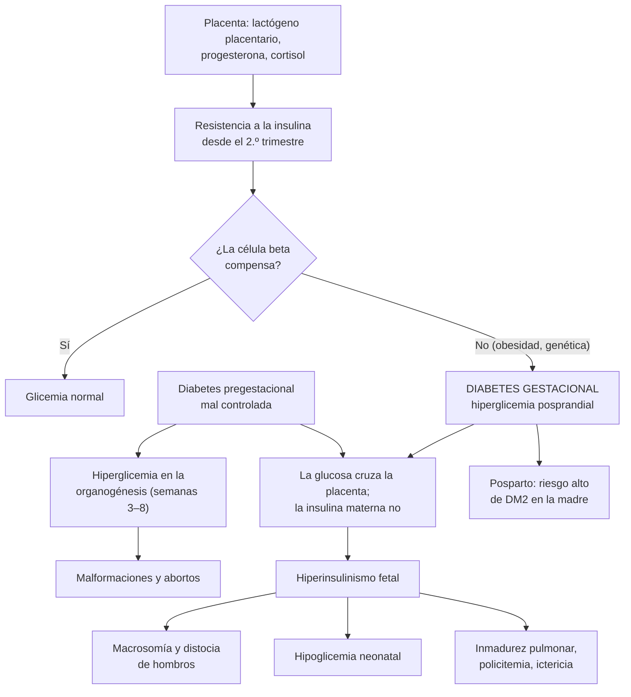

---
tags:
  - Endocrinología
  - GES
  - Frecuente en sala
---

# Diabetes y embarazo: diabetes gestacional y diabetes pregestacional

**Subespecialidad**
Endocrinología y diabetes · Obstetricia (alto riesgo obstétrico) · Medicina interna · Atención primaria

**Guías principales**
Guía Perinatal MINSAL 2015 (capítulo de diabetes y embarazo, basado en la Guía Diabetes y Embarazo 2014) · ADA Standards of Care in Diabetes 2026, sección 15: diabetes en el embarazo

**Otras fuentes**
HAPO (hiperglicemia y resultados del embarazo, 2008) · MiG (metformina frente a insulina, 2008) · TOBOGM (diabetes gestacional precoz, 2023) · CONCEPTT (monitoreo continuo en DM1, 2017) · Cohorte chilena CHiMINCs-II (Santiago, 2024 y 2026)

**GES**
La **diabetes pregestacional** tipo 1 y tipo 2 está cubierta por sus problemas GES (n.º 6 y n.º 7). La diabetes gestacional se maneja en el **control prenatal** del sistema público (Programa de Salud de la Mujer).

**EUNACOM**
1.02.1.002 Diabetes gestacional (específico, inicial, derivar) · 1.02.1.003 Diabetes mellitus pregestacional (específico, completo, completo)

**Revisado**
Octubre 2026

!!! abstract "Resumen en 60 segundos"
    - **Diabetes pregestacional (DPG)**: diabetes tipo 1 o tipo 2 **previa** al embarazo, o diagnosticada en el **primer trimestre**.
        - La hiperglicemia en la **concepción** causa **malformaciones** (cardíacas, del tubo neural, regresión caudal) y **abortos**: con HbA1c > 10 % la tasa de malformaciones llega a ~ 50 %; con < 7 % se acerca a la de la población general.
        - **Planificar** el embarazo: HbA1c **< 6,5 %**, **ácido fólico**, suspender **IECA/ARA-II y estatinas**, cambiar los orales por **insulina**, fondo de ojo y función renal.
    - **Diabetes gestacional (DG)**: intolerancia a la glucosa que aparece o se detecta durante el embarazo.
        - En Chile afecta a **~ 17–19 %** de las embarazadas en cohortes de atención primaria de Santiago.
        - **Diagnóstico en Chile** (MINSAL): glicemia de ayuno **100–125 mg/dL** (confirmada) **o** PTGO de 75 g a las **24–28 semanas** con ayuno **≥ 100** y/o 2 horas **≥ 140 mg/dL**.
    - **Metas** (MINSAL): ayuno **60–90 mg/dL**, **1 hora** posprandial **< 140**, **2 horas < 120 mg/dL**; HbA1c **< 6 %** en la DPG.
    - **Tratamiento**:
        - DG: **alimentación** y **automonitoreo** por 2 semanas; si no se logran las metas, **insulina** (NPH ± rápida). La **metformina** es una alternativa en casos seleccionados.
        - DPG: **insulina** basal-bolo intensiva; en la DM1, idealmente con **monitoreo continuo**.
        - **Aspirina en dosis baja** desde antes de las 16 semanas en la DPG (prevención de la preeclampsia).
    - **Hijo de madre diabética**: **macrosomía**, distocia de hombros, **hipoglicemia neonatal**, distrés respiratorio, polidramnios.
    - **Posparto**: la DG desaparece, pero el riesgo de **DM2** es alto: **PTGO a las 6–12 semanas** y luego tamizaje periódico.

## Definición

- **Diabetes pregestacional** (MINSAL 2015): mujer con diabetes **tipo 1 o tipo 2** que se embaraza, **o** que cumple criterios de diabetes durante el **primer trimestre**:
    - glicemia al azar **≥ 200 mg/dL** con síntomas clásicos;
    - glicemia de ayuno **≥ 126 mg/dL**, confirmada en otro día;
    - glicemia **≥ 200 mg/dL** a las 2 horas de una PTGO con 75 g.
    - **Toda diabetes diagnosticada en el primer trimestre se considera pregestacional** (muchas mujeres con DM2 no saben que la tienen).
- **Diabetes gestacional** (MINSAL 2015): **cualquier grado de intolerancia a la glucosa** que se manifiesta o detecta durante el embarazo:
    - glicemia de ayuno **entre 100 y 125 mg/dL** en **2 días diferentes**, y/o
    - glicemia **≥ 140 mg/dL** a las **2 horas** de la PTGO, en el segundo o tercer trimestre.
- **Criterios internacionales** (ADA 2026, IADPSG): PTGO con 75 g a las 24–28 semanas, con **un** valor alterado: ayuno **≥ 92**, 1 hora **≥ 180** o 2 horas **≥ 153 mg/dL** (estrategia de un paso). Diagnostican **más** diabetes gestacional que los criterios chilenos.
- **Hijo de madre diabética**: recién nacido de una madre con DPG o DG, con riesgo de las complicaciones fetales y neonatales de la hiperglicemia.

## Epidemiología

### Mundial

- La diabetes es la **alteración metabólica más frecuente** del embarazo; su frecuencia aumenta con la **obesidad**, la **edad materna** y la DM2 en mujeres jóvenes.
- **HAPO** (23 316 embarazadas, 2008): la relación entre la glicemia materna y los resultados adversos (peso al nacer > percentil 90, cesárea, hipoglicemia neonatal, péptido C en el cordón) es **continua**, sin un umbral claro.
- **Riesgo según el peso** (MINSAL 2015): comparado con un IMC normal, el riesgo de DG aumenta con el sobrepeso (OR **3,5**), la obesidad I (OR **7,7**) y la obesidad II–III (OR **11**).
- **Diabetes pregestacional** mal controlada: malformaciones en **~ 6 %** (36,8 % cardíacas, 20,8 % neurológicas); con **HbA1c > 10 %** llegan a **~ 50 %** (MINSAL 2015).

### Chile

!!! chile "Datos nacionales"
    - **Prevalencia de diabetes gestacional** en la cohorte **CHiMINCs-II** (embarazadas atendidas en la atención primaria de **Puente Alto**, Santiago; criterios MINSAL):
        - **18,9 %** de 1472 embarazadas (Campos 2024).
        - **17 %** de 1730 embarazadas, en un contexto de **alta prevalencia de obesidad** materna; además, preeclampsia 3,3 % y macrosomía 7,1 % (Mujica-Coopman 2026).
    - **Planificación del embarazo** (Guía Perinatal MINSAL 2015): solo el **46 %** de los embarazos en el sistema público es planificado, y apenas el **1,5 %** de las beneficiarias de FONASA en edad fértil ha tenido un **control preconcepcional**.
    - **Diabetes en mujeres en edad fértil** (ENS 2009–2010, citada por MINSAL): **0,6 %** entre los 15 y 24 años y **4,7 %** entre los 25 y 44 años.
    - **Tamizaje universal**: glicemia de ayuno en el **primer control prenatal** y **PTGO** a las 24–28 semanas a todas las embarazadas con glicemia normal (MINSAL 2015).
    - La **DM1** (GES 6) y la **DM2** (GES 7) son GES, lo que cubre a las embarazadas con diabetes pregestacional.

## Etiología y factores de riesgo

- **Factores de riesgo de diabetes gestacional** (MINSAL 2015):
    - **diabetes gestacional** en un embarazo anterior;
    - **diabetes** en familiares de **primer grado**;
    - **IMC ≥ 27** al comienzo del embarazo;
    - hijo previo **macrosómico** (≥ 4000 g);
    - **síndrome de ovario poliquístico**;
    - crecimiento fetal cercano o mayor al **percentil 90** (o cercano o menor al percentil 10);
    - **glucosuria** positiva.
- Otros: edad materna > 35 años, etnia (asiática, latina, indígena), sedentarismo, aumento de peso excesivo en el embarazo.
- **Diabetes pregestacional**: DM1 (autoinmune) y, cada vez más, **DM2** en mujeres jóvenes con obesidad.

## Fisiopatología

- **Embarazo normal**: desde el **segundo trimestre**, las hormonas de la placenta (**lactógeno placentario**, progesterona, cortisol, prolactina) producen **resistencia a la insulina** creciente, máxima en el tercer trimestre. La célula beta compensa secretando más insulina.
- **Diabetes gestacional**: la célula beta **no logra compensar** (a menudo hay una resistencia a la insulina previa por obesidad) → hiperglicemia, sobre todo **posprandial**.
- **Efectos en el feto** (hipótesis de **Pedersen**):
    - La **glucosa cruza la placenta**; la **insulina materna no**.
    - El feto responde con **hiperinsulinismo** → **macrosomía** (sobre todo de tronco y hombros), organomegalia, retraso de la madurez pulmonar.
    - Al nacer se corta el aporte de glucosa, pero persiste el hiperinsulinismo → **hipoglicemia neonatal**.
    - Otros: policitemia, hiperbilirrubinemia, hipocalcemia, miocardiopatía hipertrófica.
- **Hiperglicemia en la organogénesis** (semanas 3–8, a menudo antes de saber que está embarazada): **malformaciones** y **abortos** (solo en la DPG, no en la DG).
- **Primer trimestre en la DM1**: la sensibilidad a la insulina **aumenta** (semanas 7–15) → **hipoglicemias**; luego las necesidades suben hasta el doble o más hacia las semanas 28–35 y caen bruscamente **tras el parto**.

*Figura 1. Fisiopatología de la diabetes gestacional y de los efectos de la hiperglicemia materna en el feto. Esquema propio basado en la Guía Perinatal MINSAL 2015 y ADA 2026.*

## Clasificación

| | Diabetes pregestacional | Diabetes gestacional |
|---|---|---|
| **Momento** | Antes del embarazo o diagnosticada en el **1er trimestre** | Diagnosticada en el **2.º o 3er trimestre** (o ayuno 100–125 mg/dL en el 1er trimestre, según MINSAL) |
| **Tipos** | DM1, DM2, otras | — |
| **Malformaciones** | **Sí** (si hay mal control periconcepcional) | No (aparece después de la organogénesis) |
| **Complicaciones crónicas maternas** | Retinopatía, nefropatía (pueden progresar) | No |
| **Tratamiento** | **Insulina** intensiva | Alimentación → insulina si no hay control (metformina en casos seleccionados) |
| **Posparto** | Vuelve a su tratamiento previo (dosis menores) | Suele normalizarse; **PTGO a las 6–12 semanas** |

## Clínica

- **Diabetes gestacional**: casi siempre **asintomática**; se detecta por el **tamizaje**.
- **Pistas**: **glucosuria**, **polihidroamnios**, feto **grande para la edad gestacional** (> percentil 90), aumento de peso excesivo.
- **Diabetes pregestacional**: los síntomas de la diabetes conocida; hipoglicemias en el primer trimestre (DM1); progresión de la **retinopatía** y la **nefropatía**; mayor riesgo de **preeclampsia**, infecciones urinarias y cetoacidosis.
- **Cetoacidosis en el embarazo**: puede ocurrir con glicemias **más bajas** (en **10–30 %**, con glicemia < 250 mg/dL); es una emergencia materna y fetal.

!!! alarma "Signos de alarma: derivar a urgencia u obstetricia de alto riesgo"
    - **Cetoacidosis** o glicemia **≥ 250 mg/dL** con náuseas, vómitos, dolor abdominal o enfermedad intercurrente: medir **cetonas**.
    - **Hipoglicemia grave** (sobre todo en la DM1 en el primer trimestre).
    - **Hipertensión**, proteinuria, cefalea o alteraciones visuales (**preeclampsia**).
    - **Disminución de los movimientos fetales**.
    - **Polihidroamnios** o feto muy grande.
    - **Pérdida de visión** (progresión de la retinopatía, edema macular).

## Diagnóstico

!!! guia "Detección y diagnóstico en Chile (Guía Perinatal MINSAL 2015)"
    - **A**: **glicemia de ayuno a toda embarazada** en el **primer control prenatal** (tamizaje universal).
    - **B**: en el primer trimestre, la diabetes se diagnostica con los criterios generales (≥ 126 mg/dL en ayunas confirmada, ≥ 200 mg/dL al azar con síntomas o ≥ 200 mg/dL a las 2 horas de la PTGO) → **diabetes pregestacional**.
    - **C**: glicemia de ayuno **100–125 mg/dL** → **repetir en ≤ 7 días** con alimentación normal; si se confirma → **diabetes gestacional**.
    - **D**: con glicemia de ayuno normal, **PTGO con 75 g a las 24–28 semanas**: ayuno **≥ 100** y/o 2 horas **≥ 140 mg/dL** → **diabetes gestacional**.
    - **E**: repetir la PTGO a las **30–33 semanas** si hay factores de riesgo (polihidroamnios, macrosomía fetal, aumento de peso excesivo) con una PTGO previa normal.
    - **Precaución**: la PTGO está **contraindicada tras una cirugía bariátrica** (síndrome de *dumping*); usar un perfil de glicemias capilares por 24 horas.

- **ADA 2026** usa la **PTGO de 75 g** con los umbrales de la IADPSG (**92 / 180 / 153 mg/dL**) o la estrategia de **dos pasos** (carga de 50 g y luego PTGO de 100 g). Recomienda buscar una diabetes no diagnosticada **antes de las 15 semanas** en las mujeres con factores de riesgo.
- **TOBOGM** (2023): en mujeres con factores de riesgo y diabetes gestacional diagnosticada **antes de las 20 semanas**, el tratamiento **inmediato** redujo modestamente un desenlace neonatal adverso compuesto frente a postergar el tratamiento.

<figure markdown>
![Flujograma de la detección y el diagnóstico de la diabetes en el embarazo según la Guía Perinatal MINSAL 2015. En el primer control prenatal se mide la glicemia de ayuno a todas las embarazadas. Si es menor de 100 mg/dL, es normal y se hace una PTGO con 75 g a las 24 a 28 semanas. Si es de 100 a 125 mg/dL, se repite en 7 días o menos con alimentación normal, y si se confirma es una diabetes gestacional. Si es de 126 mg/dL o más en 2 ocasiones, o 200 o más con síntomas, o la PTGO a las 2 horas es de 200 o más, es una diabetes pregestacional (toda diabetes del primer trimestre). En la PTGO de las 24 a 28 semanas, un ayuno de 100 o más y/o una glicemia a las 2 horas de 140 o más es diabetes gestacional; si es normal se descarta, y se repite a las 30 a 33 semanas si hay polihidroamnios, macrosomía o aumento de peso excesivo. Recuadro de comparación con los criterios IADPSG y ADA 2026: PTGO de 75 g a las 24 a 28 semanas con ayuno de 92 o más, 1 hora de 180 o más o 2 horas de 153 o más, bastando un valor; son más sensibles; la PTGO está contraindicada tras una cirugía bariátrica. Abajo: en la diabetes gestacional, alimentación y automonitoreo por 2 semanas y luego insulina NPH con o sin rápida si no se logran las metas; metas de ayuno 60 a 90, 1 hora posprandial bajo 140 y 2 horas bajo 120, y HbA1c bajo 6 por ciento en la pregestacional; en el posparto, PTGO a las 6 a 12 semanas en toda mujer con diabetes gestacional y luego tamizaje cada 1 a 3 años](../assets/figuras/embarazo/diagnostico-diabetes-embarazo.svg){ loading=lazy }
<figcaption>Figura 2. Detección y diagnóstico de la diabetes en el embarazo en Chile, comparados con los criterios de la IADPSG y la ADA. Esquema propio basado en la Guía Perinatal MINSAL 2015 y ADA 2026.</figcaption>
</figure>

## Laboratorio

| Examen | Diabetes pregestacional | Diabetes gestacional |
|---|---|---|
| **Glicemia capilar** (automonitoreo) | ≥ **4 veces al día** (ayunas, pre y posprandial) + **antes de acostarse** si usa insulina | Según la gravedad: **1–2 veces al día** alternando ayuno y posprandiales; más si usa insulina |
| **HbA1c** | **Cada 6–8 semanas**; meta **< 6 %** (MINSAL) | Opcional; útil en el primer trimestre |
| **Monitoreo continuo de glucosa** | Recomendado en la **DM1** (CONCEPTT: mejores resultados neonatales); meta de **tiempo en rango 63–140 mg/dL > 70 %** | — |
| **Cetonas** (orina o sangre) | Si la glicemia es **≥ 250 mg/dL** o hay una enfermedad intercurrente | — |
| **Creatinina** y **razón albúmina/creatinina** | En el **primer control**; luego cada 4 semanas en el 2.º trimestre, cada 2 en el 3.º y semanal desde la semana 36 (MINSAL) | — |
| **Fondo de ojo** | En el **primer trimestre**; repetir cada 3 meses (mensual si hay retinopatía no proliferativa grave) | **No** requiere |
| **TSH** | En la DM1 (tiroiditis autoinmune) | — |
| **Urocultivo** | Al ingreso y si hay albuminuria | — |

- **Metas de glicemia capilar** (MINSAL 2015):

| Momento | Meta |
|---|---|
| **Antes del desayuno** | **60–90 mg/dL** |
| Antes de otras comidas | 60–105 mg/dL |
| **1 hora después de comer** | **< 140 mg/dL** |
| **2 horas después de comer** | **< 120 mg/dL** |
| Durante la noche | 60–99 mg/dL |
| **HbA1c** (DPG) | **< 6 %** |

- Un control **demasiado estricto** (glicemia promedio ≤ 86 mg/dL) se asocia a **fetos pequeños** para la edad gestacional.

## Imágenes

- **Ecografía del primer trimestre** (11–14 semanas): viabilidad (más abortos en la DPG), edad gestacional, malformaciones mayores; **Doppler de las arterias uterinas** (riesgo de preeclampsia).
- **Ecografía de las 20–24 semanas**: anatomía fetal detallada, sobre todo el **corazón**.
- **Ecocardiografía fetal** a las **24–28 semanas** en la DPG.
- **Tercer trimestre**: crecimiento fetal y líquido amniótico **cada 2–4 semanas**; signos de **hipertrofia ventricular** fetal con mal control.
- **Bienestar fetal**: movimientos fetales, registro basal no estresante y perfil biofísico (desde las 28–32 semanas en la DPG o con mal control; desde las 36 en la DG bien controlada).

## Diagnóstico diferencial

| Situación | Diferencial |
|---|---|
| **Hiperglicemia en el 1er trimestre** | **Diabetes pregestacional no diagnosticada** (DM2) frente a diabetes gestacional precoz |
| **Glucosuria en el embarazo** | **Glucosuria renal fisiológica** (aumento de la filtración glomerular) frente a diabetes: confirmar con **glicemia** |
| **Feto grande** | Diabetes, obesidad materna, error de la edad gestacional, constitucional, síndromes de sobrecrecimiento |
| **Polihidroamnios** | Diabetes, malformaciones fetales (digestivas, del sistema nervioso), infecciones, idiopático |
| **Diabetes en una joven con fuerte historia familiar y anticuerpos negativos** | **MODY** (*GCK*: el manejo depende del genotipo fetal) (ver [DM1 y otros tipos](diabetes-tipo-1-y-otros-tipos.md)) |

## Tratamiento

### Preconcepcional (diabetes pregestacional)

- **Planificar** el embarazo (anticoncepción eficaz hasta lograr el control).
- **HbA1c < 6,5 %** antes de la concepción (si se logra sin hipoglicemias).
- **Ácido fólico** desde antes de la concepción (en la diabetes se suele indicar una dosis **mayor** por el riesgo de defectos del tubo neural).
- **Suspender** los fármacos **teratogénicos**: **IECA, ARA-II**, **estatinas**; cambiar los **antidiabéticos orales y los arGLP-1** por **insulina** (en la DM2).
- **Fondo de ojo** (tratar la retinopatía antes), **creatinina** y **albuminuria**, **TSH**, presión arterial.

### Diabetes gestacional

1. **Tratamiento médico nutricional** con nutricionista: dieta saludable con una **reducción moderada de carbohidratos**, fraccionada (por ejemplo, 4 comidas y 2 colaciones), sin restricción calórica excesiva (evitar la **cetosis**). **Actividad física** regular.
2. **Automonitoreo** de la glicemia capilar.
3. **Insulina** si en **2 semanas** no se logran las metas (por ejemplo, ≥ 20 % de los controles fuera de meta o 2 valores alterados en el mismo horario).
    - Dosis inicial baja: **0,1–0,2 U/kg/día de NPH**, según el perfil (MINSAL):
        - solo **ayuno** alterado: **NPH nocturna** (0,1 U/kg);
        - solo **posdesayuno** alterado: **insulina rápida** antes del desayuno (2–4 U);
        - **tarde** alterada (posalmuerzo, preonces o precena): **NPH matinal** (0,15 U/kg);
        - **ayuno y tarde** alterados: **NPH 0,2 U/kg/día** (2/3 en la mañana y 1/3 en la noche).
4. **Antidiabéticos orales**: la insulina es de elección. La **metformina** (cruza la placenta) se reserva para **casos seleccionados** (rechazo o imposibilidad de usar insulina) o como complemento; en el ensayo MiG no aumentó las complicaciones perinatales frente a la insulina. La **glibenclamida** no se recomienda (más hipoglicemia neonatal y macrosomía).

### Diabetes pregestacional

- **DM1**: insulina **basal-bolo** (NPH en 2 dosis o análogos como detemir o glargina, + rápida o análogos prandiales), ~ **50 % basal** y 50 % prandial. Requerimientos promedio: **~ 0,7 U/kg** en el primer trimestre, con **caída** entre las semanas 7 y 15 (hipoglicemias), y **aumento** hasta ~ **0,9 U/kg** a las 29–34 semanas o más.
- **DM2**: cambiar los orales por **insulina**; inicio con NPH **0,2 U/kg/día** si la descompensación es moderada, o **0,4–0,6 U/kg/día** (hospitalizada si la HbA1c es > 9 %); ajustes del **10 %** de la dosis.
- **Monitoreo continuo de glucosa** en la DM1.
- **Aspirina en dosis baja** (**100–150 mg en la noche**, desde **antes de las 16 semanas** hasta las 36) para prevenir la **preeclampsia** (ver [preeclampsia](../nefrologia/preeclampsia-y-sindrome-hipertensivo-del-embarazo.md)).
- **Presión arterial**: tratar con fármacos seguros (**labetalol**, **nifedipino**, metildopa); **no** IECA ni ARA-II.
- **Control obstétrico de alto riesgo** con un equipo multidisciplinario.

### Parto y posparto

- **Momento del parto**: la DG bien controlada solo con dieta suele llegar a término (en general hasta las **39–40 semanas**); con insulina, mal control o complicaciones, la interrupción se adelanta según el obstetra.
- **Trabajo de parto**:
    - **DG**: rara vez requiere insulina; glicemia capilar al ingreso y cada 4–6 horas.
    - **DPG**: suero glucosado al 5 % (~ **125 mL/h**) + **infusión de insulina** (1–3 U/h) con controles **cada 1–2 horas**, meta **90–120 mg/dL** (MINSAL); evitar la glicemia **> 180 mg/dL** (hipoglicemia neonatal).
- **Posparto inmediato**: la resistencia a la insulina **desaparece** al salir la placenta.
    - **DG**: **suspender** la insulina; controlar las glicemias.
    - **DM1**: reiniciar con **1/3 a 1/2** de la dosis previa al parto (riesgo de **hipoglicemia**).
    - **DM2**: puede no requerir tratamiento las primeras 24–48 horas; la **metformina** es compatible con la **lactancia**.
- **Recién nacido**: **glicemia** precoz y alimentación temprana (riesgo de hipoglicemia); lactancia materna.
- **Seguimiento de la DG**: **PTGO a las 6–12 semanas posparto**; si es normal, **tamizaje cada 1–3 años** de por vida (examen de medicina preventiva); estilo de vida saludable, control del peso y **lactancia** (reducen el riesgo de DM2).

!!! dosis "Dosis de referencia (embarazo)"
    - **DG, insulina NPH**: **0,1–0,2 U/kg/día** según el perfil (ver arriba); ajustes cada 2–3 días.
    - **Insulina rápida posprandial**: **2 U** media hora antes de la comida si la glicemia posprandial es 140–179 mg/dL; **4 U** si es ≥ 180 mg/dL (MINSAL).
    - **DM2 en el embarazo**: NPH **0,2 U/kg/día** al inicio (descompensación moderada) o **0,4–0,6 U/kg/día** (descompensación marcada).
    - **Metformina** (casos seleccionados): **500 mg/día** con comida, subiendo hasta **2000–2500 mg/día** repartidos.
    - **Aspirina**: **100–150 mg en la noche**, desde las 12–16 semanas hasta las 36.
    - **Ácido fólico**: desde 3 meses antes de la concepción (en la diabetes se usan dosis mayores, según la indicación local).
    - **Trabajo de parto (DPG)**: suero glucosado 5 % a **125 mL/h** + insulina EV **1–3 U/h**, meta **90–120 mg/dL**.

## Complicaciones

| Complicación | Claves |
|---|---|
| **Malformaciones congénitas** | Solo DPG con mal control periconcepcional: **cardíacas** (las más frecuentes), **tubo neural**, **regresión caudal** (rara pero característica), renales |
| **Aborto** y muerte fetal | DPG mal controlada; muerte fetal tardía con mal control |
| **Macrosomía** | La principal complicación de la DG; **distocia de hombros**, fractura de clavícula, **parálisis del plexo braquial**, cesárea |
| **Hipoglicemia neonatal** | Hiperinsulinismo fetal; mayor con hiperglicemia materna durante el parto |
| **Otras neonatales** | Distrés respiratorio, policitemia, hiperbilirrubinemia, hipocalcemia, miocardiopatía hipertrófica |
| **Maternas** | **Preeclampsia** e hipertensión (40–45 % en la DPG), cesárea, infecciones, **cetoacidosis**, hipoglicemia, progresión de la **retinopatía** y la **nefropatía** |
| **Largo plazo** | Madre con DG: **alto riesgo de DM2** y enfermedad cardiovascular; hijo: más obesidad y diabetes |

## Pronóstico y seguimiento

- Con un **buen control glicémico**, los resultados perinatales se acercan a los de la población general (HAPO: el riesgo crece de forma continua con la glicemia).
- **DPG**: el control **preconcepcional** es lo que más reduce las malformaciones.
- **DG**: suele **desaparecer después del parto**, pero:
    - **recurre** a menudo en los embarazos siguientes;
    - el riesgo de **DM2** es alto a lo largo de la vida, por lo que requiere **seguimiento indefinido**.
- **Seguimiento posparto**: PTGO a las **6–12 semanas**; si es normal, cada **1–3 años**; promover la lactancia, la baja de peso y la actividad física.

## Perlas para el internado

!!! perla "Para recordar en la sala"
    - En Chile, la DG se diagnostica con **ayuno 100–125 mg/dL confirmado** o **PTGO 2 h ≥ 140 mg/dL** (no con los 92/180/153 de la IADPSG).
    - **Toda diabetes encontrada en el primer trimestre es pregestacional** hasta demostrar lo contrario.
    - La **glucosuria** en el embarazo puede ser **fisiológica**: confirma con glicemia.
    - En la **DM1** embarazada, las **hipoglicemias** del primer trimestre son frecuentes: hipoglicemias inexplicadas pueden ser el primer signo del embarazo.
    - **Suspende los IECA, ARA-II y estatinas** antes de la concepción; cambia los orales por **insulina** en la DM2.
    - La **insulina** es el tratamiento de elección; la metformina queda para casos seleccionados.
    - Tras el parto, la resistencia a la insulina **desaparece de golpe**: suspende la insulina en la DG y **baja la dosis** en la DM1.
    - **PTGO a las 6–12 semanas posparto** a toda mujer con DG; muchas lo olvidan y luego aparecen con una DM2.
    - **Cetoacidosis en el embarazo** con glicemias "no tan altas": mide **cetonas** con glicemia ≥ 250 mg/dL o una enfermedad intercurrente.

## Preguntas de repaso

??? repaso "1. Embarazada de 9 semanas, IMC 31, con glicemia de ayuno de 112 mg/dL en el primer control prenatal. ¿Qué hace?"
    - **Repetir la glicemia de ayuno en ≤ 7 días**, con alimentación normal (MINSAL).
    - Si se confirma entre **100 y 125 mg/dL** → **diabetes gestacional**.
    - Si fuera **≥ 126 mg/dL** (confirmada) → **diabetes pregestacional** (probable DM2 no diagnosticada).
    - Se puede pedir una **HbA1c** junto con el segundo examen.
    - **Manejo** si se confirma la DG: derivar al **alto riesgo obstétrico**, **nutricionista** y **automonitoreo**; insulina si no se logran las metas en 2 semanas.

??? repaso "2. Embarazada de 26 semanas con PTGO de 75 g: ayuno 92 mg/dL y 2 horas 156 mg/dL. ¿Tiene diabetes gestacional según los criterios chilenos? ¿Y según la IADPSG?"
    - **Chile (MINSAL)**: **sí**, porque la glicemia a las 2 horas es **≥ 140 mg/dL** (aunque el ayuno sea < 100).
    - **IADPSG/ADA**: **sí**, porque el ayuno es **≥ 92** y las 2 horas **≥ 153 mg/dL** (basta un valor).
    - **Manejo**: alimentación, actividad física y automonitoreo; insulina si a las 2 semanas no se logran las metas (ayuno 60–90; 1 hora < 140; 2 horas < 120 mg/dL).

??? repaso "3. Embarazada de 30 semanas con diabetes gestacional en dieta desde hace 2 semanas. Glicemias en ayunas 82–88 mg/dL, pero 1 hora después del almuerzo y de la cena entre 155 y 170 mg/dL. Pesa 70 kg. ¿Qué indica?"
    - **No logra las metas posprandiales** de la tarde (> 140 mg/dL a la hora) tras 2 semanas de dieta → **insulina**.
    - Con el perfil alterado en la **tarde** y ayuno normal: **NPH matinal ~ 0,15 U/kg** ≈ **10 U** antes del desayuno (MINSAL), o **insulina rápida** antes del almuerzo y la cena (2 U si 140–179 mg/dL).
    - **Ajustar** cada 2–3 días según el automonitoreo; reforzar la alimentación.
    - **Control obstétrico**: crecimiento fetal y líquido amniótico.

??? repaso "4. Mujer de 32 años con DM2 en tratamiento con metformina, enalapril y atorvastatina, que quiere embarazarse. HbA1c 8,4 %. ¿Qué le indica?"
    - **Postergar el embarazo** (anticoncepción eficaz) hasta lograr una **HbA1c < 6,5 %**: con su control actual, el riesgo de **malformaciones** y aborto es alto.
    - **Ácido fólico** desde ahora.
    - **Suspender el enalapril y la atorvastatina** antes de la concepción (teratogénicos); controlar la presión con fármacos seguros si es necesario.
    - **Insulina** antes de la concepción (puede mantener la metformina hasta que la evalúe el especialista).
    - **Fondo de ojo**, creatinina, albuminuria y TSH; control **preconcepcional** con diabetología y obstetricia.

??? repaso "5. Embarazada de 11 semanas con DM1 que consulta por 3 hipoglicemias en la última semana, una de ellas con compromiso de conciencia. Usa la misma dosis de insulina que antes del embarazo. ¿Qué explica las hipoglicemias y qué hace?"
    - En el **primer trimestre** de la DM1, la **sensibilidad a la insulina aumenta** (semanas 7–15) y las náuseas reducen la ingesta: la misma dosis produce **hipoglicemias**.
    - **Manejo**:
        - **Reducir la insulina** (sobre todo la basal nocturna) y ajustar las prandiales.
        - Educar en el manejo de la hipoglicemia y entregar **glucagón** a la familia.
        - **Monitoreo continuo de glucosa** si está disponible.
    - Recordar que las necesidades **aumentarán** a partir del segundo trimestre.

??? repaso "6. Mujer de 34 años que tuvo una diabetes gestacional tratada con insulina en su embarazo hace 3 meses. Ya no usa insulina. ¿Qué seguimiento necesita?"
    - **PTGO con 75 g** (a las **6–12 semanas posparto**; si no se hizo, hacerla ahora) para definir su estado: normal, prediabetes o diabetes.
    - Si es **normal**: tamizaje **cada 1–3 años** de por vida (examen de medicina preventiva).
    - **Prevenir la DM2**: lactancia materna, baja de peso, alimentación saludable, actividad física; considerar la **metformina** si tiene prediabetes.
    - **Próximo embarazo**: planificarlo y hacer el tamizaje **precoz** (alto riesgo de recurrencia).

## Referencias

1. Ministerio de Salud de Chile. Guía Perinatal 2015. Capítulo XIII: Diabetes y embarazo (basado en la Guía Diabetes y Embarazo 2014, Departamento de Enfermedades No Transmisibles y Departamento Ciclo Vital). [minsal.cl](https://www.minsal.cl/sites/default/files/files/GUIA%20PERINATAL_2015_%20PARA%20PUBLICAR.pdf)
2. American Diabetes Association Professional Practice Committee. 15. Management of diabetes in pregnancy: Standards of Care in Diabetes—2026. *Diabetes Care.* 2026;49(Suppl 1):S321–S338. doi:[10.2337/dc26-S015](https://doi.org/10.2337/dc26-S015)
3. HAPO Study Cooperative Research Group; Metzger BE, Lowe LP, et al. Hyperglycemia and adverse pregnancy outcomes. *N Engl J Med.* 2008;358(19):1991–2002. doi:[10.1056/NEJMoa0707943](https://doi.org/10.1056/NEJMoa0707943)
4. Rowan JA, Hague WM, Gao W, et al. Metformin versus insulin for the treatment of gestational diabetes. *N Engl J Med.* 2008;358(19):2003–2015. doi:[10.1056/NEJMoa0707193](https://doi.org/10.1056/NEJMoa0707193)
5. Simmons D, Immanuel J, Hague WM, et al. Treatment of gestational diabetes mellitus diagnosed early in pregnancy. *N Engl J Med.* 2023;388(23):2132–2144. doi:[10.1056/NEJMoa2214956](https://doi.org/10.1056/NEJMoa2214956)
6. Feig DS, Donovan LE, Corcoy R, et al. Continuous glucose monitoring in pregnant women with type 1 diabetes (CONCEPTT): a multicentre international randomised controlled trial. *Lancet.* 2017;390(10110):2347–2359. doi:[10.1016/S0140-6736(17)32400-5](https://doi.org/10.1016/S0140-6736(17)32400-5)
7. Campos P, Rebolledo N, Durán S, et al. Association between consumption of non-nutritive sweeteners and gestational diabetes mellitus in Chilean pregnant women: a secondary data analysis of the CHiMINCs-II cohort. *Nutrition.* 2024;128:112560. doi:[10.1016/j.nut.2024.112560](https://doi.org/10.1016/j.nut.2024.112560)
8. Mujica-Coopman MF, Martínez Á, Garmendia ML, et al. Association of iron status with gestational diabetes and preeclampsia in an obesogenic context: results from a cohort of pregnant Chilean women. *Eur J Clin Nutr.* 2026;80(9):912–918. doi:[10.1038/s41430-026-01783-6](https://doi.org/10.1038/s41430-026-01783-6)
