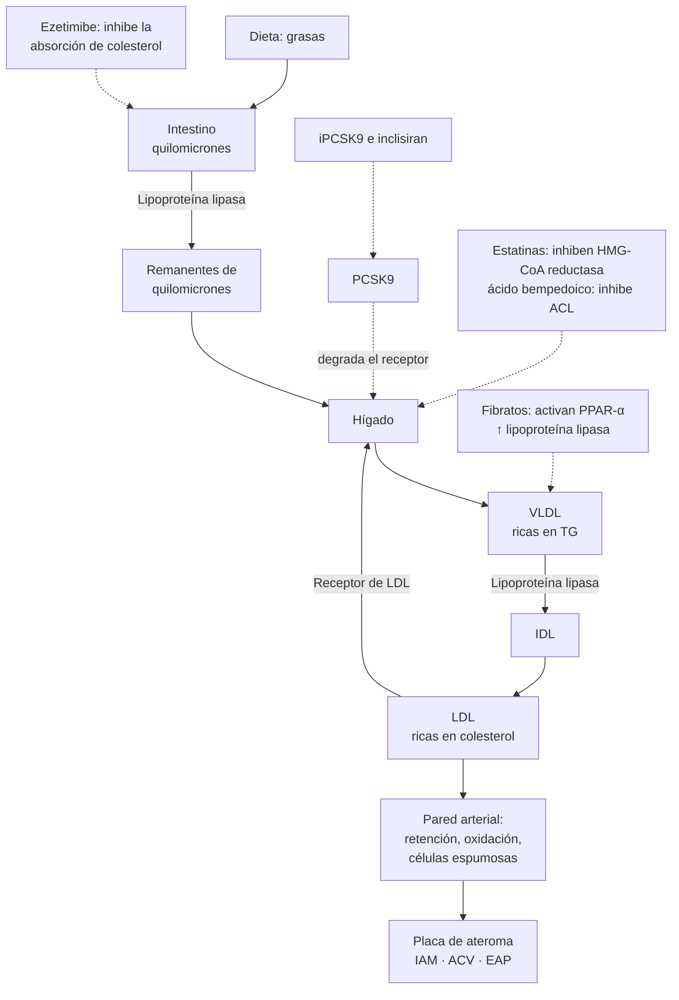

---
tags:
  - Endocrinología
  - Cardiología
  - Frecuente en sala
---

# Dislipidemias e hipertrigliceridemia grave

**Subespecialidad**
Endocrinología y nutrición · Cardiología preventiva · Medicina interna · APS

**Guías principales**
ACC/AHA y sociedades asociadas 2026: manejo de la dislipidemia (*J Am Coll Cardiol* y *Circulation*, 2026) · ESC/EAS 2025: actualización focalizada de la guía de dislipidemias 2019 (*Eur Heart J*, 2025)

**Otras fuentes**
Ecuaciones PREVENT (AHA 2024) · SCORE2 (ESC 2021) · ENS 2016–2017 · Ensayos IMPROVE-IT, FOURIER, CLEAR Outcomes y REDUCE-IT · Metaanálisis CTT

**GES**
No como problema propio. Se maneja en el Programa de Salud Cardiovascular (PSCV) de APS. Las estatinas forman parte del GES del IAM y del ACV isquémico (prevención secundaria)

**EUNACOM**
1.01.1.005 y 1.02.1.007 Dislipidemias (específico, completo, completo) · 1.02.2.005 Hipertrigliceridemia grave (específico, inicial, derivar)

**Revisado**
Septiembre 2026

!!! abstract "Resumen en 60 segundos"
    - El **LDL** y las demás lipoproteínas con **apoB** **causan** la aterosclerosis. El riesgo depende de la **concentración** y del **tiempo de exposición**: "más bajo por más tiempo es mejor".
    - **Primero se estima el riesgo cardiovascular global**, no se trata un número aislado:
        - Fórmulas de riesgo: **PREVENT** (ACC/AHA 2026), **SCORE2** (ESC) o la **tabla de Framingham adaptada** (PSCV Chile).
        - **Alto riesgo sin calcular**: enfermedad cardiovascular establecida, **LDL ≥ 190 mg/dL**, diabetes con daño de órgano, ERC.
    - **Metas de LDL** (ACC/AHA 2026 y ESC 2025, ahora muy parecidas):
        - **< 55 mg/dL** en el **muy alto riesgo** (prevención secundaria).
        - **< 70 mg/dL** en el alto riesgo.
        - **< 100 mg/dL** en el riesgo intermedio.
        - Además, una **reducción ≥ 50 %** en el alto y muy alto riesgo.
    - **Estatina** siempre como base (atorvastatina 40–80 o rosuvastatina 20–40 mg si el riesgo es alto). Si no se llega a la meta: **+ ezetimibe**, y luego **iPCSK9**, inclisiran o ácido bempedoico.
    - Medir la **Lp(a) una vez en la vida**: **≥ 125 nmol/L (≥ 50 mg/dL)** aumenta el riesgo.
    - **Hipertrigliceridemia grave** (**≥ 500 mg/dL**, y sobre todo **≥ 1.000 mg/dL**): la prioridad es **prevenir la pancreatitis**. Corregir las causas secundarias (diabetes descompensada, **alcohol**, hipotiroidismo, fármacos), dieta muy baja en grasa y **fenofibrato**.

## Definición

**Dislipidemia**: alteración de la concentración de las lipoproteínas plasmáticas que aumenta el riesgo de enfermedad cardiovascular aterosclerótica (ECVA) o de pancreatitis.

| Parámetro | Deseable | Alterado |
|---|---|---|
| **Colesterol total** | < 200 mg/dL | ≥ 200 (≥ 240 alto) |
| **LDL** | Según el riesgo (ver metas) | **≥ 160 alto**, **≥ 190 muy alto** (sospechar hipercolesterolemia familiar) |
| **HDL** | ≥ 40 (hombres), ≥ 50 (mujeres) | Bajo si < 40 / < 50 |
| **Colesterol no-HDL** (CT − HDL) | Meta = meta de LDL + 30 mg/dL | Refleja **todas** las partículas aterogénicas |
| **Triglicéridos** (TG) | < 150 mg/dL | **150–499** leve a moderada · **≥ 500** grave · **≥ 1.000** muy grave (riesgo de pancreatitis) |
| **Lp(a)** | < 75 nmol/L (< 30 mg/dL) | **≥ 125 nmol/L (≥ 50 mg/dL)**: factor de riesgo |

## Epidemiología

### Mundial

- El **LDL alto** es uno de los principales factores de riesgo modificables de cardiopatía isquémica y ACV isquémico, las dos primeras causas de muerte en el mundo.
- Por cada **38,7 mg/dL (1 mmol/L)** que baja el LDL con estatinas, los **eventos vasculares mayores** bajan **~ 22 %** en 5 años, sin un umbral inferior de beneficio (metaanálisis CTT, 2010).
- La **Lp(a)** está elevada (≥ 50 mg/dL) en **~ 20 %** de la población y está determinada casi por completo por la **genética**.
- La **hipercolesterolemia familiar** heterocigota afecta a **~ 1 de cada 250–300** personas, y la mayoría no está diagnosticada.

### Chile

!!! chile "Datos nacionales (ENS 2016–2017)"
    - **Colesterol total ≥ 200 mg/dL**: **27,8 %** de los mayores de 15 años (26,1 % hombres, 29,4 % mujeres).
    - **HDL bajo**: **45,8 %** (39,9 % hombres, 51,5 % mujeres).
    - **Triglicéridos ≥ 150 mg/dL**: **35,8 %** (41,5 % hombres, 30,2 % mujeres).
    - El patrón predominante es la **dislipidemia aterogénica** (TG altos + HDL bajo), asociada a la **obesidad**, el sedentarismo y la **diabetes**, que tienen alta prevalencia en Chile.
    - En la **APS**, la dislipidemia se maneja en el **Programa de Salud Cardiovascular (PSCV)**:
        - Se clasifica el riesgo con la **tabla de Framingham adaptada a la población chilena** (bajo, moderado, alto).
        - Se tamiza en el **EMPA**.
        - Hay **atorvastatina** disponible en la APS.

## Etiología y factores de riesgo

### Primarias (genéticas)

| Trastorno | Alteración | Claves |
|---|---|---|
| **Hipercolesterolemia familiar** (heterocigota) | Mutación del receptor de LDL, de la apoB o de la PCSK9 (ganancia de función); autosómica dominante | **LDL ≥ 190 mg/dL** en el adulto, **xantomas tendíneos** (Aquiles, extensores de la mano), **arco corneal < 45 años**, **enfermedad coronaria precoz** en la familia. Criterios de la **Dutch Lipid Clinic Network** |
| **Hiperlipidemia familiar combinada** | Producción aumentada de apoB | La más frecuente; LDL y TG altos, variables en la familia |
| **Disbetalipoproteinemia** (tipo III) | Genotipo apoE2/E2 | CT y TG altos en proporción similar; **xantomas palmares** |
| **Síndrome de quilomicronemia familiar** | Déficit de **lipoproteína lipasa** o de sus cofactores | **TG > 1.000 mg/dL** persistentes desde la infancia, **pancreatitis recurrente**, xantomas eruptivos |
| **Lp(a) elevada** | Genética | Riesgo de ECVA y de **estenosis aórtica** calcificada |

### Secundarias (buscarlas siempre)

| Aumentan el LDL | Aumentan los TG |
|---|---|
| **Hipotiroidismo** | **Diabetes descompensada**, resistencia a la insulina, obesidad |
| **Síndrome nefrótico** | **Alcohol** |
| **Colestasis** (cirrosis biliar primaria) | **ERC**, síndrome nefrótico |
| Embarazo, anorexia nerviosa | **Hipotiroidismo**, embarazo |
| **Fármacos**: corticoides, ciclosporina, tiazidas, progestágenos, retinoides, algunos antirretrovirales | **Fármacos**: **estrógenos orales**, tamoxifeno, corticoides, **betabloqueadores**, tiazidas, **retinoides**, antipsicóticos atípicos, inhibidores de proteasa, **propofol**, L-asparaginasa |
| Dieta rica en grasas saturadas y *trans* | Dieta rica en **azúcares refinados** y carbohidratos, sedentarismo |

## Fisiopatología

- **Vía exógena**: el intestino absorbe las grasas de la dieta y forma **quilomicrones**. La **lipoproteína lipasa** (LPL) del endotelio hidroliza sus TG y deja **remanentes** que capta el hígado.
- **Vía endógena**: el hígado produce **VLDL** (ricas en TG). La LPL las transforma en **IDL** y luego en **LDL**, rica en colesterol.
- El **receptor de LDL** del hígado retira el LDL de la sangre. La **PCSK9** degrada ese receptor: si se inhibe la PCSK9, hay más receptores y el LDL baja.
- Cada partícula aterogénica (VLDL, IDL, LDL, remanentes y Lp(a)) tiene **una apoB**. Las partículas entran a la pared arterial, quedan retenidas y se oxidan. Los macrófagos las captan y se transforman en **células espumosas**, que forman la placa. La inflamación vuelve inestable la placa, que puede romperse y producir una trombosis (IAM, ACV).
- **HDL**: participa en el transporte reverso del colesterol. Subir el HDL con fármacos **no** reduce los eventos.
- **Hipertrigliceridemia grave**: los **quilomicrones** muy abundantes hacen la sangre **lechosa**. Su hidrólisis en el páncreas libera ácidos grasos libres tóxicos que producen **pancreatitis aguda**, sobre todo con TG ≥ 1.000 mg/dL.

*Figura 1. Metabolismo de las lipoproteínas y sitio de acción de los hipolipemiantes. Esquema propio.*

## Clasificación

- **Por el perfil**:
    - **Hipercolesterolemia aislada**: LDL alto.
    - **Hipertrigliceridemia aislada**: TG altos.
    - **Dislipidemia mixta**: LDL y TG altos.
    - **HDL bajo aislado**.
    - **Dislipidemia aterogénica**: TG altos + HDL bajo + LDL pequeñas y densas. Típica de la diabetes tipo 2, la obesidad y el síndrome metabólico.
- **Por la causa**: primaria (genética) o secundaria.
- **Por el riesgo cardiovascular** (lo que define el tratamiento):

| Categoría | ACC/AHA 2026 (PREVENT, riesgo a 10 años) | ESC/EAS 2019–2025 |
|---|---|---|
| **Muy alto** | ECVA con eventos múltiples o condiciones de alto riesgo; **CAC ≥ 1.000** (fenotipo de riesgo extremo) | **ECVA** clínica o en la imagen; diabetes con daño de órgano o ≥ 3 factores de riesgo; **ERC grave** (TFGe < 30); SCORE2 ≥ 20 %; HF con ECVA u otro factor mayor |
| **Alto** | **≥ 10 %**; **LDL ≥ 190 mg/dL** | Un factor muy elevado (**LDL > 190**, **PA ≥ 180/110**); **hipercolesterolemia familiar**; diabetes sin daño de órgano con ≥ 10 años de evolución; ERC moderada (TFGe 30–59) |
| **Intermedio** | **5 % a < 10 %** | Moderado: SCORE2 intermedio según la edad |
| **Limítrofe** | **3 % a < 5 %** | — |
| **Bajo** | **< 3 %** | Bajo |

**Factores que aumentan el riesgo** (útiles en el riesgo limítrofe o intermedio):

- Historia familiar de ECVA precoz.
- LDL persistentemente ≥ 160 mg/dL.
- **ERC**.
- Enfermedades **inflamatorias crónicas**: artritis reumatoide, psoriasis, lupus, VIH.
- Antecedente de **preeclampsia** o de menopausia precoz.
- Síndrome metabólico.
- **Lp(a) ≥ 125 nmol/L**, **apoB ≥ 130 mg/dL**, TG persistentes ≥ 175 mg/dL.

Si la decisión sigue siendo dudosa, se puede medir el **calcio coronario (CAC)**:

- **CAC = 0**: permite **posponer** la estatina en algunos pacientes (salvo diabetes, tabaquismo o historia familiar importante).
- **CAC > 0**: favorece tratar.
- **CAC ≥ 100** (o ≥ percentil 75): tratar.

<figure markdown>
![Infografía de seis pasos de la guía ACC/AHA 2026: 1, evaluación clínica inicial (edad, sexo, presión arterial, tabaquismo, diabetes, función renal, perfil lipídico, tratamientos actuales); 2, cálculo del riesgo con PREVENT-ASCVD a 10 y 30 años (bajo, limítrofe, intermedio, alto); 3, personalización con factores que aumentan el riesgo (historia familiar, LDL elevado, inflamación crónica, condiciones del embarazo, ERC, diabetes, Lp(a), apoB); 4, reclasificación con calcio coronario (CAC 0 permite diferir, CAC mayor que 0 favorece tratar, CAC 1000 o más es fenotipo de muy alto riesgo); 5, metas de LDL y no-HDL (menor que 100 y 130 en riesgo limítrofe o intermedio; menor que 70 y 100 en alto riesgo; menor que 55 y 85 en muy alto riesgo); 6, elección del tratamiento (estatina, luego ezetimibe, luego anticuerpo anti-PCSK9, inclisiran o ácido bempedoico, y terapias especializadas)](../assets/figuras/dislipidemia/riesgo-acc-aha-2026-sabouret-2026.webp){ loading=lazy width="620" }
<figcaption>Figura 2. Evaluación del riesgo y metas de lípidos en la guía ACC/AHA 2026. Fuente: Sabouret P, Mafrica D, Giamundo DM, et al. The 2026 ACC/AHA Dyslipidemia Guideline: A Critical and Transatlantic Perspective on Personalized Lipid Management. <em>Life (Basel).</em> 2026;16(9):1470, figura 1. Licencia <a href="https://creativecommons.org/licenses/by/4.0/">CC BY 4.0</a>.</figcaption>
</figure>

## Clínica

- La dislipidemia es **asintomática**: se diagnostica por **tamizaje** o cuando ya produjo un evento cardiovascular.
- **Signos físicos** (raros, pero orientan a una causa genética):
    - **Xantomas tendíneos** (tendón de Aquiles, extensores de los dedos): hipercolesterolemia familiar.
    - **Arco corneal** antes de los 45 años.
    - **Xantelasmas**: poco específicos.
    - **Xantomas eruptivos** (pápulas amarillas en glúteos y superficies extensoras) y **lipemia retinal**: TG > 1.000 mg/dL.
    - **Xantomas palmares** (pliegues de las palmas): disbetalipoproteinemia.
- **Hipertrigliceridemia grave**: **dolor abdominal** recurrente, **pancreatitis aguda**, hepatoesplenomegalia (esteatosis), síndrome de quilomicronemia (alteraciones de memoria, disnea).

## Diagnóstico

**Paso 1. Tamizaje** (perfil lipídico):

- **Todos los adultos** a partir de los 20–40 años, según la guía; en Chile, en el **EMPA**. Repetirlo cada 4–6 años si es normal.
- **Antes** si hay factores de riesgo, diabetes, hipertensión, obesidad, historia familiar de ECVA precoz o de dislipidemia grave.
- **Lp(a) al menos una vez en la vida** (ACC/AHA 2026 y ESC).

**Paso 2. Perfil lipídico**: CT, HDL, TG y LDL (calculado o directo).

- **No requiere ayuno** en la mayoría de los casos. Pedirlo en ayunas si los TG sin ayuno son ≥ 400 mg/dL o para diagnosticar una hipertrigliceridemia.
- **LDL calculado** (Friedewald) = CT − HDL − TG/5. **No es válido con TG ≥ 400 mg/dL** y subestima el LDL con valores bajos. Se prefieren las fórmulas de **Martin-Hopkins** o **Sampson**, o el **LDL directo**.
- **Colesterol no-HDL** = CT − HDL. Es útil con TG altos, en la diabetes y sin ayuno.

**Paso 3. Descartar causas secundarias**: **TSH**, glicemia y **HbA1c**, **creatinina**, **orina completa** (proteinuria), **pruebas hepáticas**, revisión de **fármacos** y alcohol.

**Paso 4. Estimar el riesgo cardiovascular global** y definir la **meta**.

**Paso 5. Sospechar una causa genética**:

- **LDL ≥ 190 mg/dL**, xantomas o enfermedad coronaria precoz: hipercolesterolemia familiar. Hacer **tamizaje en cascada** de los familiares.
- **TG > 1.000 mg/dL** persistentes a pesar de corregir las causas secundarias: síndrome de quilomicronemia.

## Laboratorio

| Examen | Uso |
|---|---|
| **Perfil lipídico** | Diagnóstico y control (a las **4–12 semanas** de iniciar o ajustar el tratamiento, luego cada 3–12 meses) |
| **Colesterol no-HDL** | Meta secundaria; mejor que el LDL con TG altos |
| **ApoB** | Número de partículas aterogénicas; útil en la diabetes, la obesidad y los TG altos |
| **Lp(a)** | Una vez en la vida; estratifica el riesgo |
| **TSH, glicemia, HbA1c, creatinina, orina completa, perfil hepático** | Causas secundarias |
| **ALT/AST basal** | Antes de iniciar la estatina; control **sólo** si hay síntomas |
| **CK** | **No** de rutina; sólo si hay síntomas musculares |
| **Lipasa** | Dolor abdominal con TG altos (pancreatitis) |

## Imágenes

- **Calcio coronario (CAC, TC sin contraste)**: reclasifica el riesgo en los pacientes asintomáticos con riesgo limítrofe o intermedio y una decisión dudosa. No es un tamizaje poblacional.
- **Ecografía carotídea o femoral con placas**: para la ESC, las placas significativas en la imagen equivalen a ECVA (muy alto riesgo).
- **Ecografía abdominal**: esteatosis hepática, pancreatitis.

## Diagnóstico diferencial

| Situación | Claves |
|---|---|
| **Dislipidemia secundaria a hipotiroidismo** | TSH alta; el LDL baja al tratar el hipotiroidismo. Tratar la tiroides **antes** de iniciar la estatina (más riesgo de miopatía) |
| **Síndrome nefrótico** | Proteinuria > 3,5 g/día, edema, hipoalbuminemia, LDL y TG muy altos |
| **Colestasis** | FA y GGT altas; LDL alto por la lipoproteína X (no aterogénica) |
| **Hipertrigliceridemia por alcohol** | Consumo excesivo, GGT alta, VCM alto; baja con la abstinencia |
| **Diabetes descompensada** | TG muy altos que bajan al controlar la glicemia (insulina) |
| **Hipercolesterolemia familiar vs. poligénica** | LDL ≥ 190, xantomas, historia familiar, criterios de la Dutch Lipid Clinic Network |

## Tratamiento

### Principios

!!! guia "ACC/AHA 2026 y ESC/EAS 2025"
    - **Vuelven las metas explícitas de LDL y no-HDL** en la guía estadounidense, lo que la acerca al enfoque europeo. Además de la meta, se busca una **reducción porcentual**: **30–49 %** en el riesgo limítrofe o intermedio, y **≥ 50 %** en el alto o muy alto riesgo.
    - **Estimación del riesgo** (ACC/AHA): la **calculadora PREVENT** (30–79 años, a 10 y 30 años) reemplaza a las *Pooled Cohort Equations*. Incluye la **TFGe**, el IMC y los tratamientos actuales.
    - **Lp(a)**: medir **al menos una vez** en la adultez; ≥ **125 nmol/L** (≥ 50 mg/dL) aumenta el riesgo.
    - **Síndrome coronario agudo** (ESC 2025): considerar la **terapia combinada** (estatina de alta intensidad + ezetimibe) **durante la hospitalización** si se prevé que la estatina sola no logrará la meta.
    - **Ácido bempedoico** con beneficio demostrado en la **intolerancia a estatinas** (CLEAR Outcomes).
    - **Suplementos dietarios** (levadura roja de arroz, omega-3 de venta libre, etc.): **no** se recomiendan para reducir el riesgo cardiovascular.

| Situación | Meta de LDL | Meta de no-HDL |
|---|---|---|
| **Muy alto riesgo** (prevención secundaria de alto riesgo, CAC ≥ 1.000 en la ACC/AHA; toda la ECVA en la ESC) | **< 55 mg/dL** y reducción ≥ 50 % | **< 85 mg/dL** |
| **Evento recurrente en < 2 años** con tratamiento máximo (ESC) | Considerar **< 40 mg/dL** | — |
| **ECVA sin criterios de muy alto riesgo** (ACC/AHA) o **alto riesgo** en prevención primaria | **< 70 mg/dL** (≥ 50 % de reducción) | **< 100 mg/dL** |
| **Riesgo limítrofe o intermedio** (ACC/AHA) o **moderado** (ESC) | **< 100 mg/dL** | **< 130 mg/dL** |
| **Bajo riesgo** (ESC) | < 116 mg/dL | — |

<figure markdown>
![Esquema de secuenciación de hipolipemiantes en cuatro columnas: 1, prevención primaria cerca de la meta: estilo de vida, estatina de intensidad moderada o alta, control del perfil a las 4 a 12 semanas y agregar ezetimibe si es necesario; 2, prevención primaria de alto riesgo o secundaria: estatina de alta intensidad, ezetimibe, anticuerpo anti-PCSK9 si está lejos de la meta, inclisiran si hay problemas de adherencia, ácido bempedoico en casos seleccionados; 3, intolerancia a estatinas: reevaluar síntomas, reintentar con dosis menor o régimen alterno, mantener cualquier dosis tolerada, ezetimibe, ácido bempedoico y terapia dirigida a PCSK9; 4, fenotipos especiales: hipercolesterolemia familiar, triglicéridos de 150 a 499 en alto riesgo (icosapento de etilo), triglicéridos de 500 a 1000 (prevenir pancreatitis, dieta muy baja en grasa, fibrato u omega-3), y Lp(a) elevada (intensificar el descenso del LDL)](../assets/figuras/dislipidemia/secuencia-hipolipemiantes-sabouret-2026.webp){ loading=lazy }
<figcaption>Figura 3. Secuencia práctica de los hipolipemiantes según el riesgo, la distancia a la meta de LDL y el fenotipo. Fuente: Sabouret P, Mafrica D, Giamundo DM, et al. <em>Life (Basel).</em> 2026;16(9):1470, figura 2. Licencia <a href="https://creativecommons.org/licenses/by/4.0/">CC BY 4.0</a>.</figcaption>
</figure>

### Cambios en el estilo de vida (todos)

- **Dieta cardioprotectora** (mediterránea o DASH):
    - Menos grasas saturadas (< 10 % de las calorías) y **eliminar las grasas *trans***.
    - Más fibra, legumbres, frutas, verduras, frutos secos, pescado y aceite de oliva.
    - Menos azúcares refinados.
- **Actividad física**: ≥ 150 min/semana de ejercicio moderado.
- **Bajar de peso** (5–10 %): baja los TG y sube el HDL.
- **Dejar de fumar** y **limitar el alcohol** (abstinencia si los TG están altos).

### Fármacos

!!! dosis "Hipolipemiantes"
    **Estatinas** (inhiben la HMG-CoA reductasa); son la base del tratamiento:

    | Intensidad | Reducción del LDL | Fármacos y dosis diarias |
    |---|---|---|
    | **Alta** | **≥ 50 %** | **Atorvastatina 40–80 mg** · **Rosuvastatina 20–40 mg** |
    | **Moderada** | 30–49 % | Atorvastatina 10–20 mg · Rosuvastatina 5–10 mg · Simvastatina 20–40 mg · Pravastatina 40–80 mg |
    | **Baja** | < 30 % | Simvastatina 10 mg · Pravastatina 10–20 mg |

    - **Indicaciones de estatina de alta intensidad**: **ECVA**, **LDL ≥ 190 mg/dL** y **diabetes con alto riesgo**.
    - **Estatina de intensidad moderada o alta**: **diabetes de 40–75 años** y riesgo intermedio con factores que lo aumentan.

    **Tratamientos no estatínicos**, en orden habitual:

    - **Ezetimibe 10 mg/día**: baja el LDL un **15–25 %** adicional. Es el primer fármaco que se agrega (IMPROVE-IT: menos eventos tras un SCA). Existe en combinación fija con estatina.
    - **Anticuerpos anti-PCSK9**: **evolocumab 140 mg SC cada 2 semanas** o 420 mg al mes; **alirocumab 75–150 mg SC cada 2 semanas**. Bajan el LDL un **~ 60 %** y reducen los eventos (FOURIER, ODYSSEY OUTCOMES). Tienen alto costo.
    - **Inclisiran** (ARN de interferencia contra la PCSK9): **284 mg SC** al día 0, a los 3 meses y luego **cada 6 meses**. Baja el LDL un ~ 50 %; su estudio de eventos está en curso.
    - **Ácido bempedoico 180 mg/día**: baja el LDL un ~ 20 %. Redujo los eventos en los pacientes **intolerantes a las estatinas** (CLEAR Outcomes, 2023). Puede subir el ácido úrico (gota).

    **Para los triglicéridos**:

    - **Fenofibrato 145–200 mg/día** (según la formulación). Es el fibrato de elección si se combina con una estatina. **Evitar el gemfibrozil** con estatinas (miopatía). Ajustar la dosis a la función renal.
    - **Omega-3 de prescripción** (**2–4 g/día**) en la hipertrigliceridemia grave.
    - **Icosapento de etilo 2 g cada 12 h**: redujo los eventos un **25 %** en pacientes con estatina, ECVA o diabetes con otros factores de riesgo, y TG de **150–499 mg/dL** (REDUCE-IT). Los omega-3 mixtos **no** tienen ese beneficio.

!!! alarma "Efectos adversos de las estatinas"
    - **Síntomas musculares** (mialgias, 5–10 %; la mayoría **no** son causados por la estatina: efecto *nocebo*). Si aparecen:
        1. Medir la **CK**.
        2. Suspender 2–4 semanas.
        3. Reintentar con otra estatina, una **dosis menor** o en **días alternos** (rosuvastatina o atorvastatina).
        4. Si persisten: ezetimibe, ácido bempedoico o iPCSK9.
    - **Miopatía** con **CK > 10 veces** el límite superior o **rabdomiólisis** (muy rara): **suspender** y evaluar la función renal. Aumentan el riesgo:
        - La edad avanzada, el hipotiroidismo y la ERC.
        - Las **interacciones** por CYP3A4 con la **simvastatina** y la atorvastatina: **claritromicina**, azoles, **amiodarona**, **verapamilo**, **diltiazem**, inhibidores de proteasa, jugo de pomelo.
        - El **gemfibrozil**.
    - **Transaminasas > 3 veces** el límite superior: suspender o bajar la dosis. La **esteatosis hepática no es contraindicación**, sino una indicación frecuente.
    - **Diabetes de novo**: riesgo leve, que el beneficio cardiovascular supera ampliamente.
    - **Contraindicadas en el embarazo y la lactancia**.

### Hipertrigliceridemia

- **TG 150–499 mg/dL**: el objetivo es **reducir el riesgo cardiovascular**.
    1. Corregir las causas secundarias y el estilo de vida (alcohol, azúcares, peso, diabetes).
    2. **Estatina** según el riesgo global. La meta es el **no-HDL**.
    3. Considerar el **icosapento de etilo** en pacientes seleccionados.
    - Los **fibratos no** reducen los eventos cardiovasculares cuando se agregan a una estatina (ACCORD-Lipid; PROMINENT con pemafibrato).
- **TG ≥ 500 mg/dL** (y sobre todo **≥ 1.000**): el objetivo es **prevenir la pancreatitis**.

!!! dosis "Hipertrigliceridemia grave"
    - **Suspender el alcohol** por completo y los fármacos que suben los TG (estrógenos orales, retinoides, etc.).
    - **Controlar la diabetes**; muchas veces se necesita **insulina**.
    - **Dieta muy baja en grasa**: **< 10–15 %** de las calorías si los TG son **≥ 1.000 mg/dL**. Evitar los azúcares simples y el alcohol. Derivar a nutricionista.
    - **Fenofibrato** ± **omega-3 de prescripción** (2–4 g/día). Meta práctica: **TG < 500 mg/dL**.
    - **Pancreatitis aguda por hipertrigliceridemia**: régimen cero, **insulina EV** (0,1 U/kg/h con glucosa si es necesario) y **plasmaféresis** en casos seleccionados (ver [pancreatitis aguda](../gastroenterologia/pancreatitis-aguda.md)).
    - **Derivar** a endocrinología si los TG persisten > 1.000 mg/dL. Descartar un **síndrome de quilomicronemia familiar**: la guía ACC/AHA 2026 recomienda el **olezarsen** (antisentido contra la apoC-III).

### Situaciones especiales

- **Hipercolesterolemia familiar**:
    - **Estatina de alta intensidad** + ezetimibe desde el inicio, y **iPCSK9** si no se logra la meta.
    - Tamizaje **en cascada** de la familia.
    - Derivar a un especialista.
- **Adultos mayores (> 75 años)**:
    - En **prevención secundaria**: mantener la estatina.
    - En **prevención primaria**: decisión compartida, según la fragilidad, la expectativa de vida y la polifarmacia. **No suspender** la estatina en un adulto mayor que la tolera, salvo al final de la vida.
- **ERC**:
    - **Estatina ± ezetimibe** en la ERC etapas 3–5 sin diálisis.
    - En **diálisis**: **no iniciar** la estatina, pero **no suspenderla** si ya la usaba.
- **Mujeres en edad fértil**: suspender la estatina **1–2 meses antes** de buscar un embarazo.

## Complicaciones

- **De la dislipidemia**:
    - **Enfermedad cardiovascular aterosclerótica**: **cardiopatía coronaria** (IAM, angina), **ACV isquémico**, **enfermedad arterial periférica** y aneurisma aórtico.
    - Lp(a) alta: **estenosis aórtica**.
    - TG muy altos: **pancreatitis aguda** recurrente.
    - Esteatosis hepática.
- **Del tratamiento**:
    - Estatinas: miopatía y rabdomiólisis, hepatotoxicidad, diabetes.
    - Fibratos: miopatía, alza de la creatinina, colelitiasis.
    - Ácido bempedoico: hiperuricemia y gota.

## Pronóstico y seguimiento

- La reducción de eventos es **proporcional a la reducción absoluta del LDL** y al **tiempo** de tratamiento. El tratamiento es habitualmente **de por vida**.
- **Perfil EUNACOM**:
    - **Dislipidemias**: diagnóstico específico, tratamiento **completo** y seguimiento **completo**. El médico general debe estimar el riesgo, indicar estatinas y ajustar las metas.
    - **Hipertrigliceridemia grave**: diagnóstico específico, tratamiento **inicial** y **derivación**.
- **Seguimiento**:
    1. Perfil lipídico a las **4–12 semanas** de iniciar o cambiar el tratamiento, para evaluar la respuesta y la adherencia.
    2. Luego cada **3–12 meses** según la necesidad (en el PSCV, en los controles del programa).
    3. Si no se logra la meta: revisar la **adherencia**, **subir la intensidad** de la estatina y **agregar** ezetimibe.
    4. Controlar las **transaminasas** y la **CK** sólo si hay síntomas.
    5. Reevaluar el riesgo global periódicamente y controlar los demás factores de riesgo (PA, glicemia, tabaco, peso).

## Perlas para el internado

!!! perla "Para la sala y el turno"
    - **Todo paciente con un SCA o un ACV isquémico** se va de alta con una **estatina de alta intensidad** (atorvastatina 80 mg), salvo contraindicación. Idealmente, se inicia **durante la hospitalización**.
    - **Pide el perfil lipídico en las primeras 24 h** de un SCA (después baja por la fase aguda).
    - **LDL ≥ 190 mg/dL** = alto riesgo **sin calcular nada**: estatina de alta intensidad y sospecha de hipercolesterolemia familiar.
    - Antes de tratar una hipercolesterolemia, **pide una TSH**.
    - **Simvastatina + claritromicina, amiodarona o verapamilo** = riesgo de rabdomiólisis. Revisa las interacciones.
    - La mayoría de las mialgias con estatinas **no** son causadas por la estatina: no la suspendas definitivamente sin un reintento.
    - **Suero lechoso** en la toma de muestra o **amilasa "normal"** en un dolor abdominal: piensa en una **hipertrigliceridemia grave** con pancreatitis.
    - **No uses fibratos para prevenir** eventos cardiovasculares con TG moderados: usa la estatina y apunta al no-HDL.

## Preguntas de repaso

??? repaso "1. Hombre de 58 años que se va de alta tras un IAM sin supradesnivel del ST. LDL al ingreso 128 mg/dL. ¿Qué indicas y cuál es la meta?"
    Es un paciente de **muy alto riesgo** (ECVA). Indicar **estatina de alta intensidad** (**atorvastatina 80 mg** o rosuvastatina 20–40 mg), iniciada durante la hospitalización. Como una reducción de ~ 50 % dejaría el LDL en ~ 64 mg/dL, sobre la meta, conviene agregar **ezetimibe 10 mg** desde el inicio (ESC 2025).

    - **Meta**: **LDL < 55 mg/dL** y reducción ≥ 50 %; no-HDL < 85 mg/dL.
    - **Control** a las **4–6 semanas**. Si no se logra la meta con estatina + ezetimibe: iPCSK9 o inclisiran.

??? repaso "2. Mujer de 35 años con LDL 235 mg/dL, xantomas en los tendones de Aquiles y un padre que tuvo un IAM a los 45 años. TSH normal. ¿Cuál es el diagnóstico y el manejo?"
    Sospecha de **hipercolesterolemia familiar heterocigota**: LDL ≥ 190, xantomas tendíneos y enfermedad coronaria precoz en un familiar de primer grado (puntaje alto en la Dutch Lipid Clinic Network).

    - Es de **alto riesgo** sin necesidad de calculadora.
    - **Estatina de alta intensidad** + **ezetimibe**. Meta de LDL < 70 mg/dL o reducción ≥ 50 %.
    - **iPCSK9** si no se logra la meta.
    - **Tamizaje en cascada** de los familiares (hermanos e hijos).
    - Consejería anticonceptiva: suspender la estatina antes de buscar un embarazo.
    - Derivar a un especialista.

??? repaso "3. Hombre de 45 años, diabético descompensado (HbA1c 11 %) y bebedor, con TG 2.300 mg/dL y suero lechoso. Sin dolor abdominal. ¿Cuál es el riesgo principal y qué haces?"
    **Hipertrigliceridemia muy grave** (≥ 1.000 mg/dL). El riesgo inmediato es la **pancreatitis aguda**. El manejo:

    1. **Suspender el alcohol**.
    2. **Controlar la diabetes**, en general con **insulina**, que activa la lipoproteína lipasa.
    3. **Dieta muy baja en grasa** (< 10–15 % de las calorías) y sin azúcares simples.
    4. **Fenofibrato** ± omega-3 de prescripción.
    5. Descartar un hipotiroidismo y revisar los fármacos.
    6. Meta: **TG < 500 mg/dL**.
    7. **Derivar** a endocrinología si persiste > 1.000 mg/dL.
    8. Educar sobre los síntomas de pancreatitis.

??? repaso "4. Paciente con atorvastatina 80 mg que refiere mialgias difusas. CK normal. ¿Qué haces?"
    Son **síntomas musculares asociados a estatinas**, con **CK normal**. Muchas veces no son causados por el fármaco.

    1. Descartar otras causas: **hipotiroidismo**, déficit de vitamina D, **interacciones** (fármacos por CYP3A4), ejercicio intenso.
    2. **Suspender 2–4 semanas** y ver si los síntomas desaparecen.
    3. **Reintentar** con otra estatina (rosuvastatina), una **dosis menor** o en **días alternos**.
    4. Si no alcanza la meta o no tolera ninguna estatina: **ezetimibe**, **ácido bempedoico** (CLEAR Outcomes) o **iPCSK9**.

    Si la **CK es > 10 veces** el límite superior o hay rabdomiólisis: suspender definitivamente y evaluar la función renal.

??? repaso "5. Hombre de 52 años, sin enfermedad cardiovascular, no diabético, con LDL 150 mg/dL y un riesgo PREVENT a 10 años de 6 %. ¿Inicias estatina?"
    Tiene un **riesgo intermedio** (5 % a < 10 %).

    - **Buscar factores que aumentan el riesgo**: historia familiar de ECVA precoz, Lp(a) ≥ 125 nmol/L, ERC, inflamación crónica, síndrome metabólico, apoB alta.
    - Si están presentes, o tras una **decisión compartida**: **estatina de intensidad moderada** (reducción del LDL de 30–49 %), con meta de **LDL < 100 mg/dL** (no-HDL < 130).
    - Si la decisión es dudosa, el **calcio coronario** ayuda: **CAC = 0** permite posponer la estatina y **CAC > 0** favorece tratar.
    - En todos los casos: **estilo de vida**.

??? repaso "6. ¿Por qué se prefiere el colesterol no-HDL al LDL calculado en un paciente diabético con TG de 350 mg/dL?"
    Con los **TG altos**, la **fórmula de Friedewald** es imprecisa: subestima el LDL, y no es válida con TG ≥ 400 mg/dL. Además, el LDL no incluye el colesterol de las **VLDL y los remanentes**, que también son aterogénicos.

    El **no-HDL** (CT − HDL) incluye **todas las partículas con apoB**, no requiere ayuno y predice mejor el riesgo en la diabetes y la dislipidemia aterogénica. Su meta es la del LDL + 30 mg/dL. La **apoB** es una alternativa aún más precisa.

## Referencias

1. Blumenthal RS, Morris PB, Gaudino M, et al. 2026 ACC/AHA/AACVPR/ABC/ACPM/ADA/AGS/APhA/ASPC/NLA/PCNA Guideline on the Management of Dyslipidemia. *J Am Coll Cardiol.* 2026;87(19):2624–2757. doi:[10.1016/j.jacc.2025.11.016](https://doi.org/10.1016/j.jacc.2025.11.016). Publicada simultáneamente en *Circulation*.
2. Mach F, Koskinas KC, Roeters van Lennep JE, et al. 2025 Focused Update of the 2019 ESC/EAS Guidelines for the management of dyslipidaemias. *Eur Heart J.* 2025;46(42):4359–4378. doi:[10.1093/eurheartj/ehaf190](https://doi.org/10.1093/eurheartj/ehaf190)
3. Mach F, Baigent C, Catapano AL, et al. 2019 ESC/EAS Guidelines for the management of dyslipidaemias: lipid modification to reduce cardiovascular risk. *Eur Heart J.* 2020;41:111–188. doi:[10.1093/eurheartj/ehz455](https://doi.org/10.1093/eurheartj/ehz455)
4. Sabouret P, Mafrica D, Giamundo DM, et al. The 2026 ACC/AHA Dyslipidemia Guideline: A Critical and Transatlantic Perspective on Personalized Lipid Management. *Life (Basel).* 2026;16(9):1470. doi:[10.3390/life16091470](https://doi.org/10.3390/life16091470)
5. Khan SS, Matsushita K, Sang Y, et al. Development and Validation of the American Heart Association's PREVENT Equations. *Circulation.* 2024;149:430–449. doi:[10.1161/CIRCULATIONAHA.123.067626](https://doi.org/10.1161/CIRCULATIONAHA.123.067626)
6. SCORE2 working group and ESC Cardiovascular risk collaboration. SCORE2 risk prediction algorithms: new models to estimate 10-year risk of cardiovascular disease in Europe. *Eur Heart J.* 2021;42:2439–2454.
7. Cholesterol Treatment Trialists' (CTT) Collaboration. Efficacy and safety of more intensive lowering of LDL cholesterol: a meta-analysis of data from 170 000 participants in 26 randomised trials. *Lancet.* 2010;376:1670–1681.
8. Cannon CP, Blazing MA, Giugliano RP, et al. Ezetimibe Added to Statin Therapy after Acute Coronary Syndromes (IMPROVE-IT). *N Engl J Med.* 2015;372:2387–2397.
9. Sabatine MS, Giugliano RP, Keech AC, et al. Evolocumab and Clinical Outcomes in Patients with Cardiovascular Disease (FOURIER). *N Engl J Med.* 2017;376:1713–1722. doi:[10.1056/NEJMoa1615664](https://doi.org/10.1056/NEJMoa1615664)
10. Nissen SE, Lincoff AM, Brennan D, et al. Bempedoic Acid and Cardiovascular Outcomes in Statin-Intolerant Patients (CLEAR Outcomes). *N Engl J Med.* 2023;388:1353–1364. doi:[10.1056/NEJMoa2215024](https://doi.org/10.1056/NEJMoa2215024)
11. Bhatt DL, Steg PG, Miller M, et al. Cardiovascular Risk Reduction with Icosapent Ethyl for Hypertriglyceridemia (REDUCE-IT). *N Engl J Med.* 2019;380:11–22. doi:[10.1056/NEJMoa1812792](https://doi.org/10.1056/NEJMoa1812792)
12. Ministerio de Salud de Chile. Encuesta Nacional de Salud 2016–2017: segunda entrega de resultados. Santiago: MINSAL; 2018. [minsal.cl](https://www.minsal.cl/wp-content/uploads/2018/01/2-Resultados-ENS_MINSAL_31_01_2018.pdf)
