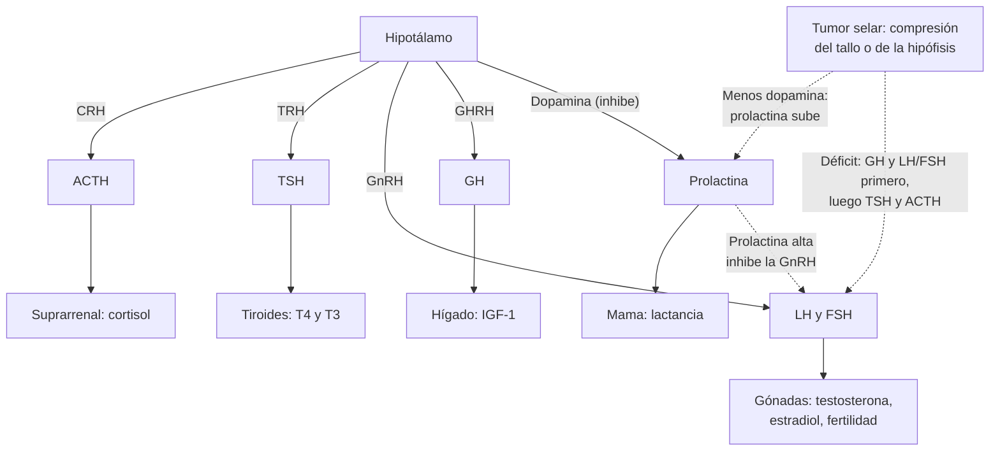

---
tags:
  - Endocrinología
  - GES
---

# Tumores hipofisiarios y de la región selar, hipopituitarismo e hiperprolactinemia

**Subespecialidad**
Endocrinología · Neurocirugía · Neurooftalmología

**Guías principales**
Pituitary Society 2023: prolactinomas · Pituitary Society 2025: incidentaloma hipofisiario · Endocrine Society 2011: incidentaloma hipofisiario · Endocrine Society 2016: reemplazo hormonal en el hipopituitarismo del adulto · Consenso de acromegalia 2024 (diagnóstico y remisión) · Guías británicas de apoplejía hipofisaria (2011) · MINSAL: guía clínica GES de tumores primarios del SNC en personas de 15 años y más (2013)

**Otras fuentes**
Prevalencia de adenomas hipofisiarios en Lieja (Daly 2006) y Banbury (Fernández 2010) · Trastornos del control de impulsos con agonistas dopaminérgicos (Bilbao 2026)

**GES**
**Sí**: el **adenoma hipofisiario** y el **craneofaringioma** están en el GES de **tumores primarios del SNC en personas de 15 años y más** (GES 43): confirmación diagnóstica en **25 días** y tratamiento en **30 días**.

**EUNACOM**
1.03.1.013 Tumores hipofisiarios · 1.03.1.014 Hipopituitarismo · 1.03.1.016 Hiperprolactinemia · 1.10.1.028 Tumores de región sellar. Todas: sospecha, inicial, derivar

**Revisado**
Octubre 2026

!!! abstract "Resumen en 60 segundos"
    - Los **adenomas hipofisiarios** (tumores neuroendocrinos hipofisiarios) son **frecuentes** (~1 de cada 1000 personas) y casi siempre **benignos**. El más frecuente es el **prolactinoma**.
    - Dan síntomas por tres mecanismos:
        - **Exceso hormonal**: prolactina (galactorrea, amenorrea, hipogonadismo), GH (acromegalia) o ACTH (Cushing).
        - **Efecto de masa** (macroadenomas ≥ 10 mm): **hemianopsia bitemporal**, cefalea, pares craneales.
        - **Déficit hormonal**: hipopituitarismo.
    - **Hiperprolactinemia**: antes de pedir una RM, descarta **embarazo**, **fármacos** (antipsicóticos, metoclopramida), **hipotiroidismo** y **ERC**.
    - **Prolactinoma**: el tratamiento de primera línea es **médico** (**cabergolina**), aun con compromiso visual.
    - **Hipopituitarismo**: cortisol matinal, T4 libre (la **TSH no sirve**), gonadotropinas con testosterona o estradiol, IGF-1. Reemplaza el **cortisol antes que la levotiroxina** (si no, puede desencadenar una crisis suprarrenal).
    - **Apoplejía hipofisaria**: cefalea **súbita** "en estallido", baja de visión, diplopía. **Hidrocortisona 100 mg EV** de inmediato, RM y neurocirugía.

## Definición

| Concepto | Definición |
|---|---|
| **Adenoma hipofisiario** (tumor neuroendocrino hipofisiario) | Tumor benigno de las células de la **adenohipófisis**. **Microadenoma** < 10 mm; **macroadenoma** ≥ 10 mm; gigante ≥ 40 mm |
| **Funcionante / no funcionante** | **Funcionante**: secreta una hormona en exceso (prolactina, GH, ACTH, rara vez TSH). **No funcionante**: no da síndrome hormonal (aunque a veces es gonadotropo en la inmunohistoquímica) |
| **Incidentaloma hipofisiario** | Lesión selar descubierta en una imagen pedida por **otro motivo** |
| **Hiperprolactinemia** | Prolactina sérica sobre el límite normal, confirmada |
| **Efecto tallo** | Hiperprolactinemia **leve** por compresión del tallo hipofisario, que impide que la **dopamina** hipotalámica inhiba la secreción de prolactina |
| **Macroprolactina** | Prolactina unida a IgG, **biológicamente inactiva**, que eleva la medición sin dar síntomas |
| **Efecto gancho** (*hook*) | Prolactina falsamente "normal o poco alta" en un macroprolactinoma **gigante** por saturación del ensayo; se corrige **diluyendo** la muestra |
| **Hipopituitarismo** | Déficit de **una o más** hormonas hipofisarias. **Panhipopituitarismo**: déficit de todas |
| **Apoplejía hipofisaria** | **Hemorragia o infarto** súbito de un adenoma (a veces no conocido): cefalea brusca, alteración visual e insuficiencia suprarrenal aguda |
| **Craneofaringioma** | Tumor **quístico y calcificado** de restos de la bolsa de Rathke, supraselar |

## Epidemiología

### Mundial

- **Prevalencia** de adenomas hipofisiarios clínicamente relevantes:
    - Lieja, Bélgica: **94 por 100 000** (**1 de cada 1064** personas); 67,6 % mujeres, edad media al diagnóstico 40 años, 42,6 % macroadenomas (Daly 2006).
    - Banbury, Reino Unido: **77,6 por 100 000** (Fernández 2010).
- **Tipos** (Fernández 2010):
    - **Prolactinomas 57 %**: los más frecuentes hasta los 60 años, sobre todo en mujeres jóvenes.
    - **No funcionantes 28 %**: los más frecuentes después de los 60 años y en hombres.
    - **Acromegalia 11 %**; **Cushing** 2 %.
    - En Lieja, los prolactinomas fueron el **66 %** (Daly 2006).
- **Retraso diagnóstico** (mediana, Fernández 2010): **1,5 años** en el prolactinoma, **4,5 años** en la acromegalia y **7 años** en la enfermedad de Cushing.
- **Incidentalomas**: muy frecuentes en autopsias y en RM pedidas por otros motivos; la mayoría son microadenomas sin consecuencias.

!!! chile "Datos nacionales"
    - **GES 43** (tumores primarios del SNC en personas de **15 años y más**): incluye **adenoma hipofisiario**, **craneofaringioma**, meningioma y hemangioblastoma.
        - Garantías: confirmación diagnóstica en **25 días** desde la sospecha y tratamiento en **30 días**.
        - La guía recomienda **derivar a endocrinología** a todo paciente con un tumor hipofisiario.
    - Incidencia estimada en la guía GES (egresos DEIS): **adenoma hipofisiario 1,39** y **craneofaringioma 0,05** por 100 000 habitantes (MINSAL 2013).
    - En Chile hay **cabergolina** y **bromocriptina**.
    - Uso frecuente de **antipsicóticos** (risperidona) y **domperidona** o metoclopramida: causas comunes de hiperprolactinemia que conviene descartar antes de pedir una RM.

## Etiología y factores de riesgo

| Lesión selar o hipofisaria | Claves |
|---|---|
| **Prolactinoma** | Mujer joven con amenorrea y galactorrea (micro); hombre con hipogonadismo y macroadenoma con efecto de masa |
| **Adenoma no funcionante** | Hombre o adulto mayor con **alteración visual**, cefalea e hipopituitarismo; o hallazgo |
| **Somatotropo** (acromegalia) | Crecimiento de manos, pies y rasgos faciales, sudoración, artralgias, apnea del sueño, diabetes, HTA |
| **Corticotropo** (enfermedad de Cushing) | Obesidad central, estrías violáceas, miopatía proximal, HTA, diabetes, osteoporosis |
| **Craneofaringioma** | Dos picos: **niños** y adultos de 50–74 años; quístico y **calcificado**; alteración visual, hipopituitarismo, **diabetes insípida**, obesidad hipotalámica |
| **Quiste de la bolsa de Rathke** | Quiste no tumoral; casi siempre hallazgo |
| **Hipofisitis** | Linfocítica (embarazo, posparto) o por **inhibidores de puntos de control** (ipilimumab): cefalea e hipopituitarismo |
| **Metástasis** | Mama, pulmón; **diabetes insípida** en un paciente con cáncer |
| **Meningioma, aneurisma de la carótida, germinoma** | Una lesión selar "adenoma" puede ser un **aneurisma**: no biopsiar sin imagen vascular si hay dudas |
| **Silla turca vacía** | Aracnoides herniada en la silla; casi siempre normal, a veces hipopituitarismo |

**Causas de hipopituitarismo**:

- **Tumores selares** (la más frecuente), **cirugía** o **radioterapia** de la región.
- **Apoplejía hipofisaria**; **síndrome de Sheehan** (necrosis hipofisaria por **hemorragia posparto**: no puede amamantar y no vuelve a menstruar).
- **Trauma encefálico** y hemorragia subaracnoidea.
- **Infiltrativas**: hemocromatosis, sarcoidosis, histiocitosis; **hipofisitis**.
- **Fármacos**: **inhibidores de puntos de control** (sobre todo anti-CTLA-4), uso crónico de **corticoides** y **opioides** (suprimen ACTH y gonadotropinas).

**Causas de hiperprolactinemia**:

- **Fisiológicas**: **embarazo**, lactancia, estrés (incluida la venopunción), ejercicio, estimulación del pezón.
- **Fármacos** (la causa más frecuente después del embarazo): **antipsicóticos** (risperidona, haloperidol), **metoclopramida**, **domperidona**, antidepresivos, opioides, verapamilo, estrógenos.
- **Hipotiroidismo primario** (la TRH estimula la prolactina), **ERC**, cirrosis.
- **Lesiones hipotálamo-hipofisarias**: **prolactinoma**, efecto tallo de otros tumores.
- **Macroprolactinemia** y causas idiopáticas.

## Fisiopatología

- La **adenohipófisis** produce seis hormonas: **ACTH**, **TSH**, **LH**, **FSH**, **GH** y **prolactina**, bajo control hipotalámico. La **neurohipófisis** libera **ADH** y oxitocina.
- La prolactina es la **única** hormona hipofisaria bajo control **inhibitorio**: la **dopamina** del hipotálamo, que llega por el tallo, la frena. Por eso:
    - Los fármacos **antidopaminérgicos** y la **compresión del tallo** suben la prolactina.
    - Los **agonistas dopaminérgicos** (cabergolina) la bajan y reducen el tamaño del prolactinoma.
- La **prolactina alta** inhibe la GnRH: **hipogonadismo** (amenorrea, infertilidad, baja de libido, disfunción eréctil, osteoporosis) y galactorrea.
- Un **macroadenoma** crece hacia arriba y comprime el **quiasma óptico** (fibras nasales que cruzan = campos **temporales**): **hemianopsia bitemporal**. Lateralmente invade el **seno cavernoso** (pares III, IV, V1, V2 y VI).
- En el **hipopituitarismo** por compresión, la secreción se pierde en un orden típico: **GH** y **gonadotropinas** primero, luego **TSH** y, al final, **ACTH**. La **diabetes insípida** es rara en los adenomas: sugiere craneofaringioma, metástasis, hipofisitis o lesiones infiltrativas.
- El **déficit de ACTH** produce insuficiencia suprarrenal **secundaria**: falta el cortisol, pero se conserva la **aldosterona** (regulada por la renina), por lo que **no** hay hiperkalemia ni hiperpigmentación.
- Si se da **levotiroxina** antes que hidrocortisona en un déficit de ACTH, aumenta el metabolismo del cortisol y puede desencadenar una **crisis suprarrenal**.

*Figura 1. Ejes hipotálamo-hipofisarios, control inhibitorio de la prolactina y efecto de un tumor selar. Esquema propio basado en Fleseriu 2016 y Petersenn 2023.*

<figure markdown>
![Esquema en corte coronal de la región selar. Un macroadenoma de 10 mm o más crece desde la silla turca, sobre el seno esfenoidal, hacia arriba, y desplaza el quiasma óptico y el tallo hipofisario. A ambos lados están los senos cavernosos, con la arteria carótida interna, el VI par en su interior y los pares III, IV, V1 y V2 en la pared lateral. Arriba, el hipotálamo y el tercer ventrículo. A la derecha, los campos visuales de ambos ojos con las mitades temporales en negro (hemianopsia bitemporal): se pierden las mitades externas, por lo que la persona choca con las puertas y no ve a los lados al manejar. Abajo, una tabla: la compresión del quiasma óptico da hemianopsia bitemporal, baja de agudeza visual y atrofia óptica; la invasión del seno cavernoso, diplopía y ptosis (III, IV, VI) y dolor facial (V1, V2); la compresión del tallo, hiperprolactinemia leve por pérdida de la inhibición dopaminérgica; la compresión de la hipófisis normal, hipopituitarismo (primero GH, LH y FSH, luego TSH y ACTH); y la hemorragia o el infarto, apoplejía con cefalea súbita, alteración visual e insuficiencia suprarrenal aguda](../assets/figuras/hipofisis/region-selar-efecto-de-masa.svg){ loading=lazy }
<figcaption>Figura 2. Región selar y efecto de masa de un macroadenoma. Esquema propio.</figcaption>
</figure>

## Clasificación

| Criterio | Tipos |
|---|---|
| **Tamaño** | **Microadenoma** (< 10 mm) · **macroadenoma** (≥ 10 mm) · gigante (≥ 40 mm) |
| **Función** | **Prolactinoma** · **somatotropo** (acromegalia) · **corticotropo** (Cushing) · tirotropo (raro) · **no funcionante** |
| **Extensión** | Intraselar · supraselar (quiasma) · paraselar (seno cavernoso) · infraselar (seno esfenoidal) |
| **Hipopituitarismo** | **Primario** (enfermedad de la hipófisis) · **secundario o "terciario"** (hipotálamo o tallo) · aislado (un eje) o múltiple |

## Clínica

| Situación | Manifestaciones |
|---|---|
| **Hiperprolactinemia** | Mujer: **oligo o amenorrea**, **galactorrea**, infertilidad. Hombre: **baja de libido**, **disfunción eréctil**, ginecomastia, infertilidad; se diagnostica más tarde (macroadenomas). Ambos: **osteoporosis** |
| **Acromegalia** | Crecimiento de **manos y pies** (anillos y zapatos que no quedan), rasgos faciales toscos, **prognatismo**, separación de los dientes, macroglosia, **sudoración**, artralgias, **túnel carpiano**, **apnea del sueño**, **diabetes**, HTA, miocardiopatía, pólipos de colon |
| **Enfermedad de Cushing** | Obesidad central, cara de luna, **estrías violáceas** anchas, equimosis, **miopatía proximal**, HTA, diabetes, osteoporosis |
| **Efecto de masa** | **Cefalea**; **hemianopsia bitemporal** (choca con objetos a los lados); **diplopía** o ptosis (seno cavernoso); hidrocefalia (raro) |
| **Déficit de ACTH** | Cansancio, anorexia, baja de peso, náuseas, **hipotensión**, **hiponatremia** (sin hiperkalemia ni hiperpigmentación), hipoglicemia; **crisis** ante una infección o cirugía |
| **Déficit de TSH** | Hipotiroidismo con **TSH normal o baja** |
| **Déficit de LH y FSH** | Amenorrea, infertilidad, baja de libido, disfunción eréctil, pérdida de vello, osteoporosis |
| **Déficit de GH** | Adulto: fatiga, más grasa visceral, menos masa muscular y ósea; niño: talla baja |
| **Déficit de ADH** (diabetes insípida central) | **Poliuria** hipotónica y **polidipsia**, hipernatremia si no puede beber |

!!! alarma "Apoplejía hipofisaria: emergencia"
    - **Cefalea súbita y muy intensa** (como una hemorragia subaracnoidea), **vómitos**, **baja de visión** o hemianopsia, **oftalmoplejia** (diplopía, ptosis), compromiso de conciencia.
    - Gatillantes: anticoagulantes, cirugía, pruebas de estímulo, inicio de agonistas dopaminérgicos, embarazo; a menudo el adenoma **no se conocía**.
    - **Hidrocortisona 100 mg EV** de inmediato (sin esperar los resultados), luego 50 mg c/6 h, más fluidos.
    - **RM** (o TC urgente), **campo visual** y evaluación por **neurocirugía**: descompresión si hay baja de visión grave o progresiva, o compromiso de conciencia.

## Diagnóstico

!!! guia "Incidentaloma hipofisiario (Endocrine Society 2011; Pituitary Society 2025)"
    - **Historia y examen** a todos, buscando hipersecreción e hipopituitarismo.
    - **Laboratorio**:
        - **Hipersecreción**: prolactina, **IGF-1** y, si hay sospecha clínica, estudio de Cushing.
        - **Hipopituitarismo**: sobre todo en los **macroadenomas**.
    - **Campo visual** si la lesión toca el nervio óptico o el **quiasma**.
    - **Seguimiento** si no hay indicación de cirugía: RM a los **6 meses** (macro) o al **año** (micro), luego cada vez menos si no cambia.
    - **Derivar a cirugía** si hay **defecto del campo visual**, otros signos de compresión (oftalmoplejia), lesión que **toca el quiasma**, **apoplejía** con alteración visual o tumor **hipersecretor** que no sea prolactinoma.

- **Hiperprolactinemia** (Figura 3):
    - Confirmar con una segunda muestra (en reposo, sin estrés).
    - Descartar **embarazo**, **fármacos**, **hipotiroidismo** (TSH), **ERC** (creatinina) y **macroprolactina** si no hay síntomas.
    - Luego, **RM de silla turca con gadolinio**.
    - **Prolactina > 250 µg/L** sugiere un **prolactinoma** (macro); un macroadenoma con prolactina **< 100 µg/L** sugiere un **adenoma no funcionante con efecto tallo**; en un tumor **gigante** con prolactina "baja", pedir **dilución** (efecto gancho).
- **Acromegalia** (consenso 2024): con rasgos típicos, una **IGF-1 > 1,3 veces** el límite superior para la edad **confirma** el diagnóstico. Si los resultados son dudosos, repetir la IGF-1 y hacer una **PTGO con GH** (sin supresión de la GH).
- **Enfermedad de Cushing**: confirmar el hipercortisolismo (cortisol libre urinario, cortisol salival nocturno, supresión con 1 mg de dexametasona); luego ACTH (normal o alta) y RM.
- **Hipopituitarismo** (Endocrine Society 2016): diagnóstico **hormonal** (eje por eje; ver Laboratorio).

<figure markdown>
![Algoritmo diagnóstico de la hiperprolactinemia. Ante una prolactina elevada (con galactorrea, oligo o amenorrea, infertilidad, baja de libido o disfunción eréctil), el paso 1 es descartar causas no tumorales: embarazo y lactancia, fármacos (antipsicóticos, metoclopramida, domperidona, antidepresivos, opioides, verapamilo), hipotiroidismo primario (TSH), ERC (creatinina), cirrosis, estrés de la venopunción y macroprolactina si no hay síntomas; si hay una causa, se trata o se cambia el fármaco. Si no, el paso 2 es una RM de silla turca con gadolinio. Cuatro resultados: microprolactinoma (adenoma menor de 10 mm, prolactina habitualmente moderada), cabergolina si hay síntomas como hipogonadismo, infertilidad o galactorrea; macroprolactinoma (adenoma de 10 mm o más, prolactina muy alta, sobre 250 µg/L), cabergolina como primera línea aun con alteración visual, y campo visual; macroadenoma con prolactina poco elevada (menor de 100 µg/L), efecto tallo de un adenoma no funcionante, cirugía si hay compresión visual, o efecto gancho; y RM normal, hiperprolactinemia idiopática o microadenoma no visible, cabergolina si hay síntomas y control con prolactina. Abajo: el efecto gancho, en que un macroadenoma gigante con prolactina normal o poco alta puede tener la prolactina muy alta en realidad, por lo que hay que pedir al laboratorio que diluya la muestra 1:100 antes de concluir que es un adenoma no funcionante; y en todo macroadenoma, campo visual y función hipofisaria (cortisol, T4 libre, IGF-1, gonadotropinas)](../assets/figuras/hipofisis/enfoque-hiperprolactinemia.svg){ loading=lazy }
<figcaption>Figura 3. Enfoque diagnóstico de la hiperprolactinemia. Esquema propio basado en Petersenn 2023 (Pituitary Society).</figcaption>
</figure>

## Laboratorio

| Eje | Examen | Interpretación |
|---|---|---|
| **Prolactina** | Prolactina sérica (en reposo) | Ver la Figura 3; macroprolactina si no hay síntomas |
| **ACTH-cortisol** | **Cortisol plasmático a las 8:00 h** | **< 3 µg/dL**: insuficiencia suprarrenal; **> 15 µg/dL**: la descarta (Endocrine Society 2016); entre ambos, **prueba de estímulo** con ACTH (válida desde 4–6 semanas después del daño hipofisario) |
| **TSH-tiroides** | **T4 libre** (y TSH) | **T4 libre baja con TSH normal o baja**: hipotiroidismo central. La **TSH no sirve** para el diagnóstico ni el seguimiento |
| **Gonadotropinas** | LH, FSH con **testosterona** matinal (hombre) o **estradiol** (mujer) | Hormona sexual baja con **LH y FSH bajas o "normales"**: hipogonadismo central. En la posmenopausia, FSH y LH bajas (deberían estar altas) |
| **GH** | **IGF-1** (ajustada por edad) | Alta: acromegalia. Baja con otros déficits: probable déficit de GH (se confirma con pruebas de estímulo) |
| **ADH** | Sodio plasmático, osmolalidad plasmática y urinaria | Poliuria con orina **diluida** y sodio alto-normal: diabetes insípida central |
| **Generales** | Sodio (**hiponatremia** por déficit de cortisol o de tiroides), glicemia, hemograma | |

## Imágenes

- **RM de silla turca con gadolinio** (cortes finos): examen de **elección** para la hipófisis. Distingue microadenoma, macroadenoma, invasión del seno cavernoso, compresión del quiasma, quistes y craneofaringioma.
- **TC**: si la RM está contraindicada o en la **urgencia** (apoplejía); muestra las **calcificaciones** del craneofaringioma.
- **Angio-RM o angio-TC**: si hay duda de un **aneurisma** de la carótida (antes de operar).
- **Campo visual computarizado** (perimetría) y fondo de ojo: en los macroadenomas que tocan el quiasma.

## Diagnóstico diferencial

| Condición | Claves |
|---|---|
| **Hiperprolactinemia por fármacos** | Antipsicóticos (sobre todo risperidona, haloperidol), metoclopramida, domperidona; normaliza al suspender o cambiar (p. ej., a aripiprazol, con indicación del psiquiatra) |
| **Hipotiroidismo primario** | TSH **alta**; puede agrandar la hipófisis (hiperplasia) y subir la prolactina; revierte con levotiroxina |
| **Embarazo** | Siempre descartarlo en una mujer con amenorrea e hiperprolactinemia |
| **Macroprolactinemia** | Prolactina alta sin síntomas; precipitación con polietilenglicol |
| **Craneofaringioma** | Supraselar, quístico y **calcificado**; diabetes insípida; niños o adultos de 50–74 años |
| **Quiste de Rathke** | Quiste intraselar, sin realce de la pared |
| **Hipofisitis** | Posparto o con **inhibidores de puntos de control**; agrandamiento difuso del tallo y la hipófisis |
| **Insuficiencia suprarrenal primaria** | **Hiperkalemia** e **hiperpigmentación**, ACTH alta. Ver [insuficiencia suprarrenal](insuficiencia-suprarrenal.md) |
| **Hemianopsia homónima** | Lesión **retroquiasmática** (ACV occipital), no hipofisaria |

## Tratamiento

!!! guia "Prolactinoma (Pituitary Society 2023)"
    - **Primera línea**: tratamiento **médico** con un **agonista dopaminérgico**, de preferencia la **cabergolina** (mejor tolerada y más eficaz que la bromocriptina), también en los **macroprolactinomas** con alteración visual.
    - La **cirugía transesfenoidal** es una alternativa en centros con experiencia (p. ej., microprolactinomas bien delimitados, intolerancia o resistencia a la cabergolina, apoplejía con compromiso visual).
    - Un **microprolactinoma** sin síntomas (p. ej., en la **posmenopausia**) puede **no tratarse** y solo controlarse.
    - Se puede intentar **suspender** el tratamiento tras ≥ **2 años** con prolactina normal y un tumor que disminuyó, con control posterior.
    - Vigilar los **trastornos del control de impulsos** (hipersexualidad, juego, compras compulsivas) en todos los pacientes con agonistas dopaminérgicos.

- **Agonistas dopaminérgicos**:
    - En un metaanálisis de 10 estudios, los pacientes con adenomas hipofisiarios tratados con agonistas dopaminérgicos tuvieron **más trastornos del control de impulsos** (OR **2,39**), sobre todo **hipersexualidad**, sin relación con la dosis de cabergolina (Bilbao 2026).
    - Otros efectos: náuseas, hipotensión ortostática, cefalea; con dosis **altas** por años, riesgo de **valvulopatía** (ecocardiograma de control).
    - **Embarazo**: en general se **suspende** al confirmar el embarazo en los microprolactinomas; en los macroprolactinomas, control del campo visual.
- **Adenoma no funcionante**:
    - Con compresión del quiasma o alteración visual: **cirugía transesfenoidal**.
    - Pequeño y sin síntomas: **observación** con RM y campo visual.
    - Radioterapia en los restos que crecen.
- **Acromegalia y enfermedad de Cushing**: **cirugía transesfenoidal** de primera línea; si persisten, tratamiento médico (análogos de somatostatina en la acromegalia; inhibidores de la esteroidogénesis en el Cushing) o radioterapia.
- **Hipopituitarismo** (Endocrine Society 2016):
    - **Glucocorticoides primero**: **hidrocortisona 15–20 mg/día** en 2–3 dosis (la mayor en la mañana); no necesita fludrocortisona (la aldosterona está conservada).
    - Educación sobre **dosis de estrés** (duplicar o triplicar en enfermedad febril; EV en cirugía o vómitos), tarjeta o pulsera. Ver [insuficiencia suprarrenal](insuficiencia-suprarrenal.md).
    - **Levotiroxina** después del glucocorticoide, ajustada por la **T4 libre** (en la mitad superior del rango normal), no por la TSH.
    - **Hormonas sexuales**: testosterona en el hombre; estrógenos con progestágeno en la mujer premenopáusica (si no busca embarazo). Gonadotropinas si desea fertilidad.
    - **GH** en adultos con déficit confirmado, en centros especializados.
    - **Desmopresina** en la diabetes insípida central.
- **Apoplejía hipofisaria**: **hidrocortisona EV**, fluidos, corrección de electrolitos, neurocirugía si hay compromiso visual grave o de conciencia.
- **Craneofaringioma**: cirugía (a veces parcial) con radioterapia; manejo del hipopituitarismo, la diabetes insípida y la obesidad hipotalámica.

!!! dosis "Dosis clave"
    - **Cabergolina**: iniciar **0,25–0,5 mg una o dos veces por semana**; subir según la prolactina cada 1–2 meses (dosis habitual 0,5–2 mg/semana). Darla en la noche con comida para reducir las náuseas.
    - **Bromocriptina** (alternativa): iniciar 1,25 mg en la noche; subir hasta 2,5–15 mg/día en 2–3 dosis.
    - **Hidrocortisona** (déficit de ACTH): **15–20 mg/día** (p. ej., 10 mg al despertar + 5 mg a mediodía); **dosis de estrés** el doble o triple en enfermedad febril.
    - **Apoplejía o crisis suprarrenal**: **hidrocortisona 100 mg EV** en bolo, luego **50 mg EV c/6 h**.
    - **Levotiroxina** (hipotiroidismo central): 1,6 µg/kg/día (menos en adultos mayores o cardiópatas), **después** de iniciar la hidrocortisona; ajustar por la T4 libre.

## Complicaciones

- **Ceguera** o pérdida permanente del campo visual por compresión prolongada del quiasma.
- **Crisis suprarrenal** por déficit de ACTH no reconocido (sobre todo en una infección, cirugía o al iniciar levotiroxina).
- **Hipogonadismo** prolongado: **osteoporosis**, infertilidad.
- **Acromegalia**: diabetes, HTA, **miocardiopatía**, apnea del sueño, artropatía, pólipos de colon; mortalidad aumentada si no se controla.
- **Enfermedad de Cushing**: diabetes, HTA, infecciones, trombosis, osteoporosis; mortalidad alta sin tratamiento.
- **De la cirugía transesfenoidal**: **diabetes insípida** (a menudo transitoria), **SIADH** (hiponatremia a los 5–10 días), fístula de LCR, meningitis, hipopituitarismo.
- **De los agonistas dopaminérgicos**: trastornos del control de impulsos, valvulopatía (dosis altas), fístula de LCR al reducirse un macroprolactinoma invasor.

## Pronóstico y seguimiento

- **Prolactinoma**: la cabergolina normaliza la prolactina y reduce el tumor en la mayoría; una parte puede suspenderla sin recaída tras años de control.
- **Adenoma no funcionante**: la cirugía mejora la visión en muchos pacientes si se hace a tiempo; puede recurrir (control con RM).
- **Acromegalia y Cushing**: la curación quirúrgica depende del tamaño, la invasión y la experiencia del cirujano; el control bioquímico normaliza la mortalidad.
- **Hipopituitarismo**: requiere reemplazo **de por vida** y educación sobre las dosis de estrés.
- **Seguimiento** (lo hace el endocrinólogo; GES 43): prolactina o IGF-1, función hipofisaria, **RM** y **campo visual** periódicos. El EUNACOM pide **sospechar, iniciar el manejo y derivar**.

## Perlas para el internado

!!! perla "Para la sala y el turno"
    - **Amenorrea**: primero el **test de embarazo**, luego prolactina y TSH.
    - Paciente con **risperidona** y galactorrea: es el fármaco hasta demostrar lo contrario. Coordina con psiquiatría antes de suspenderlo.
    - **Hemianopsia bitemporal** = quiasma = **macroadenoma** hasta demostrar lo contrario.
    - Un macroadenoma **gigante** con prolactina "poco alta": pide que **diluyan la muestra** (efecto gancho) antes de operar un prolactinoma que se trataba con cabergolina.
    - **TSH normal con T4 libre baja**: hipotiroidismo **central**. La TSH no sirve para controlar la levotiroxina en estos pacientes.
    - En el **hipopituitarismo**, **hidrocortisona antes que levotiroxina**.
    - **Hiponatremia** en un paciente con un tumor hipofisario: piensa en **déficit de cortisol** (y, tras la cirugía, en SIADH).
    - **Cefalea súbita** con baja de visión u oftalmoplejia: **apoplejía**. Hidrocortisona 100 mg EV sin esperar.
    - Mujer que **no pudo amamantar** ni volvió a menstruar tras una **hemorragia posparto**: **síndrome de Sheehan**.
    - Paciente con **ipilimumab** o nivolumab con cefalea y cansancio: piensa en **hipofisitis** (cortisol matinal).

## Preguntas de repaso

??? repaso "1. Mujer de 26 años con amenorrea de 6 meses y galactorrea. Test de embarazo negativo. Prolactina 98 µg/L (normal < 25). No usa fármacos. TSH y creatinina normales. ¿Qué hace?"
    **Hiperprolactinemia** confirmada sin causa fisiológica, farmacológica, tiroidea ni renal: pedir **RM de silla turca con gadolinio**.

    - Lo más probable es un **microprolactinoma**.
    - Tratamiento: **cabergolina 0,25–0,5 mg una o dos veces por semana**, ajustada según la prolactina (recupera las menstruaciones y la fertilidad, y protege el hueso).
    - Advertir sobre los **trastornos del control de impulsos** y que puede embarazarse al normalizar la prolactina.
    - Derivar a **endocrinología** (GES si es un adenoma).

??? repaso "2. Hombre de 62 años que choca con los marcos de las puertas y tiene cefalea hace meses. Disfunción eréctil hace 2 años. La perimetría muestra hemianopsia bitemporal. La RM muestra un macroadenoma de 3 cm que comprime el quiasma. Prolactina 45 µg/L. ¿Qué es y qué hace?"
    Probable **adenoma no funcionante** con **efecto de masa** (quiasma) y **efecto tallo** (prolactina poco elevada para el tamaño).

    - Pedir al laboratorio que **diluya** la prolactina para descartar un **efecto gancho** de un macroprolactinoma (cambiaría el tratamiento a cabergolina).
    - **Función hipofisaria**: cortisol matinal, T4 libre, testosterona con LH y FSH, IGF-1, sodio.
    - Si hay déficit de ACTH: **hidrocortisona** antes de cualquier otra cosa (y antes de la levotiroxina).
    - Derivar a **neurocirugía**: **cirugía transesfenoidal** para descomprimir el quiasma (GES 43).

??? repaso "3. Hombre de 55 años con un macroadenoma conocido, en espera de cirugía, que consulta por cefalea súbita \"la peor de su vida\", vómitos, visión borrosa y ptosis del ojo derecho. PA 88/50 mmHg, sodio 128 mEq/L. ¿Diagnóstico y conducta?"
    **Apoplejía hipofisaria** (hemorragia o infarto del adenoma) con compresión del quiasma y del seno cavernoso (III par), e **insuficiencia suprarrenal aguda** (hipotensión, hiponatremia).

    - **Hidrocortisona 100 mg EV** de inmediato, luego 50 mg c/6 h; suero fisiológico.
    - **RM** (o TC urgente) y **campo visual**; descartar una hemorragia subaracnoidea.
    - **Neurocirugía** urgente: descompresión si la visión es grave o empeora, o hay compromiso de conciencia.
    - Evaluar luego todos los ejes (hipopituitarismo frecuente).

??? repaso "4. Mujer de 34 años que tuvo una hemorragia posparto grave con transfusión de 6 unidades hace 1 año. No pudo amamantar y no ha vuelto a menstruar. Refiere cansancio, intolerancia al frío y mareos. Sodio 129 mEq/L, TSH 1,2 mUI/L, T4 libre baja. ¿Qué tiene y cómo la trata?"
    **Síndrome de Sheehan** (necrosis hipofisaria posparto) con **hipopituitarismo**: déficit de prolactina (no amamantó), de gonadotropinas (amenorrea), de TSH (hipotiroidismo **central**: T4 libre baja con TSH "normal") y probable déficit de ACTH (hiponatremia, mareos).

    - **Cortisol matinal** (y prueba de estímulo si es intermedio), estradiol con LH y FSH, IGF-1.
    - Tratar **primero con hidrocortisona** (15–20 mg/día) y luego con **levotiroxina** ajustada por la **T4 libre**; estrógenos con progestágeno.
    - Educación sobre las **dosis de estrés**; derivar a endocrinología.

??? repaso "5. Hombre de 48 años que nota que ya no le quedan los anillos ni los zapatos, con sudoración excesiva, ronquidos y diabetes de reciente diagnóstico. Tiene prognatismo y separación de los dientes. ¿Qué sospecha y cómo lo confirma?"
    **Acromegalia** por un adenoma **somatotropo**.

    - **IGF-1** ajustada por edad: con rasgos típicos, una IGF-1 **> 1,3 veces** el límite superior **confirma** el diagnóstico (consenso 2024). Si es dudosa, repetirla y hacer una **PTGO con GH**.
    - **RM de silla turca**, campo visual y función hipofisaria.
    - Buscar complicaciones: **ecocardiograma**, **apnea del sueño**, **colonoscopía**, HTA, diabetes.
    - Derivar a **endocrinología y neurocirugía**: cirugía transesfenoidal de primera línea.

??? repaso "6. Mujer de 40 años en tratamiento con risperidona por esquizofrenia, con galactorrea y amenorrea. Prolactina 85 µg/L. ¿Qué hace?"
    **Hiperprolactinemia inducida por fármacos** (la risperidona es uno de los antipsicóticos que más la elevan), la causa más probable.

    - Descartar **embarazo** y medir **TSH** y creatinina.
    - **No suspender** el antipsicótico por cuenta propia: coordinar con **psiquiatría** un cambio a un antipsicótico con menos efecto sobre la prolactina (p. ej., aripiprazol) o agregarlo.
    - Si no se puede cambiar el fármaco, o si se sospecha un tumor (cefalea, alteración visual, prolactina muy alta), pedir una **RM**.
    - Vigilar la **densidad ósea** si el hipogonadismo es prolongado.

## Referencias

1. Petersenn S, Fleseriu M, Casanueva FF, et al. Diagnosis and management of prolactin-secreting pituitary adenomas: a Pituitary Society international Consensus Statement. *Nat Rev Endocrinol.* 2023;19(12):722–740. doi:[10.1038/s41574-023-00886-5](https://doi.org/10.1038/s41574-023-00886-5)
2. Fleseriu M, Gurnell M, McCormack A, et al. Pituitary incidentaloma: a Pituitary Society international consensus guideline statement. *Nat Rev Endocrinol.* 2025;21(10):638–655. doi:[10.1038/s41574-025-01134-8](https://doi.org/10.1038/s41574-025-01134-8)
3. Freda PU, Beckers AM, Katznelson L, et al. Pituitary incidentaloma: an Endocrine Society clinical practice guideline. *J Clin Endocrinol Metab.* 2011;96(4):894–904. doi:[10.1210/jc.2010-1048](https://doi.org/10.1210/jc.2010-1048)
4. Fleseriu M, Hashim IA, Karavitaki N, et al. Hormonal replacement in hypopituitarism in adults: an Endocrine Society clinical practice guideline. *J Clin Endocrinol Metab.* 2016;101(11):3888–3921. doi:[10.1210/jc.2016-2118](https://doi.org/10.1210/jc.2016-2118)
5. Giustina A, Biermasz N, Casanueva FF, et al. Consensus on criteria for acromegaly diagnosis and remission. *Pituitary.* 2024;27(1):7–22. doi:[10.1007/s11102-023-01360-1](https://doi.org/10.1007/s11102-023-01360-1)
6. Rajasekaran S, Vanderpump M, Baldeweg S, et al. UK guidelines for the management of pituitary apoplexy. *Clin Endocrinol (Oxf).* 2011;74(1):9–20. doi:[10.1111/j.1365-2265.2010.03913.x](https://doi.org/10.1111/j.1365-2265.2010.03913.x)
7. Daly AF, Rixhon M, Adam C, et al. High prevalence of pituitary adenomas: a cross-sectional study in the province of Liège, Belgium. *J Clin Endocrinol Metab.* 2006;91(12):4769–4775. doi:[10.1210/jc.2006-1668](https://doi.org/10.1210/jc.2006-1668)
8. Fernandez A, Karavitaki N, Wass JA. Prevalence of pituitary adenomas: a community-based, cross-sectional study in Banbury (Oxfordshire, UK). *Clin Endocrinol (Oxf).* 2010;72(3):377–382. doi:[10.1111/j.1365-2265.2009.03667.x](https://doi.org/10.1111/j.1365-2265.2009.03667.x)
9. Bilbao R, Serralunga J, Loschiavo N, et al. A systematic review and meta-analysis on impulse-control disorders in patients with pituitary adenomas exposed to dopamine agonists. *Front Endocrinol (Lausanne).* 2026;17:1869083. doi:[10.3389/fendo.2026.1869083](https://doi.org/10.3389/fendo.2026.1869083)
10. Ministerio de Salud de Chile. Guía clínica: tumores primarios del sistema nervioso central en personas de 15 años y más. Santiago: MINSAL; 2013. [PDF en diprece.minsal.cl](https://diprece.minsal.cl/wrdprss_minsal/wp-content/uploads/2014/12/Tumores-Sistema-Nervioso-Central.pdf)
