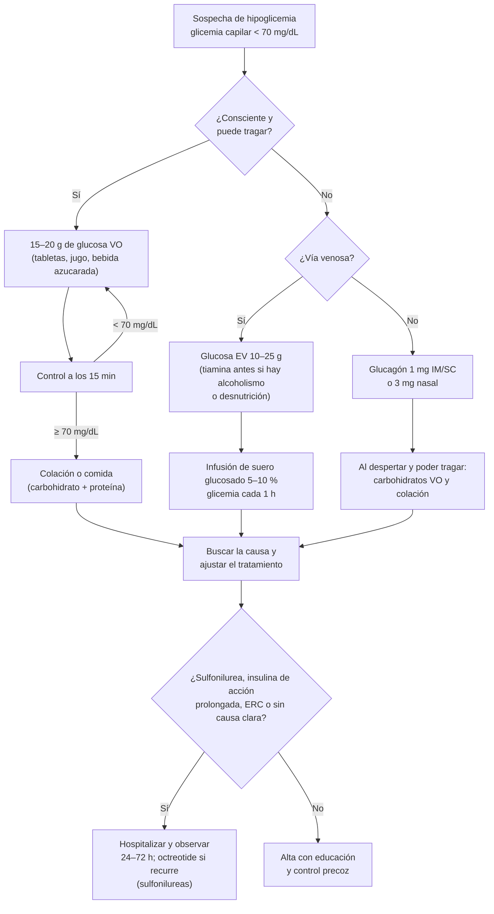

---
tags:
  - Endocrinología
  - Diabetes
  - Urgencia
  - Frecuente en sala
---

# Hipoglicemia

**Subespecialidad**
Diabetes · Endocrinología · Urgencia

**Guías principales**
ADA Standards of Care 2026 (secciones 6 y 16) · Endocrine Society 2023: manejo de personas con diabetes con alto riesgo de hipoglicemia · Endocrine Society 2009: trastornos hipoglicémicos del adulto (hipoglicemia sin diabetes)

**Otras fuentes**
Estudio HAT (24 países, 2016) · Vargas et al., Rev Med Chile 2017 (hipoglicemia en un servicio de urgencia chileno)

**EUNACOM**
1.02.2.006 Hipoglicemias (específico, completo, completo)

**Revisado**
Septiembre 2026

!!! abstract "Resumen en 60 segundos"
    - En la diabetes, **hipoglicemia = glicemia < 70 mg/dL**. **Nivel 1**: 54–69 · **nivel 2**: < 54 (neuroglucopenia) · **nivel 3**: evento con alteración mental o física que **requiere ayuda de otra persona**, con cualquier glicemia.
    - Sin diabetes, se diagnostica con la **tríada de Whipple**: síntomas + glicemia baja (< 55 mg/dL) medida + alivio al corregirla.
    - Causas más frecuentes: **insulina** y **sulfonilureas** (sobre todo **glibenclamida** en adultos mayores y con ERC), comidas omitidas, ejercicio, **alcohol**, ERC, sepsis.
    - **Consciente**: **regla del 15**: **15–20 g de glucosa** oral, controlar a los 15 min y repetir si sigue < 70; luego una colación.
    - **Inconsciente o sin vía oral**: **glucosa EV** (10–25 g) o **glucagón** (1 mg IM/SC o 3 mg nasal). **Tiamina antes de la glucosa** en alcohólicos y desnutridos.
    - Hipoglicemia por **sulfonilureas**: **hospitalizar** (dura 24–72 h o más), infusión de glucosa y **octreotide** si recurre.
    - Después de cada episodio: **buscar la causa y ajustar el tratamiento** (bajar insulina, suspender la glibenclamida, metas menos estrictas, educación, glucagón, monitoreo continuo).

## Definición

### En personas con diabetes (ADA 2026)

| Nivel | Criterio | Significado |
|---|---|---|
| **Nivel 1** | Glicemia **54–69 mg/dL** (3,0–3,8 mmol/L) | Valor de **alerta**: tratar y ajustar |
| **Nivel 2** | Glicemia **< 54 mg/dL** (< 3,0 mmol/L) | Hipoglicemia **clínicamente importante**: umbral habitual de la **neuroglucopenia** |
| **Nivel 3** (grave) | Evento con **alteración mental y/o física que requiere ayuda de otra persona** para recuperarse | Sin umbral de glicemia; es la de mayor riesgo |

### En personas sin diabetes (Endocrine Society 2009)

- **Tríada de Whipple**: (1) **síntomas** compatibles, (2) **glicemia baja** medida con un método confiable en el momento de los síntomas (habitualmente **< 55 mg/dL**) y (3) **alivio** de los síntomas cuando la glicemia sube.
- Sólo se estudia la hipoglicemia en quienes cumplen la tríada. Una glicemia baja **sin síntomas** en una persona sana (p. ej., en ayuno prolongado, en mujeres jóvenes) puede ser normal.

## Epidemiología

### Mundial

- Es la **complicación aguda más frecuente** del tratamiento de la diabetes y el principal **factor limitante** del control glicémico.
- **Estudio HAT** (27.585 usuarios de insulina en 24 países, 2016): presentaron hipoglicemia en 4 semanas el **83 %** de las personas con **DM1** y el **47 %** con **DM2**. Tasas de hipoglicemia **grave**: **4,9 eventos/paciente-año en la DM1** y **2,5 en la DM2**. **América Latina** tuvo las tasas más altas de hipoglicemia en la DM1.
- La hipoglicemia grave se asocia a **2–3 veces más mortalidad**, eventos cardiovasculares, **caídas y fracturas**, accidentes de tránsito y **deterioro cognitivo** (la demencia también aumenta el riesgo de hipoglicemia: relación bidireccional).
- En los hospitalizados con diabetes, la hipoglicemia es frecuente y se asocia a **mayor estadía y mortalidad**; la mayoría es **evitable** (ayuno sin ajuste de insulina, suspensión de corticoides).

### Chile

!!! chile "Datos nacionales"
    - En un servicio de urgencia de Santiago (Clínica Dávila), de **175.244 atenciones**, **251 (0,14 %)** fueron por hipoglicemia, con edad promedio de **69 años**. Hubo **uso elevado de glibenclamida en adultos mayores**, pese a la evidencia en contra, y las hipoglicemias asociadas a **sulfonilureas** requirieron **hospitalización con más frecuencia** (**90 % vs 61 %**) (Vargas, Rev Med Chile 2017).
    - La **glibenclamida** sigue disponible en la APS chilena. Las guías recomiendan **evitarla en adultos mayores y en la ERC** (su metabolito activo se acumula) y preferir fármacos con bajo riesgo de hipoglicemia.
    - La **insulina NPH** y la **insulina cristalina**, disponibles en el GES, causan más hipoglicemia nocturna que los análogos.
    - Chile tiene alta prevalencia de **consumo de alcohol de riesgo** y de adultos mayores con **polifarmacia**: dos factores de riesgo clave.

## Etiología y fisiopatología

### Defensas contra la hipoglicemia

<figure markdown>
![Escala vertical de glicemia de 100 a 20 mg/dL. A la izquierda, los umbrales de la respuesta fisiológica: cerca de 80–85 mg/dL baja la secreción de insulina; cerca de 65–70 mg/dL suben el glucagón y la adrenalina (además del cortisol y la hormona de crecimiento); cerca de 50–55 mg/dL aparecen los síntomas autonómicos que llevan a comer; bajo 50 mg/dL aparece la neuroglucopenia con confusión y conducta anormal; bajo 30 mg/dL, convulsiones y coma. A la derecha, los niveles de la ADA: normal sobre 70, nivel 1 entre 54 y 69 y nivel 2 bajo 54 mg/dL; recuadros explican el nivel 3 y la hipoglicemia inadvertida](../assets/figuras/hipoglicemia/umbrales-glicemicos.svg){ loading=lazy }
<figcaption>Figura 1. Umbrales glicémicos de las defensas contra la hipoglicemia y niveles de hipoglicemia de la ADA. Esquema propio.</figcaption>
</figure>

1. **Baja la secreción de insulina** (~ 80–85 mg/dL).
2. **Sube el glucagón** (~ 65–70 mg/dL): glucogenólisis y gluconeogénesis hepáticas.
3. **Sube la adrenalina** (~ 65–70 mg/dL); el cortisol y la hormona de crecimiento actúan en horas.
4. **Síntomas** (~ 50–55 mg/dL) → la persona **come** (defensa conductual).

<figure markdown>
{ loading=lazy width="620" }
<figcaption>Figura 2. Mecanismos de contrarregulación hormonal y conductual, y cómo los alteran la DM1 (o DM2 avanzada) y la hipoglicemia recurrente. Fuente: Lin YK, Fisher SJ, Pop-Busui R. Hypoglycemia unawareness and autonomic dysfunction in diabetes: Lessons learned and roles of diabetes technologies. <em>J Diabetes Investig</em>. 2020;11:1388–1402. Licencia <a href="https://creativecommons.org/licenses/by-nc/4.0/">CC BY-NC 4.0</a>. Texto de la figura en inglés.</figcaption>
</figure>

- En la **DM1** y la **DM2 avanzada** (déficit de insulina endógena), la insulina inyectada **no se puede "apagar"** y la respuesta del **glucagón se pierde** en pocos años: queda sólo la adrenalina.
- **Falla autonómica asociada a hipoglicemia** (*HAAF*): las hipoglicemias repetidas **bajan el umbral** de la respuesta adrenérgica y de los síntomas → **hipoglicemia inadvertida** → hipoglicemias más graves (círculo vicioso). **Evitar toda hipoglicemia por 2–3 semanas** recupera en parte la percepción.

### Causas en personas con diabetes

- **Fármacos**: **insulina** (sobre todo NPH y cristalina), **sulfonilureas** (**glibenclamida** > glimepirida > gliclazida), meglitinidas. Metformina, iDPP4, iSGLT2, arGLP-1 y pioglitazona **no causan hipoglicemia** por sí solos (sí combinados con insulina o sulfonilureas).
- **Factores precipitantes**: **comida omitida** o retrasada, **ejercicio**, **alcohol** (inhibe la gluconeogénesis), error de dosis, **baja de peso**, gastroparesia.
- **Menor depuración de insulina o sulfonilureas**: **ERC**, insuficiencia hepática.
- **Menor producción de glucosa**: insuficiencia suprarrenal, hipotiroidismo, **sepsis**, desnutrición.
- **Interacciones**: con sulfonilureas, **cotrimoxazol**, **fluconazol**, **claritromicina**, **fluoroquinolonas**, β-bloqueadores (además ocultan los síntomas adrenérgicos).
- **Factores de riesgo de hipoglicemia grave**: hipoglicemia grave previa, **hipoglicemia inadvertida**, **edad avanzada**, deterioro cognitivo, ERC, **metas glicémicas estrictas**, larga duración de la diabetes, pobreza e inseguridad alimentaria, vivir solo.
- **En el hospital**: ayuno (exámenes, cirugía) sin ajustar la insulina, **suspensión de la nutrición** enteral o parenteral, **reducción de corticoides** sin bajar la insulina, errores de prescripción.

### Causas en personas sin diabetes (Endocrine Society 2009)

| Persona enferma o que usa fármacos | Persona aparentemente sana |
|---|---|
| **Fármacos**: insulina o sulfonilureas (accidental, **ficticia** o criminal), **alcohol**, quinina, pentamidina, fluoroquinolonas, **tramadol**, indometacina | **Hiperinsulinismo endógeno**: **insulinoma**, nesidioblastosis, **hipoglicemia posterior a cirugía bariátrica** (bypass gástrico, posprandial) |
| **Enfermedad crítica**: **insuficiencia hepática**, **renal** o cardíaca, **sepsis**, **desnutrición** grave | **Hipoglicemia autoinmune**: anticuerpos anti-insulina (síndrome de Hirata) o anti-receptor de insulina |
| **Déficit hormonal**: **insuficiencia suprarrenal** (cortisol), hipopituitarismo | Hipoglicemia **ficticia** o accidental (insulina o sulfonilureas de un familiar) |
| **Tumor no de células de los islotes** (produce IGF-2): sarcomas, mesotelioma, hepatocarcinoma | |

## Clasificación

- **Por gravedad** (en diabetes): **niveles 1, 2 y 3** (ADA).
- **Por percepción**: **sintomática** o **inadvertida** (sin síntomas de alarma).
- **Por momento**: **diurna** o **nocturna**; en ayuno o **posprandial** (reactiva; típica del bypass gástrico).
- **Por mecanismo**: **mediada por insulina** (insulina exógena, sulfonilureas, insulinoma, anticuerpos) o **no mediada por insulina** (falla hepática, renal, sepsis, desnutrición, déficit de cortisol, IGF-2, alcohol).

## Clínica

| **Síntomas autonómicos** (aparecen primero) | **Síntomas neuroglucopénicos** (falta de glucosa en el cerebro) |
|---|---|
| **Adrenérgicos**: **temblor**, **palpitaciones**, **ansiedad**, taquicardia | **Confusión**, dificultad para concentrarse, habla alterada |
| **Colinérgicos**: **sudoración**, **hambre**, parestesias | **Conducta anormal** (agresividad, "parece ebrio") |
| Palidez | **Déficit neurológico focal** (**simula un ACV**), visión borrosa o doble |
| | **Convulsiones**, **coma** y, si se prolonga, **muerte neuronal** |

- **Hipoglicemia nocturna**: pesadillas, sudoración nocturna, **cefalea matinal**, glicemia de ayuno alta por rebote (a veces).
- **Adultos mayores**: presentación **atípica**: confusión, **caídas**, somnolencia, déficit focal, sin síntomas adrenérgicos.
- Los **β-bloqueadores** atenúan el temblor y las palpitaciones, pero **no la sudoración**.

!!! alarma "Todo compromiso de conciencia o déficit focal: glicemia capilar de inmediato"
    La hipoglicemia puede imitar un **ACV**, una **crisis convulsiva**, una **intoxicación** o un cuadro psiquiátrico. Mide la **glicemia capilar** en todo paciente con alteración neurológica aguda **antes** de cualquier otra conducta (y antes de trombolizar un ACV).

## Diagnóstico

### En la persona con diabetes

- **Glicemia capilar** en el momento de los síntomas (**no retrasar el tratamiento** para confirmarla con una muestra venosa).
- Buscar la **causa**: dosis y horario de insulina o sulfonilureas, comidas, ejercicio, alcohol, **función renal** (creatinina y VFG), infección, fármacos nuevos, baja de peso, **HbA1c** baja (sobretratamiento).
- Evaluar la **percepción de la hipoglicemia** (cuestionarios de Clarke o Gold) y descargar los datos del **glucómetro o del monitoreo continuo** (CGM).

### En la persona sin diabetes

1. Confirmar la **tríada de Whipple**.
2. Si la causa no es evidente (fármacos, enfermedad crítica, déficit hormonal, tumor), medir **durante la hipoglicemia** (espontánea o provocada con un **ayuno de hasta 72 horas** o una comida mixta si es posprandial): **glicemia, insulina, péptido C, proinsulina, β-hidroxibutirato, pesquisa de sulfonilureas** en sangre y **anticuerpos anti-insulina**; al final, **glucagón 1 mg EV** y medir la respuesta.

| Patrón (con glicemia < 55 mg/dL) | Insulina | Péptido C | Proinsulina | β-hidroxibutirato | Sulfonilurea | Glicemia tras glucagón |
|---|---|---|---|---|---|---|
| **Insulina exógena** (ficticia) | **↑↑** | **↓** | ↓ | ↓ | No | Sube ≥ 25 |
| **Insulinoma**, bypass gástrico, nesidioblastosis | ↑ | **↑** | **↑** | ↓ | No | Sube ≥ 25 |
| **Sulfonilurea** | ↑ | ↑ | ↑ | ↓ | **Sí** | Sube ≥ 25 |
| **Anticuerpos anti-insulina** | **↑↑↑** | ↑ | ↑ | ↓ | No | Sube ≥ 25 |
| **IGF-2** (tumor no de islotes) | ↓ | ↓ | ↓ | ↓ | No | Sube ≥ 25 |
| **No mediada por insulina** (ayuno, falla hepática, alcohol, cortisol bajo) | ↓ | ↓ | ↓ | **↑** | No | No sube |

**Umbrales de hiperinsulinismo endógeno** (con glicemia < 55 mg/dL): **insulina ≥ 3 µU/mL**, **péptido C ≥ 0,6 ng/mL**, **proinsulina ≥ 5 pmol/L**, **β-hidroxibutirato ≤ 2,7 mmol/L** y **alza de la glicemia ≥ 25 mg/dL** tras glucagón.

## Laboratorio

| Examen | Para qué |
|---|---|
| **Glicemia capilar** | Diagnóstico inmediato y control del tratamiento |
| **Glicemia venosa** (tubo con fluoruro) | Confirmación; en tubos sin fluoruro la glucosa baja ~ 5–7 % por hora por la glicólisis de las células (**pseudohipoglicemia**, mayor con leucocitosis o poliglobulia) |
| **Creatinina y VFG** | ERC: menor depuración de insulina y sulfonilureas |
| **Pruebas hepáticas**, albúmina | Insuficiencia hepática, desnutrición |
| **Hemograma, PCR, cultivos** | Sepsis como causa |
| **Cortisol matinal** (o test de ACTH) | Insuficiencia suprarrenal |
| **Etanol** | Hipoglicemia alcohólica |
| **Insulina, péptido C, proinsulina, β-hidroxibutirato, sulfonilureas, anticuerpos** | Estudio de la hipoglicemia sin diabetes (durante el episodio) |
| **HbA1c** | Sobretratamiento en la diabetes |

## Imágenes

- **TC de cerebro** (o RM) si persiste un **déficit neurológico** tras corregir la glicemia (descartar ACV) o si hubo trauma por caída.
- **Localización de un insulinoma** (sólo **después** de confirmar el hiperinsulinismo endógeno): **TC o RM de páncreas** multifásica, **endosonografía** (la más sensible para tumores pequeños), **PET/CT con análogos de GLP-1** (exendina-4) o con análogos de somatostatina; muestreo venoso con calcio intraarterial si no se localiza.
- **TC de tórax y abdomen** si se sospecha un tumor productor de IGF-2.

## Diagnóstico diferencial

- **ACV o crisis isquémica transitoria**, **crisis convulsiva** y estado postictal, **intoxicación** (alcohol, sedantes), **síncope**.
- **Crisis de pánico** o ansiedad (síntomas adrenérgicos con glicemia normal).
- **Pseudohipoglicemia**: muestra procesada tarde o sin fluoruro, **leucocitosis** o **poliglobulia** extremas, **mala perfusión periférica** (shock, Raynaud) que da glicemias capilares falsamente bajas.
- Síntomas **posprandiales** sin hipoglicemia documentada ("síndrome posprandial idiopático"): no cumple la tríada de Whipple.

## Tratamiento

### Tratamiento agudo

!!! dosis "Hipoglicemia: dosis"
    **Paciente consciente (regla del 15)**:

    - **15–20 g de glucosa**: 4 tabletas de glucosa de 4 g, **150–200 mL de jugo o bebida con azúcar** (no "light" ni "zero"), o **3 cucharaditas de azúcar** disueltas en agua.
    - **Controlar a los 15 minutos**; repetir si sigue < 70 mg/dL.
    - Al normalizarse, **colación o comida** para evitar la recurrencia.
    - **Evitar** al inicio los alimentos con mucha **grasa** (chocolate): retrasan la absorción.
    - Usuarios de **acarbosa**: usar **glucosa pura** (la acarbosa retrasa la absorción del azúcar de mesa, que es sacarosa).

    **Paciente inconsciente o sin vía oral**:

    - **Glucosa EV 10–25 g**: p. ej., **suero glucosado al 10 % 100–250 mL** en bolo, o glucosa al 30–50 % (en Chile se usan ampollas de **glucosa al 30 %**: 20 mL = 6 g; al 50 %: 50 mL = 25 g). Las soluciones concentradas son **flebotóxicas**: usar una vena gruesa y lavar con suero.
    - Luego **suero glucosado al 5–10 %** en infusión y **glicemia cada 1 hora**.
    - **Tiamina 100 mg EV antes de la glucosa** en **alcohólicos**, desnutridos, hiperémesis o bariátricos (prevenir la encefalopatía de Wernicke).
    - **Sin vía venosa**: **glucagón 1 mg IM o SC**, **glucagón nasal 3 mg** o **dasiglucagón 0,6 mg SC**. Actúa en 10–15 min; puede dar **vómitos** (poner de lado). **Menos eficaz** si no hay glucógeno (alcohol, ayuno prolongado, insuficiencia hepática) y en la hipoglicemia por sulfonilureas.

- **Hipoglicemia por sulfonilureas** (glibenclamida, glimepirida):
    - **Hospitalizar**: el efecto dura **24–72 horas** (más en la ERC y los adultos mayores); la hipoglicemia **recurre** aunque la primera corrección haya sido exitosa.
    - Infusión continua de **suero glucosado** y glicemia cada 1–2 horas. Evitar los bolos repetidos de glucosa concentrada (estimulan más la secreción de insulina).
    - **Octreotide 50–100 µg SC cada 6–12 horas** si la hipoglicemia recurre: inhibe la secreción de insulina.
- **Insulina de acción prolongada** (glargina, degludec) en dosis alta o intento suicida: observar por horas a días.
- **Insuficiencia suprarrenal**: **hidrocortisona** 100 mg EV además de la glucosa.
- **Hipoglicemia en el hospital** (ADA 2026): cada institución debe tener un **protocolo de tratamiento** con enfermería; ante cualquier glicemia **< 70 mg/dL**, **revisar y modificar** el esquema de insulina para evitar un nuevo episodio.

### Prevención y ajuste del tratamiento (después del episodio)

!!! guia "ADA 2026 y Endocrine Society 2023"
    - **Preguntar por hipoglicemia en cada control**, también por las no percibidas.
    - Tras un evento **nivel 2 o 3**, o si hay **hipoglicemia inadvertida**: **reevaluar el plan** de tratamiento; **subir las metas glicémicas** por varias semanas para recuperar la percepción.
    - **Recetar glucagón** (de preferencia **sin reconstitución**: nasal o autoinyector) a **todo usuario de insulina** o con alto riesgo de hipoglicemia, y enseñar a la familia a usarlo.
    - **Monitoreo continuo de glucosa (CGM)** en la DM1 y en la DM2 con insulina o alto riesgo de hipoglicemia; en la DM1 con hipoglicemias frecuentes, **sistemas automatizados de administración de insulina** (asa cerrada híbrida).
    - Preferir **análogos de insulina** (basales y rápidos) sobre la NPH y la cristalina en quienes tienen alto riesgo.
    - En la **DM2**: **suspender o reducir** las **sulfonilureas** (evitar la **glibenclamida** en adultos mayores y en la ERC) y preferir **metformina, iSGLT2, arGLP-1 o iDPP4**.
    - **Metas individualizadas**: HbA1c **< 8 %** (o menos estricta) en adultos mayores frágiles, con demencia, ERC avanzada o esperanza de vida limitada.
    - **Educación estructurada**: reconocer y tratar la hipoglicemia, ajustar insulina por ejercicio y alcohol, llevar siempre glucosa.

- **Hipoglicemia sin diabetes**: tratar la causa: **insulinoma** → **cirugía** (enucleación o pancreatectomía parcial); si no es operable, **diazóxido**, análogos de somatostatina, everolimus. **Posbariátrica** → dieta fraccionada baja en carbohidratos simples, acarbosa. **Insuficiencia suprarrenal** → corticoides. **Tumor productor de IGF-2** → resección, corticoides.

## Complicaciones

- **Cardiovasculares**: **arritmias** (QT largo, taquicardia, fibrilación auricular), **isquemia miocárdica**, muerte súbita ("síndrome de muerte en la cama" en jóvenes con DM1).
- **Neurológicas**: convulsiones, **coma**, **daño cerebral** permanente, **deterioro cognitivo** y demencia con los episodios graves repetidos.
- **Trauma**: **caídas**, **fracturas**, **accidentes de tránsito**.
- **Hipoglicemia inadvertida** (círculo vicioso de hipoglicemias cada vez más graves).
- **Psicológicas**: **miedo a la hipoglicemia**, que lleva a mantener glicemias altas a propósito.
- **Mortalidad**: la hipoglicemia grave se asocia a más muerte cardiovascular y total.

## Pronóstico y seguimiento

- La mayoría de los episodios se recupera sin secuelas si se tratan a tiempo; el pronóstico empeora con la **duración** de la neuroglucopenia, la **edad** y la **comorbilidad**.
- **Seguimiento completo** en el perfil EUNACOM: el médico general debe **ajustar el tratamiento** y **prevenir** nuevos episodios.
- Controlar en **1–2 semanas** después de un episodio nivel 2 o 3: revisar los registros de glicemia, la técnica de insulina, la función renal y la adherencia a la dieta.
- **Conducción de vehículos**: en quienes usan insulina o sulfonilureas, medir la glicemia **antes de manejar** y cada 2 horas en viajes largos; no manejar si es < 90 mg/dL ("5 para manejar", 5 mmol/L).
- **Derivar** a diabetología: hipoglicemias graves recurrentes, hipoglicemia inadvertida, candidatos a CGM o bomba de insulina; a endocrinología: toda hipoglicemia sin diabetes que cumpla la tríada de Whipple.

## Perlas para el internado

!!! perla "Para la sala y el turno"
    - **Glicemia capilar a todo paciente con compromiso de conciencia, convulsión o déficit focal.** Es el examen más barato y rápido de la urgencia.
    - **Paciente diabético en régimen cero** (examen, cirugía): **no suspender la insulina basal**; bajarla ~ 20 % y **suspender la rápida prandial**. Suspender las sulfonilureas.
    - Si bajas los **corticoides**, **baja también la insulina**.
    - **Adulto mayor con glibenclamida y ERC** que llega hipoglicémico: **hospitalizar**, aunque se recupere con el primer bolo: la hipoglicemia volverá.
    - **Tiamina antes de la glucosa** en el alcohólico o desnutrido.
    - El **glucagón no sirve bien** en el alcohólico, el desnutrido ni el cirrótico (no tienen glucógeno).
    - Al alta tras una hipoglicemia, **cambia algo del tratamiento**: dosis, fármaco, meta o educación. Si nada cambia, el episodio se repetirá.

## Preguntas de repaso

??? repaso "1. Mujer de 82 años con DM2 y ERC etapa 4, usuaria de glibenclamida 5 mg cada 12 h, llega confusa con glicemia capilar de 38 mg/dL. Se recupera con glucosa EV. ¿Qué haces?"
    **Hipoglicemia nivel 3 por sulfonilurea** en una adulta mayor con ERC. **Hospitalizar** (efecto prolongado de la glibenclamida y su metabolito activo, que se acumula en la ERC): **infusión de suero glucosado** y glicemia cada 1–2 h por **24–72 h**; **octreotide 50–100 µg SC cada 6–12 h** si recurre. Buscar desencadenantes (infección, menor ingesta). **Suspender definitivamente la glibenclamida** y cambiar a un fármaco sin riesgo de hipoglicemia (p. ej., iDPP4 como linagliptina, que no requiere ajuste renal), con metas menos estrictas (HbA1c < 8 %).

??? repaso "2. Hombre de 35 años con DM1, encontrado inconsciente por su pareja en su casa. No hay acceso venoso. ¿Qué se debe hacer?"
    **Glucagón**: **1 mg IM o SC** o **3 mg nasal** (o dasiglucagón 0,6 mg SC). Poner de lado por el riesgo de vómitos. Al recuperar la conciencia y poder tragar, dar **carbohidratos orales** y una colación. Luego, revisar la causa (dosis de insulina, ejercicio, alcohol, comida omitida), considerar **CGM** y educación a la familia. Todo usuario de insulina debe tener **glucagón recetado**.

??? repaso "3. Hombre de 50 años alcohólico, desnutrido, llega con compromiso de conciencia y glicemia de 32 mg/dL. ¿Qué das y en qué orden?"
    **Tiamina 100 mg EV** y **glucosa EV** (10–25 g) de inmediato, seguida de infusión de suero glucosado y controles horarios. La tiamina previene o trata la **encefalopatía de Wernicke**, que la glucosa puede precipitar en el déficit de tiamina (no retrasar la glucosa si la tiamina no está disponible de inmediato). El **glucagón** sería poco eficaz (sin reservas de glucógeno).

??? repaso "4. Mujer de 42 años sin diabetes, con episodios de confusión en ayunas que ceden al comer. Durante un ayuno supervisado: glicemia 42 mg/dL, insulina 12 µU/mL, péptido C 2,1 ng/mL, β-hidroxibutirato 0,3 mmol/L, pesquisa de sulfonilureas negativa. ¿Diagnóstico?"
    Cumple la **tríada de Whipple** con **hiperinsulinismo endógeno** (insulina ≥ 3, péptido C ≥ 0,6, β-hidroxibutirato ≤ 2,7) sin sulfonilureas: lo más probable es un **insulinoma**. Siguiente paso: **localización** (TC o RM de páncreas, **endosonografía**, PET con análogos de GLP-1) y **cirugía**. Si el péptido C estuviera **bajo** con insulina muy alta, se sospecharía **insulina exógena** (ficticia).

??? repaso "5. ¿Qué es la hipoglicemia inadvertida y cómo se maneja?"
    La pérdida de los **síntomas de alarma autonómicos** antes de la neuroglucopenia, por la **falla autonómica asociada a hipoglicemia**: las hipoglicemias repetidas bajan el umbral de la respuesta adrenérgica. Es frecuente en la DM1 de larga evolución. Manejo: **evitar toda hipoglicemia por 2–3 semanas** (metas más altas) para recuperar la percepción, **monitoreo continuo de glucosa** con alarmas, análogos de insulina o asa cerrada, **glucagón** en casa y educación estructurada.

## Referencias

1. American Diabetes Association Professional Practice Committee. 6. Glycemic Goals, Hypoglycemia, and Hyperglycemic Crises: Standards of Care in Diabetes—2026. *Diabetes Care.* 2026;49(Suppl 1):S132. [diabetesjournals.org](https://diabetesjournals.org/care/article/49/Supplement_1/S132/163927/6-Glycemic-Goals-Hypoglycemia-and-Hyperglycemic)
2. American Diabetes Association Professional Practice Committee. 16. Diabetes Care in the Hospital: Standards of Care in Diabetes—2026. *Diabetes Care.* 2026;49(Suppl 1):S339. [diabetesjournals.org](https://diabetesjournals.org/care/article/49/Supplement_1/S339/163925/16-Diabetes-Care-in-the-Hospital-Standards-of-Care)
3. McCall AL, Lieb DC, Gianchandani R, et al. Management of Individuals With Diabetes at High Risk for Hypoglycemia: An Endocrine Society Clinical Practice Guideline. *J Clin Endocrinol Metab.* 2023;108:529–562.
4. Cryer PE, Axelrod L, Grossman AB, et al. Evaluation and management of adult hypoglycemic disorders: an Endocrine Society Clinical Practice Guideline. *J Clin Endocrinol Metab.* 2009;94:709–728.
5. Khunti K, Alsifri S, Aronson R, et al. Rates and predictors of hypoglycaemia in 27 585 people from 24 countries with insulin-treated type 1 and type 2 diabetes: the global HAT study. *Diabetes Obes Metab.* 2016;18:907–915.
6. Lin YK, Fisher SJ, Pop-Busui R. Hypoglycemia unawareness and autonomic dysfunction in diabetes: Lessons learned and roles of diabetes technologies. *J Diabetes Investig.* 2020;11:1388–1402. doi:[10.1111/jdi.13290](https://doi.org/10.1111/jdi.13290)
7. Vargas C, San Cristóbal F, Jara P, López S, Trujillo J. Caracterización de eventos de hipoglicemia en pacientes diabéticos y no diabéticos atendidos en un servicio de urgencia. *Rev Med Chile.* 2017;145:1387–1393. doi:[10.4067/s0034-98872017001101387](https://doi.org/10.4067/s0034-98872017001101387)
