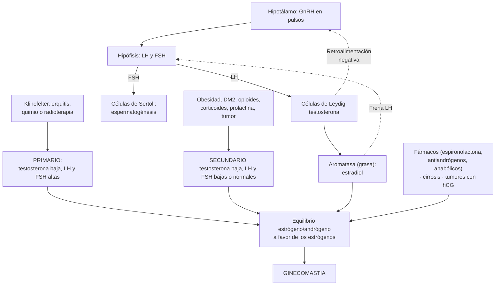
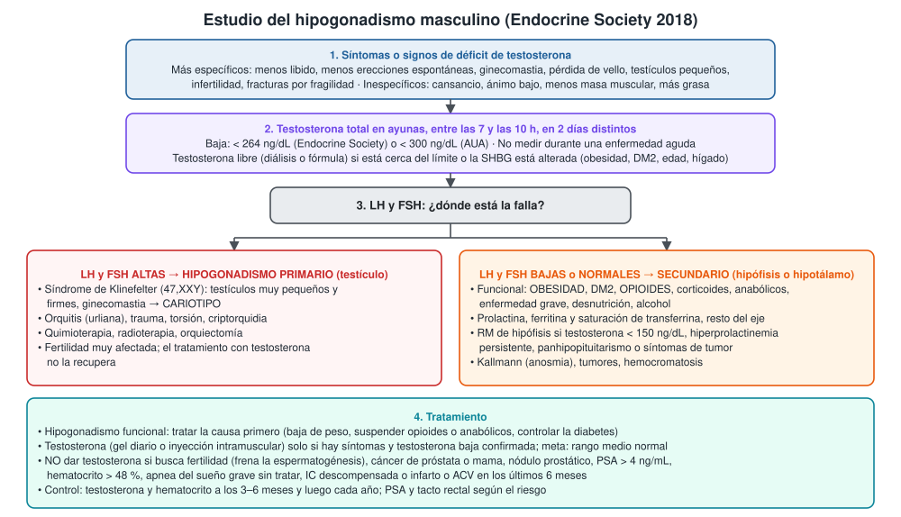
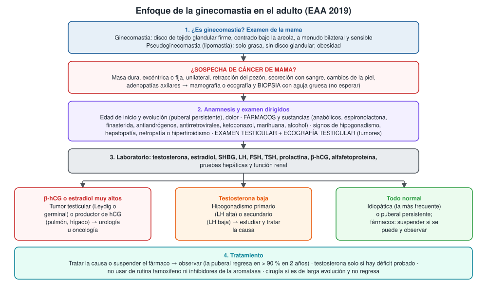

---
tags:
  - Endocrinología
---

# Hipogonadismo masculino y ginecomastia

**Subespecialidad**
Endocrinología · Andrología y urología · Medicina interna · Atención primaria

**Guías principales**
Endocrine Society 2018: terapia con testosterona en hombres con hipogonadismo · AUA 2018: déficit de testosterona · EAU 2025: salud sexual y reproductiva masculina (hipogonadismo de inicio tardío) · European Academy of Andrology (EAA) 2019: ginecomastia

**Otras fuentes**
TRAVERSE (seguridad cardiovascular de la testosterona, *N Engl J Med* 2023) · Rangos armonizados de testosterona (2017) · Estudio chileno del déficit androgénico del adulto mayor (Blümel 2009) · Serie latinoamericana de ginecomastia del adulto (Costanzo 2018)

**GES**
No

**EUNACOM**
1.03.1.012 Hipogonadismo masculino (sospecha, inicial, completo) · 1.03.1.023 Ginecomastia (específico, inicial, derivar)

**Revisado**
Octubre 2026

!!! abstract "Resumen en 60 segundos"
    - **Hipogonadismo masculino**: **síntomas** de déficit de testosterona **+ testosterona baja confirmada**. Una de las dos sola no basta.
        - **Primario** (testículo; LH y FSH **altas**): **Klinefelter** (47,XXY), orquitis, quimioterapia o radioterapia, trauma.
        - **Secundario** (hipófisis o hipotálamo; LH y FSH **bajas o normales**): sobre todo **funcional**, por **obesidad**, **DM2**, **opioides**, corticoides, anabólicos o enfermedad grave; también hiperprolactinemia, tumores hipofisarios, hemocromatosis.
    - **Diagnóstico**: **testosterona total en ayunas, 7–10 h**, repetida en otro día. Baja si **< 264 ng/dL** (Endocrine Society) o < 300 ng/dL (AUA). Medir la **testosterona libre** si la SHBG está alterada. Luego **LH, FSH** y prolactina. **RM de hipófisis** si la testosterona es < 150 ng/dL o hay signos de tumor.
    - **Tratamiento**:
        - Si es funcional: **tratar la causa** (baja de peso, suspender opioides).
        - **Testosterona** (gel o inyección intramuscular) solo si hay síntomas y déficit confirmado; meta: **rango medio normal**.
        - **No** darla si busca **fertilidad**, ni con cáncer de próstata o mama, PSA > 4 ng/mL, hematocrito > 48 %, apnea grave sin tratar.
        - Control del **hematocrito** y del **PSA**. En TRAVERSE (2023) no aumentó los eventos cardiovasculares mayores, pero hubo más FA, LRA y embolia pulmonar.
    - **Ginecomastia**: proliferación benigna del **tejido glandular** mamario en el hombre. Hay que diferenciarla de la **lipomastia** (solo grasa) y del **cáncer de mama**.
        - Es frecuente en el recién nacido, en la **pubertad** (~ 50 %; regresa en > 90 % en 2 años) y en el **adulto mayor**.
        - En el adulto, el estudio encuentra una causa en ~ **45–50 %**: **fármacos y anabólicos**, **hipogonadismo**, hepatopatía, ERC, hipertiroidismo, **tumores testiculares**.
        - Estudio: anamnesis de fármacos, **examen y ecografía testicular**, testosterona, estradiol, LH, FSH, prolactina, TSH, **β-hCG**, función hepática y renal.

## Definición

- **Hipogonadismo masculino**: síndrome clínico por **déficit de producción de testosterona** y/o de **espermatozoides** por alteración del eje hipotálamo-hipófisis-testículo.
    - **Primario** (hipergonadotropo): falla del **testículo**; testosterona baja con **LH y FSH altas**.
    - **Secundario** (hipogonadotropo): falla de la **hipófisis o del hipotálamo**; testosterona baja con **LH y FSH bajas o inapropiadamente normales**.
    - **Hipogonadismo funcional** (en oposición al orgánico): secundario a condiciones **potencialmente reversibles** (obesidad, enfermedades crónicas, fármacos), sin lesión estructural del eje.
    - **Hipogonadismo de inicio tardío**: síntomas de déficit de testosterona con testosterona baja en el hombre que envejece (EAU 2025).
- **Ginecomastia**: proliferación **benigna** del **tejido glandular** de la mama en el hombre. Se palpa un disco firme, gomoso, bajo la areola (EAA 2019).
- **Pseudoginecomastia (lipomastia)**: aumento de la mama por **grasa**, sin tejido glandular; típica de la obesidad.

## Epidemiología

### Mundial

- La testosterona **baja con la edad** (y sube la SHBG). Valor de referencia armonizado en hombres sanos, no obesos, de 19 a 39 años: **264–916 ng/dL** (Travison 2017).
- El hipogonadismo funcional es frecuente en la **obesidad**, la **DM2** y los usuarios de **opioides**.
- **Síndrome de Klinefelter**: la causa genética más frecuente de hipogonadismo primario; muchos casos **no se diagnostican**.
- **Ginecomastia** (EAA 2019):
    - Prevalencia de **32–65 %**, según la edad y la definición.
    - **Puberal**: ~ **50 %** de los adolescentes a mitad de la pubertad; regresa sola en **> 90 %** en 24 meses.
    - **Del adulto**: aumenta con la edad; el estudio encuentra una **causa** en ~ **45–50 %**.
    - El **cáncer de mama masculino** es raro y la ginecomastia **no es premaligna**.

### Chile

!!! chile "Datos nacionales y latinoamericanos"
    - **Déficit androgénico del hombre que envejece** (Blümel 2009): 96 hombres de ≥ 40 años de la zona sur de Santiago.
        - La testosterona **biodisponible** confirmó el déficit en **28 %**.
        - El cuestionario **ADAM** fue muy sensible (83 %) pero poco específico (20 %): marcó como "positivos" a 81 % de los hombres.
        - El mejor predictor aislado fue la **disminución del deseo sexual**.
    - **Ginecomastia del adulto en Latinoamérica** (Costanzo 2018, estudio multicéntrico argentino de 237 hombres):
        - Mayor frecuencia entre los **21 y 30 años**. Consultaron por motivos **estéticos** (63 %) y por **dolor** (51 %).
        - **Sin causa** identificada en **45 %**.
        - Causas más frecuentes: **esteroides anabólicos** (14 %), **hipogonadismo** (11 %) y **fármacos** (8 %: finasterida, antirretrovirales, espironolactona, bicalutamida).
    - **No es GES**. El estudio inicial se hace en la APS o en medicina interna, y se deriva a endocrinología, urología o cirugía de mama según la causa.

## Etiología y factores de riesgo

**Causas de hipogonadismo masculino**

| Tipo | Causas |
|---|---|
| **Primario** (testicular) | **Síndrome de Klinefelter** (47,XXY) · criptorquidia · **orquitis** (urliana) · trauma, torsión · **quimioterapia**, **radioterapia**, orquiectomía · fármacos (ketoconazol, espironolactona en dosis altas) · enfermedades sistémicas (ERC, cirrosis, VIH) |
| **Secundario orgánico** | **Tumores** hipofisarios o hipotalámicos (y su cirugía o radioterapia) · **hiperprolactinemia** (prolactinoma) · **hemocromatosis** · enfermedades infiltrativas · TEC · **síndrome de Kallmann** (con anosmia) |
| **Secundario funcional** (el más frecuente) | **Obesidad** y síndrome metabólico · **DM2** · **opioides** · **glucocorticoides** · **suspensión de anabólicos** · enfermedad aguda o crónica grave · desnutrición, ejercicio extremo · alcohol · apnea del sueño |
| **Mixto** | Envejecimiento, cirrosis, ERC, VIH, anemia de células falciformes |

**Causas de ginecomastia**

| Grupo | Causas |
|---|---|
| **Fisiológica** | Recién nacido · **pubertad** · adulto mayor |
| **Fármacos y sustancias** | **Esteroides anabólicos** · **espironolactona** · **antiandrógenos** (bicalutamida, flutamida) y análogos de GnRH · **inhibidores de la 5α-reductasa** (finasterida, dutasterida) · ketoconazol · cimetidina · estrógenos · antirretrovirales · antipsicóticos y otros que suben la prolactina · digoxina · alcohol, marihuana |
| **Hipogonadismo** | Primario (Klinefelter) o secundario |
| **Tumores** | **Testiculares** (células de Leydig, de Sertoli, germinales productores de hCG) · suprarrenales feminizantes · tumores productores de **hCG** (pulmón, hígado) |
| **Enfermedades sistémicas** | **Cirrosis** · **ERC** y diálisis · **hipertiroidismo** · realimentación tras desnutrición · obesidad (aromatización) |
| **Idiopática** | La más frecuente en el adulto tras un estudio completo |

## Fisiopatología

- **Eje**: el hipotálamo secreta **GnRH** en pulsos → la hipófisis secreta **LH** (estimula a las **células de Leydig** a producir testosterona) y **FSH** (con la testosterona intratesticular, estimula la **espermatogénesis** en las células de Sertoli). La testosterona y el estradiol (por aromatización) frenan la GnRH y la LH; la **inhibina B** frena la FSH.
- **Testosterona en sangre**: ~ 2 % libre, ~ 40–50 % unida a **albúmina** (débilmente) y el resto a la **SHBG** (fuertemente). La fracción **libre + unida a albúmina** es la **biodisponible**.
    - La **SHBG baja** en la obesidad, la DM2, el hipotiroidismo y con glucocorticoides o andrógenos → la testosterona **total** puede salir baja con la **libre normal**.
    - La **SHBG sube** con la edad, el hipertiroidismo, la cirrosis, el VIH y los estrógenos → la total puede salir normal con la libre baja.
- **Obesidad**: la **aromatasa** del tejido graso convierte la testosterona en estradiol, que frena la LH; además bajan la SHBG y la secreción de GnRH (leptina, inflamación) → hipogonadismo **funcional** y ginecomastia.
- **Opioides y glucocorticoides**: frenan la secreción de GnRH.
- **Testosterona exógena** (y anabólicos): frena la LH y la FSH → **atrofia testicular** e **infertilidad**; al suspenderla, hipogonadismo transitorio.
- **Ginecomastia**: **desequilibrio entre estrógenos (estimulan) y andrógenos (inhiben)** el tejido mamario:
    - Más estrógenos: tumores, hCG (estimula la aromatasa), obesidad, cirrosis, hipertiroidismo (sube la SHBG y la aromatización).
    - Menos andrógenos o menos acción: hipogonadismo, antiandrógenos, espironolactona, inhibidores de la 5α-reductasa.
    - Con el tiempo (> 1 año) el tejido se vuelve **fibroso** y ya no regresa con fármacos.

*Figura 1. Eje hipotálamo-hipófisis-testículo, tipos de hipogonadismo y mecanismo de la ginecomastia. Esquema propio basado en las guías de la Endocrine Society 2018 y de la EAA 2019.*

## Clasificación

| | Hipogonadismo primario | Hipogonadismo secundario |
|---|---|---|
| **Nivel** | Testículo | Hipófisis o hipotálamo |
| **Testosterona** | Baja | Baja |
| **LH y FSH** | **Altas** | **Bajas o normales** |
| **Ejemplos** | Klinefelter, orquitis, quimioterapia | Obesidad, opioides, prolactinoma, hemocromatosis, Kallmann |
| **Estudio dirigido** | **Cariotipo** (testículos pequeños) | **Prolactina**, ferritina y saturación de transferrina, eje hipofisario, **RM** si corresponde |
| **Fertilidad** | Difícil de recuperar | Se puede inducir con **gonadotropinas** (hCG ± FSH) |

**Ginecomastia según el tiempo de evolución**: **florida** (< 6–12 meses, tejido proliferativo, dolorosa, puede regresar) frente a **fibrosa** (> 12 meses, no regresa con fármacos; tratamiento quirúrgico).

## Clínica

**Hipogonadismo masculino** (Endocrine Society 2018)

| Más específicos | Menos específicos |
|---|---|
| Desarrollo sexual incompleto o retrasado (eunucoidismo) | Menos energía, cansancio |
| **Disminución de la libido** y de la actividad sexual | Ánimo depresivo, irritabilidad, dificultad de concentración |
| **Menos erecciones espontáneas** (matinales) | Disminución de la masa y la fuerza muscular |
| **Ginecomastia**, mamas sensibles | Aumento de la grasa corporal, del IMC |
| Pérdida de vello axilar y púbico; menos afeitado | Alteraciones del sueño, somnolencia |
| **Testículos muy pequeños** (< 6 mL) o que se achican | **Anemia** normocítica leve |
| **Infertilidad**, oligospermia | Disfunción eréctil (sola, poco específica) |
| Fracturas por fragilidad, baja densidad ósea | |
| **Bochornos** y sudoración | |

- **Klinefelter**: testículos **muy pequeños y firmes** (< 4 mL), talla alta con extremidades largas, ginecomastia, infertilidad (azoospermia), dificultades de aprendizaje.
- **Kallmann**: pubertad ausente o incompleta y **anosmia**.
- **Tumor hipofisario**: cefalea, alteraciones visuales, galactorrea, otros déficits hormonales (ver [hipófisis](hipofisis-tumores-hipopituitarismo-e-hiperprolactinemia.md)).
- **Hemocromatosis**: hepatopatía, diabetes, artropatía, hiperpigmentación.
- **Uso de anabólicos**: musculatura muy desarrollada, acné, testículos pequeños, ginecomastia, eritrocitosis.

**Ginecomastia**

- Aumento de volumen de la mama, **bilateral** (más de la mitad) o unilateral, a veces **dolorosa** o sensible.
- **Examen**: con el paciente en decúbito, tomar la mama entre el pulgar y el índice y acercarlos hacia el pezón: en la ginecomastia se palpa un **disco firme**, móvil, **concéntrico** con la areola; en la lipomastia, los dedos se juntan sin encontrar tejido.
- Buscar: signos de **hipogonadismo**, **testículos** (tamaño, nódulos), signos de **hepatopatía** crónica, **hipertiroidismo**, ERC, uso de anabólicos.

!!! alarma "Signos de alarma: derivar o estudiar con prioridad"
    - Masa mamaria **dura, excéntrica, fija o unilateral**, con **retracción del pezón**, **secreción con sangre**, cambios de la piel o **adenopatías axilares** → sospecha de **cáncer de mama**: biopsia con aguja gruesa.
    - **Nódulo testicular** o testículo aumentado de tamaño → **tumor testicular** (ecografía y urología urgente).
    - Ginecomastia de **crecimiento rápido** con **β-hCG** o estradiol muy altos.
    - Hipogonadismo con **cefalea**, **alteración del campo visual** o testosterona **< 150 ng/dL** → tumor hipofisario.
    - Con testosterona: **hematocrito > 54 %**, aumento rápido del PSA, nódulo prostático, edema o trombosis.

## Diagnóstico

!!! guia "Hipogonadismo masculino (Endocrine Society 2018)"
    - Diagnosticar el hipogonadismo **solo** en hombres con **síntomas y signos** compatibles **y** testosterona **inequívoca y repetidamente baja**.
    - **Testosterona total** en **ayunas** y en la **mañana** (7–10 h), con un método confiable; **confirmar** con una segunda medición.
    - Rango normal armonizado (hombres sanos no obesos de 19–39 años): **264–916 ng/dL**.
    - **Testosterona libre** (diálisis de equilibrio o fórmula) si la total está cerca del límite inferior o hay una condición que altera la **SHBG** (obesidad, DM2, edad, cirrosis, VIH, hipertiroidismo, fármacos).
    - **No medir** durante una enfermedad aguda ni en la recuperación inmediata; tener en cuenta los opioides y los glucocorticoides.
    - Una vez confirmado: **LH y FSH** para distinguir primario de secundario y buscar la **causa**.
        - **Secundario**: prolactina, **ferritina y saturación de transferrina**, evaluación del resto de la hipófisis. **RM** si la testosterona es **< 150 ng/dL**, hay panhipopituitarismo, hiperprolactinemia persistente o síntomas de tumor (cefalea, visión).
        - **Primario** con testículos pequeños: **cariotipo**.
    - Si busca fertilidad: **espermiograma**.
    - **No tamizar** a la población general ni tratar de rutina a todos los hombres > 65 años con testosterona baja.

<figure markdown>
{ loading=lazy }
<figcaption>Figura 2. Estudio del hipogonadismo masculino. Esquema propio basado en la guía de la Endocrine Society 2018 (con el umbral de la AUA 2018).</figcaption>
</figure>

!!! guia "Ginecomastia (EAA 2019)"
    - En la ginecomastia del **adulto** hay que **buscar siempre una causa**, aunque haya un fármaco que la explique.
    - El primer filtro (descartar lipomastia, cáncer de mama evidente o tumor testicular) lo puede hacer un **médico general**; el estudio completo, un especialista.
    - **Anamnesis**: inicio y evolución, desarrollo y función sexual, **fármacos y sustancias** (anabólicos).
    - **Examen**: signos de **subvirilización** o de enfermedad sistémica; **mama** (tejido glandular frente a lipomastia; sospecha de cáncer); **genitales**, con **ecografía testicular** (la palpación es poco sensible para los tumores).
    - **Laboratorio**: testosterona, **estradiol**, SHBG, LH, FSH, TSH, prolactina, **β-hCG**, **alfafetoproteína**, pruebas hepáticas y función renal.
    - **Imagen mamaria** (ecografía o mamografía) si el examen es dudoso; **biopsia con aguja gruesa** directa si hay sospecha de cáncer.

<figure markdown>
{ loading=lazy }
<figcaption>Figura 3. Enfoque de la ginecomastia en el adulto. Esquema propio basado en la guía de la European Academy of Andrology 2019.</figcaption>
</figure>

## Laboratorio

| Examen | Interpretación |
|---|---|
| **Testosterona total** (7–10 h, ayunas, 2 veces) | **< 264 ng/dL** (Endocrine Society) o < 300 ng/dL (AUA) = baja. Entre 200 y 350 ng/dL, mirar la libre |
| **Testosterona libre** (calculada o por diálisis) | Útil si la SHBG está alterada |
| **SHBG** | Baja en obesidad y DM2; alta en la edad, el hipertiroidismo y la cirrosis |
| **LH y FSH** | **Altas** = primario; **bajas o normales** = secundario |
| **Prolactina** | Hiperprolactinemia (prolactinoma, fármacos) |
| **Ferritina, saturación de transferrina** | Hemocromatosis (hipogonadismo secundario) |
| **Cortisol 8 h, TSH, T4 libre, IGF-1** | Resto de la función hipofisaria si el hipogonadismo es secundario |
| **Cariotipo** | Klinefelter (testículos pequeños, LH y FSH altas) |
| **Espermiograma** | Si desea fertilidad |
| **Hematocrito, PSA** | Antes de iniciar testosterona y en el control |
| **Estradiol** | Alto en tumores, obesidad, cirrosis, hCG |
| **β-hCG, alfafetoproteína** | Tumores testiculares germinales o productores de hCG |
| **Pruebas hepáticas, creatinina, TSH** | Cirrosis, ERC, hipertiroidismo como causa de ginecomastia |
| **Densitometría** | Hipogonadismo grave o fracturas |

## Imágenes

- **Ecografía testicular**: en toda **ginecomastia** del adulto (tumores no palpables) y si hay un nódulo testicular.
- **Ecografía o mamografía**: si el examen de la mama es dudoso o hay sospecha de cáncer; luego biopsia con aguja gruesa.
- **RM de hipófisis**: hipogonadismo secundario con testosterona **< 150 ng/dL**, hiperprolactinemia persistente, panhipopituitarismo o síntomas de tumor.
- **TC de tórax y abdomen**: β-hCG alta sin tumor testicular (tumores extragonadales) o sospecha de tumor suprarrenal feminizante.
- **Densitometría ósea**: hipogonadismo de larga evolución o grave.

## Diagnóstico diferencial

| Cuadro | Claves |
|---|---|
| **Testosterona baja por enfermedad aguda** | Se normaliza al recuperarse: no tratar; repetir |
| **Testosterona total baja con SHBG baja** (obesidad, DM2) | Testosterona **libre normal**: no es hipogonadismo |
| **Depresión, apnea del sueño, hipotiroidismo** | Cansancio, poca libido y ánimo bajo con testosterona normal |
| **Disfunción eréctil vascular o psicógena** | Libido conservada, testosterona normal; factores de riesgo cardiovascular |
| **Lipomastia** | Grasa sin disco glandular, obesidad |
| **Cáncer de mama masculino** | Masa dura, excéntrica, unilateral, fija; retracción del pezón, adenopatías |
| **Lipoma, quiste, absceso mamario** | Masa localizada fuera de la areola; signos inflamatorios en el absceso |

## Tratamiento

### Hipogonadismo masculino

- **Hipogonadismo funcional**: tratar primero la causa:
    - **Baja de peso** (la testosterona sube con la pérdida de peso, incluida la cirugía bariátrica).
    - Control de la **diabetes**.
    - Suspender o reducir los **opioides** y los **glucocorticoides** si se puede.
    - Dejar los **anabólicos** (el eje puede tardar meses en recuperarse).
    - Tratar la **apnea del sueño**.
- **Hiperprolactinemia**: cabergolina (prolactinoma) o cambiar el fármaco responsable.
- **Testosterona** (Endocrine Society 2018):
    - **Indicación**: síntomas de déficit **y** testosterona baja confirmada, tras conversar los beneficios y los riesgos.
    - **Beneficios**: mejora la libido, la función sexual, la densidad ósea, la masa muscular, el ánimo y la anemia. Efecto modesto en la energía y la función física.
    - **Meta**: testosterona en el **rango medio normal**.
    - **Formulaciones**: **gel** transdérmico diario; **inyección intramuscular** de undecanoato (cada 10–14 semanas) o de enantato o cipionato (cada 1–2 semanas).
    - **Contraindicaciones**: deseo de **fertilidad** a corto plazo; cáncer de **próstata** o de **mama**; nódulo o induración prostática; **PSA > 4 ng/mL** (> 3 ng/mL con alto riesgo) sin evaluación urológica; **hematocrito > 48 %** (> 50 % en la altura); **apnea del sueño grave** sin tratar; síntomas urinarios bajos graves; insuficiencia cardíaca descompensada; **infarto o ACV** en los últimos 6 meses; trombofilia.
    - **Seguridad cardiovascular**: en **TRAVERSE** (5.246 hombres de 45–80 años con enfermedad cardiovascular o alto riesgo) la testosterona en gel **no aumentó** los eventos cardiovasculares mayores (**7,0 %** frente a **7,3 %**; HR 0,96). Hubo **más fibrilación auricular, lesión renal aguda y embolia pulmonar**.
- **Si desea fertilidad** (hipogonadismo secundario): **hCG** ± FSH, indicadas por el especialista. La testosterona **frena** la espermatogénesis.
- **Klinefelter**: testosterona de por vida desde la pubertad; la fertilidad requiere técnicas de reproducción asistida (extracción de espermatozoides del testículo).

### Ginecomastia (EAA 2019)

- **Puberal**: **observar** y tranquilizar; regresa en > 90 % en 2 años.
- **Del adulto**:
    - **Tratar la causa** o **suspender el fármaco**; luego **observar**.
    - **Testosterona** solo si hay **déficit demostrado**.
    - **No se recomienda de rutina** el uso de moduladores de los receptores de estrógenos (**tamoxifeno**), inhibidores de la aromatasa ni andrógenos no aromatizables.
    - **Cirugía** (mastectomía subcutánea ± liposucción) si es de **larga evolución** y no regresa en forma espontánea ni con el tratamiento de la causa.
- **Cáncer de próstata con antiandrógenos**: la ginecomastia y la mastalgia son muy frecuentes; existen estrategias de prevención (tamoxifeno o radioterapia mamaria profiláctica) que decide el oncólogo.

!!! dosis "Dosis de referencia (testosterona; Endocrine Society 2018)"
    | Formulación | Dosis habitual | Observaciones |
    |---|---|---|
    | **Testosterona en gel** (1 % o 1,62 %) | 50–100 mg/día (gel 1 %) aplicado en hombros o brazos | Niveles estables; evitar el contacto piel con piel (mujeres y niños) |
    | **Undecanoato de testosterona IM** | **1000 mg**, la segunda dosis a las 6 semanas y luego **cada 10–14 semanas** | Inyección profunda y lenta (riesgo de microembolia oleosa) |
    | **Enantato o cipionato de testosterona IM** | 100 mg cada semana o 200 mg cada 2 semanas | Picos y valles: variaciones del ánimo y la libido; más eritrocitosis |
    | **Control** | Testosterona y **hematocrito** a los **3–6 meses** y luego **cada año**; PSA y tacto rectal (40–69 años) según el riesgo; densitometría a 1–2 años si había osteoporosis | Suspender si el hematocrito supera el **54 %**; derivar a urología si el PSA sube **> 1,4 ng/mL** en 12 meses o hay un nódulo |

## Complicaciones

- **Del hipogonadismo**: osteoporosis y fracturas, anemia, sarcopenia, disfunción sexual, infertilidad, ánimo depresivo, más grasa visceral y resistencia a la insulina.
- **De la testosterona**:
    - **Eritrocitosis** (la más frecuente, sobre todo con inyecciones).
    - **Infertilidad** por supresión del eje (muy importante en hombres jóvenes).
    - Acné, ginecomastia, retención de líquido.
    - Empeoramiento de la apnea del sueño.
    - Crecimiento de un cáncer de próstata preexistente.
    - En TRAVERSE: más FA, LRA y embolia pulmonar.
- **De la ginecomastia**: dolor, impacto psicológico y en la imagen corporal. No aumenta el riesgo de cáncer de mama en sí, pero el **Klinefelter** sí se asocia a más cáncer de mama.

## Pronóstico y seguimiento

- **Hipogonadismo funcional**: puede **revertir** al corregir la causa (baja de peso, suspender opioides o anabólicos).
- **Orgánico**: el tratamiento con testosterona suele ser **de por vida**.
- **Con testosterona**: evaluar los síntomas a los **3–6 meses**; si no hay mejoría clara, reconsiderar el tratamiento. Control anual del hematocrito y, según la edad y el riesgo, del PSA.
- **Ginecomastia puberal**: regresa en la gran mayoría; si persiste más de 2 años o al final de la pubertad, se vuelve fibrosa.
- **Ginecomastia del adulto**: tras corregir la causa, puede regresar si el tejido aún no es fibroso (< 1 año).

## Perlas para el internado

!!! perla "Para recordar en la sala"
    - **Síntomas + testosterona baja confirmada** = hipogonadismo. Una testosterona baja **aislada**, en la tarde o durante una hospitalización, **no** es diagnóstico.
    - Medir la testosterona **en ayunas y en la mañana**, y **repetirla**.
    - Obeso o diabético con testosterona total baja: pedir la **libre** (la SHBG está baja).
    - **LH y FSH altas** = testículo (Klinefelter: testículos muy pequeños → **cariotipo**). **LH baja o normal** = buscar obesidad, **opioides**, prolactina, hierro y tumor hipofisario.
    - **La testosterona es un anticonceptivo**: nunca darla a un hombre que quiere tener hijos.
    - Antes de la testosterona: **hematocrito y PSA**. Hematocrito > 54 % con tratamiento: suspender.
    - Toda ginecomastia del adulto: preguntar por **anabólicos y fármacos** (espironolactona, finasterida, antiandrógenos) y hacer **ecografía testicular**.
    - **Masa mamaria dura, excéntrica y unilateral** en un hombre: es cáncer hasta demostrar lo contrario → **biopsia**.
    - Espironolactona con ginecomastia: cambiar a **eplerenona** si se puede.

## Preguntas de repaso

??? repaso "1. Hombre de 52 años, IMC 36, con DM2 (HbA1c 8,5 %), cansancio y disminución de la libido. Testosterona total 230 ng/dL a las 16 h. ¿Tiene hipogonadismo? ¿Qué hace?"
    - **Todavía no se puede afirmar**: la muestra fue en la **tarde**. Repetir la **testosterona total en ayunas, entre las 7 y las 10 h**, en 2 días distintos.
    - En la obesidad y la DM2 la **SHBG está baja**: pedir **SHBG y testosterona libre** (calculada).
    - Si se confirma: **LH y FSH** (probablemente bajas o normales: **hipogonadismo funcional**) y prolactina.
    - **Primero**: baja de peso y control de la diabetes (un arGLP-1 o un iSGLT2 ayudan con ambas cosas); tratar la apnea del sueño si la tiene.
    - Testosterona solo si persisten los síntomas con déficit confirmado pese a lo anterior, y sin contraindicaciones.

??? repaso "2. Hombre de 28 años con infertilidad de 2 años. Talla alta, ginecomastia bilateral, vello escaso, testículos de 3 mL, firmes. Testosterona 180 ng/dL, LH y FSH muy altas. ¿Diagnóstico y estudio?"
    - **Hipogonadismo primario** (testosterona baja con gonadotropinas altas) con testículos muy pequeños → **síndrome de Klinefelter** (47,XXY).
    - **Cariotipo** para confirmar; **espermiograma** (habitualmente azoospermia).
    - **Derivar** a endocrinología y andrología: testosterona de reemplazo (a largo plazo), pero **antes** discutir la fertilidad (extracción de espermatozoides del testículo y reproducción asistida), porque la testosterona frena la espermatogénesis residual.
    - Densitometría, control metabólico; mayor riesgo de **cáncer de mama**.

??? repaso "3. Hombre de 45 años usuario de metadona por 3 años, con disfunción sexual. Testosterona 160 ng/dL (2 veces), LH baja, prolactina normal. ¿Qué causa sospecha?"
    - **Hipogonadismo secundario** por **opioides** (frenan la GnRH).
    - Evaluar el resto de la hipófisis (cortisol: los opioides también pueden frenar el eje suprarrenal) y la ferritina. Considerar una RM si la testosterona baja de 150 ng/dL o aparecen otros signos.
    - **Manejo**: discutir con su equipo la reducción del opioide si es posible; si no, testosterona según los síntomas y sin contraindicaciones.

??? repaso "4. Hombre de 67 años con IC compensada que usa espironolactona 25 mg/día, con aumento de volumen doloroso de ambas mamas desde hace 4 meses. Al examen: disco glandular subareolar bilateral, sin masas duras ni adenopatías. ¿Qué hace?"
    - **Ginecomastia bilateral** probablemente por **espironolactona**, de evolución reciente (puede regresar).
    - Aun así, **estudio básico** (EAA): examen y **ecografía testicular**, testosterona, estradiol, LH, FSH, TSH, prolactina, β-hCG, pruebas hepáticas y creatinina.
    - **Cambiar a eplerenona** (antagonista mineralocorticoide más selectivo, sin efecto antiandrogénico) y observar.
    - Sin signos de cáncer no requiere biopsia.

??? repaso "5. Hombre de 24 años, fisicoculturista, consulta por ginecomastia y testículos más pequeños. Usó anabólicos inyectables por 8 meses y los suspendió hace 2 meses. Testosterona 120 ng/dL, LH y FSH bajas, hematocrito 52 %. ¿Cómo lo interpreta?"
    - **Hipogonadismo secundario por suspensión de anabólicos**: los andrógenos exógenos frenaron la LH y la FSH; al suspenderlos, el eje tarda **meses** en recuperarse. La ginecomastia se explica por la aromatización de los anabólicos y luego por el déficit de testosterona.
    - **Eritrocitosis** por los andrógenos: controlar el hematocrito.
    - **Manejo**: no volver a usarlos; **observar** la recuperación del eje (meses); derivar a endocrinología o andrología si no se recupera o desea fertilidad. Espermiograma.
    - Ecografía testicular y β-hCG para completar el estudio de la ginecomastia.

??? repaso "6. Hombre de 61 años con una masa de 2 cm en la mama izquierda, dura, por fuera de la areola, con retracción del pezón y una adenopatía axilar. ¿Qué hace?"
    - Tiene **signos de cáncer de mama**: masa **dura, excéntrica, unilateral**, retracción del pezón y adenopatía axilar. **No es una ginecomastia típica**.
    - **Mamografía y ecografía** mamaria y axilar, y **biopsia con aguja gruesa** (core) sin demora.
    - **Derivar** a la unidad de patología mamaria o cirugía oncológica.

## Referencias

1. Bhasin S, Brito JP, Cunningham GR, et al. Testosterone therapy in men with hypogonadism: an Endocrine Society clinical practice guideline. *J Clin Endocrinol Metab.* 2018;103(5):1715–1744. doi:[10.1210/jc.2018-00229](https://doi.org/10.1210/jc.2018-00229)
2. Mulhall JP, Trost LW, Brannigan RE, et al. Evaluation and management of testosterone deficiency: AUA guideline. *J Urol.* 2018;200(2):423–432. doi:[10.1016/j.juro.2018.03.115](https://doi.org/10.1016/j.juro.2018.03.115)
3. Salonia A, Capogrosso P, Boeri L, et al. European Association of Urology guidelines on male sexual and reproductive health: 2025 update on male hypogonadism, erectile dysfunction, premature ejaculation, and Peyronie's disease. *Eur Urol.* 2025;88(1):76–102. doi:[10.1016/j.eururo.2025.04.010](https://doi.org/10.1016/j.eururo.2025.04.010)
4. Kanakis GA, Nordkap L, Bang AK, et al. EAA clinical practice guidelines—gynecomastia evaluation and management. *Andrology.* 2019;7(6):778–793. doi:[10.1111/andr.12636](https://doi.org/10.1111/andr.12636)
5. Lincoff AM, Bhasin S, Flevaris P, et al. Cardiovascular safety of testosterone-replacement therapy. *N Engl J Med.* 2023;389(2):107–117. doi:[10.1056/NEJMoa2215025](https://doi.org/10.1056/NEJMoa2215025)
6. Travison TG, Vesper HW, Orwoll E, et al. Harmonized reference ranges for circulating testosterone levels in men of four cohort studies in the United States and Europe. *J Clin Endocrinol Metab.* 2017;102(4):1161–1173. doi:[10.1210/jc.2016-2935](https://doi.org/10.1210/jc.2016-2935)
7. Blümel JE, Chedraui P, Gili SA, et al. Is the Androgen Deficiency of Aging Men (ADAM) questionnaire useful for the screening of partial androgenic deficiency of aging men? *Maturitas.* 2009;63(4):365–368. doi:[10.1016/j.maturitas.2009.04.004](https://doi.org/10.1016/j.maturitas.2009.04.004)
8. Costanzo PR, Pacenza NA, Aszpis SM, et al. Clinical and etiological aspects of gynecomastia in adult males: a multicenter study. *Biomed Res Int.* 2018;2018:8364824. doi:[10.1155/2018/8364824](https://doi.org/10.1155/2018/8364824)
