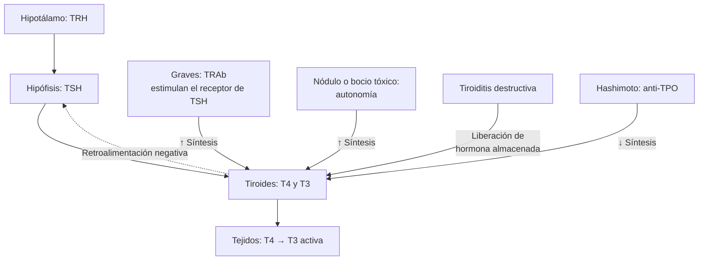

---
tags:
  - Endocrinología
  - GES
  - Frecuente en sala
  - Urgencia
---

# Hipotiroidismo, hipertiroidismo y tiroiditis

**Subespecialidad**
Endocrinología · Medicina interna · APS

**Guías principales**
ATA 2014: tratamiento del hipotiroidismo (*Thyroid*) · ATA 2016: hipertiroidismo y otras causas de tirotoxicosis (*Thyroid*) · ETA 2018: enfermedad de Graves · EUGOGO 2021: orbitopatía de Graves · JTA/JES 2016: tormenta tiroidea · ATA 2026: enfermedad tiroidea en el embarazo y el posparto

**Otras fuentes**
MINSAL: guía GES de hipotiroidismo en personas de 15 años y más · ENS 2009–2010 y 2016–2017 · Ensayo TRUST (2017) · ETA 2018: disfunción tiroidea por amiodarona

**GES**
Sí: hipotiroidismo en personas de 15 años y más. El hipertiroidismo no tiene un problema GES propio

**EUNACOM**
1.03.1.002 Hipotiroidismo (específico, completo, completo) · 1.03.1.003 Hipertiroidismo (específico, inicial, derivar) · 1.03.1.005 Tiroiditis (específico, completo, completo) · 1.03.2.001 Tormenta tiroidea (específico, inicial, derivar) · 1.03.2.002 Mixedema (específico, inicial, derivar)

**Revisado**
Septiembre 2026

!!! abstract "Resumen en 60 segundos"
    - La **TSH** es el mejor examen inicial. Se agrega la **T4 libre** para confirmar y graduar, y siempre si se sospecha una enfermedad hipofisaria.
    - **Hipotiroidismo**: en Chile, **~ 2 %** de hipotiroidismo clínico y **~ 16 %** de subclínico (ENS 2016–2017). La causa principal es la **tiroiditis de Hashimoto** (anticuerpos **anti-TPO**).
    - **Levotiroxina** (**1,6 µg/kg/día**) en ayunas. En adultos mayores o con cardiopatía coronaria, empezar con **25–50 µg/día**. Controlar la TSH a las **6–8 semanas**.
    - **Hipotiroidismo subclínico**: tratar si la **TSH ≥ 10** o hay **embarazo** o deseo de embarazo. Con TSH 4,5–10 en **adultos mayores**, en general **no** tratar (TRUST).
    - **Tirotoxicosis**:
        - Causas: **Graves** (la más frecuente; anticuerpos **TRAb**), **bocio multinodular tóxico** o adenoma tóxico, **tiroiditis** (captación baja; **no** llevan antitiroideos).
        - Tratamiento: **betabloqueador** para los síntomas y **tiamazol** para el Graves.
        - Opciones definitivas: **radioyodo** o **cirugía**.
    - **Tiamazol**: vigilar la **agranulocitosis** (fiebre u odinofagia → hemograma urgente y suspender). En el **primer trimestre del embarazo** y en la **tormenta tiroidea** se prefiere el **propiltiouracilo**.
    - **Tormenta tiroidea** y **coma mixedematoso**: urgencias con alta mortalidad. Tratar **sin esperar** los exámenes, en la UCI, y **derivar**.

## Definición

- **Hipotiroidismo**: producción insuficiente de hormonas tiroideas.
    - **Primario** (tiroides): TSH alta. Es el **> 95 %** de los casos.
    - **Central** (hipófisis o hipotálamo): TSH baja o "normal" con T4 libre baja.
    - **Clínico**: TSH alta con T4 libre baja.
    - **Subclínico**: TSH alta con T4 libre normal.
- **Tirotoxicosis**: estado clínico por **exceso de hormona tiroidea** en los tejidos, de cualquier origen.
- **Hipertiroidismo**: tirotoxicosis por **síntesis y secreción aumentadas** de la tiroides (Graves, nódulos tóxicos). Tiene **captación alta** en la cintigrafía.
    - **Subclínico**: TSH baja con T4 libre y T3 normales.
- **Tiroiditis**: inflamación de la tiroides. Si es **destructiva**, libera la hormona almacenada: produce tirotoxicosis con **captación baja**, y luego a menudo una fase hipotiroidea.
- **Coma mixedematoso**: hipotiroidismo grave descompensado, con **compromiso de conciencia**, **hipotermia** y falla multiorgánica.
- **Tormenta tiroidea**: tirotoxicosis grave con **disfunción multiorgánica**: fiebre, taquicardia o FA, insuficiencia cardíaca, compromiso de conciencia, síntomas digestivos o hepáticos.

## Epidemiología

### Mundial

- **Hipotiroidismo**:
    - En países con aporte adecuado de **yodo**: **hipotiroidismo clínico** en **0,3–3,7 %** de la población y **subclínico** en **4–10 %**. Es más frecuente en las **mujeres** (5–8 veces) y aumenta con la edad.
    - A nivel mundial, la **deficiencia de yodo** sigue siendo la principal causa.
- **Hipertiroidismo**:
    - Prevalencia de **~ 0,5–1,3 %**.
    - El **Graves** causa el **60–80 %** de los casos; es más común en mujeres de 20–50 años.
    - El **bocio multinodular tóxico** predomina en los adultos mayores y en zonas con déficit de yodo.
    - La **orbitopatía** aparece en **~ 25–30 %** de los pacientes con Graves (formas moderadas a graves en ~ 5 %).

### Chile

!!! chile "Datos nacionales"
    - **ENS 2016–2017** (guía GES):
        - **TSH elevada**: **18,6 %** (18,9 % mujeres, 18,2 % hombres).
        - **Hipotiroidismo subclínico**: **16,4 %**.
        - **Hipotiroidismo clínico** (TSH alta + T4 libre baja): **2,2 %** (2,6 % mujeres, 1,8 % hombres); **5,2 %** en los **≥ 65 años**.
        - **5 %** de los mayores de 15 años usa **levotiroxina**.
    - **Valores de referencia chilenos**: en la ENS 2009–2010, el percentil 97,5 de la TSH en la población sana fue **7,46 µUI/mL**, más alto que el de los kits de laboratorio (Mosso, 2013).
        - Con ese punto de corte, la prevalencia de hipotiroidismo sería de **4,8 %**. Con los cortes de los kits, sube a **22 %**.
        - **No todo "TSH alta" en el informe es enfermedad**, sobre todo en los adultos mayores.
    - **Yodación de la sal** (desde 1979, según la guía GES): la deficiencia de yodo dejó de ser la causa principal, y hoy predomina la **tiroiditis autoinmune (Hashimoto)**.
    - **GES**: el **hipotiroidismo en personas de 15 años y más** tiene garantía de diagnóstico, tratamiento con levotiroxina y seguimiento en la APS.

## Etiología y factores de riesgo

### Hipotiroidismo

| Tipo | Causas |
|---|---|
| **Primario** | **Tiroiditis de Hashimoto** (autoinmune, anti-TPO positivos: **la más frecuente**) · **Posablativo** (radioyodo, tiroidectomía) · **Fármacos**: **amiodarona**, **litio**, **inhibidores de puntos de control inmunitario**, interferón, inhibidores de tirosina quinasa · Deficiencia o exceso de yodo · Radioterapia de cuello · Fase hipotiroidea de una tiroiditis (subaguda, posparto, silente) · Enfermedades infiltrativas |
| **Central** | Tumores hipofisarios y su tratamiento (cirugía, radioterapia) · Síndrome de Sheehan · Hipofisitis · Traumatismo craneano |

**Factores de riesgo**: sexo femenino, edad, **otras enfermedades autoinmunes** (diabetes tipo 1, vitiligo, enfermedad celíaca, anemia perniciosa, insuficiencia suprarrenal), síndrome de Down o de Turner, antecedente familiar, posparto.

### Tirotoxicosis

| Mecanismo | Causas | Captación de radioyodo o Tc-99m |
|---|---|---|
| **Hipertiroidismo** (síntesis aumentada) | **Enfermedad de Graves** (TRAb) · **Bocio multinodular tóxico** · **Adenoma tóxico** · Inducido por **yodo** (contraste, amiodarona tipo 1) · Mola hidatiforme o hiperémesis (hCG) · Adenoma productor de TSH (raro) | **Alta** (difusa en el Graves; en "parches" o focal en los nódulos) |
| **Destrucción** (liberación de hormona almacenada) | **Tiroiditis subaguda** (De Quervain) · **Tiroiditis silente** · **Tiroiditis posparto** · Amiodarona tipo 2 · Fármacos (litio, inmunoterapia) | **Baja** |
| **Origen extratiroideo** | **Exceso de levotiroxina** (iatrogénico o facticio: **tiroglobulina baja**) · Struma ovarii · Metástasis de cáncer folicular | Baja |

## Fisiopatología

- **Eje hipotálamo-hipófisis-tiroides**:
    - La **TRH** estimula la secreción de **TSH**, que estimula la síntesis de **T4** (la principal) y T3.
    - La T4 se convierte en **T3** (la forma activa) en los tejidos.
    - Las hormonas tiroideas **inhiben** la TSH (retroalimentación negativa). Por eso la TSH cambia de manera **logarítmica** con cambios pequeños de la T4 libre, y es el marcador más sensible.
- **Hashimoto**: autoinmunidad celular y humoral (anti-TPO, anti-tiroglobulina) que destruye progresivamente la glándula. Primero aparece un hipotiroidismo subclínico, y luego uno clínico (**~ 4 % por año** si los anti-TPO son positivos).
- **Graves**: los anticuerpos **TRAb** estimulan el **receptor de TSH** y producen **bocio difuso** y **tirotoxicosis**. Los mismos anticuerpos activan a los fibroblastos de la órbita y producen la **orbitopatía**; en la piel, el **mixedema pretibial**.
- **Efectos de la hormona tiroidea**: aumenta el **metabolismo basal**, la termogénesis y la **sensibilidad a las catecolaminas** (más receptores β). De ahí la taquicardia, el temblor y la ansiedad, y la utilidad de los **betabloqueadores**.

*Figura 1. Eje tiroideo y mecanismos de la disfunción. Los antitiroideos bloquean la síntesis en la tiroides; el propiltiouracilo, los corticoides y el propranolol en dosis altas reducen además la conversión de T4 a T3. Esquema propio.*

## Clasificación

- **Hipotiroidismo**: primario o central; clínico o subclínico; congénito o adquirido.
- **Tirotoxicosis**:
    - **Con captación alta** (hipertiroidismo verdadero).
    - **Con captación baja** (tiroiditis, yodo, exógena).
    - Clínica o subclínica.
- **Tiroiditis**:
    - **Dolorosas**: **subaguda granulomatosa** (De Quervain, posviral), aguda supurativa (bacteriana, rara), por radiación o por palpación.
    - **Indoloras**: **silente**, **posparto**, por fármacos (amiodarona, litio, inmunoterapia), **Hashimoto** (crónica) y Riedel (fibrosante, muy rara).
- **Hipertiroidismo subclínico**:
    - **Grado 1**: TSH 0,1–0,4 mUI/L.
    - **Grado 2**: TSH < 0,1 mUI/L; aumenta el riesgo de **fibrilación auricular** y **osteoporosis**.

## Clínica

| Sistema | **Hipotiroidismo** | **Tirotoxicosis** |
|---|---|---|
| **General** | **Cansancio**, **intolerancia al frío**, **aumento de peso** leve | Intolerancia al calor, sudoración, **baja de peso** con apetito aumentado |
| **Cardiovascular** | **Bradicardia**, HTA diastólica, derrame pericárdico, dislipidemia | **Taquicardia**, palpitaciones, **fibrilación auricular**, HTA sistólica, insuficiencia cardíaca |
| **Neuropsiquiátrico** | Bradipsiquia, **depresión**, deterioro cognitivo, somnolencia, túnel carpiano, **reflejos con relajación lenta** | **Ansiedad**, irritabilidad, insomnio, **temblor fino**, hiperreflexia |
| **Piel y fanéras** | **Piel seca** y fría, caída del pelo, uñas quebradizas, **edema sin fóvea** (mixedema), macroglosia, voz ronca | Piel caliente y húmeda, pelo fino. En el Graves: **mixedema pretibial**, acropaquia |
| **Digestivo** | **Constipación** | **Aumento del número de deposiciones**, alza de transaminasas |
| **Musculoesquelético** | Mialgias, **CK alta**, calambres | **Debilidad proximal**, **osteoporosis**, parálisis periódica hipokalémica (hombres asiáticos) |
| **Reproductivo** | **Menorragia**, infertilidad, galactorrea (prolactina alta) | Oligomenorrea, ginecomastia, infertilidad |
| **Laboratorio** | **Hiponatremia**, **LDL alto**, anemia (normocítica o macrocítica), CK alta | Hipercalcemia leve, FA alta, hiperglicemia |

- **Signos oculares**:
    - Retracción palpebral y mirada fija: cualquier tirotoxicosis (efecto adrenérgico).
    - **Orbitopatía de Graves** (exclusiva del Graves): **exoftalmo**, edema y eritema palpebral y conjuntival, diplopía, dolor retroocular. En las formas graves, **neuropatía óptica compresiva**: **baja de la visión** y alteración de los colores. Es una **urgencia**.
- **Adultos mayores**: a menudo **oligosintomáticos**.
    - El hipotiroidismo puede presentarse **sólo** como deterioro cognitivo o cansancio.
    - La tirotoxicosis puede ser "**apática**" (baja de peso, FA, depresión, sin hiperadrenergia).
- **Tiroiditis subaguda**: **dolor cervical anterior** intenso que irradia al oído, fiebre, tiroides muy **sensible**, precedida de una infección viral. **VHS muy alta**.

<figure markdown>
{ loading=lazy }
<figcaption>Figura 2. Escala de actividad clínica (CAS) de la orbitopatía de Graves: un punto por ítem; un puntaje ≥ 3/7 indica orbitopatía <strong>activa</strong>, que responde a la inmunosupresión. Fuente: Bartalena L, Tanda ML. Current concepts regarding Graves' orbitopathy. <em>J Intern Med.</em> 2022;292:692, figura 4. Licencia <a href="https://creativecommons.org/licenses/by/4.0/">CC BY 4.0</a>.</figcaption>
</figure>

!!! alarma "Urgencias tiroideas"
    - **Coma mixedematoso**:
        - **Compromiso de conciencia** + **hipotermia** + bradicardia, hipotensión, **hipoventilación** (hipercapnia), **hiponatremia** e **hipoglicemia**.
        - Típico de la **mujer mayor** con hipotiroidismo no tratado o que dejó la levotiroxina, en **invierno**.
        - Suele haber un **precipitante**: infección, frío, sedantes u opioides, ACV, IAM, cirugía.
    - **Tormenta tiroidea**:
        - **Fiebre** (a menudo > 39 °C) + **taquicardia** (> 130) o **FA** + **insuficiencia cardíaca** + **agitación, delirium o coma** + **vómitos, diarrea o ictericia**.
        - Hay un **precipitante**: **infección**, cirugía, suspensión de los antitiroideos, radioyodo, contraste yodado, parto, trauma, CAD.
        - El **puntaje de Burch-Wartofsky** (≥ **45** = muy sugerente; 25–44 = inminente) o los **criterios japoneses** ayudan, pero el diagnóstico es **clínico**.

## Diagnóstico

**Paso 1. Sospecha clínica y TSH**. Se mide la TSH en:

- Síntomas compatibles.
- Dislipidemia, **hiponatremia**, CK alta o anemia sin causa.
- **FA**, osteoporosis.
- Deterioro cognitivo, depresión.
- Infertilidad o **embarazo** (o deseo de embarazo) con factores de riesgo.
- Uso de **amiodarona**, **litio** o inmunoterapia.
- Otras enfermedades autoinmunes.

No se recomienda el tamizaje poblacional de los adultos asintomáticos.

**Paso 2. Si la TSH es anormal**, pedir la **T4 libre** e interpretar ambas (figura 3). La **T3** se mide en la sospecha de tirotoxicosis con T4 libre normal (**T3-toxicosis**).

**Paso 3. Buscar la causa**:

- **Hipotiroidismo primario**:
    - **Anticuerpos anti-TPO** (positivos en > 90 % del Hashimoto). No cambian el tratamiento del hipotiroidismo clínico, pero **predicen la progresión** del subclínico.
    - **Ecografía sólo si hay un nódulo o bocio** palpable. No es necesaria para diagnosticar el Hashimoto.
- **Tirotoxicosis**:
    1. **TRAb** (anticuerpos contra el receptor de TSH): **positivos = Graves** (sensibilidad y especificidad > 95 %).
    2. Si los TRAb son negativos o el cuadro no es claro: **cintigrafía** (captación de Tc-99m o I-123): **alta** en el Graves o los nódulos tóxicos; **baja** en la tiroiditis, el exceso de yodo o la levotiroxina exógena.
    3. **Ecografía Doppler**: flujo aumentado en el Graves, disminuido en la tiroiditis; muestra los nódulos.
    4. **VHS o PCR** muy altas: tiroiditis subaguda.
    5. **Tiroglobulina baja**: tirotoxicosis facticia.
    - **Graves clínico evidente** (bocio difuso + orbitopatía + tirotoxicosis): **no** requiere más estudio.
- **Hipotiroidismo central**: estudio **hipofisario** (otras hormonas, **cortisol**, RM de silla turca). Derivar a endocrinología.

<figure markdown>
![Cuadrícula de 3 por 3 con la TSH en las filas (alta, normal, baja) y la T4 libre en las columnas (baja, normal, alta). TSH alta con T4 libre baja: hipotiroidismo primario; TSH alta con T4 normal: hipotiroidismo subclínico; TSH alta con T4 alta: TSH inapropiada (adenoma productor de TSH, resistencia a la hormona tiroidea, interferencia). TSH normal con T4 baja: hipotiroidismo central; ambas normales: eutiroideo; TSH normal con T4 alta: amiodarona, heparina o interferencia. TSH baja con T4 baja: hipotiroidismo central, enfermedad no tiroidea grave o tras tratar un hipertiroidismo; TSH baja con T4 normal: hipertiroidismo subclínico o T3-toxicosis; TSH baja con T4 alta: tirotoxicosis](../assets/figuras/tiroides/tsh-t4-libre.svg){ loading=lazy }
<figcaption>Figura 3. Interpretación combinada de la TSH y la T4 libre. Esquema propio.</figcaption>
</figure>

!!! perla "Trampas en la interpretación"
    - **Enfermedad no tiroidea** (el paciente grave en la UCI, el ayuno prolongado): la T3 baja, y a veces la T4 y la TSH también. Durante la recuperación, la TSH puede subir en forma transitoria. **No medir** la función tiroidea en un paciente crítico salvo sospecha fundada.
    - **Fármacos**:
        - **Corticoides**, **dopamina** y octreotide bajan la TSH.
        - La **biotina** en dosis altas interfiere con los inmunoensayos: suspenderla 2–3 días antes del examen.
        - La **heparina** aumenta la T4 libre medida.
        - La **amiodarona** sube la T4 y baja la T3 en los primeros meses.
    - **Embarazo**: la **hCG** estimula el receptor de TSH, por lo que en el **primer trimestre** la TSH es más baja y puede haber una tirotoxicosis gestacional transitoria. Usar rangos por trimestre; si no hay rangos locales, el límite superior de la TSH es **~ 4,0 mUI/L**.
    - **Adultos mayores**: la TSH normal sube con la edad (en Chile, hasta ~ 7,5). Una TSH de 5–7 en un adulto mayor suele ser **normal**.

## Laboratorio

| Examen | Uso |
|---|---|
| **TSH** | Tamizaje y seguimiento del hipotiroidismo primario |
| **T4 libre** | Confirmar y graduar; **seguimiento** en el hipotiroidismo **central** y en las primeras semanas del tratamiento del hipertiroidismo (la TSH tarda meses en normalizarse) |
| **T3 total o libre** | Tirotoxicosis con T4 libre normal (T3-toxicosis); gravedad del Graves |
| **Anti-TPO** | Hashimoto; riesgo de progresión del subclínico y de tiroiditis posparto |
| **TRAb** | **Graves**; predice la recaída al suspender el tiamazol; embarazo (riesgo fetal) |
| **VHS / PCR** | Tiroiditis subaguda (VHS muy alta) |
| **Hemograma y pruebas hepáticas** | **Basales** antes del tiamazol o el propiltiouracilo |
| **Tiroglobulina** | Baja en la tirotoxicosis facticia |
| **Electrolitos, glicemia, cortisol, gases, CK** | Coma mixedematoso (hiponatremia, hipoglicemia, hipercapnia; descartar insuficiencia suprarrenal) |

## Imágenes

- **Ecografía tiroidea**: **nódulos** y bocio (no se pide de rutina para el hipotiroidismo). Doppler: hipervascularización en el Graves ("infierno tiroideo") y flujo bajo en la tiroiditis.
- **Cintigrafía tiroidea** (Tc-99m o I-123): distingue el **hipertiroidismo** (captación alta: difusa en el Graves, focal en el adenoma tóxico, heterogénea en el bocio multinodular) de la **tiroiditis** (captación baja). **Contraindicada en el embarazo y la lactancia**.
- **TC o RM de órbitas**: orbitopatía moderada a grave, neuropatía óptica.
- **RM de hipófisis**: hipotiroidismo central.
- **Ecocardiograma**: insuficiencia cardíaca, derrame pericárdico (mixedema).

## Diagnóstico diferencial

| Cuadro | Claves |
|---|---|
| **Enfermedad no tiroidea** (eutiroideo enfermo) | Paciente grave; T3 baja, TSH normal o baja; se normaliza al recuperarse |
| **Depresión, síndrome de fatiga crónica** | TSH normal |
| **Ansiedad, crisis de pánico** | TSH normal |
| **Feocromocitoma** | Crisis adrenérgicas, HTA paroxística; TSH normal, metanefrinas altas |
| **Insuficiencia suprarrenal** | Cansancio, hiponatremia, **hiperkalemia**, hipotensión; puede coexistir con el hipotiroidismo (síndrome poliglandular). **Tratar primero el cortisol** |
| **Tirotoxicosis facticia** | Sin bocio, captación baja, **tiroglobulina baja** |
| **Tiroiditis subaguda vs. hemorragia de un nódulo** | Ambas dolorosas; la ecografía lo aclara |
| **Sepsis** (vs. tormenta tiroidea) | Pueden coexistir: la infección es el precipitante más frecuente de la tormenta |

## Tratamiento

### Hipotiroidismo

!!! guia "ATA 2014 y guía GES MINSAL"
    - **Levotiroxina** es el tratamiento de elección. **No** se recomienda la combinación rutinaria con T3 (liotironina) ni los extractos tiroideos desecados.
    - **Meta**: **TSH en el rango normal** (en adultos mayores se aceptan valores más altos, ~ 4–6 mUI/L).
    - Controlar la **TSH** a las **6–8 semanas** de cada cambio de dosis. Una vez estable, cada **6–12 meses**.
    - **Hipotiroidismo central**: ajustar según la **T4 libre** (la TSH no sirve). **Descartar y tratar primero la insuficiencia suprarrenal**, porque la levotiroxina puede precipitar una crisis suprarrenal.

!!! dosis "Levotiroxina"
    - **Dosis plena**: **1,6 µg/kg/día** (por ejemplo, 100–125 µg en un adulto de 70 kg). Se puede empezar con la dosis plena en los **adultos jóvenes sin cardiopatía**.
    - **Adultos mayores (> 60–65 años) o con cardiopatía coronaria**: iniciar con **25–50 µg/día** (12,5–25 µg si hay angina) y subir **12,5–25 µg cada 6–8 semanas** según la TSH.
    - **Hipotiroidismo subclínico**: dosis menores (**25–75 µg/día**).
    - **Cómo tomarla**:
        - En **ayunas**, con agua, **30–60 minutos antes del desayuno** (o al acostarse, 3 h después de comer), siempre igual.
        - Separarla **4 horas** del **calcio**, el **hierro**, los antiácidos, el sucralfato, la colestiramina y los suplementos de soya.
    - **Aumentan la dosis necesaria**: IBP, enfermedad celíaca, gastritis atrófica, *H. pylori*, **embarazo**, estrógenos orales, fenitoína, carbamazepina, rifampicina, aumento de peso.
    - **Embarazo**: al confirmar el embarazo, **aumentar la dosis ~ 20–30 %** (por ejemplo, 2 comprimidos extra por semana) y controlar la TSH cada 4 semanas en la primera mitad (ATA 2026).
    - **Sobretratamiento** (TSH suprimida): FA, osteoporosis, ansiedad. Revisar la TSH y bajar la dosis.

**Hipotiroidismo subclínico** (TSH alta con T4 libre normal):

1. **Confirmar** con una segunda TSH a las **6–12 semanas**. Muchas se normalizan solas.
2. **TSH ≥ 10 mUI/L**: tratar.
3. **TSH entre el límite superior y 10**:
    - **No tratar de rutina**, sobre todo en los **≥ 65–70 años**. En el ensayo **TRUST** (≥ 65 años, TSH 4,6–19,9), la levotiroxina **no** mejoró los síntomas ni el cansancio.
    - Considerar el tratamiento en los **< 65 años** con síntomas, anti-TPO positivos, bocio, o enfermedad cardiovascular.
    - **Embarazo o deseo de embarazo**: tratar según la ATA 2026 (TSH sobre el rango del trimestre).
4. Si no se trata: controlar la TSH cada 6–12 meses.

### Coma mixedematoso

!!! dosis "Coma mixedematoso (UCI)"
    1. **Hidrocortisona 100 mg EV cada 8 h**, **antes** de la levotiroxina, hasta descartar una insuficiencia suprarrenal.
    2. **Levotiroxina EV**: carga de **200–400 µg** (dosis menores en adultos mayores o con cardiopatía), luego **50–100 µg/día EV** (~ 1,6 µg/kg × 0,75) hasta que pueda recibirla por vía oral. Se puede agregar **liotironina** (T3) en dosis bajas en casos seleccionados.
    3. **Soporte**:
        - **Ventilación** (hipercapnia).
        - **Recalentamiento pasivo** (el activo puede producir vasodilatación y shock).
        - Tratar la **hiponatremia** (restringir el agua libre; suero hipertónico si es grave) y la **hipoglicemia**.
        - Volumen con cautela.
    4. **Buscar y tratar el precipitante** (infección: considerar antibióticos empíricos). Evitar los sedantes.
    5. Mortalidad alta (**20–50 %**): **derivar** a la UCI.

### Tirotoxicosis y enfermedad de Graves

!!! guia "ATA 2016 y ETA 2018"
    - **Betabloqueador** a todos los pacientes sintomáticos (sobre todo con FC > 90, adultos mayores o cardiopatía), cualquiera sea la causa.
    - **Graves**: tres opciones.
        - **Antitiroideos** (**tiamazol**) por **12–18 meses**. Es la primera elección de la ETA. La remisión se logra en **~ 50 %**; la probabilidad es mayor con bocio pequeño, TRAb bajos y no fumadores.
        - **Radioyodo** (I-131).
        - **Tiroidectomía total**.
    - **Tratamiento prolongado con dosis bajas de tiamazol** (> 18 meses): una alternativa aceptada si los TRAb siguen positivos.
    - **Bocio multinodular tóxico y adenoma tóxico**: **radioyodo** o **cirugía** (no remiten con los antitiroideos). El tiamazol se usa para preparar el tratamiento definitivo o a largo plazo en adultos mayores.
    - **Tiroiditis**: **no** usar antitiroideos (no hay síntesis aumentada). Tratar con **betabloqueador** y antiinflamatorios.

!!! dosis "Antitiroideos y betabloqueadores"
    - **Tiamazol (metimazol)**, dosis inicial según la T4 libre:
        - 1–1,5 veces el límite superior: **5–10 mg/día**.
        - 1,5–2 veces: **10–20 mg/día**.
        - 2–3 veces: **30–40 mg/día**.
        - Se da en **una dosis diaria**. Controlar la T4 libre y la T3 a las **4–6 semanas** y bajar la dosis de mantención a 5–10 mg/día.
    - **Propiltiouracilo** (PTU): **50–150 mg cada 8 h**. **Sólo** en el **primer trimestre del embarazo**, la **tormenta tiroidea** o la alergia al tiamazol (riesgo de **hepatotoxicidad grave**).
    - **Efectos adversos de los antitiroideos**:
        - Prurito y exantema (~ 5 %).
        - **Agranulocitosis** (**0,2–0,5 %**, en los primeros 3 meses): enseñar al paciente a **suspender** el fármaco y consultar ante **fiebre u odinofagia** para un **hemograma urgente**.
        - **Hepatotoxicidad**: colestásica con el tiamazol, hepatocelular con el PTU.
        - Vasculitis ANCA (PTU).
        - **Embriopatía** por tiamazol en el primer trimestre.
    - **Betabloqueadores**: **propranolol 10–40 mg cada 6–8 h** (además, inhibe la conversión de T4 a T3) o **atenolol 25–100 mg/día**. En el asma: **diltiazem** o verapamilo.
    - **Radioyodo**:
        - **Contraindicado** en el **embarazo**, la lactancia y el deseo de embarazo en los próximos 6 meses.
        - Evitarlo en la **orbitopatía activa moderada a grave**. En la orbitopatía leve, dar profilaxis con **prednisona**, y siempre **dejar de fumar**.
        - Produce **hipotiroidismo** en la mayoría: controlar la TSH y la T4 libre a las 4–8 semanas.

**Orbitopatía de Graves** (EUGOGO 2021):

- En **todos**: **dejar de fumar**, lograr el **eutiroidismo** (y evitar el hipotiroidismo), lágrimas artificiales, lentes oscuros.
- **Leve**: **selenio** por 6 meses (en zonas con déficit de selenio).
- **Activa moderada a grave** (CAS ≥ 3): **metilprednisolona EV** en pulsos semanales (dosis acumulada de ~ 4,5 g) ± micofenolato. Segunda línea: teprotumumab, tocilizumab, rituximab, radioterapia orbitaria.
- **Neuropatía óptica compresiva**: **urgencia**. Metilprednisolona EV en dosis altas y **descompresión orbitaria** si no responde.
- **Derivar a endocrinología y oftalmología**.

### Tormenta tiroidea

!!! dosis "Tormenta tiroidea (UCI; iniciar sin esperar los exámenes)"
    1. **Bloquear la síntesis**:
        - **Propiltiouracilo** **500–1.000 mg** de carga y luego **250 mg cada 4 h** (preferido por la ATA porque además bloquea la conversión de T4 a T3).
        - O **tiamazol 60–80 mg/día**. Los japoneses (JTA) prefieren el tiamazol por su menor toxicidad.
        - Por sonda nasogástrica o vía rectal si es necesario.
    2. **Bloquear la liberación**: **yodo** (solución de **Lugol** 8–10 gotas cada 6–8 h o yoduro de potasio saturado 5 gotas cada 6 h), **al menos 1 hora después** del antitiroideo (para que el yodo no sirva de sustrato).
    3. **Bloquear el efecto adrenérgico**:
        - **Propranolol 60–80 mg VO cada 4 h**, o **esmolol** EV en infusión si hay inestabilidad.
        - Con **precaución** en la insuficiencia cardíaca con bajo gasto.
    4. **Corticoides**: **hidrocortisona 300 mg EV de carga, luego 100 mg cada 8 h**. Bloquean la conversión de T4 a T3 y cubren una insuficiencia suprarrenal relativa.
    5. **Soporte**:
        - Enfriamiento y **paracetamol** (**evitar la aspirina**, que desplaza la T4 de su proteína).
        - Hidratación, glucosa, tiamina.
        - Tratar la FA y la insuficiencia cardíaca.
        - Colestiramina (reduce la recirculación enterohepática de las hormonas).
    6. **Tratar el precipitante** (infección, CAD, etc.).
    7. **Plasmaféresis** o **tiroidectomía urgente** si es refractaria.
    - **Mortalidad**: **~ 10 %** en Japón, mayor en otras series. **Derivar** a la UCI y a endocrinología.

### Tiroiditis

| Tipo | Clínica y laboratorio | Tratamiento |
|---|---|---|
| **Subaguda granulomatosa (De Quervain)** | Posviral; **dolor cervical** intenso, fiebre, tiroides dura y muy sensible; **VHS muy alta**; tirotoxicosis → hipotiroidismo → recuperación (en semanas a meses); captación **baja** | **AINE**; **prednisona 40 mg/día** con disminución en 4–6 semanas si el dolor es intenso o no responde; **betabloqueador**. **No** antitiroideos. Controlar la TSH por el hipotiroidismo transitorio (~ 10–15 % queda con hipotiroidismo permanente) |
| **Silente (indolora)** y **posparto** | Sin dolor; anti-TPO positivos; la posparto aparece en el primer año tras el parto (~ 5 % de las puérperas); captación baja | **Betabloqueador** en la fase tirotóxica; **levotiroxina** si el hipotiroidismo es sintomático o hay deseo de embarazo. Control anual de la TSH: **alto riesgo** de hipotiroidismo permanente |
| **Hashimoto** (crónica autoinmune) | Bocio firme e indoloro, anti-TPO positivos, hipotiroidismo progresivo | **Levotiroxina** si hay hipotiroidismo |
| **Por amiodarona** | **Tipo 1**: síntesis aumentada por el yodo, sobre una tiroides previamente enferma (Doppler con flujo aumentado). **Tipo 2**: destructiva (flujo disminuido) | **Tipo 1**: **tiamazol** (± perclorato). **Tipo 2**: **prednisona**. Mixtas: ambos. La amiodarona **no** siempre se suspende; decisión con cardiología (ETA 2018) |
| **Aguda supurativa** | Infección bacteriana; fiebre, dolor, absceso | Antibióticos, drenaje |
| **Por inmunoterapia** (anti-PD-1, anti-CTLA-4) | Tiroiditis destructiva → hipotiroidismo | Betabloqueador; levotiroxina; en general **no** suspender la inmunoterapia |

## Complicaciones

- **Hipotiroidismo**:
    - Dislipidemia y **aterosclerosis**, insuficiencia cardíaca, derrame pericárdico.
    - **Hiponatremia**, anemia, infertilidad.
    - En el embarazo: aborto, parto prematuro, **alteración del neurodesarrollo** del feto.
    - **Coma mixedematoso**.
- **Tirotoxicosis**:
    - **Fibrilación auricular** (con riesgo de embolia), **insuficiencia cardíaca** de alto gasto, miocardiopatía.
    - **Osteoporosis** y fracturas, pérdida de masa muscular.
    - **Tormenta tiroidea**, parálisis periódica hipokalémica.
    - **Orbitopatía** (Graves) con riesgo de pérdida de visión.
    - En el embarazo: preeclampsia, restricción del crecimiento, **tirotoxicosis fetal o neonatal** (TRAb que cruzan la placenta).
- **Del tratamiento**: sobretratamiento con levotiroxina (FA, osteoporosis), **agranulocitosis** y **hepatotoxicidad** por antitiroideos, **hipotiroidismo** tras el radioyodo o la cirugía, **hipoparatiroidismo** y lesión del nervio laríngeo recurrente tras la tiroidectomía.

## Pronóstico y seguimiento

- **Hipotiroidismo por Hashimoto**: **de por vida**. Excelente pronóstico con la dosis correcta. Muchos pacientes con síntomas persistentes a pesar de una TSH normal tienen otra causa: buscarla.
- **Graves**: **~ 50 %** recae después de suspender el tiamazol, sobre todo en el primer año. Tras el radioyodo o la cirugía, la mayoría queda con hipotiroidismo y usa levotiroxina de por vida.
- **Perfil EUNACOM**:
    - **Hipotiroidismo** y **tiroiditis**: diagnóstico específico, tratamiento **completo** y seguimiento **completo** en la APS.
    - **Hipertiroidismo**: diagnóstico específico, tratamiento **inicial** (betabloqueador y, en el Graves, tiamazol) y **derivación** a endocrinología.
    - **Tormenta tiroidea** y **mixedema**: diagnóstico específico, tratamiento **inicial** y derivación a la UCI.
- **Seguimiento**:
    - **Hipotiroidismo**: TSH a las **6–8 semanas** de cada ajuste y luego **cada 6–12 meses**, o antes si hay embarazo, un cambio de peso importante o un fármaco que interactúe.
    - **Graves con tiamazol**: T4 libre y T3 cada **4–8 semanas** al inicio (la TSH puede seguir suprimida por meses); hemograma si hay fiebre u odinofagia; pruebas hepáticas si hay síntomas. **TRAb** antes de suspender el tiamazol.

## Perlas para el internado

!!! perla "Para la sala y el turno"
    - **No pidas la función tiroidea a todos los hospitalizados graves**: la enfermedad no tiroidea confunde. Pídela si hay una sospecha concreta (FA nueva, hiponatremia, hipotermia, delirium sin causa).
    - **Hiponatremia + bradicardia + hipotermia + somnolencia** en una adulta mayor = piensa en un **coma mixedematoso**. Hidrocortisona **antes** de la levotiroxina.
    - **FA de reciente comienzo**: pide siempre la **TSH**.
    - **Levotiroxina**: en ayunas y separada del calcio, el hierro y el omeprazol. La causa más frecuente de TSH alta en un paciente tratado es la **mala adherencia** o la toma incorrecta.
    - En un adulto mayor o un coronario, **"empieza bajo y avanza lento"** (25 µg).
    - **Paciente con tiamazol y fiebre u odinofagia**: **hemograma urgente** y suspender hasta tener el resultado (agranulocitosis).
    - **Tirotoxicosis con cuello doloroso y VHS muy alta** = tiroiditis subaguda: **no** des tiamazol; da AINE o prednisona y un betabloqueador.
    - **Contraste yodado** en un paciente con bocio multinodular o Graves no tratado: riesgo de **tirotoxicosis** (efecto Jod-Basedow).
    - En la **tormenta tiroidea**: **antitiroideo primero, yodo una hora después**; y paracetamol, no aspirina.

## Preguntas de repaso

??? repaso "1. Mujer de 45 años con cansancio, constipación, intolerancia al frío y aumento de peso. TSH 28 mUI/L, T4 libre 0,5 ng/dL (baja), anti-TPO positivos. ¿Cuál es el diagnóstico y el tratamiento?"
    **Hipotiroidismo primario clínico por tiroiditis de Hashimoto** (GES).

    - **Levotiroxina** en dosis plena (**~ 1,6 µg/kg/día**, por ejemplo 100 µg), en ayunas y separada del calcio y el hierro.
    - **TSH de control a las 6–8 semanas**, con ajustes de 12,5–25 µg hasta normalizarla.
    - Luego control cada 6–12 meses. Si busca embarazo: aumentar la dosis al confirmarlo.

??? repaso "2. Hombre de 76 años con TSH 7,2 mUI/L y T4 libre normal, sin síntomas. ¿Lo tratas?"
    Es un **hipotiroidismo subclínico** leve, o incluso una TSH **normal para la edad** (en Chile, el percentil 97,5 de la TSH en la población sana es ~ 7,5).

    - Repetir la TSH en **6–12 semanas**.
    - **No tratar**: en los adultos mayores con TSH < 10, la levotiroxina no mejora los síntomas (TRUST) y el sobretratamiento aumenta la FA y la osteoporosis.
    - Controlar cada 6–12 meses. Tratar si la TSH llega a **≥ 10**.

??? repaso "3. Mujer de 32 años con palpitaciones, baja de peso, temblor, bocio difuso con soplo y exoftalmo. TSH < 0,01, T4 libre 4,2 ng/dL (casi 3 veces el límite superior). ¿Cuál es el diagnóstico y el tratamiento inicial?"
    **Enfermedad de Graves** (tirotoxicosis + bocio difuso + orbitopatía; se puede confirmar con los **TRAb**).

    - **Propranolol** 20–40 mg cada 6–8 h para los síntomas.
    - **Tiamazol ~ 30 mg/día**, con **hemograma y pruebas hepáticas basales**.
    - **Educar**: suspender el fármaco y consultar ante **fiebre u odinofagia** (agranulocitosis).
    - Consejería anticonceptiva: el tiamazol es teratogénico en el primer trimestre.
    - **Dejar de fumar** (orbitopatía).
    - Evaluar la actividad de la orbitopatía (CAS).
    - Controlar la T4 libre y la T3 a las 4–6 semanas.
    - **Derivar** a endocrinología para decidir el tratamiento definitivo.

??? repaso "4. Mujer de 40 años con dolor cervical anterior intenso, fiebre y palpitaciones dos semanas después de un resfrío. Tiroides muy sensible, TSH suprimida, T4 libre alta, VHS 85 mm/h. ¿Qué tiene y cómo la tratas?"
    **Tiroiditis subaguda (De Quervain)**: tirotoxicosis **destructiva** con captación baja en la cintigrafía (si se hiciera).

    - **AINE** para el dolor; **prednisona 40 mg/día** con disminución progresiva si no responde.
    - **Betabloqueador** para las palpitaciones.
    - **No** usar antitiroideos: no hay síntesis aumentada.
    - Controlar la TSH por la posible **fase hipotiroidea** posterior, en general transitoria.

??? repaso "5. Hombre de 55 años con Graves que dejó el tiamazol hace 2 meses. Consulta por neumonía con fiebre de 40 °C, FA a 160 lpm, agitación, vómitos e ictericia. ¿Qué sospechas y cómo lo tratas?"
    **Tormenta tiroidea** precipitada por la **neumonía** y la **suspensión de los antitiroideos** (Burch-Wartofsky muy alto). Tratarlo en la **UCI**, sin esperar los exámenes:

    1. **Propiltiouracilo** 500–1.000 mg de carga y luego 250 mg cada 4 h (o tiamazol 60–80 mg/día).
    2. **Lugol** una hora después del antitiroideo.
    3. **Propranolol** (o esmolol).
    4. **Hidrocortisona** 300 mg de carga y luego 100 mg cada 8 h.
    5. Enfriamiento y **paracetamol** (no aspirina).
    6. Hidratación.
    7. **Antibióticos** para la neumonía.
    8. Manejo de la FA y la insuficiencia cardíaca.

??? repaso "6. Mujer de 80 años, hipotiroidea que no toma levotiroxina, encontrada somnolienta en invierno. T 34 °C, FC 48, PA 85/50, Na 118 mEq/L, glicemia 55 mg/dL, pCO₂ 60 mmHg. ¿Cuál es el diagnóstico y el tratamiento?"
    **Coma mixedematoso**. El manejo:

    1. **UCI**.
    2. **Hidrocortisona 100 mg EV cada 8 h** (antes de la hormona tiroidea).
    3. **Levotiroxina EV** 200–400 µg de carga (en la parte baja del rango por su edad), luego 50–100 µg/día.
    4. **Soporte ventilatorio** por la hipercapnia.
    5. **Recalentamiento pasivo**.
    6. **Glucosa** EV.
    7. Tratar la **hiponatremia** (restricción de agua libre; suero hipertónico si hay síntomas graves).
    8. Buscar y tratar el **precipitante** (infección).
    9. Evitar los sedantes.

## Referencias

1. Jonklaas J, Bianco AC, Bauer AJ, et al. Guidelines for the treatment of hypothyroidism: prepared by the American Thyroid Association Task Force on Thyroid Hormone Replacement. *Thyroid.* 2014;24:1670–1751. doi:[10.1089/thy.2014.0028](https://doi.org/10.1089/thy.2014.0028)
2. Ross DS, Burch HB, Cooper DS, et al. 2016 American Thyroid Association Guidelines for Diagnosis and Management of Hyperthyroidism and Other Causes of Thyrotoxicosis. *Thyroid.* 2016;26:1343–1421. doi:[10.1089/thy.2016.0229](https://doi.org/10.1089/thy.2016.0229)
3. Kahaly GJ, Bartalena L, Hegedüs L, et al. 2018 European Thyroid Association Guideline for the Management of Graves' Hyperthyroidism. *Eur Thyroid J.* 2018;7:167–186. doi:[10.1159/000490384](https://doi.org/10.1159/000490384)
4. Bartalena L, Kahaly GJ, Baldeschi L, et al. The 2021 European Group on Graves' orbitopathy (EUGOGO) clinical practice guidelines for the medical management of Graves' orbitopathy. *Eur J Endocrinol.* 2021;185:G43–G67. doi:[10.1530/EJE-21-0479](https://doi.org/10.1530/EJE-21-0479)
5. Satoh T, Isozaki O, Suzuki A, et al. 2016 Guidelines for the management of thyroid storm from The Japan Thyroid Association and Japan Endocrine Society (First edition). *Endocr J.* 2016;63:1025–1064. doi:[10.1507/endocrj.EJ16-0336](https://doi.org/10.1507/endocrj.EJ16-0336)
6. Korevaar TIM, Leung AM, Alexander EK, et al. American Thyroid Association 2026 Guidelines for Thyroid Disease in Preconception, Pregnancy, and Postpartum. *Thyroid.* 2026;36:481–544. doi:[10.1177/10507256261445624](https://doi.org/10.1177/10507256261445624)
7. Bartalena L, Bogazzi F, Chiovato L, et al. 2018 European Thyroid Association (ETA) Guidelines for the Management of Amiodarone-Associated Thyroid Dysfunction. *Eur Thyroid J.* 2018;7:55–66. doi:[10.1159/000486957](https://doi.org/10.1159/000486957)
8. Stott DJ, Rodondi N, Kearney PM, et al. Thyroid Hormone Therapy for Older Adults with Subclinical Hypothyroidism (TRUST). *N Engl J Med.* 2017;376:2534–2544. doi:[10.1056/NEJMoa1603825](https://doi.org/10.1056/NEJMoa1603825)
9. Burch HB, Wartofsky L. Life-threatening thyrotoxicosis. Thyroid storm. *Endocrinol Metab Clin North Am.* 1993;22:263–277.
10. Biondi B, Cappola AR, Cooper DS. Subclinical Hypothyroidism: A Review. *JAMA.* 2019;322:153–160. doi:[10.1001/jama.2019.9052](https://doi.org/10.1001/jama.2019.9052)
11. Lee SY, Pearce EN. Hyperthyroidism: A Review. *JAMA.* 2023;330:1472–1483. doi:[10.1001/jama.2023.19052](https://doi.org/10.1001/jama.2023.19052)
12. Chaker L, Razvi S, Bensenor IM, et al. Hypothyroidism. *Nat Rev Dis Primers.* 2022;8:30. doi:[10.1038/s41572-022-00357-7](https://doi.org/10.1038/s41572-022-00357-7)
13. Bartalena L, Tanda ML. Current concepts regarding Graves' orbitopathy. *J Intern Med.* 2022;292:692. doi:[10.1111/joim.13524](https://doi.org/10.1111/joim.13524)
14. Mosso L, Margozzini P, Trejo P, et al. Thyroid stimulating hormone reference values derived from the 2009–2010 Chilean National Health Survey [artículo en español]. *Rev Med Chile.* 2013;141:95–103. doi:[10.4067/S0034-98872013000100013](https://doi.org/10.4067/S0034-98872013000100013)
15. Ministerio de Salud de Chile. Guía de práctica clínica GES: Hipotiroidismo en personas de 15 años y más. Descripción y epidemiología. [diprece.minsal.cl](https://diprece.minsal.cl/garantias-explicitas-en-salud-auge-o-ges/guias-de-practica-clinica/hipotiroidismo-en-personas-de-15-anos-y-mas/descripcion-y-epidemiologia/)
