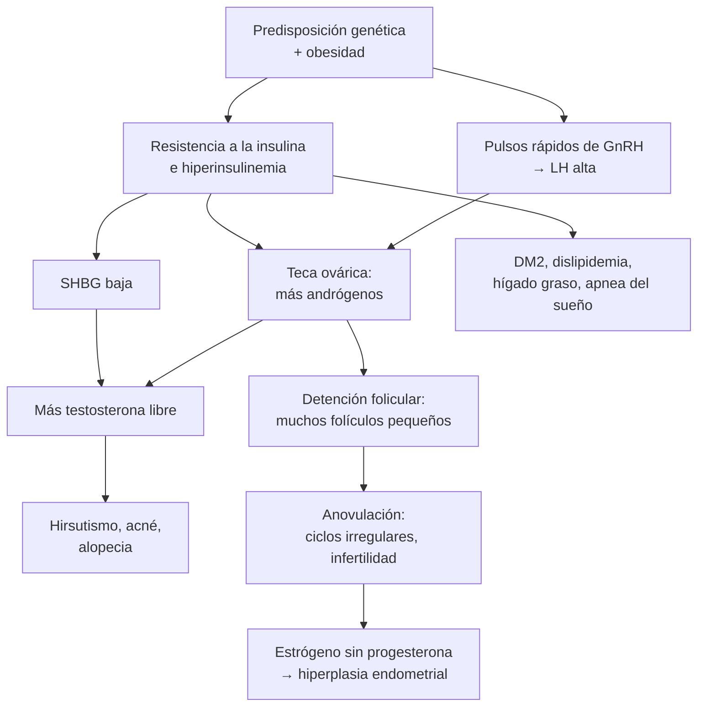
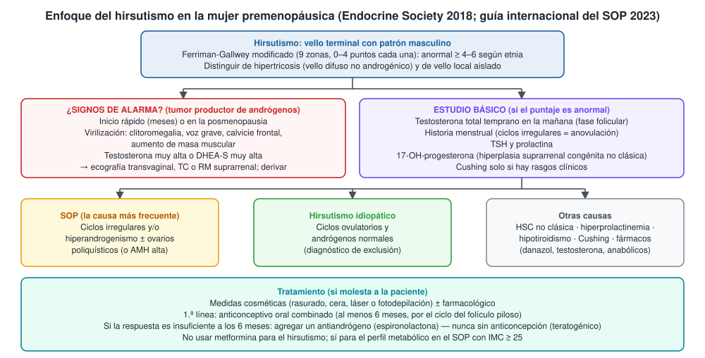
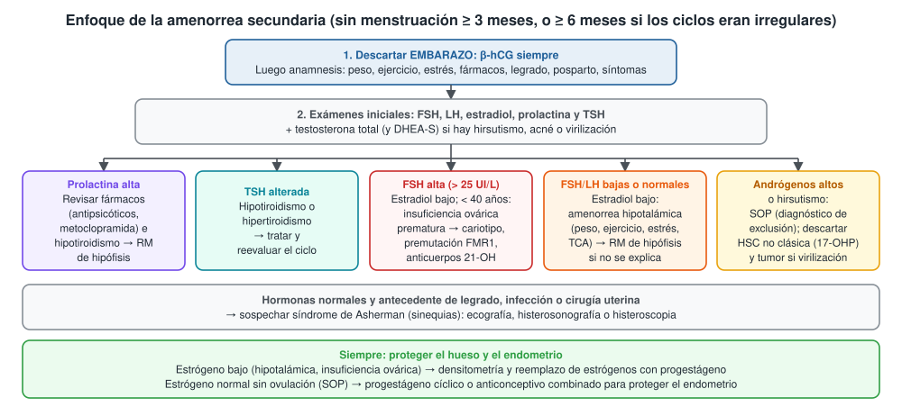
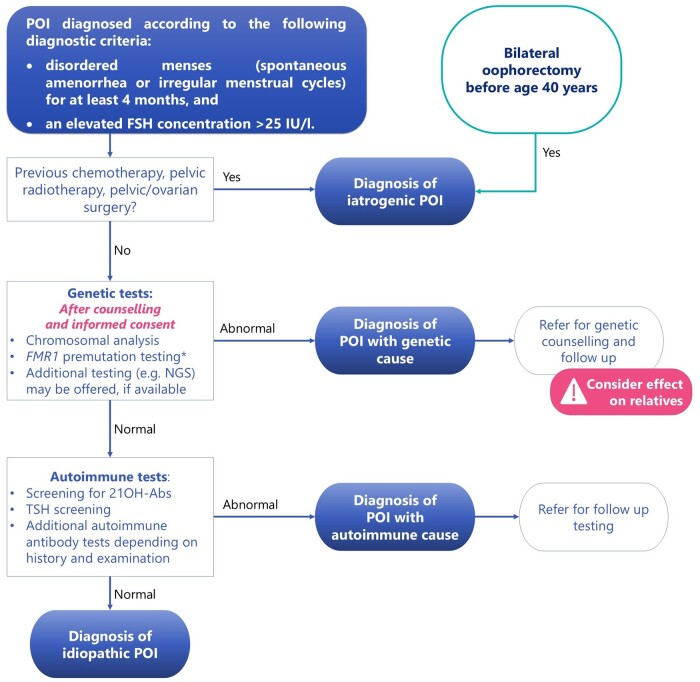

---
tags:
  - Endocrinología
---

# Hirsutismo, amenorrea y síndrome de ovario poliquístico

**Subespecialidad**
Endocrinología · Ginecología (endocrinología reproductiva) · Medicina interna · Atención primaria

**Guías principales**
Endocrine Society 2018: hirsutismo en la mujer premenopáusica · Guía internacional basada en la evidencia del síndrome de ovario poliquístico 2023 · ASRM 2024: evaluación de la amenorrea · Endocrine Society 2017: amenorrea hipotalámica funcional · ESHRE/ASRM/IMS 2024: insuficiencia ovárica prematura

**Otras fuentes**
Consenso global 2026 sobre el nuevo nombre del síndrome de ovario poliquístico (*Lancet*) · Estudios chilenos: hígado graso en el SOP (Cerda 2007) y endocrinopatías en la disfunción ovulatoria (Del Río 2026)

**GES**
No. Los anticonceptivos hormonales se entregan en la APS (Programa de Salud de la Mujer).

**EUNACOM**
1.03.1.008 Hirsutismo (sospecha, inicial, completo) · 1.03.1.010 Amenorrea (sospecha, inicial, derivar)

**Revisado**
Octubre 2026

!!! abstract "Resumen en 60 segundos"
    - **Hirsutismo**: vello **terminal** con patrón **masculino** en la mujer. Se mide con la escala de **Ferriman-Gallwey modificada**: anormal desde **4–6 puntos**, según la etnia.
        - La causa más frecuente es el **síndrome de ovario poliquístico (SOP)**.
        - **Signos de alarma** de un tumor productor de andrógenos: inicio **rápido**, **virilización** (clitoromegalia, voz grave, calvicie), testosterona muy alta.
        - Estudio básico: **testosterona total**, **TSH**, **prolactina**, **17-OH-progesterona** e historia menstrual.
        - Tratamiento: **anticonceptivo oral combinado** por al menos **6 meses**; agregar **espironolactona** (con anticoncepción) si la respuesta es insuficiente; láser.
    - **Amenorrea**:
        - **Primaria**: sin menarquia a los **15 años** o **3 años** después de la telarquia.
        - **Secundaria**: sin menstruación por **≥ 3 meses** (o ≥ 6 meses si los ciclos eran irregulares).
        - **Primero descartar el embarazo** (β-hCG). Luego **FSH, LH, estradiol, prolactina y TSH**.
        - Causas frecuentes de la secundaria: **SOP**, **amenorrea hipotalámica funcional** (bajo peso, ejercicio, estrés, trastornos de la conducta alimentaria), **hiperprolactinemia**, **insuficiencia ovárica prematura** (FSH > 25 UI/L antes de los 40 años) y alteraciones tiroideas.
    - **SOP** (**10–13 %** de las mujeres en edad fértil):
        - Diagnóstico con **2 de 3** criterios: **ciclos irregulares**, **hiperandrogenismo** (clínico o de laboratorio) y **ovarios poliquísticos** en la ecografía (o **AMH** alta en adultas), tras excluir otras causas.
        - Es un trastorno **metabólico**: resistencia a la insulina, DM2, dislipidemia, hígado graso, apnea del sueño, depresión. Pedir **PTGO**, perfil lipídico y presión arterial.
        - En 2026 un consenso global propuso renombrarlo *polyendocrine metabolic ovarian syndrome* (**PMOS**).
    - **Proteger el hueso** (amenorrea con estrógeno bajo) y el **endometrio** (anovulación con estrógeno normal).

## Definición

- **Hirsutismo**: crecimiento de **vello terminal** (grueso y pigmentado) en zonas **dependientes de andrógenos** (labio superior, mentón, tórax, abdomen, espalda, muslos) en la mujer.
- **Hipertricosis**: aumento **difuso** de vello, sin patrón masculino y sin relación con los andrógenos (fármacos como fenitoína, ciclosporina o minoxidil; hipotiroidismo; anorexia nerviosa). No es hirsutismo.
- **Virilización**: hiperandrogenismo **grave**: clitoromegalia, voz grave, calvicie temporal, aumento de la masa muscular, atrofia mamaria. Sugiere un **tumor** productor de andrógenos.
- **Amenorrea primaria**: ausencia de menarquia a los **15 años** o más de **3 años después de la telarquia**. Si a los **13 años** no hay desarrollo mamario, también se estudia.
- **Amenorrea secundaria**: ausencia de menstruación por **≥ 3 meses** en una mujer con ciclos regulares, o **≥ 6 meses** si eran irregulares.
- **Ciclos irregulares** (guía SOP 2023; desde 3 años después de la menarquia): ciclos de **< 21** o **> 35 días**, o **< 8 ciclos al año**.
- **Síndrome de ovario poliquístico (SOP)**: trastorno endocrino y metabólico con **disfunción ovulatoria**, **hiperandrogenismo** y/o **morfología ovárica poliquística**, una vez excluidas otras causas.
    - En **mayo de 2026**, un consenso global de 56 organizaciones propuso el nombre *polyendocrine metabolic ovarian syndrome* (**PMOS**). Se eligió porque no hay "quistes" patológicos y el cuadro es multisistémico. Habrá un período de transición; en esta página se usa SOP, el término de las guías vigentes.
- **Insuficiencia ovárica prematura (IOP)**: pérdida de la función ovárica **antes de los 40 años**. Se define por oligo/amenorrea por **≥ 4 meses** y una **FSH > 25 UI/L** (ESHRE 2024).
- **Amenorrea hipotalámica funcional**: amenorrea por **supresión del GnRH** por déficit de energía (baja ingesta, ejercicio excesivo) o estrés, sin causa orgánica.

## Epidemiología

### Mundial

- **SOP**: la endocrinopatía más frecuente de la mujer en edad fértil: **10–13 %** (guía 2023), "una de cada ocho mujeres" según el consenso de 2026.
    - Es la causa más frecuente de **hirsutismo**, de **oligomenorrea** y de **infertilidad anovulatoria**.
    - El diagnóstico suele **demorarse** años y la satisfacción con la atención es baja.
- **Insuficiencia ovárica prematura**: **3,5 %** de las mujeres, más de lo que se creía (ESHRE 2024).
- **Amenorrea secundaria**: excluido el embarazo, las causas más frecuentes son el **SOP**, la **amenorrea hipotalámica funcional**, la **hiperprolactinemia** y la **insuficiencia ovárica prematura**.
- **Amenorrea primaria**: las causas más frecuentes son la **disgenesia gonadal** (síndrome de Turner), la **agenesia mülleriana** (síndrome de Mayer-Rokitansky-Küster-Hauser) y el retraso constitucional o hipotalámico.

### Chile

!!! chile "Datos nacionales"
    - **Disfunción ovulatoria en Santiago** (Del Río 2026): 251 mujeres de 12 a 35 años con ciclos irregulares, estudiadas en forma sistemática.
        - **Hiperandrogenemia** en **~ 50 %** (en las adolescentes, sobre todo por DHEA-S alta).
        - **Resistencia a la insulina**: **55 %** de las adolescentes y **41 %** de las adultas.
        - **Hiperprolactinemia** (excluida la macroprolactina): **13,5 %**.
        - **Disfunción tiroidea**: **2–5 %**.
        - Conclusión: toda mujer con ciclos irregulares merece medir **prolactina, andrógenos, TSH** y evaluar la resistencia a la insulina.
    - **Hígado graso en el SOP** (Cerda 2007, Pontificia Universidad Católica): en 41 mujeres con SOP sin tratamiento, **41,5 %** tenía hígado graso no alcohólico (frente a **19 %** de los controles) y **63 %**, resistencia a la insulina.
    - **Hijas de mujeres con SOP** (Sir-Petermann 2009, Universidad de Chile): tienen **hiperinsulinemia** y **ovarios de mayor volumen** ya **antes de la pubertad**; las alteraciones de los andrógenos aparecen al final de la pubertad. Son un grupo de alto riesgo metabólico y reproductivo.
    - **No es GES**. El SOP, el hirsutismo y la amenorrea se manejan en la APS y en ginecología o endocrinología. La **obesidad**, la **DM2** y la **HTA** asociadas sí tienen cobertura (las dos últimas son GES).

## Etiología y factores de riesgo

**Causas de hirsutismo**

| Causa | Claves |
|---|---|
| **SOP** (la más frecuente) | Ciclos irregulares, sobrepeso, acantosis, comienzo peripuberal y evolución lenta |
| **Hirsutismo idiopático** | Ciclos **ovulatorios** y andrógenos **normales** |
| **Hiperplasia suprarrenal congénita no clásica** (déficit de 21-hidroxilasa) | Clínica parecida al SOP; **17-OH-progesterona** alta; antecedentes familiares |
| **Tumores productores de andrógenos** (ovario o suprarrenal) | Inicio **rápido**, **virilización**, testosterona o DHEA-S **muy altas** |
| **Hipertecosis ovárica** | Posmenopausia; hiperandrogenismo progresivo e intenso |
| **Otras endocrinopatías** | **Cushing**, acromegalia, hiperprolactinemia, hipotiroidismo |
| **Fármacos** | Testosterona, esteroides anabólicos, danazol, ácido valproico |

**Causas de amenorrea**

| Compartimento | Causas |
|---|---|
| **Embarazo** | **Siempre descartarlo primero**; también la lactancia |
| **Hipotálamo** | **Amenorrea hipotalámica funcional** (bajo peso, **trastornos de la conducta alimentaria**, ejercicio intenso, estrés) · enfermedades crónicas graves · síndrome de Kallmann (con anosmia) · tumores, infiltración |
| **Hipófisis** | **Hiperprolactinemia** (prolactinoma, **fármacos**: antipsicóticos, metoclopramida, domperidona) · otros adenomas · **síndrome de Sheehan** (hemorragia posparto) · hipofisitis |
| **Ovario** | **SOP** · **insuficiencia ovárica prematura** (autoinmune, **Turner** y otras alteraciones cromosómicas, **premutación del FMR1**, quimioterapia, radioterapia, cirugía) |
| **Útero y tracto de salida** | **Síndrome de Asherman** (sinequias tras legrado o infección) · agenesia mülleriana · himen imperforado, tabique vaginal · insensibilidad a los andrógenos (cariotipo 46,XY) |
| **Otras endocrinopatías** | Hipo e hipertiroidismo · Cushing · hiperplasia suprarrenal congénita · diabetes mal controlada |
| **Fármacos** | Anticonceptivos (progestágeno solo, DIU con levonorgestrel, acetato de medroxiprogesterona de depósito) · análogos de GnRH · quimioterapia |

## Fisiopatología

- **SOP**: interacción entre una predisposición genética y factores ambientales (obesidad), con dos mecanismos que se potencian:
    - **Neuroendocrino**: aumenta la frecuencia de los pulsos de GnRH → más **LH** que FSH → las **células de la teca** producen más **andrógenos**.
    - **Resistencia a la insulina** (presente incluso en mujeres delgadas): la **hiperinsulinemia** estimula la producción ovárica de andrógenos y baja la **SHBG** → más **testosterona libre**.
    - El exceso de andrógenos **detiene el desarrollo folicular** → muchos folículos pequeños (2–9 mm) → **anovulación** → ciclos irregulares e infertilidad.
    - Sin ovulación no hay progesterona → **estrógeno sin oposición** → hiperplasia y **cáncer de endometrio**.
    - En el folículo piloso, la 5α-reductasa convierte la testosterona en **dihidrotestosterona**, que transforma el vello fino en **terminal** → hirsutismo, acné y alopecia.
- **Amenorrea hipotalámica funcional**: el déficit de energía o el estrés **frenan los pulsos de GnRH** → **LH, FSH y estradiol bajos** (hipogonadismo hipogonadotropo) → pérdida de masa ósea.
- **Hiperprolactinemia**: la prolactina **inhibe la secreción de GnRH** → hipogonadismo hipogonadotropo.
- **Insuficiencia ovárica prematura**: se agotan los folículos → bajan el estradiol y la inhibina → **FSH alta** (hipogonadismo hipergonadotropo) → síntomas de menopausia, osteoporosis y riesgo cardiovascular.

*Figura 1. Fisiopatología del síndrome de ovario poliquístico. Esquema propio basado en la guía internacional del SOP 2023.*

## Clasificación

**Fenotipos del SOP (criterios de Rotterdam)**

| Fenotipo | Hiperandrogenismo | Disfunción ovulatoria | Ovarios poliquísticos o AMH alta | Riesgo metabólico |
|---|---|---|---|---|
| **A** (clásico completo) | Sí | Sí | Sí | **Mayor** |
| **B** (clásico) | Sí | Sí | No | **Mayor** |
| **C** (ovulatorio) | Sí | No | Sí | Intermedio |
| **D** (no hiperandrogénico) | No | Sí | Sí | Menor |

**Amenorrea según el eje (orienta el estudio)**

| Patrón hormonal | Nivel | Ejemplos |
|---|---|---|
| **FSH alta**, estradiol bajo (hipergonadotropo) | Ovario | Insuficiencia ovárica prematura, Turner, quimioterapia |
| **FSH y LH bajas o normales**, estradiol bajo (hipogonadotropo) | Hipotálamo o hipófisis | Amenorrea hipotalámica funcional, hiperprolactinemia, tumores, Sheehan |
| **FSH normal**, estradiol normal (eugonadal) | Ovario (anovulación) o útero | **SOP**, hiperplasia suprarrenal no clásica, Asherman, causas anatómicas |

## Clínica

- **Hirsutismo**:
    - **Escala de Ferriman-Gallwey modificada**: 9 zonas (labio superior, mentón, tórax, abdomen superior e inferior, brazos, muslos, espalda superior e inferior), de 0 a 4 puntos cada una.
    - Anormal desde **4–6 puntos**, según la etnia. Muchas mujeres se depilan antes de consultar: preguntar y considerar lo que relatan.
    - Otros signos de hiperandrogenismo: **acné** persistente, **alopecia de patrón femenino**, seborrea.
- **SOP**: inicio **peripuberal**; ciclos irregulares desde la menarquia; sobrepeso u obesidad central (no siempre); **acantosis nigricans** (resistencia a la insulina); infertilidad; síntomas de **apnea del sueño**; **depresión y ansiedad** frecuentes.
- **Amenorrea hipotalámica funcional**: IMC bajo o baja de peso, **ejercicio intenso** (deportistas), restricción alimentaria o **TCA**, estrés. Puede haber bradicardia, hipotensión, lanugo (anorexia nerviosa), **fracturas por estrés**.
- **Hiperprolactinemia**: **galactorrea**, oligo/amenorrea, infertilidad; si hay macroadenoma, **cefalea** y **alteración del campo visual** (ver [hipófisis](hipofisis-tumores-hipopituitarismo-e-hiperprolactinemia.md)).
- **Insuficiencia ovárica prematura**: oligo/amenorrea con **bochornos**, sudoración nocturna, sequedad vaginal, insomnio, alteraciones del ánimo. Puede asociarse a otras enfermedades **autoinmunes** (tiroiditis, insuficiencia suprarrenal, DM1).
- **Pistas de otras causas**:
    - **Turner**: talla baja, cuello alado, cúbito valgo, coartación aórtica.
    - **Agenesia mülleriana**: caracteres sexuales normales, vagina corta o ciega.
    - **Insensibilidad a los andrógenos**: mamas desarrolladas sin vello púbico ni axilar.
    - **Sheehan**: hemorragia posparto grave, sin lactancia y con amenorrea posterior.
    - **Asherman**: legrado o infección uterina previos.
    - **Cushing**: estrías violáceas, miopatía (ver [Cushing](sindrome-de-cushing-e-incidentaloma-suprarrenal.md)).

!!! alarma "Signos de alarma: estudiar con prioridad y derivar"
    - **Virilización** (clitoromegalia, voz grave, calvicie temporal) o hirsutismo de **inicio rápido** (meses), o que aparece en la **posmenopausia** → tumor ovárico o suprarrenal.
    - **Testosterona total muy alta** o **DHEA-S muy alta**.
    - Amenorrea con **cefalea**, **alteración visual** o **galactorrea** → tumor hipofisario.
    - Amenorrea con **IMC muy bajo**, bradicardia, hipotensión, hipokalemia o conductas purgativas → **trastorno de la conducta alimentaria** grave (riesgo vital).
    - Amenorrea tras una **hemorragia posparto** con astenia e hipotensión → **Sheehan** con insuficiencia suprarrenal secundaria.
    - Amenorrea primaria con **dolor pélvico cíclico** → obstrucción del tracto de salida (himen imperforado).

## Diagnóstico

!!! guia "Diagnóstico del SOP en adultas (guía internacional 2023)"
    - **2 de 3 criterios** (Rotterdam), una vez excluidas otras causas:
        1. **Ciclos irregulares** o anovulación.
        2. **Hiperandrogenismo** clínico (hirsutismo, acné, alopecia) o bioquímico (testosterona total o libre alta).
        3. **Morfología ovárica poliquística** en la ecografía (**≥ 20 folículos** por ovario, o volumen **≥ 10 mL**) **o AMH alta** (la AMH sirve solo en adultas).
    - Si hay **ciclos irregulares + hiperandrogenismo**, el diagnóstico está hecho: **no** se necesitan la ecografía ni la AMH.
    - **Adolescentes**: se necesitan **ambos** (ciclos irregulares e hiperandrogenismo). **No** usar la ecografía ni la AMH en los primeros **8 años** después de la menarquia. Si no cumplen los criterios, se consideran "en riesgo" y se reevalúan.
    - **Excluir** otras causas: **TSH**, **prolactina**, **17-OH-progesterona**, **FSH**; Cushing o tumores suprarrenales si la clínica lo sugiere.
    - **Medir andrógenos**: testosterona total o libre (calculada); si son normales, se pueden medir androstenediona y DHEA-S. Si la paciente usa **anticonceptivos**, los andrógenos no son interpretables (suspender al menos **3 meses**).

!!! guia "Hirsutismo (Endocrine Society 2018)"
    - Medir **andrógenos** en toda mujer con un **puntaje de hirsutismo anormal**.
    - **No** medirlos si los ciclos son regulares y el vello es **local** (sin puntaje anormal).
    - En la mayoría: **tratamiento farmacológico** (anticonceptivo oral combinado), sumando métodos de depilación directa si se desea más efecto.

<figure markdown>
{ loading=lazy }
<figcaption>Figura 2. Enfoque del hirsutismo en la mujer premenopáusica. Esquema propio basado en la guía de la Endocrine Society 2018 y en la guía internacional del SOP 2023.</figcaption>
</figure>

!!! guia "Amenorrea (ASRM 2024; Endocrine Society 2017; ESHRE 2024)"
    1. **β-hCG** en toda amenorrea.
    2. **Anamnesis y examen**: peso e IMC, ejercicio, alimentación, estrés, fármacos, legrados, galactorrea, hirsutismo, bochornos, desarrollo puberal (amenorrea primaria).
    3. **Exámenes iniciales**: **FSH, LH, estradiol, prolactina y TSH**; **testosterona** si hay hiperandrogenismo.
    4. **Según el resultado**:
        - **Prolactina alta** → repetir, revisar fármacos y TSH; **RM de hipófisis** si persiste sin causa.
        - **FSH > 25 UI/L** (una medición; repetir en 4–6 semanas si hay dudas) antes de los 40 años → **insuficiencia ovárica prematura** → **cariotipo**, **premutación del FMR1** y **anticuerpos anti-21-hidroxilasa** si la causa no es conocida.
        - **FSH y LH bajas o normales con estradiol bajo** → **amenorrea hipotalámica funcional** (diagnóstico de **exclusión**); **RM** si no hay una causa funcional clara, hay cefalea o alteración visual.
        - **Andrógenos altos o hirsutismo** → **SOP** u otras causas de hiperandrogenismo.
        - **Hormonas normales con legrado previo** → síndrome de Asherman.
    5. **Amenorrea primaria**: **ecografía pélvica** (útero presente o ausente) y **cariotipo** si la FSH es alta o falta el útero.
    6. **Densitometría** si la amenorrea con estrógeno bajo dura **≥ 6 meses** o hay IOP.

<figure markdown>
{ loading=lazy }
<figcaption>Figura 3. Enfoque de la amenorrea secundaria. Esquema propio basado en ASRM 2024, la guía de amenorrea hipotalámica funcional de la Endocrine Society 2017 y la guía ESHRE 2024 de insuficiencia ovárica prematura.</figcaption>
</figure>

<figure markdown>
{ loading=lazy }
<figcaption>Figura 4. Diagnóstico de la insuficiencia ovárica prematura y estudio de su causa. Criterios: alteración menstrual (amenorrea o ciclos irregulares) por al menos 4 meses y FSH &gt; 25 UI/L. Si hubo quimioterapia, radioterapia o cirugía pélvica, es iatrogénica. Si no, estudio genético (cariotipo y premutación del <em>FMR1</em>, con consejería) y autoinmune (anticuerpos anti-21-hidroxilasa y TSH); si todo es normal, es idiopática. Tomada de Panay N, Anderson RA, Bennie A, et al. <em>Evidence-based guideline: premature ovarian insufficiency.</em> Hum Reprod Open. 2024;2024(4):hoae065 (figura 2). Licencia CC BY 4.0.</figcaption>
</figure>

## Laboratorio

| Examen | Interpretación |
|---|---|
| **β-hCG** | **Primer examen** en toda amenorrea |
| **Testosterona total** (mañana, fase folicular) | Alta en el SOP (leve a moderada). **Muy alta** → tumor. Idealmente por espectrometría de masas; los inmunoensayos directos son poco precisos en la mujer |
| **Testosterona libre** (calculada o índice de andrógenos libres) | Más sensible que la total (la SHBG baja en la obesidad y la resistencia a la insulina) |
| **DHEA-S** | Andrógeno suprarrenal; **muy alta** sugiere un tumor suprarrenal |
| **17-OH-progesterona** (mañana, fase folicular) | Tamizaje de la **hiperplasia suprarrenal congénita no clásica**; si está en el rango intermedio, prueba de estímulo con ACTH |
| **Prolactina** | Alta en el prolactinoma, por fármacos o hipotiroidismo; descartar **macroprolactina** si es leve y asintomática |
| **TSH** | Hipo e hipertiroidismo |
| **FSH y LH** | **FSH > 25 UI/L** = insuficiencia ovárica; FSH y LH bajas = hipotalámica; LH/FSH alta es frecuente en el SOP, pero no es criterio |
| **Estradiol** | Bajo en la hipotalámica y en la IOP; normal en el SOP |
| **AMH** | Alta en el SOP (alternativa a la ecografía en adultas); muy baja en la IOP |
| **PTGO de 75 g** | La prueba **más exacta** para la glicemia en el SOP, cualquiera sea el IMC |
| **Perfil lipídico** | En **todas** las mujeres con SOP al diagnóstico |
| **Insulinemia, HOMA** | **No** se recomiendan en la práctica habitual (poca utilidad clínica) |
| **Cariotipo, FMR1, anticuerpos anti-21-hidroxilasa** | En la IOP sin causa conocida |
| **Progesterona en fase lútea** | Confirma ovulación si hay dudas (ciclos regulares con hiperandrogenismo) |

## Imágenes

- **Ecografía transvaginal**:
    - **Morfología ovárica poliquística**: **≥ 20 folículos** (2–9 mm) en al menos un ovario, o **volumen ≥ 10 mL**. Con sonda abdominal: volumen ≥ 10 mL o ≥ 10 folículos por corte.
    - No usarla para el diagnóstico de SOP en adolescentes (< 8 años desde la menarquia): los ovarios multifoliculares son normales a esa edad.
    - Grosor endometrial; masas ováricas (tumores productores de andrógenos).
- **Ecografía pélvica en la amenorrea primaria**: presencia de útero y ovarios.
- **RM de hipófisis**: hiperprolactinemia sin causa, hipogonadismo hipogonadotropo sin causa funcional, cefalea o alteraciones visuales.
- **TC o RM suprarrenal**: DHEA-S muy alta o sospecha de tumor suprarrenal.
- **Densitometría ósea**: amenorrea hipoestrogénica prolongada e IOP (al diagnóstico).
- **Histeroscopia o histerosonografía**: sospecha de Asherman.

## Diagnóstico diferencial

| Cuadro | Claves para diferenciar |
|---|---|
| **SOP** | Ciclos irregulares desde la menarquia, hiperandrogenismo leve a moderado, evolución lenta |
| **Hiperplasia suprarrenal congénita no clásica** | Igual al SOP; **17-OH-progesterona** alta; antecedentes familiares |
| **Tumor productor de andrógenos** | Inicio rápido, **virilización**, testosterona o DHEA-S muy altas, masa en la imagen |
| **Síndrome de Cushing** | Estrías violáceas, equimosis, miopatía proximal, HTA |
| **Hiperprolactinemia** | Galactorrea, prolactina alta; puede coexistir con hiperandrogenismo leve |
| **Hipotiroidismo** | TSH alta; amenorrea o sangrado irregular |
| **Amenorrea hipotalámica funcional** | IMC bajo, ejercicio, estrés; **LH y estradiol bajos**; a veces ovarios multifoliculares (se confunde con el SOP) |
| **Insuficiencia ovárica prematura** | **FSH alta**, bochornos, estradiol bajo |
| **Hipertricosis** | Vello difuso, no androgénico; fármacos |
| **Embarazo** | β-hCG positiva |

## Tratamiento

### Síndrome de ovario poliquístico

- **Estilo de vida** en todas: alimentación saludable, **actividad física** y control del peso. Una baja de peso moderada mejora los ciclos y el perfil metabólico.
- **Ciclos irregulares y protección endometrial**: **anticonceptivo oral combinado** (primera línea). Alternativas: progestágeno cíclico o continuo, DIU con levonorgestrel.
- **Hirsutismo**: anticonceptivo combinado por al menos **6 meses**; agregar un **antiandrógeno** (espironolactona) si la respuesta es insuficiente, **siempre con anticoncepción eficaz** (riesgo de feminización de un feto masculino). **Láser o fotodepilación**.
- **Metformina**: en adultas con **IMC ≥ 25** para el peso y el perfil metabólico; también en adolescentes para regular los ciclos. Se puede asociar al anticonceptivo.
- **Antiobesidad**: **arGLP-1** (liraglutida, semaglutida) u orlistat junto al estilo de vida, con **anticoncepción** eficaz (no hay datos de seguridad en el embarazo).
- **Infertilidad**: **letrozol** es la primera línea para inducir la ovulación (derivar a ginecología).
- **Inositol**: beneficio clínico limitado; la metformina es preferible.
- **Salud mental**: **tamizaje de depresión y ansiedad** en todas.
- **Anticonceptivos y dosis**: preferir la **menor dosis eficaz de estrógeno** (20–30 µg de etinilestradiol). El preparado con **35 µg de etinilestradiol + acetato de ciproterona** es de **segunda línea** (más riesgo de trombosis).

### Hirsutismo de otras causas

- **Idiopático**: igual que en el SOP (anticonceptivo ± antiandrógeno, métodos cosméticos).
- **Hiperplasia suprarrenal no clásica**: anticonceptivo ± antiandrógeno; glucocorticoides en dosis bajas si busca embarazo (especialista).
- **Tumor**: cirugía.
- **No usar** metformina ni otros fármacos que bajan la insulina solo para el hirsutismo (Endocrine Society 2018).

### Amenorrea

- **Tratar la causa**:
    - **Hiperprolactinemia**: suspender el fármaco responsable si se puede; **cabergolina** en el prolactinoma.
    - **Hipotiroidismo**: levotiroxina.
    - **Asherman**: resección histeroscópica de las sinequias.
    - **Causas anatómicas o cromosómicas**: derivar a ginecología (y genética).
- **Amenorrea hipotalámica funcional** (Endocrine Society 2017):
    - Corregir el **déficit de energía**: aumentar la ingesta, **reducir el ejercicio**, manejo del estrés (terapia cognitivo-conductual); tratar el TCA con un equipo especializado.
    - **No usar anticonceptivos orales** solo para recuperar la menstruación o la masa ósea: dan sangrados "artificiales" y no protegen el hueso.
    - Si no se recupera en **6–12 meses**: **estradiol transdérmico** con progestágeno cíclico por un tiempo corto.
    - **No usar bisfosfonatos** en mujeres jóvenes.
- **Insuficiencia ovárica prematura** (ESHRE 2024):
    - **Terapia hormonal** hasta al menos la edad promedio de la **menopausia natural**: estradiol **≥ 2 mg/día oral** o **≥ 100 µg/día transdérmico**, con progestágeno si tiene útero. El anticonceptivo combinado es una alternativa (en régimen continuo o extendido).
    - **Densitometría** al diagnóstico; calcio, vitamina D, ejercicio de carga.
    - Puede haber **ovulaciones espontáneas** y embarazos: usar anticoncepción si no desea embarazarse. La **ovodonación** es la opción para lograr un embarazo.
    - **TSH** al diagnóstico y cada 5 años; si hay anticuerpos anti-21-hidroxilasa, estudiar la función suprarrenal.
- **Anovulación con estrógeno normal** (SOP): **progestágeno** al menos cada 3 meses o anticonceptivo combinado, para **proteger el endometrio**.

!!! dosis "Dosis de referencia"
    | Fármaco | Dosis habitual | Observaciones |
    |---|---|---|
    | **Anticonceptivo oral combinado** | Etinilestradiol **20–30 µg** + progestágeno, 1 comprimido al día | Primera línea en el SOP y el hirsutismo; evaluar a los **6 meses**. Contraindicado con migraña con aura, tabaquismo > 35 años, trombosis previa, HTA no controlada |
    | **Espironolactona** | **50–100 mg cada 12 horas** (100–200 mg/día) | Antiandrógeno; **siempre con anticoncepción**; controlar potasio en ERC o con IECA/ARA-II |
    | **Metformina** | Iniciar **500 mg/día**; subir hasta **1500–2000 mg/día** con las comidas | SOP con IMC ≥ 25 o alteración de la glicemia |
    | **Acetato de medroxiprogesterona** (oral) | **10 mg/día** por 10–14 días, cada 1–3 meses | Protección endometrial en la anovulación |
    | **Cabergolina** | 0,25–0,5 mg **2 veces por semana** | Hiperprolactinemia o prolactinoma |
    | **Estradiol** (IOP) | **2 mg/día oral** o **100 µg/día transdérmico** + progesterona micronizada 200 mg/día por 12 días al mes (o equivalente) | Hasta la edad promedio de la menopausia natural |
    | **Letrozol** | 2,5–7,5 mg/día por 5 días al inicio del ciclo | Inducción de la ovulación (especialista) |

## Complicaciones

- **SOP**:
    - **Metabólicas**: resistencia a la insulina, **prediabetes y DM2**, dislipidemia, **hígado graso**, obesidad, mayor riesgo cardiovascular.
    - **Apnea obstructiva del sueño** (independiente del IMC).
    - **Depresión, ansiedad**, trastornos de la conducta alimentaria, deterioro de la imagen corporal.
    - **Reproductivas**: infertilidad; en el embarazo, **diabetes gestacional**, preeclampsia y parto prematuro.
    - **Hiperplasia y cáncer de endometrio** (por anovulación crónica). El riesgo absoluto es bajo y no se hace tamizaje rutinario, pero se debe proteger el endometrio.
- **Amenorrea hipoestrogénica** (hipotalámica, IOP, hiperprolactinemia): **osteoporosis** y fracturas, riesgo cardiovascular, síntomas genitourinarios, infertilidad.
- **IOP**: osteoporosis, enfermedad cardiovascular, deterioro cognitivo, disfunción sexual, impacto emocional; enfermedades autoinmunes asociadas.
- **Hirsutismo**: gran impacto en la **calidad de vida** y la salud mental, aunque sea leve.

## Pronóstico y seguimiento

- **SOP**: es una condición **crónica** que cambia con la edad: los ciclos tienden a regularizarse hacia los 40 años, pero el riesgo metabólico persiste.
    - **Presión arterial** cada año.
    - **Perfil lipídico** al diagnóstico y luego según el riesgo.
    - **Glicemia** (idealmente **PTGO**) en forma periódica según los factores de riesgo; siempre **antes del embarazo** y a las **24–28 semanas**.
    - **Peso**, ánimo, síntomas de apnea del sueño.
- **Hirsutismo**: la respuesta al tratamiento es **lenta** (ciclo del folículo piloso): evaluar a los **6 meses**. Si se suspende el tratamiento, suele reaparecer.
- **Amenorrea hipotalámica funcional**: la menstruación vuelve al recuperar el peso y la energía (puede tardar meses). Controlar la densitometría.
- **IOP**: terapia hormonal y seguimiento óseo, cardiovascular y emocional a largo plazo.

## Perlas para el internado

!!! perla "Para recordar en la sala"
    - **Toda amenorrea es embarazo hasta demostrar lo contrario**: β-hCG primero.
    - **Hirsutismo + ciclos irregulares** = SOP muy probable, pero es un **diagnóstico de exclusión**: pedir **TSH, prolactina y 17-OH-progesterona**.
    - **Virilización o inicio rápido** = tumor hasta demostrar lo contrario.
    - En el SOP no se necesita la ecografía si ya hay **ciclos irregulares + hiperandrogenismo**. En adolescentes la ecografía **no** sirve.
    - El SOP es un problema **metabólico**: pedir **PTGO**, perfil lipídico y presión arterial; preguntar por el ánimo y el sueño.
    - **No pedir insulinemia ni HOMA** para diagnosticar ni tratar el SOP.
    - **Espironolactona = anticoncepción obligatoria.**
    - Anticonceptivos en la **amenorrea hipotalámica**: no tratan la causa ni protegen el hueso; hay que corregir el **déficit de energía**.
    - **FSH > 25 UI/L antes de los 40 años** = insuficiencia ovárica prematura: **terapia hormonal** hasta la edad de la menopausia (no es una "menopausia normal" que se pueda dejar sin tratar).
    - Prolactina alta: revisar **fármacos** (antipsicóticos, metoclopramida) y la **TSH** antes de pedir una RM.

## Preguntas de repaso

??? repaso "1. Mujer de 24 años con ciclos cada 45–60 días desde la menarquia, acné y vello en el mentón y la línea alba (Ferriman-Gallwey 10). IMC 31. ¿Cómo la estudia?"
    - Tiene **ciclos irregulares + hiperandrogenismo clínico**: cumple 2 criterios de Rotterdam. **No necesita ecografía** ni AMH para el diagnóstico de SOP.
    - **Excluir otras causas**: β-hCG, **TSH**, **prolactina**, **17-OH-progesterona** (hiperplasia suprarrenal no clásica) y **testosterona total** (para descartar valores muy altos).
    - **Evaluación metabólica**: **PTGO de 75 g**, perfil lipídico, presión arterial, transaminasas (hígado graso); tamizaje de depresión, ansiedad y apnea del sueño.

??? repaso "2. La misma paciente no busca embarazo y le molesta el vello. ¿Qué tratamiento indica?"
    - **Estilo de vida** y baja de peso.
    - **Anticonceptivo oral combinado** (etinilestradiol 20–30 µg) por al menos **6 meses**: regula los ciclos, protege el endometrio y baja los andrógenos libres.
    - **Láser o fotodepilación** si quiere un efecto más rápido.
    - Si a los 6 meses la respuesta es insuficiente: **espironolactona** 100–200 mg/día, **con anticoncepción**.
    - **Metformina** por el IMC ≥ 25 (perfil metabólico); considerar un arGLP-1 si no baja de peso.

??? repaso "3. Mujer de 32 años con hirsutismo progresivo de 5 meses, voz más grave y calvicie frontal. Ciclos ausentes desde hace 4 meses. La testosterona total está muy elevada. ¿Qué sospecha y qué hace?"
    - **Virilización de inicio rápido** con testosterona muy alta → **tumor productor de andrógenos** (ovárico, más probable si la DHEA-S es normal, o suprarrenal si la DHEA-S está muy alta).
    - **Estudio**: β-hCG, DHEA-S, **ecografía transvaginal** y **TC o RM suprarrenal**.
    - **Derivar** con prioridad a ginecología o endocrinología; el tratamiento es **quirúrgico**.

??? repaso "4. Mujer de 19 años, estudiante, corredora de fondo, con amenorrea de 8 meses. IMC 17,5. β-hCG negativa, FSH 3 UI/L, LH 1 UI/L, estradiol bajo, prolactina y TSH normales. ¿Diagnóstico y manejo?"
    - **Amenorrea hipotalámica funcional** (hipogonadismo hipogonadotropo) por **déficit de energía** (bajo peso + ejercicio intenso). Buscar dirigidamente un **trastorno de la conducta alimentaria**.
    - **Manejo**: aumentar la ingesta, **reducir el ejercicio**, apoyo nutricional y psicológico (terapia cognitivo-conductual).
    - **Densitometría** (amenorrea ≥ 6 meses); calcio y vitamina D.
    - **No dar anticonceptivos** solo para "que menstrúe" (no protegen el hueso). Si no se recupera en 6–12 meses: estradiol transdérmico con progestágeno cíclico.
    - RM de hipófisis solo si hay cefalea, alteraciones visuales o la causa funcional no es clara.

??? repaso "5. Mujer de 35 años con amenorrea de 6 meses, bochornos y sequedad vaginal. β-hCG negativa; FSH 68 UI/L y estradiol bajo. ¿Diagnóstico y conducta?"
    - **Insuficiencia ovárica prematura** (< 40 años, amenorrea ≥ 4 meses y FSH > 25 UI/L). Basta una FSH alta; repetirla en 4–6 semanas solo si hay dudas.
    - **Estudio de la causa**: **cariotipo**, **premutación del FMR1**, **anticuerpos anti-21-hidroxilasa** (si son positivos, evaluar la función suprarrenal) y **TSH**.
    - **Densitometría** al diagnóstico.
    - **Terapia hormonal** (estradiol 2 mg oral o 100 µg transdérmico + progestágeno) hasta la edad de la menopausia natural.
    - Informar que puede ovular en forma esporádica: **anticoncepción** si no desea embarazo; la **ovodonación** si lo desea.

??? repaso "6. Mujer de 28 años con amenorrea de 5 meses y galactorrea. Usa risperidona desde hace 1 año. β-hCG negativa, prolactina 85 ng/mL, TSH normal. ¿Qué hace?"
    - **Hiperprolactinemia** muy probablemente **por fármaco** (la risperidona es de los antipsicóticos que más suben la prolactina).
    - Ya se descartaron el embarazo y el hipotiroidismo.
    - **Coordinar con psiquiatría** el cambio a un antipsicótico que afecte menos la prolactina (por ejemplo, aripiprazol). **No suspenderlo** por cuenta propia.
    - Si no se puede cambiar: protección ósea (estrógenos o anticonceptivo) y control.
    - **RM de hipófisis** si la prolactina no baja tras cambiar el fármaco, hay cefalea o alteración visual, o la relación con el fármaco no es clara.

## Referencias

1. Martin KA, Anderson RR, Chang RJ, et al. Evaluation and treatment of hirsutism in premenopausal women: an Endocrine Society clinical practice guideline. *J Clin Endocrinol Metab.* 2018;103(4):1233–1257. doi:[10.1210/jc.2018-00241](https://doi.org/10.1210/jc.2018-00241)
2. Teede HJ, Tay CT, Laven JJE, et al. Recommendations from the 2023 International Evidence-based Guideline for the Assessment and Management of Polycystic Ovary Syndrome. *J Clin Endocrinol Metab.* 2023;108(10):2447–2469. doi:[10.1210/clinem/dgad463](https://doi.org/10.1210/clinem/dgad463)
3. Teede HJ, Khomami MB, Morman R, et al. Polyendocrine metabolic ovarian syndrome, the new name for polycystic ovary syndrome: a multistep global consensus process. *Lancet.* 2026;407(10545):2329–2339. doi:[10.1016/S0140-6736(26)00717-8](https://doi.org/10.1016/S0140-6736(26)00717-8)
4. Practice Committee of the American Society for Reproductive Medicine. Current evaluation of amenorrhea: a committee opinion. *Fertil Steril.* 2024;122(1):52–61. doi:[10.1016/j.fertnstert.2024.02.001](https://doi.org/10.1016/j.fertnstert.2024.02.001)
5. Gordon CM, Ackerman KE, Berga SL, et al. Functional hypothalamic amenorrhea: an Endocrine Society clinical practice guideline. *J Clin Endocrinol Metab.* 2017;102(5):1413–1439. doi:[10.1210/jc.2017-00131](https://doi.org/10.1210/jc.2017-00131)
6. Panay N, Anderson RA, Bennie A, et al. Evidence-based guideline: premature ovarian insufficiency. *Hum Reprod Open.* 2024;2024(4):hoae065. doi:[10.1093/hropen/hoae065](https://doi.org/10.1093/hropen/hoae065)
7. Del Río JP, Soto H, Contreras P, et al. Polyendocrine-metabolic profile in adolescents and young women with ovulatory dysfunction: a cross-sectional study. *Biology (Basel).* 2026;15(13):1041. doi:[10.3390/biology15131041](https://doi.org/10.3390/biology15131041)
8. Cerda C, Pérez-Ayuso RM, Riquelme A, et al. Nonalcoholic fatty liver disease in women with polycystic ovary syndrome. *J Hepatol.* 2007;47(3):412–417. doi:[10.1016/j.jhep.2007.04.012](https://doi.org/10.1016/j.jhep.2007.04.012)
9. Sir-Petermann T, Codner E, Pérez V, et al. Metabolic and reproductive features before and during puberty in daughters of women with polycystic ovary syndrome. *J Clin Endocrinol Metab.* 2009;94(6):1923–1930. doi:[10.1210/jc.2008-2836](https://doi.org/10.1210/jc.2008-2836)
