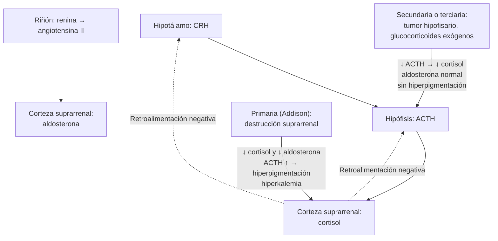

---
tags:
  - Endocrinología
  - Urgencia
  - Frecuente en sala
---

# Insuficiencia suprarrenal y crisis suprarrenal

**Subespecialidad**
Endocrinología · Medicina interna · Medicina de urgencia

**Guías principales**
Endocrine Society 2016: insuficiencia suprarrenal primaria (*J Clin Endocrinol Metab*) · ESE/Endocrine Society 2024: insuficiencia suprarrenal inducida por glucocorticoides

**Otras fuentes**
Revisiones de la crisis suprarrenal (*N Engl J Med* 2019) y de la insuficiencia suprarrenal (*Lancet* 2021; *Nat Rev Dis Primers* 2021) · Serie chilena del Hospital Clínico de la Universidad de Chile (Araya, 2025)

**GES**
No

**EUNACOM**
1.03.2.003 Insuficiencia suprarrenal aguda (específico, completo, derivar) · 1.03.1.007 Insuficiencia suprarrenal crónica (sospecha, inicial, derivar)

**Revisado**
Septiembre 2026

!!! abstract "Resumen en 60 segundos"
    - **Insuficiencia suprarrenal (IS)**: producción insuficiente de **cortisol**, con o sin déficit de **aldosterona**.
        - **Primaria** (enfermedad de Addison, en general **autoinmune**): falta de cortisol y aldosterona, con ACTH alta.
        - **Secundaria o terciaria** (hipófisis o hipotálamo): la causa más frecuente es la **suspensión de glucocorticoides** usados en forma prolongada.
    - **Clínica inespecífica**: **cansancio**, baja de peso, anorexia, náuseas, dolor abdominal, hipotensión ortostática. En la primaria, además, **hiperpigmentación**, **avidez por la sal** e **hiperkalemia**.
    - **Crisis suprarrenal**: **shock** refractario a volumen, vómitos, dolor abdominal, compromiso de conciencia, **hiponatremia**, hiperkalemia e hipoglicemia. La precipitan una infección, una cirugía o la suspensión de los corticoides.
    - **Tratamiento de la crisis** (sin esperar la confirmación):
        - **Hidrocortisona 100 mg EV** en bolo, luego **200 mg/24 h** (infusión o 50 mg cada 6 h).
        - **Suero fisiológico** 1 L en la primera hora.
        - Tomar el cortisol y la ACTH **antes**, si no demora el tratamiento.
    - **Diagnóstico**:
        - **Cortisol plasmático a las 8 AM < 5 µg/dL** lo sugiere fuertemente; un valor > 15–18 µg/dL lo descarta.
        - Confirmar con la **prueba de estímulo con ACTH** (cosintropina).
        - La **ACTH** alta indica una IS primaria.
    - **Tratamiento crónico**: **hidrocortisona 15–25 mg/día** en 2–3 dosis (+ **fludrocortisona** en la primaria). **Educación en "días de enfermedad"** (duplicar o triplicar la dosis con fiebre), **hidrocortisona inyectable de emergencia** y **tarjeta o pulsera**.

## Definición

- **Insuficiencia suprarrenal primaria** (enfermedad de Addison): destrucción o disfunción de la **corteza suprarrenal**. Hay déficit de **cortisol**, **aldosterona** y andrógenos suprarrenales, con **ACTH y renina altas**.
- **Insuficiencia suprarrenal secundaria**: déficit de **ACTH** (hipófisis). La aldosterona se conserva porque depende del sistema renina-angiotensina.
- **Insuficiencia suprarrenal terciaria**: déficit de **CRH** (hipotálamo). La causa más frecuente es la **supresión del eje** por glucocorticoides exógenos: **insuficiencia suprarrenal inducida por glucocorticoides**.
- **Crisis suprarrenal**: deterioro agudo del estado de salud con **hipotensión absoluta** (PAS < 100 mmHg) o relativa (≥ 20 mmHg bajo la habitual) y signos que **mejoran con glucocorticoides parenterales** (1–2 horas tras la hidrocortisona).

## Epidemiología

### Mundial

- **IS primaria**: prevalencia de **~ 100–220 por millón**. Es más frecuente en las **mujeres** de 30–50 años.
- **IS secundaria**: prevalencia de **~ 150–280 por millón** (sin contar la inducida por glucocorticoides).
- **IS inducida por glucocorticoides**: **la forma más frecuente**. **1–3 %** de la población usa glucocorticoides sistémicos por tiempo prolongado, y una proporción importante tiene el eje suprimido (más con dosis altas, uso prolongado, vía oral e inyecciones intraarticulares repetidas).
- **Crisis suprarrenal**: **~ 5–10 episodios por 100 pacientes-año** en las personas con IS conocida. Mortalidad de **~ 0,5 por 100 pacientes-año**.
- La IS se diagnostica **tarde**: muchos pacientes consultan varias veces antes del diagnóstico, que a menudo se hace durante una crisis.

### Chile

!!! chile "Datos nacionales"
    - **Serie del Hospital Clínico de la Universidad de Chile** (102 pacientes en 11 años; Araya, 2025):
        - **39 % primaria**: el **65 %** era una **enfermedad de Addison autoinmune**.
        - **61 % secundaria**: el **64,5 %** por **macroadenomas hipofisarios**.
        - El **58 %** de los pacientes con Addison tenía una **enfermedad tiroidea autoinmune** asociada.
        - Hubo casos asociados al **VIH** y a **hipofisitis por pembrolizumab** (inmunoterapia). Los autores sugieren buscar activamente la IS en esos grupos.
        - Los síntomas más característicos de la IS primaria fueron la **astenia**, la **baja de peso**, el **dolor abdominal** y la fatiga muscular.
    - Históricamente, la **tuberculosis** fue una causa importante de Addison en Chile. Hoy predomina la autoinmune, pero la TB suprarrenal sigue siendo un diferencial.
    - El uso de **corticoides** sin supervisión, incluidas las inyecciones de depósito, es frecuente y es la principal causa de la IS **inducida por glucocorticoides**.

## Etiología y factores de riesgo

| Tipo | Causas |
|---|---|
| **Primaria** | **Adrenalitis autoinmune** (80–90 % en los países de altos ingresos; aislada o en síndromes poliglandulares autoinmunes: con **tiroiditis**, **diabetes tipo 1**, vitiligo, anemia perniciosa, **enfermedad celíaca**) · **Infecciones**: **tuberculosis**, **VIH** (CMV), hongos (histoplasmosis, paracoccidioidomicosis) · **Hemorragia suprarrenal bilateral**: **anticoagulantes**, **sepsis** meningocócica (síndrome de Waterhouse-Friderichsen), síndrome antifosfolípido, trombocitopenia inducida por heparina · **Metástasis** bilaterales (pulmón, mama, melanoma), linfoma · **Fármacos**: ketoconazol, etomidato, mitotano, metirapona, **inhibidores de puntos de control inmunitario** (raro) · **Congénitas**: hiperplasia suprarrenal congénita, adrenoleucodistrofia (hombres jóvenes) · Adrenalectomía bilateral |
| **Secundaria y terciaria** | **Suspensión de glucocorticoides** (oral, inhalado en dosis altas, intraarticular, tópico potente; también el acetato de megestrol) · **Tumores hipofisarios** (macroadenomas) y su tratamiento (cirugía, radioterapia) · **Síndrome de Sheehan** (necrosis hipofisaria posparto) · **Apoplejía hipofisaria** · **Hipofisitis** (autoinmune, **inmunoterapia**: ipilimumab, pembrolizumab) · TEC, enfermedades infiltrativas · **Opioides** en dosis altas y crónicas · Tras la cirugía del **síndrome de Cushing** |

**Precipitantes de la crisis suprarrenal**:

- **Infecciones**, sobre todo **gastroenteritis** (vómitos que impiden tomar la hidrocortisona).
- Cirugía, trauma, parto.
- **Suspensión brusca** de los corticoides.
- Aumento del metabolismo del cortisol: **hipertiroidismo** o inicio de la levotiroxina, inductores enzimáticos (rifampicina, fenitoína).
- Estrés emocional intenso.

## Fisiopatología

- El **cortisol**:
    - Mantiene el **tono vascular** (permite la acción de las catecolaminas).
    - Mantiene la **glicemia** (gluconeogénesis).
    - Modula la inflamación.
    - Inhibe la ADH.

    Su déficit produce **hipotensión** que responde mal al volumen y a los vasopresores, **hipoglicemia** e **hiponatremia**.
- La **aldosterona** (sólo falta en la IS **primaria**) retiene Na⁺ y excreta K⁺ y H⁺. Su déficit produce pérdida renal de sodio con **hipovolemia**, **hiperkalemia** y acidosis metabólica leve. Por eso los pacientes tienen **avidez por la sal**.
- La **ACTH alta** en la IS primaria (por la falta de retroalimentación) estimula los **melanocitos**: **hiperpigmentación** de la piel expuesta, los pliegues, las cicatrices y las mucosas. En la IS secundaria, la ACTH está baja y el paciente es **pálido**.
- **IS inducida por glucocorticoides**:
    - Los corticoides exógenos **suprimen** la CRH y la ACTH, y la suprarrenal se **atrofia**.
    - Al suspenderlos, el eje tarda **semanas a meses** (a veces más de un año) en recuperarse (figura 2).
    - Como la aldosterona se conserva, **no** hay hiperkalemia, pero sí puede haber una crisis ante un estrés.

*Figura 1. Eje hipotálamo-hipófisis-suprarrenal y diferencias entre la insuficiencia suprarrenal primaria y la secundaria. Esquema propio.*

<figure markdown>
{ loading=lazy }
<figcaption>Figura 2. Recuperación del eje hipotálamo-hipófisis-suprarrenal tras suspender glucocorticoides en dosis suprafisiológicas: la ACTH se recupera primero y el cortisol después, en semanas a meses. Fuente: Beuschlein F, Else T, Bancos I, et al. European Society of Endocrinology and Endocrine Society Joint Clinical Guideline: Diagnosis and Therapy of Glucocorticoid-induced Adrenal Insufficiency. <em>J Clin Endocrinol Metab.</em> 2024;109:1657–1683, figura 1 (adaptada de Prete y Bancos, 2021). Licencia <a href="https://creativecommons.org/licenses/by-nc/4.0/">CC BY-NC 4.0</a>.</figcaption>
</figure>

## Clasificación

| Característica | **Primaria** | **Secundaria / terciaria** |
|---|---|---|
| **ACTH** | **Alta** | Baja o normal |
| **Aldosterona / renina** | **Baja / alta** | Normales |
| **Hiperpigmentación** | **Sí** | No (palidez) |
| **Hiperkalemia** | **Sí** (~ 50 %) | No |
| **Hiponatremia** | Sí (~ 80 %) | Sí (por la ADH) |
| **Avidez por la sal, hipotensión ortostática** | Marcadas | Menos marcadas |
| **Otros déficits hormonales** | Otras autoinmunidades | Otros déficits hipofisarios (TSH, gonadotrofinas, GH) |
| **Tratamiento** | Hidrocortisona + **fludrocortisona** | Hidrocortisona |

**Riesgo de IS inducida por glucocorticoides** (ESE/ES 2024):

- **Bajo**: uso **< 3–4 semanas**, cualquiera sea la dosis. Se puede suspender **sin disminución gradual**.
- **Relevante**: uso **> 4 semanas** en dosis **suprafisiológicas**, es decir, más de **~ 5 mg de prednisona** o su equivalente. Considerar también las formas no orales en dosis altas.

| Glucocorticoide | Dosis equivalente (antiinflamatoria) | Efecto mineralocorticoide |
|---|---|---|
| **Hidrocortisona** | **20 mg** | Sí |
| **Prednisona / prednisolona** | **5 mg** | Leve |
| **Metilprednisolona** | **4 mg** | Mínimo |
| **Dexametasona** | **0,75 mg** | No |

## Clínica

- **IS crónica** (instalación insidiosa, en meses):
    - **Astenia** y **fatiga** (> 90 %), debilidad muscular.
    - **Anorexia**, **baja de peso**, **náuseas**, vómitos, **dolor abdominal** (se confunde con un cuadro digestivo).
    - **Hipotensión ortostática**, mareos.
    - **Avidez por la sal** (primaria).
    - **Hiperpigmentación** (primaria): pliegues palmares, codos, rodillas, cicatrices, encías y mucosa oral, pezones.
    - **Vitiligo** (autoinmunidad asociada).
    - **Pérdida del vello** axilar y pubiano en las mujeres (déficit de andrógenos suprarrenales).
    - Depresión, apatía.
- **Laboratorio sugerente**: **hiponatremia**, **hiperkalemia** (primaria), hipoglicemia, **eosinofilia**, linfocitosis, anemia normocítica, **hipercalcemia** leve, alza leve de la creatinina.
- **Crisis suprarrenal**:
    - **Shock hipovolémico** que **no responde** al volumen ni a los vasopresores.
    - **Vómitos**, **dolor abdominal** intenso (puede simular un abdomen agudo), fiebre.
    - **Compromiso de conciencia**, confusión.
    - **Hiponatremia**, hiperkalemia, **hipoglicemia**.

!!! alarma "Sospecha una crisis suprarrenal en"
    - **Shock sin causa clara**, o que no responde a volumen ni a vasopresores, sobre todo con **hiponatremia**, **hiperkalemia** o **hipoglicemia**.
    - Paciente con **uso crónico de corticoides** (o que los suspendió hace poco) con una infección, una cirugía, vómitos o hipotensión.
    - Paciente con **Addison conocido** y **vómitos o diarrea** (no absorbe la hidrocortisona oral).
    - **Hiperpigmentación** con hipotensión y síntomas digestivos.
    - **Hemorragia suprarrenal**: paciente **anticoagulado** o con **sepsis** que presenta dolor lumbar o abdominal y shock.
    - **En la duda, trata**: la hidrocortisona tiene pocos riesgos y la crisis no tratada es mortal.

## Diagnóstico

**Paso 1. En la sospecha de crisis**:

- Tomar **cortisol** y **ACTH** plasmáticos (más electrolitos, glicemia y renina si es posible) **antes** de la hidrocortisona.
- **No retrasar** el tratamiento para esperar los resultados.

**Paso 2. En el paciente estable, cortisol plasmático a las 8 AM**:

- **< 5 µg/dL (140 nmol/L)**: IS muy probable.
- **> 15–18 µg/dL (400–500 nmol/L)**, según el método: IS poco probable.
- **Intermedio**: requiere una prueba dinámica.
- Se altera con los **estrógenos orales** (suben la globulina transportadora y el cortisol total), la hipoalbuminemia y la cirrosis. Algunos corticoides (prednisona, hidrocortisona) interfieren con la medición; la **dexametasona no**.

**Paso 3. Prueba de estímulo con ACTH** (cosintropina 250 µg EV o IM):

- Se mide el cortisol basal y a los 30 y 60 minutos.
- Un **cortisol máximo < 18 µg/dL (500 nmol/L)** confirma la IS. Con los inmunoensayos más nuevos, el punto de corte es menor (~ 14–15 µg/dL).
- Puede ser **normal** en la IS secundaria **reciente** (< 4–6 semanas), porque la suprarrenal aún no se atrofia.

**Paso 4. Localizar el nivel**:

- **ACTH plasmática**:
    - **Alta** (> 2 veces el límite superior) con cortisol bajo: **primaria**.
    - **Baja o normal**: **secundaria**.
- En la primaria: **renina alta** y aldosterona baja.

**Paso 5. Buscar la causa**:

- **Primaria**:
    - **Anticuerpos anti-21-hidroxilasa** (autoinmune).
    - Si son negativos: **TC de suprarrenales** (TB con calcificaciones, hemorragia, metástasis, hiperplasia) y ácidos grasos de cadena muy larga en los hombres jóvenes (adrenoleucodistrofia).
    - Buscar otras **autoinmunidades**: TSH, glicemia y HbA1c, B12, anticuerpos de enfermedad celíaca.
- **Secundaria**:
    - **Antecedente de glucocorticoides**.
    - **RM de hipófisis** y estudio de los otros ejes hipofisarios.

## Laboratorio

| Examen | Hallazgo en la IS |
|---|---|
| **Cortisol 8 AM** | Bajo (< 5 µg/dL muy sugerente) |
| **Prueba de estímulo con ACTH** | Respuesta insuficiente (< 18 µg/dL; o < 14–15 con ensayos nuevos) |
| **ACTH plasmática** | **Alta** en la primaria; baja o normal en la secundaria |
| **Renina y aldosterona** | Renina alta y aldosterona baja en la primaria |
| **Electrolitos** | **Hiponatremia**; **hiperkalemia** en la primaria |
| **Glicemia** | Hipoglicemia (más en niños y en la crisis) |
| **Hemograma** | **Eosinofilia**, linfocitosis, anemia |
| **Calcio, creatinina** | Hipercalcemia leve; alza prerrenal de la creatinina |
| **Anticuerpos anti-21-hidroxilasa** | Positivos en la autoinmune |
| **TSH, T4 libre** | Hipotiroidismo asociado (síndrome poliglandular). **Tratar primero el cortisol**: la levotiroxina puede precipitar una crisis |

## Imágenes

- **TC de suprarrenales**:
    - Glándulas **pequeñas** en la autoinmune.
    - **Grandes o calcificadas** en la TB, los hongos, las metástasis y la hemorragia.
- **RM de hipófisis**: macroadenoma, apoplejía, hipofisitis, silla turca vacía.
- **Radiografía de tórax**: TB, cáncer pulmonar.

## Diagnóstico diferencial

| Cuadro | Claves |
|---|---|
| **Shock séptico o hipovolémico** | Pueden coexistir con una IS. Si el shock no responde a los vasopresores, considerar la **hidrocortisona** (ver [sepsis](../infectologia/sepsis-y-shock-septico.md)) |
| **SIADH** | Hiponatremia euvolémica **sin** hiperkalemia. **Descartar la IS** (y el hipotiroidismo) antes de diagnosticar un SIADH |
| **Gastroenteritis, abdomen agudo** | Dolor abdominal y vómitos en la crisis suprarrenal; buscar la hiponatremia, la hiperkalemia y el antecedente de corticoides |
| **Anorexia nerviosa, depresión, cáncer** | Baja de peso y astenia; cortisol normal o alto |
| **Hiperpigmentación de otras causas** | Hemocromatosis, fármacos (amiodarona, minociclina), porfiria, síndrome de ACTH ectópico |
| **Síndrome de retiro de glucocorticoides** | Mialgias, artralgias, cansancio y ánimo bajo al bajar los corticoides, **aunque el cortisol esté normal**. Se maneja aumentando transitoriamente la dosis |
| **Hipoaldosteronismo hiporreninémico** | Hiperkalemia con cortisol normal (diabetes, ERC, fármacos) |

## Tratamiento

### Crisis suprarrenal

!!! dosis "Crisis suprarrenal (tratar ya; no esperar los exámenes)"
    1. **Tomar el cortisol y la ACTH** (si no demora el tratamiento).
    2. **Hidrocortisona 100 mg EV** (o IM) en bolo.
    3. Luego **hidrocortisona 200 mg/24 h**: en **infusión continua** o **50 mg EV cada 6 h**.
    4. **Suero fisiológico 0,9 %**: **1 L en la primera hora** y luego según la respuesta (habitualmente 3–4 L en 24 h), con monitoreo cardíaco y de la natremia (evitar la corrección rápida si la hiponatremia es crónica).
    5. **Glucosa** EV si hay hipoglicemia.
    6. **Tratar el precipitante** (infección, etc.).
    7. Tras 24–48 h y con el paciente estable: **bajar la hidrocortisona** a 100 mg/día y luego pasar a la **dosis oral de mantención** en 1–3 días.
    8. Las dosis altas de hidrocortisona (> 50 mg/día) tienen efecto mineralocorticoide suficiente: la **fludrocortisona** se agrega cuando la dosis baja de ~ 50 mg/día (en la IS primaria).
    - Si el diagnóstico no está confirmado y se quiere hacer después la prueba de ACTH, se puede usar **dexametasona 4 mg EV** (no interfiere con la medición del cortisol), aunque **no** tiene efecto mineralocorticoide.

<figure markdown>
![Algoritmo de manejo de los pacientes con riesgo o diagnóstico de insuficiencia suprarrenal inducida por glucocorticoides. Crisis suprarrenal sospechada: hidrocortisona 100 mg EV o IM seguida de 200 mg en infusión en 24 horas, más reanimación con suero fisiológico. Vómitos o diarrea prolongados sin inestabilidad: considerar glucocorticoides parenterales. Estrés moderado a mayor (enfermedad aguda que requiere hospitalización, trauma, cirugía con anestesia general, parto): glucocorticoides parenterales hasta que el estrés se resuelva. Estrés menor (fiebre o infección que no requiere hospitalización, cirugía menor): los pacientes con prednisona 10 mg o más no suelen necesitar dosis extra; los demás deben aumentar la dosis diaria hasta que el estrés se resuelva](../assets/figuras/suprarrenal/manejo-estres-crisis-beuschlein-2024.jpg){ loading=lazy }
<figcaption>Figura 3. Manejo de la crisis suprarrenal y de las situaciones de estrés en pacientes con riesgo de insuficiencia suprarrenal inducida por glucocorticoides. Fuente: Beuschlein F, Else T, Bancos I, et al. <em>J Clin Endocrinol Metab.</em> 2024;109:1657–1683, figura 3. Licencia <a href="https://creativecommons.org/licenses/by-nc/4.0/">CC BY-NC 4.0</a>.</figcaption>
</figure>

### Insuficiencia suprarrenal crónica

!!! guia "Endocrine Society 2016"
    - **Glucocorticoide**: **hidrocortisona 15–25 mg/día** en **2–3 dosis**, con la mayor dosis **al despertar**. Por ejemplo, 10 mg al despertar, 5 mg a mediodía y 5 mg a media tarde (no de noche). Alternativa: **prednisolona 3–5 mg/día**. **Evitar la dexametasona** (efecto prolongado, riesgo de Cushing).
    - **Control**: clínico (peso, PA, energía, signos de exceso o déficit). **No** ajustar según el cortisol ni la ACTH plasmáticos.
    - **Mineralocorticoide** (sólo en la IS **primaria**): **fludrocortisona 50–100 µg/día** (en la mañana), sin restringir la sal. Ajustar según la **PA**, el **potasio**, el edema y la **renina**.
    - **Educación**:
        - **Reglas de los días de enfermedad**.
        - **Hidrocortisona inyectable** para emergencias (100 mg IM), con entrenamiento del paciente y la familia.
        - **Tarjeta o pulsera** de alerta.
    - **Cirugía y procedimientos**: dosis de estrés según la magnitud (por ejemplo, 100 mg EV en la inducción de una cirugía mayor, y luego 200 mg/24 h).

!!! dosis "Reglas de los días de enfermedad"
    - **Fiebre > 38 °C** o enfermedad que obliga a quedarse en cama: **duplicar** la dosis de hidrocortisona. Con fiebre **> 39 °C**: **triplicarla**. Mantener hasta 1–2 días después de la recuperación.
    - **Vómitos o diarrea** que impiden la absorción: **hidrocortisona 100 mg IM** y consultar de inmediato en la urgencia.
    - **Procedimientos menores** (endoscopía, extracción dental): una dosis extra de 20 mg antes, según la magnitud.
    - **Nunca suspender** la hidrocortisona bruscamente.

### Insuficiencia suprarrenal inducida por glucocorticoides

- **Prevenirla** (ESE/ES 2024):
    - Usar la **menor dosis** por el **menor tiempo**.
    - Los tratamientos **< 3–4 semanas** se pueden suspender **sin disminución gradual**.
    - En los tratamientos prolongados:
        1. **Bajar** la dosis gradualmente hasta la **dosis fisiológica** (~ **4–6 mg de prednisona**), si la enfermedad de base está controlada.
        2. Luego, **seguir bajando lentamente** con vigilancia clínica, **o** medir el **cortisol a las 8 AM**, tomado ≥ 24 h después de la última dosis de prednisona (o de hidrocortisona):
            - **> 10 µg/dL (300 nmol/L)**: eje recuperado; **suspender**.
            - **5–10 µg/dL**: mantener la dosis fisiológica y repetir en semanas a meses.
            - **< 5 µg/dL (150 nmol/L)**: mantener la dosis fisiológica y repetir en meses.
- **Síndrome de retiro de glucocorticoides**: si es intenso, aumentar temporalmente a la última dosis tolerada y bajar más lento.
- **Todos los pacientes con uso crónico o reciente de corticoides** que no tienen el eje evaluado necesitan **dosis de estrés** ante una enfermedad o cirugía, y educación sobre la crisis (figura 3).

## Complicaciones

- **Crisis suprarrenal**: **shock**, arritmias por hiperkalemia, **hipoglicemia**, convulsiones y **muerte**.
- **Del tratamiento**:
    - Sobretratamiento: **aumento de peso**, **osteoporosis**, diabetes, HTA, infecciones, síndrome de Cushing iatrogénico.
    - Exceso de fludrocortisona: **HTA**, edema, **hipokalemia**.
- **Corrección demasiado rápida de la hiponatremia** al tratar con volumen e hidrocortisona: **desmielinización osmótica**. La natremia puede subir rápido al normalizarse la ADH; controlarla cada 4–6 h.
- **Enfermedades autoinmunes asociadas**: hipotiroidismo, diabetes tipo 1, insuficiencia ovárica prematura, anemia perniciosa.
- **Calidad de vida reducida** y mayor mortalidad que la población general, sobre todo por crisis.

## Pronóstico y seguimiento

- Con un tratamiento y una educación adecuados, la expectativa de vida es **cercana a la normal**. Las **crisis** siguen siendo la principal causa de morbimortalidad.
- **IS inducida por glucocorticoides**: la mayoría **recupera** el eje en semanas a meses, algunos en más de un año.
- **Perfil EUNACOM**:
    - **IS aguda (crisis)**: diagnóstico específico, **tratamiento completo** (hidrocortisona y volumen) y **derivación**.
    - **IS crónica**: sospecha, tratamiento inicial y derivación a endocrinología.
- **Seguimiento** (endocrinología):
    - Control clínico cada 6–12 meses: peso, PA ortostática, electrolitos, renina en la primaria.
    - Revisar la **educación** en días de enfermedad y la **hidrocortisona de emergencia**.
    - Tamizaje de otras **autoinmunidades** (TSH, glicemia, B12) en la autoinmune.
    - Densitometría si hay dosis altas prolongadas.

## Perlas para el internado

!!! perla "Para la sala y el turno"
    - **Hiponatremia + hiperkalemia + hipotensión** = piensa en una **insuficiencia suprarrenal primaria**.
    - **Shock que no responde a volumen ni a noradrenalina**: pregunta por **corticoides**, pide un cortisol y da **hidrocortisona 100 mg EV**.
    - **Todo paciente que usa prednisona crónica y se hospitaliza** (cirugía, infección, ayuno): **no suspendas** el corticoide y considera **dosis de estrés**. Pasa a hidrocortisona EV si no puede tomar la vía oral.
    - **No diagnostiques un SIADH** sin descartar la IS y el hipotiroidismo.
    - Si el paciente tiene **hipotiroidismo e IS**, **primero la hidrocortisona** y después la levotiroxina.
    - **La hidrocortisona 100 mg EV no hace daño** si al final no era una IS; una crisis no tratada sí mata.
    - Al alta de un paciente con IS: **receta de hidrocortisona inyectable**, **instrucciones escritas** de los días de enfermedad y **tarjeta de alerta**.
    - Los **corticoides inyectables de depósito** (betametasona IM "para la alergia" o el dolor) también suprimen el eje: pregunta por ellos.

## Preguntas de repaso

??? repaso "1. Mujer de 38 años con cansancio, baja de peso de 8 kg, náuseas, dolor abdominal y mareos al ponerse de pie, de 6 meses de evolución. Tiene la piel oscura en los pliegues palmares y las encías. Na 128 mEq/L, K 5,9 mEq/L. ¿Qué sospechas y cómo lo confirmas?"
    **Insuficiencia suprarrenal primaria (enfermedad de Addison)**, probablemente autoinmune: hiperpigmentación, hiponatremia e hiperkalemia.

    1. **Cortisol 8 AM** y **ACTH** (alta en la primaria).
    2. **Prueba de estímulo con ACTH** si el cortisol no es concluyente.
    3. **Renina** (alta) y aldosterona (baja).
    4. **Anticuerpos anti-21-hidroxilasa**.
    5. Buscar otras autoinmunidades (TSH, glicemia, B12).
    6. Tratamiento: **hidrocortisona 15–25 mg/día** en 2–3 dosis + **fludrocortisona 50–100 µg/día**, y **educación en los días de enfermedad**.
    7. Derivar a endocrinología.

??? repaso "2. Hombre de 65 años con artritis reumatoide, que usa prednisona 10 mg/día hace 2 años. Ingresa por neumonía con PA 75/40 que no responde a 3 L de suero ni a la noradrenalina. ¿Qué haces?"
    Sospecha de **crisis suprarrenal** por **IS inducida por glucocorticoides**, precipitada por la neumonía (y probablemente por no tomar la prednisona o no aumentarla).

    1. **Hidrocortisona 100 mg EV** de inmediato, luego **200 mg/24 h**.
    2. **Suero fisiológico** según la respuesta.
    3. Glicemia y electrolitos.
    4. Antibióticos para la neumonía.
    5. Tras la estabilización, bajar a una dosis de mantención.
    6. Antes del alta: educación en los días de enfermedad y plan de disminución gradual de la prednisona con evaluación del eje.

??? repaso "3. ¿Cuándo es necesario bajar gradualmente un corticoide antes de suspenderlo?"
    Cuando se usó en **dosis suprafisiológicas** (más de ~ 5 mg/día de prednisona o su equivalente) por **más de 3–4 semanas** (ESE/ES 2024).

    - Se baja hasta la **dosis fisiológica** (4–6 mg de prednisona).
    - Luego se sigue bajando lentamente, o se mide el **cortisol a las 8 AM**: > 10 µg/dL permite suspender; 5–10 obliga a mantener y repetir; < 5 obliga a mantener y repetir en meses.
    - Los tratamientos de **< 3–4 semanas** se pueden suspender sin disminución gradual.

??? repaso "4. ¿Qué diferencias clínicas y de laboratorio esperas entre una insuficiencia suprarrenal primaria y una secundaria?"
    - **Primaria**: ACTH **alta**, **hiperpigmentación**, déficit de **aldosterona** con **hiperkalemia**, renina alta y avidez por la sal. Requiere **fludrocortisona**.
    - **Secundaria**: ACTH baja o normal, **sin** hiperpigmentación (palidez), aldosterona **normal** (sin hiperkalemia). Puede haber hiponatremia y otros déficits hipofisarios. Sólo requiere **hidrocortisona**.

??? repaso "5. Paciente con enfermedad de Addison que consulta por gastroenteritis con vómitos repetidos desde hace 12 horas. ¿Qué le indicas?"
    Está en **riesgo de crisis suprarrenal**, porque no absorbe la hidrocortisona oral.

    - **Hidrocortisona 100 mg IM o EV** de inmediato. El paciente debería habérsela administrado él mismo en su casa con el kit de emergencia.
    - **Suero fisiológico EV** y glucosa si es necesario.
    - Electrolitos y glicemia.
    - Observación u hospitalización hasta que tolere la vía oral.
    - Luego, **dosis dobles** de hidrocortisona oral por 1–2 días más.
    - Reforzar la educación.

## Referencias

1. Bornstein SR, Allolio B, Arlt W, et al. Diagnosis and Treatment of Primary Adrenal Insufficiency: An Endocrine Society Clinical Practice Guideline. *J Clin Endocrinol Metab.* 2016;101:364–389. doi:[10.1210/jc.2015-1710](https://doi.org/10.1210/jc.2015-1710)
2. Beuschlein F, Else T, Bancos I, et al. European Society of Endocrinology and Endocrine Society Joint Clinical Guideline: Diagnosis and Therapy of Glucocorticoid-induced Adrenal Insufficiency. *J Clin Endocrinol Metab.* 2024;109:1657–1683. doi:[10.1210/clinem/dgae250](https://doi.org/10.1210/clinem/dgae250). Publicada también en *Eur J Endocrinol.* 2024;190:G25–G51.
3. Rushworth RL, Torpy DJ, Falhammar H. Adrenal Crisis. *N Engl J Med.* 2019;381:852–861. doi:[10.1056/NEJMra1807486](https://doi.org/10.1056/NEJMra1807486)
4. Husebye ES, Pearce SH, Krone NP, et al. Adrenal insufficiency. *Lancet.* 2021;397:613–629. doi:[10.1016/S0140-6736(21)00136-7](https://doi.org/10.1016/S0140-6736(21)00136-7)
5. Hahner S, Ross RJ, Arlt W, et al. Adrenal insufficiency. *Nat Rev Dis Primers.* 2021;7:19. doi:[10.1038/s41572-021-00252-7](https://doi.org/10.1038/s41572-021-00252-7)
6. Araya AV, Pineda P, Cordero F, Ávila D, González J. Adrenal Insufficiency: Etiology and Characterization of Patients Attended at a University Center [artículo en español]. *Rev Med Chile.* 2025;153:162–171. doi:[10.4067/s0034-98872025000300162](https://doi.org/10.4067/s0034-98872025000300162)
