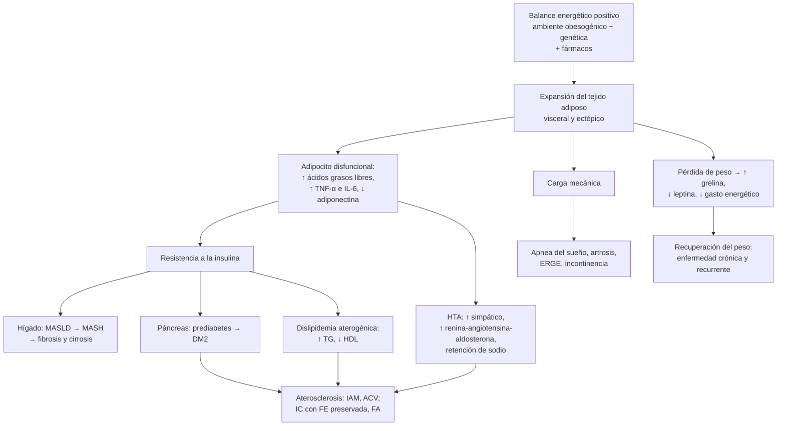
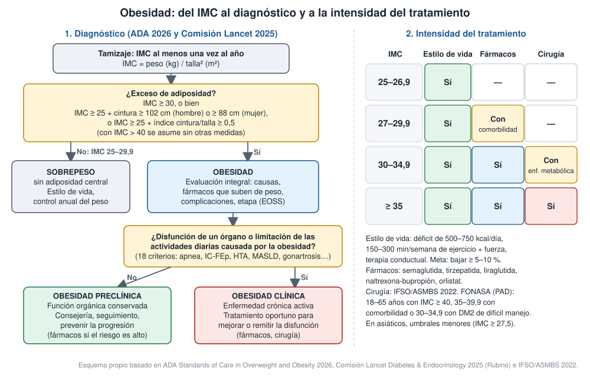

---
tags:
  - Endocrinología
  - Frecuente en sala
---

# Obesidad, obesidad mórbida y síndrome metabólico

**Subespecialidad**
Endocrinología · Nutrición · Cardiología · Cirugía bariátrica

**Guías principales**
ADA Standards of Care in Overweight and Obesity 2026 (diagnóstico y tratamiento farmacológico) · Comisión *Lancet Diabetes & Endocrinology* 2025: obesidad clínica · OMS 2025: terapias GLP-1 en la obesidad · ASMBS/IFSO 2022: indicaciones de cirugía metabólica y bariátrica · Declaración armonizada del síndrome metabólico (IDF/AHA/NHLBI 2009) · Guía de práctica clínica de obesidad del adulto adaptada para Chile (2022)

**Otras fuentes**
Encuesta Nacional de Salud 2016–2017 · Ensayos STEP 1, SURMOUNT-1, SURMOUNT-4, SURMOUNT-5 y SELECT · AHA 2023: síndrome cardiovascular-renal-metabólico

**GES**
La obesidad **no tiene GES propio**. Sí lo tienen sus complicaciones: **diabetes tipo 2** y **HTA**. FONASA cubre la **manga gástrica** y el **bypass gástrico** mediante **PAD**. En APS existe el **Programa Vida Sana**.

**EUNACOM**
1.02.1.012 Obesidad (específico, completo, completo) · 1.02.1.013 Obesidad mórbida (sospecha, inicial, derivar) · 1.02.1.016 y 1.01.1.023 Síndrome metabólico (específico, completo, completo)

**Revisado**
Septiembre 2026

!!! abstract "Resumen en 60 segundos"
    - La obesidad es una **enfermedad crónica y recurrente** por **exceso de adiposidad**. El **IMC ≥ 30** (≥ 27,5 en asiáticos) es el punto de partida, pero **no basta**: confirmar con la **cintura** o el **índice cintura/talla ≥ 0,5** (ADA 2026).
    - **Comisión Lancet 2025**:
        - **Obesidad clínica**: la adiposidad ya causa **disfunción de órganos** o **limita las actividades diarias**. Es una enfermedad activa que se trata.
        - **Obesidad preclínica**: función conservada, pero con riesgo alto.
    - **Chile (ENS 2016–2017)**: **74 % con exceso de peso**, **obesidad 31,2 %**, **obesidad mórbida 3,2 %** y **síndrome metabólico 40,1 %**.
    - **Evaluar** tres cosas:
        - Las **causas**: fármacos que suben de peso, hipotiroidismo, Cushing.
        - Las **complicaciones**: DM2, HTA, dislipidemia, hígado graso (MASLD), apnea del sueño, artrosis.
        - La **etapa** (Edmonton, EOSS).
    - **Tratamiento escalonado**:
        - **Estilo de vida** para todos (déficit de 500–750 kcal/día, 150–300 min/semana de ejercicio). Meta: bajar **≥ 5–10 %**.
        - **Fármacos** si IMC ≥ 30, o ≥ 27 con complicaciones: **tirzepatida** (≈ −20 %), **semaglutida 2,4 mg** (≈ −15 %), liraglutida 3 mg, naltrexona-bupropión, orlistat. Son **crónicos**: al suspender se recuperan **dos tercios** del peso perdido en 1 año.
        - **Cirugía bariátrica** si IMC **≥ 35**, o **≥ 30 con enfermedad metabólica** (ASMBS/IFSO 2022). Exige **suplementación de por vida**.
    - **Síndrome metabólico**: **3 de 5** criterios. En Chile se usa cintura **≥ 90 cm** (hombre) o **≥ 80 cm** (mujer), TG ≥ 150, HDL < 40/50, PA ≥ 130/85 y glicemia ≥ 100.
        - Predice **diabetes** (≈ 5 veces) y **enfermedad cardiovascular** (≈ 2 veces).
        - Se trata **bajando de peso** y **controlando cada componente**.

## Definición

| Término | Definición |
|---|---|
| **Sobrepeso** | IMC **25–29,9 kg/m²**. ADA 2026 lo exige **sin adiposidad central** (cintura e índice cintura/talla normales) |
| **Obesidad (ADA 2026)** | Exceso de adiposidad con cualquiera de: **IMC ≥ 30**; **IMC ≥ 25 + índice cintura/talla ≥ 0,5**; **IMC ≥ 25 + cintura ≥ 102 cm (hombre) o ≥ 88 cm (mujer)**. En asiáticos: IMC ≥ 27,5, o ≥ 23 con adiposidad central |
| **Obesidad clase I, II y III** | IMC **30–34,9**, **35–39,9** y **≥ 40** (OMS) |
| **Obesidad mórbida (grave)** | IMC **≥ 40**. En la práctica clínica, y para la indicación quirúrgica, también IMC **≥ 35 con comorbilidad** |
| **Obesidad clínica (Lancet 2025)** | Enfermedad crónica y sistémica: exceso de adiposidad que **altera la función** de tejidos u órganos, o **limita las actividades de la vida diaria** |
| **Obesidad preclínica (Lancet 2025)** | Exceso de adiposidad con **función orgánica conservada**; riesgo aumentado de obesidad clínica, DM2, enfermedad cardiovascular y cáncer |
| **Síndrome metabólico** | Agrupación de factores de riesgo cardiometabólico ligados a la **resistencia a la insulina** y a la **adiposidad visceral**: **3 de 5** criterios (declaración armonizada 2009) |
| **Obesidad sarcopénica** | Exceso de adiposidad con **baja masa y fuerza muscular**; típica del adulto mayor, en quien el IMC subestima la grasa |

## Epidemiología

### Mundial

- En 2022, **2.500 millones** de adultos tenían sobrepeso (**43 %**). De ellos, **890 millones** vivían con obesidad (**16 %**) (OMS).
- La obesidad del adulto **se duplicó** desde 1990, y la del adolescente se **cuadruplicó** (OMS).
- En 2022 la obesidad ya superaba al bajo peso en **la mayoría de los países** (NCD-RisC 2024).
- Es causa de **13 tipos de cáncer** (IARC 2016): esófago (adenocarcinoma), cardias, colon y recto, hígado, vesícula biliar, páncreas, mama posmenopáusica, endometrio, ovario, riñón, tiroides, meningioma y mieloma múltiple.

!!! chile "Datos nacionales"
    - **ENS 2016–2017** (≥ 15 años):
        - **Sobrepeso 39,8 %**, **obesidad 31,2 %** y **obesidad mórbida 3,2 %**. **Exceso de peso: 74,2 %**.
        - La obesidad subió de **22,9 %** (2009–2010) a **31,2 %**.
        - Es más frecuente en **mujeres** (obesidad 33,7 % vs 28,6 %; mórbida **4,7 %** vs 1,7 %) y en quienes tienen **menos de 8 años de estudio**.
        - Sedentarismo cercano al **87 %**.
    - **Síndrome metabólico**: **40,1 %** en la ENS 2016–2017.
        - Criterios usados: cintura **> 90 cm** (hombre) o **> 80 cm** (mujer).
        - **42,9 %** en hombres y **37,4 %** en mujeres.
        - **58 %** entre los 45 y 64 años, y **61 %** desde los 65.
        - **58,4 %** con menos de 8 años de estudio vs **29,6 %** con 12 o más.
    - En niños y adolescentes, Chile está entre los países con **mayor prevalencia combinada** de delgadez y obesidad en varones (NCD-RisC 2024).
    - **Políticas**:
        - **Ley 20.606** de etiquetado de alimentos: sellos "ALTO EN" y restricción de la publicidad infantil.
        - **Programa Vida Sana** en APS.
        - **Guía de práctica clínica chilena de obesidad** (2022, adaptada de la canadiense).
    - **Fármacos en Chile**:
        - Hace años: **liraglutida 3 mg**, **naltrexona-bupropión**, **orlistat** y fentermina.
        - La **tirzepatida** se comercializa desde **enero de 2026**. **Semaglutida 2,4 mg** (Wegovy) fue registrada por el ISP en **junio de 2026**.
        - No son GES y su **costo** limita el acceso.
    - **Cirugía bariátrica por PAD FONASA** (manga gástrica o bypass gástrico, 18–65 años):
        - IMC **≥ 40**.
        - IMC **35–39,9 con comorbilidad**.
        - IMC **30–34,9 con DM2 de difícil manejo**.

## Etiología y factores de riesgo

- **Ambiente obesogénico**: alimentos **ultraprocesados** y bebidas azucaradas, porciones grandes, **sedentarismo**, sueño corto, estrés, pantallas.
- **Genética**: la obesidad común es **poligénica**; la heredabilidad es alta en estudios de gemelos. Formas **monogénicas** raras (receptor de melanocortina 4, leptina) y **sindrómicas** (Prader-Willi): sospechar si comienza en la **infancia temprana** con hiperfagia intensa.
- **Momentos de riesgo**: embarazo y posparto, menopausia, **dejar de fumar**, cambios de trabajo o de rutina, lesiones que limitan la actividad.
- **Causas secundarias** (poco frecuentes, pero hay que buscarlas):
    - **Endocrinas**: **hipotiroidismo** (sube poco de peso, sobre todo por retención de líquido), **síndrome de Cushing**, síndrome de ovario poliquístico, déficit de hormona de crecimiento, hipogonadismo.
    - **Hipotalámicas**: tumores (craneofaringioma), cirugía o radioterapia, trauma.
    - **Fármacos** que suben de peso (tabla).
- **Trastornos de la conducta alimentaria**: **trastorno por atracón**, síndrome de comedor nocturno. Depresión.

| Grupo | Fármacos que suben de peso | Alternativas neutras o que bajan de peso |
|---|---|---|
| **Diabetes** | **Insulina**, **sulfonilureas**, glitazonas | **Metformina**, **arGLP-1**, **tirzepatida**, **iSGLT2**, iDPP-4 |
| **HTA** | Metoprolol, atenolol, propranolol, α-bloqueadores | IECA, ARA-II, tiazidas, carvedilol, nebivolol |
| **Psiquiatría** | **Clozapina, olanzapina**, quetiapina, risperidona; **mirtazapina**, paroxetina, tricíclicos; **litio**; valproato | Ziprasidona, **bupropión**, lamotrigina |
| **Neurología** | **Pregabalina, gabapentina**, carbamazepina | Topiramato, zonisamida, lamotrigina, levetiracetam |
| **Otros** | **Corticoides** sistémicos, acetato de medroxiprogesterona de depósito, antihistamínicos (difenhidramina, cetirizina) | AINE, DIU de cobre, loratadina |

*Adaptada de ADA Standards of Care in Overweight and Obesity 2026 (tratamiento farmacológico).*

## Fisiopatología

- El peso está regulado por el **hipotálamo**. Integra señales de largo plazo (**leptina**, insulina) y de corto plazo (**grelina**, que da hambre; **GLP-1**, péptido YY y colecistoquinina, que dan saciedad).
- En la obesidad hay **resistencia a la leptina**. Además, al bajar de peso el cuerpo se **defiende**: sube la grelina, bajan la leptina y el gasto energético, y aumenta el apetito. Por eso la obesidad **recurre** y requiere **tratamiento crónico**.
- El **tejido adiposo visceral** y la grasa **ectópica** (hígado, músculo, páncreas, epicardio) son los más dañinos:
    - Liberan **ácidos grasos libres** y **citoquinas inflamatorias** (TNF-α, IL-6).
    - Producen **menos adiponectina**.
    - El resultado es **resistencia a la insulina**, el eje del síndrome metabólico.
- **Daño mecánico** por el peso: apnea del sueño, artrosis, ERGE, incontinencia, linfedema, hipertensión intracraneana idiopática.
- **Daño metabólico**:
    - DM2 y dislipidemia aterogénica (TG altos, HDL bajo, LDL pequeñas y densas).
    - HTA: activación simpática y del sistema renina-angiotensina-aldosterona, retención de sodio.
    - MASLD, estado **protrombótico** e inflamatorio, y aterosclerosis.

## Clasificación

### Por IMC (OMS)

| IMC (kg/m²) | Categoría | Riesgo de comorbilidad |
|---|---|---|
| < 18,5 | Bajo peso | Bajo para las metabólicas; otros riesgos |
| 18,5–24,9 | Normal | Promedio |
| 25–29,9 | Sobrepeso | Aumentado (más si hay adiposidad central) |
| 30–34,9 | Obesidad clase I | Moderado |
| 35–39,9 | Obesidad clase II | Grave |
| ≥ 40 | Obesidad clase III (mórbida) | Muy grave |

- El IMC **no distingue grasa de músculo**. Sobreestima la adiposidad en personas musculosas y la **subestima** en el adulto mayor (sarcopenia). Tampoco muestra la distribución de la grasa.

### Por distribución

- **Central (androide, visceral)**: cintura y relación cintura/talla altas. Da **mayor riesgo cardiometabólico** con el mismo IMC.
- **Periférica (ginoide)**: caderas y muslos, menor riesgo metabólico.

### Por etapa: Edmonton Obesity Staging System (EOSS)

| Etapa | Descripción |
|---|---|
| **0** | Sin factores de riesgo, síntomas ni limitación funcional |
| **1** | Factores de riesgo **subclínicos** (prediabetes, PA limítrofe, transaminasas levemente altas) o síntomas leves |
| **2** | **Enfermedad crónica establecida** (DM2, HTA, apnea del sueño, artrosis, SOP) o limitación moderada |
| **3** | **Daño de órgano** (infarto, IC, complicaciones diabéticas, artrosis invalidante) o limitación importante |
| **4** | Discapacidad **grave** o terminal por la obesidad |

- La ADA 2026 sugiere usar la EOSS para estratificar el riesgo y el pronóstico, más allá del IMC.
- La **obesidad clínica** de la Comisión Lancet se superpone en gran parte con las etapas 2–4.

## Clínica

- **Anamnesis del peso**: edad de inicio, peso máximo y mínimo de adulto, desencadenantes y **fármacos**. También los tratamientos previos (dietas, fármacos, cirugía), la conducta alimentaria (**atracones**, comer nocturno), el sueño, la actividad física, el ánimo y las expectativas.
- **Pedir permiso para hablar del peso** y usar lenguaje **sin estigma** ("persona con obesidad", no "obeso").
- **Examen físico**:
    - Peso, talla, IMC, **cintura** y PA **con manguito adecuado** (el estándar sobreestima la PA en brazos gruesos).
    - **Acantosis nigricans** (resistencia a la insulina), acrocordones.
    - **Estrías**: las blancas y finas son habituales; las **violáceas y anchas (> 1 cm)** sugieren **Cushing**.
    - **Hirsutismo** (SOP), bocio.
    - Mallampati y cuello ancho (apnea), edema, intertrigo, linfedema, examen de rodillas.

| Sistema | Complicaciones de la obesidad |
|---|---|
| **Metabólico** | **Prediabetes y DM2**, dislipidemia, **hiperuricemia y gota**, **MASLD/MASH** (hígado graso asociado a disfunción metabólica) |
| **Cardiovascular** | **HTA**, enfermedad coronaria, **IC con FE preservada**, **fibrilación auricular**, **tromboembolismo venoso** |
| **Respiratorio** | **Apnea obstructiva del sueño**, **síndrome de obesidad-hipoventilación**, disnea, asma de difícil control |
| **Digestivo** | **ERGE**, esófago de Barrett, **litiasis biliar** |
| **Renal y urinario** | ERC (glomerulopatía asociada a la obesidad), **incontinencia urinaria** |
| **Reproductivo** | **SOP**, infertilidad, **hipogonadismo masculino**, preeclampsia y diabetes gestacional |
| **Osteomuscular** | **Gonartrosis** y coxartrosis, lumbago, limitación de la movilidad |
| **Neurológico** | **Hipertensión intracraneana idiopática**, ACV |
| **Cáncer** | 13 tipos (esófago, colon, hígado, páncreas, mama posmenopáusica, endometrio, riñón, entre otros) |
| **Psicosocial** | Depresión, ansiedad, **estigma**, trastorno por atracón, peor calidad de vida |
| **Piel** | Intertrigo, celulitis recurrente, linfedema, hidradenitis |

## Diagnóstico

!!! guia "Diagnóstico de la obesidad (ADA 2026)"
    - **Tamizaje**: IMC **al menos una vez al año**. Vigilar las **alzas sostenidas** de peso: más de **1–1,5 kg/año** durante más de 3 años marca riesgo.
    - **Obesidad** en adultos no asiáticos si hay exceso de adiposidad con **cualquiera** de:
        - **IMC ≥ 30**.
        - **IMC ≥ 25** + **índice cintura/talla ≥ 0,5**.
        - **IMC ≥ 25** + cintura **≥ 102 cm** (hombre) o **≥ 88 cm** (mujer).
    - En **asiáticos**: IMC ≥ 27,5, o ≥ 23 con adiposidad central (cintura ≥ 90/80 cm o índice ≥ 0,5).
    - **Sobrepeso**: IMC 25–29,9 **sin** adiposidad central.
    - Tras el diagnóstico:
        - **Evaluación integral**: historia del peso, causas, complicaciones, salud mental y determinantes sociales.
        - **Estratificación**: distribución de la grasa y EOSS.
        - **Registrar el diagnóstico** en la ficha.

!!! guia "Obesidad clínica y preclínica (Comisión Lancet 2025)"
    - **Paso 1. Confirmar el exceso de adiposidad**. Basta **una** de estas opciones:
        - El IMC más una medida antropométrica (cintura, cintura/cadera o cintura/talla).
        - **Dos** medidas antropométricas, sea cual sea el IMC.
        - La medición directa de la grasa (DXA, bioimpedancia).
        - Con **IMC > 40** se asume sin más medidas.
    - **Paso 2. Buscar disfunción atribuible a la obesidad.** Son **18 criterios** en el adulto, por ejemplo:
        - Apnea del sueño, disnea o hipoventilación.
        - IC con FE preservada, FA, hipertensión pulmonar, TEV recurrente, **PA alta**.
        - Hiperglicemia con TG altos y HDL bajo.
        - MASLD **con fibrosis**; albuminuria con TFGe baja.
        - Incontinencia, SOP o hipogonadismo.
        - Gonalgia o coxalgia crónica grave, linfedema, hipertensión intracraneana.
        - **Limitación de las actividades de la vida diaria**.
    - **Obesidad clínica**: tratamiento **oportuno** para mejorar o remitir la disfunción.
    - **Obesidad preclínica**: consejería, seguimiento y reducción del riesgo.

<figure markdown>
{ loading=lazy }
<figcaption>Figura 1. Del IMC al diagnóstico de obesidad (clínica o preclínica) y a la intensidad del tratamiento. Esquema propio basado en ADA Standards of Care in Overweight and Obesity 2026, la Comisión Lancet Diabetes & Endocrinology 2025 (Rubino et al.) y ASMBS/IFSO 2022; criterios PAD de FONASA.</figcaption>
</figure>

### Síndrome metabólico

| Criterio (3 de 5) | Declaración armonizada 2009 |
|---|---|
| **Cintura** | Según la población: en **Chile ≥ 90 cm (hombre) y ≥ 80 cm (mujer)** (MINSAL, ENS; la IDF recomienda estos valores para Centro y Sudamérica). ATP III usaba ≥ 102 y ≥ 88 cm |
| **Triglicéridos** | **≥ 150 mg/dL** o tratamiento para hipertrigliceridemia |
| **HDL** | **< 40 mg/dL (hombre) o < 50 mg/dL (mujer)** o tratamiento |
| **Presión arterial** | **≥ 130/85 mmHg** o tratamiento antihipertensivo |
| **Glicemia de ayuno** | **≥ 100 mg/dL** o tratamiento para la hiperglicemia |

- La **IDF** (2005) exigía la obesidad central como criterio obligatorio. La declaración armonizada de 2009 la dejó como **uno más** de los cinco.
- Su valor es **identificar** a quien tiene riesgo alto de **DM2** (≈ 5 veces) y de **enfermedad cardiovascular** (≈ 2 veces). **No reemplaza** el cálculo del riesgo cardiovascular global.
- La AHA (2023) propone el concepto de **síndrome cardiovascular-renal-metabólico** (etapas 0–4). Integra la adiposidad, la disfunción metabólica, la ERC y la enfermedad cardiovascular.

## Laboratorio

- **A todos** los adultos con obesidad:
    - **Glicemia de ayuno y/o HbA1c**: prediabetes o DM2.
    - **Perfil lipídico**.
    - **ALT, AST y plaquetas**: calcular el **FIB-4** (MASLD con fibrosis). Si es ≥ 1,3, pedir elastografía.
    - **Creatinina (TFGe)** y **razón albúmina/creatinina** en orina.
    - **TSH**.
    - **Ácido úrico** si hay gota o litiasis.
- **Según la clínica**:
    - **Sospecha de Cushing** (estrías violáceas, miopatía proximal, equimosis, HTA o DM2 de difícil control, osteoporosis precoz): cortisol tras **1 mg de dexametasona** nocturna, **cortisol salival nocturno** o cortisol libre en orina de 24 h.
    - **Hipogonadismo masculino**: testosterona total matinal.
    - **SOP**: testosterona, LH/FSH, prolactina.
    - **Hipoventilación**: **bicarbonato venoso > 27 mEq/L** → **gases arteriales** (PaCO₂ > 45 mmHg en vigilia).
    - **Prueba de embarazo** antes de iniciar fármacos para la obesidad.
- **Antes y después de la cirugía bariátrica**: hemograma, ferritina, B12, folato, vitamina D, calcio, PTH, albúmina y, según el caso, tiamina, zinc y cobre.

## Imágenes

- **Ecografía abdominal**: esteatosis hepática y **litiasis biliar**. No cuantifica la fibrosis.
- **Elastografía hepática** (transitoria): si el FIB-4 es ≥ 1,3.
- **Polisomnografía o poligrafía**: sospecha de apnea del sueño (ronquido, apneas presenciadas, somnolencia; **STOP-BANG ≥ 3**).
- **Ecocardiograma**: disnea o edema (IC con FE preservada, hipertensión pulmonar).
- **Radiografía de rodillas** si hay gonalgia.
- **DXA o bioimpedancia**: miden la composición corporal. Útiles, pero no son rutinarias.
- **Endoscopía digestiva alta** antes de la cirugía bariátrica (ERGE, hernia hiatal, *H. pylori*).
- **Limitaciones en la obesidad grave**: la calidad de la ecografía y la ecocardiografía disminuye, y los equipos de TC y RM tienen **límite de peso**. Considerarlo al planificar los estudios.

## Diagnóstico diferencial

| Situación | Claves |
|---|---|
| **Síndrome de Cushing** | Obesidad **central** con extremidades delgadas, cara de luna llena, **estrías violáceas anchas**, **miopatía proximal**, equimosis, HTA, hiperglicemia, hipokalemia, osteoporosis |
| **Hipotiroidismo** | Alza de peso **moderada** (sobre todo líquido), fatiga, frío, constipación, bradicardia, TSH alta. Tratarlo **no** resuelve la obesidad |
| **Síndrome de ovario poliquístico** | Oligomenorrea, hirsutismo, acné, resistencia a la insulina |
| **Aumento de peso por líquido** | **IC, cirrosis, síndrome nefrótico**, mixedema: el peso sube rápido, con **edema** o ascitis |
| **Fármacos** | Relación temporal con el inicio de antipsicóticos, insulina, corticoides, pregabalina, etc. |
| **Lipedema** | Mujer con acumulación **simétrica y dolorosa** de grasa en las piernas que **respeta los pies**, con equimosis fáciles. No responde a la dieta |
| **Obesidad hipotalámica** | Antecedente de tumor, cirugía o radioterapia hipotalámica; hiperfagia intensa |
| **Obesidad monogénica o sindrómica** | Inicio en la **infancia temprana**, hiperfagia; Prader-Willi (hipotonía, talla baja, hipogonadismo, déficit intelectual) |

## Tratamiento

### Principios

- Es una **enfermedad crónica**. La meta es la **salud** (mejorar o remitir las complicaciones), no solo el número en la balanza.
- **Pedir permiso**, usar lenguaje sin estigma y acordar metas **realistas** (modelo de las **5 A**: preguntar, evaluar, aconsejar, acordar, asistir).
- **Metas de pérdida de peso** (ADA 2026):
    - **≥ 5 %**: mejora la glicemia, los triglicéridos y la PA.
    - **≥ 10 %**: para la mayoría de las complicaciones (apnea, MASLD, artrosis).
    - **≥ 15 %**: en algunos casos, como la remisión de la DM2 o la MASH con fibrosis.
- **Revisar y cambiar** los fármacos que suben de peso.

### Estilo de vida (todos)

!!! dosis "Intervención en el estilo de vida"
    - **Alimentación**:
        - Déficit de **500–750 kcal/día**: en general, 1.200–1.500 kcal/día en mujeres y 1.500–1.800 en hombres.
        - Ningún patrón es claramente superior. Elegir el que la persona **pueda mantener**: mediterráneo, bajo en carbohidratos, restricción de horario.
        - Reducir los ultraprocesados y las bebidas azucaradas. Referir a **nutricionista**.
    - **Actividad física**:
        - **150–300 min/semana** de actividad aeróbica moderada.
        - Ejercicios de **fuerza 2–3 días/semana**: preservan la masa muscular al bajar de peso.
        - Reducir el tiempo sentado.
    - **Terapia conductual**: automonitoreo (peso, alimentación), metas concretas, control de estímulos, manejo del estrés y del **sueño**.
    - En el **Programa de Prevención de la Diabetes (DPP)**, bajar ≈ 7 % del peso con 150 min/semana de actividad **redujo en 58 % la incidencia de DM2** en personas con prediabetes.
    - La consejería breve logra poco (≈ 2–3 %). Los programas **intensivos y estructurados** logran más.

### Fármacos

- **Indicación**:
    - Clásica: **IMC ≥ 30**, o **≥ 27 con una complicación**, además del estilo de vida.
    - ADA 2026: ofrecerlos **desde el inicio** si hay complicaciones o riesgo alto de tenerlas, y **considerarlos** aun sin complicaciones.
    - OMS 2025: recomendación **condicional** de las terapias GLP-1 **a largo plazo** junto con terapia conductual.

!!! dosis "Fármacos para la obesidad (ADA 2026)"
    | Fármaco | Dosis | Pérdida de peso adicional al placebo* | Efectos adversos y precauciones |
    |---|---|---|---|
    | **Tirzepatida** (agonista dual GIP/GLP-1), SC semanal | **2,5 mg** × 4 semanas; subir 2,5 mg cada 4 semanas hasta **5, 10 o 15 mg** | **≈ 16 %** (SURMOUNT-1: −20,9 % con 15 mg vs −3,1 % a las 72 semanas) | Náuseas, vómitos, diarrea, constipación. Litiasis biliar, pancreatitis. **Reduce la eficacia de los anticonceptivos orales**: agregar un método de barrera por 4 semanas tras iniciar y tras cada alza |
    | **Semaglutida** (arGLP-1), SC semanal | **0,25 mg** × 4 semanas → 0,5 → 1 → 1,7 → **2,4 mg** (cada 4 semanas) | **≈ 12 %** (STEP 1: −14,9 % vs −2,4 % a las 68 semanas) | Gastrointestinales; litiasis biliar; pancreatitis. En DM2, empeoramiento de la **retinopatía** si la HbA1c baja muy rápido. **Neuropatía óptica isquémica anterior no arterítica**: muy rara (EMA 2025) |
    | **Liraglutida** (arGLP-1), SC diaria | **0,6 mg/día**, subir 0,6 mg cada semana hasta **3 mg/día** | **≈ 4,5 %** | Gastrointestinales, taquicardia leve, litiasis biliar |
    | **Naltrexona-bupropión**, oral | Comprimido 8/90 mg: 1 al día → hasta **2 cada 12 h** en 4 semanas | **≈ 5 %** | Náuseas, cefalea, insomnio, **alza de la PA**. Contraindicado si hay epilepsia, **HTA no controlada**, uso de **opioides**, anorexia o bulimia |
    | **Orlistat** (inhibidor de la lipasa), oral | **120 mg** con cada comida principal (3 al día) | **≈ 3 %** | Esteatorrea, manchas oleosas, urgencia fecal. Dar un **multivitamínico** con vitaminas liposolubles al acostarse |
    | **Fentermina**, oral | 15–37,5 mg en la mañana | ≈ 3,5 % | Simpaticomimético: taquicardia, HTA, insomnio. Evitar si hay enfermedad cardiovascular. Uso de corto plazo |

    *Estimación de metaanálisis citada por la ADA 2026; el efecto real varía entre personas.

    - **Contraindicaciones de los arGLP-1 y de la tirzepatida**:
        - Antecedente personal o familiar de **carcinoma medular de tiroides** o **MEN 2**.
        - Enfermedad gastrointestinal grave.
        - **Embarazo y lactancia**.
        - Precaución si hubo pancreatitis.
    - **Seguimiento**: controles **mensuales** los primeros 3 meses, luego **cada 3 meses** el primer año y después cada 6 meses.
        - Si la respuesta es insuficiente (clásicamente, **< 5 %** tras unos 3 meses con la dosis de mantención), subir a la dosis máxima tolerada, cambiar de fármaco o derivar a cirugía.
        - Indicar **proteínas suficientes** y **ejercicio de fuerza** para limitar la pérdida muscular.
    - **Comparación directa**: **SURMOUNT-5** mostró que la tirzepatida baja más que la semaglutida (−20,2 % vs −13,7 % a las 72 semanas).
    - **Opciones orales en desarrollo**: semaglutida oral de 25 mg (OASIS 4) y orforglipron (ATTAIN-1, −11,2 % con 36 mg).

!!! guia "Elección del fármaco según la comorbilidad (ADA 2026)"
    - **Prediabetes**: fármacos que previenen la DM2. Tirzepatida, semaglutida, liraglutida y orlistat tienen evidencia.
    - **DM2**: **arGLP-1 o tirzepatida** (bajan el peso y la HbA1c).
    - **Enfermedad cardiovascular aterosclerótica establecida**: **semaglutida**. En **SELECT** (17.604 pacientes sin diabetes) redujo el **infarto, el ACV o la muerte cardiovascular en 20 %** (HR 0,80).
    - **IC con FE preservada**: semaglutida o tirzepatida (mejoran los síntomas y reducen los eventos de IC).
    - **MASH con fibrosis moderada o avanzada**: semaglutida o tirzepatida.
    - **Apnea del sueño moderada o grave**: **tirzepatida** (beneficio demostrado).
    - **Gonartrosis**: arGLP-1 o tirzepatida (mejoran el dolor).
    - **HTA**: preferir los que bajan la PA. **Evitar** fentermina y naltrexona-bupropión si la HTA no está controlada.

!!! alarma "El tratamiento es crónico"
    - Al **suspender** la semaglutida, en 1 año se recuperan **dos tercios** del peso perdido, y los marcadores cardiometabólicos vuelven hacia el valor basal (extensión de STEP 1).
    - En **SURMOUNT-4**, quienes cambiaron a placebo tras 36 semanas de tirzepatida **subieron 14 %**. Quienes siguieron con tirzepatida **bajaron 5,5 % adicional**.
    - Explicarlo **antes** de iniciar el fármaco. La dosis de **mantención** puede ser menor que la máxima si mantiene el beneficio.

### Cirugía metabólica y bariátrica

- **Indicaciones (ASMBS/IFSO 2022)**:
    - **IMC ≥ 35**, con o sin comorbilidad.
    - **IMC 30–34,9** con **enfermedad metabólica** (DM2), o cuando el tratamiento no quirúrgico no logra una pérdida de peso o una mejoría de las comorbilidades sostenidas.
    - En asiáticos, desde IMC **≥ 27,5**.
    - La edad avanzada no es contraindicación por sí sola; se evalúa la fragilidad.
- **FONASA (PAD)**: 18–65 años con IMC ≥ 40, 35–39,9 con comorbilidad, o 30–34,9 con DM2 de difícil manejo. Exige cumplir el protocolo (evaluaciones y certificados previos) y no tener contraindicaciones. Incluye la cirugía laparoscópica y el **seguimiento del primer año**.
- **Técnicas**:
    - **Manga gástrica** (gastrectomía en manga): la más usada. Puede causar o empeorar la **ERGE**: reflujo *de novo* en ≈ un tercio de las series (4–75 %), con casos de Barrett.
    - **Bypass gástrico en Y de Roux**: mejor en la **ERGE** y en la DM2. Tiene más riesgo de déficit de micronutrientes, **dumping** e hipoglicemia posprandial.
- **Evaluación previa multidisciplinaria**: cirujano, endocrinólogo o internista, nutricionista, psicólogo o psiquiatra y endoscopía.
- **Contraindicaciones relativas**:
    - Trastorno psiquiátrico no controlado.
    - Abuso activo de alcohol o drogas.
    - Incapacidad de seguir los controles.
    - Riesgo quirúrgico prohibitivo.
- **Resultados**: es el tratamiento más efectivo para la **obesidad grave**. Logra una pérdida de peso sostenida y **remisión de la DM2** en muchos pacientes, y mejora la apnea, la HTA y la sobrevida.

!!! dosis "Después de la cirugía bariátrica (de por vida)"
    - **Multivitamínico** con minerales, diario.
    - **Vitamina B12** (oral en dosis altas o IM).
    - **Calcio (citrato)** + **vitamina D**.
    - **Hierro**, sobre todo en mujeres que menstrúan y tras un bypass.
    - Controles con hemograma, ferritina, B12, folato, vitamina D, calcio y PTH.
    - Evitar AINE y tabaco (**úlcera marginal**); precaución con el alcohol (su absorción cambia y aumenta el riesgo de consumo problemático).
    - Evitar el **embarazo** durante 12–18 meses tras la cirugía.

### Obesidad mórbida: qué hace el médico general

- **Sospecha**: IMC ≥ 40, o ≥ 35 con comorbilidad.
- **Manejo inicial**:
    - Estilo de vida.
    - **Buscar complicaciones graves**: apnea del sueño, **hipoventilación** (bicarbonato alto, PaCO₂ > 45), IC, DM2 descompensada.
    - Revisar los fármacos.
    - Iniciar un fármaco si es posible.
- **Derivar** a endocrinología o a un equipo de obesidad y **cirugía bariátrica** (PAD FONASA).

### Síndrome metabólico

- **Bajar 5–10 % del peso** y hacer **actividad física** regular, que mejoran **todos** los componentes.
- Dieta tipo mediterránea, dejar de fumar y reducir el alcohol.
- **Tratar cada factor según su guía**:
    - **PA < 130/80** (ver [hipertensión arterial](../cardiologia/hipertension-arterial.md)).
    - **Estatina** según el riesgo cardiovascular global (ver [dislipidemia](dislipidemia.md)).
    - **Prediabetes**: estilo de vida intensivo. **Metformina** si es de alto riesgo (IMC ≥ 35, < 60 años, antecedente de diabetes gestacional).
    - Con **TG ≥ 500 mg/dL**, tratarlos además para prevenir la pancreatitis.
- **Buscar** MASLD (FIB-4), apnea del sueño y enfermedad renal. **Calcular el riesgo cardiovascular**.
- Si además hay obesidad: fármacos para la obesidad según la comorbilidad.

## Complicaciones

- **Del tratamiento farmacológico**:
    - Náuseas y vómitos que llevan a **deshidratación** y **lesión renal aguda**.
    - **Pancreatitis** y **colecistitis** (litiasis biliar por la pérdida rápida de peso).
    - Pérdida de masa muscular y sarcopenia en el adulto mayor.
    - **Riesgo de aspiración** en la anestesia por el vaciamiento gástrico lento: informar al anestesista. En pacientes de alto riesgo, dieta líquida el día previo.
- **De la cirugía bariátrica**:
    - **Precoces**: filtración (taquicardia, fiebre, dolor), hemorragia, TEV.
    - **Tardías**: **hernia interna** tras el bypass (dolor abdominal cólico: **urgencia quirúrgica**, aunque las imágenes sean normales), úlcera marginal, estenosis, **dumping**, hipoglicemia posbypass.
    - **Deficiencias**: anemia ferropénica, **déficit de B12**, osteoporosis e hiperparatiroidismo secundario, y **encefalopatía de Wernicke** si hay **vómitos persistentes** (dar **tiamina**).
    - Litiasis biliar, ERGE tras la manga, recuperación del peso y consumo problemático de alcohol.
- **De la obesidad no tratada**: ver la tabla de la sección Clínica. Las que más cambian el pronóstico son la **DM2**, la enfermedad cardiovascular, la **apnea del sueño**, la **MASH** y el **cáncer**.
- **En la hospitalización**:
    - Vía aérea difícil e hipoventilación: usar **oxígeno con meta** y considerar VMNI.
    - **Tromboprofilaxis** con dosis ajustadas en la obesidad grave.
    - Úlceras por presión e intertrigo.
    - Dificultad para las imágenes.
    - Dosificación de fármacos por **peso** (vancomicina, aminoglucósidos, heparinas).

## Pronóstico y seguimiento

- La obesidad **reduce la expectativa de vida**, más cuanto mayor el IMC y más precoz el inicio. Gran parte del exceso de mortalidad es cardiovascular y por cáncer.
- La **pérdida de peso sostenida** mejora las complicaciones. SELECT demostró por primera vez una reducción de eventos cardiovasculares con un fármaco para la obesidad.
- **Recurrencia**: es la regla si se suspende el tratamiento. Se maneja como la HTA o la DM2, con **control crónico**.
- **Seguimiento**:
    - **Con fármacos**: mensual × 3 meses, luego trimestral el primer año y semestral después. Controlar el peso, la cintura, la PA, la glicemia, el perfil lipídico y la función renal.
    - **Tras la cirugía**: controles con el equipo bariátrico y **micronutrientes** al menos una vez al año, de por vida.
    - **Síndrome metabólico**: reevaluar los componentes y el riesgo cardiovascular al menos **una vez al año**.

## Perlas para el internado

!!! perla "Para la sala y el turno"
    - **Mide la cintura**. El IMC engaña en personas musculosas, en el **adulto mayor** (sarcopenia) y en el paciente **edematoso**.
    - En Chile, el síndrome metabólico usa cintura **≥ 90 cm** (hombre) y **≥ 80 cm** (mujer): con 3 de 5 criterios ya está.
    - Antes de culpar a la dieta, **revisa los fármacos**: antipsicóticos, insulina, sulfonilureas, corticoides, pregabalina, mirtazapina.
    - **Estrías violáceas anchas + miopatía proximal + equimosis** = descartar **Cushing**. La obesidad simple tiene estrías blancas y finas.
    - Paciente con obesidad grave, somnoliento y con **bicarbonato alto**: pide **gases**. Si la PaCO₂ está alta, es **síndrome de obesidad-hipoventilación**: oxígeno con meta (no hiperoxia) y VMNI.
    - Paciente **posbypass** con dolor abdominal cólico: **hernia interna** hasta demostrar lo contrario. Si tiene **vómitos y confusión**: **tiamina** antes de la glucosa.
    - Los arGLP-1 **no se suspenden** por capricho: se recupera el peso. Sí se informa al anestesista antes de una cirugía.
    - Habla de "persona con obesidad" y **pide permiso** para hablar del peso: el estigma aleja a los pacientes de la atención.

## Preguntas de repaso

??? repaso "1. Mujer de 46 años, IMC 33, cintura 98 cm, PA 138/86 mmHg, glicemia de ayuno 108 mg/dL, TG 190 mg/dL y HDL 42 mg/dL. ¿Diagnósticos y manejo?"
    **Obesidad clase I** con **síndrome metabólico**: cumple los **5 criterios** (cintura ≥ 80, PA ≥ 130/85, glicemia ≥ 100, TG ≥ 150, HDL < 50). Tiene además **glicemia alterada en ayunas** (prediabetes).

    - **Evaluación**:
        - HbA1c (o PTGO), perfil lipídico completo, **FIB-4** (ALT, AST y plaquetas), creatinina, RAC y TSH.
        - Revisar los fármacos y buscar apnea del sueño.
        - Calcular el **riesgo cardiovascular** global.
    - **Tratamiento**:
        - Estilo de vida intensivo: déficit de 500–750 kcal/día, 150–300 min/semana de ejercicio y fuerza. Meta: **bajar ≥ 5–10 %**.
        - Tratar la PA (meta < 130/80) y usar **estatina** según el riesgo.
        - Tiene IMC ≥ 30 con complicaciones: **ofrecer un fármaco** (arGLP-1 o tirzepatida, que además previenen la DM2).
    - Control en 3 meses.

??? repaso "2. Hombre de 50 años con IMC 28, cintura 106 cm y talla 1,72 m. Sin enfermedades conocidas, con exámenes normales. ¿Tiene obesidad?"
    **Sí, según la ADA 2026**: IMC ≥ 25 con **cintura ≥ 102 cm** y **índice cintura/talla de 0,62** (≥ 0,5). Es **obesidad central** aunque el IMC sea < 30.

    - Según la Comisión Lancet, sin disfunción de órganos ni limitación funcional corresponde a **obesidad preclínica**: tiene riesgo alto, pero todavía no tiene enfermedad clínica.
    - **Manejo**:
        - Consejería de estilo de vida y reducción de la cintura.
        - Tamizaje anual (glicemia, lípidos, PA) y FIB-4.
        - Considerar un fármaco si aparecen factores de riesgo o complicaciones.
    - Con el IMC solo se habría clasificado como "sobrepeso": por eso hay que **medir la cintura**.

??? repaso "3. Hombre de 38 años, IMC 43, con ronquido intenso, somnolencia diurna, cefalea matinal y PA 150/95 mmHg. Bicarbonato venoso 31 mEq/L. ¿Qué sospechas y qué haces?"
    **Obesidad mórbida (clase III)** con probable **apnea obstructiva del sueño** y **síndrome de obesidad-hipoventilación** (bicarbonato > 27 mEq/L).

    - **Gases arteriales**: PaCO₂ > 45 mmHg en vigilia confirma la hipoventilación.
    - **Polisomnografía** o poligrafía, y ecocardiograma si hay edema o signos de hipertensión pulmonar.
    - Buscar DM2, dislipidemia y MASLD.
    - **Tratar**:
        - HTA (con manguito grande).
        - **CPAP** o **VMNI** según el estudio.
        - Estilo de vida y un fármaco si es posible (la **tirzepatida** mejora la apnea).
    - **Derivar** a un equipo de obesidad y **cirugía bariátrica**: cumple criterios (IMC ≥ 40; PAD FONASA entre 18 y 65 años).

??? repaso "4. Mujer de 55 años con DM2, IMC 34, HbA1c 8,4 % con metformina 2 g/día, y antecedente de infarto hace 2 años. ¿Qué agregas?"
    Necesita un fármaco que baje la **glicemia** y el **peso** y que reduzca el **riesgo cardiovascular**.

    - **arGLP-1 con beneficio cardiovascular demostrado** (semaglutida) o **tirzepatida**. En la obesidad con enfermedad cardiovascular establecida, la ADA 2026 recomienda la **semaglutida** (SELECT: −20 % de eventos cardiovasculares mayores).
    - Considerar además un **iSGLT2** por el beneficio cardiorrenal.
    - Evitar lo que sube de peso: sulfonilureas y, si se puede, la insulina.
    - Revisar el fondo de ojo antes de bajar la HbA1c rápidamente (retinopatía).
    - Si no logra las metas: **cirugía metabólica** (IMC 30–34,9 con DM2 de difícil manejo).

??? repaso "5. Mujer de 42 años que bajó 16 % de su peso con semaglutida 2,4 mg semanal en 18 meses. Se siente bien y quiere suspenderla porque ya llegó a su meta. ¿Qué le explicas?"
    La obesidad es una **enfermedad crónica**. Al suspender el fármaco, la biología que defiende el peso (hambre, gasto energético menor) sigue ahí:

    - En la extensión de **STEP 1**, al año de suspender la semaglutida se recuperaron **dos tercios** del peso perdido, y la PA, la glicemia y los lípidos volvieron hacia sus valores iniciales.
    - Recomendar **continuar**. Se puede evaluar una **dosis de mantención** menor si conserva el beneficio y la tolera mejor.
    - Mantener el ejercicio de fuerza y una ingesta de **proteínas** suficiente.
    - Si decide suspender igual: **seguimiento estrecho** del peso y plan para reiniciar si lo recupera.
    - Si busca embarazo: suspender con anticipación y evitar el fármaco durante el embarazo y la lactancia.

??? repaso "6. Mujer de 36 años con bypass gástrico hace 4 años, que dejó los suplementos. Consulta por fatiga y parestesias en los pies. Hb 9,8 g/dL, VCM 88 fL, ferritina 6 ng/mL. ¿Qué pasa?"
    **Déficit combinado** de **hierro** (ferritina baja) y probablemente de **vitamina B12** (parestesias). El VCM "normal" puede reflejar la mezcla de una anemia microcítica y una macrocítica (el **ADE** estará alto).

    - Medir **B12**, folato, vitamina D, calcio, PTH, cobre y zinc (el **déficit de cobre** también causa anemia y mielopatía).
    - **Tratar**:
        - **Hierro** (a menudo **endovenoso**, porque el bypass excluye el duodeno, donde se absorbe).
        - **B12 IM** o en dosis orales altas.
        - Reiniciar el multivitamínico, el calcio y la vitamina D.
    - Examen neurológico (posición y vibración): la **mielopatía por déficit de B12** puede ser irreversible si se retrasa.
    - Reforzar la **suplementación de por vida** y los controles anuales.

## Referencias

1. American Diabetes Association Professional Practice Committee for Obesity. Screening, diagnosis, evaluation, and staging of obesity in adults: Standards of Care in Overweight and Obesity—2026. *BMJ Open Diabetes Res Care.* 2026;13(Suppl 1):e006247. doi:[10.1136/bmjdrc-2026-006247](https://doi.org/10.1136/bmjdrc-2026-006247)
2. American Diabetes Association Professional Practice Committee for Obesity. Pharmacologic treatment of obesity in adults: Standards of Care in Overweight and Obesity. *BMJ Open Diabetes Res Care.* 2026;13(Suppl 1):e005729. doi:[10.1136/bmjdrc-2025-005729](https://doi.org/10.1136/bmjdrc-2025-005729)
3. Rubino F, Cummings DE, Eckel RH, et al. Definition and diagnostic criteria of clinical obesity. *Lancet Diabetes Endocrinol.* 2025;13(3):221–262. doi:[10.1016/S2213-8587(24)00316-4](https://doi.org/10.1016/S2213-8587(24)00316-4)
4. Celletti F, Farrar J, De Regil L. World Health Organization guideline on the use and indications of glucagon-like peptide-1 therapies for the treatment of obesity in adults. *JAMA.* 2026;335(5):434–438. doi:[10.1001/jama.2025.24288](https://doi.org/10.1001/jama.2025.24288)
5. Eisenberg D, Shikora SA, Aarts E, et al. 2022 American Society for Metabolic and Bariatric Surgery (ASMBS) and International Federation for the Surgery of Obesity and Metabolic Disorders (IFSO): indications for metabolic and bariatric surgery. *Surg Obes Relat Dis.* 2022;18(12):1345–1356. doi:[10.1016/j.soard.2022.08.013](https://doi.org/10.1016/j.soard.2022.08.013)
6. Alberti KG, Eckel RH, Grundy SM, et al. Harmonizing the metabolic syndrome: a joint interim statement of the International Diabetes Federation Task Force on Epidemiology and Prevention; National Heart, Lung, and Blood Institute; American Heart Association; World Heart Federation; International Atherosclerosis Society; and International Association for the Study of Obesity. *Circulation.* 2009;120(16):1640–1645. doi:[10.1161/CIRCULATIONAHA.109.192644](https://doi.org/10.1161/CIRCULATIONAHA.109.192644)
7. Preiss Contreras Y, Ramos Salas X, Ávila Oliver C, et al. Obesidad en adultos: guía de práctica clínica adaptada para Chile. *Medwave.* 2022;22(10):e2649. doi:[10.5867/medwave.2022.10.2649](https://doi.org/10.5867/medwave.2022.10.2649)
8. Ministerio de Salud de Chile. Encuesta Nacional de Salud 2016–2017: primeros resultados (estado nutricional) y segunda entrega de resultados (síndrome metabólico). Santiago: MINSAL; 2017–2018. [Primeros resultados](https://www.minsal.cl/wp-content/uploads/2017/11/ENS-2016-17_PRIMEROS-RESULTADOS.pdf) · [Segunda entrega](https://www.minsal.cl/wp-content/uploads/2018/01/2-Resultados-ENS_MINSAL_31_01_2018.pdf)
9. NCD Risk Factor Collaboration (NCD-RisC). Worldwide trends in underweight and obesity from 1990 to 2022: a pooled analysis of 3663 population-representative studies with 222 million children, adolescents, and adults. *Lancet.* 2024;403(10431):1027–1050. doi:[10.1016/S0140-6736(23)02750-2](https://doi.org/10.1016/S0140-6736(23)02750-2)
10. Organización Mundial de la Salud. Obesity and overweight (nota descriptiva, actualizada en diciembre de 2025). [who.int](https://www.who.int/news-room/fact-sheets/detail/obesity-and-overweight)
11. Wilding JPH, Batterham RL, Calanna S, et al. Once-weekly semaglutide in adults with overweight or obesity. *N Engl J Med.* 2021;384(11):989–1002. doi:[10.1056/NEJMoa2032183](https://doi.org/10.1056/NEJMoa2032183)
12. Wilding JPH, Batterham RL, Davies M, et al. Weight regain and cardiometabolic effects after withdrawal of semaglutide: the STEP 1 trial extension. *Diabetes Obes Metab.* 2022;24(8):1553–1564. doi:[10.1111/dom.14725](https://doi.org/10.1111/dom.14725)
13. Jastreboff AM, Aronne LJ, Ahmad NN, et al. Tirzepatide once weekly for the treatment of obesity. *N Engl J Med.* 2022;387(3):205–216. doi:[10.1056/NEJMoa2206038](https://doi.org/10.1056/NEJMoa2206038)
14. Aronne LJ, Sattar N, Horn DB, et al. Continued treatment with tirzepatide for maintenance of weight reduction in adults with obesity: the SURMOUNT-4 randomized clinical trial. *JAMA.* 2024;331(1):38–48. doi:[10.1001/jama.2023.24945](https://doi.org/10.1001/jama.2023.24945)
15. Aronne LJ, Horn DB, le Roux CW, et al. Tirzepatide as compared with semaglutide for the treatment of obesity. *N Engl J Med.* 2025;393(1):26–36. doi:[10.1056/NEJMoa2416394](https://doi.org/10.1056/NEJMoa2416394)
16. Lincoff AM, Brown-Frandsen K, Colhoun HM, et al. Semaglutide and cardiovascular outcomes in obesity without diabetes. *N Engl J Med.* 2023;389(24):2221–2232. doi:[10.1056/NEJMoa2307563](https://doi.org/10.1056/NEJMoa2307563)
17. Wharton S, Aronne LJ, Stefanski A, et al. Orforglipron, an oral small-molecule GLP-1 receptor agonist for obesity treatment. *N Engl J Med.* 2025;393(18):1796–1806. doi:[10.1056/NEJMoa2511774](https://doi.org/10.1056/NEJMoa2511774)
18. Knowler WC, Barrett-Connor E, Fowler SE, et al. Reduction in the incidence of type 2 diabetes with lifestyle intervention or metformin. *N Engl J Med.* 2002;346(6):393–403. doi:[10.1056/NEJMoa012512](https://doi.org/10.1056/NEJMoa012512)
19. Sharma AM, Kushner RF. A proposed clinical staging system for obesity. *Int J Obes (Lond).* 2009;33(3):289–295. doi:[10.1038/ijo.2009.2](https://doi.org/10.1038/ijo.2009.2)
20. Ndumele CE, Rangaswami J, Chow SL, et al. Cardiovascular-kidney-metabolic health: a presidential advisory from the American Heart Association. *Circulation.* 2023;148(20):1606–1635. doi:[10.1161/CIR.0000000000001184](https://doi.org/10.1161/CIR.0000000000001184)
21. Lauby-Secretan B, Scoccianti C, Loomis D, et al. Body fatness and cancer—viewpoint of the IARC Working Group. *N Engl J Med.* 2016;375(8):794–798. doi:[10.1056/NEJMsr1606602](https://doi.org/10.1056/NEJMsr1606602)
22. Braghetto I, Carreño B, Hermosilla R, Zanabria R. Gastroesophageal reflux disease and the phantom of Barrett's esophagus after most-often-used bariatric procedures: are future investigations necessary? *Arq Bras Cir Dig.* 2025;38:e1910. doi:[10.1590/0102-67202025000041e1910](https://doi.org/10.1590/0102-67202025000041e1910)
23. European Medicines Agency. PRAC concludes eye condition NAION is a very rare side effect of semaglutide medicines Ozempic, Rybelsus and Wegovy. Junio de 2025. [ema.europa.eu](https://www.ema.europa.eu/en/news/prac-concludes-eye-condition-naion-very-rare-side-effect-semaglutide-medicines-ozempic-rybelsus-wegovy)
24. BioBioChile. Bono PAD para cirugía bariátrica: las 2 opciones que tiene Fonasa para costearlo y qué incluyen. 15 de mayo de 2026. [biobiochile.cl](https://www.biobiochile.cl/noticias/servicios/toma-nota/2026/05/15/bono-pad-para-cirugia-bariatrica-las-2-opciones-que-tiene-fonasa-para-costearlo-y-que-incluyen.shtml) · Ficha de FONASA: [fonasa.gob.cl](https://www.fonasa.gob.cl/coberturas-de-salud/cirugia-bariatrica-por-manga-gastrica-incluye-seguimiento/)
25. La Tercera. El Ozempic ya no está solo: el mercado de fármacos que está transformando la forma de bajar de peso en Chile. 22 de julio de 2026. [latercera.com](https://www.latercera.com/lt-board/noticia/el-ozempic-ya-no-esta-solo-el-mercado-de-farmacos-que-esta-transformando-la-forma-de-bajar-de-peso-en-chile/)
