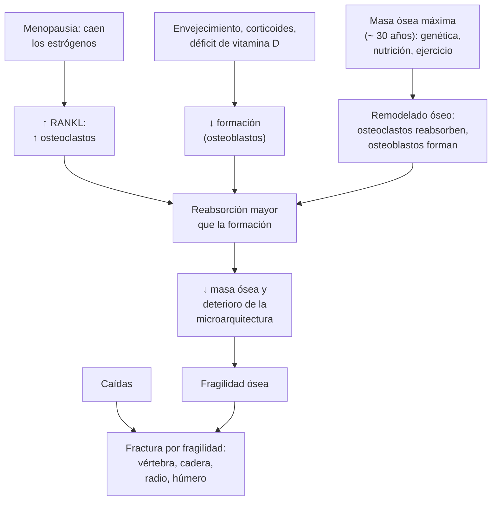

---
tags:
  - Endocrinología
  - Geriatría
  - Reumatología
---

# Osteoporosis primaria y secundaria

**Subespecialidad**
Endocrinología · Geriatría · Reumatología · Ginecología (climaterio)

**Guías principales**
NOGG 2024 (guía británica de prevención y tratamiento de la osteoporosis) · ACP 2023: tratamiento farmacológico · USPSTF 2025: tamizaje · BHOF 2022: guía clínica · Endocrine Society 2020: tratamiento en la mujer posmenopáusica · Consenso SOCHED 2018: uso de la densitometría ósea en Chile

**Otras fuentes**
Ensayo HORIZON (ácido zoledrónico tras una fractura de cadera, 2007) · FRAX con modelo chileno (Blümel 2025) · Fracturas de cadera en Chile 2012–2017 (Barahona 2026)

**GES**
No

**EUNACOM**
1.03.1.018, 1.07.1.015 y 1.11.1.017 Osteoporosis (específico, completo, completo) · 1.03.1.019 Osteoporosis secundaria (sospecha, inicial, derivar)

**Revisado**
Septiembre 2026

!!! abstract "Resumen en 60 segundos"
    - **Osteoporosis**: enfermedad **silenciosa** del esqueleto, con **baja masa ósea** y deterioro de la microarquitectura, que produce **fracturas por fragilidad** (caída de la propia altura). Su importancia está en las **fracturas**, no en el número de la densitometría.
    - **~ La mitad de las mujeres** y **1 de cada 5 hombres** mayores de 50 años tendrá una fractura osteoporótica (SOCHED 2018).
    - **Diagnóstico**:
        - **DXA** con un **T-score ≤ −2,5** en la columna o la cadera.
        - O una **fractura por fragilidad de cadera o vértebra**, sea cual sea la DXA.
    - **Tamizaje** con DXA: toda mujer de **≥ 65 años**, las posmenopáusicas menores con **factores de riesgo** (USPSTF 2025) y los hombres de **≥ 70 años** (BHOF 2022).
    - Decide el tratamiento por el **riesgo de fractura**: DXA, **FRAX** (tiene un modelo chileno), fracturas previas y caídas.
    - **Descarta causas secundarias** (sobre todo en hombres y en mujeres jóvenes): **corticoides**, hipogonadismo, hiperparatiroidismo, hipertiroidismo, **enfermedad celíaca**, déficit de vitamina D, **mieloma**, alcohol, ERC.
    - **Tratamiento de primera línea**: **bisfosfonatos**, como alendronato **70 mg VO semanal** o **ácido zoledrónico 5 mg EV anual** (de elección tras una fractura de cadera).
        - Además: **calcio** (≥ 700 mg/día, idealmente con la dieta), **vitamina D**, ejercicio y **prevención de caídas**.
        - Riesgo **muy alto** (fracturas vertebrales múltiples o recientes, T ≤ −3,5, corticoides en dosis altas): considerar un **anabólico** (teriparatida, romosozumab) y derivar.
    - **Denosumab**: **nunca suspenderlo sin transición** a un bisfosfonato, porque aparecen fracturas vertebrales múltiples por **rebote**.

## Definición

| Término | Definición |
|---|---|
| **Osteoporosis** | Enfermedad esquelética sistémica con **baja masa ósea** y **deterioro de la microarquitectura**, que aumenta la **fragilidad** y el riesgo de fractura (OMS, 1994) |
| **Diagnóstico densitométrico** (OMS) | **T-score ≤ −2,5** en la columna lumbar, el cuello femoral o la cadera total, en mujeres posmenopáusicas y hombres de ≥ 50 años |
| **Osteopenia** (baja masa ósea) | T-score entre **−1,0 y −2,5** |
| **Osteoporosis establecida** (grave) | T-score ≤ −2,5 **con** una o más fracturas por fragilidad |
| **Diagnóstico clínico** | **Fractura por fragilidad de cadera o vertebral**, aunque la DXA no muestre osteoporosis (BHOF 2022) |
| **Fractura por fragilidad** | Fractura por un trauma de **baja energía**: caída de la **propia altura** o menos |
| **Z-score** | Compara con personas de la **misma edad y sexo**. En las mujeres premenopáusicas y los hombres de < 50 años se usa el Z-score: **≤ −2,0** es "bajo lo esperado para la edad" y obliga a buscar una causa secundaria |
| **Osteoporosis secundaria** | Causada por una **enfermedad o un fármaco** identificable (corticoides, hipogonadismo, hiperparatiroidismo, etc.) |

## Epidemiología

### Mundial

- En el Reino Unido, el **21,8 % de las mujeres** y el **6,8 % de los hombres** de ≥ 50 años tiene un T-score ≤ −2,5 en el cuello femoral (NOGG 2024).
- **La mayoría de las fracturas por fragilidad ocurre en personas con un T-score sobre −2,5**. Por eso el riesgo se evalúa con **factores clínicos y FRAX**, no solo con la DXA.
- Las fracturas más frecuentes son las **vertebrales** (dos tercios no se diagnostican), de **cadera**, de **radio distal** y de **húmero proximal**.
- Un programa de **tamizaje con FRAX** en APS (seguido de DXA en las de riesgo intermedio o alto) redujo las fracturas de cadera en **28 %** en mujeres de 70–85 años (NOGG 2024).
- Tras una fractura, el riesgo de una nueva fractura es **máximo en los 2 años siguientes** ("riesgo inminente").

### Chile

!!! chile "Datos nacionales"
    - **Aproximadamente la mitad de las mujeres y 1 de cada 5 hombres** mayores de 50 años tendrá una fractura osteoporótica en su vida (consenso de la Sociedad Chilena de Endocrinología y Diabetes, SOCHED 2018).
    - **FRAX con el modelo chileno**:
        - Se usa un umbral de riesgo de fractura mayor a 10 años de **3,2 %** para indicar la DXA en las mujeres de 50–64 años.
        - En una serie chilena de 264 mujeres de 50–64 años, el FRAX **sin DXA** detectó **solo al 24 %** de las que tenían osteoporosis densitométrica (Blümel 2025). En las mujeres más jóvenes con factores de riesgo, la DXA sigue siendo necesaria.
    - **Fractura de cadera** (ver [fractura de cadera](../geriatria/caidas-hipotension-ortostatica-y-fractura-de-cadera.md)):
        - **5.200–6.200 casos al año** en mayores de 60 años.
        - **Mortalidad al año de ~ 25 %**; más del 20 % de los pacientes no se opera (Barahona 2026).
    - La osteoporosis **no tiene garantía GES**. La prevención de caídas y las ayudas técnicas para mayores de 65 años (**GES 36**) forman parte del manejo.

## Etiología y factores de riesgo

| Tipo | Causas |
|---|---|
| **Primaria posmenopáusica** | Caída de los **estrógenos**: pérdida ósea acelerada en los primeros 5–10 años tras la menopausia; predomina el hueso **trabecular** (vértebras, radio distal) |
| **Primaria senil** | Envejecimiento, en ambos sexos: menor formación ósea, déficit de vitamina D, sarcopenia; compromete también el hueso **cortical** (cadera) |
| **Secundaria: fármacos** | **Corticoides** (la causa secundaria más frecuente), **inhibidores de la aromatasa**, **terapia de deprivación androgénica**, anticonvulsivantes (fenitoína, carbamazepina), heparina a largo plazo, **exceso de levotiroxina**, IBP a largo plazo, tiazolidinedionas, inhibidores de la calcineurina |
| **Secundaria: endocrinas** | **Hipogonadismo** (menopausia precoz < 45 años, amenorrea, hipogonadismo masculino), **hiperparatiroidismo** primario, **hipertiroidismo**, **Cushing**, diabetes tipo 1 (y tipo 2), hiperprolactinemia |
| **Secundaria: digestivas y nutricionales** | **Enfermedad celíaca**, enfermedad inflamatoria intestinal, **cirugía bariátrica**, **déficit de vitamina D y calcio**, anorexia nerviosa, **daño hepático crónico**, **alcoholismo** |
| **Secundaria: otras** | **Artritis reumatoide**, **ERC** (enfermedad mineral ósea), **mieloma múltiple**, VIH, EPOC, inmovilización, trasplante |

**Factores de riesgo clínicos** (incluidos en el **FRAX**): **edad**, **sexo femenino**, **bajo peso** (IMC < 19), **fractura previa por fragilidad**, **fractura de cadera en los padres**, **tabaquismo** actual, **corticoides**, **artritis reumatoide**, **alcohol** ≥ 3 unidades/día, osteoporosis secundaria y DMO del cuello femoral.

**Otros factores**: **caídas** (el principal factor para la fractura de cadera; ver [caídas](../geriatria/caidas-hipotension-ortostatica-y-fractura-de-cadera.md)), sedentarismo, baja ingesta de calcio, diabetes, demencia, Parkinson.

## Fisiopatología

*Figura 1. Fisiopatología de la osteoporosis y de la fractura por fragilidad. Esquema propio.*

- El hueso se **remodela** toda la vida: los **osteoclastos** reabsorben y los **osteoblastos** forman. La **masa ósea máxima** se alcanza alrededor de los **30 años**.
- **Menopausia**: la falta de estrógenos aumenta el **RANKL**, que activa a los **osteoclastos**. La reabsorción supera la formación, con pérdida rápida de hueso **trabecular**.
- **Corticoides**: **inhiben a los osteoblastos** y aumentan la apoptosis de los osteocitos. La pérdida ósea y el riesgo de fractura aumentan en los **primeros 3–6 meses**, incluso con DMO no tan baja.
- **Mecanismo de los fármacos**:
    - **Antirresortivos**: los **bisfosfonatos** inhiben a los osteoclastos; el **denosumab** es un anticuerpo contra el RANKL; la terapia hormonal y el raloxifeno actúan sobre los receptores de estrógenos.
    - **Anabólicos**: la **teriparatida** y la abaloparatida (análogos de la PTH intermitente) estimulan a los osteoblastos. El **romosozumab** inhibe la esclerostina: forma hueso y además reduce la reabsorción.
- **La fractura necesita una caída** (salvo las vertebrales): por eso la prevención de caídas es parte del tratamiento.

## Clasificación

| Por la DXA (OMS) | T-score |
|---|---|
| Normal | ≥ −1,0 |
| **Osteopenia** | Entre −1,0 y −2,5 |
| **Osteoporosis** | **≤ −2,5** |
| **Osteoporosis establecida** | ≤ −2,5 **+ fractura por fragilidad** |

**Por la causa**: **primaria** (posmenopáusica, senil) o **secundaria**.

**Por el riesgo de fractura** (NOGG 2024, Figura 2): **bajo**, **intermedio**, **alto** y **muy alto**.

<figure markdown>
![Algoritmo de evaluación del riesgo de fractura. Desde los factores de riesgo clínicos se calcula la probabilidad de fractura a 10 años con el FRAX. Riesgo bajo: estilo de vida, calcio y vitamina D, y reevaluar si cambia el riesgo. Riesgo intermedio: medir la densidad mineral ósea con DXA y recalcular el FRAX, que reclasifica en bajo, alto (tratar) o muy alto (tratar y derivar). Riesgo alto: tratar y medir la densidad mineral ósea. Riesgo muy alto: tratar y derivar a un especialista. Un recuadro rojo enumera los criterios de riesgo muy alto: fractura vertebral reciente en los últimos 2 años, dos o más fracturas vertebrales, T-score de −3,5 o menos, corticoides de 7,5 mg o más de prednisona al día por 3 meses o más, varios factores de riesgo con una fractura reciente, o FRAX sobre el umbral de muy alto riesgo; en ellos se considera un anabólico primero. Un recuadro azul resume el tratamiento de primera línea: alendronato 70 mg o risedronato 35 mg semanal por 5 años o más y reevaluar, ácido zoledrónico 5 mg endovenoso anual por 3 años o más y reevaluar, de elección tras una fractura de cadera; alternativas como denosumab, terapia hormonal en menores de 60 años y raloxifeno; y calcio de al menos 700 mg al día y vitamina D de al menos 800 UI al día si hay déficit](../assets/figuras/osteoporosis/algoritmo-riesgo-fractura-nogg-2024.svg){ loading=lazy }
<figcaption>Figura 2. Evaluación del riesgo de fractura y conducta. Adaptado, traducido y ampliado de Gregson CL, Armstrong DJ, Avgerinou C, et al. The 2024 UK clinical guideline for the prevention and treatment of osteoporosis. <em>Arch Osteoporos.</em> 2025;20:119 (figura 3 y texto). Licencia <a href="https://creativecommons.org/licenses/by/4.0/">CC BY 4.0</a>.</figcaption>
</figure>

## Clínica

- **Asintomática** hasta que ocurre una **fractura**.
- **Fractura vertebral**:
    - **Dos tercios** son **asintomáticas** o se confunden con un lumbago.
    - Puede dar un dolor dorsal o lumbar **agudo** tras un esfuerzo mínimo (toser, levantar algo), que mejora en 4–6 semanas.
    - **Pérdida de estatura** (≥ 4 cm respecto de la de adulto joven o ≥ 2 cm medida en controles), **cifosis dorsal**, abdomen protuberante, disminución del espacio entre las costillas y la pelvis.
    - Si son múltiples: dolor crónico, restricción respiratoria, saciedad precoz.
- **Fractura de cadera**: caída, dolor inguinal e incapacidad de caminar (ver [fractura de cadera](../geriatria/caidas-hipotension-ortostatica-y-fractura-de-cadera.md)).
- **Fractura de radio distal** (de Colles): caída sobre la mano extendida; suele ser la **primera** fractura por fragilidad, a los 50–60 años, y es una **alerta** para evaluar la osteoporosis.
- **Fractura de húmero proximal**, pelvis y costillas.
- **Pistas de causa secundaria**: hombre joven, fractura con Z-score bajo, anemia, hipercalcemia, diarrea o baja de peso (celíaca), cushingoide, hipogonadismo (disminución de la libido, ginecomastia).

## Diagnóstico

!!! guia "¿A quién pedir una DXA? (USPSTF 2025; BHOF 2022; SOCHED 2018)"
    - **Mujeres de ≥ 65 años** (USPSTF, recomendación B).
    - **Mujeres posmenopáusicas de < 65 años** con **factores de riesgo** (FRAX, bajo peso, tabaco, alcohol, corticoides, fractura de cadera en los padres, menopausia precoz).
    - **Hombres de ≥ 70 años** y hombres de 50–69 años con factores de riesgo (BHOF). La USPSTF considera la evidencia **insuficiente** para el tamizaje en hombres.
    - **Toda persona ≥ 50 años con una fractura por fragilidad**.
    - Personas con **causas secundarias**: corticoides ≥ 3 meses, inhibidores de la aromatasa, deprivación androgénica, hiperparatiroidismo, artritis reumatoide, celíaca, cirugía bariátrica, etc.
    - **Para controlar** el tratamiento (habitualmente cada **2–3 años**).

- **FRAX**:
    - Calcula la **probabilidad a 10 años** de una fractura osteoporótica **mayor** (vertebral clínica, cadera, antebrazo, húmero) y de **cadera**, con o sin la DMO del cuello femoral.
    - Tiene un **modelo para Chile**.
    - **No considera** las caídas, la dosis de corticoides ni el número de fracturas vertebrales: hay que ajustarlo clínicamente.
- **Imagen de columna** (radiografía lateral dorsal y lumbar, o evaluación vertebral con la DXA) si hay **pérdida de estatura**, cifosis, dolor dorsal, uso de corticoides o un T-score muy bajo: una fractura vertebral **cambia el diagnóstico y el tratamiento**.
- **Toda fractura de cadera o vertebral por fragilidad** en una persona mayor es **osteoporosis** y justifica el tratamiento, **incluso sin DXA**.

## Laboratorio

Se piden antes de tratar, para buscar una **osteoporosis secundaria** y condiciones que contraindican algunos fármacos (NOGG 2024):

| Examen | Qué busca |
|---|---|
| **Calcio**, fósforo, **albúmina**, **fosfatasa alcalina** | Hiperparatiroidismo, **osteomalacia** (calcio y fósforo bajos, fosfatasa alcalina alta), Paget. **Corregir la hipocalcemia antes** de los bisfosfonatos EV y del denosumab |
| **Creatinina** (TFGe) | **ERC**: los bisfosfonatos se evitan con TFGe **< 30–35 mL/min** |
| **25-OH vitamina D** | Déficit (frecuente en adultos mayores, institucionalizados, obesos, malabsorción) |
| **PTH** | Si el calcio está alto o bajo, o la vitamina D está baja |
| **TSH** | Hipertiroidismo o **exceso de levotiroxina** |
| **Hemograma**, VHS o PCR, **electroforesis de proteínas** y cadenas livianas libres | **Mieloma** (sobre todo con fracturas **vertebrales**, anemia o hipercalcemia) |
| Pruebas hepáticas | Daño hepático crónico, alcohol |
| **Anticuerpos antitransglutaminasa** | **Enfermedad celíaca** |
| **Testosterona** (hombres), FSH y LH, prolactina | **Hipogonadismo** |
| **Calciuria de 24 h** | Hipercalciuria (litiasis), malabsorción |
| Cortisol libre urinario o test de supresión con dexametasona | **Cushing** si hay sospecha clínica |

## Imágenes

- **DXA** de **columna lumbar (L1–L4)** y **cadera** (cuello femoral y cadera total). Se usa el **T-score más bajo**. Se agrega el antebrazo (radio 33 %) si una zona no es evaluable o hay hiperparatiroidismo.
- **Trampas de la DXA**:
    - En los adultos mayores, los **osteofitos**, la **calcificación aórtica** y las fracturas vertebrales **aumentan falsamente** la DMO lumbar: la **cadera** es más confiable.
    - Comparar controles en el **mismo equipo**.
- **Radiografía lateral de columna** o evaluación vertebral con DXA (VFA) para detectar **fracturas vertebrales** silentes.
- **RM de columna** si la fractura vertebral es reciente, dudosa o se sospecha una **fractura patológica** (tumor, mieloma).
- **Radiografía de ambos fémures** si un usuario de bisfosfonatos o denosumab presenta **dolor en el muslo o la ingle** (fractura atípica).

## Diagnóstico diferencial

| Cuadro | Claves |
|---|---|
| **Osteomalacia** | Déficit de vitamina D, malabsorción: **dolor óseo**, debilidad proximal, **fosfatasa alcalina alta**, calcio y fósforo bajos, PTH alta; pseudofracturas (zonas de Looser) |
| **Mieloma múltiple** | Fracturas **vertebrales**, anemia, hipercalcemia, falla renal, VHS alta, **componente M** |
| **Metástasis óseas** | Cáncer conocido (mama, próstata, pulmón, riñón, tiroides), dolor nocturno, fractura con trauma mínimo |
| **Hiperparatiroidismo primario** | **Hipercalcemia** con PTH alta o normal alta; predomina la pérdida **cortical** (radio) |
| **Enfermedad mineral ósea de la ERC** | TFGe < 30, fósforo y PTH altos; requiere nefrología (los bisfosfonatos pueden estar contraindicados) |
| **Enfermedad de Paget** | Fosfatasa alcalina **muy alta** con calcio normal, dolor y deformidad ósea |

## Tratamiento

### Medidas generales (todos)

- **Calcio**: **≥ 700 mg/día**, idealmente con la **dieta** (lácteos: ~ 300 mg por taza de leche o yogur). Suplementar solo si la dieta no alcanza.
- **Vitamina D**: **≥ 800 UI/día** si hay déficit o riesgo de déficit (adultos mayores, institucionalizados, poca exposición al sol, obesidad, malabsorción). Corregir el déficit **antes** de los bisfosfonatos EV y del denosumab.
- **Ejercicio**: con **carga** (caminar) y de **fuerza**, más **equilibrio** para prevenir las caídas.
- **Prevención de caídas**: revisar los fármacos, la visión y el hogar (ver [caídas](../geriatria/caidas-hipotension-ortostatica-y-fractura-de-cadera.md)).
- **Dejar de fumar**, evitar el alcohol en exceso (≥ 3 unidades al día es un factor de riesgo del FRAX), proteínas adecuadas, evitar el bajo peso.
- Revisar los **fármacos** que dañan el hueso: la dosis de corticoides y de levotiroxina, los IBP innecesarios.

### ¿A quién tratar?

- **Fractura de cadera o vertebral por fragilidad** (osteoporosis clínica).
- **T-score ≤ −2,5** en la columna o la cadera.
- **Osteopenia con riesgo alto** según el **FRAX**.
- Corticoides en **dosis altas** (≥ 7,5 mg/día de prednisona por ≥ 3 meses): son de **riesgo muy alto** (NOGG); iniciar un bisfosfonato sin esperar la DXA si hay demora.

### Fármacos

!!! dosis "Tratamiento farmacológico de la osteoporosis"
    | Fármaco | Dosis | Comentarios |
    |---|---|---|
    | **Alendronato** | **70 mg VO una vez a la semana** | **Primera línea** (ACP 2023, NOGG 2024). Reduce las fracturas **vertebrales, no vertebrales y de cadera** |
    | **Risedronato** | **35 mg VO semanal** (o 150 mg mensual) | Primera línea, como el alendronato |
    | **Ibandronato** | 150 mg VO mensual o 3 mg EV cada 3 meses | Sin evidencia de reducción de fractura de cadera |
    | **Ácido zoledrónico** | **5 mg EV una vez al año** (infusión en ≥ 15 min) | Primera línea; **de elección tras una fractura de cadera** (reduce las nuevas fracturas y la mortalidad; HORIZON). Útil si hay intolerancia oral o mala adherencia. **Reacción de fase aguda** (fiebre, mialgias) en los primeros días de la primera dosis |
    | **Denosumab** | **60 mg SC cada 6 meses** | Segunda línea si hay contraindicación o intolerancia a los bisfosfonatos (ACP 2023). Se puede usar en la **ERC**, con riesgo de **hipocalcemia**. **No suspender sin transición**: al retirarlo hay un **rebote** con **fracturas vertebrales múltiples**. Pasar a ácido zoledrónico **6 meses** después de la última dosis |
    | **Teriparatida** | **20 µg SC diarios por 24 meses** (una vez en la vida) | **Anabólico**. Riesgo **muy alto** (fracturas vertebrales múltiples). Después, **siempre** un antirresortivo |
    | **Romosozumab** | **210 mg SC mensual por 12 meses** | Anabólico y antirresortivo, para las mujeres de riesgo **muy alto** (ACP 2023). **Evitar** si hubo un **IAM o un ACV en el último año**. Después, un antirresortivo |
    | **Terapia hormonal de la menopausia** | Estrógenos (con progestágeno si tiene útero) | **Primera línea** en las mujeres **≤ 60 años** con riesgo alto de fractura y **bajo riesgo** de cáncer de mama y trombosis (NOGG 2024) |
    | **Raloxifeno** | 60 mg VO diarios | Reduce las fracturas **vertebrales** (no las de cadera) y el cáncer de mama. Aumenta la **trombosis venosa** y los bochornos |

!!! perla "Cómo tomar el alendronato (y por qué importa)"
    - **En ayunas**, con un **vaso lleno de agua** (no leche, café ni jugo), **de pie o sentado** por **30 minutos**, y sin comer ni tomar otros medicamentos en ese tiempo.
    - Si no se cumple, **no se absorbe** (menos del 1 % en el mejor caso) o produce **esofagitis** (ver [disfagia](../gastroenterologia/disfagia-y-afagia-aguda.md)).
    - **Contraindicado** si hay trastornos esofágicos (acalasia, estenosis), incapacidad de estar erguido 30 minutos, **hipocalcemia** o TFGe **< 30–35 mL/min**.

### Duración y control del tratamiento (NOGG 2024)

- **Bisfosfonatos orales**: **≥ 5 años** y luego reevaluar el riesgo con FRAX y DXA. Mantenerlos **≥ 10 años** si:
    - Tenía **≥ 70 años** al iniciarlos.
    - Tuvo una fractura de **cadera** o **vertebral**.
    - Usa **corticoides** ≥ 7,5 mg/día.
    - Tuvo una **fractura durante el tratamiento**.
- **Ácido zoledrónico**: **≥ 3 años** y reevaluar; **≥ 6 años** en los mismos grupos.
- **Pausa terapéutica**: si el riesgo bajó, se puede suspender el bisfosfonato y **reevaluar** con FRAX a los 2 años con el alendronato, a los 18 meses con el risedronato y a los 3 años con el ácido zoledrónico. **Reiniciar** si ocurre una fractura.
- **Denosumab**: tratamiento a largo plazo o transición planificada a un bisfosfonato. Nunca suspenderlo sin más.
- **Anabólicos**: siempre seguidos de un **antirresortivo**.
- **Control**: adherencia (es baja con los bisfosfonatos orales), efectos adversos, calcio y vitamina D, y **DXA cada 2–3 años**. Una **fractura durante el tratamiento** obliga a revisar la adherencia y las causas secundarias, y a considerar un cambio de fármaco.

### Osteoporosis secundaria (sospechar, iniciar y derivar)

- **Tratar la causa**: reducir los corticoides, reemplazar la testosterona o los estrógenos en el hipogonadismo, operar un hiperparatiroidismo, dieta sin gluten en la celíaca, corregir la vitamina D.
- **Osteoporosis por corticoides**:
    - A todo paciente que usará corticoides por **≥ 3 meses**: calcio, vitamina D, la **menor dosis** posible y evaluación del riesgo (FRAX ajustado por la dosis).
    - Con **≥ 7,5 mg/día**: **bisfosfonato** desde el inicio.
- **Derivar** a endocrinología o reumatología:
    - **Hombres** y **mujeres premenopáusicas** con osteoporosis.
    - **Z-score ≤ −2,0**.
    - Fracturas pese al tratamiento.
    - Sospecha de hiperparatiroidismo, Cushing, mieloma o celíaca.
    - **ERC** avanzada.
    - Riesgo **muy alto** (candidatos a anabólicos).

## Complicaciones

- **De la enfermedad**:
    - **Fracturas**: la de cadera tiene una mortalidad de ~ 25 % al año en Chile.
    - Las **vertebrales** dan dolor crónico, cifosis, pérdida de estatura y restricción respiratoria.
    - Pérdida de la independencia, institucionalización, **nuevas fracturas** (cascada fracturaria).
- **De los fármacos**:
    - **Esofagitis** y dispepsia (bisfosfonatos orales).
    - **Reacción de fase aguda** (ácido zoledrónico).
    - **Hipocalcemia** (denosumab, zoledrónico con déficit de vitamina D).
    - **Osteonecrosis de los maxilares**: **muy rara** con las dosis de osteoporosis. Es más frecuente tras una extracción dental; hacer una **revisión dental** antes de iniciar si hay mala salud oral.
    - **Fractura atípica de fémur**: rara, aumenta con la **duración** del tratamiento. Da **dolor en el muslo o la ingle** por semanas antes de la fractura.
    - **Fracturas vertebrales por rebote** al suspender el denosumab.
    - **Trombosis venosa** (raloxifeno, terapia hormonal).

## Pronóstico y seguimiento

- El alendronato, el risedronato, el ácido zoledrónico y el denosumab reducen las fracturas **vertebrales, no vertebrales y de cadera** cuando se toman bien (NOGG 2024). Tras una fractura de cadera, el ácido zoledrónico además redujo la **mortalidad** (HORIZON 2007).
- El principal problema es la **brecha de tratamiento**: la mayoría de los pacientes con una fractura por fragilidad **no recibe tratamiento** para la osteoporosis. Los **servicios de coordinación de fracturas** (Fracture Liaison Services) reducen las nuevas fracturas y mejoran la sobrevida (NOGG 2024).
- **Seguimiento**:
    - Control **anual** de la adherencia, las caídas y la estatura.
    - DXA cada **2–3 años**.
    - Reevaluar la duración del tratamiento a los **3–5 años**.
    - Calcio, vitamina D y creatinina según el fármaco.

## Perlas para el internado

!!! perla "Para la sala y el turno"
    - **Toda fractura por fragilidad es una oportunidad**: deja indicado el estudio y el tratamiento de la osteoporosis al alta (muñeca, vértebra, cadera, húmero).
    - Tras una **fractura de cadera**: **ácido zoledrónico 5 mg EV** (con la vitamina D corregida), o alendronato.
    - Un **"lumbago" agudo** en una mujer mayor o en un usuario de corticoides puede ser una **fractura vertebral**: pide una radiografía lateral.
    - Paciente con **corticoides** por más de 3 meses: calcio, vitamina D y un **bisfosfonato** si la dosis es ≥ 7,5 mg/día.
    - **Hombre con osteoporosis**: busca **hipogonadismo**, alcohol, corticoides y **mieloma**.
    - **Fractura vertebral con anemia o hipercalcemia**: electroforesis de proteínas (**mieloma**) antes de etiquetarla como osteoporótica.
    - Explica bien cómo tomar el **alendronato**: en ayunas, con agua y erguido 30 minutos.
    - **Denosumab**: nunca "se suspende y ya". Planifica la transición a un bisfosfonato.
    - **Dolor en el muslo** en un usuario de bisfosfonatos por años: radiografía de ambos fémures (**fractura atípica**).

## Preguntas de repaso

??? repaso "1. Mujer de 62 años que se fracturó el radio distal al caer de su altura. Menopausia a los 48 años, fumadora, IMC 20. ¿Qué haces además de tratar la fractura?"
    La fractura de **radio distal por fragilidad** es una **alerta** de osteoporosis y de riesgo de nuevas fracturas.

    - **DXA** de columna y cadera, y **FRAX** (modelo chileno).
    - Exámenes para las **causas secundarias**: calcio, fósforo, fosfatasa alcalina, creatinina, 25-OH vitamina D, TSH, hemograma, pruebas hepáticas (y PTH si el calcio está alterado).
    - Radiografía lateral de columna si hay dolor dorsal o pérdida de estatura.
    - **Tratamiento** si el T-score es ≤ −2,5 o el riesgo FRAX es alto: **alendronato 70 mg semanal**. Además calcio, vitamina D, ejercicio, **dejar de fumar** y prevención de caídas.

??? repaso "2. Mujer de 70 años con una DXA que muestra un T-score de −2,7 en la columna lumbar y −2,1 en el cuello femoral. Sin fracturas. Exámenes normales. ¿Diagnóstico y tratamiento?"
    **Osteoporosis densitométrica**: se usa el **T-score más bajo** (−2,7 en la columna).

    - **Alendronato 70 mg VO semanal**: en ayunas, con un vaso de agua, erguida 30 minutos.
    - **Calcio** en la dieta (≥ 700 mg/día) y **vitamina D** si hay déficit o riesgo.
    - Ejercicio con carga y de equilibrio; prevención de caídas.
    - Control de la adherencia; **DXA en 2–3 años**; reevaluar a los **5 años**. Como inició a los 70 años, probablemente necesite **≥ 10 años** (NOGG).

??? repaso "3. Hombre de 58 años con dolor dorsal agudo tras levantar una caja. La radiografía muestra una fractura por aplastamiento de T12. DXA: T-score de −3,1 y Z-score de −2,4. ¿Qué buscas?"
    **Osteoporosis en un hombre joven con Z-score bajo**: hay que buscar una **causa secundaria**.

    - **Testosterona** (hipogonadismo), **alcohol**, **corticoides** (incluidos inhalados en dosis altas o infiltraciones repetidas).
    - **Electroforesis de proteínas** y cadenas livianas (**mieloma**, por la fractura vertebral), hemograma, VHS.
    - Calcio, PTH, 25-OH vitamina D, **TSH**, creatinina, pruebas hepáticas, **anticuerpos antitransglutaminasa** (celíaca), calciuria de 24 h.
    - Analgesia y movilización. Tratar la causa y **bisfosfonato**. **Derivar** a endocrinología.

??? repaso "4. Mujer de 72 años con polimialgia reumática, que usa prednisona 15 mg/día hace 1 mes y la usará por lo menos 1 año. ¿Qué indicas para el hueso?"
    **Prevención de la osteoporosis por corticoides**: con **≥ 7,5 mg/día por ≥ 3 meses** tiene un riesgo **muy alto** de fractura (NOGG), y la pérdida ósea es rápida en los primeros meses.

    - **Bisfosfonato desde ya**: alendronato 70 mg semanal, o ácido zoledrónico si no tolera la vía oral. No esperar la DXA.
    - **Calcio** y **vitamina D**.
    - **Menor dosis de corticoide** posible y disminución gradual.
    - Prevención de caídas (la miopatía por corticoides y la edad aumentan el riesgo).
    - DXA basal y radiografía lateral de columna.

??? repaso "5. Mujer de 75 años que recibe denosumab hace 5 años. Quiere suspenderlo porque "ya está bien". ¿Qué le explicas?"
    **No debe suspender el denosumab sin transición**: al retirarlo, la reabsorción ósea aumenta bruscamente (**rebote**), con riesgo de **fracturas vertebrales múltiples** en los meses siguientes.

    - Si se decide suspender, dar **ácido zoledrónico 5 mg EV** unos **6 meses** después de la última dosis de denosumab. Controlar con marcadores de remodelado o DXA; puede necesitar una segunda dosis (NOGG 2024).
    - Alternativa: continuar el denosumab a largo plazo.
    - Mantener el calcio, la vitamina D y la prevención de caídas.

??? repaso "6. Mujer de 76 años que toma alendronato hace 7 años. Consulta por dolor en el muslo derecho desde hace 1 mes, que empeora al caminar. ¿Qué sospechas y qué haces?"
    **Fractura atípica de fémur** en curso: dolor en el **muslo o la ingle** en una usuaria de bisfosfonatos por años.

    - **Radiografía de ambos fémures** (engrosamiento cortical lateral o una línea de fractura transversal en la diáfisis). Si es normal y la sospecha persiste: RM o cintigrafía.
    - **Suspender el alendronato**; descarga con bastón o muletas, y evaluación por **traumatología** (puede requerir un clavo endomedular profiláctico).
    - Estudiar el **fémur contralateral** (con frecuencia es bilateral).
    - Reevaluar el tratamiento de la osteoporosis con un especialista (por ejemplo, un anabólico).

## Referencias

1. Gregson CL, Armstrong DJ, Avgerinou C, et al. The 2024 UK clinical guideline for the prevention and treatment of osteoporosis. *Arch Osteoporos.* 2025;20:119. doi:[10.1007/s11657-025-01588-3](https://doi.org/10.1007/s11657-025-01588-3)
2. Qaseem A, Hicks LA, Etxeandia-Ikobaltzeta I, et al. Pharmacologic treatment of primary osteoporosis or low bone mass to prevent fractures in adults: a living clinical guideline from the American College of Physicians. *Ann Intern Med.* 2023;176:224–238. doi:[10.7326/M22-1034](https://doi.org/10.7326/M22-1034)
3. US Preventive Services Task Force, Nicholson WK, Silverstein M, et al. Screening for osteoporosis to prevent fractures: US Preventive Services Task Force recommendation statement. *JAMA.* 2025;333:498–508. doi:[10.1001/jama.2024.27154](https://doi.org/10.1001/jama.2024.27154)
4. LeBoff MS, Greenspan SL, Insogna KL, et al. The clinician's guide to prevention and treatment of osteoporosis. *Osteoporos Int.* 2022;33:2049–2102. doi:[10.1007/s00198-021-05900-y](https://doi.org/10.1007/s00198-021-05900-y)
5. Shoback D, Rosen CJ, Black DM, et al. Pharmacological management of osteoporosis in postmenopausal women: an Endocrine Society guideline update. *J Clin Endocrinol Metab.* 2020;105:dgaa048. doi:[10.1210/clinem/dgaa048](https://doi.org/10.1210/clinem/dgaa048)
6. Barberán M, Campusano C, Trincado P, et al. [Guidelines of the Chilean Endocrinology Society for the correct clinical use of bone densitometry] (artículo en español). *Rev Med Chil.* 2018;146:1471–1480. doi:[10.4067/s0034-98872018001201471](https://doi.org/10.4067/s0034-98872018001201471)
7. Blumel B, Maluenda A, Bahamondes F, Veloso MP, Ortiz JA, Rojas I. [Evaluation of the FRAX tool for identifying menopausal women under 65 eligible for bone densitometry screening] (artículo en español). *Rev Med Chil.* 2025;153:485–491. doi:[10.4067/s0034-98872025000700485](https://doi.org/10.4067/s0034-98872025000700485)
8. Lyles KW, Colón-Emeric CS, Magaziner JS, et al. Zoledronic acid and clinical fractures and mortality after hip fracture. *N Engl J Med.* 2007;357:1799–1809. doi:[10.1056/NEJMoa074941](https://doi.org/10.1056/NEJMoa074941)
9. Barahona M, Matus O, Mondschein S. Disparities in survival after hip fractures in Chile in patients above 60 years: the impact of the operating room management. *Front Health Serv.* 2026;6:1554376. doi:[10.3389/frhs.2026.1554376](https://doi.org/10.3389/frhs.2026.1554376)
