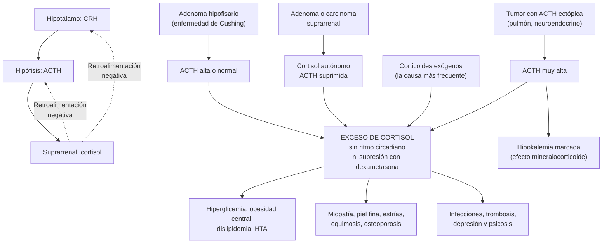
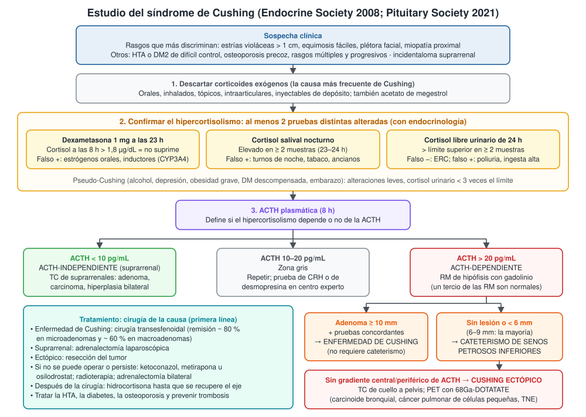
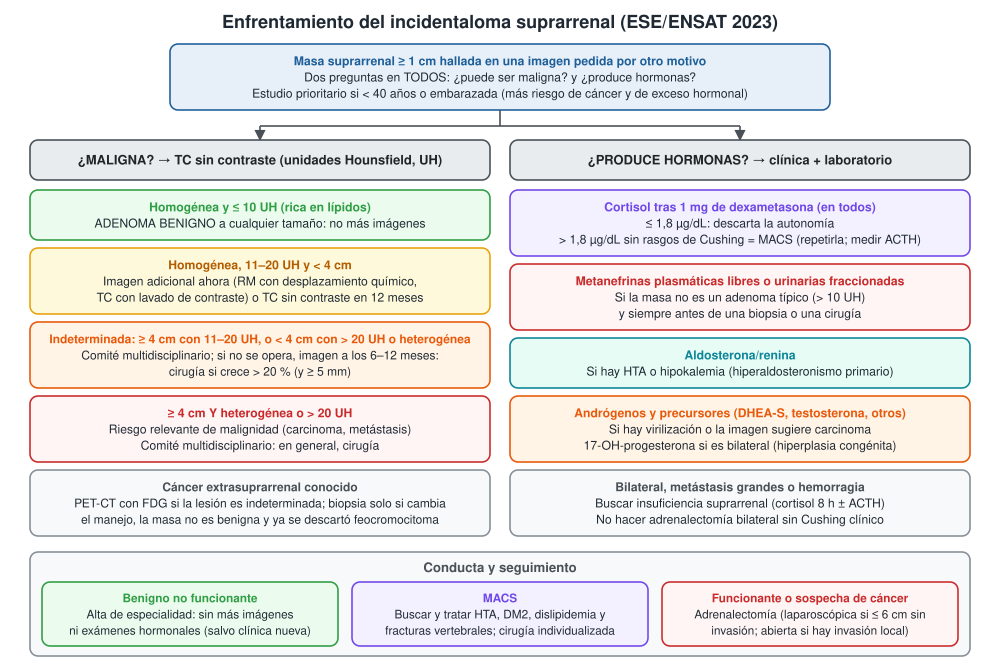
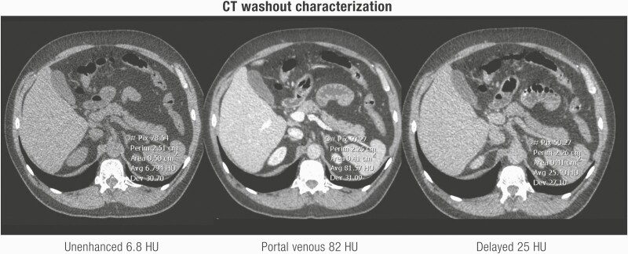
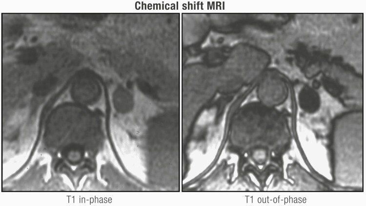

---
tags:
  - Endocrinología
  - Frecuente en sala
---

# Síndrome de Cushing e incidentaloma suprarrenal

**Subespecialidad**
Endocrinología · Medicina interna · Cirugía endocrina · Neurocirugía

**Guías principales**
Endocrine Society 2008: diagnóstico del síndrome de Cushing · Endocrine Society 2015: tratamiento del síndrome de Cushing · Pituitary Society 2021: consenso sobre la enfermedad de Cushing · ESE/ENSAT 2023: incidentaloma suprarrenal · Endocrine Society 2025: hiperaldosteronismo primario · Endocrine Society 2014: feocromocitoma y paraganglioma

**Otras fuentes**
Seminario del síndrome de Cushing (*Lancet* 2023) · Revisión del incidentaloma suprarrenal (*Endocr Rev* 2020) · Metaanálisis de mortalidad (2022) · CATALYST (hipercortisolismo en la DM2 de difícil control, 2025) · Datos chilenos de hiperaldosteronismo primario (Fardella 2000; Mosso 2003) y de incidentaloma (Araya, *Rev Med Clin Condes* 2025)

**GES**
No

**EUNACOM**
1.03.1.006 Síndrome de Cushing (sospecha, inicial, derivar) · 1.03.1.022 Incidentaloma suprarrenal (específico, inicial, derivar)

**Revisado**
Octubre 2026

!!! abstract "Resumen en 60 segundos"
    - **Síndrome de Cushing (SC)**: manifestaciones del **exceso crónico de glucocorticoides**.
        - La causa más frecuente es **exógena**: corticoides orales, inhalados, tópicos o inyectados. Preguntar siempre antes de pedir exámenes.
        - El SC endógeno es raro (**~ 3 casos por millón al año**). Su causa más frecuente es la **enfermedad de Cushing** (adenoma hipofisario productor de ACTH). Le siguen el **Cushing ectópico** (tumores neuroendocrinos, cáncer pulmonar) y el **suprarrenal** (adenoma, carcinoma).
    - **Rasgos que más discriminan**: **estrías violáceas > 1 cm**, **equimosis fáciles**, **plétora facial** y **miopatía proximal**. Obesidad, HTA o DM2 aisladas **no** justifican el estudio.
    - **Diagnóstico en 3 pasos**:
        1. Descartar los corticoides exógenos.
        2. Confirmar el hipercortisolismo con **≥ 2 pruebas** alteradas: cortisol tras **1 mg de dexametasona > 1,8 µg/dL**, **cortisol salival nocturno** alto o **cortisol libre urinario** de 24 h alto.
        3. **ACTH**: **< 10 pg/mL** → suprarrenal (TC); **> 20 pg/mL** → hipófisis o ectópico (RM de hipófisis y, a veces, cateterismo de senos petrosos).
    - **Tratamiento**: **cirugía de la causa** (transesfenoidal, adrenalectomía o resección del tumor ectópico). Si no es posible, **ketoconazol**, **metirapona** u **osilodrostat**. Después, **hidrocortisona** hasta que se recupere el eje.
    - **Incidentaloma suprarrenal**: masa **≥ 1 cm** hallada en una imagen pedida por otro motivo (**~ 2 %** de los adultos; **> 7 %** sobre los 70 años). Siempre dos preguntas:
        - **¿Es maligna?** **TC sin contraste**: homogénea y **≤ 10 UH** = adenoma benigno, sin más imágenes. **≥ 4 cm** y heterogénea o **> 20 UH** = riesgo de cáncer.
        - **¿Produce hormonas?** **Dexametasona 1 mg** en todos; **metanefrinas** si no es un adenoma típico; **aldosterona/renina** si hay HTA o hipokalemia.
    - **MACS** (secreción autónoma leve de cortisol): cortisol tras dexametasona **> 1,8 µg/dL** sin rasgos de Cushing. No evoluciona a Cushing, pero se asocia a **HTA, DM2, fracturas y mortalidad**: tratar las comorbilidades y discutir la cirugía.

## Definición

- **Síndrome de Cushing**: conjunto de signos y síntomas causados por la **exposición crónica a un exceso de glucocorticoides**.
    - **Exógeno** (iatrogénico): por corticoides administrados. Es la causa más frecuente.
    - **Endógeno**: por producción excesiva de cortisol. Puede ser **dependiente de ACTH** (hipófisis o tumor ectópico) o **independiente de ACTH** (suprarrenal).
- **Enfermedad de Cushing**: SC causado por un **adenoma hipofisario corticotropo** que secreta ACTH. Es la causa más frecuente del SC endógeno.
- **Pseudo-Cushing**: hipercortisolismo **leve y funcional** que desaparece al tratar la causa (alcoholismo, depresión, obesidad grave, diabetes descompensada, embarazo).
- **Incidentaloma suprarrenal**: masa suprarrenal hallada en una imagen hecha por un motivo **distinto** de la sospecha de enfermedad suprarrenal. El estudio se justifica si mide **≥ 1 cm** (ESE/ENSAT 2023).
- **Secreción autónoma leve de cortisol (MACS)**: cortisol plasmático **> 1,8 µg/dL (> 50 nmol/L)** tras 1 mg de dexametasona, en un paciente con incidentaloma y **sin signos clínicos** de Cushing. Reemplaza a los antiguos términos "Cushing subclínico" y "secreción autónoma posible".

## Epidemiología

### Mundial

- **Síndrome de Cushing endógeno**:
    - Incidencia de **3,2 casos por millón de habitantes al año** en una cohorte sueca de 2002–2017 (Wengander 2019).
    - En esa serie: **enfermedad de Cushing 48 %**, **ectópico 26 %**, adenoma suprarrenal 21 % y carcinoma suprarrenal 6 %. El ectópico fue más frecuente que en series antiguas.
    - La enfermedad de Cushing predomina en **mujeres** en edad fértil. El ectópico es más frecuente en **hombres** mayores.
    - **Mortalidad**: razón de mortalidad estandarizada de **3,0** (IC 95 % 2,3–3,9) en un metaanálisis de 2022. Causas de muerte: **aterosclerosis y tromboembolismo (43 %)**, infecciones (13 %), cáncer (11 %), suicidio (2 %).
- **Hipercortisolismo en la DM2 de difícil control** (CATALYST 2025): **23,8 %** de 1.057 pacientes con HbA1c 7,5–11,5 % y ≥ 2 fármacos **no suprimió** el cortisol tras 1 mg de dexametasona. El estudio lo financió un laboratorio que desarrolla un fármaco para esta indicación; la mayoría serían formas leves, no un Cushing clínico.
- **Incidentaloma suprarrenal** (Sherlock 2020):
    - **~ 2 %** de la población general y **> 7 %** de los mayores de **70 años**. Es raro antes de los **40 años**.
    - Va en aumento porque se piden más TC.
- **Causas de incidentaloma** (ESE/ENSAT 2023):

| Causa | Frecuencia aproximada |
|---|---|
| **Adenoma no funcionante** | **40–70 %** |
| **Adenoma con MACS** | **20–50 %** |
| Hiperaldosteronismo primario | 2–5 % |
| Síndrome de Cushing clínico | 1–4 % |
| **Feocromocitoma** | 1–5 % |
| **Carcinoma suprarrenal** | 0,4–4 % |
| Otras masas malignas (sobre todo **metástasis**) | 3–7 % |

### Chile

!!! chile "Datos nacionales"
    - **Incidentaloma suprarrenal**: en TC de abdomen y tórax de un centro universitario de Santiago, la frecuencia fue **1,8 %**, con una edad promedio de **64 años** (citado en Araya 2025).
    - **Hiperaldosteronismo primario**: los estudios chilenos fueron pioneros en mostrar que es **frecuente y normokalémico**.
        - Fardella 2000: **9,5 %** de 305 hipertensos esenciales; **todos** tenían el potasio normal.
        - Mosso 2003: **6,1 %** de 609 hipertensos. La frecuencia subió con la gravedad de la HTA: **2 %** en etapa 1, **8 %** en etapa 2 y **13 %** en etapa 3. Solo 1 de 37 tenía hipokalemia.
    - El **síndrome de Cushing** y el incidentaloma **no son GES**. Se estudian y tratan en endocrinología del nivel secundario o terciario. La enfermedad de Cushing se opera en centros de neurocirugía con experiencia.
    - La **HTA** y la **DM2**, comorbilidades frecuentes de ambos cuadros, sí son GES.

## Etiología y factores de riesgo

| Grupo | Causas |
|---|---|
| **Exógeno** (el más frecuente) | Prednisona, dexametasona, hidrocortisona; **inhalados o nasales** en dosis altas, sobre todo con **ritonavir** o **itraconazol** (inhiben su metabolismo); **tópicos** potentes en grandes superficies; **infiltraciones** articulares o de depósito; acetato de megestrol |
| **Endógeno dependiente de ACTH** | **Enfermedad de Cushing** (adenoma hipofisario, casi siempre microadenoma < 1 cm) · **ACTH ectópica**: carcinoide bronquial, **cáncer pulmonar de células pequeñas**, tumores neuroendocrinos de páncreas o timo, carcinoma medular de tiroides, feocromocitoma · CRH ectópica (excepcional) |
| **Endógeno independiente de ACTH** | **Adenoma suprarrenal** · **Carcinoma suprarrenal** · Hiperplasia macronodular bilateral · Enfermedad nodular pigmentada primaria (complejo de Carney) · Síndrome de McCune-Albright |
| **Pseudo-Cushing** | **Alcoholismo**, **depresión** mayor, obesidad grave, DM2 descompensada, embarazo, estrés físico intenso |

- **Incidentaloma**: la frecuencia aumenta con la edad. Antes de los 40 años y en el embarazo, una masa suprarrenal tiene más probabilidad de ser **maligna o funcionante**.

## Fisiopatología

- **Eje normal**: el hipotálamo secreta **CRH** → la hipófisis secreta **ACTH** → la corteza suprarrenal (zona fasciculada) secreta **cortisol**. El cortisol frena la CRH y la ACTH (**retroalimentación negativa**). El cortisol tiene un **ritmo circadiano**: máximo al despertar y mínimo a medianoche.
- **En el síndrome de Cushing se pierden**:
    - El **ritmo circadiano**: el cortisol de medianoche sigue alto → por eso sirve el **cortisol salival nocturno**.
    - La **retroalimentación**: la dexametasona no frena el cortisol → por eso sirve la **prueba de supresión**.
- **Según el origen**:
    - **Hipófisis**: el adenoma es parcialmente resistente a la retroalimentación; la ACTH es normal o algo alta.
    - **Ectópico**: el tumor secreta ACTH sin control; la ACTH y el cortisol suelen ser **muy altos**.
    - **Suprarrenal**: el tumor produce cortisol de forma autónoma; la **ACTH está suprimida** y la suprarrenal contralateral se **atrofia** → **insuficiencia suprarrenal** tras la cirugía.
- **Efectos del exceso de cortisol**:
    - **Metabólicos**: gluconeogénesis y resistencia a la insulina → **hiperglicemia**; redistribución de la grasa (**central**, dorsocervical, supraclavicular, facial).
    - **Catabolismo proteico**: **miopatía proximal**, piel fina, **estrías**, **equimosis**, **osteoporosis**, mala cicatrización.
    - **Efecto mineralocorticoide**: cuando el cortisol es muy alto satura la enzima que lo inactiva en el riñón (11β-HSD2) → **hipokalemia** y HTA (típico del ectópico).
    - **Inmunosupresión** → infecciones (incluso oportunistas). **Hipercoagulabilidad** → **tromboembolismo venoso**.
    - **Sistema nervioso**: depresión, insomnio, ansiedad, psicosis, deterioro cognitivo.
    - **Gónadas**: supresión del eje gonadal (oligomenorrea, disminución de la libido). Si hay exceso de **andrógenos** (dependiente de ACTH o carcinoma): hirsutismo, acné, virilización.

*Figura 1. Eje hipotálamo-hipófisis-suprarrenal y mecanismos del síndrome de Cushing. Esquema propio basado en Gadelha 2023 y el consenso de la Pituitary Society 2021.*

## Clasificación

**Síndrome de Cushing según su origen**

| Tipo | Frecuencia (SC endógeno) | ACTH | Claves |
|---|---|---|---|
| **Enfermedad de Cushing** (hipófisis) | **La más frecuente** (~ 50–70 %) | Normal o alta | Mujer joven, evolución lenta, microadenoma |
| **ACTH ectópica** | ~ 10–25 % | **Muy alta** | Hombre mayor, fumador; evolución **rápida**, **hipokalemia** marcada, baja de peso, hiperpigmentación, a veces sin el fenotipo clásico |
| **Adenoma suprarrenal** | ~ 20 % | **Suprimida** | Cushing "puro" (sin andrógenos); masa en la TC |
| **Carcinoma suprarrenal** | < 10 % | **Suprimida** | Masa grande (> 4–6 cm), evolución rápida, **virilización** (andrógenos) |

**Incidentaloma suprarrenal según la imagen (ESE/ENSAT 2023)**

| Categoría | Hallazgo en la TC sin contraste | Conducta en la imagen |
|---|---|---|
| **Benigna** | **Homogénea y ≤ 10 UH** (cualquier tamaño) | **No más imágenes** |
| **Probablemente benigna** | Homogénea, **11–20 UH** y **< 4 cm** | Imagen adicional ahora (RM, TC con lavado) o TC sin contraste en **12 meses** |
| **Indeterminada** | ≥ 4 cm con 11–20 UH; o < 4 cm con > 20 UH o heterogénea | **Comité multidisciplinario**; si no se opera, imagen en **6–12 meses** |
| **Sospechosa de malignidad** | **≥ 4 cm** y **heterogénea o > 20 UH** | Comité; **cirugía** en general |

**Incidentaloma según su función**: no funcionante · MACS · Cushing clínico · hiperaldosteronismo primario (aldosteronoma) · feocromocitoma · carcinoma productor de andrógenos u otros esteroides.

## Clínica

**Síndrome de Cushing**

| Dominio | Hallazgos |
|---|---|
| **Más discriminantes** (Endocrine Society 2008) | **Estrías violáceas anchas (> 1 cm)** en abdomen, flancos, mamas y muslos · **equimosis** sin trauma · **plétora facial** · **debilidad muscular proximal** (no puede pararse de la silla sin ayuda) |
| **Grasa** | Aumento de peso con obesidad **central** y extremidades delgadas · **cara de luna llena** · giba dorsocervical · relleno de las fosas supraclaviculares |
| **Piel** | Piel **fina**, acné, hirsutismo, infecciones fúngicas, mala cicatrización; **hiperpigmentación** en el ectópico (ACTH muy alta) |
| **Cardiometabólico** | **HTA**, **DM2** o intolerancia a la glucosa, dislipidemia, edema |
| **Hueso** | **Osteoporosis**, fracturas **vertebrales** por fragilidad, litiasis renal |
| **Neuropsiquiátrico** | **Depresión**, irritabilidad, insomnio, ansiedad, psicosis, alteraciones de la memoria |
| **Gonadal** | Oligomenorrea o amenorrea, disminución de la libido, disfunción eréctil |
| **Infecciones y trombosis** | Infecciones bacterianas y oportunistas; **trombosis venosa** y embolia pulmonar |

- El cuadro es **progresivo**: comparar con fotografías antiguas del paciente ayuda mucho.
- **Ectópico**: comienzo en **semanas a meses**, **hipokalemia** grave, **HTA** y **edema**, debilidad intensa, **baja de peso** (por el tumor) e hiperglicemia, a veces sin estrías ni obesidad.
- **Carcinoma suprarrenal**: evolución rápida, **virilización** en la mujer (hirsutismo, voz grave, clitoromegalia) y dolor o masa abdominal.

**Incidentaloma suprarrenal**

- Por definición se descubre **sin sospecha**, pero hay que **buscar dirigidamente**:
    - **Cushing** (rasgos anteriores) o comorbilidades de **MACS**: HTA, DM2, obesidad, dislipidemia, osteoporosis.
    - **Hiperaldosteronismo primario**: HTA (a menudo resistente), **hipokalemia** (solo en una minoría), FA.
    - **Feocromocitoma**: crisis de **cefalea, sudoración y palpitaciones**, HTA paroxística o mantenida, palidez, ansiedad. Puede ser **asintomático**.
    - **Carcinoma**: virilización, síntomas tumorales (dolor, baja de peso).
    - **Metástasis**: cáncer conocido (pulmón, riñón, melanoma, mama, digestivo).

!!! alarma "Signos de alarma: hospitalizar o derivar con urgencia"
    - **Hipercortisolismo grave**: hipokalemia < 3 mEq/L, hiperglicemia grave, HTA descontrolada, **psicosis**, debilidad que impide caminar.
    - **Infección** grave u oportunista, o sepsis, en un paciente con Cushing activo.
    - **Trombosis venosa** o embolia pulmonar.
    - **Crisis de feocromocitoma**: HTA grave con cefalea, sudoración y taquicardia, sobre todo si la desencadenan un **betabloqueador**, un contraste, la anestesia, metoclopramida o corticoides.
    - Masa suprarrenal **> 4 cm o de crecimiento rápido**, sobre todo con virilización: sospecha de **carcinoma**.
    - Tras operar un Cushing o un MACS: hipotensión, vómitos o compromiso de conciencia = **crisis suprarrenal** (ver [insuficiencia suprarrenal](insuficiencia-suprarrenal.md)).

## Diagnóstico

!!! guia "Diagnóstico del síndrome de Cushing (Endocrine Society 2008; Pituitary Society 2021)"
    1. **Descartar corticoides exógenos**: preguntar por comprimidos, inhaladores, cremas, infiltraciones e inyecciones de depósito.
    2. **A quién estudiar**:
        - Rasgos **múltiples y progresivos**, sobre todo los **más discriminantes**.
        - Rasgos **inusuales para la edad**: osteoporosis o HTA en un joven.
        - **Incidentaloma suprarrenal**.
        - Niño con aumento de peso y **disminución de la velocidad de crecimiento**.
        - **No** se recomienda estudiar a todos los obesos o diabéticos.
    3. **Confirmar el hipercortisolismo** con pruebas de alta sensibilidad. Si una sale alterada, derivar a endocrinología y hacer **otra prueba distinta**:
        - **Supresión con 1 mg de dexametasona**: 1 mg oral a las **23 h** y cortisol plasmático a las **8 h**. Normal **≤ 1,8 µg/dL (50 nmol/L)**.
        - **Cortisol salival nocturno** (23–24 h), en **2 noches**: alto si supera el límite del laboratorio.
        - **Cortisol libre urinario de 24 h**, **2 muestras** (con creatininuria): alto si supera el límite superior; **> 3 veces** el límite es muy sugerente.
        - Alternativas: dexametasona 0,5 mg cada 6 horas por 48 h; cortisol sérico de medianoche (pacientes hospitalizados).
    4. **Hipercortisolismo confirmado** → **ACTH plasmática** (en la mañana):
        - **< 10 pg/mL** → **independiente de ACTH** → **TC de suprarrenales**.
        - **> 20 pg/mL** → **dependiente de ACTH** → **RM de hipófisis** con gadolinio.
        - **10–20 pg/mL**: zona gris; repetir o hacer una prueba de estímulo (CRH o desmopresina).
    5. **Dependiente de ACTH** (Pituitary Society 2021):
        - Adenoma **≥ 10 mm** en la RM con pruebas concordantes → **enfermedad de Cushing**, sin cateterismo.
        - Sin lesión o lesión **< 6 mm** → **cateterismo bilateral de senos petrosos inferiores**. En lesiones de **6–9 mm**, la mayoría de los expertos también lo indica.
        - **Gradiente** de ACTH central/periférico (≥ 2 basal o ≥ 3 tras estímulo) → hipófisis. **Sin gradiente** → **ectópico**: TC de cuello a pelvis y **PET con 68Ga-DOTATATE**.
    - **No pedir ACTH ni imágenes antes de confirmar el hipercortisolismo**: los incidentalomas hipofisarios y suprarrenales son frecuentes y llevan a errores.

<figure markdown>
{ loading=lazy }
<figcaption>Figura 2. Estudio del síndrome de Cushing, desde la sospecha clínica hasta la localización de la causa. Esquema propio basado en la guía de la Endocrine Society 2008 y el consenso de la Pituitary Society 2021.</figcaption>
</figure>

!!! guia "Incidentaloma suprarrenal (ESE/ENSAT 2023)"
    - **Toda masa ≥ 1 cm** necesita una **imagen suprarrenal dedicada** (TC sin contraste) y una **evaluación clínica y hormonal**.
    - **Malignidad**:
        - Homogénea y **≤ 10 UH** → benigna; **no requiere más imágenes**, sea cual sea el tamaño.
        - Solo las lesiones **> 4 cm** que además son **heterogéneas o > 20 UH** tienen un riesgo de cáncer suficiente para que la **cirugía** sea la conducta habitual.
        - Las demás se discuten en un **comité multidisciplinario**.
    - **Función hormonal**:
        - **Dexametasona 1 mg** en todos (salvo pacientes frágiles con expectativa de vida limitada). **≤ 1,8 µg/dL** descarta la autonomía.
        - **> 1,8 µg/dL sin rasgos de Cushing = MACS**, sin subdividir según el valor. Confirmar que es independiente de ACTH y **repetir** la prueba.
        - **Metanefrinas** plasmáticas libres o urinarias fraccionadas en toda lesión **sin rasgos típicos de adenoma benigno**.
        - **Aldosterona/renina** si hay **HTA** o **hipokalemia** sin explicación.
        - **Esteroides sexuales y precursores** si se sospecha un carcinoma.
    - **Estudio prioritario** en **menores de 40 años** y **embarazadas** (más riesgo de cáncer y de exceso hormonal).

<figure markdown>
{ loading=lazy }
<figcaption>Figura 3. Enfrentamiento del incidentaloma suprarrenal: dos preguntas en paralelo (¿es maligno? y ¿produce hormonas?). Esquema propio basado en la guía ESE/ENSAT 2023.</figcaption>
</figure>

## Laboratorio

| Examen | Interpretación |
|---|---|
| **Cortisol tras 1 mg de dexametasona** | **≤ 1,8 µg/dL** normal. Falsos positivos: **estrógenos orales** (suben la proteína transportadora; suspender 6 semanas antes), fármacos **inductores** (carbamazepina, fenitoína, rifampicina), mala absorción, no tomó la dosis |
| **Cortisol salival nocturno** | El más **específico**. Falsos positivos: trabajo en **turnos de noche**, tabaco, adultos mayores, contaminación con sangre o cremas con corticoides |
| **Cortisol libre urinario de 24 h** | El **menos sensible**. Falsos negativos en la **ERC** (filtración < 60 mL/min); falsos positivos con ingesta de líquido muy alta. Medir la **creatininuria** para validar la recolección |
| **ACTH** (8 h, tubo frío) | **< 10 pg/mL** suprarrenal; **> 20 pg/mL** dependiente de ACTH; muy alta orienta a ectópico, aunque hay superposición con la enfermedad de Cushing |
| **Potasio** | **Hipokalemia** marcada en el ectópico; también en el hiperaldosteronismo |
| **Glicemia, HbA1c, perfil lipídico** | Diabetes y dislipidemia |
| **Hemograma** | Leucocitosis con **neutrofilia**, **linfopenia** y **eosinopenia** |
| **Metanefrinas** plasmáticas libres o urinarias fraccionadas | Descartan el feocromocitoma; cuanto más alto el valor, más probable el diagnóstico (las alzas leves suelen ser falsos positivos por fármacos o estrés) |
| **Aldosterona/renina** | Tamizaje del hiperaldosteronismo primario. Tomar en la mañana, tras estar levantado ≥ 2 horas y sentado 15 minutos, con el **potasio corregido** |
| **DHEA-S, testosterona, 17-OH-progesterona** | Andrógenos en el carcinoma; DHEA-S **baja** en el MACS (ACTH frenada); 17-OH-progesterona en la hiperplasia suprarrenal congénita |

- **Pseudo-Cushing**: las pruebas suelen alterarse **poco** (cortisol urinario < 3 veces el límite). Si hay duda, tratar la causa (suspender el alcohol, tratar la depresión) y **repetir**, o pedir pruebas especiales (dexametasona-CRH, desmopresina).

## Imágenes

- **TC de suprarrenales sin contraste** (primer examen en el incidentaloma):
    - **≤ 10 UH** = rico en lípidos = **adenoma** (especificidad ~ 98 %). Cerca de un tercio de los adenomas son pobres en lípidos y miden > 10 UH.
    - **Feocromocitoma**: casi nunca ≤ 10 UH (media de 30–35 UH); suele ser heterogéneo y muy vascularizado.
    - **Carcinoma**: grande, **heterogéneo**, con necrosis, calcificaciones, invasión local o trombosis de la vena cava.
    - **Mielolipoma**: grasa macroscópica (densidad **negativa**) → benigno.
- **TC con lavado de contraste**: el lavado rápido sugiere adenoma, pero su rendimiento es moderado.
- **RM con desplazamiento químico**: la pérdida de señal en la fase opuesta indica lípidos → adenoma (útil en embarazadas y jóvenes).
- **PET-CT con FDG**: masa indeterminada o paciente con cáncer conocido (captación intensa → metástasis o carcinoma).
- **RM de hipófisis con gadolinio** (Cushing dependiente de ACTH): muestra solo **~ 50 %** de los microadenomas corticotropos en equipos de 1,5 T; **un tercio** de los pacientes con enfermedad de Cushing tiene una RM normal.
- **Cushing ectópico**: TC de cuello, tórax, abdomen y pelvis; **PET con 68Ga-DOTATATE** para tumores neuroendocrinos.
- **Densitometría ósea** y radiografía de columna (fracturas vertebrales) en el Cushing y en el MACS.

<figure markdown>
{ loading=lazy }
<figcaption>Figura 4. Caracterización de un incidentaloma por TC. Adenoma suprarrenal izquierdo rico en lípidos: <strong>6,8 UH sin contraste</strong> (ya basta para diagnosticar un adenoma), 82 UH en la fase portal (60–70 segundos) y 25 UH en la fase tardía (10–15 minutos), con un lavado de patrón benigno. Tomada de Sherlock M, Scarsbrook A, Abbas A, et al. <em>Adrenal Incidentaloma.</em> Endocr Rev. 2020;41(6):775–820 (figura 6). Licencia CC BY 4.0.</figcaption>
</figure>

<figure markdown>
{ loading=lazy }
<figcaption>Figura 5. RM con desplazamiento químico: el nódulo suprarrenal izquierdo pierde señal en la imagen T1 en fase opuesta (derecha) respecto de la imagen en fase (izquierda), lo que indica lípidos intracelulares y confirma un adenoma rico en lípidos. Tomada de Sherlock M, Scarsbrook A, Abbas A, et al. <em>Adrenal Incidentaloma.</em> Endocr Rev. 2020;41(6):775–820 (figura 7). Licencia CC BY 4.0.</figcaption>
</figure>

## Diagnóstico diferencial

**Del síndrome de Cushing**

| Cuadro | Claves para diferenciar |
|---|---|
| **Obesidad y síndrome metabólico** | Estrías **blancas y finas**, sin miopatía ni equimosis; pruebas normales (ver [obesidad](obesidad-y-sindrome-metabolico.md)) |
| **Pseudo-Cushing** (alcohol, depresión) | Alteraciones leves; se normalizan al tratar la causa |
| **Corticoides exógenos** | Cortisol **bajo** con ACTH baja (el corticoide suprime el eje); anamnesis farmacológica |
| **Síndrome de ovario poliquístico** | Hirsutismo y oligomenorrea sin miopatía, equimosis ni estrías violáceas |
| **Hipotiroidismo** | Aumento de peso, cansancio; TSH alta |
| **Lipodistrofia por antirretrovirales** | Grasa dorsocervical con extremidades delgadas en personas con VIH; cuidado con **ritonavir + fluticasona** (Cushing iatrogénico real) |

**Del incidentaloma suprarrenal**

| Lesión | Claves |
|---|---|
| **Adenoma no funcionante** | ≤ 10 UH, < 4 cm, hormonas normales |
| **Adenoma con MACS o Cushing** | Cortisol tras dexametasona > 1,8 µg/dL; ACTH y DHEA-S bajas |
| **Aldosteronoma** | HTA ± hipokalemia; aldosterona/renina alta; suele ser pequeño |
| **Feocromocitoma** | > 10 UH, heterogéneo; crisis adrenérgicas; **metanefrinas** altas |
| **Carcinoma suprarrenal** | > 4 cm, heterogéneo, > 20 UH; exceso de andrógenos o de cortisol de inicio rápido |
| **Metástasis** | Cáncer conocido (pulmón, riñón, melanoma, mama, digestivo); a menudo **bilateral**; FDG positiva |
| **Mielolipoma** | Grasa macroscópica (densidad negativa); benigno |
| **Quiste, hemorragia** | Sin realce; hemorragia en anticoagulados, sepsis o síndrome antifosfolípidos |
| **Otras** | Linfoma, **tuberculosis** e histoplasmosis (bilaterales, con riesgo de insuficiencia suprarrenal), hiperplasia suprarrenal congénita |

## Tratamiento

### Síndrome de Cushing

- **Exógeno**: **reducir gradualmente** el corticoide hasta la menor dosis eficaz o suspenderlo. No suspender bruscamente: riesgo de **insuficiencia suprarrenal** (ver [insuficiencia suprarrenal](insuficiencia-suprarrenal.md)). Revisar interacciones (ritonavir, cobicistat, itraconazol con corticoides inhalados).
- **Endógeno**: el objetivo es **normalizar el cortisol** y tratar sus complicaciones. El tratamiento de primera línea es la **cirugía de la causa**:
    - **Enfermedad de Cushing**: **cirugía transesfenoidal** por un neurocirujano con experiencia.
        - **Remisión** (cortisol posoperatorio < 2 µg/dL) en **~ 80 %** de los microadenomas y **~ 60 %** de los macroadenomas.
        - Si persiste o recidiva: reoperación, **fármacos**, **radioterapia** o **adrenalectomía bilateral** (riesgo de crecimiento del tumor: **síndrome de Nelson**).
    - **Adenoma suprarrenal**: **adrenalectomía laparoscópica** unilateral.
    - **Carcinoma suprarrenal**: adrenalectomía **abierta** por un cirujano experto; **mitotano**.
    - **ACTH ectópica**: resecar el tumor; si no es posible u oculto, fármacos o adrenalectomía bilateral.
- **Tratamiento médico** (antes de la cirugía en casos graves, si la cirugía no es posible o no fue curativa):
    - **Inhibidores de la esteroidogénesis** (primera opción): **ketoconazol**, **metirapona**, **osilodrostat**. En el hipercortisolismo **grave** con riesgo vital: **etomidato** en infusión en la UCI.
    - **Dirigidos al tumor hipofisario**: **pasireotida**, **cabergolina**.
    - **Antagonista del receptor de glucocorticoides**: **mifepristona** (no se puede controlar con el cortisol).
- **Después de la cirugía curativa**: el resto del eje está **suprimido** → **hidrocortisona** de reemplazo hasta que se recupere (puede tardar **meses**, a veces más de un año), con educación en días de enfermedad. Puede aparecer un **síndrome de retiro de glucocorticoides** (cansancio, dolores, ánimo bajo) aunque el reemplazo sea adecuado.
- **Comorbilidades**: tratar la **HTA** (la **espironolactona** corrige la hipokalemia), la **diabetes** (a menudo con insulina), la **osteoporosis**, la dislipidemia y la depresión. Considerar **profilaxis de tromboembolismo** en el perioperatorio. En el hipercortisolismo muy grave hay riesgo de infecciones oportunistas: algunos expertos indican profilaxis de *Pneumocystis*.

### Incidentaloma suprarrenal

- **Adenoma benigno no funcionante** (≤ 10 UH, hormonas normales): **no operar**, **no repetir imágenes** ni exámenes hormonales, salvo que aparezcan signos clínicos nuevos o empeoren las comorbilidades.
- **MACS**:
    - Buscar y tratar **HTA, DM2, dislipidemia** y **fracturas vertebrales**; reevaluar las comorbilidades **cada año**.
    - Ofrecer la **adrenalectomía** si la masa es unilateral y hay comorbilidades relevantes, en una decisión **individualizada** (edad, grado de autonomía, preferencia del paciente).
    - Si se opera: **corticoides en dosis de estrés** en la cirugía y evaluar el eje después (riesgo de insuficiencia suprarrenal).
    - **No** hacer adrenalectomía **bilateral** sin Cushing clínico.
- **Cushing suprarrenal, aldosteronoma o feocromocitoma unilateral**: **adrenalectomía**, laparoscópica si la masa sospechosa mide **≤ 6 cm** sin invasión; abierta si hay invasión local.
- **Hiperaldosteronismo primario** (Endocrine Society 2025):
    - **Tamizaje con aldosterona/renina** en **todos los hipertensos**.
    - Si el paciente quiere y puede operarse: prueba de supresión de aldosterona cuando el tamizaje no es concluyente, **TC** y **cateterismo de venas suprarrenales** para saber si es unilateral (→ **adrenalectomía**).
    - Si no: **espironolactona** (preferida por costo y disponibilidad), titulada hasta que **suba la renina**. Un antagonista más selectivo (eplerenona) si hay ginecomastia.
    - Ver también [hipertensión arterial](../cardiologia/hipertension-arterial.md).
- **Feocromocitoma** (Endocrine Society 2014):
    - **Bloqueo alfa** (doxazosina o fenoxibenzamina) por **7–14 días** antes de la cirugía, con dieta rica en sal y líquidos.
    - **Betabloqueador solo después** del bloqueo alfa, si persiste la taquicardia.
    - **Nunca** betabloqueador primero (crisis hipertensiva por estímulo alfa sin oposición). Ver [crisis hipertensiva](../cardiologia/crisis-hipertensiva.md).
- **Sospecha de carcinoma**: cirugía por un equipo experto; **no biopsiar** una masa suprarrenal primaria (riesgo de diseminación y de crisis si es un feocromocitoma).
- **Biopsia**: solo si la lesión es **hormonalmente inactiva** (feocromocitoma descartado), no es claramente benigna y el resultado **cambiaría el manejo** (por ejemplo, sospecha de metástasis).

!!! dosis "Dosis de referencia"
    | Fármaco | Dosis habituales | Observaciones |
    |---|---|---|
    | **Ketoconazol** | **400–1200 mg/día** oral, en 2 dosis | **Hepatotoxicidad** (control de transaminasas), QT largo, muchas interacciones; necesita ácido gástrico (evitar IBP); hipogonadismo en hombres |
    | **Metirapona** | 500 mg/día hasta 6 g/día, cada 6–8 horas | Acción rápida; hirsutismo, HTA e hipokalemia por precursores |
    | **Osilodrostat** | 2–7 mg cada 12 horas (máximo 30 mg cada 12 horas) | Acción rápida; riesgo de insuficiencia suprarrenal, hipokalemia, QT largo |
    | **Etomidato** | 0,04–1 mg/kg/h EV en la UCI (0,025 mg/kg/h fuera de la UCI) | Hipercortisolismo grave; con dosis altas, agregar hidrocortisona EV |
    | **Pasireotida** | 0,3–0,9 mg cada 12 horas SC, o 10–30 mg IM al mes (liberación prolongada) | Enfermedad de Cushing; **hiperglicemia** frecuente |
    | **Cabergolina** | 0,5–7 mg/semana oral | Enfermedad de Cushing; respuesta en ~ 40 %, con escape frecuente |
    | **Mifepristona** | 300–1200 mg/día oral | Bloquea el receptor; vigilar hipokalemia e insuficiencia suprarrenal (no sirve medir cortisol) |
    | **Hidrocortisona** (tras la cirugía curativa) | Reemplazo de **15–25 mg/día** en 2–3 dosis; dosis de estrés en la cirugía | Mantener hasta recuperar el eje; duplicar o triplicar con fiebre |
    | **Espironolactona** (hiperaldosteronismo) | Iniciar **12,5–25 mg/día**; titular según la presión, el potasio y la renina | Ginecomastia; controlar potasio y creatinina |
    | **Doxazosina** (feocromocitoma) | Iniciar 2 mg/día y subir según la presión | 7–14 días antes de la cirugía; betabloqueador solo después |

    *Dosis de los fármacos del Cushing según la tabla 2 del consenso de la Pituitary Society 2021. Varios de ellos no están disponibles en todos los países; los indica el especialista.*

## Complicaciones

- **Cardiovasculares**: HTA, cardiopatía coronaria, insuficiencia cardíaca, ACV. Son la primera causa de muerte.
- **Tromboembolismo venoso**: el riesgo es muy alto (hasta **18 veces** el de la población sana) y persiste en los meses posteriores a la cirugía.
- **Metabólicas**: diabetes, dislipidemia, esteatosis hepática.
- **Infecciones**: bacterianas, fúngicas y oportunistas (*Pneumocystis*), a veces graves y con poca fiebre.
- **Osteoporosis y fracturas** vertebrales; **miopatía** con caídas.
- **Neuropsiquiátricas**: depresión, **suicidio**, psicosis, deterioro cognitivo.
- **Del tratamiento**: **insuficiencia suprarrenal** tras la cirugía, hipopituitarismo y diabetes insípida tras la cirugía hipofisaria, **síndrome de Nelson** tras la adrenalectomía bilateral, hepatotoxicidad del ketoconazol.
- **Incidentaloma con MACS**: más HTA, DM2, fracturas vertebrales, eventos cardiovasculares y mortalidad.
- **Feocromocitoma no diagnosticado**: crisis hipertensiva, arritmias, miocardiopatía, muerte en la cirugía o el parto.

## Pronóstico y seguimiento

- **Síndrome de Cushing sin tratar**: mortalidad alta. Con tratamiento la mortalidad **baja**, pero sigue siendo mayor que la de la población general: en el metaanálisis de 2022, la proporción de muertes cayó de **10 %** en los estudios anteriores al año 2000 a **3 %** en los posteriores.
- Muchas comorbilidades (HTA, obesidad, osteoporosis, alteraciones del ánimo y de la calidad de vida) **persisten** después de la remisión: seguirlas y tratarlas.
- **Enfermedad de Cushing**: la **recidiva** es posible incluso años después de una cirugía exitosa → control **de por vida** con cortisol salival nocturno o dexametasona.
- **Incidentaloma** (ESE/ENSAT 2023):
    - **Benigno y no funcionante**: alta de la especialidad; **sin** imágenes ni exámenes hormonales de control.
    - **Indeterminado no operado**: **una** imagen a los **6–12 meses**. Cirugía si crece **> 20 %** del diámetro mayor (y al menos **5 mm**).
    - **MACS no operado**: revisión **anual** de las comorbilidades (puede hacerse en atención primaria). El riesgo de progresar a Cushing clínico es **bajo**.

## Perlas para el internado

!!! perla "Para recordar en la sala"
    - La causa más frecuente de Cushing es el **corticoide que el paciente ya recibe**: preguntar por infiltraciones, cremas e inhaladores; cuidado con **ritonavir + fluticasona**.
    - **Obesidad + HTA + DM2** no es suficiente para estudiar un Cushing. Buscar **estrías violáceas anchas, equimosis, plétora y miopatía proximal**.
    - **Primero confirmar el hipercortisolismo; después la ACTH; al final las imágenes.** Pedir una RM de hipófisis antes de tiempo encuentra incidentalomas que confunden.
    - En un paciente **hospitalizado** con estrés agudo, el cortisol puede estar alto sin que tenga Cushing: estudiar cuando se recupere.
    - **Hipokalemia grave + HTA + edema + baja de peso** en un fumador con hiperglicemia de inicio rápido → **Cushing ectópico** (cáncer pulmonar o tumor neuroendocrino).
    - Incidentaloma **homogéneo ≤ 10 UH** = **adenoma**: no necesita más imágenes, sea del tamaño que sea.
    - A todo incidentaloma: **dexametasona 1 mg**. A todo hipertenso con incidentaloma: **aldosterona/renina**. **Metanefrinas** antes de cualquier biopsia o cirugía.
    - **Nunca biopsiar** una masa suprarrenal sin descartar un **feocromocitoma**; y en el feocromocitoma, **alfa antes que beta**.
    - El hiperaldosteronismo primario es **frecuente** y casi siempre **normokalémico** (datos chilenos de Fardella y Mosso).
    - Tras operar un Cushing suprarrenal o un MACS, el paciente queda con **insuficiencia suprarrenal** temporal: **hidrocortisona** y educación.

## Preguntas de repaso

??? repaso "1. Mujer de 34 años con aumento de peso de 15 kg en 2 años, estrías violáceas de 2 cm en el abdomen, equimosis fáciles, dificultad para pararse de la silla, HTA reciente y glicemia de ayuno de 140 mg/dL. No usa corticoides. ¿Cómo la estudia?"
    - Tiene **rasgos muy discriminantes** (estrías violáceas anchas, equimosis, miopatía proximal): sospecha alta de **síndrome de Cushing**.
    - **Confirmar el hipercortisolismo** con **2 pruebas distintas**: cortisol tras **1 mg de dexametasona** (alterado si > 1,8 µg/dL), **cortisol salival nocturno** (2 noches) o **cortisol libre urinario** de 24 h (2 muestras).
    - Si se confirma: **ACTH** en la mañana para saber si depende o no de la ACTH; luego la imagen que corresponda.
    - **Derivar a endocrinología** y tratar desde ya la HTA y la diabetes.

??? repaso "2. Hombre de 52 años con Cushing confirmado (cortisol tras dexametasona 9 µg/dL y cortisol libre urinario 4 veces el límite). La ACTH es 4 pg/mL. ¿Dónde está la causa y qué examen pide?"
    - ACTH **< 10 pg/mL** → Cushing **independiente de ACTH**: el origen es **suprarrenal**.
    - Pedir una **TC de suprarrenales**: un adenoma unilateral (pequeño, ≤ 10 UH) es lo más probable; una masa grande y heterogénea sugiere **carcinoma**.
    - **No** pedir RM de hipófisis.
    - **Tratamiento**: **adrenalectomía laparoscópica** y luego **hidrocortisona** de reemplazo, porque la suprarrenal contralateral está atrofiada.

??? repaso "3. Hombre de 63 años, fumador, con debilidad intensa, edema, HTA de 180/100 mmHg, potasio 2,3 mEq/L, glicemia 320 mg/dL y baja de 8 kg en 3 meses. Cortisol libre urinario 12 veces el límite y ACTH 210 pg/mL. ¿Diagnóstico probable y estudio?"
    - **Síndrome de Cushing por ACTH ectópica**: evolución rápida, **hipokalemia** grave (efecto mineralocorticoide del cortisol muy alto), ACTH **muy alta** y baja de peso por el tumor.
    - Causas probables: **cáncer pulmonar de células pequeñas**, carcinoide bronquial u otro tumor neuroendocrino.
    - **Estudio**: TC de **cuello a pelvis**; PET con 68Ga-DOTATATE si no aparece el tumor. El cateterismo de senos petrosos confirmaría la ausencia de gradiente.
    - **Hospitalizar**: corregir el potasio, controlar la glicemia y la presión; bajar el cortisol rápido (**metirapona**, **ketoconazol**, **osilodrostat** o **etomidato**); considerar profilaxis de trombosis.

??? repaso "4. Hombre de 58 años al que una TC por cólico renal le muestra una masa suprarrenal derecha de 2,8 cm, homogénea, de 5 UH. Es normotenso y no tiene rasgos de Cushing. ¿Qué hace?"
    - Es un **incidentaloma** con imagen **benigna** (homogéneo, ≤ 10 UH): **adenoma**. **No** requiere más imágenes.
    - **Evaluación hormonal**: cortisol tras **1 mg de dexametasona**. Por ser un adenoma típico, la ESE 2023 no exige metanefrinas (muchos centros las piden igual). Sin HTA ni hipokalemia no necesita aldosterona/renina.
    - Si todo es normal: **alta**, sin controles de imagen ni hormonales.
    - Si el cortisol tras dexametasona es **> 1,8 µg/dL**: **MACS** → buscar HTA, DM2, dislipidemia y fracturas vertebrales.

??? repaso "5. Mujer de 41 años con hirsutismo y voz grave de 6 meses de evolución. La TC muestra una masa suprarrenal izquierda de 7 cm, heterogénea, de 38 UH, con necrosis central. ¿Qué sospecha y qué hace?"
    - **Carcinoma suprarrenal** productor de andrógenos: masa **> 4 cm**, **heterogénea**, **> 20 UH**, con virilización de evolución rápida.
    - **Estudio**: testosterona, DHEA-S y otros precursores; cortisol tras dexametasona (puede cosecretar cortisol); **metanefrinas** para descartar un feocromocitoma antes de la cirugía; TC de tórax (etapificación).
    - **No biopsiar**.
    - **Derivar** a un centro con experiencia: comité multidisciplinario y **adrenalectomía abierta**; luego mitotano según la etapa.

??? repaso "6. Hombre de 55 años con HTA en tratamiento con 3 fármacos, potasio 3,3 mEq/L y un incidentaloma suprarrenal izquierdo de 1,6 cm, de 8 UH. El cortisol tras 1 mg de dexametasona es 2,4 µg/dL. ¿Qué significa y qué estudia?"
    - **HTA resistente + hipokalemia + incidentaloma** → buscar un **hiperaldosteronismo primario**: **aldosterona/renina** (corrigiendo antes el potasio). Si es positiva y el paciente es candidato a cirugía: confirmación y **cateterismo de venas suprarrenales**.
    - El cortisol tras dexametasona **> 1,8 µg/dL** sin rasgos de Cushing corresponde a **MACS**: repetir la prueba y medir ACTH. La Endocrine Society 2025 recomienda esta prueba en todo hiperaldosteronismo con adenoma, porque a veces el tumor cosecreta cortisol.
    - Si se opera: **corticoides perioperatorios** y control del eje después.
    - Mientras tanto: **espironolactona** y control del potasio.

## Referencias

1. Nieman LK, Biller BMK, Findling JW, et al. The diagnosis of Cushing's syndrome: an Endocrine Society clinical practice guideline. *J Clin Endocrinol Metab.* 2008;93(5):1526–1540. doi:[10.1210/jc.2008-0125](https://doi.org/10.1210/jc.2008-0125)
2. Nieman LK, Biller BMK, Findling JW, et al. Treatment of Cushing's syndrome: an Endocrine Society clinical practice guideline. *J Clin Endocrinol Metab.* 2015;100(8):2807–2831. doi:[10.1210/jc.2015-1818](https://doi.org/10.1210/jc.2015-1818)
3. Fleseriu M, Auchus R, Bancos I, et al. Consensus on diagnosis and management of Cushing's disease: a guideline update. *Lancet Diabetes Endocrinol.* 2021;9(12):847–875. doi:[10.1016/S2213-8587(21)00235-7](https://doi.org/10.1016/S2213-8587(21)00235-7)
4. Fassnacht M, Tsagarakis S, Terzolo M, et al. European Society of Endocrinology clinical practice guidelines on the management of adrenal incidentalomas, in collaboration with the European Network for the Study of Adrenal Tumors. *Eur J Endocrinol.* 2023;189(1):G1–G42. doi:[10.1093/ejendo/lvad066](https://doi.org/10.1093/ejendo/lvad066)
5. Adler GK, Stowasser M, Correa RR, et al. Primary aldosteronism: an Endocrine Society clinical practice guideline. *J Clin Endocrinol Metab.* 2025;110(9):2453–2495. doi:[10.1210/clinem/dgaf284](https://doi.org/10.1210/clinem/dgaf284)
6. Lenders JWM, Duh QY, Eisenhofer G, et al. Pheochromocytoma and paraganglioma: an Endocrine Society clinical practice guideline. *J Clin Endocrinol Metab.* 2014;99(6):1915–1942. doi:[10.1210/jc.2014-1498](https://doi.org/10.1210/jc.2014-1498)
7. Gadelha M, Gatto F, Wildemberg LE, Fleseriu M. Cushing's syndrome. *Lancet.* 2023;402(10418):2237–2252. doi:[10.1016/S0140-6736(23)01961-X](https://doi.org/10.1016/S0140-6736(23)01961-X)
8. Sherlock M, Scarsbrook A, Abbas A, et al. Adrenal incidentaloma. *Endocr Rev.* 2020;41(6):775–820. doi:[10.1210/endrev/bnaa008](https://doi.org/10.1210/endrev/bnaa008)
9. Wengander S, Trimpou P, Papakokkinou E, Ragnarsson O. The incidence of endogenous Cushing's syndrome in the modern era. *Clin Endocrinol (Oxf).* 2019;91(2):263–270. doi:[10.1111/cen.14014](https://doi.org/10.1111/cen.14014)
10. Limumpornpetch P, Morgan AW, Tiganescu A, et al. The effect of endogenous Cushing syndrome on all-cause and cause-specific mortality. *J Clin Endocrinol Metab.* 2022;107(8):2377–2388. doi:[10.1210/clinem/dgac265](https://doi.org/10.1210/clinem/dgac265)
11. Buse JB, Kahn SE, Aroda VR, et al. Prevalence of hypercortisolism in difficult-to-control type 2 diabetes. *Diabetes Care.* 2025;48(12):2012–2020. doi:[10.2337/dc24-2841](https://doi.org/10.2337/dc24-2841)
12. Fardella CE, Mosso L, Gómez-Sánchez C, et al. Primary hyperaldosteronism in essential hypertensives: prevalence, biochemical profile, and molecular biology. *J Clin Endocrinol Metab.* 2000;85(5):1863–1867. doi:[10.1210/jcem.85.5.6596](https://doi.org/10.1210/jcem.85.5.6596)
13. Mosso L, Carvajal C, González A, et al. Primary aldosteronism and hypertensive disease. *Hypertension.* 2003;42(2):161–165. doi:[10.1161/01.HYP.0000079505.25750.11](https://doi.org/10.1161/01.HYP.0000079505.25750.11)
14. Araya AV. Avances en el diagnóstico y etiología de los tumores de la corteza suprarrenal. *Rev Med Clin Condes.* 2025;36(4):348–356. doi:[10.1016/j.rmclc.2025.08.013](https://doi.org/10.1016/j.rmclc.2025.08.013)
