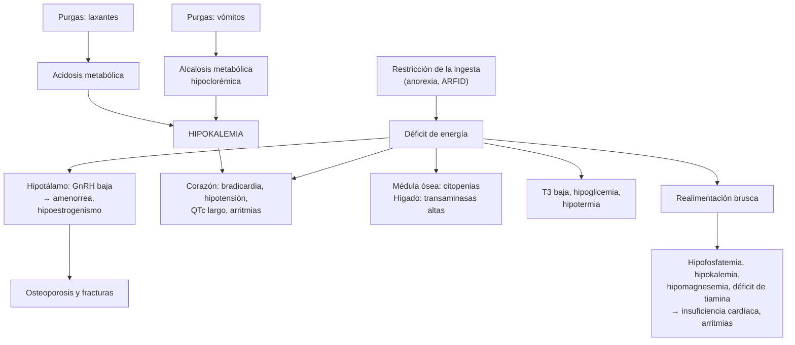
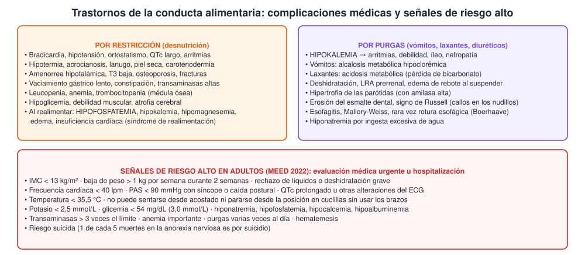

---
tags:
  - Endocrinología
---

# Trastornos de la conducta alimentaria

**Subespecialidad**
Psiquiatría · Nutrición · Medicina interna · Pediatría y medicina del adolescente

**Guías principales**
APA 2023: tratamiento de los trastornos de la conducta alimentaria · Royal College of Psychiatrists 2022: emergencias médicas en los trastornos alimentarios (MEED) · DSM-5-TR (criterios diagnósticos)

**Otras fuentes**
Seminario *Lancet* 2020 · Prevalencia mundial 2000–2018 (Galmiche 2019) · Mortalidad (Arcelus 2011) · StRONG (realimentación con más calorías, 2021) · Lisdexanfetamina en el trastorno por atracón (2015) · Estudios chilenos de riesgo de TCA (Farias 2024; Henríquez 2026)

**GES**
No como problema propio. La **depresión** asociada es GES (n.º 34). La APS y los equipos de salud mental derivan a los programas especializados.

**EUNACOM**
1.02.1.018 Trastornos de conducta alimentaria (específico, inicial, derivar)

**Revisado**
Octubre 2026

!!! abstract "Resumen en 60 segundos"
    - **Trastornos de la conducta alimentaria (TCA)**: alteraciones persistentes de la alimentación que dañan la salud física o psicosocial. Los principales:
        - **Anorexia nerviosa**: restricción → **peso significativamente bajo**, **miedo intenso a engordar**, alteración de la imagen corporal.
        - **Bulimia nerviosa**: **atracones** + **conductas compensatorias** (vómitos, laxantes, ayuno, ejercicio) ≥ 1 vez por semana por 3 meses, con peso habitualmente normal.
        - **Trastorno por atracón**: atracones sin conductas compensatorias; se asocia a obesidad. Es el **más frecuente**.
        - **ARFID** (trastorno de evitación o restricción de la ingesta): restricción **sin** preocupación por el peso o la figura.
    - **Epidemiología**: prevalencia de vida de ~ **8 %** en mujeres y ~ **2 %** en hombres; en aumento. La anorexia tiene la **mayor mortalidad** de los trastornos psiquiátricos (**5 veces** la esperada; 1 de cada 5 muertes es por suicidio).
    - **Preguntar siempre** por la alimentación y el peso: muchos casos llegan por síntomas **médicos** (amenorrea, bradicardia, hipokalemia, síncope, osteoporosis).
    - **Complicaciones**: bradicardia, hipotensión, QTc largo, **hipokalemia** (purgas), alcalosis metabólica (vómitos), hipoglicemia, osteoporosis, citopenias, **síndrome de realimentación** (hipofosfatemia).
    - **Hospitalizar** (MEED 2022, adultos) si: IMC **< 13**, FC **< 40 lpm**, PAS **< 90 mmHg** con síncope, temperatura **< 35,5 °C**, **K < 2,5 mmol/L**, glicemia < 54 mg/dL, QTc largo, debilidad grave o riesgo suicida.
    - **Tratamiento**: equipo **multidisciplinario** (psiquiatría, psicología, nutrición, medicina).
        - Anorexia: **rehabilitación nutricional** y psicoterapia (**terapia familiar** en adolescentes).
        - Bulimia: **TCC** ± **fluoxetina 60 mg/día**.
        - Atracón: TCC; **lisdexanfetamina** o antidepresivos.
        - En la realimentación: **tiamina**, fósforo, potasio y magnesio, y control estrecho.

## Definición

- **Trastornos de la alimentación y de la ingesta de alimentos** (DSM-5-TR): alteraciones persistentes de la alimentación o de las conductas relacionadas, que alteran el consumo o la absorción de los alimentos y deterioran la salud física o el funcionamiento psicosocial.
- **Anorexia nerviosa**:
    - **Restricción** de la ingesta que lleva a un **peso significativamente bajo** para la edad, el sexo y el desarrollo.
    - **Miedo intenso** a ganar peso o conductas persistentes que impiden ganarlo.
    - **Alteración de la percepción** del peso o la figura, influencia excesiva de estos en la autoevaluación o falta de reconocimiento de la gravedad del bajo peso.
    - Subtipos: **restrictivo** y **con atracones/purgas**.
- **Bulimia nerviosa**: **atracones** recurrentes (comer en un período breve una cantidad claramente mayor que la mayoría, con **sensación de pérdida de control**) + **conductas compensatorias** inapropiadas (vómitos autoinducidos, laxantes, diuréticos, ayuno, ejercicio excesivo), ambos **≥ 1 vez por semana durante 3 meses**. La autoevaluación depende excesivamente del peso y la figura.
- **Trastorno por atracón**: atracones **≥ 1 vez por semana durante 3 meses**, con malestar intenso y al menos 3 de estas características: comer muy rápido, hasta sentirse incómodamente lleno, grandes cantidades sin hambre, a solas por vergüenza, sentirse culpable después. **Sin** conductas compensatorias regulares.
- **ARFID** (trastorno de evitación o restricción de la ingesta de alimentos): evitación por características sensoriales, falta de interés o **miedo a consecuencias** (atragantarse, vomitar), con baja de peso, déficit nutricional, dependencia de suplementos o interferencia psicosocial. **No** hay alteración de la imagen corporal.
- **Anorexia nerviosa atípica**: todos los criterios de anorexia, pero el peso está en rango normal o alto pese a una baja de peso importante. Las complicaciones médicas pueden ser **igual de graves**.
- Otros: **pica**, trastorno de **rumiación**, otros TCA especificados y no especificados.

## Epidemiología

### Mundial

- **Prevalencia** (revisión sistemática 2000–2018, Galmiche 2019):
    - **De vida**: **8,4 %** en mujeres y **2,2 %** en hombres.
    - **Puntual**: 5,7 % en mujeres y 2,2 % en hombres; **4,6 %** en América.
    - La prevalencia puntual **aumentó** de 3,5 % (2000–2006) a **7,8 %** (2013–2018).
- **Edad**: comienzan sobre todo en la **adolescencia** y la adultez joven. El trastorno por atracón aparece más tarde y es más común en adultos con **obesidad**.
- **Sexo**: predominan en **mujeres**, pero los hombres están subdiagnosticados (a menudo con foco en la musculatura).
- **Mortalidad** (Arcelus 2011, 36 estudios):
    - **Anorexia nerviosa**: **5,1 muertes por 1.000 personas-año**; razón de mortalidad estandarizada **5,86**. **1 de cada 5** muertes es por **suicidio**.
    - **Bulimia**: razón estandarizada **1,93**. Otros TCA: **1,92**.
- **Carga oculta**: los TCA están subrepresentados en las estimaciones de carga de enfermedad (Santomauro 2021).

### Chile

!!! chile "Datos nacionales"
    - **Riesgo de TCA en adultos jóvenes** (Farias 2024, Región de la Araucanía, 370 personas de 20–28 años, test EAT-26): **12,9 %** con riesgo. El riesgo se asoció al sexo femenino, al interés en "influencers" de alimentación y a la exposición a la publicidad en redes sociales.
    - **Salud mental escolar en Arica** (Henríquez 2026, 772 estudiantes): en la enseñanza media, las **mujeres** tuvieron **8 veces más** indicadores clínicos de TCA que los hombres.
    - Grupos chilenos de psiquiatría (Behar y colaboradores, Universidad de Valparaíso) destacan la relación entre **obesidad** y TCA en adolescentes: la obesidad es un factor de riesgo de trastorno por atracón y bulimia, y viceversa.
    - **No es GES**. La **depresión** (frecuente en los TCA) sí lo es. El manejo especializado se concentra en unidades de psiquiatría infantojuvenil y de adultos con programas de TCA, en general en el nivel terciario.

## Etiología y factores de riesgo

- **Biológicos**: carga genética (heredabilidad alta, sobre todo en la anorexia); alteraciones de los sistemas de recompensa y del control inhibitorio; **dietas** restrictivas como desencadenante.
- **Psicológicos**: **perfeccionismo**, rigidez, baja autoestima, ansiedad, rasgos obsesivos (anorexia); impulsividad y desregulación emocional (bulimia, atracón); antecedentes de **trauma** o abuso.
- **Socioculturales**: ideal de delgadez, **redes sociales**, burlas por el peso, actividades que exigen bajo peso (danza, modelaje, gimnasia, deportes de resistencia o por categorías de peso).
- **Grupos de riesgo**: mujeres adolescentes y adultas jóvenes, deportistas, personas con **DM1** (omisión de insulina para bajar de peso), personas con obesidad que hacen dietas repetidas, personas tras una cirugía bariátrica, diversidad sexual y de género.
- **Comorbilidad psiquiátrica**: depresión, ansiedad, TOC, consumo de sustancias, trastornos de la personalidad, **suicidalidad**.

## Fisiopatología

- **Restricción** → **déficit de energía** → el cuerpo se adapta para ahorrar energía:
    - **Hipotálamo**: baja la GnRH → **amenorrea hipotalámica** e hipoestrogenismo → pérdida ósea. Baja la conversión de T4 en T3 (**T3 baja**). Sube el cortisol.
    - **Corazón**: baja la masa cardíaca y el tono simpático → **bradicardia**, hipotensión, ortostatismo, QTc largo, derrame pericárdico.
    - **Médula ósea**: transformación gelatinosa → **citopenias**.
    - **Tubo digestivo**: vaciamiento lento → saciedad precoz, constipación. Hígado: **transaminasas altas** por inanición.
    - **Músculo** y **cerebro**: atrofia y debilidad; menor volumen cerebral, rigidez cognitiva (que perpetúa la restricción).
- **Purgas**:
    - **Vómitos**: pérdida de ácido y de cloro → **alcalosis metabólica hipoclorémica**. La contracción de volumen activa la aldosterona → **hipokalemia** por pérdida renal.
    - **Laxantes**: pérdida de bicarbonato y potasio por las deposiciones → **acidosis metabólica** e **hipokalemia**.
- **Realimentación**: la insulina introduce **fosfato, potasio y magnesio** en las células y aumenta el consumo de **tiamina** → hipofosfatemia, arritmias, insuficiencia cardíaca y respiratoria (ver [desnutrición y síndrome de realimentación](desnutricion-y-sindromes-carenciales.md)).

*Figura 1. Mecanismos de las complicaciones médicas de los trastornos de la conducta alimentaria. Esquema propio basado en el seminario de Lancet 2020 y la guía MEED 2022.*

## Clasificación

| Trastorno | Rasgo central | Peso habitual | Conductas compensatorias |
|---|---|---|---|
| **Anorexia nerviosa, restrictiva** | Restricción, miedo a engordar | **Bajo** | No (ayuno, ejercicio) |
| **Anorexia nerviosa, atracones/purgas** | Restricción + atracones o purgas | **Bajo** | Sí |
| **Anorexia nerviosa atípica** | Igual a la anorexia | Normal o alto (con gran baja) | Variable |
| **Bulimia nerviosa** | Atracones + compensación | **Normal** o algo alto | **Sí** (≥ 1/semana) |
| **Trastorno por atracón** | Atracones con pérdida de control | **Normal u obesidad** | **No** |
| **ARFID** | Evitación sin preocupación por la figura | Bajo o normal (déficits) | No |

**Gravedad de la anorexia nerviosa en adultos según el IMC** (DSM-5-TR): **leve ≥ 17** · **moderada 16–16,99** · **grave 15–15,99** · **extrema < 15 kg/m²**. En niños y adolescentes se usan los percentiles del IMC para la edad.

**Gravedad de la bulimia** (episodios compensatorios por semana): leve 1–3 · moderada 4–7 · grave 8–13 · extrema ≥ 14.

## Clínica

- **Pistas en la consulta médica**:
    - Baja de peso no explicada, peso que no sube pese a "comer bien", **amenorrea**, fracturas por estrés.
    - Síncope, mareos, palpitaciones, **intolerancia al frío**, constipación, distensión abdominal.
    - **Hipokalemia** no explicada, alcalosis metabólica, amilasa alta (parótidas), transaminasas altas.
    - En la DM1: HbA1c alta inexplicada o cetoacidosis recurrente (**omisión de insulina**).
- **Examen físico**:
    - **Restricción**: IMC bajo, **bradicardia**, hipotensión, ortostatismo, **hipotermia**, acrocianosis, **lanugo**, piel seca, uñas frágiles, carotenodermia (piel amarillenta), edema, debilidad muscular proximal.
    - **Purgas**: **hipertrofia parotídea**, **erosión del esmalte** dental (cara lingual), **signo de Russell** (callos o cicatrices en el dorso de la mano), deshidratación.
- **Evaluación psiquiátrica**: preocupación por el peso, conductas de control (pesarse, contar calorías), ejercicio compulsivo, uso de laxantes, diuréticos o fármacos para bajar de peso, ánimo, **ideación suicida**, consumo de sustancias.
- **Herramienta de tamizaje SCOFF** (5 preguntas: provocarse vómitos por sentirse lleno, perder el control de cuánto come, bajar más de 6 kg en 3 meses, creerse gordo siendo delgado, que la comida domine su vida): **≥ 2 respuestas positivas** sugieren un TCA.

!!! alarma "Signos de alarma: evaluación médica urgente u hospitalización (MEED 2022, adultos)"
    - **IMC < 13 kg/m²** o baja de peso **> 1 kg por semana** durante 2 semanas.
    - **Frecuencia cardíaca < 40 lpm**; **PAS < 90 mmHg** con síncope o caída postural; **QTc prolongado** u otras alteraciones del ECG.
    - **Temperatura < 35,5 °C**.
    - **No puede sentarse desde acostado** ni levantarse de cuclillas.
    - **Potasio < 2,5 mmol/L**, **glicemia < 54 mg/dL (3,0 mmol/L)**, hiponatremia, hipofosfatemia, hipocalcemia, hipoalbuminemia.
    - Transaminasas **> 3 veces** el límite, anemia importante.
    - **Purgas varias veces al día**, **rechazo de líquidos** o deshidratación grave, hematemesis.
    - **Riesgo suicida**.

## Diagnóstico

!!! guia "Evaluación (APA 2023; MEED 2022)"
    - **Preguntar** por la alimentación, el peso y la imagen corporal como parte de la evaluación habitual, sobre todo en adolescentes y mujeres jóvenes (Lancet 2020).
    - **Historia del peso**: peso máximo y mínimo, velocidad de la baja de peso, peso actual e IMC (o percentil en menores).
    - **Conductas**: restricción, atracones, vómitos, laxantes, diuréticos, ejercicio, fármacos (incluida la omisión de insulina).
    - **Examen físico**: signos vitales **con ortostatismo**, temperatura, peso y talla, signos de desnutrición y de purgas.
    - **Laboratorio**: hemograma, **electrolitos (Na, K, Cl, bicarbonato), fósforo, magnesio**, calcio, glicemia, creatinina, BUN, pruebas hepáticas, albúmina; TSH; β-hCG si corresponde.
    - **ECG** en la anorexia, en las purgas frecuentes y si hay alteraciones electrolíticas, bradicardia o síntomas cardíacos.
    - **Densitometría** si la amenorrea dura ≥ 6 meses.
    - **Riesgo médico** con la tabla MEED (rojo, ámbar, verde) y **riesgo psiquiátrico** (suicidio, autoagresiones).
    - **Diagnóstico diferencial**: descartar causas orgánicas de baja de peso o vómitos (ver la tabla).

<figure markdown>
{ loading=lazy }
<figcaption>Figura 2. Complicaciones médicas de los trastornos de la conducta alimentaria y señales de riesgo alto en adultos. Esquema propio basado en la guía MEED 2022 (resumida por Mughal 2023), el seminario de <em>Lancet</em> 2020 y Arcelus 2011.</figcaption>
</figure>

## Laboratorio

| Hallazgo | Interpretación |
|---|---|
| **Hipokalemia** | **Purgas** (vómitos, laxantes, diuréticos). Grave si < 2,5 mmol/L. Puede faltar en la anorexia restrictiva pura |
| **Alcalosis metabólica hipoclorémica** (bicarbonato alto, cloro bajo) | **Vómitos** autoinducidos; cloro urinario bajo |
| **Acidosis metabólica** con hipokalemia | **Laxantes** |
| **Hiponatremia** | Ingesta excesiva de agua (para engañar a la balanza o calmar el hambre), diuréticos |
| **Hipofosfatemia, hipomagnesemia** | Desnutrición y, sobre todo, **realimentación** |
| **Hipoglicemia** | Desnutrición grave; signo de **mal pronóstico** |
| **Leucopenia, anemia, trombocitopenia** | Desnutrición (médula ósea); mejoran con la recuperación nutricional |
| **Transaminasas altas** | Inanición (hepatitis por desnutrición) o realimentación (esteatosis) |
| **Amilasa alta** | Origen salival (parótidas) en las purgas |
| **T3 baja con TSH normal** | Adaptación ("síndrome del eutiroideo enfermo"): **no tratar** con levotiroxina |
| **LH, FSH y estradiol bajos** | Amenorrea hipotalámica |
| **Colesterol alto** | Paradójicamente frecuente en la anorexia |
| **Creatinina "normal"** | Puede ocultar una función renal baja por la poca masa muscular |

## Imágenes

- **ECG**: bradicardia sinusal, **QTc prolongado**, bajo voltaje, arritmias, signos de hipokalemia (ondas U, depresión del ST).
- **Ecocardiograma**: si hay síntomas, soplo o alteraciones del ECG (derrame pericárdico, disminución de la masa del ventrículo izquierdo, prolapso mitral).
- **Densitometría ósea**: amenorrea ≥ 6 meses o anorexia de larga evolución (osteopenia y osteoporosis frecuentes).
- **Radiografía de abdomen**: distensión o dolor abdominal intenso (dilatación gástrica aguda, síndrome de la arteria mesentérica superior).
- **Imágenes cerebrales**: solo si hay signos neurológicos o una presentación atípica (tumor hipotalámico, otras causas).

## Diagnóstico diferencial

| Cuadro | Claves para diferenciar |
|---|---|
| **Hipertiroidismo** | Baja de peso con **apetito aumentado**, taquicardia, temblor; TSH baja |
| **DM1 de debut o descompensada** | Poliuria, polidipsia, hiperglicemia, cetosis |
| **Enfermedad celíaca, EII** | Diarrea, dolor abdominal, anemia ferropriva; serología, calprotectina |
| **Insuficiencia suprarrenal** | Hiperpigmentación, **hiponatremia con hiperkalemia**, hipotensión |
| **Cáncer, tuberculosis, VIH** | Síntomas B, adenopatías, fiebre; no hay miedo a engordar |
| **Tumor hipotalámico o cerebral** | Cefalea, alteraciones visuales, otros déficits hormonales; vómitos sin náuseas |
| **Depresión mayor** | Pérdida del apetito sin miedo a engordar ni distorsión de la imagen |
| **Acalasia, gastroparesia, obstrucción** | Vómitos o regurgitación sin conducta purgativa intencional |
| **Abuso de sustancias** (estimulantes) | Baja de peso con insomnio, agitación, taquicardia |
| **Trastorno dismórfico corporal o dismorfia muscular** | Preocupación por un rasgo o por la musculatura, no por el peso |

## Tratamiento

- **Equipo multidisciplinario**: psiquiatría, psicología, nutrición y medicina (interna o pediátrica). El nivel de atención (ambulatorio, hospital de día u hospitalización) depende del **riesgo médico y psiquiátrico**.
- **Anorexia nerviosa** (APA 2023):
    - **Rehabilitación nutricional** con metas de recuperación de peso individualizadas.
    - **Psicoterapia** centrada en el TCA (terapia cognitivo-conductual, otras). En los **adolescentes**: **terapia basada en la familia**.
    - No hay fármacos con eficacia demostrada para la anorexia en sí; se tratan las comorbilidades. La **olanzapina** en dosis bajas puede usarse en casos seleccionados (indicación del especialista).
- **Bulimia nerviosa** (APA 2023):
    - **Terapia cognitivo-conductual** centrada en el TCA.
    - **Fluoxetina 60 mg/día** (la dosis eficaz es más alta que para la depresión), sola o con la TCC.
    - **Evitar el bupropión** (riesgo de convulsiones en la bulimia).
- **Trastorno por atracón** (APA 2023):
    - **TCC** o psicoterapia interpersonal.
    - Fármacos si la persona los prefiere o no responde: **lisdexanfetamina** (ensayo de 2015: menos días de atracón) o un **antidepresivo**.
    - Manejo de la obesidad asociada, sin dietas muy restrictivas que gatillen atracones.
- **Manejo médico en la sala** (hospitalización por riesgo alto):
    - **Monitoreo**: signos vitales con ortostatismo, ECG, glicemia; **fósforo, potasio y magnesio diarios** la primera semana de realimentación.
    - **Corregir electrolitos**: potasio (oral si es posible; EV si es < 2,5 mmol/L o hay alteraciones del ECG), fósforo, magnesio.
    - **Tiamina** antes y durante los primeros días de la realimentación.
    - **Realimentación**: en adolescentes y jóvenes con anorexia, iniciar con **más calorías** (~ 2.000 kcal/día, subiendo 200 kcal/día) restauró la estabilidad médica **4 días antes** que el inicio con 1.400 kcal, sin más alteraciones electrolíticas (StRONG 2021). En los adultos con **riesgo muy alto** de realimentación (IMC muy bajo, ingesta casi nula, electrolitos alterados antes de empezar), comenzar con menos y avanzar según los controles (ver [desnutrición](desnutricion-y-sindromes-carenciales.md)).
    - **Purgas**: supervisión después de las comidas; suspender los laxantes en forma **gradual** si hay uso crónico (riesgo de constipación y edema de rebote).
    - **Hipokalemia por vómitos**: corregir también el **volumen y el cloro** (suero fisiológico con KCl); si no, el riñón sigue perdiendo potasio.
    - **No usar levotiroxina** por una T3 baja ni **bisfosfonatos** de rutina en mujeres jóvenes.
- **Hueso**: la recuperación del peso y de la menstruación es lo más eficaz; calcio y vitamina D. En adolescentes con anorexia, el **estradiol transdérmico** con progestágeno cíclico puede proteger el hueso (indicación del especialista); los anticonceptivos orales no sirven para esto.
- **Riesgo suicida**: evaluarlo siempre y derivar con urgencia si existe.

!!! dosis "Dosis de referencia"
    | Fármaco | Dosis | Observaciones |
    |---|---|---|
    | **Fluoxetina** (bulimia) | Iniciar 20 mg/día y subir a **60 mg/día** | Dosis más alta que en la depresión |
    | **Lisdexanfetamina** (trastorno por atracón) | 30 mg/día, titular a **50–70 mg/día** | Estimulante: vigilar la PA, la FC y el abuso; no en la anorexia ni la bulimia |
    | **Tiamina** (realimentación) | **100–300 mg/día** oral o EV antes de alimentar y por 5–10 días | Prevenir Wernicke |
    | **Fósforo** | Según el nivel: oral si es leve; EV si es < 1 mg/dL o hay síntomas | Control diario la primera semana |
    | **Cloruro de potasio** | Oral 40–80 mEq/día repartidos; EV hasta 10 mEq/h por vía periférica | Con monitoreo ECG si K < 2,5 mmol/L |
    | **Multivitamínico y minerales** | Diario durante la recuperación | Incluir zinc, ácido fólico, vitamina D |

## Complicaciones

- **Cardiovasculares**: bradicardia, hipotensión, **arritmias** (por hipokalemia o QTc largo), **muerte súbita**, insuficiencia cardíaca en la realimentación.
- **Electrolíticas**: hipokalemia, hipofosfatemia, hipomagnesemia, hiponatremia.
- **Óseas**: **osteoporosis** y fracturas, a veces irreversibles si la enfermedad comenzó en la adolescencia (antes del pico de masa ósea).
- **Endocrinas y reproductivas**: amenorrea, infertilidad; en el embarazo, riesgo de bajo peso al nacer.
- **Digestivas**: dilatación gástrica aguda, síndrome de la arteria mesentérica superior, constipación grave, esofagitis, Mallory-Weiss, **rotura esofágica** (Boerhaave), erosión dental.
- **Renales**: LRA prerrenal, nefropatía hipokalémica crónica.
- **Hematológicas**: citopenias, infecciones.
- **Neurológicas**: atrofia cerebral, deterioro cognitivo, **Wernicke** en la realimentación.
- **Psiquiátricas**: depresión, **suicidio**, consumo de sustancias.

## Pronóstico y seguimiento

- Son trastornos **crónicos y recurrentes**, pero muchos pacientes se recuperan con tratamiento especializado, sobre todo si se inicia **precozmente** (adolescentes con terapia familiar).
- La **anorexia nerviosa** tiene la **mortalidad más alta** entre los trastornos psiquiátricos (razón estandarizada ~ 6). La edad mayor al momento de la evaluación predice más mortalidad.
- **Seguimiento**: peso, signos vitales, electrolitos (si hay purgas), menstruación, densitometría, ánimo y riesgo suicida; coordinación entre la APS, salud mental y nutrición.

## Perlas para el internado

!!! perla "Para recordar en la sala"
    - Mujer joven con **bradicardia, hipotermia, amenorrea y "colesterol alto"**: piense en anorexia nerviosa. La bradicardia **no** es "de deportista" si hay bajo peso.
    - **Hipokalemia con alcalosis metabólica** sin causa clara en una mujer joven = **vómitos ocultos** hasta demostrar lo contrario (cloro urinario bajo).
    - **Parótidas aumentadas, erosión dental y callos en los nudillos**: purgas.
    - En la DM1 con **HbA1c alta y cetoacidosis repetidas**: preguntar por **omisión de insulina** para bajar de peso.
    - **Electrolitos normales no excluyen el riesgo**: la gravedad se mide con IMC, signos vitales, ortostatismo, ECG y la prueba de sentarse y pararse.
    - Antes de realimentar: **tiamina**, fósforo, potasio y magnesio; controlarlos **cada día** la primera semana.
    - **T3 baja** en la anorexia es una adaptación: **no** dar levotiroxina.
    - **Fluoxetina 60 mg** para la bulimia; **no usar bupropión** (convulsiones).
    - Siempre preguntar por **ideación suicida**.

## Preguntas de repaso

??? repaso "1. Mujer de 19 años, estudiante, traída por mareo y síncope. IMC 13,8, FC 38 lpm, PA 84/52 mmHg, temperatura 35,3 °C. Refiere que \"come sano\" y corre 15 km al día. Amenorrea de 1 año. ¿Qué hace?"
    - Sospecha de **anorexia nerviosa** con **criterios de riesgo alto** (MEED): **FC < 40 lpm**, **PAS < 90 mmHg con síncope**, **temperatura < 35,5 °C**, IMC muy bajo.
    - **Hospitalizar** con monitoreo cardíaco.
    - **Exámenes**: ECG (QTc), electrolitos con **fósforo y magnesio**, glicemia, hemograma, pruebas hepáticas, creatinina.
    - **Tiamina** y realimentación supervisada con control diario de fósforo, potasio y magnesio.
    - Evaluar el **riesgo suicida** e interconsultar a **psiquiatría** y **nutrición**.

??? repaso "2. Mujer de 23 años con peso normal, astenia y calambres. K 2,6 mEq/L, bicarbonato 34 mEq/L, cloro 90 mEq/L. Niega fármacos. Al examen: parótidas aumentadas y erosión del esmalte. ¿Diagnóstico probable y manejo?"
    - **Alcalosis metabólica hipoclorémica con hipokalemia** + **hipertrofia parotídea** y **erosión dental** → **vómitos autoinducidos**: probable **bulimia nerviosa**.
    - **Cloro urinario bajo** (< 20 mEq/L) apoya los vómitos (frente a diuréticos o Bartter, con cloro urinario alto).
    - **Manejo**: ECG; reposición de **volumen con suero fisiológico y KCl** (corregir el cloro y el volumen permite al riñón retener potasio); magnesio.
    - Abordar el diagnóstico con empatía; **derivar a salud mental**: TCC ± **fluoxetina 60 mg/día**.

??? repaso "3. Paciente hospitalizada por anorexia nerviosa (IMC 14). Al tercer día de realimentación presenta disnea, edema y debilidad. Fósforo 1,0 mg/dL. ¿Qué ocurrió y qué hace?"
    - **Síndrome de realimentación**: la insulina introduce fósforo, potasio y magnesio en las células → **hipofosfatemia grave** → debilidad muscular (incluida la respiratoria), insuficiencia cardíaca, arritmias.
    - **Manejo**: **fósforo EV**, corregir **potasio** y **magnesio**, **tiamina**, monitoreo cardíaco; **reducir temporalmente el aporte calórico** y luego avanzar con control diario de electrolitos.
    - Evaluar la sobrecarga de volumen (restringir sodio y líquidos si hay insuficiencia cardíaca).

??? repaso "4. Hombre de 45 años con obesidad (IMC 36) que refiere episodios de 2–3 veces por semana en que come grandes cantidades rápido, a escondidas y con culpa, sin vómitos ni laxantes. ¿Diagnóstico y tratamiento?"
    - **Trastorno por atracón** (atracones ≥ 1/semana por 3 meses, con pérdida de control y malestar, sin conductas compensatorias).
    - **Tratamiento**: **terapia cognitivo-conductual** (o interpersonal); si prefiere fármacos o no responde, **lisdexanfetamina** (vigilar PA y FC) o un antidepresivo.
    - Manejo de la obesidad y de sus comorbilidades (DM2, HTA, dislipidemia) **sin dietas muy restrictivas** que gatillen atracones.

??? repaso "5. Joven de 17 años con DM1, HbA1c 11,8 % y 3 cetoacidosis en el último año, con peso en descenso. Su madre refiere que se preocupa mucho por su figura. ¿Qué sospecha?"
    - **Omisión deliberada de insulina** para bajar de peso: una forma de TCA en personas con DM1, con **alto riesgo** de cetoacidosis, complicaciones microvasculares precoces y muerte.
    - Preguntar sin juzgar sobre la omisión de dosis, la imagen corporal y las conductas compensatorias; tamizaje (SCOFF).
    - **Manejo conjunto** de diabetología y **salud mental** con experiencia en TCA; metas glicémicas graduales.

??? repaso "6. Mujer de 22 años con anorexia nerviosa en recuperación. Su TSH es 2,1 mUI/L y la T3 libre está baja. Un médico propone levotiroxina \"para ayudarla a subir de energía\". ¿Qué opina?"
    - La **T3 baja con TSH normal** es una **adaptación** al déficit de energía ("síndrome del eutiroideo enfermo"), no un hipotiroidismo.
    - **No dar levotiroxina**: no está indicada, puede aumentar el gasto energético y empeorar la baja de peso, y puede ser usada para bajar de peso.
    - La T3 se normaliza con la **recuperación nutricional**.

## Referencias

1. Crone C, Fochtmann LJ, Attia E, et al. The American Psychiatric Association practice guideline for the treatment of patients with eating disorders. *Am J Psychiatry.* 2023;180(2):167–171. doi:[10.1176/appi.ajp.23180001](https://doi.org/10.1176/appi.ajp.23180001)
2. Royal College of Psychiatrists. Medical emergencies in eating disorders (MEED): guidance on recognition and management (CR233). London: RCPsych; 2022. [rcpsych.ac.uk](https://www.rcpsych.ac.uk/improving-care/campaigning-for-better-mental-health-policy/college-reports/2022-college-reports/cr233)
3. Mughal F, de Lusignan S, Schmidt U, et al. Assessment and management of medical emergencies in eating disorders: guidance for GPs. *Br J Gen Pract.* 2023;73(730):232–233. doi:[10.3399/bjgp23X732849](https://doi.org/10.3399/bjgp23X732849)
4. Treasure J, Duarte TA, Schmidt U. Eating disorders. *Lancet.* 2020;395(10227):899–911. doi:[10.1016/S0140-6736(20)30059-3](https://doi.org/10.1016/S0140-6736(20)30059-3)
5. Galmiche M, Déchelotte P, Lambert G, Tavolacci MP. Prevalence of eating disorders over the 2000–2018 period: a systematic literature review. *Am J Clin Nutr.* 2019;109(5):1402–1413. doi:[10.1093/ajcn/nqy342](https://doi.org/10.1093/ajcn/nqy342)
6. Arcelus J, Mitchell AJ, Wales J, Nielsen S. Mortality rates in patients with anorexia nervosa and other eating disorders: a meta-analysis of 36 studies. *Arch Gen Psychiatry.* 2011;68(7):724–731. doi:[10.1001/archgenpsychiatry.2011.74](https://doi.org/10.1001/archgenpsychiatry.2011.74)
7. Santomauro DF, Melen S, Mitchison D, et al. The hidden burden of eating disorders: an extension of estimates from the Global Burden of Disease Study 2019. *Lancet Psychiatry.* 2021;8(4):320–328. doi:[10.1016/S2215-0366(21)00040-7](https://doi.org/10.1016/S2215-0366(21)00040-7)
8. Garber AK, Cheng J, Accurso EC, et al. Short-term outcomes of the study of refeeding to optimize inpatient gains for patients with anorexia nervosa: a multicenter randomized clinical trial. *JAMA Pediatr.* 2021;175(1):19–27. doi:[10.1001/jamapediatrics.2020.3359](https://doi.org/10.1001/jamapediatrics.2020.3359)
9. McElroy SL, Hudson JI, Mitchell JE, et al. Efficacy and safety of lisdexamfetamine for treatment of adults with moderate to severe binge-eating disorder: a randomized clinical trial. *JAMA Psychiatry.* 2015;72(3):235–246. doi:[10.1001/jamapsychiatry.2014.2162](https://doi.org/10.1001/jamapsychiatry.2014.2162)
10. Farias M, Manieu D, Baeza E, et al. Social networks and risk of eating disorders in Chilean young adults. *Nutr Hosp.* 2024;41(2):456–461. doi:[10.20960/nh.04765](https://doi.org/10.20960/nh.04765)
11. Henríquez D, Escobar-Soler C, Caqueo-Urízar A. Salud mental infantojuvenil en el norte de Chile: un estudio de prevalencia. *Rev Med Chil.* 2026;154(4):475–486. doi:[10.4067/s0034-98872026000400484](https://doi.org/10.4067/s0034-98872026000400484)
12. Behar R, Marín V. Trastornos de la conducta alimentaria y obesidad en adolescentes: otro desafío de nuestros tiempos. *Andes Pediatr.* 2021;92(4):626–630. doi:[10.32641/andespediatr.v92i4.3539](https://doi.org/10.32641/andespediatr.v92i4.3539)
