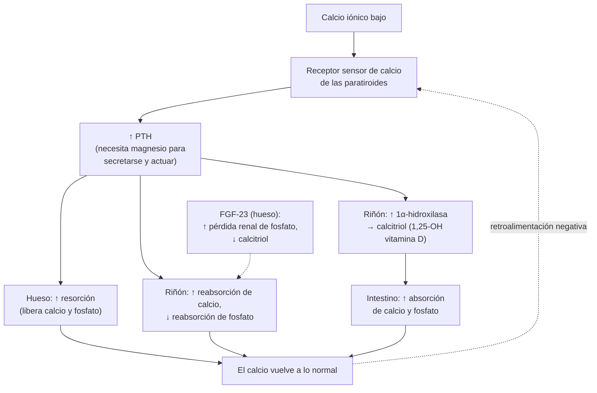
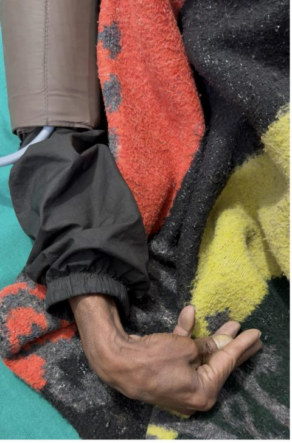
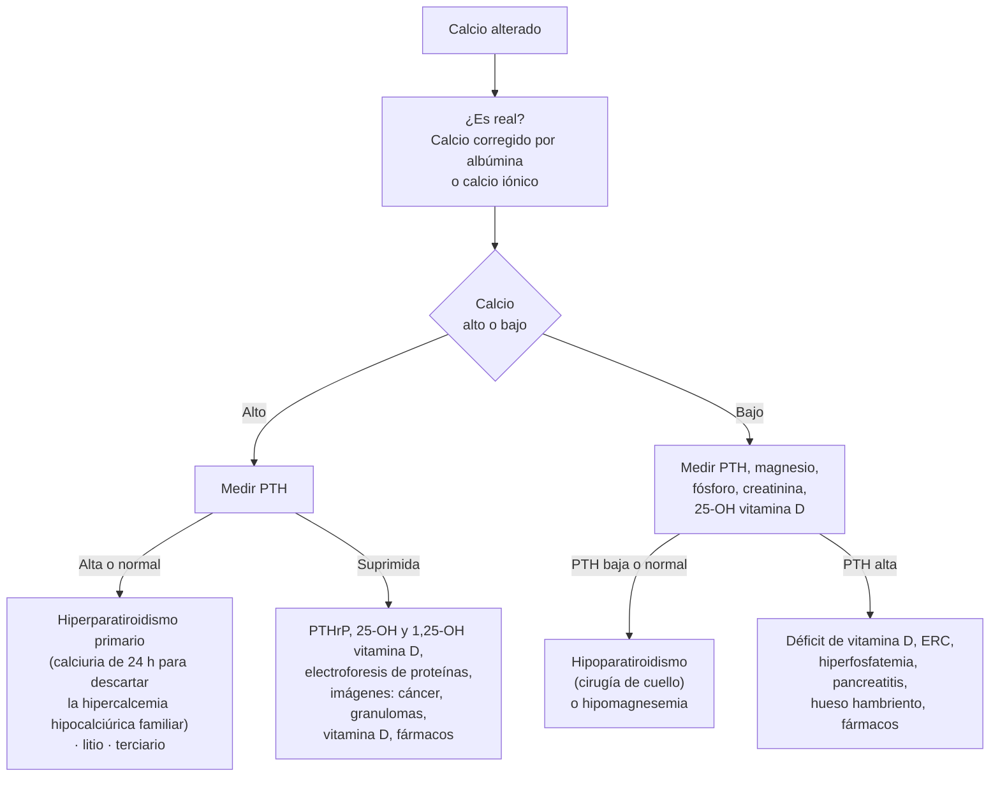

---
tags:
  - Endocrinología
  - Urgencia
  - Frecuente en sala
---

# Trastornos del calcio, fósforo y magnesio: hipocalcemia, tetania e hipercalcemia

**Subespecialidad**
Endocrinología · Nefrología · Medicina interna

**Guías principales**
Society for Endocrinology 2016: manejo de urgencia de la hipocalcemia aguda (con adenda de 2019) y de la hipercalcemia aguda · Endocrine Society 2023: hipercalcemia maligna · Quinto Taller Internacional 2022: hiperparatiroidismo primario · ASPEN 2020: síndrome de realimentación

**Otras fuentes**
ENS 2016–2017: vitamina D en adultos mayores chilenos (Álamos 2026) · Hipocalcemia post-tiroidectomía en Chile (Cabané 2023) e hipoparatiroidismo posquirúrgico (Ivanovic-Zuvic 2024) · Ensayo PHOSPHARE (*JAMA* 2020) · Pahari 2026 (figura del signo de Trousseau)

**GES**
No

**EUNACOM**
1.03.2.005 Tetania (específico, completo, derivar) · 1.03.1.020 Hipercalcemias e hipocalcemias (sospecha, inicial, derivar) · 1.03.2.004 Hipercalcemia aguda y 1.08.2.004 Hipercalcemia (sospecha, inicial, derivar; ver también [urgencias oncológicas](../hematologia/urgencias-oncologicas.md))

**Revisado**
Septiembre 2026

!!! abstract "Resumen en 60 segundos"
    - **Corregir el calcio por la albúmina** (o medir el **calcio iónico**) antes de diagnosticar: la hipoalbuminemia da una "hipocalcemia" falsa.
    - **Hipocalcemia**:
        - Da **parestesias** periorales y distales, **calambres**, **tetania** (espasmo carpopedal, signos de **Trousseau** y **Chvostek**), **laringoespasmo**, **convulsiones** y **QT largo**.
        - La causa más frecuente de hipocalcemia aguda sintomática en el hospital es el **hipoparatiroidismo después de una tiroidectomía total**. En Chile, es transitoria en **29 %** y permanente en **1 %**.
    - **Hipocalcemia grave** (< 7,6 mg/dL o sintomática) = **urgencia**:
        - **Gluconato de calcio al 10 %, 10–20 mL EV en 10 minutos** con monitor ECG; luego una **infusión**.
        - **Siempre medir y corregir el magnesio**: sin magnesio, la PTH no se secreta ni actúa.
    - **Tetania con calcio total normal**: pensar en **alcalosis** (hiperventilación) o **hipomagnesemia**.
    - **Hipercalcemia**:
        - El **90 %** se debe a un **hiperparatiroidismo primario** (PTH alta o normal) o a un **cáncer** (PTH suprimida).
        - Da poliuria, deshidratación, constipación, **confusión** y **QT corto**. Grave si es **> 14 mg/dL**.
    - **Tratamiento de la hipercalcemia grave**: **suero fisiológico** (4–6 L en 24 h según tolerancia), **calcitonina**, **ácido zoledrónico** o **denosumab**; corticoides si es mediada por calcitriol. La furosemida **sólo** si hay sobrecarga de volumen.
    - **Hipofosfatemia grave**: realimentación, cetoacidosis tratada, alcoholismo, **hierro EV** (carboximaltosa férrica). Da debilidad, insuficiencia respiratoria, hemólisis y rabdomiólisis.

## Definición

| Trastorno | Definición (valores habituales del adulto) |
|---|---|
| **Hipocalcemia** | Calcio total corregido **< 8,5 mg/dL** (< 2,12 mmol/L) o calcio iónico **< 4,5 mg/dL** (< 1,12 mmol/L). **Grave**: < 7,6 mg/dL (< 1,9 mmol/L) o sintomática |
| **Tetania** | Hiperexcitabilidad neuromuscular: espasmos musculares involuntarios por un **calcio iónico bajo** (hipocalcemia o alcalosis) o por **hipomagnesemia** |
| **Hipercalcemia** | Calcio total corregido **> 10,5 mg/dL** (> 2,62 mmol/L). **Leve** < 12 mg/dL, **moderada** 12–14, **grave > 14 mg/dL** (> 3,5 mmol/L) |
| **Hipofosfatemia** | Fósforo **< 2,5 mg/dL**. **Grave** < 1 mg/dL |
| **Hiperfosfatemia** | Fósforo **> 4,5 mg/dL** |
| **Hipomagnesemia** | Magnesio **< 1,7 mg/dL** (< 0,7 mmol/L). **Grave** < 1,2 mg/dL o sintomática |
| **Hipermagnesemia** | Magnesio **> 2,4 mg/dL**; con síntomas habitualmente > 4–5 mg/dL |

!!! guia "Calcio corregido por la albúmina"
    **Calcio corregido (mg/dL) = calcio medido + 0,8 × (4 − albúmina en g/dL)**

    - Cerca del **40 %** del calcio circula unido a la albúmina. La fracción activa es el **calcio iónico** (~ 50 %).
    - La fórmula es **imprecisa** en el paciente grave, en la ERC y en los trastornos ácido-base. Si hay dudas, **medir el calcio iónico** (en gases).
    - Conversión: **mmol/L × 4 = mg/dL**.

## Epidemiología

### Mundial

- El **hiperparatiroidismo primario** es la causa más frecuente de hipercalcemia en los pacientes **ambulatorios**. Suele ser leve y asintomático, y se detecta en exámenes de rutina, sobre todo en **mujeres posmenopáusicas**.
- El **cáncer** es la causa más frecuente de hipercalcemia en los **hospitalizados** y la que da las cifras más altas. Juntos, el hiperparatiroidismo y el cáncer explican el **90 %** de las hipercalcemias (Society for Endocrinology 2016).
- La causa más frecuente de **hipocalcemia aguda sintomática** en el hospital es el **hipoparatiroidismo posquirúrgico** tras una **tiroidectomía total**.
- La **hipomagnesemia** y la **hipofosfatemia** son muy frecuentes en los hospitalizados y en la UCI. Suelen pasar inadvertidas porque no se piden.
    - Con **carboximaltosa férrica** EV, el **74–75 %** de los pacientes hizo hipofosfatemia, contra el **8 %** con derisomaltosa férrica (ensayos PHOSPHARE, 2020).

### Chile

!!! chile "Datos nacionales"
    - **Vitamina D en adultos mayores** (ENS 2016–2017, 1.252 personas ≥ 65 años; Álamos 2026):
        - El **88,3 %** tenía **25-OH vitamina D ≤ 30 ng/mL**, y el **58,3 %**, **déficit** (< 20 ng/mL).
        - La **obesidad**, el **sexo femenino**, el **tabaquismo** y la zona geográfica de residencia influían en el riesgo.
    - **Hipocalcemia después de una tiroidectomía total** (106 pacientes de un grupo de alto volumen, 2019–2021; Cabané 2023):
        - **Transitoria** (< 12 meses) en el **29 %** y **permanente** en el **1 %**.
        - Una **PTH < 8,8 pg/mL** al día siguiente de la cirugía predice la hipocalcemia.
        - Un protocolo basado en el calcio, la PTH y los síntomas permitió el **alta al día siguiente** con calcio oral profiláctico.
    - **Hipoparatiroidismo posquirúrgico** (Ivanovic-Zuvic 2024):
        - Empeora la **calidad de vida**: parestesias, fatiga diaria y alteraciones de memoria.
        - La **adherencia** fue baja: **56 %** al calcio y **71 %** al calcitriol.

## Etiología

### Hipocalcemia: clasificar según la PTH

| PTH | Causas |
|---|---|
| **Baja o inapropiadamente normal** (hipoparatiroidismo) | **Posquirúrgico** (tiroidectomía total, paratiroidectomía, cirugía de cuello): la más frecuente · **Hipomagnesemia grave** (la PTH no se secreta ni actúa) · Autoinmune (aislado o poliglandular) · Infiltrativo (hemocromatosis, Wilson, metástasis) · Radiación · Genético (DiGeorge, mutaciones activadoras del receptor sensor de calcio) |
| **Alta** (hiperparatiroidismo secundario) | **Déficit de vitamina D** (poca exposición al sol, malabsorción, cirugía bariátrica, hepatopatía) · **ERC** (déficit de calcitriol e hiperfosfatemia) · **Hiperfosfatemia** aguda (**lisis tumoral**, **rabdomiólisis**, enemas de fosfato) · **Pancreatitis aguda** (saponificación) · **Sepsis** y paciente crítico · **Síndrome de hueso hambriento** tras una paratiroidectomía · Fármacos: **bisfosfonatos EV**, **denosumab** (sobre todo con déficit de vitamina D o ERC), foscarnet, cinacalcet · **Transfusión masiva** (el citrato quela el calcio iónico) · Pseudohipoparatiroidismo (resistencia a la PTH) |
| **Calcio iónico bajo con calcio total normal** | **Alcalosis**: respiratoria (**hiperventilación**, crisis de pánico) o metabólica (vómitos). La alcalosis aumenta la unión del calcio a la albúmina |

### Hipercalcemia: clasificar según la PTH

| PTH | Causas |
|---|---|
| **Alta o inapropiadamente normal** | **Hiperparatiroidismo primario** (adenoma único en ~ 80–85 %, hiperplasia, carcinoma < 1 %) · **Hiperparatiroidismo terciario** (ERC, trasplante renal) · **Litio** · **Hipercalcemia hipocalciúrica familiar** (calciuria baja; no se opera) |
| **Suprimida** (< 20 pg/mL) | **Cáncer**: **PTHrP** (humoral, ~ 80 %: carcinomas escamosos, mama, riñón), **metástasis osteolíticas** (**mieloma**, mama) o **calcitriol** (**linfomas**) · **Intoxicación por vitamina D** · **Enfermedades granulomatosas** (sarcoidosis, TB) · **Síndrome leche-álcali** (carbonato de calcio en dosis altas) · **Tiazidas** · Hipertiroidismo · **Inmovilización** · Insuficiencia suprarrenal · Vitamina A · Rabdomiólisis (fase de recuperación) · Teofilina · Feocromocitoma |

### Fósforo y magnesio

| Trastorno | Causas principales |
|---|---|
| **Hipofosfatemia** | **Síndrome de realimentación** · Tratamiento de la **cetoacidosis** (insulina) · **Alcoholismo** · Alcalosis respiratoria · **Hierro EV** (carboximaltosa férrica, por el FGF-23) · Hiperparatiroidismo · Antiácidos con aluminio · Síndrome de Fanconi · Síndrome de hueso hambriento · Terapias de reemplazo renal continuas |
| **Hiperfosfatemia** | **ERC** (la más frecuente) · **Lisis tumoral** · **Rabdomiólisis** · **Enemas o laxantes con fosfato** en adultos mayores o con ERC · Hipoparatiroidismo · Acidosis láctica o cetoacidosis |
| **Hipomagnesemia** | **Diarrea** crónica y malabsorción · **Alcoholismo** · **Diuréticos** de asa y tiazidas · **Inhibidores de la bomba de protones** en uso prolongado · Aminoglucósidos, **anfotericina B**, **cisplatino**, inhibidores de calcineurina · Cetoacidosis · Síndrome de hueso hambriento · Pancreatitis · Gitelman y Bartter |
| **Hipermagnesemia** | Casi siempre **iatrogénica**: **sulfato de magnesio** (preeclampsia), laxantes o antiácidos con magnesio en la **ERC** |

## Fisiopatología

*Figura 1. Regulación del calcio y el fósforo por la PTH, el calcitriol y el FGF-23. Esquema propio.*

- **Calcio y excitabilidad**: el calcio extracelular estabiliza los canales de sodio de la membrana neuronal. Con **calcio iónico bajo**, los nervios se despolarizan con facilidad y aparecen **parestesias y tetania**. Con **calcio alto**, disminuye la excitabilidad: **debilidad**, **hiporreflexia**, **constipación** y **compromiso de conciencia**.
- **Corazón**: la hipocalcemia **alarga la fase 2** del potencial de acción (**QT largo**); la hipercalcemia la **acorta** (**QT corto**).
- **Riñón en la hipercalcemia**: el calcio alto activa el receptor sensor de calcio del asa de Henle y del túbulo colector. Resultado: **diabetes insípida nefrogénica**, **poliuria**, **deshidratación** y caída de la filtración. Se retiene más calcio: un **círculo vicioso** que sólo se rompe con **volumen**.
- **Magnesio**: la **hipomagnesemia grave** impide la secreción y la acción de la PTH (hipocalcemia refractaria) y mantiene la pérdida renal de potasio (**hipokalemia refractaria**).
- **Realimentación**: tras un ayuno, la **insulina** mete **fosfato, potasio y magnesio** a las células, y el consumo de **tiamina** aumenta. Caen bruscamente en el plasma.

<figure markdown>
{ loading=lazy }
<figcaption>Figura 2. El intervalo QT según el calcio: la hipocalcemia alarga el segmento ST (QT largo, riesgo de torsión de puntas) y la hipercalcemia lo acorta (QT corto). Esquema propio, ilustrativo.</figcaption>
</figure>

## Clasificación

| Eje | Categorías |
|---|---|
| **Gravedad del calcio** | Hipocalcemia **leve** (asintomática, > 7,6 mg/dL) o **grave** (< 7,6 mg/dL o con síntomas). Hipercalcemia **leve** (< 12), **moderada** (12–14) o **grave** (> 14 mg/dL) |
| **Velocidad de instalación** | **Aguda** (más síntomas con cifras menos extremas) o **crónica** (bien tolerada) |
| **Mecanismo** | **Dependiente de PTH** o **independiente de PTH** (tablas de etiología) |
| **Hiperparatiroidismo** | **Primario** (Ca alto y PTH alta) · **Secundario** (Ca normal o bajo y PTH alta: déficit de vitamina D, ERC) · **Terciario** (Ca alto y PTH alta en la ERC avanzada o tras un trasplante) · **Normocalcémico** (PTH alta con Ca normal, descartadas las causas secundarias) |

## Clínica

### Hipocalcemia y tetania

- **Neuromusculares**:
    - **Parestesias periorales** y de manos y pies, **calambres**, mialgias.
    - **Espasmo carpopedal**: flexión de la muñeca y de las articulaciones metacarpofalángicas, con los dedos extendidos y aducidos ("mano de partero").
    - **Laringoespasmo** (estridor) y broncoespasmo.
    - **Convulsiones**.
- **Signos de tetania latente**:
    - **Trousseau**: inflar el manguito del esfigmomanómetro por sobre la PA sistólica durante **3 minutos** produce un espasmo carpal. Es más específico.
    - **Chvostek**: al percutir el nervio facial por delante del trago, se contrae la comisura labial. Es positivo en ~ 10 % de las personas sanas.
- **Cardiovasculares**: **QT largo**, arritmias ventriculares, hipotensión, **insuficiencia cardíaca** (reversible).
- **Crónica** (hipoparatiroidismo): **cataratas**, **calcificación de los ganglios basales**, alteraciones dentales, piel seca, fatiga, síntomas depresivos y mala calidad de vida.

<figure markdown>
{ loading=lazy width="300" }
<figcaption>Figura 3. Signo de Trousseau (espasmo carpopedal) en un hombre de 35 años con hipocalcemia grave (calcio 4,5 mg/dL) por uso de pantoprazol por 7 años. Tomado de Pahari N, Pahari M, Ghimire S, Regmi A, Kaphle P, Koirala AS. Proton pump inhibitor induced hypocalcemia presenting with carpopedal spasm: a rare case report from Nepal. <em>Int J Emerg Med</em> 2026;19:130 (figura 2). Licencia <a href="https://creativecommons.org/licenses/by/4.0/">CC BY 4.0</a>.</figcaption>
</figure>

### Hipercalcemia

- "**Huesos, piedras, quejidos abdominales y gemidos psíquicos**":
    - **Huesos**: dolor óseo, osteoporosis, fracturas.
    - **Piedras**: litiasis renal y nefrocalcinosis.
    - **Abdomen**: anorexia, náuseas, vómitos, **constipación**, úlcera péptica, **pancreatitis**.
    - **Psíquicos**: fatiga, depresión, **confusión**, somnolencia, **coma**.
- **Renales**: **poliuria** y polidipsia, **deshidratación**, **LRA**.
- **Cardiovasculares**: **QT corto**, bradiarritmias, HTA.
- La mayoría de los hiperparatiroidismos primarios son **asintomáticos**.
- La **hipercalcemia maligna** suele ser **grave, rápida y sintomática**, en un paciente con un cáncer conocido o evidente.

### Fósforo y magnesio

- **Hipofosfatemia grave** (< 1 mg/dL): **debilidad muscular**, **insuficiencia respiratoria** (dificultad para el destete del ventilador), **rabdomiólisis**, **hemólisis**, disfunción plaquetaria, insuficiencia cardíaca, confusión y convulsiones.
- **Hiperfosfatemia**: casi siempre asintomática. Los síntomas vienen de la **hipocalcemia** asociada y de la precipitación de **fosfato de calcio** (LRA, calcificaciones vasculares).
- **Hipomagnesemia**:
    - **Tetania**, temblor, nistagmo, convulsiones.
    - **Arritmias**: **torsión de puntas**, arritmias por digoxina.
    - **Hipokalemia** e **hipocalcemia** que **no corrigen** pese a reponerlas.
- **Hipermagnesemia**: **hiporreflexia** (el primer signo), debilidad, hipotensión, bradicardia, **depresión respiratoria** y paro cardíaco.

## Diagnóstico

*Figura 4. Estudio de la hipercalcemia y la hipocalcemia según la PTH. Esquema propio basado en la Society for Endocrinology (2016) y el Quinto Taller Internacional de hiperparatiroidismo primario (2022).*

!!! guia "Hiperparatiroidismo primario (Quinto Taller Internacional, 2022)"
    - **Diagnóstico**: **calcio alto** con **PTH alta o inapropiadamente normal**, descartados el **litio**, las **tiazidas** y la **hipercalcemia hipocalciúrica familiar** (calciuria baja).
    - **Evaluación**:
        - Creatinina o clearance.
        - **Calciuria de 24 h** y 25-OH vitamina D.
        - **Densitometría** en columna, cadera y **tercio distal del radio**.
        - Radiografía o evaluación de fracturas vertebrales.
        - Imagen renal: litiasis o nefrocalcinosis.
    - **Las imágenes de las paratiroides** (ecografía, cintigrafía con sestamibi, TC 4D o PET-colina) **no sirven para diagnosticar**: sólo **localizan** el adenoma cuando ya se decidió operar.
    - **Cirugía** en todo hiperparatiroidismo **sintomático**. En el asintomático, basta **uno** de estos criterios:
        - Calcio **> 1 mg/dL** sobre el límite superior normal.
        - **Fractura vertebral**, o densitometría con **T-score ≤ −2,5** (Z-score en premenopáusicas y hombres < 50 años).
        - **Clearance o TFGe < 60 mL/min**, **litiasis o nefrocalcinosis**, o **hipercalciuria** (> 250 mg/24 h en mujeres y > 300 mg/24 h en hombres).
        - **Edad < 50 años**.

## Laboratorio

| Examen | Para qué |
|---|---|
| **Calcio total**, **albúmina** y **calcio iónico** | Confirmar el trastorno real |
| **PTH intacta** | Clasificar: dependiente o independiente de PTH |
| **Fósforo** | Bajo en el hiperparatiroidismo primario y en el déficit de vitamina D; **alto** en el hipoparatiroidismo, la ERC, la lisis tumoral y la rabdomiólisis |
| **Magnesio** | **Siempre** en la hipocalcemia y la hipokalemia |
| **Creatinina**, BUN, electrolitos | Función renal, deshidratación por hipercalcemia |
| **25-OH vitamina D** | Reservas de vitamina D (déficit < 20 ng/mL) |
| **1,25-OH vitamina D** | Alta en los **linfomas** y las enfermedades **granulomatosas** |
| **PTHrP** | Hipercalcemia maligna humoral |
| **Electroforesis de proteínas** y cadenas livianas | **Mieloma** |
| **Calciuria de 24 h** (índice calcio/creatinina) | Hipercalciuria en el hiperparatiroidismo; muy baja en la hipercalcemia hipocalciúrica familiar |
| **Gases** (pH) | Alcalosis en la tetania con calcio total normal |
| **Lipasa, CK, ácido úrico, LDH** | Pancreatitis, rabdomiólisis, lisis tumoral |
| **ECG** | **QT largo** (hipocalcemia, hipomagnesemia) o **corto** (hipercalcemia); torsión de puntas |

## Imágenes

- **ECG** en todo trastorno moderado o grave, y **monitor** mientras se da calcio EV (Figura 2).
- **Hipercalcemia con PTH suprimida**: **radiografía y TC de tórax**, abdomen y pelvis, mamografía, y cintigrafía ósea o PET-TC para buscar un cáncer o una enfermedad granulomatosa.
- **Hiperparatiroidismo primario**: **ecografía renal** o TC (litiasis, nefrocalcinosis) y **densitometría**. **Ecografía cervical y cintigrafía con sestamibi** sólo para localizar la glándula antes de operar.
- **Hipoparatiroidismo crónico**: TC de cerebro si hay síntomas extrapiramidales o convulsiones (calcificación de los ganglios basales).

## Diagnóstico diferencial

| Cuadro | Diferencial |
|---|---|
| **Tetania o parestesias** | **Hiperventilación** (crisis de pánico; calcio total normal, alcalosis), **hipomagnesemia**, hipokalemia, distonía aguda por fármacos (antieméticos, antipsicóticos), **tétanos** (trismus, con calcio normal), crisis focales |
| **"Hipocalcemia" en el laboratorio** | **Pseudohipocalcemia por hipoalbuminemia** (el calcio iónico es normal), muestra con EDTA o citrato |
| **Hipercalcemia con PTH alta** | **Hiperparatiroidismo primario** vs. **hipercalcemia hipocalciúrica familiar** (calciuria baja, historia familiar, no se opera) vs. litio vs. terciario |
| **Compromiso de conciencia con calcio alto** | Hipercalcemia vs. hiponatremia, hipoglicemia, **metástasis cerebrales**, sepsis, opioides |
| **Debilidad aguda en el paciente realimentado** | Hipofosfatemia, hipokalemia, hipomagnesemia, **Wernicke** (déficit de tiamina), Guillain-Barré |

## Tratamiento

### Hipocalcemia

!!! dosis "Hipocalcemia grave o sintomática (Society for Endocrinology 2016 y adenda 2019)"
    **Urgencia médica**: calcio < 7,6 mg/dL (< 1,9 mmol/L) o **síntomas** con cualquier cifra bajo lo normal.

    1. **Gluconato de calcio al 10 %, 10–20 mL** (1–2 ampollas) en **50–100 mL de suero glucosado al 5 %**, EV en **10 minutos**, con **monitor ECG**. Repetir hasta que los síntomas cedan.
        - Cada ampolla de 10 mL aporta **2,2 mmol** (~ 90 mg) de calcio elemental.
    2. **Infusión**: **100 mL de gluconato de calcio al 10 %** (10 ampollas) en **1 L** de suero fisiológico o glucosado al 5 %, a **50–100 mL/h**. Titular según el calcio (controles cada 4–6 h) hasta que el tratamiento de la causa haga efecto.
    3. **Corregir el magnesio** si está bajo: **sulfato de magnesio** EV (ver abajo). Sin esto, la hipocalcemia no se corrige.
    4. **Tratar la causa**:
        - **Hipoparatiroidismo**: **calcitriol 0,25–0,5 µg/día** + calcio oral.
        - **Déficit de vitamina D**: carga con ~ **300.000 UI** de colecalciferol en 6–10 semanas.

    **Precauciones**:

    - **Cloruro de calcio**: aporta ~ 3 veces más calcio por mL. Irrita mucho las venas: sólo por **vía central** (o en el paro cardíaco).
    - **No mezclar** el calcio con **bicarbonato** ni **fosfato** (precipita).
    - **Monitor continuo** si toma **digoxina** (arritmias).
    - En la **hiperfosfatemia** (lisis tumoral, ERC), tratar sólo la hipocalcemia **sintomática**, por el riesgo de precipitación de fosfato de calcio.

- **Hipocalcemia leve y asintomática**:
    - **Calcio oral**, 1–3 g/día de calcio elemental fraccionado (carbonato de calcio con las comidas).
    - Tras una tiroidectomía, controlar el calcio en 24 h.
    - Si sigue baja después de 72 h, agregar **calcitriol**.
- **Hipoparatiroidismo crónico** (con endocrinología):
    - **Calcio oral + calcitriol**, con meta de calcio en el **rango normal bajo** (~ 8–8,5 mg/dL) **sin hipercalciuria**. Tiazida si la hay.
    - Análogos de PTH en casos seleccionados.
    - Controlar el calcio **a la semana del alta** y luego a 1, 3 y 6 meses.
- **Hiperventilación**: tranquilizar y tratar la causa; **no** dar calcio.

### Hipercalcemia

!!! dosis "Hipercalcemia moderada a grave (Society for Endocrinology 2016; Endocrine Society 2023)"
    1. **Hidratación**: **suero fisiológico 4–6 L en 24 h** (≈ 200–300 mL/h), con meta de **diuresis de 100–150 mL/h**. Vigilar la **sobrecarga de volumen** en los adultos mayores, la insuficiencia cardíaca y la ERC.
    2. **Suspender** el calcio, la vitamina D, las **tiazidas** y el **litio**.
    3. **Calcitonina 4 UI/kg SC o IM cada 12 h**, por **48 h** como máximo (taquifilaxia). Baja el calcio en horas, pero poco. Se usa al inicio en la **hipercalcemia grave**, junto con el antirresortivo.
    4. **Antirresortivo**:
        - **Ácido zoledrónico 4 mg EV en 15 minutos**. Efecto a los **2–4 días**. Ajustarlo o evitarlo si la TFGe < 30.
        - O **denosumab 120 mg SC**, que la Endocrine Society prefiere en la hipercalcemia maligna, sirve en la falla renal y en la refractaria a bisfosfonatos.
        - Ambos pueden causar **hipocalcemia** después, sobre todo con déficit de vitamina D.
    5. **Corticoides** (prednisona 40 mg/día) en la hipercalcemia **mediada por calcitriol**: linfomas, **granulomatosas**, intoxicación por vitamina D.
    6. **Furosemida sólo si hay sobrecarga de volumen**: no baja el calcio y empeora la deshidratación.
    7. **Hemodiálisis** con baño bajo en calcio si es grave con falla renal o cardíaca.
    8. **Cinacalcet** en el carcinoma paratiroideo o el hiperparatiroidismo que no se puede operar. **Paratiroidectomía** urgente si la hipercalcemia grave por hiperparatiroidismo no responde.

- **Hipercalcemia leve y asintomática** (< 12 mg/dL): no requiere tratamiento urgente.
    - Hidratación oral, evitar las tiazidas, el litio y la inmovilización.
    - Estudiar la causa.
    - **No restringir el calcio de la dieta** en el hiperparatiroidismo primario: estimula más la PTH.
- **Hiperparatiroidismo primario**:
    - **Paratiroidectomía**, el único tratamiento curativo, según los criterios de la guía.
    - Si no se opera: control anual del calcio y la creatinina, densitometría cada 1–2 años, y **bisfosfonato** o **denosumab** para el hueso.
    - **Cinacalcet** para bajar el calcio.
- **Hipercalcemia maligna**: ver [urgencias oncológicas](../hematologia/urgencias-oncologicas.md). **Tratar el cáncer** es lo único que la controla a largo plazo.

### Fósforo

- **Hipofosfatemia**:
    - **Leve a moderada** y asintomática: **fosfato oral** o dieta rica en fosfato (lácteos).
    - **Grave** (< 1 mg/dL) o **sintomática**: **fosfato EV** (fosfato de potasio o de sodio), por ejemplo **15–30 mmol en 4–6 horas**, según el nivel, el peso y la función renal. Controlar el calcio, el potasio y el fósforo después.
- **Síndrome de realimentación** (ASPEN 2020):
    - **Identificar el riesgo**: desnutrición, ayuno prolongado, alcoholismo, anorexia nerviosa, pérdida de peso reciente, electrolitos bajos antes de alimentar.
    - **Iniciar con poco aporte**: 100–150 g de glucosa o **10–20 kcal/kg** las primeras 24 h, y avanzar un tercio de la meta cada 1–2 días.
    - **Tiamina 100 mg** antes de iniciar la alimentación o la glucosa EV, y por 5–7 días.
    - **Controlar el potasio, el magnesio y el fósforo** cada 12 h los primeros 3 días en los de alto riesgo, y reponerlos.
- **Hiperfosfatemia**:
    - Restricción dietaria y **quelantes** (carbonato de calcio, sevelamer) en la ERC.
    - Hidratación en la lisis tumoral; **hemodiálisis** si es grave con hipocalcemia sintomática o LRA.
    - **Evitar los enemas de fosfato** en los adultos mayores y en la ERC.

### Magnesio

!!! dosis "Magnesio"
    - **Hipomagnesemia grave o sintomática** (tetania, convulsiones, arritmias):
        - **Sulfato de magnesio 1–2 g EV en 10–15 minutos**.
        - Luego una infusión, por ejemplo **6 g en 24 h** (24 mmol en 500 mL de suero, Society for Endocrinology).
        - Controlar el magnesio.
    - **Torsión de puntas**: **sulfato de magnesio 2 g EV** (ver [paro cardiorrespiratorio y arritmias](../cardiologia/paro-cardiorrespiratorio-y-arritmias.md)).
    - **Leve y asintomática**: magnesio oral (da diarrea) y **suspender la causa**, por ejemplo el inhibidor de la bomba de protones.
    - **Reducir la dosis en la ERC**: riesgo de hipermagnesemia.
    - **Hipermagnesemia**: suspender el magnesio. **Gluconato de calcio 10 mL EV** si hay síntomas. Hidratación con furosemida si la función renal lo permite; **diálisis** si es grave.

## Complicaciones

- **Hipocalcemia**: laringoespasmo, convulsiones, arritmias ventriculares, insuficiencia cardíaca. Del tratamiento: flebitis, extravasación (necrosis), **hipercalcemia** e **hipercalciuria** (litiasis, nefrocalcinosis) con el calcitriol.
- **Hipoparatiroidismo crónico**: cataratas, calcificaciones cerebrales, ERC por hipercalciuria, mala calidad de vida.
- **Hipercalcemia**:
    - **LRA** por deshidratación, nefrocalcinosis y litiasis.
    - **Pancreatitis**, úlcera péptica.
    - **Coma** y arritmias.
    - En el hiperparatiroidismo crónico: **osteoporosis** con fracturas y ERC.
- **Del tratamiento de la hipercalcemia**: sobrecarga de volumen, **hipocalcemia** (zoledronato, denosumab), **osteonecrosis mandibular** (dosis oncológicas repetidas), toxicidad renal del zoledronato.
- **Hipofosfatemia**: insuficiencia respiratoria, rabdomiólisis, hemólisis, arritmias y muerte en la realimentación.
- **Hipomagnesemia**: torsión de puntas, convulsiones, hipokalemia e hipocalcemia refractarias.

## Pronóstico y seguimiento

- **Hipocalcemia post-tiroidectomía**: la gran mayoría es **transitoria** y se resuelve en semanas; si dura **más de 12 meses**, es **permanente**.
    - Seguimiento del calcio a la semana y a 1, 3 y 6 meses.
    - Educar sobre los síntomas y la **adherencia** (baja en Chile).
- **Hiperparatiroidismo primario**: la paratiroidectomía cura en la gran mayoría de los casos y mejora la densidad ósea y el riesgo de litiasis.
    - Tras la cirugía, vigilar la **hipocalcemia** (hueso hambriento).
- **Hipercalcemia maligna**: marca un cáncer avanzado y un **mal pronóstico** si no hay tratamiento eficaz del tumor.
- **Hipomagnesemia e hipofosfatemia**: recurren si persiste la causa (IBP, diuréticos, alcohol, mala nutrición). Revisar la **lista de fármacos**.

## Perlas para el internado

!!! perla "Para la sala y el turno"
    - Antes de tratar un **calcio bajo**, mira la **albúmina**: un calcio de 7,8 mg/dL con albúmina de 2 g/dL corresponde a uno corregido de ~ 9,4 mg/dL.
    - En la **hipocalcemia** y la **hipokalemia que no corrigen**, pide el **magnesio**.
    - Paciente con **tetania** en la urgencia y **calcio total normal**, ansioso y taquipneico: **hiperventilación** (alcalosis respiratoria). No necesita calcio.
    - El **gluconato de calcio** se pasa **lento, diluido y con monitor**. Nunca por la misma vía que el bicarbonato.
    - **Hipercalcemia + PTH alta** = hiperparatiroidismo primario hasta demostrar lo contrario. **Hipercalcemia + PTH baja** = busca un **cáncer**.
    - En la hipercalcemia grave, lo primero es el **volumen**, no la furosemida.
    - Al **realimentar** a un desnutrido o alcohólico: **tiamina** antes de la glucosa, poco aporte inicial y fósforo, potasio y magnesio cada 12 h.
    - Revisa los fármacos: **tiazidas y litio** suben el calcio; **IBP, diuréticos, cisplatino y anfotericina** bajan el magnesio; la **carboximaltosa férrica** baja el fósforo; **zoledronato y denosumab** bajan el calcio.

## Preguntas de repaso

??? repaso "1. Mujer de 42 años, al día siguiente de una tiroidectomía total por un cáncer de tiroides, con parestesias periorales y en las manos. Signo de Chvostek positivo. Calcio corregido 7,2 mg/dL, magnesio 1,9 mg/dL, PTH 4 pg/mL. ¿Qué haces?"
    **Hipocalcemia sintomática por hipoparatiroidismo posquirúrgico**. En Chile, es transitoria en ~ 29 % de las tiroidectomías totales; una PTH < 8,8 pg/mL al día siguiente la predice.

    - **Gluconato de calcio al 10 %, 10–20 mL en 50–100 mL de suero glucosado al 5 %, EV en 10 min**, con monitor ECG. Repetir si persisten los síntomas.
    - **Infusión** de 10 ampollas en 1 L a 50–100 mL/h, titulada con controles de calcio cada 4–6 h.
    - **Calcio oral** y **calcitriol 0,25–0,5 µg/día**. El magnesio es normal.
    - Al alta: controlar el calcio en 1 semana y educar sobre los síntomas. Si dura > 12 meses, es permanente.

??? repaso "2. Hombre de 60 años con alcoholismo crónico, hospitalizado por una neumonía, que presenta temblor, calambres y un espasmo carpopedal. Calcio corregido 7,4 mg/dL y potasio 2,9 mEq/L; ambos no suben pese a la reposición. ¿Qué falta medir?"
    El **magnesio**. La **hipomagnesemia** grave impide la secreción y la acción de la PTH (hipocalcemia refractaria) y mantiene la pérdida renal de potasio (hipokalemia refractaria). Es muy frecuente en el alcoholismo, la diarrea y el uso de diuréticos o IBP.

    - **Sulfato de magnesio 1–2 g EV** en 10–15 min, y luego ~ 6 g en 24 h.
    - Luego reponer el calcio y el potasio, que ahora sí responderán.
    - **Tiamina** (riesgo de Wernicke) y vigilar el fósforo al realimentar.

??? repaso "3. Mujer de 58 años con un calcio de 11,2 mg/dL en un examen de rutina, asintomática. Fósforo 2,4 mg/dL, PTH 98 pg/mL (alta), creatinina normal. ¿Diagnóstico y conducta?"
    **Hiperparatiroidismo primario** (calcio alto con PTH alta y fósforo bajo).

    - Descartar la **hipercalcemia hipocalciúrica familiar** con una **calciuria de 24 h**, y el uso de **tiazidas o litio**.
    - Evaluar: **25-OH vitamina D**, creatinina, **densitometría** (columna, cadera y radio distal), fracturas vertebrales e imagen renal.
    - **Cirugía** si cumple **un** criterio (Quinto Taller, 2022): calcio > 1 mg/dL sobre lo normal, T-score ≤ −2,5 o fractura vertebral, TFGe < 60, litiasis o nefrocalcinosis, hipercalciuria o **edad < 50 años**.
    - Las imágenes de paratiroides (ecografía, sestamibi) sólo para **localizar** el adenoma antes de operar.
    - Si no se opera: control periódico, sin restringir el calcio de la dieta.

??? repaso "4. Hombre de 67 años, fumador, con baja de peso, confusión, poliuria y constipación de una semana. Calcio corregido 15,1 mg/dL, creatinina 1,9 mg/dL, PTH 8 pg/mL (suprimida). ¿Qué sospechas y cómo lo tratas?"
    **Hipercalcemia grave, probablemente maligna** (PTH suprimida; probable PTHrP por un carcinoma escamoso pulmonar), con **LRA** por deshidratación.

    - **Suero fisiológico** 200–300 mL/h (4–6 L en 24 h) con meta de diuresis de 100–150 mL/h, vigilando la sobrecarga.
    - **Calcitonina 4 UI/kg** SC o IM c/12 h por 48 h, para un efecto rápido.
    - **Denosumab 120 mg SC** (preferido por la Endocrine Society, y útil con falla renal), o zoledronato 4 mg ajustado a la función renal cuando mejore.
    - Suspender las tiazidas y el calcio. Furosemida sólo si hay sobrecarga.
    - Estudio: **PTHrP**, radiografía y TC de tórax, electroforesis de proteínas.

??? repaso "5. Mujer de 25 años en la urgencia, muy ansiosa tras una discusión, con parestesias en las manos y los labios, y espasmo carpopedal. FR 32/min. Calcio total 9,4 mg/dL. Gases: pH 7,56, PaCO2 24 mmHg. ¿Qué pasa?"
    **Tetania por alcalosis respiratoria** (hiperventilación). La alcalosis aumenta la unión del calcio a la albúmina y **baja el calcio iónico**, aunque el calcio total sea normal.

    - Tranquilizar, controlar la respiración y tratar la ansiedad.
    - **No dar calcio**.
    - Descartar causas orgánicas de hiperventilación: TEP, asma, sepsis, cetoacidosis (en la cetoacidosis el pH sería ácido) y salicilatos.

??? repaso "6. Mujer de 45 años con anorexia nerviosa, 34 kg, a quien se inicia nutrición enteral a plena dosis. Al tercer día presenta debilidad, disnea y confusión. Fósforo 0,8 mg/dL, potasio 2,8 mEq/L, magnesio 1,2 mg/dL. ¿Diagnóstico y manejo?"
    **Síndrome de realimentación**. La insulina lleva el fosfato, el potasio y el magnesio al interior de las células.

    - **Reducir el aporte** calórico (10–20 kcal/kg y avanzar lento, ASPEN 2020).
    - **Fosfato EV** (15–30 mmol en 4–6 h según el peso y la función renal).
    - **Potasio** y **sulfato de magnesio** EV.
    - **Tiamina 100 mg/día** por 5–7 días.
    - **Monitor ECG**, y controles de electrolitos cada 12 h.
    - Buscar insuficiencia cardíaca, rabdomiólisis, hemólisis e insuficiencia respiratoria.

## Referencias

1. Turner J, Gittoes N, Selby P; Society for Endocrinology Clinical Committee. Society for Endocrinology endocrine emergency guidance: emergency management of acute hypocalcaemia in adult patients. *Endocr Connect.* 2016;5:G7–G8. doi:[10.1530/EC-16-0056](https://doi.org/10.1530/EC-16-0056). Adenda: *Endocr Connect.* 2019;8:X1. doi:[10.1530/EC-16-0056a](https://doi.org/10.1530/EC-16-0056a)
2. Walsh J, Gittoes N, Selby P; Society for Endocrinology Clinical Committee. Society for Endocrinology endocrine emergency guidance: emergency management of acute hypercalcaemia in adult patients. *Endocr Connect.* 2016;5:G9–G11. doi:[10.1530/EC-16-0055](https://doi.org/10.1530/EC-16-0055)
3. El-Hajj Fuleihan G, Clines GA, Hu MI, et al. Treatment of hypercalcemia of malignancy in adults: an Endocrine Society clinical practice guideline. *J Clin Endocrinol Metab.* 2023;108:507–528. doi:[10.1210/clinem/dgac621](https://doi.org/10.1210/clinem/dgac621)
4. Bilezikian JP, Khan AA, Silverberg SJ, et al. Evaluation and management of primary hyperparathyroidism: summary statement and guidelines from the Fifth International Workshop. *J Bone Miner Res.* 2022;37:2293–2314. doi:[10.1002/jbmr.4677](https://doi.org/10.1002/jbmr.4677)
5. Kochman M. Primary hyperparathyroidism: clinical manifestations, diagnosis and evaluation according to the Fifth International Workshop guidelines. *Reumatologia.* 2023;61(4). doi:[10.5114/reum/170705](https://doi.org/10.5114/reum/170705)
6. da Silva JSV, Seres DS, Sabino K, et al. ASPEN consensus recommendations for refeeding syndrome. *Nutr Clin Pract.* 2020;35:178–195. doi:[10.1002/ncp.10474](https://doi.org/10.1002/ncp.10474)
7. Wolf M, Rubin J, Achebe M, et al. Effects of iron isomaltoside vs ferric carboxymaltose on hypophosphatemia in iron-deficiency anemia: two randomized clinical trials. *JAMA.* 2020;323:432–443. doi:[10.1001/jama.2019.22450](https://doi.org/10.1001/jama.2019.22450)
8. Álamos M, Leyton B, Parada A, et al. Vitamin D deficiency, obesity, and metabolic parameters in Chilean older adults. *J Pers Med.* 2026;16:90. doi:[10.3390/jpm16020090](https://doi.org/10.3390/jpm16020090)
9. Cabané P, Castro A, Rodríguez F, et al. [Post-thyroidectomy hypocalcemia: incidence, prediction, and outpatient management strategies based on PTH and calcium levels] (artículo en español). *Rev Med Chil.* 2023;151:920–928. doi:[10.4067/s0034-98872023000700920](https://doi.org/10.4067/s0034-98872023000700920)
10. Ivanovic-Zuvic D, Chelebifski S, Uribe B, et al. Impaired quality of life in patients with post-surgical hypoparathyroidism. *J Bone Metab.* 2024;31:140–149. doi:[10.11005/jbm.2024.31.2.140](https://doi.org/10.11005/jbm.2024.31.2.140)
11. Pahari N, Pahari M, Ghimire S, et al. Proton pump inhibitor induced hypocalcemia presenting with carpopedal spasm: a rare case report from Nepal. *Int J Emerg Med.* 2026;19:130. doi:[10.1186/s12245-026-01239-5](https://doi.org/10.1186/s12245-026-01239-5)
