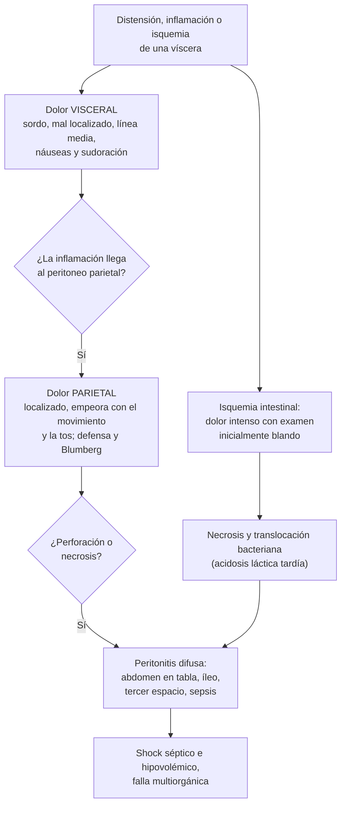

---
tags:
  - Gastroenterología
  - Urgencia
  - Frecuente en sala
---

# Abdomen agudo (incluido el del adulto mayor)

**Subespecialidad**
Cirugía · Gastroenterología · Medicina de urgencia · Geriatría

**Guías principales**
WSES 2025: apendicitis aguda (Jerusalén, *JAMA Surg* 2026) · WSES 2022: isquemia mesentérica aguda · Guías de Bolonia 2017 (WSES): obstrucción intestinal por bridas · WSES 2020: úlcera péptica perforada y sangrante · WSES 2020: diverticulitis aguda · ACR Appropriateness Criteria 2018: dolor abdominal agudo no localizado

**Otras fuentes**
Revisión Cochrane de analgesia en el dolor abdominal agudo (Manterola, Temuco, 2011) · CODA (antibióticos vs. apendicectomía, *NEJM* 2020) · STOP-IT (*NEJM* 2015) · Estudio multicéntrico de dolor abdominal en mayores de 60 años (Lewis, 2005) · Serie UC de obstrucción por bridas (Quezada-Sanhueza, 2014)

**GES**
No

**EUNACOM**
1.06.2.001 Abdomen agudo (específico, inicial, derivar) · 1.07.2.001 Abdomen agudo en adulto mayor (específico, inicial, derivar) · 1.06.1.016 Enfermedad diverticular complicada (sospecha, inicial, derivar) · 1.06.1.017 Enfermedad diverticular no complicada (sospecha, inicial, completo)

**Revisado**
Septiembre 2026

!!! abstract "Resumen en 60 segundos"
    - **Abdomen agudo**: dolor abdominal de **inicio reciente** que puede requerir **tratamiento quirúrgico urgente**. Lo primero es decidir si el paciente está **inestable** o tiene **peritonitis**.
    - **Analgesia precoz**: los opioides **no** aumentan los errores diagnósticos (Cochrane, Manterola 2011).
    - **Estudio básico**: hemograma, PCR, **lipasa**, perfil hepático, creatinina, electrolitos, **lactato**, orina, **β-hCG** en mujeres fértiles y **ECG** si el dolor es alto o el paciente es mayor.
    - **Imagen**: la **TC con contraste EV** es el examen más útil en el adulto. La ecografía es de elección en la **vesícula**, la **embarazada** y la patología **ginecológica**.
    - **Causas que no se pueden perder**: apendicitis, **perforación**, **obstrucción**, **isquemia mesentérica**, **aneurisma aórtico roto**, colecistitis y colangitis, pancreatitis, **embarazo ectópico**, torsión. También causas **médicas** (IAM, CAD, neumonía).
    - **Isquemia mesentérica**: dolor **desproporcionado al examen** en un paciente con FA o aterosclerosis. **Angio-TC** precoz, **heparina** y cirugía o revascularización. Mortalidad **> 50 %**.
    - **Adulto mayor**: presentación **atípica** (menos fiebre, leucocitosis y signos peritoneales). ~ **60 %** se hospitaliza, ~ **20 %** requiere cirugía o un procedimiento y ~ **5 %** muere en 2 semanas (Lewis, 2005). **TC precoz** y pensar primero en lo **vascular**.
    - **Derivar** a cirugía todo abdomen agudo quirúrgico, tras estabilizar: régimen cero, volumen, analgesia, antieméticos, sonda nasogástrica si hay obstrucción y **antibióticos** si hay peritonitis o sepsis.

## Definición

- **Abdomen agudo**: cuadro de **dolor abdominal de inicio reciente** (horas a pocos días), con o sin otros síntomas, que obliga a un **diagnóstico rápido** porque puede requerir una **intervención urgente**.
- **Abdomen agudo quirúrgico**: su causa se resuelve con cirugía o un procedimiento (apendicitis, perforación, obstrucción complicada, isquemia).
- **Abdomen agudo médico**: el dolor tiene una causa no quirúrgica (gastroenteritis, pielonefritis, **cetoacidosis diabética**, IAM inferior, neumonía basal).
- **Peritonitis**: inflamación del peritoneo, localizada o **difusa**. Se manifiesta como **resistencia muscular**, **dolor a la descompresión** (Blumberg) y, en la difusa, **abdomen en tabla**.
- **Tipos de dolor**:
    - **Visceral**: sordo, mal localizado, en la línea media (epigastrio, periumbilical o hipogastrio), con náuseas y sudoración.
    - **Parietal (somático)**: intenso, **bien localizado**, empeora con el movimiento y la tos (irritación peritoneal).
    - **Referido**: en un sitio distante (hombro en la irritación diafragmática; región escapular en la patología biliar).

## Epidemiología

### Mundial

- El dolor abdominal es una de las causas más frecuentes de consulta en urgencia.
- La **apendicitis aguda** es la **urgencia quirúrgica abdominal más frecuente** del mundo (WSES 2025).
- **Úlcera péptica**: prevalencia de vida de **5–10 %**; el **10–20 %** de los pacientes tiene complicaciones (perforación o sangrado) (WSES 2020).
- **Isquemia mesentérica aguda**: rara (**0,09–0,2 %** de los ingresos quirúrgicos agudos) pero aumenta con la edad, y su **mortalidad supera el 50 %** (WSES 2022).
- **Adulto mayor** (≥ 60 años, 360 pacientes en urgencia; Lewis, 2005):
    - Hospitalización **58 %**; cirugía o procedimiento invasivo **18 %**; mortalidad a 2 semanas **5 %**.
    - Causas más frecuentes: dolor inespecífico (14,8 %), **infección urinaria** (8,6 %), **obstrucción intestinal** (8 %), gastroenteritis (6,8 %) y **diverticulitis** (6,5 %).
    - El diagnóstico en urgencia coincidió con el final sólo en el **76 %** en los mayores.

### Chile

!!! chile "Contexto nacional"
    - La revisión **Cochrane** sobre analgesia en el dolor abdominal agudo es de autores chilenos (**Manterola y cols., Universidad de La Frontera, Temuco**). Concluyó que los **opioides no aumentan el riesgo de error diagnóstico** ni de error en la decisión terapéutica.
    - **Obstrucción intestinal por bridas en la Red UC** (164 pacientes, 2007–2010; Quezada-Sanhueza, 2014):
        - Edad media **60 años**; el **87 %** tenía una cirugía abdominal previa y el **52 %** requirió cirugía.
        - Los **signos de isquemia en la TC con contraste** tuvieron una sensibilidad de **72,5 %** y una especificidad de **97,5 %**.
        - Con signos de isquemia y obstrucción de alto grado, la probabilidad de cirugía fue de **83 %**; sin ninguno de los dos, de **36 %**.
    - El abdomen agudo **no es un problema GES** como tal, pero sí lo son algunas de sus causas o consecuencias (por ejemplo, el **politraumatizado grave**).

## Etiología

| Mecanismo | Causas |
|---|---|
| **Inflamatorio o infeccioso** | **Apendicitis**, **colecistitis** y colangitis, **pancreatitis**, **diverticulitis**, enfermedad inflamatoria pélvica, absceso hepático |
| **Perforación** | **Úlcera péptica perforada**, diverticulitis perforada, perforación por cuerpo extraño, tumor o isquemia |
| **Obstructivo** | **Obstrucción intestinal** (**bridas**, **hernias atascadas**, tumores, **vólvulo** de sigmoides, íleo biliar), obstrucción biliar |
| **Vascular** | **Isquemia mesentérica** (embolia, trombosis, no oclusiva, trombosis venosa), **aneurisma aórtico roto**, **disección aórtica**, infarto esplénico o renal, colitis isquémica |
| **Hemorrágico** | **Embarazo ectópico roto**, rotura esplénica, quiste ovárico hemorrágico, hematoma de la vaina de los rectos (anticoagulados) |
| **Ginecológico y urológico** | Torsión ovárica o testicular, **cólico renal**, pielonefritis, **retención urinaria** |
| **Médico (extraabdominal o metabólico)** | **IAM inferior**, neumonía basal, pericarditis, **cetoacidosis diabética**, insuficiencia suprarrenal, hipercalcemia, porfiria, crisis de anemia falciforme, abstinencia de opioides, herpes zóster, intoxicación por plomo |

<figure markdown>
![Cuadrícula de nueve regiones abdominales con las causas principales de dolor en cada una. Hipocondrio derecho: colecistitis, colangitis, hepatitis, neumonía basal derecha. Epigastrio: úlcera perforada, pancreatitis, infarto inferior. Hipocondrio izquierdo: infarto esplénico, pancreatitis, neumonía basal izquierda. Flancos: cólico renal, pielonefritis, apendicitis retrocecal o diverticulitis. Periumbilical: apendicitis inicial, obstrucción, isquemia mesentérica, aneurisma aórtico. Fosas ilíacas: apendicitis a la derecha, diverticulitis a la izquierda, patología anexial y hernias. Hipogastrio: retención urinaria, cistitis, enfermedad inflamatoria pélvica. A la izquierda, un recuadro con las causas de dolor difuso y las causas médicas; a la derecha, un recuadro con las claves del adulto mayor](../assets/figuras/abdomen/causas-por-cuadrante.svg){ loading=lazy }
<figcaption>Figura 1. Causas principales de abdomen agudo según la localización del dolor, causas de dolor difuso y claves del adulto mayor. Esquema propio.</figcaption>
</figure>

## Fisiopatología

*Figura 2. Del dolor visceral a la peritonitis. Esquema propio.*

- **Apendicitis**: la obstrucción de la luz (fecalito, hiperplasia linfoide) lleva a distensión e isquemia. El dolor empieza **periumbilical** (visceral) y **migra a la fosa ilíaca derecha** (parietal) en 12–24 horas.
- **Obstrucción intestinal**: el intestino proximal se distiende con gas y líquido, lo que produce vómitos, **tercer espacio** e hipovolemia. En la **estrangulación**, el compromiso vascular produce isquemia y perforación.
- **Isquemia mesentérica**: al inicio, el peritoneo no está comprometido, por eso el dolor es **desproporcionado** al examen. Cuando aparecen los signos peritoneales, suele haber **necrosis**.

## Clasificación

| Según | Categorías |
|---|---|
| **Estado del paciente** | **Inestable** (shock, peritonitis difusa) · **estable** |
| **Mecanismo** | Inflamatorio · perforativo · obstructivo · vascular · hemorrágico · médico |
| **Conducta** | **Quirúrgico** · **médico** |

**Diverticulitis aguda (WSES 2020)**

| Tipo | Hallazgos en la TC | Manejo |
|---|---|---|
| **No complicada** | Engrosamiento de la pared y compromiso de la grasa pericólica, sin absceso ni perforación | **Ambulatorio** si tolera la vía oral; en inmunocompetentes, los **antibióticos pueden omitirse** |
| **Con absceso < 4–5 cm** | Absceso pequeño | **Antibióticos** (hospitalizado) |
| **Con absceso ≥ 4–5 cm** | Absceso grande | **Drenaje percutáneo** + antibióticos |
| **Con peritonitis purulenta o fecaloidea** (Hinchey III–IV) | Gas y líquido libre difusos | **Cirugía urgente** (resección con anastomosis ± ostomía, u **operación de Hartmann** si está inestable) |

## Clínica

- **Anamnesis**:
    - Inicio (**súbito**: perforación, vascular, torsión, ruptura; **progresivo**: inflamatorio), localización y **migración**, irradiación, carácter, intensidad.
    - Síntomas asociados: vómitos (antes o después del dolor), **fiebre**, detención de gases y deposiciones, diarrea, síntomas urinarios, **fecha de la última menstruación**.
    - Antecedentes: **cirugías previas** (bridas), **hernias**, **FA** y anticoagulación, aterosclerosis, **AINE** y corticoides, alcohol, litiasis biliar, diabetes, cáncer.
- **Examen físico**:
    - **Signos vitales** (el primer signo de gravedad suele ser la **taquicardia**), estado de hidratación, ictericia.
    - Inspección (distensión, cicatrices, **hernias**), auscultación (ruidos aumentados en la obstrucción inicial, **silencio** en la peritonitis o el íleo), percusión (timpanismo, matidez).
    - Palpación: dolor, **resistencia muscular**, **Blumberg**, masas, **orificios herniarios**; **pulsos femorales** y **aorta** (masa pulsátil).
    - Signos específicos: **Murphy** (colecistitis); **McBurney**, **Rovsing**, psoas y obturador (apendicitis).
    - **Tacto rectal** y examen **ginecológico** o **testicular** según el caso.
- **Adulto mayor**:
    - Dolor y fiebre **menos intensos**, **menos leucocitosis**, signos peritoneales **atenuados** (menor masa muscular, fármacos).
    - Puede presentarse sólo como **delirium**, caídas, anorexia o deterioro funcional.
    - Fármacos que enmascaran: **corticoides**, **betabloqueadores** (sin taquicardia), analgésicos, AINE.
    - **Mayor frecuencia** de causas graves: **isquemia mesentérica**, **aneurisma aórtico**, obstrucción, diverticulitis complicada, colecistitis, apendicitis **perforada** y cáncer de colon.

!!! alarma "Signos de alarma"
    - **Shock** (hipotensión, taquicardia, lactato alto) o **peritonitis difusa**: reanimar y **llamar a cirugía de inmediato**.
    - **Dolor desproporcionado al examen** en un paciente con **FA**, aterosclerosis, insuficiencia cardíaca o bajo gasto: **isquemia mesentérica** hasta demostrar lo contrario.
    - **Adulto mayor** con dolor abdominal y **hipotensión** o una **masa pulsátil**: **aneurisma aórtico roto**.
    - **Mujer en edad fértil** con dolor pélvico y **β-hCG positiva**, sobre todo con hipotensión: **embarazo ectópico roto**.
    - **Vómitos fecaloideos**, distensión y ausencia de gases con **dolor continuo**, fiebre o taquicardia: **obstrucción estrangulada**.
    - **Hernia** dolorosa, irreductible y tensa: **atascamiento o estrangulación**.
    - Dolor epigástrico súbito "**en puñalada**" con abdomen en tabla: **úlcera perforada**.
    - Fiebre, ictericia y dolor en el hipocondrio derecho: **colangitis** (tríada de Charcot).

## Diagnóstico

- El diagnóstico es **clínico**, apoyado por el laboratorio y la imagen. Reevaluar al paciente en forma **seriada** (idealmente el mismo examinador).
- **Apendicitis**: usar un **puntaje clínico** para estratificar el riesgo y decidir la imagen (WSES 2025).

!!! guia "Puntaje de Alvarado (MANTRELS) para la apendicitis"
    | Elemento | Puntos |
    |---|---|
    | **M**igración del dolor a la fosa ilíaca derecha | 1 |
    | **A**norexia | 1 |
    | **N**áuseas o vómitos | 1 |
    | **T**ensión (dolor) en la fosa ilíaca derecha | 2 |
    | **R**ebote (Blumberg) | 1 |
    | **E**levación de la temperatura (≥ 37,3 °C) | 1 |
    | **L**eucocitosis (> 10 000/mm³) | 2 |
    | De**s**viación a izquierda | 1 |

    - **≤ 4**: riesgo bajo · **5–6**: intermedio (imagen) · **≥ 7**: alto.
    - La WSES prefiere puntajes más modernos (**AIR** y **AAS**), que reducen las apendicectomías negativas; todos se combinan con la imagen en los casos intermedios.

- **Isquemia mesentérica** (WSES 2022):
    - El **dolor desproporcionado al examen** debe considerarse isquemia mesentérica hasta demostrar lo contrario (recomendación fuerte).
    - Ningún examen de laboratorio la confirma ni la descarta. El **lactato**, la leucocitosis y el **dímero D** ayudan (el lactato alto es tardío).
    - La **angio-TC** es el examen diagnóstico y no debe retrasarse, aun con la función renal alterada.

## Laboratorio

- **Hemograma** (leucocitosis, desviación a izquierda, anemia), **PCR**.
- **Lipasa** (pancreatitis), **perfil hepático** y bilirrubina.
- **Creatinina**, **electrolitos**, **glicemia** (y cetonemia si hay hiperglicemia: la **CAD** causa dolor abdominal).
- **Gases y lactato** (isquemia, sepsis, shock).
- **Orina completa** (ITU, cólico renal; puede haber leucocituria leve en la apendicitis).
- **β-hCG** en **toda mujer en edad fértil**.
- **ECG** y **troponina** en el dolor de abdomen superior, el adulto mayor y los pacientes con factores de riesgo cardiovascular.
- **Pruebas de coagulación**, **grupo y Rh** si puede requerir cirugía; hemocultivos si hay fiebre o sepsis.

## Imágenes

| Examen | Uso principal |
|---|---|
| **TC de abdomen y pelvis con contraste EV** | El examen **más útil** en el adulto con dolor abdominal agudo no localizado (ACR). Apendicitis en adultos con riesgo intermedio, **obstrucción** (causa, grado, **signos de isquemia**), perforación (**neumoperitoneo**), diverticulitis, abscesos |
| **Angio-TC** | **Isquemia mesentérica**, **aneurisma aórtico**, disección |
| **Ecografía** | **Vesícula y vía biliar**, patología **ginecológica**, **embarazada**, niños y jóvenes delgados con sospecha de apendicitis, **aorta** y **eFAST** al lado de la cama |
| **Radiografía de tórax de pie** | **Neumoperitoneo** (aire bajo el diafragma) en la sospecha de perforación, si no hay TC disponible |
| **Radiografía de abdomen simple** | **Niveles hidroaéreos** y distensión en la obstrucción; **vólvulo** de sigmoides ("grano de café"); menos sensible que la TC |
| **Contraste hidrosoluble oral** (Gastrografin) | En la obstrucción por bridas: predice la resolución sin cirugía y puede ser terapéutico (Bolonia 2017) |

## Diagnóstico diferencial

Ver la tabla de etiología y la figura 1. Siempre descartar las causas **extraabdominales** (IAM inferior, neumonía basal, **cetoacidosis diabética**, torsión testicular, herpes zóster) y **ginecológicas**.

## Tratamiento

### Manejo inicial (antes de la derivación)

1. **ABC** y evaluación de la gravedad. En el **shock**: 2 vías venosas gruesas, **cristaloides**, hemocultivos y **antibióticos** si hay sepsis (en la primera hora), vasoactivos si no responde.
2. **Régimen cero**.
3. **Analgesia precoz** (no esperar al cirujano): los opioides **no** enmascaran el diagnóstico.
4. **Antieméticos**.
5. **Sonda nasogástrica** si hay obstrucción o vómitos persistentes; **sonda Foley** para medir la diuresis en el paciente grave.
6. **Antibióticos** si hay peritonitis, perforación, colangitis, sepsis o absceso (ver dosis).
7. Corregir los **electrolitos** y la glicemia.
8. **Evaluación por cirugía** precoz; **reevaluación seriada** si el diagnóstico no es claro.

### Manejo específico (por el cirujano o el especialista)

| Cuadro | Conducta principal |
|---|---|
| **Apendicitis** (WSES 2025) | **Apendicectomía laparoscópica**. En la no complicada puede diferirse **hasta 24 h** sin más complicaciones. El manejo **no operatorio con antibióticos** es seguro en casos **seleccionados** no complicados. En CODA, el **29 %** requirió apendicectomía a los 90 días (41 % si había **apendicolito**, con más complicaciones). En la complicada, antibióticos posoperatorios por **2–3 días** |
| **Obstrucción por bridas** (Bolonia 2017) | **Manejo no operatorio** en la mayoría: régimen cero, **sonda nasogástrica**, volumen y electrolitos, **contraste hidrosoluble**. **Cirugía** si hay **peritonitis, estrangulación o isquemia**, o si no resuelve |
| **Hernia atascada o estrangulada** | Cirugía urgente (reducción manual sólo si no hay signos de estrangulación) |
| **Úlcera perforada** (WSES 2020) | Reanimación, **IBP EV**, **antibióticos**, **cirugía** (sutura con parche de epiplón, a menudo laparoscópica); luego erradicar ***H. pylori*** y suspender los AINE |
| **Isquemia mesentérica** (WSES 2022) | **Heparina no fraccionada** en dosis plena de inmediato, volumen, antibióticos; **revascularización** (endovascular si está disponible) y **laparotomía** si hay peritonitis o necrosis. La **trombosis venosa mesentérica** sin peritonitis se trata con heparina |
| **Diverticulitis no complicada** | **Ambulatorio**, dieta según tolerancia, analgesia; antibióticos sólo si hay factores de riesgo (inmunosupresión, comorbilidad, sepsis, mala evolución). **Colonoscopia** diferida si no hay una reciente, sobre todo tras un episodio complicado |
| **Diverticulitis complicada** | Hospitalizar; antibióticos; **drenaje percutáneo** si el absceso es ≥ 4–5 cm; **cirugía** si hay peritonitis difusa |
| **Aneurisma aórtico roto** | **Hipotensión permisiva**, transfusión, **cirugía vascular** inmediata |
| **Colecistitis, colangitis y pancreatitis** | Ver los resúmenes de [litiasis biliar](litiasis-biliar-colecistitis-colangitis.md) y [pancreatitis aguda](pancreatitis-aguda.md) |

!!! dosis "Dosis"
    - **Analgesia**:
        - **Paracetamol** 1 g EV c/8 h (máximo 3–4 g/día).
        - **Metamizol** 1 g EV c/8 h.
        - **Morfina** 0,05–0,1 mg/kg EV titulada (en el adulto mayor, bolos de 1–2 mg).
        - Evitar los **AINE** si hay sangrado, LRA, úlcera o anticoagulación.
    - **Antieméticos**: **ondansetrón** 4–8 mg EV o **metoclopramida** 10 mg EV (no usarla si hay obstrucción mecánica).
    - **Antibióticos en la infección intraabdominal complicada** de la comunidad (ajustar según la epidemiología local):
        - **Leve a moderada**: **ceftriaxona** 2 g EV/día + **metronidazol** 500 mg EV c/8 h.
        - **Grave o con shock**: **piperacilina-tazobactam** 4,5 g EV c/6 h, o un **carbapenémico** si hay riesgo de BLEE.
        - **Duración**: con un **foco controlado** (cirugía o drenaje), **~ 4 días** son suficientes (STOP-IT: igual de eficaz que ~ 8 días).
    - **Heparina no fraccionada** (isquemia mesentérica): bolo de 80 U/kg y luego 18 U/kg/h, ajustando por TTPa o anti-Xa.
    - **IBP** en la úlcera perforada: omeprazol o esomeprazol 40 mg EV c/12 h.

## Complicaciones

- **Peritonitis difusa**, **sepsis** y shock séptico; **abscesos** intraabdominales.
- **Shock hipovolémico** por el tercer espacio, los vómitos o la hemorragia.
- **Necrosis intestinal** (estrangulación, isquemia) e intestino corto tras resecciones extensas.
- **Lesión renal aguda**, alteraciones electrolíticas, **aspiración** de vómitos.
- Complicaciones posoperatorias: infección de la herida, fístulas, eventración, **íleo**, bridas (futura obstrucción).
- En el adulto mayor: **delirium**, neumonía, deterioro funcional y mayor mortalidad.

## Pronóstico y seguimiento

- **Apendicitis no complicada**: excelente pronóstico con cirugía; tras el manejo con antibióticos, **~ 3 de cada 10** terminan operados en los meses siguientes (CODA).
- **Isquemia mesentérica**: mortalidad **> 50 %**; depende de la **rapidez** del diagnóstico y la reperfusión.
- **Obstrucción por bridas**: la mayoría se resuelve sin cirugía, pero **recurre** (más en los jóvenes).
- **Adulto mayor**: más hospitalización y cirugía, **mortalidad a 2 semanas de ~ 5 %** y menor concordancia diagnóstica en la urgencia (Lewis, 2005).
- **Diverticulitis**: tras el episodio, colonoscopia si no hay una reciente (descartar un **cáncer**); discutir la cirugía electiva sólo en casos seleccionados.
- Tras el manejo no operatorio de una apendicitis complicada con **absceso**, hacer **seguimiento** (colonoscopia o imagen) para descartar una **neoplasia**, sobre todo en los mayores (WSES 2025).

## Perlas para el internado

!!! perla "Para la sala y el turno"
    - **Pon analgesia**: un paciente sin dolor se examina mejor, y los opioides no ocultan el diagnóstico (Cochrane chilena).
    - La **β-hCG** y el **ECG** son parte del estudio del dolor abdominal, no un lujo.
    - Un examen abdominal "**blando**" con dolor **intenso** es la clave de la **isquemia mesentérica** (y del aneurisma). No lo mandes a casa con "gastroenteritis".
    - En el **adulto mayor**, la ausencia de fiebre y de leucocitosis **no descarta** nada: pide una **TC con contraste** con un umbral bajo.
    - **Revisa los orificios herniarios** en toda obstrucción intestinal y las **cicatrices** (bridas).
    - Un paciente con **betabloqueadores** puede estar en shock **sin taquicardia**; uno con **corticoides**, peritonítico **sin defensa**.
    - La **metoclopramida** está **contraindicada** en la obstrucción mecánica.
    - La **CAD** puede simular un abdomen agudo: mide la glicemia (y las cetonas) a todo paciente con dolor abdominal y vómitos.
    - Reevalúa al paciente cada pocas horas y registra la evolución: el abdomen agudo **cambia**.

## Preguntas de repaso

??? repaso "1. Hombre de 22 años con dolor periumbilical de 18 horas que migró a la fosa ilíaca derecha, anorexia, vómitos, T 37,8 °C, Blumberg positivo, leucocitos 14 500 con desviación a izquierda. ¿Cuál es su Alvarado y qué haces?"
    **Alvarado 10** (migración 1, anorexia 1, vómitos 1, dolor en la fosa ilíaca derecha 2, rebote 1, fiebre 1, leucocitosis 2, desviación 1): **apendicitis muy probable**.

    - Régimen cero, **vía venosa**, **analgesia** (no retrasarla), antieméticos.
    - **Evaluación por cirugía** para una **apendicectomía laparoscópica** (la imagen es opcional con un puntaje alto en un hombre joven, según el protocolo local).
    - Antibiótico profiláctico preoperatorio; si es complicada, antibióticos posoperatorios por 2–3 días.

??? repaso "2. Mujer de 78 años con FA sin anticoagulación, que consulta por dolor abdominal intenso de 4 horas. Está quejumbrosa, pero el abdomen es blando y poco doloroso a la palpación. Lactato 2,8 mmol/L. ¿Qué sospechas y qué haces?"
    **Isquemia mesentérica aguda por embolia** (dolor **desproporcionado** al examen en una paciente con FA).

    - **Angio-TC urgente** (no esperar el alza del lactato; la creatinina no debe retrasarla).
    - **Heparina no fraccionada** en dosis plena, volumen, antibióticos, régimen cero, sonda nasogástrica.
    - Llamar a **cirugía** y a **radiología intervencional**: revascularización (endovascular o quirúrgica) y laparotomía si hay necrosis.
    - Mortalidad > 50 %: el tiempo es intestino.

??? repaso "3. Hombre de 65 años con dos laparotomías previas, que consulta por dolor cólico, distensión, vómitos y ausencia de gases hace 36 horas. Afebril, FC 95, sin signos peritoneales. ¿Qué haces?"
    **Obstrucción intestinal probablemente por bridas.**

    - Régimen cero, **sonda nasogástrica**, **volumen** y corrección de **electrolitos** (potasio), sonda Foley si está deshidratado.
    - **TC con contraste EV**: confirma la obstrucción, su grado y busca **signos de isquemia** (en la serie UC, con isquemia y obstrucción de alto grado, el 83 % se operó).
    - Revisar los **orificios herniarios**.
    - **Contraste hidrosoluble** si no hay signos de estrangulación: predice la resolución.
    - **Cirugía** si aparecen fiebre, taquicardia, dolor continuo, peritonitis, signos de isquemia en la TC o si no resuelve.

??? repaso "4. Hombre de 55 años, usuario de AINE, con dolor epigástrico súbito 'en puñalada' hace 3 horas. Abdomen en tabla, FC 118. ¿Qué sospechas y qué pides?"
    **Úlcera péptica perforada** con peritonitis.

    - **Radiografía de tórax de pie** (neumoperitoneo) o, mejor, **TC** si está estable.
    - Reanimación con volumen, **IBP EV**, **antibióticos** (ceftriaxona + metronidazol), sonda nasogástrica, analgesia.
    - **Cirugía urgente** (sutura con parche de epiplón).
    - Después: erradicar ***H. pylori*** y suspender los AINE.
    - ECG y lipasa para descartar un IAM y una pancreatitis.

??? repaso "5. Mujer de 70 años con dolor en la fosa ilíaca izquierda de 3 días, T 37,9 °C, dolor localizado sin peritonitis difusa. La TC muestra una diverticulitis con un absceso pericólico de 6 cm. ¿Qué haces?"
    **Diverticulitis complicada con absceso grande** (≥ 4–5 cm).

    - **Hospitalizar**, **antibióticos EV** (ceftriaxona + metronidazol o amoxicilina-ácido clavulánico).
    - **Drenaje percutáneo** guiado por imagen (WSES 2020).
    - Cirugía si aparece una peritonitis difusa o no mejora.
    - **Colonoscopia** diferida (6–8 semanas) para descartar un cáncer.
    - Si el absceso fuera < 4–5 cm: antibióticos solos.

??? repaso "6. ¿Qué diferencias esperas en la presentación del abdomen agudo en un paciente de 85 años respecto de uno de 30?"
    - **Menos fiebre**, **menos leucocitosis** y **signos peritoneales atenuados**; el dolor puede ser leve o ausente.
    - Puede presentarse como **delirium**, caídas, anorexia o deterioro funcional.
    - **Fármacos** que enmascaran: corticoides, betabloqueadores, analgésicos.
    - **Causas más graves y frecuentes**: isquemia mesentérica, aneurisma aórtico, obstrucción, diverticulitis complicada, colecistitis, apendicitis perforada, cáncer.
    - **Más hospitalización, cirugía y mortalidad** (~ 5 % a 2 semanas en Lewis, 2005), y más errores diagnósticos.
    - Conducta: **umbral bajo para la TC con contraste**, ECG y troponina, lactato, y reevaluación seriada.

## Referencias

1. Podda M, Ceresoli M, De Simone B, et al. Diagnosis and treatment of acute appendicitis: 2025 edition of the World Society of Emergency Surgery Jerusalem guidelines. *JAMA Surg.* 2026;161:283–295. doi:[10.1001/jamasurg.2025.6218](https://doi.org/10.1001/jamasurg.2025.6218)
2. Di Saverio S, Podda M, De Simone B, et al. Diagnosis and treatment of acute appendicitis: 2020 update of the WSES Jerusalem guidelines. *World J Emerg Surg.* 2020;15:27. doi:[10.1186/s13017-020-00306-3](https://doi.org/10.1186/s13017-020-00306-3)
3. Bala M, Catena F, Kashuk J, et al. Acute mesenteric ischemia: updated guidelines of the World Society of Emergency Surgery. *World J Emerg Surg.* 2022;17:54. doi:[10.1186/s13017-022-00443-x](https://doi.org/10.1186/s13017-022-00443-x)
4. Ten Broek RPG, Krielen P, Di Saverio S, et al. Bologna guidelines for diagnosis and management of adhesive small bowel obstruction (ASBO): 2017 update of the evidence-based guidelines from the World Society of Emergency Surgery ASBO working group. *World J Emerg Surg.* 2018;13:24. doi:[10.1186/s13017-018-0185-2](https://doi.org/10.1186/s13017-018-0185-2)
5. Tarasconi A, Coccolini F, Biffl WL, et al. Perforated and bleeding peptic ulcer: WSES guidelines. *World J Emerg Surg.* 2020;15:3. doi:[10.1186/s13017-019-0283-9](https://doi.org/10.1186/s13017-019-0283-9)
6. Sartelli M, Weber DG, Kluger Y, et al. 2020 update of the WSES guidelines for the management of acute colonic diverticulitis in the emergency setting. *World J Emerg Surg.* 2020;15:32. doi:[10.1186/s13017-020-00313-4](https://doi.org/10.1186/s13017-020-00313-4)
7. Expert Panel on Gastrointestinal Imaging; Scheirey CD, Fowler KJ, et al. ACR Appropriateness Criteria® acute nonlocalized abdominal pain. *J Am Coll Radiol.* 2018;15(11S):S217–S231. doi:[10.1016/j.jacr.2018.09.010](https://doi.org/10.1016/j.jacr.2018.09.010)
8. Manterola C, Vial M, Moraga J, Astudillo P. Analgesia in patients with acute abdominal pain. *Cochrane Database Syst Rev.* 2011;(1):CD005660. doi:[10.1002/14651858.CD005660.pub3](https://doi.org/10.1002/14651858.CD005660.pub3)
9. CODA Collaborative; Flum DR, Davidson GH, et al. A randomized trial comparing antibiotics with appendectomy for appendicitis. *N Engl J Med.* 2020;383:1907–1919. doi:[10.1056/NEJMoa2014320](https://doi.org/10.1056/NEJMoa2014320)
10. Sawyer RG, Claridge JA, Nathens AB, et al. Trial of short-course antimicrobial therapy for intraabdominal infection. *N Engl J Med.* 2015;372:1996–2005. doi:[10.1056/NEJMoa1411162](https://doi.org/10.1056/NEJMoa1411162)
11. Lewis LM, Banet GA, Blanda M, et al. Etiology and clinical course of abdominal pain in senior patients: a prospective, multicenter study. *J Gerontol A Biol Sci Med Sci.* 2005;60:1071–1076. doi:[10.1093/gerona/60.8.1071](https://doi.org/10.1093/gerona/60.8.1071)
12. Quezada-Sanhueza N, León-Ferrufino F, Bächler-González J, et al. [The role of contrast-enhanced computed tomography scan in clinical decision in the management of adhesive small bowel obstruction] (artículo en español). *Cir Cir.* 2014;82:637–646. [PubMed](https://pubmed.ncbi.nlm.nih.gov/25393862/)
13. Alvarado A. A practical score for the early diagnosis of acute appendicitis. *Ann Emerg Med.* 1986;15:557–564. doi:[10.1016/s0196-0644(86)80993-3](https://doi.org/10.1016/s0196-0644(86)80993-3)
