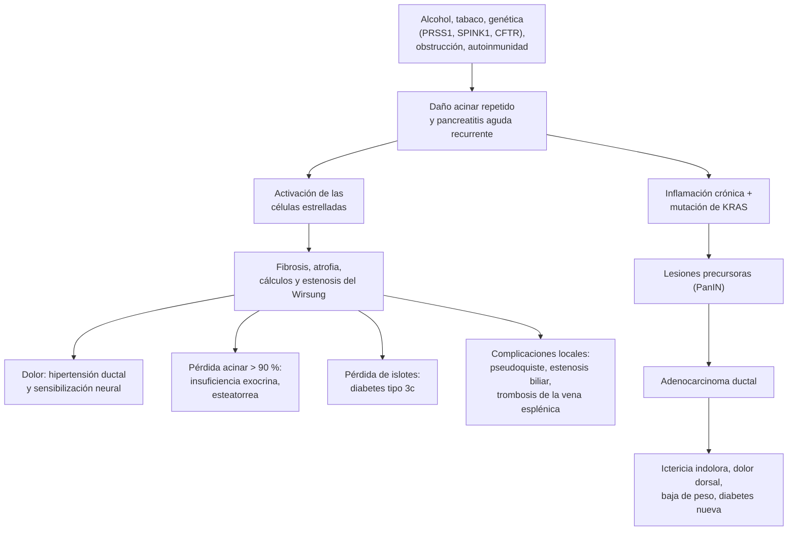

---
tags:
  - Gastroenterología
---

# Cáncer de páncreas y pancreatitis crónica

**Subespecialidad**
Gastroenterología · Cirugía hepatobiliopancreática · Oncología · Atención primaria

**Guías principales**
ACG 2020: pancreatitis crónica · UEG (HaPanEU) 2017: pancreatitis crónica · AGA 2023: insuficiencia pancreática exocrina · ESMO 2023: cáncer de páncreas

**Otras fuentes**
ESCAPE (cirugía precoz frente a endoscopía en el dolor, 2020) · PRODIGE 24 (FOLFIRINOX adyuvante, 2018) · NAPOLI-3 (NALIRIFOX, 2023) · POLO (olaparib, 2019) · Cáncer de páncreas en la pancreatitis crónica, con imágenes (Le Cosquer 2023)

**GES**
No es GES. En **julio de 2026** el Ministerio de Salud anunció la incorporación progresiva de **todos los cánceres** en el próximo decreto GES (2028–2031).

**EUNACOM**
1.06.1.002 Cáncer de páncreas (sospecha, inicial, derivar) · 1.06.1.025 Pancreatitis crónica (sospecha, inicial, derivar)

**Revisado**
Octubre 2026

!!! abstract "Resumen en 60 segundos"
    - **Pancreatitis crónica**: inflamación y **fibrosis progresiva** del páncreas, con daño **irreversible**.
        - **Causas**: sobre todo **alcohol** y **tabaco**; también genética, obstrucción, autoinmune e idiopática.
        - **Tríada**: **dolor** abdominal crónico, **insuficiencia exocrina** (esteatorrea, baja de peso) y **diabetes** (tipo 3c); con **calcificaciones** en la TC.
        - **Diagnóstico**: **TC** (calcificaciones, dilatación del Wirsung, atrofia); colangio-RM o endosonografía en los casos dudosos. **Elastasa fecal** para la insuficiencia exocrina. La lipasa suele ser **normal**.
        - **Tratamiento**:
            - **Dejar el alcohol y el tabaco**.
            - **Analgesia** escalonada; **drenaje endoscópico o cirugía** si el conducto está obstruido (la **cirugía precoz** alivia más el dolor que la endoscopía).
            - **Enzimas pancreáticas** (≥ 40 000 U de lipasa por comida).
            - Manejo de la **diabetes** (riesgo de hipoglicemia).
    - **Cáncer de páncreas** (adenocarcinoma ductal): uno de los cánceres **más letales** (sobrevida a 5 años de ~10 %).
        - **Factores de riesgo**: **tabaco**, obesidad, **diabetes**, **pancreatitis crónica**, antecedentes familiares y genéticos (*BRCA2*).
        - **Sospechar** ante:
            - **ictericia indolora** (cabeza);
            - **dolor epigástrico** que se irradia al **dorso**;
            - **baja de peso**;
            - **diabetes de inicio reciente** en > 50 años;
            - tromboflebitis migratoria (Trousseau).
        - **Estudio**: **TC multifásica** con protocolo de páncreas; **endosonografía con punción** para la biopsia. El **CA 19-9** no diagnostica.
        - **Según la resecabilidad**:
            - **Resecable** (~15–20 %): **cirugía** + **mFOLFIRINOX adyuvante**.
            - **Limítrofe**: **neoadyuvancia**.
            - **Localmente avanzado** o **metastásico**: **quimioterapia** y **cuidados paliativos** precoces.

## Definición

| Concepto | Definición |
|---|---|
| **Pancreatitis crónica** | Síndrome **fibroinflamatorio** patológico del páncreas, en personas con factores de riesgo genéticos, ambientales u otros, que desarrollan respuestas patológicas persistentes al daño del parénquima (ACG 2020). Produce **fibrosis**, **atrofia**, **calcificaciones**, alteraciones de los **conductos** y pérdida de la función **exocrina** y **endocrina** |
| **Pancreatitis aguda recurrente** | ≥ 2 episodios de pancreatitis aguda con normalización entre ellos; puede evolucionar a la pancreatitis crónica ([ver pancreatitis aguda](pancreatitis-aguda.md)) |
| **Insuficiencia pancreática exocrina** | Secreción enzimática insuficiente para digerir los alimentos: **maldigestión** de grasas (esteatorrea) y proteínas ([ver malabsorción](enfermedad-celiaca-intolerancia-a-la-lactosa-y-malabsorcion.md)) |
| **Diabetes pancreatogénica** (tipo 3c) | Diabetes por la **destrucción de los islotes** (pérdida de insulina **y** de glucagón): riesgo de **hipoglicemias** |
| **Pancreatitis autoinmune** | **Tipo 1**: enfermedad relacionada con **IgG4** (sistémica). **Tipo 2**: asociada a la EII. Ambas responden a los **corticoides** |
| **Adenocarcinoma ductal de páncreas** | **~90 %** de los cánceres de páncreas; nace del epitelio de los conductos |
| **Neoplasias quísticas del páncreas** | **TPMI** (neoplasia papilar mucinosa intraductal), cistoadenoma mucinoso y seroso. Las **mucinosas** pueden malignizarse |
| **Tumores neuroendocrinos del páncreas** | Funcionantes (insulinoma, gastrinoma) o no funcionantes; mejor pronóstico que el adenocarcinoma |
| **Resecabilidad** | Clasificación por la imagen según el contacto del tumor con los vasos: **resecable**, **limítrofe**, **localmente avanzado** (irresecable) y **metastásico** |

## Epidemiología

- **Pancreatitis crónica**:
    - Incidencia de ~5–15 por 100 000 al año en los países occidentales. Predomina en **hombres** de **40–50 años**.
    - **Alcohol** y **tabaco** son las causas más frecuentes y tienen un efecto **sinérgico** (ACG 2020).
    - Muchos pacientes **no** tienen el antecedente de una pancreatitis aguda.
- **Cáncer de páncreas**:
    - Una de las principales causas de **muerte por cáncer** en el mundo. Su **incidencia y su mortalidad son casi iguales** por la baja sobrevida.
    - **Sobrevida a 5 años de ~10 %**.
    - Más frecuente después de los **60 años**.
    - Al diagnóstico, solo el **15–20 %** es **resecable** y **~50 %** ya tiene **metástasis**.
    - **Factores de riesgo**:
        - **tabaco** (el principal modificable), **obesidad**, **alcohol** en exceso;
        - **diabetes** de larga data y **de inicio reciente** (puede ser la primera manifestación);
        - **pancreatitis crónica** (riesgo varias veces mayor que el de la población);
        - **antecedentes familiares** y **síndromes genéticos**: *BRCA2*, *BRCA1*, *PALB2*, **Lynch**, **Peutz-Jeghers**, *CDKN2A* (melanoma familiar), pancreatitis hereditaria (*PRSS1*);
        - **neoplasias quísticas mucinosas** (TPMI).

!!! chile "Datos nacionales"
    - **Factores de riesgo frecuentes en Chile** (ENS 2016–2017): **tabaquismo ~33 %**, **obesidad 31 %** y **diabetes ~12 %**, que son también factores de riesgo del cáncer de páncreas.
    - **Pancreatitis aguda**: en Chile es mayoritariamente **biliar**, por la alta prevalencia de **litiasis biliar** ([ver litiasis biliar](litiasis-biliar-colecistitis-colangitis.md)). La **pancreatitis crónica** se asocia sobre todo al **alcohol**.
    - **Ictericia obstructiva indolora en Chile**: además del cáncer de páncreas, considerar el **cáncer de vesícula** (una de las mayores tasas del mundo) y el **colangiocarcinoma** ([ver colestasia](colestasia.md)).
    - **GES**: el cáncer de páncreas **no** tiene garantía GES a septiembre de 2026. La **Ley Nacional del Cáncer** (Ley 21.258, 2020) organiza la red oncológica.

## Etiología

**Pancreatitis crónica: factores de riesgo (TIGAR-O)**:

| Grupo | Causas |
|---|---|
| **T**óxico-metabólicas | **Alcohol**, **tabaco**, **hipercalcemia** (hiperparatiroidismo), **hipertrigliceridemia**, ERC, fármacos |
| **I**diopática | Precoz o tardía (hasta 1/4 de los casos) |
| **G**enéticas | ***PRSS1*** (pancreatitis hereditaria), ***SPINK1***, ***CFTR*** (fibrosis quística y formas leves), ***CTRC*** |
| **A**utoinmune | Pancreatitis autoinmune **tipo 1 (IgG4)** y **tipo 2** |
| Pancreatitis aguda **R**ecurrente o grave | Episodios repetidos o una necrosis extensa |
| **O**bstructiva | **Páncreas divisum**, estenosis del Wirsung (trauma, pseudoquiste), **tumores** (adenocarcinoma, TPMI), disfunción del esfínter de Oddi |

**Cáncer de páncreas**: ver los factores de riesgo en la epidemiología. La **ubicación** define la clínica:
- **Cabeza** (~60–70 %): **ictericia obstructiva** precoz.
- **Cuerpo y cola**: **dolor** y **baja de peso**; se diagnostica más tarde.

## Fisiopatología

- **Pancreatitis crónica**:
    - Daños repetidos (alcohol, tabaco, episodios de pancreatitis aguda) activan las **células estrelladas** del páncreas, que producen **fibrosis**.
    - Se forman **tapones proteicos** que se **calcifican** dentro de los conductos (**cálculos**), con **estenosis** y **dilatación** del Wirsung.
    - **Dolor**:
        - **hipertensión** en los conductos y en el parénquima;
        - inflamación;
        - **sensibilización neural** (dolor **neuropático**, central). Por eso no siempre mejora con el drenaje.
    - **Insuficiencia exocrina**: aparece cuando se pierde **> 90 %** de la función acinar. Primero se pierde la **lipasa** (esteatorrea).
    - **Diabetes tipo 3c**: destrucción de los islotes, con déficit de **insulina** y de **glucagón** (hipoglicemias).
    - **Inflamación crónica** + mutaciones de ***KRAS*** → lesiones precursoras → **adenocarcinoma**.
- **Cáncer de páncreas**:
    - Progresión desde las lesiones precursoras (**PanIN**, TPMI) por la acumulación de mutaciones: ***KRAS*** (> 90 %), *CDKN2A*, *TP53*, *SMAD4*.
    - **Estroma desmoplásico** denso: dificulta la llegada de la quimioterapia.
    - **Invasión** temprana de los **vasos** (tronco celíaco, arteria mesentérica superior, porta) y de los **nervios** (dolor dorsal).
    - **Metástasis** precoces al **hígado** y al **peritoneo**.
    - **Estado procoagulante** (trombosis, Trousseau) y **caquexia**.
    - **Diabetes de inicio reciente**: factores del tumor alteran la secreción y la sensibilidad a la insulina, a veces **años antes** del diagnóstico.

*Figura 1. Fisiopatología de la pancreatitis crónica y su relación con el adenocarcinoma de páncreas. Esquema propio.*

## Clasificación

**Pancreatitis crónica**:
- **Por la causa**: TIGAR-O (tabla de etiología).
- **Por el compromiso de los conductos**: de **conducto grande** (Wirsung dilatado, cálculos; candidatos a drenaje) o de **conducto pequeño** (sin dilatación; manejo médico).
- **Por la función**: con o sin **insuficiencia exocrina** y **endocrina**.

**Cáncer de páncreas: resecabilidad** (según la TC multifásica; ESMO 2023, NCCN):

| Categoría | Arterias (tronco celíaco, mesentérica superior, hepática común) | Venas (porta, mesentérica superior) | Conducta |
|---|---|---|---|
| **Resecable** | **Sin contacto** | Sin contacto o contacto **≤ 180°** sin irregularidad | **Cirugía** + adyuvancia |
| **Limítrofe** (*borderline*) | Contacto **≤ 180°** | Contacto > 180° o trombosis **reconstruible** | **Neoadyuvancia** y luego cirugía |
| **Localmente avanzado** | Contacto **> 180°** con el tronco celíaco o la mesentérica superior | **No reconstruible** | **Quimioterapia** ± radioterapia; cirugía de conversión en casos seleccionados |
| **Metastásico** | Cualquiera | Cualquiera | **Quimioterapia** paliativa |

## Clínica

- **Pancreatitis crónica**:
    - **Dolor** epigástrico que se irradia al **dorso**, **posprandial**, continuo o en episodios; mejora al inclinarse hacia adelante. Puede **disminuir** con los años al "quemarse" la glándula.
    - **Insuficiencia exocrina**: **esteatorrea** (deposiciones grasas, malolientes, que flotan), **baja de peso**, déficit de **vitaminas liposolubles** (osteoporosis).
    - **Diabetes**: a menudo con **hipoglicemias** (falta de glucagón).
    - **Miedo a comer** (sitofobia) por el dolor, que agrava la desnutrición.
    - **Complicaciones**: ictericia (estenosis del colédoco distal), vómitos (estenosis duodenal), masa (pseudoquiste), **hemorragia digestiva** (várices gástricas por trombosis de la vena esplénica, pseudoaneurisma).
- **Cáncer de páncreas**:
    - **Cabeza**:
        - **ictericia indolora** y progresiva;
        - **coluria**, **acolia** y **prurito**;
        - **vesícula palpable** no dolorosa (**signo de Courvoisier-Terrier**).
    - **Cuerpo y cola**: **dolor epigástrico** sordo que se irradia al **dorso** (invasión del plexo celíaco) y **baja de peso** importante, sin ictericia.
    - **Síntomas generales**: **anorexia**, **caquexia**, fatiga, **depresión**.
    - **Diabetes de inicio reciente** (sobre todo en **> 50 años** con **baja de peso**).
    - **Esteatorrea** (obstrucción del Wirsung).
    - **Trombosis**: TVP, TEP, **tromboflebitis migratoria** (Trousseau).
    - **Pancreatitis aguda** sin causa en un adulto mayor.
    - **Enfermedad avanzada**: **ascitis**, hepatomegalia, **adenopatía supraclavicular** izquierda (Virchow), **nódulo umbilical** (hermana María José), obstrucción duodenal (vómitos).

!!! alarma "Signos de alarma"
    - **Ictericia indolora** con baja de peso en > 50 años: **TC con protocolo de páncreas** preferente.
    - **Diabetes de inicio reciente** con **baja de peso** sin causa en > 50 años: considerar un **cáncer de páncreas**.
    - **Pancreatitis crónica con cambio del patrón del dolor**, baja de peso o ictericia nueva: descartar un **cáncer** o una complicación (pseudoquiste, estenosis biliar).
    - **Ictericia con fiebre**: **colangitis** (antibióticos y drenaje biliar urgente) ([ver colangitis](litiasis-biliar-colecistitis-colangitis.md)).
    - **Vómitos persistentes** con plenitud: **obstrucción duodenal**.
    - **Hemorragia digestiva** en una pancreatitis crónica: **várices gástricas** (trombosis de la vena esplénica) o **pseudoaneurisma** (angio-TC y embolización).
    - **Hipoglicemia grave** en un diabético con pancreatitis crónica que usa insulina.
    - **TVP o TEP** sin causa clara: buscar un cáncer oculto si hay síntomas sugerentes.

## Diagnóstico

!!! guia "Diagnóstico de la pancreatitis crónica (ACG 2020; UEG 2017)"
    - **TC de abdomen** con contraste como **primer examen**: **calcificaciones** pancreáticas (casi patognomónicas), **dilatación** e irregularidad del Wirsung, **atrofia**, pseudoquistes.
    - **Colangio-RM** (idealmente con **secretina**) si la TC no es concluyente: alteraciones de los conductos y del parénquima.
    - **Endosonografía**: si la TC y la RM no son concluyentes; permite tomar muestras si se sospecha un cáncer.
    - **No** se usan las enzimas (amilasa, lipasa) para el diagnóstico: suelen ser **normales**.
    - **Función exocrina**: **elastasa fecal** (< 100 µg/g apoya la insuficiencia; AGA 2023).
    - **Función endocrina**: **glicemia en ayunas** y **HbA1c** al diagnóstico y luego **anual**.
    - **Buscar la causa**: alcohol y tabaco, **calcemia**, **triglicéridos**, **IgG4**; estudio **genético** en los jóvenes o con antecedentes familiares.

!!! guia "Diagnóstico y etapificación del cáncer de páncreas (ESMO 2023)"
    - **TC multifásica con protocolo de páncreas** (fases arterial y venosa) + **TC de tórax**: define la **resecabilidad** y las metástasis.
    - **RM hepática** o **PET-TC** en casos seleccionados (metástasis hepáticas pequeñas, dudas).
    - **Endosonografía con punción** (biopsia): si la TC no es concluyente y **antes de la quimioterapia** (neoadyuvante o paliativa). En un paciente con un tumor claramente resecable, la biopsia no es imprescindible antes de operar.
    - **CA 19-9** basal: **pronóstico** y **seguimiento**. **No** sirve para el tamizaje ni para el diagnóstico (sube en la colestasia benigna y es indetectable en el ~5–10 % de las personas, que son Lewis negativas).
    - **Estudio genético germinal** en **todos** los pacientes (*BRCA1/2*, *PALB2*, Lynch); define tratamientos (olaparib, platino) y el riesgo de los familiares.
    - **Comité multidisciplinario** antes de decidir el tratamiento.

<figure markdown>
![Esquema del cáncer de páncreas desde el síntoma a la decisión de tratamiento. Sospecha: ictericia indolora, dolor epigástrico que se irradia al dorso, baja de peso, diabetes de inicio reciente con baja de peso en mayores de 50 años, pancreatitis aguda sin causa en mayores de 50 años, tromboflebitis migratoria de Trousseau y vesícula palpable de Courvoisier-Terrier. Estudio y etapificación: TC multifásica con protocolo de páncreas y TC de tórax, CA 19-9 con valor pronóstico que sube también con la colestasia, endosonografía con punción si la TC no es clara o para obtener la biopsia antes de la quimioterapia, y comité oncológico. Cuatro categorías: resecable, sin contacto arterial y con contacto venoso de 180 grados o menos, se trata con cirugía de Whipple o pancreatectomía distal más mFOLFIRINOX adyuvante por 6 meses; limítrofe, con contacto arterial de 180 grados o menos o compromiso venoso reconstruible, recibe neoadyuvancia con FOLFIRINOX y luego se reevalúa la cirugía; localmente avanzado, que envuelve más de 180 grados el tronco celíaco o la arteria mesentérica superior, recibe quimioterapia con o sin radioterapia y cirugía de conversión si responde; metastásico, cerca del 50 por ciento, con metástasis en hígado, peritoneo o pulmón, recibe FOLFIRINOX, NALIRIFOX o gemcitabina más nab-paclitaxel según el estado funcional, y olaparib si hay mutación BRCA germinal. En todos los pacientes: estudio genético germinal de BRCA1/2, PALB2 y Lynch, prótesis biliar metálica si hay colangitis o no se opera pronto, enzimas pancreáticas, control del dolor con opioides y neurólisis del plexo celíaco, tratamiento de la trombosis venosa con heparina o anticoagulante oral, nutrición y cuidados paliativos precoces](../assets/figuras/pancreas/cancer-pancreas-enfoque.svg){ loading=lazy }
<figcaption>Figura 2. Cáncer de páncreas: sospecha, etapificación y tratamiento según la resecabilidad. Esquema propio basado en ESMO 2023, PRODIGE 24, NAPOLI-3 y POLO.</figcaption>
</figure>

## Laboratorio

| Examen | Para qué | Interpretación |
|---|---|---|
| **Amilasa y lipasa** | Pancreatitis aguda | En la **crónica** suelen ser **normales**; altas en los brotes |
| **Elastasa fecal** | Insuficiencia exocrina | **< 100 µg/g**: insuficiencia; 100–200 µg/g: indeterminada |
| **Glicemia, HbA1c** | Diabetes tipo 3c; diabetes nueva en el cáncer | Anual en la pancreatitis crónica |
| **Calcio, triglicéridos** | Causas de pancreatitis | Hipercalcemia, hipertrigliceridemia (> 1000 mg/dL) |
| **IgG4** | Pancreatitis autoinmune tipo 1 | Elevada |
| **Bilirrubina, fosfatasa alcalina, GGT** | Obstrucción biliar | Patrón colestásico |
| **CA 19-9** | Cáncer de páncreas | **Pronóstico** y seguimiento; no diagnostica |
| **Vitaminas A, D, E, K, INR, albúmina, prealbúmina, zinc, magnesio** | Malnutrición en la insuficiencia exocrina | Bajos |
| **Estudio genético** | Pancreatitis crónica en jóvenes; **todo** cáncer de páncreas | *PRSS1*, *SPINK1*, *CFTR*; *BRCA1/2*, *PALB2* |

## Imágenes

- **TC de abdomen con contraste**:
    - **Pancreatitis crónica**: **calcificaciones**, Wirsung dilatado y arrosariado, **atrofia**, pseudoquistes.
    - **Cáncer**: masa **hipodensa** mal delimitada con dilatación del Wirsung y del colédoco ("**signo del doble conducto**"), contacto con los vasos, metástasis.
- **Colangio-RM**: anatomía de los conductos (figura 3); distingue un Wirsung **arrosariado** con cálculos (pancreatitis crónica) de una **estenosis única** con dilatación regular anterior (cáncer). Caracteriza las **neoplasias quísticas** (TPMI).
- **Endosonografía**: la más sensible para los tumores **pequeños** (< 2 cm) y permite la **punción** (figura 4). En la pancreatitis crónica, detecta los cambios precoces.
- **Radiografía simple de abdomen**: puede mostrar las **calcificaciones** pancreáticas (poco sensible).
- **Distinguir un cáncer de una pancreatitis crónica "pseudotumoral"** es difícil: endosonografía con punción, seguimiento estrecho y, a veces, cirugía.

<figure markdown>
![Cuatro imágenes de colangio-resonancia. A: pancreatitis crónica alcohólica con el conducto de Wirsung dilatado y uno o dos cálculos pancreáticos (flecha). B: neoplasia papilar mucinosa intraductal mixta (flecha) con signos de pancreatitis crónica obstructiva aguas arriba (flecha punteada). C: adenocarcinoma ductal con estenosis tumoral del istmo (flecha) y dilatación regular del Wirsung aguas arriba (flecha punteada). D: adenocarcinoma ductal con estenosis tumoral de la cabeza (flecha) y signos de pancreatitis crónica obstructiva aguas arriba (flecha punteada)](../assets/figuras/pancreas/colangio-rm-pancreatitis-cronica-y-cancer-lecosquer-2023.jpg){ loading=lazy }
<figcaption>Figura 3. Colangio-RM: (A) pancreatitis crónica alcohólica con Wirsung dilatado y cálculos; (B) neoplasia papilar mucinosa intraductal (TPMI) con pancreatitis obstructiva; (C) y (D) adenocarcinoma ductal con estenosis tumoral y dilatación del Wirsung aguas arriba. Fuente: Le Cosquer G, Maulat C, Bournet B, Cordelier P, Buscail E, Buscail L. Pancreatic cancer in chronic pancreatitis: pathogenesis and diagnostic approach. <em>Cancers (Basel).</em> 2023;15(3):761, figura 4. Licencia <a href="https://creativecommons.org/licenses/by/4.0/">CC BY 4.0</a>.</figcaption>
</figure>

<figure markdown>
![Cuatro imágenes de un hombre de 47 años con pancreatitis crónica alcohólica y dolor recurrente pese a la abstinencia. Arriba, dos cortes de TC con contraste: A, masa de tejido en la cabeza del páncreas (flecha) con dilatación del Wirsung (flecha punteada); B, infiltración del tejido en la parte anterior de la cabeza del páncreas (flecha). Abajo, dos imágenes de endosonografía: C, cabeza del páncreas hipertrófica (flechas) con infiltración del duodeno (asteriscos); D, adenopatía (flecha) y aguja de punción (flecha punteada). La pieza quirúrgica mostró un carcinoma](../assets/figuras/pancreas/tc-y-endosonografia-cancer-pancreas-lecosquer-2023.jpg){ loading=lazy }
<figcaption>Figura 4. Cáncer de páncreas sobre una pancreatitis crónica alcohólica: (A, B) TC con masa en la cabeza del páncreas y dilatación del Wirsung; (C, D) endosonografía con infiltración duodenal, adenopatía y punción con aguja. Fuente: Le Cosquer G, et al. <em>Cancers (Basel).</em> 2023;15(3):761, figura 5. Licencia <a href="https://creativecommons.org/licenses/by/4.0/">CC BY 4.0</a>.</figcaption>
</figure>

## Diagnóstico diferencial

| Pista | Pensar en |
|---|---|
| Dolor epigástrico crónico con dispepsia | **Úlcera péptica**, dispepsia funcional ([ver dispepsia](dispepsia-ulcera-peptica-y-cancer-gastrico.md)) |
| Cólicos biliares, ictericia fluctuante | **Coledocolitiasis** ([ver litiasis biliar](litiasis-biliar-colecistitis-colangitis.md)) |
| Ictericia indolora en una mujer chilena con colelitiasis | **Cáncer de vesícula** o colangiocarcinoma |
| Esteatorrea con serología celíaca positiva | **Enfermedad celíaca** |
| Masa pancreática con IgG4 alta, páncreas "en salchicha", otros órganos afectados | **Pancreatitis autoinmune** (responde a los corticoides) |
| Lesión quística pancreática | **Pseudoquiste** (antecedente de pancreatitis), **TPMI**, cistoadenoma |
| Hipoglicemias en ayunas con insulina alta | **Insulinoma** |
| Úlceras pépticas múltiples o refractarias con diarrea | **Gastrinoma** (síndrome de Zollinger-Ellison) |
| Dolor abdominal posprandial y baja de peso en un vasculópata | **Isquemia mesentérica crónica** |
| Masa en la cabeza del páncreas en un paciente con pancreatitis crónica | **Pancreatitis "pseudotumoral"** frente a **cáncer**: endosonografía con punción |

## Tratamiento

### Pancreatitis crónica

!!! guia "Manejo de la pancreatitis crónica (ACG 2020; UEG 2017; AGA 2023)"
    - **Suspender el alcohol y el tabaco**: reduce el dolor, los brotes y la progresión (y el riesgo de cáncer).
    - **Dolor**:
        - **Analgesia escalonada**: paracetamol y AINE con precaución, luego **tramadol**. Evitar en lo posible los opioides potentes crónicos (dependencia, hiperalgesia).
        - **Pregabalina** como coadyuvante en el dolor neuropático.
        - **Conducto principal dilatado u obstruido** (cálculos, estenosis): **drenaje** endoscópico (CPRE, **litotricia extracorpórea**) o **quirúrgico**. En el ensayo **ESCAPE**, la **cirugía precoz** alivió el dolor en el **58 %**, frente al **39 %** con la estrategia de endoscopía primero.
        - **Bloqueo o neurólisis del plexo celíaco** en casos seleccionados.
        - **Pancreatectomía total** con autotrasplante de islotes: casos refractarios muy seleccionados.
    - **Insuficiencia exocrina**: **enzimas pancreáticas** durante las comidas, **≥ 40 000 U de lipasa** por comida principal y la mitad con las colaciones; **IBP** si no responde. Dieta normal en grasas (no restringirlas), **vitaminas liposolubles**.
    - **Diabetes tipo 3c**: **metformina** si es leve; **insulina** si es necesaria. Cuidado con las **hipoglicemias**.
    - **Hueso**: **densitometría** y suplementos de calcio y vitamina D.
    - **Seguimiento**: nutrición, glicemia anual, vigilancia de complicaciones. Estudiar sin demora los **cambios** (baja de peso, ictericia, dolor distinto) por el riesgo de **cáncer**.
    - **Pancreatitis autoinmune**: **prednisona** (0,6 mg/kg/día por 4 semanas y luego descenso).

- **Complicaciones locales**:
    - **Pseudoquiste**: drenaje (endoscópico preferente) si es sintomático, crece o se complica.
    - **Estenosis biliar** o **duodenal**: prótesis endoscópica o cirugía (derivación).
    - **Trombosis de la vena esplénica** con várices gástricas sangrantes: **esplenectomía**.
    - **Pseudoaneurisma**: **embolización** angiográfica.

### Cáncer de páncreas

!!! guia "Tratamiento según la resecabilidad (ESMO 2023)"
    - **Resecable**:
        - **Cirugía**: **pancreatoduodenectomía** (Whipple) en la cabeza; **pancreatectomía distal** con esplenectomía en el cuerpo y la cola. En centros de **alto volumen**.
        - **Quimioterapia adyuvante** por **6 meses**: **mFOLFIRINOX** en los pacientes con buen estado funcional. En **PRODIGE 24**, la sobrevida mediana fue de **54,4 meses** frente a **35,0 meses** con gemcitabina. Si no lo tolera: **gemcitabina + capecitabina**.
    - **Limítrofe**: **quimioterapia neoadyuvante** (FOLFIRINOX) ± radioterapia, y luego reevaluar la cirugía.
    - **Localmente avanzado**: **quimioterapia** (± radioterapia). Cirugía de **conversión** si hay una buena respuesta.
    - **Metastásico** (según el estado funcional):
        - **Buen estado**: **FOLFIRINOX** o **NALIRIFOX**. En **NAPOLI-3**, NALIRIFOX alcanzó una sobrevida mediana de **11,1 meses**, frente a **9,2 meses** con gemcitabina + nab-paclitaxel.
        - **Alternativa**: **gemcitabina + nab-paclitaxel**.
        - **Mal estado**: gemcitabina sola o cuidados paliativos exclusivos.
        - **Mutación germinal de *BRCA***: platino y luego **olaparib** de mantención (POLO).
        - **Inestabilidad microsatelital** (rara): **inmunoterapia**.
    - **Cuidados paliativos precoces** en todos los pacientes con enfermedad avanzada.

- **Paliación de los síntomas**:
    - **Ictericia obstructiva**: **prótesis biliar metálica** por CPRE (drenaje percutáneo si no es posible). Antes de la cirugía, se drena **solo** si hay **colangitis**, ictericia muy intensa o la cirugía se retrasará (neoadyuvancia).
    - **Obstrucción duodenal**: **prótesis duodenal** o **gastroyeyunostomía**.
    - **Dolor**: **opioides** (morfina) y **neurólisis del plexo celíaco** guiada por endosonografía.
    - **Insuficiencia exocrina**: **enzimas pancreáticas** (mejoran el peso y la calidad de vida).
    - **Trombosis venosa**: **heparina de bajo peso molecular** o **anticoagulantes orales directos** (apixabán, rivaroxabán) según el riesgo de sangrado. Considerar la **tromboprofilaxis** primaria en los ambulatorios con quimioterapia de alto riesgo.
    - **Nutrición**, **depresión**, **caquexia**.

!!! dosis "Dosis de referencia (adulto)"
    | Fármaco | Dosis | Comentario |
    |---|---|---|
    | **Pancreatina** (enzimas pancreáticas) | **≥ 40 000 U de lipasa** con cada comida principal y **20 000 U** con las colaciones | **Durante** la comida; agregar IBP si no responde |
    | **Paracetamol** | **1 g cada 6–8 h** (máx. 4 g/día; 2 g/día si hay alcohol activo o hepatopatía) | Primer escalón del dolor |
    | **Tramadol** | **50–100 mg cada 6–8 h** (máx. 400 mg/día) | Dolor moderado. Náuseas, convulsiones, síndrome serotoninérgico |
    | **Pregabalina** | Iniciar **75 mg cada 12 h**; hasta **150–300 mg cada 12 h** | Coadyuvante en el dolor neuropático. Ajustar a la función renal |
    | **Morfina oral** | **5–10 mg cada 4 h** (liberación inmediata), titular; constipación: laxante siempre | Dolor por cáncer |
    | **Prednisona** | **0,6 mg/kg/día** por 4 semanas y luego descenso | Pancreatitis autoinmune |
    | **mFOLFIRINOX** | Oxaliplatino + irinotecán + leucovorina + 5-fluorouracilo en infusión, cada **2 semanas** por **6 meses** (lo indica el oncólogo) | Adyuvancia del cáncer resecado. Neutropenia, diarrea, neuropatía |
    | **Enoxaparina** | **1 mg/kg cada 12 h** o **1,5 mg/kg/día** | TVP o TEP asociada al cáncer |

## Complicaciones

| Complicación | Comentario |
|---|---|
| **Pseudoquiste** | Pancreatitis crónica; puede comprimir, infectarse, romperse o sangrar |
| **Estenosis biliar y duodenal** | Ictericia, colangitis, vómitos |
| **Trombosis de la vena esplénica** | **Várices gástricas** aisladas (hipertensión portal izquierda) |
| **Pseudoaneurisma** (arteria esplénica, gastroduodenal) | Hemorragia digestiva o retroperitoneal grave |
| **Ascitis y derrame pleural pancreáticos** | Fístula del Wirsung; líquido con amilasa muy alta |
| **Desnutrición, osteoporosis** | Insuficiencia exocrina y alcohol |
| **Diabetes tipo 3c** | Hipoglicemias |
| **Cáncer de páncreas** | Riesgo aumentado en la pancreatitis crónica (sobre todo la hereditaria) |
| **Dependencia de opioides** | Dolor crónico |
| **Del cáncer** | Colangitis, obstrucción duodenal, **trombosis venosa**, caquexia, ascitis carcinomatosa, dolor intratable |
| **De la cirugía de Whipple** | Fístula pancreática, vaciamiento gástrico lento, hemorragia; mortalidad < 5 % en centros de alto volumen |

## Pronóstico y seguimiento

- **Pancreatitis crónica**: enfermedad **progresiva** con dolor crónico, malnutrición y diabetes. La mortalidad aumenta por el **alcohol y el tabaco** (enfermedades cardiovasculares, otros cánceres) más que por la pancreatitis misma. **Dejar el alcohol y el tabaco** mejora el pronóstico.
    - **Seguimiento**: dolor, peso y estado nutritivo, **elastasa fecal** y vitaminas, **glicemia/HbA1c anual**, densitometría cada 1–2 años.
- **Cáncer de páncreas**: **sobrevida a 5 años de ~10 %** en conjunto.
    - **Resecado** y con adyuvancia: sobrevida mediana de **~4–5 años** (PRODIGE 24), pero con **recurrencias** frecuentes.
    - **Metastásico**: sobrevida mediana de **~1 año** con quimioterapia.
    - **Seguimiento** tras la cirugía: consulta, **CA 19-9** y **TC** cada 3–6 meses los primeros 2 años.
- **Familiares** de un paciente con mutación germinal: asesoría genética. Los de alto riesgo pueden entrar en programas de **vigilancia** (RM o endosonografía).
- **Derivar**:
    - **Pancreatitis crónica**: a gastroenterología (estudio de la causa, dolor refractario, conducto dilatado, complicaciones).
    - **Sospecha de cáncer**: **preferente** a gastroenterología o cirugía hepatobiliopancreática y a un **comité oncológico**.
    - **Neoplasias quísticas**: a gastroenterología para su vigilancia.

## Perlas para el internado

!!! perla "Para recordar en la sala"
    - **Ictericia indolora + baja de peso en un mayor = cáncer de cabeza de páncreas** hasta demostrar lo contrario. Pide una TC con protocolo de páncreas.
    - **Diabetes nueva con baja de peso en > 50 años**: piensa en el páncreas.
    - **El CA 19-9 no diagnostica**: sube con cualquier colestasia.
    - **Pancreatitis crónica con lipasa normal es lo habitual**: el diagnóstico es por imagen (calcificaciones en la TC).
    - **Esteatorrea en un bebedor = insuficiencia exocrina**: enzimas pancreáticas **durante** la comida, no antes ni después.
    - **Diabetes de la pancreatitis crónica: cuidado con las hipoglicemias** (también falta el glucagón).
    - **Lo más eficaz para el dolor y la progresión: dejar el alcohol y el tabaco**.
    - **Pancreatitis crónica que cambia (dolor distinto, baja de peso, ictericia)**: descarta un cáncer.
    - **Hemorragia digestiva en una pancreatitis crónica**: piensa en várices gástricas por trombosis de la vena esplénica o en un pseudoaneurisma.

## Preguntas de repaso

??? repaso "1. Hombre de 48 años, bebedor de 10 años y fumador, con dolor epigástrico recurrente que se irradia al dorso, diarrea de deposiciones grasas y baja de 8 kg. Lipasa normal. ¿Qué sospecha y cómo lo estudia?"
    - **Pancreatitis crónica** alcohólica con **insuficiencia exocrina** (esteatorrea, baja de peso). La lipasa suele ser **normal** en la crónica.
    - **Estudio**:
        - **TC de abdomen** con contraste: **calcificaciones**, Wirsung dilatado, atrofia; además, descartar un **cáncer**.
        - **Elastasa fecal** (< 100 µg/g).
        - Glicemia y HbA1c, vitaminas liposolubles, calcio y triglicéridos.
        - Colangio-RM o endosonografía si la TC no es concluyente.
    - **Tratamiento**:
        - **Dejar el alcohol y el tabaco**.
        - **Enzimas pancreáticas** durante las comidas.
        - **Analgesia** escalonada.
        - **Derivar** a gastroenterología.

??? repaso "2. Mujer de 72 años con ictericia progresiva de 3 semanas sin dolor, prurito, coluria, baja de 6 kg y diabetes diagnosticada hace 4 meses. Al examen, vesícula palpable no dolorosa. ¿Qué sospecha y qué hace?"
    - **Cáncer de cabeza de páncreas**: ictericia **indolora**, **signo de Courvoisier-Terrier**, baja de peso y **diabetes de inicio reciente**.
    - **Estudio**:
        - **TC multifásica con protocolo de páncreas** y TC de tórax (resecabilidad y metástasis).
        - **CA 19-9** (pronóstico).
        - **Endosonografía con punción** si se necesita la biopsia.
        - En Chile, considerar también el **cáncer de vesícula** y el **colangiocarcinoma**.
    - **Derivar** de forma preferente a cirugía hepatobiliopancreática y al **comité oncológico**.
    - **Drenaje biliar** solo si hay colangitis o la cirugía se retrasará.

??? repaso "3. Paciente operado de un adenocarcinoma de cabeza de páncreas (Whipple) con buena recuperación y buen estado funcional. ¿Qué tratamiento complementario corresponde?"
    - **Quimioterapia adyuvante** por **6 meses** con **mFOLFIRINOX** (PRODIGE 24: sobrevida mediana de 54,4 frente a 35,0 meses con gemcitabina).
    - Si no tolera el mFOLFIRINOX: gemcitabina + capecitabina.
    - **Además**:
        - **Enzimas pancreáticas** (insuficiencia exocrina tras la cirugía).
        - Control de la **glicemia**.
        - **Estudio genético germinal**.
        - **Seguimiento** con CA 19-9 y TC.

??? repaso "4. Paciente con pancreatitis crónica y Wirsung dilatado de 8 mm con cálculos en la cabeza, con dolor que no responde al tramadol. ¿Qué opciones tiene?"
    - **Pancreatitis crónica de conducto grande** con obstrucción por cálculos: candidato a **drenaje**.
    - **Opciones**:
        - **Endoscópica**: litotricia extracorpórea + CPRE.
        - **Quirúrgica** (derivación o resección de la cabeza, como las técnicas de Frey o Beger).
    - En el ensayo **ESCAPE**, la **cirugía precoz** logró **más alivio del dolor** (58 % frente a 39 %) que la estrategia de endoscopía primero.
    - **Mantener** la abstinencia de alcohol y tabaco, y considerar la **pregabalina**. Evitar escalar a opioides potentes crónicos.

??? repaso "5. Hombre de 55 años con pancreatitis crónica alcohólica y diabetes en tratamiento con insulina, que presenta hipoglicemias graves. ¿Por qué y cómo se maneja?"
    - **Diabetes tipo 3c** (pancreatogénica): se destruyen los islotes, con déficit de **insulina y de glucagón**. Por la falta de la respuesta contrarreguladora, tiene **hipoglicemias** más frecuentes y graves.
    - El **alcohol** y la **malnutrición** (insuficiencia exocrina no tratada) las empeoran.
    - **Manejo**:
        - Metas de glicemia **menos estrictas**; esquemas de insulina **más conservadores**.
        - **Monitoreo** de la glicemia.
        - **Enzimas pancreáticas** para mejorar la absorción.
        - **Abstinencia** del alcohol.
        - Educación sobre el manejo de la hipoglicemia.

??? repaso "6. Paciente con cáncer de páncreas metastásico en el hígado, buen estado funcional, con dolor dorsal intenso, ictericia y una TVP en la pierna izquierda. ¿Cuáles son los pilares del manejo?"
    - **Quimioterapia** según el estado funcional: **FOLFIRINOX** o **NALIRIFOX** (o gemcitabina + nab-paclitaxel). Olaparib de mantención si tiene una mutación **BRCA** germinal.
    - **Ictericia**: **prótesis biliar metálica** por CPRE.
    - **Dolor**:
        - **Morfina** titulada (con laxante).
        - **Neurólisis del plexo celíaco** guiada por endosonografía.
    - **TVP**: **heparina de bajo peso molecular** o un anticoagulante oral directo según el riesgo de sangrado.
    - **Enzimas pancreáticas**, nutrición y apoyo psicológico.
    - **Cuidados paliativos precoces**.

## Referencias

1. Gardner TB, Adler DG, Forsmark CE, Sauer BG, Taylor JR, Whitcomb DC. ACG clinical guideline: chronic pancreatitis. *Am J Gastroenterol.* 2020;115(3):322–339. doi:[10.14309/ajg.0000000000000535](https://doi.org/10.14309/ajg.0000000000000535)
2. Löhr JM, Dominguez-Munoz E, Rosendahl J, et al. United European Gastroenterology evidence-based guidelines for the diagnosis and therapy of chronic pancreatitis (HaPanEU). *United European Gastroenterol J.* 2017;5(2):153–199. doi:[10.1177/2050640616684695](https://doi.org/10.1177/2050640616684695)
3. Whitcomb DC, Buchner AM, Forsmark CE. AGA clinical practice update on the epidemiology, evaluation, and management of exocrine pancreatic insufficiency: expert review. *Gastroenterology.* 2023;165(5):1292–1301. doi:[10.1053/j.gastro.2023.07.007](https://doi.org/10.1053/j.gastro.2023.07.007)
4. Conroy T, Pfeiffer P, Vilgrain V, et al. Pancreatic cancer: ESMO clinical practice guideline for diagnosis, treatment and follow-up. *Ann Oncol.* 2023;34(11):987–1002. doi:[10.1016/j.annonc.2023.08.009](https://doi.org/10.1016/j.annonc.2023.08.009)
5. Issa Y, Kempeneers MA, Bruno MJ, et al. Effect of early surgery vs endoscopy-first approach on pain in patients with chronic pancreatitis: the ESCAPE randomized clinical trial. *JAMA.* 2020;323(3):237–247. doi:[10.1001/jama.2019.20967](https://doi.org/10.1001/jama.2019.20967)
6. Conroy T, Hammel P, Hebbar M, et al. FOLFIRINOX or gemcitabine as adjuvant therapy for pancreatic cancer. *N Engl J Med.* 2018;379(25):2395–2406. doi:[10.1056/NEJMoa1809775](https://doi.org/10.1056/NEJMoa1809775)
7. Wainberg ZA, Melisi D, Macarulla T, et al. NALIRIFOX versus nab-paclitaxel and gemcitabine in treatment-naive patients with metastatic pancreatic ductal adenocarcinoma (NAPOLI 3): a randomised, open-label, phase 3 trial. *Lancet.* 2023;402(10409):1272–1281. doi:[10.1016/S0140-6736(23)01366-1](https://doi.org/10.1016/S0140-6736(23)01366-1)
8. Golan T, Hammel P, Reni M, et al. Maintenance olaparib for germline BRCA-mutated metastatic pancreatic cancer. *N Engl J Med.* 2019;381(4):317–327. doi:[10.1056/NEJMoa1903387](https://doi.org/10.1056/NEJMoa1903387)
9. Le Cosquer G, Maulat C, Bournet B, Cordelier P, Buscail E, Buscail L. Pancreatic cancer in chronic pancreatitis: pathogenesis and diagnostic approach. *Cancers (Basel).* 2023;15(3):761. doi:[10.3390/cancers15030761](https://doi.org/10.3390/cancers15030761)
