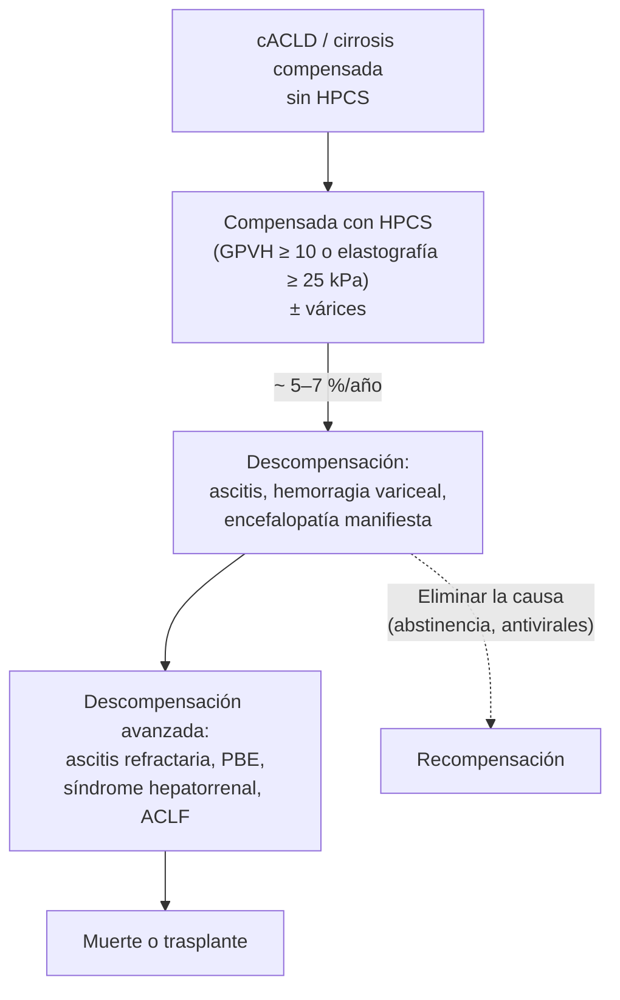
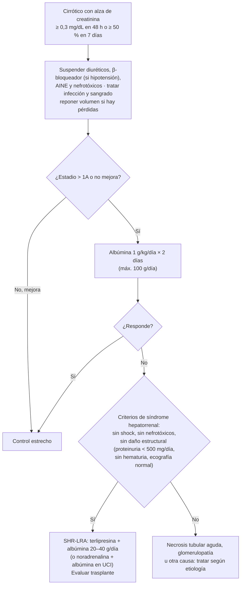

---
tags:
  - Gastroenterología
  - GES
  - Frecuente en sala
  - Urgencia
---

# Cirrosis hepática y sus complicaciones

**Subespecialidad**
Gastroenterología · Hepatología · Paciente hospitalizado

**Guías principales**
Baveno VII (2022) · AASLD 2024: hipertensión portal y várices · AASLD 2021: ascitis, peritonitis bacteriana espontánea y síndrome hepatorrenal · EASL 2018: cirrosis descompensada · EASL 2022: encefalopatía hepática · ADQI/ICA 2024: lesión renal aguda en la cirrosis

**Otras fuentes**
BSG 2021 (ascitis) · Ensayo CONFIRM (terlipresina, 2021) · MINSAL 2025 (GES)

**EUNACOM**
1.06.1.005 Cirrosis hepática (específico, inicial, derivar) · 1.06.1.001 Ascitis (específico, inicial, derivar) · 1.06.2.011 Peritonitis bacteriana espontánea (específico, completo, derivar) · 1.06.2.006 Encefalopatía hepática (específico, inicial, derivar) · 1.06.2.012 Síndrome hepatorrenal (sospecha, inicial, derivar)

**GES**
Sí: tratamiento farmacológico tras el alta hospitalaria por cirrosis hepática (problema 88, desde diciembre de 2025)

**Revisado**
Septiembre 2026

!!! abstract "Resumen en 60 segundos"
    - La cirrosis tiene dos etapas: **compensada** (sobrevida mediana > 12 años) y **descompensada** (**ascitis, hemorragia variceal o encefalopatía manifiesta**; sobrevida mediana ~ 2 años). Causas principales en Chile: **alcohol** y **enfermedad hepática grasa asociada a disfunción metabólica (MASLD)**.
    - **Hipertensión portal clínicamente significativa** (gradiente ≥ 10 mmHg o elastografía ≥ 25 kPa): **carvedilol** para prevenir la descompensación (Baveno VII).
    - **Ascitis**: **paracentesis diagnóstica** siempre (**GASA ≥ 1,1 g/dL** = hipertensión portal); **sal ≤ 5 g/día**, **espironolactona 100 mg + furosemida 40 mg**; paracentesis evacuadora con **albúmina 8 g/L** si se extraen > 5 L.
    - **PBE**: **PMN ≥ 250/mm³** en el líquido ascítico → **ceftriaxona** + **albúmina 1,5 g/kg día 1 y 1 g/kg día 3**. Luego **profilaxis** secundaria.
    - **Lesión renal aguda**: suspender diuréticos y nefrotóxicos, **albúmina 1 g/kg/día × 2 días**; si no responde y cumple criterios → **síndrome hepatorrenal**: **terlipresina + albúmina**.
    - **Encefalopatía**: buscar el **desencadenante** (infección, sangrado, constipación, diuréticos, sedantes) y dar **lactulosa**; **rifaximina** para prevenir recurrencias.
    - Todo cirrótico: **ecografía ± AFP cada 6 meses** (hepatocarcinoma), vacunas, nutrición con **proteínas suficientes**, evitar **AINE** y benzodiacepinas, **tratar la causa** y evaluar **trasplante** (MELD ≥ 15 o descompensación).

## Definición

| Término | Definición |
|---|---|
| **Cirrosis** | Estadio final de las enfermedades hepáticas crónicas: **fibrosis difusa** con **nódulos de regeneración** que alteran la arquitectura y la circulación del hígado |
| **Enfermedad hepática crónica avanzada compensada (cACLD)** (Baveno VII) | Término para el paciente asintomático con fibrosis avanzada: **elastografía < 10 kPa** la descarta; **10–15 kPa** la sugiere; **> 15 kPa** la hace muy probable |
| **Hipertensión portal clínicamente significativa (HPCS)** | **Gradiente de presión venosa hepática (GPVH) ≥ 10 mmHg**. Sin invasión: **elastografía ≥ 25 kPa** la confirma; ≤ 15 kPa con **plaquetas ≥ 150.000** la descarta |
| **Cirrosis descompensada** | Aparición de **ascitis**, **hemorragia variceal** o **encefalopatía hepática manifiesta** |
| **Recompensación** (Baveno VII) | Tras eliminar la causa (abstinencia, antivirales): resolución de la ascitis y la encefalopatía sin tratamiento, sin sangrado por 12 meses y mejoría estable de la función hepática |
| **Falla hepática aguda sobre crónica (ACLF)** | Descompensación aguda con **falla de órganos** (hígado, riñón, cerebro, coagulación, circulación, pulmón) y alta mortalidad a 28 días |

## Epidemiología

### Mundial

- La cirrosis causa **> 1,3 millones de muertes al año** en el mundo y es una causa mayor de años de vida perdidos en adultos en edad laboral.
- **Etiologías**: **alcohol**, **MASLD/MASH** (antes "hígado graso no alcohólico"; en aumento con la obesidad y la diabetes), **hepatitis C** (en descenso con los antivirales de acción directa) y **B**; menos frecuentes: autoinmunes (hepatitis autoinmune, colangitis biliar primaria, colangitis esclerosante primaria), hemocromatosis, Wilson, déficit de α1-antitripsina, congestiva (cardíaca), Budd-Chiari, fármacos.
- **Historia natural**: en la cirrosis compensada, la **descompensación** ocurre en **~ 5–7 % al año**; la sobrevida mediana cae de **> 12 años** (compensada) a **~ 2 años** (descompensada).
- **Hepatocarcinoma**: incidencia de **1–4 % al año** en la cirrosis.

### Chile

!!! chile "Datos nacionales"
    - La cirrosis causa **más de 3.200 muertes al año** y es la **segunda causa de mortalidad prematura** del país (MINSAL 2025). La mortalidad es mayor en **hombres** y entre los 40 y 79 años.
    - Las causas principales son el **consumo de alcohol** y la **MASLD** (alta prevalencia de obesidad y diabetes: ENS 2016–2017, obesidad 31 %, diabetes 12 %). La hepatitis C y B son menos frecuentes y tienen **tratamiento GES**.
    - **GES (problema 88)**: desde el **1 de diciembre de 2025**, el Decreto GES 2025–2028 garantiza el **tratamiento farmacológico tras el alta hospitalaria por cirrosis hepática** o sus complicaciones (inicio dentro de **30 días** desde la indicación), para prevenir descompensaciones y rehospitalizaciones.
    - El **trasplante hepático** se realiza en centros de referencia; la derivación oportuna (MELD ≥ 15 o descompensación) es clave.

## Etiología y fisiopatología

### Causas y estudio etiológico

| Causa | Claves y exámenes |
|---|---|
| **Alcohol** | Consumo > 2 tragos/día en mujeres o > 3 en hombres por años; **GOT/GPT > 2**, **GGT** y **VCM** altos; AUDIT |
| **MASLD/MASH** | Obesidad, DM2, HTA, dislipidemia; esteatosis en la ecografía; **FIB-4** y elastografía |
| **Hepatitis C** | **Anti-VHC** → carga viral (ARN) |
| **Hepatitis B** | **HBsAg**, anti-HBc, carga viral |
| **Hepatitis autoinmune** | Mujeres; **ANA**, **anti-músculo liso**, **IgG** alta; biopsia |
| **Colangitis biliar primaria** | Mujeres, prurito, **fosfatasa alcalina** alta, **anticuerpos antimitocondriales** |
| **Hemocromatosis** | **Saturación de transferrina > 45 %**, ferritina alta; gen *HFE* |
| **Enfermedad de Wilson** | < 40 años; **ceruloplasmina baja**, cobre urinario alto, anillo de Kayser-Fleischer |
| **Déficit de α1-antitripsina** | Enfisema en jóvenes; nivel sérico y fenotipo |
| **Congestiva** | Insuficiencia cardíaca derecha, pericarditis constrictiva, Fontan |

### Hipertensión portal y circulación hiperdinámica

1. La fibrosis y la **disfunción endotelial** (menos óxido nítrico en el hígado) aumentan la **resistencia intrahepática** al flujo portal.
2. En la circulación **esplácnica** ocurre lo contrario: **vasodilatación** (más óxido nítrico) que aumenta el **flujo portal** y mantiene la hipertensión portal.
3. Consecuencias:
    - **Colaterales portosistémicas** (**várices** esofágicas y gástricas) con GPVH ≥ 10 mmHg; riesgo de sangrado con ≥ 12 mmHg (ver [Hemorragia digestiva alta](hemorragia-digestiva-alta.md)).
    - **Esplenomegalia** e **hiperesplenismo** (**trombocitopenia**: el signo de laboratorio más precoz).
    - La **vasodilatación arterial** baja el **volumen arterial efectivo** → activación del **sistema renina-angiotensina-aldosterona**, del **simpático** y de la **ADH** → retención de **sodio** (ascitis, edema) y de **agua** (**hiponatremia**) y **vasoconstricción renal** (**síndrome hepatorrenal**).
    - La **translocación bacteriana** intestinal y la **inflamación sistémica** empeoran la vasodilatación y favorecen las infecciones (**PBE**) y la **ACLF**.
    - El amonio y otras toxinas intestinales llegan al cerebro sin pasar por el hígado → **encefalopatía hepática**.

<figure markdown>
![Diagrama de la patogenia de la ascitis en la cirrosis: la alteración de la arquitectura hepática aumenta la resistencia intrahepática y produce hipertensión portal con colaterales portosistémicas y translocación bacteriana; el aumento del óxido nítrico y otros vasodilatadores en la circulación esplácnica y sistémica reduce la resistencia vascular y el volumen arterial efectivo, lo que activa los sistemas vasoconstrictores (renina-angiotensina-aldosterona, simpático y hormona antidiurética) que retienen sal y agua en distintos segmentos del túbulo renal y generan ascitis; la inflamación sistémica agrava la vasodilatación](../assets/figuras/cirrosis/patogenia-ascitis-aithal-2021.jpg){ loading=lazy }
<figcaption>Figura 1. Patogenia de la ascitis en la cirrosis: hipertensión portal, vasodilatación esplácnica y sistémica, activación neurohumoral y retención renal de sal y agua. Fuente: Aithal GP, Palaniyappan N, China L, et al. Guidelines on the management of ascites in cirrhosis. <em>Gut</em>. 2021;70:9–29. Licencia <a href="https://creativecommons.org/licenses/by-nc/4.0/">CC BY-NC 4.0</a>. Texto de la figura en inglés.</figcaption>
</figure>

## Clasificación

### Historia natural (Baveno VII)

### Gravedad

- **Child-Pugh** (bilirrubina, albúmina, INR, ascitis, encefalopatía): **A** 5–6 · **B** 7–9 · **C** 10–15 puntos (tabla en [Hemorragia digestiva alta](hemorragia-digestiva-alta.md)). Sobrevida al año ~ 100 %, 80 % y 45 %, respectivamente.
- **MELD-Na** o **MELD 3.0** (bilirrubina, INR, creatinina, sodio; el 3.0 agrega sexo y albúmina): predice la mortalidad a 90 días y ordena la lista de **trasplante**. **MELD ≥ 15** → derivar a un centro de trasplante.

### Ascitis (Club Internacional de Ascitis)

- **Grado 1**: sólo detectable por **ecografía**.
- **Grado 2**: distensión abdominal **moderada** y simétrica.
- **Grado 3**: distensión **marcada** o **tensa**.
- **Refractaria**: no responde a dosis máximas de diuréticos con restricción de sal, o recurre precozmente, o los diuréticos causan complicaciones que impiden usarlos.

### Encefalopatía hepática (West Haven)

| Grado | Clínica |
|---|---|
| **Mínima** (encubierta) | Sin signos clínicos; alteración en pruebas psicométricas |
| **1** (encubierta) | Falta leve de atención, **euforia o ansiedad**, **inversión del ciclo sueño-vigilia**, dificultad para sumar |
| **2** (manifiesta) | **Letargia**, desorientación en el tiempo, cambios de personalidad, **asterixis** |
| **3** | **Somnolencia** a semiestupor, responde a estímulos, confusión y desorientación marcadas |
| **4** | **Coma** |

## Clínica

- **Compensada**: muchas veces **asintomática**; se sospecha por **trombocitopenia**, pruebas hepáticas alteradas o una ecografía con hígado nodular.
- **Estigmas de daño hepático crónico**: **arañas vasculares**, **eritema palmar**, **ginecomastia**, atrofia testicular, pérdida de vello, **circulación colateral** (cabeza de medusa), **esplenomegalia**, **ictericia**, **asterixis**, **fetor hepaticus**, uñas blancas (Terry), hipocratismo, **contractura de Dupuytren** y **hipertrofia parotídea** (alcohol), **sarcopenia**.
- **Descompensada**:
    - **Ascitis**: aumento del perímetro abdominal, matidez desplazable, onda ascítica; hernias umbilicales; **hidrotórax hepático** (derecho).
    - **Hemorragia variceal**: hematemesis, melena, shock.
    - **Encefalopatía**: de alteraciones sutiles del sueño al coma.
    - **Ictericia**, coagulopatía, edema.
- **PBE**: fiebre, dolor abdominal, **encefalopatía** o **lesión renal** inexplicadas; **hasta un tercio es asintomática**: por eso se hace paracentesis a todo cirrótico con ascitis que se hospitaliza.

## Diagnóstico

1. **Sospecha** clínica o de laboratorio (plaquetas bajas, GOT > GPT, albúmina baja, INR alto).
2. **Fibrosis sin biopsia**:
    - **FIB-4** = (edad × GOT) / (plaquetas [×10⁹/L] × √GPT): **< 1,3** bajo riesgo de fibrosis avanzada; **> 2,67** alto riesgo.
    - **Elastografía** (FibroScan): **< 10 kPa** descarta la cACLD; **> 15 kPa** la hace muy probable; **≥ 25 kPa** = HPCS.
3. **Imágenes**: hígado nodular, lóbulo caudado hipertrofiado, **esplenomegalia**, ascitis, colaterales, trombosis portal.
4. **Estudio etiológico** (tabla).
5. **Biopsia** sólo si la etiología o el estadio no son claros.
6. **Endoscopía** para buscar **várices**, salvo que la elastografía sea **< 20 kPa** con **plaquetas > 150.000** (Baveno VII), o si ya recibirá carvedilol por HPCS.

### Paracentesis diagnóstica

**Indicaciones**: ascitis de **reciente aparición**; todo cirrótico con ascitis que se **hospitaliza**; **deterioro** clínico (fiebre, dolor abdominal, encefalopatía, lesión renal, sangrado digestivo).

| Examen del líquido ascítico | Interpretación |
|---|---|
| **Recuento celular con PMN** | **PMN ≥ 250/mm³** = **PBE** |
| **Albúmina** (GASA = albúmina sérica − ascítica) | **GASA ≥ 1,1 g/dL** → **hipertensión portal** (cirrosis, insuficiencia cardíaca, Budd-Chiari). **< 1,1** → carcinomatosis peritoneal, tuberculosis, pancreática, síndrome nefrótico |
| **Proteínas totales** | < 1,5 g/dL: riesgo de PBE. **≥ 2,5 g/dL con GASA ≥ 1,1**: origen **cardíaco** |
| **Cultivo** | **Inocular 10 mL en frascos de hemocultivo** junto a la cama (aumenta el rendimiento) |
| **Según sospecha** | Glucosa, LDH (peritonitis secundaria), **citología** (cáncer), **ADA** (tuberculosis), amilasa (páncreas), triglicéridos (quilosa), BNP |

!!! perla "La paracentesis es segura aunque el INR esté alto"
    **No se necesita corregir el INR ni las plaquetas** antes de una paracentesis (el sangrado grave es < 1 %). Punción en el **cuadrante inferior izquierdo**, lateral a los vasos epigástricos, idealmente guiada por ecografía.

## Laboratorio

| Examen | Hallazgos en la cirrosis |
|---|---|
| **Hemograma** | **Trombocitopenia** (hiperesplenismo), anemia, leucopenia |
| **GOT, GPT** | Normales o levemente altas; **GOT > GPT** (relación > 1 sugiere cirrosis; > 2, alcohol) |
| **Bilirrubina** | Alta en la descompensación |
| **Albúmina** | **Baja** (síntesis) |
| **INR** | **Prolongado** (síntesis de factores); no refleja bien el riesgo de sangrado (hemostasia "rebalanceada") |
| **Sodio** | **Hiponatremia** dilucional (mal pronóstico, parte del MELD-Na) |
| **Creatinina** | **Sobreestima** la función renal (poca masa muscular): una creatinina "normal" puede esconder una VFG baja |
| **AFP** | Tamizaje de hepatocarcinoma (junto con la ecografía) |
| **Amonio** | Un amonio **normal** hace poco probable la encefalopatía hepática (EASL 2022); un valor alto no confirma el diagnóstico ni guía el tratamiento |

## Imágenes

- **Ecografía abdominal con Doppler**: morfología hepática, esplenomegalia, **ascitis**, flujo y **trombosis portal**, **nódulos** (hepatocarcinoma). **Cada 6 meses** para el tamizaje de hepatocarcinoma (± AFP).
- **Elastografía** de transición: fibrosis y HPCS.
- **TC o RM trifásica**: caracterización de nódulos > 1 cm (hepatocarcinoma con criterios LI-RADS).
- **Endoscopía digestiva alta**: várices esofágicas y gástricas, gastropatía hipertensiva portal.
- **TC de cerebro** en la encefalopatía si hay déficit focal, trauma, primera presentación atípica o falta de respuesta.

## Diagnóstico diferencial

- **Ascitis no cirrótica**: insuficiencia cardíaca, **carcinomatosis peritoneal**, **tuberculosis peritoneal**, síndrome nefrótico, pancreatitis, Budd-Chiari, hipotiroidismo.
- **PBE vs peritonitis secundaria** (perforación, absceso): sospechar secundaria si hay **proteínas > 1 g/dL**, **glucosa < 50 mg/dL**, **LDH** mayor que el límite normal sérico, **flora polimicrobiana** o falta de respuesta → **TC** de abdomen.
- **Encefalopatía hepática vs** hipoglicemia, **hiponatremia**, infección del SNC, **hematoma subdural** (caídas, coagulopatía), intoxicación o **abstinencia alcohólica**, **encefalopatía de Wernicke**, efecto de sedantes.
- **Síndrome hepatorrenal vs** lesión renal **prerrenal** (responde a volumen), **necrosis tubular aguda** (sedimento con cilindros granulosos, Na urinario alto), glomerulonefritis (VHB, VHC, IgA en el alcohol).

## Tratamiento

### Medidas generales en todo cirrótico

!!! guia "Pilares del manejo de la cirrosis"
    - **Tratar la causa**: **abstinencia de alcohol** (la medida más eficaz en la cirrosis alcohólica), antivirales para VHC y VHB, **baja de peso** y control metabólico en la MASLD, inmunosupresión en la hepatitis autoinmune, ácido ursodeoxicólico en la colangitis biliar primaria.
    - **Tamizaje de hepatocarcinoma**: **ecografía ± AFP cada 6 meses**.
    - **Várices**: carvedilol si hay HPCS, o endoscopía según Baveno VII.
    - **Nutrición**: **35 kcal/kg/día** y **proteínas 1,2–1,5 g/kg/día** (**no restringir proteínas**, ni siquiera en la encefalopatía), **colación nocturna**, evitar ayunos prolongados; tratar la **sarcopenia**.
    - **Vacunas**: hepatitis A y B, influenza, neumococo, COVID-19.
    - **Evitar**: **AINE**, aminoglicósidos, **benzodiacepinas** y opioides, IECA/ARA-II en la ascitis; **paracetamol** es seguro hasta **2 g/día**.
    - **Derivar** a hepatología y evaluar **trasplante** si hay **MELD ≥ 15**, descompensación o hepatocarcinoma.

### Prevención de la descompensación y várices (Baveno VII, AASLD 2024)

- **HPCS** (con o sin várices): **β-bloqueador no selectivo**, de preferencia **carvedilol 6,25 mg/día** y luego **12,5 mg/día** (reduce la **descompensación** y la mortalidad). Alternativa: propranolol 20–40 mg c/12 h titulado.
- Si no tolera β-bloqueadores y tiene várices de alto riesgo: **ligadura endoscópica**.
- **Hemorragia variceal aguda**: terlipresina u octreotide, **ceftriaxona**, ligadura endoscópica en < 12 h, **TIPS preventivo** en pacientes de alto riesgo (ver [Hemorragia digestiva alta](hemorragia-digestiva-alta.md)).
- **Profilaxis secundaria**: β-bloqueador **+ ligadura** endoscópica.

### Ascitis

!!! dosis "Ascitis no complicada"
    - **Restricción de sal moderada**: **80–120 mmol de sodio/día** (**4,6–6,9 g de sal/día**, "sin agregar sal"). Restricciones más estrictas empeoran la nutrición.
    - **No restringir líquidos** salvo **Na < 125 mEq/L**.
    - **Diuréticos**:
        - **Espironolactona 100 mg/día** (primer episodio, grado 2) ± **furosemida 40 mg/día**; en ascitis recurrente, iniciar **ambos** juntos (relación **100:40**).
        - Subir cada 3–7 días hasta **espironolactona 400 mg** y **furosemida 160 mg**.
        - **Meta de baja de peso**: **0,5 kg/día** sin edema, **1 kg/día** con edema.
        - **Suspender** si hay Na < 125, K > 6 o < 3, lesión renal aguda, encefalopatía o calambres incapacitantes.
    - **Ascitis grado 3**: **paracentesis evacuadora** (en una sola sesión), luego diuréticos. Si se extraen **> 5 L**, dar **albúmina 20 % 8 g por cada litro** extraído (previene la disfunción circulatoria posparacentesis).

- **Ascitis refractaria**: **paracentesis evacuadoras repetidas + albúmina**, **TIPS** (en pacientes seleccionados, sin encefalopatía grave ni bilirrubina muy alta) y **evaluación para trasplante**. Revisar la dosis de β-bloqueador (bajarla o suspenderla si la PAS es < 90 mmHg, Na < 130 o hay lesión renal aguda).
- **Hidrotórax hepático**: diuréticos, toracocentesis, TIPS; **evitar la pleurostomía** (tubo pleural).
- **Hiponatremia hipervolémica**: suspender diuréticos si Na < 125, **restricción de agua 1–1,5 L/día**; NaCl 3 % sólo con síntomas graves (con cuidado: riesgo de desmielinización osmótica).

### Peritonitis bacteriana espontánea (PBE)

!!! dosis "PBE: tratamiento"
    - **Diagnóstico**: **PMN ≥ 250/mm³** en el líquido ascítico (cultivo positivo en ~ 40 %). Tratar **antes** del cultivo.
    - **Antibiótico**:
        - **Comunitaria**: **ceftriaxona 2 g EV/día** (o cefotaxima 2 g c/8 h) por **5–7 días**.
        - **Nosocomial**, antibióticos recientes, sepsis o **riesgo de multirresistencia**: **piperacilina/tazobactam** o **meropenem** (± vancomicina) según la epidemiología local.
    - **Albúmina EV**: **1,5 g/kg el día 1** y **1 g/kg el día 3** (reduce el síndrome hepatorrenal y la mortalidad), sobre todo si hay creatinina > 1 mg/dL, BUN > 30 mg/dL o bilirrubina > 4 mg/dL.
    - **Paracentesis de control a las 48 h** si no mejora: el recuento de PMN debe bajar > 25 %; si no, sospechar resistencia o peritonitis secundaria.
    - Suspender diuréticos y β-bloqueadores si hay hipotensión o lesión renal.

**Profilaxis de la PBE**:

| Situación | Profilaxis |
|---|---|
| **Hemorragia digestiva** en el cirrótico | **Ceftriaxona 1 g/día EV** por hasta **7 días** |
| **Después de un episodio de PBE** (secundaria) | **Norfloxacino 400 mg/día** (o ciprofloxacino 500 mg/día, o cotrimoxazol) **indefinida** |
| **Primaria**: proteínas del líquido < 1,5 g/dL **y** enfermedad avanzada (Child-Pugh ≥ 9 con bilirrubina ≥ 3 mg/dL, o creatinina ≥ 1,2 mg/dL, BUN ≥ 25 mg/dL o Na ≤ 130 mEq/L) | Norfloxacino o ciprofloxacino |

### Lesión renal aguda y síndrome hepatorrenal

!!! dosis "Síndrome hepatorrenal con lesión renal aguda (SHR-LRA)"
    - **Terlipresina** 1 mg EV c/4–6 h (o infusión continua de 2 mg/día), subiendo hasta 12 mg/día si la creatinina no baja > 25 % al tercer día, **+ albúmina 20–40 g/día**. En el ensayo **CONFIRM** (2021) la terlipresina con albúmina revirtió más el SHR que el placebo, pero aumentó la **insuficiencia respiratoria** (sobrecarga de volumen): evitarla si hay hipoxemia o sobrecarga, y vigilar la **isquemia**.
    - **Noradrenalina** 0,5–3 mg/h EV + albúmina (en UCI): alternativa.
    - **Midodrina + octreotide + albúmina**: menos eficaz; sólo si no hay otra opción.
    - El tratamiento definitivo es el **trasplante hepático** (± renal).

### Encefalopatía hepática

!!! dosis "Encefalopatía hepática manifiesta (EASL 2022)"
    1. **Buscar y tratar el desencadenante** (presente en ~ 90 %): **infecciones** (PBE, ITU, neumonía), **hemorragia digestiva**, **constipación**, **diuréticos** con hipovolemia, **hipokalemia** o alcalosis, **hiponatremia**, **sedantes** (benzodiacepinas, opioides), lesión renal, TIPS, falta de adherencia a la lactulosa.
    2. **Lactulosa**: **25 mL c/1–2 h** hasta lograr una deposición, luego ajustar a **2–3 deposiciones blandas al día**; por SNG o en **enema** (300 mL en 700 mL de agua) si el paciente no puede tragar. El **polietilenglicol** es una alternativa eficaz.
    3. **Proteger la vía aérea** en los grados 3–4 (UCI).
    4. **Nutrición**: **no restringir proteínas**.
    5. **Prevención secundaria**: **lactulosa** tras el primer episodio; agregar **rifaximina 550 mg c/12 h** tras una **recurrencia**.

- **Encefalopatía mínima o encubierta**: afecta la calidad de vida y la conducción de vehículos; puede tratarse con lactulosa.

### Trasplante hepático

- **Derivar** si hay **MELD ≥ 15**, **descompensación** (ascitis, hemorragia variceal, encefalopatía, SHR), **hepatocarcinoma** dentro de criterios de Milán o **falla hepática aguda sobre crónica** seleccionada.
- En la cirrosis alcohólica se exige, en general, un período de **abstinencia** y apoyo psicosocial.

## Complicaciones

| Complicación | Claves |
|---|---|
| **Hemorragia variceal** | Mortalidad ~ 15–20 % a 6 semanas (ver HDA) |
| **Ascitis** y ascitis refractaria | Mortalidad ~ 50 % a 2 años (refractaria: ~ 50 % a 6 meses) |
| **PBE** | Mortalidad hospitalaria ~ 20 %; recurrencia ~ 70 % al año sin profilaxis |
| **Síndrome hepatorrenal** | Mal pronóstico sin trasplante |
| **Encefalopatía hepática** | Recurrente; accidentes, caídas |
| **Hepatocarcinoma** | 1–4 %/año; tamizaje semestral |
| **Trombosis portal** | Puede precipitar descompensación; anticoagular en casos seleccionados |
| **Síndrome hepatopulmonar** | Hipoxemia, **platipnea**, ortodeoxia (vasodilatación pulmonar) |
| **Hipertensión portopulmonar** | Disnea; contraindicación relativa del trasplante si es grave |
| **Miocardiopatía cirrótica** | Disfunción cardíaca con el estrés |
| **Infecciones** | Frecuentes y graves: toda descompensación obliga a buscar infección |
| **Sarcopenia y desnutrición** | Peor sobrevida |
| **ACLF** | Mortalidad a 28 días 20–80 % según el número de órganos en falla |

## Pronóstico y seguimiento

- **Sobrevida mediana**: > 12 años en la cirrosis **compensada** y **~ 2 años** tras la **descompensación**.
- **Child-Pugh** y **MELD** estiman el pronóstico; la **hiponatremia**, la **ascitis refractaria** y la **lesión renal** son marcadores de muy mal pronóstico.
- **Perfil EUNACOM**: sospecha y diagnóstico de la cirrosis y sus complicaciones, **tratamiento inicial** y **derivación**; la **PBE** requiere **tratamiento completo** por el médico general.
- **Seguimiento** (con hepatología y, desde 2025, con garantía GES del tratamiento farmacológico tras el alta):
    - **Ecografía ± AFP cada 6 meses**.
    - Control de **electrolitos y creatinina** con los diuréticos.
    - Endoscopía según el protocolo de várices.
    - **Abstinencia de alcohol** (apoyo, fármacos como el baclofeno o el acamprosato), control metabólico.
    - **Educación**: signos de alarma (fiebre, melena, confusión, aumento del abdomen), evitar AINE.

## Perlas para el internado

!!! perla "Para la sala y el turno"
    - **Todo cirrótico con ascitis que se hospitaliza necesita una paracentesis diagnóstica**, aunque "venga por otra cosa".
    - Cirrótico **confuso**: busca **infección**, **sangrado** (tacto rectal), **constipación**, **hiponatremia**, **hipoglicemia** y **sedantes** antes de culpar al amonio.
    - **Creatinina 1,3 en un cirrótico** puede ser una VFG muy baja: la masa muscular es escasa.
    - **Albúmina** en tres escenarios: paracentesis > 5 L (8 g/L), **PBE** (1,5 y 1 g/kg) y **lesión renal aguda** (1 g/kg × 2 días).
    - **Hemorragia digestiva en un cirrótico = ceftriaxona** (además de la terlipresina y la endoscopía).
    - **Nada de AINE** en el cirrótico: precipitan lesión renal, ascitis refractaria y sangrado.
    - **No restrinjas las proteínas** en la encefalopatía: la desnutrición la empeora.

## Preguntas de repaso

??? repaso "1. Hombre de 58 años, bebedor, con ascitis nueva. Paracentesis: albúmina sérica 2,8 g/dL, ascítica 1,0 g/dL, proteínas 1,1 g/dL, PMN 80/mm³. ¿Qué indica y cómo lo tratas?"
    **GASA = 1,8 g/dL (≥ 1,1)** → ascitis por **hipertensión portal** (cirrosis alcohólica probable); sin PBE (PMN < 250). Tratamiento: **abstinencia de alcohol**, **sal 4,6–6,9 g/día**, **espironolactona 100 mg/día** (± furosemida 40 mg), meta de baja de 0,5–1 kg/día. Con **proteínas < 1,5 g/dL** tiene mayor riesgo de PBE (evaluar profilaxis primaria si cumple criterios de enfermedad avanzada). Estudio etiológico, endoscopía, ecografía y derivación a hepatología.

??? repaso "2. Cirrótica de 64 años con ascitis, fiebre de 38 °C y confusión leve. Paracentesis: 620 PMN/mm³. Creatinina 1,4 mg/dL, bilirrubina 3,2 mg/dL. ¿Conducta?"
    **Peritonitis bacteriana espontánea**. **Ceftriaxona 2 g/día EV** (5–7 días) + **albúmina 1,5 g/kg el día 1 y 1 g/kg el día 3** (tiene creatinina > 1 mg/dL: alto riesgo de síndrome hepatorrenal). Suspender diuréticos, hemocultivos, cultivo del líquido en frascos de hemocultivo, tratar la encefalopatía con **lactulosa**. Paracentesis de control a las 48 h si no mejora. Después: **profilaxis secundaria** con norfloxacino o ciprofloxacino.

??? repaso "3. Cirrótico con ascitis cuya creatinina sube de 1,0 a 2,1 mg/dL; recibía furosemida y espironolactona. No hay shock ni proteinuria, la ecografía renal es normal. Tras 2 días de albúmina 1 g/kg y suspensión de diuréticos la creatinina es 2,3. ¿Diagnóstico y tratamiento?"
    **Síndrome hepatorrenal con lesión renal aguda (SHR-LRA)**: lesión renal que no responde a la suspensión de diuréticos y a la expansión con albúmina, sin shock, sin nefrotóxicos y sin daño renal estructural. Tratamiento: **terlipresina** (1 mg c/4–6 h o infusión) **+ albúmina 20–40 g/día**, vigilando la sobrecarga de volumen y la hipoxemia; alternativa **noradrenalina + albúmina** en UCI. **Derivar para trasplante**.

??? repaso "4. Cirrótico que llega somnoliento, con asterixis y desorientado en el tiempo. ¿Qué grado de encefalopatía tiene y qué haces?"
    **Encefalopatía hepática grado 2** (West Haven). Buscar el **desencadenante**: hemograma, electrolitos (Na, K), creatinina, glicemia, **paracentesis** (PBE), orina, radiografía de tórax, **tacto rectal** (melena), revisar **sedantes** y diuréticos, constipación. Tratar la causa y dar **lactulosa 25 mL c/1–2 h** hasta la primera deposición y luego 2–3 deposiciones al día. No restringir proteínas. Tras la recuperación, lactulosa como prevención secundaria; rifaximina si recurre.

??? repaso "5. Paciente con cirrosis compensada por MASLD, sin várices en la endoscopía, elastografía de 28 kPa. ¿Qué le indicas según Baveno VII?"
    Tiene **hipertensión portal clínicamente significativa** (elastografía ≥ 25 kPa). Baveno VII recomienda un **β-bloqueador no selectivo**, de preferencia **carvedilol** (6,25 → 12,5 mg/día), para **prevenir la descompensación** aunque no tenga várices. Además: baja de peso y control metabólico, abstinencia de alcohol, **ecografía ± AFP cada 6 meses**, vacunas, evitar AINE.

## Referencias

1. de Franchis R, Bosch J, Garcia-Tsao G, et al. Baveno VII – Renewing consensus in portal hypertension. *J Hepatol.* 2022;76:959–974.
2. Kaplan DE, Ripoll C, Thiele M, et al. AASLD Practice Guidance on risk stratification and management of portal hypertension and varices in cirrhosis. *Hepatology.* 2024;79:1180–1211.
3. Biggins SW, Angeli P, Garcia-Tsao G, et al. Diagnosis, Evaluation, and Management of Ascites, Spontaneous Bacterial Peritonitis and Hepatorenal Syndrome: 2021 Practice Guidance by the American Association for the Study of Liver Diseases. *Hepatology.* 2021;74:1014–1048.
4. European Association for the Study of the Liver. EASL Clinical Practice Guidelines for the management of patients with decompensated cirrhosis. *J Hepatol.* 2018;69:406–460.
5. European Association for the Study of the Liver. EASL Clinical Practice Guidelines on the management of hepatic encephalopathy. *J Hepatol.* 2022;77:807–824.
6. Nadim MK, Kellum JA, Forni L, et al. Acute kidney injury in patients with cirrhosis: Acute Disease Quality Initiative (ADQI) and International Club of Ascites (ICA) joint multidisciplinary consensus meeting. *J Hepatol.* 2024;81:163–183.
7. Aithal GP, Palaniyappan N, China L, et al. Guidelines on the management of ascites in cirrhosis. *Gut.* 2021;70:9–29. doi:[10.1136/gutjnl-2020-321790](https://doi.org/10.1136/gutjnl-2020-321790)
8. Wong F, Pappas SC, Curry MP, et al. Terlipressin plus Albumin for the Treatment of Type 1 Hepatorenal Syndrome. *N Engl J Med.* 2021;384:818–828.
9. Sort P, Navasa M, Arroyo V, et al. Effect of intravenous albumin on renal impairment and mortality in patients with cirrhosis and spontaneous bacterial peritonitis. *N Engl J Med.* 1999;341:403–409.
10. Ministerio de Salud de Chile. Chile garantiza 90 problemas de salud con inversión récord (Decreto GES 2025–2028). Diciembre 2025. [minsal.cl](https://www.minsal.cl/chile-garantiza-90-problemas-de-salud-con-inversion-record-de-100-mil-millones-anuales/)
