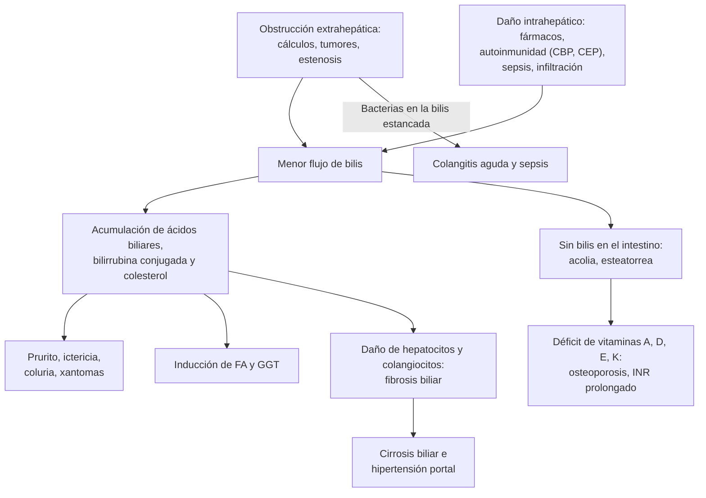

---
tags:
  - Gastroenterología
---

# Colestasia: colangitis biliar primaria, colangitis esclerosante y otras causas

**Subespecialidad**
Gastroenterología · Hepatología · Cirugía digestiva · Atención primaria

**Guías principales**
ACG 2017: evaluación de las pruebas hepáticas alteradas · EASL 2009: enfermedades hepáticas colestásicas · EASL 2017 y AASLD 2018: colangitis biliar primaria · EASL 2022: colangitis esclerosantes · EASL 2019: daño hepático por fármacos

**Otras fuentes**
Ensayos de segunda línea en la colangitis biliar primaria: BEZURSO (bezafibrato, 2018), ELATIVE (elafibranor, 2024) y RESPONSE (seladelpar, 2024) · Colestasia del embarazo (Ovadia 2019) · Colangiografía de la colangitis esclerosante (Tanaka 2019)

**GES**
No es GES. La **colecistectomía preventiva** del cáncer de vesícula (35–49 años sintomáticos) sí lo es ([ver litiasis biliar](litiasis-biliar-colecistitis-colangitis.md)).

**EUNACOM**
1.06.1.007 Colestasia (específico, inicial, derivar)

**Revisado**
Octubre 2026

!!! abstract "Resumen en 60 segundos"
    - **Colestasia**: menor formación o flujo de la **bilis**. En el laboratorio, **fosfatasa alcalina y GGT elevadas**, con o sin **bilirrubina directa** alta.
    - **Clínica**: **prurito**, ictericia, coluria, acolia, fatiga; en la crónica, **xantomas**, osteoporosis y déficit de **vitaminas liposolubles**.
    - **Primer paso**: **ecografía** abdominal.
        - **Vía biliar dilatada** = colestasia **extrahepática** (obstructiva): **coledocolitiasis** (lo más frecuente en Chile), **cáncer** de páncreas, de la vía biliar, de vesícula o de la ampolla. Estudiar con **colangio-RM** o **endosonografía**; la **CPRE** es para tratar.
        - **Vía biliar no dilatada** = colestasia **intrahepática**: **fármacos** (amoxicilina-ácido clavulánico), **colangitis biliar primaria**, **colangitis esclerosante**, sepsis, nutrición parenteral, infiltración, embarazo.
    - **Fiebre + ictericia + dolor (tríada de Charcot) = colangitis aguda**: antibióticos y **drenaje biliar urgente**.
    - **Ictericia indolora con baja de peso en un mayor = cáncer periampular** hasta demostrar lo contrario (TC con contraste).
    - **Colangitis biliar primaria**: mujer de 40–60 años, prurito y fatiga, **anticuerpos antimitocondriales (AMA)**. **Ácido ursodesoxicólico 13–15 mg/kg/día** de por vida; evaluar la respuesta al año.
    - **Colangitis esclerosante primaria**: hombre joven con **colitis ulcerosa**; colangio-RM con estenosis "**en rosario**". Riesgo de **colangiocarcinoma** y de **cáncer de colon**.
    - **Colestasia del embarazo**: prurito palmoplantar en el **tercer trimestre** con ácidos biliares altos. Si superan **100 µmol/L**, el riesgo de **muerte fetal** sube.

## Definición

| Concepto | Definición |
|---|---|
| **Colestasia** | Alteración de la **síntesis, la secreción o el flujo de la bilis**, desde el hepatocito hasta la ampolla de Vater |
| **Colestasia bioquímica** (EASL) | **Fosfatasa alcalina > 1,5 veces** y **GGT > 3 veces** el límite superior normal |
| **Colestasia intrahepática** | Por daño del **hepatocito** o de los **conductos biliares intrahepáticos**, sin obstrucción de la vía biliar principal |
| **Colestasia extrahepática** (obstructiva) | Por **obstrucción mecánica** de los conductos biliares grandes (hepático común, colédoco, ampolla); casi siempre con **vía biliar dilatada** |
| **Colestasia crónica** | Persiste **> 6 meses** |
| **Colangitis biliar primaria** (antes "cirrosis biliar primaria") | Enfermedad **autoinmune** que destruye los **conductos biliares interlobulares pequeños**, con **AMA** positivos |
| **Colangitis esclerosante primaria** | Inflamación y **fibrosis** de los conductos biliares **intra y extrahepáticos**, con **estenosis multifocales**, asociada a la **EII** |
| **Colangitis esclerosante secundaria** | Estenosis biliares por otra causa conocida: **IgG4**, isquemia, cirugía o trauma biliar, litiasis, infecciones (SIDA), críticos (tras UCI) |
| **Colangitis aguda** | **Infección bacteriana** de la vía biliar **obstruida** (urgencia) |
| **Patrón de daño hepático** (índice R) | R = (ALT/límite) ÷ (FA/límite). **≤ 2 colestásico**, 2–5 mixto, **≥ 5 hepatocelular**. Se usa sobre todo en el daño por fármacos |

## Epidemiología

- **Causa más frecuente de colestasia extrahepática**: la **coledocolitiasis**. Luego el **cáncer de páncreas** y los tumores de la vía biliar, la vesícula y la ampolla.
- **Colestasia intrahepática en el hospital**: frecuente en la **sepsis**, la **nutrición parenteral** y por **fármacos**. La **amoxicilina-ácido clavulánico** es la causa más frecuente de daño hepático por fármacos en las series occidentales (EASL 2019).
- **Colangitis biliar primaria**: **~90 % mujeres**, entre los **40 y 60 años**. Prevalencia de 2–40 por 100 000. Se asocia a otras **autoinmunidades** (Sjögren, tiroiditis, esclerosis sistémica).
- **Colangitis esclerosante primaria**: **~2/3 hombres**, de **30–40 años**. El **60–80 %** tiene una **EII** (sobre todo **colitis ulcerosa**), y solo el **~5 %** de los pacientes con colitis ulcerosa desarrolla una colangitis esclerosante.
- **Colestasia intrahepática del embarazo**: la hepatopatía **más frecuente del embarazo**; más en las poblaciones **mapuche y andinas** de Chile y Bolivia, en las gestaciones **múltiples** y en las de **fertilización asistida**.

!!! chile "Datos nacionales"
    - **Litiasis biliar**: Chile tiene una de las **prevalencias más altas del mundo** (**27 %** en la población hispana y **35 %** en la **mapuche**). Por eso la **coledocolitiasis** es la causa más frecuente de **colestasia obstructiva** y la **pancreatitis aguda** es mayoritariamente **biliar** ([ver litiasis biliar](litiasis-biliar-colecistitis-colangitis.md)).
    - **Cáncer de vesícula**: una de las **mayores tasas de mortalidad del mundo**, sobre todo en las **mujeres** del centro y sur. Se presenta con **ictericia** cuando invade la vía biliar (ya avanzado).
    - **GES**: **colecistectomía preventiva** en las personas de **35 a 49 años** con colelitiasis sintomática.
    - **Hidatidosis**: un **quiste hidatídico** hepático puede **romperse a la vía biliar** y producir colestasia, cólico biliar y colangitis ([ver triquinosis e hidatidosis](../infectologia/triquinosis-e-hidatidosis.md)).
    - **Colestasia del embarazo**: Chile tuvo históricamente una de las prevalencias más altas descritas, mayor en las mujeres de origen **mapuche**.

## Etiología

| Grupo | Causas | Claves |
|---|---|---|
| **Extrahepática: litiasis** | **Coledocolitiasis**, síndrome de **Mirizzi** (cálculo en el cístico que comprime el hepático común) | Cólico, colangitis, pancreatitis; dilatación de la vía biliar |
| **Extrahepática: tumores** | **Cáncer de cabeza de páncreas**, **colangiocarcinoma** (Klatskin si es hiliar), **cáncer de vesícula**, **ampuloma**, adenopatías del hilio | **Ictericia indolora** progresiva, baja de peso, **vesícula palpable** (Courvoisier-Terrier) |
| **Extrahepática: otras** | Estenosis posquirúrgica, **pancreatitis crónica**, colangitis esclerosante, **hidatidosis**, *Ascaris*, *Fasciola*, colangiopatía del SIDA | Antecedentes |
| **Intrahepática: fármacos** | **Amoxicilina-ácido clavulánico**, macrólidos, **cotrimoxazol**, **estrógenos** y anticonceptivos, **esteroides anabolizantes**, clorpromazina, azatioprina, carbamazepina, terbinafina, hierbas | Relación temporal; puede aparecer **semanas después** de suspender el fármaco |
| **Intrahepática: autoinmune** | **Colangitis biliar primaria**, **colangitis esclerosante primaria** (también extrahepática), **colangitis por IgG4** | AMA; colangio-RM; IgG4 |
| **Intrahepática: infiltrativa** | **Metástasis**, **linfoma**, **TBC**, **sarcoidosis**, **amiloidosis**, abscesos | **Fosfatasa alcalina muy alta** con bilirrubina normal o poco alta |
| **Intrahepática: sistémica** | **Sepsis**, **nutrición parenteral**, insuficiencia cardíaca, posoperatorio, hipertiroidismo | Paciente hospitalizado o crítico |
| **Intrahepática: embarazo** | **Colestasia intrahepática del embarazo** | Prurito en el tercer trimestre; ácidos biliares altos |
| **Intrahepática: genética** | Colestasia intrahepática recurrente benigna, colestasias familiares progresivas, déficit de α1-antitripsina, fibrosis quística | Episodios recurrentes; jóvenes |
| **Hepatitis con componente colestásico** | **Hepatitis alcohólica**, hepatitis A colestásica, cirrosis avanzada | Contexto |

- **Fosfatasa alcalina elevada con GGT normal**: no es hepática. Pensar en el **hueso** (crecimiento, fracturas, enfermedad de Paget, metástasis óseas, hiperparatiroidismo, osteomalacia) o en el **embarazo** (placenta).
- **Bilirrubina indirecta aislada**: **hemólisis** o **síndrome de Gilbert** (no es colestasia).

## Fisiopatología

- **Formación de la bilis**: el **hepatocito** secreta los **ácidos biliares**, la **bilirrubina conjugada**, el colesterol y los fosfolípidos al canalículo mediante **transportadores** (BSEP, MRP2). Los **colangiocitos** modifican la bilis (bicarbonato, agua).
- **En la colestasia**, los componentes de la bilis **se acumulan** en el hígado y la sangre:
    - **Ácidos biliares**: dañan los hepatocitos y los colangiocitos (inflamación y **fibrosis biliar**) y se asocian al **prurito** (junto con otros mediadores: ácido lisofosfatídico, opioides endógenos).
    - **Bilirrubina conjugada**: **ictericia**; es soluble en agua y pasa a la orina (**coluria**). Falta en el intestino (**acolia**).
    - **Colesterol**: **hipercolesterolemia** y **xantomas** (sin aumento claro del riesgo cardiovascular en la colangitis biliar primaria).
    - **Fosfatasa alcalina y GGT**: aumenta su **síntesis** en los conductos biliares (por eso suben antes que la bilirrubina).
- **Falta de bilis en el intestino**: malabsorción de **grasas** (esteatorrea) y de las **vitaminas A, D, E y K** (osteoporosis, **INR prolongado** que corrige con vitamina K).
- **Obstrucción + bacterias** (sobre todo con cálculos o prótesis): **colangitis aguda** y **sepsis**.
- **Colestasia crónica no tratada**: **cirrosis biliar** e hipertensión portal.

*Figura 1. Fisiopatología de la colestasia. CBP: colangitis biliar primaria; CEP: colangitis esclerosante primaria. Esquema propio.*

## Clasificación

| Según | Tipos |
|---|---|
| **Sitio** | **Intrahepática** (hepatocelular o de los conductos pequeños) y **extrahepática** (conductos grandes, obstructiva) |
| **Duración** | **Aguda** y **crónica** (> 6 meses) |
| **Bilirrubina** | **Anictérica** (solo FA y GGT altas; típica del inicio de la colangitis biliar primaria y de la infiltración) e **ictérica** |
| **Colangitis biliar primaria: respuesta al ácido ursodesoxicólico** (al año) | **Respuesta adecuada**: fosfatasa alcalina < 1,5–1,67 veces el límite y bilirrubina normal (criterios de París II o Toronto). **Respuesta inadecuada**: agregar un fármaco de segunda línea |

## Clínica

- **Síntomas de la colestasia**:
    - **Prurito**: generalizado, a menudo **palmoplantar**, **peor de noche**; puede preceder en años a la ictericia; lesiones de **rascado**.
    - **Ictericia**, **coluria** (orina color "coca-cola") y **acolia** (deposiciones pálidas).
    - **Fatiga** (muy frecuente en la colangitis biliar primaria).
    - **Esteatorrea** y **baja de peso** en las formas prolongadas.
- **Colestasia crónica**:
    - **Xantelasmas** y **xantomas**.
    - **Hiperpigmentación** de la piel.
    - **Osteoporosis** (osteodistrofia hepática).
    - Déficit de **vitamina A** (ceguera nocturna), **E** (neuropatía) y **K** (equimosis).
    - Signos de **cirrosis** en las etapas avanzadas.
- **Pistas por causa**:
    - **Coledocolitiasis**: **cólico biliar**, ictericia fluctuante, antecedente de cálculos; colangitis o pancreatitis.
    - **Colangitis aguda**: **fiebre con calofríos, ictericia y dolor** en el hipocondrio derecho (**Charcot**); con **confusión e hipotensión**, péntada de **Reynolds** (grave).
    - **Cáncer periampular** (páncreas, colédoco distal, ampolla): **ictericia indolora** y **progresiva**, **baja de peso**, **vesícula palpable** no dolorosa (**signo de Courvoisier-Terrier**), DM de inicio reciente.
    - **Colangitis biliar primaria**: mujer de edad media con **fatiga y prurito**, o **asintomática** con fosfatasa alcalina alta en un examen de rutina; **síndrome seco** (Sjögren) e hipotiroidismo asociados.
    - **Colangitis esclerosante primaria**: hombre joven con **colitis ulcerosa**, asintomático o con prurito, fatiga, **colangitis recurrente**.
    - **Por fármacos**: inicio de un **antibiótico** u otro fármaco en los 3 meses previos (la amoxicilina-ácido clavulánico puede manifestarse hasta **6 semanas después** de terminarla).
    - **Colestasia del embarazo**: **prurito palmoplantar** nocturno en el **tercer trimestre**, sin lesiones cutáneas primarias; desaparece tras el parto.

!!! alarma "Signos de alarma: actuar sin demora"
    - **Colangitis aguda**: fiebre, ictericia y dolor. Con **hipotensión** o **confusión** es **grave** (sepsis biliar): **hemocultivos**, **antibióticos** y **drenaje biliar** (CPRE) urgente ([ver colangitis](litiasis-biliar-colecistitis-colangitis.md)).
    - **Ictericia indolora** con **baja de peso** en > 50 años: **cáncer de páncreas** o de la vía biliar. TC de abdomen con contraste preferente.
    - **INR prolongado** con sangrado: déficit de **vitamina K** (corrige con vitamina K IV) o insuficiencia hepática (no corrige).
    - **Colestasia del embarazo** con **ácidos biliares ≥ 100 µmol/L**: riesgo de **muerte fetal** del **3,4 %** (Ovadia 2019). Derivar a obstetricia de alto riesgo.
    - **Colangitis esclerosante** con ictericia nueva, baja de peso o una **estenosis dominante**: descartar un **colangiocarcinoma**.
    - **Hepatitis por fármacos** con **ictericia** (ley de Hy: transaminasas > 3 veces y bilirrubina > 2 veces el límite): riesgo de insuficiencia hepática aguda; **suspender el fármaco**.

## Diagnóstico

!!! guia "Estudio de la colestasia (ACG 2017; EASL 2009, 2017 y 2022)"
    1. **Confirmar el origen hepático**: **fosfatasa alcalina** con **GGT** (o 5'-nucleotidasa) elevadas.
    2. **Historia**: **fármacos** (incluidas hierbas y suplementos), alcohol, síntomas biliares, EII, embarazo, baja de peso.
    3. **Ecografía abdominal** en todos: ¿**vía biliar dilatada**? ¿cálculos, masas, metástasis, esteatosis?
    4. **Vía biliar dilatada** (colestasia extrahepática):
        - **Colangio-RM** (no invasiva) o **endosonografía** (mejor para los cálculos pequeños y los tumores periampulares, y permite tomar biopsias).
        - **TC de abdomen con contraste** si se sospecha un **cáncer** (etapificación).
        - **CPRE**: para **tratar** (extraer cálculos, poner una prótesis, tomar cepillado) y no solo para diagnosticar, por su riesgo de pancreatitis y perforación.
    5. **Vía biliar no dilatada** (colestasia intrahepática):
        - **Suspender los fármacos** sospechosos.
        - **Anticuerpos antimitocondriales (AMA)**.
        - **Colangio-RM**: la colangitis esclerosante puede no dilatar la vía biliar.
        - **IgG4** si se sospecha una colangitis por IgG4 (o pancreatitis autoinmune).
    6. **Colangitis biliar primaria**: se diagnostica con **fosfatasa alcalina elevada + AMA positivos (> 1:40)**. **No necesita biopsia**. Si los AMA son negativos, pedir los **ANA específicos** (anti-sp100, anti-gp210).
    7. **Biopsia hepática**: si los AMA y la colangio-RM son negativos (colangitis biliar primaria seronegativa, colangitis esclerosante de conductos pequeños, infiltración, sarcoidosis, daño por fármacos de evolución atípica).

<figure markdown>
![Algoritmo diagnóstico de la colestasia. Arriba, el patrón colestásico con fosfatasa alcalina y GGT elevadas, con o sin bilirrubina directa; la GGT alta confirma el origen hepático de la fosfatasa alcalina, y si es normal hay que pensar en el hueso, el embarazo o el crecimiento; historia de fármacos y hierbas, dolor biliar, fiebre, baja de peso, prurito, EII, embarazo, nutrición parenteral y sepsis. Luego, ecografía abdominal: ¿vía biliar dilatada? Si está dilatada, colestasia extrahepática obstructiva por coledocolitiasis, cáncer de páncreas o de la vía biliar, cáncer de vesícula, ampuloma, estenosis, síndrome de Mirizzi, pancreatitis crónica o quiste hidatídico roto a la vía biliar; se estudia con colangio-RM o endosonografía y se hace CPRE si hay que tratar. Debajo, la alarma de colangitis: fiebre, ictericia y dolor, la tríada de Charcot, que requiere hemocultivos, antibióticos y drenaje biliar urgente por CPRE; y la ictericia indolora con baja de peso y vesícula palpable, que sugiere un cáncer periampular y se estudia con TC de abdomen con contraste. Si la vía biliar no está dilatada, colestasia intrahepática: revisar los fármacos como amoxicilina-ácido clavulánico, estrógenos, anabolizantes, cotrimoxazol y clorpromazina, y pedir anticuerpos antimitocondriales y colangio-RM. Tres resultados: AMA positivos, colangitis biliar primaria en la mujer, tratada con ácido ursodesoxicólico; colangio-RM alterada, colangitis esclerosante primaria asociada a EII o por IgG4 con IgG4 alta, que se deriva; AMA negativos y resonancia normal, en que se piensa en fármacos, sepsis, nutrición parenteral, infiltración por tuberculosis, linfoma, amiloidosis o sarcoidosis y embarazo, y se considera la biopsia. Abajo, siempre: vitaminas liposolubles A, D, E y K e INR, densitometría si es crónica, tratar el prurito con colestiramina y estadificar la fibrosis](../assets/figuras/colestasia/enfoque-colestasia.svg){ loading=lazy }
<figcaption>Figura 2. Enfoque diagnóstico de la colestasia. Esquema propio basado en ACG 2017 (Kwo), EASL 2009, EASL 2017 (colangitis biliar primaria) y EASL 2022 (colangitis esclerosantes).</figcaption>
</figure>

## Laboratorio

| Examen | Para qué | Interpretación |
|---|---|---|
| **Fosfatasa alcalina** | Colestasia | Muy alta (> 4 veces) en la obstrucción, la colangitis biliar primaria y la **infiltración** |
| **GGT** | Confirmar el origen hepático de la FA | Alta en la colestasia; también sube con el **alcohol** y algunos fármacos (inductores) |
| **Bilirrubina total y directa** | Ictericia | Predomina la **directa** (conjugada) |
| **ALT, AST** | Componente hepatocelular | Pueden subir mucho en la **obstrucción aguda** por un cálculo (incluso > 500 U/L las primeras 24–48 h) |
| **Hemograma, PCR, hemocultivos** | Colangitis | Leucocitosis, PCR alta; hemocultivos antes del antibiótico |
| **Lipasa** | Pancreatitis asociada | Pancreatitis biliar |
| **INR** | Vitamina K o función hepática | Prolongado: dar **vitamina K 10 mg IV** y repetir (si corrige, era déficit de vitamina K) |
| **Anticuerpos antimitocondriales (AMA)** | Colangitis biliar primaria | **> 1:40** (o anti-M2): diagnóstico con FA alta, en > 90 % |
| **ANA específicos** (anti-sp100, anti-gp210) | Colangitis biliar primaria con AMA negativos | Específicos; el anti-gp210 indica peor pronóstico |
| **IgM** | Colangitis biliar primaria | Elevada |
| **IgG4** | Colangitis por IgG4 | Elevada (> 135 mg/dL) apoya; no es suficiente sola |
| **Ácidos biliares en ayunas** | Colestasia del embarazo | **≥ 10 µmol/L**; **≥ 100 µmol/L**: riesgo de muerte fetal alto |
| **CA 19-9** | Cáncer de páncreas o de la vía biliar | Inespecífico: **también sube en la colestasia benigna** y la colangitis; útil en el seguimiento |
| **Perfil lipídico** | Colestasia crónica | Hipercolesterolemia |
| **25-OH vitamina D, vitaminas A y E** | Colestasia crónica | Bajas |

## Imágenes

- **Ecografía abdominal**: primera línea. Vía biliar **dilatada** (colédoco > 6–7 mm, más en los colecistectomizados y los mayores), cálculos, masas, metástasis, signos de cirrosis.
- **Colangio-RM**: mapa no invasivo de la vía biliar. Detecta cálculos, estenosis y tumores. En la **colangitis esclerosante**, la colangiografía (colangio-RM o CPRE) muestra estenosis multifocales y dilataciones alternadas ("**en rosario**") (figura 3).
- **Endosonografía**: la más sensible para los **cálculos pequeños** y los **tumores periampulares**; permite la **punción** para biopsia.
- **TC de abdomen y pelvis con contraste**: etapificación de los tumores (páncreas, vía biliar, vesícula), metástasis, quiste hidatídico.
- **CPRE**: **terapéutica** (extracción de cálculos, prótesis, dilatación de estenosis, cepillado para citología).
- **Elastografía**: estadificar la fibrosis en la colangitis biliar primaria y la colangitis esclerosante.
- **Densitometría ósea**: en la colestasia crónica, al diagnóstico y cada 2–3 años.

<figure markdown>
{ loading=lazy }
<figcaption>Figura 3. Hallazgos típicos de la colangitis esclerosante primaria en la colangiografía por CPRE: (A) aspecto arrosariado (flechas), (B) aspecto de árbol podado y (C) estenosis en banda (flechas). Fuente: Tanaka A. IgG4-related sclerosing cholangitis and primary sclerosing cholangitis. <em>Gut Liver.</em> 2019;13(3):300–307, figura 3. Licencia <a href="https://creativecommons.org/licenses/by-nc/4.0/">CC BY-NC 4.0</a>.</figcaption>
</figure>

## Diagnóstico diferencial

| Pista | Pensar en |
|---|---|
| Cólico biliar, ictericia fluctuante, vía biliar dilatada | **Coledocolitiasis** |
| Fiebre, calofríos, ictericia y dolor | **Colangitis aguda** |
| Ictericia indolora, baja de peso, vesícula palpable | **Cáncer de cabeza de páncreas**, colangiocarcinoma distal, **ampuloma** |
| Mujer chilena con colelitiasis de larga data, masa en el lecho vesicular | **Cáncer de vesícula** |
| Mujer de 50 años, prurito, fatiga, FA alta, AMA + | **Colangitis biliar primaria** |
| Hombre joven con colitis ulcerosa y FA alta | **Colangitis esclerosante primaria** |
| Pancreatitis autoinmune, IgG4 alta, estenosis biliares, respuesta a los corticoides | **Colangitis por IgG4** |
| Antibiótico reciente (amoxicilina-clavulánico) | **Colestasia por fármacos** |
| Embarazada en el tercer trimestre con prurito palmoplantar | **Colestasia intrahepática del embarazo** (descartar preeclampsia o HELLP e hígado graso agudo si hay hipertensión, dolor o falla hepática) ([ver preeclampsia](../nefrologia/preeclampsia-y-sindrome-hipertensivo-del-embarazo.md)) |
| FA muy alta con bilirrubina normal; baja de peso, fiebre | **Infiltración** (metástasis, linfoma, TBC, sarcoidosis, amiloidosis) |
| Paciente crítico con sepsis o nutrición parenteral | **Colestasia de la sepsis** o **asociada a la nutrición parenteral** |
| FA alta con **GGT normal** | **Origen óseo** (Paget, metástasis, osteomalacia, hiperparatiroidismo) |
| Bilirrubina **indirecta** alta, alza con el ayuno o una enfermedad | **Síndrome de Gilbert** o hemólisis (no es colestasia) |
| Quiste hepático tabicado, contacto con perros, eosinofilia | **Hidatidosis** rota a la vía biliar |

## Tratamiento

### Colestasia extrahepática

- **Coledocolitiasis**: **CPRE** con esfinterotomía y extracción, y luego **colecistectomía** ([ver litiasis biliar](litiasis-biliar-colecistitis-colangitis.md)).
- **Colangitis aguda**:
    - **Hidratación**, **hemocultivos** y **antibióticos** de inmediato (por ejemplo, **ceftriaxona + metronidazol**, o piperacilina-tazobactam en la grave o nosocomial).
    - **Drenaje biliar** (CPRE): **urgente** (< 24 h) en la grave y en las primeras 48–72 h en la moderada.
- **Tumores**: **derivar** a cirugía oncológica tras la etapificación (TC, endosonografía).
    - **Prótesis biliar** si hay colangitis o no es candidato a cirugía.
    - **No** se drena de rutina la vía biliar antes de una cirugía de páncreas si no hay colangitis ni ictericia muy intensa.

### Colangitis biliar primaria

!!! guia "Tratamiento de la colangitis biliar primaria (EASL 2017; AASLD 2018)"
    - **Primera línea**: **ácido ursodesoxicólico (AUDC) 13–15 mg/kg/día**, **de por vida**. Mejora las pruebas hepáticas, retrasa la progresión y **aumenta la sobrevida sin trasplante**.
    - **Evaluar la respuesta a los 12 meses** (criterios de París II o Toronto): la persistencia de una **fosfatasa alcalina > 1,5–1,67 veces** el límite o de una **bilirrubina alta** indica una **respuesta inadecuada** (~30–40 % de los pacientes), con mayor riesgo de progresión.
    - **Segunda línea** (en los que no responden o no toleran el AUDC), **agregada** al AUDC:
        - **Agonistas de PPAR**: **elafibranor** (ELATIVE, 2024) y **seladelpar** (RESPONSE, 2024), aprobados en varios países.
        - **Bezafibrato** (BEZURSO, 2018; fuera de indicación). Mejora la bioquímica y el **prurito**.
        - **Ácido obeticólico**: su uso se ha restringido (contraindicado en la cirrosis descompensada por riesgo de descompensación).
    - **Prurito**: **colestiramina** de primera línea; luego **rifampicina**, **naltrexona** o **sertralina**. El **bezafibrato** también lo mejora.
    - **Fatiga**: buscar otras causas (hipotiroidismo, anemia, depresión, trastornos del sueño).
    - **Densitometría** al diagnóstico y cada 2–3 años; calcio y vitamina D.
    - **Cirrosis**: vigilancia del hepatocarcinoma y de las várices; **trasplante** si se descompensa o el prurito es intratable.

### Colangitis esclerosante primaria (EASL 2022)

- **No hay un tratamiento médico** que cambie su evolución de forma demostrada. El **AUDC en dosis altas** (28–30 mg/kg/día) es **dañino** y no se recomienda.
- **Estenosis dominante** (sobre todo con síntomas o colangitis): **CPRE** con **dilatación** y **cepillado** o biopsias (descartar un colangiocarcinoma).
- **Colangitis bacterianas**: antibióticos y drenaje si hay obstrucción.
- **Vigilancia del cáncer**:
    - **Colonoscopía** al diagnóstico y, si hay **EII**, **anual** (riesgo alto de cáncer colorrectal).
    - **Imágenes** (ecografía o colangio-RM) **anuales** para el **colangiocarcinoma** y los **pólipos vesiculares** (colecistectomía si miden ≥ 8 mm).
- **Trasplante hepático**: en la cirrosis descompensada, la colangitis recurrente o el prurito intratable.
- **Colangitis por IgG4**: responde a los **corticoides** (prednisona 30–40 mg/día con descenso); derivar.

### Colestasia por fármacos

- **Suspender** el fármaco sospechoso. La recuperación de la colestasia es **más lenta** que la de la hepatitis (semanas a meses).
- **No** reexponer al paciente (riesgo de una reacción más grave).
- Tratar el prurito; **AUDC** en los casos prolongados (evidencia limitada).

### Colestasia intrahepática del embarazo

- **Ácido ursodesoxicólico** (10–15 mg/kg/día): mejora el prurito y las pruebas hepáticas.
- **Vigilancia fetal** y **parto programado** según el nivel de **ácidos biliares** (más precoz si es **≥ 100 µmol/L**).
- Desaparece después del parto; **recurre** en los embarazos siguientes y con los anticonceptivos con estrógenos.

### Medidas generales en la colestasia crónica

- **Prurito**: **colestiramina 4 g** antes y después del desayuno (hasta 16 g/día), **separada 4 horas** de los demás fármacos (incluido el AUDC). Luego rifampicina, naltrexona o sertralina.
- **Vitaminas liposolubles**: medir y suplementar las vitaminas **A, D, E y K**.
- **Hueso**: calcio, **vitamina D**, actividad física; bisfosfonatos si hay osteoporosis ([ver osteoporosis](../endocrinologia/osteoporosis.md)).
- **Lípidos**: en la colangitis biliar primaria, la hipercolesterolemia **no** aumenta mucho el riesgo cardiovascular; tratar según el riesgo global (las estatinas son seguras).

!!! dosis "Dosis de referencia (adulto)"
    | Fármaco | Dosis | Comentario |
    |---|---|---|
    | **Ácido ursodesoxicólico** | **13–15 mg/kg/día** en 1–2 dosis, de por vida | Colangitis biliar primaria. Evaluar la respuesta a los 12 meses |
    | **Ácido ursodesoxicólico** | **10–15 mg/kg/día** | Colestasia del embarazo |
    | **Colestiramina** | **4 g** antes y después del desayuno; hasta **16 g/día** | Prurito. Separar **4 horas** de otros fármacos; constipación |
    | **Rifampicina** | **150–300 mg/día** | Prurito refractario. Controlar las transaminasas (hepatotoxicidad) |
    | **Naltrexona** | Iniciar **12,5–25 mg/día**; hasta **50 mg/día** | Prurito refractario; puede causar síntomas de abstinencia de opioides |
    | **Sertralina** | **50–100 mg/día** | Prurito refractario |
    | **Bezafibrato** | **400 mg/día** | Colangitis biliar primaria con respuesta inadecuada (fuera de indicación); controlar la creatinina y la CK |
    | **Vitamina K** | **10 mg IV** lento (o 10 mg oral) | INR prolongado por colestasia |
    | **Ceftriaxona + metronidazol** | **2 g/día IV** + **500 mg cada 8 h IV** | Colangitis aguda adquirida en la comunidad; drenaje biliar |
    | **Prednisona** | **30–40 mg/día** por 4 semanas y luego descenso | Colangitis por IgG4 |

## Complicaciones

| Complicación | Comentario |
|---|---|
| **Colangitis aguda y sepsis biliar** | Obstrucción con infección; mortalidad alta sin drenaje |
| **Cirrosis biliar** | Colestasia crónica no resuelta (colangitis biliar primaria y esclerosante, obstrucción prolongada) |
| **Osteoporosis y fracturas** | Colestasia crónica |
| **Déficit de vitaminas liposolubles** | Coagulopatía (K), ceguera nocturna (A), neuropatía (E), osteomalacia (D) |
| **Colangiocarcinoma** | Riesgo de por vida de **10–20 %** en la colangitis esclerosante primaria |
| **Cáncer colorrectal** | Colangitis esclerosante con EII: colonoscopía anual |
| **Cáncer de vesícula** | Litiasis de larga data (Chile); pólipos vesiculares en la colangitis esclerosante |
| **Hepatocarcinoma** | Cirrosis de cualquier causa |
| **Lesión renal aguda** | Ictericia obstructiva intensa (nefropatía por bilirrubina, hipovolemia), contraste |
| **Complicaciones de la CPRE** | Pancreatitis, hemorragia, perforación, colangitis |
| **Muerte fetal y parto prematuro** | Colestasia del embarazo con ácidos biliares muy altos |

## Pronóstico y seguimiento

- **Obstructiva**: depende de la causa. La litiasis tiene un pronóstico **excelente** con el tratamiento. El **cáncer periampular** tiene mal pronóstico, salvo cuando se puede resecar.
- **Colangitis biliar primaria**: con **buena respuesta al AUDC**, la sobrevida es **similar** a la de la población general. Sin respuesta, progresa a la cirrosis.
    - **Seguimiento**: pruebas hepáticas cada **3–6 meses**, **elastografía** periódica, densitometría, TSH, vitaminas liposolubles.
- **Colangitis esclerosante primaria**: **progresiva**. La sobrevida mediana sin trasplante es de **~15–20 años**. Necesita vigilancia del cáncer (colon, vía biliar, vesícula).
- **Por fármacos**: la mayoría se recupera en **semanas a meses**; algunas evolucionan a una colestasia prolongada (ductopenia).
- **Derivar a gastroenterología o hepatología**:
    - colestasia **sin causa** tras la ecografía y los AMA;
    - **colangitis biliar primaria** (inicio del AUDC y evaluación de la respuesta) o **esclerosante**;
    - **tumores** (cirugía digestiva u oncología);
    - colestasia con **cirrosis** o signos de **descompensación**.
- **Derivar de urgencia**: colangitis aguda, ictericia obstructiva con fiebre, colestasia del embarazo con ácidos biliares muy altos.

## Perlas para el internado

!!! perla "Para recordar en la sala"
    - **FA alta: mira la GGT**. Si es normal, piensa en el hueso; si está alta, es colestasia.
    - **Ecografía primero**: la vía biliar dilatada separa la colestasia obstructiva de la intrahepática.
    - **Fiebre + ictericia + dolor = colangitis**: hemocultivos, antibióticos y **CPRE**. Con hipotensión o confusión, el drenaje es urgente.
    - **Ictericia indolora con baja de peso en un mayor = cáncer periampular** hasta demostrar lo contrario.
    - **Revisa los fármacos de los últimos 3 meses**: la amoxicilina-ácido clavulánico produce colestasia incluso semanas después de terminarla.
    - **Mujer con prurito y FA alta = pide los AMA**. Si son positivos, es una colangitis biliar primaria y **no necesita biopsia**.
    - **Colitis ulcerosa con FA alta = colangio-RM** (colangitis esclerosante).
    - **INR prolongado en la colestasia: prueba con vitamina K IV**. Si corrige, era déficit de vitamina K, no insuficiencia hepática.
    - **El CA 19-9 sube en la colestasia benigna**: no diagnostiques un cáncer solo con él.
    - **Embarazada con prurito de palmas y plantas en el tercer trimestre = ácidos biliares**.

## Preguntas de repaso

??? repaso "1. Mujer de 52 años con prurito de 6 meses, peor de noche, y fatiga. FA 3,5 veces el límite, GGT alta, bilirrubina normal. Ecografía con vía biliar no dilatada. ¿Qué pide y qué sospecha?"
    - Colestasia **intrahepática anictérica** en una mujer de edad media: sospechar una **colangitis biliar primaria**.
    - Pedir **anticuerpos antimitocondriales (AMA)**. Si son positivos (> 1:40), el diagnóstico está hecho **sin biopsia**.
    - Además: revisar los fármacos, IgM, TSH, perfil lipídico, **elastografía**, **densitometría** y vitaminas liposolubles.
    - **Tratamiento**:
        - **Ácido ursodesoxicólico 13–15 mg/kg/día** de por vida; evaluar la respuesta a los 12 meses.
        - **Colestiramina** para el prurito, separada 4 horas del AUDC.

??? repaso "2. Hombre de 72 años con ictericia progresiva de 3 semanas, sin dolor, coluria, acolia y baja de 7 kg. Al examen, vesícula palpable no dolorosa. ¿Qué sospecha y cómo lo estudia?"
    - **Cáncer periampular** (cabeza de páncreas, colédoco distal o ampolla): ictericia **indolora** y progresiva, baja de peso y **signo de Courvoisier-Terrier**.
    - **Estudio**:
        - **Ecografía** (vía biliar dilatada).
        - **TC de abdomen y pelvis con contraste** (protocolo de páncreas) para ver la masa, la resecabilidad y las metástasis.
        - **Endosonografía** con punción para la biopsia.
        - CA 19-9 (apoya, pero sube también en la colestasia benigna).
    - **Derivar** a cirugía oncológica. **Prótesis biliar** si hay colangitis o no es candidato a cirugía.

??? repaso "3. Mujer de 45 años con colelitiasis conocida que consulta con fiebre de 39 °C, calofríos, ictericia y dolor en el hipocondrio derecho. PA 85/50 mmHg y confusa. ¿Qué tiene y qué hace?"
    - **Colangitis aguda grave**: tríada de Charcot + hipotensión y confusión (**péntada de Reynolds**), probablemente por **coledocolitiasis**.
    - **Manejo**:
        - **Reanimación** (cristaloides, vasopresores si no responde).
        - **Hemocultivos** y **antibióticos de amplio espectro** de inmediato (piperacilina-tazobactam).
        - **Drenaje biliar urgente** por **CPRE** (o percutáneo si no es posible).
    - Luego, **colecistectomía** una vez resuelto el cuadro.

??? repaso "4. Hombre de 28 años con colitis ulcerosa extensa, asintomático, con FA y GGT elevadas en los controles. ¿Qué sospecha y qué seguimiento necesita?"
    - **Colangitis esclerosante primaria** (asociada a la colitis ulcerosa en el 60–80 % de los casos).
    - **Diagnóstico**: **colangio-RM** (estenosis multifocales, aspecto **en rosario**). Biopsia solo si la RM es normal y se sospecha la forma de conductos pequeños.
    - **Seguimiento**:
        - **Colonoscopía anual** (alto riesgo de cáncer colorrectal).
        - **Ecografía o colangio-RM anual** (colangiocarcinoma y pólipos vesiculares).
        - Elastografía y estudio de la fibrosis.
    - **No** usar AUDC en dosis altas. **Derivar** a hepatología; trasplante en la enfermedad avanzada.

??? repaso "5. Mujer de 60 años con ictericia y prurito 3 semanas después de terminar un tratamiento de 10 días con amoxicilina-ácido clavulánico por una sinusitis. Ecografía con vía biliar normal. ¿Qué tiene?"
    - **Colestasia por fármacos** (daño hepático colestásico por **amoxicilina-ácido clavulánico**, el fármaco que más lo produce). Típicamente aparece **días a semanas después** de terminar el antibiótico.
    - **Calcular el índice R**: ≤ 2 indica un patrón colestásico.
    - **Descartar otras causas**: ecografía (vía biliar no dilatada), virus, AMA y colangio-RM si no mejora.
    - **Manejo**:
        - No reexponer.
        - Tratar el prurito.
        - Controlar la bilirrubina y el **INR** (ley de Hy).
        - La recuperación puede tardar **semanas a meses**.
    - **Registrar la alergia** en la ficha.

??? repaso "6. Embarazada de 33 semanas, de origen mapuche, con prurito intenso de palmas y plantas de noche, sin lesiones en la piel. Transaminasas levemente elevadas, presión normal. ¿Qué pide y qué indica?"
    - Sospechar una **colestasia intrahepática del embarazo**.
    - Pedir **ácidos biliares en ayunas** (**≥ 10 µmol/L** confirma) y pruebas hepáticas. Descartar la **preeclampsia** o el **HELLP** (presión, proteinuria, plaquetas) y otras hepatopatías.
    - **Tratamiento**: **ácido ursodesoxicólico 10–15 mg/kg/día** (mejora el prurito).
    - **Derivar** a obstetricia: **vigilancia fetal** y **parto programado** según los ácidos biliares. Con **≥ 100 µmol/L**, el riesgo de muerte fetal sube a ~3,4 %.
    - **Recurre** en los próximos embarazos; evitar los anticonceptivos con estrógenos.

## Referencias

1. Kwo PY, Cohen SM, Lim JK. ACG clinical guideline: evaluation of abnormal liver chemistries. *Am J Gastroenterol.* 2017;112(1):18–35. doi:[10.1038/ajg.2016.517](https://doi.org/10.1038/ajg.2016.517)
2. European Association for the Study of the Liver. EASL clinical practice guidelines: management of cholestatic liver diseases. *J Hepatol.* 2009;51(2):237–267. doi:[10.1016/j.jhep.2009.04.009](https://doi.org/10.1016/j.jhep.2009.04.009)
3. European Association for the Study of the Liver. EASL clinical practice guidelines: the diagnosis and management of patients with primary biliary cholangitis. *J Hepatol.* 2017;67(1):145–172. doi:[10.1016/j.jhep.2017.03.022](https://doi.org/10.1016/j.jhep.2017.03.022)
4. Lindor KD, Bowlus CL, Boyer J, Levy C, Mayo M. Primary biliary cholangitis: 2018 practice guidance from the American Association for the Study of Liver Diseases. *Hepatology.* 2019;69(1):394–419. doi:[10.1002/hep.30145](https://doi.org/10.1002/hep.30145)
5. European Association for the Study of the Liver. EASL clinical practice guidelines on sclerosing cholangitis. *J Hepatol.* 2022;77(3):761–806. doi:[10.1016/j.jhep.2022.05.011](https://doi.org/10.1016/j.jhep.2022.05.011)
6. European Association for the Study of the Liver. EASL clinical practice guidelines: drug-induced liver injury. *J Hepatol.* 2019;70(6):1222–1261. doi:[10.1016/j.jhep.2019.02.014](https://doi.org/10.1016/j.jhep.2019.02.014)
7. Corpechot C, Chazouillères O, Rousseau A, et al. A placebo-controlled trial of bezafibrate in primary biliary cholangitis. *N Engl J Med.* 2018;378(23):2171–2181. doi:[10.1056/NEJMoa1714519](https://doi.org/10.1056/NEJMoa1714519)
8. Kowdley KV, Bowlus CL, Levy C, et al. Efficacy and safety of elafibranor in primary biliary cholangitis. *N Engl J Med.* 2024;390(9):795–805. doi:[10.1056/NEJMoa2306185](https://doi.org/10.1056/NEJMoa2306185)
9. Hirschfield GM, Bowlus CL, Mayo MJ, et al. A phase 3 trial of seladelpar in primary biliary cholangitis. *N Engl J Med.* 2024;390(9):783–794. doi:[10.1056/NEJMoa2312100](https://doi.org/10.1056/NEJMoa2312100)
10. Ovadia C, Seed PT, Sklavounos A, et al. Association of adverse perinatal outcomes of intrahepatic cholestasis of pregnancy with biochemical markers: results of aggregate and individual patient data meta-analyses. *Lancet.* 2019;393(10174):899–909. doi:[10.1016/S0140-6736(18)31877-4](https://doi.org/10.1016/S0140-6736(18)31877-4)
11. Tanaka A. IgG4-related sclerosing cholangitis and primary sclerosing cholangitis. *Gut Liver.* 2019;13(3):300–307. doi:[10.5009/gnl18085](https://doi.org/10.5009/gnl18085)
