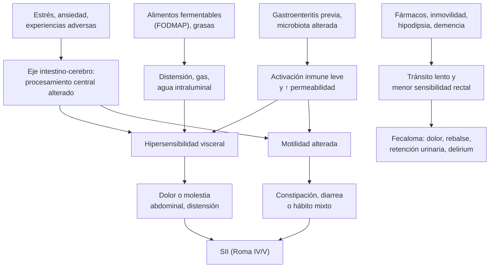
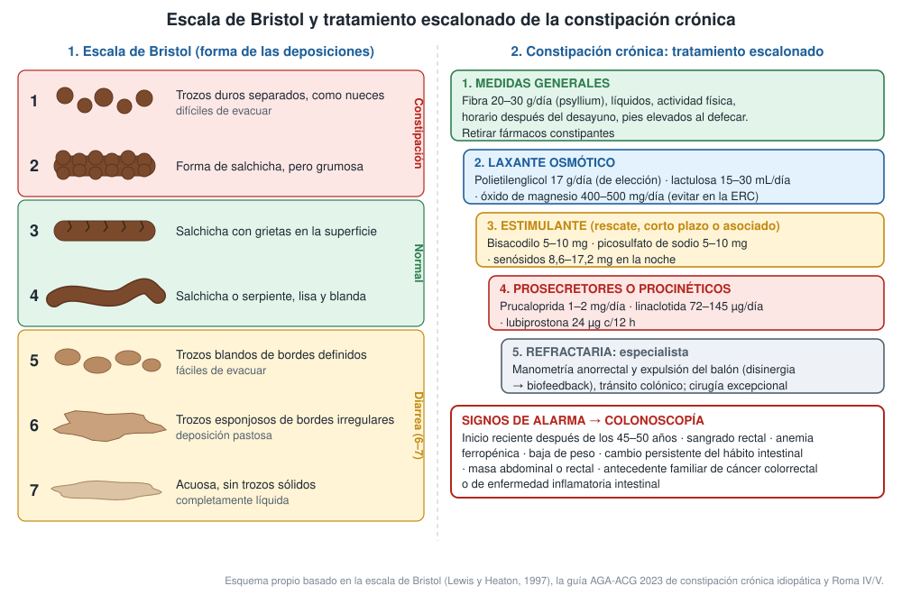

---
tags:
  - Gastroenterología
  - Geriatría
  - Frecuente en sala
---

# Constipación, fecaloma, síndrome de intestino irritable y diarrea crónica

**Subespecialidad**
Gastroenterología · Geriatría

**Guías principales**
AGA-ACG 2023: constipación crónica idiopática · Criterios de Roma IV (2016) y Roma V (2026): trastornos intestinales · ACG 2021 y BSG 2021: síndrome de intestino irritable · AGA 2022: fármacos en el intestino irritable con constipación y con diarrea · BSG 2018: estudio de la diarrea crónica · UEG 2021: colitis microscópica · ACG 2023: enfermedad celíaca

**Otras fuentes**
Estudio epidemiológico global de la Fundación Roma (2021) · Roma V frente a Roma IV (Staller 2026) · Constipación funcional en adultos chilenos (Rodríguez 2019)

**GES**
La constipación, el intestino irritable y la diarrea crónica no son GES. Sí lo es su principal diagnóstico diferencial: el **cáncer colorrectal en personas de 15 años y más (GES 70)**, con etapificación en 45 días desde la confirmación y tratamiento en 30 días desde la indicación.

**EUNACOM**
1.06.1.009 Constipación (específico, completo, completo) · 1.07.1.002 Constipación y fecalomas (específico, completo, completo) · 1.06.1.008 Trastornos digestivos funcionales (específico, completo, completo) · 1.06.1.011 Diarrea crónica (sospecha, inicial, derivar)

**Revisado**
Septiembre 2026

!!! abstract "Resumen en 60 segundos"
    - Los **trastornos intestinales funcionales** (hoy "de la interacción intestino-cerebro") son muy frecuentes: **4 de cada 10** personas en el mundo cumplen criterios de al menos uno.
    - **Roma V** (2026) los agrupa en seis: **síndrome de intestino irritable (SII)**, **constipación crónica**, **diarrea funcional**, **distensión abdominal funcional**, trastorno no clasificado y **constipación por opioides**.
    - **SII** = dolor **o molestia** abdominal recurrente (Roma V: **≥ 3 días al mes**, no continuo) asociado a la **defecación** o a cambios en la **frecuencia o forma** de las deposiciones. Se clasifica según la escala de **Bristol** (SII-C, SII-D, SII-M).
    - Se hace un **diagnóstico positivo**, no de exclusión, con estudio **limitado**, siempre que no haya **signos de alarma**:
        - Inicio después de los 45–50 años.
        - Sangrado, anemia, baja de peso.
        - Síntomas nocturnos.
        - Antecedente familiar de cáncer colorrectal o de enfermedad inflamatoria intestinal.
        - Si los hay: **colonoscopía**.
    - **Constipación**: descartar causas **secundarias** (fármacos, hipotiroidismo, hipercalcemia, cáncer) y tratar en escalera:
        - Fibra y medidas generales.
        - **Polietilenglicol** (primera línea).
        - **Estimulantes** (bisacodilo, senósidos) como rescate o asociados.
        - Prucaloprida o linaclotida.
    - **Fecaloma** en el adulto mayor: se presenta como **dolor, "diarrea" por rebalse, retención urinaria o delirium**. El **tacto rectal** lo diagnostica. Se trata con **desimpactación manual, enemas** y luego PEG, y se previene con un esquema de mantención.
    - **Diarrea crónica** (> 4 semanas): hemograma, PCR, TSH, **serología celíaca**, **calprotectina fecal** y estudio de **parásitos** y *C. difficile*. Colonoscopía con **biopsias** si hay alarma o si se sospecha una **colitis microscópica**. Derivar según la causa.

## Definición

| Término | Definición |
|---|---|
| **Constipación crónica (Roma IV, "funcional")** | ≥ 2 de los siguientes en > 25 % de las defecaciones: **esfuerzo**, deposiciones **duras** (Bristol 1–2), **evacuación incompleta**, sensación de **obstrucción** anorrectal, **maniobras manuales**; o **< 3 deposiciones espontáneas por semana**. Deposiciones blandas raras sin laxantes. Síntomas en los últimos 3 meses, iniciados ≥ 6 meses antes. Roma V la llama **"constipación crónica"** |
| **Síndrome de intestino irritable (Roma IV)** | Dolor abdominal recurrente **≥ 1 día por semana** en los últimos 3 meses, asociado a ≥ 2: **relación con la defecación**, cambio en la **frecuencia** o cambio en la **forma** de las deposiciones. Inicio ≥ 6 meses antes |
| **Cambios de Roma V (2026) en el SII** | Acepta **dolor o molestia** abdominal, baja la frecuencia a **≥ 3 días al mes** y excluye el dolor **continuo** (este orienta a un dolor abdominal mediado centralmente) |
| **Subtipos del SII** (según la escala de Bristol en los días con deposiciones anormales) | **SII-C**: > 25 % Bristol 1–2 y < 25 % Bristol 6–7. **SII-D**: al revés. **SII-M**: > 25 % de ambos. **SII-U**: no clasificable |
| **Diarrea funcional** | Deposiciones blandas o líquidas (Bristol 6–7) en > 25 % de las defecaciones, **sin dolor** predominante (si hay dolor, es SII-D) |
| **Distensión abdominal funcional** | Sensación de hinchazón o distensión visible recurrente, que predomina sobre los demás síntomas |
| **Constipación inducida por opioides** | Constipación nueva o que empeora al iniciar, cambiar o aumentar un opioide |
| **Fecaloma (impactación fecal)** | Masa de deposiciones endurecidas que el paciente **no puede evacuar**, habitualmente en el **recto** o el sigmoides |
| **Diarrea crónica** | Aumento de la frecuencia con deposiciones **blandas o líquidas** (Bristol 5–7) por **más de 4 semanas** (BSG 2018) |

## Epidemiología

### Mundial

- **Estudio global de la Fundación Roma** (73.076 adultos de 33 países):
    - **40,3 %** (encuesta por internet) y **20,7 %** (entrevista en el hogar) cumplían criterios de al menos un trastorno de la interacción intestino-cerebro.
    - Son más frecuentes en **mujeres** (OR 1,7) y se asocian a peor calidad de vida y más consultas.
- **Prevalencia del SII según los criterios**:
    - Roma IV la reduce frente a Roma III: **4,1 % vs 10,1 %** por internet y 1,5 % vs 3,5 % en el hogar.
    - **Roma V** vuelve a ampliarla: en personas con SII autodeclarado, **70 %** cumplía Roma V vs **59 %** Roma IV, con un grupo de **síntomas más leves** (Staller 2026).
- La **constipación** aumenta con la **edad** y es más frecuente en **mujeres**. En el adulto mayor institucionalizado o postrado, la **impactación fecal** es una causa frecuente de dolor, delirium y retención urinaria.
- La **diarrea crónica** es uno de los motivos más frecuentes de derivación a gastroenterología (BSG 2018).

!!! chile "Datos nacionales"
    - En una encuesta a **1.223 adultos chilenos** (2018), el **68,4 %** cumplía dos o más criterios de constipación funcional de Roma IV (Rodríguez 2019).
        - Fue más frecuente en **mujeres** y en **mayores**.
        - Los síntomas más frecuentes fueron las deposiciones **duras**, el **esfuerzo** excesivo y la **evacuación incompleta**.
    - Hay pocos estudios poblacionales chilenos de SII. La prevalencia depende mucho del criterio usado.
    - **Cáncer colorrectal (GES 70)**: cubre desde los 15 años la confirmación, la etapificación y el tratamiento. Todo **cambio del hábito intestinal con signos de alarma** se estudia con colonoscopía.
    - En zonas donde la **enfermedad de Chagas** fue endémica (norte y centro del país), considerar el **megacolon chagásico** en la constipación progresiva de larga data.

## Etiología

### Constipación

| Tipo | Causas |
|---|---|
| **Primaria (funcional)** | **Tránsito normal** (la más frecuente, a menudo con SII-C), **tránsito lento** (inercia colónica), **trastornos de la defecación** (**disinergia** del piso pélvico, rectocele, prolapso) |
| **Fármacos** | **Opioides**, **anticolinérgicos** (tricíclicos, antihistamínicos, antiespasmódicos, oxibutinina), **antagonistas del calcio** (verapamilo), **hierro oral**, calcio, antiácidos con aluminio, antipsicóticos, ondansetrón, diuréticos, antiparkinsonianos |
| **Metabólicas y endocrinas** | **Hipotiroidismo**, **hipercalcemia**, **hipokalemia**, diabetes (neuropatía autonómica), uremia, embarazo |
| **Neurológicas** | **Parkinson**, esclerosis múltiple, lesión medular, ACV, **demencia**, neuropatía autonómica |
| **Estructurales** | **Cáncer colorrectal**, estenosis (diverticular, isquémica), **fisura anal** o hemorroides (dolor que inhibe la defecación), **megacolon** (chagásico, Hirschsprung) |
| **Estilo de vida y contexto** | Poca fibra y líquidos, **inmovilidad**, hospitalización, falta de privacidad o de acceso al baño, depresión, trastornos alimentarios |

### Diarrea crónica

| Grupo | Causas frecuentes |
|---|---|
| **Funcionales** | **SII-D** y **diarrea funcional** (las más frecuentes, sin alarma) |
| **Inflamatorias** | **Enfermedad inflamatoria intestinal** (Crohn, colitis ulcerosa), **colitis microscópica** (mujer > 50 años, **AINE, IBP, ISRS**, estatinas), colitis isquémica, rádica |
| **Malabsorción** | **Enfermedad celíaca**, intolerancia a la **lactosa**, **diarrea por ácidos biliares** (poscolecistectomía, resección ileal), **insuficiencia pancreática** (pancreatitis crónica, cáncer), sobrecrecimiento bacteriano |
| **Infecciosas** | ***Giardia***, *C. difficile*, *Cryptosporidium* y otras en el **VIH**, TBC intestinal |
| **Fármacos y sustancias** | **Metformina**, **magnesio**, laxantes (abuso), colchicina, antibióticos, **alcohol**, edulcorantes (sorbitol) |
| **Endocrinas** | **Hipertiroidismo**, diabetes (neuropatía autonómica), Addison; raros: tumores neuroendocrinos (carcinoide, VIPoma, gastrinoma) |
| **Neoplásicas** | **Cáncer colorrectal**, adenoma velloso, linfoma |
| **Otras** | **Diarrea por rebalse** en el fecaloma, incontinencia fecal (a menudo confundida con diarrea) |

## Fisiopatología

- **Constipación**:
    - **Tránsito lento**: menos contracciones propulsivas de alta amplitud, menos células intersticiales de Cajal y neuronas entéricas.
    - **Disinergia defecatoria**: al pujar, el esfínter anal y el músculo puborrectal **se contraen en vez de relajarse**. Es un problema de **coordinación**, que se trata con **biofeedback** y no con más laxantes.
    - En el **adulto mayor** se suman la inmovilidad, la hipodipsia, los fármacos, la menor sensibilidad rectal y la dificultad para llegar al baño. El recto se dilata y las deposiciones se endurecen: **fecaloma**.
- **SII**: es un trastorno de la **interacción intestino-cerebro**. Contribuyen:
    - **Hipersensibilidad visceral**: el umbral de dolor a la distensión está bajo.
    - **Alteración de la motilidad**.
    - **Microbiota** alterada; **SII posinfeccioso** tras una gastroenteritis.
    - Activación inmune de la mucosa (mastocitos), permeabilidad aumentada.
    - Procesamiento central del dolor alterado; **estrés**, ansiedad, depresión y experiencias adversas.
    - **Alimentos** fermentables (FODMAP) que distienden por osmosis y fermentación.
- **Diarrea crónica**: por mecanismos **osmóticos** (se detiene con el ayuno: lactosa, magnesio), **secretores** (persiste en ayuno y en la noche: ácidos biliares, tumores, toxinas), **inflamatorios** (sangre, pus, calprotectina alta) o de **malabsorción** (esteatorrea, baja de peso, déficits).

## Clasificación

- **Trastornos intestinales según Roma V (2026)**:
    1. Síndrome de intestino irritable (SII-C, SII-D, SII-M, SII-U).
    2. Constipación crónica.
    3. Diarrea funcional.
    4. Distensión abdominal funcional.
    5. Trastorno intestinal no clasificado.
    6. Constipación inducida por opioides.
- **Constipación según su fisiopatología**: tránsito normal, tránsito lento, trastornos de la defecación, o secundaria.
- **Diarrea crónica según el mecanismo**: acuosa (osmótica o secretora), inflamatoria o grasa (esteatorrea).

<figure markdown>
{ loading=lazy }
<figcaption>Figura 1. Escala de Bristol de la forma de las deposiciones y tratamiento escalonado de la constipación crónica, con los signos de alarma que indican colonoscopía. Esquema propio basado en Lewis y Heaton (1997), la guía AGA-ACG 2023 de constipación crónica idiopática y los criterios de Roma IV/V.</figcaption>
</figure>

## Clínica

- **Anamnesis**:
    - **Forma** (escala de Bristol) y **frecuencia** de las deposiciones.
    - **Esfuerzo**, evacuación incompleta, **maniobras digitales** (sugieren un trastorno de la defecación).
    - Dolor y su relación con la defecación, distensión.
    - **Fármacos**, fibra, líquidos, actividad física, ánimo, sueño.
    - **Signos de alarma**.
    - Qué entiende el paciente por "constipación" o "diarrea": muchas "diarreas" son **incontinencia** o **rebalse**.
- **SII**:
    - Dolor que **mejora o cambia con la defecación**, distensión que aumenta durante el día.
    - Síntomas **extraintestinales** frecuentes: fatiga, fibromialgia, dispepsia, cefalea, síntomas urinarios.
    - **Sin** baja de peso, sangrado ni síntomas nocturnos.
- **Fecaloma** (adulto mayor, postrado, con opioides o con demencia):
    - Dolor y distensión abdominal, náuseas, anorexia.
    - **Diarrea por rebalse**: líquido que escurre alrededor del fecaloma.
    - **Retención urinaria**, **delirium**, fiebre baja.
    - Complicaciones: **úlcera o colitis estercorácea**, perforación.
- **Diarrea crónica**: volumen, relación con el **ayuno** y con las comidas, **diarrea nocturna** (orgánica), esteatorrea (deposiciones grasas, flotantes), sangre, baja de peso, síntomas extraintestinales (artritis, lesiones cutáneas, aftas, uveítis en la enfermedad inflamatoria intestinal).
- **Examen físico**:
    - Abdomen: distensión, masa, sensibilidad.
    - **Tacto rectal**, **siempre** en la constipación del adulto mayor:
        - **Fecaloma**, masa rectal, sangre.
        - Tono anal, contracción y relajación al pujar (**disinergia**), descenso perineal.
        - Fisuras y hemorroides.
    - Buscar signos de hipotiroidismo, anemia, desnutrición y neuropatía.

## Diagnóstico

!!! alarma "Signos de alarma: estudiar (colonoscopía, exámenes) antes de catalogar como funcional"
    - **Inicio reciente** de los síntomas después de los **45–50 años**.
    - **Sangrado rectal** o sangre en las deposiciones (excluida la hemorroidal típica en jóvenes), **anemia ferropénica**.
    - **Baja de peso** no intencionada, fiebre.
    - Síntomas **nocturnos** que despiertan al paciente (diarrea, dolor).
    - **Masa** abdominal o rectal.
    - Antecedente familiar de **cáncer colorrectal**, de **enfermedad inflamatoria intestinal** o de **enfermedad celíaca**.
    - Cambio **persistente y progresivo** del hábito intestinal.
    - Exámenes alterados: PCR o **calprotectina** altas, serología celíaca positiva.

!!! guia "Diagnóstico positivo del SII (ACG 2021, BSG 2021, Roma V)"
    - Con **criterios de Roma** y **sin signos de alarma**, se hace un **diagnóstico positivo**. No se requiere una batería de exámenes para "descartar todo".
    - **Estudio mínimo**:
        - **Hemograma** y **PCR**.
        - **Serología celíaca** (IgA anti-transglutaminasa + IgA total) si hay diarrea o hábito mixto.
        - **Calprotectina fecal** en el SII-D en menores de 45 años, para descartar una enfermedad inflamatoria intestinal.
        - TSH según la clínica.
    - **No** se recomienda la colonoscopía de rutina en menores de 45 años sin signos de alarma.
    - Explicar el diagnóstico con claridad: **no es "nada"**, es un trastorno real y frecuente, con tratamiento.

- **Constipación crónica**: el diagnóstico es **clínico**.
    - Estudio de laboratorio **dirigido** (hemograma, glicemia, calcio y TSH si hay sospecha), revisión de los fármacos y tacto rectal.
    - **Colonoscopía** solo si hay alarma o si corresponde el tamizaje por edad.
    - Si fracasan las medidas, **estudio fisiológico** en la especialidad: manometría anorrectal y test de expulsión del balón (disinergia), tránsito colónico con marcadores radiopacos.
- **Fecaloma**: el diagnóstico es **clínico con el tacto rectal**. La **radiografía de abdomen** muestra la impactación alta. La **TC** se pide si se sospecha una colitis estercorácea, una perforación o una obstrucción.

## Laboratorio

- **Constipación**: hemograma (anemia), glicemia, **calcio**, **potasio**, creatinina y **TSH** si hay sospecha clínica o es de inicio reciente.
- **SII**: ver el recuadro de diagnóstico positivo.
- **Diarrea crónica** (BSG 2018):
    - **Sangre**: hemograma (ferritina si hay anemia), **PCR**, **TSH**, **serología celíaca**.
    - **Deposiciones**: toxina de *C. difficile*, **parasitológico** (o antígeno de *Giardia*), **calprotectina fecal** y **test inmunoquímico de sangre oculta** en los mayores.
    - **Si hay malabsorción**: hierro, **B12**, **folato**, **calcio**, **albúmina**, vitamina D. Elastasa fecal (insuficiencia pancreática).
    - **Si hay sospecha de inmunodeficiencia**: **VIH** e inmunoglobulinas.
    - Electrolitos y función renal si la diarrea es abundante (hipokalemia, acidosis).
- **Calprotectina fecal**: alta en la inflamación de la mucosa (enfermedad inflamatoria intestinal, infección, cáncer, AINE). **Normal** apoya un trastorno funcional.

## Imágenes

- **Radiografía de abdomen simple**: impactación fecal alta, dilatación colónica (megacolon, vólvulo del sigmoides en el adulto mayor constipado), obstrucción.
- **Colonoscopía** (con **biopsias escalonadas** del colon si hay diarrea crónica, aunque la mucosa se vea normal: **colitis microscópica**):
    - Si hay **signos de alarma**.
    - Como **tamizaje** según la edad.
    - En la diarrea crónica sin causa tras el estudio inicial.
    - En la sospecha de enfermedad inflamatoria intestinal.
- **Endoscopía alta con biopsias duodenales**: confirmar la **enfermedad celíaca** (serología positiva) con dieta **con gluten**.
- **TC de abdomen**: complicaciones (perforación, obstrucción, colitis estercorácea), masas y pancreatitis crónica. **Enterorresonancia** o cápsula en la sospecha de Crohn de intestino delgado.
- **Estudios funcionales** (especialista): **manometría anorrectal**, **expulsión del balón**, defecografía, tránsito colónico con marcadores.

## Diagnóstico diferencial

| Condición | Claves |
|---|---|
| **Cáncer colorrectal** | > 45–50 años, cambio reciente del hábito, **sangrado**, **anemia ferropénica**, baja de peso. Colonoscopía (**GES 70**) |
| **Enfermedad inflamatoria intestinal** | Adulto joven, diarrea con **sangre**, nocturna, baja de peso, manifestaciones extraintestinales, **calprotectina alta**, PCR alta |
| **Enfermedad celíaca** | Diarrea o constipación, distensión, **anemia ferropénica**, osteoporosis, dermatitis herpetiforme; **IgA anti-transglutaminasa** |
| **Colitis microscópica** | Mujer > 50 años, **diarrea acuosa** crónica sin sangre, a veces nocturna, **AINE, IBP o ISRS**; colonoscopía normal con **biopsias** alteradas |
| **Diarrea por ácidos biliares** | **Poscolecistectomía** o resección ileal; responde a la colestiramina |
| **Intolerancia a la lactosa** | Síntomas con los lácteos; mejora al suspenderlos |
| **Giardiasis** | Diarrea, distensión, flatulencia, malabsorción; parasitológico o antígeno |
| **Hipotiroidismo e hipertiroidismo** | Constipación o diarrea con los demás síntomas tiroideos; TSH |
| **Endometriosis, patología ovárica** | Dolor cíclico, dispareunia; en la mujer con distensión persistente > 50 años, **descartar el cáncer de ovario** (CA-125, ecografía) |
| **Dispepsia funcional** | Síntomas epigástricos. Ver [dispepsia](dispepsia-ulcera-peptica-y-cancer-gastrico.md) |

## Tratamiento

### Constipación crónica

- **Medidas generales**:
    - **Fibra soluble** (psyllium) hasta **20–30 g/día**, en forma progresiva y con líquidos suficientes. Mejora la constipación leve, pero puede empeorar la distensión y es mal tolerada en el tránsito lento.
    - Actividad física.
    - Aprovechar el **reflejo gastrocólico**: ir al baño 15–30 minutos después del desayuno, sin apuro.
    - **Postura** con los pies elevados en un banquito.
    - **Retirar o cambiar los fármacos constipantes**.

!!! dosis "Laxantes (AGA-ACG 2023)"
    | Clase | Fármaco y dosis | Comentarios |
    |---|---|---|
    | **Formador de volumen** | **Psyllium** 3,5–10 g/día, subiendo lento | Recomendación condicional. Tomarlo con abundante agua |
    | **Osmótico (primera línea)** | **Polietilenglicol (PEG 3350) 17 g/día** disuelto en 240 mL (ajustar entre 8,5 y 34 g/día) | Recomendación **fuerte**. Seguro a largo plazo y en adultos mayores |
    | **Osmótico** | **Lactulosa 15–30 mL/día** (≈ 10–20 g) | Condicional. Causa **distensión** y flatulencia |
    | **Osmótico** | **Óxido de magnesio 400–500 mg/día** | Condicional. **Evitarlo en la ERC** (hipermagnesemia) |
    | **Estimulantes** | **Bisacodilo 5–10 mg** en la noche · **picosulfato de sodio 5–10 mg** · **senósidos 8,6–17,2 mg** en la noche | Bisacodilo y picosulfato: recomendación **fuerte** como **rescate o por períodos cortos**. Senósidos: condicional. Cólicos; son seguros a largo plazo si se necesitan |
    | **Procinético** | **Prucaloprida 1–2 mg/día** (1 mg en adultos mayores y en la ERC grave) | Recomendación fuerte. Cefalea, náuseas, diarrea al inicio |
    | **Prosecretores** | **Linaclotida 72–145 µg/día** · lubiprostona 24 µg c/12 h · plecanatida 3 mg/día | Linaclotida y plecanatida: recomendación fuerte. Causan **diarrea** |

    - **Constipación por opioides**:
        - **Prevenirla** desde el inicio con PEG o senósidos (los formadores de volumen no sirven).
        - Si es refractaria: antagonistas periféricos del receptor μ: **naloxegol 25 mg/día** o **metilnaltrexona SC**. Están **contraindicados si hay obstrucción**.
    - Evitar el **aceite mineral** oral si hay riesgo de **aspiración** (neumonía lipoídica) y los **enemas de fosfato** en la ERC, la deshidratación y el adulto mayor frágil (hiperfosfatemia, hipocalcemia).

- **Constipación refractaria**:
    - Revisar la adherencia y las causas secundarias. Derivar a gastroenterología para el **estudio fisiológico**.
    - **Disinergia** → **biofeedback** (terapia de reeducación del piso pélvico).
    - La **cirugía** (colectomía) es excepcional: tránsito lento grave y refractario, sin disinergia.

### Fecaloma (impactación fecal)

!!! dosis "Manejo del fecaloma"
    1. **Tacto rectal**: confirma la impactación rectal y descarta una masa. **Radiografía** si se sospecha una impactación alta.
    2. **Impactación rectal**:
        - **Desimpactación manual** con lubricante, analgesia y, si es necesario, sedación suave. Fragmentar con el dedo.
        - Seguir con **enemas**: suero fisiológico tibio, aceite mineral (de retención, para ablandar) o enemas comerciales.
        - **Evitar** los enemas de **fosfato** en la ERC, la deshidratación y el adulto mayor frágil.
    3. **Impactación alta sin obstrucción**: **PEG en dosis altas** por 1–3 días, según el producto (por ejemplo, 8 sobres de 13,8 g en 1 L de agua en 6 horas), o enemas altos.
    4. **Después**: **esquema de mantención** diario (PEG ± senósidos) y retirar los fármacos constipantes. Hidratación, movilización, acceso al baño y horario.
    5. **Buscar las complicaciones y tratarlas**:
        - **Retención urinaria**: sonda vesical.
        - **Delirium**.
        - **Úlcera o colitis estercorácea**: dolor, fiebre, sangrado; TC.
        - **Perforación**: abdomen agudo; cirugía.

### Síndrome de intestino irritable

- **Base**:
    - **Explicar** el diagnóstico y el eje intestino-cerebro, con expectativas realistas: mejorar, no "curar".
    - **Actividad física** regular.
    - Comidas regulares. Reducir el alcohol, la cafeína, las grasas y la fibra **insoluble**.
- **Fibra soluble**: **psyllium** 3–4 g/día, subiendo gradualmente; mejora los síntomas globales.
- **Dieta baja en FODMAP**: segunda línea, **guiada por nutricionista**. Tiene 3 fases: restricción por 4–6 semanas, reintroducción y personalización. No se mantiene la restricción estricta a largo plazo.

!!! dosis "Fármacos en el SII (AGA 2022, BSG 2021)"
    | Objetivo | Fármaco y dosis | Comentarios |
    |---|---|---|
    | **Dolor y espasmo** | **Antiespasmódicos**: bromuro de pinaverio 50–100 mg c/8 h, trimebutina 100–200 mg c/8 h, mebeverina 135 mg c/8 h antes de las comidas; **aceite de menta** | Recomendación condicional; alivio modesto |
    | **Dolor y síntomas globales** | **Amitriptilina 10 mg** en la noche, subir cada 2–3 semanas hasta **30–50 mg** | Neuromodulador intestino-cerebro. Útil sobre todo en el SII-D. Efectos anticolinérgicos. Explicar que **no se usa como antidepresivo** |
    | **SII-D** | **Loperamida 2–4 mg** según necesidad (máximo 16 mg/día) | Mejora la diarrea, **no el dolor** |
    | **SII-D** | **Rifaximina 550 mg c/8 h por 14 días** | Mejora la distensión y la diarrea; se puede repetir |
    | **SII-C** | **Linaclotida 290 µg/día** (recomendación **fuerte**); **PEG** 17 g/día (mejora la constipación, no el dolor) | Linaclotida: diarrea como efecto adverso |
    | **No recomendados** | **ISRS** para los síntomas globales del SII (AGA 2022: recomendación condicional en contra) | Se pueden usar si hay ansiedad o depresión |

    - **Terapias psicológicas**: **terapia cognitivo-conductual** e hipnoterapia dirigida al intestino, en el SII refractario.

### Diarrea crónica (sospechar, iniciar y derivar)

- **Estudio inicial** (ver Laboratorio) y **suspender** los fármacos sospechosos: metformina, magnesio, AINE, IBP, ISRS, edulcorantes.
- **Tratar la causa**:
    - **Celíaca**: **dieta sin gluten** estricta y de por vida, con nutricionista.
    - **Giardia**: **metronidazol 250–500 mg c/8 h por 5–7 días** o tinidazol 2 g en dosis única.
    - **Colitis microscópica**: suspender los fármacos asociados; **budesonida 9 mg/día** por 6–8 semanas (UEG 2021).
    - **Diarrea por ácidos biliares**: **colestiramina 4 g** 1–3 veces al día (lejos de otros fármacos).
    - **Insuficiencia pancreática**: enzimas pancreáticas con las comidas.
    - **Hipertiroidismo**: ver [tiroides](../endocrinologia/hipotiroidismo-e-hipertiroidismo.md).
- **Loperamida**: solo tras descartar las causas **inflamatorias** e infecciosas.
- **Derivar a gastroenterología**:
    - Signos de alarma, sospecha de enfermedad inflamatoria intestinal o de colitis microscópica.
    - Malabsorción.
    - Diarrea sin causa tras el estudio inicial.
    - Pacientes con **VIH** (ver [VIH](../infectologia/infeccion-por-vih.md)).
- **Hospitalizar**: deshidratación, alteraciones electrolíticas, desnutrición grave.

## Complicaciones

- **De la constipación**:
    - **Fecaloma**, **úlcera estercorácea**, perforación.
    - **Vólvulo del sigmoides** en el adulto mayor con constipación crónica.
    - **Hemorroides**, **fisura anal**, **prolapso rectal**.
    - Incontinencia fecal por rebalse, **retención urinaria**, **delirium**.
- **De los laxantes**: hipokalemia y deshidratación (abuso de estimulantes), hipermagnesemia (magnesio en la ERC), hiperfosfatemia (enemas de fosfato), neumonía lipoídica (aceite mineral aspirado). La melanosis coli por antraquinonas es **benigna**.
- **Del SII**: **peor calidad de vida**, ausentismo, consultas y exámenes repetidos, **cirugías innecesarias** (colecistectomía, histerectomía), ansiedad y depresión.
- **De la diarrea crónica**: deshidratación, hipokalemia, acidosis metabólica, desnutrición, déficit de micronutrientes (hierro, B12, folato, vitamina D), osteoporosis (celíaca).

## Pronóstico y seguimiento

- **SII**: es **crónico y fluctuante**, con períodos de mejoría. **No** aumenta el riesgo de cáncer colorrectal ni de enfermedad inflamatoria intestinal, y **no acorta la vida**.
    - La relación médico-paciente y la educación mejoran los resultados.
    - Reevaluar si cambian los síntomas o aparecen **signos de alarma**.
- **Constipación crónica**: la mayoría responde a las medidas generales y a los laxantes. **Controlar** la respuesta, los efectos adversos y los electrolitos (en el adulto mayor). Pesquisar el cáncer colorrectal según la edad.
- **Adulto mayor** hospitalizado, postrado o con opioides: indicar un **esquema preventivo** de laxantes y registrar las **deposiciones diarias** (hace más de 3 días sin deposiciones → tacto rectal).
- **Diarrea crónica**: el pronóstico depende de la causa. Seguimiento nutricional en la celíaca y en la malabsorción.

## Perlas para el internado

!!! perla "Para la sala y el turno"
    - En el adulto mayor con **"diarrea" y dolor abdominal**, haz un **tacto rectal**: a menudo es un **fecaloma con rebalse**. Darle loperamida lo empeora.
    - **Delirium + retención urinaria + distensión** en un anciano postrado: busca un fecaloma.
    - Todo paciente con **opioides** debe tener un **laxante indicado** (PEG o senósidos) desde el primer día. La fibra no sirve para eso.
    - **Registra las deposiciones** de tus pacientes hospitalizados. Si lleva más de 3 días sin evacuar, examínalo.
    - **Evita los enemas de fosfato** en la ERC y en el adulto mayor deshidratado, y el **óxido de magnesio** en la ERC.
    - La **diarrea nocturna**, la **baja de peso** y la **sangre** no son del SII: estudia.
    - **Mujer > 50 años** con diarrea acuosa crónica y colonoscopía "normal": pide **biopsias** (colitis microscópica) y revisa los AINE, los IBP y los ISRS.
    - Antes de la biopsia duodenal por celíaca, el paciente debe estar **comiendo gluten**.

## Preguntas de repaso

??? repaso "1. Mujer de 29 años con 1 año de dolor abdominal tipo cólico varias veces al mes que mejora al defecar, con deposiciones duras (Bristol 1–2) y distensión que aumenta en la tarde. Sin baja de peso, sangrado ni síntomas nocturnos. Examen normal. ¿Diagnóstico y manejo?"
    **Síndrome de intestino irritable con constipación (SII-C)**: dolor recurrente asociado a la defecación y al cambio en la forma de las deposiciones, **sin signos de alarma**.

    - **Diagnóstico positivo**. Hemograma y PCR (y serología celíaca si hay dudas). **No** colonoscopía.
    - **Educación**: trastorno de la interacción intestino-cerebro, benigno, crónico y con tratamiento.
    - **Psyllium** progresivo, actividad física, comidas regulares.
    - **PEG** para la constipación.
    - **Antiespasmódico** o aceite de menta para el dolor.
    - Si no responde: **linaclotida**. Luego amitriptilina en dosis bajas, dieta baja en FODMAP con nutricionista y terapia psicológica.

??? repaso "2. Hombre de 67 años sin controles, con constipación progresiva de 4 meses, deposiciones más delgadas, cansancio y baja de 5 kg. Hb 9,8 g/dL, VCM 72 fL. ¿Qué haces?"
    **Cambio reciente del hábito intestinal con signos de alarma** (edad, baja de peso, **anemia ferropénica**): **cáncer colorrectal** hasta demostrar lo contrario.

    - **Colonoscopía** completa con biopsias, de forma preferente.
    - Ferritina, perfil hepático, CEA (para el seguimiento, no para el diagnóstico).
    - Si se confirma, ingresar al **GES 70** (etapificación con TC de tórax, abdomen y pelvis).
    - Mientras tanto: laxante osmótico (PEG) si no hay obstrucción, hierro. Consultar de urgencia si aparecen vómitos, distensión o falta de gases (obstrucción).

??? repaso "3. Mujer de 86 años, postrada, con demencia, en tratamiento con tramadol y sulfato ferroso. Desde hace 2 días está agitada y con \"diarrea\" líquida escasa. Abdomen distendido, globo vesical. Tacto rectal: deposiciones duras que llenan la ampolla. ¿Diagnóstico y manejo?"
    **Fecaloma** con **diarrea por rebalse**, complicado con **retención urinaria** y probable **delirium**.

    - **Sonda vesical**.
    - **Desimpactación manual** con lubricante y analgesia, luego **enemas** (suero fisiológico o aceite mineral). Evitar los enemas de fosfato.
    - Luego **PEG** diario ± **senósidos** como mantención.
    - **Revisar los fármacos**: el tramadol y el hierro oral constipan. Evaluar el cambio de analgésico y la vía o la necesidad del hierro.
    - Hidratación, electrolitos y búsqueda de otras causas del delirium.
    - **No** dar loperamida.

??? repaso "4. Mujer de 31 años con 6 meses de deposiciones blandas 3–4 veces al día, distensión, baja de 4 kg y cansancio. Hb 10,5 g/dL con ferritina baja. IgA anti-transglutaminasa muy elevada, IgA total normal. ¿Qué haces?"
    **Diarrea crónica con malabsorción** y serología compatible con **enfermedad celíaca**.

    - **Endoscopía alta con biopsias duodenales** para confirmar (atrofia vellositaria, linfocitos intraepiteliales), **mientras sigue comiendo gluten**.
    - Medir hierro, **B12**, **folato**, calcio y **vitamina D**. Densitometría ósea según el caso.
    - Tras la confirmación: **dieta sin gluten estricta y de por vida** con nutricionista; hierro y suplementos; control de la serología.
    - Estudiar a los familiares de primer grado si tienen síntomas.

??? repaso "5. Hombre de 72 años con cáncer de próstata metastásico que inicia morfina oral por dolor óseo. ¿Qué indicas para el intestino? A las 3 semanas sigue sin evacuar pese al laxante. ¿Qué haces?"
    **Prevenir la constipación inducida por opioides** desde el inicio: **PEG** 17 g/día y/o **senósidos** en la noche, con controles. La **fibra no sirve** y puede empeorar.

    - Si es **refractaria**:
        - **Tacto rectal** y radiografía (fecaloma, obstrucción).
        - Descartar la hipercalcemia y la compresión medular (constipación con retención urinaria o debilidad).
        - Optimizar el osmótico y el estimulante.
    - Si persiste sin obstrucción: antagonista periférico del receptor μ: **naloxegol 25 mg/día** o **metilnaltrexona** SC.

??? repaso "6. Mujer de 68 años con 3 meses de diarrea acuosa 5–6 veces al día, también en la noche, sin sangre. Toma diclofenaco, omeprazol y sertralina. Hemograma, PCR, TSH, serología celíaca y coproparasitológico normales. La colonoscopía muestra una mucosa normal. ¿Qué sospechas?"
    **Colitis microscópica** (colágena o linfocítica): mujer mayor de 50 años con **diarrea acuosa crónica**, nocturna, asociada a **AINE, IBP e ISRS**, con **mucosa macroscópicamente normal**.

    - El diagnóstico lo dan las **biopsias escalonadas del colon**. Si no se tomaron, hay que repetir la colonoscopía para tomarlas.
    - **Suspender** los fármacos asociados: diclofenaco; reevaluar el omeprazol y la sertralina.
    - Tratamiento: **budesonida 9 mg/día** por 6–8 semanas; loperamida como complemento.
    - Controlar la hidratación y el potasio.

## Referencias

1. Chang L, Chey WD, Imdad A, et al. American Gastroenterological Association-American College of Gastroenterology clinical practice guideline: pharmacological management of chronic idiopathic constipation. *Gastroenterology.* 2023;164(7):1086–1106. doi:[10.1053/j.gastro.2023.03.214](https://doi.org/10.1053/j.gastro.2023.03.214)
2. Corsetti M, Shin A, Lacy BE, et al. Bowel disorders (Roma V). *Gastroenterology.* 2026;170(6):1261–1282. doi:[10.1053/j.gastro.2026.02.003](https://doi.org/10.1053/j.gastro.2026.02.003)
3. Staller K, Goodoory VC, Ng CE, Ford AC, Black CJ. Epidemiologic, clinical, and psychological characteristics of individuals with self-reported irritable bowel syndrome based on the Rome V vs Rome IV criteria. *Clin Gastroenterol Hepatol.* 2026. doi:[10.1016/j.cgh.2026.07.022](https://doi.org/10.1016/j.cgh.2026.07.022)
4. Lacy BE, Pimentel M, Brenner DM, et al. ACG clinical guideline: management of irritable bowel syndrome. *Am J Gastroenterol.* 2021;116(1):17–44. doi:[10.14309/ajg.0000000000001036](https://doi.org/10.14309/ajg.0000000000001036)
5. Vasant DH, Paine PA, Black CJ, et al. British Society of Gastroenterology guidelines on the management of irritable bowel syndrome. *Gut.* 2021;70(7):1214–1240. doi:[10.1136/gutjnl-2021-324598](https://doi.org/10.1136/gutjnl-2021-324598)
6. Chang L, Sultan S, Lembo A, et al. AGA clinical practice guideline on the pharmacological management of irritable bowel syndrome with constipation. *Gastroenterology.* 2022;163(1):118–136. doi:[10.1053/j.gastro.2022.04.016](https://doi.org/10.1053/j.gastro.2022.04.016)
7. Lembo A, Sultan S, Chang L, et al. AGA clinical practice guideline on the pharmacological management of irritable bowel syndrome with diarrhea. *Gastroenterology.* 2022;163(1):137–151. doi:[10.1053/j.gastro.2022.04.017](https://doi.org/10.1053/j.gastro.2022.04.017)
8. Arasaradnam RP, Brown S, Forbes A, et al. Guidelines for the investigation of chronic diarrhoea in adults: British Society of Gastroenterology, 3rd edition. *Gut.* 2018;67(8):1380–1399. doi:[10.1136/gutjnl-2017-315909](https://doi.org/10.1136/gutjnl-2017-315909)
9. Sperber AD, Bangdiwala SI, Drossman DA, et al. Worldwide prevalence and burden of functional gastrointestinal disorders, results of Rome Foundation Global Study. *Gastroenterology.* 2021;160(1):99–114.e3. doi:[10.1053/j.gastro.2020.04.014](https://doi.org/10.1053/j.gastro.2020.04.014)
10. Miehlke S, Guagnozzi D, Zabana Y, et al. European guidelines on microscopic colitis: United European Gastroenterology and European Microscopic Colitis Group statements and recommendations. *United European Gastroenterol J.* 2021;9(1):13–37. doi:[10.1177/2050640620951905](https://doi.org/10.1177/2050640620951905)
11. Rubio-Tapia A, Hill ID, Semrad C, et al. American College of Gastroenterology guidelines update: diagnosis and management of celiac disease. *Am J Gastroenterol.* 2023;118(1):59–76. doi:[10.14309/ajg.0000000000002075](https://doi.org/10.14309/ajg.0000000000002075)
12. Lewis SJ, Heaton KW. Stool form scale as a useful guide to intestinal transit time. *Scand J Gastroenterol.* 1997;32(9):920–924. doi:[10.3109/00365529709011203](https://doi.org/10.3109/00365529709011203)
13. Rodríguez Castillo TR, Moreno Baeza N, Bocic Alvarez G, et al. Prevalencia y perfil epidemiológico de la constipación funcional en adultos con los nuevos criterios ROMA IV. *Rev Cir.* 2019;71(5). doi:[10.35687/s2452-45492019005374](https://doi.org/10.35687/s2452-45492019005374)
14. Superintendencia de Salud. Problema de salud 70: cáncer colorrectal en personas de 15 años y más (ficha GES). [superdesalud.gob.cl](https://www.superdesalud.gob.cl/app/uploads/2024/03/articles-18886_archivo_fuente.pdf)
