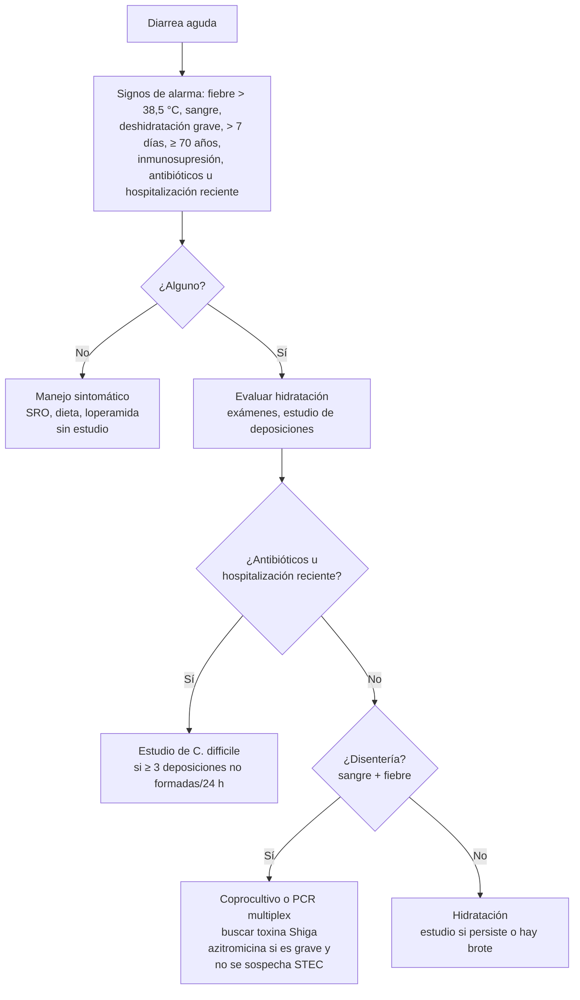

---
tags:
  - Gastroenterología
  - Infectología
  - Urgencia
  - Frecuente en sala
---

# Diarrea aguda, toxiinfección alimentaria e infección por Clostridioides difficile

**Subespecialidad**
Gastroenterología · Infectología · Medicina de urgencia · APS

**Guías principales**
IDSA 2017: diarrea infecciosa · ACG 2016: diarrea aguda infecciosa en adultos · IDSA/SHEA 2021: actualización focalizada de *C. difficile* · ACG 2021: *C. difficile* · ESCMID 2021: tratamiento de *C. difficile*

**Otras fuentes**
Ensayos de fidaxomicina (Louie, 2011) y de vancomicina frente a metronidazol (Zar, 2007) · Brotes de *Vibrio parahaemolyticus* en Chile (2004–2005) · *E. coli* enterohemorrágica y SHU en Chile

**GES**
No. Los brotes de enfermedades transmitidas por alimentos son de **notificación obligatoria**

**EUNACOM**
1.06.2.005 Diarrea aguda (específico, completo, completo) · 1.04.1.026 Toxicoinfección alimentaria (específico, completo, completo) · 1.04.1.009 y 1.06.1.010 Diarrea asociada a antibióticos (específico, completo, completo)

**Revisado**
Septiembre 2026

!!! abstract "Resumen en 60 segundos"
    - **Diarrea aguda**: **≥ 3 deposiciones líquidas en 24 h** por **< 14 días**. En el adulto, la mayoría es **viral** (norovirus) y **autolimitada**.
    - **Lo más importante es la hidratación**: **sales de rehidratación oral** de osmolaridad reducida; suero EV si la deshidratación es grave o hay vómitos incoercibles.
    - **Buscar los signos de alarma** que indican estudio y a veces antibióticos: **fiebre**, **sangre en las deposiciones** (disentería), **deshidratación grave**, duración > 7 días, **adulto mayor**, **inmunosupresión**, hospitalización reciente o uso de antibióticos.
    - **Antibióticos sólo en casos seleccionados** (disentería febril, sepsis, inmunosuprimidos, diarrea del viajero moderada a grave): **azitromicina**. **Evitarlos** en la sospecha de ***E. coli* productora de toxina Shiga**, porque aumentan el riesgo de **síndrome hemolítico urémico (SHU)**.
    - **Toxiinfección alimentaria**: vómitos a las **1–6 h** de comer sugieren una **toxina preformada** (*S. aureus*, *B. cereus*). Varios afectados = **brote**: notificar.
    - ***C. difficile***: diarrea (≥ 3 deposiciones no formadas en 24 h) tras **antibióticos** u hospitalización.
        - Diagnóstico con **PCR o antígeno GDH + toxina**.
        - Tratamiento: **fidaxomicina 200 mg cada 12 h** o **vancomicina oral 125 mg cada 6 h** por **10 días**. El **metronidazol ya no es de primera línea**.
        - Suspender el antibiótico causal y los IBP si es posible, y aplicar **precauciones de contacto** con **lavado de manos con agua y jabón** (el alcohol no mata las esporas).

## Definición

- **Diarrea**: disminución de la consistencia de las deposiciones (**líquidas o no formadas**) y aumento de la frecuencia (**≥ 3 en 24 horas**).
    - **Aguda**: **< 14 días**.
    - **Persistente**: 14–30 días.
    - **Crónica**: **> 30 días** (otro enfoque: malabsorción, EII, colon irritable, fármacos, tumores).
- **Diarrea acuosa** (secretora): abundante, sin sangre, sin fiebre alta. Afecta el **intestino delgado**.
- **Diarrea inflamatoria o disentería**: deposiciones de **poco volumen**, frecuentes, con **sangre y/o mucus**, **fiebre**, pujo y **tenesmo**. Afecta el **colon**.
- **Toxiinfección alimentaria** (enfermedad transmitida por alimentos): cuadro gastrointestinal por ingerir alimentos o agua contaminados con microorganismos o sus toxinas. Un **brote** son **≥ 2 personas** con un cuadro similar tras consumir un alimento común.
- **Infección por *C. difficile* (ICD)**: diarrea (≥ 3 deposiciones no formadas en 24 h) con una prueba positiva para *C. difficile* toxigénico o sus toxinas, o colitis seudomembranosa en la endoscopía o la histología.

## Epidemiología

### Mundial

- Las enfermedades diarreicas siguen siendo una de las principales causas de muerte en el mundo, sobre todo en los **niños** y los **adultos mayores** de los países de ingresos bajos y medios.
- En los adultos de los países de altos ingresos, la diarrea aguda es muy frecuente (~ **0,6–1 episodio por persona al año**) y casi siempre **autolimitada**.
- **Norovirus**: la causa más frecuente de gastroenteritis aguda y de **brotes** (cruceros, hospitales, residencias de adultos mayores).
- **Bacterias** más frecuentes en el coprocultivo: ***Campylobacter***, ***Salmonella*** no tifoidea, ***Shigella*** y ***E. coli*** productora de toxina Shiga.
- ***C. difficile***: la causa más frecuente de **diarrea asociada a la atención de salud**. Recurre en **~ 20–30 %** tras el primer episodio, y en más tras cada recurrencia.

### Chile

!!! chile "Datos nacionales"
    - **Brotes de *Vibrio parahaemolyticus*** en los veranos de **2004 y 2005** en los alrededores de **Puerto Montt**, asociados al **consumo de mariscos** crudos o mal cocidos. Los causó el clon pandémico **O3:K6** (Fuenzalida, 2006). Hoy se recomienda **no consumir mariscos crudos**, sobre todo en verano.
    - ***E. coli* enterohemorrágica** (productora de toxina Shiga): se asoció significativamente al **síndrome hemolítico urémico** en los niños chilenos (Prado, 1995). El SHU es una causa importante de LRA en la infancia en Chile.
    - **Fiebre tifoidea y hepatitis A**: disminuyeron mucho con el mejor saneamiento del agua y la alimentación desde la década de 1990, pero siguen presentes, con brotes ocasionales.
    - Los **brotes de enfermedades transmitidas por alimentos** son de **notificación obligatoria** a la autoridad sanitaria (SEREMI de Salud).
    - ***C. difficile***: es frecuente en los hospitales chilenos. El **trasplante de microbiota fecal** está disponible en algunos centros para las recurrencias.

## Etiología y factores de riesgo

| Tipo | Agentes principales | Claves |
|---|---|---|
| **Viral** (la más frecuente) | **Norovirus**, rotavirus (niños), adenovirus entérico, sapovirus | Vómitos prominentes, brotes, 1–3 días |
| **Bacteriana: toxina preformada** | ***S. aureus***, ***B. cereus*** (arroz frito) | **Vómitos** a las **1–6 h**, sin fiebre, dura < 24 h |
| **Bacteriana: toxigénica (acuosa)** | ***E. coli* enterotoxigénica** (diarrea del viajero), ***C. perfringens***, ***Vibrio cholerae*** | Diarrea acuosa, abundante; el cólera produce deshidratación grave ("agua de arroz") |
| **Bacteriana: invasora (disentería)** | ***Campylobacter*** (pollo), ***Salmonella*** no tifoidea (huevos, aves), ***Shigella***, ***E. coli* productora de toxina Shiga** (O157:H7; carne molida, riesgo de **SHU**), ***Yersinia***, ***Vibrio parahaemolyticus*** (mariscos) | Fiebre, dolor, sangre; *Campylobacter* se asocia al **síndrome de Guillain-Barré** |
| **Salmonella Typhi y Paratyphi** | Fiebre tifoidea | **Fiebre prolongada**, cefalea, dolor abdominal, bradicardia relativa, roséola, hepatoesplenomegalia; la diarrea puede faltar |
| **Asociada a antibióticos y a la atención de salud** | ***Clostridioides difficile*** | Antibióticos en las últimas 12 semanas, hospitalización, adulto mayor, **IBP** |
| **Parasitaria** | ***Giardia***, ***Cryptosporidium***, *Cyclospora*, *Entamoeba histolytica* | Diarrea **> 7–14 días**; inmunosuprimidos |
| **No infecciosa** | **Fármacos** (metformina, laxantes, colchicina, magnesio, antibióticos), isquemia intestinal, debut de EII, hipertiroidismo | Buscar en la anamnesis |

**Factores de riesgo de *C. difficile***:

- **Antibióticos**: **clindamicina**, **fluoroquinolonas**, **cefalosporinas** de 2.ª a 4.ª generación, **amoxicilina-ácido clavulánico** y carbapenémicos. Cualquier antibiótico puede causarla.
- **Edad > 65 años**.
- **Hospitalización** o institucionalización.
- **IBP**.
- Inmunosupresión, quimioterapia, EII, ERC.

## Fisiopatología

- **Diarrea secretora**: las **toxinas** (cólera, *E. coli* enterotoxigénica) activan el AMP cíclico en el enterocito y producen **secreción de cloro y agua** hacia la luz intestinal. El **cotransporte de sodio y glucosa** (SGLT1) **se conserva**: por eso funcionan las **sales de rehidratación oral**, cuya glucosa arrastra el sodio y el agua.
- **Diarrea inflamatoria**: las bacterias **invaden** la mucosa del colon o producen **citotoxinas** (toxina Shiga) que destruyen el epitelio. Aparecen **sangre**, **leucocitos** en la deposición y fiebre.
- **Toxina Shiga y SHU**: la toxina pasa a la sangre y daña el **endotelio** del riñón y otros órganos. Produce una **microangiopatía trombótica**: anemia hemolítica, trombocitopenia y LRA. Los **antibióticos** pueden aumentar la liberación de la toxina.
- ***C. difficile***:
    1. Los **antibióticos** alteran la **microbiota** del colon, que normalmente impide la germinación de las **esporas** (entre otros, por la conversión de los ácidos biliares).
    2. Las esporas ingeridas (transmisión fecal-oral, manos y superficies) germinan y producen las **toxinas A y B**.
    3. Las toxinas causan inflamación, **colitis** y **seudomembranas**.
    4. Casos graves: **megacolon tóxico** y perforación.
    5. Las **esporas resisten el alcohol** y muchos desinfectantes.

*Figura 1. Enfoque de la diarrea aguda en el adulto, basado en IDSA 2017 y ACG 2016. Esquema propio.*

## Clasificación

**Por la clínica**: acuosa o inflamatoria (disentería); por la duración (aguda, persistente, crónica); por el contexto (comunitaria, del viajero, **nosocomial**: > 3 días de hospitalización, pensar en *C. difficile*).

**Gravedad de la ICD** (IDSA/SHEA):

| Gravedad | Criterios |
|---|---|
| **No grave** | Leucocitos **≤ 15.000** y creatinina **< 1,5 mg/dL** |
| **Grave** | Leucocitos **> 15.000** o creatinina **> 1,5 mg/dL** |
| **Fulminante** | **Hipotensión o shock**, **íleo** o **megacolon** |

**Recurrencia de la ICD**: un nuevo episodio dentro de las **8 semanas** siguientes a un episodio resuelto.

## Clínica

- **Diarrea acuosa**: deposiciones líquidas abundantes, dolor cólico, náuseas y **vómitos**, fiebre baja o ausente.
- **Disentería**: deposiciones **frecuentes y escasas**, con **sangre y mucus**, **fiebre**, **dolor abdominal**, **pujo y tenesmo**.
- **Deshidratación**:
    - **Leve**: sed.
    - **Moderada**: mucosas secas, taquicardia, **ortostatismo**, oliguria.
    - **Grave**: **hipotensión**, compromiso de conciencia, **LRA**.
- **Claves epidemiológicas**:
    - Mariscos: *Vibrio*, norovirus, hepatitis A.
    - Huevos y pollo: *Salmonella*, *Campylobacter*.
    - Carne molida poco cocida: STEC.
    - Arroz recalentado: *B. cereus*.
    - Viaje: *E. coli* enterotoxigénica.
    - Guarderías: *Shigella*, *Giardia*.
    - Antibióticos: *C. difficile*.
- **ICD**:
    - Diarrea acuosa (a veces con sangre), **dolor abdominal**, **fiebre**, **leucocitosis** (a veces muy alta, > 30.000).
    - Aparece **durante o hasta 12 semanas** después de un antibiótico.
    - La **leucocitosis inexplicada** en un paciente hospitalizado puede ser su primer signo.
- Complicaciones extraintestinales: artritis reactiva (*Yersinia*, *Salmonella*, *Shigella*, *Campylobacter*), **Guillain-Barré** (*Campylobacter*), **SHU** (STEC, *Shigella*), bacteriemia (*Salmonella*: aneurismas infectados en adultos mayores).

<figure markdown>
![Gráfico de barras horizontales sobre una escala logarítmica de 1 hora a 2 semanas con el período de incubación de las toxiinfecciones alimentarias: toxina preformada (S. aureus y B. cereus emético, 1 a 6 horas, vómitos predominantes), toxina producida en el intestino (C. perfringens y B. cereus diarreico, 8 a 16 horas), norovirus (12 a 48 horas), bacterias invasoras o toxigénicas (Salmonella, Campylobacter y Shigella, 12 a 72 horas; Vibrio parahaemolyticus, 4 a 30 horas; E. coli productora de toxina Shiga, 3 a 8 días) y parásitos (Giardia, Cryptosporidium, Cyclospora, 1 a 2 semanas)](../assets/figuras/diarrea/incubacion-toxiinfecciones.svg){ loading=lazy }
<figcaption>Figura 2. Período de incubación de las principales toxiinfecciones alimentarias. Esquema propio.</figcaption>
</figure>

!!! alarma "Signos de alarma en la diarrea aguda"
    - **Deshidratación grave**, hipotensión, **LRA** o alteraciones electrolíticas (hipokalemia, acidosis).
    - **Disentería** con fiebre alta o compromiso del estado general.
    - **Adulto mayor**, **inmunosuprimido** (VIH, trasplante, quimioterapia), embarazada.
    - **Dolor abdominal intenso** y **distensión**: megacolon tóxico, isquemia intestinal.
    - **Diarrea sanguinolenta** con **anemia, plaquetas bajas y LRA**: **SHU**.
    - **Leucocitosis > 15.000** o creatinina en alza en un paciente con diarrea tras antibióticos: **ICD grave**.

## Diagnóstico

**Paso 1. Anamnesis y examen**:

- Duración, características, sangre, fiebre.
- **Alimentos** y otros afectados (brote), viajes.
- **Antibióticos** (últimas 12 semanas), hospitalizaciones, fármacos.
- Inmunosupresión.
- **Estado de hidratación**.

**Paso 2. ¿Cuándo pedir exámenes?** Sólo si hay **signos de alarma**. La mayoría de las diarreas agudas **no necesita estudio**. En esos casos:

- **Hemograma**, **creatinina, electrolitos**, PCR.
- **Hemocultivos** si hay fiebre alta o sospecha de sepsis o de fiebre tifoidea.
- **Estudio de deposiciones**:
    - **Coprocultivo** o **panel molecular (PCR multiplex)**, con búsqueda de **toxina Shiga**.
    - **Parasitológico** si la diarrea dura > 7 días.
    - Los **leucocitos fecales** y la lactoferrina tienen poca utilidad (ACG).

**Paso 3. Estudio de *C. difficile***:

- Indicado sólo en los pacientes con **≥ 3 deposiciones no formadas en 24 h** sin laxantes, sobre todo si recibieron antibióticos o están hospitalizados.
- Métodos:
    - **PCR (NAAT)** para los genes de las toxinas.
    - O un algoritmo en dos pasos: **antígeno GDH + toxina A/B** por EIA, con PCR si hay discordancia.
- **No** estudiar las deposiciones formadas.
- **No** hacer un "test de curación".
- **No** estudiar a los asintomáticos (hay portadores).

**Paso 4. Colonoscopía o rectosigmoidoscopía**: sólo si la diarrea es persistente, hay dudas diagnósticas (EII, isquemia, colitis por CMV) o se requiere ver seudomembranas.

## Laboratorio

| Examen | Uso |
|---|---|
| **Creatinina, BUN, electrolitos, gases** | Deshidratación, **LRA**, hipokalemia, **acidosis metabólica** con anión gap normal |
| **Hemograma** | **Leucocitosis** (ICD, bacterias invasoras); **anemia y trombocitopenia** (SHU; pedir frotis con **esquistocitos**, LDH y bilirrubina) |
| **Coprocultivo / PCR multiplex** | Signos de alarma, brotes, inmunosupresión |
| **Toxina Shiga** | Diarrea con sangre |
| **PCR o GDH + toxina de *C. difficile*** | ≥ 3 deposiciones no formadas/24 h con factores de riesgo |
| **Hemocultivos** | Fiebre alta, sepsis, sospecha de fiebre tifoidea |
| **Parasitológico seriado, antígeno de *Giardia*** | Diarrea > 7 días |
| **Lactato** | ICD fulminante, isquemia intestinal |

## Imágenes

- **No** se necesitan en la diarrea aguda no complicada.
- **Radiografía o TC de abdomen**:
    - **Megacolon tóxico** (colon transverso > 6 cm).
    - Engrosamiento de la pared del colon (**colitis por *C. difficile***: signo del acordeón).
    - Neumatosis o perforación.
    - Isquemia intestinal.
- **Ecografía abdominal**: engrosamiento ileocecal (*Yersinia*, *Campylobacter*).

## Diagnóstico diferencial

| Cuadro | Claves |
|---|---|
| **Debut de enfermedad inflamatoria intestinal** | Diarrea con sangre > 7 días, cultivos negativos, colonoscopía con biopsias |
| **Colitis isquémica** | Adulto mayor con factores de riesgo cardiovascular; dolor brusco y luego rectorragia; ángulo esplénico |
| **Isquemia mesentérica aguda** | **Dolor desproporcionado al examen**, FA, lactato alto; angio-TC |
| **Apendicitis, diverticulitis** | Dolor localizado; imagen |
| **Fármacos** | Metformina, colchicina, magnesio, laxantes, antibióticos (sin *C. difficile*), inhibidores de tirosina quinasa, inmunoterapia (colitis) |
| **Impactación fecal con diarrea por rebalse** | Adulto mayor, opioides, **tacto rectal** |
| **Hipertiroidismo, insuficiencia suprarrenal** | Otros síntomas; TSH, cortisol |
| **Colitis por CMV** | Inmunosuprimidos; biopsia |

## Tratamiento

### Diarrea aguda

!!! guia "IDSA 2017 y ACG 2016"
    - **Rehidratación** es el pilar: **sales de rehidratación oral (SRO) de osmolaridad reducida** en la deshidratación leve a moderada; **suero EV** (Ringer lactato o fisiológico) en la **grave**, con vómitos incoercibles o compromiso de conciencia.
    - **Alimentación**: mantenerla, con dieta liviana según la tolerancia. No hay evidencia para las dietas restrictivas prolongadas.
    - **Loperamida**: se puede usar en la diarrea acuosa del adulto **inmunocompetente**. Hay que **evitarla** en la **disentería con fiebre**, la sospecha de **STEC** o la **ICD**.
    - **No** usar antibióticos empíricos de rutina en la diarrea acuosa comunitaria.
    - **Antibiótico empírico** sólo en:
        - **Disentería con fiebre** y compromiso del estado general.
        - **Sepsis**.
        - **Inmunosuprimidos**.
        - Diarrea del viajero moderada a grave.
        - Sospecha de fiebre tifoidea.
    - En la **diarrea con sangre sin fiebre**, sospechar **STEC** y **no** dar antibióticos.
    - **Probióticos**: no se recomiendan de rutina en los adultos.

!!! dosis "Diarrea aguda: fármacos"
    - **SRO de osmolaridad reducida** (75 mEq/L de Na): **200–400 mL después de cada deposición**. Meta: reponer el déficit en 4 h y luego las pérdidas.
    - **Suero EV** en la deshidratación grave: **Ringer lactato o suero fisiológico**, bolos de 20–30 mL/kg según la respuesta. Reponer el **potasio**.
    - **Loperamida**: **4 mg** iniciales y luego **2 mg** después de cada deposición líquida (máximo **16 mg/día**, 2 días).
    - **Antibiótico empírico** (cuando está indicado):
        - **Azitromicina 1 g VO** en dosis única, o **500 mg/día por 3 días**: de elección por la resistencia de *Campylobacter* a las quinolonas.
        - **Ciprofloxacino 500 mg cada 12 h por 3 días** (o 750 mg en dosis única en la diarrea del viajero): alternativa, según la resistencia local.
    - **Fiebre tifoidea**: **ceftriaxona 2 g/día EV** o **azitromicina 1 g el primer día y luego 500 mg/día** por 7 días (según la sensibilidad).
    - **Giardiasis**: **tinidazol 2 g VO** en dosis única o **metronidazol 250–500 mg cada 8 h por 5–7 días**.
    - **Antieméticos**: **ondansetrón 4–8 mg** si los vómitos impiden la rehidratación oral (vigilar el QT).

### Infección por *Clostridioides difficile*

!!! guia "IDSA/SHEA 2021 y ACG 2021"
    - **Suspender el antibiótico** que la desencadenó lo antes posible. Si no se puede, usar uno de menor riesgo.
    - Revisar y **suspender los IBP** sin indicación clara.
    - **Precauciones de contacto**: guantes y delantal; **lavado de manos con agua y jabón**; limpieza con **cloro**; habitación individual o cohorte.
    - **Primer episodio**: **fidaxomicina** (preferida por la IDSA/SHEA 2021, por **menor recurrencia**) o **vancomicina oral**. El **metronidazol** sólo si ninguno está disponible, y en los casos no graves.
    - **Primera recurrencia**: **fidaxomicina** (o vancomicina en esquema de disminución progresiva y pulsos).
    - **Dos o más recurrencias**: **trasplante de microbiota fecal** (después de un tratamiento antibiótico), o vancomicina en disminución progresiva.
    - **Fulminante**: vancomicina oral en dosis altas + **metronidazol EV** (y vancomicina rectal si hay íleo). Evaluación **quirúrgica precoz** (colectomía o ileostomía con lavado colónico).
    - **No** usar probióticos para la prevención primaria de rutina (ACG). **No** tratar a los portadores asintomáticos.

!!! dosis "Tratamiento de la infección por *C. difficile* (adultos)"
    | Situación | Esquema |
    |---|---|
    | **Primer episodio (no grave o grave)** | **Fidaxomicina 200 mg VO cada 12 h × 10 días** o **vancomicina 125 mg VO cada 6 h × 10 días** |
    | Alternativa (no grave, sin acceso a los anteriores) | Metronidazol 500 mg VO cada 8 h × 10 días |
    | **Fulminante** | **Vancomicina 500 mg VO o por SNG cada 6 h** + **metronidazol 500 mg EV cada 8 h** ± vancomicina rectal 500 mg en 100 mL cada 6 h (si hay íleo); cirugía |
    | **Primera recurrencia** | Fidaxomicina 200 mg cada 12 h × 10 días, o vancomicina en disminución progresiva y pulsos (por ejemplo, 125 mg cada 6 h × 10–14 días, cada 12 h × 7 días, cada 24 h × 7 días y luego cada 2–3 días por 2–8 semanas) |
    | **≥ 2 recurrencias** | **Trasplante de microbiota fecal** o vancomicina en disminución progresiva y pulsos |

    La **vancomicina EV no sirve** para la ICD: no llega a la luz del colon.

## Complicaciones

- **Deshidratación**, **LRA** prerrenal, hipokalemia, acidosis metabólica.
- **Síndrome hemolítico urémico** (STEC, sobre todo en los niños; en los adultos puede parecer una PTT).
- **Bacteriemia** y focos metastásicos (*Salmonella*: aneurismas infectados, osteomielitis).
- **Síndrome de Guillain-Barré** (*Campylobacter*), **artritis reactiva**.
- **Síndrome de intestino irritable posinfeccioso**, intolerancia transitoria a la lactosa.
- **ICD**:
    - **Colitis fulminante**, **megacolon tóxico**, **perforación**, shock.
    - **Recurrencias**.
    - Mortalidad elevada en los adultos mayores.

## Pronóstico y seguimiento

- La mayoría de las diarreas agudas del adulto **se resuelven en 1–3 días** (virales) o en **< 1 semana** (bacterianas).
- **ICD**: responde en la mayoría con tratamiento. La **recurrencia** es de **~ 20–25 %** con vancomicina y **menor con fidaxomicina**. La mortalidad aumenta en la ICD grave o fulminante y en los adultos mayores.
- **Perfil EUNACOM**:
    - **Diarrea aguda**, **toxiinfección alimentaria** y **diarrea asociada a antibióticos**: diagnóstico específico, tratamiento **completo** y seguimiento **completo**.
    - El médico general debe: rehidratar, reconocer los signos de alarma, decidir cuándo estudiar y cuándo dar antibióticos, **notificar los brotes** y tratar la ICD no complicada.
- **Prevención**:
    - **Lavado de manos**, agua potable y **cocción adecuada** de los alimentos (mariscos, carnes, huevos).
    - Cadena de frío.
    - **Uso racional de antibióticos** (la mejor prevención de la ICD).
    - Vacuna de la **hepatitis A** y de la **fiebre tifoidea** en los viajeros según el destino.

## Perlas para el internado

!!! perla "Para la sala y el turno"
    - **La mayoría de las diarreas agudas no necesita exámenes ni antibióticos**: necesitan **hidratación**.
    - **Pregunta siempre por antibióticos** en los últimos 3 meses y por las hospitalizaciones: *C. difficile*.
    - **Paciente hospitalizado con leucocitosis inexplicada y diarrea** = estudia *C. difficile*.
    - **No pidas el estudio de *C. difficile* en deposiciones formadas** ni para "control de curación".
    - **Vancomicina oral** (no EV) para la ICD. Si no hay cápsulas, se puede usar la **ampolla EV por vía oral**.
    - **Diarrea con sangre sin fiebre** + dolor intenso = piensa en **STEC**; **no des antibióticos** ni loperamida y controla el hemograma y la creatinina (SHU).
    - **Varios pacientes con vómitos a las pocas horas** de una comida común = toxina preformada (*S. aureus*, *B. cereus*): **notifica el brote**.
    - En la **ICD**, el **alcohol gel no basta**: lávate las manos con **agua y jabón**.
    - Un **adulto mayor con "diarrea"** puede tener un **fecaloma** con diarrea por rebalse: haz un **tacto rectal**.

## Preguntas de repaso

??? repaso "1. Hombre de 30 años con 12 deposiciones líquidas sin sangre, vómitos y fiebre de 37,8 °C desde ayer, tras un almuerzo en un casino donde otros compañeros tienen síntomas similares. Está hidratado. ¿Qué haces?"
    **Gastroenteritis aguda** en el contexto de un **brote**, probablemente viral (norovirus) o bacteriana toxigénica. No tiene signos de alarma.

    - **SRO** después de cada deposición y dieta liviana.
    - **Loperamida** si lo desea (no tiene disentería).
    - Antiemético si lo necesita.
    - **Sin antibióticos** ni exámenes.
    - **Notificar el brote** a la autoridad sanitaria (SEREMI).
    - Consultar de nuevo si aparece sangre, fiebre alta, deshidratación o si dura > 7 días.

??? repaso "2. Mujer de 72 años hospitalizada hace 10 días por una neumonía tratada con ceftriaxona, que inicia 6 deposiciones líquidas al día, dolor abdominal y leucocitos de 18.500, con creatinina de 1,7 mg/dL (basal 0,9). ¿Qué tiene y cómo la tratas?"
    Sospecha de **infección por *C. difficile* grave** (leucocitos > 15.000 y creatinina > 1,5 mg/dL).

    1. **Confirmar** con PCR o GDH + toxina en las deposiciones.
    2. **Precauciones de contacto** y lavado de manos con agua y jabón.
    3. **Suspender la ceftriaxona** si la neumonía está tratada, y los **IBP** si no son necesarios.
    4. **Hidratación**.
    5. **Fidaxomicina 200 mg cada 12 h** o **vancomicina 125 mg VO cada 6 h** por 10 días.
    6. Vigilar los signos de colitis fulminante (hipotensión, íleo, distensión): TC y evaluación quirúrgica si aparecen.

??? repaso "3. Niño de 6 años y su padre con diarrea con sangre sin fiebre tras comer hamburguesas mal cocidas. ¿Qué sospechas y qué no debes hacer?"
    Sospecha de ***E. coli* productora de toxina Shiga** (O157:H7).

    - **No dar antibióticos** ni antiperistálticos (loperamida): aumentan el riesgo de **síndrome hemolítico urémico**.
    - Pedir la búsqueda de **toxina Shiga** o STEC en las deposiciones.
    - Hidratación.
    - Controlar el **hemograma** (anemia hemolítica con esquistocitos, trombocitopenia) y la **creatinina** por varios días, sobre todo en el niño.
    - Notificar.

??? repaso "4. Adulto de 40 años con diarrea con sangre, fiebre de 39 °C, pujo, tenesmo y compromiso del estado general, deshidratado, sin antecedentes de antibióticos. ¿Cuál es el manejo?"
    **Disentería** con criterios de gravedad (fiebre alta, compromiso del estado general, deshidratación).

    1. **Hidratación** (EV si es necesario).
    2. Hemograma, creatinina y electrolitos.
    3. **Coprocultivo o PCR multiplex** con búsqueda de toxina Shiga.
    4. **Hemocultivos**.
    5. Antibiótico empírico: **azitromicina 1 g** (o 500 mg/día por 3 días), porque la fiebre alta hace menos probable una STEC y sugiere *Shigella*, *Campylobacter* o *Salmonella*.
    6. Ajustar según los cultivos.
    7. **Evitar la loperamida**.

??? repaso "5. ¿Cuándo debes estudiar las deposiciones en una diarrea aguda de un adulto?"
    Cuando hay **signos de alarma**:

    - **Fiebre** alta o **sangre** en las deposiciones.
    - **Deshidratación grave** o sepsis.
    - Duración **> 7 días** (agregar el estudio parasitológico).
    - **Inmunosupresión**, **adulto mayor** con comorbilidades, embarazo.
    - **Brotes** (por salud pública).
    - **Antibióticos u hospitalización reciente**: estudio de ***C. difficile*** si hay ≥ 3 deposiciones no formadas en 24 h.

    La mayoría de las diarreas acuosas agudas sin estos signos **no** necesita estudio.

## Referencias

1. Shane AL, Mody RK, Crump JA, et al. 2017 Infectious Diseases Society of America Clinical Practice Guidelines for the Diagnosis and Management of Infectious Diarrhea. *Clin Infect Dis.* 2017;65:e45–e80. doi:[10.1093/cid/cix669](https://doi.org/10.1093/cid/cix669)
2. Riddle MS, DuPont HL, Connor BA. ACG Clinical Guideline: Diagnosis, Treatment, and Prevention of Acute Diarrheal Infections in Adults. *Am J Gastroenterol.* 2016;111:602–622. doi:[10.1038/ajg.2016.126](https://doi.org/10.1038/ajg.2016.126)
3. Johnson S, Lavergne V, Skinner AM, et al. Clinical Practice Guideline by the Infectious Diseases Society of America (IDSA) and Society for Healthcare Epidemiology of America (SHEA): 2021 Focused Update Guidelines on Management of *Clostridioides difficile* Infection in Adults. *Clin Infect Dis.* 2021;73:e1029–e1044. doi:[10.1093/cid/ciab549](https://doi.org/10.1093/cid/ciab549)
4. Kelly CR, Fischer M, Allegretti JR, et al. ACG Clinical Guidelines: Prevention, Diagnosis, and Treatment of *Clostridioides difficile* Infections. *Am J Gastroenterol.* 2021;116:1124–1147. doi:[10.14309/ajg.0000000000001278](https://doi.org/10.14309/ajg.0000000000001278)
5. van Prehn J, Reigadas E, Vogelzang EH, et al. European Society of Clinical Microbiology and Infectious Diseases: 2021 update on the treatment guidance document for *Clostridioides difficile* infection in adults. *Clin Microbiol Infect.* 2021;27(Suppl 2):S1–S21. doi:[10.1016/j.cmi.2021.09.038](https://doi.org/10.1016/j.cmi.2021.09.038)
6. Louie TJ, Miller MA, Mullane KM, et al. Fidaxomicin versus vancomycin for *Clostridium difficile* infection. *N Engl J Med.* 2011;364:422–431. doi:[10.1056/NEJMoa0910812](https://doi.org/10.1056/NEJMoa0910812)
7. Zar FA, Bakkanagari SR, Moorthi KM, Davis MB. A comparison of vancomycin and metronidazole for the treatment of *Clostridium difficile*-associated diarrhea, stratified by disease severity. *Clin Infect Dis.* 2007;45:302–307. doi:[10.1086/519265](https://doi.org/10.1086/519265)
8. Fuenzalida L, Hernández C, Toro J, et al. *Vibrio parahaemolyticus* in shellfish and clinical samples during two large epidemics of diarrhoea in southern Chile. *Environ Microbiol.* 2006;8:675–683. doi:[10.1111/j.1462-2920.2005.00946.x](https://doi.org/10.1111/j.1462-2920.2005.00946.x)
9. Prado V, Cordero J, Garreaud C, et al. Enterohemorrhagic *Escherichia coli* in hemolytic uremic syndrome in Chilean children. Evaluation of different technics in the diagnosis of the infection [artículo en español]. *Rev Med Chile.* 1995;123:13–22.
