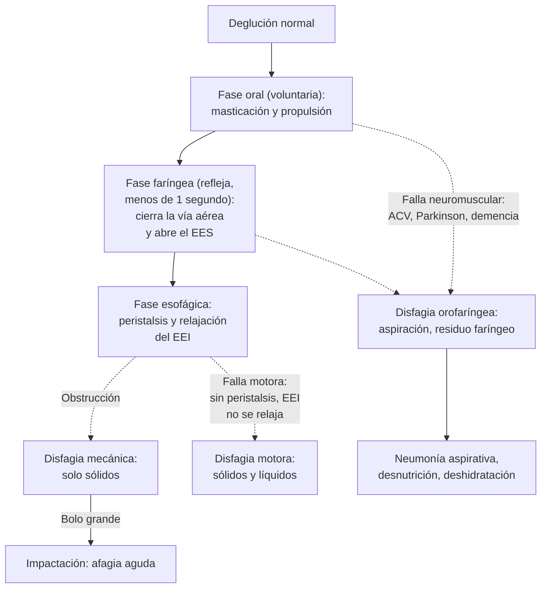
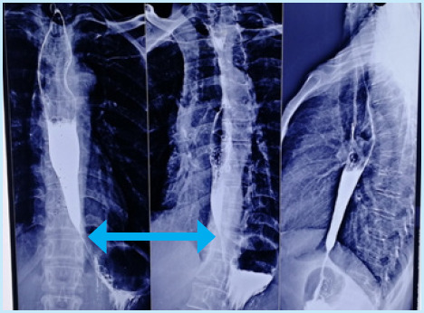

---
tags:
  - Gastroenterología
  - Urgencia
  - Frecuente en sala
---

# Disfagia y afagia aguda (impactación alimentaria y cuerpos extraños esofágicos)

**Subespecialidad**
Gastroenterología · Geriatría · Otorrinolaringología · Cirugía digestiva

**Guías principales**
ESGE 2016: extracción de cuerpos extraños del tubo digestivo alto en adultos · ASGE 2011: cuerpos extraños e impactación alimentaria · ACG 2025: esofagitis eosinofílica · ACG 2020: acalasia · Documento ESSD-EUGMS 2016: disfagia orofaríngea como síndrome geriátrico

**Otras fuentes**
Validación del EAT-10 y del test de volumen-viscosidad (Rofes 2014) · Revisión de la ingestión de cáusticos (Chirica 2017) · Datos chilenos: GLOBOCAN 2020 (cáncer de esófago) y motilidad digestiva en la enfermedad de Chagas (Madrid 2004)

**GES**
No (el cáncer de esófago no tiene garantía GES específica a septiembre de 2026; sí el ACV, principal causa de disfagia orofaríngea)

**EUNACOM**
1.06.1.013 Disfagia (sospecha, inicial, derivar) · 1.06.2.002 Afagia aguda (específico, inicial, derivar)

**Revisado**
Septiembre 2026

!!! abstract "Resumen en 60 segundos"
    - **Disfagia** = dificultad para que el alimento pase de la boca al estómago. Primero hay que decidir **dónde** está el problema (Figura 1):
        - **Orofaríngea**: cuesta **iniciar** la deglución; tos, atoro, regurgitación nasal, voz húmeda. Casi siempre es **neurológica** (ACV, Parkinson, demencia).
        - **Esofágica**: el alimento "**se queda pegado**" detrás del esternón.
    - En la esofágica, pregunta **qué** alimentos:
        - **Solo sólidos** = **mecánica**: anillo, estenosis, esofagitis eosinofílica, **cáncer**.
        - **Sólidos y líquidos desde el inicio** = **motora**: **acalasia**, esclerodermia.
    - **Signos de alarma** (disfagia **progresiva**, **baja de peso**, anemia, hemorragia, edad > 50 años): **endoscopía precoz** para descartar un **cáncer**.
    - **La endoscopía es el primer examen** en la disfagia esofágica, con **biopsias**. El esofagograma y la manometría se piden si es normal.
    - **Afagia aguda**:
        - Típicamente es la **impactación de un bolo de carne**: el paciente no puede tragar **ni su saliva** (sialorrea).
        - Requiere una **endoscopía emergente**, idealmente **≤ 2 h** y como máximo **6 h** (ESGE 2016). Lo mismo con **pilas** u objetos **punzantes** en el esófago.
        - **No** pedir un **esofagograma con bario**; **no** retrasar la endoscopía con fármacos.
    - Tras una impactación, **biopsiar el esófago**: la **esofagitis eosinofílica** es la causa más frecuente en los adultos jóvenes.
    - La disfagia orofaríngea afecta al **30–40 %** de los adultos mayores que viven en la comunidad y al **60 %** de los institucionalizados. Causa **neumonía aspirativa** y **desnutrición**: tamizar con el **EAT-10** y el **test de volumen-viscosidad**.

## Definición

| Término | Definición |
|---|---|
| **Disfagia** | Sensación de **dificultad o retraso** en el paso del alimento desde la boca al estómago |
| **Disfagia orofaríngea** (de transferencia) | Dificultad para **iniciar** la deglución y pasar el bolo de la boca al esófago |
| **Disfagia esofágica** | Sensación de que el alimento se **detiene** en el esófago, segundos después de tragar |
| **Odinofagia** | **Dolor** al tragar (esofagitis infecciosa, por fármacos o cáusticos) |
| **Afagia** | **Imposibilidad total** de tragar, incluida la saliva. La **afagia aguda** suele deberse a la **impactación** de un bolo alimentario o de un cuerpo extraño |
| **Globo faríngeo** | Sensación de "nudo en la garganta" **sin** dificultad real para tragar, que mejora al comer; es funcional |
| **Presbifagia** | Cambios de la deglución por el **envejecimiento**, que aumentan la vulnerabilidad a la disfagia |

## Epidemiología

### Mundial

- **Disfagia orofaríngea** (documento ESSD-EUGMS 2016):
    - **30–40 %** de los adultos mayores que viven en la **comunidad**.
    - **44 %** de los hospitalizados en unidades **geriátricas de agudos** y **60 %** de los **institucionalizados**.
    - **29–64 %** de los pacientes con **ACV** y **más del 80 %** de los pacientes con **demencia** avanzada.
    - Es un **síndrome geriátrico**: se asocia a **desnutrición**, deshidratación, **neumonía aspirativa**, reingresos y mortalidad.
- **Impactación alimentaria**:
    - Es la causa más frecuente de cuerpo extraño esofágico en el **adulto**.
    - Casi siempre hay una **enfermedad esofágica de base**: esofagitis eosinofílica, anillo de Schatzki, estenosis péptica, acalasia o cáncer.
    - En los **niños** predominan las **monedas** y las **pilas**.
- **Esofagitis eosinofílica**: su incidencia y prevalencia están **aumentando rápidamente** (ACG 2025). Predomina en **hombres jóvenes** con **atopia** (asma, rinitis, alergia alimentaria).
- **Acalasia**: es una enfermedad **rara**, que puede aparecer a cualquier edad.

### Chile

!!! chile "Datos nacionales"
    - **Cáncer de esófago** (GLOBOCAN 2020, citado por la Fundación Arturo López Pérez):
        - **~ 700 casos nuevos** y **más de 600 muertes** al año: es de **alta letalidad** porque se diagnostica tarde.
        - Factores de riesgo: tabaco, alcohol, **líquidos muy calientes**, reflujo y esófago de Barrett, obesidad, dieta pobre en frutas y verduras.
    - **Cáncer de esófago y GES**: **no** está entre los cánceres del adulto con garantía GES a septiembre de 2026. En **julio de 2026**, el Ministerio de Salud anunció la incorporación progresiva de **todos los cánceres** en el próximo decreto GES (2028–2031).
    - **Enfermedad de Chagas**: en Chile es una causa **rara** de acalasia, a diferencia de Brasil. El compromiso digestivo más frecuente es el **megacolon** (Madrid 2004).
    - **ACV** (GES): la disfagia es su complicación más frecuente y prevenible; todo paciente con un ACV debe tener un **tamizaje de deglución** antes de comer (ver [ACV](../neurologia/accidente-cerebrovascular.md)).
    - Chile envejece rápidamente y tiene ~ **200.000 personas con demencia** (Plan Nacional de Demencia 2025–2035), el grupo con más disfagia orofaríngea.

## Etiología

| Tipo | Causas |
|---|---|
| **Orofaríngea: neurológica** | **ACV**, **Parkinson**, **demencia**, ELA, **miastenia gravis**, esclerosis múltiple, síndrome de Guillain-Barré, miopatías (polimiositis, distrofias) |
| **Orofaríngea: estructural** | **Divertículo de Zenker** (halitosis, regurgitación de alimento no digerido), tumores de cabeza y cuello, **radioterapia** cervical, osteofitos cervicales, membranas, bocio |
| **Orofaríngea: otras** | **Sarcopenia** y fragilidad, **fármacos** (sedantes, antipsicóticos, anticolinérgicos que secan la boca), mala dentadura, xerostomía |
| **Esofágica mecánica** | **Anillo de Schatzki**, membranas (síndrome de Plummer-Vinson con anemia ferropriva), **estenosis péptica** (reflujo), **esofagitis eosinofílica**, **cáncer** (escamoso o adenocarcinoma), compresión extrínseca (aorta, mediastino, adenopatías), estenosis por cáusticos o radioterapia |
| **Esofágica motora** | **Acalasia** (idiopática; rara vez por Chagas o pseudoacalasia por un cáncer de la unión), **esclerodermia**, espasmo esofágico distal, esófago hipercontráctil |
| **Esofagitis (odinofagia)** | Infecciosa (**Candida**, herpes, CMV en inmunosuprimidos; ver [VIH](../infectologia/infeccion-por-vih.md)), **por fármacos** (doxiciclina, AINE, bifosfonatos, potasio, hierro), **cáusticos** |
| **Afagia aguda** | **Impactación de bolo alimentario** (carne), **cuerpo extraño** (hueso de pollo o espina de pescado, prótesis dental, pilas, monedas, imanes), **ingestión de cáusticos** (odinofagia intensa y sialorrea), **absceso periamigdalino o retrofaríngeo** (ver [flegmón cervical](../infectologia/flegmon-cervical-absceso-pulmonar-y-cerebral.md)), **ACV** (disfagia súbita), botulismo |

## Fisiopatología

*Figura 2. Fases de la deglución y mecanismos de la disfagia. EES: esfínter esofágico superior; EEI: esfínter esofágico inferior. Esquema propio.*

- La deglución tiene una fase **oral** voluntaria, una fase **faríngea** refleja que dura menos de un segundo (cierra la vía aérea y abre el esfínter esofágico superior) y una fase **esofágica** (peristalsis y relajación del esfínter inferior).
- **Disfagia orofaríngea**: el retraso del reflejo deglutorio y la debilidad de la propulsión dejan **residuo** en la faringe y permiten la **penetración** del alimento en la vía aérea y la **aspiración**. Puede ser **silente** (sin tos).
- **Disfagia mecánica**: cuando la luz del esófago baja de **~ 13 mm**, los **sólidos** (carne, pan) no pasan; los líquidos sí.
- **Acalasia**: pérdida de las **neuronas inhibitorias** del plexo mientérico. Resultado: el esfínter inferior **no se relaja** y el cuerpo **pierde la peristalsis**. El esófago se **dilata** y retiene alimento: "**pico de pájaro**" en el esofagograma (Figura 3).
- **Esofagitis eosinofílica**: inflamación **tipo 2** (alérgica) que produce **anillos**, surcos y **fibrosis**, con un esófago de **calibre reducido**. De ahí las **impactaciones** en los jóvenes.

## Clasificación

| Clasificación | Categorías |
|---|---|
| **Por la localización** | **Orofaríngea** vs **esofágica** |
| **Por el mecanismo** | **Mecánica** (solo sólidos) vs **motora** (sólidos y líquidos) |
| **Por el curso** | **Aguda** (afagia, impactación, ACV), **intermitente** (anillo, esofagitis eosinofílica, espasmo) o **progresiva** (estenosis péptica, **cáncer**, acalasia) |
| **Acalasia (Chicago 4.0, manometría)** | **Tipo I** (clásica, sin presurización) · **Tipo II** (presurización panesofágica; la de **mejor** respuesta al tratamiento) · **Tipo III** (espástica) |
| **Urgencia de la endoscopía en los cuerpos extraños** (ESGE 2016) | **Emergente** (idealmente ≤ 2 h, máximo 6 h): **obstrucción completa**, objeto **punzante** o **pila** en el esófago · **Urgente** (≤ 24 h): otros cuerpos extraños en el esófago; objetos punzantes, **imanes**, pilas y objetos grandes en el **estómago** · **No urgente** (≤ 72 h): objetos romos medianos en el estómago |

## Clínica

<figure markdown>
![Algoritmo de la disfagia. La disfagia orofaríngea o de transferencia se reconoce porque cuesta iniciar la deglución, con tos o atoro al tragar, regurgitación nasal, voz húmeda y neumonías. Sus causas son neurológicas (ACV, Parkinson, demencia, ELA, miastenia gravis, esclerosis múltiple), estructurales (divertículo de Zenker, tumores de cabeza y cuello, osteofitos, radioterapia), la sarcopenia, los fármacos sedantes y las prótesis dentales. Se estudia con el EAT-10, el test de volumen-viscosidad, fonoaudiología, videofluoroscopia o nasofibroscopia de la deglución. La disfagia esofágica se reconoce porque el alimento se queda pegado en el cuello o detrás del esternón. Si cuesta tragar solo sólidos, es mecánica: intermitente por anillo de Schatzki, membrana o esofagitis eosinofílica; progresiva con pirosis por estenosis péptica; progresiva con baja de peso en mayores de 50 años por cáncer de esófago o de la unión esofagogástrica. Si cuesta tragar sólidos y líquidos, es motora: acalasia (progresiva, con regurgitación y baja de peso), esclerodermia (con pirosis y Raynaud) o espasmo esofágico distal (intermitente con dolor torácico). El estudio empieza con endoscopía alta con biopsias; si es normal, esofagograma y manometría de alta resolución. Recuadros inferiores: signos de alarma que obligan a una endoscopía precoz, y afagia aguda, que requiere una endoscopía emergente en dos a seis horas](../assets/figuras/disfagia/algoritmo-disfagia.svg){ loading=lazy }
<figcaption>Figura 1. Enfrentamiento de la disfagia. Esquema propio basado en ESGE 2016, ACG 2020, ACG 2025 y el documento ESSD-EUGMS 2016.</figcaption>
</figure>

### Disfagia orofaríngea

- **Tos**, carraspera o **atoro** durante o justo después de tragar, **voz húmeda** o "gorgoteante".
- **Regurgitación nasal**, necesidad de tragar varias veces, **residuo** en la boca, babeo.
- Comidas prolongadas, rechazo de alimentos, **baja de peso**, **deshidratación**.
- **Neumonías** a repetición. La **aspiración silente** (sin tos) es frecuente tras un ACV y en la demencia.
- **Zenker**: adulto mayor con **halitosis**, regurgitación de comida no digerida horas después y ruido de gorgoteo en el cuello.

### Disfagia esofágica

- El paciente señala el **cuello** o el **esternón**. La localización referida **no siempre** coincide con el nivel real de la obstrucción.
- Pistas por patrón:

| Patrón | Sospecha |
|---|---|
| Joven, **atópico**, disfagia intermitente a sólidos, **impactaciones** previas, "come lento y toma mucha agua" | **Esofagitis eosinofílica** |
| Episodios aislados con carne ("síndrome del steakhouse"), sin progresión | **Anillo de Schatzki** |
| Años de **pirosis** con disfagia progresiva a sólidos | **Estenosis péptica** |
| **> 50 años**, disfagia **progresiva** en semanas a meses, **baja de peso**, anemia, tabaco y alcohol | **Cáncer de esófago** |
| Sólidos **y líquidos** desde el inicio, **regurgitación** de comida no digerida, tos nocturna, baja de peso | **Acalasia** |
| Pirosis intensa, **Raynaud**, esclerodactilia | **Esclerodermia** |
| Disfagia intermitente con **dolor torácico** | Espasmo esofágico distal (descartar primero un **SCA**) |
| **Odinofagia** en un inmunosuprimido o tras tomar pastillas acostado | Esofagitis **infecciosa** o **por fármacos** |

### Afagia aguda

- Inicio **brusco** mientras come (carne, pollo, pescado) o tras tragar un objeto.
- **No puede tragar ni su saliva**: **sialorrea**, escupe constantemente, arcadas, dolor retroesternal o cervical.
- **Estridor**, disnea o tos → pensar en la **vía aérea** (cuerpo extraño en la laringe o la tráquea, compresión traqueal por un objeto grande en el esófago; ver [cuerpo extraño en la vía aérea](../respiratorio/intoxicacion-por-co-ahogamiento-y-cuerpo-extrano.md)).
- **Signos de perforación**: **fiebre**, dolor torácico intenso, **enfisema subcutáneo**, taquicardia, hipotensión, dolor que irradia al dorso.

## Diagnóstico

!!! alarma "Afagia aguda o cuerpo extraño: qué evaluar de inmediato"
    1. **Vía aérea**: estridor, disnea, cianosis. Si hay obstrucción de la vía aérea: maniobras de desobstrucción y manejo avanzado.
    2. **Qué** tragó, **cuándo**, síntomas y **enfermedades previas** del esófago (impactaciones, disfagia).
    3. **Signos de perforación**: fiebre, enfisema subcutáneo, dolor intenso, sepsis.
    4. **Pila** de botón u objeto **punzante** (espina, hueso, prótesis con ganchos): **endoscopía emergente**, aunque haya pocos síntomas. La pila produce una **necrosis por corriente eléctrica** en **horas**.
    5. **Ingestión de cáusticos**: ver Tratamiento.

- **Disfagia orofaríngea**: el diagnóstico es **clínico** y funcional.
    - **Tamizaje**: **EAT-10** (cuestionario de 10 preguntas; puntaje **≥ 2–3** sugiere disfagia) y **test de volumen-viscosidad** (V-VST): se dan volúmenes crecientes (5, 10 y 20 mL) de néctar, líquido y pudín, y se observa si hay tos, cambios de voz o desaturación.
    - En el estudio de Rofes (2014), el **V-VST** tuvo una **sensibilidad de 94 %** y una **especificidad de 88 %** para la disfagia orofaríngea. El **EAT-10**, **89 %** y **82 %** con un punto de corte de 2.
    - **Evaluación por fonoaudiología**; **videofluoroscopia** o **nasofibroscopia de la deglución** (FEES) para confirmar la aspiración y definir la consistencia segura.
    - Buscar la **causa**: examen neurológico (ACV, Parkinson, miastenia) y revisión de los fármacos. **Nasofibroscopia** si se sospecha un tumor.
- **Disfagia esofágica**:
    - **Endoscopía digestiva alta**: es el **primer examen**. Permite ver la lesión, **biopsiar** y tratar (dilatar).
    - Tomar **biopsias esofágicas** aunque la mucosa se vea normal, para diagnosticar la **esofagitis eosinofílica** (**≥ 15 eosinófilos por campo** de gran aumento).
    - **Esofagograma con bario**: útil en la sospecha de **acalasia** ("pico de pájaro"), Zenker o estenosis complejas. En la acalasia, el **esofagograma cronometrado** mide el vaciamiento.
    - **Manometría esofágica de alta resolución**: es el **estándar** para la **acalasia** y los trastornos motores (clasificación de **Chicago 4.0**).
    - En la **sospecha de acalasia** en un adulto mayor con baja de peso rápida, descartar una **pseudoacalasia** (cáncer de la unión esofagogástrica) con endoscopía y TC.

<figure markdown>
{ loading=lazy width="468" }
<figcaption>Figura 3. Acalasia: esofagograma con bario que muestra el esófago dilatado con un estrechamiento distal liso en "pico de pájaro" (doble flecha). Tomado de Chapagain N, Adhikari N, Acharya BP, Limbu Y, Ghimire R. Achalasia cardia: a case series. <em>JNMA J Nepal Med Assoc.</em> 2024;62:474–477 (figura 1). Licencia <a href="https://creativecommons.org/licenses/by/4.0/">CC BY 4.0</a>; sin modificaciones.</figcaption>
</figure>

## Laboratorio

| Examen | Utilidad |
|---|---|
| **Hemograma**, **ferritina** | **Anemia** (cáncer, Plummer-Vinson), infección (perforación, absceso) |
| **Albúmina**, prealbúmina, electrolitos, creatinina | **Desnutrición** y **deshidratación** por disfagia crónica |
| **PCR**, leucocitos | Perforación, mediastinitis, absceso cervical |
| **CK**, anticuerpos antirreceptor de acetilcolina | Miopatías, **miastenia gravis** (disfagia fatigable, ptosis) |
| **TSH** | Bocio, hipotiroidismo |
| Serología de ***T. cruzi*** | Acalasia en un paciente de zona endémica |
| VIH, recuento de CD4 | Odinofagia por esofagitis infecciosa |
| **Biopsias** esofágicas | **Esofagitis eosinofílica**, **cáncer**, esofagitis infecciosa |

## Imágenes

- **Radiografía de tórax y cuello** (frontal y lateral) si se sospecha un **cuerpo extraño radiopaco** (moneda, pila, prótesis, hueso) o se desconoce el objeto.
    - La pila de botón muestra un **doble halo**.
    - La radiografía también muestra **aire libre** en el mediastino o el cuello (perforación).
    - **No** se necesita en la impactación de carne **sin complicaciones** (ESGE 2016).
- **TC de cuello y tórax** si se sospecha una **perforación** u otra complicación que pueda requerir cirugía, o un objeto **no radiopaco** peligroso (espina, hueso).
- **No** hacer un **esofagograma con bario** en la afagia aguda: hay riesgo de **aspiración** y dificulta la endoscopía (ESGE 2016).
- **Esofagograma con bario** en el estudio electivo de la disfagia (acalasia, Zenker).
- **TC de tórax y abdomen** para etapificar un cáncer de esófago.

## Diagnóstico diferencial

| Cuadro | Claves |
|---|---|
| **Globo faríngeo** | Sensación de nudo **sin** dificultad para tragar; **mejora al comer**; sin baja de peso |
| **Odinofagia** (no disfagia) | Dolor al tragar: faringoamigdalitis, esofagitis infecciosa o por fármacos |
| **Xerostomía** | Boca seca (fármacos, Sjögren, radioterapia): cuesta formar el bolo |
| **SCA** (vs espasmo esofágico) | Dolor torácico opresivo: **ECG y troponina** antes de atribuirlo al esófago |
| **Cuerpo extraño en la vía aérea** (vs en el esófago) | Tos, estridor, disnea, sibilancias localizadas |
| **Absceso retrofaríngeo o periamigdalino** | Fiebre, trismus, voz "de papa caliente", odinofagia intensa |
| **Botulismo, miastenia, Guillain-Barré** | Disfagia con **ptosis**, diplopía y debilidad; afagia neurológica |
| **Anorexia**, trastornos de la conducta alimentaria, fagofobia | Miedo a atorarse; estudio normal |

## Tratamiento

### Afagia aguda: impactación alimentaria y cuerpos extraños

!!! dosis "Manejo inicial y derivación (ESGE 2016)"
    1. **ABC**: asegurar la vía aérea. Posición semisentada y **aspiración de secreciones** (sialorrea).
    2. **Régimen cero**, vía venosa, hidratación.
    3. **Endoscopía digestiva alta**:
        - **Emergente** (idealmente **≤ 2 h**, máximo **6 h**) si hay **obstrucción completa** (no traga saliva) o hay una **pila** o un objeto **punzante** en el esófago.
        - **Urgente** (**≤ 24 h**) para otros cuerpos extraños en el esófago sin obstrucción completa.
        - En la impactación de un bolo, el endoscopista suele **empujarlo suavemente** hacia el estómago; si no pasa, lo **extrae**.
        - Protección de la vía aérea con **sobretubo** o intubación si hay riesgo de aspiración.
    4. **No** retrasar la endoscopía con tratamientos médicos:
        - El **glucagón** EV (relaja el esfínter inferior) tiene **poca evidencia**.
        - **No** usar ablandadores de carne (papaína): hay riesgo de **perforación**. Tampoco se recomiendan las bebidas gaseosas (aspiración).
    5. **No** inducir el vómito.
    6. **Sospecha de perforación**: **TC**, régimen cero, **antibióticos de amplio espectro** y evaluación **quirúrgica** urgente.
    7. **Después**: **biopsias esofágicas** en la misma endoscopía para buscar una **esofagitis eosinofílica** o la causa de base. Luego **IBP** y control con gastroenterología.

- **Objetos romos y pequeños** que ya pasaron al estómago en un paciente **asintomático** (excepto **pilas e imanes**): **observación** ambulatoria, porque la mayoría se elimina espontáneamente (ESGE 2016).
- **Paquetes de drogas** ("body packing"): **no** extraerlos por endoscopía (riesgo de rotura). Observación y **cirugía** si se rompen o no progresan.

### Ingestión de cáusticos

!!! alarma "Cáusticos (ácidos o álcalis): claves (Chirica 2017)"
    - **No** inducir el vómito, **no** neutralizar, **no** dar carbón activado ni poner una sonda nasogástrica a ciegas.
    - Asegurar la **vía aérea** (edema laríngeo), régimen cero, hidratación, IBP EV y analgesia.
    - **TC de tórax y abdomen** con contraste para buscar **necrosis transmural** o perforación: si la hay, **cirugía**.
    - **Endoscopía** en las **primeras 12–48 h** en los casos sin indicación quirúrgica, para graduar la lesión.
    - Llamar al **CITUC** (+56 2 2635 3800). En la intoxicación **intencional**, evaluación por salud mental.
    - **Secuelas**: **estenosis** esofágica en semanas a meses, que requiere dilataciones, y mayor riesgo de **cáncer** de esófago a largo plazo.

### Disfagia orofaríngea

- **Tratar la causa**: ACV (rehabilitación), Parkinson (optimizar la levodopa), miastenia (piridostigmina), **retirar fármacos** sedantes y anticolinérgicos.
- **Fonoaudiología**:
    - **Adaptar la consistencia**: líquidos **espesados** (néctar o pudín) según el test de volumen-viscosidad, y dieta de textura modificada.
    - **Posturas** (flexión del cuello al tragar) y maniobras deglutorias, ejercicios de fortalecimiento.
- **Higiene oral** (reduce la neumonía aspirativa), alimentación **sentado** a 90° y supervisada, bocados pequeños, sin distracciones.
- **Nutrición**: suplementos. **Sonda nasoenteral** transitoria si la vía oral es insegura (ACV agudo); **gastrostomía** si la disfagia será prolongada (> 4–6 semanas).
- En la **demencia avanzada**, la gastrostomía **no** mejora la sobrevida ni previene la aspiración: preferir la **alimentación de confort** asistida, de acuerdo con la familia.
- **Divertículo de Zenker**: miotomía endoscópica o quirúrgica.

### Disfagia esofágica: tratamiento según la causa (derivación a gastroenterología)

| Causa | Tratamiento |
|---|---|
| **Estenosis péptica** | **IBP** en dosis plena (p. ej., omeprazol 20–40 mg c/12–24 h) y **dilatación** endoscópica |
| **Anillo de Schatzki**, membranas | **Dilatación** endoscópica; IBP; comer lento y masticar bien. Membranas con anemia: **hierro** |
| **Esofagitis eosinofílica** (ACG 2025) | Inducción con **IBP en dosis alta**, **corticoides tópicos deglutidos** (budesonida o fluticasona) o **dieta de eliminación** empírica. **Dupilumab** en los casos refractarios. **Dilatación** si hay estenosis. Tratamiento de **mantención**, con control endoscópico e histológico |
| **Acalasia** (ACG 2020) | Tratamiento **definitivo** según el subtipo y el paciente: **dilatación neumática**, **miotomía de Heller laparoscópica** con fundoplicatura parcial o **miotomía endoscópica (POEM)**, esta última preferida en el **tipo III**. **Toxina botulínica** en los pacientes frágiles que no toleran otra opción (efecto transitorio). Controlar el riesgo de **cáncer** a largo plazo |
| **Cáncer de esófago** | **Derivación** a un equipo oncológico: etapificación (TC, PET-TC, ecoendoscopía); **cirugía** con **quimiorradioterapia** neoadyuvante en los casos resecables. En los avanzados, **paliación** de la disfagia con una **prótesis** (stent) esofágica o radioterapia, y nutrición |
| **Esofagitis por fármacos** | Suspender o cambiar el fármaco; tomar las pastillas **con abundante agua**, de pie, y no acostarse por 30 minutos |
| **Esofagitis por *Candida*** | **Fluconazol** 200–400 mg/día por 14–21 días (ver [VIH](../infectologia/infeccion-por-vih.md)) |

## Complicaciones

- **Disfagia orofaríngea**: **neumonía aspirativa** (ver [neumonía nosocomial y aspirativa](../infectologia/neumonia-nosocomial-inmunosuprimidos-y-cateter.md)), **desnutrición**, **deshidratación**, sarcopenia, aislamiento social, mortalidad.
- **Impactación y cuerpos extraños**:
    - **Perforación** esofágica con **mediastinitis**, fístula aortoesofágica (espinas, huesos) y absceso cervical.
    - **Pilas**: necrosis, perforación y fístula traqueoesofágica en horas.
    - Aspiración.
- **Acalasia**: aspiración y neumonías, desnutrición, **megaesófago**, **cáncer escamoso** de esófago a largo plazo.
- **Estenosis**: impactaciones recurrentes. **Cáncer**: obstrucción completa, fístula traqueoesofágica, hemorragia, caquexia.

## Pronóstico y seguimiento

- **Impactación alimentaria**: excelente tras la endoscopía, pero **recurre** si no se trata la causa de base (esofagitis eosinofílica, anillo, estenosis). **Control con gastroenterología** y resultado de las **biopsias**.
- **Acalasia**: los tratamientos alivian la disfagia en la mayoría, pero es una enfermedad **crónica** que puede requerir nuevos tratamientos.
- **Esofagitis eosinofílica**: enfermedad **crónica**; sin tratamiento de mantención progresa a **fibrosis** y estenosis.
- **Cáncer de esófago**: pronóstico **malo** por el diagnóstico tardío. De ahí la importancia de estudiar **precozmente** la disfagia **progresiva**.
- **Disfagia orofaríngea**: seguimiento por **fonoaudiología** y nutrición; reevaluar la consistencia de la dieta; prevenir las neumonías.

## Perlas para el internado

!!! perla "Para la sala y el turno"
    - Paciente que **no traga ni su saliva** después de comer carne: **endoscopía emergente**, no esofagograma. No lo mandes a la casa "a ver si pasa".
    - **Pila** en el esófago: es una emergencia aunque el paciente esté tranquilo.
    - Adulto joven con una **segunda impactación**: piensa en **esofagitis eosinofílica** y asegúrate de que lo **biopsien**.
    - **Disfagia progresiva + baja de peso** en un mayor de 50 años: **cáncer** hasta que la endoscopía demuestre lo contrario.
    - **Sólidos y líquidos** desde el inicio, con regurgitación: **acalasia**. Pide una endoscopía primero (pseudoacalasia) y luego una manometría.
    - En todo adulto mayor hospitalizado que **tose al comer** o tiene **neumonías** a repetición, pide una **evaluación de la deglución** antes de dar la dieta.
    - Tras un **ACV**, **régimen cero** hasta el tamizaje de deglución.
    - Revisa las pastillas: la **doxiciclina**, los **bifosfonatos**, el **potasio** y los AINE tomados sin agua causan **esofagitis**.

## Preguntas de repaso

??? repaso "1. Hombre de 34 años con rinitis alérgica y asma, que consulta a las 23 h porque mientras comía un asado sintió que la carne "se quedó pegada" detrás del esternón. Desde entonces no puede tragar ni su saliva y escupe continuamente. Ha tenido episodios similares más breves. Está estable, sin estridor ni fiebre. ¿Diagnóstico y manejo?"
    **Afagia aguda por impactación de un bolo alimentario**, probablemente sobre una **esofagitis eosinofílica** (joven, atópico, impactaciones previas).

    - **Endoscopía digestiva alta emergente** (idealmente ≤ 2 h, máximo 6 h), porque hay **obstrucción completa**: empujar el bolo o extraerlo.
    - **Sin esofagograma con bario**. **Sin** retrasar la endoscopía con glucagón u otros fármacos.
    - Régimen cero, aspiración de secreciones, posición semisentada.
    - **Biopsias esofágicas** en la misma endoscopía (≥ 15 eosinófilos por campo confirma la esofagitis eosinofílica).
    - Luego IBP en dosis alta o corticoides tópicos deglutidos y control con gastroenterología.

??? repaso "2. Hombre de 67 años, fumador y bebedor, con disfagia a sólidos de 3 meses, progresiva, que ahora también le cuesta con las carnes blandas. Bajó 8 kg. Hb 10,5 g/dL. ¿Qué sospechas y qué haces?"
    **Cáncer de esófago** (disfagia mecánica **progresiva**, **baja de peso**, anemia, tabaco y alcohol).

    - **Endoscopía digestiva alta precoz con biopsias**: es el primer examen.
    - Si se confirma: **TC** de tórax y abdomen (y PET-TC o ecoendoscopía) para etapificar, y **derivación** al comité oncológico.
    - **Evaluación nutricional**: suplementos o una vía de alimentación si no logra cubrir sus requerimientos.
    - Derivación a un equipo especializado; en los casos avanzados, **prótesis esofágica** para paliar la disfagia.

??? repaso "3. Mujer de 42 años con disfagia a sólidos y líquidos de 2 años, que regurgita comida no digerida al acostarse, con tos nocturna y una baja de peso de 6 kg. ¿Diagnóstico probable y estudio?"
    **Acalasia** (disfagia **motora**: sólidos y líquidos desde el inicio, con regurgitación y baja de peso).

    - **Endoscopía** primero: retención de saliva y alimento, unión esofagogástrica "apretada", y descartar una **pseudoacalasia** (cáncer de la unión).
    - **Esofagograma con bario**: esófago dilatado con "**pico de pájaro**".
    - **Manometría de alta resolución**: confirma y clasifica en tipo I, II o III (Chicago 4.0).
    - Derivar para un tratamiento definitivo: **dilatación neumática**, **miotomía de Heller** o **POEM**.

??? repaso "4. Mujer de 80 años con demencia moderada, que vive en un ELEAM. Tose cada vez que toma líquidos, come muy lento y ha tenido 2 neumonías en 6 meses. ¿Qué sospechas y qué haces?"
    **Disfagia orofaríngea** con **aspiración** (causa probable de las **neumonías aspirativas**). Afecta al ~ 60 % de los adultos mayores institucionalizados y a más del 80 % de los pacientes con demencia avanzada.

    - **Tamizaje**: EAT-10 y **test de volumen-viscosidad** (sensibilidad 94 %).
    - **Fonoaudiología**; videofluoroscopia si está disponible.
    - **Espesar los líquidos** según el resultado, dieta de textura modificada, alimentación sentada y **supervisada**, bocados pequeños.
    - **Higiene oral** rigurosa. **Revisar los fármacos** sedantes y anticolinérgicos.
    - Evaluar la nutrición y la hidratación.
    - En la demencia **avanzada**, la gastrostomía no mejora la sobrevida: conversar con la familia la **alimentación de confort**.

??? repaso "5. Mujer de 72 años que se tragó accidentalmente su prótesis dental parcial con ganchos metálicos hace 2 horas. Tiene dolor cervical y odinofagia, pero traga saliva. La radiografía muestra el objeto en el esófago cervical. ¿Qué haces?"
    **Cuerpo extraño punzante en el esófago** (los ganchos de la prótesis son punzantes y cortantes).

    - **Endoscopía emergente** (idealmente ≤ 2 h, máximo 6 h), aunque no haya obstrucción completa: los objetos **punzantes** en el esófago tienen alto riesgo de **perforación** (ESGE 2016).
    - Extracción con un **dispositivo protector** (sobretubo o capuchón) y evaluar la **intubación** para proteger la vía aérea.
    - Si hay fiebre, enfisema subcutáneo o dolor intenso: **TC** por sospecha de perforación y evaluación quirúrgica.
    - No hacer esofagograma con bario.

??? repaso "6. Hombre de 25 años que ingirió soda cáustica con fines suicidas hace 1 hora. Tiene sialorrea, odinofagia y dolor retroesternal. Está consciente, sin estridor. ¿Cuál es el manejo inicial?"
    **Ingestión de cáusticos (álcali)** con fines suicidas.

    - **Vía aérea**: vigilar el edema laríngeo (estridor, disfonía); intubación precoz si aparece.
    - **No** inducir el vómito, **no** neutralizar, **no** dar carbón activado ni poner una sonda nasogástrica a ciegas.
    - Régimen cero, hidratación EV, **IBP EV** y analgesia.
    - **TC de tórax y abdomen con contraste** para buscar necrosis transmural o perforación; si la hay, **cirugía**.
    - **Endoscopía en 12–48 h** si no tiene indicación quirúrgica, para graduar la lesión.
    - Llamar al **CITUC**. **Evaluación psiquiátrica** y medidas de seguridad por el intento suicida.
    - Seguimiento por el riesgo de **estenosis** (semanas a meses) y de cáncer a largo plazo.

## Referencias

1. Birk M, Bauerfeind P, Deprez PH, et al. Removal of foreign bodies in the upper gastrointestinal tract in adults: European Society of Gastrointestinal Endoscopy (ESGE) Clinical Guideline. *Endoscopy.* 2016;48:489–496. doi:[10.1055/s-0042-100456](https://doi.org/10.1055/s-0042-100456)
2. ASGE Standards of Practice Committee, Ikenberry SO, Jue TL, et al. Management of ingested foreign bodies and food impactions. *Gastrointest Endosc.* 2011;73:1085–1091. doi:[10.1016/j.gie.2010.11.010](https://doi.org/10.1016/j.gie.2010.11.010)
3. Dellon ES, Muir AB, Katzka DA, et al. ACG Clinical Guideline: diagnosis and management of eosinophilic esophagitis. *Am J Gastroenterol.* 2025;120:31–59. doi:[10.14309/ajg.0000000000003194](https://doi.org/10.14309/ajg.0000000000003194)
4. Vaezi MF, Pandolfino JE, Yadlapati RH, et al. ACG Clinical Guidelines: diagnosis and management of achalasia. *Am J Gastroenterol.* 2020;115:1393–1411. doi:[10.14309/ajg.0000000000000731](https://doi.org/10.14309/ajg.0000000000000731)
5. Baijens LW, Clavé P, Cras P, et al. European Society for Swallowing Disorders – European Union Geriatric Medicine Society white paper: oropharyngeal dysphagia as a geriatric syndrome. *Clin Interv Aging.* 2016;11:1403–1428. doi:[10.2147/CIA.S107750](https://doi.org/10.2147/CIA.S107750)
6. Rofes L, Arreola V, Mukherjee R, Clavé P. Sensitivity and specificity of the Eating Assessment Tool and the Volume-Viscosity Swallow Test for clinical evaluation of oropharyngeal dysphagia. *Neurogastroenterol Motil.* 2014;26:1256–1265. doi:[10.1111/nmo.12382](https://doi.org/10.1111/nmo.12382)
7. Chirica M, Bonavina L, Kelly MD, Sarfati E, Cattan P. Caustic ingestion. *Lancet.* 2017;389:2041–2052. doi:[10.1016/S0140-6736(16)30313-0](https://doi.org/10.1016/S0140-6736(16)30313-0)
8. Madrid AM, Quera R, Defilippi C, et al. [Gastrointestinal motility disturbances in Chagas disease] (artículo en español). *Rev Med Chil.* 2004;132:939–946. doi:[10.4067/s0034-98872004000800005](https://doi.org/10.4067/s0034-98872004000800005)
9. Fundación Arturo López Pérez. Cáncer de esófago (con datos de GLOBOCAN 2020). [falp.org](https://www.falp.org/diagnostico-y-tratamiento/cancer-de-esofago/)
10. Chapagain N, Adhikari N, Acharya BP, Limbu Y, Ghimire R. Achalasia cardia: a case series. *JNMA J Nepal Med Assoc.* 2024;62:474–477. doi:[10.31729/jnma.8649](https://doi.org/10.31729/jnma.8649)
11. El Dínamo. Gobierno incluirá todos los cánceres al GES y prepara ampliación de tratamientos (29 de julio de 2026). [eldinamo.cl](https://www.eldinamo.cl/pais/2026/07/29/gobierno-incluira-todos-los-canceres-al-ges-y-prepara-ampliacion-de-tratamientos-conoce-que-patologias-tienen-garantia-actualmente/)
