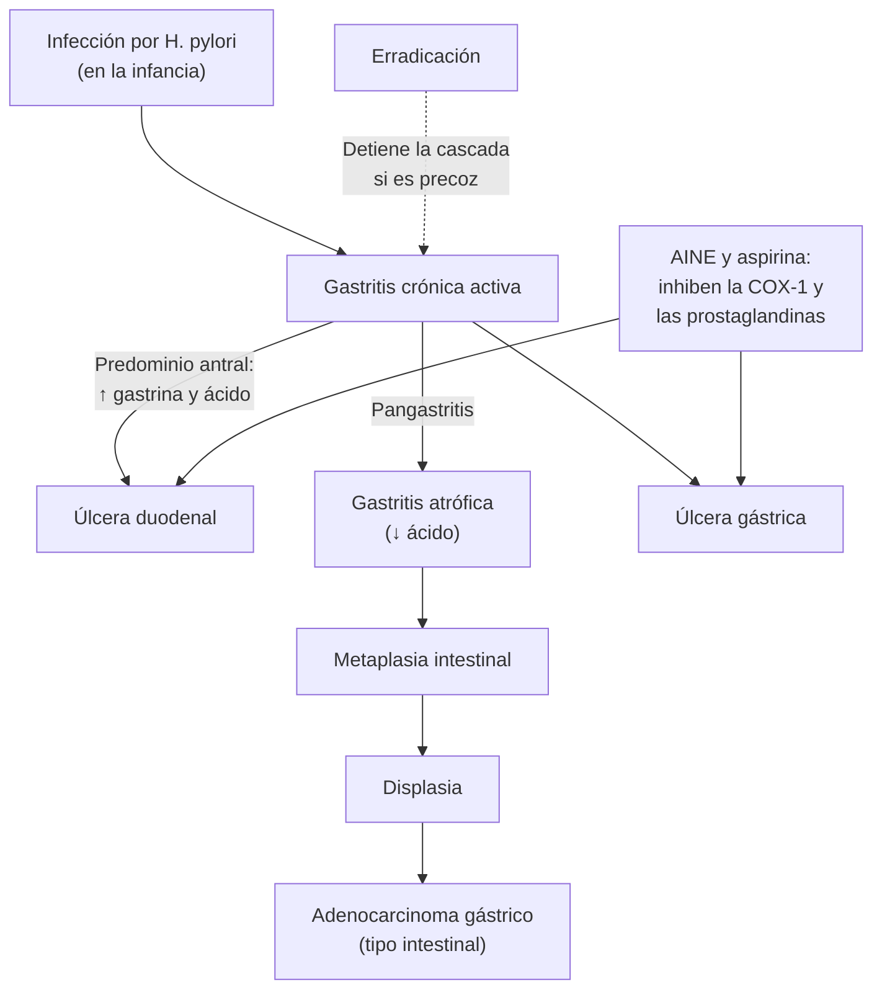

---
tags:
  - Gastroenterología
  - GES
  - Frecuente en sala
---

# Dispepsia, úlcera péptica, *Helicobacter pylori* y cáncer gástrico

**Subespecialidad**
Gastroenterología · Medicina interna · Oncología digestiva

**Guías principales**
ACG/CAG 2017: dispepsia · ACG 2024: tratamiento de *H. pylori* · Consenso Maastricht VI/Florencia 2022 · Guía clínica GES de cáncer gástrico (MINSAL)

**Otras fuentes**
Ensayo chileno de terapia cuádruple con bismuto vs triple (Medel-Jara 2025) · Seroprevalencia de *H. pylori* en Chile (Ferreccio 2007) · Revisión Cochrane de erradicación y cáncer gástrico (Ford 2020) · Ensayo en familiares de primer grado (Choi 2020) · Mortalidad por cáncer gástrico en Chile 2018–2022 (Pierotic 2026)

**GES**
**Cáncer gástrico (GES 27)**: desde la sospecha en personas de 40 años y más

**EUNACOM**
1.06.1.014 Dispepsia (específico, completo, completo) · 1.06.1.030 Úlcera péptica (específico, completo, completo) · 1.06.1.004 Cáncer gástrico (sospecha, inicial, derivar)

**Revisado**
Septiembre 2026

!!! abstract "Resumen en 60 segundos"
    - **Dispepsia**: dolor o ardor **epigástrico**, **plenitud posprandial** o **saciedad precoz**. Es muy frecuente. La mayoría es **funcional**, pero en Chile el **cáncer gástrico** es muy frecuente y letal.
    - **Chile**:
        - El **73 %** de los adultos tiene ***H. pylori*** (Ferreccio 2007).
        - El cáncer gástrico causa **~ 3.100 muertes al año**, dos tercios en hombres (Pierotic 2026).
        - Por eso la guía GES indica una **endoscopía** a toda persona de **≥ 40 años** con **epigastralgia de más de 15 días**, o con **signos de alarma** a cualquier edad.
    - Menores de 40 años **sin alarma**: **"test and treat"** de *H. pylori* (test de aire espirado o antígeno en deposiciones); si es negativo, **IBP** por 4–8 semanas.
    - **Úlcera péptica**:
        - Sus causas son ***H. pylori*** y **AINE/aspirina**.
        - Tratamiento: **IBP** 4–8 semanas, **erradicar** y **suspender los AINE**.
        - La **úlcera gástrica** se **biopsia** y se controla por endoscopía (puede ser un cáncer).
    - **Erradicación de *H. pylori***:
        - **Cuádruple con bismuto por 14 días** (ACG 2024).
        - En Chile, la triple con claritromicina erradicó solo el **81 %**, vs el **95 %** de una cuádruple optimizada con bismuto (Medel-Jara 2025).
        - **Confirmar la erradicación** ≥ 4 semanas después, sin IBP por 2 semanas.
    - **Erradicar *H. pylori* reduce el cáncer gástrico** (RR **0,54**; Cochrane 2020), también en los **familiares de primer grado** de pacientes con cáncer gástrico (Choi 2020).
    - **Cáncer gástrico**: epigastralgia, **baja de peso**, **anemia**, saciedad precoz, vómitos, disfagia. **Endoscopía con biopsias** y derivación (GES: especialista en **≤ 30 días**).

## Definición

| Término | Definición |
|---|---|
| **Dispepsia** | Dolor o ardor **epigástrico**, **plenitud posprandial** molesta o **saciedad precoz** |
| **Dispepsia no investigada** | Dispepsia sin endoscopía previa |
| **Dispepsia funcional** (Roma IV) | Uno o más de esos síntomas, **sin enfermedad estructural** en la endoscopía, durante los últimos **3 meses** y con inicio ≥ **6 meses** antes. Subtipos: **síndrome de distrés posprandial** (plenitud, saciedad precoz) y **síndrome de dolor epigástrico** |
| **Úlcera péptica** | Pérdida de sustancia de la mucosa del **estómago o el duodeno** que alcanza la **submucosa** (≥ 5 mm); la **erosión** es más superficial |
| **Gastritis crónica atrófica** y **metaplasia intestinal** | Lesiones **precancerosas** causadas sobre todo por *H. pylori* (cascada de Correa) |
| **Cáncer gástrico precoz** | Limitado a la **mucosa o submucosa**, con o sin ganglios; curable con resección endoscópica o cirugía |

## Epidemiología

### Mundial

- La dispepsia es uno de los motivos de consulta más frecuentes en APS. La mayoría de las endoscopías muestra una **dispepsia funcional**.
- ***H. pylori*** infecta a cerca de la **mitad** de la población mundial, con mayor prevalencia en los países de ingresos medios y bajos. Se adquiere en la **infancia**.
- **Úlcera péptica**: su incidencia ha bajado con la erradicación de *H. pylori* y los IBP, pero aumentaron las úlceras por **AINE y aspirina** en los adultos mayores.
- **Erradicar *H. pylori***:
    - Reduce la incidencia de **cáncer gástrico** (RR **0,54**) y su **mortalidad** (RR **0,61**) (Cochrane, Ford 2020; 7 ensayos, 8.323 participantes).
    - En los **familiares de primer grado** de pacientes con cáncer gástrico, el cáncer se desarrolló en **1,2 % vs 2,7 %** con placebo en 9 años (HR **0,45**; Choi 2020).

### Chile

!!! chile "Datos nacionales"
    - ***H. pylori***: seroprevalencia de **73 %** en una muestra nacional de 2.615 adultos (Ferreccio 2007).
        - Más alta en los hombres y entre los 45 y 64 años.
        - Llega a **~ 80 %** en las comunas con mayor mortalidad por cáncer gástrico.
    - **Cáncer gástrico**:
        - **15.579 muertes entre 2018 y 2022** (~ 3.100 al año); **66,8 % en hombres**; aumenta con la edad (Pierotic 2026).
        - Mayor mortalidad en las regiones de **O'Higgins, Valparaíso y Los Ríos**.
        - Es una de las **principales causas de muerte por cáncer** en Chile, sobre todo en los hombres. Chile está entre los países con **mayor incidencia** del mundo (Ferreccio 2007).
    - **GES 27 (cáncer gástrico)**:
        - Cobertura desde la **sospecha** en personas de **≥ 40 años** (desde la confirmación en las menores).
        - Evaluación por especialista en **≤ 30 días** desde la sospecha; etapificación en ≤ 30 días; cirugía en ≤ 30 días desde la confirmación.
    - **Guía clínica GES**: endoscopía a toda persona de **≥ 40 años** con **epigastralgia de más de 15 días** que no responde a las medidas habituales, con o sin hemorragia, anemia, baja de peso, plenitud posprandial o disfagia.
    - **Resistencia antibiótica**: en un ensayo chileno, la triple con claritromicina erradicó solo el **81 %**, bajo el umbral aceptable de 90 % (Medel-Jara 2025).

## Etiología

| Cuadro | Causas |
|---|---|
| **Dispepsia orgánica** | **Úlcera péptica**, **cáncer gástrico** o esofágico, **fármacos** (AINE, aspirina, bifosfonatos, hierro, potasio, metformina, antibióticos), ERGE, **cólico biliar**, pancreatitis crónica o cáncer de páncreas, enfermedad celíaca, isquemia mesentérica, **SCA** (equivalente anginoso) |
| **Dispepsia funcional** | La más frecuente: alteración de la motilidad y de la sensibilidad visceral, infección previa, factores psicológicos |
| **Úlcera péptica** | ***H. pylori*** (sobre todo la duodenal), **AINE y aspirina** (sobre todo la gástrica), **tabaco**; raras: **Zollinger-Ellison** (gastrinoma), Crohn, CMV, cáncer, úlceras de estrés (UCI) |
| **Cáncer gástrico** | ***H. pylori*** (carcinógeno de tipo I para la OMS), **gastritis atrófica y metaplasia intestinal**, **familiar de primer grado** con cáncer gástrico, **tabaco**, dieta rica en **sal** y ahumados, poca fruta y verdura, gastrectomía parcial previa, anemia perniciosa; hereditario: mutación de **CDH1** (cáncer difuso) |

**Factores de riesgo de sangrado por AINE**: edad **> 65 años**, **úlcera previa** (sobre todo si sangró), dosis altas o **dos AINE**, uso con **anticoagulantes**, **antiagregantes**, **corticoides** o **ISRS**, e infección por *H. pylori*.

## Fisiopatología

*Figura 1. Consecuencias de la infección por* H. pylori *(cascada de Correa) y de los AINE. Esquema propio.*

- ***H. pylori*** es un bacilo gramnegativo que vive bajo el moco gástrico. Su **ureasa** produce amonio que neutraliza el ácido (base de los tests de ureasa y del test de aire espirado).
- Según el patrón de gastritis:
    - **Predominio antral**: más **gastrina** y más ácido → **úlcera duodenal**.
    - **Pangastritis**: **atrofia**, menos ácido → **úlcera gástrica** y **cáncer**.
- **Cascada de Correa**: gastritis crónica → **atrofia** → **metaplasia intestinal** → **displasia** → adenocarcinoma de tipo **intestinal**. Erradicar en las etapas precoces reduce el riesgo; en la atrofia y la metaplasia avanzadas, el riesgo persiste (vigilancia).
- **AINE**: inhiben la **COX-1** y las **prostaglandinas** que protegen la mucosa (moco, bicarbonato, flujo sanguíneo). El daño es **sistémico**: el recubrimiento entérico no lo evita.
- **Dispepsia funcional**: **hipersensibilidad visceral**, falla de la acomodación gástrica, vaciamiento lento, inflamación duodenal leve y eje cerebro-intestino.

## Clasificación

| Clasificación | Categorías |
|---|---|
| **Dispepsia** | No investigada · orgánica · **funcional** (distrés posprandial o dolor epigástrico) |
| **Úlcera péptica** | Por la localización (**gástrica**, **duodenal**) · por la causa (*H. pylori*, AINE, ambos, idiopática) · complicada (**hemorragia**, **perforación**, **obstrucción**, penetración) o no |
| **Hemorragia por úlcera** | **Forrest** (ver [hemorragia digestiva alta](hemorragia-digestiva-alta.md)) |
| **Gastritis atrófica y metaplasia** | **OLGA** y **OLGIM** (etapas 0–IV) según las biopsias del antro y el cuerpo (protocolo de **Sydney**): las etapas **III–IV** tienen el mayor riesgo de cáncer |
| **Cáncer gástrico** | **Lauren**: **intestinal** (asociado a *H. pylori*, adultos mayores) y **difuso** (células en anillo de sello, más jóvenes, peor pronóstico) · **Precoz** vs **avanzado** (Borrmann I–IV) · Etapificación **TNM** |

## Clínica

### Dispepsia

- Dolor o ardor **epigástrico**, plenitud posprandial, saciedad precoz, distensión, náuseas, eructos.
- **Pirosis y regurgitación** predominantes orientan a **reflujo** (ERGE), no a dispepsia.
- **Dolor en el hipocondrio derecho** tras las comidas grasas, que dura horas: **cólico biliar**.
- En los **diabéticos**, las **mujeres** y los **adultos mayores**, el "dolor epigástrico" puede ser un **SCA**.

### Úlcera péptica

- **Duodenal**: dolor epigástrico **urente** que aparece **2–3 horas después de comer** o en la **noche**, y **mejora con la comida** o los antiácidos.
- **Gástrica**: dolor que **empeora con la comida**, náuseas, baja de peso.
- Muchas son **asintomáticas** (sobre todo con AINE en adultos mayores) y debutan con una **complicación**:
    - **Hemorragia**: hematemesis, melena (ver [HDA](hemorragia-digestiva-alta.md)).
    - **Perforación**: dolor súbito, intenso y difuso, abdomen **en tabla**, neumoperitoneo (ver [abdomen agudo](abdomen-agudo.md)).
    - **Obstrucción pilórica**: vómitos de alimentos de horas o días, **bazuqueo**, alcalosis metabólica hipoclorémica e hipokalémica.
- **Zollinger-Ellison**: úlceras **múltiples** o en lugares atípicos (duodeno distal, yeyuno), **refractarias**, con **diarrea**.

### Cáncer gástrico

- **Precoz**: **asintomático** o con dispepsia inespecífica: de ahí la regla de los **40 años y 15 días**.
- **Avanzado**:
    - **Epigastralgia** persistente, **baja de peso**, **anemia ferropriva**, **saciedad precoz**, vómitos (obstrucción antral), **disfagia** (cáncer del cardias), hemorragia digestiva.
    - **Masa epigástrica**, **ascitis** (carcinomatosis).
- **Signos de diseminación**:
    - **Ganglio de Virchow** (supraclavicular izquierdo) y **nódulo de la hermana María José** (umbilical).
    - **Tumor de Krukenberg** (ovario) y **tabla de Blumer** (fondo de saco al tacto rectal).
- **Paraneoplásicos**: acantosis nigricans, signo de Leser-Trélat, **tromboflebitis migratoria** (Trousseau).

## Diagnóstico

<figure markdown>
![Algoritmo de la dispepsia en Chile. Se parte de la dispepsia (dolor o ardor epigástrico, plenitud posprandial o saciedad precoz), revisando los AINE y la aspirina, y pensando en reflujo si predomina la pirosis. Pregunta central: ¿40 años o más con epigastralgia de más de 15 días, según la guía GES, o algún signo de alarma (baja de peso, anemia, hemorragia digestiva, disfagia, vómitos persistentes, masa, cáncer gástrico en la familia)? Si la respuesta es sí: endoscopía digestiva alta con biopsias para H. pylori y de mucosa para atrofia y metaplasia, y evaluación por especialista en 30 días o menos si se sospecha un cáncer (GES 27). Según el hallazgo: úlcera (IBP 4 a 8 semanas, erradicar H. pylori, suspender AINE, biopsiar y controlar la úlcera gástrica), cáncer (etapificar y derivar), atrofia o metaplasia extensa (vigilancia endoscópica) o normal (dispepsia funcional). Si la respuesta es no (menor de 40 años sin alarma): test and treat de H. pylori con test de aire espirado o antígeno en deposiciones, sin IBP por 2 semanas ni antibióticos por 4 semanas. Si es positivo: erradicar con cuádruple con bismuto por 14 días y confirmar la erradicación 4 semanas o más después. Si es negativo: IBP por 4 a 8 semanas y, si persiste, endoscopía y manejo de la dispepsia funcional. Si los síntomas persisten tras erradicar: IBP, luego endoscopía si no se hizo, y neuromoduladores como amitriptilina en dosis bajas. Un recuadro recuerda que en Chile la triple con claritromicina erradicó el 81 % frente al 95 % de la cuádruple optimizada con bismuto](../assets/figuras/dispepsia/algoritmo-dispepsia-chile.svg){ loading=lazy }
<figcaption>Figura 2. Enfrentamiento de la dispepsia en Chile. Esquema propio basado en la guía clínica GES de cáncer gástrico (MINSAL), ACG/CAG 2017 y ACG 2024.</figcaption>
</figure>

!!! alarma "Signos de alarma en la dispepsia: endoscopía precoz"
    - **Baja de peso** no intencionada, **anemia** o ferropenia, **hemorragia digestiva** (melena, hematemesis).
    - **Disfagia** u odinofagia, **vómitos persistentes**, **masa** abdominal, adenopatía supraclavicular.
    - Inicio a los **≥ 40 años** (en Chile) y **antecedente familiar** de cáncer gástrico.

**Pruebas para *H. pylori***:

| Prueba | Uso |
|---|---|
| **Test de aire espirado con urea marcada** | No invasivo, de **elección** para el diagnóstico y para **confirmar la erradicación** |
| **Antígeno en deposiciones** (monoclonal) | No invasivo; diagnóstico y control de la erradicación |
| **Test de ureasa rápido** en biopsias | Durante la endoscopía |
| **Histología** (protocolo de Sydney: 2 del antro, 1 de la incisura, 2 del cuerpo) | *H. pylori*, **atrofia** y **metaplasia** (OLGA y OLGIM) |
| **Cultivo o PCR** de biopsias | **Susceptibilidad** antibiótica (claritromicina, levofloxacino) |
| **Serología** | Solo epidemiológica; **no** sirve para confirmar la erradicación (queda positiva por meses o años) |

- **Suspender los IBP 2 semanas** y los **antibióticos y el bismuto 4 semanas** antes de las pruebas (dan **falsos negativos**).
- **A quién buscarle *H. pylori***: dispepsia, **úlcera péptica** actual o previa, **linfoma MALT**, **familiares de primer grado** de pacientes con cáncer gástrico, antes de usar **aspirina o AINE** a largo plazo, anemia ferropénica sin causa, púrpura trombocitopénica inmune.

**Cáncer gástrico**: **endoscopía con biopsias múltiples** de toda lesión sospechosa (y de toda úlcera gástrica). Luego etapificación con **TC** de tórax, abdomen y pelvis; **endosonografía**, PET-TC y **laparoscopía** de etapificación según el caso.

## Laboratorio

| Examen | Utilidad |
|---|---|
| **Hemograma** y **ferritina** | **Anemia ferropénica** (sangrado crónico: úlcera o cáncer) |
| Pruebas hepáticas, **lipasa** | Causa biliar o pancreática del dolor |
| **Electrolitos** | Alcalosis hipoclorémica e hipokalémica en la obstrucción pilórica |
| **ECG** y **troponina** | Dolor epigástrico con factores de riesgo coronario |
| **Gastrinemia** (sin IBP) | Sospecha de **Zollinger-Ellison** |
| Anticuerpos antitransglutaminasa | Enfermedad celíaca en la dispepsia con diarrea o ferropenia |
| **CEA**, CA 19-9 | **No** sirven para el diagnóstico del cáncer gástrico; solo para el seguimiento |

## Imágenes

- **Endoscopía digestiva alta**: el examen **central** (diagnóstico, biopsias, tratamiento de la hemorragia).
- **Ecografía abdominal** si el dolor sugiere un origen **biliar**.
- **Radiografía de tórax de pie** o **TC** si se sospecha una **perforación** (neumoperitoneo).
- **TC de tórax, abdomen y pelvis** para etapificar el cáncer gástrico.

## Diagnóstico diferencial

| Cuadro | Claves |
|---|---|
| **ERGE** | **Pirosis** y **regurgitación** predominantes |
| **Cólico biliar** | Dolor en el hipocondrio derecho o el epigastrio tras comidas grasas, de horas; ecografía |
| **Pancreatitis** o cáncer de páncreas | Dolor irradiado al dorso, lipasa; baja de peso e ictericia |
| **SCA** | Factores de riesgo, disnea, sudoración; **ECG y troponina** |
| **Gastroparesia** | Diabetes, vómitos de alimento no digerido, saciedad precoz |
| **Fármacos** | AINE, bifosfonatos, hierro, metformina, antibióticos |
| **Síndrome de intestino irritable** | Dolor que se asocia a cambios en las deposiciones |

## Tratamiento

### Dispepsia funcional

- **Explicar** la naturaleza benigna y la relación con el estrés, y hacer **cambios de estilo de vida** (comidas pequeñas, evitar las grasas y el alcohol, dejar de fumar).
- **Erradicar *H. pylori*** si está presente: mejora los síntomas en una minoría y previene la úlcera y el cáncer.
- **IBP** por 4–8 semanas (**omeprazol 20 mg/día**), sobre todo en el síndrome de dolor epigástrico.
- Si no responde:
    - **Neuromoduladores**: **amitriptilina** en dosis bajas (10–25 mg en la noche).
    - **Procinéticos** por períodos cortos en el distrés posprandial (evitar la metoclopramida prolongada; ver [trastornos del movimiento por fármacos](../neurologia/trastornos-del-movimiento-por-farmacos.md)).
    - Terapia psicológica.

### Úlcera péptica

!!! dosis "Úlcera péptica no complicada"
    - **IBP**: **omeprazol 20–40 mg/día** (o equivalente) por **4 semanas** en la úlcera **duodenal** y **8 semanas** en la **gástrica** (más tiempo si es grande o si el paciente sigue con AINE).
    - **Erradicar *H. pylori*** si está presente, y **confirmar** la erradicación.
    - **Suspender los AINE**. Si son imprescindibles: la menor dosis, un inhibidor selectivo de la COX-2 y un **IBP** asociado.
    - **Úlcera gástrica**: **biopsias** en la primera endoscopía y **endoscopía de control** a las 8–12 semanas para confirmar la cicatrización y descartar un **cáncer**.
    - **Úlcera refractaria**: revisar la adherencia, la persistencia de *H. pylori*, el uso oculto de AINE (incluida la aspirina), el tabaco, un **Zollinger-Ellison** o un cáncer.
    - **Complicaciones**: hemorragia (IBP EV y endoscopía; ver [HDA](hemorragia-digestiva-alta.md)), **perforación** (cirugía) y obstrucción (dilatación endoscópica o cirugía).

**Prevención en los usuarios de AINE o aspirina**:

- **IBP** si tienen factores de riesgo: > 65 años, úlcera previa, anticoagulantes, antiagregantes, corticoides o ISRS.
- **Buscar y erradicar *H. pylori*** antes de iniciar un tratamiento prolongado con aspirina o AINE.

### Erradicación de *H. pylori*

!!! dosis "Esquemas de erradicación (14 días)"
    | Esquema | Fármacos | Comentarios |
    |---|---|---|
    | **Cuádruple con bismuto** (ACG 2024, **preferido** si no se conoce la susceptibilidad) | **IBP** c/12 h + **bismuto** (subcitrato 120–300 mg o subsalicilato 300 mg) c/6 h + **tetraciclina 500 mg** c/6 h + **metronidazol 500 mg** c/6–8 h | Eficaz aunque haya resistencia a la claritromicina o al metronidazol. Deposiciones negras (bismuto) |
    | **Cuádruple optimizada con bismuto estudiada en Chile** (Medel-Jara 2025) | **Esomeprazol 40 mg** c/8 h + **amoxicilina 1 g** c/8 h + **metronidazol 500 mg** c/8 h + **subsalicilato de bismuto** c/8 h | Erradicación de **95 %** vs **81 %** con la triple con claritromicina, con efectos adversos similares |
    | **Triple con claritromicina** (clásica) | IBP c/12 h + **amoxicilina 1 g** c/12 h + **claritromicina 500 mg** c/12 h | Solo si se sabe que la cepa es **sensible** a la claritromicina: en Chile su eficacia empírica bajó a **81 %** |
    | Alternativas | Triple con **rifabutina**; **vonoprazán + amoxicilina** (dual) | Según disponibilidad (ACG 2024) |
    | **Alergia a la penicilina** | Cuádruple con bismuto (con tetraciclina y metronidazol) | — |

    - **Rescate** (fracaso del primer esquema): no repetir la claritromicina ni el levofloxacino sin conocer la susceptibilidad. Usar la cuádruple con bismuto si no se usó, o guiarse por el cultivo o la PCR.
    - **Confirmar la erradicación** en todos: test de aire espirado o antígeno en deposiciones **≥ 4 semanas** después del tratamiento y **sin IBP** por 2 semanas.
    - Insistir en la **adherencia** y advertir los efectos adversos (sabor metálico, náuseas, diarrea; **no beber alcohol** con metronidazol).

### Cáncer gástrico (sospecha, manejo inicial y derivación)

- **Sospecha**: ≥ 40 años con epigastralgia de más de 15 días o signos de alarma → **endoscopía con biopsias** (GES 27).
- **Manejo inicial**: nutrición, corregir la **anemia** (hierro EV o transfusión según la Hb), tratar la hemorragia o la obstrucción.
- **Derivación** a un equipo oncológico:
    - **Precoz**: **resección endoscópica** (disección submucosa) en casos seleccionados.
    - **Localmente avanzado resecable**: **gastrectomía** con linfadenectomía **D2** y **quimioterapia perioperatoria**.
    - **Avanzado o metastásico**: quimioterapia sistémica (con inmunoterapia según el perfil molecular), paliación de la obstrucción (prótesis, gastroyeyunoanastomosis) y **cuidados paliativos**.
- **Prevención**:
    - **Erradicar *H. pylori***, en especial en los **familiares de primer grado**.
    - **Vigilancia endoscópica** de la gastritis atrófica o la metaplasia intestinal extensa (OLGA/OLGIM III–IV).
    - Dieta con menos sal y más frutas y verduras; dejar de fumar.

## Complicaciones

- **Úlcera péptica**:
    - **Hemorragia**: la más frecuente.
    - **Perforación**, **obstrucción pilórica** y **penetración** (páncreas: dolor irradiado al dorso).
- **Tratamiento de erradicación**: diarrea (incluida la asociada a *C. difficile*; ver [diarrea](diarrea-aguda-y-clostridioides-difficile.md)), reacciones alérgicas y fracaso por **resistencia**.
- **IBP a largo plazo**: sus riesgos son **bajos**, pero no se deben usar sin indicación.
    - Déficit de B12 y de magnesio, infecciones entéricas.
    - **Desprescribir** si no hay indicación.
- **Cáncer gástrico**: obstrucción, hemorragia, perforación, **carcinomatosis** peritoneal con ascitis, caquexia.

## Pronóstico y seguimiento

- **Dispepsia funcional**: crónica y fluctuante, con **buen pronóstico** vital.
- **Úlcera péptica**: si se erradica *H. pylori* y se suspenden los AINE, la **recurrencia es baja**. Sin erradicar, recurre con frecuencia.
- ***H. pylori***: la reinfección en el adulto es poco frecuente; la persistencia casi siempre es un **fracaso** del tratamiento.
- **Cáncer gástrico**: el pronóstico depende de la **etapa**. El precoz tiene una sobrevida alta; el avanzado, muy baja. En Chile la mayoría se diagnostica en etapas **avanzadas**: de ahí la importancia de la endoscopía precoz.
- **Seguimiento**:
    - Control de la erradicación a las ≥ 4 semanas.
    - Endoscopía de control de la úlcera gástrica.
    - Vigilancia de las lesiones precancerosas.

## Perlas para el internado

!!! perla "Para la sala y el turno"
    - En Chile, **≥ 40 años + epigastralgia de más de 15 días = endoscopía** (GES). No indiques un IBP por meses sin estudiar.
    - **Úlcera gástrica = biopsia** y endoscopía de control: puede ser un cáncer.
    - No uses la **serología** para controlar la erradicación, y suspende el **IBP 2 semanas** antes del test de aire espirado.
    - La **triple con claritromicina** ya no es buena empíricamente en Chile: prefiere una **cuádruple con bismuto por 14 días**.
    - Todo paciente que inicia **aspirina o AINE** a largo plazo con factores de riesgo necesita un **IBP** (y buscar *H. pylori*).
    - **Dolor epigástrico en un diabético o un adulto mayor**: pide un **ECG**.
    - Vómitos de alimentos de días con **alcalosis hipokalémica**: **obstrucción pilórica** (úlcera o cáncer).
    - Pregunta por **cáncer gástrico en la familia**: los familiares de primer grado deben buscar y erradicar *H. pylori*.

## Preguntas de repaso

??? repaso "1. Hombre de 52 años con epigastralgia urente de 1 mes, sin baja de peso ni anemia. Nunca se ha hecho una endoscopía. ¿Qué haces?"
    **Endoscopía digestiva alta** con **biopsias**: tiene **≥ 40 años** y epigastralgia de **más de 15 días** (guía GES de cáncer gástrico), aunque no tenga signos de alarma.

    - Biopsias para ***H. pylori*** (test de ureasa o histología) y de la mucosa (protocolo de Sydney).
    - Mientras tanto, cambios de estilo de vida y revisar el uso de **AINE**.
    - Tratar según el hallazgo: úlcera, gastritis por *H. pylori*, cáncer (GES) o dispepsia funcional.

??? repaso "2. Mujer de 28 años con plenitud posprandial y dolor epigástrico de 4 meses, sin signos de alarma ni antecedentes familiares de cáncer gástrico. ¿Cuál es el enfrentamiento?"
    **Dispepsia no investigada en una persona de < 40 años sin alarma**: estrategia **"test and treat"**.

    - **Test de aire espirado** o **antígeno en deposiciones** para *H. pylori* (sin IBP por 2 semanas).
    - **Positivo**: erradicar (cuádruple con bismuto por 14 días) y confirmar la erradicación ≥ 4 semanas después.
    - **Negativo**: **IBP** (omeprazol 20 mg/día) por 4–8 semanas.
    - Si persiste: endoscopía y manejo de la **dispepsia funcional** (amitriptilina en dosis bajas, procinéticos por períodos cortos, apoyo psicológico).

??? repaso "3. Hombre de 70 años con artrosis que toma diclofenaco a diario hace meses. Consulta por melena y epigastralgia. La endoscopía muestra una úlcera gástrica de 15 mm sin estigmas de sangrado reciente. ¿Manejo?"
    **Úlcera gástrica por AINE** (con HDA; ver la página de HDA para la estabilización).

    - **Suspender el diclofenaco**; analgesia con **paracetamol**.
    - **IBP** (omeprazol 40 mg/día) por **8 semanas** o más.
    - **Biopsias** de la úlcera y búsqueda de ***H. pylori***: erradicar si está presente y confirmar.
    - **Endoscopía de control** a las 8–12 semanas para confirmar la cicatrización y descartar un **cáncer**.
    - Si en el futuro necesita un AINE: la menor dosis, un inhibidor de la COX-2 e IBP.

??? repaso "4. Mujer de 45 años con úlcera duodenal y test de ureasa positivo. ¿Qué esquema de erradicación indicas en Chile y cómo lo controlas?"
    **Erradicación de *H. pylori* por 14 días** con una **cuádruple con bismuto** (preferida cuando no se conoce la susceptibilidad, ACG 2024):

    - IBP c/12 h + bismuto + tetraciclina 500 mg c/6 h + metronidazol 500 mg c/6–8 h.
    - Alternativa estudiada en Chile: esomeprazol 40 mg + amoxicilina 1 g + metronidazol 500 mg + subsalicilato de bismuto, cada 8 horas, con **95 %** de erradicación.
    - Evitar la triple con claritromicina empírica: solo **81 %** de erradicación en Chile.
    - **IBP** por 4 semanas para la úlcera duodenal.
    - **Confirmar la erradicación** con test de aire espirado o antígeno en deposiciones **≥ 4 semanas** después, **sin IBP** por 2 semanas.

??? repaso "5. Hombre de 63 años con epigastralgia de 3 meses, baja de 9 kg, saciedad precoz y Hb 9,8 g/dL microcítica. Al examen tiene un ganglio supraclavicular izquierdo palpable. ¿Qué sospechas y qué haces?"
    **Cáncer gástrico avanzado**, probablemente con **diseminación ganglionar** (ganglio de **Virchow**).

    - **Endoscopía con biopsias** (GES 27: especialista en **≤ 30 días** desde la sospecha).
    - **Etapificación** con TC de tórax, abdomen y pelvis; considerar la biopsia del ganglio.
    - **Manejo inicial**: corregir la anemia (hierro EV o transfusión según la clínica), evaluar la nutrición, tratar la obstrucción o la hemorragia si ocurren.
    - **Derivar** a un equipo oncológico: tratamiento sistémico y paliativo si hay metástasis.

??? repaso "6. Mujer de 38 años, cuyo padre murió de cáncer gástrico a los 60 años, pregunta qué puede hacer para prevenirlo. ¿Qué le recomiendas?"
    Tiene mayor riesgo por ser **familiar de primer grado** de un paciente con cáncer gástrico.

    - **Buscar *H. pylori*** (test de aire espirado o antígeno en deposiciones, o endoscopía con biopsias) y **erradicarlo** si está presente. En los familiares de primer grado, erradicar redujo el cáncer gástrico de **2,7 % a 1,2 %** (Choi 2020).
    - Considerar una **endoscopía** con biopsias (protocolo de Sydney) para evaluar la **atrofia** y la **metaplasia**, y vigilarlas si son extensas.
    - **Dejar de fumar**, dieta con menos sal y más frutas y verduras.
    - Consultar precozmente si aparecen dispepsia persistente o signos de alarma.
    - Si hubo varios casos jóvenes o de tipo **difuso** en la familia: evaluación genética (**CDH1**).

## Referencias

1. Moayyedi P, Lacy BE, Andrews CN, et al. ACG and CAG clinical guideline: management of dyspepsia. *Am J Gastroenterol.* 2017;112:988–1013. doi:[10.1038/ajg.2017.154](https://doi.org/10.1038/ajg.2017.154)
2. Chey WD, Howden CW, Moss SF, et al. ACG clinical guideline: treatment of *Helicobacter pylori* infection. *Am J Gastroenterol.* 2024;119:1730–1753. doi:[10.14309/ajg.0000000000002968](https://doi.org/10.14309/ajg.0000000000002968)
3. Malfertheiner P, Megraud F, Rokkas T, et al. Management of *Helicobacter pylori* infection: the Maastricht VI/Florence consensus report. *Gut.* 2022;71:1724–1762. doi:[10.1136/gutjnl-2022-327745](https://doi.org/10.1136/gutjnl-2022-327745)
4. Ministerio de Salud de Chile. Guía clínica AUGE: cáncer gástrico. 2014. [diprece.minsal.cl](https://diprece.minsal.cl/wrdprss_minsal/wp-content/uploads/2016/03/GPC-G%C3%A1strico-PL.pdf)
5. Superintendencia de Salud. Cáncer gástrico (GES 27). [superdesalud.gob.cl](https://www.superdesalud.gob.cl/orientacion-en-salud/cancer-gastrico/)
6. Medel-Jara PA, Latorre G, Fuentes-Lopez E, et al. Comparison between optimized bismuth quadruple therapy and standard clarithromycin-based triple therapy for first-line *Helicobacter pylori* eradication: a double-blind randomized controlled trial. *Lancet Reg Health Am.* 2026;53:101312. doi:[10.1016/j.lana.2025.101312](https://doi.org/10.1016/j.lana.2025.101312)
7. Ferreccio C, Rollán A, Harris PR, et al. Gastric cancer is related to early *Helicobacter pylori* infection in a high-prevalence country. *Cancer Epidemiol Biomarkers Prev.* 2007;16:662–667. doi:[10.1158/1055-9965.EPI-06-0514](https://doi.org/10.1158/1055-9965.EPI-06-0514)
8. Ford AC, Yuan Y, Forman D, Hunt R, Moayyedi P. *Helicobacter pylori* eradication for the prevention of gastric neoplasia. *Cochrane Database Syst Rev.* 2020;7:CD005583. doi:[10.1002/14651858.CD005583.pub3](https://doi.org/10.1002/14651858.CD005583.pub3)
9. Choi IJ, Kim CG, Lee JY, et al. Family history of gastric cancer and *Helicobacter pylori* treatment. *N Engl J Med.* 2020;382:427–436. doi:[10.1056/NEJMoa1909666](https://doi.org/10.1056/NEJMoa1909666)
10. Pierotic Piddo A, Betancourt Masri L, Bello Astorga W, Ávalos Meneses N, Gallegos Toro J. Epidemiología de la mortalidad por cáncer gástrico en Chile en el periodo 2018–2022. *Revista Andes.* 2026;2(1):47–53. doi:[10.5281/zenodo.19056012](https://doi.org/10.5281/zenodo.19056012)
