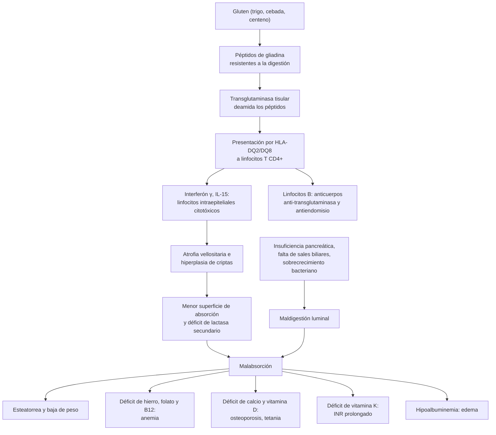

---
tags:
  - Gastroenterología
---

# Enfermedad celíaca, intolerancia a la lactosa y síndrome de malabsorción

**Subespecialidad**
Gastroenterología · Nutrición · Atención primaria

**Guías principales**
ACG 2023: diagnóstico y manejo de la enfermedad celíaca · AGA 2019: diagnóstico y seguimiento de la enfermedad celíaca · ESsCD 2019: enfermedad celíaca y otros trastornos relacionados con el gluten · ESPGHAN 2020: diagnóstico sin biopsia en niños · AGA 2023: insuficiencia pancreática exocrina · ACG 2020: sobrecrecimiento bacteriano del intestino delgado

**Otras fuentes**
Prevalencia mundial de la celíaca (Singh 2018) · Revisión de la celíaca con figuras (Caio 2019) · Malabsorción e intolerancia a la lactosa (Misselwitz 2019; Storhaug 2017) · ENS 2009–2010 · Serie chilena de adultos celíacos (von Mühlenbrock-Pinto 2023) · Genotipo de la lactasa en Chile (Morales 2011)

**GES**
No es GES.

**EUNACOM**
1.06.1.015 Enfermedad celíaca (específico, completo, completo) · 1.06.1.023 Intolerancia a la lactosa (específico, completo, completo) · 1.06.1.028 Síndrome de malabsorción (específico, inicial, derivar)

**Revisado**
Octubre 2026

!!! abstract "Resumen en 60 segundos"
    - **Malabsorción**: falla la digestión o la absorción de los nutrientes.
        - **Clínica**: diarrea crónica con **esteatorrea**, **baja de peso** y **déficits** (anemia, osteoporosis, coagulopatía, edema).
        - **Causas**: **luminales** (insuficiencia pancreática, falta de sales biliares, sobrecrecimiento bacteriano), de la **mucosa** (celíaca, Crohn, giardiasis, Whipple) o **anatómicas** (intestino corto, cirugía gástrica).
    - **Enfermedad celíaca**: enteropatía **autoinmune** gatillada por el **gluten** (trigo, cebada, centeno) en personas con **HLA-DQ2 o DQ8**.
        - Afecta a **~0,7–1 %** de la población. En Chile, la ENS 2009–2010 encontró anticuerpos positivos en el **0,76 %** (mujeres 1,1 %).
        - La mayoría **no está diagnosticada**: hoy predominan las formas **no clásicas** (anemia ferropénica, transaminasas altas, osteoporosis, dispepsia, fatiga).
        - **Estudio**: **IgA anti-transglutaminasa + IgA total**, **comiendo gluten**. Se confirma con **biopsias duodenales** (≥ 4 de la segunda porción y 1–2 del bulbo).
        - **Tratamiento**: **dieta sin gluten estricta y de por vida**, con nutricionista. Corregir los déficits. Serología a los **6 y 12 meses** y luego **anual**.
        - **No responde**: lo más frecuente es la **ingesta inadvertida de gluten**. La **celíaca refractaria** es rara y se asocia a **linfoma**.
    - **Intolerancia a la lactosa**: síntomas (distensión, flatulencia, dolor, diarrea) tras ingerir lactosa por **déficit de lactasa**.
        - Es **primaria** (genética, del adulto) en la mayoría del mundo: en Chile, **57 %** de la población hispana y **88 %** de la amerindia tiene el genotipo de no persistencia.
        - Puede ser **secundaria** a una enfermedad de la mucosa (celíaca, gastroenteritis).
        - **Tratamiento**: **reducir**, no eliminar, la lactosa (la mayoría tolera **~12 g**, una taza de leche). Usar leche sin lactosa, yogur y quesos maduros. **Asegurar el calcio**.

## Definición

| Concepto | Definición |
|---|---|
| **Síndrome de malabsorción** | Alteración de la **digestión** (maldigestión) o de la **absorción** de los nutrientes, con paso de nutrientes no absorbidos a las deposiciones y **déficits nutricionales** |
| **Esteatorrea** | Grasa fecal **> 7 g/día** con una dieta de 100 g de grasa al día. Deposiciones pálidas, voluminosas, brillantes, malolientes, que **flotan** y cuesta eliminar del inodoro |
| **Enfermedad celíaca** | Enteropatía crónica **inmunomediada** del intestino delgado, gatillada por el **gluten** de la dieta en personas **genéticamente predispuestas** (HLA-DQ2 o DQ8). Tiene **anticuerpos específicos** (anti-transglutaminasa, antiendomisio) y lesión de la mucosa que **revierte con la dieta sin gluten** |
| **Celíaca potencial** | Serología positiva con mucosa **sin atrofia** (Marsh 0–1) |
| **Celíaca seronegativa** | Atrofia vellositaria con serología **negativa**, HLA compatible y respuesta a la dieta, tras descartar otras causas de atrofia |
| **Celíaca no respondedora** | Síntomas o alteraciones que **persisten o recurren** pese a la dieta sin gluten |
| **Celíaca refractaria** | **Atrofia persistente** y síntomas de malabsorción tras **≥ 12 meses de dieta estricta**, sin otra causa. **Tipo I**: linfocitos intraepiteliales normales. **Tipo II**: linfocitos **aberrantes y clonales** (prelinfoma) |
| **Dermatitis herpetiforme** | Manifestación **cutánea** de la celíaca: pápulas y vesículas **muy pruriginosas** en codos, rodillas, glúteos y cuero cabelludo, con depósitos **granulares de IgA** en la papila dérmica |
| **Sensibilidad al gluten o al trigo no celíaca** | Síntomas con el gluten o el trigo, **sin** celíaca ni alergia al trigo (serología y biopsia normales). Diagnóstico de exclusión |
| **Hipolactasia** (déficit de lactasa) | Baja actividad de la **lactasa** en el ribete en cepillo del intestino delgado |
| **Malabsorción de lactosa** | La lactosa no se absorbe por completo; se demuestra con una **prueba objetiva** (test de aire espirado) |
| **Intolerancia a la lactosa** | **Síntomas** digestivos tras ingerir lactosa en una persona con malabsorción de lactosa |

## Epidemiología

- **Enfermedad celíaca**:
    - **Prevalencia mundial** (metaanálisis): **1,4 %** por serología y **0,7 %** confirmada por biopsia. En Sudamérica, **0,4 %** (Singh 2018).
    - Más frecuente en las **mujeres** (0,6 % frente a 0,4 %) y en los niños que en los adultos.
    - **La mayoría no está diagnosticada**: por cada caso diagnosticado hay varios sin diagnosticar.
    - **Grupos de riesgo**: familiares de primer grado (**~5–10 %**), **DM1**, tiroiditis autoinmune, síndrome de **Down** y de **Turner**, **déficit de IgA**, hepatitis autoinmune y colangitis biliar primaria.
- **Malabsorción de lactosa**:
    - Afecta al **68 %** de los adultos del mundo (metaanálisis de 89 países), desde un **28 %** en el norte y el oeste de Europa hasta un **70 %** en el Medio Oriente (Storhaug 2017).
    - La **persistencia de la lactasa** en el adulto es una mutación relativamente reciente, frecuente en las poblaciones de origen **europeo** que domesticaron animales lecheros.
- **Malabsorción en general**: las causas más frecuentes en el adulto son la **celíaca**, la **insuficiencia pancreática** (pancreatitis crónica, cirugía), el **sobrecrecimiento bacteriano**, la **giardiasis** y las secuelas de **cirugías digestivas** (gastrectomía, cirugía bariátrica, resecciones intestinales).

!!! chile "Datos nacionales"
    - **Celíaca**: la **ENS 2009–2010** encontró anticuerpos anti-transglutaminasa **> 20 UI/mL** en el **0,76 %** de los mayores de 15 años, con predominio en las **mujeres** (**1,1 %** frente a **0,4 %**) (Moscoso y Quera 2015).
    - **Serie chilena de adultos celíacos** (149 pacientes de un hospital universitario; von Mühlenbrock-Pinto 2023):
        - **80 % mujeres**, edad media al diagnóstico de **42 años**; **38 %** con sobrepeso u obesidad y solo **7 %** con bajo peso.
        - Motivos de consulta: **diarrea** (47 %), **dispepsia** (43 %), **baja de peso** (31 %), fatiga (26 %).
        - Laboratorio: **anemia** (26 %), **transaminasas elevadas** (17 %).
        - Enfermedades asociadas: **hipotiroidismo** (15 %), depresión (11 %); malabsorción de lactosa (15 %) y sobrecrecimiento bacteriano (10 %).
    - **Lactosa**: el genotipo de **no persistencia de la lactasa** (LCT −13910 CC) está presente en el **56,9 %** de la población hispana y en el **88,3 %** de la amerindia. Explica el **90 %** de los test de aire espirado positivos (Morales 2011). En Chile, el **test genético** es una alternativa validada al test de aire espirado.
    - **Giardiasis**: causa clásica de malabsorción en Chile, sobre todo en niños e inmunodeficientes ([ver parasitosis](../infectologia/parasitosis-intestinales.md)).
    - La celíaca **no es GES**. La dieta sin gluten es **cara**. Las agrupaciones de pacientes y los rótulos de alimentos **libres de gluten** ayudan a la adherencia.

## Etiología

| Mecanismo | Causas | Claves |
|---|---|---|
| **Luminal: maldigestión de grasas y proteínas** | **Insuficiencia pancreática exocrina**: **pancreatitis crónica** (alcohol), **cáncer de páncreas**, resección pancreática, **fibrosis quística**; menor riesgo en la DM de larga data, la celíaca, el Crohn y la cirugía intestinal | Esteatorrea marcada, elastasa fecal baja |
| **Luminal: déficit de sales biliares** | **Colestasia** (colangitis biliar primaria, obstrucción), **resección ileal** o Crohn ileal (> 100 cm) | Esteatorrea, déficit de vitaminas liposolubles |
| **Luminal: sobrecrecimiento bacteriano** | Estasis: **asa ciega** (gastrectomía Billroth II, bypass), divertículos de yeyuno, **esclerodermia**, **neuropatía diabética**, pseudoobstrucción; hipoclorhidria (IBP, gastritis atrófica) | Distensión, diarrea, **déficit de B12** con **folato alto** |
| **Mucosa** | **Enfermedad celíaca**, **déficit de lactasa**, **giardiasis**, **enfermedad de Crohn**, enfermedad de **Whipple**, **enteropatía por fármacos** (olmesartán, micofenolato, AINE), enteritis actínica, amiloidosis, **VIH** y **inmunodeficiencia común variable**, esprúe tropical, gastroenteritis eosinofílica | Atrofia vellositaria en la biopsia |
| **Anatómica** | **Intestino corto** (< 200 cm), gastrectomía y **cirugía bariátrica**, fístulas enteroentéricas, isquemia mesentérica crónica | Antecedente quirúrgico |
| **Posabsortiva** (transporte linfático) | **Linfangiectasia intestinal**, **linfoma**, enfermedad de Whipple, pericarditis constrictiva o insuficiencia cardíaca derecha grave | Hipoalbuminemia, linfopenia, edema |

- **Enfermedad celíaca**: requiere **genética** (HLA-DQ2 en ~90 % y DQ8 en la mayoría del resto), **gluten** en la dieta y un **gatillante** (infecciones virales, cambios de la microbiota).
- **Intolerancia a la lactosa**:
    - **Primaria** (del adulto): disminución **programada genéticamente** de la lactasa después del destete. Es la más frecuente.
    - **Secundaria**: daño de la mucosa (**gastroenteritis**, **celíaca**, Crohn, giardiasis, quimioterapia, radiación, sobrecrecimiento). **Revierte** al tratar la causa.
    - **Congénita**: muy rara, en los recién nacidos.

## Fisiopatología

- **Digestión y absorción normales**:
    - **Fase luminal**: las **enzimas pancreáticas** (lipasa, proteasas, amilasa) y las **sales biliares** (micelas) digieren los nutrientes.
    - **Fase mucosa**: las enzimas del **ribete en cepillo** (lactasa, sacarasa) terminan la digestión y los enterocitos absorben.
    - **Fase de transporte**: los quilomicrones salen por los **linfáticos**.
- **Dónde se absorbe cada nutriente**: el **hierro**, el **calcio** y el **folato** en el **duodeno y el yeyuno proximal**; la **vitamina B12** y las **sales biliares** en el **íleon terminal**. Por eso la celíaca (proximal) da **anemia ferropénica** y la resección ileal, **déficit de B12** y diarrea por sales biliares.
- **Enfermedad celíaca** (figura 2):
    - El **gluten** contiene **gliadinas** ricas en prolina y glutamina, que las enzimas digestivas no degradan por completo.
    - Los péptidos atraviesan el epitelio. La **transglutaminasa tisular** los **deamida**, lo que aumenta su afinidad por las moléculas **HLA-DQ2 y DQ8** de las células presentadoras de antígeno.
    - Los **linfocitos T CD4+** activados liberan **interferón γ** y otras citocinas. Se activan los **linfocitos intraepiteliales** citotóxicos (por la **IL-15**), que destruyen los enterocitos.
    - Los linfocitos B producen **anticuerpos anti-transglutaminasa**, anti-endomisio y anti-gliadina deamidada.
    - **Resultado**: **atrofia de las vellosidades**, **hiperplasia de las criptas** y aumento de los **linfocitos intraepiteliales**, con menor superficie de absorción y déficit de las enzimas del ribete en cepillo (incluida la **lactasa**).
- **Intolerancia a la lactosa**: la lactosa no digerida **retiene agua** en el intestino (diarrea **osmótica**) y en el colon las bacterias la **fermentan** a ácidos grasos de cadena corta, **hidrógeno**, metano y CO2 (distensión, flatulencia, dolor). Los síntomas dependen de la **dosis**, de la microbiota y de la **sensibilidad visceral** (por eso se superpone con el intestino irritable).
- **Esteatorrea**: la grasa no absorbida arrastra las **vitaminas liposolubles** (A, D, E, K) y se une al **calcio** y al **magnesio**. El calcio libre ya no fija el oxalato, que se absorbe en el colon y produce **cálculos renales de oxalato** (hiperoxaluria entérica).
- **Sobrecrecimiento bacteriano**: las bacterias **desconjugan las sales biliares** (esteatorrea), **consumen la vitamina B12** y **producen folato** (B12 baja con folato alto) y fermentan los carbohidratos (gas, distensión).

*Figura 1. Fisiopatología de la enfermedad celíaca y del síndrome de malabsorción. Esquema propio.*

<figure markdown>
![Ilustración del epitelio intestinal con enterocitos en la parte superior, numerada del 1 al 14. Los fragmentos de gliadina se unen al receptor CXCR3 de la cara apical del epitelio e inducen la liberación de zonulina, que aumenta la permeabilidad intestinal; los péptidos pasan a la lámina propia, donde se forman complejos de gliadina y transglutaminasa tisular. Se liberan IL-15, IL-8 y otras citocinas, con reclutamiento de neutrófilos; los inhibidores de amilasa y tripsina activan el complejo TLR4-MD2-CD14. Las células presentadoras de antígeno con HLA-DQ2 o DQ8 presentan la gliadina deamidada a los linfocitos T colaboradores, que inducen una reacción Th1 con interferón gamma y TNF alfa, y una reacción Th2 que madura los linfocitos B productores de anticuerpos IgG e IgA. Los linfocitos intraepiteliales dañan el epitelio; el transportador CD71 en la cara apical de los enterocitos dañados transporta complejos de IgA y gliadina. Abajo, una vellosidad atrófica y una cripta hiperplásica con células estromales y las vías WNT, Hedgehog y BMP4](../assets/figuras/celiaca/patogenia-celiaca-caio-2019.jpg){ loading=lazy }
<figcaption>Figura 2. Patogenia de la enfermedad celíaca. Los fragmentos de gliadina aumentan la permeabilidad intestinal (zonulina) y llegan a la lámina propia; la transglutaminasa tisular los deamida; las células presentadoras con HLA-DQ2/DQ8 los presentan a los linfocitos T, que liberan interferón γ y TNF-α y estimulan a los linfocitos B (anticuerpos); los linfocitos intraepiteliales dañan los enterocitos, con atrofia de las vellosidades e hiperplasia de las criptas. Fuente: Caio G, Volta U, Sapone A, et al. Celiac disease: a comprehensive current review. <em>BMC Med.</em> 2019;17(1):142, figura 1. Licencia <a href="https://creativecommons.org/licenses/by/4.0/">CC BY 4.0</a>.</figcaption>
</figure>

## Clasificación

**Formas clínicas de la enfermedad celíaca**:

| Forma | Características |
|---|---|
| **Clásica** | Síntomas de **malabsorción**: diarrea, esteatorrea, baja de peso, distensión; en niños, retraso del crecimiento |
| **No clásica** (hoy la más frecuente en el adulto) | Síntomas digestivos inespecíficos (dispepsia, distensión, constipación, dolor) o **extraintestinales** (anemia ferropénica, osteoporosis, transaminasas altas, fatiga, infertilidad, neuropatía) |
| **Subclínica o asintomática** | Sin síntomas; se detecta por **tamizaje** en grupos de riesgo |
| **Potencial** | Serología positiva **sin atrofia** |
| **Seronegativa** | Atrofia con serología negativa (descartar otras causas) |
| **Refractaria** (tipos I y II) | Atrofia persistente tras ≥ 12 meses de dieta estricta |

**Clasificación histológica de Marsh-Oberhuber** (biopsia duodenal):

| Tipo | Hallazgos | Equivalencia (Corazza-Villanacci) |
|---|---|---|
| **0** | Mucosa normal | — |
| **1** (infiltrativa) | **Linfocitos intraepiteliales > 25 por 100 enterocitos**, vellosidades normales | A (sin atrofia) |
| **2** (hiperplásica) | Tipo 1 + **hiperplasia de criptas** | A |
| **3a** | Tipo 2 + **atrofia vellositaria parcial** | B1 |
| **3b** | Tipo 2 + **atrofia subtotal** | B1 |
| **3c** | Tipo 2 + **atrofia total** (mucosa plana) | B2 |

- **Los tipos 1 y 2 son inespecíficos**: también se ven con AINE, *H. pylori*, sobrecrecimiento bacteriano, infecciones virales, enfermedades autoinmunes y Crohn.

**Malabsorción según el mecanismo**: **luminal** (maldigestión), **mucosa**, **anatómica** y **posabsortiva** (ver la tabla de etiología). También se clasifica en **global** (de todos los nutrientes, como en la celíaca extensa o el intestino corto) o **selectiva** (de un nutriente, como la lactosa o la B12).

## Clínica

- **Síndrome de malabsorción**:
    - **Digestivo**: **diarrea crónica**, **esteatorrea**, **distensión**, flatulencia, borborigmos, dolor abdominal; a veces sin diarrea.
    - **Baja de peso** pese a una ingesta normal o aumentada.
    - **Por los déficits** (tabla).

| Déficit | Manifestación |
|---|---|
| **Hierro** | **Anemia microcítica**, glositis, queilitis, uñas en cuchara |
| **Folato y B12** | **Anemia macrocítica**, glositis; con B12: **neuropatía**, degeneración combinada subaguda, deterioro cognitivo |
| **Calcio, vitamina D, magnesio** | **Osteoporosis**, osteomalacia, fracturas, **tetania**, parestesias, calambres |
| **Vitamina K** | **Equimosis**, sangrados, **INR prolongado** |
| **Vitamina A** | **Ceguera nocturna**, xeroftalmía, hiperqueratosis |
| **Vitamina E** | Neuropatía, **ataxia**, retinopatía |
| **Proteínas** | **Edema**, hipoalbuminemia, pérdida de masa muscular |
| **Zinc** | **Dermatitis** (acral y periorificial), alteración del gusto, mala cicatrización |
| **Tiamina, niacina** | Neuropatía, insuficiencia cardíaca; pelagra (dermatitis, diarrea, demencia) |

- **Enfermedad celíaca**:
    - **Clásica**: diarrea, esteatorrea, baja de peso, distensión.
    - **No clásica** (lo más frecuente en el adulto): **dispepsia**, distensión, **constipación**, síntomas que se confunden con un **intestino irritable**, **fatiga**.
    - **Extraintestinal**:
        - **Anemia ferropénica** que no responde al hierro oral.
        - **Osteoporosis** precoz.
        - **Transaminasas elevadas** sin otra causa (hepatitis celíaca, que mejora con la dieta).
        - **Dermatitis herpetiforme**.
        - **Aftas** orales recurrentes, defectos del esmalte dental.
        - **Neurológicas**: neuropatía periférica, **ataxia** por gluten, cefalea.
        - **Reproductivas**: infertilidad, abortos recurrentes, menarquia tardía, menopausia precoz.
        - **Hipoesplenismo** (cuerpos de Howell-Jolly en el frotis).
    - **No todos son delgados**: en Chile, el 38 % de los adultos celíacos tenía sobrepeso u obesidad.
- **Intolerancia a la lactosa**:
    - **Distensión**, **flatulencia**, **dolor** cólico, **borborigmos** y **diarrea** entre **30 minutos y unas horas** después de ingerir lácteos. A veces náuseas.
    - **Dependen de la dosis**: la mayoría tolera hasta **~12 g de lactosa** (una taza de leche), sobre todo con las comidas.
    - **No** causa baja de peso, sangre, fiebre ni diarrea nocturna: si los hay, buscar otra causa (celíaca, Crohn).
    - Muchos pacientes que se dicen "intolerantes" tienen **pruebas normales** (se superpone con el intestino irritable).
- **Pistas de otras causas**:
    - **Insuficiencia pancreática**: alcohol, dolor abdominal crónico, **DM**, esteatorrea franca.
    - **Sobrecrecimiento bacteriano**: cirugía gástrica, esclerodermia, neuropatía diabética.
    - **Enfermedad de Whipple**: hombre de edad media con **artralgias** (años antes), diarrea, baja de peso, adenopatías, fiebre y signos neurológicos.
    - **Crohn**: dolor, diarrea, baja de peso, fístulas perianales.

!!! alarma "Signos de alarma: estudiar sin demora"
    - **Baja de peso** importante, **desnutrición**, **hipoalbuminemia** o edema.
    - **Sangre en las deposiciones**, **anemia**, **fiebre** o **diarrea nocturna**: no es una intolerancia a la lactosa.
    - **Edad > 50 años** con síntomas nuevos: descartar un **cáncer** (colon, páncreas) y la **colitis microscópica**.
    - **Celíaco que empeora pese a la dieta** con dolor, baja de peso, fiebre, sangrado o **obstrucción**: descartar una **celíaca refractaria**, un **linfoma T** asociado a enteropatía o un **adenocarcinoma de intestino delgado**.
    - **Tetania**, convulsiones o arritmias: hipocalcemia o hipomagnesemia graves ([ver calcio, fósforo y magnesio](../endocrinologia/trastornos-del-calcio-fosforo-y-magnesio.md)).
    - **INR prolongado** con sangrado: déficit de vitamina K.
    - **Signos neurológicos** (ataxia, neuropatía, deterioro cognitivo): déficit de **B12**, vitamina E o cobre; enfermedad de Whipple.

## Diagnóstico

### Enfermedad celíaca

!!! guia "Estudio de la enfermedad celíaca (ACG 2023; AGA 2019)"
    - **A quién estudiar**:
        - Síntomas o signos de **malabsorción** (diarrea crónica con baja de peso, esteatorrea, dolor o distensión posprandial).
        - **Anemia ferropénica** sin causa, **transaminasas elevadas** sin causa, **osteoporosis** precoz, dermatitis herpetiforme.
        - **Familiares de primer grado** con síntomas (considerar también en los asintomáticos).
        - **DM1**, tiroiditis autoinmune, síndrome de **Down** o de **Turner**, **déficit de IgA**.
    - **Primer examen**: **IgA anti-transglutaminasa** (tTG-IgA) **+ IgA total**.
    - **Déficit de IgA**: usar pruebas **IgG** (tTG-IgG o péptidos de gliadina deamidada, DGP-IgG). La tTG-IgG **no es específica** si la IgA es normal.
    - **El paciente debe estar comiendo gluten**: reducirlo o suspenderlo antes del estudio **disminuye la sensibilidad** de la serología y de la biopsia.
        - Si ya inició una dieta sin gluten: volver a una dieta normal con **~3 rebanadas de pan de trigo al día**, idealmente **por 1–3 meses**, antes de repetir la tTG-IgA (AGA 2019).
    - **Confirmación**: **endoscopía alta** con **≥ 4 biopsias de la segunda porción del duodeno** y **1–2 del bulbo** (la lesión puede ser parcheada).
    - **tTG-IgA > 10 veces el límite superior** + **antiendomisio** positivo en una **segunda muestra**: el valor predictivo positivo es **cercano al 100 %**. En los niños permite el diagnóstico **sin biopsia** (ESPGHAN 2020). En los adultos se hace igual la endoscopía para el diagnóstico diferencial.
    - **HLA-DQ2/DQ8**: sirve para **descartar** (valor predictivo negativo muy alto), no para confirmar. Útil si el paciente ya hace dieta sin gluten o los resultados son discordantes.
    - **No** usar los anticuerpos **antigliadina nativa** (poco específicos).

<figure markdown>
![Algoritmo diagnóstico de la enfermedad celíaca en el adulto. Arriba, la sospecha clínica en un paciente que come gluten: diarrea crónica, baja de peso, distensión, anemia ferropénica sin causa, transaminasas elevadas, osteoporosis precoz, dermatitis herpetiforme, familiar de primer grado, DM1, tiroiditis autoinmune, síndrome de Down o de Turner y déficit de IgA. Luego, IgA anti-transglutaminasa más IgA total; si ya dejó el gluten, volver a comerlo, unas 3 rebanadas de pan al día, por 1 a 3 meses antes. Tres ramas: IgA total baja, con déficit de IgA, en que se piden pruebas IgG como tTG-IgG o péptidos deamidados; tTG-IgA positiva, en que se hace endoscopía alta con 4 o más biopsias de la segunda porción del duodeno y 1 a 2 del bulbo; y tTG-IgA negativa con IgA total normal, en que la celíaca es improbable, pero si la sospecha es alta se biopsia igual. La histología de Marsh-Oberhuber tiene cuatro resultados: Marsh 3, con atrofia vellositaria, hiperplasia de criptas y linfocitos intraepiteliales, que con serología positiva es enfermedad celíaca; Marsh 1 a 2, con linfocitos intraepiteliales aumentados sin atrofia, inespecífico por AINE, H. pylori, sobrecrecimiento bacteriano o virus, en que se consideran HLA, antiendomisio y revisar las biopsias; atrofia con serología negativa, en que se piensa en giardiasis, fármacos como olmesartán y micofenolato, inmunodeficiencia común variable, Whipple, linfoma, esprúe tropical, tuberculosis y VIH; y biopsia normal con serología positiva, en que se revisa si comía gluten, se toman más biopsias y se piden antiendomisio y HLA, porque puede ser una celíaca potencial. Abajo, el HLA-DQ2/DQ8 sirve para descartar: negativo hace prácticamente imposible la celíaca; positivo no confirma porque lo tiene un 30 a 40 % de la población](../assets/figuras/celiaca/algoritmo-diagnostico-celiaca.svg){ loading=lazy }
<figcaption>Figura 3. Algoritmo diagnóstico de la enfermedad celíaca en el adulto. Esquema propio basado en ACG 2023 (Rubio-Tapia), AGA 2019 (Husby) y ESsCD 2019 (Al-Toma).</figcaption>
</figure>

### Intolerancia a la lactosa

- **Clínico** en la mayoría: síntomas con los lácteos que **mejoran con 2–4 semanas sin lactosa** y reaparecen al reintroducirla.
- **Test de aire espirado con lactosa** (hidrógeno, idealmente también metano): **25 g** de lactosa y muestras cada 15–30 minutos por **3 horas**. **Positivo**: aumento del hidrógeno **≥ 20 ppm** sobre la basal. Registrar los **síntomas** durante el test (intolerancia frente a malabsorción asintomática).
- **Test genético** (variante **LCT −13910 C>T**): el genotipo **CC** indica **no persistencia** de la lactasa (hipolactasia primaria). Validado en la población chilena. **No** detecta la hipolactasia secundaria.
- **Test de tolerancia a la lactosa** (glicemia tras 50 g de lactosa): un alza **< 20 mg/dL** sugiere malabsorción. Menos usado.
- **Test rápido de lactasa** en una biopsia duodenal: si se hace una endoscopía por otra razón.
- **Buscar una causa secundaria** si hay síntomas de alarma, malabsorción global o inicio brusco en un adulto que antes toleraba: **serología celíaca**, parasitológico (Giardia).

### Síndrome de malabsorción

<figure markdown>
![Esquema del enfoque diagnóstico del síndrome de malabsorción. Arriba, la sospecha: diarrea crónica con esteatorrea, con deposiciones pálidas, voluminosas, grasosas y que flotan, baja de peso pese a comer bien y distensión; déficits como anemia por hierro, B12 o folato, osteoporosis o tetania por calcio y vitamina D, equimosis e INR alto por vitamina K y edema por proteínas. Luego, los exámenes iniciales: hemograma, ferritina, B12, folato, albúmina, INR, calcio, fósforo, magnesio, vitamina D, zinc, IgA anti-transglutaminasa más IgA total, parasitológico y antígeno de Giardia, elastasa fecal y grasa fecal con Sudán III si hay dudas de esteatorrea. Tres columnas de causas. Luminal o maldigestión: insuficiencia pancreática por pancreatitis crónica, cáncer, cirugía o fibrosis quística; déficit de sales biliares por colestasia o resección ileal; sobrecrecimiento bacteriano por cirugía, diabetes o esclerodermia; se estudia con elastasa fecal menor de 100 microgramos por gramo, TC o RM de páncreas y test de aire espirado con glucosa o lactulosa. Mucosa: enfermedad celíaca, intolerancia a la lactosa, giardiasis, enfermedad de Crohn, fármacos como olmesartán y AINE, enfermedad de Whipple, enteritis actínica, amiloidosis, VIH e inmunodeficiencia común variable; se estudia con endoscopía alta con biopsias duodenales, colonoscopía con ileoscopía y test de aire con lactosa. Anatómica y posabsortiva: intestino corto, gastrectomía o bypass gástrico con asa ciega, linfangiectasia intestinal, linfoma y tumores, fístulas enteroentéricas e isquemia mesentérica crónica; se estudia con el antecedente quirúrgico, entero-TC o entero-RM, cápsula endoscópica y enteroscopía con biopsias. Abajo, el tratamiento: tratar la causa con dieta sin gluten, enzimas pancreáticas con 40 000 o más unidades de lipasa por comida, antibiótico en el sobrecrecimiento y colestiramina; corregir los déficits de hierro, B12, folato, calcio, vitaminas D, A, E y K, zinc y magnesio; nutricionista; no indicar dietas muy bajas en grasa](../assets/figuras/celiaca/enfoque-malabsorcion.svg){ loading=lazy }
<figcaption>Figura 4. Enfoque diagnóstico del síndrome de malabsorción. Esquema propio basado en AGA 2023 (Whitcomb), ACG 2020 (Pimentel) y ACG 2023 (Rubio-Tapia).</figcaption>
</figure>

- **Confirmar la malabsorción**: la historia (deposiciones grasas que flotan), los **déficits** y, si hay dudas, la **grasa fecal** (cualitativa con **Sudán III**; la cuantitativa de 72 horas casi no se usa).
- **Exámenes de primera línea** en todos: serología celíaca, parasitológico y antígeno de *Giardia*, **elastasa fecal**, hemograma y nutrientes.
- **Según la sospecha**:
    - **Endoscopía alta con biopsias duodenales**: celíaca, Whipple (macrófagos **PAS positivos**), giardiasis, linfangiectasia, amiloidosis, enteropatía por fármacos.
    - **Elastasa fecal**: **< 100 µg/g** apoya una **insuficiencia pancreática**; **100–200 µg/g** es indeterminado. Se puede medir con enzimas. Requiere deposiciones **semisólidas o sólidas** (la diarrea acuosa la diluye) (AGA 2023).
    - **Test de aire espirado con glucosa o lactulosa**: **sobrecrecimiento bacteriano** si el hidrógeno sube **≥ 20 ppm** en los primeros **90 minutos** (ACG 2020). Un metano **≥ 10 ppm** indica sobrecrecimiento de metanógenos (asociado a constipación).
    - **TC o RM de páncreas** (calcificaciones, masa), **colonoscopía con ileoscopía** (Crohn), **entero-TC o entero-RM**, **cápsula endoscópica**.
    - **VIH**, **inmunoglobulinas** (inmunodeficiencia común variable).

## Laboratorio

| Examen | Para qué | Hallazgo típico |
|---|---|---|
| **IgA anti-transglutaminasa + IgA total** | Celíaca (examen inicial) | Positiva; **> 10 veces el límite** casi confirma |
| **Antiendomisio IgA** | Confirmar la celíaca | Muy específico |
| **DGP-IgG o tTG-IgG** | Celíaca con **déficit de IgA** | Positivos |
| **HLA-DQ2/DQ8** | **Descartar** la celíaca | Negativo la excluye |
| **Hemograma y frotis** | Anemia, déficits | Microcitosis (hierro), macrocitosis (B12, folato), **cuerpos de Howell-Jolly** (hipoesplenismo) |
| **Ferritina, B12, folato** | Déficits | Ferritina baja (celíaca); **B12 baja con folato alto** (sobrecrecimiento) |
| **Albúmina, prealbúmina, colesterol** | Estado nutritivo | Bajos |
| **INR** | Vitamina K | Prolongado (corrige con vitamina K) |
| **Calcio, fósforo, magnesio, 25-OH vitamina D, fosfatasa alcalina, PTH** | Metabolismo óseo | Calcio y vitamina D bajos, **fosfatasa alcalina y PTH altas** (osteomalacia, hiperparatiroidismo secundario) |
| **Zinc, cobre, vitaminas A y E** | Déficits específicos | Bajos |
| **Transaminasas** | Hepatitis celíaca | Elevadas leves; mejoran con la dieta |
| **TSH** | Tiroiditis asociada | Hipotiroidismo |
| **Elastasa fecal** | Insuficiencia pancreática | **< 100 µg/g** |
| **Grasa fecal (Sudán III)** | Confirmar la esteatorrea | Positiva |
| **Parasitológico seriado y antígeno de Giardia** | Giardiasis | Positivos |
| **Test de aire espirado** | Lactosa (con lactosa), sobrecrecimiento (con glucosa o lactulosa) | Aumento del hidrógeno ≥ 20 ppm |
| **Test genético LCT −13910** | Hipolactasia primaria | Genotipo CC |

## Imágenes

- **Endoscopía alta**: en la celíaca, la mucosa duodenal puede verse con **pliegues festoneados** (en "dientes de sierra"), patrón en **mosaico**, **disminución de los pliegues** y **vasos submucosos visibles**. Una mucosa de aspecto normal **no** descarta la celíaca: **biopsiar siempre** si hay sospecha.
- **Densitometría ósea (DXA)**: en los adultos con celíaca al diagnóstico (sobre todo con malabsorción, mayores de 50 años o mujeres posmenopáusicas) y en la insuficiencia pancreática (cada 1–2 años según la AGA 2023) ([ver osteoporosis](../endocrinologia/osteoporosis.md)).
- **TC o RM de abdomen**: páncreas (calcificaciones de la pancreatitis crónica, masa), adenopatías (linfoma, Whipple), engrosamiento de asas (Crohn, linfoma).
- **Entero-TC o entero-RM y cápsula endoscópica**: compromiso del intestino delgado (Crohn, tumores, celíaca refractaria con úlceras o linfoma).

## Diagnóstico diferencial

| Pista | Pensar en |
|---|---|
| Esteatorrea franca, alcohol, dolor abdominal, DM, calcificaciones pancreáticas | **Insuficiencia pancreática** por pancreatitis crónica |
| Anemia ferropénica, osteoporosis, transaminasas altas, tiroiditis | **Enfermedad celíaca** |
| Síntomas solo con los lácteos, sin baja de peso ni alarma | **Intolerancia a la lactosa** |
| B12 baja con folato alto, distensión; cirugía gástrica, esclerodermia o diabetes | **Sobrecrecimiento bacteriano** |
| Diarrea acuosa tras una colecistectomía o resección ileal | **Diarrea por ácidos biliares** ([ver diarrea crónica](constipacion-intestino-irritable-y-diarrea-cronica.md)) |
| Diarrea, distensión y flatulencia tras un viaje o en un niño de jardín infantil | **Giardiasis** |
| Diarrea con dolor, baja de peso, fístulas perianales, aftas, PCR alta | **Enfermedad de Crohn** |
| Artralgias de años, diarrea, baja de peso, adenopatías, síntomas neurológicos | **Enfermedad de Whipple** |
| Atrofia vellositaria con serología negativa en un hipertenso | **Enteropatía por olmesartán** |
| Diarrea con infecciones respiratorias recurrentes, inmunoglobulinas bajas | **Inmunodeficiencia común variable** |
| Edema, hipoalbuminemia, linfopenia, quilo | **Linfangiectasia intestinal** |
| Diarrea acuosa crónica en una mujer mayor con AINE, IBP o ISRS | **Colitis microscópica** (no causa malabsorción) |
| Síntomas con el gluten, serología y biopsia normales | **Sensibilidad al gluten o al trigo no celíaca** o **intestino irritable** (FODMAP) |
| Urticaria, angioedema o anafilaxia minutos después de comer trigo | **Alergia al trigo** (IgE) |

## Tratamiento

### Enfermedad celíaca

!!! guia "Manejo de la enfermedad celíaca (ACG 2023; AGA 2019)"
    - **Dieta sin gluten estricta y de por vida**: es el único tratamiento eficaz.
        - **Eliminar** el **trigo** (incluidas la espelta, la sémola y el cuscús), la **cebada** y el **centeno**, y los productos que los contengan.
        - **Permitidos**: arroz, maíz, papa, quínoa, amaranto, trigo sarraceno, legumbres, carnes, pescados, huevos, lácteos, frutas y verduras.
        - **Avena**: la avena **pura, sin contaminación**, es tolerada por la mayoría. La avena comercial suele estar contaminada con trigo.
        - Ojo con el gluten "oculto": salsas, embutidos, cerveza, medicamentos y la **contaminación cruzada** (tostador, freidora, harina compartida).
        - Los alimentos **"libres de gluten"** tienen **< 20 ppm** de gluten.
    - **Educación por un nutricionista** con experiencia en celíaca, y apoyo de las agrupaciones de pacientes.
    - **Corregir los déficits**: hierro, folato, B12, vitamina D, calcio, zinc, cobre.
    - **Densitometría ósea** en los adultos.
    - **Seguimiento**: **tTG-IgA a los 6 y 12 meses** del diagnóstico y luego **anual** (AGA 2019). La serología positiva persistente suele indicar **exposición al gluten**. **Una serología negativa no garantiza** que la mucosa haya sanado.
    - **Biopsia de control**: si los síntomas **persisten o recurren** sin otra explicación, aun con serología negativa (AGA 2019).
    - **Tamizaje de los familiares de primer grado**.
    - Considerar la **vacuna antineumocócica** (hipoesplenismo funcional).

- **Celíaca no respondedora** (síntomas que persisten pese a la dieta):
    1. **Revisar el diagnóstico** (¿fue confirmado con serología y biopsia?).
    2. **Revisar la dieta** con un nutricionista: la **exposición inadvertida al gluten** es la causa más frecuente.
    3. Buscar **otras causas**: **intolerancia a la lactosa** secundaria, **intestino irritable**, **sobrecrecimiento bacteriano**, **colitis microscópica**, **insuficiencia pancreática**, diarrea por ácidos biliares.
    4. **Nueva biopsia**: si persiste la atrofia tras ≥ 12 meses de dieta estricta, sospechar una **celíaca refractaria** y **derivar** (inmunofenotipo de los linfocitos intraepiteliales; tratamiento con **budesonida**; el tipo II tiene riesgo de **linfoma T**).
- **Dermatitis herpetiforme**: dieta sin gluten (la piel mejora en meses) y **dapsona** para el control rápido del prurito (pedir antes la **G6PD**; vigilar la anemia hemolítica y la metahemoglobinemia).

### Intolerancia a la lactosa

- **Reducir, no eliminar**: la mayoría tolera **~12 g de lactosa** (240 mL de leche) en una toma, sobre todo **con las comidas**, y más si se reparte durante el día.
- **Preferir**:
    - **Leche y productos sin lactosa** o deslactosados.
    - **Yogur** y **leches fermentadas** (las bacterias digieren parte de la lactosa).
    - **Quesos maduros** (casi sin lactosa).
- **Lactasa en comprimidos o gotas** con el primer bocado del lácteo.
- **Asegurar el calcio** (**1000–1200 mg/día**) y la **vitamina D**: las dietas sin lácteos favorecen la osteoporosis.
- **Secundaria**: tratar la causa (celíaca, giardiasis, gastroenteritis). Suele revertir en semanas a meses.
- Si los síntomas persisten pese a eliminar la lactosa, pensar en un **intestino irritable** (dieta baja en **FODMAP**) u otra causa.

### Síndrome de malabsorción

- **Tratar la causa**:
    - **Celíaca**: dieta sin gluten.
    - **Insuficiencia pancreática** (AGA 2023): **enzimas pancreáticas** (pancreatina) **durante las comidas**, con **≥ 40 000 U de lipasa** por comida principal y **la mitad** con las colaciones. Ajustar según el tamaño y la grasa de la comida. Si no responde, agregar un **IBP** (el ácido inactiva las enzimas). Dieta con **grasa baja a moderada** y comidas pequeñas frecuentes; **evitar las dietas muy bajas en grasa**. Suplementar y controlar las **vitaminas liposolubles**.
    - **Sobrecrecimiento bacteriano** (ACG 2020): **antibióticos** (rifaximina; alternativas: amoxicilina-ácido clavulánico, metronidazol, ciprofloxacino, doxiciclina) y corregir la causa (procinéticos, revisar los IBP, cirugía si hay asa ciega).
    - **Diarrea por ácidos biliares**: **colestiramina**.
    - **Giardiasis**: tinidazol o metronidazol ([ver parasitosis](../infectologia/parasitosis-intestinales.md)).
    - **Enfermedad de Whipple**: **ceftriaxona** por 2 semanas y luego **cotrimoxazol** por 12 meses.
    - **Enteropatía por fármacos**: suspender el fármaco (olmesartán).
    - **Crohn**, linfoma, linfangiectasia, intestino corto: **derivar**.
- **Soporte nutricional**:
    - Dieta hipercalórica e hiperproteica con **nutricionista**.
    - **Triglicéridos de cadena media** (no requieren lipasa ni micelas para absorberse) en la esteatorrea grave y la linfangiectasia.
    - **Nutrición enteral o parenteral** en la desnutrición grave o el intestino corto ([ver desnutrición](../endocrinologia/desnutricion-y-sindromes-carenciales.md)).
    - Vigilar el **síndrome de realimentación** al iniciar el soporte en un paciente muy desnutrido.
- **Hiperoxaluria entérica** (cálculos de oxalato): dieta baja en oxalato y grasa, **calcio con las comidas** y buena hidratación ([ver urolitiasis](../nefrologia/urolitiasis-y-colico-renal.md)).

!!! dosis "Dosis de referencia (adulto)"
    | Fármaco | Dosis | Comentario |
    |---|---|---|
    | **Sulfato ferroso** | **200–325 mg** (40–65 mg de hierro elemental) **1 vez al día o en días alternos** | Anemia ferropénica. Si no tolera o no absorbe (celíaca activa): **hierro IV** |
    | **Ácido fólico** | **1–5 mg/día** | Déficit de folato. Corregir antes la B12 si también está baja |
    | **Vitamina B12 (cianocobalamina)** | **1000 µg IM** diario por 1 semana, semanal por 1 mes y luego mensual; u oral **1000–2000 µg/día** si la absorción ileal está conservada | Resección ileal o Crohn ileal: vía IM de por vida |
    | **Calcio** | **1000–1200 mg/día** en total (dieta + suplemento), en dosis de ≤ 500 mg | Celíaca, intolerancia a la lactosa, osteoporosis |
    | **Vitamina D3** | **800–2000 UI/día**; dosis de carga si hay déficit | Controlar el nivel de 25-OH vitamina D |
    | **Vitamina K** | **10 mg IV lento u oral** | INR prolongado por malabsorción |
    | **Pancreatina** (enzimas pancreáticas) | **≥ 40 000 U de lipasa** con cada comida principal y **20 000 U** con las colaciones; subir según la respuesta | Tomar **durante** la comida. Agregar IBP si no responde |
    | **Rifaximina** | **550 mg cada 8 h** por **14 días** (otros esquemas: 400 mg cada 8 h por 10–14 días) | Sobrecrecimiento bacteriano |
    | **Colestiramina** | **4 g 1–3 veces al día** | Diarrea por ácidos biliares. Separar 4 horas de otros fármacos (reduce su absorción) |
    | **Dapsona** | **25–50 mg/día**, subir según la respuesta | Dermatitis herpetiforme. **G6PD** antes; hemograma y metahemoglobina |
    | **Lactasa** | Según el producto, con el primer bocado del lácteo | Intolerancia a la lactosa |
    | **Ceftriaxona → cotrimoxazol** | **2 g/día IV** por 14 días → **160/800 mg cada 12 h** por **12 meses** | Enfermedad de Whipple |

## Complicaciones

| Complicación | Comentario |
|---|---|
| **Anemia** (ferropénica, megaloblástica o mixta) | La más frecuente; puede ser la única manifestación de la celíaca ([ver anemias](../hematologia/anemias.md)) |
| **Osteoporosis, osteomalacia, fracturas** | Por malabsorción de calcio y vitamina D; mejora con la dieta sin gluten |
| **Desnutrición, sarcopenia** | Malabsorción global grave |
| **Enfermedades autoinmunes asociadas** | Tiroiditis, DM1, hepatitis autoinmune, dermatitis herpetiforme |
| **Hipoesplenismo** | Riesgo de infecciones por bacterias capsuladas |
| **Celíaca refractaria** | Rara; el tipo II puede progresar a **linfoma T asociado a enteropatía** |
| **Linfoma T asociado a enteropatía**, **adenocarcinoma de intestino delgado** | Raros; sospechar ante un deterioro pese a la dieta |
| **Yeyunoileítis ulcerativa** | Úlceras con dolor, sangrado, perforación u obstrucción |
| **Infertilidad, abortos, bajo peso de nacimiento** | Celíaca no tratada |
| **Cálculos renales de oxalato** | Hiperoxaluria entérica en la esteatorrea |
| **Déficits neurológicos** | Neuropatía (B12, vitamina E, cobre), ataxia por gluten |
| **Problemas de la dieta sin gluten** | Costo, aislamiento social, **aumento de peso** y síndrome metabólico (los productos sin gluten tienen más grasa y azúcar), déficit de fibra |

## Pronóstico y seguimiento

- **Celíaca**:
    - Con una dieta estricta, **los síntomas mejoran en semanas** y la serología se **normaliza en 6–24 meses**. La mucosa del adulto puede tardar **años** en recuperarse, y en algunos no lo hace por completo.
    - **Control**: síntomas, peso, **adherencia** (nutricionista) y **tTG-IgA a los 6 y 12 meses** y luego **anual**. Además: hemograma, ferritina, folato, B12, vitamina D, transaminasas y **TSH**.
    - **Densitometría** al diagnóstico en los adultos y repetir si estaba alterada.
    - El riesgo de linfoma y de mortalidad baja con una **buena adherencia**.
- **Intolerancia a la lactosa**: crónica (la primaria es permanente) pero **benigna**. Con ajustes de la dieta, la calidad de vida es normal. Controlar el aporte de calcio.
- **Malabsorción**: depende de la causa. Seguimiento nutricional, de los déficits y de la masa ósea.
- **Derivar a gastroenterología**:
    - celíaca **no respondedora** o con sospecha de **refractaria**;
    - serología positiva con biopsia **dudosa**, o atrofia con serología **negativa**;
    - **malabsorción** sin causa aclarada tras el estudio inicial;
    - sospecha de **Whipple**, **Crohn**, **linfoma** o **intestino corto**;
    - insuficiencia pancreática con mala respuesta a las enzimas.

## Perlas para el internado

!!! perla "Para recordar en la sala"
    - **Anemia ferropénica sin causa = pedir serología celíaca** (tTG-IgA + IgA total), sobre todo en una mujer joven que no responde al hierro oral.
    - **Siempre pedir la IgA total** junto con la tTG-IgA: en el déficit de IgA, la tTG-IgA sale falsamente negativa.
    - **No sacar el gluten antes de estudiar**: el paciente debe estar comiéndolo para la serología y la biopsia.
    - **La celíaca del adulto rara vez es "clásica"**: piensa en ella ante dispepsia, distensión, fatiga, transaminasas altas u osteoporosis, aunque el paciente tenga sobrepeso.
    - **Celíaco que no mejora = casi siempre gluten oculto**. Antes de pensar en refractaria, revisa la dieta con un nutricionista.
    - **B12 baja con folato alto = sobrecrecimiento bacteriano**.
    - **Intolerancia a la lactosa no da baja de peso, sangre ni diarrea nocturna**. Si los hay, estudia otra cosa.
    - **No elimines todos los lácteos**: yogur, quesos maduros y leche sin lactosa, y asegura el calcio.
    - **Elastasa fecal baja = insuficiencia pancreática**: las enzimas se toman **durante** la comida, no antes ni después.
    - **INR prolongado en un paciente con diarrea crónica**: piensa en déficit de vitamina K por malabsorción.

## Preguntas de repaso

??? repaso "1. Mujer de 28 años con anemia ferropénica (Hb 10,2 g/dL, ferritina 6 ng/mL) que no mejoró tras 3 meses de sulfato ferroso. Refiere distensión y deposiciones blandas. Sin sangrado ginecológico abundante. ¿Qué estudio pide?"
    - Sospechar una **enfermedad celíaca**: anemia ferropénica **refractaria al hierro oral** con síntomas digestivos leves.
    - Pedir **IgA anti-transglutaminasa + IgA total**, con el paciente **comiendo gluten**.
    - Si es positiva: **endoscopía alta con ≥ 4 biopsias de la segunda porción del duodeno y 1–2 del bulbo**.
    - Mientras tanto, considerar el **hierro IV** si no absorbe el oral, y buscar otras causas de pérdida.

??? repaso "2. Hombre de 35 años con diarrea y distensión. La tTG-IgA es negativa, pero la sospecha clínica es alta. ¿Qué le falta?"
    - La **IgA total**: el **déficit de IgA** es más frecuente en los celíacos y produce un **falso negativo** de la tTG-IgA.
    - Si la IgA total está baja: pedir pruebas **IgG** (**DGP-IgG** o tTG-IgG).
    - Confirmar que **comía gluten** al momento del examen.
    - Si la sospecha sigue alta con serología negativa: **biopsia duodenal** de todas formas.

??? repaso "3. Mujer de 45 años con celíaca diagnosticada hace 18 meses, en dieta \"sin gluten\", que persiste con distensión y diarrea. La tTG-IgA sigue positiva. ¿Qué hace?"
    - **Celíaca no respondedora** con serología **persistentemente positiva**: lo más probable es la **exposición al gluten** (inadvertida o voluntaria).
    - **Revisión de la dieta** por un **nutricionista**: gluten oculto (salsas, embutidos, avena contaminada, medicamentos) y contaminación cruzada.
    - Buscar otras causas: **intolerancia a la lactosa**, sobrecrecimiento bacteriano, colitis microscópica, insuficiencia pancreática, intestino irritable.
    - Si pese a una dieta estricta persiste la atrofia en una nueva biopsia: **derivar** por sospecha de **celíaca refractaria**.

??? repaso "4. Hombre de 30 años con distensión, flatulencia y diarrea 1–2 horas después de tomar leche. Sin baja de peso, sangre ni síntomas nocturnos. ¿Qué tiene y cómo lo maneja?"
    - **Intolerancia a la lactosa**, probablemente **primaria** (frecuente en Chile).
    - **Diagnóstico**: clínico con una **prueba de 2–4 semanas sin lactosa** (o test de aire espirado o test genético si hay dudas).
    - **Manejo**:
        - **Reducir**, no eliminar: tolera ~12 g (una taza de leche) con las comidas.
        - Preferir **leche sin lactosa**, **yogur** y **quesos maduros**; **lactasa** si lo desea.
        - **Asegurar el calcio** (1000 mg/día) y la vitamina D.
    - Sin signos de alarma, no requiere más estudio. Si no mejora, pensar en intestino irritable o en una causa secundaria (celíaca).

??? repaso "5. Hombre de 58 años, bebedor de 15 años, con diarrea de deposiciones grasas que flotan, baja de 8 kg y diabetes de reciente diagnóstico. ¿Qué sospecha y cómo lo estudia y trata?"
    - **Insuficiencia pancreática exocrina** por **pancreatitis crónica** alcohólica (con diabetes pancreatogénica).
    - **Estudio**: **elastasa fecal** (< 100 µg/g la apoya), **TC de abdomen** (calcificaciones, dilatación del Wirsung; **descartar un cáncer de páncreas**), vitaminas liposolubles, densitometría.
    - **Tratamiento**:
        - **Enzimas pancreáticas** durante las comidas: **≥ 40 000 U de lipasa** por comida principal y la mitad con las colaciones; agregar un IBP si no responde.
        - **Suspender el alcohol** y el tabaco.
        - Dieta con grasa moderada y suplementos de vitaminas.
    - **Derivar** a gastroenterología.

??? repaso "6. Mujer de 62 años con gastrectomía Billroth II hace 10 años, con distensión, diarrea y parestesias. Hb 10 g/dL con VCM 108 fL, B12 baja y folato alto. ¿Qué sospecha?"
    - **Sobrecrecimiento bacteriano** en el **asa ciega**: las bacterias **consumen la B12** y **producen folato**.
    - **Estudio**: **test de aire espirado** con glucosa o lactulosa; descartar también el déficit de B12 por la gastrectomía (falta de factor intrínseco).
    - **Tratamiento**:
        - **Antibiótico** (rifaximina u otro).
        - **Vitamina B12 IM**: las parestesias sugieren daño neurológico; tratar sin demora.
        - Corregir los otros déficits (hierro, calcio, vitamina D).

## Referencias

1. Rubio-Tapia A, Hill ID, Semrad C, et al. American College of Gastroenterology guidelines update: diagnosis and management of celiac disease. *Am J Gastroenterol.* 2023;118(1):59–76. doi:[10.14309/ajg.0000000000002075](https://doi.org/10.14309/ajg.0000000000002075)
2. Husby S, Murray JA, Katzka DA. AGA clinical practice update on diagnosis and monitoring of celiac disease—changing utility of serology and histologic measures: expert review. *Gastroenterology.* 2019;156(4):885–889. doi:[10.1053/j.gastro.2018.12.010](https://doi.org/10.1053/j.gastro.2018.12.010)
3. Al-Toma A, Volta U, Auricchio R, et al. European Society for the Study of Coeliac Disease (ESsCD) guideline for coeliac disease and other gluten-related disorders. *United European Gastroenterol J.* 2019;7(5):583–613. doi:[10.1177/2050640619844125](https://doi.org/10.1177/2050640619844125)
4. Husby S, Koletzko S, Korponay-Szabó I, et al. European Society Paediatric Gastroenterology, Hepatology and Nutrition guidelines for diagnosing coeliac disease 2020. *J Pediatr Gastroenterol Nutr.* 2020;70(1):141–156. doi:[10.1097/MPG.0000000000002497](https://doi.org/10.1097/MPG.0000000000002497)
5. Whitcomb DC, Buchner AM, Forsmark CE. AGA clinical practice update on the epidemiology, evaluation, and management of exocrine pancreatic insufficiency: expert review. *Gastroenterology.* 2023;165(5):1292–1301. doi:[10.1053/j.gastro.2023.07.007](https://doi.org/10.1053/j.gastro.2023.07.007)
6. Pimentel M, Saad RJ, Long MD, Rao SSC. ACG clinical guideline: small intestinal bacterial overgrowth. *Am J Gastroenterol.* 2020;115(2):165–178. doi:[10.14309/ajg.0000000000000501](https://doi.org/10.14309/ajg.0000000000000501)
7. Singh P, Arora A, Strand TA, et al. Global prevalence of celiac disease: systematic review and meta-analysis. *Clin Gastroenterol Hepatol.* 2018;16(6):823–836.e2. doi:[10.1016/j.cgh.2017.06.037](https://doi.org/10.1016/j.cgh.2017.06.037)
8. Caio G, Volta U, Sapone A, et al. Celiac disease: a comprehensive current review. *BMC Med.* 2019;17(1):142. doi:[10.1186/s12916-019-1380-z](https://doi.org/10.1186/s12916-019-1380-z)
9. Misselwitz B, Butter M, Verbeke K, Fox M. Update on lactose malabsorption and intolerance: pathogenesis, diagnosis and clinical management. *Gut.* 2019;68(11):2080–2091. doi:[10.1136/gutjnl-2019-318404](https://doi.org/10.1136/gutjnl-2019-318404)
10. Storhaug CL, Fosse SK, Fadnes LT. Country, regional, and global estimates for lactose malabsorption in adults: a systematic review and meta-analysis. *Lancet Gastroenterol Hepatol.* 2017;2(10):738–746. doi:[10.1016/S2468-1253(17)30154-1](https://doi.org/10.1016/S2468-1253(17)30154-1)
11. Montoro-Huguet MA, Belloc B, Domínguez-Cajal M. Small and large intestine (I): malabsorption of nutrients. *Nutrients.* 2021;13(4):1254. doi:[10.3390/nu13041254](https://doi.org/10.3390/nu13041254)
12. Marth T, Moos V, Müller C, Biagi F, Schneider T. *Tropheryma whipplei* infection and Whipple's disease. *Lancet Infect Dis.* 2016;16(3):e13–e22. doi:[10.1016/S1473-3099(15)00537-X](https://doi.org/10.1016/S1473-3099(15)00537-X)
13. Moscoso JF, Quera PR. Enfermedad celiaca: revisión. *Rev Med Clin Condes.* 2015;26(5):613–627. doi:[10.1016/j.rmclc.2015.09.007](https://doi.org/10.1016/j.rmclc.2015.09.007)
14. von Mühlenbrock-Pinto C, Madrid-Silva AM. Celiac disease in Chilean adults. *Rev Gastroenterol Mex (Engl Ed).* 2023;88(1):28–35. doi:[10.1016/j.rgmxen.2022.03.007](https://doi.org/10.1016/j.rgmxen.2022.03.007)
15. Morales E, Azocar L, Maul X, et al. The European lactase persistence genotype determines the lactase persistence state and correlates with gastrointestinal symptoms in the Hispanic and Amerindian Chilean population: a case-control and population-based study. *BMJ Open.* 2011;1(1):e000125. doi:[10.1136/bmjopen-2011-000125](https://doi.org/10.1136/bmjopen-2011-000125)
