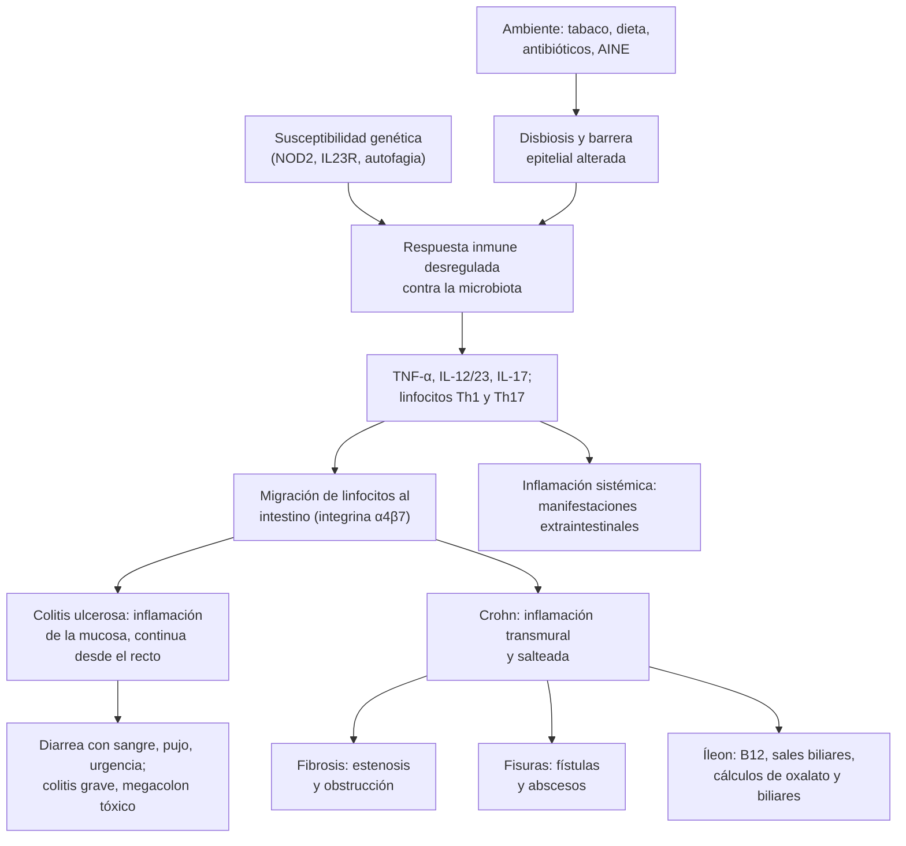

---
tags:
  - Gastroenterología
---

# Enfermedad inflamatoria intestinal: colitis ulcerosa y enfermedad de Crohn

**Subespecialidad**
Gastroenterología · Coloproctología · Atención primaria

**Guías principales**
ACG 2025: colitis ulcerosa del adulto · ACG 2025: enfermedad de Crohn del adulto · ECCO 2022: tratamiento médico de la colitis ulcerosa · ECCO 2024: tratamiento médico de la enfermedad de Crohn · AGA 2024: colitis ulcerosa moderada a grave · ECCO-ESGAR 2019: diagnóstico · ECCO 2023: neoplasias · ECCO 2024: manifestaciones extraintestinales · STRIDE-II 2021: objetivos terapéuticos

**Otras fuentes**
Carga mundial de la EII (GBD 2017) · Criterios de Truelove y Witts (1955) y de Oxford (Travis 1996) · Imágenes en la EII (Rimola 2022) · Registro chileno de 716 pacientes (Simian 2016) · Ley Ricarte Soto

**GES**
No es GES. La **Ley Ricarte Soto** cubre biológicos en la **enfermedad de Crohn grave refractaria** (infliximab o adalimumab) y en la **colitis ulcerosa refractaria** (infliximab, adalimumab o golimumab, desde 2019).

**EUNACOM**
1.06.1.018 Enfermedad inflamatoria intestinal (sospecha, inicial, derivar)

**Revisado**
Octubre 2026

!!! abstract "Resumen en 60 segundos"
    - **Enfermedad inflamatoria intestinal (EII)**: inflamación **crónica** e **inmunomediada** del intestino, con brotes y remisiones. Comienza en **jóvenes** (20–40 años) y está **aumentando en Chile**.
    - **Colitis ulcerosa**: inflamación **continua**, de la **mucosa**, que parte en el **recto**.
        - **Clínica**: **diarrea con sangre**, **pujo** y **urgencia**.
        - Fumar "protege"; la colectomía es curativa.
    - **Enfermedad de Crohn**: inflamación **transmural** y **salteada** de cualquier tramo, sobre todo el **íleon terminal**.
        - **Clínica**: dolor en la fosa ilíaca derecha, diarrea, **baja de peso**, **fístulas**, **estenosis** y **enfermedad perianal**.
        - **Fumar la empeora**.
    - **Sospechar** ante una **diarrea > 4 semanas** con sangre, diarrea nocturna, baja de peso, anemia, fiebre o **enfermedad perianal** en un joven.
    - **Estudio**: PCR, **calprotectina fecal**, **coprocultivo y *C. difficile***. Confirmar con **colonoscopía con ileoscopía y biopsias**. **Entero-RM** o ecografía intestinal para el intestino delgado.
    - **Brote grave de colitis ulcerosa** (**Truelove y Witts**: ≥ 6 deposiciones con sangre + taquicardia, fiebre, anemia o VHS alta):
        - **Hospitalizar**: **corticoides IV**, **heparina profiláctica**, descartar *C. difficile* y CMV, y avisar al cirujano.
        - **Al día 3**, si no responde: **rescate** (infliximab o ciclosporina) o **colectomía**.
    - **Tratamiento**:
        - **Colitis ulcerosa leve a moderada**: **mesalazina** oral más rectal.
        - **Brotes moderados a graves**: corticoides **solo para inducir** (nunca de mantención).
        - **Mantención**: tiopurinas o **terapias avanzadas** (anti-TNF, vedolizumab, ustekinumab, anti-IL-23, inhibidores de JAK, moduladores de S1P).
        - La **mesalazina no sirve en el Crohn**.
    - **Antes de un biológico o un inmunosupresor**: tamizaje de **TBC**, **VHB**, VHC y VIH, y **vacunas**.

## Definición

| Concepto | Definición |
|---|---|
| **Enfermedad inflamatoria intestinal** | Grupo de enfermedades **crónicas**, **inmunomediadas** y recurrentes del tubo digestivo, en personas genéticamente susceptibles. Las dos principales son la colitis ulcerosa y la enfermedad de Crohn |
| **Colitis ulcerosa** | Inflamación **crónica de la mucosa** del **colon**, que compromete el **recto** y se extiende en forma **continua** hacia proximal |
| **Enfermedad de Crohn** | Inflamación **crónica transmural**, **segmentaria** (lesiones salteadas), que puede afectar **cualquier tramo** desde la boca hasta el ano; con frecuencia el **íleon terminal** y el colon |
| **EII no clasificable** | Colitis crónica que no se puede clasificar como colitis ulcerosa ni Crohn tras el estudio completo |
| **Brote** | Reaparición o empeoramiento de los síntomas, con inflamación objetiva (PCR, calprotectina, endoscopía) |
| **Colitis ulcerosa grave aguda** | Brote **grave** según los criterios de **Truelove y Witts**: **≥ 6 deposiciones con sangre al día** y al menos uno de: **FC > 90 lpm**, **T° > 37,8 °C**, **Hb < 10,5 g/dL**, **VHS > 30 mm/h** (o PCR > 30 mg/L) |
| **Megacolon tóxico** | **Dilatación del colon > 6 cm** con **toxicidad sistémica** (fiebre, taquicardia, leucocitosis, compromiso de conciencia, hipotensión) |
| **Corticodependencia** | No se pueden bajar los corticoides por debajo de 10 mg de prednisona en 3 meses sin recaída, o recae antes de 3 meses de suspenderlos |
| **Corticorrefractariedad** | Actividad persistente pese a prednisona hasta 0,75 mg/kg/día por 4 semanas |
| **Remisión profunda** | Remisión clínica **y** endoscópica (curación de la mucosa), objetivo del tratamiento según STRIDE-II |

## Epidemiología

- **En el mundo**: **6,8 millones** de personas con EII en 2017 (GBD 2017). La prevalencia más alta está en Norteamérica y Europa. La incidencia **aumenta** en los países que se industrializan y urbanizan, como los de Latinoamérica.
- **Edad**: pico entre los **15 y 40 años**; un segundo pico menor entre los 60 y 80 años.
- **Sexo**: similar en ambos sexos.
- **Factores de riesgo**:
    - **Antecedente familiar** (el más fuerte): 5–15 % tiene un familiar de primer grado con EII.
    - **Tabaco**: **aumenta** el riesgo y la gravedad del **Crohn**. En la colitis ulcerosa, los **exfumadores** tienen más riesgo.
    - Dieta occidental (ultraprocesados), **antibióticos** en la infancia, **AINE**, vida urbana.
    - Infecciones gastrointestinales previas.

!!! chile "Datos nacionales"
    - **No hay registro nacional poblacional**. La mejor serie es el **registro de 716 pacientes** de un centro de Santiago (Simian 2016):
        - **Colitis ulcerosa 71 %**, **Crohn 27 %** y no clasificable 2 % (razón **2,6:1**, al revés que en los países desarrollados).
        - **58 % mujeres**; mediana de edad al diagnóstico de **29 años**.
        - El **87 %** se diagnosticó entre **2001 y 2015**: aumento sostenido.
        - **Colitis ulcerosa**: **colitis extensa** en el 50 %.
        - **Crohn**: compromiso **colónico** en el 44 %, conducta **no estenosante ni penetrante** en el 80 % y **enfermedad perianal** en el 28 %.
        - **Cirugía**: **5 %** en la colitis ulcerosa frente a **38 %** en el Crohn.
        - **Hospitalización**: 35 % frente a 55 %.
        - **Infección por *C. difficile***: 5 % en ambos grupos.
    - **Ley Ricarte Soto** (Ley 20.850, 2015): cubre el **100 %** de los biológicos garantizados:
        - **infliximab** o **adalimumab** en la **enfermedad de Crohn grave refractaria** al tratamiento habitual;
        - **infliximab** en la **colitis ulcerosa grave refractaria a corticoides**, y **adalimumab** o **golimumab** en la colitis ulcerosa **refractaria al tratamiento habitual** (cuarto decreto, 2019).
        - Se accede con la confirmación diagnóstica y los criterios de inclusión de los protocolos del MINSAL.
    - **No es GES**: el acceso a la colonoscopía, la calprotectina y los especialistas varía según la red.

## Etiología

- **Multifactorial**: una respuesta inmune **desregulada** contra la **microbiota intestinal** en una persona **genéticamente susceptible**, gatillada por **factores ambientales**.
- **Genética**: más de **200 loci** de riesgo. El primero descrito fue ***NOD2*** en el Crohn (reconocimiento bacteriano). Otros: autofagia (*ATG16L1*), vía de la **IL-23** (*IL23R*), barrera epitelial.
- **Microbiota**: menor diversidad (**disbiosis**), menos bacterias productoras de **butirato**.
- **Ambiente**: tabaco, dieta, antibióticos, AINE, estrés (gatillante de brotes), infecciones.
- **Gatillantes de brotes**:
    - **Infecciones**: ***C. difficile***, **CMV** en la colitis grave refractaria, gastroenteritis.
    - **AINE**.
    - **Abandono del tratamiento** (la causa más frecuente).
    - **Tabaco** (Crohn) y estrés.

## Fisiopatología

- **Barrera epitelial alterada**: aumenta la permeabilidad y el contacto de la microbiota con el sistema inmune de la mucosa.
- **Inmunidad innata y adaptativa**:
    - Las células dendríticas y los macrófagos producen **TNF-α**, **IL-12** e **IL-23**.
    - Se activan los linfocitos **Th1** e **IL-17** (Th17) y fallan los linfocitos **T reguladores**.
    - Los linfocitos activados migran al intestino gracias a la integrina **α4β7** (blanco del **vedolizumab**).
- **Por eso funcionan**: los **anti-TNF** (infliximab, adalimumab, golimumab), los **anti-IL-12/23** (ustekinumab) y **anti-IL-23** (risankizumab, guselkumab, mirikizumab), los **anti-integrina** (vedolizumab), los **inhibidores de JAK** (tofacitinib, upadacitinib) y los **moduladores de S1P** (ozanimod, etrasimod), que retienen los linfocitos en los ganglios.
- **Colitis ulcerosa**: inflamación **superficial**. Produce **úlceras de la mucosa**, sangrado y pérdida de la función de absorción del colon (diarrea, urgencia, pujo).
- **Crohn**: inflamación **transmural** que lleva a:
    - **Fibrosis** → **estenosis** y obstrucción intestinal.
    - **Fisuras profundas** → **fístulas** (enteroentéricas, enterocutáneas, enterovesicales, perianales) y **abscesos**.
    - **Íleon terminal** comprometido o resecado:
        - malabsorción de **B12**;
        - malabsorción de **sales biliares**: diarrea y **cálculos biliares**;
        - **hiperoxaluria entérica**: cálculos renales de oxalato.

*Figura 1. Fisiopatología de la enfermedad inflamatoria intestinal. Esquema propio.*

## Clasificación

<figure markdown>
![Esquema comparativo de la colitis ulcerosa y la enfermedad de Crohn. A la izquierda, un colon en forma de U invertida con la inflamación de la colitis ulcerosa continua desde el recto hacia proximal, solo de la mucosa y solo del colon, con tres tonos según la clasificación de Montreal: E1 proctitis en el recto, E2 izquierda hasta el ángulo esplénico y E3 extensa más allá del ángulo esplénico. A la derecha, un colon con parches salteados de inflamación en el colon derecho, el transverso y el descendente, el íleon terminal comprometido, que es lo más afectado, y una fístula perianal; lesiones salteadas y transmurales desde la boca al ano, con el recto a menudo respetado. Abajo, una tabla compara ambas: extensión continua del recto y colon frente a cualquier tramo, sobre todo íleon terminal y colon, en forma salteada; profundidad mucosa frente a transmural con fístulas, abscesos y estenosis; clínica de diarrea con sangre, pujo y urgencia frente a dolor en fosa ilíaca derecha, diarrea, baja de peso y masa; enfermedad perianal ausente frente a presente; endoscopía con eritema, friabilidad y úlceras superficiales frente a aftas, úlceras longitudinales y empedrado; histología con abscesos de criptas y distorsión frente a granulomas no caseificantes en un tercio; el tabaco protege en la colitis ulcerosa y empeora el Crohn; la colectomía es curativa en la colitis ulcerosa pero no en el Crohn, que recurre en la anastomosis](../assets/figuras/eii/colitis-ulcerosa-vs-crohn.svg){ loading=lazy }
<figcaption>Figura 2. Colitis ulcerosa y enfermedad de Crohn: distribución y diferencias. Esquema propio basado en la clasificación de Montreal y en las guías ECCO y ACG.</figcaption>
</figure>

**Clasificación de Montreal**:

| Colitis ulcerosa: extensión (E) | Crohn: edad (A) | Crohn: localización (L) | Crohn: conducta (B) |
|---|---|---|---|
| **E1**: proctitis (solo recto) | **A1**: ≤ 16 años | **L1**: íleon terminal | **B1**: inflamatoria (no estenosante ni penetrante) |
| **E2**: colitis izquierda (hasta el ángulo esplénico) | **A2**: 17–40 años | **L2**: colon | **B2**: estenosante |
| **E3**: colitis extensa (más allá del ángulo esplénico) | **A3**: > 40 años | **L3**: ileocolónica | **B3**: penetrante (fístulas, abscesos) |
| | | **L4**: tubo digestivo alto (se suma a L1–L3) | **p**: enfermedad perianal (se agrega) |

**Gravedad de la colitis ulcerosa** (Truelove y Witts):

| Variable | Leve | Moderada | **Grave** |
|---|---|---|---|
| Deposiciones con sangre al día | < 4 | 4–6 | **≥ 6** |
| Frecuencia cardíaca | Normal | Intermedia | **> 90 lpm** |
| Temperatura | Normal | Intermedia | **> 37,8 °C** |
| Hemoglobina | Normal | Intermedia | **< 10,5 g/dL** |
| VHS (o PCR) | < 20 mm/h (normal) | ≤ 30 mm/h | **> 30 mm/h** (PCR > 30 mg/L) |

- **Grave** = ≥ 6 deposiciones con sangre **más al menos un** signo sistémico.
- **Score de Mayo** (en la consulta y los ensayos): frecuencia de deposiciones, sangrado, endoscopía y evaluación global (0–12). La **subescala endoscópica de Mayo** (0–3) mide la inflamación de la mucosa.
- **Crohn**: el **índice de Harvey-Bradshaw** (bienestar, dolor, deposiciones líquidas, masa, complicaciones) es simple: **< 5 remisión**, 5–7 leve, 8–16 moderada, > 16 grave.

## Clínica

- **Colitis ulcerosa**:
    - **Diarrea con sangre** y mucus, **urgencia**, **pujo** y **tenesmo**, deposiciones nocturnas.
    - En la **proctitis** puede haber **constipación** con sangre y mucus.
    - En los brotes graves: **fiebre**, **taquicardia**, **dolor abdominal**, baja de peso, **anemia**, hipoalbuminemia.
- **Enfermedad de Crohn**:
    - **Dolor abdominal** (a menudo en la **fosa ilíaca derecha**), **diarrea** (con o sin sangre), **baja de peso**, fatiga, **fiebre** baja.
    - **Masa** en la fosa ilíaca derecha (asas engrosadas o absceso).
    - **Obstrucción intestinal** por estenosis: dolor cólico posprandial, distensión, vómitos.
    - **Fístulas**: neumaturia y fecaluria (enterovesical), salida de contenido intestinal por la piel (enterocutánea), diarrea por asa ciega (enteroentérica).
    - **Enfermedad perianal**: fístulas, abscesos, fisuras **atípicas** (laterales, múltiples, indoloras), pliegues cutáneos.
    - **Retraso del crecimiento** en los niños.
    - Puede simular una **apendicitis** (ileítis aguda).
- **Manifestaciones extraintestinales** (ECCO 2024):

| Grupo | Manifestación | ¿Sigue la actividad intestinal? |
|---|---|---|
| **Articulares** (las más frecuentes) | **Artritis periférica** de grandes articulaciones (tipo 1, < 5 articulaciones) | **Sí** |
| | Artritis de pequeñas articulaciones (tipo 2), **espondiloartritis axial** (sacroileítis) | No |
| **Piel** | **Eritema nodoso** | **Sí** |
| | **Pioderma gangrenoso** | A menudo no |
| **Ojos** | **Epiescleritis** | **Sí** |
| | **Uveítis anterior** (urgencia oftalmológica) | No |
| **Hígado y vía biliar** | **Colangitis esclerosante primaria** (sobre todo en la colitis ulcerosa; riesgo de colangiocarcinoma y cáncer colorrectal), **colelitiasis** (Crohn ileal) | No |
| **Otras** | **Tromboembolismo venoso** (2–3 veces más, sobre todo en los brotes y hospitalizados), **anemia** (ferropénica, de enfermedad crónica, por B12), **osteoporosis**, **cálculos renales** de oxalato, aftas orales | Variable |

!!! alarma "Signos de alarma: hospitalizar o derivar de urgencia"
    - **Colitis grave** (Truelove y Witts): **≥ 6 deposiciones con sangre** al día con **taquicardia**, **fiebre**, **anemia** o VHS o PCR altas.
    - **Megacolon tóxico**: distensión abdominal, dolor, toxicidad sistémica y **colon > 6 cm** en la radiografía. Riesgo de **perforación**.
    - **Peritonitis** o **perforación**: dolor intenso, defensa, aire libre.
    - **Hemorragia digestiva** masiva.
    - **Obstrucción intestinal** (Crohn estenosante).
    - **Absceso** intraabdominal o perianal: fiebre, dolor, masa.
    - **Fiebre en un paciente con inmunosupresores o biológicos**: infecciones oportunistas, TBC.
    - **Uveítis**: ojo rojo doloroso con fotofobia y visión borrosa.

## Diagnóstico

!!! guia "Diagnóstico de la EII (ECCO-ESGAR 2019; ACG 2025)"
    - **No hay un examen único**: el diagnóstico combina la **clínica**, el **laboratorio**, la **endoscopía**, la **histología** y las **imágenes**, tras descartar las **infecciones**.
    - **Descartar infecciones** en todo brote o debut: **coprocultivo**, **toxina o PCR de *C. difficile***, parasitológico y, según el contexto, CMV.
    - **Ileocolonoscopía** con **biopsias** de cada segmento (incluidos el recto y el íleon terminal): el examen clave.
    - **Calprotectina fecal**: distingue la inflamación intestinal de los trastornos funcionales y sirve para seguir la actividad.
    - **Crohn**: evaluar **todo el intestino delgado** con **entero-RM** o **ecografía intestinal** (o entero-TC). **Cápsula endoscópica** si no hay estenosis. **RM de pelvis** para las **fístulas perianales**. Endoscopía alta según los síntomas.
    - **En el brote grave**: **rectosigmoidoscopía** flexible (la colonoscopía completa tiene riesgo de perforación) con biopsias para **CMV**.

- **Endoscopía**:
    - **Colitis ulcerosa**: compromiso **continuo** desde el recto, **eritema**, pérdida del **patrón vascular**, **friabilidad**, erosiones y **úlceras superficiales**; seudopólipos en la enfermedad de larga data.
    - **Crohn**: **úlceras aftosas**, **úlceras longitudinales** o serpiginosas, aspecto en **"empedrado"**, lesiones **salteadas** con mucosa normal entre ellas, **estenosis**, recto a menudo respetado.
- **Histología**:
    - **Inflamación crónica**: **distorsión de la arquitectura** de las criptas y plasmocitosis basal. La distingue de una colitis infecciosa aguda.
    - **Colitis ulcerosa**: **abscesos de criptas**, depleción de mucina.
    - **Crohn**: **granulomas no caseificantes** (en ~1/3), inflamación transmural.
- **Serología** (pANCA, ASCA): poco sensible; **no** se usa para el diagnóstico.

<figure markdown>
![Tres cortes axiales de una entero-resonancia de pelvis en un paciente con enfermedad de Crohn. Panel A: imagen ponderada en T1 con saturación grasa tras el contraste, con un asa de íleon de pared engrosada y realce intenso (flecha), comparada con el grosor normal de los segmentos no afectados (punta de flecha). Panel B: el mismo segmento en T2 con saturación grasa, con aumento de la señal de la pared por edema (flechas) y un fino halo de líquido alrededor del íleon. Panel C: en la parte proximal del mismo segmento, ulceraciones que se ven como pequeñas interrupciones de la superficie interna de la pared engrosada (punta de flecha)](../assets/figuras/eii/entero-rm-crohn-rimola-2022.jpg){ loading=lazy }
<figcaption>Figura 3. Enfermedad de Crohn del íleon en la entero-RM. (A) T1 con contraste: engrosamiento y realce de la pared (flecha) frente a un asa normal (punta de flecha). (B) T2: edema de la pared y líquido alrededor del asa. (C) Úlceras en la pared engrosada (punta de flecha). Fuente: Rimola J, Torres J, Kumar S, Taylor SA, Kucharzik T. Recent advances in clinical practice: advances in cross-sectional imaging in inflammatory bowel disease. <em>Gut.</em> 2022;71(12):2587–2597, figura 2. Licencia <a href="https://creativecommons.org/licenses/by-nc/4.0/">CC BY-NC 4.0</a>.</figcaption>
</figure>

## Laboratorio

| Examen | Para qué | Hallazgo típico |
|---|---|---|
| **Hemograma** | Actividad y complicaciones | **Anemia** (ferropénica o de enfermedad crónica), leucocitosis, **trombocitosis** reactiva |
| **PCR, VHS** | Actividad (más útil en el Crohn) | Elevadas en el brote; una PCR **> 45 mg/L al día 3** del brote grave predice colectomía |
| **Albúmina** | Gravedad y estado nutritivo | Baja en el brote grave |
| **Electrolitos, magnesio, función renal** | Diarrea grave | **Hipokalemia**, hipomagnesemia, falla prerrenal |
| **Ferritina, saturación de transferrina, B12, folato, vitamina D** | Déficits | Ferropenia; **B12 baja** en el Crohn ileal |
| **Pruebas hepáticas** | Colangitis esclerosante, hepatotoxicidad | **Fosfatasa alcalina y GGT altas** (colangitis esclerosante) |
| **Calprotectina fecal** | Inflamación intestinal | Normal **< 50 µg/g**; muy alta en la EII activa; útil para el seguimiento |
| **Coprocultivo, toxina o PCR de *C. difficile*, parasitológico** | Descartar infección | Negativos (si son positivos, tratar y reevaluar) |
| **Biopsia para CMV** (inmunohistoquímica o PCR en tejido) | Colitis grave refractaria a corticoides | Positiva: ganciclovir |
| **Antes de inmunosupresores y biológicos** | Seguridad | **IGRA o PPD** y radiografía de tórax (TBC latente), **HBsAg, anti-HBc, anti-HBs**, VHC, VIH, **varicela**; **TPMT** (o NUDT15) antes de las tiopurinas |

## Imágenes

- **Radiografía simple de abdomen**: en el brote grave, para buscar un **megacolon tóxico** (colon transverso **> 6 cm**) o aire libre.
- **TC de abdomen y pelvis con contraste**: en la urgencia (sospecha de **absceso**, **perforación**, **obstrucción**).
- **Entero-RM** (sin radiación, de elección en los jóvenes) y **entero-TC**: extensión y actividad del Crohn del intestino delgado, **estenosis**, **fístulas** (figura 3).
- **Ecografía intestinal**: engrosamiento de la pared (> 3 mm), vascularización con Doppler; útil y repetible para el seguimiento.
- **RM de pelvis**: **fístulas perianales** y abscesos.
- **Colangio-RM**: si se sospecha una **colangitis esclerosante primaria** (fosfatasa alcalina alta).
- **Densitometría ósea**: con corticoides prolongados o malabsorción.

## Diagnóstico diferencial

| Pista | Pensar en |
|---|---|
| Diarrea con sangre de **< 4 semanas**, fiebre, contactos o viaje | **Colitis infecciosa** (*Shigella*, *Campylobacter*, *Salmonella*, *E. coli* productora de Shiga, amebiasis) ([ver diarrea aguda](diarrea-aguda-y-clostridioides-difficile.md)) |
| Diarrea tras **antibióticos** u hospitalización | ***C. difficile*** (también complica la EII) |
| Adulto mayor con **dolor súbito** y rectorragia, factores vasculares | **Colitis isquémica** |
| Antecedente de **radioterapia** pélvica | **Proctitis actínica** |
| Uso de **AINE** | **Enteropatía o colitis por AINE** |
| Ileítis o masa en la fosa ilíaca derecha con fiebre | **Apendicitis** o absceso apendicular; **TBC intestinal** (ileocecal); *Yersinia* |
| **TBC intestinal** | Ileocecal, granulomas **caseificantes**, ascitis, radiografía de tórax alterada; **descartarla antes de los anti-TNF** |
| Diarrea acuosa crónica **sin sangre**, mucosa normal | **Colitis microscópica**, **intestino irritable** (calprotectina normal) ([ver diarrea crónica](constipacion-intestino-irritable-y-diarrea-cronica.md)) |
| Rectorragia, baja de peso y cambio del hábito en > 50 años | **Cáncer colorrectal** |
| Úlceras orales y genitales, uveítis, úlceras ileocecales | **Enfermedad de Behçet** |
| Inmunosuprimido con diarrea y úlceras | **CMV**, otras infecciones oportunistas |
| Proctitis en hombres que tienen sexo con hombres | **ITS** (gonorrea, clamidia, linfogranuloma venéreo, sífilis, herpes) |

## Tratamiento

!!! guia "Principios del tratamiento (ACG 2025; ECCO 2022 y 2024; AGA 2024; STRIDE-II)"
    - **Objetivo "treat to target"**:
        - **A corto plazo**: respuesta y **remisión clínica**.
        - **A mediano plazo**: normalizar la **PCR** y la **calprotectina**.
        - **A largo plazo**: **curación endoscópica** de la mucosa.
    - **Inducir** la remisión y luego **mantenerla**. Los **corticoides** sirven **solo para inducir**: **nunca** de mantención.
    - **Colitis ulcerosa leve a moderada**: **mesalazina (5-ASA)**, oral más **rectal**.
    - **Colitis ulcerosa moderada a grave** (AGA 2024): iniciar **temprano** una **terapia avanzada** (con o sin inmunomodulador), en vez de escalar en forma lenta después de fallar la mesalazina.
        - **Anti-TNF**: infliximab, adalimumab, golimumab.
        - **Vedolizumab**.
        - **Ustekinumab**, risankizumab, guselkumab, mirikizumab.
        - **Inhibidores de JAK**: tofacitinib, upadacitinib, filgotinib.
        - **Moduladores de S1P**: ozanimod, etrasimod.
        - Los anti-TNF se combinan con una **tiopurina** (más eficacia, menos anticuerpos).
    - **Crohn**: **budesonida** en la enfermedad ileocecal leve. En la moderada a grave, **corticoides** para inducir y **terapia avanzada** (anti-TNF, ustekinumab, risankizumab, vedolizumab, upadacitinib) para mantener. Las **tiopurinas** y el **metotrexato** sirven de mantención o de combinación. **La mesalazina no es eficaz en el Crohn**.
    - **Dejar de fumar** en el Crohn.
    - **Antes de inmunosupresores o biológicos**: tamizaje de **TBC**, **VHB**, VHC, VIH y varicela; **vacunar**:
        - **Inactivadas**: influenza, neumococo, VHB, VPH y **zóster recombinante**.
        - **Vivas**: **evitarlas** durante la inmunosupresión.

### Colitis ulcerosa

- **Proctitis (E1)**: **supositorios de mesalazina 1 g/noche** (más eficaces que la vía oral).
- **Colitis izquierda o extensa, leve a moderada**:
    - **Mesalazina oral** (2–4,8 g/día) **más enema** de mesalazina.
    - Si no responde: **budesonida MMX** o **prednisona** oral.
- **Moderada a grave o corticodependiente**:
    - **Prednisona 40 mg/día** con descenso gradual para inducir.
    - **Mantención**: **terapia avanzada** (preferir las de mayor eficacia, AGA 2024) o una **tiopurina** (azatioprina) si la remisión se logró con corticoides.
    - **Derivar** a gastroenterología.
- **Brote grave** (figura 4):
    - **Hospitalizar**.
    - **Metilprednisolona 60 mg/día IV** (o hidrocortisona 100 mg cada 6 h).
    - **Heparina de bajo peso molecular profiláctica** (el riesgo de trombosis supera el de sangrado).
    - Descartar ***C. difficile*** y **CMV**.
    - Evaluar con el **cirujano** desde el ingreso.
    - **Día 3**: si persisten **> 8 deposiciones**, o **3–8 con PCR > 45 mg/L**, el **85 %** termina en colectomía (Travis 1996). Usar un **rescate** con **infliximab** o **ciclosporina**, y hacer la **colectomía** si no responde en 4–7 días.
- **Cirugía**: **proctocolectomía con reservorio ileal** (anastomosis ileoanal). Se indica en:
    - la colitis **refractaria** o el **brote grave sin respuesta**;
    - el **megacolon tóxico**, la **perforación** o la **hemorragia**;
    - la **displasia** o el **cáncer**.

<figure markdown>
![Algoritmo del brote grave de colitis ulcerosa en el hospital. Arriba, los criterios de Truelove y Witts: 6 o más deposiciones con sangre al día más al menos uno de frecuencia cardíaca mayor de 90, temperatura mayor de 37,8 grados, hemoglobina menor de 10,5 g/dL o VHS mayor de 30 mm/h o PCR mayor de 30 mg/L; hospitalizar. Al ingreso, estudio: hemograma, PCR, albúmina, electrolitos con potasio y magnesio, función renal, coprocultivo y toxina de Clostridioides difficile, radiografía de abdomen para buscar megacolon tóxico con colon mayor de 6 cm, rectosigmoidoscopía flexible con biopsias para CMV y, antes de un biológico, IGRA o PPD, radiografía de tórax, VHB, VHC y VIH. Al ingreso, tratamiento: metilprednisolona 60 mg al día IV o hidrocortisona 100 mg cada 6 horas, profilaxis de trombosis con heparina de bajo peso molecular, hidratación, corregir potasio y magnesio, transfundir si la hemoglobina es menor de 8, suspender AINE, opioides, anticolinérgicos y loperamida, nutrición oral o enteral sin ayuno de rutina y avisar al cirujano desde el primer día. Al día 3, criterios de Oxford: más de 8 deposiciones al día, o 3 a 8 con PCR mayor de 45 mg/L, predicen colectomía en cerca del 85 % si se sigue igual. Si responde: pasar a prednisona oral con descenso gradual e iniciar la mantención con tiopurina o terapia avanzada según el especialista. Si no responde: terapia de rescate con infliximab 5 mg/kg IV o ciclosporina 2 mg/kg al día IV, y colectomía sin retraso si no hay respuesta en 4 a 7 días. Cirugía urgente en cualquier momento si hay megacolon tóxico que no mejora, perforación o hemorragia masiva](../assets/figuras/eii/colitis-ulcerosa-grave.svg){ loading=lazy }
<figcaption>Figura 4. Manejo hospitalario del brote grave de colitis ulcerosa. Esquema propio basado en Truelove y Witts (1955), Travis (1996), ECCO 2022 y ACG 2025.</figcaption>
</figure>

### Enfermedad de Crohn

- **Leve, ileocecal**: **budesonida 9 mg/día** por 8 semanas y luego descenso.
- **Moderada a grave**:
    - **Inducción**: **prednisona** (40 mg/día con descenso) o, de preferencia en los de alto riesgo, una **terapia avanzada** precoz.
    - **Mantención**: **anti-TNF** (infliximab, adalimumab), solo o **combinado con azatioprina**; **ustekinumab**, **risankizumab**, **vedolizumab**, **upadacitinib**; **metotrexato** o tiopurinas en casos seleccionados.
- **Factores de mal pronóstico** que justifican un tratamiento intensivo precoz:
    - diagnóstico a una **edad joven**;
    - compromiso **extenso**, **perianal** o del tubo digestivo alto;
    - **úlceras profundas**;
    - **estenosis** o **fístulas**;
    - **tabaquismo**.
- **Enfermedad perianal fistulizante**:
    - **Drenaje** quirúrgico del absceso y **setón**.
    - **Antibióticos** (metronidazol o ciprofloxacino).
    - **Anti-TNF** (infliximab).
- **Estenosis**: dilatación endoscópica con balón (si es corta) o **cirugía** (resección o estricturoplastía).
- **Cirugía**: en las **complicaciones** (obstrucción, absceso, fístula, perforación, hemorragia) o la enfermedad **refractaria**. La **resección ileocecal** es una alternativa a los biológicos en el Crohn **ileal limitado** (ensayo LIR!C). **No es curativa**: la enfermedad recurre en la **anastomosis**, por lo que se indica una colonoscopía a los **6–12 meses**.
- **Abscesos intraabdominales**: **antibióticos** y **drenaje percutáneo** antes de iniciar o intensificar los inmunosupresores.

### Medidas generales

- **Educación** y **adherencia**: el abandono del tratamiento es la causa más frecuente de brotes.
- **Evitar los AINE** (gatillan brotes); el paracetamol es seguro.
- **Ferropenia**: **hierro IV** si la anemia es moderada o hay inflamación activa (el hierro oral se absorbe mal y empeora los síntomas).
- **Suplementar** el calcio y la vitamina D en los tratados con corticoides; B12 en el Crohn ileal o resecado.
- **Nutrición**: no hay una dieta que cure la EII; evitar los ultraprocesados. En el **Crohn estenosante**, dieta **baja en residuos**. La **nutrición enteral exclusiva** induce remisión en los niños con Crohn.
- **Salud mental**: la ansiedad y la depresión son frecuentes.
- **Embarazo**: planificarlo en **remisión**. La mayoría de los fármacos se pueden mantener, excepto el **metotrexato** (teratogénico; suspenderlo 3–6 meses antes).

!!! dosis "Dosis de referencia (adulto)"
    | Fármaco | Dosis | Comentario |
    |---|---|---|
    | **Mesalazina oral** | **2–4,8 g/día** (inducción); **≥ 2 g/día** (mantención), en 1 dosis diaria | Colitis ulcerosa leve a moderada. Controlar la **creatinina** (nefritis intersticial) |
    | **Mesalazina rectal** | **Supositorio 1 g/noche** (proctitis); **enema 1–4 g/noche** (colitis izquierda) | Combinar con la vía oral en la colitis izquierda o extensa |
    | **Budesonida MMX** | **9 mg/día** por 8 semanas | Colitis ulcerosa leve a moderada que no responde a la mesalazina |
    | **Budesonida de liberación ileal** | **9 mg/día** por 8 semanas y luego descenso | Crohn ileocecal leve a moderado |
    | **Prednisona** | **40 mg/día** (hasta 1 mg/kg, máx. 60 mg) por 1–2 semanas; bajar **5 mg por semana** hasta 20 mg y luego 2,5 mg por semana | Brote moderado a grave. Calcio, vitamina D; vigilar la glicemia |
    | **Metilprednisolona IV** | **60 mg/día** (o hidrocortisona **100 mg cada 6 h**) | Brote grave hospitalizado; evaluar al día 3 |
    | **Azatioprina** | **2–2,5 mg/kg/día** | Mantención. **TPMT** antes; hemograma y pruebas hepáticas; riesgo de linfoma y cáncer de piel |
    | **Metotrexato** | **25 mg SC o IM semanal** (inducción); **15 mg semanal** (mantención) + ácido fólico | Crohn. **Teratogénico** |
    | **Infliximab** | **5 mg/kg IV** a las semanas 0, 2 y 6, luego **cada 8 semanas** | Tamizaje de TBC y VHB antes. Rescate en el brote grave |
    | **Adalimumab** | **160 mg SC** (semana 0), **80 mg** (semana 2) y luego **40 mg cada 2 semanas** | Tamizaje de TBC y VHB antes |
    | **Vedolizumab** | **300 mg IV** a las semanas 0, 2 y 6, luego **cada 8 semanas** | Acción selectiva en el intestino |
    | **Ciclosporina IV** | **2 mg/kg/día** en infusión continua | Rescate del brote grave. Vigilar la presión, la función renal, el magnesio y los niveles |
    | **Enoxaparina** | **40 mg SC al día** | Profilaxis de TVP en todo hospitalizado con brote, aunque tenga rectorragia |

## Complicaciones

| Complicación | Comentario |
|---|---|
| **Megacolon tóxico** y **perforación** | Colitis grave; mortalidad alta si se perfora. Evitar los opioides, los anticolinérgicos y la loperamida |
| **Hemorragia digestiva** | Más en la colitis ulcerosa ([ver HDB](hemorragia-digestiva-baja.md)) |
| **Estenosis, obstrucción, fístulas, abscesos** | Crohn (transmural) |
| **Cáncer colorrectal** | Riesgo según la **extensión**, la **duración** (> 8–10 años), la inflamación persistente, la **colangitis esclerosante** y la historia familiar |
| **Colangitis esclerosante primaria** | Colestasia; riesgo de colangiocarcinoma y cáncer de colon |
| **Tromboembolismo venoso** | Riesgo 2–3 veces mayor; profilaxis en los hospitalizados |
| **Infecciones** | ***C. difficile***, **CMV**, TBC y oportunistas con los inmunosupresores |
| **Desnutrición, anemia, osteoporosis** | Inflamación, malabsorción, corticoides |
| **Cálculos biliares y renales** | Crohn ileal o resecado |
| **Efectos adversos de los fármacos** | Corticoides (infecciones, diabetes, osteoporosis, Cushing), **tiopurinas** (mielotoxicidad, pancreatitis, linfoma, cáncer de piel), **anti-TNF** (TBC, infecciones, lupus inducido, psoriasis paradójica), metotrexato (hepatotoxicidad, teratogenia), mesalazina (nefritis intersticial) |
| **Pouchitis** | Inflamación del reservorio ileal tras la colectomía; responde a los antibióticos |

## Pronóstico y seguimiento

- **Enfermedad crónica** con brotes y remisiones. Con los tratamientos actuales, la **expectativa de vida es casi normal**.
- **Colitis ulcerosa**: alrededor del 10–15 % requiere una colectomía a lo largo de su vida (5 % en la serie chilena). La proctitis puede extenderse.
- **Crohn**: tiende a progresar desde la forma **inflamatoria** a la **estenosante o penetrante**. Entre un tercio y la mitad requiere cirugía en 10 años (38 % en la serie chilena). El **tratamiento precoz y eficaz** cambia la historia natural.
- **Seguimiento** por gastroenterología:
    - **Síntomas**, **PCR** y **calprotectina** cada 3–6 meses.
    - **Endoscopía** para confirmar la curación de la mucosa.
    - **Exámenes de seguridad** según el fármaco.
- **Vigilancia del cáncer colorrectal** (ECCO 2023):
    - **Colonoscopía a los 8 años** del inicio de los síntomas en la colitis ulcerosa (salvo la proctitis aislada) y en el Crohn con compromiso colónico.
    - Luego cada **1–5 años** según el riesgo.
    - En la **colangitis esclerosante primaria**: **anual** desde el diagnóstico.
- **Prevención**: vacunas, densitometría, piel (cáncer de piel con las tiopurinas), Papanicolaou al día (VPH con inmunosupresión).
- **Derivar a gastroenterología** a todo paciente con sospecha de EII para confirmar el diagnóstico y definir el tratamiento de mantención. **Hospitalizar** el brote grave.

## Perlas para el internado

!!! perla "Para recordar en la sala"
    - **Diarrea con sangre > 4 semanas en un joven = pensar en una EII**. Pide coprocultivo, *C. difficile*, PCR y calprotectina, y deriva para una colonoscopía.
    - **Fisura anal atípica, fístula o absceso perianal recurrente en un joven = descartar un Crohn**.
    - **Todo brote: descarta *C. difficile*** (y CMV si es grave y no responde a los corticoides).
    - **Brote grave = hospitalizar**: corticoides IV, **heparina profiláctica aunque sangre**, potasio y magnesio, sin opioides ni loperamida, y cirujano desde el día 1.
    - **Día 3 del brote grave**: cuenta las deposiciones y mide la PCR. Si no responde, rescate o colectomía; **no esperes más**.
    - **Distensión abdominal en un brote grave = radiografía de abdomen** (megacolon tóxico: colon > 6 cm).
    - **Los corticoides inducen, no mantienen**. Un paciente que no puede bajar la prednisona necesita otra terapia.
    - **La mesalazina no sirve en el Crohn**; el **tabaco empeora el Crohn**.
    - **Antes de un anti-TNF: TBC latente (IGRA o PPD + radiografía) y VHB**.
    - **Sin AINE** en la EII: usa paracetamol.

## Preguntas de repaso

??? repaso "1. Mujer de 24 años con 6 semanas de diarrea con sangre y mucus, 5 veces al día, urgencia y pujo. Sin fiebre, FC 82 lpm, Hb 12,1 g/dL. ¿Cómo la estudia y qué sospecha?"
    - Sospechar una **colitis ulcerosa** (diarrea con sangre > 4 semanas, urgencia, pujo). Por ahora sin criterios de gravedad (Truelove y Witts).
    - **Estudio**:
        - **Coprocultivo**, **toxina o PCR de *C. difficile*** y parasitológico, para descartar una infección.
        - Hemograma, **PCR**, albúmina, ferritina y **calprotectina fecal**.
    - **Derivar** para una **colonoscopía con ileoscopía y biopsias**, que confirma el diagnóstico y la extensión (Montreal).
    - Si se confirma una colitis leve a moderada: **mesalazina oral + rectal**.

??? repaso "2. Hombre de 32 años con colitis ulcerosa extensa que consulta con 9 deposiciones con sangre al día, FC 108 lpm, T° 38,1 °C, Hb 9,8 g/dL y PCR 92 mg/L. ¿Qué hace?"
    - **Brote grave** (Truelove y Witts): **hospitalizar**.
    - **Estudio**:
        - Hemograma, PCR, albúmina, electrolitos (K, Mg) y función renal.
        - ***C. difficile*** y coprocultivo.
        - **Radiografía de abdomen** (megacolon tóxico).
        - **Rectosigmoidoscopía** con biopsias (CMV).
        - Tamizaje de **TBC y VHB** por si necesita un rescate.
    - **Tratamiento**:
        - **Metilprednisolona 60 mg/día IV**.
        - **Enoxaparina profiláctica**.
        - Hidratación y corrección de K y Mg.
        - **Suspender** los AINE, los opioides y los antidiarreicos.
        - **Evaluación por cirugía**.
    - **Día 3**: si persisten > 8 deposiciones (o 3–8 con PCR > 45 mg/L), **rescate** con infliximab o ciclosporina; **colectomía** si no responde.

??? repaso "3. Hombre de 22 años, fumador, con 4 meses de dolor en la fosa ilíaca derecha, diarrea sin sangre, baja de 6 kg y una fístula perianal. Hb 11 g/dL, PCR 38 mg/L. ¿Qué sospecha y cómo lo estudia?"
    - **Enfermedad de Crohn** ileal (o ileocolónica) con **enfermedad perianal**.
    - **Estudio**:
        - Descartar infecciones (coprocultivo, *C. difficile*, parasitológico).
        - **Calprotectina**, ferritina y B12.
        - **Ileocolonoscopía con biopsias** (granulomas no caseificantes).
        - **Entero-RM** (extensión, estenosis, fístulas).
        - **RM de pelvis** (fístula y abscesos).
    - **Descartar la TBC intestinal** (ileocecal) antes de inmunosuprimir.
    - **Dejar de fumar**.
    - **Derivar** a gastroenterología y coloproctología. Por la enfermedad perianal y su edad, tiene **factores de mal pronóstico**: probablemente necesitará un **anti-TNF** precoz (más drenaje y setón de la fístula).

??? repaso "4. Paciente con colitis ulcerosa que va a iniciar infliximab. ¿Qué exámenes y medidas indica antes?"
    - **TBC latente**: **IGRA o PPD** y **radiografía de tórax**. Si es positiva, tratar la TBC latente antes o junto con el inicio, según la norma.
    - **Virus**:
        - **VHB**: HBsAg, anti-HBc y anti-HBs. Profilaxis antiviral si el HBsAg o el anti-HBc son positivos, según el caso.
        - **VHC** y **VIH**.
        - **Varicela** (serología si no hay antecedente).
    - **Vacunas inactivadas**: influenza, neumococo, VHB, VPH, zóster recombinante. **Evitar las vacunas vivas** una vez inmunosuprimido.
    - **Educar** sobre las infecciones y el control de la fiebre.

??? repaso "5. Mujer de 45 años con colitis ulcerosa que necesitó 3 cursos de prednisona en el último año y recae cada vez que baja de 10 mg. ¿Qué significa y qué corresponde?"
    - **Corticodependencia**: los corticoides **no son un tratamiento de mantención** y su uso repetido trae efectos adversos graves (osteoporosis, diabetes, infecciones, cataratas).
    - **Derivar** para escalar a un tratamiento de **mantención** eficaz:
        - **terapia avanzada** (anti-TNF con o sin tiopurina, vedolizumab, ustekinumab, anti-IL-23, inhibidores de JAK o moduladores de S1P);
        - o **tiopurina** (azatioprina) si la remisión se logró con corticoides.
    - Medir la actividad con calprotectina y colonoscopía.
    - Densitometría ósea; calcio y vitamina D.
    - Puede acceder a biológicos con cobertura de la **Ley Ricarte Soto** si cumple los criterios.

??? repaso "6. ¿Qué manifestaciones extraintestinales de la EII siguen la actividad intestinal y cuáles no?"
    - **Siguen la actividad** (mejoran al tratar el brote):
        - **Artritis periférica** de grandes articulaciones (tipo 1).
        - **Eritema nodoso**.
        - **Epiescleritis**.
        - Aftas orales.
    - **Independientes de la actividad**:
        - **Espondiloartritis axial** (sacroileítis).
        - **Uveítis anterior** (urgencia oftalmológica).
        - **Colangitis esclerosante primaria**.
        - **Pioderma gangrenoso** (a menudo).
    - Además: **tromboembolismo venoso**, anemia, osteoporosis y cálculos biliares y renales (Crohn ileal).

## Referencias

1. Rubin DT, Ananthakrishnan AN, Siegel CA, et al. ACG clinical guideline update: ulcerative colitis in adults. *Am J Gastroenterol.* 2025;120(6):1187–1224. doi:[10.14309/ajg.0000000000003463](https://doi.org/10.14309/ajg.0000000000003463)
2. Lichtenstein GR, Loftus EV, Afzali A, et al. ACG clinical guideline: management of Crohn's disease in adults. *Am J Gastroenterol.* 2025;120(6):1225–1264. doi:[10.14309/ajg.0000000000003465](https://doi.org/10.14309/ajg.0000000000003465)
3. Raine T, Bonovas S, Burisch J, et al. ECCO guidelines on therapeutics in ulcerative colitis: medical treatment. *J Crohns Colitis.* 2022;16(1):2–17. doi:[10.1093/ecco-jcc/jjab178](https://doi.org/10.1093/ecco-jcc/jjab178)
4. Gordon H, Minozzi S, Kopylov U, et al. ECCO guidelines on therapeutics in Crohn's disease: medical treatment. *J Crohns Colitis.* 2024;18(10):1531–1555. doi:[10.1093/ecco-jcc/jjae091](https://doi.org/10.1093/ecco-jcc/jjae091)
5. Singh S, Loftus EV Jr, Limketkai BN, et al. AGA living clinical practice guideline on pharmacological management of moderate-to-severe ulcerative colitis. *Gastroenterology.* 2024;167(7):1307–1343. doi:[10.1053/j.gastro.2024.10.001](https://doi.org/10.1053/j.gastro.2024.10.001)
6. Maaser C, Sturm A, Vavricka SR, et al. ECCO-ESGAR guideline for diagnostic assessment in IBD part 1: initial diagnosis, monitoring of known IBD, detection of complications. *J Crohns Colitis.* 2019;13(2):144–164. doi:[10.1093/ecco-jcc/jjy113](https://doi.org/10.1093/ecco-jcc/jjy113)
7. Gordon H, Biancone L, Fiorino G, et al. ECCO guidelines on inflammatory bowel disease and malignancies. *J Crohns Colitis.* 2023;17(6):827–854. doi:[10.1093/ecco-jcc/jjac187](https://doi.org/10.1093/ecco-jcc/jjac187)
8. Gordon H, Burisch J, Ellul P, et al. ECCO guidelines on extraintestinal manifestations in inflammatory bowel disease. *J Crohns Colitis.* 2024;18(1):1–37. doi:[10.1093/ecco-jcc/jjad108](https://doi.org/10.1093/ecco-jcc/jjad108)
9. Turner D, Ricciuto A, Lewis A, et al. STRIDE-II: an update on the Selecting Therapeutic Targets in Inflammatory Bowel Disease (STRIDE) initiative of the International Organization for the Study of IBD (IOIBD). *Gastroenterology.* 2021;160(5):1570–1583. doi:[10.1053/j.gastro.2020.12.031](https://doi.org/10.1053/j.gastro.2020.12.031)
10. Truelove SC, Witts LJ. Cortisone in ulcerative colitis; final report on a therapeutic trial. *Br Med J.* 1955;2(4947):1041–1048. doi:[10.1136/bmj.2.4947.1041](https://doi.org/10.1136/bmj.2.4947.1041)
11. Travis SP, Farrant JM, Ricketts C, et al. Predicting outcome in severe ulcerative colitis. *Gut.* 1996;38(6):905–910. doi:[10.1136/gut.38.6.905](https://doi.org/10.1136/gut.38.6.905)
12. GBD 2017 Inflammatory Bowel Disease Collaborators. The global, regional, and national burden of inflammatory bowel disease in 195 countries and territories, 1990–2017: a systematic analysis for the Global Burden of Disease Study 2017. *Lancet Gastroenterol Hepatol.* 2020;5(1):17–30. doi:[10.1016/S2468-1253(19)30333-4](https://doi.org/10.1016/S2468-1253(19)30333-4)
13. Rimola J, Torres J, Kumar S, Taylor SA, Kucharzik T. Recent advances in clinical practice: advances in cross-sectional imaging in inflammatory bowel disease. *Gut.* 2022;71(12):2587–2597. doi:[10.1136/gutjnl-2021-326562](https://doi.org/10.1136/gutjnl-2021-326562)
14. Simian D, Fluxá D, Flores L, et al. Inflammatory bowel disease: a descriptive study of 716 local Chilean patients. *World J Gastroenterol.* 2016;22(22):5267–5275. doi:[10.3748/wjg.v22.i22.5267](https://doi.org/10.3748/wjg.v22.i22.5267)
15. Ponsioen CY, de Groof EJ, Eshuis EJ, et al. Laparoscopic ileocaecal resection versus infliximab for terminal ileitis in Crohn's disease: a randomised controlled, open-label, multicentre trial. *Lancet Gastroenterol Hepatol.* 2017;2(11):785–792. doi:[10.1016/S2468-1253(17)30248-0](https://doi.org/10.1016/S2468-1253(17)30248-0)
16. Ministerio de Salud de Chile. Ley 20.850 (Ley Ricarte Soto): sistema de protección financiera para diagnósticos y tratamientos de alto costo. [Superintendencia de Salud](https://www.superdesalud.gob.cl/tax-temas-de-orientacion/ley-ricarte-soto-6088/)
