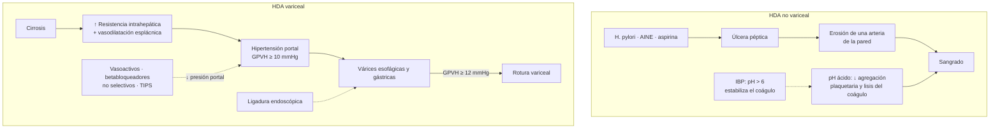
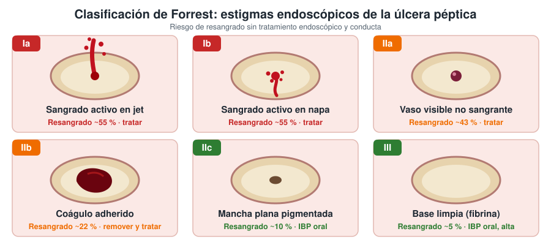
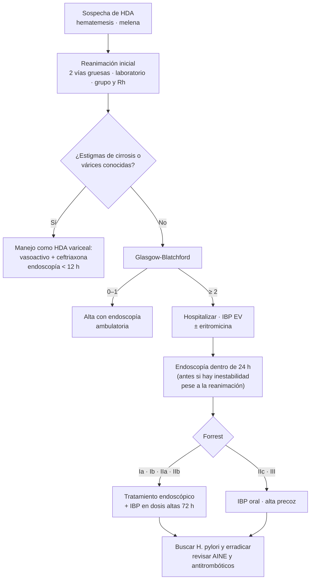
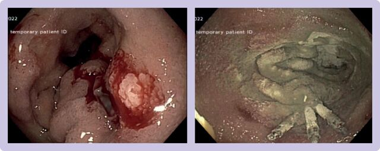
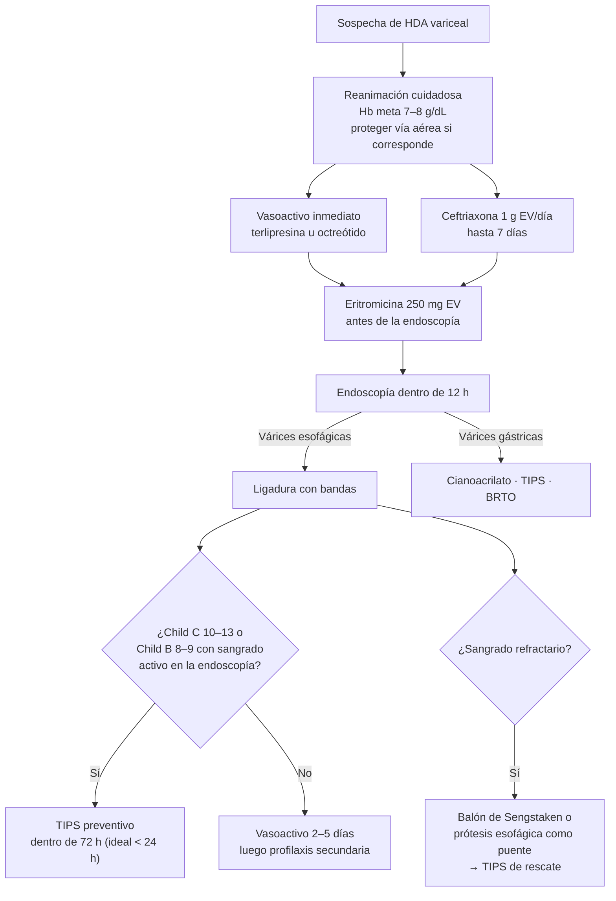

---
tags:
  - Gastroenterología
  - Urgencia
  - Frecuente en sala
---

# Hemorragia digestiva alta

**Subespecialidad**
Gastroenterología y hepatología

**Guías principales**
ACG 2021 (HDA y úlcera) · ESGE 2021 (HDA no variceal) · Consenso internacional 2019 · Baveno VII 2022 · AASLD 2024 (hipertensión portal)

**Otras fuentes**
ESGE 2022 (HDA variceal) · Estudios HALT-IT y Lau 2020

**GES relacionados**
Erradicación de *Helicobacter pylori* · Cáncer gástrico · Cirrosis hepática (incorporada en 2025)

**Revisado**
Septiembre 2026

!!! abstract "Resumen en 60 segundos"
    - Sangrado **proximal al ángulo de Treitz**: se manifiesta con **hematemesis**, **melena** o, si es masiva, **hematoquecia**.
    - Se divide en **no variceal** (~ 80 %; la causa más frecuente es la **úlcera péptica**) y **variceal** (hipertensión portal).
    - **Primero reanimar**: 2 vías venosas gruesas, cristaloides, **transfusión restrictiva (Hb < 7 g/dL**, < 8 si hay enfermedad cardiovascular).
    - **Estratificar el riesgo** con **Glasgow-Blatchford**: con **0–1 punto** el paciente puede manejarse de forma ambulatoria.
    - **No variceal**: IBP EV, **endoscopía dentro de 24 horas**, tratamiento endoscópico según **Forrest** (Ia, Ib, IIa) y luego **IBP en dosis altas por 72 horas**. Buscar y erradicar ***H. pylori***.
    - **Variceal**: **fármaco vasoactivo** (terlipresina u octreótido) **+ ceftriaxona** antes de la endoscopía, **ligadura** dentro de 12 horas y **TIPS preventivo** en pacientes de alto riesgo.
    - **Ácido tranexámico: no** (estudio HALT-IT).

## Definición

La **hemorragia digestiva alta (HDA)** es el sangrado del tubo digestivo que se origina **proximal al ángulo de Treitz** (esófago, estómago y duodeno), en el punto donde el duodeno se une al yeyuno y queda fijado por el ligamento de Treitz.

| Manifestación | Descripción | Comentario |
|---|---|---|
| **Hematemesis** | Vómito de sangre roja o de aspecto **"borra de café"** (sangre digerida) | Siempre indica HDA |
| **Melena** | Deposición negra, brillante, pegajosa y fétida | Requiere ~ 50–100 mL de sangre y al menos 8–14 horas de tránsito |
| **Hematoquecia** | Sangre roja por el recto | Suele ser hemorragia digestiva baja, pero en ~ 10–15 % es una **HDA masiva** con tránsito rápido (casi siempre con inestabilidad hemodinámica) |
| Sangrado oculto o anemia ferropénica | Sin sangrado visible | Estudio ambulatorio |

## Epidemiología

### Mundial

- Incidencia de **50–150 casos por 100.000 habitantes al año**; aumenta con la edad.
- La HDA es **4–5 veces más frecuente** que la hemorragia digestiva baja.
- **Mortalidad**: **2–10 %** en la HDA no variceal (la mayoría por descompensación de comorbilidades, no por el sangrado mismo) y **~ 15–20 % a 6 semanas** en la HDA variceal.
- La incidencia de úlcera péptica sangrante ha bajado con la erradicación de *H. pylori* y el uso de IBP, pero ha aumentado la proporción asociada a **AINE, aspirina y anticoagulantes** en adultos mayores.

### Chile

!!! chile "Datos nacionales"
    - No existen cifras nacionales confiables de incidencia. En el Hospital Clínico de la Universidad de Chile (2015–2017), el **72 %** de las HDA fue **no variceal** (principal causa: **úlcera péptica**) y la **mortalidad intrahospitalaria fue 6,8 %**, mayor en la HDA variceal.
    - ***H. pylori***: prevalencia de hasta **~ 70 % en adultos** chilenos, de las más altas de la región.
    - Chile tiene una de las **tasas de cáncer gástrico más altas de América**: siempre considéralo como causa de HDA, sobre todo en mayores de 40 años.
    - **GES relacionados**: **tratamiento de erradicación de *H. pylori*** (en úlcera péptica), **cáncer gástrico** y **tratamiento farmacológico tras el alta hospitalaria por cirrosis hepática** (problema GES 88, incorporado por el Decreto GES 2025–2028, vigente desde el 1 de diciembre de 2025).
    - El **consumo de alcohol** y la **enfermedad hepática grasa metabólica** son las principales causas de cirrosis y, por lo tanto, de HDA variceal.

## Etiología y factores de riesgo

| Causa | Frecuencia aproximada | Claves |
|---|---|---|
| **Úlcera péptica** (gástrica o duodenal) | **30–50 %** | ***H. pylori***, **AINE y aspirina**; úlceras de cara posterior del bulbo duodenal (arteria gastroduodenal) y de curvatura menor (arteria gástrica izquierda) sangran más |
| **Esofagitis, gastritis y duodenitis erosivas** | 10–20 % | AINE, alcohol, reflujo, paciente crítico ("úlceras de estrés") |
| **Várices esofágicas y gástricas** | 10–20 % (más en centros con muchos pacientes cirróticos) | **Cirrosis**; mayor mortalidad |
| **Síndrome de Mallory-Weiss** | 5–10 % | Desgarro de la unión gastroesofágica tras **vómitos intensos** (alcohol); la mayoría se detiene solo |
| **Neoplasias** | 2–5 % | **Cáncer gástrico**, linfoma, GIST |
| **Lesiones vasculares** | 2–5 % | **Angiodisplasias** (ERC, estenosis aórtica), **ectasia vascular antral** ("estómago en sandía"), **lesión de Dieulafoy** (arteria submucosa anómala, sangrado masivo intermitente) |
| **Gastropatía hipertensiva portal** | < 5 % | Sangrado crónico en cirrosis |
| **Causas raras** | < 1 % | **Fístula aortoentérica** (antecedente de **cirugía de aorta**: sangrado "centinela"), **hemobilia** (trauma, biopsia hepática), *hemosuccus pancreaticus*, lesiones de Cameron (hernia hiatal grande) |

**Factores de riesgo**

- **AINE** (incluidas dosis bajas de aspirina), sobre todo en > 65 años, con úlcera previa o en dosis altas.
- **Antiagregantes** (doble antiagregación) y **anticoagulantes** (warfarina y anticoagulantes directos).
- **Combinaciones de riesgo**: AINE + corticoides, AINE + **ISRS**, AINE + anticoagulante.
- Infección por ***H. pylori***.
- **Cirrosis** e hipertensión portal.
- Alcohol, enfermedad grave (UCI, ventilación mecánica, coagulopatía), ERC.

## Fisiopatología

**HDA no variceal (úlcera péptica)**: la úlcera se produce por el desequilibrio entre factores agresivos (**ácido y pepsina**, ***H. pylori***, **AINE** que inhiben la COX-1 y las prostaglandinas protectoras) y defensivos (moco, bicarbonato, flujo sanguíneo mucoso). Cuando la úlcera **erosiona una arteria** de la pared, se produce el sangrado. El **pH ácido inhibe la agregación plaquetaria** y favorece la lisis del coágulo: por eso los **IBP** (que llevan el pH gástrico sobre 6) ayudan a estabilizarlo.

**HDA variceal**: la cirrosis aumenta la resistencia intrahepática al flujo portal y, junto con la vasodilatación esplácnica, eleva la **presión portal**. Con un **gradiente de presión venosa hepática ≥ 10 mmHg** (hipertensión portal clínicamente significativa) se forman colaterales portosistémicas (**várices**); con ≥ 12 mmHg pueden romperse. La sobrecarga de volumen durante la reanimación **aumenta la presión portal** y el riesgo de resangrado.

*Figura 1. Mecanismos de la HDA no variceal y variceal, y sitio de acción de los tratamientos. Esquema propio.*

## Clasificación

### Según el origen

1. **No variceal** (~ 80 %): úlcera péptica, lesiones erosivas, Mallory-Weiss, neoplasias, lesiones vasculares.
2. **Variceal**: várices esofágicas o gástricas por hipertensión portal.

### Según la gravedad hemodinámica (shock hemorrágico, ATLS)

| Clase | Pérdida de volumen | FC | PA | Otros |
|---|---|---|---|---|
| **I** | < 15 % (< 750 mL) | Normal | Normal | Ansiedad leve |
| **II** | 15–30 % (750–1.500 mL) | 100–120 | Normal (presión de pulso ↓) | Ortostatismo, taquipnea leve |
| **III** | 30–40 % (1.500–2.000 mL) | 120–140 | **Disminuida** | Oliguria, confusión |
| **IV** | > 40 % (> 2.000 mL) | > 140 | **Muy disminuida** | Anuria, compromiso de conciencia |

El **índice de shock** (FC / PAS) **> 1** sugiere una hemorragia grave.

### Escalas de riesgo

=== "Glasgow-Blatchford (antes de la endoscopía)"

    Predice la necesidad de **intervención** (transfusión, endoscopía terapéutica, cirugía) o la muerte. Es la escala recomendada para decidir el **alta precoz**.

    | Parámetro | Valor | Puntos |
    |---|---|---|
    | **BUN** (mg/dL) | 18,2–22,3 | 2 |
    | | 22,4–27,9 | 3 |
    | | 28–69,9 | 4 |
    | | ≥ 70 | 6 |
    | **Hemoglobina, hombres** (g/dL) | 12–12,9 | 1 |
    | | 10–11,9 | 3 |
    | | < 10 | 6 |
    | **Hemoglobina, mujeres** (g/dL) | 10–11,9 | 1 |
    | | < 10 | 6 |
    | **PA sistólica** (mmHg) | 100–109 | 1 |
    | | 90–99 | 2 |
    | | < 90 | 3 |
    | **Otros** | FC ≥ 100/min | 1 |
    | | Melena | 1 |
    | | Síncope | 2 |
    | | Enfermedad hepática | 2 |
    | | Insuficiencia cardíaca | 2 |

    **0–1 punto**: riesgo muy bajo (< 1 % de necesitar intervención o morir). Se puede dar de **alta** con endoscopía ambulatoria (ACG 2021 y ESGE 2021).

=== "Rockall y AIMS65"

    - **Rockall**: tiene una versión **preendoscópica** (edad, shock, comorbilidades) y una **completa** (agrega el diagnóstico y los estigmas endoscópicos). Predice **mortalidad** y resangrado.
    - **AIMS65** (1 punto cada uno): **A**lbúmina < 3 g/dL, **I**NR > 1,5, alteración de conciencia (**M**ental status), PA sistólica ≤ 90 mmHg (**S**ystolic), edad ≥ **65** años. Predice **mortalidad hospitalaria**; ≥ 2 puntos indica alto riesgo.

=== "Forrest (endoscópica)"

    Clasifica los **estigmas de sangrado** de la úlcera. Define el riesgo de resangrado y si corresponde tratamiento endoscópico.

    <figure markdown>
    { loading=lazy }
    <figcaption>Figura 2. Clasificación de Forrest. Los estigmas de alto riesgo (Ia, Ib, IIa) requieren tratamiento endoscópico; en el IIb se sugiere remover el coágulo y tratar la lesión subyacente. Riesgos de resangrado sin tratamiento según Laine y Peterson (NEJM 1994). Esquema propio.</figcaption>
    </figure>

    | Forrest | Hallazgo | Resangrado sin tratamiento | Conducta |
    |---|---|---|---|
    | **Ia** | Sangrado activo **en jet** (arterial) | ~ 55 % (Ia + Ib) | **Tratamiento endoscópico** + IBP en dosis altas |
    | **Ib** | Sangrado activo **en napa** | ~ 55 % (Ia + Ib) | **Tratamiento endoscópico** + IBP en dosis altas |
    | **IIa** | **Vaso visible** no sangrante | ~ 43 % | **Tratamiento endoscópico** + IBP en dosis altas |
    | **IIb** | **Coágulo adherido** | ~ 22 % | Remover el coágulo y tratar el vaso subyacente; IBP en dosis altas |
    | **IIc** | Mancha plana pigmentada | ~ 10 % | IBP oral, sin tratamiento endoscópico |
    | **III** | Base limpia (fibrina) | ~ 5 % | IBP oral; **alta precoz** |

=== "Child-Pugh (cirrosis)"

    Necesaria para decidir el **TIPS preventivo** en la HDA variceal.

    | Parámetro | 1 punto | 2 puntos | 3 puntos |
    |---|---|---|---|
    | Bilirrubina (mg/dL) | < 2 | 2–3 | > 3 |
    | Albúmina (g/dL) | > 3,5 | 2,8–3,5 | < 2,8 |
    | INR | < 1,7 | 1,7–2,3 | > 2,3 |
    | Ascitis | Ausente | Leve (controlada) | Moderada a grave |
    | Encefalopatía | Ausente | Grado I–II | Grado III–IV |

    **A**: 5–6 puntos · **B**: 7–9 puntos · **C**: 10–15 puntos.

## Clínica

- **Hematemesis** (roja o "borra de café") y/o **melena**; hematoquecia si es masiva.
- **Síntomas de hipovolemia**: mareo, **síncope**, lipotimia, sed, sudoración, palidez, disnea, angina (en coronarios).
- **Síntomas que orientan a la causa**:
    - Epigastralgia, dispepsia, consumo de **AINE** → úlcera péptica.
    - Vómitos intensos previos (alcohol) → Mallory-Weiss.
    - **Estigmas de daño hepático crónico** (arañas vasculares, eritema palmar, ictericia, ascitis, circulación colateral, esplenomegalia, asterixis) → várices.
    - Baja de peso, saciedad precoz, anemia crónica, masa epigástrica → **cáncer gástrico**.
    - Antecedente de **bypass o prótesis aórtica** → fístula aortoentérica.
- **Examen físico**: signos vitales con **ortostatismo** (si el paciente lo tolera), llene capilar, conciencia, **tacto rectal** (confirma melena o hematoquecia).

## Diagnóstico

*Figura 3. Enfoque inicial de la HDA. Esquema propio basado en ACG 2021, ESGE 2021 y Baveno VII.*

- La **endoscopía digestiva alta** es el examen **diagnóstico y terapéutico** central.
- La **sonda nasogástrica** **no** se recomienda de rutina para diagnóstico ni pronóstico (ACG 2021).
- Una razón **BUN/creatinina > 30** apoya el origen alto (la sangre digerida se absorbe como proteína).
- Si la endoscopía no muestra la causa y el sangrado es importante: **angioTC**, angiografía o cápsula endoscópica (sangrado de intestino delgado).

## Laboratorio

- **Hemograma**: la **Hb inicial puede ser normal** (aún no hay hemodilución); se debe repetir cada 6–12 horas según la gravedad. VCM bajo sugiere pérdida crónica.
- **Grupo sanguíneo, Rh y pruebas cruzadas**.
- **BUN y creatinina**: el BUN sube en la HDA (parte del puntaje de Glasgow-Blatchford).
- **Pruebas de coagulación**: TP/INR, TTPA, recuento de plaquetas.
- **Electrolitos**, **pruebas hepáticas** y **albúmina** (cirrosis, AIMS65).
- **Lactato** y gases si hay shock.
- **Troponina y ECG** en pacientes coronarios o con síntomas (el sangrado puede gatillar isquemia).
- **Búsqueda de *H. pylori*** en toda úlcera: biopsia (test de ureasa, histología) durante la endoscopía. **Si es negativa en el contexto agudo, repetirla** (los falsos negativos son frecuentes con sangrado activo y uso de IBP).

## Imágenes

- **Endoscopía digestiva alta**: examen de elección (ver clasificación de Forrest).
- **AngioTC abdominal**: sangrado activo con endoscopía no diagnóstica o imposible, o antes de la embolización.
- **Angiografía** con **embolización transcatéter**: sangrado persistente o recurrente pese al tratamiento endoscópico, en lugar de cirugía cuando es posible.
- **Radiografía de tórax y abdomen de pie**: si se sospecha **perforación** (aire libre subdiafragmático).
- **Ecografía abdominal con Doppler**: en cirrosis (ascitis, trombosis portal, hepatocarcinoma).

## Diagnóstico diferencial

- **Epistaxis o hemoptisis** deglutidas (sangre de origen nasal o pulmonar).
- **Hemorragia digestiva baja** (si hay hematoquecia).
- **Deposiciones negras no hemorrágicas**: **hierro oral**, **bismuto**, carbón activado, alimentos (betarraga, arándanos, morcilla).
- Vómitos oscuros no hemáticos (obstrucción intestinal con contenido fecaloideo).

## Tratamiento

### 1. Reanimación inicial (todos los pacientes)

- **Vía aérea**: considerar **intubación** antes de la endoscopía si hay hematemesis masiva, compromiso de conciencia (encefalopatía) o riesgo de aspiración.
- **Dos vías venosas periféricas gruesas** (14–18 G).
- **Cristaloides** para restaurar la perfusión, sin sobrecargar (especialmente en cirróticos).
- **Régimen cero**; monitorización de signos vitales, diuresis (sonda Foley si hay shock) y conciencia.

!!! guia "Transfusión restrictiva (ACG 2021, ESGE 2021, Baveno VII)"
    - Transfundir glóbulos rojos con **Hb < 7 g/dL**, con meta de **7–9 g/dL**.
    - En **enfermedad cardiovascular** o isquemia activa: umbral de **8 g/dL** (meta ≥ 10 g/dL en ESGE).
    - En **HDA variceal**: umbral de **7 g/dL** y meta de **7–8 g/dL**. Transfundir de más aumenta la presión portal, el resangrado y la mortalidad (Villanueva, *NEJM* 2013).
    - En **shock hemorrágico masivo**: transfundir sin esperar la Hb, con protocolo de transfusión masiva.

**Plaquetas y coagulación**

- **Plaquetas** si hay sangrado activo con recuento < 50.000/µL.
- **Anticoagulantes**:
    - **Warfarina** con sangrado grave: **concentrado de complejo protrombínico** + vitamina K 10 mg EV (el plasma es una alternativa si no hay concentrado).
    - **Dabigatrán**: **idarucizumab**.
    - **Inhibidores del factor Xa** (rivaroxabán, apixabán): **andexanet alfa** o concentrado de complejo protrombínico, en sangrado con riesgo vital.
    - **No postergar la endoscopía** para corregir el INR si es < 2,5.
- En la **cirrosis**, el INR **no refleja** el riesgo de sangrado: **no** corregirlo con plasma de rutina.

!!! alarma "No indicar"
    - **Ácido tranexámico**: el estudio **HALT-IT** (*Lancet* 2020, > 12.000 pacientes) no mostró reducción de la mortalidad y sí más eventos tromboembólicos.
    - **Lavado gástrico** o sonda nasogástrica de rutina.
    - **Sobrerreanimación** con volumen en el paciente cirrótico.

### 2. HDA no variceal

**Antes de la endoscopía**

- **IBP EV**: **omeprazol o esomeprazol 80 mg EV en bolo** y luego 40 mg c/12 h EV (o infusión de 8 mg/h). Disminuye los estigmas de alto riesgo en la endoscopía, aunque **no reduce la mortalidad ni el resangrado**. No debe retrasar la endoscopía.
- **Eritromicina 250 mg EV** (o 3 mg/kg) en 30 minutos, **30–120 minutos antes de la endoscopía**: vacía el estómago de sangre y coágulos, mejora la visualización y reduce la necesidad de repetir la endoscopía (ACG y ESGE). Precaución con el QT prolongado.

**Endoscopía**

- **Dentro de 24 horas** del ingreso, tras la reanimación. Hacerla **antes** (urgente) solo si el paciente sigue **inestable pese a la reanimación**. Una endoscopía muy precoz (< 6 horas) en pacientes de alto riesgo no mejoró la mortalidad (Lau, *NEJM* 2020).
- **Tratamiento endoscópico** en estigmas de alto riesgo (**Forrest Ia, Ib, IIa**; IIb tras remover el coágulo):
    - **Terapia combinada**: inyección de **adrenalina diluida** + un segundo método (**térmico**, como la coagulación bipolar, o **mecánico**, como los **clips**).
    - La **adrenalina sola no se recomienda** (alta tasa de resangrado).
    - **Clip sobre el endoscopio** (*over-the-scope clip*, OTSC): para el resangrado o úlceras grandes.
    - **Polvo hemostático** (TC-325): como puente o en tumores sangrantes.

<figure markdown>
{ loading=lazy width="640" }
<figcaption>Figura 4. Úlcera péptica con sangrado persistente en napa (Forrest Ib, izquierda) tratada con inyección de adrenalina y clips, y luego polvo hemostático (derecha). Fuente: Orpen-Palmer J, Stanley AJ. Update on the management of upper gastrointestinal bleeding. <em>BMJ Med</em>. 2022;1:e000202. doi:<a href="https://doi.org/10.1136/bmjmed-2022-000202">10.1136/bmjmed-2022-000202</a>. Licencia <a href="https://creativecommons.org/licenses/by-nc/4.0/">CC BY-NC 4.0</a>.</figcaption>
</figure>

!!! dosis "IBP después de la endoscopía"
    - **Estigmas de alto riesgo tratados**: **IBP en dosis altas por 72 horas**: **80 mg EV en bolo + infusión de 8 mg/h**, o **bolos intermitentes de 40 mg EV c/12 h** (igualmente eficaces según ACG 2021).
    - Luego **IBP oral c/12 h hasta el día 14** y después **1 vez al día**. La duración total depende de la causa (8 semanas en úlcera; indefinido si se mantienen AINE o antiagregantes).
    - **Estigmas de bajo riesgo** (IIc, III): **IBP oral** y alta precoz.

**Resangrado**

- **Repetir la endoscopía** y el tratamiento endoscópico.
- Si falla: **embolización arterial por angiografía** o **cirugía**.
- La **segunda endoscopía programada** ("second look") **no se recomienda de rutina**.

**Después del episodio**

- **Erradicar *H. pylori*** si es positivo y **confirmar la erradicación** (test de aire espirado o antígeno en deposiciones, al menos 4 semanas sin antibióticos y 2 semanas sin IBP). En Chile, el tratamiento de erradicación en úlcera péptica es **GES**.
- **Suspender los AINE**; si son imprescindibles, usar un inhibidor selectivo de COX-2 + IBP.
- **Antitrombóticos**:
    - **Aspirina en prevención secundaria**: **no suspender**, o reiniciarla lo antes posible (idealmente dentro de los **3–5 días**), junto con IBP. Suspenderla aumenta la mortalidad cardiovascular.
    - **Aspirina en prevención primaria**: suspenderla y reevaluar la indicación.
    - **Doble antiagregación** (stent coronario reciente): mantener la aspirina y reiniciar el segundo antiagregante lo antes posible, en conjunto con cardiología.
    - **Anticoagulantes**: reiniciarlos en general **alrededor de 7 días** después del sangrado, según el riesgo trombótico y de resangrado.
- **Úlcera gástrica**: **biopsiar** y hacer una **endoscopía de control a las 8–12 semanas** para confirmar la cicatrización y descartar un **cáncer**.

### 3. HDA variceal

*Figura 5. Manejo de la HDA variceal. Esquema propio basado en Baveno VII y AASLD 2024.*

!!! dosis "Fármacos en la HDA variceal"
    - **Vasoactivos** (iniciar **apenas se sospecha**, antes de la endoscopía, y mantener **2–5 días**):
        - **Terlipresina**: 2 mg EV c/4 h por las primeras 48 horas, luego 1 mg EV c/4 h. Contraindicada o usar con precaución en cardiopatía isquémica, arritmias, enfermedad vascular periférica e hiponatremia grave.
        - **Octreótido**: 50 µg EV en bolo y luego **50 µg/h en infusión**.
        - **Somatostatina**: 250 µg EV en bolo y luego 250–500 µg/h.
    - **Profilaxis antibiótica** (reduce infecciones, resangrado y mortalidad): **ceftriaxona 1 g EV c/24 h** hasta por **7 días** (o hasta que se controle el sangrado sin infección activa).
    - **Lactulosa** o evacuación rápida de la sangre del tubo digestivo: para prevenir la **encefalopatía hepática**.

**Endoscopía**

- Dentro de las **12 horas** siguientes a la presentación, una vez estabilizado el paciente.
- **Várices esofágicas**: **ligadura con bandas** (de elección).
- **Várices gástricas**: inyección de **cianoacrilato**, TIPS u obliteración retrógrada transvenosa (BRTO) según el tipo.

**TIPS preventivo** (*pre-emptive*, derivación portosistémica intrahepática transyugular) dentro de **72 horas** (idealmente < 24 horas) en pacientes de **alto riesgo** de falla del tratamiento (Baveno VII):

- **Child-Pugh C 10–13 puntos**, o
- **Child-Pugh B 8–9 puntos con sangrado activo** en la endoscopía inicial.

Reduce la falla del tratamiento y la mortalidad en estos pacientes.

**Sangrado refractario**

- **Taponamiento con balón** (Sengstaken-Blakemore o Minnesota) por un máximo de 24 horas, o **prótesis esofágica autoexpandible**, como **puente** a un **TIPS de rescate**.

**Prevención del resangrado (profilaxis secundaria)**

- **Betabloqueador no selectivo** (**propranolol** 20–40 mg c/12 h, titulando según FC y PA, o **carvedilol** 6,25–12,5 mg/día) **+ ligadura con bandas** repetida cada 1–4 semanas hasta erradicar las várices.
- Evaluar la **derivación a trasplante hepático**.

## Complicaciones

- **Shock hipovolémico** y falla multiorgánica.
- **Resangrado** (principal factor de mortalidad): ~ 10–20 % en la HDA no variceal de alto riesgo; hasta ~ 30–40 % en la variceal sin tratamiento adecuado.
- **Isquemia miocárdica** o cerebral por anemia e hipotensión.
- **Aspiración** y neumonía.
- **Lesión renal aguda**.
- En cirróticos: **encefalopatía hepática**, **infecciones** (peritonitis bacteriana espontánea), síndrome hepatorrenal y descompensación de la cirrosis (ACLF).
- Complicaciones de la endoscopía: **perforación**, aspiración.
- Complicaciones de la úlcera: **perforación** y **obstrucción pilórica**.

## Pronóstico y seguimiento

- **Mortalidad** de la HDA no variceal: **2–10 %**; aumenta con la edad, las comorbilidades, el shock, el resangrado y el inicio del sangrado durante la hospitalización.
- **HDA variceal**: mortalidad de **~ 15–20 % a 6 semanas**, mayor en Child-Pugh C.
- **Seguimiento**:
    - Confirmar la **erradicación de *H. pylori***.
    - **Endoscopía de control** en las úlceras gástricas (8–12 semanas) para descartar un cáncer.
    - Revisar la indicación de **AINE, antiagregantes y anticoagulantes**, e indicar IBP de mantención si deben continuar.
    - En cirrosis: programa de **ligaduras** + betabloqueador no selectivo, evaluación para trasplante y control en policlínico de hepatología.

## Perlas para el internado

!!! perla "Para la sala y el turno"
    - La **hemoglobina inicial engaña**: puede ser normal en una hemorragia grave. Mira el **pulso, la PA, el índice de shock y la conciencia**.
    - **Tacto rectal** en todo paciente con sospecha de HDA: confirma la melena.
    - Pregunta siempre por **AINE, aspirina, anticoagulantes, ISRS, alcohol y cirrosis**.
    - Paciente con cirrosis (o estigmas) que sangra: **terlipresina u octreótido + ceftriaxona** apenas se sospecha, **sin esperar la endoscopía**.
    - **No sobrerreanimes al cirrótico**: la meta de Hb es 7–8 g/dL.
    - **Eritromicina** antes de la endoscopía: pídela con anticipación para que alcance a pasar.
    - **Hierro oral o bismuto** tiñen las deposiciones de negro, pero no son melena (no son pegajosas ni fétidas y el test de sangre oculta es negativo con el hierro).
    - Antecedente de **cirugía de aorta** + HDA "pequeña" = sangrado **centinela** de una **fístula aortoentérica** → angioTC urgente.
    - Toda úlcera gástrica debe biopsiarse: en Chile, el **cáncer gástrico** es frecuente.
    - El **ácido tranexámico no** está indicado en la HDA.

## Preguntas de repaso

??? repaso "1. Hombre de 45 años con una melena, FC 82, PA 128/80, Hb 13,8 g/dL, BUN 16 mg/dL, sin síncope ni comorbilidades. ¿Cuál es su Glasgow-Blatchford y qué haces?"
    **Glasgow-Blatchford = 1** (solo la melena). Es de **muy bajo riesgo**: se puede manejar de forma **ambulatoria** con IBP oral y **endoscopía ambulatoria** precoz.

??? repaso "2. En la endoscopía de un paciente con HDA se ve una úlcera duodenal con un vaso visible no sangrante. ¿Cómo se clasifica y qué corresponde?"
    **Forrest IIa** (resangrado ~ 43 % sin tratamiento). Corresponde **tratamiento endoscópico combinado** (adrenalina + clips o coagulación térmica), seguido de **IBP en dosis altas por 72 horas** (bolo de 80 mg + infusión de 8 mg/h, o 40 mg EV c/12 h), búsqueda y erradicación de *H. pylori*.

??? repaso "3. Paciente con cirrosis alcohólica llega con hematemesis masiva, PA 88/50 y FC 124. ¿Qué indicas antes de la endoscopía?"
    Proteger la **vía aérea** (evaluar intubación), **2 vías gruesas**, reanimación cuidadosa con meta de **Hb 7–8 g/dL**, **terlipresina 2 mg EV c/4 h** (u octreótido 50 µg en bolo + 50 µg/h), **ceftriaxona 1 g EV/día**, **eritromicina** antes de la endoscopía y **endoscopía dentro de 12 horas** para **ligadura**.

??? repaso "4. ¿Qué pacientes con HDA variceal se benefician de un TIPS preventivo?"
    Los de **alto riesgo**: **Child-Pugh C 10–13** o **Child-Pugh B 8–9 con sangrado activo** en la endoscopía inicial. Se coloca dentro de 72 horas (idealmente < 24 horas).

??? repaso "5. Paciente de 70 años con un stent coronario hace 4 años, en aspirina, con HDA por úlcera tratada endoscópicamente. ¿Qué haces con la aspirina?"
    Es **prevención secundaria**: **no suspenderla** o **reiniciarla precozmente** (idealmente dentro de 3–5 días), junto con **IBP**. Suspenderla aumenta el riesgo cardiovascular y la mortalidad.

## Referencias

1. Laine L, Barkun AN, Saltzman JR, Martel M, Leontiadis GI. ACG Clinical Guideline: Upper Gastrointestinal and Ulcer Bleeding. *Am J Gastroenterol.* 2021;116:899–917. [Texto en la revista](https://journals.lww.com/ajg/fulltext/10.14309/ajg.0000000000001245)
2. Gralnek IM, et al. Endoscopic diagnosis and management of nonvariceal upper gastrointestinal hemorrhage (NVUGIH): European Society of Gastrointestinal Endoscopy (ESGE) Guideline – Update 2021. *Endoscopy.* 2021;53:300–332.
3. Barkun AN, et al. Management of Nonvariceal Upper Gastrointestinal Bleeding: Guideline Recommendations From the International Consensus Group. *Ann Intern Med.* 2019;171:805–822.
4. de Franchis R, et al. Baveno VII – Renewing consensus in portal hypertension. *J Hepatol.* 2022;76:959–974.
5. Kaplan DE, et al. AASLD Practice Guidance on risk stratification and management of portal hypertension and varices in cirrhosis. *Hepatology.* 2024;79:1180–1211.
6. Gralnek IM, et al. Endoscopic diagnosis and management of esophagogastric variceal hemorrhage: ESGE Guideline. *Endoscopy.* 2022;54:1094–1120.
7. HALT-IT Trial Collaborators. Effects of a high-dose 24-h infusion of tranexamic acid on death and thromboembolic events in patients with acute gastrointestinal bleeding (HALT-IT). *Lancet.* 2020;395:1927–1936.
8. Lau JYW, et al. Timing of Endoscopy for Acute Upper Gastrointestinal Bleeding. *N Engl J Med.* 2020;382:1299–1308.
9. Villanueva C, et al. Transfusion Strategies for Acute Upper Gastrointestinal Bleeding. *N Engl J Med.* 2013;368:11–21.
10. Laine L, Peterson WL. Bleeding peptic ulcer. *N Engl J Med.* 1994;331:717–727.
11. Blatchford O, Murray WR, Blatchford M. A risk score to predict need for treatment for upper-gastrointestinal haemorrhage. *Lancet.* 2000;356:1318–1321.
12. García-Pagán JC, et al. Early use of TIPS in patients with cirrhosis and variceal bleeding. *N Engl J Med.* 2010;362:2370–2379.
13. Hemorragia digestiva alta variceal y no variceal: mortalidad intrahospitalaria y características clínicas en un hospital universitario (2015–2017). *Rev Méd Chile.* 2020;148(3):288. [SciELO](https://www.scielo.cl/scielo.php?script=sci_arttext&pid=S0034-98872020000300288)
14. Ministerio de Salud de Chile. *Guía Clínica GES: Tratamiento de erradicación de Helicobacter pylori en el paciente con úlcera péptica.*
15. Orpen-Palmer J, Stanley AJ. Update on the management of upper gastrointestinal bleeding. *BMJ Med.* 2022;1:e000202. doi:[10.1136/bmjmed-2022-000202](https://doi.org/10.1136/bmjmed-2022-000202)
