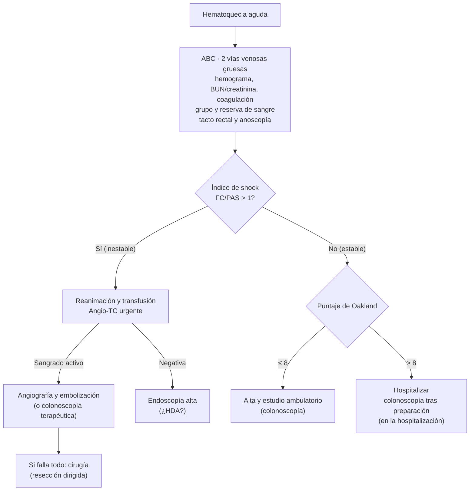

---
tags:
  - Gastroenterología
  - Urgencia
  - Frecuente en sala
---

# Hemorragia digestiva baja

**Subespecialidad**
Gastroenterología · Coloproctología · Urgencia

**Guías principales**
ACG 2023: manejo de la hemorragia digestiva baja aguda · BSG 2019: diagnóstico y manejo de la hemorragia digestiva baja aguda · ESGE 2021: hemorragia digestiva baja aguda

**Otras fuentes**
Puntaje de Oakland (2017) y su validación externa (JAMA Netw Open 2020) · Series chilenas de HDB masiva

**EUNACOM**
1.06.2.007 Hemorragia digestiva alta y baja (sospecha, inicial, derivar)

**Revisado**
Septiembre 2026

!!! abstract "Resumen en 60 segundos"
    - **HDB**: sangrado de **colon, recto o ano**; se presenta con **hematoquecia** (sangre roja o marrón por el recto). **~ 80 % se detiene espontáneamente**; mortalidad hospitalaria **~ 2–4 %**, sobre todo por comorbilidad.
    - Causas: **enfermedad diverticular** (la más frecuente), **hemorroides**, **colitis isquémica**, **angiodisplasias**, **pospolipectomía**, **cáncer colorrectal**, colitis.
    - **Hematoquecia con inestabilidad**: pensar en una **HDA** (~ 10–15 %): **endoscopía alta** si no hay otra explicación (BUN/creatinina > 30 la sugiere).
    - **Estratificar**: **índice de shock** (FC/PAS > 1 = inestable) y **puntaje de Oakland** (**≤ 8** = alta segura con estudio ambulatorio).
    - **Inestable o con sangrado activo** → **angio-TC** → **embolización**. **Estable** → **colonoscopía** tras preparación (no necesita ser en < 24 h).
    - **Transfusión restrictiva** (Hb < 7 g/dL; < 8 si hay enfermedad cardiovascular). **Mantener la aspirina** de prevención secundaria; suspender transitoriamente los anticoagulantes.

## Definición

| Término | Definición |
|---|---|
| **Hemorragia digestiva baja (HDB)** | Sangrado originado en el **colon, el recto o el ano** (ACG 2023). Tradicionalmente, todo sangrado distal al **ángulo de Treitz** |
| **Sangrado de intestino delgado** | Entre el ángulo de Treitz y la válvula ileocecal (antes "de origen oscuro"); se estudia con cápsula endoscópica o enteroscopía |
| **Hematoquecia** | Salida de **sangre roja o marrón** por el recto, sola o con deposiciones |
| **Rectorragia** | Sangre roja fresca, típica de un origen **anorrectal** o del colon izquierdo |
| **Melena** | Deposiciones negras y alquitranadas: casi siempre de origen **alto**, pero puede venir del intestino delgado o del colon derecho con tránsito lento |
| **HDB grave** | Con inestabilidad hemodinámica (**índice de shock > 1**), necesidad de transfusión o sangrado persistente |

## Epidemiología

### Mundial

- Incidencia de **~ 20–35 por 100.000 habitantes al año**; aumenta mucho con la **edad** (mediana ~ 70 años).
- El sangrado **se detiene espontáneamente en ~ 80 %** de los casos; **resangra en 10–20 %**.
- **Mortalidad hospitalaria ~ 2–4 %** (3,4 % en una auditoría nacional del Reino Unido), mayor en adultos mayores con comorbilidad o cuando la HDB ocurre en pacientes ya hospitalizados.
- **Factores de riesgo**: edad, **AINE**, **antiagregantes**, **anticoagulantes** (sobre todo los anticoagulantes orales directos en adultos mayores), ERC, comorbilidad cardiovascular.
- **Causas** (frecuencia aproximada): **diverticular 20–65 %**, **hemorroides** 5–20 %, **colitis isquémica** 5–20 %, **angiodisplasias** 5–10 %, **pospolipectomía** 2–8 %, **cáncer y pólipos** 2–15 %, colitis inflamatoria o infecciosa 2–10 %, proctitis actínica, úlcera rectal, várices rectales.

### Chile

!!! chile "Datos nacionales"
    - En series chilenas de **HDB masiva**, las causas principales fueron las **angiodisplasias** y la **enfermedad diverticular del colon derecho**, en pacientes con comorbilidad importante (diabetes, HTA, cardiopatía coronaria, ERC en diálisis).
    - El **envejecimiento** de la población y el uso creciente de **aspirina** y **anticoagulantes orales** (fibrilación auricular, TEP) aumentan la frecuencia de la HDB.
    - El **cáncer colorrectal** es una de las principales causas de muerte por cáncer en Chile y su tratamiento es **GES** (cáncer colorrectal en personas de 15 años y más). No hay un programa nacional de tamizaje poblacional: una **HDB en un adulto de 50 años o más sin causa evidente obliga a una colonoscopía completa**.

## Etiología y fisiopatología

<figure markdown>
{ loading=lazy }
<figcaption>Figura 1. Causas de HDB según su localización. Esquema propio.</figcaption>
</figure>

| Causa | Mecanismo y claves |
|---|---|
| **Hemorragia diverticular** | Rotura de la **arteria recta** (vasa recta) que se estira sobre el cuello del divertículo. **Indolora**, abundante, **se detiene sola** en ~ 75 %, pero **recurre** en 10–40 %. Los divertículos **derechos** sangran más, aunque son menos frecuentes en Occidente. Riesgo mayor con **AINE**, antiagregantes, anticoagulantes, HTA, obesidad |
| **Angiodisplasias** | Vasos submucosos dilatados y frágiles, sobre todo en el **ciego y el colon derecho**; adultos mayores, **ERC**, **estenosis aórtica** (síndrome de Heyde), enfermedad de von Willebrand adquirida. Sangrado **indoloro**, a menudo recurrente o **anemia ferropénica** crónica |
| **Colitis isquémica** | Hipoperfusión de las zonas **limítrofes** (ángulo esplénico, unión rectosigmoidea): **dolor cólico** abdominal seguido de **diarrea con sangre**; adultos mayores, cardiopatía, hipotensión, constipación, fármacos vasoconstrictores. La mayoría es **autolimitada** |
| **Hemorroides y fisura anal** | **Sangre roja brillante** que cubre las deposiciones o mancha el papel; la fisura con **dolor intenso** al defecar. Rara vez causan inestabilidad (salvo hipertensión portal) |
| **Pospolipectomía** | Inmediata o **diferida hasta 2–3 semanas** tras la resección (más con pólipos grandes, colon derecho, anticoagulantes) |
| **Cáncer colorrectal y pólipos** | Sangrado **crónico** u oculto, anemia ferropénica, cambio del hábito intestinal, baja de peso |
| **Colitis** | **Enfermedad inflamatoria intestinal**, **infecciosa** (*Shigella*, *Campylobacter*, *E. coli* enterohemorrágica, CMV en inmunosuprimidos, *C. difficile*), **proctitis actínica** |
| **Otras** | Úlcera estercorácea (constipación grave, postrados), úlcera rectal solitaria, **várices rectales** (hipertensión portal), **fístula aortoentérica** (antecedente de cirugía aórtica: sangrado "heraldo") |

## Clasificación

- **Por gravedad**: **menor** (estable, sin necesidad de transfusión; puede estudiarse ambulatoriamente) o **mayor** (inestable, transfusión, sangrado persistente).
- **Por evolución**: **aguda** (< 3 días) u **oculta/crónica** (anemia ferropénica, test de sangre oculta positivo).
- **Índice de shock** (FC/PAS): **> 1** = inestabilidad hemodinámica (BSG 2019).

### Puntaje de Oakland (BSG 2019)

| Variable | Puntos |
|---|---|
| **Edad** | < 40: 0 · 40–69: 1 · ≥ 70: 2 |
| **Sexo** | Mujer: 0 · Hombre: 1 |
| **Hospitalización previa por HDB** | No: 0 · Sí: 1 |
| **Tacto rectal** | Sin sangre: 0 · Con sangre: 1 |
| **Frecuencia cardíaca** (/min) | < 70: 0 · 70–89: 1 · 90–109: 2 · ≥ 110: 3 |
| **PAS** (mmHg) | 50–89: 5 · 90–119: 4 · 120–129: 3 · 130–159: 2 · ≥ 160: 0 |
| **Hemoglobina** (g/dL) | 3,6–6,9: 22 · 7,0–8,9: 17 · 9,0–10,9: 13 · 11,0–12,9: 8 · 13,0–15,9: 4 · ≥ 16: 0 |

**≤ 8 puntos**: probabilidad ≥ 95 % de **alta segura** (sin resangrado, transfusión, intervención ni muerte) → alta con estudio ambulatorio precoz, si no hay otra indicación de hospitalización.

## Clínica

- **Hematoquecia**: sangre roja o **marrón** (color "vino tinto": colon derecho o sangrado abundante), con o sin deposiciones.
- **Síntomas de hipovolemia**: mareo, **síncope**, taquicardia, hipotensión, palidez; angina o disnea en cardiópatas.
- **Claves de la causa**:
    - **Indolora** y abundante en un adulto mayor → **diverticular** o **angiodisplasia**.
    - **Dolor cólico** y luego **diarrea con sangre** → **colitis isquémica**.
    - Sangre roja **sobre** las deposiciones o en el papel, con prolapso o prurito → **hemorroides**; con dolor intenso al defecar → **fisura**.
    - **Baja de peso**, cambio del hábito intestinal, anemia crónica → **cáncer**.
    - **Diarrea**, fiebre, tenesmo → **colitis infecciosa o inflamatoria**.
    - **Polipectomía** en las últimas semanas → **sangrado pospolipectomía**.
- **Examen físico**: signos vitales (**índice de shock**), estigmas de daño hepático, abdomen, **tacto rectal** (sangre, masa) y **anoscopía**.

!!! alarma "Hematoquecia con shock"
    En ~ 10–15 % de las hematoquecias con inestabilidad el origen es **alto** (úlcera duodenal con sangrado masivo). Pistas: **BUN/creatinina > 30**, antecedente de úlcera o AINE, cirrosis. Si la angio-TC no muestra el sitio, o hay sospecha clínica, hacer una **endoscopía digestiva alta** (ver [Hemorragia digestiva alta](hemorragia-digestiva-alta.md)).

## Diagnóstico

- **Angio-TC** (angiografía por TC): examen rápido y no invasivo que detecta sangrados de **≥ 0,3–0,5 mL/min**; localiza el sitio para la **embolización** o la endoscopía. Se hace en los **inestables** o con **sangrado activo** importante (BSG 2019, ACG 2023).
- **Colonoscopía**: examen diagnóstico y terapéutico principal en los pacientes **estables**, **después de una preparación** con polietilenglicol (4–6 L en 3–4 horas, por sonda nasogástrica si es necesario). La colonoscopía **urgente (< 24 h)** no mejoró el resangrado ni la mortalidad frente a la colonoscopía durante la hospitalización (ACG 2023).
- **Endoscopía alta** si se sospecha un origen alto.
- Si la colonoscopía y la endoscopía alta son normales: estudiar el **intestino delgado** (cápsula endoscópica, enteroscopía, angio-TC).

## Laboratorio

| Examen | Para qué |
|---|---|
| **Hemograma** | Hemoglobina (la inicial puede ser normal: baja con la hemodilución), plaquetas; VCM bajo sugiere sangrado crónico (cáncer, angiodisplasia) |
| **BUN y creatinina** | **BUN/creatinina > 30** sugiere un origen **alto** (digestión de sangre) |
| **Pruebas de coagulación** (TP/INR, TTPA) | Anticoagulantes, hepatopatía |
| **Grupo sanguíneo y pruebas cruzadas** | Transfusión |
| **Electrolitos, lactato** | Hipoperfusión |
| **Ferritina, hierro** | Sangrado crónico |
| **Coprocultivo, toxina de *C. difficile*** | Diarrea con sangre, fiebre |
| **Troponina, ECG** | Adultos mayores o cardiópatas con anemia (isquemia por demanda) |

## Imágenes

- **Angio-TC**: primera elección en la HDB **grave o activa** (inestabilidad).
- **Angiografía por catéter**: terapéutica (**embolización supraselectiva**) cuando la angio-TC muestra extravasación; requiere sangrado activo (≥ 0,5–1 mL/min).
- **Cintigrafía con glóbulos rojos marcados**: sensible para sangrados lentos o intermitentes, pero localiza mal; poco usada hoy.
- **TC con contraste** en la **colitis isquémica** (engrosamiento de la pared, neumatosis, gas portal si hay gangrena).

## Diagnóstico diferencial

- **HDA** con tránsito rápido (hematoquecia con shock).
- **Sangrado de intestino delgado** (angiodisplasias, divertículo de Meckel en jóvenes, tumores, úlceras por AINE).
- **Pseudohematoquecia**: ingesta de **betarraga**, colorantes rojos; **hematuria** o **sangrado vaginal** confundidos con sangrado rectal.
- **Melena** por hierro o bismuto (deposiciones negras pero no alquitranadas; test de sangre oculta negativo con el hierro).

## Tratamiento

!!! guia "ACG 2023 / BSG 2019: principios"
    - **Reanimación** con cristaloides y **transfusión restrictiva**: glóbulos rojos si **Hb < 7 g/dL** (**< 8 g/dL** si hay enfermedad cardiovascular), con meta de 7–9 g/dL.
    - **Estratificar el riesgo** (índice de shock, Oakland) para decidir el lugar y la urgencia del estudio.
    - **Inestable** → **angio-TC** → **embolización**.
    - **Estable** → **colonoscopía** tras una buena **preparación**, durante la hospitalización (o ambulatoria si el riesgo es bajo).
    - **Terapia endoscópica** si se encuentran estigmas de sangrado.
    - **Cirugía** sólo si fallan la endoscopía y la radiología intervencional, idealmente con el sitio de sangrado **localizado** (resección segmentaria).

### 1. Reanimación

- **Dos vías venosas gruesas**, **cristaloides**, oxígeno si hay hipoxemia, **monitor**.
- **Transfusión restrictiva** (Hb < 7 g/dL, o < 8 con cardiopatía); en el sangrado masivo, protocolo de transfusión masiva.
- **Corregir la coagulopatía** relevante; **plaquetas** si son < 50.000/µL con sangrado activo.

### 2. Manejo de los antitrombóticos

!!! dosis "Antitrombóticos en la HDB (ACG 2023, BSG 2019)"
    - **Aspirina en prevención secundaria** (enfermedad coronaria, ACV, arteriopatía): **no suspenderla** (suspenderla aumenta los eventos cardiovasculares y la mortalidad). **Suspender la aspirina de prevención primaria**.
    - **Doble antiagregación** con stent reciente o síndrome coronario agudo reciente: **mantener la aspirina** y decidir la suspensión transitoria del inhibidor P2Y12 (clopidogrel, ticagrelor) **con cardiología**; reiniciarlo en ≤ 5 días.
    - **Anticoagulantes** (warfarina, acenocumarol, anticoagulantes orales directos): **suspender** al ingreso.
        - **Revertir sólo** en la **hemorragia con riesgo vital** que no se controla: **complejo protrombínico** (+ vitamina K) para los antagonistas de la vitamina K; **idarucizumab** para el dabigatrán; complejo protrombínico o andexanet alfa para los anti-Xa.
        - **Reiniciar** una vez controlado el sangrado, habitualmente **dentro de 7 días** (antes si el riesgo trombótico es muy alto, p. ej., prótesis mecánica), porque no reiniciar aumenta la trombosis y la mortalidad.
    - **Suspender los AINE** y evitarlos en el futuro (sobre todo en la enfermedad diverticular).

### 3. Tratamiento según la causa

| Causa | Tratamiento |
|---|---|
| **Diverticular** | Endoscópico si hay estigmas (vaso visible, coágulo adherido, sangrado activo): **clips**, **ligadura con banda**, adrenalina + térmica. **Embolización** si hay sangrado activo en la angio-TC. **Resección** del segmento en el sangrado recurrente o que no se controla |
| **Angiodisplasias** | **Coagulación con argón plasma**; hierro; en casos recurrentes, **octreotide** u otras terapias con hematología o gastroenterología; tratar la estenosis aórtica si corresponde |
| **Colitis isquémica** | **Soporte**: hidratación, reposo intestinal breve, suspender vasoconstrictores; antibióticos en casos moderados a graves; **cirugía** si hay **gangrena**, perforación o peritonitis |
| **Pospolipectomía** | **Clips** endoscópicos |
| **Hemorroides** | Fibra, líquidos, laxantes osmóticos, baños de asiento, tópicos; **ligadura elástica**; cirugía en las de grado alto |
| **Fisura anal** | Fibra, baños de asiento, **nitroglicerina o diltiazem tópicos**; toxina botulínica o esfinterotomía si es crónica |
| **Cáncer colorrectal** | Biopsia, estadificación y **derivación** a cirugía y oncología (**GES**) |
| **Colitis infecciosa o inflamatoria** | Según la causa (coprocultivo, *C. difficile*); gastroenterología en la EII |
| **Proctitis actínica** | Argón plasma, sucralfato tópico, formalina |

### 4. Cirugía

- Indicada en el sangrado **masivo** o **recurrente** que no se controla con la endoscopía ni con la **embolización**, o si hay **perforación o gangrena** (colitis isquémica).
- Siempre es preferible **localizar el sitio** antes de operar (resección segmentaria); la **colectomía subtotal "a ciegas"** tiene alta morbimortalidad y es el último recurso.

## Complicaciones

- **Shock hipovolémico**, **anemia**, necesidad de transfusión.
- **Isquemia miocárdica** o **ACV** por la anemia o la hipotensión en adultos mayores.
- **Resangrado** (10–20 %; en la diverticular, recurrencia del 10–40 % a largo plazo).
- **Complicaciones de la embolización**: **isquemia intestinal** (baja con la embolización supraselectiva).
- **Eventos trombóticos** al suspender los antitrombóticos.
- **Lesión renal aguda** por hipoperfusión o por el contraste.

## Pronóstico y seguimiento

- La mayoría de los episodios se **autolimita**; la mortalidad (~ 2–4 %) depende sobre todo de la **edad** y la **comorbilidad**.
- **Factores de mal pronóstico**: inestabilidad, Hb baja, necesidad de transfusión, anticoagulantes, comorbilidad, sangrado durante la hospitalización por otra causa.
- **Perfil EUNACOM**: sospecha, **tratamiento inicial** (reanimación, estratificación, manejo de antitrombóticos) y **derivación** para el estudio endoscópico o radiológico.
- **Seguimiento**: colonoscopía completa si no se hizo (descartar cáncer), tratamiento de la anemia (hierro), **suspender AINE**, revisar la indicación de antitrombóticos, fibra en la enfermedad diverticular.

## Perlas para el internado

!!! perla "Para la sala y el turno"
    - **Toma la PA y la FC** antes que nada: el **índice de shock > 1** define la conducta.
    - **Tacto rectal y anoscopía** en toda hematoquecia: encontrarás hemorroides, fisuras o un tumor rectal palpable.
    - **Hematoquecia con shock**: piensa también en la **úlcera duodenal** (HDA) y pide un **BUN**.
    - **No suspendas la aspirina** de un paciente con un stent o un ACV previo sin hablar con cardiología.
    - Una hemoglobina "normal" al ingreso **no descarta** un sangrado importante: repítela a las 6 horas.
    - La **colonoscopía** necesita **buena preparación** para ser útil: no es necesario hacerla de urgencia en el paciente estable.
    - **Adulto mayor con HDB "por hemorroides"**: si no se ha hecho una colonoscopía, pídela (cáncer colorrectal).

## Preguntas de repaso

??? repaso "1. Hombre de 76 años, usuario de aspirina por un IAM previo, con 3 episodios de hematoquecia abundante e indolora. FC 88, PA 128/74, Hb 11,2 g/dL, tacto rectal con sangre roja. ¿Cómo lo estratificas y qué haces?"
    **HDB probablemente diverticular**. Índice de shock 88/128 = 0,69 (estable). **Oakland**: edad ≥ 70 (2) + hombre (1) + tacto con sangre (1) + FC 70–89 (1) + PAS 120–129 (3) + Hb 11–12,9 (8) = **16 puntos** (> 8) → **hospitalizar**. Hemograma seriado, BUN/creatinina, coagulación, grupo y reserva. **Mantener la aspirina** (prevención secundaria). **Colonoscopía durante la hospitalización tras preparación**; terapia endoscópica si hay estigmas.

??? repaso "2. Mujer de 82 años con hematoquecia masiva, FC 124, PA 84/50 (índice de shock 1,5). Tras la reanimación persiste el sangrado. ¿Cuál es el examen de elección y el tratamiento?"
    **HDB grave con inestabilidad** (índice de shock > 1): reanimación, transfusión y **angio-TC urgente**. Si muestra extravasación: **angiografía con embolización supraselectiva**. Si la angio-TC es negativa, **endoscopía alta** (una HDA puede presentarse como hematoquecia masiva). Cirugía sólo si fallan las otras medidas, idealmente con el sitio localizado.

??? repaso "3. Mujer de 70 años con cardiopatía, que presenta dolor cólico en el flanco izquierdo seguido de diarrea con sangre, hemodinámicamente estable. ¿Qué sospechas y cómo la manejas?"
    **Colitis isquémica** (zonas limítrofes: ángulo esplénico, unión rectosigmoidea). Manejo de **soporte**: hidratación, reposo intestinal breve, suspender vasoconstrictores, optimizar la perfusión; **TC con contraste** y colonoscopía para confirmar; antibióticos en los casos moderados o graves. **Cirugía** si hay signos de gangrena, perforación o peritonitis.

??? repaso "4. Hombre de 68 años con fibrilación auricular en tratamiento con apixabán, con hematoquecia moderada y estable. ¿Qué haces con el anticoagulante?"
    **Suspender el apixabán** al ingreso. **No revertir** (el sangrado no amenaza la vida y el apixabán tiene vida media corta); reservar la reversión (complejo protrombínico o andexanet) para el sangrado con riesgo vital no controlado. Tras controlar el sangrado, **reiniciar el anticoagulante** (habitualmente dentro de 7 días), porque no hacerlo aumenta el riesgo de ACV y de muerte.

??? repaso "5. ¿Qué es el puntaje de Oakland y cómo se usa?"
    Es un puntaje de la **BSG 2019** para la HDB que suma **edad, sexo, hospitalización previa por HDB, sangre en el tacto rectal, FC, PAS y hemoglobina**. Un puntaje **≤ 8** indica una probabilidad ≥ 95 % de **alta segura**: el paciente puede irse a casa con un estudio ambulatorio precoz (colonoscopía), si no hay otra razón para hospitalizarlo. Con **> 8** se hospitaliza.

## Referencias

1. Sengupta N, Feuerstein JD, Jairath V, et al. Management of Patients With Acute Lower Gastrointestinal Bleeding: An Updated ACG Guideline. *Am J Gastroenterol.* 2023;118:208–231.
2. Oakland K, Chadwick G, East JE, et al. Diagnosis and management of acute lower gastrointestinal bleeding: guidelines from the British Society of Gastroenterology. *Gut.* 2019;68:776–789.
3. Triantafyllou K, Gkolfakis P, Gralnek IM, et al. Diagnosis and management of acute lower gastrointestinal bleeding: European Society of Gastrointestinal Endoscopy (ESGE) Guideline. *Endoscopy.* 2021;53:850–868.
4. Oakland K, Jairath V, Uberoi R, et al. Derivation and validation of a novel risk score for safe discharge after acute lower gastrointestinal bleeding: a modelling study. *Lancet Gastroenterol Hepatol.* 2017;2:635–643.
5. Hemorragia digestiva baja masiva: resultados del estudio y el tratamiento quirúrgico en 20 pacientes consecutivos. *Rev Med Chile.* 2002. [scielo.cl](https://www.scielo.cl/scielo.php?script=sci_arttext&pid=S0034-98872002000800005)
