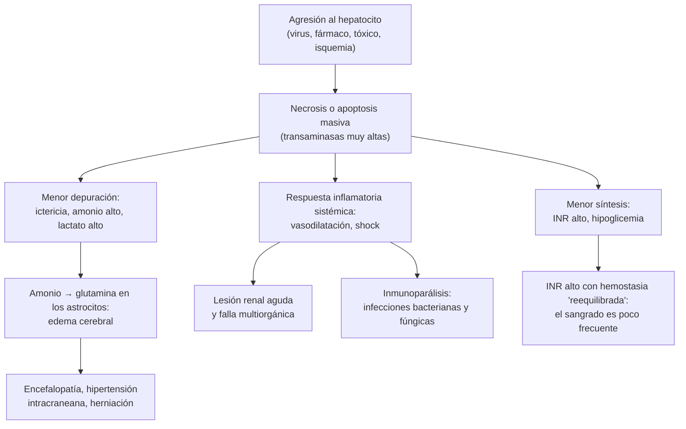

---
tags:
  - Gastroenterología
  - Urgencia
---

# Hepatitis aguda e insuficiencia hepática aguda

**Subespecialidad**
Gastroenterología · Hepatología · Medicina intensiva · Infectología

**Guías principales**
EASL 2017: insuficiencia hepática aguda (fulminante) · EASL 2019: daño hepático inducido por fármacos · ACG 2021: daño hepático idiosincrático por fármacos · EASL 2018: hepatitis E · ACIP 2020 (CDC): prevención de la hepatitis A

**Otras fuentes**
Ensayo de N-acetilcisteína en la insuficiencia hepática aguda no causada por paracetamol (Lee, *Gastroenterology* 2009) · Revisión de Stravitz y Lee (*Lancet* 2019) · Brote chileno de hepatitis A 2016–2017 (Rivas, *Euro Surveill* 2018) · Epidemiología molecular del virus A en Santiago (Levican, 2023) · MINSAL 2018: vacuna contra la hepatitis A en el Programa Nacional de Inmunizaciones

**GES**
No para la hepatitis aguda. La **hepatitis B crónica** y la **hepatitis C** sí son problemas GES.

**EUNACOM**
1.06.1.019 Hepatitis aguda A no complicada (específico, completo, completo) · 1.06.2.008 Hepatitis aguda A complicada (específico, inicial, derivar) · 1.06.1.020 Hepatitis agudas B, C, por otros virus, por drogas y tóxicas (específico, inicial, derivar) · 1.06.2.009 Insuficiencia hepática aguda (sospecha, inicial, derivar)

**Revisado**
Septiembre 2026

!!! abstract "Resumen en 60 segundos"
    - **Hepatitis aguda**: inflamación hepática de **< 6 meses**, con **transaminasas altas** (a menudo > 10 veces el límite normal), con o sin ictericia.
        - Causas: **virus** (A, B, E; menos C, herpes, CMV, VEB), **fármacos** (paracetamol, amoxicilina-ácido clavulánico, antituberculosos, hierbas), **isquemia**, **autoinmune**, **Wilson**.
    - **Hepatitis A**: fecal-oral, incubación de **~ 28 días** (15–50). Diagnóstico con **IgM anti-VHA**. Casi siempre **autolimitada**; menos del **1 %** evoluciona a insuficiencia hepática aguda (más en **> 40 años** y en hepatópatas).
        - Manejo **ambulatorio** de soporte. **Vacuna a los contactos dentro de 2 semanas**.
        - En Chile, la vacuna está en el **PNI desde 2018** (dosis única a los **18 meses**).
    - **Signos de gravedad**: **INR > 1,5**, **cualquier grado de encefalopatía**, **hipoglicemia**, bilirrubina en ascenso, LRA, acidosis. Hospitalizar y **derivar precozmente** a un centro con trasplante hepático.
    - **Insuficiencia hepática aguda (IHA)**: **INR > 1,5 + encefalopatía** en un paciente **sin hepatopatía previa**. Es rara pero **letal**.
        - Tratamiento: **UCI**, **glucosa EV**, evitar los sedantes, **N-acetilcisteína** precoz (incluso si no es por paracetamol), intubar en la encefalopatía grado 3 y evaluar el **trasplante** con los **criterios del King's College**.
    - **Paracetamol**: pedir la **paracetamolemia** en toda IHA; **NAC** de inmediato si hay daño hepático o un tiempo de ingesta incierto.
    - **Hepatitis B aguda**: > 95 % de los adultos se recupera, pero es la causa viral más frecuente de IHA. **Antiviral** (entecavir o tenofovir) si es grave.

## Definición

- **Hepatitis aguda**: daño hepatocelular de **menos de 6 meses** de evolución.
    - **Patrón hepatocelular**: predominio de las **transaminasas** (ALT). En las hepatitis virales, tóxicas e isquémicas suelen ser **> 10 veces** el límite normal.
    - **Patrón colestásico**: predominio de la **fosfatasa alcalina** y la GGT.
    - **Razón R** (daño por fármacos) = (ALT / LSN) ÷ (FA / LSN): **≥ 5 hepatocelular**, **≤ 2 colestásico**, **2–5 mixto**.
- **Daño hepático agudo grave**: marcadores de daño (transaminasas altas) con **falla de la función** hepática: **ictericia** e **INR > 1,5**, sin encefalopatía (EASL 2017).
- **Insuficiencia hepática aguda (IHA, "hepatitis fulminante")**: daño hepático agudo grave + **encefalopatía hepática**, en un paciente **sin enfermedad hepática previa** (EASL 2017).
    - Excepción: se considera IHA la presentación aguda de una **hepatitis autoinmune**, una **enfermedad de Wilson** o un **Budd-Chiari**, aunque exista una enfermedad previa.
    - Se distingue de la **cirrosis descompensada** y de la **insuficiencia hepática aguda sobre crónica**.
- **Ley de Hy** (daño por fármacos): **ALT > 3 × LSN** + **bilirrubina > 2 × LSN** sin colestasis. Marca un **alto riesgo de muerte** (hasta **10 %** con ictericia hepatocelular, ACG 2021).

## Epidemiología

### Mundial

- La **IHA es rara**: en Escocia, **0,62 por 100 000 habitantes al año**, con el **paracetamol** como causa más frecuente (EASL 2017).
- **Causas**:
    - En **Asia y África**: los **virus** (hepatitis **A, E y B**).
    - En **Europa y Estados Unidos**: el **daño por fármacos**, sobre todo la **sobredosis de paracetamol**.
- **Hepatitis B**: es la causa viral **más frecuente** de daño hepático agudo grave y de IHA. Menos del **4 %** de las hepatitis B agudas evoluciona a IHA, pero su mortalidad es mayor que la de la A y la E.
- **Hepatitis A**: menos del **1 %** evoluciona a IHA (EASL 2017; ACIP 2020). El riesgo es mayor en **mayores** y en pacientes con **hepatopatía crónica**. **No** se cronifica.
- **Daño por fármacos**: **antimicrobianos**, **hierbas y suplementos** y **anticancerosos** son las causas más frecuentes en Occidente (ACG 2021).
- El **trasplante hepático** se usa en cerca del **30 %** de las IHA (Stravitz y Lee, 2019).

### Chile

!!! chile "Contexto nacional"
    - **Brote de hepatitis A desde noviembre de 2016**, con predominio de **hombres que tienen sexo con hombres** (Rivas, 2018).
        - En la serie de la Red UC, 9 de 12 casos eran hombres, todos con sexo con hombres. El virus (genotipo **IA**) estaba emparentado con el brote europeo de 2016.
    - **Aguas servidas de Santiago 2010–2021** (Levican, 2023): circula sólo el **genotipo IA**. Tras el brote de 2017 se introdujeron **nuevos linajes**, probablemente desde otros países de Latinoamérica, en relación con la **migración**.
    - **Vacuna contra la hepatitis A en el PNI** desde el **5 de marzo de 2018**: **dosis única a los 18 meses** en todo el país.
        - Antes se aplicaba en **Tarapacá** y el **Biobío**, donde bajaron los casos en niños y también en adultos (efecto rebaño).
    - En Latinoamérica, los adultos jóvenes que no se infectaron en la infancia (por la mejoría sanitaria) quedaron **susceptibles**. Esto explica los brotes de 2017–2019 en Argentina, Brasil y Chile (Ré, 2024).
    - La hepatitis A es una **enfermedad de notificación obligatoria**.

## Etiología

| Grupo | Causas | Claves |
|---|---|---|
| **Virus hepatotropos** | **A** (fecal-oral), **B** (sexual, parenteral, vertical), **C** (parenteral; la aguda rara vez es grave), **D** (sólo con el B), **E** (fecal-oral, zoonosis; grave en **embarazadas**) | Serología (IgM) |
| **Otros virus** | **Herpes simple**, varicela zóster, **CMV**, **VEB**, dengue | Inmunosuprimidos y **embarazadas**; la ausencia de lesiones cutáneas **no descarta** el herpes |
| **Fármacos** | **Paracetamol** (dosis dependiente); idiosincráticos: **amoxicilina-ácido clavulánico**, **isoniazida** y otros antituberculosos, AINE, antiepilépticos (fenitoína, carbamazepina, valproato), nitrofurantoína, **hierbas y suplementos**, inhibidores de puntos de control | Historia de **todos** los fármacos y productos "naturales" de los últimos 3–6 meses |
| **Tóxicos** | **Amanita phalloides** (hongos), éxtasis, fósforo, solventes | Diarrea intensa 6–24 h después de comer hongos silvestres |
| **Isquémica** ("hepatitis hipóxica") | **Shock**, insuficiencia cardíaca, hipoxemia | ALT de **miles** que cae rápido; LDH muy alta |
| **Autoinmune** | Hepatitis autoinmune | Mujer, **IgG alta**, ANA o anti-músculo liso |
| **Metabólica** | **Enfermedad de Wilson** | Joven con **hemólisis Coombs negativa**, anillo de Kayser-Fleischer, **FA baja** en relación con la bilirrubina |
| **Vascular** | **Budd-Chiari** agudo | Dolor, **ascitis** y hepatomegalia; Doppler |
| **Embarazo** | **Hígado graso agudo**, **HELLP**, preeclampsia con rotura hepática | Tercer trimestre; hipoglicemia en el hígado graso agudo |
| **Otras** | Infiltración maligna (linfoma), síndrome hemofagocítico, golpe de calor | |

## Fisiopatología

*Figura 1. Fisiopatología de la insuficiencia hepática aguda. Esquema propio basado en EASL 2017.*

- **Paracetamol**: en dosis tóxicas se satura la conjugación y se forma más **NAPQI**, un metabolito tóxico que se neutraliza con el **glutatión**. Cuando el glutatión se agota, el NAPQI necrosa los hepatocitos. La **NAC** repone el glutatión.
    - El riesgo aumenta con el **ayuno**, el **alcoholismo** crónico, la desnutrición y los inductores enzimáticos (fenitoína).
- **Hepatitis virales**: el daño es sobre todo **inmunológico** (linfocitos T contra los hepatocitos infectados), por eso la ictericia coincide con la aparición de los anticuerpos.

## Clasificación

**Insuficiencia hepática aguda según el tiempo entre la ictericia y la encefalopatía (O'Grady)**

| Tipo | Intervalo | Características |
|---|---|---|
| **Hiperaguda** | **≤ 7 días** | Paracetamol, hepatitis A y E, isquemia. Coagulopatía intensa y transaminasas muy altas con bilirrubina moderada; más **edema cerebral**, pero **mejor sobrevida espontánea** |
| **Aguda** | **8–28 días** | Hepatitis B, entre otras |
| **Subaguda** | **5–12 semanas** | Fármacos idiosincráticos, causa indeterminada, autoinmune. Transaminasas menos altas, **ictericia intensa**, ascitis, hígado pequeño. **Baja sobrevida** sin trasplante; se confunde con cirrosis |

**Serología de la hepatitis B**

| Marcador | Hepatitis B aguda | Hepatitis B crónica | Infección pasada | Vacunado |
|---|---|---|---|---|
| **HBsAg** | + | + (> 6 meses) | − | − |
| **IgM anti-HBc** | **+** | − (puede aparecer en las reactivaciones) | − | − |
| **Anti-HBc total** | + | + | + | − |
| **Anti-HBs** | − | − | + | **+** |

## Clínica

- **Hepatitis aguda viral**:
    - **Pródromo** de días: fiebre baja, **malestar**, **anorexia**, náuseas, dolor en el hipocondrio derecho, aversión al cigarrillo.
    - Luego **ictericia**, **coluria** y **acolia**; con la ictericia el paciente suele sentirse **mejor**.
    - **Hepatomegalia** sensible.
    - Muchas infecciones por virus A en niños y por virus B y C son **asintomáticas** o anictéricas.
    - **Hepatitis A**: formas **colestásica** prolongada (prurito, ictericia de semanas) y **recurrente** (nuevo alza tras la mejoría), ambas benignas.
- **Daño por fármacos**: puede aparecer entre días y meses tras iniciar el fármaco (o tras suspenderlo, como con la amoxicilina-ácido clavulánico). Puede haber fiebre, exantema y **eosinofilia** (hipersensibilidad).
- **IHA**:
    - **Ictericia**, **encefalopatía** (desde cambios sutiles del ánimo y del sueño hasta el coma), **hipoglicemia**, hiperventilación.
    - **Hipotensión**, oliguria, infecciones.
    - Signos de **hipertensión intracraneana** en la encefalopatía grave: HTA, bradicardia, pupilas alteradas, postura anormal.
    - **Hígado pequeño** (necrosis) en las formas subagudas.

**Grados de encefalopatía hepática (West Haven)**: **1** alteraciones sutiles de la atención y el ánimo · **2** letargia, desorientación, **asterixis** · **3** somnolencia marcada, confusión, responde a estímulos · **4** **coma**.

!!! alarma "Signos de alarma: hospitalizar y derivar"
    - **INR > 1,5** (o protrombina < 50 %) en una hepatitis aguda.
    - **Cualquier grado de encefalopatía** (incluso cambios sutiles del ánimo o del sueño): es una IHA.
    - **Hipoglicemia**.
    - Bilirrubina en **ascenso** tras la primera semana, **hígado que se achica**, ascitis.
    - **LRA**, acidosis metabólica, lactato alto.
    - Hepatitis A en un paciente **> 40–50 años**, con **hepatopatía crónica** o **inmunosuprimido**.
    - **Embarazo** (hepatitis E, herpes, hígado graso agudo, HELLP).
    - Sospecha de **sobredosis de paracetamol** o de intoxicación por **hongos**.
    - Vómitos que impiden la hidratación oral.

## Diagnóstico

1. **Confirmar el daño hepático** y su patrón (transaminasas, FA, GGT, bilirrubina).
2. **Evaluar la función**: **INR** (o protrombina), **glicemia**, albúmina, **estado mental**.
3. **Buscar la causa** en paralelo (ver el laboratorio). La historia de **fármacos, hierbas, alcohol, viajes, conductas sexuales y hongos** es clave.
4. **Imagen**: **ecografía con Doppler** (descarta obstrucción biliar, Budd-Chiari y signos de hepatopatía crónica).
5. En la IHA, **derivar precozmente** a un centro con trasplante.

!!! guia "Criterios de gravedad y de trasplante (EASL 2017)"
    **Derivar a un centro especializado** (tabla 10 de EASL):

    | Paracetamol o causa hiperaguda | Otra causa |
    |---|---|
    | pH < 7,30 o bicarbonato < 18 | pH < 7,30 o bicarbonato < 18 |
    | INR > 3,0 al día 2 o > 4,0 después | **INR > 1,8** |
    | Oliguria o creatinina elevada | Oliguria o LRA, o sodio < 130 |
    | Compromiso de conciencia | Encefalopatía, hipoglicemia o acidosis |
    | **Hipoglicemia** | Bilirrubina > 17,6 mg/dL |
    | Lactato alto que no responde a volumen | **Hígado que se achica** |

    **Criterios del King's College para el trasplante urgente**:

    - **Por paracetamol**: **pH arterial < 7,3** (tras la reanimación y > 24 h de la ingesta), o **lactato > 3 mmol/L**, o los tres siguientes: encefalopatía **grado ≥ 3**, **creatinina > 3,4 mg/dL** (> 300 µmol/L) e **INR > 6,5**.
    - **Por otra causa**: **INR > 6,5**, o **3 de 5**: causa indeterminada o por fármacos; edad < 10 o > 40 años; intervalo ictericia-encefalopatía > 7 días; bilirrubina > 17,6 mg/dL (> 300 µmol/L); INR > 3,5.

## Laboratorio

- **Perfil hepático** completo, **INR**, **glicemia**, hemograma, creatinina, electrolitos (Na, K, **fósforo**, Mg), **gases y lactato**, lipasa, **amonio** (en la IHA), grupo y Rh.
- **Serología viral**:
    - **IgM anti-VHA**: se hace positiva en los primeros **5–10 días** de síntomas y desaparece en ~ 6 meses (ACIP 2020).
    - **HBsAg** e **IgM anti-HBc** (hepatitis B aguda); **anti-VHD** si es HBsAg positivo.
    - **Anti-VHC** y **ARN del VHC** (en la hepatitis C aguda el anti-VHC puede ser aún negativo).
    - **IgM anti-VHE** o ARN del VHE.
    - PCR de **herpes simple**, VZV, **CMV** y **VEB** si la causa no es clara.
    - **VIH**.
- **Paracetamolemia** en **toda** hepatitis aguda grave o IHA (aunque se niegue la ingesta), y **screening toxicológico**.
- **Autoinmune**: **ANA**, anti-músculo liso, **IgG**.
- **Wilson** (paciente joven): **ceruloplasmina**, cobre en orina de 24 h, examen con lámpara de hendidura.
- **β-hCG** en mujeres en edad fértil.
- **Cultivos** (sangre, orina, respiratorio) en la IHA.

<figure markdown>
![Gráfico en el tiempo, en semanas desde la exposición. Durante la incubación de unas 4 semanas aparece el virus en las deposiciones, con su máximo 2 semanas antes de la ictericia. Al inicio de la ictericia, alrededor de la semana 4 a 5, suben las transaminasas, con un peak cerca de la semana 6 y normalización hacia la semana 12. La IgM anti-VHA aparece con los síntomas, alcanza su máximo alrededor de la semana 8 y se negativiza hacia los 6 meses. La IgG anti-VHA aparece un poco después y persiste de por vida](../assets/figuras/hepatitis/curso-hepatitis-a.svg){ loading=lazy }
<figcaption>Figura 2. Curso clínico y serológico de la hepatitis A: excreción fecal del virus (máximo contagio antes de la ictericia), alza de las transaminasas, IgM anti-VHA (marcador de infección aguda) e IgG anti-VHA (inmunidad de por vida). Esquema propio basado en los tiempos descritos por el ACIP (CDC, 2020).</figcaption>
</figure>

## Imágenes

- **Ecografía abdominal con Doppler**: tamaño y aspecto del hígado, **vía biliar** (descarta obstrucción), **vasos** (Budd-Chiari, trombosis portal), ascitis, esplenomegalia (sugiere hepatopatía crónica).
- **TC de cerebro** en la IHA con encefalopatía avanzada o deterioro brusco (edema, hemorragia). Una TC normal **no descarta** hipertensión intracraneana.
- **Biopsia hepática** sólo en casos seleccionados (sospecha de autoinmune, infiltración maligna), habitualmente por vía transyugular.

## Diagnóstico diferencial

| Cuadro | Claves |
|---|---|
| **Obstrucción biliar (coledocolitiasis, colangitis)** | Dolor tipo cólico, fiebre, **FA y GGT** predominantes, **vía biliar dilatada**; la ALT puede subir mucho en forma transitoria |
| **Hepatitis alcohólica** | Consumo intenso, **AST/ALT > 2**, AST rara vez > 300–400, leucocitosis, fiebre |
| **Hepatitis isquémica** | Shock o insuficiencia cardíaca; ALT de miles que cae en días; **LDH muy alta** |
| **Cirrosis descompensada** | Estigmas de daño crónico, esplenomegalia, trombocitopenia, hígado nodular; no es IHA |
| **Sepsis con colestasis** | Foco infeccioso, bilirrubina alta con transaminasas moderadas |
| **Hemólisis** | Bilirrubina **indirecta**, LDH alta, haptoglobina baja, transaminasas normales |
| **Síndrome de Gilbert** | Bilirrubina indirecta leve, fluctuante, con ayuno o estrés; resto normal |

## Tratamiento

### Hepatitis A no complicada (manejo completo en APS)

- **Ambulatorio**, con **reposo relativo** según tolerancia, hidratación y alimentación normal (no hay dietas especiales).
- **Suspender el alcohol** y los fármacos **hepatotóxicos** innecesarios. Si necesita analgesia: **paracetamol ≤ 2 g/día**.
- **Antieméticos** si hay vómitos; colestiramina si hay prurito intenso (formas colestásicas).
- **Higiene de manos** y no compartir utensilios; el paciente contagia desde 2 semanas antes hasta ~ 1 semana después del inicio de la ictericia.
- **Control** con transaminasas, bilirrubina e **INR** hasta la mejoría; educar sobre los **signos de alarma**.
- **Notificar** el caso.
- **Contactos** (convivientes, parejas sexuales): **vacuna contra la hepatitis A dentro de 2 semanas** de la exposición en los no vacunados ≥ 12 meses. En los **> 40 años**, inmunosuprimidos o hepatópatas se puede agregar **inmunoglobulina** (0,1 mL/kg) (ACIP 2020).

### Hepatitis A complicada y otras hepatitis agudas (manejo inicial y derivación)

- **Hepatitis A complicada** (INR > 1,5, encefalopatía, colestasis prolongada, falla renal, paciente mayor o hepatópata): **hospitalizar** y **derivar**.
- **Hepatitis B aguda**:
    - En el adulto inmunocompetente, **> 95 %** se recupera sin tratamiento.
    - **Antiviral** (**entecavir** o **tenofovir**) si es **grave** (coagulopatía, curso prolongado) o evoluciona a **IHA**: el tratamiento precoz reduce la progresión (EASL 2017).
    - Estudiar a los **contactos** sexuales y del hogar, y **vacunarlos**.
    - Control del **HBsAg a los 6 meses** para descartar la cronificación.
- **Hepatitis C aguda**: derivar para **tratamiento antiviral** (se trata igual que la crónica).
- **Hepatitis E**: autolimitada en la mayoría; grave en **embarazadas** y hepatópatas; crónica en inmunosuprimidos.
- **Daño por fármacos** (EASL 2019, ACG 2021):
    - **Suspender** el fármaco sospechoso (y todos los no esenciales). Es un **diagnóstico de exclusión**.
    - Derivar a un centro terciario si hay **ictericia progresiva** o coagulopatía (ley de Hy).
    - Los **corticoides** son controvertidos; se usan cuando no se puede distinguir de una hepatitis autoinmune.
    - **No reexponer** al fármaco.
- **Sobredosis de paracetamol**:
    - **NAC** según la paracetamolemia y el **nomograma** (desde las 4 h de la ingesta).
    - Iniciar la NAC **sin esperar** el nivel si la ingesta es > 150 mg/kg, el tiempo es incierto, la ingesta fue **escalonada** o ya hay **daño hepático** (EASL 2017).
    - Consultar a **CITUC** (+56 2 2635 3800).

### Insuficiencia hepática aguda (EASL 2017)

- **Traslado precoz** a una **UCI** de un centro con **trasplante hepático** (idealmente antes de la encefalopatía grado 3). Intubar antes del traslado si la encefalopatía progresa.
- **Glucosa EV continua** (suero glucosado al 10–20 %), con meta de glicemia de ~ **140 mg/dL**. Controlar la glicemia con frecuencia.
- **Sodio** 135–145 mEq/L; en la encefalopatía avanzada, **140–150** con suero hipertónico.
- **N-acetilcisteína** en las **etapas precoces**, **también si no es por paracetamol**.
    - En el ensayo de Lee (2009), la NAC mejoró la **sobrevida sin trasplante** en la encefalopatía **grado I–II** (52 % vs. 30 %), pero no en los grados III–IV.
    - EASL sugiere limitarla a un **máximo de 5 días**.
- **Evitar los sedantes** y los fármacos hepatotóxicos y nefrotóxicos.
- **Volumen** para mantener la perfusión; noradrenalina si persiste la hipotensión.
- **No corregir el INR** con plasma ni factores en forma profiláctica: sólo si hay **sangrado** o un procedimiento invasivo. El INR es un marcador de **pronóstico**. Transfundir si la **hemoglobina < 7 g/dL**.
- **Profilaxis de úlcera de estrés**.
- **Encefalopatía**:
    - Ambiente tranquilo, **cabecera a 30°**, cabeza en posición neutra.
    - **Intubar** en la encefalopatía **grado 3 o más**.
    - Tratar la hipertensión intracraneana (suero hipertónico, manitol).
- **Infecciones**: cultivos periódicos. **Umbral bajo** para iniciar antibióticos empíricos si hay deterioro hemodinámico o de la encefalopatía; la **profilaxis rutinaria no mejora la sobrevida**.
- **Tratamiento específico de la causa**: NAC (paracetamol), **antivirales** (hepatitis B, herpes: **aciclovir**), **corticoides** (autoinmune: si no mejora en 7 días, lista de trasplante), **interrupción del embarazo** (hígado graso agudo, HELLP), penicilina o silibinina (Amanita), según el especialista.
- **Trasplante hepático urgente** según los criterios del King's College o de Clichy.

!!! dosis "Dosis"
    - **N-acetilcisteína EV** (esquema clásico de 21 h):
        - **150 mg/kg** en 1 hora.
        - Luego **50 mg/kg** en 4 horas.
        - Luego **100 mg/kg** en 16 horas.
        - En la IHA, se **prolonga** la última infusión (por ejemplo, hasta 72 h en el ensayo de Lee) según el centro.
    - **Glucosa**: suero glucosado al **10 %** en infusión continua (al 20 % por vía central si hay restricción de volumen).
    - **Entecavir** 0,5 mg/día VO o **tenofovir disoproxil** 245–300 mg/día VO (ajustar a la función renal) en la hepatitis B aguda grave.
    - **Aciclovir** 10 mg/kg EV c/8 h si se sospecha una hepatitis por herpes.
    - **Paracetamol** como analgésico en la hepatitis aguda: **máximo 2 g/día**.
    - **Vacuna de la hepatitis A** para los contactos: una dosis IM (dentro de 2 semanas de la exposición).

## Complicaciones

- **Insuficiencia hepática aguda** y muerte.
- **Edema cerebral** e hipertensión intracraneana (sobre todo en las formas hiperagudas).
- **Hipoglicemia**, hiponatremia, hipofosfemia, hipokalemia.
- **LRA** (frecuente con el paracetamol).
- **Infecciones** bacterianas y fúngicas (inmunoparálisis).
- **Hemorragia** (poco frecuente, pese al INR alto), sobre todo con trombocitopenia marcada.
- **Pancreatitis** asociada; aplasia medular tras una hepatitis (rara).
- **Cronificación** en las hepatitis **B** (< 5 % de los adultos), **C** y **E** (inmunosuprimidos). La hepatitis A **nunca** se cronifica.

## Pronóstico y seguimiento

- **Hepatitis A**: recuperación completa en la gran mayoría en semanas a pocos meses; da **inmunidad de por vida**.
- **IHA**:
    - Las formas **hiperagudas** (paracetamol, hepatitis A) tienen **mejor sobrevida espontánea**.
    - Las **subagudas** (fármacos idiosincráticos, causa indeterminada) tienen muy baja sobrevida sin trasplante.
    - La mortalidad bajó con el manejo intensivo moderno y el trasplante.
- **Daño por fármacos con ictericia hepatocelular**: mortalidad de hasta **10 %** (ACG 2021).
- **Seguimiento**:
    - Transaminasas, bilirrubina e **INR** hasta su normalización.
    - **HBsAg a los 6 meses** en la hepatitis B aguda.
    - Evaluar la **vacunación** (hepatitis A y B) en los hepatópatas y los grupos de riesgo.
    - Registrar la **alergia** al fármaco causante.

## Perlas para el internado

!!! perla "Para la sala y el turno"
    - En toda hepatitis aguda, mide el **INR** y pregunta por el **estado mental**: separan la hepatitis "que se va a la casa" de la que va a la **UCI**.
    - **Cualquier** alteración mental en un paciente ictérico con INR alto es una **IHA**: llama al centro de trasplante **ese día**.
    - Pide **paracetamolemia** en toda IHA, aunque el paciente niegue la ingesta. Ante la duda, **inicia la NAC**.
    - Las **hipoglicemias** en la IHA pueden confundirse con la encefalopatía: glicemia capilar frecuente y **glucosa EV continua**.
    - **No corrijas el INR** con plasma "para que se vea mejor": es un marcador pronóstico y se reserva para el sangrado o los procedimientos.
    - Evita las **benzodiazepinas** y otros sedantes en el paciente con hepatitis grave.
    - En la hepatitis A, **vacuna a los contactos** dentro de 2 semanas y deja registrada la **notificación**.
    - Pregunta siempre por **hierbas, suplementos y productos "naturales"**: son una causa frecuente de daño hepático.
    - Una **ALT de miles que cae rápido** en un paciente que estuvo en shock es una **hepatitis isquémica**, no viral.
    - Un joven con hepatitis, **hemólisis Coombs negativa** y **FA baja**: piensa en **Wilson**.

## Preguntas de repaso

??? repaso "1. Hombre de 28 años con 5 días de malestar, náuseas y fiebre baja, y desde hace 2 días ictericia y coluria. ALT 2350 U/L, bilirrubina 6 mg/dL, INR 1,1, lúcido. IgM anti-VHA positiva. ¿Qué haces?"
    **Hepatitis A aguda no complicada.**

    - **Manejo ambulatorio**: reposo según tolerancia, hidratación, dieta normal, **sin alcohol** ni hepatotóxicos (paracetamol ≤ 2 g/día si lo necesita).
    - **Higiene** para evitar el contagio.
    - **Control** de transaminasas, bilirrubina e **INR** en pocos días; volver si hay **somnolencia, confusión, vómitos persistentes o sangrado**.
    - **Notificar** el caso.
    - **Vacunar a los contactos** (convivientes y parejas sexuales) no vacunados dentro de **2 semanas**.
    - Considerar el estudio de otras ITS si el contexto lo sugiere (el brote chileno de 2016–2017 afectó sobre todo a hombres que tienen sexo con hombres).

??? repaso "2. Mujer de 52 años con hepatitis A de 10 días. Hoy está somnolienta y desorientada, INR 2,4, glicemia 58 mg/dL. ¿Qué tiene y qué haces?"
    **Insuficiencia hepática aguda** (INR > 1,5 + encefalopatía) por hepatitis A, en una paciente > 40 años (factor de mal pronóstico).

    - **Glucosa EV** (bolo si hay hipoglicemia y luego **suero glucosado al 10 %** continuo).
    - **Hospitalizar en la UCI** y **contactar de inmediato a un centro de trasplante hepático**.
    - **N-acetilcisteína EV** (encefalopatía precoz).
    - Evitar los sedantes; cabecera a 30°; **intubar** si progresa a grado 3.
    - Cultivos; antibióticos si hay deterioro.
    - No corregir el INR salvo sangrado o procedimiento.
    - Evaluar los **criterios del King's College**: la edad > 40 años es uno de ellos.

??? repaso "3. Joven de 19 años llevada a urgencia 10 horas después de ingerir 30 comprimidos de paracetamol de 500 mg (15 g; pesa 55 kg). Está asintomática. ¿Qué haces?"
    **Sobredosis potencialmente grave** (~ 270 mg/kg, muy por sobre 150 mg/kg).

    - **Paracetamolemia**, perfil hepático, INR, creatinina, gases, glicemia.
    - **Iniciar la NAC EV de inmediato** (no esperar el nivel: han pasado más de 8 horas): 150 mg/kg en 1 h, 50 mg/kg en 4 h, 100 mg/kg en 16 h.
    - Consultar a **CITUC**.
    - Continuar la NAC si hay daño hepático al final del esquema.
    - **Evaluación psiquiátrica** (intento suicida) antes del alta.
    - Recordar: estar asintomática **no descarta** un daño hepático, que aparece a las 24–72 h.

??? repaso "4. Hombre de 45 años con ictericia 3 semanas después de terminar un tratamiento de amoxicilina-ácido clavulánico por una sinusitis. ALT 480, FA 520, bilirrubina 9 mg/dL, INR 1,2. Serologías virales negativas. ¿Qué sospechas?"
    **Daño hepático inducido por fármacos** por **amoxicilina-ácido clavulánico**, una de las causas más frecuentes. Puede aparecer semanas después de suspender el fármaco y suele tener un patrón **colestásico o mixto**.

    - Razón R = (480/40) ÷ (520/120) ≈ 12 ÷ 4,3 ≈ **2,8**: patrón **mixto** (asumiendo LSN de ALT 40 y de FA 120).
    - Es un **diagnóstico de exclusión**: descartar obstrucción biliar (**ecografía**), virus, autoinmune.
    - Manejo: suspender los fármacos no esenciales, controlar el INR y la bilirrubina, y **derivar** si la ictericia progresa o aparece coagulopatía.
    - **No volver a usar** amoxicilina-ácido clavulánico (registrar la reacción adversa).

??? repaso "5. Paciente con HBsAg positivo e IgM anti-HBc positiva, ALT 1800, INR 1,9, sin encefalopatía. ¿Cómo lo clasificas y qué haces?"
    **Hepatitis B aguda grave** (daño hepático agudo grave: INR > 1,5, sin encefalopatía aún).

    - **Hospitalizar** y **derivar** a hepatología.
    - Iniciar un **antiviral** (**entecavir** o **tenofovir**): el tratamiento precoz reduce la progresión a IHA.
    - Vigilar el **estado mental**, la glicemia y el INR.
    - Estudiar el **VHD** y el **VIH**.
    - Estudiar y **vacunar** a los contactos; control del HBsAg a los 6 meses.

??? repaso "6. ¿Qué criterios del King's College indican el trasplante en una IHA por paracetamol?"
    - **pH arterial < 7,3** tras la reanimación (y > 24 h de la ingesta), **o**
    - **lactato > 3 mmol/L**, **o**
    - los **tres** siguientes: encefalopatía **grado ≥ 3**, **creatinina > 3,4 mg/dL** (> 300 µmol/L) e **INR > 6,5**.

    Estos pacientes deben estar en un centro con trasplante **antes** de cumplir los criterios (EASL recomienda derivar con pH < 7,30, INR > 3 al día 2, oliguria, compromiso de conciencia, hipoglicemia o lactato alto).

## Referencias

1. European Association for the Study of the Liver; Wendon J, Cordoba J, Dhawan A, et al. EASL Clinical Practical Guidelines on the management of acute (fulminant) liver failure. *J Hepatol.* 2017;66:1047–1081. doi:[10.1016/j.jhep.2016.12.003](https://doi.org/10.1016/j.jhep.2016.12.003)
2. European Association for the Study of the Liver. EASL Clinical Practice Guidelines: drug-induced liver injury. *J Hepatol.* 2019;70:1222–1261. doi:[10.1016/j.jhep.2019.02.014](https://doi.org/10.1016/j.jhep.2019.02.014)
3. Chalasani NP, Maddur H, Russo MW, et al. ACG Clinical Guideline: diagnosis and management of idiosyncratic drug-induced liver injury. *Am J Gastroenterol.* 2021;116:878–898. doi:[10.14309/ajg.0000000000001259](https://doi.org/10.14309/ajg.0000000000001259)
4. European Association for the Study of the Liver. EASL Clinical Practice Guidelines on hepatitis E virus infection. *J Hepatol.* 2018;68:1256–1271. doi:[10.1016/j.jhep.2018.03.005](https://doi.org/10.1016/j.jhep.2018.03.005)
5. Nelson NP, Weng MK, Hofmeister MG, et al. Prevention of hepatitis A virus infection in the United States: recommendations of the Advisory Committee on Immunization Practices, 2020. *MMWR Recomm Rep.* 2020;69(5):1–38. doi:[10.15585/mmwr.rr6905a1](https://doi.org/10.15585/mmwr.rr6905a1)
6. Lee WM, Hynan LS, Rossaro L, et al. Intravenous N-acetylcysteine improves transplant-free survival in early stage non-acetaminophen acute liver failure. *Gastroenterology.* 2009;137:856–864. doi:[10.1053/j.gastro.2009.06.006](https://doi.org/10.1053/j.gastro.2009.06.006)
7. Stravitz RT, Lee WM. Acute liver failure. *Lancet.* 2019;394:869–881. doi:[10.1016/S0140-6736(19)31894-X](https://doi.org/10.1016/S0140-6736(19)31894-X)
8. European Association for the Study of the Liver. EASL Clinical Practice Guidelines on the management of hepatitis B virus infection. *J Hepatol.* 2025;83:502–583. doi:[10.1016/j.jhep.2025.03.018](https://doi.org/10.1016/j.jhep.2025.03.018)
9. Rivas V, Barrera A, Pino K, et al. Hepatitis A outbreak since November 2016 affecting men who have sex with men (MSM) in Chile connected to the current outbreak in MSM in Europe, situation up to October 2017. *Euro Surveill.* 2018;23(9):18-00060. doi:[10.2807/1560-7917.ES.2018.23.9.18-00060](https://doi.org/10.2807/1560-7917.ES.2018.23.9.18-00060)
10. Levican J, Ampuero M, Rabello C, et al. Changing molecular epidemiology of hepatitis A virus in Santiago, Chile from 2010 to 2021. *Infect Genet Evol.* 2023;111:105428. doi:[10.1016/j.meegid.2023.105428](https://doi.org/10.1016/j.meegid.2023.105428)
11. Ré VE, Ridruejo E, Fantilli AC, et al. Hepatitis A in Latin America: the current scenario. *Rev Med Virol.* 2024;34:e2566. doi:[10.1002/rmv.2566](https://doi.org/10.1002/rmv.2566)
12. Ministerio de Salud de Chile. Ministerio de Salud incorporó al calendario de vacunación la vacuna contra hepatitis A para menores de dos años (marzo de 2018). [minsal.cl](https://www.minsal.cl/ministerio-de-salud-incorporo-al-calendario-de-vacunacion-la-vacuna-contra-hepatitis-a-para-menores-de-dos-anos/)
