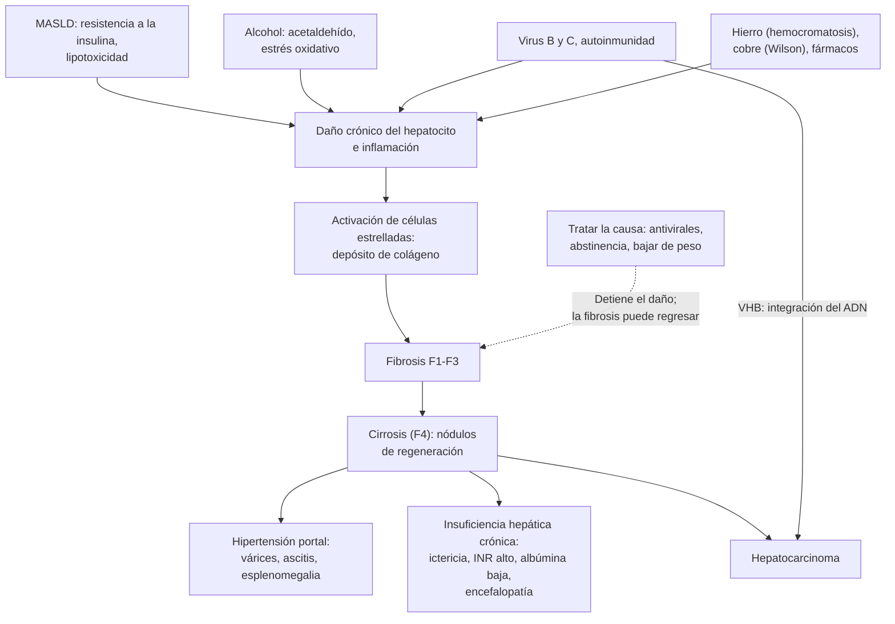

---
tags:
  - Gastroenterología
  - GES
---

# Hepatitis crónica e insuficiencia hepática crónica

**Subespecialidad**
Gastroenterología · Hepatología · Infectología · Atención primaria

**Guías principales**
EASL 2025: hepatitis B · MINSAL 2021: orientación técnica de hepatitis B · AASLD-IDSA 2023: hepatitis C · MINSAL 2019: protocolo simplificado de hepatitis C · EASL-EASD-EASO 2024: MASLD · EASL-EASD-EASO 2026: resmetirom y semaglutida en la MASH · ACG 2024: enfermedad hepática por alcohol · EASL 2025: hepatitis autoinmune · EASL 2022: hemocromatosis · EASL-ERN 2025: enfermedad de Wilson

**Otras fuentes**
Nomenclatura de la enfermedad hepática esteatósica (Rinella 2023) · Epidemiología mundial de la MASLD (Younossi 2023) · MAESTRO-NASH (2024) y ESSENCE (2025) · ENS 2009–2010 · Prevalencia de hígado graso en Chile (Riquelme 2009)

**GES**
Sí: **hepatitis crónica por virus B** (problema 69) y **hepatitis crónica por virus C** (problema 70), ambas desde 2010. Evaluación inicial dentro de **30 días** desde la confirmación y tratamiento dentro de **30 días** desde la indicación. El tratamiento farmacológico tras el alta por **cirrosis** es el problema 88 ([ver cirrosis](cirrosis-y-complicaciones.md)).

**EUNACOM**
1.06.1.021 Hepatitis crónica (específico, inicial, derivar) · 1.06.1.022 Insuficiencia hepática crónica (específico, inicial, derivar)

**Revisado**
Octubre 2026

!!! abstract "Resumen en 60 segundos"
    - **Hepatitis crónica**: inflamación del hígado por **más de 6 meses**. Suele ser **asintomática** y se detecta por **transaminasas elevadas**, una ecografía con esteatosis o una serología positiva.
    - Lleva a **fibrosis**, **cirrosis**, **insuficiencia hepática crónica** y **hepatocarcinoma**.
    - **Causas más frecuentes en Chile**:
        - **MASLD** (hígado graso asociado a disfunción metabólica; ~1 de cada 3 adultos en el mundo).
        - **Alcohol**.
        - Luego las hepatitis **C** y **B**, **autoinmune**, **hemocromatosis**, **Wilson** y **fármacos**.
    - **Primera línea de estudio**: HBsAg y anti-HBc, **anti-VHC**, perfil metabólico, **ferritina y saturación de transferrina**, ANA, anti-músculo liso e IgG, TSH, serología celíaca y **ecografía**.
    - **Estadificar la fibrosis en todos**: **FIB-4** (< 1,3 bajo riesgo) y, si es ≥ 1,3, **elastografía** (≥ 8 kPa: derivar).
    - **Tratamiento según la causa**:
        - **MASLD**: bajar **7–10 %** del peso; resmetirom o semaglutida en la MASH con fibrosis F2–F3.
        - **Alcohol**: **abstinencia**.
        - **Hepatitis C**: **sofosbuvir/velpatasvir 12 semanas** (cura > 95 %, **GES**).
        - **Hepatitis B**: **tenofovir o entecavir** si hay hepatitis activa, fibrosis o cirrosis (**GES**).
        - **Autoinmune**: **corticoides + azatioprina**.
        - **Hemocromatosis**: **flebotomías**.
        - **Wilson**: **quelantes o zinc**.
    - **Insuficiencia hepática crónica** = **cirrosis descompensada**: **ictericia**, **ascitis**, **encefalopatía**, coagulopatía e hipoalbuminemia. Derivar a hepatología y evaluar el **trasplante** (MELD ≥ 15).

## Definición

| Concepto | Definición |
|---|---|
| **Hepatitis crónica** | Inflamación hepática que persiste **> 6 meses**, demostrada por transaminasas elevadas, marcadores virales o histología, con riesgo de **fibrosis progresiva** |
| **Enfermedad hepática esteatósica** (SLD) | Término general para la **esteatosis hepática** (≥ 5 % de los hepatocitos con grasa) por imagen o biopsia, de cualquier causa |
| **MASLD** (antes "hígado graso no alcohólico", NAFLD) | Esteatosis + **al menos 1 criterio cardiometabólico** (IMC o cintura elevados, glicemia alterada o DM2, presión ≥ 130/85 o tratamiento, triglicéridos ≥ 150 mg/dL, HDL bajo) **sin** consumo de riesgo de alcohol ni otra causa |
| **MASH** (antes NASH) | MASLD con **inflamación** y **balonamiento** hepatocitario en la histología; es la forma que progresa a fibrosis |
| **MetALD** | MASLD **con** consumo de alcohol de **20–50 g/día en la mujer** o **30–60 g/día en el hombre** |
| **Enfermedad hepática por alcohol** (ALD) | Consumo **> 50 g/día** en la mujer o **> 60 g/día** en el hombre |
| **Hepatitis B crónica** | **HBsAg positivo por > 6 meses** |
| **Hepatitis C crónica** | **ARN-VHC detectable por > 6 meses** (anti-VHC positivo solo indica contacto) |
| **Hepatitis autoinmune** | Hepatitis crónica inmunomediada, con **IgG alta**, **autoanticuerpos** (ANA, anti-músculo liso, anti-LKM1) y **hepatitis de interfase** en la biopsia |
| **Fibrosis hepática** (METAVIR) | **F0** sin fibrosis · **F1** portal · **F2** significativa · **F3** avanzada (puentes) · **F4** cirrosis |
| **Enfermedad hepática crónica avanzada compensada** (cACLD) | Fibrosis avanzada o cirrosis sin descompensación, definida en forma no invasiva (elastografía ≥ 15 kPa) |
| **Insuficiencia hepática crónica** | Pérdida progresiva de la **función de síntesis y de depuración** del hígado por una enfermedad crónica (en la práctica, **cirrosis descompensada**): ictericia, hipoalbuminemia, coagulopatía, ascitis, encefalopatía |
| **Insuficiencia hepática aguda sobre crónica** (ACLF) | Descompensación aguda de una hepatopatía crónica con **falla de órganos** (hígado, riñón, cerebro, coagulación, circulación, respiración) y alta mortalidad a corto plazo |

## Epidemiología

- **MASLD**: afecta al **~30 %** de los adultos del mundo y va en **aumento** (de 25 % en 1990–2006 a 38 % en 2016–2019). La prevalencia más alta está en **Latinoamérica** (**44 %**) (Younossi 2023). Es la principal causa de hepatopatía crónica y una causa creciente de cirrosis, hepatocarcinoma y trasplante.
- **Alcohol**: principal causa de cirrosis en muchos países; aumentó durante la pandemia de COVID-19.
- **Hepatitis B**: **> 250 millones** de portadores crónicos en el mundo (EASL 2025). El riesgo de cronificación depende de la **edad de la infección**: > 90 % en los recién nacidos y **< 5 %** en los adultos.
- **Hepatitis C**: **55–85 %** de los infectados se cronifica. De ellos, **15–30 %** desarrolla **cirrosis en 20 años** (MINSAL 2019).
- **Hepatitis autoinmune**: rara (10–25 por 100 000); predomina en **mujeres** (3–4:1), a cualquier edad.
- **Hemocromatosis hereditaria** (*HFE* C282Y homocigoto): frecuente en el norte de Europa (~1 en 200–300); la expresión clínica es menor, sobre todo en las mujeres antes de la menopausia.
- **Wilson**: rara (~1 en 30 000); se presenta entre los **5 y 40 años**.

!!! chile "Datos nacionales"
    - **MASLD**: en un estudio de Santiago, el **23 %** de los adultos tenía hígado graso en la ecografía, asociado a obesidad, resistencia a la insulina y PCR elevada (Riquelme 2009). La ENS 2016–2017 mostró un **74 %** de sobrepeso u obesidad y un **12 %** de diabetes, lo que anticipa una carga creciente.
    - **Alcohol y MASLD** son las **principales causas de cirrosis** en Chile ([ver cirrosis](cirrosis-y-complicaciones.md)).
    - **Hepatitis B**:
        - **Baja endemia**: HBsAg positivo en el **0,15 %** de los mayores de 15 años en la **ENS 2009–2010** (0,31 % en los hombres).
        - Transmisión sobre todo **sexual** en adolescentes y adultos (**95 %** se resuelve como infección aguda).
        - Predomina el **genotipo F** (~80 %).
        - **Vacuna** en los lactantes desde **2005** y en los **recién nacidos** desde **2019** (MINSAL 2021).
        - **GES desde 2010**.
    - **Hepatitis C**:
        - Se estiman **~35 000 infectados**, de los cuales **menos de 10 000** están diagnosticados.
        - **Genotipo 1b** (~80 %) y 3 (~18 %).
        - **GES** con antivirales de acción directa (**sofosbuvir/velpatasvir**) y protocolo simplificado para la APS (MINSAL 2019). Es de **notificación obligatoria**.
    - **Tamizaje**: el anti-VHC y el HBsAg se piden en las **embarazadas** (HBsAg), los **donantes**, las personas con **transaminasas elevadas** y los grupos de riesgo.

## Etiología

| Causa | Claves clínicas | Examen clave |
|---|---|---|
| **MASLD/MASH** | Obesidad abdominal, DM2, HTA, dislipidemia; ALT > AST | Ecografía (esteatosis), **FIB-4**, elastografía |
| **Alcohol** (ALD, MetALD) | Consumo de riesgo; **AST/ALT > 2**; GGT y VCM altos | Historia (AUDIT), GGT, VCM |
| **Hepatitis C** | Transfusiones antiguas (antes del tamizaje en los bancos de sangre), drogas inyectables, tatuajes, HSH con VIH; crioglobulinemia | **Anti-VHC** → **ARN-VHC** |
| **Hepatitis B** | Contacto sexual, vertical, inmigrantes de zonas endémicas, drogas; **coinfección delta** | **HBsAg**, anti-HBc, HBeAg, **ADN-VHB** |
| **Hepatitis autoinmune** | Mujer, otras autoinmunidades (tiroiditis), **IgG alta**; puede debutar como hepatitis aguda | **ANA**, **anti-músculo liso**, anti-LKM1, **IgG**, **biopsia** |
| **Hemocromatosis** | Hombre > 40 años, mujer posmenopáusica; artropatía de 2.ª y 3.ª MCF, DM, hiperpigmentación, hipogonadismo, miocardiopatía | **Saturación de transferrina > 45 %**, ferritina alta, ***HFE* C282Y** |
| **Enfermedad de Wilson** | **< 40 años**; síntomas **neuropsiquiátricos** (temblor, disartria, parkinsonismo, psicosis), hemólisis | **Ceruloplasmina baja**, **cobre urinario de 24 h alto**, anillo de **Kayser-Fleischer** |
| **Déficit de α1-antitripsina** | Enfisema precoz de bases, hepatopatía | **α1-antitripsina** sérica y fenotipo |
| **Fármacos y hierbas** | Metotrexato, amiodarona, isoniazida, nitrofurantoína, estatinas (raro), suplementos | Relación temporal |
| **Otras** | **Celíaca**, hipo e hipertiroidismo, **hepatopatía congestiva** (insuficiencia cardíaca, pericarditis constrictiva), enfermedades musculares (AST y ALT de músculo, **CK alta**) | Serología celíaca, TSH, ecocardiograma, CK |
| **Colestásicas** | Colangitis biliar primaria (mujer, prurito, **anti-mitocondriales**), colangitis esclerosante primaria (EII) | Fosfatasa alcalina, GGT, AMA, colangio-RM |

## Fisiopatología

- **Daño crónico** del hepatocito (virus, grasa y lipotoxicidad, alcohol, autoinmunidad, hierro, cobre) → **inflamación** persistente → activación de las **células estrelladas** → depósito de **colágeno** (**fibrosis**).
- La fibrosis avanza desde los **espacios porta** (F1–F2), forma **puentes** (F3) y termina en **nódulos de regeneración** rodeados de fibrosis: la **cirrosis** (F4).
- **Consecuencias de la cirrosis**:
    - **Hipertensión portal**: más resistencia al flujo y vasodilatación esplácnica → **várices**, **ascitis**, esplenomegalia.
    - **Insuficiencia hepatocelular**:
        - Menor síntesis de **albúmina** (edema, ascitis) y de **factores de coagulación** (INR prolongado).
        - Menor depuración de la **bilirrubina** (ictericia), del **amonio** y de otras toxinas (encefalopatía) y de los **estrógenos** (telangiectasias, eritema palmar, ginecomastia).
    - **Hepatocarcinoma**: por el ciclo de daño y regeneración. En la **hepatitis B** puede aparecer **sin cirrosis** (el ADN viral se integra en el genoma).
- **MASLD**: la **resistencia a la insulina** aumenta la lipólisis del tejido adiposo y la síntesis de grasa en el hígado. El exceso de ácidos grasos produce **lipotoxicidad**, estrés oxidativo e inflamación (MASH). El grado de **fibrosis** es el principal predictor de la mortalidad hepática y global.
- **La fibrosis puede regresar** si se elimina la causa (curar el VHC, suprimir el VHB, abstinencia, bajar de peso), incluso en la cirrosis temprana.

*Figura 1. Fisiopatología de la hepatitis crónica: del daño hepatocitario a la fibrosis, la cirrosis y la insuficiencia hepática crónica. Esquema propio.*

## Clasificación

**Enfermedad hepática esteatósica** (nomenclatura de 2023):

<figure markdown>
![Diagrama de flujo de la enfermedad hepática esteatósica, definida como esteatosis por imagen o biopsia. Si hay algún criterio cardiometabólico y no hay consumo de alcohol mayor de 20 g al día en la mujer o 30 g al día en el hombre, se trata de una MASLD, que con inflamación y balonamiento en la histología se llama MASH. Si hay criterios cardiometabólicos y el consumo es de 20 a 50 g al día en la mujer o de 30 a 60 g al día en el hombre, es una MetALD. Si el consumo supera 50 g al día en la mujer o 60 g al día en el hombre, es una enfermedad hepática por alcohol, con o sin criterios cardiometabólicos. Sin criterios cardiometabólicos ni consumo de alcohol, se buscan otras causas de esteatosis, como la hepatotoxicidad por fármacos, las enfermedades monogénicas y otras; si no hay ninguna, es una esteatosis criptogénica](../assets/figuras/hepatitis-cronica/clasificacion-esteatosis-masld-easl-2024.jpg){ loading=lazy }
<figcaption>Figura 2. Enfermedad hepática esteatósica (SLD) y sus subcategorías: MASLD, MASH, MetALD, enfermedad por alcohol (ALD), otras causas y criptogénica, según los criterios cardiometabólicos y el consumo de alcohol (g/día). Fuente: European Association for the Study of the Liver (EASL), European Association for the Study of Diabetes (EASD), European Association for the Study of Obesity (EASO). EASL-EASD-EASO Clinical Practice Guidelines on the management of metabolic dysfunction-associated steatotic liver disease (MASLD). <em>Diabetologia.</em> 2024;67(11):2375–2392, figura 1. Licencia <a href="https://creativecommons.org/licenses/by/4.0/">CC BY 4.0</a>.</figcaption>
</figure>

**Fases de la hepatitis B crónica** (EASL; MINSAL 2021):

| Fase | HBsAg | HBeAg | ADN-VHB (UI/mL) | ALT | Daño hepático | ¿Tratar? |
|---|---|---|---|---|---|---|
| **1. Infección crónica HBeAg (+)** (antes "inmunotolerancia") | Alto | + | **> 10⁷** | Normal | Nulo o mínimo | En general no (seguir) |
| **2. Hepatitis crónica HBeAg (+)** | Alto | + | 10⁴–10⁷ | **Elevada** | Moderado a grave | **Sí** |
| **3. Infección crónica HBeAg (−)** (antes "portador inactivo") | Bajo | − (anti-HBe +) | **< 2000** | Normal | No | No (seguir) |
| **4. Hepatitis crónica HBeAg (−)** | Intermedio | − (anti-HBe +) | **> 2000** | **Elevada** (fluctuante) | Moderado a grave | **Sí** |
| **5. HBsAg negativo** (infección resuelta u oculta) | − (anti-HBc +) | − | Indetectable | Normal | No (salvo cirrosis previa) | No; **profilaxis** si recibirá inmunosupresión potente |

**Hepatitis crónica según el estadio de fibrosis**: F0–F1 (sin fibrosis o mínima), **F2** (significativa), **F3** (avanzada), **F4** (cirrosis). La cirrosis se clasifica en **compensada** o **descompensada** y con **Child-Pugh** y **MELD** ([ver cirrosis](cirrosis-y-complicaciones.md)).

## Clínica

- **La mayoría es asintomática** hasta la cirrosis. A veces hay **fatiga**, molestias en el hipocondrio derecho o hepatomegalia.
- **Pistas por causa**:
    - **MASLD**: obesidad abdominal, **acantosis nigricans**, DM2, HTA, dislipidemia, apnea del sueño.
    - **Alcohol**: signos de consumo crónico (hipertrofia parotídea, contractura de Dupuytren, neuropatía), **síndrome de abstinencia** al hospitalizarse ([ver abstinencia alcohólica](../neurologia/abstinencia-alcoholica-y-wernicke.md)).
    - **Hepatitis C**: manifestaciones extrahepáticas: **crioglobulinemia** (púrpura, artralgias, glomerulonefritis), porfiria cutánea tarda, liquen plano, linfoma no Hodgkin, DM, depresión.
    - **Hepatitis B**: poliarteritis nodosa, glomerulonefritis membranosa.
    - **Autoinmune**: mujer joven o de edad media con otras **enfermedades autoinmunes**; puede debutar como **hepatitis aguda** grave.
    - **Hemocromatosis**: "**diabetes bronceada**", artropatía de las **2.ª y 3.ª metacarpofalángicas**, hipogonadismo, miocardiopatía.
    - **Wilson**: **joven** con hepatitis o cirrosis y **síntomas neuropsiquiátricos**, **anillo de Kayser-Fleischer**, **hemólisis Coombs negativa**.
- **Insuficiencia hepática crónica** (cirrosis descompensada):
    - **Estigmas de daño hepático crónico**:
        - **Arañas vasculares** (telangiectasias en la parte superior del tronco), **eritema palmar**.
        - **Ginecomastia**, **atrofia testicular**, pérdida de vello.
        - **Circulación colateral** abdominal (*caput medusae*), **esplenomegalia**.
        - Hígado pequeño y nodular (o grande en la MASLD y el alcohol).
        - **Uñas blancas** (Terry), **hipocratismo**.
        - **Sarcopenia**.
    - **Signos de descompensación**:
        - **Ictericia**.
        - **Ascitis** y edema.
        - **Encefalopatía** (asterixis, fetor hepático, confusión).
        - **Hemorragia variceal**.
        - **Equimosis** (coagulopatía, trombocitopenia).
    - **Otras**: **síndrome hepatorrenal**, **síndrome hepatopulmonar** (hipoxemia, platipnea), hipertensión portopulmonar, desnutrición.

!!! alarma "Signos de alarma"
    - **Descompensación de la cirrosis**: **ascitis** nueva, **hemorragia digestiva**, **encefalopatía**, **ictericia**: hospitalizar ([ver cirrosis](cirrosis-y-complicaciones.md)).
    - **Fiebre o dolor abdominal en un paciente con ascitis**: **peritonitis bacteriana espontánea** (paracentesis diagnóstica).
    - **Hepatitis aguda grave** sobre una hepatopatía crónica (alcohol, reactivación del VHB, hepatitis autoinmune): **INR > 1,5** o encefalopatía → **insuficiencia hepática**.
    - **Hepatitis alcohólica**: ictericia de inicio reciente en un bebedor activo, **bilirrubina > 3 mg/dL**, AST > 50 U/L con **AST/ALT > 1,5** (ambas < 400 U/L). Calcular la gravedad (**Maddrey ≥ 32** o **MELD > 20**).
    - **Inmunosupresión** (quimioterapia, **rituximab**, corticoides en dosis altas, biológicos) en un portador del VHB **sin profilaxis**: riesgo de **reactivación grave**.
    - **Nódulo hepático nuevo** o **AFP en aumento** en un cirrótico: **hepatocarcinoma**.
    - **Insuficiencia renal aguda** en un cirrótico: **síndrome hepatorrenal**.

## Diagnóstico

!!! guia "Estudio de la hepatitis crónica (EASL 2024 y 2025; MINSAL 2019 y 2021)"
    1. **Confirmar la persistencia** de las alteraciones (repetir las pruebas hepáticas) y definir el **patrón**:
        - **hepatocelular** (ALT y AST predominantes);
        - **colestásico** (fosfatasa alcalina y GGT; estudiar como colestasia).
    2. **Historia dirigida**:
        - **alcohol en gramos por día** (AUDIT);
        - **fármacos**, hierbas y suplementos;
        - factores de riesgo de virus y antecedentes familiares;
        - componentes del **síndrome metabólico**.
    3. **Exámenes de primera línea**:
        - **Virus**: **HBsAg** (+ anti-HBc), **anti-VHC**.
        - **Metabólicos**: glicemia y HbA1c, perfil lipídico.
        - **Hierro**: **ferritina y saturación de transferrina**.
        - **Autoinmunidad**: **ANA**, anti-músculo liso e **IgG**.
        - **Otros**: TSH, **serología celíaca**, CK.
        - **Imagen**: **ecografía** abdominal.
        - **Ceruloplasmina** si tiene **< 40 años**; **α1-antitripsina** según el caso.
    4. **Confirmar la causa**:
        - **Anti-VHC +** → **ARN-VHC** (carga viral): si es detectable, hay infección activa.
        - **HBsAg +** → HBeAg, anti-HBe, **ADN-VHB**, ALT, **anti-VHD** (delta) y VIH.
        - **Saturación de transferrina > 45 %** con ferritina alta → **gen *HFE***.
        - **Ceruloplasmina baja** → cobre urinario de 24 h, lámpara de hendidura.
        - **Autoanticuerpos e IgG altas** → **biopsia hepática**.
    5. **Estadificar la fibrosis** en todos, en forma **no invasiva** (figura 4):
        - **FIB-4** = (edad × AST) / (plaquetas [10⁹/L] × √ALT).
        - **< 1,3** (o < 2,0 si tiene **> 65 años**): bajo riesgo de fibrosis avanzada.
        - **≥ 1,3**: **elastografía** (FibroScan). **≥ 8 kPa**: derivar a hepatología.
    6. **Biopsia hepática**: si la causa no es clara (hepatitis autoinmune, sobreposición de causas) o los métodos no invasivos son discordantes.

<figure markdown>
![Esquema del enfoque etiológico y la estadificación de la fibrosis en la hepatitis crónica. Arriba, transaminasas elevadas por más de 6 meses o hallazgo de esteatosis o de una serología positiva; historia de alcohol en gramos por día con AUDIT, fármacos y hierbas, peso, diabetes, factores de riesgo de virus y antecedentes familiares; si el patrón es colestásico, estudiar como colestasia. Exámenes de primera línea: HBsAg y anti-HBc, anti-VHC, glicemia, HbA1c y lípidos, ferritina y saturación de transferrina, ANA, anti-músculo liso e IgG, TSH, serología celíaca, CK y ecografía. Ocho tarjetas de causas: MASLD, con esteatosis y al menos un factor cardiometabólico sin consumo de riesgo de alcohol, que se trata bajando 7 a 10 % del peso y con resmetirom o semaglutida en la MASH F2 a F3; alcohol, con más de 50 g al día en la mujer o 60 en el hombre, AST/ALT mayor de 2 y GGT y VCM altos, que se trata con abstinencia completa y tratamiento del trastorno por consumo; hepatitis B, GES, con HBsAg positivo por más de 6 meses, en que el HBeAg, la carga viral, la ALT y la fibrosis definen la fase, y se trata con tenofovir o entecavir si hay hepatitis activa, fibrosis o cirrosis; hepatitis C, GES, con anti-VHC positivo confirmado con ARN, que se trata con sofosbuvir/velpatasvir por 12 semanas con curación mayor del 95 %; autoinmune, en mujer con IgG alta y ANA o anti-músculo liso, confirmada con biopsia y tratada con prednisona más azatioprina o budesonida si no hay cirrosis; hemocromatosis, con saturación de transferrina mayor de 45 % y ferritina alta y gen HFE C282Y, tratada con flebotomías semanales hasta ferritina cercana a 50 y luego entre 50 y 100; Wilson, en menores de 40 años con ceruloplasmina baja, cobre urinario alto, anillo de Kayser-Fleischer y compromiso hepático y neurológico, tratada con quelantes como penicilamina o trientina o zinc de por vida; y otras causas: fármacos y hierbas, celíaca, hipotiroidismo, déficit de alfa-1 antitripsina, hepatopatía congestiva, músculo con CK alta y colangitis biliar primaria. Abajo, estadificar la fibrosis en todos: FIB-4 menor de 1,3, o de 2,0 en mayores de 65 años, indica bajo riesgo y se repite cada 1 a 3 años; 1,3 o más requiere elastografía; menos de 8 kPa es bajo riesgo y 8 o más se deriva a hepatología, con más de 12 kPa fibrosis avanzada probable y 15 o más enfermedad crónica avanzada; con fibrosis avanzada o cirrosis, derivar, vigilar el hepatocarcinoma cada 6 meses y buscar várices](../assets/figuras/hepatitis-cronica/enfoque-hepatitis-cronica.svg){ loading=lazy }
<figcaption>Figura 3. Enfoque etiológico de la hepatitis crónica y estadificación de la fibrosis. Esquema propio basado en EASL-EASD-EASO 2024, EASL 2025 (hepatitis B y autoinmune), EASL 2022 (hemocromatosis), EASL-ERN 2025 (Wilson), MINSAL 2019 y 2021.</figcaption>
</figure>

<figure markdown>
![Algoritmo de evaluación no invasiva del riesgo de fibrosis avanzada en personas con diabetes tipo 2, obesidad con al menos un factor de riesgo cardiometabólico o enzimas hepáticas elevadas en forma persistente. Se calcula el FIB-4: menor de 1,3, reevaluar cada 1 a 3 años; mayor de 2,67, derivar a hepatología; entre 1,3 y 2,67, hacer una elastografía transitoria o una prueba alternativa (opción A) o intensificar el manejo de las comorbilidades y repetir el FIB-4 en un año (opción B). Con elastografía menor de 8 kPa, intensificar el manejo de las comorbilidades; con 8 kPa o más, derivar a hepatología para un plan diagnóstico y de manejo. Notas: los puntos de corte del FIB-4 valen hasta los 65 años; sobre esa edad, el punto de corte inferior es 2,0](../assets/figuras/hepatitis-cronica/fibrosis-no-invasiva-masld-easl-2024.jpg){ loading=lazy }
<figcaption>Figura 4. Evaluación no invasiva del riesgo de fibrosis avanzada en las personas con factores de riesgo metabólico (FIB-4 y elastografía transitoria, VCTE). Fuente: EASL, EASD, EASO. EASL-EASD-EASO Clinical Practice Guidelines on the management of metabolic dysfunction-associated steatotic liver disease (MASLD). <em>Diabetologia.</em> 2024;67(11):2375–2392, figura 2. Licencia <a href="https://creativecommons.org/licenses/by/4.0/">CC BY 4.0</a>.</figcaption>
</figure>

## Laboratorio

| Examen | Para qué | Interpretación |
|---|---|---|
| **ALT, AST** | Daño hepatocelular | ALT > AST en la MASLD y los virus; **AST/ALT > 2** en el alcohol; AST > ALT también en la cirrosis |
| **Fosfatasa alcalina, GGT, bilirrubina** | Patrón colestásico, alcohol | GGT alta aislada: alcohol, fármacos, MASLD |
| **Albúmina, INR, bilirrubina, plaquetas** | **Función hepática** e hipertensión portal | Albúmina baja, INR alto, bilirrubina alta y **plaquetas < 150 000**: cirrosis |
| **HBsAg, anti-HBc total, anti-HBs** | Hepatitis B | HBsAg + > 6 meses: crónica. **Anti-HBc + aislado**: infección pasada u oculta (riesgo de reactivación con inmunosupresión) |
| **HBeAg, anti-HBe, ADN-VHB** | Fase de la hepatitis B | Ver la tabla de fases |
| **Anti-VHD** | Coinfección delta | En todo HBsAg + |
| **Anti-VHC → ARN-VHC** | Hepatitis C | ARN detectable: infección activa; ARN negativo: infección resuelta |
| **ANA, anti-músculo liso, anti-LKM1, IgG** | Hepatitis autoinmune | IgG alta y autoanticuerpos: biopsia |
| **Ferritina, saturación de transferrina, *HFE*** | Hemocromatosis | Saturación > 45 % con ferritina alta → *HFE* C282Y. La **ferritina sola** se eleva por inflamación, alcohol y MASLD |
| **Ceruloplasmina, cobre urinario de 24 h** | Wilson | Ceruloplasmina **< 20 mg/dL** y cobre urinario **> 40 µg/24 h** |
| **α1-antitripsina** | Déficit de α1-antitripsina | Baja → fenotipo (PiZZ) |
| **Glicemia, HbA1c, perfil lipídico** | MASLD | Síndrome metabólico |
| **AFP** | Hepatocarcinoma (con la ecografía) | En aumento o > 20 ng/mL: estudiar |
| **FIB-4, APRI** | Fibrosis | FIB-4 < 1,3 bajo riesgo; > 2,67 alto. APRI < 0,5 descarta la cirrosis razonablemente; > 2 la sugiere (MINSAL 2019) |

## Imágenes

- **Ecografía abdominal**: **esteatosis** (hígado hiperecogénico), signos de **cirrosis** (borde nodular, hígado pequeño, hipertrofia del caudado), **esplenomegalia**, **ascitis**, permeabilidad de la porta, **nódulos**.
- **Elastografía transitoria** (FibroScan): mide la **rigidez** del hígado (kPa) y, con el CAP, la esteatosis.
    - **< 8 kPa**: bajo riesgo de fibrosis avanzada.
    - **> 12 kPa**: fibrosis avanzada probable.
    - **≥ 15 kPa**: enfermedad hepática crónica avanzada.
    - **≥ 25 kPa**: hipertensión portal clínicamente significativa.
    - Falsos positivos: inflamación aguda, congestión, colestasia, comida reciente.
- **Vigilancia del hepatocarcinoma**: **ecografía cada 6 meses** (± AFP) en:
    - **todos los cirróticos**;
    - los portadores de **hepatitis B** con riesgo, aunque no tengan cirrosis (antecedente familiar, mayores, origen asiático o africano, puntaje PAGE-B alto).
- **TC o RM** con contraste trifásico: caracterizar los **nódulos** ≥ 1 cm.
- **Endoscopía alta**: buscar **várices** en la cirrosis, salvo que la elastografía sea < 20 kPa con plaquetas > 150 000 (Baveno VII).

## Diagnóstico diferencial

| Pista | Pensar en |
|---|---|
| Transaminasas altas < 6 meses, **> 10 veces** el límite | **Hepatitis aguda** (viral, fármacos, isquemia) ([ver hepatitis aguda](hepatitis-aguda-e-insuficiencia-hepatica-aguda.md)) |
| AST y ALT altas con **CK alta**, mialgias, ejercicio intenso | **Origen muscular** (miopatía, rabdomiólisis) |
| Fosfatasa alcalina y GGT predominantes | **Colestasia** (obstrucción biliar, colangitis biliar primaria, colangitis esclerosante, infiltración) |
| **Ferritina alta** con saturación de transferrina **normal** | Inflamación, **MASLD**, alcohol, síndrome metabólico (no es hemocromatosis) |
| Hepatomegalia dolorosa, ingurgitación yugular, edema | **Hepatopatía congestiva** (insuficiencia cardíaca derecha) |
| Bilirrubina indirecta aislada, alza con el ayuno | **Síndrome de Gilbert** (benigno) |
| Transaminasas altas con diarrea, anemia ferropénica | **Enfermedad celíaca** ([ver celíaca](enfermedad-celiaca-intolerancia-a-la-lactosa-y-malabsorcion.md)) |
| Inicio de un fármaco nuevo | **Hepatotoxicidad** (amoxicilina-ácido clavulánico, antituberculosos, metotrexato, amiodarona, suplementos) |

## Tratamiento

### Medidas para todo paciente con hepatopatía crónica

- **Tratar la causa**: es lo que detiene la progresión y permite la **regresión de la fibrosis**.
- **Alcohol**: **abstinencia completa** en la ALD, la hepatitis viral y la cirrosis; evitarlo o reducirlo al mínimo en la MASLD.
- **Peso y metabolismo**: actividad física, dieta mediterránea, control de la DM2, la HTA y los lípidos (las **estatinas son seguras** y se deben usar si están indicadas).
- **Vacunas**: **hepatitis A y B** (si no es inmune), influenza, neumococo, COVID-19.
- **Fármacos**: evitar los **AINE** en la cirrosis; el **paracetamol ≤ 2 g/día** es seguro. Revisar las hierbas y los suplementos.
- **Estadificar la fibrosis** y **derivar** si es avanzada.

### MASLD y MASH

!!! guia "Manejo de la MASLD (EASL-EASD-EASO 2024 y guía de 2026)"
    - **Estilo de vida** en todos:
        - **Bajar ≥ 5 %** del peso reduce la esteatosis, **7–10 %** mejora la MASH y **≥ 10 %** mejora la fibrosis.
        - Dieta **mediterránea**, sin ultraprocesados ni bebidas azucaradas.
        - **Ejercicio** (≥ 150 minutos semanales de actividad moderada).
        - Evitar el alcohol.
    - **Tratar las comorbilidades** con fármacos que también benefician al hígado: **arGLP-1** (semaglutida) o **tirzepatida** en la DM2 o la obesidad, **iSGLT2**, **pioglitazona**. **Cirugía bariátrica** en la obesidad.
    - **Tratamiento dirigido a la MASH** (guía EASL-EASD-EASO 2026), en los adultos **sin cirrosis** con **fibrosis F2–F3** (por biopsia o pruebas no invasivas, por ejemplo elastografía 10–20 kPa), junto con el estilo de vida:
        - **Semaglutida 2,4 mg SC semanal**: preferirla si hay obesidad, DM2 o riesgo cardiovascular alto.
        - **Resmetirom 80 o 100 mg al día** (agonista del receptor tiroideo β): preferirlo si no hay obesidad o no se toleran los arGLP-1.
    - **No** se recomiendan fármacos dirigidos a la MASH en la **cirrosis** (falta evidencia de beneficio).
    - **Riesgo cardiovascular**: es la **primera causa de muerte** en la MASLD; tratar la HTA, los lípidos (estatinas) y la DM2.

- Los ensayos que llevaron a su aprobación: **MAESTRO-NASH** (resmetirom; Harrison 2024) y **ESSENCE** (semaglutida; Sanyal 2025) mostraron resolución de la MASH y mejoría de la fibrosis frente al placebo.
- Ver además [obesidad](../endocrinologia/obesidad-y-sindrome-metabolico.md) y [diabetes mellitus tipo 2](../endocrinologia/diabetes-mellitus-tipo-2.md).

### Enfermedad hepática por alcohol (ACG 2024)

- **Abstinencia completa** con un enfoque **multidisciplinario**: consejería, terapia conductual, grupos de apoyo y **fármacos** para el trastorno por consumo de alcohol:
    - **Acamprosato** y **baclofeno**: utilizables en la hepatopatía.
    - **Naltrexona**: evitarla en la cirrosis descompensada.
    - Otros: topiramato, gabapentina.
- **Prevenir y tratar la abstinencia y el déficit de tiamina** al hospitalizar ([ver abstinencia alcohólica y Wernicke](../neurologia/abstinencia-alcoholica-y-wernicke.md)).
- **Nutrición**: ingesta de **proteínas** de 1,2–1,5 g/kg/día y una colación nocturna en la cirrosis.
- **Hepatitis alcohólica grave** (**Maddrey ≥ 32** o **MELD > 20**):
    - **Hospitalizar**.
    - Descartar **infecciones** y hemorragia.
    - **Prednisolona 40 mg/día por 28 días** si no hay contraindicaciones.
    - **Score de Lille al día 7**: si no responde (> 0,45), suspender los corticoides.
    - Evaluar un **trasplante precoz** en los casos seleccionados.

### Hepatitis C (GES)

!!! guia "Tratamiento de la hepatitis C (AASLD-IDSA 2023; MINSAL 2019)"
    - **Tratar a todos** los pacientes con **ARN-VHC detectable** (salvo una expectativa de vida corta).
    - **Evaluación previa** (protocolo simplificado para la APS):
        - **Estadificar la fibrosis** (APRI, FIB-4, elastografía): ¿hay **cirrosis**?
        - **HBsAg** (riesgo de **reactivación del VHB** al tratar el VHC) y **VIH**.
        - **Función renal**.
        - **Interacciones** farmacológicas (hep-druginteractions.org).
    - **Esquema GES**: **sofosbuvir 400 mg + velpatasvir 100 mg**, 1 comprimido al día por **12 semanas**, pangenotípico. Alternativa: **glecaprevir/pibrentasvir por 8 semanas**.
    - **Contraindicado** el sofosbuvir con **amiodarona** (bradicardia grave).
    - **Curación** = **respuesta viral sostenida** (ARN indetectable **12 semanas después** de terminar): **> 95 %**.
    - **Cirrosis descompensada**: derivar (se agrega ribavirina; los inhibidores de proteasa están contraindicados).
    - **Tras la curación**: la cirrosis **sigue necesitando vigilancia** del hepatocarcinoma cada 6 meses (la regresión de la fibrosis no la suspende). Puede **reinfectarse** (el anti-VHC seguirá positivo de por vida).

### Hepatitis B (GES)

!!! guia "Tratamiento de la hepatitis B crónica (EASL 2025; MINSAL 2021)"
    - **Objetivo**: **suprimir el virus** (ADN-VHB indetectable) para detener la progresión y reducir el **hepatocarcinoma**. La curación completa (eliminar el ADN circular cerrado del núcleo) no es posible hoy; el mejor resultado es la **pérdida del HBsAg** ("cura funcional").
    - **Indicaciones**:
        - **Hepatitis crónica** HBeAg (+) o (−): **ADN-VHB > 2000 UI/mL** con **ALT elevada** y/o fibrosis al menos **moderada**.
        - **Cirrosis** con **cualquier ADN detectable**, compensada o descompensada.
        - **ADN-VHB > 20 000 UI/mL** con **ALT > 2 veces** el límite, aunque no se conozca la fibrosis.
        - **Antecedente familiar** de hepatocarcinoma o cirrosis, o **manifestaciones extrahepáticas**.
        - **Profilaxis** en quienes recibirán **inmunosupresión** o **quimioterapia** (incluidos los HBsAg negativos con anti-HBc positivo y fármacos de alto riesgo como el **rituximab**).
    - **Fármacos de elección** (alta barrera de resistencia): **tenofovir disoproxil 300 mg/día**, **tenofovir alafenamida 25 mg/día** o **entecavir 0,5 mg/día**, en general **de por vida**. En la **ERC** u **osteoporosis**, preferir el tenofovir alafenamida o el entecavir.
    - **Embarazo** con **ADN > 200 000 UI/mL**: **tenofovir** desde las **semanas 24–28** para prevenir la transmisión vertical, más **vacuna e inmunoglobulina** al recién nacido.
    - **Sin indicación de tratamiento**: control con ALT y ADN-VHB cada 6–12 meses y estadificación de la fibrosis. **Vigilancia de hepatocarcinoma** según el riesgo.
    - **Contactos**: estudiar y **vacunar** a las parejas sexuales y a los convivientes.

### Hepatitis autoinmune (EASL 2025)

- **Inducción**: **prednisona** (o prednisolona) 0,5–1 mg/kg/día, o **budesonida 9 mg/día** si **no hay cirrosis**, más **azatioprina** (1–2 mg/kg/día) agregada a las 2 semanas, tras medir la **TPMT**. El **micofenolato** es una alternativa.
- Bajar los corticoides en forma gradual y mantener la **azatioprina** por **al menos 3 años** en total y **2 años** después de la remisión bioquímica (normalización de las transaminasas y la IgG).
- **Recaídas** frecuentes al suspender: muchos necesitan tratamiento de por vida.
- **Calcio, vitamina D** y densitometría; vigilancia de los efectos adversos de los corticoides.

### Hemocromatosis (EASL 2022)

- **Flebotomías** (~**500 mL semanales**) hasta una **ferritina de ~50 µg/L**; luego **mantención** cada 1–3 meses con ferritina entre **50 y 100 µg/L**.
- Evitar los **suplementos de hierro y de vitamina C** y el alcohol; evitar los mariscos crudos (*Vibrio vulnificus*).
- **Estudiar a los familiares de primer grado** (saturación de transferrina, ferritina y *HFE*).
- Con **ferritina > 1000 µg/L** al diagnóstico: evaluar la fibrosis (riesgo de cirrosis) y vigilar el hepatocarcinoma si hay cirrosis.

### Enfermedad de Wilson (EASL-ERN 2025)

- **Quelantes**: **D-penicilamina** o **trientina**. La penicilamina puede **empeorar los síntomas neurológicos** al inicio y tiene más efectos adversos.
- **Zinc**: mantención o casos presintomáticos (bloquea la absorción intestinal del cobre).
- **De por vida**; el abandono puede causar una **insuficiencia hepática aguda**.
- Dieta baja en cobre (mariscos, vísceras, chocolate, frutos secos) al inicio.
- **Estudiar a los hermanos**.
- **Trasplante** en la presentación como **insuficiencia hepática aguda** o en la cirrosis descompensada.

### Insuficiencia hepática crónica (cirrosis descompensada)

- **Tratar la causa** (abstinencia, antivirales): puede llevar a la **recompensación**.
- **Manejo de las complicaciones** ([ver cirrosis](cirrosis-y-complicaciones.md)):
    - **ascitis**: restricción de sodio, espironolactona ± furosemida, paracentesis evacuadora con albúmina;
    - **várices**: carvedilol o ligadura;
    - **encefalopatía**: lactulosa ± rifaximina;
    - **peritonitis bacteriana espontánea**: antibióticos y albúmina.
- **Nutrición**: **35 kcal/kg/día** y **1,2–1,5 g/kg/día de proteínas**, **colación nocturna**. **No restringir las proteínas** (empeora la sarcopenia).
- **Evitar**:
    - los **AINE**;
    - las **benzodiacepinas** y los opioides (encefalopatía);
    - los **aminoglucósidos**;
    - los **IECA y ARA-II** en la ascitis.
- **Trasplante hepático**: derivar con **MELD ≥ 15** o ante la **primera descompensación**, si no hay contraindicaciones (alcohol activo, comorbilidad grave).
- **Cuidados paliativos** si no es candidato a trasplante.

!!! dosis "Dosis de referencia (adulto)"
    | Fármaco | Dosis | Comentario |
    |---|---|---|
    | **Sofosbuvir/velpatasvir** | **400/100 mg**, 1 comprimido al día por **12 semanas** | Hepatitis C (GES). **No con amiodarona**. Evitar si la depuración de creatinina es < 30 mL/min (MINSAL 2019) |
    | **Glecaprevir/pibrentasvir** | **300/120 mg** (3 comprimidos) al día con comida por **8 semanas** | Hepatitis C. Contraindicado en la cirrosis descompensada |
    | **Tenofovir disoproxil** | **300 mg/día** | Hepatitis B. Controlar la función renal y el fósforo; afecta la densidad ósea |
    | **Tenofovir alafenamida** | **25 mg/día** | Hepatitis B; menos toxicidad renal y ósea |
    | **Entecavir** | **0,5 mg/día** en ayunas (1 mg si hubo lamivudina previa) | Hepatitis B. Ajustar a la función renal |
    | **Semaglutida** | **0,25 mg SC semanal**, subir cada 4 semanas hasta **2,4 mg semanal** | MASH F2–F3 sin cirrosis, obesidad o DM2 |
    | **Resmetirom** | **80 mg/día** (< 100 kg) o **100 mg/día** (≥ 100 kg) | MASH F2–F3 sin cirrosis, donde esté aprobado. Interacciones con las estatinas (ajustar la dosis) |
    | **Prednisolona** | **40 mg/día por 28 días** | Hepatitis alcohólica grave (Maddrey ≥ 32); evaluar con el score de Lille al día 7 |
    | **Prednisona + azatioprina** | Prednisona **0,5–1 mg/kg/día** (máx. 60 mg) con descenso; azatioprina **1–2 mg/kg/día** desde la semana 2 | Hepatitis autoinmune. TPMT antes |
    | **Budesonida** | **9 mg/día** (3 mg cada 8 h) | Hepatitis autoinmune **sin cirrosis** |
    | **Acamprosato** | **666 mg cada 8 h** (< 60 kg: 666 mg + 333 mg + 333 mg) | Trastorno por consumo de alcohol. Ajustar a la función renal |
    | **Baclofeno** | **5 mg cada 8 h**, subir hasta **10–25 mg cada 8 h** | Trastorno por consumo de alcohol, utilizable en la cirrosis |
    | **Flebotomía** | **~500 mL semanales** | Hemocromatosis; meta de ferritina ~50 µg/L y luego 50–100 µg/L |

## Complicaciones

| Complicación | Comentario |
|---|---|
| **Cirrosis** y sus descompensaciones | Ascitis, várices, encefalopatía, peritonitis bacteriana espontánea, síndrome hepatorrenal ([ver cirrosis](cirrosis-y-complicaciones.md)) |
| **Hepatocarcinoma** | En la cirrosis de cualquier causa; en la **hepatitis B** también sin cirrosis; en la MASH a veces sin cirrosis |
| **Insuficiencia hepática aguda sobre crónica** | Gatillada por infecciones, alcohol, reactivación del VHB, hemorragia; alta mortalidad |
| **Reactivación del VHB** | Con inmunosupresión o quimioterapia sin profilaxis; también al tratar el VHC en coinfectados |
| **Enfermedad cardiovascular** | Primera causa de muerte en la **MASLD** |
| **Extrahepáticas del VHC** | Crioglobulinemia, glomerulonefritis, linfoma, porfiria cutánea tarda |
| **Hemocromatosis** | Diabetes, miocardiopatía, artropatía, hipogonadismo |
| **Wilson** | Daño neurológico y psiquiátrico, anemia hemolítica, insuficiencia hepática aguda |
| **Desnutrición y sarcopenia** | Frecuentes en la cirrosis; empeoran el pronóstico |
| **Efectos adversos** | Corticoides y azatioprina (hepatitis autoinmune), tenofovir (riñón, hueso), penicilamina (proteinuria, citopenias, lupus) |

## Pronóstico y seguimiento

- **El pronóstico depende del estadio de fibrosis** y de **eliminar la causa**:
    - **Hepatitis C curada**: menor mortalidad hepática y global, aun con cirrosis (pero el riesgo de hepatocarcinoma persiste en los cirróticos).
    - **Hepatitis B suprimida**: se detiene la progresión y baja el riesgo de hepatocarcinoma (no lo elimina).
    - **MASLD**: la mayoría tiene esteatosis simple con buen pronóstico hepático. La **fibrosis avanzada** marca el riesgo de cirrosis y muerte hepática. El **riesgo cardiovascular** domina.
    - **Alcohol**: la **abstinencia** es el principal factor pronóstico, incluso en la cirrosis.
    - **Hepatitis autoinmune** tratada: sobrevida casi normal.
- **Seguimiento**:
    - **Sin fibrosis avanzada** (FIB-4 < 1,3 o elastografía < 8 kPa): control en la APS, con FIB-4 cada **1–3 años** en la MASLD.
    - **Fibrosis avanzada o cirrosis**: hepatología, **ecografía cada 6 meses** (hepatocarcinoma), **endoscopía** según los criterios de Baveno VII, vacunas y nutrición.
    - **Hepatitis B sin tratamiento**: ALT y ADN-VHB cada 6–12 meses (cada 3 meses el primer año si el ADN es > 2000 UI/mL).
    - **Hepatitis C**: carga viral 12 semanas después de terminar el tratamiento (curación).
- **Derivar a gastroenterología o hepatología**:
    - **hepatitis B o C** (GES);
    - **fibrosis avanzada o cirrosis**;
    - sospecha de **hepatitis autoinmune**, **Wilson** o **hemocromatosis**;
    - **causa no aclarada**;
    - **descompensación** y **MELD ≥ 15** (trasplante).

## Perlas para el internado

!!! perla "Para recordar en la sala"
    - **Transaminasas altas persistentes: no te quedes en "hígado graso"**. Pide HBsAg, anti-VHC, ferritina con saturación de transferrina, ANA, IgG, TSH y serología celíaca.
    - **Calcula el FIB-4 en todo paciente con MASLD** (edad, AST, ALT y plaquetas). Si es ≥ 1,3, pide una elastografía.
    - **Anti-VHC positivo no es diagnóstico**: confirma con el **ARN-VHC**. La hepatitis C se **cura** en 12 semanas (GES).
    - **Antes de quimioterapia, rituximab o corticoides en dosis altas: HBsAg y anti-HBc**. Si alguno es positivo, profilaxis con entecavir o tenofovir.
    - **Ferritina alta no es hemocromatosis**: mira la **saturación de transferrina** (> 45 %).
    - **Joven con hepatopatía y síntomas neuropsiquiátricos = Wilson** hasta demostrar lo contrario (ceruloplasmina, lámpara de hendidura).
    - **AST/ALT > 2 con GGT alta = alcohol**. Pregunta los gramos por día y aplica el AUDIT.
    - **Sofosbuvir + amiodarona = bradicardia grave**: revisa siempre las interacciones.
    - **El cirrótico no debe restringir las proteínas**: necesita 1,2–1,5 g/kg/día y una colación nocturna.

## Preguntas de repaso

??? repaso "1. Hombre de 52 años, obeso (IMC 33) y con DM2, con ALT 68 U/L y AST 45 U/L hace un año. La ecografía muestra un hígado hiperecogénico. Plaquetas 210 000. Bebe 1 cerveza a la semana. ¿Cómo lo enfoca?"
    - Probable **MASLD** (esteatosis + criterios cardiometabólicos, sin consumo de riesgo de alcohol).
    - **Descartar otras causas**: HBsAg, anti-VHC, ferritina y saturación de transferrina, ANA, IgG y TSH.
    - **Estadificar la fibrosis**: **FIB-4** = (52 × 45) / (210 × √68) ≈ 2340 / 1732 ≈ **1,35** (≥ 1,3) → **elastografía**.
    - **Tratamiento**:
        - **Bajar 7–10 %** del peso, dieta mediterránea y ejercicio.
        - Optimizar la DM2 con **arGLP-1** (semaglutida) o un iSGLT2; estatina si corresponde.
    - Si la elastografía es **≥ 8 kPa**: derivar a hepatología. En la MASH F2–F3, considerar la **semaglutida 2,4 mg** o el **resmetirom**.

??? repaso "2. Mujer de 45 años con anti-VHC positivo en un examen preoperatorio. ¿Qué hace?"
    - **Confirmar** con el **ARN-VHC** (carga viral). Si es detectable, hay una **hepatitis C activa**: es un problema **GES**.
    - **Evaluación previa** al tratamiento:
        - **Fibrosis**: APRI, FIB-4 o elastografía (¿cirrosis?).
        - **HBsAg** y **VIH**, función renal.
        - **Interacciones** (amiodarona contraindicada).
    - **Tratamiento**: **sofosbuvir/velpatasvir 1 comprimido al día por 12 semanas** (curación > 95 %).
    - **Curación**: ARN indetectable **12 semanas** después de terminar.
    - Vacunar contra la **hepatitis A y B** si no es inmune. Si tiene cirrosis, mantener la **vigilancia de hepatocarcinoma** aun curada.

??? repaso "3. Hombre de 38 años con HBsAg positivo hace más de 6 meses. HBeAg negativo, anti-HBe positivo, ADN-VHB 450 UI/mL, ALT normal en 3 controles, elastografía 5 kPa. ¿En qué fase está y qué indica?"
    - **Infección crónica HBeAg negativa** (antes "portador inactivo"): ADN < 2000 UI/mL, ALT normal, sin fibrosis.
    - **No requiere tratamiento antiviral** por ahora.
    - **Seguimiento**: ALT y ADN-VHB cada **6–12 meses** y estadificación periódica de la fibrosis.
    - **Profilaxis antiviral** si en el futuro recibe **inmunosupresión** o quimioterapia.
    - **Estudiar y vacunar** a la pareja y a los convivientes; **anti-VHD** y VIH; evitar el alcohol.

??? repaso "4. Mujer de 34 años con hipotiroidismo de Hashimoto, con fatiga y ALT de 310 U/L por 7 meses. Virus negativos, IgG 2400 mg/dL, ANA 1:320 y anti-músculo liso positivos. ¿Qué sospecha y cómo se trata?"
    - **Hepatitis autoinmune**: mujer con otra autoinmunidad, **IgG alta** y **autoanticuerpos** (ANA, anti-músculo liso).
    - **Confirmar** con la **biopsia hepática** (hepatitis de interfase con infiltrado linfoplasmocitario) y estadificar la fibrosis.
    - **Tratamiento**:
        - **Prednisona** (o **budesonida** si no hay cirrosis) más **azatioprina** desde la semana 2, tras medir la **TPMT**.
        - Mantener al menos 3 años en total y 2 años tras la remisión bioquímica.
    - Calcio, vitamina D y densitometría. **Derivar** a hepatología.

??? repaso "5. Hombre de 50 años con DM2 de difícil control, artralgias de las manos, hiperpigmentación y ALT 85 U/L. Ferritina 1850 µg/L, saturación de transferrina 78 %. ¿Qué sospecha y qué hace?"
    - **Hemocromatosis hereditaria**: saturación de transferrina **> 45 %** con ferritina muy alta, DM, artropatía (2.ª y 3.ª MCF) e hiperpigmentación.
    - **Confirmar** con el **gen *HFE*** (C282Y homocigoto).
    - Con **ferritina > 1000 µg/L**: evaluar la **fibrosis** (elastografía o biopsia) por el riesgo de cirrosis; si hay cirrosis, vigilancia de hepatocarcinoma.
    - **Tratamiento**:
        - **Flebotomías de ~500 mL semanales** hasta una ferritina de ~50 µg/L, y luego mantención entre 50 y 100 µg/L.
        - Evitar el hierro, la vitamina C y el alcohol.
    - **Estudiar a los familiares de primer grado**.

??? repaso "6. Paciente con cirrosis alcohólica que consulta por ictericia, ascitis y somnolencia. Bilirrubina 6 mg/dL, INR 2,1, albúmina 2,4 g/dL, creatinina 1,6 mg/dL. ¿Qué representa y qué corresponde?"
    - **Insuficiencia hepática crónica** (**cirrosis descompensada**): ictericia, ascitis, encefalopatía, coagulopatía e hipoalbuminemia, con **lesión renal**.
    - **Hospitalizar**:
        - Buscar el **gatillante**: **paracentesis diagnóstica** (peritonitis bacteriana espontánea), infecciones, hemorragia digestiva, alcohol, fármacos.
        - Descartar una **hepatitis alcohólica** (Maddrey, MELD).
        - Manejar la **encefalopatía** (lactulosa) y la **lesión renal** (suspender los diuréticos, albúmina; descartar el síndrome hepatorrenal).
    - **Abstinencia**, tiamina y nutrición con **proteínas suficientes**.
    - **MELD alto**: derivar a un **centro de trasplante** cuando corresponda.

## Referencias

1. European Association for the Study of the Liver. EASL clinical practice guidelines on the management of hepatitis B virus infection. *J Hepatol.* 2025;83(2):502–583. doi:[10.1016/j.jhep.2025.03.018](https://doi.org/10.1016/j.jhep.2025.03.018)
2. Ministerio de Salud de Chile. Orientación técnica: manejo y tratamiento de la infección por virus de la hepatitis B (VHB). Santiago: MINSAL; 2021. [diprece.minsal.cl](https://diprece.minsal.cl/wp-content/uploads/2021/10/OT-HEPATITIS-B-MINSAL-2021.pdf)
3. Bhattacharya D, Aronsohn A, Price J, et al. Hepatitis C guidance 2023 update: American Association for the Study of Liver Diseases–Infectious Diseases Society of America recommendations for testing, managing, and treating hepatitis C virus infection. *Clin Infect Dis.* 2023. doi:[10.1093/cid/ciad319](https://doi.org/10.1093/cid/ciad319)
4. Ministerio de Salud de Chile. Protocolo de manejo simplificado para pacientes con hepatitis C crónica. Santiago: MINSAL; 2019. [diprece.minsal.cl](https://diprece.minsal.cl/wp-content/uploads/2019/12/PROTOCOLO-MANEJO-SIMPLIFICADO-PACIENTES-HEPATITIS-C.-MINSAL.-2019.pdf)
5. European Association for the Study of the Liver, European Association for the Study of Diabetes, European Association for the Study of Obesity. EASL-EASD-EASO clinical practice guidelines on the management of metabolic dysfunction-associated steatotic liver disease (MASLD). *J Hepatol.* 2024;81(3):492–542. doi:[10.1016/j.jhep.2024.04.031](https://doi.org/10.1016/j.jhep.2024.04.031). Publicada también en *Diabetologia.* 2024;67(11):2375–2392. doi:[10.1007/s00125-024-06196-3](https://doi.org/10.1007/s00125-024-06196-3)
6. European Association for the Study of the Liver, European Association for the Study of Diabetes, European Association for the Study of Obesity. EASL-EASD-EASO guidance on the use of resmetirom and semaglutide as MASH-targeted therapy. *J Hepatol.* 2026. doi:[10.1016/j.jhep.2026.08.028](https://doi.org/10.1016/j.jhep.2026.08.028)
7. Rinella ME, Lazarus JV, Ratziu V, et al. A multisociety Delphi consensus statement on new fatty liver disease nomenclature. *J Hepatol.* 2023;79(6):1542–1556. doi:[10.1016/j.jhep.2023.06.003](https://doi.org/10.1016/j.jhep.2023.06.003)
8. Younossi ZM, Golabi P, Paik JM, et al. The global epidemiology of nonalcoholic fatty liver disease (NAFLD) and nonalcoholic steatohepatitis (NASH): a systematic review. *Hepatology.* 2023;77(4):1335–1347. doi:[10.1097/HEP.0000000000000004](https://doi.org/10.1097/HEP.0000000000000004)
9. Harrison SA, Bedossa P, Guy CD, et al. A phase 3, randomized, controlled trial of resmetirom in NASH with liver fibrosis. *N Engl J Med.* 2024;390(6):497–509. doi:[10.1056/NEJMoa2309000](https://doi.org/10.1056/NEJMoa2309000)
10. Sanyal AJ, Newsome PN, Kliers I, et al. Phase 3 trial of semaglutide in metabolic dysfunction-associated steatohepatitis. *N Engl J Med.* 2025;392(21):2089–2099. doi:[10.1056/NEJMoa2413258](https://doi.org/10.1056/NEJMoa2413258)
11. Jophlin LL, Singal AK, Bataller R, et al. ACG clinical guideline: alcohol-associated liver disease. *Am J Gastroenterol.* 2024;119(1):30–54. doi:[10.14309/ajg.0000000000002572](https://doi.org/10.14309/ajg.0000000000002572)
12. European Association for the Study of the Liver. EASL clinical practice guidelines on the management of autoimmune hepatitis. *J Hepatol.* 2025;83(2):453–501. doi:[10.1016/j.jhep.2025.03.017](https://doi.org/10.1016/j.jhep.2025.03.017)
13. European Association for the Study of the Liver. EASL clinical practice guidelines on haemochromatosis. *J Hepatol.* 2022;77(2):479–502. doi:[10.1016/j.jhep.2022.03.033](https://doi.org/10.1016/j.jhep.2022.03.033)
14. European Association for the Study of the Liver; European Reference Network on Hepatological Diseases. EASL-ERN clinical practice guidelines on Wilson's disease. *J Hepatol.* 2025;82(4):690–728. doi:[10.1016/j.jhep.2024.11.007](https://doi.org/10.1016/j.jhep.2024.11.007)
15. Riquelme A, Arrese M, Soza A, et al. Non-alcoholic fatty liver disease and its association with obesity, insulin resistance and increased serum levels of C-reactive protein in Hispanics. *Liver Int.* 2009;29(1):82–88. doi:[10.1111/j.1478-3231.2008.01823.x](https://doi.org/10.1111/j.1478-3231.2008.01823.x)
