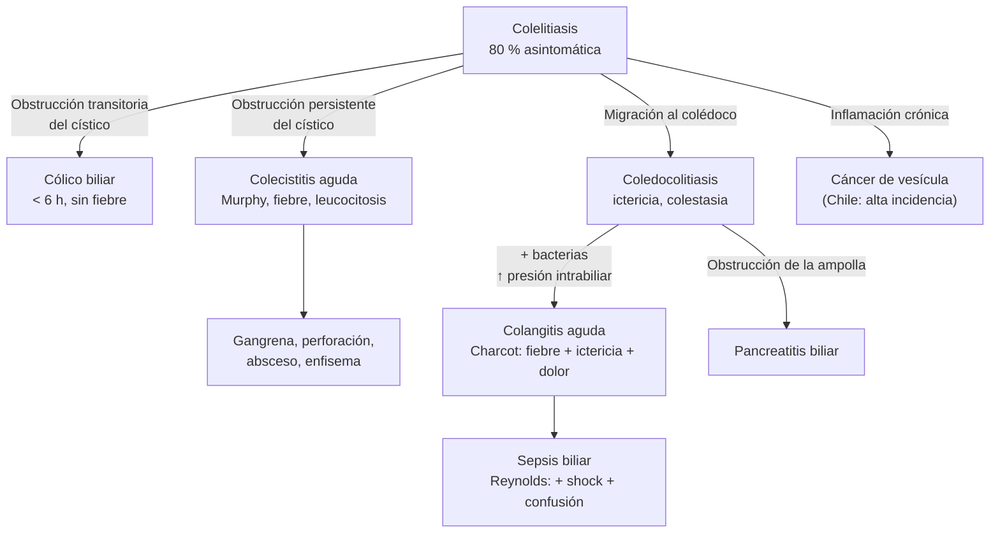

---
tags:
  - Gastroenterología
  - GES
  - Urgencia
  - Frecuente en sala
---

# Litiasis biliar, colecistitis aguda y colangitis aguda

**Subespecialidad**
Gastroenterología · Cirugía digestiva · Medicina de urgencia

**Guías principales**
Guías de Tokio 2018 (TG18): diagnóstico, gravedad, manejo y antibióticos de la colecistitis y la colangitis agudas · WSES 2020: colecistitis aguda litiásica · ASGE 2019: coledocolitiasis

**Otras fuentes**
Estudio de Miquel (1998) sobre la prevalencia de litiasis en Chile · Evaluación del GES de colecistectomía preventiva (Mardones y Frenz, 2019)

**GES**
Sí: colecistectomía preventiva del cáncer de vesícula en personas de 35 a 49 años sintomáticas

**EUNACOM**
1.06.2.004 Colecistitis aguda · 1.06.2.003 Colangitis (específico, inicial, derivar) · 1.06.1.006 Colelitiasis (específico, inicial, derivar) · 1.06.1.003 Cáncer de vesícula y vías biliares (sospecha, inicial, derivar)

**Revisado**
Septiembre 2026

!!! abstract "Resumen en 60 segundos"
    - **Chile tiene una de las prevalencias de litiasis biliar más altas del mundo**: 27 % en la población hispana y 35 % en la mapuche. También tiene una de las mayores tasas de **cáncer de vesícula**; por eso existe el **GES de colecistectomía** en las personas de 35–49 años.
    - **Cólico biliar**: dolor en el epigastrio o el hipocondrio derecho, **< 6 horas**, **sin fiebre** y con laboratorio normal. Se trata con **analgesia** y **colecistectomía electiva**.
    - **Colecistitis aguda** (TG18): **Murphy** o dolor en el hipocondrio derecho + **fiebre o leucocitosis o PCR alta** + **imagen compatible** (ecografía).
        - Tratamiento: **antibióticos** y **colecistectomía laparoscópica precoz** (idealmente < 72 h, hasta 7–10 días del inicio).
        - En el paciente de alto riesgo quirúrgico: **drenaje percutáneo**.
    - **Colangitis aguda**: **fiebre + ictericia + dolor** (tríada de Charcot). Con **shock y compromiso de conciencia** es la péntada de Reynolds.
        - Es una **sepsis biliar**: requiere **antibióticos** y **drenaje biliar** (**CPRE**), urgente en la grave.
    - **Coledocolitiasis**: riesgo **alto** si se ve un cálculo en el colédoco, hay colangitis, o bilirrubina > 4 mg/dL con colédoco dilatado: **CPRE**. Si el riesgo es **intermedio**: **colangio-RM** o **endosonografía**.
    - La **ecografía abdominal** es el examen inicial en todo dolor biliar.

## Definición

- **Colelitiasis**: cálculos en la vesícula biliar. **80 %** son **asintomáticos**.
- **Cólico biliar**: dolor por la obstrucción **transitoria** del conducto cístico, **sin** inflamación de la vesícula.
- **Colecistitis aguda**: inflamación aguda de la vesícula. En **> 90 %** se debe a la obstrucción **persistente** del cístico por un cálculo (**litiásica**). La **alitiásica** ocurre en los pacientes críticos.
- **Coledocolitiasis**: cálculos en el colédoco (secundarios, migrados desde la vesícula, o primarios).
- **Colangitis aguda**: **infección** de la vía biliar por **obstrucción** (cálculos, estenosis, tumores, prótesis), con **aumento de la presión intrabiliar** y paso de bacterias a la sangre.
- **Pancreatitis biliar**: ver [pancreatitis aguda](pancreatitis-aguda.md).

## Epidemiología

### Mundial

- La litiasis biliar afecta al **10–20 %** de los adultos en los países occidentales.
- Es más frecuente en las **mujeres**, con la edad, la obesidad y ciertas etnias (**amerindios**).
- **Historia natural de la litiasis asintomática**: sólo **1–2 % por año** desarrolla síntomas, y < 1 % por año una complicación. Por eso, en general, **no** se opera la litiasis asintomática.
- **Tras un primer cólico**, el riesgo de nuevos cólicos o de complicaciones es alto: **~ 30–50 %** al año.
- **Colecistitis aguda**: aparece en **~ 10–20 %** de los pacientes con litiasis sintomática.
- **Colangitis aguda**: mortalidad de **~ 2–10 %** con tratamiento. Antes del drenaje endoscópico, la **colangitis grave** era casi siempre mortal.

### Chile

!!! chile "Datos nacionales"
    - En un estudio poblacional, la **prevalencia de litiasis biliar** ajustada por edad y sexo fue de **27 %** en los chilenos hispanos y de **35 %** en los **mapuches**. Las mujeres mapuches jóvenes tuvieron un riesgo **6 veces** mayor. Los genes litogénicos de origen amerindio están muy difundidos en la población chilena (Miquel, 1998).
    - Chile tiene una de las **tasas de mortalidad por cáncer de vesícula más altas del mundo**, sobre todo en las **mujeres** del centro y sur del país. La litiasis es su principal factor de riesgo.
    - **GES: colecistectomía preventiva del cáncer de vesícula en personas de 35 a 49 años sintomáticas**. Tras su implementación, la mortalidad por cáncer de vesícula en ese grupo de edad bajó **~ 8 %**, frente al ~ 4 % previo, y aumentaron las colecistectomías en ese grupo (Mardones y Frenz, 2019).
    - La **colecistectomía** es una de las cirugías más frecuentes del país. La **pancreatitis aguda** en Chile es mayoritariamente **biliar**.

## Etiología y factores de riesgo

- **Cálculos de colesterol** (~ 80 % en Occidente). Factores de riesgo:
    - **Mujer** ("*female, fertile, forty, fat*"), **embarazo**, estrógenos y anticonceptivos.
    - **Obesidad**, **baja de peso rápida** (cirugía bariátrica), síndrome metabólico, diabetes.
    - **Etnia amerindia** (Chile, pueblos originarios de América).
    - Edad, historia familiar.
    - Ayuno prolongado, nutrición parenteral, **ceftriaxona** (barro biliar), fibratos, octreotide.
- **Cálculos pigmentarios**:
    - **Negros**: hemólisis crónica, cirrosis.
    - **Pardos**: infección de la vía biliar; se forman en el colédoco.
- **Colecistitis alitiásica**: paciente **crítico** (sepsis, trauma, quemaduras, ventilación mecánica, nutrición parenteral), por estasis e isquemia de la vesícula. Tiene alta mortalidad.
- **Causas de colangitis**:
    - **Coledocolitiasis** (la más frecuente).
    - Estenosis benignas (posquirúrgicas).
    - **Tumores**: páncreas, colangiocarcinoma, ampuloma.
    - **Prótesis biliares ocluidas**, manipulación endoscópica (post-CPRE).
    - Parásitos (*Fasciola*, *Ascaris*).

## Fisiopatología

- **Cólico biliar**: la vesícula se contrae contra un cístico **obstruido** por un cálculo, en forma transitoria. El dolor cede cuando el cálculo se desimpacta.
- **Colecistitis**:
    1. La **obstrucción persistente** del cístico produce **distensión**, edema e isquemia de la pared.
    2. La **inflamación química** (lisolecitina) se sobreinfecta en forma secundaria (*E. coli*, *Klebsiella*, enterococos, anaerobios).
    3. Complicaciones: **gangrena**, **perforación**, **absceso**, **enfisema** (en diabéticos, por *Clostridium*).
- **Colangitis**:
    1. La **obstrucción** del colédoco más las **bacterias** (que ascienden desde el duodeno) aumentan la **presión intrabiliar**.
    2. Esa presión produce **reflujo colangiovenoso y colangiolinfático**: bacteriemia y endotoxemia, que llevan a la **sepsis**.
    3. Por eso **el tratamiento clave es el drenaje**, que baja la presión. Los antibióticos solos no penetran bien una vía biliar obstruida.
- **Íleo biliar**: una fístula colecistoentérica permite el paso de un cálculo grande que obstruye el íleon terminal (adultos mayores).
- **Síndrome de Mirizzi**: un cálculo impactado en el cuello vesicular o el cístico comprime el conducto hepático común y produce ictericia.

*Figura 1. Historia natural de la litiasis biliar y sus complicaciones. Esquema propio.*

## Clasificación

### Colecistitis aguda: criterios diagnósticos y gravedad (TG18)

**Diagnóstico**:

- **A. Signos locales**: signo de **Murphy**; masa, dolor o sensibilidad en el hipocondrio derecho.
- **B. Signos sistémicos**: **fiebre**, **PCR elevada**, **leucocitosis**.
- **C. Imagen** compatible (ecografía, TC o RM).
- **Sospecha**: A + B. **Diagnóstico definitivo**: A + B + C.

| Gravedad | Criterios |
|---|---|
| **Grado III (grave)** | **Disfunción de órganos**: cardiovascular (hipotensión con dopamina ≥ 5 µg/kg/min o cualquier dosis de noradrenalina), neurológica (compromiso de conciencia), respiratoria (PaO₂/FiO₂ < 300), renal (oliguria o creatinina > 2 mg/dL), hepática (INR > 1,5), hematológica (plaquetas < 100.000) |
| **Grado II (moderada)** | Cualquiera: **leucocitos > 18.000**, **masa palpable** sensible en el hipocondrio derecho, **evolución > 72 h**, **inflamación local marcada** (colecistitis gangrenosa o enfisematosa, absceso pericolecístico o hepático, peritonitis biliar) |
| **Grado I (leve)** | No cumple criterios de grado II ni III |

### Colangitis aguda: criterios diagnósticos y gravedad (TG18)

**Diagnóstico**:

- **A. Inflamación sistémica**: **fiebre** > 38 °C o calofríos; alteraciones de laboratorio (leucocitos < 4.000 o > 10.000; PCR ≥ 1 mg/dL).
- **B. Colestasia**: **ictericia** (bilirrubina total ≥ 2 mg/dL); pruebas hepáticas alteradas (> 1,5 veces el límite superior).
- **C. Imagen**: **dilatación de la vía biliar**; evidencia de la causa (cálculo, estenosis, prótesis).
- **Sospecha**: A + (B o C). **Diagnóstico definitivo**: A + B + C.

| Gravedad | Criterios |
|---|---|
| **Grado III (grave)** | **Disfunción de órganos** (mismos criterios de la colecistitis) |
| **Grado II (moderada)** | **Dos** de: leucocitos > 12.000 o < 4.000; fiebre ≥ 39 °C; **edad ≥ 75 años**; bilirrubina total ≥ 5 mg/dL; **hipoalbuminemia** |
| **Grado I (leve)** | No cumple criterios de grado II ni III |

### Coledocolitiasis: riesgo según la ASGE 2019

| Riesgo | Criterios | Conducta |
|---|---|---|
| **Alto** (> 50 %) | Cálculo en el colédoco en la ecografía o la TC; **colangitis**; **bilirrubina total > 4 mg/dL con colédoco dilatado** (> 6 mm con vesícula in situ) | **CPRE** preoperatoria (o exploración de la vía biliar durante la cirugía) |
| **Intermedio** (10–50 %) | Pruebas hepáticas alteradas, **edad > 55 años**, colédoco dilatado en la ecografía | **Endosonografía** o **colangio-RM**, o colangiografía intraoperatoria |
| **Bajo** (< 10 %) | Ninguno | **Colecistectomía** sin más estudio |

## Clínica

| Cuadro | Clínica |
|---|---|
| **Cólico biliar** | Dolor **continuo** (no cólico en sentido estricto) en el **epigastrio o el hipocondrio derecho**, a menudo **posprandial** (comidas grasas) o nocturno, irradiado a la escápula derecha. Dura **30 min a < 6 h**. Náuseas y vómitos. **Sin fiebre**, examen abdominal casi normal entre episodios |
| **Colecistitis aguda** | Dolor en el hipocondrio derecho **> 6 horas**, **fiebre**, náuseas, vómitos. **Signo de Murphy** (detención de la inspiración al palpar el hipocondrio derecho). Vesícula palpable en ~ 30 %. **Ictericia leve** posible. En los **adultos mayores y diabéticos** puede haber pocos síntomas |
| **Coledocolitiasis** | Dolor biliar con **ictericia**, **coluria** y **acolia**, y **pruebas hepáticas colestásicas**. Puede ser asintomática |
| **Colangitis aguda** | **Tríada de Charcot**: **fiebre con calofríos + ictericia + dolor** en el hipocondrio derecho (presente en sólo ~ 50–70 %). **Péntada de Reynolds**: + **shock** + **compromiso de conciencia** (colangitis grave) |
| **Cáncer de vesícula** | Asintomático al inicio (hallazgo en la biopsia de la vesícula); en etapas avanzadas, **ictericia**, baja de peso, masa en el hipocondrio derecho. **Signo de Courvoisier** (vesícula palpable no dolorosa con ictericia): sugiere un tumor periampular o de páncreas |

!!! alarma "Signos de alarma"
    - **Fiebre + ictericia** en un paciente con dolor biliar: **colangitis**. Hemocultivos, antibióticos y **drenaje biliar**.
    - **Hipotensión o compromiso de conciencia**: colangitis **grave**. Reanimación, UCI y drenaje **urgente**.
    - **Peritonitis generalizada**: perforación de la vesícula.
    - **Gas en la pared de la vesícula** (colecistitis enfisematosa) en un diabético: cirugía urgente.
    - **Adulto mayor con dolor abdominal leve y fiebre**: la colecistitis puede ser gangrenosa con poco dolor.

## Diagnóstico

**Paso 1. Laboratorio**:

- Hemograma, **PCR**.
- **Pruebas hepáticas** (bilirrubina total y directa, FA, GGT, transaminasas).
- **Lipasa** (pancreatitis asociada).
- Creatinina, electrolitos, INR, plaquetas.
- Lactato y **hemocultivos** si hay fiebre o sepsis.

**Paso 2. Ecografía abdominal** (el examen de elección, sensibilidad ~ 80–90 % en la colecistitis):

- **Cálculos**.
- **Pared engrosada** (> 4–5 mm) con doble contorno.
- **Líquido perivesicular**.
- **Vesícula distendida**.
- **Murphy ecográfico**.
- **Diámetro del colédoco** y cálculos en su interior.

**Paso 3. Otras imágenes según el caso**:

- **TC**: complicaciones (perforación, absceso, gangrena, enfisema) o diagnóstico dudoso.
- **Colangio-RM**: coledocolitiasis con riesgo intermedio; estenosis y tumores.
- **Endosonografía**: coledocolitiasis pequeña (la más sensible).
- **Cintigrafía HIDA**: colecistitis dudosa (la falta de llene de la vesícula indica un cístico obstruido). Hoy se usa poco.

**Paso 4. Clasificar la gravedad** (TG18) y el riesgo de coledocolitiasis (ASGE), y evaluar el **riesgo quirúrgico** del paciente: índice de comorbilidad de Charlson y ASA.

## Laboratorio

| Examen | Cólico biliar | Colecistitis | Coledocolitiasis | Colangitis |
|---|---|---|---|---|
| **Leucocitos, PCR** | Normales | **Altos** | Normales o levemente altos | **Altos** (o leucopenia en la sepsis) |
| **Bilirrubina** | Normal | Normal o levemente alta (< 4) | **Alta** (directa) | **Alta** |
| **FA, GGT** | Normales | Normales o levemente altas | **Altas** | **Altas** |
| **Transaminasas** | Normales | Levemente altas | Pueden subir mucho (> 500) en la obstrucción aguda | Altas |
| **Lipasa** | Normal | Normal | Alta si hay pancreatitis | Puede estar alta |
| **Hemocultivos** | — | Si hay sepsis | — | **Siempre** (positivos en ~ 30–50 %) |

## Imágenes

- **Ecografía**: la primera imagen en todo dolor biliar. Tiene una excelente sensibilidad para la colelitiasis (> 95 %), pero es menos sensible para la **coledocolitiasis** (~ 50 %).
- **TC con contraste**: complicaciones de la colecistitis, **colangitis** (dilatación, causa), tumores. Detecta mal los cálculos de colesterol.
- **Colangio-RM**: visualiza la vía biliar sin radiación ni contraste (sensibilidad ~ 90 % para la coledocolitiasis).
- **Endosonografía**: la más sensible para los cálculos pequeños del colédoco.
- **CPRE**: **terapéutica** (papilotomía, extracción de cálculos, prótesis), con riesgo de pancreatitis (~ 3–5 %), hemorragia y perforación. **No** se usa sólo para diagnosticar.

<figure markdown>
![Flujograma de la WSES 2020 para la colecistitis aguda litiásica. Si el paciente es candidato a colecistectomía laparoscópica precoz, se estratifica el riesgo de coledocolitiasis (bajo: cirugía directa; moderado: endosonografía o colangio-RM; alto: CPRE preoperatoria o evaluación intraoperatoria) y se opera dentro de las 72 horas del ingreso o, al menos, dentro de 7 días del ingreso y 10 días del inicio de los síntomas; si no, alta y colecistectomía diferida. Si el paciente no es apto para la cirugía o la rechaza: antibióticos y observación por 48 horas; si fracasan, drenaje de la vesícula (percutáneo o endoscópico); si éste fracasa, cirugía de rescate](../assets/figuras/biliar/flujograma-colecistitis-wses-2020.jpg){ loading=lazy }
<figcaption>Figura 2. Manejo de la colecistitis aguda litiásica (WSES 2020). ELC: colecistectomía laparoscópica precoz; DLC: colecistectomía laparoscópica diferida; PTGBD: drenaje percutáneo transhepático de la vesícula; EGBD: drenaje endoscópico de la vesícula; CBDS: cálculos del colédoco. Fuente: Pisano M, Allievi N, Gurusamy K, et al. 2020 World Society of Emergency Surgery updated guidelines for the diagnosis and treatment of acute calculus cholecystitis. <em>World J Emerg Surg.</em> 2020;15:61, figura 1. Licencia <a href="https://creativecommons.org/licenses/by/4.0/">CC BY 4.0</a>.</figcaption>
</figure>

## Diagnóstico diferencial

| Cuadro | Claves |
|---|---|
| **Úlcera péptica perforada o no** | Dolor epigástrico, relación con comidas o AINE; neumoperitoneo en la perforación |
| **Pancreatitis aguda** | Dolor en faja, **lipasa > 3 veces** el límite superior; puede coexistir (biliar) |
| **Apendicitis retrocecal o subhepática** | Sobre todo en el embarazo |
| **Hepatitis aguda** | Transaminasas muy altas, sin cálculos ni signos de colecistitis |
| **Absceso hepático** | Fiebre, dolor en el hipocondrio derecho, lesión en la ecografía o la TC |
| **Síndrome de Fitz-Hugh-Curtis** | Perihepatitis por *Chlamydia* o gonococo en mujeres jóvenes con enfermedad inflamatoria pélvica |
| **IAM de cara inferior** | Dolor epigástrico; **ECG y troponina** en los pacientes con factores de riesgo |
| **Neumonía de la base derecha** | Fiebre, tos, crépitos, infiltrado en la radiografía |
| **Pielonefritis o cólico renal derecho** | Dolor lumbar, puño percusión positiva, sedimento urinario alterado |
| **Colangitis de otras causas** | Tumores (**Courvoisier**, baja de peso), estenosis, prótesis ocluidas |

## Tratamiento

!!! guia "TG18 y WSES 2020"
    - **Colecistitis aguda**:
        - La **colecistectomía laparoscópica precoz** es el tratamiento de elección en los pacientes aptos para la cirugía: idealmente en las primeras **72 h** del ingreso, y hasta **7 días del ingreso o 10 días del inicio** de los síntomas (WSES). Es superior a la cirugía diferida: menos días de hospitalización y reingresos, sin más complicaciones.
        - En los pacientes de **alto riesgo quirúrgico** o que no responden: **drenaje de la vesícula** (colecistostomía **percutánea** o drenaje endoscópico), y cirugía diferida si mejora su condición.
        - **Gravedad**:
            - **Grado I**: colecistectomía precoz.
            - **Grado II**: colecistectomía precoz en un centro con experiencia, si el riesgo lo permite; si no, antibióticos y drenaje.
            - **Grado III**: soporte, antibióticos y **drenaje urgente**; o colecistectomía precoz en un centro avanzado si la falla orgánica es favorable.
    - **Colangitis aguda**:
        - **Antibióticos** y **drenaje biliar**, de preferencia **endoscópico (CPRE)**.
        - **Grado I**: antibióticos; drenaje si no responde en 24 h.
        - **Grado II**: **drenaje precoz** (en las primeras 24–48 h).
        - **Grado III**: estabilización, soporte de órganos y **drenaje urgente**.
        - Si no es posible la CPRE: **drenaje percutáneo** transhepático.
        - Tras resolver la colangitis por cálculos: **colecistectomía** en la misma hospitalización o pronto, para evitar la recurrencia.

!!! dosis "Antibióticos en las infecciones biliares (TG18; ajustar a la epidemiología local y a los cultivos)"
    - **Comunitaria, grado I–II**: **ceftriaxona 2 g/día EV + metronidazol 500 mg cada 8 h EV**. Alternativas: **ampicilina-sulbactam 3 g cada 6 h** (si la resistencia local de *E. coli* es baja) o cefazolina + metronidazol en la colecistitis leve.
    - **Grado III, asociada a la atención de salud** o con riesgo de BLEE:
        - **Piperacilina-tazobactam 4,5 g cada 6–8 h EV**.
        - **Cefepime 2 g cada 8–12 h + metronidazol**.
        - **Meropenem 1 g cada 8 h EV** (BLEE, shock).
        - Agregar **vancomicina** en la grave asociada a la atención de salud (enterococos).
    - **Duración**:
        - **Colecistitis grado I–II**: suspender en las primeras **24 h** después de la colecistectomía.
        - **Colecistitis complicada o grado III**: 4–7 días tras el control del foco.
        - **Colangitis**: **4–7 días** después del drenaje exitoso (≥ 2 semanas si hay bacteriemia por grampositivos como enterococos o estreptococos).

**Medidas generales**:

- **Régimen cero** e hidratación EV.
- **Analgesia**: AINE (el diclofenaco o la indometacina en el cólico reducen la progresión a colecistitis) u **opioides**; la morfina no está contraindicada.
- Antieméticos.
- Hemocultivos en la colangitis o la sepsis.
- Corrección de la coagulopatía antes de la CPRE si es necesario.

**Cólico biliar**:

- **Analgesia** (AINE de preferencia).
- **Colecistectomía laparoscópica electiva**. En Chile, **GES** en las personas de 35–49 años sintomáticas.
- Dieta baja en grasas mientras se espera la cirugía.

**Colelitiasis asintomática**: en general, **no** se opera. Excepciones: **vesícula en porcelana**, **pólipo > 10 mm**, cálculo **> 3 cm**, anemia hemolítica, y en Chile, por el alto riesgo de cáncer de vesícula, la indicación es más amplia (decisión con el cirujano).

**Coledocolitiasis**: **CPRE** con papilotomía y extracción, antes, durante o después de la colecistectomía según la disponibilidad; o exploración laparoscópica de la vía biliar.

## Complicaciones

- **Colecistitis**:
    - **Gangrena** y **perforación** (localizada con absceso pericolecístico, o libre con **peritonitis biliar**).
    - **Colecistitis enfisematosa**.
    - **Empiema** vesicular.
    - **Fístula colecistoentérica** e **íleo biliar**.
    - **Síndrome de Mirizzi**.
- **Colangitis**: **sepsis** y **shock séptico**, **abscesos hepáticos**, falla multiorgánica, muerte.
- **Coledocolitiasis**: **pancreatitis biliar**, colangitis, cirrosis biliar secundaria si la obstrucción es crónica.
- **De la colecistectomía**:
    - **Lesión de la vía biliar** (~ 0,3–0,5 % en la laparoscópica): la complicación más temida.
    - Filtración biliar.
    - Cálculos residuales en el colédoco.
    - Síndrome poscolecistectomía.
- **De la CPRE**: **pancreatitis** (~ 3–5 %), hemorragia (tras la papilotomía), perforación, colangitis.
- **Cáncer de vesícula** asociado a la litiasis crónica.

## Pronóstico y seguimiento

- **Colecistitis leve a moderada** con colecistectomía precoz: mortalidad < 1 %. La colecistitis **grave**, la **alitiásica** y la de los **adultos mayores** tienen una mortalidad mucho mayor.
- **Colangitis**: con drenaje oportuno, la mortalidad es de ~ 2–10 %; en la colangitis **grave sin drenaje**, muy alta.
- **Perfil EUNACOM**:
    - **Colecistitis y colangitis**: diagnóstico específico, **tratamiento inicial** (régimen cero, hidratación, analgesia, **antibióticos**, hemocultivos) y **derivación** a cirugía o endoscopía.
    - **Colelitiasis**: diagnóstico específico, tratamiento inicial y derivación (GES en las personas de 35–49 años sintomáticas).
    - **Cáncer de vesícula**: sospecha.
- **Seguimiento**: revisar la **biopsia de la vesícula** (cáncer incidental, más frecuente en Chile). Tras la colangitis por cálculos, colecistectomía para evitar la recurrencia.

## Perlas para el internado

!!! perla "Para la sala y el turno"
    - **Dolor en el hipocondrio derecho de más de 6 horas con fiebre** = colecistitis hasta demostrar lo contrario. Pide una **ecografía**.
    - **Fiebre + ictericia** = colangitis: **hemocultivos**, **antibiótico** y **avisa a endoscopía**. El antibiótico solo no basta si la vía biliar está obstruida.
    - La **tríada de Charcot** falta en casi la mitad de las colangitis: usa los **criterios de Tokio**.
    - **Adulto mayor o diabético con poca clínica**: la colecistitis puede estar gangrenosa. No te fíes de un Murphy dudoso.
    - La **ceftriaxona** en dosis altas puede producir **barro biliar**; no te sorprendas si aparece en la ecografía de control.
    - Una **colestasia con transaminasas de 800** puede ser una **coledocolitiasis** aguda, no una hepatitis: pide una ecografía.
    - En Chile, **toda persona de 35–49 años con litiasis sintomática** tiene derecho GES a la **colecistectomía**. Derívala.
    - Revisa siempre la **biopsia** de la vesícula tras una colecistectomía.

## Preguntas de repaso

??? repaso "1. Mujer de 42 años con dolor en el hipocondrio derecho de 18 horas, fiebre de 38,4 °C, Murphy positivo y leucocitos de 14.500. La ecografía muestra cálculos, pared de 6 mm y líquido perivesicular. ¿Cuál es el diagnóstico y el manejo?"
    **Colecistitis aguda litiásica**, diagnóstico definitivo según TG18 (A + B + C). Es de **grado I** (leve): leucocitos < 18.000, < 72 h, sin masa ni complicaciones locales, sin disfunción de órganos.

    - Régimen cero, hidratación y analgesia.
    - **Ceftriaxona + metronidazol**.
    - Pruebas hepáticas y lipasa para evaluar la coledocolitiasis y la pancreatitis.
    - **Colecistectomía laparoscópica precoz** (idealmente < 72 h).
    - Suspender los antibióticos en las primeras 24 h después de la cirugía.

??? repaso "2. Hombre de 78 años con fiebre de 39,5 °C, calofríos, ictericia y dolor en el hipocondrio derecho. PA 85/50, confuso. Bilirrubina 6 mg/dL, leucocitos 21.000, colédoco de 12 mm con un cálculo en la ecografía. ¿Qué tiene y qué haces?"
    **Colangitis aguda grave (grado III)**: péntada de Reynolds con hipotensión y compromiso de conciencia, disfunción cardiovascular y neurológica.

    1. **Reanimación**: volumen y vasopresores si es necesario.
    2. **Hemocultivos**.
    3. **Antibiótico de amplio espectro** de inmediato: piperacilina-tazobactam o meropenem.
    4. UCI.
    5. **Drenaje biliar urgente** con **CPRE** (papilotomía y extracción o prótesis) apenas se estabilice. Si falla, drenaje percutáneo.
    6. Luego, colecistectomía cuando se recupere.

??? repaso "3. Mujer de 55 años con cólicos biliares, bilirrubina 2,1 mg/dL y colédoco de 8 mm en la ecografía, sin cálculo visible en él. ¿Cómo estudias la coledocolitiasis?"
    Tiene un riesgo **intermedio** de coledocolitiasis según la ASGE 2019: pruebas hepáticas alteradas y colédoco dilatado, pero sin cálculo visible ni bilirrubina > 4 mg/dL.

    - Hacer una **colangio-RM** o una **endosonografía** antes de la cirugía, o una colangiografía intraoperatoria.
    - Si se confirma el cálculo: **CPRE** con extracción, y luego **colecistectomía**.

??? repaso "4. Paciente de 88 años con cardiopatía grave (ASA IV) y colecistitis aguda de grado II que no mejora tras 48 horas de antibióticos. ¿Qué haces?"
    Es un paciente **no apto para la cirugía precoz**, con falla del tratamiento médico.

    - Indicar un **drenaje de la vesícula**: **colecistostomía percutánea** o drenaje endoscópico, según la disponibilidad.
    - Mantener los antibióticos.
    - Evaluar después una **colecistectomía diferida** si su condición mejora, o dejar el drenaje o retirarlo según la evolución.

??? repaso "5. ¿Por qué en Chile se indica la colecistectomía a las personas de 35 a 49 años con litiasis sintomática, y cuándo se opera una litiasis asintomática?"
    Chile tiene una **prevalencia muy alta de litiasis** (27–35 %) y una de las mayores tasas de **cáncer de vesícula** del mundo, cuyo principal factor de riesgo es la litiasis crónica. El **GES** de colecistectomía preventiva en las personas de **35–49 años sintomáticas** busca extirpar la vesícula antes de que aparezca el cáncer. Tras su implementación, la mortalidad por cáncer de vesícula bajó en ese grupo de edad.

    La litiasis **asintomática** en general no se opera, salvo:

    - **Vesícula en porcelana**.
    - **Pólipos > 10 mm**.
    - **Cálculos > 3 cm**.
    - Anemias hemolíticas.
    - Casos individuales de alto riesgo de cáncer.

## Referencias

1. Yokoe M, Hata J, Takada T, et al. Tokyo Guidelines 2018: diagnostic criteria and severity grading of acute cholecystitis (with videos). *J Hepatobiliary Pancreat Sci.* 2018;25:41–54. doi:[10.1002/jhbp.515](https://doi.org/10.1002/jhbp.515)
2. Kiriyama S, Kozaka K, Takada T, et al. Tokyo Guidelines 2018: diagnostic criteria and severity grading of acute cholangitis (with videos). *J Hepatobiliary Pancreat Sci.* 2018;25:17–30. doi:[10.1002/jhbp.512](https://doi.org/10.1002/jhbp.512)
3. Miura F, Okamoto K, Takada T, et al. Tokyo Guidelines 2018: initial management of acute biliary infection and flowchart for acute cholangitis. *J Hepatobiliary Pancreat Sci.* 2018;25:31–40. doi:[10.1002/jhbp.509](https://doi.org/10.1002/jhbp.509)
4. Okamoto K, Suzuki K, Takada T, et al. Tokyo Guidelines 2018: flowchart for the management of acute cholecystitis. *J Hepatobiliary Pancreat Sci.* 2018;25:55–72. doi:[10.1002/jhbp.516](https://doi.org/10.1002/jhbp.516)
5. Gomi H, Solomkin JS, Schlossberg D, et al. Tokyo Guidelines 2018: antimicrobial therapy for acute cholangitis and cholecystitis. *J Hepatobiliary Pancreat Sci.* 2018;25:3–16. doi:[10.1002/jhbp.518](https://doi.org/10.1002/jhbp.518)
6. Pisano M, Allievi N, Gurusamy K, et al. 2020 World Society of Emergency Surgery updated guidelines for the diagnosis and treatment of acute calculus cholecystitis. *World J Emerg Surg.* 2020;15:61. doi:[10.1186/s13017-020-00336-x](https://doi.org/10.1186/s13017-020-00336-x)
7. ASGE Standards of Practice Committee; Buxbaum JL, Abbas Fehmi SM, et al. ASGE guideline on the role of endoscopy in the evaluation and management of choledocholithiasis. *Gastrointest Endosc.* 2019;89:1075–1105.e15. doi:[10.1016/j.gie.2018.10.001](https://doi.org/10.1016/j.gie.2018.10.001)
8. Miquel JF, Covarrubias C, Villaroel L, et al. Genetic epidemiology of cholesterol cholelithiasis among Chilean Hispanics, Amerindians, and Maoris. *Gastroenterology.* 1998;115:937–946. doi:[10.1016/s0016-5085(98)70266-5](https://doi.org/10.1016/s0016-5085(98)70266-5)
9. Mardones ML, Frenz P. Changes in gallbladder cancer mortality and hospital discharges due to preventive cholecystectomy in Chile [artículo en español]. *Rev Med Chile.* 2019;147:860–869. doi:[10.4067/S0034-98872019000700860](https://doi.org/10.4067/S0034-98872019000700860)
