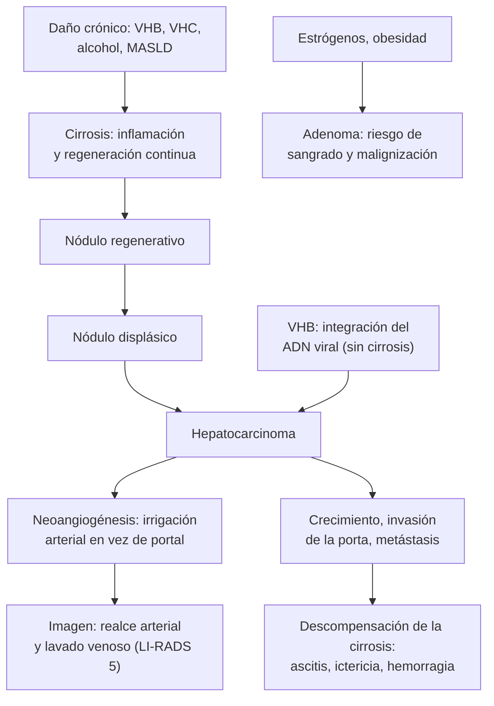

---
tags:
  - Gastroenterología
---

# Masa hepática y hepatocarcinoma

**Subespecialidad**
Gastroenterología · Hepatología · Radiología · Cirugía hepatobiliar · Oncología

**Guías principales**
EASL 2025: hepatocarcinoma · AASLD 2023: prevención, diagnóstico y tratamiento del hepatocarcinoma · BCLC 2022: etapificación y tratamiento · ACG 2024: lesiones hepáticas focales · EASL 2016: tumores hepáticos benignos

**Otras fuentes**
LI-RADS (ACR) · Revisión de la RM en las lesiones benignas (Gatti 2022) · Criterios de Milán (Mazzaferro 1996) · Ensayos IMbrave150 (2020) y HIMALAYA (2022)

**GES**
No es GES. En **julio de 2026** el Ministerio de Salud anunció la incorporación progresiva de **todos los cánceres** en el próximo decreto GES (2028–2031). El tratamiento tras el alta por **cirrosis** sí es GES ([ver cirrosis](cirrosis-y-complicaciones.md)).

**EUNACOM**
1.06.1.024 Masa hepática (sospecha, inicial, derivar)

**Revisado**
Octubre 2026

!!! abstract "Resumen en 60 segundos"
    - **El contexto lo es todo**: ¿hay **cirrosis** o **hepatitis B**? ¿un **cáncer** conocido? ¿**fiebre**?
    - **En el cirrótico, todo nódulo nuevo es un hepatocarcinoma** hasta demostrar lo contrario.
        - **≥ 1 cm**: **TC o RM multifásica**. **Realce arterial + lavado** en la fase venosa o tardía (**LI-RADS 5**) confirman el **hepatocarcinoma sin biopsia**.
        - **< 1 cm**: ecografía cada **3 meses**.
    - **Vigilancia**: **ecografía cada 6 meses** (± AFP) en **todo cirrótico** y en algunos portadores del VHB sin cirrosis.
    - **Tratamiento del hepatocarcinoma** según el **BCLC**:
        - **Precoz**: **resección**, **ablación** o **trasplante** (criterios de Milán).
        - **Intermedio**: **quimioembolización**.
        - **Avanzado**: **inmunoterapia** (atezolizumab + bevacizumab, durvalumab + tremelimumab).
        - **Terminal**: paliación.
    - **En el hígado sano, la mayoría de las lesiones incidentales son benignas**:
        - **Quiste simple** y **hemangioma típico**: sin control.
        - **Hiperplasia nodular focal** (mujer joven, **cicatriz central**): sin control.
        - **Adenoma** (mujer con **anticonceptivos**): suspenderlos; **resecar si es ≥ 5 cm** o si es un hombre (riesgo de sangrado y malignización).
    - **Metástasis**: la **lesión maligna más frecuente** del hígado no cirrótico (colon, páncreas, estómago, mama, pulmón).
    - **En Chile, piensa en el quiste hidatídico** ante una lesión quística tabicada o con calcificaciones.
    - **Fiebre + lesión hepática = absceso**: hemocultivos, antibióticos y drenaje.

## Definición

| Concepto | Definición |
|---|---|
| **Masa o lesión hepática focal** | Lesión **circunscrita**, sólida o quística, distinta del parénquima hepático, detectada por imagen. Muchas son **incidentales** ("incidentalomas") |
| **Hepatocarcinoma** (carcinoma hepatocelular) | Tumor maligno primario de los **hepatocitos**; **~90 %** de los cánceres primarios del hígado. Aparece sobre todo en la **cirrosis** |
| **Colangiocarcinoma intrahepático** | Tumor maligno de los **conductos biliares** intrahepáticos; segundo tumor primario maligno del hígado |
| **Metástasis hepática** | Implante de un tumor de otro órgano; la lesión **maligna más frecuente** del hígado no cirrótico |
| **Hemangioma** | Malformación **vascular** benigna; el **tumor benigno más frecuente** del hígado |
| **Hiperplasia nodular focal** (HNF) | Lesión **benigna** regenerativa por una **anomalía arterial**, con **cicatriz central**; sin potencial maligno |
| **Adenoma hepatocelular** | Tumor benigno de los hepatocitos, asociado a **estrógenos**; riesgo de **sangrado** y, en algunos subtipos, de **malignización** |
| **Quiste hepático simple** | Quiste de pared fina, sin septos ni nódulos, de contenido anecoico |
| **Quiste hidatídico** | Quiste por *Echinococcus granulosus* ([ver hidatidosis](../infectologia/triquinosis-e-hidatidosis.md)) |
| **Absceso hepático** | Colección de pus **piógena** (bacteriana) o **amebiana** |
| **LI-RADS** | Sistema del Colegio Americano de Radiología para clasificar los nódulos en los pacientes **en riesgo** de hepatocarcinoma: **LR-1** benigno · LR-2 probablemente benigno · LR-3 probabilidad intermedia · LR-4 probablemente hepatocarcinoma · **LR-5 hepatocarcinoma definitivo** · LR-M probablemente maligno, no necesariamente hepatocarcinoma · LR-TIV tumor en la vena |
| **Criterios de Milán** | **1 nódulo ≤ 5 cm** o **hasta 3 nódulos ≤ 3 cm**, sin invasión vascular ni metástasis. Definen a los candidatos a **trasplante** con buen resultado |

## Epidemiología

- **Hepatocarcinoma**: el cáncer de hígado es la **tercera causa de muerte por cáncer** en el mundo; el hepatocarcinoma representa el **~90 %** (EASL 2025).
    - **El 80–90 % ocurre sobre una cirrosis**. El riesgo anual en la cirrosis es de **1–8 %**, según la causa.
    - **Causas**: **VHB** (también sin cirrosis), **VHC**, **alcohol**, **MASLD** (en aumento, a veces sin cirrosis), hemocromatosis, aflatoxinas (África, Asia).
    - Predomina en **hombres** (2–4:1), mayores de 50 años.
- **Metástasis**: mucho más frecuentes que los tumores primarios en el hígado no cirrótico.
- **Lesiones benignas**: muy frecuentes como **hallazgo incidental**.
    - **Quistes simples**: los más frecuentes (hasta ~5–15 % de la población en las imágenes).
    - **Hemangioma**: el tumor benigno sólido más frecuente; más en **mujeres**.
    - **Hiperplasia nodular focal**: segunda en frecuencia; **mujeres de 20–50 años**.
    - **Adenoma**: raro; **mujeres** en edad fértil con **anticonceptivos** por años, **obesidad**; también con anabolizantes y en las glucogenosis.
- **Abscesos**: los **piógenos** son los más frecuentes en Chile (origen **biliar**, diabetes, ***Klebsiella pneumoniae***). Los **amebianos** predominan en las zonas tropicales.

!!! chile "Datos nacionales"
    - **Cirrosis** por **alcohol** y **MASLD**, las principales causas en Chile: todos los cirróticos deben estar en **vigilancia de hepatocarcinoma** cada 6 meses ([ver cirrosis](cirrosis-y-complicaciones.md) y [hepatitis crónica](hepatitis-cronica-e-insuficiencia-hepatica-cronica.md)).
    - **Hepatitis B**: baja endemia (HBsAg **0,15 %**, ENS 2009–2010), pero los portadores tienen riesgo de hepatocarcinoma **aun sin cirrosis**.
    - **Hidatidosis**: endémica en las zonas **rurales** y ganaderas del **centro-sur y sur**.
        - Incidencia notificada de **~1,9 por 100 000** (2001–2009) y **subnotificación** importante.
        - El **hígado** es el órgano más afectado: considerarla ante toda **lesión quística** tabicada, con vesículas hijas o calcificada.
    - **Cáncer de vesícula**: Chile tiene una de las mayores tasas del mundo. A menudo **invade el hígado** (segmentos IV y V) y se presenta como una masa en el lecho vesicular ([ver litiasis biliar](litiasis-biliar-colecistitis-colangitis.md)).
    - **GES**: el cáncer de hígado **no** tiene garantía GES a septiembre de 2026. El **trasplante hepático** se realiza en centros de referencia.

## Etiología

| Tipo | Lesiones | Claves |
|---|---|---|
| **Quísticas benignas** | **Quiste simple**, enfermedad **poliquística** hepática (con o sin riñón poliquístico), **quiste hidatídico** | Anecoicos; el hidatídico tiene membranas, vesículas hijas o calcificaciones |
| **Infecciosas** | **Absceso piógeno** (biliar, portal por diverticulitis o apendicitis, hematógeno; *Klebsiella*, *E. coli*, anaerobios, *Streptococcus anginosus*), **absceso amebiano** | Fiebre, dolor en el hipocondrio derecho, leucocitosis |
| **Sólidas benignas** | **Hemangioma**, **hiperplasia nodular focal**, **adenoma hepatocelular**, esteatosis focal o áreas respetadas, nódulos regenerativos en la cirrosis | Mujeres; asintomáticas; patrones típicos en la imagen |
| **Malignas primarias** | **Hepatocarcinoma**, **colangiocarcinoma intrahepático**, hepatocarcinoma fibrolamelar (joven sin cirrosis), angiosarcoma, linfoma | Cirrosis o VHB; AFP; CA 19-9 |
| **Metástasis** | **Colon y recto** (las más frecuentes y las que más se benefician de la cirugía), **páncreas**, estómago, **mama**, **pulmón**, melanoma, **neuroendocrinos** | Múltiples; cáncer conocido |
| **Cistoadenoma y cistoadenocarcinoma biliar** | Neoplasias quísticas mucinosas | Quiste con **septos** o **nódulos** murales |

## Fisiopatología

- **Hepatocarcinoma**: el **daño crónico** con **inflamación** y **regeneración** (cirrosis) acumula **mutaciones** en los hepatocitos (*TERT*, *TP53*, *CTNNB1*).
    - La progresión va del **nódulo regenerativo** al **nódulo displásico** y al **hepatocarcinoma**.
    - **VHB**: además, el ADN viral se **integra** en el genoma del hepatocito y es **oncogénico** por sí mismo, por lo que el cáncer aparece incluso sin cirrosis.
- **Por qué el hepatocarcinoma tiene un patrón típico en la imagen**: al hacerse maligno, el nódulo pierde la irrigación **portal** y pasa a depender de **arterias nuevas** (neoangiogénesis).
    - Por eso **capta el contraste en la fase arterial** (realce o *wash-in*).
    - Y lo **pierde** en la fase venosa o tardía (**lavado** o *washout*) antes que el hígado vecino, que recibe sangre portal.
    - Este patrón permite el **diagnóstico sin biopsia** en un cirrótico.
- **Hemangioma**: lagos vasculares con flujo lento: realce **periférico, nodular y discontinuo**, con **relleno centrípeto** progresivo.
- **Hiperplasia nodular focal**: hiperplasia de los hepatocitos alrededor de una **arteria anómala**, con una **cicatriz central** fibrosa y vascular.
- **Adenoma**: proliferación clonal de hepatocitos estimulada por los **estrógenos**. Es hipervascular y frágil, por lo que **sangra**. El subtipo con **activación de la β-catenina** puede **malignizarse**.
- **Metástasis**: llegan por la **vena porta** (tubo digestivo) o la arteria hepática.

*Figura 1. Fisiopatología del hepatocarcinoma y base de su patrón en la imagen. Esquema propio.*

## Clasificación

**Etapificación del hepatocarcinoma (BCLC 2022)**:

| Etapa | Tumor | Función hepática y estado general | Tratamiento de primera opción |
|---|---|---|---|
| **0 (muy precoz)** | Único **≤ 2 cm** | Preservada (Child-Pugh A), ECOG 0 | **Ablación** o **resección** |
| **A (precoz)** | Único, o **hasta 3 nódulos ≤ 3 cm** | Preservada, ECOG 0 | **Resección**, **ablación** o **trasplante** |
| **B (intermedia)** | **Multinodular** | Preservada, ECOG 0 | **Quimioembolización** (TACE); trasplante en casos seleccionados; sistémico si es extenso |
| **C (avanzada)** | **Invasión portal** o **metástasis** extrahepáticas | Preservada, ECOG **1–2** | **Tratamiento sistémico**: inmunoterapia |
| **D (terminal)** | Cualquiera | **Child-Pugh C** (no trasplantable) o ECOG **3–4** | **Cuidados paliativos** |

- **Child-Pugh y MELD**: miden la función hepática ([ver cirrosis](cirrosis-y-complicaciones.md)).
- **ECOG**: estado funcional (0 normal; 4 postrado).

**Lesiones hepáticas benignas** según la necesidad de seguimiento (EASL 2016; ACG 2024):

| Lesión | ¿Seguimiento? | ¿Tratamiento? |
|---|---|---|
| **Quiste simple** | No | Solo si es **sintomático** (aspiración con esclerosis o fenestración) |
| **Hemangioma típico** | No | Solo si es sintomático o complicado (raro); **no biopsiar** |
| **Hiperplasia nodular focal** | No (si el diagnóstico es seguro); no es necesario suspender los anticonceptivos | No (salvo síntomas) |
| **Adenoma** | Sí (RM) | **Suspender los anticonceptivos** y bajar de peso; **resecar** si es **≥ 5 cm** después de 6 meses, si **crece**, si es **β-catenina activado** o en **cualquier hombre** |

## Clínica

- **La mayoría es asintomática** y se descubre de forma **incidental** en una ecografía o TC.
- **Síntomas, cuando los hay**:
    - **Dolor** o **pesadez** en el hipocondrio derecho, **saciedad precoz**, masa palpable (lesiones grandes).
    - **Fiebre** y calofríos: **absceso**.
    - **Dolor súbito** con **hipotensión**: **hemorragia** de un adenoma o de un hepatocarcinoma (rotura).
    - **Ictericia**: compresión o invasión de la vía biliar (colangiocarcinoma, metástasis, hilio).
- **Hepatocarcinoma**:
    - Suele ser **asintomático** en las etapas tratables (por eso la **vigilancia**).
    - En las etapas avanzadas: **baja de peso**, dolor, **descompensación** de una cirrosis estable (ascitis, ictericia, encefalopatía, **hemorragia variceal** por trombosis portal tumoral).
    - Síndromes paraneoplásicos: **hipoglicemia**, **eritrocitosis**, **hipercalcemia**, diarrea.
- **Metástasis**: síntomas del tumor primario, **baja de peso**, hepatomegalia nodular, dolor.
- **Quiste hidatídico**: asintomático o con dolor y masa. Puede romperse a la **vía biliar** (cólico, ictericia, colangitis), al **peritoneo** o a los **bronquios**, y causar **anafilaxia**.
- **Absceso piógeno**: **fiebre**, dolor en el hipocondrio derecho, leucocitosis, en un paciente con enfermedad biliar, diabetes o una infección abdominal (diverticulitis, apendicitis).

!!! alarma "Signos de alarma"
    - **Cirrótico con un nódulo nuevo** en la ecografía de vigilancia: TC o RM multifásica **sin demora**.
    - **Cirrosis que se descompensa sin causa clara** (ascitis, ictericia, hemorragia): buscar un **hepatocarcinoma** y una **trombosis portal**.
    - **Dolor abdominal súbito**, **hipotensión** y caída de la hemoglobina en una mujer con un adenoma o en un paciente con hepatocarcinoma: **hemorragia** o **rotura** (TC con contraste, embolización, cirugía).
    - **Fiebre con lesión hepática**: **absceso** (hemocultivos, antibióticos y **drenaje**). Descartar un origen **biliar** o colónico.
    - **Quiste hidatídico** con fiebre, ictericia o **reacción alérgica**: complicación (infección, rotura).
    - **Baja de peso con hepatomegalia nodular**: **metástasis**; buscar el primario (colon, páncreas, estómago, mama, pulmón).
    - **No biopsiar** a ciegas un **hemangioma** (sangrado) ni un **quiste hidatídico** (anafilaxia y diseminación).

## Diagnóstico

!!! guia "Vigilancia y diagnóstico del hepatocarcinoma (EASL 2025; AASLD 2023)"
    - **Vigilancia**: **ecografía abdominal cada 6 meses**, idealmente con **AFP**, en:
        - **todos los cirróticos** Child-Pugh A y B, y Child C en lista de trasplante;
        - los portadores del **VHB sin cirrosis** con riesgo (antecedente familiar, origen asiático o africano, edad, puntajes de riesgo como PAGE-B).
    - **Nódulo < 1 cm** en la ecografía: repetir en **3 meses**.
    - **Nódulo ≥ 1 cm** (o AFP en aumento): **TC o RM multifásica** con contraste (o ecografía con contraste).
    - **Diagnóstico sin biopsia** en un paciente **en riesgo** (cirrosis o VHB): **realce arterial** (no periférico) **+ lavado** en la fase venosa o tardía, en un nódulo **≥ 1 cm** = **LI-RADS 5**.
    - **Biopsia**: si la imagen no es concluyente (LR-3, LR-4, LR-M), si el paciente **no tiene cirrosis**, o para el perfil molecular antes de un tratamiento.
    - **Etapificar con el BCLC** (tumor, función hepática, estado general) y decidir en un **comité multidisciplinario**.

- **Lesión en el hígado sano**:
    1. **Contexto**: cáncer previo, anticonceptivos o anabolizantes, viajes, contacto con perros (hidatidosis), fiebre, diabetes, enfermedad biliar.
    2. **¿Quística o sólida?** La **ecografía** lo define.
    3. **Caracterizar** con **TC o RM multifásica**. La **RM con contraste hepatobiliar** (gadoxetato) distingue la **hiperplasia nodular focal** (capta en la fase hepatobiliar) del **adenoma** (en general no capta).
    4. **Biopsia**: solo si la imagen no es concluyente y el resultado cambia el manejo, o si se sospecha una **metástasis** de primario desconocido.
- **Lesiones que no necesitan más estudio**: **quiste simple** típico, **hemangioma típico** (< 5 cm en un hígado sano), **esteatosis focal** típica.

<figure markdown>
![Algoritmo del enfoque de la masa hepática según el contexto. Arriba, lesión hepática focal en la ecografía o la TC, preguntando si hay cirrosis o hepatitis B crónica, cáncer conocido o fiebre. Si hay cirrosis o VHB, sospecha de hepatocarcinoma: nódulo menor de 1 cm, ecografía cada 3 meses; nódulo de 1 cm o más, TC o RM multifásica con contraste; realce arterial con lavado venoso, LI-RADS 5, es hepatocarcinoma sin biopsia; si es atípico, otra técnica o biopsia. Luego, etapificación BCLC con equipo multidisciplinario: etapas 0 y A, único o hasta 3 nódulos de 3 cm o menos con buen estado, resección, ablación o trasplante según los criterios de Milán; B, multinodular con buen estado, quimioembolización; C, invasión vascular o metástasis, inmunoterapia con atezolizumab más bevacizumab o durvalumab más tremelimumab; D, Child C y mal estado, cuidados paliativos. Si el hígado es sano, se define si la lesión es quística o sólida con ecografía y luego TC o RM con contraste, con contraste hepatobiliar si hay dudas, preguntando por anticonceptivos, viajes, contacto con perros, fiebre y cáncer previo. Tres grupos: quísticas, con el quiste simple sin control, septos o nódulos que se derivan, el hidatídico en Chile con serología, albendazol y cirugía o PAIR, y el absceso con fiebre que requiere drenaje y antibióticos; sólidas benignas, con el hemangioma típico sin control ni biopsia, la hiperplasia nodular focal con cicatriz central sin control y el adenoma asociado a anticonceptivos, que se suspenden, y se reseca si mide 5 cm o más; sólidas malignas, con las metástasis, la lesión maligna más frecuente del hígado sano, en que se busca el primario de colon, páncreas, mama o pulmón y se biopsia, y el colangiocarcinoma intrahepático. Abajo, la regla práctica: en el cirrótico, todo nódulo nuevo es un hepatocarcinoma hasta demostrar lo contrario; en el hígado sano, la mayoría de las lesiones incidentales son benignas](../assets/figuras/masa-hepatica/enfoque-masa-hepatica.svg){ loading=lazy }
<figcaption>Figura 2. Enfoque de la masa hepática según el contexto. Esquema propio basado en EASL 2025, AASLD 2023, BCLC 2022, ACG 2024 y EASL 2016.</figcaption>
</figure>

## Laboratorio

| Examen | Para qué | Interpretación |
|---|---|---|
| **Alfafetoproteína (AFP)** | Hepatocarcinoma | Normal en un tercio de los casos; **> 400 ng/mL** en un cirrótico con un nódulo es muy sugerente; útil en la vigilancia y el pronóstico. También sube en los tumores germinales y la regeneración hepática |
| **CA 19-9** | Colangiocarcinoma, páncreas | Sube también en la colestasia benigna |
| **CEA** | Metástasis de cáncer colorrectal | Seguimiento |
| **Pruebas hepáticas, albúmina, INR, bilirrubina, plaquetas** | Función hepática (Child-Pugh, MELD) | Definen las opciones de tratamiento |
| **HBsAg, anti-VHC** | Causa de la hepatopatía | En todo hepatocarcinoma o cirrosis nueva |
| **Hemograma, PCR, hemocultivos** | Absceso | Leucocitosis, PCR alta |
| **Serología de hidatidosis** (ELISA, Western blot) | Quiste hidatídico | Puede ser **negativa** (sobre todo en los quistes calcificados o pulmonares) |
| **Serología de *Entamoeba histolytica*** | Absceso amebiano | Si hay riesgo epidemiológico |
| **Calcio, glicemia, hemoglobina** | Síndromes paraneoplásicos | Hipercalcemia, hipoglicemia, eritrocitosis |

## Imágenes

| Lesión | Ecografía | TC o RM con contraste |
|---|---|---|
| **Quiste simple** | **Anecoico**, pared fina, refuerzo posterior | No capta contraste |
| **Quiste hidatídico** | Membranas, **vesículas hijas**, arenilla, **calcificaciones** (clasificación de la OMS CE1–CE5) | Quiste con septos y vesículas; pared calcificada |
| **Absceso** | Lesión **hipoecoica** con contenido; gas | Lesión con **realce periférico** ("en diana"), a veces multiloculada |
| **Hemangioma** | **Hiperecogénico**, bien delimitado | **Realce periférico, nodular y discontinuo**, con **relleno centrípeto** progresivo; muy **hiperintenso en T2** ("bombilla") |
| **Hiperplasia nodular focal** | Isoecoica; Doppler con vaso central "en rueda de carreta" | **Realce arterial homogéneo intenso**, **cicatriz central** que capta tarde; **capta en la fase hepatobiliar** |
| **Adenoma** | Variable | Realce arterial; **grasa** o sangrado internos; en general **no capta** en la fase hepatobiliar |
| **Hepatocarcinoma** | Nódulo en un hígado cirrótico | **Realce arterial + lavado** venoso, **cápsula** que realza; trombosis tumoral portal |
| **Metástasis** | Múltiples, a veces en "**ojo de buey**" | **Hipovasculares** (colon, páncreas) con realce en anillo, o **hipervasculares** (neuroendocrinos, riñón, melanoma, tiroides) |
| **Colangiocarcinoma intrahepático** | Masa con dilatación de la vía biliar periférica | **Realce periférico** y **tardío progresivo** (fibrosis), retracción de la cápsula |

<figure markdown>
![Tabla de dibujos de hígados que muestra el comportamiento en la resonancia magnética de seis lesiones: adenoma hepatocelular, hiperplasia nodular focal, cistoadenoma biliar, hemangioma, angiomiolipoma y absceso. Las columnas son las secuencias convencionales (T1 en fase, T1 fuera de fase, T2 y difusión) y las dinámicas con contraste (sin contraste, arterial, venosa portal, tardía y hepatobiliar). Por ejemplo, el adenoma pierde señal fuera de fase por la grasa, capta en la fase arterial y no capta en la fase hepatobiliar; la hiperplasia nodular focal capta en la fase arterial, tiene una cicatriz central y capta en la fase hepatobiliar; el hemangioma es muy brillante en T2 y muestra un realce periférico nodular que rellena hacia el centro en las fases venosa y tardía; el absceso tiene un realce en anillo](../assets/figuras/masa-hepatica/rm-lesiones-benignas-gatti-2022.jpg){ loading=lazy }
<figcaption>Figura 3. Comportamiento en la RM del adenoma hepatocelular, la hiperplasia nodular focal (FNH), el cistoadenoma biliar, el hemangioma, el angiomiolipoma y el absceso: T1 en fase (IP) y fuera de fase (OP), T2 (T2WI), difusión (DWI) y fases dinámicas con contraste, incluida la fase hepatobiliar (HBP). Fuente: Gatti M, Maino C, Tore D, et al. Benign focal liver lesions: the role of magnetic resonance imaging. <em>World J Hepatol.</em> 2022;14(5):923–943, figura 1. Licencia <a href="https://creativecommons.org/licenses/by-nc/4.0/">CC BY-NC 4.0</a>.</figcaption>
</figure>

## Diagnóstico diferencial

| Pista | Pensar en |
|---|---|
| Cirrótico con un nódulo nuevo, AFP alta | **Hepatocarcinoma** |
| Portador del VHB sin cirrosis con una masa | **Hepatocarcinoma** (el VHB lo produce sin cirrosis) |
| Cáncer de colon previo, CEA en aumento, lesiones múltiples | **Metástasis** colorrectales (potencialmente resecables) |
| Mujer joven con anticonceptivos, lesión sólida que sangró | **Adenoma hepatocelular** |
| Mujer joven, lesión con **cicatriz central**, asintomática | **Hiperplasia nodular focal** |
| Lesión hiperecogénica pequeña y asintomática, relleno centrípeto | **Hemangioma** |
| Lesión quística tabicada o calcificada, zona rural, perros | **Quiste hidatídico** |
| Fiebre, dolor, diabetes o enfermedad biliar, lesión con realce periférico | **Absceso piógeno** |
| Masa con dilatación de la vía biliar, CA 19-9 alto | **Colangiocarcinoma intrahepático** |
| Masa en el lecho vesicular en una mujer chilena con cálculos | **Cáncer de vesícula** con invasión hepática |
| Joven sin cirrosis con una masa grande con cicatriz central calcificada | **Hepatocarcinoma fibrolamelar** |
| Área hipoecoica o hiperecogénica junto a la vesícula o el ligamento falciforme, sin efecto de masa | **Esteatosis focal** o área respetada (seudolesión) |

## Tratamiento

### Hepatocarcinoma

!!! guia "Tratamiento según la etapa (BCLC 2022; EASL 2025; AASLD 2023)"
    - **Decidir en un comité multidisciplinario** (hepatología, cirugía, radiología intervencional, oncología), según el tumor, la función hepática, la hipertensión portal y el estado general.
    - **Etapas 0 y A (curativas)**:
        - **Resección**: tumor único en un hígado con **buena función** y sin hipertensión portal relevante.
        - **Ablación** (radiofrecuencia o microondas): tumores **≤ 3 cm**; de elección en los **≤ 2 cm**.
        - **Trasplante hepático**: dentro de los **criterios de Milán** (o expandidos), sobre todo si hay **hipertensión portal** o mala función hepática. Trata el tumor **y** la cirrosis.
    - **Etapa B**: **quimioembolización transarterial** (TACE). Trasplante en casos seleccionados tras reducir el tumor. Sistémico si es muy extenso.
    - **Etapa C**: **tratamiento sistémico** de primera línea:
        - **Atezolizumab + bevacizumab** (IMbrave150): requiere **endoscopía** previa para tratar las várices por el riesgo de sangrado.
        - **Durvalumab + tremelimumab** (HIMALAYA).
        - **Alternativas**: **lenvatinib** o **sorafenib**.
    - **Etapa D**: **cuidados paliativos** (control del dolor, nutrición, apoyo).
    - **Tratar la hepatopatía de base**: antivirales (VHB, VHC), abstinencia del alcohol; vigilar las descompensaciones.

### Lesiones benignas

- **Hemangioma**: **no requiere** tratamiento ni control si es típico. Cirugía o embolización solo si es **sintomático**, crece o se complica (raro; síndrome de Kasabach-Merritt en los gigantes).
- **Hiperplasia nodular focal**: **no requiere** tratamiento ni control si el diagnóstico es seguro. No es necesario suspender los anticonceptivos (EASL 2016).
- **Adenoma hepatocelular**:
    - **Suspender los anticonceptivos con estrógenos** y **bajar de peso**.
    - **Control con RM** a los 6 meses.
    - **Resección** si:
        - persiste **≥ 5 cm** tras 6 meses;
        - **crece**;
        - es de subtipo **β-catenina activado**;
        - es un **hombre** (mayor riesgo de malignización), con cualquier tamaño.
    - **Sangrado agudo**: **embolización** arterial y luego evaluar la cirugía.
    - **Embarazo**: control con ecografía (puede crecer).
- **Quiste simple**: sin control. Si es grande y **sintomático**: aspiración con escleroterapia o **fenestración laparoscópica**.
- **Enfermedad poliquística hepática**: manejo de los síntomas; análogos de somatostatina, fenestración, resección o trasplante en casos graves.

### Lesiones infecciosas y parasitarias

- **Absceso piógeno**:
    - **Hemocultivos** y **antibióticos IV**: por ejemplo **ceftriaxona + metronidazol**, o **piperacilina-tazobactam**, por **4–6 semanas** en total (pasar a vía oral según la evolución).
    - **Drenaje percutáneo** guiado por imagen si mide **> 3–5 cm**.
    - **Buscar el origen**: vía biliar (ecografía, colangio-RM), colon (**colonoscopía**, sobre todo si es por *Streptococcus* o anaerobios).
    - Con ***Klebsiella pneumoniae***, buscar **endoftalmitis** y otros focos metastásicos.
- **Absceso amebiano**: **metronidazol** + un amebicida luminal (paromomicina); el drenaje rara vez es necesario.
- **Quiste hidatídico** (según la clasificación de la OMS):
    - **Albendazol** antes y después de cualquier procedimiento.
    - **PAIR** (punción, aspiración, inyección de escolicida, reaspiración) en los quistes **CE1 y CE3a**.
    - **Cirugía** en los complicados, grandes o con comunicación biliar.
    - **Observar** los inactivos calcificados (CE4–CE5).
    - Ver [hidatidosis](../infectologia/triquinosis-e-hidatidosis.md).

### Metástasis

- **Buscar el primario** y **etapificar** (TC de tórax, abdomen y pelvis; colonoscopía, marcadores).
- Las **metástasis de cáncer colorrectal** limitadas al hígado pueden **resecarse** con intención **curativa** (sobrevida a 5 años de ~40–50 % en los resecados).
- En otros tumores: tratamiento oncológico sistémico; en los **neuroendocrinos**, cirugía, terapias locales y análogos de somatostatina.

!!! dosis "Dosis de referencia (adulto)"
    | Fármaco | Dosis | Comentario |
    |---|---|---|
    | **Atezolizumab + bevacizumab** | Atezolizumab **1200 mg IV** + bevacizumab **15 mg/kg IV** cada **3 semanas** | Hepatocarcinoma avanzado, Child-Pugh A. Endoscopía previa (várices) |
    | **Durvalumab + tremelimumab** | Tremelimumab **300 mg IV** dosis única + durvalumab **1500 mg IV** cada **4 semanas** | Hepatocarcinoma avanzado; alternativa sin antiangiogénico |
    | **Lenvatinib** | **12 mg/día** (≥ 60 kg) u **8 mg/día** (< 60 kg) | Alternativa de primera línea. HTA, proteinuria, diarrea |
    | **Sorafenib** | **400 mg cada 12 h** | Alternativa. Síndrome mano-pie, diarrea, HTA |
    | **Ceftriaxona + metronidazol** | **2 g/día IV** + **500 mg cada 8 h IV** | Absceso piógeno; 4–6 semanas en total, con drenaje si es > 3–5 cm |
    | **Metronidazol** | **750 mg cada 8 h** por 7–10 días, y luego paromomicina | Absceso amebiano |
    | **Albendazol** | **400 mg cada 12 h** con comida grasa (10–15 mg/kg/día) | Hidatidosis; perioperatorio. Controlar las transaminasas y el hemograma |

## Complicaciones

| Complicación | Comentario |
|---|---|
| **Rotura y hemoperitoneo** | Adenoma, hepatocarcinoma; shock |
| **Trombosis portal tumoral** | Hepatocarcinoma; empeora la hipertensión portal (hemorragia variceal, ascitis) |
| **Descompensación de la cirrosis** | Por el tumor o por el tratamiento (resección, TACE) |
| **Malignización** | Adenoma (sobre todo β-catenina activado, hombres, > 5 cm) |
| **Metástasis** del hepatocarcinoma | Pulmón, hueso, ganglios, suprarrenal |
| **Síndromes paraneoplásicos** | Hipoglicemia, hipercalcemia, eritrocitosis |
| **Complicaciones del quiste hidatídico** | Rotura biliar (colangitis), peritoneal o bronquial, **anafilaxia**, infección |
| **Complicaciones del absceso** | Sepsis, rotura, empiema pleural |
| **Complicaciones de la biopsia** | Sangrado (sobre todo en los hemangiomas), diseminación en el trayecto |

## Pronóstico y seguimiento

- **Hepatocarcinoma**: depende de la **etapa** y de la **función hepática**.
    - **Precoz** (0–A) con tratamiento curativo: **sobrevida a 5 años > 50–70 %**; el trasplante dentro de Milán logra ~70 %.
    - **Intermedio** (B): sobrevida mediana de unos 2–3 años.
    - **Avanzado** (C) con inmunoterapia: sobrevida mediana de ~1,5 años (16–19 meses en los ensayos).
    - **Terminal** (D): meses.
    - **Por eso la vigilancia cada 6 meses** cambia el pronóstico: detecta tumores en etapas curables.
    - **Recurrencia** frecuente tras la resección o la ablación (hasta 70 % a 5 años): seguimiento con imágenes cada 3–6 meses.
- **Lesiones benignas**: pronóstico excelente. Solo el **adenoma** necesita seguimiento con RM.
- **Metástasis**: según el primario; las colorrectales resecables tienen el mejor pronóstico.
- **Derivar**:
    - todo **nódulo sólido** en un cirrótico o portador del VHB (hepatología, comité de tumores);
    - lesión sólida **indeterminada** o sospechosa de malignidad;
    - **adenoma** (cirugía hepatobiliar);
    - **quiste hidatídico** (cirugía);
    - quiste con **septos o nódulos**.
- **Hospitalizar**: absceso hepático, rotura o sangrado de una lesión, complicación de un quiste hidatídico.

## Perlas para el internado

!!! perla "Para recordar en la sala"
    - **Pregunta primero: ¿tiene cirrosis o hepatitis B?** Cambia todo el enfoque.
    - **Cirrótico con un nódulo ≥ 1 cm: TC o RM multifásica**. Realce arterial + lavado = hepatocarcinoma, **sin biopsia**.
    - **Todo cirrótico necesita una ecografía cada 6 meses**. Revisa si está al día.
    - **Hemangioma típico y quiste simple: tranquiliza al paciente** y no pidas más controles.
    - **No biopsies un hemangioma ni un quiste hidatídico**.
    - **Mujer con un adenoma: suspende los anticonceptivos con estrógenos**. Si es ≥ 5 cm o es hombre, deriva a cirugía.
    - **En Chile, una lesión quística tabicada o calcificada es hidatídica hasta demostrar lo contrario**: serología y cirujano.
    - **Fiebre + lesión hepática = absceso**: hemocultivos, antibióticos, drenaje y busca el origen (vía biliar, colon).
    - **Antes del atezolizumab + bevacizumab: endoscopía** (riesgo de sangrado variceal).

## Preguntas de repaso

??? repaso "1. Hombre de 61 años con cirrosis alcohólica (Child-Pugh A) en vigilancia. La ecografía muestra un nódulo nuevo de 2,5 cm. ¿Qué hace?"
    - En un cirrótico, todo nódulo nuevo ≥ 1 cm es un **hepatocarcinoma** hasta demostrar lo contrario.
    - Pedir una **TC o RM multifásica** con contraste. Si hay **realce arterial + lavado** venoso (**LI-RADS 5**), el diagnóstico está hecho **sin biopsia**.
    - **Etapificar** (BCLC):
        - extensión (TC de tórax);
        - función hepática (Child-Pugh, MELD);
        - hipertensión portal;
        - estado general (ECOG).
        - AFP basal.
    - Un nódulo único de 2,5 cm con Child A y ECOG 0 es **BCLC A**: **resección**, **ablación** o **trasplante** según la hipertensión portal y la función hepática, decidido en un **comité**.
    - Mantener la **abstinencia**.

??? repaso "2. Mujer de 32 años, asintomática, con una ecografía por otro motivo que muestra una lesión hiperecogénica de 2 cm, bien delimitada. Hígado normal, sin antecedentes. ¿Qué indica?"
    - Muy probablemente un **hemangioma** (tumor benigno más frecuente; hiperecogénico y bien delimitado).
    - Si el aspecto es **típico** en un hígado sano y sin cáncer conocido, no necesita más estudio. Si hay dudas, **TC o RM** con contraste (realce periférico nodular con relleno centrípeto, muy hiperintenso en T2).
    - **No requiere seguimiento ni tratamiento**. **No biopsiar**.
    - Tranquilizar a la paciente.

??? repaso "3. Mujer de 29 años, usuaria de anticonceptivos orales por 10 años, con una lesión sólida de 6 cm que en la RM con contraste hepatobiliar no capta en la fase hepatobiliar. ¿Qué sospecha y qué hace?"
    - **Adenoma hepatocelular** (mujer con anticonceptivos; no capta en la fase hepatobiliar, a diferencia de la hiperplasia nodular focal).
    - **Suspender los anticonceptivos con estrógenos** (usar métodos sin estrógenos) y **bajar de peso** si corresponde.
    - **Control con RM** a los 6 meses: si sigue **≥ 5 cm**, **resección** (riesgo de **sangrado** y **malignización**).
    - **Educar** sobre los signos de sangrado (dolor súbito, mareo) y **derivar** a cirugía hepatobiliar.

??? repaso "4. Hombre de 45 años de una zona rural de La Araucanía con dolor en el hipocondrio derecho. La ecografía muestra una lesión quística de 8 cm con membranas y vesículas en su interior. ¿Qué sospecha y cómo procede?"
    - **Quiste hidatídico** hepático (zona endémica, vesículas hijas y membranas).
    - **Estudio**: **serología** (puede ser negativa), **TC** para ver la relación con la vía biliar y otras localizaciones; **radiografía de tórax** (quiste pulmonar).
    - **Tratamiento**:
        - **Albendazol** antes y después de cualquier procedimiento.
        - **Cirugía** o **PAIR** según el estadio (CE de la OMS) y las complicaciones.
    - **No hacer una punción diagnóstica** sin protección (anafilaxia y diseminación).
    - **Notificar** dentro de 24 horas y estudiar a los convivientes y los perros.

??? repaso "5. Hombre de 66 años, diabético, con colecistectomía hace 2 años, que consulta por fiebre de 39 °C, calofríos y dolor en el hipocondrio derecho. La TC muestra una lesión de 6 cm con realce periférico. ¿Qué tiene y qué indica?"
    - **Absceso hepático piógeno** (diabético, origen probablemente **biliar**; buscar también un foco colónico).
    - **Manejo**:
        - **Hemocultivos** y **antibióticos IV** (ceftriaxona + metronidazol o piperacilina-tazobactam) por **4–6 semanas** en total.
        - **Drenaje percutáneo** (mide > 5 cm).
        - **Buscar el origen**: estudio de la vía biliar y **colonoscopía**.
    - Si el cultivo muestra *Klebsiella pneumoniae*, evaluar la **endoftalmitis** (fondo de ojo).

??? repaso "6. Hombre de 70 años con cirrosis por VHC curada y un hepatocarcinoma con trombosis tumoral de la vena porta. Child-Pugh A, ECOG 1. ¿En qué etapa está y qué tratamiento corresponde?"
    - **BCLC C** (avanzado): **invasión vascular** (trombosis portal tumoral) con función hepática preservada y ECOG 1.
    - **Tratamiento sistémico** de primera línea:
        - **Atezolizumab + bevacizumab** (con **endoscopía previa** para tratar las várices);
        - o **durvalumab + tremelimumab**.
    - Alternativas: lenvatinib o sorafenib.
    - **No** es candidato a resección, ablación ni trasplante.
    - **Seguimiento** de la función hepática; cuidados de soporte.

## Referencias

1. European Association for the Study of the Liver. EASL clinical practice guidelines on the management of hepatocellular carcinoma. *J Hepatol.* 2025;82(2):315–374. doi:[10.1016/j.jhep.2024.08.028](https://doi.org/10.1016/j.jhep.2024.08.028)
2. Singal AG, Llovet JM, Yarchoan M, et al. AASLD practice guidance on prevention, diagnosis, and treatment of hepatocellular carcinoma. *Hepatology.* 2023;78(6):1922–1965. doi:[10.1097/HEP.0000000000000466](https://doi.org/10.1097/HEP.0000000000000466)
3. Reig M, Forner A, Rimola J, et al. BCLC strategy for prognosis prediction and treatment recommendation: the 2022 update. *J Hepatol.* 2022;76(3):681–693. doi:[10.1016/j.jhep.2021.11.018](https://doi.org/10.1016/j.jhep.2021.11.018)
4. Frenette C, Mendiratta-Lala M, Salgia R, Wong RJ, Sauer BG, Pillai A. ACG clinical guideline: focal liver lesions. *Am J Gastroenterol.* 2024;119(7):1235–1271. doi:[10.14309/ajg.0000000000002857](https://doi.org/10.14309/ajg.0000000000002857)
5. European Association for the Study of the Liver. EASL clinical practice guidelines on the management of benign liver tumours. *J Hepatol.* 2016;65(2):386–398. doi:[10.1016/j.jhep.2016.04.001](https://doi.org/10.1016/j.jhep.2016.04.001)
6. American College of Radiology. Liver Imaging Reporting and Data System (LI-RADS) v2018. [acr.org](https://www.acr.org/Clinical-Resources/Clinical-Tools-and-Reference/Reporting-and-Data-Systems/LI-RADS)
7. Gatti M, Maino C, Tore D, et al. Benign focal liver lesions: the role of magnetic resonance imaging. *World J Hepatol.* 2022;14(5):923–943. doi:[10.4254/wjh.v14.i5.923](https://doi.org/10.4254/wjh.v14.i5.923)
8. Mazzaferro V, Regalia E, Doci R, et al. Liver transplantation for the treatment of small hepatocellular carcinomas in patients with cirrhosis. *N Engl J Med.* 1996;334(11):693–700. doi:[10.1056/NEJM199603143341104](https://doi.org/10.1056/NEJM199603143341104)
9. Finn RS, Qin S, Ikeda M, et al. Atezolizumab plus bevacizumab in unresectable hepatocellular carcinoma. *N Engl J Med.* 2020;382(20):1894–1905. doi:[10.1056/NEJMoa1915745](https://doi.org/10.1056/NEJMoa1915745)
10. Abou-Alfa GK, Lau G, Kudo M, et al. Tremelimumab plus durvalumab in unresectable hepatocellular carcinoma. *NEJM Evid.* 2022;1(8):EVIDoa2100070. doi:[10.1056/EVIDoa2100070](https://doi.org/10.1056/EVIDoa2100070)
