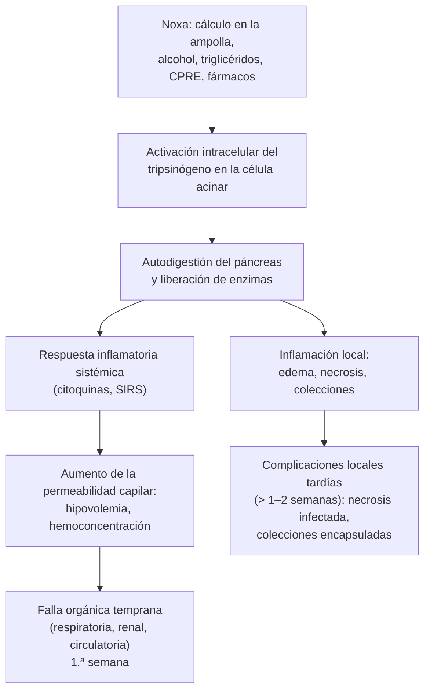
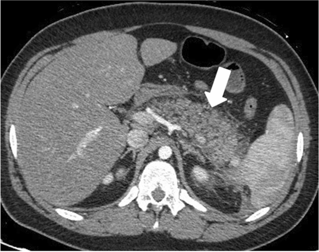
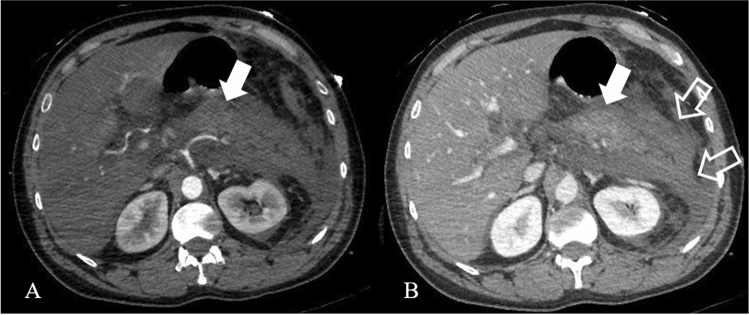
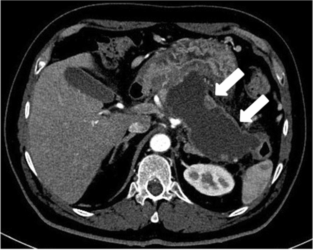

---
tags:
  - Gastroenterología
  - Urgencia
  - Frecuente en sala
---

# Pancreatitis aguda

**Subespecialidad**
Gastroenterología · Cirugía · Urgencia

**Guías principales**
ACG 2024: manejo de la pancreatitis aguda · IAP/APA/EPC/IPC/JPS 2025: guías revisadas de pancreatitis aguda · Clasificación de Atlanta revisada (2012)

**Otras fuentes**
Ensayos WATERFALL (volumen, 2022), PONCHO (colecistectomía, 2015), APEC (CPRE, 2020) y PANTER (necrosis infectada, 2010) · Epidemiología nacional (Csendes, Rev Med Chile 2021)

**EUNACOM**
1.06.2.010 Pancreatitis aguda (sospecha, inicial, derivar) · 1.02.2.005 Hipertrigliceridemia grave (específico, inicial, derivar)

**Revisado**
Septiembre 2026

!!! abstract "Resumen en 60 segundos"
    - **Diagnóstico** (2 de 3): **dolor epigástrico** típico (irradiado al dorso "en faja"), **lipasa o amilasa ≥ 3 veces** el límite normal, **imagen** compatible. La TC **no** es necesaria para el diagnóstico si hay los dos primeros.
    - **Causas**: en Chile, **~ 60–80 % biliar** (litiasis); luego **alcohol**, **hipertrigliceridemia** (> 1.000 mg/dL), post-CPRE, fármacos. **Ecografía abdominal** a todos al ingreso.
    - **Gravedad (Atlanta 2012)**: **leve** (sin falla orgánica), **moderadamente grave** (falla orgánica < 48 h o complicaciones locales) y **grave** (falla orgánica **persistente > 48 h**; mortalidad ~ 20–30 %). Vigila de cerca las **primeras 48 horas**.
    - **Volumen moderado** (WATERFALL): **Ringer lactato**, bolo de **10 mL/kg sólo si hay hipovolemia**, luego **1,5 mL/kg/h**, y reevaluar. La hidratación agresiva no mejora el pronóstico y causa sobrecarga.
    - **Alimentación oral precoz** (24–48 h) con **dieta sólida baja en grasa** en la leve; **nutrición enteral** en la grave. **No antibióticos profilácticos**.
    - **CPRE urgente (< 24 h) sólo si hay colangitis**. **Colecistectomía en la misma hospitalización** en la pancreatitis biliar leve.

## Definición

**Pancreatitis aguda (PA)**: inflamación aguda del páncreas, con compromiso variable de los tejidos vecinos y de órganos a distancia.

**Diagnóstico (Atlanta revisada 2012)**: al menos **2 de 3** criterios:

1. **Dolor abdominal** compatible: epigástrico, de inicio agudo, intenso y persistente, a menudo **irradiado al dorso**.
2. **Lipasa (o amilasa) sérica ≥ 3 veces** el límite superior normal.
3. Hallazgos característicos en la **TC con contraste**, la RM o la ecografía.

| Término | Definición |
|---|---|
| **PA intersticial edematosa** | Aumento difuso del páncreas por edema, con realce homogéneo (**~ 90–95 %**) |
| **PA necrotizante** | Necrosis del parénquima y/o de la grasa peripancreática (**~ 5–10 %**); se ve mejor en la TC **después de 72 h** |
| **Falla orgánica** | Puntaje de **Marshall modificado ≥ 2** en: **respiratorio** (PaO₂/FiO₂ ≤ 300), **renal** (creatinina ≥ 1,9 mg/dL) o **cardiovascular** (PAS < 90 mmHg que no responde a volumen) |
| **Falla orgánica transitoria / persistente** | Se resuelve en **< 48 h** / dura **> 48 h** |
| **PA recurrente** | ≥ 2 episodios separados por la resolución completa |

## Epidemiología

### Mundial

- Incidencia de **~ 30–40 por 100.000 habitantes al año**, en aumento (obesidad, litiasis, mayor uso de pruebas de lipasa).
- Es una de las **causas gastrointestinales más frecuentes de hospitalización**.
- **~ 80 %** de los casos son **leves** y se resuelven en pocos días; **~ 20 %** son moderadamente graves o graves.
- **Mortalidad** global **~ 2–5 %**; en la **PA grave** (falla orgánica persistente) **~ 20–30 %**, y más con **necrosis infectada** y falla orgánica.
- Causas: **biliar** (40–70 %) y **alcohol** (25–35 %) son las más frecuentes en el mundo; ~ 10–20 % queda como **idiopática** (a menudo microlitiasis).

### Chile

!!! chile "Datos nacionales"
    - **Egresos hospitalarios 2013–2018** (Csendes, 2021): **46.420** pacientes con PA; incidencia de **~ 43 por 100.000 habitantes** al año, **mayor en el sur** (Región de O'Higgins a Magallanes: 53,6 vs 36,9 por 100.000 en el norte y centro), lo que se asocia a la alta frecuencia de litiasis biliar en poblaciones de ascendencia indígena.
    - **Estadía media de 11 días** y **letalidad hospitalaria de 4,2 %**, sin cambios en el período.
    - En las series chilenas, la etiología **biliar** explica el **60–80 %** de las PA (~ 70 % en mujeres) y el **alcohol** ~ 9 % (hasta ~ 17 % en hombres). Chile tiene una de las **prevalencias de litiasis biliar más altas del mundo** (sobre todo en mujeres y población mapuche).
    - El **GES** incluye la **colecistectomía preventiva del cáncer de vesícula** en personas de **35 a 49 años** con litiasis.

## Etiología y fisiopatología

| Causa | Claves |
|---|---|
| **Biliar (litiasis, microlitiasis, barro)** | Mujer, colelitiasis en la ecografía; **GPT > 150 U/L** (> 3 veces lo normal) en las primeras 48 h sugiere origen biliar; bilirrubina y fosfatasa alcalina altas |
| **Alcohol** | Consumo intenso y prolongado (> 5 tragos/día por años); a menudo tras una ingesta excesiva; puede evolucionar a pancreatitis crónica |
| **Hipertrigliceridemia** | **Triglicéridos > 1.000 mg/dL** (sobre todo > 2.000); diabetes mal controlada, alcohol, embarazo, estrógenos, hipotiroidismo; la amilasa puede ser normal (interferencia) |
| **Post-CPRE** | 3–10 % de las CPRE; se previene con **indometacina rectal**, hidratación con Ringer lactato y *stent* pancreático |
| **Fármacos** | Azatioprina y 6-mercaptopurina, **ácido valproico**, estrógenos, tiazidas, furosemida, L-asparaginasa, didanosina, pentamidina, sulfas, mesalazina, inhibidores de la DPP-4 y arGLP-1 (asociación discutida) |
| **Hipercalcemia** | Hiperparatiroidismo, cáncer |
| **Obstructiva o tumoral** | **Cáncer de páncreas** o **neoplasia mucinosa papilar intraductal (IPMN)**: sospechar en **> 40 años** sin otra causa; páncreas *divisum*, disfunción del esfínter de Oddi |
| **Otras** | Trauma abdominal, autoinmune (IgG4), genética (*PRSS1*, *SPINK1*, *CFTR*), infecciones (parotiditis, CMV, VIH), isquemia, picadura de escorpión, tabaco (factor de riesgo) |

### Fisiopatología

- La PA tiene **dos fases** (Atlanta): **temprana** (primera semana), dominada por la **respuesta inflamatoria sistémica** y la **falla orgánica**; y **tardía** (> 1 semana), dominada por las **complicaciones locales** (necrosis, **infección** de la necrosis) en los casos moderadamente graves y graves.
- La **infección de la necrosis** (translocación bacteriana desde el intestino) ocurre típicamente en la **2.ª a 4.ª semana**.

## Clasificación

### Gravedad (Atlanta revisada 2012)

| Gravedad | Criterios | Evolución |
|---|---|---|
| **Leve** | **Sin falla orgánica** y sin complicaciones locales ni sistémicas | Se resuelve en la **primera semana**; mortalidad muy baja |
| **Moderadamente grave** | **Falla orgánica transitoria** (< 48 h) y/o **complicaciones locales** o exacerbación de una comorbilidad | Morbilidad importante; mortalidad baja |
| **Grave** | **Falla orgánica persistente** (> 48 h), de uno o más órganos | Mortalidad **~ 20–30 %** (más si hay necrosis infectada) |

### Complicaciones locales (Atlanta revisada)

| Colección | < 4 semanas | > 4 semanas (encapsulada) |
|---|---|---|
| **Sin necrosis** (PA intersticial) | **Colección líquida peripancreática aguda** | **Pseudoquiste** |
| **Con necrosis** (PA necrotizante) | **Colección necrótica aguda** | **Necrosis encapsulada** (*walled-off necrosis*, WON) |

Cualquiera de ellas puede estar **estéril** o **infectada**.

## Clínica

- **Dolor epigástrico** intenso, constante, de inicio rápido, **irradiado al dorso** ("en faja" o "en cinturón"); mejora al inclinarse hacia adelante.
- **Náuseas y vómitos** (~ 90 %).
- **Fiebre**, taquicardia, taquipnea, hipotensión en los casos graves.
- **Abdomen** sensible y distendido, **íleo**; la resistencia muscular es menor de lo que haría esperar el dolor.
- **Ictericia** (coledocolitiasis, colangitis).
- **Signos de Cullen** (equimosis periumbilical) y **Grey Turner** (equimosis en los flancos): raros (< 3 %), indican hemorragia retroperitoneal y peor pronóstico.
- **Derrame pleural** (izquierdo) e hipoxemia.
- **Xantomas eruptivos** y lipemia retinal en la hipertrigliceridemia grave.

## Diagnóstico

1. **Clínica** + **lipasa** (preferida sobre la amilasa: más **específica** y se mantiene alta más tiempo).
    - El **nivel** de la lipasa **no se correlaciona con la gravedad**; no se mide diariamente.
    - La **amilasa** puede ser normal en la PA por **alcohol** o **hipertrigliceridemia**, y subir en otras condiciones (úlcera perforada, isquemia intestinal, parotiditis, macroamilasemia, insuficiencia renal).
2. **Ecografía abdominal a todos al ingreso** para buscar **colelitiasis** y dilatación de la vía biliar (repetir si la primera no es concluyente).
3. **Estudio etiológico**: GPT y bilirrubina, **triglicéridos**, **calcio**, consumo de alcohol, fármacos; en la **PA idiopática**: repetir la ecografía, **RM con colangiorresonancia** y/o **endosonografía** (microlitiasis, tumores).
4. **Estratificación del riesgo** en las **primeras 24–48 h** (ningún puntaje es perfecto):
    - **SIRS persistente** (> 48 h).
    - **BISAP** (1 punto cada uno): **B**UN > 25 mg/dL, alteración de conciencia (**I**mpaired mental status), **S**IRS, edad (**A**ge) > 60 años, derrame **P**leural. **≥ 3** = mayor riesgo de mortalidad.
    - **Hematocrito > 44 %** o que no baja con la hidratación, **BUN** > 20 mg/dL o que sube, creatinina alta, **PCR > 150 mg/L a las 48 h**, **obesidad**, edad avanzada, comorbilidades.

## Laboratorio

| Examen | Para qué |
|---|---|
| **Lipasa** (o amilasa) | Diagnóstico (≥ 3 veces el límite normal) |
| **Hemograma** (hematocrito) | Hemoconcentración (> 44 %) = riesgo de gravedad; leucocitosis |
| **BUN, creatinina** | Falla renal, gravedad (BUN que sube) |
| **Electrolitos, calcio** | **Hipocalcemia** (saponificación de la grasa: mal pronóstico); hipercalcemia como causa |
| **GPT, GOT, bilirrubina, fosfatasa alcalina** | Origen biliar, coledocolitiasis, colangitis |
| **Triglicéridos** | Causa (> 1.000 mg/dL); medir al ingreso (bajan con el ayuno) |
| **Glicemia** | Hiperglicemia de estrés; diabetes |
| **PCR** | Gravedad (> 150 mg/L a las 48 h) |
| **Gases arteriales, lactato** | Falla respiratoria, hipoperfusión |
| **LDH, albúmina** | Gravedad |

## Imágenes

- **Ecografía abdominal**: **a todos** al ingreso (litiasis, dilatación de la vía biliar). El páncreas a menudo no se ve bien por el gas intestinal.
- **TC con contraste**: **no de rutina** al ingreso (ACG 2024). Indicaciones: **diagnóstico dudoso** (descartar otras causas de abdomen agudo) o **falta de mejoría a las 48–72 h** (necrosis, complicaciones locales). La necrosis se ve mejor **después de 72–96 h**.
- **RM con colangiorresonancia** o **endosonografía**: sospecha de **coledocolitiasis** sin colangitis, PA idiopática, caracterización de colecciones.
- **Radiografía de tórax**: derrame pleural, SDRA.

<figure markdown>
{ loading=lazy width="420" }
{ loading=lazy width="620" }
{ loading=lazy width="420" }
<figcaption>Figura 1. Espectro de la PA en la TC con contraste. Arriba: <strong>PA intersticial edematosa</strong> (páncreas aumentado de tamaño, de contornos mal definidos, con realce conservado; flecha). Al centro: <strong>PA necrotizante</strong> (realce disminuido del parénquima, flechas llenas, con colección heterogénea alrededor, flechas vacías) en fase arterial (A) y portal (B). Abajo: <strong>necrosis encapsulada</strong> (WON) a las 4 semanas (flechas). Fuente: Brizi MG, Perillo F, Cannone F, Tuzza L, Manfredi R. The role of imaging in acute pancreatitis. <em>Radiol Med</em>. 2021;126:1017–1029. Licencia <a href="https://creativecommons.org/licenses/by/4.0/">CC BY 4.0</a>.</figcaption>
</figure>

## Diagnóstico diferencial

- **Úlcera péptica perforada** (neumoperitoneo; la amilasa puede subir), **colecistitis** y **colangitis**, **cólico biliar**.
- **Isquemia mesentérica** (dolor desproporcionado, lactato alto), **obstrucción intestinal**.
- **IAM de pared inferior** (ECG y troponina en todo dolor epigástrico), **disección** o **rotura de aneurisma aórtico**.
- **Cetoacidosis diabética** (dolor abdominal y amilasa alta; la PA también puede desencadenarla).
- **Embarazo ectópico** roto, **neumonía basal**, pielonefritis, cólico renal.

## Tratamiento

!!! guia "ACG 2024 e IAP 2025: los cambios de la última década"
    - **Volumen moderado** (no agresivo) con **Ringer lactato**.
    - **Alimentación oral precoz** con dieta sólida baja en grasa en la PA leve; **enteral** (no parenteral) en la grave.
    - **Sin antibióticos profilácticos**, ni siquiera en la PA grave o necrotizante.
    - **CPRE urgente sólo si hay colangitis**.
    - **Colecistectomía en la misma hospitalización** en la PA biliar leve.
    - En la necrosis: **retrasar las intervenciones** (idealmente **> 4 semanas**) y usar un **enfoque escalonado** (*step-up*) mínimamente invasivo.

### 1. Hidratación

!!! dosis "Reposición de volumen (ensayo WATERFALL, ACG 2024)"
    - **Ringer lactato** mejor que suero fisiológico.
    - **Bolo de 10 mL/kg** en 2 horas **sólo si hay hipovolemia**; si no, sin bolo.
    - Luego **1,5 mL/kg/h**; reevaluar a las **3, 12, 24, 48 y 72 horas** (signos vitales, diuresis > 0,5 mL/kg/h, hematocrito, BUN, creatinina, signos de sobrecarga).
    - Suspender la hidratación EV cuando el paciente tolere la vía oral.
    - Una estrategia **agresiva** (bolo de 20 mL/kg y 3 mL/kg/h) **no mejoró** la evolución y causó **más sobrecarga de volumen** (20,5 % vs 6,3 %).
    - **Cuidado** en cardiópatas, ERC y adultos mayores.

### 2. Analgesia

- El dolor debe tratarse adecuadamente: **paracetamol**, **metamizol** y **opioides** (morfina, fentanilo, tramadol) son seguros; los opioides **no empeoran** la PA.
- Evitar los **AINE** si hay riesgo de lesión renal aguda.

### 3. Nutrición

- **PA leve**: **alimentación oral precoz** (en las primeras **24–48 h**, según tolerancia) con **dieta sólida baja en grasa** desde el inicio (no es necesario partir con líquidos).
- **PA moderadamente grave o grave**: **nutrición enteral** (por **sonda nasogástrica o nasoyeyunal**, ambas sirven) si no puede comer; reduce las infecciones y la falla orgánica. La IAP 2025 sugiere iniciarla si el paciente no puede alimentarse por **> 72 horas**.
- **Nutrición parenteral** sólo si la enteral no es posible o no alcanza las metas.

### 4. Antibióticos

- **No se usan antibióticos profilácticos** (ni en la PA grave ni en la necrotizante estéril).
- **Sí** si hay una **infección extrapancreática** (colangitis, neumonía, ITU, bacteriemia) o **necrosis infectada**.
- **Sospechar necrosis infectada** si hay **deterioro clínico** o **fiebre** después de 7–10 días, o **gas** en la colección en la TC. No se recomienda la punción aspirativa rutinaria.
- **Antibióticos que penetran la necrosis**: **carbapenémicos**, quinolonas + metronidazol, piperacilina/tazobactam. Muchos pacientes pueden **postergar** o incluso **evitar** el drenaje con antibióticos.

### 5. Manejo de la causa biliar

- **CPRE urgente (< 24 h)** en la PA con **colangitis** (fiebre, ictericia, dolor en el hipocondrio derecho) o con **obstrucción biliar persistente**.
- **Sin colangitis**: tratamiento médico; la **CPRE precoz no mejora** la evolución, ni siquiera en la PA grave prevista (ensayo **APEC**). Si se sospecha coledocolitiasis, confirmar con **colangiorresonancia o endosonografía** antes de la CPRE.
- **Colecistectomía**:
    - **PA biliar leve**: **en la misma hospitalización** (ensayo **PONCHO**: la colecistectomía diferida aumentó las complicaciones biliares recurrentes: 17 % vs 5 %).
    - **PA necrotizante**: **diferirla** hasta que las colecciones se resuelvan o por **~ 6 semanas**.
    - Si no es candidato a cirugía: **esfinterotomía endoscópica**.

### 6. Manejo de la necrosis y de las colecciones

- Las colecciones **estériles y asintomáticas** (incluidos los pseudoquistes) **no se drenan**, aunque sean grandes.
- **Necrosis infectada** o sintomática: **enfoque escalonado** (*step-up*): antibióticos → **drenaje** percutáneo o **endoscópico** (transgástrico) → **necrosectomía mínimamente invasiva** si no mejora. Idealmente **después de 4 semanas** (necrosis encapsulada). El enfoque escalonado redujo las complicaciones mayores y la muerte frente a la necrosectomía abierta (ensayo **PANTER**).

### 7. Cuidados intensivos

- **UCI o intermedio** si hay **falla orgánica**, **SIRS persistente**, BISAP ≥ 3, edad avanzada con comorbilidad o deterioro.
- Vigilar la **presión intraabdominal** (vesical) en la PA grave: **> 20 mmHg** con nueva falla orgánica = **síndrome compartimental abdominal**.

### 8. Pancreatitis por hipertrigliceridemia

!!! dosis "Hipertrigliceridemia grave y PA"
    - Tratamiento estándar de la PA (volumen, analgesia, nutrición).
    - **Insulina cristalina EV 0,1 U/kg/h** (con **suero glucosado** si la glicemia es < 200 mg/dL) para bajar los triglicéridos, sobre todo en diabéticos; controlar glicemia y K.
    - **Plasmaféresis** en casos graves seleccionados (hipocalcemia, acidosis láctica, falla orgánica que empeora), con evidencia limitada.
    - Meta: **triglicéridos < 500 mg/dL** (idealmente < 1.000 en las primeras 48–72 h).
    - **Prevención**: dieta muy baja en grasa, **abstinencia de alcohol**, control de la diabetes, suspender fármacos que suben los triglicéridos; **fibratos** (fenofibrato) y ácidos grasos omega-3.

## Complicaciones

| Tipo | Complicaciones |
|---|---|
| **Sistémicas (fase temprana)** | **SDRA**, **lesión renal aguda**, **shock**, CID, **hipocalcemia**, hiperglicemia, **exacerbación de comorbilidades** (insuficiencia cardíaca, EPOC) |
| **Locales** | Colecciones (aguda, pseudoquiste, colección necrótica, necrosis encapsulada), **necrosis infectada**, **trombosis de la vena esplénica o porta**, **pseudoaneurisma** (arteria esplénica: hemorragia), **síndrome compartimental abdominal**, fístulas, **síndrome del conducto pancreático desconectado**, obstrucción gástrica o biliar |
| **Tardías** | **Diabetes** posterior a la pancreatitis, **insuficiencia pancreática exocrina**, **recurrencia** (~ 20 %), evolución a **pancreatitis crónica** (sobre todo con alcohol y tabaco) |

## Pronóstico y seguimiento

- **PA leve**: se resuelve en **3–7 días**; mortalidad < 1 %.
- **PA grave**: mortalidad **~ 20–30 %**; la **falla orgánica persistente** y la **necrosis infectada** son los principales determinantes. En Chile, la **letalidad hospitalaria** global es de **~ 4 %**.
- **Perfil EUNACOM**: sospecha diagnóstica, **tratamiento inicial** (volumen, analgesia, nutrición, estratificación) y **derivación** (cirugía, gastroenterología, UCI).
- **Seguimiento**:
    - **Colecistectomía** en la PA biliar (misma hospitalización o diferida si es necrotizante).
    - **Intervención breve y derivación** para dejar el **alcohol** y el **tabaco** (reduce la recurrencia).
    - Control de los **triglicéridos** en la PA por hipertrigliceridemia.
    - **Glicemia y HbA1c** anuales (diabetes pospancreatitis) y evaluar insuficiencia exocrina (esteatorrea, baja de peso).
    - En **> 40 años** con PA idiopática: descartar un **tumor** de páncreas (TC, RM o endosonografía).

## Perlas para el internado

!!! perla "Para la sala y el turno"
    - **Pide lipasa**, no ecografía, para el diagnóstico; pide **ecografía** para la **causa**.
    - **No pidas TC al ingreso** "para ver la gravedad": no cambia el manejo precoz y la necrosis aún no se ve.
    - La **gravedad se define por la falla orgánica**, no por el nivel de lipasa.
    - **Reevalúa el volumen** cada pocas horas: el exceso de suero también mata (SDRA, síndrome compartimental).
    - **Dale de comer** al paciente con PA leve apenas tolere: no hace falta esperar que baje la lipasa.
    - **Fiebre al 2.º día** suele ser inflamatoria (SIRS); fiebre en la **2.ª a 4.ª semana** con deterioro = **necrosis infectada** hasta demostrar lo contrario.
    - **Ictericia + fiebre + PA** = **colangitis**: CPRE urgente.
    - Toda PA biliar leve se va de alta **sin vesícula** (colecistectomía en la misma hospitalización).

## Preguntas de repaso

??? repaso "1. Mujer de 45 años con dolor epigástrico intenso irradiado al dorso y vómitos de 8 horas. Lipasa 2.400 U/L (normal < 60), GPT 320 U/L. PA 125/80, FC 96, sin falla orgánica. ¿Diagnóstico, estudio y manejo inicial?"
    **Pancreatitis aguda** (dolor típico + lipasa ≥ 3 veces), probablemente **biliar** (GPT > 150 U/L). **Ecografía abdominal** (colelitiasis), triglicéridos y calcio, hemograma, BUN y creatinina, gases. **No TC** al ingreso. Manejo: **Ringer lactato** (sin bolo si no hay hipovolemia; **1,5 mL/kg/h**), **analgesia** (opioides si es necesario), **alimentación oral precoz** con dieta sólida baja en grasa, sin antibióticos. Vigilar las primeras 48 h. Si se confirma PA biliar leve: **colecistectomía en la misma hospitalización**.

??? repaso "2. ¿Cómo se clasifica la gravedad de la PA según Atlanta 2012?"
    **Leve**: sin falla orgánica ni complicaciones locales o sistémicas. **Moderadamente grave**: **falla orgánica transitoria** (< 48 h) y/o complicaciones locales (colecciones, necrosis) o exacerbación de comorbilidades. **Grave**: **falla orgánica persistente** (> 48 h) de uno o más órganos (respiratorio, renal o cardiovascular; Marshall ≥ 2).

??? repaso "3. Hombre de 55 años con PA de 2 días, ictericia progresiva, fiebre de 39 °C y bilirrubina de 6 mg/dL; la ecografía muestra colédoco de 11 mm. ¿Qué indicas?"
    **Colangitis aguda** asociada a PA biliar: **CPRE urgente (< 24 h)** con esfinterotomía y extracción del cálculo, más **antibióticos** (p. ej., ceftriaxona + metronidazol o piperacilina/tazobactam según gravedad), hidratación y analgesia. Después, colecistectomía (misma hospitalización si la PA es leve).

??? repaso "4. Paciente con PA necrotizante que, en la 3.ª semana, presenta fiebre, deterioro clínico y gas en la colección necrótica en la TC. ¿Diagnóstico y conducta?"
    **Necrosis pancreática infectada**. **Antibióticos que penetran la necrosis** (carbapenémico, o quinolona + metronidazol) y **postergar el drenaje** hasta que la colección se encapsule (idealmente > 4 semanas) si el paciente está estable. Si no mejora: **enfoque escalonado** (drenaje percutáneo o endoscópico → necrosectomía mínimamente invasiva). Manejo en un centro con experiencia; no se recomienda la punción aspirativa rutinaria.

??? repaso "5. Hombre de 38 años con diabetes mal controlada y PA; el suero se ve lechoso y los triglicéridos son 3.400 mg/dL. ¿Qué tratamiento específico agregas y qué prevención indicas al alta?"
    **PA por hipertrigliceridemia**. Además del manejo estándar: **infusión de insulina EV** (0,1 U/kg/h con glucosa si es necesario; controlar glicemia y K) para bajar los triglicéridos; plasmaféresis en casos graves seleccionados. Al alta: dieta muy baja en grasa, **abstinencia de alcohol**, **control de la diabetes**, **fenofibrato** (± omega-3) y control de triglicéridos (meta < 500 mg/dL).

## Referencias

1. Tenner S, Vege SS, Sheth SG, et al. American College of Gastroenterology Guidelines: Management of Acute Pancreatitis. *Am J Gastroenterol.* 2024;119:419–437.
2. IAP/APA/EPC/IPC/JPS Working Group. International Association of Pancreatology Revised Guidelines on Acute Pancreatitis 2025. *Pancreatology.* 2025;25:770–814. doi:[10.1016/j.pan.2025.04.020](https://doi.org/10.1016/j.pan.2025.04.020)
3. Banks PA, Bollen TL, Dervenis C, et al. Classification of acute pancreatitis—2012: revision of the Atlanta classification and definitions by international consensus. *Gut.* 2013;62:102–111.
4. de-Madaria E, Buxbaum JL, Maisonneuve P, et al. Aggressive or Moderate Fluid Resuscitation in Acute Pancreatitis (WATERFALL). *N Engl J Med.* 2022;387:989–1000.
5. da Costa DW, Bouwense SA, Schepers NJ, et al. Same-admission versus interval cholecystectomy for mild gallstone pancreatitis (PONCHO): a multicentre randomised controlled trial. *Lancet.* 2015;386:1261–1268.
6. Schepers NJ, Hallensleben NDL, Besselink MG, et al. Urgent endoscopic retrograde cholangiopancreatography with sphincterotomy versus conservative treatment in predicted severe acute gallstone pancreatitis (APEC): a multicentre randomised controlled trial. *Lancet.* 2020;396:167–176.
7. van Santvoort HC, Besselink MG, Bakker OJ, et al. A step-up approach or open necrosectomy for necrotizing pancreatitis (PANTER). *N Engl J Med.* 2010;362:1491–1502.
8. Csendes A, Gaete D, Toro J. Epidemiología de la pancreatitis aguda en Chile entre los años 2013 y 2018. *Rev Med Chile.* 2021;149:961–970. doi:[10.4067/s0034-98872021000700961](https://doi.org/10.4067/s0034-98872021000700961)
9. Brizi MG, Perillo F, Cannone F, Tuzza L, Manfredi R. The role of imaging in acute pancreatitis. *Radiol Med.* 2021;126:1017–1029. doi:[10.1007/s11547-021-01359-3](https://doi.org/10.1007/s11547-021-01359-3)
