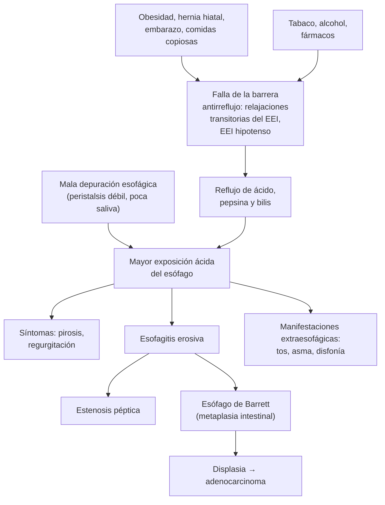

---
tags:
  - Gastroenterología
  - Frecuente en sala
---

# Enfermedad por reflujo gastroesofágico (ERGE) y esófago de Barrett

**Subespecialidad**
Gastroenterología · Medicina interna · Cirugía digestiva

**Guías principales**
ACG 2022: diagnóstico y manejo de la ERGE · Consenso de Lyon 2.0 (2024): diagnóstico moderno de la ERGE · ACG 2022: esófago de Barrett · AGA 2022: desprescripción de los IBP

**Otras fuentes**
Prevalencia de esófago de Barrett en un centro chileno (Espino 2025)

**GES**
No

**EUNACOM**
1.06.1.027 Reflujo gastroesofágico (específico, completo, completo)

**Revisado**
Septiembre 2026

!!! abstract "Resumen en 60 segundos"
    - **ERGE**: el reflujo del contenido gástrico causa **síntomas molestos** (pirosis, regurgitación) o **complicaciones** (esofagitis, estenosis, Barrett).
    - **Síntomas típicos** sin alarma: **prueba empírica con IBP por 8 semanas**, una vez al día, **30–60 minutos antes del desayuno** (ACG 2022). Si responde, **intentar suspenderlo**.
    - **Endoscopía** si:
        - Hay **signos de alarma**: disfagia, baja de peso, hemorragia, anemia, vómitos.
        - No responde a los IBP, o los síntomas vuelven al suspenderlos.
        - Hay factores de riesgo de **Barrett**.
        - En Chile, además, si tiene **≥ 40 años** con epigastralgia persistente (guía GES de cáncer gástrico).
    - **Estilo de vida**: **bajar de peso** (la medida con mejor evidencia), no comer **2–3 h antes de acostarse**, **elevar la cabecera** si hay síntomas nocturnos, dejar de fumar.
    - **Esofagitis Los Ángeles C o D**: **IBP de mantención indefinida** (o cirugía).
    - **ERGE no erosiva**: IBP **a demanda** o intermitente. Siempre la **menor dosis** eficaz.
    - **No** usar procinéticos (metoclopramida) ni baclofeno sin una indicación objetiva.
    - **Esófago de Barrett**:
        - Epitelio columnar **≥ 1 cm** con **metaplasia intestinal**; es la lesión precursora del **adenocarcinoma** de esófago.
        - Tamizaje con endoscopía en la ERGE crónica con **≥ 3 factores de riesgo** (hombre, > 50 años, tabaco, obesidad, familiar con Barrett o adenocarcinoma).
        - Vigilancia cada **3–5 años** si no hay displasia.
    - **Dolor torácico "por reflujo"**: descarta primero un **SCA**.

## Definición

| Término | Definición |
|---|---|
| **ERGE** | Condición en que el reflujo del contenido gástrico al esófago produce **síntomas molestos** o **complicaciones** |
| **Esofagitis erosiva** | Lesiones de la mucosa (erosiones) visibles en la endoscopía; se gradúa con la clasificación de **Los Ángeles** (A–D) |
| **ERGE no erosiva** | Síntomas de reflujo con **endoscopía normal** y **reflujo patológico** demostrado en la pH-metría |
| **Pirosis funcional** | Pirosis con endoscopía y pH-metría **normales** y **sin** asociación entre síntomas y reflujo |
| **Esófago hipersensible** | Exposición ácida normal, pero los síntomas **se asocian** a los episodios de reflujo |
| **ERGE refractaria** | Síntomas persistentes pese a **IBP en dosis doble** por 8 semanas, con buena adherencia |
| **Esófago de Barrett** | Reemplazo del epitelio escamoso del esófago distal por epitelio **columnar** de **≥ 1 cm** con **metaplasia intestinal** (células caliciformes) en la biopsia (ACG 2022) |

## Epidemiología

### Mundial

- La ERGE es una de las enfermedades digestivas **más frecuentes**; afecta a una proporción importante de los adultos en los países occidentales, y su prevalencia aumenta con la **obesidad**.
- La mayoría de los pacientes tiene una **ERGE no erosiva**. La esofagitis grave (C o D) es menos frecuente.
- **Barrett**: afecta a ~ **1–2 %** de la población general y hasta al **14 %** de los pacientes con ERGE (citado por Espino 2025). Es la **única** lesión premaligna conocida del **adenocarcinoma de esófago**, cuya incidencia aumenta en los países occidentales.

### Chile

!!! chile "Datos nacionales"
    - **Esófago de Barrett** en la red de salud UC CHRISTUS, 2015–2022 (Espino 2025):
        - Prevalencia de **0,46 %** de las endoscopías diagnósticas (422 de 91.723), que subió de **0,33 %** en 2015 a **0,72 %** en 2022.
        - **62 % hombres**, edad promedio de **58 años**, longitud promedio de 3,7 cm.
        - Displasia de bajo grado en el **3,8 %**; displasia de alto grado o adenocarcinoma en el **1,7 %**.
        - La **cromoendoscopía** y una **lesión visible** se asociaron con mayor detección de neoplasia.
    - La **obesidad** es muy prevalente en Chile (ENS 2016–2017), el principal factor de riesgo modificable de la ERGE.
    - El **cáncer de esófago** causa ~ 700 casos y más de 600 muertes al año (ver [disfagia](disfagia-y-afagia-aguda.md)); no tiene garantía GES.
    - La ERGE **no tiene garantía GES**. El **omeprazol** está disponible en la APS.

## Etiología y factores de riesgo

| Factor | Mecanismo o ejemplos |
|---|---|
| **Obesidad** (sobre todo abdominal) | Aumenta la presión intraabdominal y el gradiente gastroesofágico; favorece la hernia hiatal |
| **Hernia hiatal** | Separa el esfínter esofágico inferior del diafragma y forma un reservorio de ácido |
| **Relajaciones transitorias del esfínter inferior** | El principal mecanismo del reflujo, sobre todo después de comer |
| **Esfínter inferior hipotenso** | Esclerodermia, tabaco, alcohol, fármacos |
| **Fármacos** | **Calcioantagonistas**, **nitratos**, anticolinérgicos, benzodiacepinas, teofilina, opioides, progesterona |
| **Otros** | **Embarazo**, **tabaco**, comidas abundantes o nocturnas, grasas, chocolate, café, alcohol (desencadenantes individuales), gastroparesia, decúbito tras comer |

**Factores de riesgo de Barrett** (ACG 2022): **hombre**, **> 50 años**, raza blanca, **tabaco**, **obesidad** y **familiar de primer grado** con Barrett o adenocarcinoma de esófago.

## Fisiopatología

*Figura 1. Mecanismos y complicaciones de la ERGE. EEI: esfínter esofágico inferior. Esquema propio.*

- La barrera antirreflujo está formada por el **esfínter esofágico inferior**, el **diafragma crural** y el ángulo de His.
- El mecanismo más frecuente son las **relajaciones transitorias** del esfínter, no provocadas por la deglución, sobre todo tras las comidas.
- La **hernia hiatal** y la **obesidad** debilitan la barrera y aumentan la presión sobre ella.
- La lesión depende del tiempo de contacto con el ácido: por eso la **depuración esofágica** (peristalsis y saliva) importa.
- En el **Barrett**, la exposición crónica al ácido cambia el epitelio escamoso por uno columnar con **metaplasia intestinal**, que puede progresar a displasia y adenocarcinoma.

## Clasificación

| Clasificación | Categorías |
|---|---|
| **Fenotipo** | **Esofagitis erosiva** · **ERGE no erosiva** · **esófago hipersensible** y **pirosis funcional** (no son ERGE) |
| **Los Ángeles** (esofagitis) | **A**: erosiones ≤ 5 mm · **B**: erosiones > 5 mm que no unen pliegues · **C**: erosiones que unen pliegues, < 75 % de la circunferencia · **D**: ≥ 75 % de la circunferencia |
| **Lyon 2.0** (evidencia de ERGE) | **Concluyente**: esofagitis B, C o D, Barrett, estenosis péptica, exposición ácida > 6 % · **Limítrofe**: esofagitis A, exposición 4–6 % · **En contra**: exposición < 4 % |
| **Barrett** | Por la longitud: **segmento corto** (< 3 cm) o **largo** (≥ 3 cm; clasificación de **Praga**) · por la histología: **sin displasia**, **displasia de bajo** o **alto grado**, adenocarcinoma |

<figure markdown>
![A la izquierda, cuatro esquemas endoscópicos del esófago visto desde arriba, con la luz al centro y pliegues radiales. En el grado A hay una erosión roja pequeña de 5 mm o menos que no une pliegues; en el B, erosiones de más de 5 mm que no unen pliegues; en el C, erosiones que unen pliegues pero cubren menos del 75 % de la circunferencia; en el D, erosiones confluentes en 75 % o más de la circunferencia. A la derecha, los criterios de Lyon 2.0 para decidir si hay reflujo patológico en un paciente sin ERGE demostrada, estudiado sin IBP. Evidencia concluyente: esofagitis Los Ángeles B, C o D, esófago de Barrett confirmado por biopsia, estenosis péptica, o exposición ácida en la pH-metría mayor al 6 % del tiempo. Limítrofe: esofagitis Los Ángeles A, exposición ácida de 4 a 6 %, o 40 a 80 episodios de reflujo al día. Apoya el diagnóstico: hernia hiatal, asociación síntoma-reflujo, más de 80 episodios al día. En contra: exposición ácida menor a 4 % y menos de 40 episodios al día](../assets/figuras/erge/los-angeles-y-lyon.svg){ loading=lazy }
<figcaption>Figura 2. Clasificación de Los Ángeles de la esofagitis (esquema propio) y criterios de Lyon 2.0 de reflujo patológico, adaptados y traducidos de Gyawali CP, Yadlapati R, Fass R, et al. Updates to the modern diagnosis of GERD: Lyon consensus 2.0. <em>Gut.</em> 2024;73:361–371 (figura 3). Licencia <a href="https://creativecommons.org/licenses/by-nc/4.0/">CC BY-NC 4.0</a>.</figcaption>
</figure>

## Clínica

- **Síntomas típicos**:
    - **Pirosis**: ardor retroesternal que **sube** desde el epigastrio, después de comer o al acostarse.
    - **Regurgitación**: retorno del contenido gástrico a la boca, con sabor ácido o amargo, sin náuseas.
- **Dolor torácico** no cardíaco (solo tras descartar un origen coronario).
- **Síntomas extraesofágicos**: **tos crónica**, **asma** de difícil control, **disfonía**, carraspera, laringitis, **erosiones dentales**. La ERGE es **una** causa posible entre muchas.
- Síntomas **nocturnos** que despiertan al paciente.

!!! alarma "Signos de alarma: endoscopía como primer examen (ACG 2022)"
    - **Disfagia** u **odinofagia**.
    - **Baja de peso** no intencionada.
    - **Hemorragia digestiva** o **anemia** ferropénica.
    - **Vómitos** persistentes, masa abdominal.
    - En Chile, además: **≥ 40 años** con epigastralgia de más de 15 días (guía GES de cáncer gástrico).

## Diagnóstico

- **Síntomas típicos sin alarma**: el diagnóstico es **clínico**, con una **prueba terapéutica con IBP por 8 semanas** (ACG 2022).
    - La respuesta **apoya** el diagnóstico, pero no lo prueba: el efecto placebo es alto.
- **Endoscopía digestiva alta**:
    - **Indicaciones**: signos de alarma, **falta de respuesta** al IBP, **recurrencia** al suspenderlo, **tamizaje de Barrett**, antes de una cirugía antirreflujo.
    - Idealmente **sin IBP** por **2–4 semanas** cuando se busca evidencia de ERGE (el IBP cicatriza la esofagitis).
    - La mayoría de los pacientes con ERGE tiene una **endoscopía normal** (ERGE no erosiva).
    - Tomar **biopsias** si se sospecha una **esofagitis eosinofílica** (disfagia, impactación) o un Barrett.
- **pH-metría de 24 horas** (con o sin impedanciometría) o **cápsula inalámbrica** de 96 horas:
    - Se usa si el diagnóstico **no es claro** y la endoscopía no muestra evidencia de ERGE.
    - Se hace **sin IBP**. Criterios en la Figura 2 (Lyon 2.0).
    - Es **obligatoria antes de una cirugía antirreflujo** si no hay evidencia concluyente.
- **Manometría esofágica** antes de la cirugía (descartar una **acalasia** o una aperistalsis).
- El **esofagograma con bario** **no** se recomienda como único examen para diagnosticar la ERGE (ACG 2022).

!!! guia "Tamizaje del esófago de Barrett (ACG 2022)"
    - Una **endoscopía de tamizaje** en los pacientes con **síntomas crónicos de ERGE** y **≥ 3 factores de riesgo**: **hombre**, **> 50 años**, raza blanca, **tabaco**, **obesidad**, **familiar de primer grado** con Barrett o adenocarcinoma de esófago.
    - **Diagnóstico**: epitelio columnar de **≥ 1 cm** sobre la unión esofagogástrica, con **metaplasia intestinal** en la biopsia.

## Laboratorio

- La ERGE **no requiere exámenes de laboratorio** para su diagnóstico.
- **Hemograma** y **ferritina** si hay sospecha de sangrado o anemia (signo de alarma).
- **Magnesio** y **vitamina B12** en los usuarios crónicos de IBP con síntomas compatibles (hipomagnesemia, déficit de B12).
- **ECG** y **troponina** si hay dolor torácico.

## Imágenes

- **Endoscopía**: el examen de imagen **principal** (ver Diagnóstico).
- **Esofagograma con bario**: útil para evaluar una **hernia hiatal** grande, una estenosis compleja o antes de la cirugía; **no** para diagnosticar la ERGE.
- **Radiografía o TC de tórax**: si hay síntomas respiratorios, para buscar otras causas (tos crónica, neumonía aspirativa).

## Diagnóstico diferencial

| Cuadro | Claves |
|---|---|
| **Síndrome coronario** | Dolor opresivo con el esfuerzo, factores de riesgo, disnea; **ECG y troponina** primero |
| **Esofagitis eosinofílica** | Joven atópico, **disfagia** e **impactación**, anillos y surcos en la endoscopía; biopsias |
| **Acalasia** | Disfagia a sólidos y líquidos, regurgitación de alimento no digerido que **no** responde a IBP; manometría |
| **Dispepsia** y **úlcera péptica** | Dolor o ardor **epigástrico**, plenitud (ver [dispepsia](dispepsia-ulcera-peptica-y-cancer-gastrico.md)) |
| **Pirosis funcional** | Endoscopía y pH-metría normales; responde a neuromoduladores |
| **Esofagitis infecciosa o por fármacos** | **Odinofagia**; inmunosupresión o pastillas tomadas sin agua |
| **Rumiación** | Regurgitación sin esfuerzo, inmediatamente después de comer; terapia conductual |
| **Cáncer de esófago o gástrico** | Disfagia progresiva, baja de peso, anemia |

## Tratamiento

### Medidas generales (ACG 2022)

- **Bajar de peso** en los pacientes con sobrepeso u obesidad: la medida con **mejor evidencia**.
- **No comer 2–3 horas antes de acostarse**.
- **Elevar la cabecera** de la cama (15–20 cm, con bloques o una cuña) si hay síntomas **nocturnos**.
- **Dejar de fumar**; evitar los alimentos que **al paciente** le desencadenan síntomas (sin dietas restrictivas generales).
- Revisar los **fármacos** que empeoran el reflujo (calcioantagonistas, nitratos, anticolinérgicos).

### Tratamiento farmacológico

!!! dosis "IBP y otros fármacos en la ERGE"
    - **IBP en dosis estándar, una vez al día, 30–60 minutos antes del desayuno**, por **8 semanas** (ACG 2022):
        - **Omeprazol 20 mg**, esomeprazol 40 mg, lansoprazol 30 mg o pantoprazol 40 mg.
        - Se prefieren los IBP a los **antagonistas H2** para cicatrizar y mantener la esofagitis erosiva.
    - **Respuesta parcial**: revisar la adherencia y el horario, y luego **subir a dosis doble** (antes del desayuno y de la cena) por 8 semanas más.
    - **Después de las 8 semanas**:
        - **Síntomas típicos que respondieron**: **intentar suspender** el IBP (o bajar la dosis).
        - **ERGE no erosiva**: IBP **a demanda** o intermitente.
        - **Esofagitis Los Ángeles C o D**, **Barrett** y **estenosis péptica**: **IBP de mantención indefinida** (o cirugía). No suspender.
        - Mantención siempre con la **menor dosis** que controle los síntomas.
    - **Otros fármacos**:
        - **Antiácidos** y **alginatos**: alivio rápido y a demanda de los síntomas leves.
        - **Antagonistas H2** (famotidina) en la noche: síntomas nocturnos pese al IBP (pierden efecto en semanas).
        - **No** usar **procinéticos** (metoclopramida) salvo gastroparesia demostrada, **ni baclofeno** sin evidencia objetiva de ERGE, **ni sucralfato** (salvo en el embarazo) (ACG 2022).
    - **Embarazo**: medidas generales, antiácidos, alginatos o sucralfato; IBP si es necesario.

### ERGE refractaria (derivar a gastroenterología)

1. **Optimizar el IBP**: adherencia, **horario** (antes de la comida, no al acostarse), dosis doble.
2. **Endoscopía** (con biopsias para buscar una esofagitis eosinofílica).
3. **pH-impedanciometría**:
    - **Sin IBP** si la ERGE no está demostrada.
    - **Con IBP** si ya está demostrada, para ver si persiste el reflujo.
4. Si la exposición ácida es **normal**: pensar en **esófago hipersensible**, **pirosis funcional** o **rumiación**, que se tratan con **neuromoduladores** (tricíclicos en dosis bajas, ISRS) o terapia conductual.

### Cirugía y procedimientos

- **Funduplicatura laparoscópica** (Nissen u otra) por un cirujano con experiencia (ACG 2022). Indicada si hay **ERGE demostrada objetivamente** y:
    - **Regurgitación** refractaria a los IBP.
    - Deseo de no usar IBP de por vida o intolerancia a ellos.
    - **Hernia hiatal grande**.
- **Bypass gástrico en Y de Roux**: en los pacientes con **obesidad** candidatos a cirugía bariátrica. La **gastrectomía en manga** puede **empeorar** el reflujo.
- **Aumento magnético del esfínter** y **funduplicatura transoral**: en casos seleccionados y centros con experiencia.

### Esófago de Barrett

- **IBP** de por vida.
- **Vigilancia endoscópica** con biopsias sistemáticas (protocolo de Seattle) (ACG 2022):
    - **Sin displasia**, segmento **< 3 cm**: cada **5 años**.
    - **Sin displasia**, segmento **≥ 3 cm**: cada **3 años**.
    - **Displasia de bajo grado** (confirmada por un segundo patólogo): **terapia endoscópica de erradicación** o vigilancia a los 6 y 12 meses y luego anual.
    - **Displasia de alto grado**: **terapia endoscópica de erradicación** (resección de las lesiones visibles y ablación por radiofrecuencia).
- La **cirugía antirreflujo no** sustituye a la vigilancia.

## Complicaciones

- **Esofagitis erosiva** y hemorragia digestiva (generalmente leve).
- **Estenosis péptica**: disfagia progresiva a sólidos; se trata con **dilatación** e IBP.
- **Esófago de Barrett** y **adenocarcinoma** de esófago.
- **Extraesofágicas**: tos crónica, asma de difícil control, laringitis, erosiones dentales, neumonía aspirativa.
- **Del tratamiento**:
    - **IBP a largo plazo**: sus riesgos absolutos son **bajos** y la mayoría viene de estudios **observacionales**.
        - Se han asociado a infecciones entéricas (***C. difficile***), déficit de **B12** y de **magnesio**, y fracturas.
        - Por eso, revisar periódicamente si siguen indicados (**desprescripción**; AGA 2022).
    - **Funduplicatura**: disfagia, distensión por gases, dificultad para eructar o vomitar.

## Pronóstico y seguimiento

- La ERGE es **crónica y recurrente**: la mayoría vuelve a tener síntomas al suspender el IBP, pero muchos pueden manejarse **a demanda**.
- La esofagitis **cicatriza** con IBP en la mayoría de los casos en 8 semanas. En la esofagitis **C o D**, se suele repetir la endoscopía tras el tratamiento para confirmar la cicatrización y descartar un **Barrett** oculto por la inflamación.
- **Desprescripción** de los IBP (AGA 2022):
    - En la ERGE **no complicada** que respondió, intentar bajar la dosis o suspender, **gradualmente** (el ácido de rebote puede dar síntomas transitorios).
    - **No** suspender en la esofagitis C o D, el Barrett o la estenosis péptica.
- **Barrett**: el riesgo de cáncer **sin displasia** es bajo; la vigilancia detecta la displasia en una etapa tratable por endoscopía.

## Perlas para el internado

!!! perla "Para la sala y el turno"
    - El IBP se toma **30–60 minutos antes del desayuno**, no al acostarse: muchos "refractarios" solo lo toman mal.
    - **Pirosis con disfagia, baja de peso o anemia**: no sigas con IBP a ciegas; pide una **endoscopía**.
    - Antes de atribuir un **dolor torácico** al reflujo, descarta un **SCA** (ECG y troponina).
    - **No** indiques **metoclopramida** para el reflujo: no sirve y causa efectos extrapiramidales.
    - Revisa la lista de IBP del paciente hospitalizado: muchos no tienen indicación y se pueden **suspender** al alta.
    - La **baja de peso** mejora más el reflujo que cualquier cambio de dieta.
    - **Hombre de > 50 años, obeso y fumador**, con reflujo de años: piensa en **Barrett** y pide una endoscopía.

## Preguntas de repaso

??? repaso "1. Mujer de 32 años con pirosis y regurgitación 3 veces por semana desde hace 4 meses, sin disfagia, baja de peso ni anemia. IMC 29. ¿Qué haces?"
    **ERGE con síntomas típicos sin signos de alarma**: prueba empírica.

    - **Omeprazol 20 mg** una vez al día, **30–60 minutos antes del desayuno**, por **8 semanas**.
    - **Bajar de peso**, no comer 2–3 horas antes de acostarse, elevar la cabecera si hay síntomas nocturnos, evitar sus desencadenantes.
    - Si responde: **intentar suspender** el IBP o usarlo a demanda.
    - Si no responde o recurre al suspenderlo: **endoscopía** (idealmente sin IBP por 2–4 semanas).

??? repaso "2. Hombre de 61 años, obeso y fumador, con pirosis de más de 10 años que controla con omeprazol a demanda. Nunca se ha hecho una endoscopía. ¿Qué indicas?"
    **Endoscopía de tamizaje de esófago de Barrett**: tiene ERGE crónica y **≥ 3 factores de riesgo** (hombre, > 50 años, obesidad, tabaco) (ACG 2022).

    - Biopsias de toda mucosa sospechosa (epitelio columnar ≥ 1 cm con metaplasia intestinal).
    - Además: bajar de peso y dejar de fumar.
    - Si hay Barrett: IBP de por vida y vigilancia según la longitud y la displasia.

??? repaso "3. Hombre de 45 años con pirosis persistente pese a omeprazol 20 mg, que toma al acostarse. ¿Cuál es el siguiente paso?"
    **Optimizar el IBP antes de hablar de ERGE refractaria**:

    - **Cambiar el horario**: 30–60 minutos **antes del desayuno** (y antes de la cena si se sube a dosis doble).
    - Revisar la **adherencia** y las medidas generales.
    - Si persiste con dosis doble por 8 semanas: **endoscopía** (con biopsias para buscar una esofagitis eosinofílica) y **pH-impedanciometría**.
    - Si la exposición ácida es normal: **pirosis funcional** o esófago hipersensible (neuromoduladores).

??? repaso "4. Hombre de 64 años, diabético e hipertenso, que consulta en la noche por ardor retroesternal de 40 minutos, que atribuye a "su reflujo". ¿Qué haces primero?"
    **Descartar un síndrome coronario agudo** antes de atribuirlo al reflujo: tiene factores de riesgo, y el SCA en los diabéticos puede presentarse como "ardor".

    - **ECG en ≤ 10 minutos** y **troponina** (ver [SCA](../cardiologia/sindrome-coronario-agudo.md)).
    - Solo si el estudio cardíaco es negativo, considerar la ERGE u otras causas esofágicas.
    - Si nunca se ha estudiado y tiene ≥ 40 años con síntomas persistentes: endoscopía.

??? repaso "5. Mujer de 55 años con una endoscopía que muestra esofagitis Los Ángeles grado C. ¿Tratamiento y seguimiento?"
    **Esofagitis erosiva grave** (grado C: erosiones que unen pliegues, < 75 % de la circunferencia): es evidencia **concluyente** de ERGE (Lyon 2.0).

    - **IBP** en dosis estándar o doble por **8 semanas**, antes de las comidas.
    - Medidas generales (peso, horario de comidas, cabecera, tabaco).
    - Luego **IBP de mantención indefinida** (o cirugía antirreflujo) (ACG 2022): **no** suspenderlo.
    - Considerar una **endoscopía de control** tras el tratamiento para confirmar la cicatrización y descartar un **Barrett**.

??? repaso "6. Hombre de 58 años con un esófago de Barrett de 4 cm sin displasia en las biopsias. ¿Cómo lo sigues?"
    **Barrett de segmento largo sin displasia**:

    - **IBP** de por vida.
    - **Vigilancia endoscópica cada 3 años** (≥ 3 cm), con biopsias sistemáticas (ACG 2022). Si midiera < 3 cm, cada 5 años.
    - Si aparece **displasia de bajo grado** (confirmada por un segundo patólogo): terapia de erradicación endoscópica o vigilancia estrecha. Si es de **alto grado**: **erradicación endoscópica**.
    - Controlar los factores de riesgo: peso y tabaco.

## Referencias

1. Katz PO, Dunbar KB, Schnoll-Sussman FH, et al. ACG clinical guideline for the diagnosis and management of gastroesophageal reflux disease. *Am J Gastroenterol.* 2022;117:27–56. doi:[10.14309/ajg.0000000000001538](https://doi.org/10.14309/ajg.0000000000001538)
2. Gyawali CP, Yadlapati R, Fass R, et al. Updates to the modern diagnosis of GERD: Lyon consensus 2.0. *Gut.* 2024;73:361–371. doi:[10.1136/gutjnl-2023-330616](https://doi.org/10.1136/gutjnl-2023-330616)
3. Shaheen NJ, Falk GW, Iyer PG, et al. Diagnosis and management of Barrett's esophagus: an updated ACG guideline. *Am J Gastroenterol.* 2022;117:559–587. doi:[10.14309/ajg.0000000000001680](https://doi.org/10.14309/ajg.0000000000001680)
4. Targownik LE, Fisher DA, Saini SD. AGA clinical practice update on de-prescribing of proton pump inhibitors: expert review. *Gastroenterology.* 2022;162:1334–1342. doi:[10.1053/j.gastro.2021.12.247](https://doi.org/10.1053/j.gastro.2021.12.247)
5. Yadlapati R, Gyawali CP, Pandolfino JE, et al. AGA clinical practice update on the personalized approach to the evaluation and management of GERD: expert review. *Clin Gastroenterol Hepatol.* 2022;20:984–994. doi:[10.1016/j.cgh.2022.01.025](https://doi.org/10.1016/j.cgh.2022.01.025)
6. Espino A, Fuenzalida MJ, Latorre G, et al. [Prevalence of Barrett's esophagus and factors associated with the diagnosis of dysplasia or adenocarcinoma in patients evaluated at a Chilean university endoscopy center] (artículo en español). *Rev Gastroenterol Peru.* 2025;45:367–373. [PubMed](https://pubmed.ncbi.nlm.nih.gov/41530069/)
