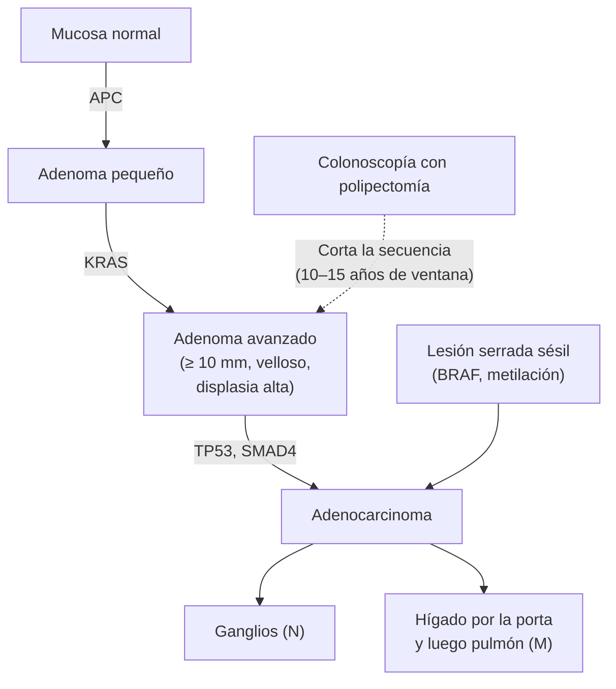

---
tags:
  - Gastroenterología
  - GES
---

# Tumores de colon y cáncer colorrectal

**Subespecialidad**
Gastroenterología · Coloproctología · Oncología · Atención primaria

**Guías principales**
USPSTF 2021 y ACG 2021: tamizaje del cáncer colorrectal · US Multi-Society Task Force 2020 y ESGE 2020: vigilancia tras la polipectomía · ESMO 2020: cáncer de colon localizado · ESMO 2023: cáncer colorrectal metastásico · EHTG-ESCP 2021: síndrome de Lynch

**Otras fuentes**
Programa chileno PRENEC (Okada 2016) · FIT en sintomáticos en un hospital público chileno (Quezada-Diaz 2025) · Costo-efectividad del tamizaje con FIT en Chile (Muñoz-Montecinos 2026) · IDEA (2020) · KEYNOTE-177 (2020)

**GES**
Sí: **cáncer colorrectal en personas de 15 años y más** (problema 70). Confirmación diagnóstica en **45 días** desde la sospecha; etapificación en **45 días** desde la confirmación; tratamiento primario y adyuvante en **30 días** desde la indicación; primer control en **90 días**. El **tamizaje** de la población asintomática **no** está garantizado.

**EUNACOM**
1.06.1.029 Tumores de colon (específico, inicial, derivar)

**Revisado**
Octubre 2026

!!! abstract "Resumen en 60 segundos"
    - **Cáncer colorrectal (CCR)**: uno de los cánceres **más frecuentes y mortales** del mundo. En Chile, su **mortalidad ha aumentado rápidamente**.
    - **Casi todos nacen de un pólipo** (secuencia **adenoma-carcinoma**, en **10 años** o más). **Resecar los pólipos previene el cáncer**: es la base del tamizaje.
    - **Sospechar** ante:
        - **rectorragia**;
        - **cambio del hábito intestinal**;
        - **anemia ferropénica** (sobre todo en el colon derecho);
        - **baja de peso**;
        - **obstrucción** (sobre todo en el colon izquierdo).
        - Estudiar con **colonoscopía**: el **GES** garantiza la confirmación en **45 días**.
    - **Tamizaje del riesgo promedio** (asintomáticos de **45–50 a 75 años**): **test inmunoquímico fecal (FIT)** anual o cada 2 años, o **colonoscopía cada 10 años**.
    - **Riesgo aumentado**: **familiar de primer grado** con CCR (colonoscopía desde los **40 años** cada 5 años), **EII**, **Lynch**, **poliposis adenomatosa familiar**.
    - **Etapificación**: TC de tórax, abdomen y pelvis, **CEA**; RM de pelvis en el **recto**.
    - **Tratamiento**:
        - **Cirugía** (colectomía con ganglios).
        - **Quimioterapia adyuvante** en la **etapa III** (y en la II de alto riesgo).
        - **Recto**: tratamiento **neoadyuvante**.
        - **Metástasis**: quimioterapia ± biológicos según **RAS/BRAF**. **Inmunoterapia** si hay **inestabilidad microsatelital**. Las metástasis hepáticas resecables pueden curarse.

## Definición

| Concepto | Definición |
|---|---|
| **Pólipo colorrectal** | Lesión que protruye hacia el lumen. Puede ser **neoplásico** (adenoma, serrado) o **no neoplásico** (hiperplásico, inflamatorio, hamartomatoso) |
| **Adenoma** | Pólipo **neoplásico** de epitelio displásico: **tubular**, **tubulovelloso** o **velloso**. Es el precursor de la mayoría de los CCR |
| **Adenoma avanzado** | Adenoma **≥ 10 mm**, con componente **velloso** o con **displasia de alto grado** |
| **Lesión serrada sésil** | Pólipo serrado, a menudo **plano** y en el **colon derecho**; precursor del ~15–30 % de los CCR (vía serrada) |
| **Cáncer colorrectal** | **Adenocarcinoma** (> 95 %) del colon o del recto, que **invade la submucosa** o más allá |
| **Cáncer de recto** | Tumor cuyo borde inferior está a **≤ 15 cm del margen anal** (en la rectoscopía rígida o la RM) |
| **Cáncer colorrectal de inicio precoz** | Diagnosticado antes de los **50 años**; su incidencia está en aumento |
| **Síndrome de Lynch** | Cáncer hereditario autosómico dominante por mutación de los genes de **reparación de errores del ADN** (MLH1, MSH2, MSH6, PMS2, EPCAM); **inestabilidad microsatelital** |
| **Poliposis adenomatosa familiar** (PAF) | Mutación de **APC**: **cientos a miles de adenomas** desde la adolescencia; riesgo de CCR de ~100 % sin colectomía |
| **Tamizaje** | Estudio de personas **asintomáticas** para detectar pólipos o cánceres precoces. **No** se aplica a los sintomáticos (a ellos se les hace una colonoscopía diagnóstica) |

## Epidemiología

- **En el mundo**: el CCR está entre los **3 cánceres más frecuentes** y es la **segunda causa de muerte por cáncer** (GLOBOCAN 2020).
- **Edad**: el riesgo sube desde los **50 años**; la mayoría se diagnostica después de los 60. Sin embargo, la incidencia está **aumentando en los menores de 50**.
- **Factores de riesgo**:
    - **Edad**.
    - **Antecedente familiar** (un familiar de primer grado duplica el riesgo).
    - **Síndromes hereditarios** (Lynch ~3 %, PAF < 1 %).
    - **EII** de larga data.
    - **Dieta**: **carnes rojas y procesadas**, poca fibra, **alcohol**.
    - **Obesidad**, **sedentarismo**, **tabaco**, **DM2**.
    - **Acromegalia** y bacteriemia por ***Streptococcus gallolyticus*** (*bovis*).
- **Factores protectores**: actividad física, fibra, **aspirina** (en grupos seleccionados), resección de los pólipos.
- **Localización**: ~2/3 en el **colon** y ~1/3 en el **recto**.

!!! chile "Datos nacionales"
    - En Chile, la **mortalidad por cáncer colorrectal aumentó rápidamente** en las últimas décadas (Okada 2016).
    - **GES 70**: cáncer colorrectal en las personas de **15 años y más**. Garantiza la **confirmación diagnóstica en 45 días** desde la sospecha, la **etapificación en 45 días**, el **tratamiento** en **30 días** y el **primer control en 90 días** (Superintendencia de Salud).
    - **No hay un programa nacional de tamizaje poblacional**:
        - El programa **PRENEC** (desde 2012, en colaboración con Japón) estudió con **FIT** a **10 575 personas asintomáticas** y detectó **107 cánceres** (1 % de los participantes). Su tasa de detección de adenomas en la colonoscopía fue de **42 %**.
        - Un modelo chileno mostró que el tamizaje con **FIT cada 2 años** entre los **50 y 69 años** es **costo-efectivo**, pero con un alto impacto presupuestario (Muñoz-Montecinos 2026).
    - **FIT para priorizar la colonoscopía en los sintomáticos**: en un hospital público chileno, un FIT cualitativo único en los sintomáticos de riesgo bajo o moderado tuvo una **sensibilidad de 96 %** y un **valor predictivo negativo de 99,8 %** para el CCR (Quezada-Diaz 2025). Útil donde las colonoscopías son escasas.

## Etiología

| Vía | Mecanismo | Clínica |
|---|---|---|
| **Inestabilidad cromosómica** (~70–85 %) | **Secuencia adenoma-carcinoma**: *APC* → *KRAS* → *TP53* | Adenoma tubular → velloso → cáncer; esporádico y PAF |
| **Inestabilidad microsatelital** (~15 %) | Falla de la **reparación de errores del ADN** (MMR): germinal (**Lynch**) o por **metilación de *MLH1*** (esporádica) | Colon **derecho**, mucinoso, infiltrado linfocitario; buena respuesta a la **inmunoterapia** |
| **Vía serrada** (metilación, CIMP) | Mutación de ***BRAF***, hipermetilación | **Lesiones serradas sésiles** del colon derecho; cánceres de intervalo |
| **Colitis asociada** | Inflamación crónica (EII) → displasia → cáncer (*TP53* precoz) | Colitis ulcerosa extensa, Crohn colónico, colangitis esclerosante |

**Síndromes hereditarios**:

| Síndrome | Gen | Claves |
|---|---|---|
| **Lynch** (CCR hereditario no polipósico) | MLH1, MSH2, MSH6, PMS2, EPCAM | CCR joven (colon derecho), **cáncer de endometrio**, ovario, estómago, urotelio. Criterios de **Amsterdam II** (3-2-1: 3 familiares, 2 generaciones, 1 antes de los 50 años) |
| **Poliposis adenomatosa familiar** | *APC* | **> 100 adenomas**; tumores desmoides, osteomas (Gardner), adenomas duodenales |
| **PAF atenuada**, poliposis asociada a *MUTYH* | *APC*, *MUTYH* (recesiva) | 10–100 adenomas |
| **Peutz-Jeghers** | *STK11* | **Pigmentación** mucocutánea (labios), pólipos hamartomatosos, intususcepción |
| **Poliposis juvenil** | *SMAD4*, *BMPR1A* | Pólipos juveniles múltiples |

## Fisiopatología

- **Secuencia adenoma-carcinoma**: la mucosa normal acumula mutaciones a lo largo de **10–15 años**.
    - ***APC*** (inicia el adenoma).
    - ***KRAS*** (crecimiento).
    - ***TP53*** y *SMAD4* (transformación maligna).
    - **Implicancia**: hay una **larga ventana** para detectar y **resecar los pólipos** antes de que se malignicen. Por eso el **tamizaje reduce la incidencia y la mortalidad**.
- **El riesgo de malignidad de un adenoma** aumenta con el **tamaño** (≥ 10 mm), el componente **velloso** y la **displasia de alto grado**.
- **Diseminación**:
    - **Local**: a través de la pared (T).
    - **Linfática**: a los ganglios (N).
    - **Hematógena**: al **hígado** (vía **porta**; el sitio más frecuente), y luego al **pulmón**. El **recto distal** drena a la circulación sistémica y da metástasis **pulmonares** directas.
    - **Peritoneal**: carcinomatosis.
- **Síntomas según el lado**:
    - **Colon derecho**: lumen ancho y contenido líquido → el tumor crece sin obstruir y **sangra en forma oculta** → **anemia ferropénica**, fatiga, masa.
    - **Colon izquierdo**: lumen estrecho y heces sólidas → **cambio del hábito**, **obstrucción**, heces acintadas, **rectorragia**.
    - **Recto**: **rectorragia**, **pujo**, **tenesmo**, sensación de evacuación incompleta.

*Figura 1. Secuencia adenoma-carcinoma y vía serrada: por qué el tamizaje con polipectomía previene el cáncer colorrectal. Esquema propio.*

## Clasificación

**Etapificación TNM (AJCC, 8.ª edición) simplificada**:

| Etapa | TNM | Descripción | Tratamiento principal |
|---|---|---|---|
| **0** | Tis | Carcinoma in situ (intramucoso) | Resección endoscópica |
| **I** | T1–T2, N0 | Invade la submucosa o la muscular propia | **Cirugía** |
| **II** | T3–T4, N0 | Atraviesa la muscular o invade la serosa y los órganos vecinos | **Cirugía**; quimioterapia adyuvante en el **alto riesgo** |
| **III** | Cualquier T, **N+** | **Ganglios positivos** | **Cirugía + quimioterapia adyuvante** |
| **IV** | Cualquier T y N, **M1** | **Metástasis** a distancia (hígado, pulmón, peritoneo) | Quimioterapia ± biológicos; resección de las metástasis si es posible |

- **Etapa II de alto riesgo**: T4, < 12 ganglios examinados, invasión linfovascular o perineural, obstrucción o perforación al debut, tumor poco diferenciado (sin inestabilidad microsatelital).
- **Biomarcadores** en la enfermedad avanzada (ESMO 2023): **RAS** (*KRAS*, *NRAS*), ***BRAF* V600E**, **inestabilidad microsatelital (MSI) o déficit de MMR**, *HER2*.

## Clínica

- **Asintomático** en las etapas precoces (por eso el tamizaje).
- **Síntomas**:
    - **Rectorragia** o **hematoquecia**: no atribuirla a hemorroides sin estudiar en los mayores de 45–50 años.
    - **Cambio del hábito intestinal** persistente: constipación, diarrea, heces acintadas.
    - **Anemia ferropénica** sin causa: el CCR derecho puede manifestarse **solo** así.
    - **Dolor abdominal**, **baja de peso**, fatiga.
    - **Masa** palpable (abdominal o al **tacto rectal**).
    - **Pujo** y **tenesmo** (recto).
- **Debut como urgencia** (~20–30 %):
    - **Obstrucción intestinal** (colon izquierdo).
    - **Perforación** con peritonitis.
    - **Hemorragia digestiva baja** ([ver HDB](hemorragia-digestiva-baja.md)).
- **Enfermedad metastásica**: **hepatomegalia**, ictericia, ascitis, tos.
- **Pistas especiales**:
    - **Endocarditis** o bacteriemia por ***Streptococcus gallolyticus*** (*bovis*) o ***Clostridium septicum***: **colonoscopía** ([ver endocarditis](../infectologia/endocarditis-infecciosa.md)).
    - Joven con CCR y antecedentes familiares de cáncer de colon o endometrio: **Lynch**.

!!! alarma "Signos de alarma: colonoscopía preferente"
    - **Rectorragia** en una persona de **> 45–50 años** o con otros síntomas.
    - **Anemia ferropénica** sin causa clara (sobre todo en **hombres** y **mujeres posmenopáusicas**): estudiar con endoscopía **alta y baja** ([ver anemias](../hematologia/anemias.md)).
    - **Cambio del hábito intestinal** persistente después de los 45–50 años.
    - **Baja de peso** sin causa, **masa** abdominal o rectal.
    - **FIT positivo**: la colonoscopía no se debe postergar (el riesgo de cáncer avanzado aumenta con la demora).
    - **Distensión, vómitos y ausencia de deposiciones y gases**: **obstrucción** colónica (TC, cirugía).
    - **Dolor abdominal intenso con fiebre y signos peritoneales**: **perforación**.

## Diagnóstico

!!! guia "Estudio del paciente con sospecha de CCR (ESMO 2020 y 2023)"
    1. **Historia** (síntomas, antecedentes familiares de cáncer de colon, endometrio u otros) y **examen físico** con **tacto rectal**.
    2. **Colonoscopía completa** con **biopsias** de la lesión y búsqueda de **lesiones sincrónicas** (~3–5 %). Si no se puede completar: **colonografía por TC**.
    3. **Etapificación**:
        - **TC de tórax, abdomen y pelvis** con contraste.
        - **CEA** basal (pronóstico y seguimiento).
        - **Recto**: **RM de pelvis** (T, N, fascia mesorrectal) y, en los tumores precoces, **endosonografía**.
        - **PET-TC** solo en casos seleccionados (por ejemplo, antes de resecar metástasis).
    4. **Biomarcadores**: estudio de **MMR o MSI** en **todos** los CCR (tamizaje universal del **síndrome de Lynch** y elección del tratamiento). En la enfermedad metastásica: **RAS** y ***BRAF***.
    5. **Comité oncológico** multidisciplinario.

<figure markdown>
![Esquema sobre a quién y cómo estudiar el cáncer colorrectal, con tres recuadros y una tabla. Con síntomas no es tamizaje: rectorragia, cambio del hábito intestinal, anemia ferropénica, baja de peso, masa u obstrucción requieren una colonoscopía diagnóstica, con confirmación en 45 días por el GES; la anemia ferropénica en un hombre o una mujer posmenopáusica requiere endoscopía alta y baja. Riesgo promedio en asintomáticos: desde los 45 a 50 hasta los 75 años, test inmunoquímico fecal anual o cada 2 años, con colonoscopía si es positivo, o colonoscopía cada 10 años; entre los 76 y 85 años, individualizar; sobre los 85, no tamizar. Riesgo aumentado: familiar de primer grado con cáncer o adenoma avanzado antes de los 60 años, colonoscopía desde los 40 o 10 años antes del caso cada 5 años; EII, desde los 8 años de evolución; Lynch, desde los 20 a 25 años cada 1 a 2 años; poliposis adenomatosa familiar, desde los 10 a 12 años, anual. Tabla de vigilancia después de la colonoscopía según la US Multi-Society Task Force 2020: sin pólipos o hasta 20 hiperplásicos menores de 10 mm en el rectosigmoides, 10 años; 1 a 2 adenomas tubulares menores de 10 mm, 7 a 10 años; 3 a 4 adenomas tubulares menores de 10 mm, 3 a 5 años; 5 a 10 adenomas, adenoma de 10 mm o más, velloso o con displasia de alto grado, 3 años; más de 10 adenomas, 1 año, considerando un síndrome hereditario; adenoma de 20 mm o más resecado en fragmentos, 6 meses](../assets/figuras/colon/tamizaje-y-vigilancia-colorrectal.svg){ loading=lazy }
<figcaption>Figura 2. Cáncer colorrectal: diagnóstico en los sintomáticos, tamizaje según el riesgo y vigilancia tras la colonoscopía. Esquema propio basado en USPSTF 2021, ACG 2021, US Multi-Society Task Force 2020 y GES 70.</figcaption>
</figure>

!!! guia "Tamizaje del cáncer colorrectal (USPSTF 2021; ACG 2021)"
    - **Riesgo promedio**: desde los **45 años** (recomendación B de la USPSTF; desde los **50**, recomendación A) hasta los **75 años**. Entre los 76 y 85 años, **individualizar** según la salud y los tamizajes previos.
    - **Pruebas de primera línea**:
        - **Test inmunoquímico fecal (FIT)** **anual** (los programas poblacionales lo usan cada 2 años). **Si es positivo → colonoscopía**.
        - **Colonoscopía cada 10 años**.
    - **Alternativas**: FIT con ADN fecal (cada 1–3 años), colonografía por TC (cada 5 años), sigmoidoscopía flexible (cada 5–10 años).
    - **La prueba mejor es la que el paciente efectivamente se hace**: la adherencia importa más que la elección.
    - **Riesgo aumentado** (no aplica el tamizaje de riesgo promedio):
        - **Familiar de primer grado** con CCR o adenoma avanzado **antes de los 60 años**, o **2 familiares** de primer grado: **colonoscopía cada 5 años** desde los **40 años** (o 10 años antes del caso más joven).
        - **Un familiar** de primer grado diagnosticado a los **60 años o más**: tamizaje desde los **40 años** con los intervalos del riesgo promedio.
        - **EII**, **Lynch** y **PAF**: protocolos propios (figura 2).

## Laboratorio

| Examen | Para qué | Interpretación |
|---|---|---|
| **Hemograma, ferritina** | Anemia | **Ferropénica**: buscar un CCR (sobre todo derecho) |
| **Test inmunoquímico fecal (FIT)** | **Tamizaje** de asintomáticos; **priorizar** a los sintomáticos de riesgo bajo | Positivo: colonoscopía. **No** reemplaza la colonoscopía en los sintomáticos de alto riesgo |
| **CEA** (antígeno carcinoembrionario) | **Pronóstico** y **seguimiento** tras la cirugía | **No sirve para el diagnóstico ni el tamizaje** (sube con el tabaco, la EII, la cirrosis) |
| **Pruebas hepáticas** | Metástasis hepáticas | Fosfatasa alcalina alta |
| **Función renal, electrolitos** | Antes de la cirugía y la quimioterapia | Hipokalemia en los adenomas vellosos grandes (raro) |
| **MMR (inmunohistoquímica) o MSI** | **Lynch** y respuesta a la **inmunoterapia** | Pérdida de MLH1, MSH2, MSH6 o PMS2 |
| **RAS, *BRAF*, *HER2*** | Enfermedad metastásica | **RAS no mutado** del colon izquierdo: anti-EGFR (cetuximab, panitumumab) |

## Imágenes

- **Colonoscopía**: el examen de elección. **Diagnostica** (biopsia), **previene** (polipectomía) y **marca** (tatuaje) las lesiones para la cirugía.
    - **Calidad**: preparación adecuada, intubación del ciego, **tasa de detección de adenomas** (≥ 25 %) y tiempo de retiro (≥ 6 minutos).
- **Colonografía por TC**: si la colonoscopía es incompleta o está contraindicada.
- **TC de tórax, abdomen y pelvis**: etapificación (metástasis hepáticas y pulmonares, carcinomatosis) y seguimiento.
- **RM de pelvis**: etapificación local del **cáncer de recto** (extensión T, ganglios, distancia a la fascia mesorrectal y al esfínter).
- **RM hepática**: caracterizar y planificar la **resección de las metástasis** hepáticas.
- **Radiografía de abdomen** o **TC**: en la **obstrucción** (dilatación del colon proximal, nivel de la obstrucción).

## Diagnóstico diferencial

| Pista | Pensar en |
|---|---|
| Rectorragia de sangre roja al final de la defecación, dolor anal | **Hemorroides** o **fisura** (pero sobre los 45–50 años, estudiar el colon igual) |
| Diarrea con sangre en un joven, > 4 semanas | **EII** ([ver EII](enfermedad-inflamatoria-intestinal.md)) |
| Dolor en la fosa ilíaca izquierda con fiebre en un mayor | **Diverticulitis** (colonoscopía tras la resolución si no se ha hecho) |
| Dolor súbito y rectorragia en un mayor con factores vasculares | **Colitis isquémica** |
| Rectorragia masiva indolora en un mayor | **Enfermedad diverticular** o **angiodisplasia** ([ver HDB](hemorragia-digestiva-baja.md)) |
| Anemia ferropénica | CCR, **úlcera** o **cáncer gástrico**, **celíaca**, pérdidas ginecológicas |
| Cambio del hábito sin alarma en un joven | **Intestino irritable** (diagnóstico positivo) ([ver intestino irritable](constipacion-intestino-irritable-y-diarrea-cronica.md)) |
| Masa en la fosa ilíaca derecha en un joven | **Crohn**, absceso apendicular, TBC ileocecal, linfoma |
| Obstrucción colónica | CCR, **vólvulo** de sigmoides, diverticulitis estenosante, fecaloma |

## Tratamiento

!!! guia "Principios del tratamiento (ESMO 2020 y 2023)"
    - **Pólipos**: **resección endoscópica** completa (polipectomía, mucosectomía). Un **pólipo maligno** (cáncer T1) con criterios favorables puede quedar tratado solo con la endoscopía; si tiene criterios de riesgo (invasión profunda, linfovascular, margen positivo, mala diferenciación), **cirugía**.
    - **Cáncer de colon localizado (I–III)**: **colectomía** con resección de los ganglios (**≥ 12 ganglios**), idealmente laparoscópica.
        - **Etapa III**: **quimioterapia adyuvante** con **fluoropirimidina + oxaliplatino** (**CAPOX** o **FOLFOX**). **3 meses de CAPOX** bastan en el riesgo bajo (T1–3 N1); **6 meses** en el alto riesgo (T4 o N2) (IDEA).
        - **Etapa II de alto riesgo**: considerar la adyuvancia. **No** dar fluoropirimidina sola en los tumores con **inestabilidad microsatelital**.
    - **Cáncer de recto**:
        - **Tratamiento neoadyuvante** (radioterapia o quimiorradioterapia, o **tratamiento neoadyuvante total**) en los localmente avanzados (T3–T4 o N+).
        - Luego **escisión total del mesorrecto**.
        - Estrategia de **"observar y esperar"** en los que logran una respuesta clínica completa (casos seleccionados).
    - **Enfermedad metastásica (IV)**:
        - **Metástasis hepáticas o pulmonares resecables**: **cirugía** ± quimioterapia perioperatoria (intención **curativa**).
        - **No resecables**: quimioterapia (**FOLFOX**, **FOLFIRI**, **CAPOX**) + **biológico** según los biomarcadores:
            - **Anti-EGFR** (cetuximab, panitumumab) en los **RAS no mutados** del **colon izquierdo**.
            - **Bevacizumab** (anti-VEGF) en los demás.
        - **MSI o déficit de MMR**: **inmunoterapia** (**pembrolizumab**) de primera línea (KEYNOTE-177).
        - ***BRAF* V600E**: encorafenib + cetuximab en segunda línea.
    - **Obstrucción**: cirugía de urgencia (resección con o sin estoma) o **prótesis endoscópica** como puente.

- **Cuidados perioperatorios**: corrección de la **anemia** (hierro IV), nutrición, **profilaxis de TVP** (el cáncer y la cirugía abdominal aumentan el riesgo; extendida por 4 semanas en la cirugía oncológica abdominal), recuperación acelerada.
- **Ostomía**: educación, apoyo de enfermería especializada. El **GES** garantiza la **reconstitución del tránsito** en 90 días desde la indicación.
- **Aspirina**: en los portadores de **Lynch**, reduce el riesgo de CCR (indicación del especialista).
- **Estilo de vida**: actividad física, peso adecuado, menos carnes procesadas, dejar el tabaco y el alcohol.

!!! dosis "Esquemas de referencia (los indica el oncólogo)"
    | Esquema | Composición | Uso |
    |---|---|---|
    | **CAPOX** (XELOX) | **Oxaliplatino 130 mg/m² IV** día 1 + **capecitabina 1000 mg/m² cada 12 h VO** días 1–14, cada **3 semanas** | Adyuvancia (etapa III: 3 o 6 meses) y metastásico |
    | **FOLFOX** | Oxaliplatino + leucovorina + **5-fluorouracilo** en bolo e infusión, cada **2 semanas** | Adyuvancia y metastásico |
    | **FOLFIRI** | Irinotecán + leucovorina + 5-fluorouracilo, cada 2 semanas | Metastásico |
    | **Pembrolizumab** | **200 mg IV cada 3 semanas** (o 400 mg cada 6 semanas) | Metastásico con **MSI** o déficit de MMR |
    | **Hierro IV** (carboximaltosa férrica) | **1000 mg** (en 1 o 2 dosis) | Anemia ferropénica preoperatoria |

- **Toxicidades frecuentes**: **neuropatía periférica** por el oxaliplatino (acumulativa, empeora con el frío), **síndrome mano-pie** (capecitabina), diarrea (irinotecán), **mielosupresión** ([ver urgencias oncológicas](../hematologia/urgencias-oncologicas.md)). Antes del 5-FU o la capecitabina, considerar el estudio del déficit de **DPD** (toxicidad grave).

## Complicaciones

| Complicación | Comentario |
|---|---|
| **Obstrucción intestinal** | Sobre todo en el colon izquierdo; urgencia quirúrgica o prótesis |
| **Perforación** | En el tumor o proximal (diastásica, en el ciego); peritonitis |
| **Hemorragia digestiva** | Habitualmente crónica (anemia); a veces aguda |
| **Fístulas** | Colovesical (neumaturia), colovaginal |
| **Metástasis** | **Hígado** (las más frecuentes), pulmón, peritoneo, hueso |
| **Complicaciones de la cirugía** | Filtración anastomótica, infección, íleo, hernia; disfunción sexual y urinaria y síndrome de resección anterior baja (recto) |
| **Toxicidad de la quimioterapia** | Neuropatía, neutropenia febril, diarrea, síndrome mano-pie |
| **Tromboembolismo venoso** | Cáncer activo, cirugía, quimioterapia |
| **Complicaciones de la colonoscopía** | Perforación (~1 por 1000–3000), sangrado pospolipectomía |

## Pronóstico y seguimiento

- **La etapa al diagnóstico determina el pronóstico**: la sobrevida a 5 años es de **~90 %** en la enfermedad localizada, **~70 %** con ganglios regionales y **~15 %** con metástasis a distancia. Por eso el **tamizaje** y el **diagnóstico precoz** salvan vidas.
- **Las metástasis hepáticas resecables** tienen una sobrevida a 5 años cercana a **40–50 %**.
- **Seguimiento tras el tratamiento curativo** (ESMO; típico en las etapas II–III):
    - **Consulta y CEA** cada **3–6 meses** por 3 años y luego cada 6 meses hasta los 5 años.
    - **TC de tórax, abdomen y pelvis** cada **6–12 meses** por 3–5 años.
    - **Colonoscopía al año** de la cirugía (o a los 3–6 meses si no se pudo ver todo el colon antes) y luego según los hallazgos (a los 3 años y después cada 5).
    - El **GES** garantiza el primer control en **90 días**.
- **Pólipos**: vigilancia según el número, el tamaño y la histología (figura 2).
- **Familiares**: **asesoría genética** si hay sospecha de un síndrome hereditario (pérdida de MMR, joven, múltiples cánceres en la familia) y **colonoscopía** de los familiares de primer grado.
- **Derivar**: todo CCR confirmado o con sospecha alta (GES), pólipos grandes o complejos (endoscopista experto), sospecha de síndrome hereditario (genética).

## Perlas para el internado

!!! perla "Para recordar en la sala"
    - **Anemia ferropénica en un hombre o una mujer posmenopáusica = colonoscopía y endoscopía alta**. No te quedes en el sulfato ferroso.
    - **Rectorragia en un mayor de 45–50 años: estudia el colon**, aunque tenga hemorroides.
    - **Haz el tacto rectal**: muchos cánceres de recto se palpan.
    - **El CEA no diagnostica**: sirve para el pronóstico y el seguimiento.
    - **El tamizaje es para asintomáticos**: si tiene síntomas, la indicación es una colonoscopía diagnóstica (GES).
    - **FIT positivo = colonoscopía sin demora**; no repitas el FIT.
    - **Endocarditis por *Streptococcus gallolyticus*** = colonoscopía.
    - **Pregunta por la familia**: cáncer de colon o endometrio en familiares jóvenes sugiere un **Lynch**.
    - **Colectomía por cáncer: profilaxis de TVP extendida** por 4 semanas.

## Preguntas de repaso

??? repaso "1. Hombre de 66 años, asintomático, con anemia ferropénica (Hb 10,8 g/dL, ferritina 8 ng/mL) en un examen de control. ¿Qué hace?"
    - La **anemia ferropénica sin causa** en un hombre es una **pérdida digestiva** hasta demostrar lo contrario: sospechar un **cáncer colorrectal** (sobre todo derecho) o una lesión gástrica.
    - **Estudio**: **colonoscopía** y **endoscopía alta** (con biopsias duodenales si no hay causa). Además, serología celíaca.
    - **Hierro** (oral o IV) mientras tanto.
    - Si se confirma un CCR: **GES 70** (etapificación en 45 días).

??? repaso "2. Mujer de 52 años sin antecedentes ni síntomas consulta por tamizaje de cáncer de colon. Su hermano tuvo un cáncer de colon a los 48 años. ¿Qué le indica?"
    - **No es de riesgo promedio**: tiene un **familiar de primer grado** con CCR **antes de los 60 años**.
    - Indicar una **colonoscopía** ahora y repetirla **cada 5 años** (debió iniciarla a los **38 años**: 10 años antes del diagnóstico del hermano o a los 40).
    - Si hay varios casos jóvenes o cánceres de endometrio en la familia, sospechar un **síndrome de Lynch**: averiguar el estudio de MMR del tumor del hermano y derivar a **asesoría genética**.

??? repaso "3. En una colonoscopía de tamizaje a un hombre de 58 años se resecan 2 adenomas tubulares de 6 mm y 8 mm con displasia de bajo grado. ¿Cuándo repite la colonoscopía?"
    - **1–2 adenomas tubulares < 10 mm**: control en **7–10 años** (US Multi-Society Task Force 2020).
    - Si hubiera tenido un adenoma **≥ 10 mm**, componente **velloso** o **displasia de alto grado**: en **3 años**.
    - Asegurar que la colonoscopía fue **completa** (ciego) y con una **buena preparación**; si no, repetirla antes.

??? repaso "4. Hombre de 74 años con constipación progresiva de 2 meses, heces acintadas y ahora 3 días sin deposiciones ni gases, con distensión y vómitos. ¿Qué sospecha y qué hace?"
    - **Obstrucción intestinal** por un **cáncer del colon izquierdo** (cambio del hábito, heces acintadas, obstrucción).
    - **Manejo inicial**:
        - Régimen cero, **sonda nasogástrica**, **hidratación** y corrección de los electrolitos.
        - **TC de abdomen y pelvis** con contraste (nivel de la obstrucción, perforación, metástasis).
    - **Cirugía de urgencia** (resección con o sin estoma) o **prótesis endoscópica** como puente a la cirugía electiva.
    - Signos de **perforación** o **isquemia** (dolor intenso, peritonitis, ciego > 10–12 cm): cirugía inmediata.

??? repaso "5. Mujer de 61 años operada de un adenocarcinoma de colon sigmoides: pT3 N1 (2 de 18 ganglios), M0, sin inestabilidad microsatelital. ¿Qué etapa tiene y qué tratamiento complementario corresponde?"
    - **Etapa III** (ganglios positivos).
    - **Quimioterapia adyuvante** con fluoropirimidina + oxaliplatino: **CAPOX por 3 meses** (riesgo bajo: T3 N1) según el estudio **IDEA**, o FOLFOX.
    - **Seguimiento**: CEA y consulta cada 3–6 meses, **TC** cada 6–12 meses, **colonoscopía al año**.
    - Vigilar la **neuropatía** por el oxaliplatino.

??? repaso "6. ¿Por qué el tamizaje del cáncer colorrectal reduce no solo la mortalidad sino también la incidencia, y cuáles son las pruebas de primera línea?"
    - Porque la mayoría de los CCR nace de un **adenoma** que tarda **10–15 años** en malignizarse (**secuencia adenoma-carcinoma**). La **colonoscopía con polipectomía** reseca esos precursores y **previene** el cáncer, además de detectarlo en etapas curables.
    - **Primera línea** en el riesgo promedio (45–50 a 75 años):
        - **Test inmunoquímico fecal (FIT)** anual o cada 2 años, con **colonoscopía** si es positivo.
        - **Colonoscopía cada 10 años**.
    - La mejor prueba es la que el paciente **realmente se hace**.

## Referencias

1. US Preventive Services Task Force; Davidson KW, Barry MJ, Mangione CM, et al. Screening for colorectal cancer: US Preventive Services Task Force recommendation statement. *JAMA.* 2021;325(19):1965–1977. doi:[10.1001/jama.2021.6238](https://doi.org/10.1001/jama.2021.6238)
2. Shaukat A, Kahi CJ, Burke CA, et al. ACG clinical guidelines: colorectal cancer screening 2021. *Am J Gastroenterol.* 2021;116(3):458–479. doi:[10.14309/ajg.0000000000001122](https://doi.org/10.14309/ajg.0000000000001122)
3. Gupta S, Lieberman D, Anderson JC, et al. Recommendations for follow-up after colonoscopy and polypectomy: a consensus update by the US Multi-Society Task Force on Colorectal Cancer. *Gastroenterology.* 2020;158(4):1131–1153.e5. doi:[10.1053/j.gastro.2019.10.026](https://doi.org/10.1053/j.gastro.2019.10.026)
4. Hassan C, Antonelli G, Dumonceau JM, et al. Post-polypectomy colonoscopy surveillance: European Society of Gastrointestinal Endoscopy (ESGE) guideline – update 2020. *Endoscopy.* 2020;52(8):687–700. doi:[10.1055/a-1185-3109](https://doi.org/10.1055/a-1185-3109)
5. Argilés G, Tabernero J, Labianca R, et al. Localised colon cancer: ESMO clinical practice guidelines for diagnosis, treatment and follow-up. *Ann Oncol.* 2020;31(10):1291–1305. doi:[10.1016/j.annonc.2020.06.022](https://doi.org/10.1016/j.annonc.2020.06.022)
6. Cervantes A, Adam R, Roselló S, et al. Metastatic colorectal cancer: ESMO clinical practice guideline for diagnosis, treatment and follow-up. *Ann Oncol.* 2023;34(1):10–32. doi:[10.1016/j.annonc.2022.10.003](https://doi.org/10.1016/j.annonc.2022.10.003)
7. Seppälä TT, Latchford A, Negoi I, et al. European guidelines from the EHTG and ESCP for Lynch syndrome: an updated third edition of the Mallorca guidelines based on gene and gender. *Br J Surg.* 2021;108(5):484–498. doi:[10.1002/bjs.11902](https://doi.org/10.1002/bjs.11902)
8. André T, Meyerhardt J, Iveson T, et al. Effect of duration of adjuvant chemotherapy for patients with stage III colon cancer (IDEA collaboration): final results from a prospective, pooled analysis of six randomised, phase 3 trials. *Lancet Oncol.* 2020;21(12):1620–1629. doi:[10.1016/S1470-2045(20)30527-1](https://doi.org/10.1016/S1470-2045(20)30527-1)
9. André T, Shiu KK, Kim TW, et al. Pembrolizumab in microsatellite-instability-high advanced colorectal cancer. *N Engl J Med.* 2020;383(23):2207–2218. doi:[10.1056/NEJMoa2017699](https://doi.org/10.1056/NEJMoa2017699)
10. Sung H, Ferlay J, Siegel RL, et al. Global cancer statistics 2020: GLOBOCAN estimates of incidence and mortality worldwide for 36 cancers in 185 countries. *CA Cancer J Clin.* 2021;71(3):209–249. doi:[10.3322/caac.21660](https://doi.org/10.3322/caac.21660)
11. Okada T, Tanaka K, Kawachi H, et al. International collaboration between Japan and Chile to improve detection rates in colorectal cancer screening. *Cancer.* 2016;122(1):71–77. doi:[10.1002/cncr.29715](https://doi.org/10.1002/cncr.29715)
12. Quezada-Diaz FF, Acevedo J, González M, et al. Assessing the impact of a single qualitative fecal immunochemical test on colonoscopy prioritization and mortality in risk-stratified patients with suspected colorectal cancer: a retrospective cohort study. *Lancet Reg Health Am.* 2025;50:101201. doi:[10.1016/j.lana.2025.101201](https://doi.org/10.1016/j.lana.2025.101201)
13. Muñoz-Montecinos C, Quirland C, Maza F, et al. Cost-effectiveness and budget impact of a fecal immunochemical test-based colorectal cancer screening program in a cancer center. *BMC Health Serv Res.* 2026;26(1):752. doi:[10.1186/s12913-026-14524-z](https://doi.org/10.1186/s12913-026-14524-z)
14. Superintendencia de Salud. Cáncer colorrectal en personas de 15 años y más (GES 70). [superdesalud.gob.cl](https://www.superdesalud.gob.cl/orientacion-en-salud/cancer-colorectal-en-personas-de-15-anos-y-mas/)
