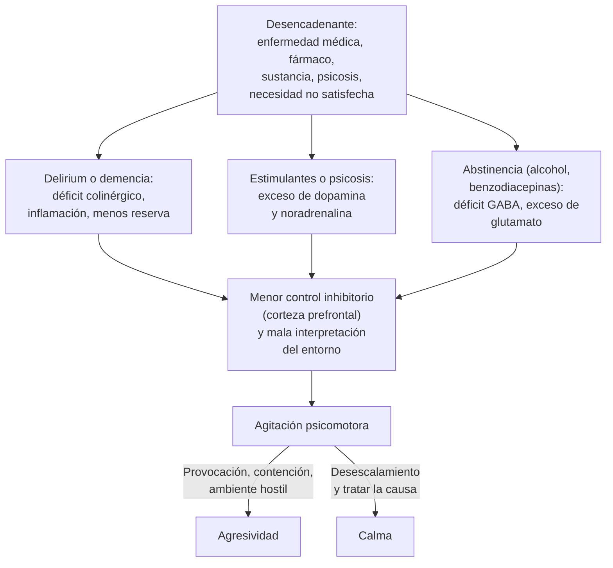

---
tags:
  - Geriatría
  - Urgencia
  - Frecuente en sala
---

# Agitación psicomotora y agresividad (con énfasis en el adulto mayor)

**Subespecialidad**
Geriatría · Medicina de urgencia · Psiquiatría de enlace

**Guías principales**
Project BETA de la American Association for Emergency Psychiatry (2012): desescalamiento verbal y psicofarmacología de la agitación · NICE NG10 (2015): violencia y agresión, manejo a corto plazo · APA 2016: antipsicóticos para la agitación o la psicosis en la demencia · Ley 21.331 (2021) de salud mental, artículo 21

**Otras fuentes**
Revisión de los síntomas conductuales de la demencia (Kales 2015) · Metaanálisis de mortalidad con antipsicóticos en la demencia (Schneider 2005) · Ensayo CitAD (2014) · Ensayo TREC (2003) · Plan Nacional de Demencia 2025–2035 (MINSAL)

**GES**
No (la demencia de base sí: GES 85, enfermedad de Alzheimer y otras demencias)

**EUNACOM**
1.07.2.004 Agitación y agresividad (sospecha, inicial, derivar)

**Revisado**
Septiembre 2026

!!! abstract "Resumen en 60 segundos"
    - La **agitación** es una **actividad motora o verbal excesiva** con tensión interna, que puede escalar a **agresividad**. Es un **síntoma**, no un diagnóstico: **busca la causa**.
    - En el **adulto mayor**, una agitación nueva es **delirium hasta demostrar lo contrario**: hipoxia, hipoglicemia, **dolor**, **retención urinaria**, **fecaloma**, infección, fármacos y abstinencia. En la **demencia**, piensa en **necesidades no satisfechas**.
    - **Primero la seguridad** (del equipo y del paciente). Luego **glicemia capilar**, **signos vitales** y SpO₂.
    - **Manejo escalonado**, de lo menos a lo más restrictivo:
        1. **Desescalamiento verbal** y ambiental.
        2. **Fármaco oral** ofrecido.
        3. **Fármaco IM**.
        4. **Contención física** como **último recurso**.
    - **Elegir el fármaco según la causa**:
        - **Delirium**: haloperidol o quetiapina en **dosis bajas**; **no** benzodiacepinas.
        - **Estimulantes** o **abstinencia alcohólica**: **benzodiacepinas**.
        - **Psicosis**: **antipsicóticos**.
    - Adulto mayor: **empezar bajo** (haloperidol **0,25–0,5 mg**) y evitar el haloperidol en el **Parkinson** y la **demencia por cuerpos de Lewy**.
    - **Demencia**: los antipsicóticos **aumentan la mortalidad** (**3,5 % vs 2,3 %**; Schneider 2005). Úsalos solo si hay **peligro**, revisa la respuesta a las **4 semanas** e intenta retirarlos antes de **4 meses** (APA 2016).
    - En Chile, la **Ley 21.331** exige que la contención tenga **indicación médica**, sea **proporcional**, por el **tiempo estrictamente necesario**, con **supervisión** y **registro**.

## Definición

| Término | Definición |
|---|---|
| **Agitación psicomotora** | Estado de **actividad motora y verbal excesiva**, sin propósito o poco productiva, con **tensión interna** o irritabilidad. Va desde la inquietud hasta la violencia |
| **Agresividad** | Conducta **verbal** (gritos, insultos, amenazas) o **física** (golpes, patadas, mordidas, lanzar objetos) dirigida a **dañar** a personas u objetos |
| **Síntomas psicológicos y conductuales de la demencia (SPCD)** | Agitación, agresividad, deambulación, gritos, apatía, depresión, psicosis y trastornos del sueño en una persona con demencia |
| **Tranquilización rápida** | Uso de fármacos **parenterales** para calmar a un paciente agitado cuando fallan las medidas no farmacológicas y hay riesgo. La meta es **calmar, no dormir** |
| **Contención** | Medidas que **restringen** la libertad de movimiento: **emocional y ambiental**, **farmacológica**, **física o mecánica** (sujeción) y observación continua en sala individual |

## Epidemiología

### Mundial

- La agitación es una **emergencia conductual** frecuente en los servicios de urgencia, en las salas de medicina (delirium) y en las residencias de adultos mayores.
- **Violencia contra el personal** de urgencia (citado en Wilson 2012):
    - **Más de la mitad** de las enfermeras de urgencia de Estados Unidos había sido **amenazada verbal o físicamente** en los **7 días previos** (2010).
    - Al menos el **25 %** del personal de urgencia se sentía seguro en el trabajo solo "a veces", "rara vez" o "nunca".
- **Demencia**: casi **todas** las personas con demencia presentan uno o más **SPCD** durante su enfermedad. Son lo más estresante y costoso del cuidado y precipitan la **institucionalización** (Kales 2015).
- **Antipsicóticos en la demencia** (metaanálisis de 15 ensayos, 5.110 pacientes; Schneider 2005):
    - Mortalidad de **3,5 %** con antipsicóticos atípicos vs **2,3 %** con placebo (OR **1,54**) en 10–12 semanas.
    - Esto motivó la **advertencia de la FDA** (2005) para toda la clase.

### Chile

!!! chile "Datos nacionales"
    - **Demencia** (Plan Nacional de Demencia 2025–2035, MINSAL):
        - Prevalencia de **7,0 %** en las personas de **≥ 60 años** (**7,7 %** en mujeres y **5,9 %** en hombres), mayor en zonas **rurales** (**10,3 %** vs 6,3 %).
        - Se estima que **~ 200.000 personas** viven con demencia en Chile.
        - Desde **2019**, la enfermedad de Alzheimer y otras demencias son el **problema GES 85**, con la **APS** como eje de la detección y el seguimiento.
        - El Plan limita los **antipsicóticos** a un uso **a corto plazo (6 semanas)**, en personas sin riesgo cardiovascular que no respondan a las medidas no farmacológicas, y con evaluación médica permanente.
    - **Delirium**: el **53 %** de los adultos mayores tenía delirium al ingresar a una sala de medicina, y el **38 %** tenía **contención física** (Carrasco 2005; ver [delirium](delirium.md)).
    - **Agresiones al personal de salud**:
        - El MINSAL registró **1.274 agresiones** en **2019** (~ **3 al día**).
        - La **Ley 21.188** ("Consultorio Seguro", diciembre de 2019) aumentó las penas y obliga a las jefaturas a **denunciar** las agresiones y a dar **defensa jurídica** a los funcionarios.
    - **Ley 21.331** (2021), de los derechos de las personas en la atención de salud mental: su **artículo 21** regula el manejo de las conductas agresivas y el uso de la **contención** (ver Tratamiento).

## Etiología

| Grupo | Causas |
|---|---|
| **Médica (delirium)** | **Hipoxemia**, **hipoglicemia**, **sepsis** (ITU, neumonía), **dolor**, **retención urinaria**, **fecaloma**, hiponatremia, hipercalcemia, **hipertiroidismo**, encefalopatías (ver [encefalopatías tóxico-metabólicas](../neurologia/encefalopatias-toxico-metabolicas.md)), **TEC** o **hematoma subdural**, ACV, encefalitis, crisis epilépticas y estado posictal |
| **Fármacos** | **Anticolinérgicos** (clorfenamina, difenhidramina, tricíclicos, oxibutinina), **corticoides**, **benzodiacepinas** (reacción paradójica en adultos mayores), opioides, levodopa y agonistas dopaminérgicos, quinolonas. **Acatisia** por antipsicóticos o metoclopramida (ver [trastornos del movimiento por fármacos](../neurologia/trastornos-del-movimiento-por-farmacos.md)) |
| **Sustancias** | **Intoxicación** por **cocaína**, **pasta base**, anfetaminas, alcohol, cannabinoides sintéticos. **Abstinencia** de **alcohol** (delirium tremens), benzodiacepinas o nicotina (ver [abstinencia alcohólica](../neurologia/abstinencia-alcoholica-y-wernicke.md)) |
| **Psiquiátrica** | **Psicosis** (esquizofrenia, psicosis inducida), **manía**, depresión agitada, crisis de **pánico**, trastornos de la personalidad, trastorno por estrés agudo |
| **Demencia (SPCD)** | **Necesidades no satisfechas** (dolor, hambre, sed, frío, ir al baño, sueño), **ambiente** (ruido, cambio de lugar, hospitalización), conducta del **cuidador**, síntomas **psicóticos** de la demencia, **enfermedad intercurrente** |

**Factores de riesgo de violencia**: **violencia previa** (el mejor predictor), hombre joven, **intoxicación**, **psicosis** con alucinaciones de comando o ideas paranoides, acceso a armas, antecedentes de conducta impulsiva y **esperas prolongadas** o trato percibido como injusto.

**Señales de escalada**: voz alta, **deambular**, puños apretados, mirada fija, amenazas, golpear objetos.

## Fisiopatología

*Figura 1. Mecanismos de la agitación y factores que la escalan o la calman. Esquema propio.*

- La agitación resulta de un desequilibrio entre los **impulsos** (hiperactividad dopaminérgica y noradrenérgica, amenaza percibida) y el **control inhibitorio** de la corteza prefrontal.
- En el **delirium** y la **demencia** predominan el **déficit colinérgico**, la **inflamación** y la menor **reserva cerebral**. Por eso los **anticolinérgicos** y las **benzodiacepinas** los empeoran.
- En la **intoxicación por estimulantes**, el exceso de **catecolaminas** produce agitación con **taquicardia, HTA, midriasis e hipertermia**.
- En la **abstinencia** de alcohol o benzodiacepinas falta el tono **GABAérgico**, que las **benzodiacepinas** reponen.
- En la **demencia**, el paciente no puede comunicar lo que le pasa: el **dolor**, la sed o el miedo se expresan como agitación.
- Las intervenciones **coercitivas** (gritar, amenazar, sujetar sin explicación) **escalan** la agitación. El **desescalamiento** la reduce.

## Clasificación

**Por la causa** (ver Etiología): médica (delirium), por fármacos o sustancias, psiquiátrica y por demencia. Con frecuencia es **mixta**.

**Por la gravedad**:

| Escala | Puntuación |
|---|---|
| **RASS** (Richmond Agitation-Sedation Scale) | **+1** inquieto · **+2** agitado (movimientos sin propósito, lucha con el ventilador) · **+3** muy agitado (se retira sondas, agresivo) · **+4** combativo (violento, peligro inmediato). **0** = alerta y calmado; valores negativos = sedación |
| **BARS** (Behavioural Activity Rating Scale; Swift 2002) | **1** no despierta · **2** dormido, responde · **3** somnoliento · **4** **tranquilo y despierto** (meta) · **5** actividad evidente, se calma con indicaciones · **6** actividad extrema o continua, sin necesitar contención · **7** **violento**, requiere contención |

**Por el tipo de conducta**: agitación **verbal** o **motora**; agresividad **verbal**, **contra objetos** o **física** contra personas.

## Clínica

- **Inquietud motora**: no puede quedarse quieto, deambula, se levanta de la cama, se retira las vías, sondas y oxígeno.
- **Verbal**: habla fuerte y rápido, grita, insulta, amenaza, repite preguntas.
- **Autonómica**: taquicardia, HTA, sudoración, midriasis (estimulantes, abstinencia, anticolinérgicos).
- **Claves de una causa médica** (delirium y no psiquiátrica):
    - **Edad > 40–45 años** sin antecedentes psiquiátricos, inicio **agudo**.
    - **Signos vitales alterados**: fiebre, taquicardia, hipoxemia, hipotensión.
    - Conciencia **fluctuante**, **desorientación**, **inatención**.
    - **Alucinaciones visuales** (las psicosis primarias suelen dar alucinaciones auditivas).
    - **Focalidad neurológica**, trauma, temblor, asterixis, mioclonías.
- **Adulto mayor hospitalizado**: agitación **nocturna** (vespertina), el típico "paciente que se quiere ir", que se sube a las barandas o que agrede al personal.
- **Demencia**: resistencia al baño o a la muda, gritos repetitivos, deambulación, agresividad **con el cuidador** en las tareas de cuidado personal.

<figure markdown>
![Escalera de cinco peldaños, de izquierda a derecha y de menor a mayor restricción. Primer peldaño, en verde: evaluar y proteger, con seguridad de todos, búsqueda de la causa orgánica y graduación con RASS o BARS. Segundo: desescalar, con un solo interlocutor de voz calma, escuchar y ofrecer opciones, y ambiente tranquilo. Tercero, en amarillo: fármaco oral, en que el paciente participa y la meta es calmar, no dormir, según la causa. Cuarto, en naranjo: fármaco intramuscular o tranquilización rápida, con dosis bajas en adultos mayores y control de signos vitales y ECG. Quinto, en rojo: contención física como último recurso, con indicación médica, tiempo mínimo, vigilancia y registro. Abajo, un recuadro: en todos los pasos buscar y tratar la causa; en el adulto mayor la agitación es delirium hasta demostrar lo contrario; evitar benzodiacepinas en el delirium, haloperidol en el Parkinson y la demencia por cuerpos de Lewy, la posición prona y dejar al paciente contenido sin vigilancia](../assets/figuras/agitacion/escalera-manejo-agitacion.svg){ loading=lazy }
<figcaption>Figura 2. Manejo escalonado de la agitación. Esquema propio basado en Project BETA (Richmond 2012; Wilson 2012), NICE NG10 (2015) y la Ley 21.331.</figcaption>
</figure>

## Diagnóstico

El diagnóstico es **clínico**. Tiene dos tareas: **evaluar el riesgo** (seguridad) y **encontrar la causa**.

!!! alarma "Primeros minutos ante un paciente agitado"
    1. **Seguridad**:
        - Pedir ayuda y no quedarse solo con el paciente.
        - Mantener la **puerta libre** y una **distancia de 2 brazos**.
        - Retirar los objetos peligrosos. El equipo debe ser suficiente y estar entrenado.
    2. **Signos vitales**, **SpO₂**, temperatura y **glicemia capilar** apenas sea posible.
    3. Buscar **causas que matan**: hipoxemia, hipoglicemia, **sepsis**, **TEC** o hemorragia intracraneana, intoxicación, abstinencia grave, meningitis o encefalitis.
    4. Si hay **hipertermia**, **rigidez** o **clonus**: pensar en un síndrome **neuroléptico maligno**, **serotoninérgico** o **anticolinérgico**, o en una intoxicación por **estimulantes**.
    5. Evitar la **contención prolongada** en un paciente con hipertermia y acidosis (riesgo de **paro cardiorrespiratorio**).

- **Anamnesis** (al paciente cuando se calme, y a la **familia**, al cuidador, a Carabineros o a SAMU):
    - Estado **basal** (¿demencia previa?) e **inicio** del cuadro.
    - **Fármacos** nuevos o suspendidos, **alcohol** y drogas.
    - Antecedentes **psiquiátricos**, episodios previos de agresividad, trauma, dolor.
- **Examen físico** dirigido:
    - Signos de **trauma** (cabeza), **pupilas**, focalidad, signos meníngeos.
    - **Globo vesical**, **tacto rectal** (fecaloma), foco infeccioso.
    - Signos de intoxicación o abstinencia (temblor, sudoración).
- **Tamizaje de delirium** cuando sea posible (**4AT** o **CAM**; ver [delirium](delirium.md)).
- **Riesgo suicida**: evaluarlo en toda agitación con ideación suicida o intento reciente.

## Laboratorio

| Examen | Utilidad |
|---|---|
| **Glicemia capilar** | **Primer examen**: la hipoglicemia se presenta como agitación |
| **Electrolitos** (Na, Ca), creatinina, nitrógeno ureico | Hiponatremia, hipercalcemia, uremia |
| Hemograma, **PCR**, **orina completa y urocultivo** | Infección (la ITU es un desencadenante frecuente en el adulto mayor) |
| **Gases arteriales** o SpO₂ | Hipoxemia, hipercapnia, acidosis |
| **Alcoholemia** y **tóxicos en orina** (cocaína, anfetaminas, benzodiacepinas, cannabis) | Intoxicación; interpretar con la clínica |
| **CK** | **Rabdomiólisis** (agitación prolongada, contención, estimulantes, SNM) |
| **ECG** | **QTc** antes de usar antipsicóticos (evitar el haloperidol si es **> 500 ms**); taquiarritmias; tricíclicos |
| TSH | Hipertiroidismo |
| Pruebas hepáticas, amonio | Encefalopatía hepática |
| **Test de embarazo** | Mujeres en edad fértil (elección de fármacos) |
| Niveles de fármacos | Litio, anticonvulsivantes, digoxina |

## Imágenes

- **TC de cerebro sin contraste** si hay:
    - **Trauma** o caída reciente, **anticoagulación**.
    - **Focalidad**, cefalea súbita, convulsión.
    - **Primer episodio** en un adulto mayor sin causa clara.
- **Radiografía de tórax** si se sospecha una neumonía (foco frecuente en el adulto mayor).
- **Punción lumbar** (tras la TC) si hay fiebre con compromiso de conciencia o signos meníngeos.

## Diagnóstico diferencial

| Cuadro | Claves |
|---|---|
| **Delirium hiperactivo** | Inicio agudo, **fluctuación**, **inatención**, desorientación, alucinaciones visuales, causa médica (ver [delirium](delirium.md)) |
| **Demencia con SPCD** | Deterioro cognitivo **previo** de meses o años, agitación ligada al cuidado o al ambiente; **puede coexistir con delirium** |
| **Psicosis primaria** (esquizofrenia) o **manía** | Adulto joven, antecedentes psiquiátricos, alucinaciones **auditivas**, orientación conservada |
| **Intoxicación por estimulantes** | **Taquicardia**, HTA, **midriasis**, **hipertermia**, diaforesis; tóxicos en orina |
| **Abstinencia alcohólica** | 6–48 h tras el último consumo: temblor, sudoración, taquicardia; **delirium tremens** a las 48–72 h |
| **Síndrome anticolinérgico** | Piel **seca** y roja, midriasis, **retención urinaria**, íleo, hipertermia |
| **Acatisia** | Inquietud interna tras iniciar o subir un **antipsicótico** o metoclopramida; **empeora** con más antipsicótico |
| **Crisis de pánico** | Miedo intenso, disnea, parestesias, orientado, sin causa médica |
| **Hipoglicemia**, **hipoxemia**, **estado posictal**, **TEC** | Glicemia, SpO₂, antecedente de crisis, trauma |

## Tratamiento

### Principios

1. **Seguridad** del paciente, del equipo y de otros pacientes.
2. **Tratar la causa**: es el tratamiento definitivo (oxígeno, glucosa, analgesia, **sonda vesical**, tratar el fecaloma, suspender fármacos, tiamina, antibióticos).
3. **Lo menos restrictivo posible**, de forma escalonada (Figura 2).
4. **Calmar, no dormir**: la sedación excesiva impide evaluar y produce complicaciones.
5. **Registrar** en la ficha la conducta, las medidas, los fármacos, la contención y los controles.

### Desescalamiento verbal (Project BETA)

!!! guia "Los 10 dominios del desescalamiento verbal (Richmond 2012)"
    | Dominio | En la práctica |
    |---|---|
    | 1. **Respetar el espacio personal** | Distancia de **2 brazos**, salida accesible para ambos |
    | 2. **No provocar** | Manos visibles, postura relajada, sin mirada fija ni confrontación |
    | 3. **Establecer contacto verbal** | **Un solo interlocutor**; presentarse, orientar y tranquilizar |
    | 4. **Ser conciso** | Frases **cortas y simples**; **repetir** el mensaje |
    | 5. **Identificar deseos y sentimientos** | "¿Qué necesita?"; buscar lo que el paciente quiere (irse, comer, fumar, ver a un familiar) |
    | 6. **Escuchar con atención** | Escucha activa; reflejar lo que dice |
    | 7. **Estar de acuerdo o acordar discrepar** | Coincidir en lo que se pueda ("entiendo que lleva horas esperando") |
    | 8. **Poner la ley y límites claros** | Explicar con respeto que la **violencia no se acepta** y sus consecuencias |
    | 9. **Ofrecer opciones y optimismo** | Ofrecer alternativas reales (incluida la **medicación oral**); dar esperanza |
    | 10. **Conversar después** con el paciente y el equipo | Explicar lo ocurrido y por qué se intervino; revisar qué se puede mejorar |

- **Medidas ambientales**: sala tranquila y con poca luz, sin estímulos; acompañamiento de un **familiar**; retirar los objetos peligrosos; ofrecer agua, comida o una manta.
- **Adulto mayor**: reorientar, **anteojos y audífonos**, evitar los cambios de sala, luz de día y oscuridad de noche, movilización, retirar sondas y vías innecesarias, **no** usar barandas como contención.

### Tratamiento farmacológico según la causa

!!! dosis "Adulto joven o de edad media (Project BETA 2012; NICE NG10)"
    | Situación | Primera elección | Comentarios |
    |---|---|---|
    | **Paciente que coopera** | **Vía oral**: **risperidona 1–2 mg**, **olanzapina 5–10 mg** (bucodispersable) o **lorazepam 1–2 mg** según la causa | La vía oral siempre se **ofrece primero** |
    | **Psicosis** (esquizofrenia, manía) | **Antipsicótico**: oral, o **olanzapina 10 mg IM**, o **haloperidol 5 mg IM** (con prometazina 25–50 mg IM) | Si no basta, **agregar lorazepam** mejor que repetir el antipsicótico. **No** combinar olanzapina IM con benzodiacepinas parenterales en la misma hora (hipotensión, depresión respiratoria) |
    | **Intoxicación por estimulantes** (cocaína, pasta base, anfetaminas) | **Benzodiacepina**: **lorazepam 1–2 mg IM o EV** o **midazolam 5 mg IM** (hasta 10 mg), repetir según respuesta | Tratan también la taquicardia, la HTA y la hipertermia. Agregar un antipsicótico si hay psicosis |
    | **Intoxicación alcohólica** | **Haloperidol 2,5–5 mg IM** si es imprescindible | **Evitar las benzodiacepinas** (suman depresión respiratoria) |
    | **Abstinencia alcohólica o de benzodiacepinas** | **Benzodiacepinas** + **tiamina** | Ver [abstinencia alcohólica](../neurologia/abstinencia-alcoholica-y-wernicke.md) |
    | **Delirium** (no por abstinencia) | Tratar la causa; **haloperidol** en dosis bajas o un **antipsicótico atípico** | **Evitar las benzodiacepinas** (empeoran el delirium) |
    | **Causa desconocida sin psicosis** | **Benzodiacepina** | Con psicosis: antipsicótico |
    | **Tranquilización rápida** (NICE NG10) | **Lorazepam IM** solo, o **haloperidol IM + prometazina IM** | Sin ECG o con cardiopatía: preferir el **lorazepam**. En el ensayo **TREC** (Río de Janeiro), el **midazolam IM** calmó más rápido que haloperidol + prometazina (**89 % vs 67 %** a los 20 minutos) |

    - Repetir a los **30–60 minutos** si no hay respuesta, reevaluando la causa.
    - **Haloperidol**: el riesgo de **QT largo** y *torsades de pointes* aumenta con las dosis altas y la vía **EV** (usar monitor ECG); dar con una benzodiacepina o prometazina para reducir la **distonía aguda** (ver [trastornos del movimiento por fármacos](../neurologia/trastornos-del-movimiento-por-farmacos.md)).
    - **Monitoreo tras la tranquilización rápida** (NICE): pulso, PA, frecuencia respiratoria, temperatura, hidratación y conciencia **al menos cada 1 hora**. **Cada 15 minutos** si el paciente está dormido o sedado, consumió alcohol o drogas, tiene una enfermedad física o se superó la dosis máxima.

!!! dosis "Adulto mayor: empezar bajo, ir lento"
    - **Agitación por delirium**: **haloperidol 0,25–0,5 mg** VO o IM; repetir cada **30–60 minutos** si es necesario, en general **≤ 2–3 mg/día**. Alternativas: **quetiapina 12,5–25 mg** VO o **risperidona 0,25–0,5 mg** VO. Suspender apenas se controle.
    - **Parkinson o demencia por cuerpos de Lewy**: **evitar el haloperidol y la risperidona** (rigidez grave, síndrome neuroléptico maligno). Usar **quetiapina en dosis bajas**.
    - **Benzodiacepinas**: **solo** en la abstinencia de alcohol o benzodiacepinas, o en las convulsiones (**lorazepam 0,25–0,5 mg**). Fuera de eso causan **delirium paradójico**, caídas y depresión respiratoria.
    - Evitar los **anticolinérgicos** para sedar (clorfenamina, difenhidramina, hidroxicina, prometazina).
    - Controlar el **ECG** (QTc), la PA ortostática y el riesgo de **caídas** y de **aspiración**.

### Síntomas conductuales de la demencia (SPCD)

- **Primero lo no farmacológico** (Kales 2015). Enfoque **DICE**:
    - **Describir** la conducta: qué, cuándo, dónde, con quién.
    - **Investigar** las causas: **dolor**, infección, constipación, retención, fármacos, sueño, ambiente, conducta del cuidador.
    - **Crear** un plan: tratar las causas, rutinas, actividades, **educar y apoyar al cuidador**.
    - **Evaluar** si funcionó.
- **Analgesia de prueba** (paracetamol regular) si se sospecha **dolor** que el paciente no puede expresar.

!!! guia "Antipsicóticos en la demencia (APA 2016)"
    - Usarlos solo si la agitación o la psicosis son **graves**, **peligrosas** o causan **gran sufrimiento**, tras evaluar la causa y fallar las medidas no farmacológicas.
    - Conversar con el paciente (si es posible) y la familia los **riesgos**: mortalidad, **ACV**, neumonía, caídas, parkinsonismo, deterioro cognitivo.
    - Empezar con **dosis bajas** y ajustar según la respuesta. Si **no hay respuesta** clara tras **4 semanas** con una dosis adecuada, **retirarlo**.
    - Si hay respuesta, intentar **reducir y retirar** el fármaco **dentro de los 4 meses**. Durante y después de la retirada, evaluar los síntomas al menos una vez al mes.
    - **No** usar el **haloperidol** como primera línea fuera del delirium. **No** usar antipsicóticos de **depósito** (salvo psicosis crónica previa).

- Otras opciones con psiquiatría o geriatría:
    - **Citalopram**: en el ensayo **CitAD** (2014), **30 mg/día** redujo la agitación en la enfermedad de Alzheimer. Pero **prolongó el QT** (**18 ms**) y **empeoró** levemente la cognición.
    - **Brexpiprazol**: aprobado por la FDA en **2023** para la agitación de la demencia por Alzheimer.
    - En la **demencia por cuerpos de Lewy** o el **Parkinson** con psicosis: **quetiapina** en dosis bajas (o clozapina, con especialista).

### Contención física: último recurso

!!! alarma "Contención física y mecánica"
    - **Indicación**: riesgo **real e inminente** para la integridad o la vida del paciente o de terceros, cuando **fallaron** las alternativas menos restrictivas.
    - **Ley 21.331, artículo 21**:
        - Indicación **terapéutica acreditada por un médico**.
        - Solo si **no existe otra alternativa menos restrictiva** y es **proporcional** a la conducta.
        - Por el **tiempo estrictamente necesario**, con **supervisión médica permanente** y todos los medios para minimizar el daño físico y psíquico.
        - **Registro** en la ficha clínica e **información** a la autoridad sanitaria, a la Comisión Regional de Protección de los Derechos de las Personas con Enfermedades Mentales y a un familiar o representante.
    - **Técnica**:
        - Equipo entrenado de **4–5 personas** (una por extremidad y una para la cabeza), con un líder que habla con el paciente.
        - Decúbito **supino** con la cabecera algo elevada. **Evitar la posición prona** (asfixia posicional) y la presión sobre el tórax o el cuello.
    - **Vigilancia**:
        - Signos vitales, **respiración**, circulación y piel de las extremidades, hidratación, eliminación y dolor.
        - **Reevaluar con frecuencia** si todavía es necesaria y **retirarla** apenas sea posible.
        - **Nunca** dejar al paciente contenido **sin observación**.
    - **Riesgos**: **muerte súbita** (asfixia, arritmia en la agitación con hipertermia y acidosis), **rabdomiólisis**, TVP, lesiones de nervios y piel, **aspiración**, **más delirium** y más caídas en el adulto mayor.
    - En el **adulto mayor** con delirium, la contención **empeora** el cuadro: preferir la **compañía** de un familiar o de un cuidador.

**Derivación** (el temario pide **derivar**):

- **Psiquiatría**: psicosis, manía, **riesgo suicida**, necesidad de hospitalización **involuntaria** (regida por la Ley 21.331).
- **Geriatría o neurología**: SPCD refractarios o demencia sin diagnóstico (GES 85).
- **UCI**: agitación grave con hipertermia, rabdomiólisis o sedación profunda.
- **Toxicología (CITUC)**: intoxicaciones.

## Complicaciones

- **Del paciente**: trauma, **caídas** y fracturas, retiro de vías, sondas y tubos, **rabdomiólisis**, **hipertermia**, acidosis, deshidratación, fuga.
- **De la contención**: asfixia posicional, **muerte súbita**, TVP, lesiones por presión, **aspiración**, trauma psicológico.
- **De los fármacos**:
    - Sobresedación, **depresión respiratoria** (benzodiacepinas, sobre todo con alcohol u opioides), **hipotensión**.
    - **QT largo** y *torsades de pointes*.
    - **Distonía aguda**, acatisia, **síndrome neuroléptico maligno**.
    - En la demencia: **mortalidad**, **ACV** y neumonía con antipsicóticos.
- **Del equipo**: lesiones, estrés, ausentismo.

## Pronóstico y seguimiento

- Depende de la **causa**: el delirium mejora al tratar la causa, pero en el adulto mayor puede durar días a semanas y dejar **deterioro cognitivo y funcional**.
- En la **demencia**, los SPCD **recurren**. El seguimiento en APS (GES 85) debe incluir el apoyo al **cuidador** y la revisión periódica de los **antipsicóticos** (retirarlos si es posible).
- Tras un episodio de agitación:
    - **Conversar** con el paciente y el equipo (dominio 10 del desescalamiento).
    - Revisar los **desencadenantes** y dejar un plan escrito de **prevención**, que puede incluir las preferencias del paciente para futuras crisis.
- Registrar las **agresiones al personal** según la Ley 21.188.

## Perlas para el internado

!!! perla "Para la sala y el turno"
    - Te llaman porque "el abuelito está agitado": antes de indicar un fármaco, **ve a verlo**. Mide **glicemia** y **SpO₂**, busca un **globo vesical** y **dolor**, y revisa las **indicaciones**.
    - **No** indiques **lorazepam ni clonazepam** al adulto mayor con delirium "para que duerma": lo empeoras. La excepción es la **abstinencia alcohólica**.
    - **Haloperidol 0,5 mg**, no 5 mg, en el adulto mayor. En el **Parkinson**, **quetiapina**.
    - **Un solo interlocutor** y frases cortas. Ofrece la **vía oral** antes que la inyección.
    - Paciente joven agitado con **taquicardia, midriasis y fiebre**: piensa en la **cocaína** y usa **benzodiacepinas**; controla la temperatura y la CK.
    - Paciente que "no puede quedarse quieto" tras recibir **haloperidol**: es **acatisia**, no más agitación.
    - Si contienes: **indicación médica escrita**, **nunca en prono**, controles frecuentes y **registro** (Ley 21.331).
    - Pide ayuda antes de que escale: la **seguridad** del equipo también es parte del tratamiento.

## Preguntas de repaso

??? repaso "1. Mujer de 84 años en su segundo día de posoperatorio de una fractura de cadera. De noche está agitada, se quiere levantar, se retiró la vía venosa y grita que la tienen secuestrada. Recibe tramadol y en la tarde se le indicó clonazepam para dormir. ¿Qué haces?"
    **Delirium hiperactivo posoperatorio**, precipitado por el dolor, los fármacos (tramadol, **clonazepam**) y posibles otras causas.

    - **Buscar la causa**: glicemia capilar, SpO₂, signos vitales, **globo vesical** (retención), fecaloma, **dolor** mal controlado, anemia, infección (orina, herida, pulmón), electrolitos.
    - **Suspender el clonazepam** (empeora el delirium) y revisar el tramadol; usar analgesia regular (paracetamol, bloqueo regional).
    - **Medidas no farmacológicas**: reorientar, **familiar** acompañante, anteojos y audífonos, luz y ruido adecuados, evitar la contención.
    - Si hay **peligro** (se retira la vía, riesgo de caída): **haloperidol 0,25–0,5 mg** VO o IM, repetible; controlar el QTc.
    - La contención física solo como último recurso, con indicación, vigilancia y registro.

??? repaso "2. Hombre de 24 años traído por SAMU desde una fiesta. Está muy agitado, agresivo, con FC 138 lpm, PA 170/100 mmHg, temperatura de 38,6 °C, midriasis y sudoración. Refiere consumo de cocaína. ¿Cuál es el manejo?"
    **Intoxicación por cocaína** con **síndrome simpaticomimético**.

    - Seguridad, desescalamiento si es posible, y **benzodiacepinas**: **lorazepam 1–2 mg IM o EV** o **midazolam 5 mg IM**, repetibles según la respuesta. Tratan también la agitación, la taquicardia, la HTA y la hipertermia.
    - **Enfriamiento** activo, hidratación EV, monitor cardíaco.
    - **ECG** (isquemia, arritmias), troponina si hay dolor torácico, **CK** (rabdomiólisis), creatinina, electrolitos, glicemia.
    - **Evitar** la contención prolongada (hipertermia y acidosis: riesgo de muerte súbita) y los **betabloqueadores** solos.
    - Si hay focalidad o cefalea intensa: **TC de cerebro** (hemorragia).

??? repaso "3. Hombre de 32 años con esquizofrenia que suspendió su tratamiento hace un mes. Llega agitado, amenazante, con alucinaciones auditivas y sin signos de enfermedad médica. Acepta hablar. ¿Cómo lo manejas?"
    **Agitación por psicosis primaria**.

    - **Desescalamiento verbal**: un solo interlocutor, frases cortas, escuchar, ofrecer opciones.
    - **Ofrecer fármaco oral**: **risperidona 2 mg** u **olanzapina 10 mg** bucodispersable.
    - Si rechaza y el riesgo es inminente: **olanzapina 10 mg IM**, o **haloperidol 5 mg IM + prometazina 25–50 mg IM** (NICE), o lorazepam IM.
    - Si no basta, **agregar una benzodiacepina** mejor que repetir el antipsicótico (sin combinar olanzapina IM con benzodiacepinas parenterales en la misma hora).
    - Monitoreo de signos vitales. Evaluación por **psiquiatría** (hospitalización según la Ley 21.331).

??? repaso "4. Hombre de 79 años con enfermedad de Alzheimer moderada, que vive con su hija. Desde hace 2 semanas se pone agresivo cuando lo bañan y grita en la noche. Examen: dolor a la palpación hipogástrica, sin deposiciones hace 5 días. ¿Qué haces?"
    **SPCD con un desencadenante médico**: probable **fecaloma** y quizás **retención urinaria**, que se expresan como agitación.

    - Enfoque **DICE**: describir la conducta, **investigar causas** (fecaloma, globo vesical, ITU, dolor, fármacos), crear un plan y evaluar.
    - Tratar el **fecaloma** y la constipación; evaluar la retención urinaria y la orina.
    - Medidas no farmacológicas: rutina de baño adaptada, **educar y apoyar a la cuidadora**.
    - **Antipsicótico solo si hay peligro** y fallan las medidas: **risperidona 0,25–0,5 mg**; explicar los riesgos (mortalidad **3,5 % vs 2,3 %**), evaluar la respuesta a las **4 semanas** y retirarlo antes de **4 meses** (APA 2016).
    - Seguimiento en APS (GES 85).

??? repaso "5. Hombre de 74 años con enfermedad de Parkinson, hospitalizado por una neumonía. Está agitado y ve personas en la pieza. Le indicaron haloperidol 5 mg IM y ahora está muy rígido, sin poder moverse, con fiebre de 38,9 °C. ¿Qué pasó y qué debiste hacer?"
    **Empeoramiento grave del parkinsonismo** por el **haloperidol**, con riesgo de **síndrome neuroléptico maligno** (rigidez y fiebre; pedir **CK**).

    - **Suspender** el haloperidol; no suspender la **levodopa**. Hidratación, control de la temperatura y la CK; UCI si es grave (ver [trastornos del movimiento por fármacos](../neurologia/trastornos-del-movimiento-por-farmacos.md)).
    - Lo correcto era tratar la **causa del delirium** (neumonía, hipoxemia, fármacos) y, si hacía falta un antipsicótico, **quetiapina 12,5–25 mg**.
    - En el **Parkinson** y la **demencia por cuerpos de Lewy** se evitan el haloperidol y la risperidona.
    - La dosis de 5 mg, además, es excesiva para un adulto mayor.

??? repaso "6. En un turno de urgencia, un paciente agitado fue contenido en decúbito prono por 4 funcionarios, recibió haloperidol y lorazepam IM y quedó amarrado en una camilla del pasillo sin controles por 3 horas. ¿Qué errores identificas?"
    - **Posición prona**: riesgo de **asfixia posicional** y muerte súbita. Debe ser **supino** con la cabecera elevada.
    - **Sin vigilancia**: tras la tranquilización rápida y con el paciente sedado, hay que controlar los signos vitales y la conciencia **cada 15 minutos** (NICE). La Ley 21.331 exige **supervisión médica permanente**.
    - **Tiempo excesivo**: la contención debe durar el **tiempo estrictamente necesario** y reevaluarse con frecuencia.
    - **Registro**: indicación médica, motivo, hora de inicio y término, controles, e **información** a la familia y a las autoridades que establece la ley.
    - Falta de **evaluación de la causa** (glicemia, SpO₂, trauma, intoxicación) y de un lugar adecuado (no un pasillo).

## Referencias

1. Richmond JS, Berlin JS, Fishkind AB, et al. Verbal de-escalation of the agitated patient: consensus statement of the American Association for Emergency Psychiatry Project BETA De-escalation Workgroup. *West J Emerg Med.* 2012;13:17–25. doi:[10.5811/westjem.2011.9.6864](https://doi.org/10.5811/westjem.2011.9.6864)
2. Wilson MP, Pepper D, Currier GW, Holloman GH Jr, Feifel D. The psychopharmacology of agitation: consensus statement of the American Association for Emergency Psychiatry Project BETA Psychopharmacology Workgroup. *West J Emerg Med.* 2012;13:26–34. doi:[10.5811/westjem.2011.9.6866](https://doi.org/10.5811/westjem.2011.9.6866)
3. National Institute for Health and Care Excellence. Violence and aggression: short-term management in mental health, health and community settings (NG10). 2015. [nice.org.uk/guidance/ng10](https://www.nice.org.uk/guidance/ng10)
4. Reus VI, Fochtmann LJ, Eyler AE, et al. The American Psychiatric Association practice guideline on the use of antipsychotics to treat agitation or psychosis in patients with dementia. *Am J Psychiatry.* 2016;173:543–546. doi:[10.1176/appi.ajp.2015.173501](https://doi.org/10.1176/appi.ajp.2015.173501)
5. Kales HC, Gitlin LN, Lyketsos CG. Assessment and management of behavioral and psychological symptoms of dementia. *BMJ.* 2015;350:h369. doi:[10.1136/bmj.h369](https://doi.org/10.1136/bmj.h369)
6. Schneider LS, Dagerman KS, Insel P. Risk of death with atypical antipsychotic drug treatment for dementia: meta-analysis of randomized placebo-controlled trials. *JAMA.* 2005;294:1934–1943. doi:[10.1001/jama.294.15.1934](https://doi.org/10.1001/jama.294.15.1934)
7. Porsteinsson AP, Drye LT, Pollock BG, et al. Effect of citalopram on agitation in Alzheimer disease: the CitAD randomized clinical trial. *JAMA.* 2014;311:682–691. doi:[10.1001/jama.2014.93](https://doi.org/10.1001/jama.2014.93)
8. TREC Collaborative Group. Rapid tranquillisation for agitated patients in emergency psychiatric rooms: a randomised trial of midazolam versus haloperidol plus promethazine. *BMJ.* 2003;327:708–713. doi:[10.1136/bmj.327.7417.708](https://doi.org/10.1136/bmj.327.7417.708)
9. Huf G, Alexander J, Gandhi P, Allen MH. Haloperidol plus promethazine for psychosis-induced aggression. *Cochrane Database Syst Rev.* 2016;11:CD005146. doi:[10.1002/14651858.CD005146.pub3](https://doi.org/10.1002/14651858.CD005146.pub3)
10. Swift RH, Harrigan EP, Cappelleri JC, Kramer D, Chandler LP. Validation of the behavioural activity rating scale (BARS): a novel measure of activity in agitated patients. *J Psychiatr Res.* 2002;36:87–95. doi:[10.1016/s0022-3956(01)00052-8](https://doi.org/10.1016/s0022-3956(01)00052-8)
11. Ley 21.331 del reconocimiento y protección de los derechos de las personas en la atención de salud mental. Diario Oficial de la República de Chile, 11 de mayo de 2021. [bcn.cl/leychile](https://www.bcn.cl/leychile/navegar?idNorma=1159383)
12. Ministerio de Salud de Chile. Ministerio de Salud anunció que hoy entró en vigencia "Ley Consultorio Seguro" (Ley 21.188). 13 de diciembre de 2019. [minsal.cl](https://www.minsal.cl/ministerio-de-salud-anuncio-que-hoy-entro-en-vigencia-ley-consultorio-seguro/)
13. Ministerio de Salud de Chile. Plan Nacional de Demencia 2025–2035. 2026. [diprece.minsal.cl](https://diprece.minsal.cl/wp-content/uploads/2026/03/2026.03.04_PLAN-NACIONAL-DE-DEMENCIA-2025-2035.pdf)
