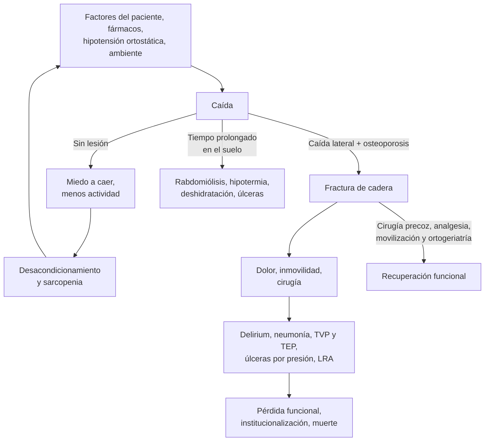

---
tags:
  - Geriatría
  - Urgencia
  - Frecuente en sala
---

# Caídas, hipotensión ortostática y fractura de cadera en el adulto mayor

**Subespecialidad**
Geriatría · Traumatología · Medicina interna

**Guías principales**
World Falls Guidelines (Montero-Odasso 2022) · NICE CG124 (2011, actualizada en 2023): fractura de cadera · AAOS 2021: fracturas de cadera en el adulto mayor · Consenso de definición de la hipotensión ortostática (Freeman 2011) · ESC 2018: síncope

**Otras fuentes**
Ensayos HIP ATTACK (2020), FOCUS (2011) y HORIZON (2007) · Revisión Cochrane de bloqueos nerviosos (Guay 2020) · Estudios chilenos: ENS 2009–2010 (Leiva 2019), fracturas de cadera 2012–2017 (Barahona 2026) y 2018–2022 (Jiménez 2026)

**GES**
No para la fractura aguda. **GES 36**: ayudas técnicas (bastón, andador, silla de ruedas, cojín y colchón antiescaras) para personas de 65 años y más

**EUNACOM**
1.07.1.001 Caídas (específico, completo, derivar) · 1.07.1.010 Hipotensión postural (específico, completo, completo) · 1.07.2.003 Fractura de cadera (sospecha, inicial, derivar)

**Revisado**
Septiembre 2026

!!! abstract "Resumen en 60 segundos"
    - **~ 30 %** de los mayores de 65 años se cae cada año; en Chile, el **37 %** de los mayores de 60 (ENS 2009–2010). Una caída es un **síntoma**: busca la causa (fármacos, hipotensión ortostática, síncope, infección, alteración de la marcha).
    - **Pregunta a todo adulto mayor** si se cayó en el último año. Si la caída fue **grave** (lesión, ≥ 2 caídas, fragilidad, no pudo levantarse, síncope): **evaluación multifactorial**. Si camina lento (≤ 0,8 m/s o Timed Up and Go > 15 s): **ejercicio** de equilibrio y fuerza.
    - Lo que más reduce las caídas:
        - **Ejercicio** de equilibrio y funcional, **≥ 3 veces por semana** por **≥ 12 semanas**.
        - **Retirar fármacos de riesgo**: benzodiacepinas, hipnóticos, antipsicóticos, alfabloqueadores.
        - Tratar la **hipotensión ortostática**, operar las **cataratas** y adaptar el **hogar**.
    - **Hipotensión ortostática**: caída de la PAS **≥ 20** o de la PAD **≥ 10 mmHg** dentro de los **3 minutos** de pararse. Revisa los fármacos, la volemia y el Parkinson o la diabetes (disautonomía).
    - **Fractura de cadera**: adulto mayor que se cae y **no puede caminar**, con la pierna **acortada y en rotación externa**. **Radiografía** de pelvis y cadera; **RM** si es normal y la sospecha persiste.
    - Manejo inicial:
        - **Analgesia**: paracetamol, opioide titulado y **bloqueo de la fascia ilíaca**, que también reduce el **delirium**.
        - Tromboprofilaxis y prevención del delirium.
        - **Cirugía en ≤ 36–48 h**: artroplastia o fijación según el tipo de fractura.
    - En Chile, la **mortalidad al año** es de **~ 25 %**, y **> 20 %** de los pacientes **no se opera** (sobre todo en el sistema público).
    - Al alta, **prevención secundaria**: programa de caídas y **tratamiento de la osteoporosis** (el ácido zoledrónico redujo las nuevas fracturas y la mortalidad; HORIZON 2007).

## Definición

| Término | Definición |
|---|---|
| **Caída** | Evento **involuntario** en el que la persona queda en el **suelo** o en un nivel inferior |
| **Caída grave** (World Falls Guidelines) | Caída con **lesión**, **≥ 2 caídas** en el último año, **fragilidad**, **imposibilidad de levantarse** del suelo o **pérdida de conciencia** o sospecha de **síncope** |
| **Síndrome poscaída** | **Miedo a caer** que lleva a restringir la actividad, con desacondicionamiento y más caídas |
| **Hipotensión ortostática (HO) clásica** | Caída **sostenida** de la PAS **≥ 20 mmHg** o de la PAD **≥ 10 mmHg** dentro de los **3 minutos** de estar de pie (o en una mesa basculante a ≥ 60°). Con **HTA supina**, una caída de la PAS **≥ 30 mmHg** es más apropiada (Freeman 2011) |
| **HO inicial** | Caída transitoria de la PA en los **primeros 15 segundos** de pararse; frecuente en jóvenes |
| **HO tardía** | La caída aparece **después de 3 minutos** |
| **Fractura de cadera** | Fractura del **fémur proximal**: **intracapsular** (cuello femoral) o **extracapsular** (intertrocantérea y subtrocantérea) |
| **Fractura por fragilidad** | Fractura por un trauma de **baja energía** (caída de la propia altura), que traduce una **osteoporosis** |

## Epidemiología

### Mundial

- Las caídas afectan al **30 %** de los mayores de **65 años** cada año (World Falls Guidelines 2022).
    - Quien consulta **por una caída** tiene un **70 %** de probabilidad de volver a caer en el año siguiente.
    - En la población general de adultos mayores, esa probabilidad es de **30 %**.
- Son la principal causa de **fracturas** en el adulto mayor (cadera, muñeca, húmero, pelvis, vértebras), de **TEC** y de pérdida de la **independencia**.
- **Fractura de cadera**:
    - Es la fractura por fragilidad con **mayor mortalidad** y pérdida funcional.
    - En el ensayo **HIP ATTACK** (2.970 pacientes en 17 países), la mortalidad a **90 días** fue de **~ 10 %**.
    - Muchos sobrevivientes **no recuperan** su nivel funcional previo.

### Chile

!!! chile "Datos nacionales"
    - **Caídas** (ENS 2009–2010; Leiva 2019):
        - El **37 %** de los mayores de **60 años** se cayó en el último año.
        - Riesgo mayor en **mujeres**, en los **> 75 años** y con **discapacidad**, **hipoacusia** o **déficit visual**.
    - **Fractura de cadera en mayores de 60 años, 2012–2017** (Barahona 2026):
        - **5.200–6.200 casos al año**, con una incidencia cruda de **~ 173–188 por 100.000** (hasta **693 por 100.000** en los mayores de 80 años).
        - Edad promedio **> 80 años**; **> 75 %** son **mujeres**; **> 85 %** son beneficiarios de **FONASA**.
        - **Más del 20 % no se operó** cada año, sobre todo en los **hospitales públicos**.
        - Estadía promedio de **18,9 días** en los hospitales públicos vs **10,9** en los privados.
        - **Mortalidad al año** de **25,7 %** en 2012 y **24,5 %** en 2017, mayor en hombres y en los hospitales públicos.
    - **2018–2022** (40.912 egresos; Jiménez Valdebenito 2026):
        - Mortalidad **intrahospitalaria** de **2,9 %**.
        - **No operarse** multiplicó por **~ 6** el riesgo de morir (OR **6,3**). También aumentaron el riesgo tener **≥ 80 años**, ser hombre, ser de FONASA y la estadía prolongada.
        - El **76,7 %** de las fracturas se debió a una **caída**, la mayoría **en el hogar**.
    - **GES 36** (ayudas técnicas para personas de 65 años y más): bastón y cojín o colchón antiescaras en **≤ 20 días**, y andador y silla de ruedas en **≤ 30 días** desde la indicación médica.
    - El **EMPAM** (examen de medicina preventiva del adulto mayor) evalúa el riesgo de caídas en la APS. El programa **Más Adultos Mayores Autovalentes** ofrece ejercicio grupal.

## Etiología y factores de riesgo

| Grupo | Factores |
|---|---|
| **Del paciente** | **Caídas previas** (el mejor predictor), edad, **alteración de la marcha y el equilibrio**, **debilidad muscular** (sarcopenia), **fragilidad**, **déficit visual** (cataratas, lentes multifocales) y auditivo, **deterioro cognitivo** y demencia, **depresión**, **miedo a caer** |
| **Enfermedades** | **Parkinson**, **ACV**, **neuropatía** (diabética, B12), artrosis, problemas de los **pies**, **incontinencia** y **nicturia**, **hipotensión ortostática**, **arritmias** y **síncope**, **anemia**, **hipoglicemia**, enfermedad aguda (**infección**, deshidratación): la caída puede ser la **presentación atípica** de una neumonía o una ITU |
| **Fármacos** (FRID: fármacos que aumentan el riesgo de caídas) | **Benzodiacepinas** e **hipnóticos Z** (zolpidem, zopiclona), **antipsicóticos**, **antidepresivos**, **opioides**, **antiepilépticos**, **alfabloqueadores** (doxazosina, tamsulosina), **diuréticos** y otros antihipertensivos, **nitratos**, **sulfonilureas** e **insulina**, **anticolinérgicos**. **Polifarmacia**. **Alcohol** |
| **Ambiente** | Alfombras sueltas, **mala iluminación**, escaleras sin pasamanos, **baño** sin barras, pisos resbaladizos, mascotas, **calzado** inadecuado |

**Causas de hipotensión ortostática**:

- **No neurogénica** (la más frecuente):
    - **Fármacos**: alfabloqueadores, **diuréticos**, nitratos, IECA y ARA-II, calcioantagonistas, betabloqueadores, **tricíclicos**, trazodona, antipsicóticos, **levodopa** y agonistas dopaminérgicos, inhibidores de PDE-5.
    - **Hipovolemia**: deshidratación, vómitos, diarrea, hemorragia, hiperglicemia.
    - **Reposo prolongado** (desacondicionamiento), **insuficiencia suprarrenal**, insuficiencia cardíaca, anemia.
- **Neurogénica** (falla autonómica):
    - **Parkinson**, **atrofia multisistémica**, **demencia por cuerpos de Lewy**, falla autonómica pura.
    - **Neuropatía** diabética, amiloidótica o alcohólica.

**Factores de riesgo de fractura de cadera**: **osteoporosis**, **caídas**, sexo femenino, edad, **bajo peso**, fractura previa por fragilidad, **corticoides**, tabaquismo, alcohol, fármacos que causan caídas.

## Fisiopatología

*Figura 1. La cascada de la caída en el adulto mayor. Esquema propio.*

- **Una caída es multifactorial**: se suman factores **predisponentes** (marcha, visión, cognición, fármacos) y un **precipitante** (tropezón, mareo al pararse, infección).
- **Hipotensión ortostática**:
    - Al ponerse de pie, **500–1.000 mL** de sangre se desplazan a las piernas y el abdomen, y cae el retorno venoso.
    - Normalmente, el **barorreflejo** aumenta la **frecuencia cardíaca** y produce **vasoconstricción** en segundos.
    - Cuando esa respuesta falla (edad, fármacos, disautonomía) o falta volumen, cae la **perfusión cerebral**: mareo, visión borrosa, caída o síncope.
    - En la HO **neurogénica**, la frecuencia cardíaca **casi no sube** (aumento de **< 0,5 lpm por cada mmHg** de caída de la PAS).
- **Fractura de cadera**:
    - Típicamente una **caída lateral** sobre el **trocánter mayor** en un hueso con **osteoporosis**.
    - En las fracturas **intracapsulares** se interrumpe la irrigación de la cabeza femoral (**arteria circunfleja femoral medial**), con riesgo de **necrosis avascular** y de **no unión**.
    - Las **extracapsulares** consolidan bien, pero **sangran más** (Figura 3).

## Clasificación

**Riesgo de caídas** (World Falls Guidelines, Figura 2):

| Riesgo | Criterio | Conducta |
|---|---|---|
| **Bajo** | Sin caídas, o una caída no grave con marcha normal | Educación y actividad física; reevaluar al año |
| **Intermedio** | Una caída no grave con **alteración de la marcha o el equilibrio** (velocidad ≤ 0,8 m/s o Timed Up and Go > 15 s) | **Ejercicio** de equilibrio, marcha y fuerza (kinesiología) |
| **Alto** | **Caída grave** (lesión, ≥ 2 caídas, fragilidad, no se pudo levantar, síncope) | **Evaluación multifactorial** e intervenciones individualizadas; control en 30–90 días |

- En el **hospital** y en las **residencias** (ELEAM), **todo** adulto mayor se considera de **riesgo alto**.

**Hipotensión ortostática**: inicial, **clásica**, tardía; **neurogénica** o no neurogénica.

**Fractura de cadera**:

| Tipo | Subtipos | Clasificación útil |
|---|---|---|
| **Intracapsular** (cuello femoral) | Subcapital, transcervical, basicervical | **Garden**: **I** incompleta o impactada en valgo · **II** completa no desplazada · **III** completa parcialmente desplazada · **IV** completamente desplazada. En la práctica: **no desplazada (I–II)** vs **desplazada (III–IV)** |
| **Extracapsular** | **Intertrocantérea** (pertrocantérea), **subtrocantérea** | **Estable** vs **inestable** (conminución de la cortical posteromedial, trazo invertido, extensión subtrocantérea) |

## Clínica

### La caída

- **Anamnesis de la caída** (idealmente con un testigo):
    - **Síntomas previos**: mareo al pararse (HO), palpitaciones o **pérdida de conciencia** (síncope), vértigo, debilidad focal (ACV).
    - **Actividad**: al levantarse, al girar, al ir al baño de noche.
    - **Lugar** y **ambiente**; **caídas previas**.
    - **Tiempo en el suelo**: más de **1 hora** implica riesgo de **rabdomiólisis**, **hipotermia**, deshidratación, úlceras por presión y neumonía.
    - **Lesiones**: cabeza (anticoagulados), cadera, muñeca, hombro.
- La caída puede ser la **presentación atípica** de una **enfermedad aguda** (neumonía, ITU, IAM, deshidratación, hiponatremia, anemia).

### Hipotensión ortostática

- **Mareo** o sensación de desvanecimiento al **ponerse de pie**, visión borrosa o "en túnel", debilidad, **síncope**.
- Dolor en los hombros y la nuca "en **percha**" (hipoperfusión muscular), fatiga, deterioro cognitivo transitorio.
- Empeora en la **mañana**, después de **comer** (hipotensión posprandial), con el **calor**, el esfuerzo, el alcohol y la **deshidratación**.
- Muchos adultos mayores son **asintomáticos**, pero igual se caen.

### Fractura de cadera

- Caída de la propia altura seguida de **dolor inguinal** o de la cadera, e **incapacidad de caminar** o de apoyar la pierna.
- Pierna **acortada** y en **rotación externa** (más marcada en la **extracapsular**); dolor a la rotación pasiva y a la percusión del talón.
- Las fracturas **no desplazadas** (impactadas) pueden permitir caminar con dolor: **fractura oculta**.
- Buscar **otras lesiones** (TEC, muñeca, húmero) y la **causa de la caída**.
- En los pacientes con **demencia**, puede presentarse solo como **agitación** o **delirium** y negativa a caminar.

## Diagnóstico

### Evaluación del riesgo de caídas

<figure markdown>
![Algoritmo de estratificación del riesgo de caídas. Hay dos entradas: la búsqueda oportunista en el control anual o el EMPAM, con un 30 % de probabilidad de caer en el año siguiente, y la consulta por una caída o una lesión por caída, con un 70 %. La pregunta central es si se cayó en los últimos 12 meses, o si responde que sí a alguna de las tres preguntas clave. Si no, el riesgo es bajo. Si sí, se evalúa si la caída fue grave: lesión, dos o más caídas en el último año, fragilidad, no poder levantarse del suelo, o pérdida de conciencia o sospecha de síncope. Si la caída fue grave, el riesgo es alto: evaluación multifactorial, intervenciones individualizadas y control en 30 a 90 días. Si no fue grave, se evalúa la marcha: velocidad de 0,8 m/s o menos, o Timed Up and Go de más de 15 segundos. Con la marcha alterada, el riesgo es intermedio y se indica ejercicio de equilibrio, marcha y fuerza con kinesiología. Con la marcha normal, el riesgo es bajo: educación, actividad física y reevaluación en un año](../assets/figuras/caidas/algoritmo-caidas-wfg-2022.svg){ loading=lazy }
<figcaption>Figura 2. Estratificación del riesgo de caídas en la comunidad. Adaptado y traducido de Montero-Odasso M, van der Velde N, Martin FC, et al. World guidelines for falls prevention and management for older adults: a global initiative. <em>Age Ageing.</em> 2022;51:afac205 (figura 1). Licencia <a href="https://creativecommons.org/licenses/by-nc/4.0/">CC BY-NC 4.0</a>.</figcaption>
</figure>

- **Búsqueda oportunista**: preguntar a todo adulto mayor si se ha caído en el último año. Las **3 preguntas clave**:
    1. ¿Se ha caído en el último año?
    2. ¿Se siente **inestable** al estar de pie o caminar?
    3. ¿Le **preocupa** caerse?
- **Marcha y equilibrio**:
    - **Velocidad de marcha** (recomendada por las World Falls Guidelines; alterada si es **≤ 0,8 m/s**).
    - **Timed Up and Go**: levantarse de una silla, caminar 3 m, volver y sentarse. Alterado si toma **> 15 s**.
    - Estación unipodal (usada en el EMPAM).
- **Evaluación multifactorial** (riesgo alto):
    - **Revisión estructurada de fármacos** (herramienta **STOPPFall**) y deprescripción.
    - **Hipotensión ortostática**, auscultación, **ECG** y búsqueda de **síncope**.
    - Marcha, fuerza (levantarse de la silla), **visión**, audición, **pies** y **calzado**.
    - **Cognición** y **ánimo**, **continencia**, **nutrición** y **vitamina D**.
    - **Miedo a caer** y **riesgo de fractura** (osteoporosis).
    - **Hogar** (visita de terapia ocupacional).

### Hipotensión ortostática

!!! guia "Cómo medirla (Freeman 2011)"
    1. Paciente en **decúbito** por **5 minutos**; medir la PA y la FC.
    2. Ponerlo **de pie** y medir la PA y la FC al **minuto 1** y al **minuto 3** (y más allá si se sospecha HO tardía).
    3. Es **HO** si la PAS cae **≥ 20 mmHg** o la PAD **≥ 10 mmHg** (**≥ 30 mmHg** de PAS si hay HTA supina), aunque no haya síntomas.
    4. Si la **FC casi no sube** (< 0,5 lpm por cada mmHg de caída de la PAS), sospechar una **HO neurogénica**.

- Si el paciente no se puede parar: medir sentado (menos sensible). La **mesa basculante** se usa en los casos dudosos (especialista).

### Fractura de cadera

- **Sospecha clínica** (caída + dolor inguinal + no camina) → **radiografía AP de pelvis** y **axial (lateral) de la cadera**.
- Si la radiografía es **normal** y la sospecha persiste (no puede apoyar, dolor a la rotación): **RM de cadera** (el mejor examen para una **fractura oculta**); **TC** si la RM no está disponible o está contraindicada (NICE).
- Evaluar la **causa de la caída** (ECG, glicemia, infección, síncope) y las **comorbilidades** antes de la cirugía.

## Laboratorio

| Examen | Utilidad |
|---|---|
| **Hemograma** | **Anemia** (causa de caída o por el sangrado de la fractura), infección |
| **Electrolitos** (Na, K), **creatinina**, glicemia | **Hiponatremia** (causa de caídas y fracturas), deshidratación, LRA, dosis de fármacos |
| **CK** | **Rabdomiólisis** si estuvo mucho tiempo en el suelo |
| **ECG** (± troponina) | **Arritmias**, bloqueos, IAM (síncope o caída inexplicada); riesgo quirúrgico |
| **Orina completa**, PCR, radiografía de tórax | Infección como precipitante; evaluación preoperatoria |
| **Grupo sanguíneo** y pruebas cruzadas, **TP/INR**, TTPa | Preoperatorio; anticoagulados |
| **Vitamina B12**, TSH | Neuropatía, deterioro cognitivo, hipotiroidismo |
| **Calcio**, fósforo, **25-OH vitamina D**, función renal | Antes de tratar la **osteoporosis** (corregir el déficit de vitamina D antes del ácido zoledrónico) |

## Imágenes

- **Radiografía** de la zona dolorosa (pelvis y cadera, muñeca, hombro).
- **TC de cerebro** si hubo **TEC** y el paciente usa **anticoagulantes**, tiene **≥ 65 años**, compromiso de conciencia, vómitos o focalidad (ver [TEC](../neurologia/tec-e-hipertension-endocraneana.md)).
- **RM** de cadera en la sospecha de **fractura oculta**.
- **Densitometría ósea** (DXA) tras la fractura, aunque **no es necesaria** para indicar el tratamiento de la osteoporosis después de una fractura de cadera por fragilidad.
- **Holter** o monitor de eventos si se sospecha un síncope arrítmico.

<figure markdown>
![Esquema de la cadera derecha en vista anterior, con el acetábulo, la cápsula articular punteada y la arteria circunfleja femoral medial que irriga la cabeza. Se marcan cinco líneas de fractura. Intracapsulares, en tonos rojos: 1 subcapital, 2 transcervical y 3 basicervical. Extracapsulares, en azul: 4 intertrocantérea, entre el trocánter mayor y el menor, y 5 subtrocantérea, hasta 5 cm bajo el trocánter menor. A la derecha, un recuadro explica que las intracapsulares cortan la irrigación de la cabeza, con riesgo de necrosis avascular y no unión, y sangran poco. La basicervical es limítrofe y se trata como extracapsular. Las no desplazadas, Garden I y II, se tratan con osteosíntesis con tornillos canulados; las desplazadas, Garden III y IV, con artroplastia: hemiartroplastia, o prótesis total si la paciente camina sola y no tiene deterioro cognitivo. Otro recuadro explica que las extracapsulares consolidan bien pero sangran más; la intertrocantérea estable se trata con un tornillo deslizante de cadera y la inestable con un clavo endomedular, y la subtrocantérea con un clavo endomedular. Abajo: clínica de dolor inguinal, incapacidad de caminar y pierna acortada y en rotación externa; radiografía AP de pelvis y axial de cadera, RM si es normal y la sospecha persiste, y cirugía en 36 a 48 horas](../assets/figuras/caidas/tipos-fractura-cadera.svg){ loading=lazy }
<figcaption>Figura 3. Tipos de fractura de cadera, irrigación y tratamiento quirúrgico. Esquema propio, no a escala, basado en NICE CG124 y AAOS 2021.</figcaption>
</figure>

## Diagnóstico diferencial

| Cuadro | Claves |
|---|---|
| **Síncope** (vs caída mecánica) | Pérdida de conciencia breve con recuperación espontánea; pródromos, palpitaciones, esfuerzo; el adulto mayor a menudo **no recuerda** haber perdido la conciencia |
| **Crisis epiléptica** | Movimientos, mordedura lateral de la lengua, período **posictal** |
| **ACV o AIT** | Déficit focal |
| **Hipoglicemia** | Usuarios de **sulfonilureas** o insulina; glicemia |
| **Vértigo** | Sensación de giro; posicional (VPPB) o central |
| **Fractura de cadera vs otras lesiones** | **Fractura de las ramas del pubis** (puede caminar con dolor; manejo ortopédico), fractura del acetábulo, contusión, bursitis trocantérea, artrosis |
| **Fractura patológica** | Trauma mínimo o nulo, dolor previo, cáncer conocido (mama, próstata, pulmón, riñón, mieloma) |

## Tratamiento

### Prevención de caídas

!!! guia "Intervenciones con mejor evidencia (World Falls Guidelines 2022)"
    - **Ejercicio**: de **equilibrio** y **funcional** (levantarse de la silla, pasos), **≥ 3 veces por semana**, individualizado y progresivo por **≥ 12 semanas**, y mantenido en el tiempo (**1A**). Agregar **Tai Chi** o **fuerza** progresiva cuando sea posible (1B).
    - **Revisión de fármacos**: retirar o reducir los **psicotrópicos** (benzodiacepinas, hipnóticos Z, antipsicóticos, antidepresivos) y ajustar los **cardiovasculares** y los **hipoglicemiantes**.
    - Tratar la **hipotensión ortostática** y las enfermedades cardiovasculares.
    - **Visión**: operar las **cataratas** (el primer ojo cuanto antes); evitar los **lentes multifocales** al caminar fuera de la casa.
    - **Pies y calzado**, **continencia** (nicturia), nutrición.
    - **Vitamina D** solo en quienes tienen **riesgo de déficit** (institucionalizados, confinados en el hogar), no para todos.
    - **Hogar**: retirar las alfombras, iluminación nocturna, barras en el baño y pasamanos (terapia ocupacional).
    - **Educación** y manejo del **miedo a caer**. **Teleasistencia** y enseñar a **levantarse del suelo**.
    - **Hospitalizados**: evaluación multifactorial, movilización precoz, evitar las **contenciones** y los sedantes, calzado adecuado, baño supervisado de noche.

- En Chile: **ayudas técnicas GES 36** (bastón, andador), kinesiología, programa **Más Adultos Mayores Autovalentes** y tratamiento de la **osteoporosis** en quienes tienen alto riesgo de fractura.

### Hipotensión ortostática

!!! dosis "Tratamiento de la hipotensión ortostática (ESC 2018)"
    1. **Retirar o ajustar los fármacos** que la causan: alfabloqueadores, diuréticos, nitratos, antihipertensivos en exceso, tricíclicos. Es la medida **más eficaz** en la HO no neurogénica.
    2. **Medidas no farmacológicas**:
        - **Hidratación de 2–3 L/día** y **sal ~ 10 g/día** (si no hay insuficiencia cardíaca ni HTA no controlada).
        - Levantarse **en etapas**: sentarse, esperar y luego pararse.
        - **Maniobras de contrapresión**: cruzar las piernas, tensar los músculos, ponerse en cuclillas.
        - **Medias de compresión** o faja abdominal.
        - Dormir con la **cabecera elevada > 10°**.
        - **Comidas pequeñas** y con menos carbohidratos (HO posprandial); evitar el alcohol y el calor.
    3. **Fármacos**, si persisten los síntomas:
        - **Midodrina 2,5–10 mg c/8 h** (la última dosis antes de las 18 h: **HTA supina**), según disponibilidad.
        - **Fludrocortisona 0,1–0,3 mg/día**: vigilar **hipokalemia**, **edema** e HTA supina.
    4. Si hay **HTA supina** (frecuente en la disautonomía): no acostarse plano, evitar los antihipertensivos de día y considerar uno de acción corta en la noche.
    5. Tratar la causa: hidratación, suspender los fármacos, [insuficiencia suprarrenal](../endocrinologia/insuficiencia-suprarrenal.md), control de la diabetes.

### Fractura de cadera: manejo inicial y derivación

!!! dosis "En la urgencia (sospecha, manejo inicial y derivación)"
    1. **Analgesia precoz** (NICE CG124):
        - **Paracetamol 1 g c/6–8 h** VO o EV.
        - **Opioide** titulado en dosis bajas si no basta (p. ej., morfina 1–2 mg EV repetible, o tramadol).
        - **Bloqueo nervioso** (**fascia ilíaca** o femoral) desde la urgencia. En la revisión Cochrane (Guay 2020) redujo:
            - El **dolor** al movilizar en **~ 2,5 puntos de 10**.
            - El **delirium** (RR **0,67**; NNT **12**).
            - Probablemente, la **neumonía** (RR 0,41).
        - **Evitar los AINE** (riesgo de LRA y de sangrado digestivo).
    2. **Hidratación EV**, oxígeno si hay hipoxemia, **exámenes preoperatorios**, ECG, radiografía de tórax, grupo sanguíneo.
    3. **Buscar la causa de la caída** y otras lesiones (TEC, muñeca). CK si estuvo mucho tiempo en el suelo.
    4. **Anticoagulantes**:
        - **AVK**: revertir con **vitamina K** para operar pronto.
        - **ACOD**: suspender; el tiempo de espera depende de la función renal y de la anestesia.
        - La **aspirina** no debe retrasar la cirugía.
        - Ver [reversión de anticoagulantes](../hematologia/coagulopatias-cid-y-reversion-de-anticoagulantes.md).
    5. **Tromboprofilaxis**: **enoxaparina 40 mg SC/día** (20 mg si el clearance es < 30 mL/min). Suspenderla **12 h antes** de la cirugía y mantenerla hasta **~ 28–35 días**.
    6. **Prevención del delirium**: evitar las benzodiacepinas y los anticolinérgicos, reorientar, anteojos y audífonos, familia, sueño (ver [delirium](delirium.md)).
    7. **Prevención de úlceras por presión**: colchón antiescaras, cambios de posición, **sonda vesical** solo si es necesaria.
    8. **Derivar a traumatología** para una **cirugía precoz**.

- **Momento de la cirugía**:
    - **NICE**: el **mismo día o el día siguiente** al ingreso. **AAOS**: dentro de **24–48 h**.
    - Retrasar la cirugía solo para corregir problemas **reversibles**: anemia grave, hipovolemia, electrolitos, diabetes descompensada, IC descompensada, arritmias, anticoagulación.
    - En **HIP ATTACK** (2020), la cirugía **acelerada** (mediana **6 h**) no redujo la mortalidad (**9 % vs 10 %**) ni las complicaciones mayores frente a la atención estándar (mediana **24 h**). Operar **ultraprecoz** no agrega beneficio, pero el **retraso de días** sí se asocia a más mortalidad.
    - En un hospital público chileno, operarse **después de 7 días** se asoció a una mortalidad al año de **39 %**, vs **20 %** si se operó antes (citado en Barahona 2026).
- **Tipo de cirugía** (Figura 3):
    - **Intracapsular no desplazada**: **osteosíntesis** con tornillos canulados.
    - **Intracapsular desplazada**: **artroplastia**, con **hemiartroplastia** o **prótesis total** si el paciente caminaba solo fuera de la casa, no tiene deterioro cognitivo y está en buenas condiciones (NICE). Se prefieren los componentes **cementados**.
    - **Intertrocantérea**: **tornillo deslizante de cadera** si es estable; **clavo endomedular** si es inestable.
    - **Subtrocantérea**: **clavo endomedular**.
- El **tratamiento no quirúrgico** se reserva para pacientes **moribundos** o con un riesgo prohibitivo, con un enfoque **paliativo** (analgesia, cuidados de la piel).

**Posoperatorio**:

- **Movilizar** desde el **día siguiente** a la cirugía, con carga según tolerancia (NICE).
- **Manejo conjunto con geriatría** (modelo **ortogeriátrico**).
- **Transfusión restrictiva**: en el ensayo **FOCUS** (2.016 pacientes con riesgo cardiovascular), transfundir con Hb **< 10 g/dL** no fue mejor que hacerlo con síntomas de anemia o Hb **< 8 g/dL**: el resultado principal ocurrió en el **35,2 % vs 34,7 %**, sin diferencias en mortalidad.
- **Nutrición**: suplementos proteico-calóricos. **Control del dolor**, de la **diuresis** y del **delirium**.
- **Rehabilitación** precoz y planificación del **alta**.

!!! dosis "Prevención secundaria tras una fractura de cadera"
    - **Programa de prevención de caídas** (evaluación multifactorial y ejercicio).
    - **Tratamiento de la osteoporosis**: toda fractura de cadera por fragilidad lo justifica.
        - **Ácido zoledrónico 5 mg EV una vez al año**.
            - En el ensayo **HORIZON** (2.127 pacientes, primera dosis dentro de los 90 días tras la cirugía), redujo las **nuevas fracturas clínicas** (**8,6 % vs 13,9 %**; −35 %) y la **mortalidad** (**9,6 % vs 13,3 %**).
            - Antes de darlo: corregir la **vitamina D** y el **calcio**, y verificar un **clearance ≥ 35 mL/min**.
        - Alternativa: **alendronato 70 mg VO semanal** (en ayunas, de pie por 30 minutos).
        - **Calcio** (dieta ± suplemento) y **vitamina D**.
    - **Ayudas técnicas** (GES 36), adaptación del hogar y apoyo a la familia o los cuidadores.

## Complicaciones

- **De la caída**:
    - Fracturas (**cadera**, radio distal, húmero proximal, pelvis, vértebras).
    - **TEC** y **hematoma subdural** (anticoagulados).
    - **Rabdomiólisis**, hipotermia y úlceras (tiempo en el suelo).
    - **Síndrome poscaída**, dependencia, institucionalización.
- **De la fractura de cadera**:
    - **Delirium** (muy frecuente), **neumonía**, **TVP y TEP**, **úlceras por presión**.
    - **ITU** y retención urinaria, **LRA**, **anemia**, **lesión miocárdica** e IAM perioperatorio, desnutrición.
    - Quirúrgicas: **necrosis avascular** y **no unión** (osteosíntesis de fracturas intracapsulares), **luxación** de la prótesis, infección, falla del implante, fractura periprotésica.
    - **Pérdida funcional** y **mortalidad** (~ 25 % al año en Chile).
- **De la hipotensión ortostática**: caídas, síncope, fracturas, deterioro cognitivo; **HTA supina** por el tratamiento.

## Pronóstico y seguimiento

- **Caídas**:
    - Quien se cayó tiene alto riesgo de volver a caer (**70 %** si consultó por la caída).
    - Controlar a los **30–90 días** a los de **riesgo alto**, y **reevaluar cada año** a todos (EMPAM en la APS).
- **Hipotensión ortostática**: la no neurogénica mejora al retirar los fármacos y corregir la volemia. La neurogénica es **progresiva** y requiere seguimiento con neurología.
- **Fractura de cadera**:
    - Mortalidad de **~ 25 % al año** en Chile, mayor en hombres, en los mayores de 80 años, en los **no operados** y en quienes se operan **tarde**.
    - Muchos sobrevivientes **no recuperan** su marcha previa.
    - **Seguimiento**: traumatología (consolidación), **rehabilitación**, geriatría (delirium, nutrición, fármacos) y APS (osteoporosis, caídas).

## Perlas para el internado

!!! perla "Para la sala y el turno"
    - **Pregunta siempre por las caídas**: los adultos mayores no las cuentan si no se les pregunta.
    - Toda caída tiene una **causa**. Busca **fármacos** (benzodiacepinas, zolpidem, doxazosina, tamsulosina), **HO**, **síncope**, **infección**, **hiponatremia** y **anemia**.
    - Mide la **PA de pie** (1 y 3 minutos) en todo adulto mayor que se cae o se marea.
    - "¿**Cuánto tiempo** estuvo en el suelo?" Más de 1 hora obliga a pedir **CK** y creatinina.
    - Adulto mayor que no camina tras una caída, con la radiografía **normal**: **fractura oculta** hasta demostrar lo contrario; pide una **RM**.
    - En la fractura de cadera, el **bloqueo de la fascia ilíaca** en la urgencia calma el dolor y **previene el delirium**.
    - Operar en **≤ 36–48 h** salva vidas; no retrases la cirugía por la **aspirina** ni por exámenes que no cambian la conducta.
    - En el **alta** de una fractura de cadera, **deja indicado** el tratamiento de la **osteoporosis** y la prevención de caídas: es la oportunidad que más se pierde.
    - En el hospital, **no contengas** para evitar caídas: aumenta el delirium y las lesiones.

## Preguntas de repaso

??? repaso "1. Mujer de 81 años que consulta en APS para su control. Se cayó 2 veces este año en la noche, al ir al baño. Usa zolpidem, doxazosina, hidroclorotiazida y metformina. Timed Up and Go de 18 s. ¿Qué riesgo tiene y qué haces?"
    **Riesgo alto** de caídas (**≥ 2 caídas** en el último año, y además marcha alterada).

    - **Evaluación multifactorial**:
        - **Hipotensión ortostática** (PA en decúbito y de pie a 1 y 3 min) y ECG.
        - Visión, pies y calzado, cognición, ánimo.
        - **Nicturia** e incontinencia, vitamina D, riesgo de osteoporosis.
        - Hogar: iluminación nocturna, camino al baño.
    - **Deprescribir**: retirar el **zolpidem** en forma gradual y reemplazar la **doxazosina** (alfabloqueador). Revisar la dosis de la **tiazida** (HO, hiponatremia, nicturia).
    - **Ejercicio** de equilibrio y fuerza (kinesiología, Más Adultos Mayores Autovalentes), **andador o bastón** si corresponde (**GES 36**), luz nocturna, orinal junto a la cama.
    - Evaluar y tratar la **osteoporosis**. Control en **30–90 días**.

??? repaso "2. Hombre de 76 años con hiperplasia prostática que inició tamsulosina hace 3 semanas. Refiere mareos al levantarse y se cayó ayer. PA en decúbito 138/80 con FC 72; de pie a los 3 minutos, 112/70 con FC 92. ¿Diagnóstico y manejo?"
    **Hipotensión ortostática clásica** (PAS cae **26 mmHg**, ≥ 20) **no neurogénica**: la FC sube bien (20 lpm) y hay un fármaco causal (**tamsulosina**, un alfabloqueador).

    - **Suspender o cambiar la tamsulosina** (con urología: otro tratamiento de la próstata) y revisar los demás antihipertensivos.
    - **Medidas**: hidratación, levantarse en etapas, maniobras de contrapresión, medias de compresión, cabecera elevada.
    - Descartar hipovolemia, anemia y otras causas. Remedir la PA ortostática en el control.
    - Evaluar las lesiones de la caída y el riesgo de caídas.

??? repaso "3. Mujer de 86 años que se cae en su casa y no se puede levantar. La encuentran 4 horas después. Tiene dolor inguinal derecho, y la pierna derecha está acortada y en rotación externa. ¿Qué sospechas y cuál es el manejo inicial?"
    **Fractura de cadera derecha**, probablemente **extracapsular** (acortamiento y rotación externa marcados), con **tiempo prolongado en el suelo**.

    - **Analgesia**: paracetamol, opioide titulado en dosis bajas y **bloqueo de la fascia ilíaca**. Evitar los AINE.
    - **Radiografía AP de pelvis y axial de cadera**, radiografía de tórax, ECG.
    - Hemograma, electrolitos, creatinina, **CK** (rabdomiólisis), glicemia, coagulación, grupo sanguíneo.
    - **Hidratación EV**, temperatura (hipotermia), revisión de la piel (úlceras).
    - **Causa de la caída**: síncope, infección, fármacos, hiponatremia.
    - **Tromboprofilaxis**, prevención del **delirium**, colchón antiescaras.
    - **Derivar a traumatología** para una **cirugía en ≤ 36–48 h**.

??? repaso "4. Hombre de 79 años que se cayó hace 2 días. Camina con dolor en la ingle izquierda y cojeando. La radiografía de pelvis y cadera es normal. ¿Qué haces?"
    Sospecha de una **fractura oculta de cadera** (una fractura impactada o no desplazada puede permitir caminar).

    - **RM de cadera** (el mejor examen); TC si no hay RM (NICE).
    - Si se confirma una fractura del cuello **no desplazada**: **osteosíntesis** precoz, porque puede **desplazarse** y requerir una artroplastia.
    - Si la RM es normal, buscar otras causas: **fractura de las ramas del pubis**, contusión, bursitis.
    - Evaluar la causa de la caída y el riesgo de nuevas caídas.

??? repaso "5. Mujer de 83 años en el segundo día posoperatorio de una hemiartroplastia de cadera, con antecedente de cardiopatía coronaria. Está asintomática, con Hb de 8,6 g/dL (preoperatoria 11,5). El residente propone transfundir 2 unidades. ¿Qué opinas?"
    **No transfundir** por ahora: en el ensayo **FOCUS** (pacientes con riesgo cardiovascular tras una cirugía de cadera), transfundir con **Hb < 10** no mejoró la mortalidad ni la recuperación de la marcha frente a una estrategia **restrictiva**.

    - Transfundir si aparecen **síntomas de anemia** (dolor torácico, disnea, taquicardia, hipotensión) o si la **Hb baja de 8 g/dL**; una unidad y reevaluar.
    - Controlar la Hb, la volemia y el sangrado; revisar el **hierro** (déficit frecuente).
    - Mantener la **movilización** desde el día siguiente a la cirugía, la **tromboprofilaxis** y la prevención del delirium.

??? repaso "6. Mujer de 78 años que se va de alta tras la osteosíntesis de una fractura intertrocantérea por una caída de la propia altura. ¿Qué debes dejar indicado para prevenir otra fractura?"
    **Prevención secundaria**: la fractura de cadera por fragilidad indica **osteoporosis**, y el riesgo de una nueva fractura es alto.

    - **Tratamiento de la osteoporosis**:
        - **Ácido zoledrónico 5 mg EV anual**, tras corregir la **vitamina D** y el calcio y con clearance ≥ 35 mL/min. En HORIZON redujo las nuevas fracturas (**8,6 % vs 13,9 %**) y la mortalidad (**9,6 % vs 13,3 %**).
        - Alternativa: **alendronato 70 mg semanal**.
    - **Calcio** y **vitamina D**.
    - **Prevención de caídas**: kinesiología (fuerza y equilibrio), **revisión de fármacos**, hipotensión ortostática, visión, hogar seguro.
    - **Ayudas técnicas** (andador; **GES 36**).
    - Seguimiento en APS y traumatología; educar a la familia.

## Referencias

1. Montero-Odasso M, van der Velde N, Martin FC, et al. World guidelines for falls prevention and management for older adults: a global initiative. *Age Ageing.* 2022;51:afac205. doi:[10.1093/ageing/afac205](https://doi.org/10.1093/ageing/afac205)
2. Freeman R, Wieling W, Axelrod FB, et al. Consensus statement on the definition of orthostatic hypotension, neurally mediated syncope and the postural tachycardia syndrome. *Clin Auton Res.* 2011;21:69–72. doi:[10.1007/s10286-011-0119-5](https://doi.org/10.1007/s10286-011-0119-5)
3. Brignole M, Moya A, de Lange FJ, et al. 2018 ESC Guidelines for the diagnosis and management of syncope. *Eur Heart J.* 2018;39:1883–1948. doi:[10.1093/eurheartj/ehy037](https://doi.org/10.1093/eurheartj/ehy037)
4. National Institute for Health and Care Excellence. Hip fracture: management (CG124). 2011, actualizada en 2023. [nice.org.uk/guidance/cg124](https://www.nice.org.uk/guidance/cg124)
5. American Academy of Orthopaedic Surgeons. Management of hip fractures in older adults: evidence-based clinical practice guideline. 2021. [aaos.org](https://www.aaos.org/quality/quality-programs/lower-extremity-programs/hip-fractures-in-the-elderly/)
6. HIP ATTACK Investigators. Accelerated surgery versus standard care in hip fracture (HIP ATTACK): an international, randomised, controlled trial. *Lancet.* 2020;395:698–708. doi:[10.1016/S0140-6736(20)30058-1](https://doi.org/10.1016/S0140-6736(20)30058-1)
7. Carson JL, Terrin ML, Noveck H, et al. Liberal or restrictive transfusion in high-risk patients after hip surgery. *N Engl J Med.* 2011;365:2453–2462. doi:[10.1056/NEJMoa1012452](https://doi.org/10.1056/NEJMoa1012452)
8. Lyles KW, Colón-Emeric CS, Magaziner JS, et al. Zoledronic acid and clinical fractures and mortality after hip fracture. *N Engl J Med.* 2007;357:1799–1809. doi:[10.1056/NEJMoa074941](https://doi.org/10.1056/NEJMoa074941)
9. Guay J, Kopp S. Peripheral nerve blocks for hip fractures in adults. *Cochrane Database Syst Rev.* 2020;11:CD001159. doi:[10.1002/14651858.CD001159.pub3](https://doi.org/10.1002/14651858.CD001159.pub3)
10. Leiva AM, Troncoso-Pantoja C, Martínez-Sanguinetti MA, et al. [Factors associated with falls in older adults in Chile. Analysis of the National Health Survey 2009–2010] (artículo en español). *Rev Med Chil.* 2019;147:877–886. doi:[10.4067/S0034-98872019000700877](https://doi.org/10.4067/S0034-98872019000700877)
11. Barahona M, Matus O, Mondschein S. Disparities in survival after hip fractures in Chile in patients above 60 years: the impact of the operating room management. *Front Health Serv.* 2026;6:1554376. doi:[10.3389/frhs.2026.1554376](https://doi.org/10.3389/frhs.2026.1554376)
12. Jiménez Valdebenito V, Figueroa Berrios F. [Factors associated with in-hospital mortality due to hip fracture in Chile: a population-based study (2018–2022)] (artículo en español). *Rev Med Chil.* 2026;154:363–372. doi:[10.4067/s0034-98872026000300363](https://doi.org/10.4067/s0034-98872026000300363)
13. Superintendencia de Salud. Órtesis (o ayudas técnicas) para personas de 65 años y más (GES 36). [superdesalud.gob.cl](https://www.superdesalud.gob.cl/difusion/572/w3-article-610.html)
