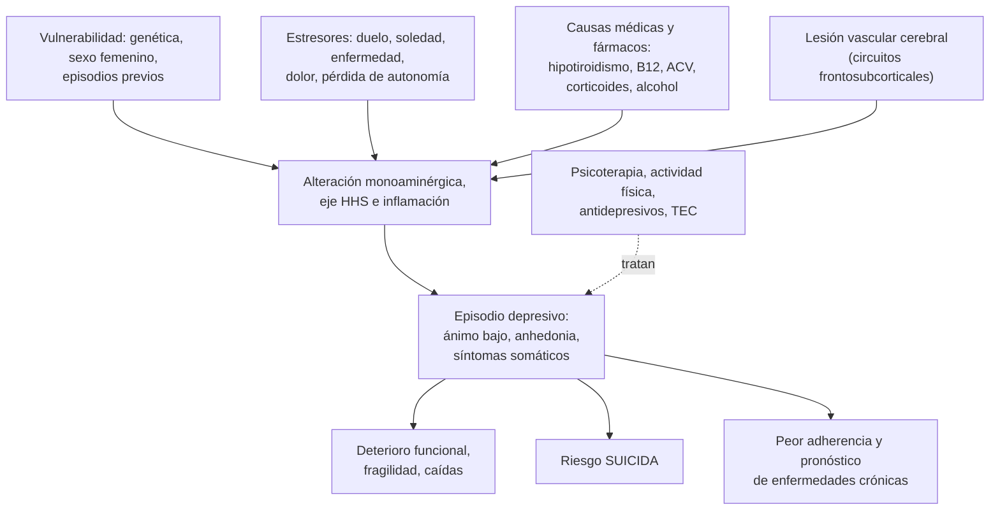
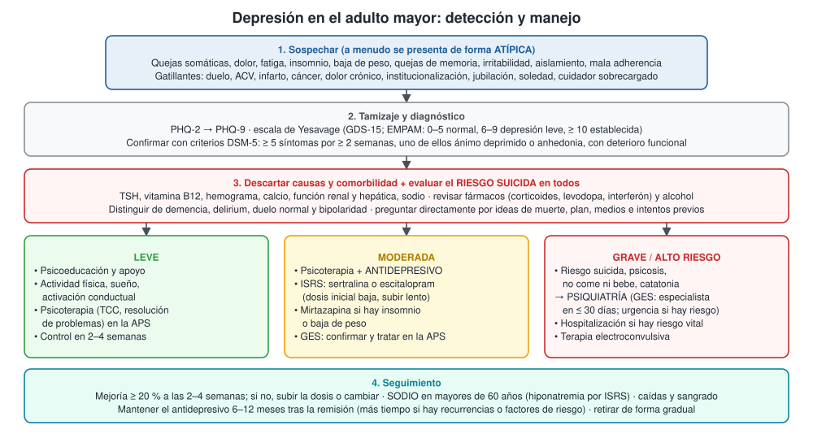

---
tags:
  - Geriatría
  - GES
  - Frecuente en sala
---

# Depresión (con énfasis en el adulto mayor)

**Subespecialidad**
Psiquiatría · Geriatría · Medicina familiar · Atención primaria

**Guías principales**
CANMAT 2023: manejo del trastorno depresivo mayor en adultos · USPSTF 2023: tamizaje de depresión y riesgo suicida · MINSAL: guía clínica de depresión en personas de 15 años y más (GES)

**Otras fuentes**
Revisión del manejo de la depresión en el adulto mayor (Kok y Reynolds, *JAMA* 2017) · Encuesta Nacional de Salud 2016–2017 · Validación multiétnica de la escala de Yesavage en Chile (2020) · Edadismo y riesgo de suicidio en personas mayores (*Rev Panam Salud Publica* 2026)

**GES**
Sí: **depresión en personas de 15 años y más** (problema de salud n.º 34). Tratamiento desde la confirmación diagnóstica; consulta con especialista dentro de **30 días** desde la derivación cuando corresponde.

**EUNACOM**
1.07.1.004 Depresión (sospecha, inicial, derivar)

**Revisado**
Octubre 2026

!!! abstract "Resumen en 60 segundos"
    - **Depresión mayor**: **≥ 5 síntomas** por **≥ 2 semanas**, entre ellos **ánimo deprimido** o **anhedonia**, con deterioro funcional.
    - En Chile (ENS 2016–2017): **depresión 6,2 %** de los adultos (**mujeres 10,1 %**, hombres 2,1 %) y **sospecha de depresión 15,8 %**.
    - **En el adulto mayor** se presenta de forma **atípica**: quejas somáticas, dolor, insomnio, baja de peso, **quejas de memoria**, irritabilidad, aislamiento. Muchas veces **no se detecta**.
    - **Tamizaje**: **PHQ-2 / PHQ-9** y **escala de Yesavage (GDS-15)** (EMPAM: ≥ 6 sospecha).
    - **Siempre**:
        - **Descartar causas médicas** (hipotiroidismo, déficit de B12, fármacos, alcohol).
        - Distinguir de la **demencia**, el **delirium** y el **duelo**.
        - **Preguntar directamente por el riesgo suicida**: en Chile la tasa de suicidio más alta está en los **mayores de 80 años**.
    - **Tratamiento**:
        - **Leve**: psicoeducación, actividad física y **psicoterapia**.
        - **Moderada**: psicoterapia + **ISRS** (sertralina, escitalopram), empezando con dosis bajas.
        - **Grave, psicótica o con riesgo suicida**: **psiquiatría** urgente; la **terapia electroconvulsiva** es muy eficaz en el adulto mayor.
    - En el adulto mayor con ISRS: controlar el **sodio** (hiponatremia), las **caídas** y el **sangrado**. Mantener el tratamiento **6–12 meses después de la remisión**.

## Definición

- **Episodio depresivo mayor** (DSM-5): **5 o más** de los siguientes síntomas durante **al menos 2 semanas**, casi todos los días, que representan un cambio respecto de lo previo; **al menos uno** debe ser **ánimo deprimido** o **anhedonia**:
    1. **Ánimo deprimido** (en el adulto mayor puede expresarse como irritabilidad o "nervios").
    2. **Anhedonia**: pérdida de interés o placer.
    3. Cambio del **apetito o del peso** (> 5 % en un mes).
    4. **Insomnio** o hipersomnia.
    5. **Agitación o enlentecimiento** psicomotor.
    6. **Fatiga** o pérdida de energía.
    7. Sentimientos de **inutilidad o culpa** excesiva.
    8. Dificultad para **concentrarse** o tomar decisiones.
    9. **Ideas de muerte** o suicidio, intentos o planes.
- Los síntomas causan **malestar significativo o deterioro** funcional y **no se explican** por una sustancia o por otra enfermedad médica.
- **Gravedad** (CIE-10, usada por el GES): **leve**, **moderada**, **grave sin síntomas psicóticos** y **grave con síntomas psicóticos**.
- **Trastorno depresivo persistente** (distimia): síntomas depresivos la mayor parte del tiempo por **≥ 2 años**.
- **Depresión de inicio tardío**: primer episodio después de los 60–65 años; se asocia con más frecuencia a **enfermedad cerebrovascular** y a **deterioro cognitivo**.
- **Remisión**: ausencia o casi ausencia de síntomas por al menos 2 meses. **Respuesta**: mejoría ≥ 50 % en una escala.

## Epidemiología

### Mundial

- La depresión es una de las principales causas de **discapacidad** en el mundo.
- **Adulto mayor** (Kok y Reynolds 2017):
    - La depresión mayor afecta a ~ **2 %** de los mayores de 55 años y aumenta con la edad.
    - Otro **10–15 %** tiene **síntomas depresivos clínicamente significativos** sin cumplir criterios de depresión mayor.
    - Es más frecuente en personas **hospitalizadas**, institucionalizadas, con enfermedades crónicas, dolor, ACV, Parkinson o demencia.
    - A menudo **no se detecta** o se trata de forma insuficiente.
- **Curso**: ~ 20–30 % de los episodios se vuelve **crónico** (más de 2 años); las recurrencias son frecuentes.
- **Suicidio**: el riesgo es mayor en **hombres mayores**, viudos, que viven solos, con enfermedades crónicas, dolor y consumo de alcohol.

### Chile

!!! chile "Datos nacionales"
    - **Encuesta Nacional de Salud 2016–2017** (adultos ≥ 18 años):
        - **Depresión** en los últimos 12 meses (CIDI, criterios DSM-IV): **6,2 %**. **Mujeres 10,1 %**, **hombres 2,1 %**.
        - Por edad: 6,2 % entre 65 y 74 años y 3,2 % en los mayores de 75 (el CIDI puede subestimar la depresión del adulto mayor).
        - **Sospecha de depresión** (síntomas depresivos): **15,8 %**. **Mujeres 21,7 %**, **hombres 10,0 %**.
    - Al combinar la ENS con las notificaciones GES, la prevalencia estimada de depresión mayor sube a **6,65 %** (Jaques 2022).
    - **Suicidio** (Bozanic 2026):
        - Tasa general de **11,17 por 100.000** habitantes.
        - **12,45** en las personas de **60 años o más**.
        - **15 por 100.000** en las de **80 años o más**: la cifra **más alta** de todos los grupos de edad.
        - El **edadismo** en la atención de salud es una barrera para detectar y tratar la depresión y el riesgo suicida en las personas mayores.
    - **Escala de Yesavage (GDS-15)**: validada en Chile en una muestra multiétnica de **800** personas mayores (71 % aymara o mapuche), con buenas propiedades psicométricas (Gallardo-Peralta 2020). Es parte del **EMPAM** (examen anual de medicina preventiva del adulto mayor).
    - **GES n.º 34**: depresión en personas de 15 años y más (leve, moderada y grave, con o sin síntomas psicóticos). La depresión leve y moderada se trata en la **APS**; la grave, con psicosis, refractaria o con alto riesgo suicida, con **especialista**.

## Etiología y factores de riesgo

| Grupo | Factores |
|---|---|
| **Biológicos** | Antecedente personal o **familiar** de depresión, sexo femenino, **enfermedad cerebrovascular** (depresión "vascular"), enfermedades neurodegenerativas (Parkinson, demencia) |
| **Enfermedades médicas** | **Hipotiroidismo**, déficit de **vitamina B12**, **ACV**, **infarto** e insuficiencia cardíaca, **cáncer** (páncreas), **diabetes**, EPOC, **dolor crónico**, ERC, VIH |
| **Fármacos y sustancias** | **Corticoides**, interferón, levodopa, isotretinoína, benzodiacepinas, **alcohol** (depresor) y su abstinencia |
| **Psicosociales** | **Duelo**, **soledad**, aislamiento, jubilación, pobreza, pérdida de autonomía, **institucionalización**, sobrecarga del **cuidador**, maltrato |
| **Funcionales** | Discapacidad, dolor, déficit sensorial (audición, visión), insomnio |

## Fisiopatología

- **Modelo de vulnerabilidad-estrés**: una predisposición (genética, experiencias tempranas) interactúa con estresores (pérdidas, enfermedad).
- **Alteraciones neurobiológicas**:
    - Disfunción de la neurotransmisión **monoaminérgica** (serotonina, noradrenalina, dopamina).
    - **Hiperactividad del eje hipotálamo-hipófisis-suprarrenal** (cortisol elevado).
    - **Inflamación** de bajo grado y menor neuroplasticidad (factor neurotrófico derivado del cerebro).
- **Depresión vascular** del adulto mayor: lesiones de la sustancia blanca en los circuitos frontosubcorticales → **disfunción ejecutiva**, enlentecimiento, apatía y peor respuesta a los antidepresivos.
- **Relación bidireccional** con las enfermedades médicas: la depresión empeora la adherencia y el pronóstico del infarto, la diabetes y el ACV, y estas enfermedades aumentan el riesgo de depresión.
- **Depresión y demencia**: la depresión de inicio tardío puede ser un **pródromo** o un factor de riesgo de demencia; ambas coexisten con frecuencia.

*Figura 1. Modelo de la depresión en el adulto mayor. Esquema propio basado en Kok y Reynolds 2017 y CANMAT 2023.*

## Clasificación

| Gravedad (CIE-10) | Características | Manejo inicial |
|---|---|---|
| **Leve** | Pocos síntomas por encima del umbral; funciona con esfuerzo | Psicoeducación, actividad física, **psicoterapia** (APS) |
| **Moderada** | Más síntomas; deterioro funcional evidente | Psicoterapia **+ antidepresivo** (APS) |
| **Grave sin síntomas psicóticos** | Muchos síntomas intensos; incapacidad para funcionar; ideas suicidas frecuentes | Antidepresivo + psicoterapia; **psiquiatría** |
| **Grave con síntomas psicóticos** | Delirios de culpa, ruina, enfermedad o nihilistas; alucinaciones | **Psiquiatría urgente**: antidepresivo + antipsicótico o **terapia electroconvulsiva** |

**Otros tipos**:

- **Depresión con síntomas ansiosos** (frecuente en el adulto mayor).
- **Depresión con características melancólicas**: anhedonia completa, empeora en la mañana, despertar precoz, enlentecimiento, culpa.
- **Depresión bipolar**: antecedente de manía o hipomanía; los antidepresivos solos pueden inducir viraje → psiquiatría.
- **Seudodemencia depresiva**: deterioro cognitivo que mejora con el tratamiento de la depresión.

## Clínica

- **Síntomas nucleares**: ánimo deprimido, **anhedonia**, alteraciones del sueño y del apetito, fatiga, culpa, dificultad para concentrarse, ideas de muerte.
- **Particularidades en el adulto mayor**:
    - El paciente **niega la tristeza** y consulta por **síntomas somáticos**: dolor, cansancio, mareo, constipación, palpitaciones.
    - **Quejas de memoria** y de concentración (el paciente **se queja más** de su memoria que en la demencia, donde suele minimizarla).
    - **Irritabilidad**, ansiedad, **apatía**, aislamiento.
    - **Baja de peso** y desnutrición; **insomnio**.
    - **Mala adherencia** a los tratamientos, abandono del autocuidado.
    - **Síndrome de fragilidad** y caídas.
- **Síntomas psicóticos** en la depresión grave: delirios de **ruina**, de **culpa**, hipocondríacos o **nihilistas** (síndrome de Cotard).
- **Señales de alarma de suicidio**:
    - Expresiones de desesperanza ("no vale la pena seguir", "soy una carga").
    - **Plan** concreto y acceso a **medios** (armas, medicamentos acumulados).
    - **Intento previo**.
    - Hombre mayor, **viudo**, que **vive solo**, con dolor, enfermedad grave o **alcohol**.
    - Despedidas, regalar pertenencias, **dejar de comer** o rechazar tratamientos.

## Diagnóstico

!!! guia "Detección y diagnóstico"
    1. **Tamizaje** en la APS (USPSTF 2023 recomienda tamizar a todos los adultos, incluidos los mayores):
        - **PHQ-2**: en las últimas 2 semanas, ¿poco interés o placer? ¿se ha sentido triste, deprimido o sin esperanza? Si es positivo → **PHQ-9**.
        - **Escala de depresión geriátrica de Yesavage** (GDS-15) en el adulto mayor. Puntaje del EMPAM: **0–5 normal**, **6–9 depresión leve**, **≥ 10 depresión establecida**.
    2. **Confirmar** con la entrevista clínica y los **criterios DSM-5** o CIE-10 y definir la **gravedad**.
    3. **Evaluar el riesgo suicida** en todos: preguntar **directamente** por ideas de muerte, plan, medios e intentos previos. Preguntar **no aumenta** el riesgo.
    4. **Descartar** causas médicas, fármacos, alcohol, **bipolaridad** (preguntar por episodios de euforia o hiperactividad) y **deterioro cognitivo** (MMSE o MoCA cuando el ánimo mejore).
    5. **Evaluar** la funcionalidad, las redes de apoyo y la sobrecarga del cuidador.

<figure markdown>
{ loading=lazy }
<figcaption>Figura 2. Detección y manejo de la depresión en el adulto mayor. Esquema propio basado en CANMAT 2023, USPSTF 2023, Kok y Reynolds 2017, el EMPAM y el GES de depresión.</figcaption>
</figure>

## Laboratorio

| Examen | Interpretación |
|---|---|
| **TSH** (± T4 libre) | **Hipotiroidismo**: causa tratable de síntomas depresivos |
| **Vitamina B12** (± ácido fólico) | Déficit: depresión, deterioro cognitivo, neuropatía |
| **Hemograma** | Anemia (fatiga) |
| **Glicemia**, función renal y hepática | Comorbilidad; ajuste de dosis |
| **Electrolitos (sodio)** y **calcio** | **Hiponatremia** basal (y antes de los ISRS); **hipercalcemia** (síntomas depresivos) |
| **VIH, VDRL** | Según el riesgo; la neurosífilis y el VIH causan síntomas psiquiátricos |
| **ECG** | Basal en cardiópatas o con fármacos que alargan el **QT** (citalopram, escitalopram, tricíclicos) |
| **Neuroimagen** (TC o RM cerebral) | Depresión de **inicio tardío**, síntomas atípicos, signos focales o deterioro cognitivo |

## Imágenes

- No son necesarias para el diagnóstico de la depresión.
- **TC o RM cerebral** en la depresión de **inicio tardío**, con signos neurológicos, deterioro cognitivo rápido o síntomas atípicos: lesiones vasculares, tumores, hidrocefalia, atrofia.

## Diagnóstico diferencial

| Diagnóstico | Diferencias |
|---|---|
| **Duelo normal** | Tristeza en "oleadas" ligada al recuerdo de la persona fallecida; conserva la autoestima; sin ideas de inutilidad. Un duelo **prolongado** o con síntomas graves puede ser depresión |
| **Demencia** | Inicio insidioso, el paciente **minimiza** sus fallas, alteraciones del lenguaje y de la orientación; en la depresión se queja de la memoria y responde "no sé" |
| **Delirium** | Inicio **agudo**, fluctuante, alteración de la **atención** y de la conciencia; el delirium hipoactivo se confunde con depresión |
| **Hipotiroidismo** | Bradicardia, piel seca, frío, constipación; TSH alta |
| **Enfermedad de Parkinson** | Hipomimia y bradicinesia (simulan depresión); la depresión también es frecuente en el Parkinson |
| **Trastorno bipolar** | Antecedente de manía o hipomanía |
| **Consumo de alcohol o benzodiacepinas** | Mejoran los síntomas con la abstinencia |
| **Apatía** (frontal, vascular) | Falta de motivación sin tristeza ni culpa |

## Tratamiento

### Medidas generales (todos)

- **Psicoeducación** al paciente y a la familia: es una **enfermedad tratable**, no "algo propio de la edad".
- **Actividad física** regular, **higiene del sueño**, actividades placenteras (**activación conductual**), contacto social.
- **Tratar las comorbilidades** (dolor, insomnio, déficit sensorial) y **revisar los fármacos** (suspender los que deprimen si es posible).
- **Evitar el alcohol** y el uso crónico de benzodiacepinas.
- **Plan de seguridad** si hay ideas suicidas: restringir el acceso a medios (armas, acumulación de fármacos), red de apoyo, contactos de urgencia.

### Psicoterapia

- **Primera línea** en la depresión leve y combinada con fármacos en la moderada y grave (CANMAT 2023): **terapia cognitivo-conductual**, **activación conductual**, terapia de **resolución de problemas** e **interpersonal**.
- En el adulto mayor, la terapia de **resolución de problemas** es útil y puede hacerse en la APS.

### Antidepresivos

!!! dosis "Antidepresivos en el adulto mayor: empezar bajo, subir lento, pero llegar a dosis eficaz"
    | Fármaco | Dosis inicial (adulto mayor) | Dosis habitual | Comentarios |
    |---|---|---|---|
    | **Sertralina** (ISRS) | 25 mg/día | 50–200 mg/día | De elección en cardiópatas; pocas interacciones |
    | **Escitalopram** (ISRS) | 5 mg/día | 10 mg/día (máximo **10 mg** en mayores de 65) | Alarga el **QT** según la dosis |
    | **Citalopram** (ISRS) | 10 mg/día | 20 mg/día (máximo **20 mg** en mayores de 60) | Alarga el **QT** |
    | **Fluoxetina** (ISRS) | 10 mg/día | 20–40 mg/día | Vida media muy larga; más interacciones |
    | **Mirtazapina** | 7,5–15 mg en la noche | 15–45 mg/día | Útil con **insomnio, inapetencia y baja de peso**; sedación, aumento de peso |
    | **Venlafaxina** o **duloxetina** (IRSN) | Venlafaxina 37,5 mg; duloxetina 30 mg | Venlafaxina 75–225 mg; duloxetina 60 mg | Segunda línea; duloxetina útil con **dolor**; venlafaxina sube la PA |
    | **Bupropión** | 150 mg/día | 150–300 mg/día | Sin efectos sexuales; **contraindicado** si hay epilepsia |

    - **Evitar** en el adulto mayor: **tricíclicos** (amitriptilina, imipramina: anticolinérgicos, hipotensión ortostática, arritmias, letales en sobredosis) y **paroxetina** (anticolinérgica).
    - **Efectos adversos de los ISRS** a vigilar: **hiponatremia** (SIADH; medir el sodio a las 2–4 semanas, sobre todo con diuréticos), **caídas**, **sangrado digestivo** (más con AINE, antiagregantes o anticoagulantes: agregar IBP), síndrome serotoninérgico (con tramadol, triptanes, linezolid), náuseas, insomnio o somnolencia.

- **Respuesta**:
    - Evaluar a las **2–4 semanas**. Si no hay mejoría de al menos 20 % a las 4 semanas: **subir la dosis** o **cambiar** (CANMAT 2023). En el adulto mayor la respuesta completa puede tardar más.
    - Si hay respuesta parcial: optimizar la dosis, cambiar de fármaco o **potenciar** (aripiprazol, litio; especialista).
- **Duración**:
    - Mantener el antidepresivo **6–12 meses después de la remisión** (CANMAT 2023).
    - **Más tiempo** (≥ 2 años o indefinido) si hay **episodios recurrentes**, síntomas residuales, depresión grave o crónica.
    - **Retirar en forma gradual** (semanas) para evitar el síndrome de discontinuación y vigilar las recaídas.

### Depresión grave, psicótica o con riesgo suicida

!!! alarma "Derivación y hospitalización"
    - **Riesgo suicida alto** (plan, medios, intento reciente, desesperanza intensa, psicosis, sin red de apoyo): **no dejar solo** al paciente; evaluación psiquiátrica **urgente** y hospitalización si es necesario.
    - **Depresión con síntomas psicóticos**, **catatonia**, rechazo a comer o beber: psiquiatría urgente.
    - **Terapia electroconvulsiva**: muy eficaz y segura en el adulto mayor con depresión grave, psicótica, con riesgo vital o refractaria.
    - **Estimulación magnética transcraneal**: alternativa en la depresión resistente; la bilateral puede considerarse de primera línea en la depresión del adulto mayor (CANMAT 2023).
    - GES: derivar a especialista en los casos graves, con psicosis, bipolaridad, riesgo suicida o refractarios.

## Complicaciones

- **Suicidio**: la complicación más grave; en Chile, la tasa más alta está en los mayores de 80 años.
- **Discapacidad**, pérdida de autonomía y **fragilidad**.
- **Desnutrición** y deshidratación.
- **Peor pronóstico** de enfermedades crónicas: más mortalidad tras el **infarto** y el ACV, peor control de la diabetes.
- **Deterioro cognitivo** y mayor riesgo de demencia.
- **Efectos adversos** de los antidepresivos: hiponatremia, caídas y fracturas, sangrado, síndrome serotoninérgico, QT largo.
- **Sobrecarga** y depresión del cuidador.

## Pronóstico y seguimiento

- La mayoría de los pacientes **responde** al tratamiento adecuado, aunque en el adulto mayor la respuesta puede ser más **lenta** y las **recaídas** más frecuentes.
- **Peor pronóstico**: comorbilidad médica, deterioro cognitivo, depresión vascular, aislamiento social, síntomas residuales, tratamiento corto.
- **Seguimiento**:
    - Controles cada **2–4 semanas** en la fase aguda, con una escala (PHQ-9 o Yesavage).
    - **Sodio** a las 2–4 semanas de iniciar un ISRS en mayores de 60 años.
    - Reevaluar el **riesgo suicida** en cada control, sobre todo en las **primeras 4 semanas** de tratamiento y al suspenderlo.
    - Evaluar la **cognición** cuando el ánimo mejore.

## Perlas para el internado

!!! perla "Para recordar en la sala"
    - **Adulto mayor con dolor, cansancio, insomnio y baja de peso sin explicación**: piense en depresión y aplique el **Yesavage**.
    - **Pregunte siempre por ideas suicidas**: preguntar no las induce.
    - **Hombre mayor, viudo, que vive solo, con dolor y alcohol** = riesgo suicida alto.
    - Antes de diagnosticar depresión: **TSH, B12** y revisión de **fármacos** (corticoides, levodopa) y **alcohol**.
    - **Delirium hipoactivo** se confunde con depresión en la sala: evalúe la **atención** (CAM).
    - En el adulto mayor: **sertralina o escitalopram** a dosis bajas; **no** amitriptilina ni paroxetina.
    - ISRS + diurético en una persona mayor: controle el **sodio**.
    - ISRS + AINE o anticoagulante: considere un **IBP** (sangrado digestivo).
    - **Mirtazapina** si el paciente no come ni duerme.
    - La depresión es **GES** desde los 15 años: notifique y trate en la APS los casos leves y moderados.

## Preguntas de repaso

??? repaso "1. Mujer de 76 años, viuda hace 8 meses, consulta por cansancio, dolor difuso, insomnio y baja de 5 kg en 3 meses. Dice que \"no tiene ganas de nada\" y que olvida las cosas. Los exámenes generales son normales. ¿Qué sospecha y qué hace?"
    - **Depresión mayor** de presentación somática en el adulto mayor (anhedonia, insomnio, baja de peso, quejas de memoria), probablemente gatillada por el duelo.
    - Aplicar **Yesavage** (GDS-15) o PHQ-9 y confirmar con los criterios DSM-5.
    - Descartar **hipotiroidismo** y **déficit de B12**; revisar fármacos.
    - **Evaluar el riesgo suicida** directamente.
    - Psicoterapia y, si es moderada, **sertralina 25 mg/día** (subir a 50 mg) o **mirtazapina** por el insomnio y la baja de peso. Control en 2–4 semanas. Notificación GES.

??? repaso "2. Hombre de 82 años, viudo, vive solo, con dolor crónico por artrosis y consumo diario de alcohol. Dice que \"ya no vale la pena vivir\" y que tiene guardados \"unos remedios por si acaso\". ¿Qué hace?"
    - **Riesgo suicida alto**: hombre mayor, viudo, solo, dolor crónico, alcohol, desesperanza y **acceso a medios** (fármacos acumulados).
    - **No dejarlo solo**; evaluación **psiquiátrica urgente** y probable **hospitalización**.
    - Retirar los medios (fármacos acumulados), avisar a la familia o red de apoyo.
    - Tratar la depresión, el dolor y el consumo de alcohol.

??? repaso "3. Mujer de 79 años en tratamiento con hidroclorotiazida, a la que se le inició sertralina hace 3 semanas, llega con confusión y náuseas. El sodio plasmático es de 121 mEq/L. ¿Qué ocurrió y cómo lo maneja?"
    - **Hiponatremia por SIADH asociado al ISRS**, potenciada por el **diurético tiazídico** (riesgo alto en el adulto mayor).
    - **Suspender la sertralina** y la tiazida; manejo de la hiponatremia según los síntomas (restricción de agua; solución hipertónica si hay síntomas graves), corrigiendo **sin superar 8–10 mEq/L en 24 horas**.
    - Una vez corregida: cambiar a **mirtazapina** (menos hiponatremia) y **controlar el sodio** a las 2–4 semanas.

??? repaso "4. Hombre de 70 años con quejas de memoria de 4 meses, ánimo bajo, apatía e insomnio. Dice \"no sé\" a muchas preguntas del MMSE y se angustia por sus olvidos. ¿Demencia o depresión? ¿Cómo lo enfoca?"
    - Sugiere **depresión con deterioro cognitivo** ("seudodemencia depresiva"): inicio más rápido, el paciente **se queja** de su memoria y responde "no sé", con síntomas afectivos claros.
    - Descartar causas reversibles (**TSH, B12**, fármacos) y considerar neuroimagen (inicio tardío).
    - **Tratar la depresión** y **reevaluar la cognición** cuando mejore el ánimo: si el deterioro persiste, estudiar una demencia (la depresión de inicio tardío puede ser su pródromo).

??? repaso "5. Mujer de 68 años con depresión grave: no come, no se levanta y dice que \"está podrida por dentro\" y que \"ya está muerta\". ¿Cómo la clasifica y qué tratamiento corresponde?"
    - **Depresión grave con síntomas psicóticos** (delirio nihilista o de Cotard) y riesgo vital por el rechazo de alimentos.
    - **Derivación psiquiátrica urgente** y **hospitalización**.
    - Tratamiento: **terapia electroconvulsiva** (muy eficaz en el adulto mayor) o antidepresivo + antipsicótico.
    - Hidratación y nutrición; vigilancia del riesgo suicida.

??? repaso "6. Paciente de 74 años que respondió bien a escitalopram 10 mg. Lleva 4 meses sin síntomas y pregunta si puede suspenderlo. Es su tercer episodio de depresión. ¿Qué le responde?"
    - **No suspender todavía**: con **episodios recurrentes** (3 episodios) se recomienda una **mantención prolongada** (≥ 2 años o indefinida), no solo 6–12 meses.
    - Mantener la **misma dosis** que logró la remisión, con controles periódicos.
    - Cuando se decida suspender: **retiro gradual** en semanas y vigilancia de recaídas.

## Referencias

1. Lam RW, Kennedy SH, Adams C, et al. Canadian Network for Mood and Anxiety Treatments (CANMAT) 2023 update on clinical guidelines for management of major depressive disorder in adults. *Can J Psychiatry.* 2024;69(9):641–687. doi:[10.1177/07067437241245384](https://doi.org/10.1177/07067437241245384)
2. US Preventive Services Task Force; Barry MJ, Nicholson WK, et al. Screening for depression and suicide risk in adults: US Preventive Services Task Force recommendation statement. *JAMA.* 2023;329(23):2057–2067. doi:[10.1001/jama.2023.9297](https://doi.org/10.1001/jama.2023.9297)
3. Kok RM, Reynolds CF 3rd. Management of depression in older adults: a review. *JAMA.* 2017;317(20):2114–2122. doi:[10.1001/jama.2017.5706](https://doi.org/10.1001/jama.2017.5706)
4. Ministerio de Salud de Chile. Encuesta Nacional de Salud 2016–2017: segunda entrega de resultados. Santiago: MINSAL; 2018. [minsal.cl](https://www.minsal.cl/wp-content/uploads/2018/01/2-Resultados-ENS_MINSAL_31_01_2018.pdf)
5. Jaques D, Bustamante F, Aravena R, et al. Combinación de datos de la Encuesta Nacional de Salud con notificaciones GES de depresión para mejorar la estimación de la prevalencia de depresión en Chile. *Rev Med Chil.* 2022;150(7):896–902. doi:[10.4067/s0034-98872022000700896](https://doi.org/10.4067/s0034-98872022000700896)
6. Bozanic A, León T, Acevedo F, et al. Edadismo en el ámbito de la salud y riesgo de suicidio en personas mayores: un desafío para la salud pública en América Latina. *Rev Panam Salud Publica.* 2026;50:e17. doi:[10.26633/RPSP.2026.17](https://doi.org/10.26633/RPSP.2026.17)
7. Gallardo-Peralta LP, Rodríguez-Blázquez C, Ayala-García A, et al. Multi-ethnic validation of 15-item Geriatric Depression Scale in Chile. *Psicol Reflex Crit.* 2020;33(1):7. doi:[10.1186/s41155-020-00146-9](https://doi.org/10.1186/s41155-020-00146-9)
8. Ministerio de Salud de Chile. Manual de aplicación del Examen de Medicina Preventiva del Adulto Mayor. [diprece.minsal.cl](https://diprece.minsal.cl/wrdprss_minsal/wp-content/uploads/2015/05/instructivo-de-control-de-salud-empam.pdf)
9. Superintendencia de Salud. Problema de salud 34: depresión en personas de 15 años y más. [superdesalud.gob.cl](https://www.superdesalud.gob.cl/orientacion-en-salud/depresion-en-personas-de-15-anos-y-mas/)
