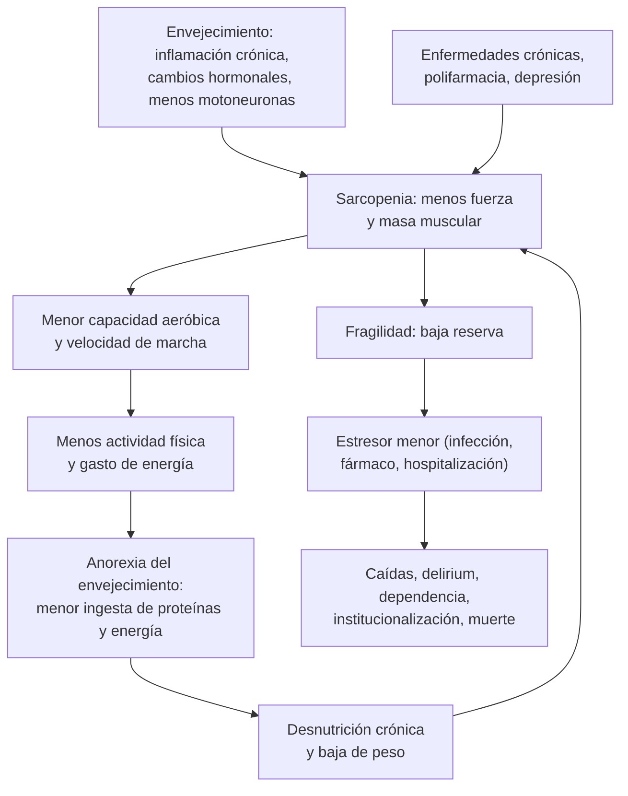

---
tags:
  - Geriatría
  - Frecuente en sala
---

# Fragilidad y sarcopenia

**Subespecialidad**
Geriatría · Medicina interna · Medicina física y rehabilitación · Nutrición

**Guías principales**
ICFSR 2019: guía de práctica clínica de la fragilidad física · ICFSR 2020: tamizaje y manejo de la fragilidad en APS · EWGSOP2 2019: definición y diagnóstico de la sarcopenia · GLIS 2024: definición conceptual global de la sarcopenia · PROT-AGE 2013: aporte de proteínas en personas mayores · STOPP/START versión 3 (2023)

**Otras fuentes**
Fenotipo de fragilidad (Fried 2001) · Escala clínica de fragilidad (Rockwood 2005) · Escala FRAIL (Morley 2012) · Prevalencia mundial (O'Caoimh 2021) · Índice de fragilidad en la ENS 2016–2017 (Díaz-Toro 2023) · Validación chilena de la escala clínica de fragilidad (Browne 2025) · Ensayo SPRINTT (2022) · Manual del EMPAM (MINSAL) · Figura: Dent 2019 (CC BY 4.0)

**GES**
No es GES. El **Examen de Medicina Preventiva del Adulto Mayor (EMPAM)**, con el **EFAM-Chile**, es la puerta de entrada en APS para detectar el riesgo de dependencia.

**EUNACOM**
1.07.1.008 Fragilidad (específico, completo, completo)

**Revisado**
Octubre 2026

!!! abstract "Resumen en 60 segundos"
    - La **fragilidad** es una **pérdida de reserva** de varios sistemas que deja a la persona vulnerable: un estresor menor (una ITU, un fármaco, una hospitalización) produce un deterioro desproporcionado (delirium, caídas, dependencia, muerte).
    - Es **frecuente**: 12 % de los mayores de 50 años con criterios físicos y 24 % con índices de fragilidad. En Chile, **11,8 %** de los mayores de 40 años según la ENS 2016–2017, más en **mujeres** (15,9 %).
    - Es **dinámica y reversible** en sus etapas iniciales (prefragilidad): por eso hay que **buscarla**.
    - **Tamizaje** a todo mayor de 65 años (ICFSR) con un instrumento rápido: **escala FRAIL**, **escala clínica de fragilidad** (1–9) o **velocidad de marcha**. En Chile, el **EFAM** del EMPAM.
    - **Fenotipo de Fried** (≥ 3 de 5 = frágil): **baja de peso**, **agotamiento**, **debilidad** (prensión), **lentitud** (marcha) y **baja actividad física**.
    - La **sarcopenia** (pérdida de fuerza y masa muscular) es el núcleo físico de la fragilidad. EWGSOP2: **prensión < 27 kg (H) o < 16 kg (M)** = sarcopenia probable.
    - **Tratamiento**:
        - **Ejercicio multicomponente** con **resistencia progresiva** (la intervención con más evidencia).
        - **Proteínas 1,0–1,2 g/kg/día**.
        - Tratar la baja de peso.
        - **Desprescribir** (polifarmacia).
        - Buscar causas tratables de fatiga (**anemia, hipotiroidismo, B12, depresión, hipotensión**).
        - **Apoyo social**.
        - **No** hay fármacos para la fragilidad. Vitamina D solo si hay déficit.
    - En el hospital, la fragilidad **predice** delirium, caídas, complicaciones y muerte mejor que la edad: úsala para decidir, y **evita el reposo en cama**.

## Definición

| Concepto | Definición |
|---|---|
| **Fragilidad** | Síndrome clínico de **vulnerabilidad aumentada** ante estresores por la **pérdida de reserva fisiológica** de varios sistemas. Aumenta el riesgo de dependencia, caídas, hospitalización y muerte (consenso de Morley 2013) |
| **Fragilidad física (fenotipo de Fried)** | **≥ 3** de: **baja de peso** involuntaria (≥ 4,5 kg en el último año), **agotamiento** autorreportado, **debilidad** (prensión baja), **lentitud** (velocidad de marcha baja) y **baja actividad física**. **1–2** criterios = **prefragilidad**; **0** = robusto |
| **Índice de fragilidad (acumulación de déficits)** | Proporción de déficits presentes (enfermedades, síntomas, limitaciones funcionales) sobre los evaluados; de **0 a 1**. Un índice **≥ 0,25** se considera fragilidad |
| **Sarcopenia** | Enfermedad muscular con **baja fuerza** muscular (criterio principal), más **baja cantidad o calidad** de músculo. Es **grave** si también hay **bajo rendimiento físico** (EWGSOP2 2019) |
| **Obesidad sarcopénica** | Sarcopenia con exceso de grasa: el IMC normal o alto **no descarta** la sarcopenia |
| **Discapacidad o dependencia** | Necesidad de ayuda para las actividades de la vida diaria. La fragilidad es el **paso previo** y potencialmente reversible |

!!! perla "Fragilidad no es lo mismo que edad, multimorbilidad ni discapacidad"
    - Hay personas de 90 años robustas y de 70 años frágiles.
    - La multimorbilidad y la discapacidad se superponen con la fragilidad, pero no son lo mismo. Un usuario de silla de ruedas por una paraplejia puede no ser frágil.
    - La fragilidad mide **reserva**: cuánto aguanta la persona antes de descompensarse.

## Epidemiología

### Mundial

- **Prevalencia** en mayores de 50 años de 62 países (O'Caoimh 2021):
    - **12 %** con instrumentos de fragilidad física y **24 %** con índices de fragilidad.
    - La **prefragilidad** afecta a casi la **mitad** (46–49 %).
    - Es más frecuente en **mujeres** y aumenta con la **edad**.
- La fragilidad aumenta el riesgo de **caídas**, **fracturas**, **delirium**, **hospitalización**, **institucionalización** y **muerte**, y de **complicaciones** tras una cirugía o una quimioterapia.
- **Sarcopenia**: su prevalencia varía mucho según la definición y la población; es más alta en los **hospitalizados** y en los **institucionalizados**.

!!! chile "Datos nacionales"
    - **Índice de fragilidad** con datos de la **ENS 2016–2017** (Díaz-Toro 2023; 3.036 personas ≥ 40 años):
        - **11,8 %** de frágiles (índice ≥ 0,25): **15,9 %** en mujeres y **7,4 %** en hombres.
        - Mayor en los **≥ 80 años** y en quienes tienen **≤ 8 años de escolaridad**.
    - **EMPAM** (Examen de Medicina Preventiva del Adulto Mayor, APS):
        - **EFAM-Chile**, **parte A**: **≤ 42 puntos** = **riesgo de dependencia** (derivar a médico); **≥ 43** = autovalente, y se aplica la **parte B**.
        - **Parte B**: **≥ 46** = **autovalente sin riesgo** (promoción y prevención); **≤ 45** = **autovalente con riesgo**.
        - Si la persona ya tiene una discapacidad evidente, se aplica el **índice de Barthel**.
        - Incluye el **riesgo de caídas**: **estación unipodal** (alterada si < 4 s) y **Timed Up and Go** (normal ≤ 10 s; riesgo leve 11–20 s; **alto riesgo > 20 s**).
    - La **escala clínica de fragilidad** se tradujo y validó al **español en Chile** (Browne 2025), con muy buena concordancia entre evaluadores.

## Etiología

- **Factores de riesgo**:
    - **Edad**, sexo **femenino**, **baja escolaridad** e ingresos.
    - **Multimorbilidad**: insuficiencia cardíaca, EPOC, diabetes, ERC, artrosis, cáncer.
    - **Polifarmacia** (≥ 5 fármacos) y fármacos inapropiados (sedantes, anticolinérgicos).
    - **Inactividad física** y **reposo en cama** (hospitalizaciones).
    - **Malnutrición** (déficit de proteínas y energía) y también **obesidad** (obesidad sarcopénica).
    - **Depresión**, **deterioro cognitivo**, **aislamiento social**.
    - **Déficit sensorial** (visión, audición), **salud oral** deficiente.
- **Sarcopenia**:
    - **Primaria**: por la edad.
    - **Secundaria**: **enfermedades** (inflamatorias, cáncer, falla de órganos, endocrinas), **inactividad** (reposo, sedentarismo) y **nutrición** deficiente (EWGSOP2).

## Fisiopatología

- Con la edad se suman cambios en varios sistemas:
    - **Inflamación crónica de bajo grado** (*inflammaging*: IL-6, PCR).
    - **Hormonal**: menos testosterona, IGF-1 y vitamina D; resistencia a la insulina.
    - **Músculo**: pérdida de motoneuronas y de fibras tipo II, disfunción mitocondrial, menor síntesis proteica ("resistencia anabólica").
- El **ciclo de la fragilidad** (Fried):
    1. La **sarcopenia** reduce la fuerza y la capacidad aeróbica.
    2. La persona camina más **lento** y **se mueve menos**.
    3. Gasta menos energía y **come menos** (anorexia del envejecimiento).
    4. La **desnutrición crónica** acelera la pérdida de músculo, y el ciclo se repite.
- Cuando la reserva es baja, un **estresor** pequeño cruza el umbral de la falla: la persona pasa de independiente a dependiente y luego se recupera **lento o no se recupera** (figura 2).

*Figura 1. Ciclo de la fragilidad y sus consecuencias. Esquema propio basado en Fried 2001.*

<figure markdown>
{ loading=lazy }
<figcaption>Figura 2. Cascada de la declinación funcional: de la robustez a la prefragilidad, la fragilidad y la discapacidad. Ante un mismo estresor, la persona robusta o prefrágil se recupera; la frágil cae más y termina en la dependencia (*Stressor*: estresor; *Recovery*: recuperación; *Dependence*: dependencia). Fuente: Dent E, Morley JE, Cruz-Jentoft AJ, et al. Physical frailty: ICFSR international clinical practice guidelines for identification and management. <em>J Nutr Health Aging.</em> 2019;23(9):771–787, figura 1. Licencia <a href="https://creativecommons.org/licenses/by/4.0/">CC BY 4.0</a>.</figcaption>
</figure>

## Clasificación

### Instrumentos para la fragilidad

| Instrumento | Cómo se aplica | Punto de corte |
|---|---|---|
| **Escala FRAIL** (Morley 2012) | 5 preguntas: **F**atiga, **R**esistencia (subir 10 peldaños), **A**mbulación (caminar una cuadra), **I**lnesses (≥ 5 enfermedades), **L**oss of weight (> 5 % en 1 año) | **0** robusto · **1–2** prefrágil · **≥ 3** frágil |
| **Escala clínica de fragilidad** (Rockwood 2005; versión 2.0) | Juicio clínico de **1 a 9** según la funcionalidad de las **2 semanas previas** a la enfermedad aguda | **≥ 5** = fragilidad |
| **Fenotipo de Fried** | 5 criterios medidos (peso, agotamiento, prensión, velocidad de marcha, actividad) | **≥ 3** frágil · 1–2 prefrágil |
| **Índice de fragilidad** | Proporción de déficits (≥ 30 ítems) | **≥ 0,25** frágil |
| **Velocidad de marcha** | Caminar 4 m a paso habitual | **≤ 0,8 m/s** alterada |
| **EFAM-Chile** (EMPAM) | 2 partes con funciones de la vida diaria, cognición y ánimo | Parte A **≤ 42** riesgo de dependencia; parte B **≤ 45** autovalente con riesgo |

| Escala clínica de fragilidad | Descripción resumida |
|---|---|
| **1–3** | En forma, activo; o con enfermedades bien controladas, sin limitaciones |
| **4** | **Fragilidad muy leve**: independiente, pero más lento o cansado ("vulnerable") |
| **5** | **Fragilidad leve**: necesita ayuda en actividades instrumentales (compras, finanzas, transporte, tareas pesadas) |
| **6** | **Fragilidad moderada**: ayuda en todas las actividades fuera de la casa y en algunas básicas (bañarse, escaleras) |
| **7** | **Fragilidad grave**: dependiente para el cuidado personal, pero estable |
| **8** | **Fragilidad muy grave**: totalmente dependiente, cercano al final de la vida |
| **9** | **Enfermo terminal**: expectativa de vida < 6 meses, aunque no parezca frágil |

### Sarcopenia (EWGSOP2)

<figure markdown>
![Algoritmo en cuatro pasos de izquierda a derecha. Paso 1, buscar: sospecha clínica (caídas, debilidad, lentitud, baja de peso, dificultad para levantarse) o SARC-F de 4 o más. Paso 2, evaluar la fuerza: prensión menor de 27 kg en hombres o 16 kg en mujeres, o levantarse 5 veces de la silla en más de 15 segundos; si la fuerza es baja, la sarcopenia es probable y ya se puede tratar. Paso 3, confirmar la masa: masa muscular apendicular por DXA o bioimpedancia menor de 20 kg en hombres o 15 kg en mujeres, o índice menor de 7,0 o 5,5 kg/m²; si es baja, la sarcopenia está confirmada. Paso 4, graduar el rendimiento: velocidad de marcha de 0,8 m/s o menos, SPPB de 8 o menos, Timed Up and Go de 20 segundos o más, o no completar 400 m en 6 minutos; si es bajo, la sarcopenia es grave. Abajo, el cuestionario SARC-F con sus cinco ítems y un recuadro de tratamiento: ejercicio de resistencia, multicomponente, proteínas de 1,0 a 1,2 g/kg/día, tratar la baja de peso, revisar los fármacos, vitamina D solo si hay déficit y que no hay fármacos aprobados](../assets/figuras/fragilidad/algoritmo-sarcopenia-ewgsop2.svg){ loading=lazy }
<figcaption>Figura 3. Diagnóstico de la sarcopenia en cuatro pasos (EWGSOP2), cuestionario SARC-F y bases del tratamiento. Esquema propio basado en EWGSOP2 (Cruz-Jentoft 2019), ICFSR (Dent 2019) y PROT-AGE (Bauer 2013).</figcaption>
</figure>

| Medición (EWGSOP2) | Hombres | Mujeres |
|---|---|---|
| **Fuerza de prensión** (dinamómetro) | **< 27 kg** | **< 16 kg** |
| **Levantarse 5 veces de una silla** | > 15 s | > 15 s |
| **Masa muscular apendicular** (DXA o bioimpedancia) | < 20 kg o < 7,0 kg/m² | < 15 kg o < 5,5 kg/m² |
| **Velocidad de marcha** | ≤ 0,8 m/s | ≤ 0,8 m/s |
| **SPPB** (batería corta de rendimiento físico) | ≤ 8 puntos | ≤ 8 puntos |
| **Timed Up and Go** | ≥ 20 s | ≥ 20 s |

## Clínica

- **Síntomas** que hacen pensar en fragilidad:
    - **Baja de peso** involuntaria, **cansancio**, **debilidad**.
    - Camina **más lento**, le cuesta levantarse de la silla o subir escaleras.
    - Sale menos, abandona actividades.
    - **Caídas** recientes.
- **Presentación en el hospital**:
    - **Síndromes geriátricos**: **delirium**, **caídas**, incontinencia nueva, **pérdida funcional**, inmovilidad.
    - Presentaciones **atípicas**: una neumonía o una ITU que solo se manifiesta como confusión o "no puede caminar".
- **Al examen**: velocidad de marcha lenta, prensión débil, dificultad para levantarse sin las manos, pérdida de masa muscular (pantorrilla < 31 cm es un marcador simple), baja de peso.
- **Siempre evaluar**: funcionalidad (actividades básicas e instrumentales), cognición, ánimo, nutrición, fármacos, apoyo social.

!!! alarma "Cuándo actuar rápido"
    - **Pérdida funcional aguda** (deja de caminar o de comer en días): es una **enfermedad aguda** hasta demostrar lo contrario. Busca **infección**, **delirium**, **fármacos**, **deshidratación**, retención urinaria, fecaloma, ACV, fractura.
    - **Baja de peso significativa** (> 5 % en 6 meses o > 10 % en más de 6 meses; criterios GLIM): busca **cáncer**, depresión, hipertiroidismo, diabetes descompensada, problemas de deglución o dentales, y **maltrato** o abandono.
    - Persona **frágil hospitalizada**: alto riesgo de **delirium**, caídas, úlceras por presión y pérdida funcional. **Movilizar precozmente**, evitar sondas y sedantes, revisar los fármacos. Ver [delirium](delirium.md).
    - **Decisiones mayores** (cirugía, UCI, quimioterapia): una escala clínica de fragilidad **≥ 5** predice peor resultado. Conversar los **objetivos de cuidado** con la persona y su familia.

## Diagnóstico

!!! guia "Fragilidad: tamizaje y evaluación (ICFSR 2019 y 2020)"
    - **Tamizaje** a **todo mayor de 65 años** con un instrumento rápido y validado: **FRAIL**, **escala clínica de fragilidad** o **velocidad de marcha** (fuerte, evidencia baja).
    - Si es **positivo** (frágil o prefrágil): **evaluación clínica** de la fragilidad (fuerte).
    - **Plan de cuidado integral** que aborde de forma sistemática (fuerte):
        - La **polifarmacia**.
        - La **sarcopenia**.
        - Las causas tratables de **baja de peso**.
        - Las causas de **fatiga**: **depresión, anemia, hipotensión, hipotiroidismo y déficit de B12**.
    - **Derivar a geriatría** a las personas con fragilidad **grave**.

- **Valoración geriátrica integral** (en la persona frágil o prefrágil):

| Dominio | Herramienta |
|---|---|
| **Funcional** | Actividades básicas (**Barthel**, Katz) e instrumentales (**Lawton**) de la vida diaria; EFAM en APS |
| **Físico** | **Velocidad de marcha**, **SPPB**, **Timed Up and Go**, **prensión**, estación unipodal, caídas |
| **Cognitivo** | MMSE o MoCA; Pfeffer (informante). Ver [demencia](../neurologia/demencia-y-deterioro-cognitivo.md) |
| **Afectivo** | Escala de depresión geriátrica de **Yesavage** |
| **Nutricional** | Peso, IMC, **baja de peso**, **MNA** (Mini Nutritional Assessment), circunferencia de pantorrilla |
| **Fármacos** | Lista completa; criterios **STOPP/START v3**; anticolinérgicos y sedantes |
| **Social** | Red de apoyo, cuidador, vivienda, ingresos, riesgo de **maltrato** |
| **Sensorial y oral** | Visión, audición, dentadura, deglución |

- **Sarcopenia**: seguir los 4 pasos de EWGSOP2 (figura 3). En la práctica, la **fuerza de prensión** o la **prueba de la silla** bastan para diagnosticar una **sarcopenia probable** e iniciar el tratamiento.

## Laboratorio

Buscar **causas tratables** de fatiga, debilidad y baja de peso (ICFSR):

| Examen | Qué busca |
|---|---|
| **Hemograma** | **Anemia** |
| **TSH** | **Hipotiroidismo** (o hipertiroidismo apático) |
| **Vitamina B12** | Déficit (fatiga, neuropatía, deterioro cognitivo) |
| **25-OH vitamina D** | Déficit (debilidad proximal, caídas) |
| **Glicemia o HbA1c, creatinina, electrolitos (Na, Ca)** | Diabetes, ERC, hiponatremia, hipercalcemia |
| **Albúmina, perfil hepático** | Desnutrición, hepatopatía (la albúmina baja también refleja inflamación) |
| **PCR o VHS** | Inflamación, infección, polimialgia |
| **Otros según la clínica** | Estudio de cáncer si hay baja de peso sin causa; testosterona solo si hay clínica de hipogonadismo |

## Imágenes

- **DXA corporal** o **bioimpedancia**: miden la masa muscular apendicular (paso 3 de EWGSOP2). No son necesarias para iniciar el tratamiento.
- **TC** (músculo a nivel de L3) o **ecografía muscular**: útiles en investigación o como hallazgo de oportunidad.
- Las demás imágenes, según la causa sospechada (por ejemplo, de la baja de peso).

## Diagnóstico diferencial

| Condición | Claves |
|---|---|
| **Depresión** | Anhedonia, ánimo bajo, Yesavage alterado; puede causar fragilidad y viceversa |
| **Hipotiroidismo** | TSH alta |
| **Anemia** | Hemoglobina baja; buscar su causa. Ver [anemias](../hematologia/anemias.md) |
| **Cáncer o enfermedad inflamatoria (caquexia)** | Baja de peso rápida, síntomas B, PCR alta |
| **Insuficiencia cardíaca, EPOC** | Disnea; la fragilidad se superpone con ellas |
| **Parkinson** | Bradicinesia, rigidez, temblor. Ver [Parkinson](../neurologia/parkinson-temblor-y-trastornos-de-la-marcha.md) |
| **Miopatías** (inflamatorias, por estatinas, por corticoides, hipotiroidea) | Debilidad proximal, CK alta |
| **Polimialgia reumática** | Dolor y rigidez de cinturas, VHS muy alta |
| **Fármacos** | Sedantes, betabloqueadores, antihipertensivos (hipotensión), anticolinérgicos |
| **Demencia** | Deterioro cognitivo progresivo con pérdida funcional |

## Tratamiento

!!! guia "Manejo de la fragilidad (ICFSR 2019)"
    - **Ejercicio**:
        - Programa de **actividad física multicomponente** (fuerza, equilibrio, aeróbico, flexibilidad) a toda persona frágil, y como prevención en la prefrágil (fuerte, evidencia moderada).
        - Con un componente de **entrenamiento de resistencia progresivo** (fuerte, moderada).
        - El entrenamiento **en domicilio** es una alternativa (condicional).
    - **Nutrición**:
        - **Suplementos** de proteínas y energía si hay **baja de peso o desnutrición** (condicional).
        - **Combinados con ejercicio** (condicional).
        - Cuidar la **salud oral**.
    - **Fármacos**:
        - **No** hay tratamiento farmacológico para la fragilidad.
        - **Vitamina D** solo si hay **déficit**.
        - **No** usar hormonas (testosterona, GH).
        - Revisar y **desprescribir** (polifarmacia; STOPP/START v3).
    - **Apoyo social** según las necesidades, para sostener el plan.
    - **Derivar a geriatría** la fragilidad grave.

- **Evidencia**: en el ensayo **SPRINTT** (2022), en ≥ 70 años con fragilidad física y sarcopenia, una intervención **multicomponente** (actividad física moderada 2 veces por semana en un centro y hasta 4 en casa, más consejería nutricional) redujo la **discapacidad de movilidad** (no poder caminar 400 m): **46,8 %** frente a **52,7 %**.
- **Ejercicio en la práctica**:
    - **Resistencia**: 2–3 veces por semana, grandes grupos musculares (levantarse de la silla, bandas elásticas, pesas livianas), aumentando la carga.
    - **Equilibrio** y marcha: previenen caídas.
    - **Aeróbico** según tolerancia (caminar).
    - Derivar a **kinesiología**. En APS, programas de estimulación funcional para personas mayores.
- **Nutrición** (PROT-AGE 2013):
    - **Proteínas 1,0–1,2 g/kg/día** en personas mayores sanas.
    - **1,2–1,5 g/kg/día** si hay enfermedad aguda o crónica.
    - **Excepción**: ERC grave (filtración < 30 mL/min) sin diálisis.
    - Repartir las proteínas en las **3 comidas** (~25–30 g en cada una).
    - Corregir la baja ingesta: dentadura, deglución, depresión, soledad, acceso a los alimentos. Ver [disfagia](../gastroenterologia/disfagia-y-afagia-aguda.md).
- **Polifarmacia**: revisar la indicación de cada fármaco; suspender los **sedantes**, **anticolinérgicos** y los que causan **hipotensión**; ajustar las metas (HbA1c y PA menos estrictas en la persona frágil).
- **En el hospital**: **movilización precoz**, evitar el **reposo en cama**, las contenciones y las sondas; prevenir el delirium; planificar el alta con kinesiología y apoyo en casa.

!!! dosis "Dosis clave"
    - **Proteínas**: **1,0–1,2 g/kg/día** (1,2–1,5 g/kg/día con enfermedad), ~25–30 g por comida. Una persona de 60 kg necesita ~60–72 g/día.
    - **Suplemento oral** hiperproteico si hay baja de peso o ingesta insuficiente, idealmente junto con el ejercicio.
    - **Vitamina D3**: **≥ 800 UI/día** solo si hay **déficit** o riesgo de déficit. Ver [osteoporosis](../endocrinologia/osteoporosis.md).
    - **Ejercicio de resistencia**: 2–3 sesiones por semana, con carga progresiva.

## Complicaciones

- **Caídas** y **fracturas** (cadera). Ver [caídas](caidas-hipotension-ortostatica-y-fractura-de-cadera.md).
- **Delirium** ante cualquier estresor.
- **Pérdida funcional** y **dependencia**; **inmovilidad** y úlceras por presión.
- **Hospitalización**, reingreso, **institucionalización**.
- Más **complicaciones** posoperatorias y toxicidad por quimioterapia.
- **Mortalidad** aumentada.

## Pronóstico y seguimiento

- La fragilidad es **dinámica**: las personas pueden pasar de prefrágiles a robustas (o a frágiles). La **prefragilidad** es la mejor ventana para intervenir.
- El ejercicio y la nutrición mejoran la fuerza, la marcha y la función, y reducen la discapacidad de movilidad (SPRINTT).
- La **escala clínica de fragilidad** previa a la enfermedad aguda ayuda a estimar el pronóstico y a decidir la intensidad del tratamiento.
- **Seguimiento en APS**:
    - Repetir el **EMPAM** cada año (es un examen anual).
    - **Peso** y **velocidad de marcha** o **prensión** en cada control.
    - Revisar los **fármacos** y la adherencia al ejercicio.
    - Planificación anticipada de cuidados en la fragilidad avanzada.

## Perlas para el internado

- Pregunta **cómo estaba la persona 2 semanas antes** de enfermar: esa es su escala clínica de fragilidad, y cambia el pronóstico y las decisiones.
- **"Ya no camina" o "dejó de comer"** en un adulto mayor es una urgencia: busca la causa aguda.
- La **fuerza de prensión** y la **prueba de la silla** son el tamizaje más rápido de la sarcopenia.
- Un **IMC normal o alto no descarta** la sarcopenia (obesidad sarcopénica).
- **Ejercicio de resistencia + proteínas** es el "fármaco" de la fragilidad.
- Antes de agregar un fármaco, piensa cuál puedes **suspender**.
- En la persona frágil hospitalizada, **cada día en cama** cuesta músculo: moviliza precoz.

## Preguntas de repaso

??? repaso "1. Mujer de 79 años, independiente, que en el control de APS refiere cansancio, baja de 5 kg en el último año sin dieta, \"camina más lento\" y ya no sale a comprar. Prensión 14 kg. ¿Cómo la clasifica y qué hace?"
    Probable **fragilidad física**: baja de peso, agotamiento, debilidad (prensión < 16 kg) y lentitud; probablemente también baja actividad (**≥ 3 criterios de Fried**). La prensión baja sugiere además una **sarcopenia probable** (EWGSOP2).

    - **Valoración geriátrica integral**: funcionalidad (Barthel, Lawton, EFAM), cognición, ánimo (Yesavage), nutrición (MNA), fármacos, red social.
    - **Causas tratables**: hemograma, TSH, B12, vitamina D, glicemia, creatinina, electrolitos, albúmina; estudiar la baja de peso (cáncer, depresión, deglución, dentadura).
    - **Plan**: ejercicio multicomponente con **resistencia progresiva** (kinesiología), **proteínas 1,0–1,2 g/kg/día** (suplemento si no llega), revisión de fármacos, apoyo social.

??? repaso "2. ¿Cuáles son los 5 criterios del fenotipo de fragilidad de Fried y cómo se interpreta?"
    1. **Baja de peso involuntaria** (≥ 4,5 kg en el último año).
    2. **Agotamiento** autorreportado.
    3. **Debilidad**: fuerza de prensión baja.
    4. **Lentitud**: velocidad de marcha baja.
    5. **Baja actividad física**.

    **≥ 3** criterios = **frágil**; **1–2** = **prefrágil**; **0** = **robusto**.

??? repaso "3. Hombre de 84 años hospitalizado por una neumonía. Antes de enfermar vivía solo, cocinaba y hacía sus compras con dificultad, y necesitaba ayuda para bañarse. Al tercer día está confuso y no se levanta. ¿Qué escala clínica de fragilidad tiene y qué medidas indica?"
    Antes de la neumonía necesitaba ayuda en actividades fuera de la casa y para bañarse: **fragilidad moderada (escala clínica 6)**.

    - Tiene **delirium**: buscar causas (infección, hipoxemia, fármacos, retención urinaria, fecaloma, deshidratación) y aplicar medidas no farmacológicas. Ver [delirium](delirium.md).
    - **Movilización precoz** con kinesiología; evitar el reposo en cama, las contenciones y las sondas.
    - **Nutrición** con aporte proteico; evaluar la deglución.
    - Revisar los **fármacos** (sedantes, anticolinérgicos).
    - Planificar el **alta** (apoyo en casa, kinesiología) y conversar los **objetivos de cuidado**.

??? repaso "4. Mujer de 72 años con IMC 31 que refiere dificultad para levantarse de la silla y subir escaleras. Se demora 18 segundos en pararse 5 veces de una silla. ¿Puede tener sarcopenia?"
    **Sí**. La prueba de la silla (> 15 s) indica **baja fuerza**: **sarcopenia probable** (EWGSOP2), aunque tenga **obesidad** (**obesidad sarcopénica**).

    - Confirmar con la masa muscular apendicular (DXA o bioimpedancia) si está disponible, y graduar con la velocidad de marcha o el SPPB.
    - Tratar desde ya: **ejercicio de resistencia** progresivo y **proteínas** suficientes. Si se indica bajar de peso, hacerlo **preservando el músculo** (ejercicio y proteínas).
    - Buscar causas secundarias: fármacos, hipotiroidismo, déficit de vitamina D, diabetes.

??? repaso "5. En el EMPAM, un adulto mayor obtiene 40 puntos en la parte A del EFAM. ¿Qué significa y qué corresponde?"
    **≤ 42 puntos** en la parte A = **riesgo de dependencia**.

    - Debe ser **derivado a médico** para diagnosticar y tratar los factores de riesgo de pérdida de funcionalidad.
    - Hacer una **valoración geriátrica**: causas tratables, fármacos, caídas (estación unipodal, Timed Up and Go), cognición y ánimo, nutrición, red de apoyo.
    - Plan de **ejercicio** y rehabilitación, y seguimiento más frecuente.

??? repaso "6. ¿Qué intervenciones tienen evidencia en la fragilidad y cuáles no se recomiendan?"
    **Con evidencia (ICFSR 2019)**:

    - **Actividad física multicomponente** con **resistencia progresiva** (recomendación fuerte).
    - **Suplemento proteico-energético** si hay baja de peso o desnutrición, idealmente con ejercicio.
    - Manejo de la **polifarmacia** y de las causas tratables de fatiga.
    - **Apoyo social**.

    **No recomendadas**:

    - **Fármacos** específicos para la fragilidad (no existen).
    - **Vitamina D** sin déficit.
    - **Hormonas** (testosterona, GH).
    - Terapia cognitiva como tratamiento sistemático de la fragilidad.

## Referencias

1. Dent E, Morley JE, Cruz-Jentoft AJ, et al. Physical frailty: ICFSR international clinical practice guidelines for identification and management. *J Nutr Health Aging.* 2019;23(9):771–787. doi:[10.1007/s12603-019-1273-z](https://doi.org/10.1007/s12603-019-1273-z)
2. Ruiz JG, Dent E, Morley JE, et al. Screening for and managing the person with frailty in primary care: ICFSR consensus guidelines. *J Nutr Health Aging.* 2020;24(9):920–927. doi:[10.1007/s12603-020-1492-3](https://doi.org/10.1007/s12603-020-1492-3)
3. Cruz-Jentoft AJ, Bahat G, Bauer J, et al. Sarcopenia: revised European consensus on definition and diagnosis. *Age Ageing.* 2019;48(1):16–31. doi:[10.1093/ageing/afy169](https://doi.org/10.1093/ageing/afy169)
4. Kirk B, Cawthon PM, Arai H, et al. The conceptual definition of sarcopenia: Delphi consensus from the Global Leadership Initiative in Sarcopenia (GLIS). *Age Ageing.* 2024;53(3):afae052. doi:[10.1093/ageing/afae052](https://doi.org/10.1093/ageing/afae052)
5. Fried LP, Tangen CM, Walston J, et al. Frailty in older adults: evidence for a phenotype. *J Gerontol A Biol Sci Med Sci.* 2001;56(3):M146–M156. doi:[10.1093/gerona/56.3.m146](https://doi.org/10.1093/gerona/56.3.m146)
6. Rockwood K, Song X, MacKnight C, et al. A global clinical measure of fitness and frailty in elderly people. *CMAJ.* 2005;173(5):489–495. doi:[10.1503/cmaj.050051](https://doi.org/10.1503/cmaj.050051)
7. Morley JE, Malmstrom TK, Miller DK. A simple frailty questionnaire (FRAIL) predicts outcomes in middle aged African Americans. *J Nutr Health Aging.* 2012;16(7):601–608. doi:[10.1007/s12603-012-0084-2](https://doi.org/10.1007/s12603-012-0084-2)
8. Morley JE, Vellas B, van Kan GA, et al. Frailty consensus: a call to action. *J Am Med Dir Assoc.* 2013;14(6):392–397. doi:[10.1016/j.jamda.2013.03.022](https://doi.org/10.1016/j.jamda.2013.03.022)
9. O'Caoimh R, Sezgin D, O'Donovan MR, et al. Prevalence of frailty in 62 countries across the world: a systematic review and meta-analysis of population-level studies. *Age Ageing.* 2021;50(1):96–104. doi:[10.1093/ageing/afaa219](https://doi.org/10.1093/ageing/afaa219)
10. Díaz-Toro F, Petermann-Rocha F, Lynskey N, et al. Frailty in Chile: development of a frailty index score using the Chilean National Health Survey 2016–2017. *J Frailty Aging.* 2023;12(2):97–102. doi:[10.14283/jfa.2023.2](https://doi.org/10.14283/jfa.2023.2)
11. Browne J, Balcázar P, Palacios J, et al. Traducción y validación de la Clinical Frailty Scale (CFS) al español en Chile. *Rev Esp Geriatr Gerontol.* 2025;60(3):101619. doi:[10.1016/j.regg.2024.101619](https://doi.org/10.1016/j.regg.2024.101619)
12. Bernabei R, Landi F, Calvani R, et al. Multicomponent intervention to prevent mobility disability in frail older adults: randomised controlled trial (SPRINTT project). *BMJ.* 2022;377:e068788. doi:[10.1136/bmj-2021-068788](https://doi.org/10.1136/bmj-2021-068788)
13. Bauer J, Biolo G, Cederholm T, et al. Evidence-based recommendations for optimal dietary protein intake in older people: a position paper from the PROT-AGE Study Group. *J Am Med Dir Assoc.* 2013;14(8):542–559. doi:[10.1016/j.jamda.2013.05.021](https://doi.org/10.1016/j.jamda.2013.05.021)
14. O'Mahony D, Cherubini A, Guiteras AR, et al. STOPP/START criteria for potentially inappropriate prescribing in older people: version 3. *Eur Geriatr Med.* 2023;14(4):625–632. doi:[10.1007/s41999-023-00777-y](https://doi.org/10.1007/s41999-023-00777-y)
15. Ministerio de Salud de Chile. Manual de aplicación del Examen de Medicina Preventiva del Adulto Mayor. [diprece.minsal.cl](https://diprece.minsal.cl/wrdprss_minsal/wp-content/uploads/2015/05/instructivo-de-control-de-salud-empam.pdf)
16. Cederholm T, Jensen GL, Correia MITD, et al. GLIM criteria for the diagnosis of malnutrition: a consensus report from the global clinical nutrition community. *Clin Nutr.* 2019;38(1):1–9. doi:[10.1016/j.clnu.2018.08.002](https://doi.org/10.1016/j.clnu.2018.08.002)
