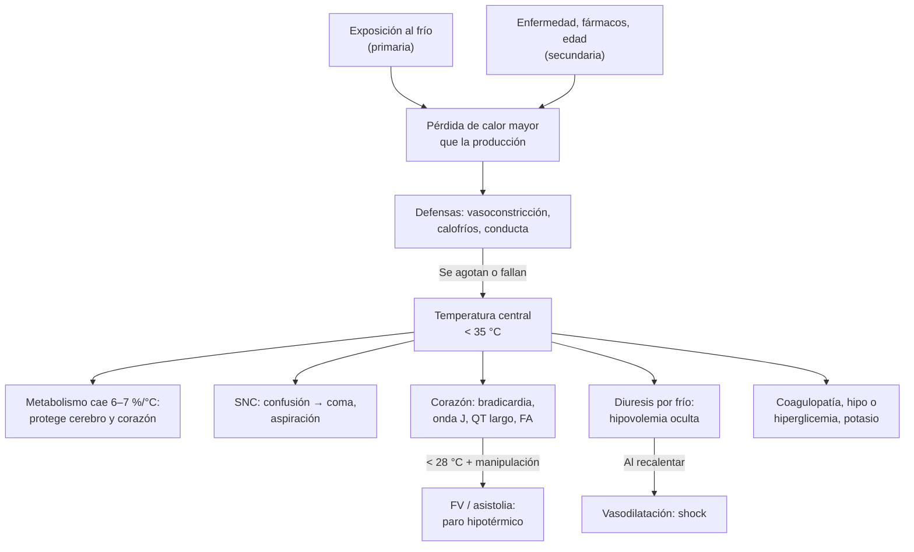

---
tags:
  - Geriatría
  - Urgencia
---

# Hipotermia accidental

**Subespecialidad**
Geriatría · Medicina de urgencia · Medicina intensiva

**Guías principales**
ERC 2025: circunstancias especiales en reanimación (hipotermia accidental) · ICAR MedCom 2021: sistema suizo revisado de etapificación · WMS 2019: evaluación y tratamiento extrahospitalario de la hipotermia · WMS 2024: congelamiento · Consenso SEDAR, SEMICYUC y SEMES 2026 sobre hipotermia accidental

**Otras fuentes**
Hipotermia accidental: actualización 2021 (Paal 2022) · Revisión de Nature Reviews Disease Primers (Darocha 2026) · Registro japonés J-Point (Matsuyama 2018) · Puntajes HOPE y 5A · Código Azul (Ministerio de Desarrollo Social y Familia)

**GES**
No es GES.

**EUNACOM**
1.07.1.011 Hipotermia (específico, completo, completo)

**Revisado**
Octubre 2026

!!! abstract "Resumen en 60 segundos"
    - **Hipotermia accidental**: temperatura **central < 35 °C**, involuntaria.
        - **Primaria**: por exposición al frío (montaña, agua fría, personas en **situación de calle**, intoxicados).
        - **Secundaria**: una enfermedad altera la producción o la regulación del calor (**sepsis**, hipoglicemia, hipotiroidismo, ACV, fármacos). Es la forma que **más crece**: **adultos mayores** con comorbilidad, **dentro de la casa**.
    - **No es solo de la montaña**: en el registro japonés J-Point, la mediana de edad fue **79 años**, el **78 %** ocurrió **en interiores** y la mortalidad hospitalaria fue **24 %**.
    - **Medir la temperatura central** con un termómetro de **rango bajo**: esofágica, vesical o rectal. La axilar, la oral y la infrarroja no sirven.
    - **Etapas** (sistema suizo; si no hay termómetro, según la **conciencia**):
        - **HT I**: alerta, con calofríos, 35–32 °C.
        - **HT II**: confuso o somnoliento, < 32–28 °C.
        - **HT III**: inconsciente con signos vitales, < 28 °C.
        - **HT IV**: sin signos vitales (paro).
    - **Manejo**: evitar más pérdida de calor (ropa seca, aislar), **movilizar horizontal y con suavidad** (riesgo de **FV**), monitor, glicemia, sueros tibios a **38–42 °C** y recalentar según la etapa:
        - **HT I**: pasivo.
        - **HT II–III**: **activo externo** (aire forzado).
        - **Inestable o en paro**: **ECMO venoarterial**.
    - **Paro hipotérmico** (ERC 2025): **RCP continua**, hasta **3 descargas** y retener la **adrenalina** bajo **30 °C**; derivar a un **centro con ECMO**. **Nadie está muerto hasta estar caliente y muerto**: el pronóstico puede ser excelente si el frío llegó **antes** que el paro.
    - **Siempre buscar la causa**: glicemia, infección, tiroides, suprarrenal, tóxicos, trauma.

## Definición

| Concepto | Definición |
|---|---|
| **Hipotermia accidental** | Descenso **involuntario** de la temperatura **central** bajo **35 °C**. Los signos vitales y la conciencia se apagan de forma progresiva |
| **Primaria** | Por **exposición al frío** en una persona con termorregulación normal (ambiente, inmersión, viento, ropa mojada) |
| **Secundaria** | Una **enfermedad**, un fármaco o un trauma alteran la producción de calor o la termorregulación; el frío ambiental puede ser leve |
| **Inducida (terapéutica)** | Hipotermia **intencional** (cirugía cardíaca, control de temperatura tras un paro). **No** es accidental y no se trata aquí |
| **Paro hipotérmico** | Paro cardíaco **causado por la hipotermia**. Es improbable sobre **28–30 °C**: si la temperatura es mayor, buscar otra causa del paro |
| ***Afterdrop*** | La temperatura central **sigue bajando** después del rescate, al volver sangre fría de la periferia hacia el centro |
| **Colapso del rescate** | **Paro** (habitualmente **FV**) durante la extracción, el traslado o la movilización del paciente hipotérmico |

## Epidemiología

- **Mundial**:
    - En **EE. UU.**, la hipotermia primaria causa **≥ 1500 muertes al año**.
    - La incidencia publicada en Europa y Nueva Zelanda va de **0,13 a 6,9 casos por 100 000 habitantes al año**. La mortalidad es de ~2 por 100 000 al año en Escocia y ~5 por 100 000 en Polonia.
    - Hay **pocos datos confiables**: faltan registros en África, **América del Sur** y el sudeste asiático.
- **Quiénes**:
    - **Primaria**: personas que trabajan o hacen deporte al aire libre, **personas en situación de calle**, intoxicados con **alcohol** o drogas, víctimas de **avalanchas**, inmersión o desastres.
    - **Secundaria**: **adultos mayores multimórbidos**, a menudo **solos y en su casa**. Es la forma que más aumenta con el envejecimiento.
- **Registro J-Point** (Japón, 12 hospitales, 2011–2016):
    - **537** pacientes con mediana de **79 años**; el **80 %** tenía **≥ 65 años**.
    - El **77,8 %** ocurrió **en interiores**; la condición asociada más frecuente fue una **enfermedad médica aguda**.
    - **Mortalidad hospitalaria 24,4 %**, sin diferencia independiente según la temperatura (leve 21,9 %, grave 31,4 %): **pesan más la edad, la comorbilidad y la causa**.
- **Trauma**: la hipotermia es frecuente en el politraumatizado (más del 90 % de los atrapados en vehículos en una serie) y empeora la **coagulopatía** y la mortalidad.
- **El frío mata más que el calor**: en 13 países (74 millones de muertes), el **7,3 %** de la mortalidad se atribuyó al **frío** y el **0,4 %** al **calor**. Casi toda esa carga es **cardiovascular y respiratoria**, no hipotermia propiamente tal.

!!! chile "Datos nacionales"
    - **No hay** un registro nacional publicado de la incidencia de hipotermia accidental. Los grupos de riesgo son los mismos que en otros países: personas en situación de calle, adultos mayores solos, intoxicados, y accidentes en la **montaña** o en **agua fría**, sobre todo en **invierno**.
    - **Personas en situación de calle**: el **Código Azul** del Ministerio de Desarrollo Social y Familia (desde **2018**, parte del Plan Protege Calle) refuerza **albergues**, rutas móviles y traslados.
        - Se activa cuando el pronóstico es de **≤ 0 °C**, o de **≤ 5 °C con lluvia**.
        - Se puede avisar de una persona en riesgo al **Fono Calle 800 104 777** (opción 0).
    - **Adultos mayores en su casa**: viviendas frías, calefacción insuficiente o insegura y **caídas** con muchas horas en el suelo. Un caso chileno publicado: mujer de **77 años** con compromiso de conciencia, hipotensión, bradicardia y alteraciones ECG típicas, sin coma mixedematoso, infección ni lesión neurológica; se recuperó tras 22 días.
    - La calefacción con **braseros** o estufas en espacios cerrados suma el riesgo de **intoxicación por monóxido de carbono** ([ver](../respiratorio/intoxicacion-por-co-ahogamiento-y-cuerpo-extrano.md)).

## Etiología

| Mecanismo | Causas |
|---|---|
| **Mayor pérdida de calor** | **Exposición** al frío, **viento**, **ropa mojada**, **inmersión en agua fría**; **alcohol** y fármacos **vasodilatadores**; **quemaduras** y dermatosis extensas; **sueros fríos** y transfusiones masivas; parto de urgencia (recién nacido) |
| **Menor producción de calor** | **Edad avanzada**, **desnutrición**, **hipoglicemia**, **hipotiroidismo** (coma mixedematoso), **insuficiencia suprarrenal**, hipopituitarismo, cetoacidosis, **inmovilidad**, agotamiento físico, menor masa muscular (**sarcopenia**) |
| **Falla de la termorregulación central** | **ACV**, **TEC**, tumores hipotalámicos, **Parkinson**, **encefalopatía de Wernicke**, anorexia nerviosa; **fármacos**: sedantes, benzodiacepinas, **antipsicóticos**, opioides, anestésicos, **alcohol** |
| **Falla de la termorregulación periférica** | **Sección medular** aguda, **neuropatía** (diabética), fármacos que bloquean la vasoconstricción o los calofríos |
| **Otras asociadas** | **Sepsis** (la hipotermia es de **peor pronóstico** que la fiebre), politrauma, **shock**, carcinomatosis, enfermedad cardiopulmonar grave |

!!! perla "El adulto mayor se enfría más y se defiende peor"
    - Percibe **menos el frío** y tiene **menos calofríos** y menos **vasoconstricción**.
    - Tiene **menos músculo** (produce menos calor) y suele tomar fármacos que alteran la termorregulación.
    - Una **caída** con muchas horas en el suelo, una **demencia** o vivir **solo** en una casa fría bastan para una hipotermia, incluso sin temperaturas extremas.

## Fisiopatología

- **Pérdida de calor**: por **radiación**, **conducción** (el contacto con el suelo o el agua; el agua conduce el calor mucho mejor que el aire), **convección** (viento), **evaporación** (ropa mojada, sudor) y la respiración.
- **Defensas** (control del **hipotálamo**, figura 1):
    - **Vasoconstricción cutánea**: reduce la pérdida de calor.
    - **Calofríos**: aumentan la producción basal de calor **hasta ~5 veces**. Consumen glucosa y se agotan.
    - **Termogénesis sin calofríos**: grasa parda, mediante la proteína desacopladora **UCP1**.
    - **Conducta**: abrigarse, buscar refugio. Falla si hay demencia, intoxicación o inmovilidad.
- **Al bajar la temperatura**:
    - El **metabolismo cae ~6–7 % por cada grado**. Así se **protegen** el cerebro y el corazón de la hipoxia: un paro **después** de enfriarse puede tener buen pronóstico neurológico.
    - **Corazón**:
        - Primero hay taquicardia; luego **bradicardia** (no responde a la atropina) y se prolongan el PR, el QRS y el **QT**.
        - Aparece la **onda J de Osborn** y la **FA**.
        - Bajo **28 °C**, el miocardio es **irritable**: la manipulación desencadena **FV**. Bajo ~24 °C llega la asistolia.
    - **Diuresis por frío**: la vasoconstricción centraliza el volumen y la orina aumenta. Se suma la salida de plasma al intersticio: **hipovolemia** oculta. Al recalentar, la **vasodilatación** puede causar **shock**.
    - **SNC**: depresión progresiva (torpeza, confusión, coma), con reflejos protectores abolidos (**aspiración**).
    - **Coagulación**: las enzimas funcionan lento y las plaquetas fallan. **Las pruebas de coagulación salen normales**, porque el laboratorio las corre a 37 °C.
    - **Metabolismo**: hiperglicemia inicial (menos insulina y resistencia) o **hipoglicemia** (agotamiento, alcohol, desnutrición). El potasio se desplaza.
    - **Fármacos**: el hígado los metaboliza lento y se **acumulan**.
- ***Afterdrop* y colapso del rescate**: al mover al paciente o hacerlo caminar, vuelve sangre fría de las extremidades y aumentan las catecolaminas. La temperatura central sigue bajando y el miocardio frío puede caer en **FV**.

<figure markdown>
![Ilustración de la termorregulación frente al frío. Al centro, la cabeza con el hipotálamo, regulador de la temperatura a 37 °C. Desde él, cuatro respuestas: arriba a la izquierda, vasoconstricción cutánea termorreguladora (capilares de la piel); arriba a la derecha, calofríos musculares (vía desde el cerebro y la médula hasta el músculo, con un registro de actividad eléctrica); abajo a la izquierda, termogénesis sin calofríos en la grasa parda del cuello y del dorso, con lipólisis de triglicéridos y la proteína desacopladora UCP1 en la mitocondria que produce calor; abajo a la derecha, respuesta conductual: una persona se abriga con una manta y otra hace ejercicio](../assets/figuras/hipotermia/termorregulacion-paal-2022.jpg){ loading=lazy }
<figcaption>Figura 1. Vías de la termorregulación frente al frío: vasoconstricción cutánea, calofríos, termogénesis sin calofríos (grasa parda, UCP1; NA: noradrenalina; TG: triglicéridos) y conducta. Los calofríos pueden aumentar la producción basal de calor hasta ~5 veces. Fuente: Paal P, Pasquier M, Darocha T, et al. Accidental hypothermia: 2021 update. <em>Int J Environ Res Public Health.</em> 2022;19(1):501, figura 1. Licencia <a href="https://creativecommons.org/licenses/by/4.0/">CC BY 4.0</a>.</figcaption>
</figure>

*Figura 2. Fisiopatología de la hipotermia accidental. Esquema propio.*

## Clasificación

| Etapa (sistema suizo) | Clínica | Temperatura central estimada |
|---|---|---|
| **HT I (leve)** | **Consciente**, con calofríos | **35–32 °C** |
| **HT II (moderada)** | **Conciencia alterada**; calofríos presentes o no | **< 32–28 °C** |
| **HT III (grave)** | **Inconsciente**, con signos vitales | **< 28 °C** |
| **HT IV (grave)** | **Muerte aparente**: sin signos vitales | Variable (clásicamente **< 24 °C**) |

- **Sistema suizo revisado** (ICAR MedCom 2021, adoptado por el ERC 2025): si no se puede medir la temperatura, se etapifica por la **conciencia (AVPU)** y se estima el **riesgo de paro**:
    - **Alerta** (Glasgow 15): riesgo bajo.
    - **Responde a la voz**, incluido el confuso (Glasgow 9–14): riesgo moderado.
    - **Responde al dolor o no responde** (Glasgow < 9) con signos vitales: riesgo alto.
    - **No responde y sin signos vitales**: paro hipotérmico.
- **Los calofríos** ya no definen la etapa, pero si están presentes la temperatura suele ser **> 30 °C** (paro improbable).
- **Cuidado**: si otra causa deprime la conciencia (alcohol, sedantes, **TEC**, hipoglicemia, sepsis, asfixia), la etapa **sobreestima** la hipotermia. Un paciente "alerta" pero con **bradicardia, bradipnea o hipotensión** puede estar pasando a una etapa de mayor riesgo.
- Otra forma de clasificar: por **temperatura** medida (leve **35–32**, moderada **32–28**, grave **< 28 °C**; algunos agregan profunda < 24 °C). En la práctica se clasifica también por la **causa**, **primaria o secundaria**: la secundaria pesa más en el pronóstico.

<figure markdown>
![Tabla de cuatro columnas, de verde a negro, para las etapas de la hipotermia. HT I leve: alerta, Glasgow 15; 35 a 32 grados; calofríos intensos, taquicardia, taquipnea, torpeza, disartria, diuresis por frío; riesgo de paro bajo; recalentamiento pasivo con ropa seca, aislamiento, ambiente cálido y bebidas tibias dulces si traga bien; observar y dar de alta si se recalienta y no hay causa secundaria. HT II moderada: responde a la voz, confuso, Glasgow 9 a 14; menos de 32 a 28 grados; calofríos disminuidos o ausentes, bradicardia, fibrilación auricular, onda J de Osborn, apatía, hiporreflexia; riesgo moderado; recalentamiento activo externo con aire forzado y mantas térmicas, sueros a 38 a 42 grados, horizontal y con suavidad; hospitalizar con monitorización. HT III grave: responde al dolor o no responde, Glasgow menor de 9, con signos vitales; menos de 28 grados; coma, rigidez, midriasis, bradipnea, hipotensión, bradicardia extrema, fibrilación ventricular con la manipulación; riesgo alto; recalentamiento activo externo con o sin interno, monitor y parches de desfibrilación, ECMO en espera; centro con ECMO si presión sistólica menor de 90, frecuencia menor de 45, arritmia ventricular o temperatura menor de 30. HT IV paro: no responde y sin signos vitales, buscarlos 1 minuto; temperatura variable, clásicamente menor de 24; fibrilación ventricular, asistolia o actividad eléctrica sin pulso, la rigidez y las pupilas fijas no confirman la muerte; RCP continua y ECMO venoarterial, y si no hay ECMO en unas 6 horas recalentar sin circulación extracorpórea; directo a un centro con ECMO y decidir con el puntaje HOPE. Notas al pie sobre la medición de la temperatura central, los calofríos y las modificaciones del paro bajo 30 grados](../assets/figuras/hipotermia/etapas-y-manejo-hipotermia.svg){ loading=lazy }
<figcaption>Figura 3. Etapas de la hipotermia accidental (sistema suizo y sistema suizo revisado por conciencia), riesgo de paro, recalentamiento y destino. Esquema propio basado en ERC 2025 (Lott 2025), ICAR MedCom (Musi 2021) y Paal 2022.</figcaption>
</figure>

## Clínica

- **Contexto**: persona encontrada **a la intemperie**, en el agua o **en el suelo de su casa**; adulto mayor **confuso** en invierno; intoxicado; politraumatizado.
- **El tronco frío al tacto** apoya la sospecha.
- **Por etapa**:
    - **Leve (35–32 °C)**: **calofríos intensos**, piel pálida y fría, **taquicardia**, taquipnea, alza de la presión. Hay **torpeza**, **disartria**, **ataxia**, apatía, mal juicio y **diuresis por frío**.
    - **Moderada (32–28 °C)**: los **calofríos disminuyen o desaparecen**. Hay **confusión**, somnolencia o estupor, **bradicardia**, **FA** y otras arritmias, **hipoventilación**, **hiporreflexia** y midriasis.
    - **Grave (< 28 °C)**: **coma**, **rigidez** muscular, **pupilas dilatadas y poco reactivas**, respiración y pulso **mínimos** (difíciles de detectar), hipotensión, **edema**. Hay riesgo de **FV** con cualquier manipulación.
    - **Bajo ~24 °C**: puede haber **paro** (FV o asistolia), aunque algunos conservan signos vitales mínimos.
- **Conductas paradójicas**: el **desvestimiento paradójico** (la persona se quita la ropa por una falsa sensación de calor) y el ocultamiento terminal en espacios estrechos. Pueden **confundirse con una agresión** o un abuso.
- **En el adulto mayor** es frecuente la presentación **atípica**: **delirium**, caída, somnolencia, **sin calofríos**. La hipotermia **se pasa por alto** si se usa un termómetro común.
- **Lesiones locales por frío** asociadas: **congelamiento** en los dedos, la nariz y las orejas; **pie de trinchera**; **perniosis** (sabañones). Ver Complicaciones.

!!! alarma "Signos de alto riesgo de paro: derivar a un centro con ECMO (ERC 2025)"
    - **Temperatura central < 30 °C**.
    - **Presión sistólica < 90 mmHg**.
    - **Frecuencia cardíaca < 45 lpm**.
    - **Arritmia ventricular**.
    - **Conciencia** que empeora, **acidosis** que aumenta o temperatura que **no sube** con el recalentamiento externo.
    - En el adulto mayor o con comorbilidad cardíaca, el paro puede ocurrir **bajo 32 °C**.

## Diagnóstico

!!! guia "Diagnóstico y etapificación (ERC 2025; Paal 2022)"
    1. **Sospechar** ante exposición al frío, un paciente encontrado en el suelo, compromiso de conciencia en invierno, intoxicación o trauma.
    2. **Medir la temperatura central** con un termómetro de **rango bajo**. Los termómetros clínicos comunes **no leen bajo ~34 °C**.
        - **Esofágica** (tercio inferior): de elección en el paciente **intubado**.
        - **Vesical** (sonda con termistor): útil en el hospital.
        - **Rectal**: aceptable, con **retraso** durante el enfriamiento y el recalentamiento.
        - **Epitimpánica** con termistor: en terreno, si el conducto está libre.
        - **No sirven**: axilar, oral, frontal ni **timpánica infrarroja**.
    3. Si no hay termómetro, **etapificar por conciencia** (sistema suizo revisado).
    4. **Buscar signos vitales hasta 1 minuto** en el inconsciente: pulso central, respiración, **ECG**, **capnografía** (cualquier CO₂ espirado indica circulación) y **ecografía**.
    5. **Buscar la causa secundaria** en todos: glicemia capilar **de inmediato**, infección, tóxicos, tiroides, suprarrenal, trauma, ACV.

- **Diagnóstico de muerte**: la **rigidez**, las **pupilas fijas y dilatadas**, la asistolia o un ETCO₂ bajo **no** confirman la muerte en la hipotermia.
    - No se reanima solo si hay **lesiones incompatibles con la vida** (decapitación, sección del tronco), **descomposición**, el **cuerpo congelado** (el tórax no se puede comprimir), una **orden de no reanimar** válida o **peligro** para los rescatadores.
    - En una avalancha, tampoco si el sepultamiento duró **> 60 min** con **asistolia** y la vía aérea obstruida.

## Laboratorio

| Examen | Qué buscar |
|---|---|
| **Glicemia capilar** | **Hipoglicemia** (causa y consecuencia) o hiperglicemia de estrés. **Primer examen** |
| **Gases arteriales** | Acidosis, hipoxemia. Interpretar los valores **no corregidos por temperatura** (medidos a 37 °C, estrategia α-stat) |
| **Electrolitos** | **Potasio**: suele estar **bajo** en la hipotermia moderada; muy **alto** sugiere **muerte celular o asfixia** y es de mal pronóstico (entra en el puntaje HOPE). Sodio, magnesio, fósforo |
| **Lactato** | Si **sube** durante el recalentamiento, indica falla del recalentamiento o hipoperfusión |
| **Creatinina, BUN, CK, orina** | **LRA**, **rabdomiólisis** (tiempo en el suelo), mioglobinuria |
| **Hemograma** | **Hemoconcentración** (hematocrito alto por hipovolemia), **plaquetas bajas** (secuestro), leucocitosis o leucopenia (sepsis) |
| **Coagulación** | TP y TTPA pueden salir **normales** pese a una coagulopatía clínica (se miden a 37 °C). Fibrinógeno y dímero D si se sospecha CID |
| **Lipasa, pruebas hepáticas** | **Pancreatitis** y daño hepático, frecuentes en la hipotermia moderada a grave |
| **Troponina** | Daño miocárdico; síndrome coronario como causa de caída o colapso |
| **Etanol y toxicológico** | **Alcohol**, benzodiacepinas, opioides, antipsicóticos |
| **TSH, T4 libre, cortisol** | Si se sospecha **coma mixedematoso** o **insuficiencia suprarrenal** (y siempre que el paciente **no se recaliente**) |
| **Hemocultivos, orina completa y urocultivo** | **Sepsis**, sobre todo en el adulto mayor con hipotermia secundaria |
| **ECG** | Ver abajo |

**ECG** (figura 4):

- **Bradicardia sinusal**; prolongación del **PR**, del **QRS** y del **QT**.
- **Onda J de Osborn**: una muesca al final del QRS, más visible en las derivaciones inferiores y precordiales izquierdas. Aumenta a menor temperatura y **desaparece al recalentar**.
- **FA** de respuesta lenta.
- **Artefacto por calofríos**, que puede simular una arritmia.
- **FV** o TV sin pulso, sobre todo bajo 28 °C.
- En el **registro J-Point** (463 ECG): onda de Osborn en el **53 %**, **QT largo** en el **49 %**, **FA** en el **21 %** y **FV/TV sin pulso** en el **2,4 %**. Todas fueron más frecuentes a mayor gravedad.

<figure markdown>
{ loading=lazy }
<figcaption>Figura 4. ECG de 12 derivaciones al ingreso con temperatura central de 28,1 °C. Las ondas J de Osborn (flechas) son más visibles en las derivaciones inferiores y precordiales izquierdas, y aumentan con las extrasístoles auriculares. Desaparecieron al recalentar. Fuente: Takahashi K, Morioka H, Uemura S, Okura T. Accidental hypothermia-induced J wave coupled with giant R wave augmented by premature atrial contraction: a case report. <em>Cureus.</em> 2024;16(5):e60644, figura 1. Licencia <a href="https://creativecommons.org/licenses/by/4.0/">CC BY 4.0</a>.</figcaption>
</figure>

## Imágenes

- **Radiografía de tórax**: **aspiración**, neumonía, edema pulmonar.
- **Ecografía al lado de la cama (POCUS)**:
    - Actividad cardíaca en el paro aparente y contractilidad.
    - Volemia (vena cava).
    - Líquido libre en el trauma.
- **TC de cerebro** si hubo **trauma o caída**, si hay signos focales o si el **compromiso de conciencia es desproporcionado** para la temperatura. Un coma con más de 32 °C **no** se explica por la hipotermia.
- **TC de columna, tórax o abdomen** según el mecanismo (politrauma, caída de altura). En el adulto mayor encontrado en el suelo, buscar la **fractura de cadera**.

## Diagnóstico diferencial

| Diagnóstico | Claves |
|---|---|
| **Sepsis con hipotermia** | Foco infeccioso, leucocitosis o leucopenia, lactato alto, **no se recalienta**. Antibióticos precoces ([ver](../infectologia/sepsis-y-shock-septico.md)) |
| **Hipoglicemia** | Glicemia capilar baja; alcohol, desnutrición, insulina o sulfonilureas ([ver](../endocrinologia/hipoglicemia.md)) |
| **Coma mixedematoso** | Adulta mayor, **hiponatremia**, **hipoventilación**, bradicardia, piel seca, edema, antecedente tiroideo; **TSH alta** ([ver](../endocrinologia/hipotiroidismo-e-hipertiroidismo.md)) |
| **Insuficiencia suprarrenal o hipopituitarismo** | Hipotensión que no responde, **hiponatremia**, **hiperkalemia** (suprarrenal primaria), uso crónico de corticoides ([ver](../endocrinologia/insuficiencia-suprarrenal.md)) |
| **Intoxicaciones** | **Alcohol**, sedantes, **opioides** (miosis), antipsicóticos; **monóxido de carbono** (calefacción en casa, varios afectados) |
| **ACV, TEC, hemorragia intracraneana** | Signos focales, trauma, coma desproporcionado; TC de cerebro |
| **Encefalopatía de Wernicke** | Alcohol o desnutrición, oftalmoplejia, ataxia; la hipotermia es un signo posible ([ver](../neurologia/abstinencia-alcoholica-y-wernicke.md)) |
| **Muerte** | Solo con signos **inequívocos** (lesiones incompatibles, descomposición, cuerpo congelado). La rigidez y las pupilas fijas **no** bastan |
| **Error de medición** | Termómetro axilar, oral o infrarrojo en un ambiente frío; confirmar con una temperatura **central** |

## Tratamiento

!!! guia "Cadena de supervivencia de la hipotermia (ERC 2025; WMS 2019; Paal 2022)"
    1. **Evitar más pérdida de calor**:
        - Sacar del frío y **retirar la ropa mojada**, cortándola si es necesario. Hacerlo en un lugar protegido si hay ropa seca disponible.
        - **Aislar**: mantas y una **barrera de vapor** (lámina plástica o manta térmica). Cubrir la cabeza y el cuello.
        - Las compresas calientes van en el **tronco** (tórax, axilas, espalda), **nunca** directo sobre la piel (quemaduras).
    2. **Movilizar con suavidad y en posición horizontal**: evita el **colapso del rescate**.
        - No frotar las extremidades.
        - El paciente encontrado acostado **no debe caminar** hasta que haya comido y tiritado al menos **~30 min**.
    3. **Monitorizar**: ECG con **parches de desfibrilación** (reducen el artefacto de los calofríos), SpO₂ (puede fallar por vasoconstricción) y presión.
    4. **Vía aérea y ventilación**:
        - **Oxígeno** para SpO₂ **> 94 %**.
        - **Intubar** si está indicado: el riesgo de desencadenar una FV es **mínimo** frente al beneficio. Puede haber **trismo** y rigidez.
        - El ETCO₂ **no es confiable**: ventilar con parámetros por peso y evitar la hipoventilación.
    5. **Acceso venoso** periférico o **intraóseo**.
        - Sueros isotónicos **tibios a 38–42 °C** en **bolos** guiados por los signos vitales.
        - Calientan poco, pero evitan enfriar más.
        - Evitar que la guía de un catéter central entre al corazón (puede gatillar arritmias).
    6. **Glicemia** y **buscar la causa** (ver Laboratorio).
    7. **Recalentar según la etapa** (tabla) y **elegir el hospital**: si hay riesgo de paro o paro, ir a un **centro con ECMO**.

| Etapa | Recalentamiento | Velocidad aproximada |
|---|---|---|
| **HT I** | **Pasivo**: ambiente cálido, ropa seca, mantas. **Bebidas tibias azucaradas** si está alerta y traga bien. Moverse activamente ayuda | **0,5–4 °C/h** según la reserva metabólica |
| **HT II–III con circulación estable** | **Activo externo**: **aire forzado** (manta térmica de aire caliente), mantas o almohadillas térmicas, sueros tibios. Monitor y **ECMO en espera** si hay riesgo | **0,5–4 °C/h** |
| **Falla del recalentamiento o inestabilidad** | **Activo interno mínimamente invasivo**: catéter intravascular de temperatura, **terapia de reemplazo renal continua** o hemodiálisis (requieren presión adecuada) | **~0,5–3 °C/h** adicionales |
| **Inestabilidad cardiovascular refractaria o paro** | **ECMO venoarterial** (preferido sobre la circulación extracorpórea de cirugía cardíaca) | **~4–10 °C/h**; objetivo **≤ 5 °C/h** |
| **Sin acceso a ECMO en ~6 h** | Recalentamiento **no extracorpóreo**: lavado **peritoneal** o **torácico** con suero tibio más medidas externas | Variable |

- **No recomendados** para recalentar: el lavado **vesical** y el **gástrico** (poco efectivos, con riesgo de aspiración).
- **Falla del recalentamiento**: la temperatura **no sube o baja**, el **lactato sube**, empeora la conciencia, cae la presión o aparecen **arritmias ventriculares**.
    - Pasar a un método **interno**.
    - **Buscar una causa secundaria**: sepsis, hipotiroidismo, insuficiencia suprarrenal, hipoglicemia, tóxicos.
- **Bradicardia, hipotensión y FA**: responden al **recalentamiento**; no requieren tratamiento específico salvo inestabilidad. La **FA** suele revertir sola.
- **Volumen**:
    - El paciente está **hipovolémico** (diuresis por frío, fuga capilar). Al recalentar, la **vasodilatación** puede causar shock: reponer con cautela, guiado por la perfusión.
    - **Vasopresores** si la hipotensión persiste pese al volumen.
- **Glicemia**:
    - Tratar la **hipoglicemia**.
    - No corregir **agresivamente** la hiperglicemia: la insulina actúa poco en el frío y, al recalentar, puede causar hipoglicemia.
    - En el alcohólico o desnutrido, **tiamina antes de la glucosa**.
- **Antibióticos empíricos** si se sospecha **sepsis** (adulto mayor con hipotermia secundaria, foco o falla del recalentamiento).
- **Hidrocortisona** si se sospecha **insuficiencia suprarrenal** o **coma mixedematoso**, o si el paciente no se recalienta sin otra causa. En el coma mixedematoso, la hidrocortisona va **antes** de la levotiroxina.
- **Potasio**: corregir con cuidado. Se desplaza durante el recalentamiento; controlarlo de forma seriada.
- **Prevenir las complicaciones del paciente encontrado en el suelo**: rabdomiólisis, **lesiones por presión**, fractura de cadera, aspiración ([ver caídas](caidas-hipotension-ortostatica-y-fractura-de-cadera.md)).

!!! guia "Paro cardíaco hipotérmico (ERC 2025)"
    - **Buscar signos vitales hasta 1 minuto** (clínica, ECG, ecografía).
    - **RCP continua**, con la frecuencia y la profundidad estándar. Usar un dispositivo de **compresión mecánica** si el traslado es largo o difícil.
    - **RCP diferida o intermitente** bajo **28 °C**, solo si la RCP continua **no es posible** (rescate peligroso o técnicamente difícil):
        - Alternar **≥ 5 min de RCP** con **≤ 5 min sin RCP**.
        - Bajo **20 °C**, alternar **≥ 5 min de RCP** con **≤ 10 min sin RCP**.
    - **Desfibrilación**: si la FV persiste tras **3 descargas**, diferir las siguientes hasta que la temperatura sea **> 30 °C**.
    - **Adrenalina**:
        - **< 30 °C**: se acumula y puede dañar. Es razonable **retenerla** (y los demás fármacos de la RCP) hasta llegar a **30 °C**. Si el **ECMO se demora**, puede darse **1 mg una vez** para intentar el retorno de la circulación.
        - **30–35 °C**: duplicar el intervalo (**cada 6–10 min**).
        - **≥ 35 °C**: protocolo estándar.
    - **Amiodarona**: su eficacia se reduce en la hipotermia grave. Las guías británicas 2025 permiten **una carga de 300 mg** si hay un ritmo desfibrilable y difieren más dosis hasta superar 30 °C.
    - **Trasladar directo a un centro con ECMO** y recalentar con **ECMO venoarterial**. Si no se puede llegar en un tiempo razonable (**~6 h**), recalentar sin circulación extracorpórea.
    - **Decidir el ECMO con el puntaje HOPE** (ver Pronóstico): con **≥ 10 %** de probabilidad de sobrevida, se recalienta. La **asistolia** y el paro **no presenciado** **no** contraindican el ECMO.
    - **No aplicar** los criterios de suspensión del paro normotérmico: se negaría un tratamiento con buen pronóstico posible.
    - Tras el retorno de la circulación: control de la temperatura según el protocolo local y **evitar la hipertermia**.

!!! dosis "Dosis y medidas de referencia (adulto)"
    - **Sueros isotónicos** (suero fisiológico) **tibios a 38–42 °C**, en bolos guiados por los signos vitales. Calentados para no enfriar; por sí solos calientan poco.
    - **Glucosa** si hay hipoglicemia: **10–25 g EV**, por ejemplo suero glucosado al 10 % 100–250 mL. En Chile se usan ampollas de glucosa al 30 % (20 mL = 6 g). Ver [hipoglicemia](../endocrinologia/hipoglicemia.md).
    - **Tiamina antes de la glucosa** en el alcohólico o desnutrido: **100–300 mg/día** de prevención; **200 mg EV cada 8 h** si se sospecha Wernicke.
    - **Hidrocortisona 100 mg EV cada 8 h** si se sospecha insuficiencia suprarrenal o coma mixedematoso (**antes** de la levotiroxina).
    - **Adrenalina 1 mg EV/IO** en el paro:
        - **< 30 °C**: retener (1 mg una vez si el ECMO se demora).
        - **30–35 °C**: cada **6–10 min**.
        - **≥ 35 °C**: cada 3–5 min.
    - **Desfibrilación**: máximo **3 descargas** bajo 30 °C.
    - **Congelamiento**: recalentar en **agua a 37–39 °C** por **~30 min**, hasta que el tejido esté blando. **Ibuprofeno 12 mg/kg/día** dividido cada 12 h (WMS 2024).

## Complicaciones

| Complicación | Comentario |
|---|---|
| **FV y paro** | Bajo **28 °C**, gatillados por la **movilización brusca**, el *afterdrop*, procedimientos invasivos o la hipoxia |
| ***Afterdrop* y colapso del rescate** | Duplica el riesgo de muerte en la hipotermia grave. Prevenir con **manejo horizontal y suave** |
| **Shock del recalentamiento** | **Vasodilatación** sobre una hipovolemia previa: hipotensión al recalentar |
| **Aspiración y neumonía** | Por depresión de conciencia y del reflejo tusígeno; **edema pulmonar** y **SDRA**, sobre todo tras el ECMO |
| **LRA y rabdomiólisis** | Hipovolemia, mioglobina; pacientes encontrados en el suelo ([ver](../nefrologia/lesion-renal-aguda.md)) |
| **Coagulopatía y CID** | Sangrado en el trauma; las pruebas a 37 °C la subestiman |
| **Trastornos electrolíticos y de la glicemia** | Hipo e hiperkalemia ([ver](../nefrologia/trastornos-del-potasio.md)), hipoglicemia de rebote al recalentar si se usó insulina |
| **Pancreatitis, íleo, úlceras de estrés** | Frecuentes en la hipotermia moderada a grave |
| **Infecciones** | Neumonía, sepsis; la sepsis también puede ser la **causa** |
| **Lesiones por presión** | Tiempo prolongado en el suelo o inmóvil ([ver](inmovilidad-y-ulceras-por-presion.md)) |
| **Daño neurológico** | Por la **hipoxia** cuando la asfixia o el paro ocurrieron **antes** de enfriarse |
| **Lesiones locales por frío** | Congelamiento, pie de trinchera y perniosis (ver abajo) |

**Lesiones locales por frío**:

| Lesión | Mecanismo y clínica | Manejo |
|---|---|---|
| **Congelamiento** (*frostbite*) | **Tejido congelado** (cristales de hielo), sobre todo en dedos, orejas, nariz. **Superficial**: palidez, flictenas claras; **profundo**: flictenas hemorrágicas, piel dura y gris, luego **necrosis** negra | Tratar **primero la hipotermia**. **No recalentar si puede volver a congelarse** (el recongelamiento empeora el daño). Recalentar en **agua a 37–39 °C** (~30 min, doloroso: analgesia). **Ibuprofeno**. Aspirar las flictenas **claras** y dejar intactas las **hemorrágicas**; aloe vera tópico. **Profilaxis antitetánica**. Si es grave: **tPA** antes de 24 h o **iloprost** antes de 72 h en centros con experiencia. **Diferir la amputación** hasta que se delimite la necrosis |
| **Pie de trinchera** (lesión no congelante) | Exposición prolongada a **frío húmedo sobre 0 °C** (botas mojadas por días). Pie frío, pálido, entumecido; luego hiperémico, doloroso, con edema | Secar, recalentar **lentamente**, elevar, analgesia (dolor neuropático) |
| **Perniosis** (sabañones) | Inflamación por frío **húmedo no congelante**. Lesiones rojo-violáceas, pruriginosas o dolorosas en dedos | Abrigo, evitar el frío; habitualmente autolimitada |

## Pronóstico y seguimiento

- **Depende más de la causa y de la comorbilidad** que de la temperatura: la mortalidad hospitalaria del registro J-Point fue de **24,4 %**. Con paro, la mortalidad hospitalaria llega al **50 %**.
- **Paro hipotérmico**: el pronóstico puede ser **excelente** si la hipotermia ocurrió **antes** que la hipoxia y el paro.
    - **Presenciado** (n = 214): sobrevida al alta **73 %**, el 89 % con buen resultado neurológico.
    - **No presenciado** (n = 221): sobrevida **27 %**, el 83 % con buen resultado neurológico. El **48 %** de los sobrevivientes estaba en **asistolia** al inicio.
    - La menor temperatura con sobrevida publicada es de **11,8 °C**.
- **Peor pronóstico**:
    - **Asfixia** antes del enfriamiento (avalancha con vía aérea obstruida, sumersión).
    - **Potasio muy alto**.
    - Paro **sin enfriamiento previo** (temperatura > 30 °C en el paro).
    - **Trauma mayor**.
    - **Comorbilidad** grave y la hipotermia **secundaria**.
- **Puntaje HOPE**: estima la probabilidad de sobrevivir al recalentamiento con ECMO en el paro hipotérmico. **Supera al potasio solo**.
    - Usa **seis variables**: edad, sexo, mecanismo (asfixia o no), duración de la RCP, **potasio** y **temperatura**. Se calcula en [hypothermiascore.org](https://www.hypothermiascore.org).
    - Con **≥ 10 %**, se recalienta con ECMO.
    - Si no se puede calcular en una víctima de avalancha, se usa la combinación de **potasio < 7 mmol/L** y temperatura **< 30 °C** para indicar el ECMO.
    - No se usa en niños.
- **Puntaje 5A** (registro J-Point): predice la mortalidad hospitalaria en adultos mayores con hipotermia con o sin paro. Usa la **edad**, la **funcionalidad** (actividades de la vida diaria), el **paro o casi paro**, la **acidemia** y la **albúmina**.
- **Seguimiento y prevención** (sobre todo en el adulto mayor):
    - **Tratar la causa**: infección, hipotiroidismo, diabetes, alcohol, desnutrición.
    - **Revisar los fármacos**: sedantes, antipsicóticos, hipoglicemiantes.
    - **Evaluar la seguridad del hogar**:
        - La OMS sugiere **≥ 18 °C** en interiores en invierno, y más para los grupos vulnerables.
        - Calefacción **segura** (riesgo de CO).
        - Ropa por capas.
        - Red de apoyo y **teleasistencia** si vive solo.
    - **Prevenir las caídas** y el tiempo prolongado en el suelo.
    - En personas en **situación de calle**: coordinar con la red social (**Código Azul**, albergues).
    - En el congelamiento: control de las secuelas (**sensibilidad al frío**, dolor neuropático, amputaciones tardías).

## Perlas para el internado

!!! perla "Para recordar en la sala"
    - **Termómetro común = falso normal**: si el paciente está frío, confuso o bradicárdico, pide una **temperatura central** (rectal o vesical) con termómetro de **rango bajo**.
    - **Hipotermia en un adulto mayor = buscar la causa**: **sepsis**, **hipoglicemia**, **hipotiroidismo**, insuficiencia suprarrenal, fármacos, ACV o una caída con horas en el suelo.
    - **Manipula como si fuera de cristal**: horizontal, sin movimientos bruscos ni hacerlo caminar. La FV aparece al moverlo.
    - **El calor va al tronco**, no a las extremidades.
    - **Los sueros siempre tibios** (38–42 °C): calientan poco, pero un suero frío enfría más.
    - **La bradicardia y la FA se tratan recalentando**: no corras con atropina ni con cardioversión.
    - **Onda J de Osborn** + bradicardia + QT largo = hipotermia hasta demostrar lo contrario. Desaparece al recalentar.
    - **"Nadie está muerto hasta estar caliente y muerto"**: la rigidez, las pupilas fijas y la asistolia no confirman la muerte. Pero sí importa si hubo **asfixia antes** del frío (HOPE).
    - **Paro < 30 °C**: 3 descargas como máximo y retener la adrenalina hasta 30 °C; luego, adrenalina cada 6–10 min.
    - **Si no se recalienta, algo más pasa**: sepsis, hipotiroidismo, insuficiencia suprarrenal o un recalentamiento insuficiente.
    - **Persona en situación de calle con frío**: además de tratarla, activa la red social (Fono Calle **800 104 777**, opción 0).

## Preguntas de repaso

??? repaso "1. Hombre de 45 años en situación de calle, encontrado en julio en una plaza de Santiago tras una noche de helada. Responde a la voz, confuso, sin calofríos. Temperatura rectal 30,5 °C, FC 48 lpm, PA 96/60 mmHg. El ECG muestra bradicardia sinusal y una muesca al final del QRS. ¿Etapa y manejo?"
    - **Hipotermia moderada (HT II)**: conciencia alterada y < 32–28 °C. La muesca es la **onda J de Osborn**.
    - **Manejo**:
        1. Retirar la ropa mojada, **aislar** y **movilizar horizontal y con suavidad**.
        2. Monitor con parches de desfibrilación.
        3. **Glicemia capilar**, alcoholemia y búsqueda de trauma e infección.
        4. Sueros **tibios (38–42 °C)**.
        5. Recalentamiento **activo externo** con **aire forzado**.
    - La bradicardia **no** requiere atropina: se corrige al recalentar.
    - Tiene **FC < 45**, temperatura cercana a 30 °C y presión limítrofe: alto riesgo. Monitorizar en una unidad de **paciente crítico** y avisar a un **centro con ECMO** si se inestabiliza.
    - Al alta, coordinar con la red social (**Código Azul**, albergue).

??? repaso "2. Mujer de 86 años, vive sola, encontrada por su hija en el suelo del dormitorio a las 9:00 h, probablemente desde la noche anterior. Confusa, temperatura rectal 33 °C, glicemia 52 mg/dL, CK 9800 U/L, creatinina 1,9 mg/dL. ¿Qué problemas tiene y cómo los maneja?"
    - **Hipotermia leve a moderada secundaria** a una **caída con tiempo prolongado en el suelo**, con **hipoglicemia**, **rabdomiólisis** y **LRA**.
    - **Manejo**:
        - **Glucosa EV** (más tiamina si hay desnutrición o alcohol).
        - Recalentamiento **activo externo**.
        - **Hidratación** tibia guiada por la diuresis (rabdomiólisis).
        - Monitorizar el **potasio**.
    - **Buscar la causa de la caída y de la hipotermia**: infección (hemocultivos, orina), ACV, síncope, fármacos, hipotiroidismo.
    - **Buscar las consecuencias**: **fractura de cadera**, TEC (TC si corresponde) y **lesiones por presión**.
    - Al alta: prevención de caídas, red de apoyo o teleasistencia y una casa temperada.

??? repaso "3. Llega un paciente en paro, extraído de un río en invierno. Temperatura esofágica 26 °C, ritmo de FV. Ya recibió 3 descargas sin éxito. ¿Qué cambia respecto del paro normotérmico?"
    - Mantener **RCP continua** de calidad estándar (o con dispositivo mecánico).
    - **No dar más descargas** hasta que la temperatura sea **> 30 °C**.
    - **Retener la adrenalina** bajo 30 °C. Si el ECMO se va a demorar, puede darse **1 mg una vez**.
    - Trasladar o derivar a un **centro con ECMO venoarterial** y calcular el **puntaje HOPE**. La sumersión puede implicar **asfixia** previa, de peor pronóstico, y eso entra en el cálculo.
    - Al llegar a 30–35 °C, adrenalina cada 6–10 min. Sobre 35 °C, protocolo estándar.
    - No suspender la reanimación con los criterios del paro normotérmico: **nadie está muerto hasta estar caliente y muerto**, salvo signos inequívocos de muerte.

??? repaso "4. Un hombre con hipotermia grave (24 °C), inconsciente pero con pulso, es levantado bruscamente de la camilla para cambiarle la ropa y cae en FV. ¿Qué pasó y cómo se previene?"
    - **Colapso del rescate**: el miocardio bajo **28 °C** es muy irritable. La **movilización brusca**, el *afterdrop* (vuelve sangre fría de la periferia) y las catecolaminas gatillan la **FV**.
    - **Prevención**:
        - Movilizar **horizontal y con suavidad**; cortar la ropa en vez de sacarla con maniobras.
        - Evitar que el paciente camine o se siente.
        - Monitorizar con **parches de desfibrilación**.
        - Evitar procedimientos innecesarios, como la guía de un catéter central dentro del corazón.
    - Ante el paro: RCP continua, hasta 3 descargas, y derivar a un centro con **ECMO**.

??? repaso "5. Mujer de 79 años hospitalizada por hipotermia de 32 °C. Tras 6 horas de manta de aire forzado, su temperatura sigue en 32 °C. Tiene Na 126 mEq/L, FC 46 lpm, piel seca, edema facial y PaCO₂ 58 mmHg. ¿Qué sospecha y qué hace?"
    - **Falla del recalentamiento**: obliga a buscar una **causa secundaria**.
    - El cuadro sugiere un **coma mixedematoso**: hiponatremia, bradicardia, hipoventilación, piel seca, edema facial y adulta mayor.
    - **Manejo**:
        1. Tomar **TSH, T4 libre y cortisol**.
        2. Dar **hidrocortisona 100 mg EV cada 8 h antes** de la levotiroxina EV.
        3. Soporte ventilatorio si es necesario.
        4. Recalentamiento externo continuo.
        5. Buscar el desencadenante (infección: cultivos y antibióticos si hay sospecha).
    - También descartar **sepsis**, **insuficiencia suprarrenal** e **hipoglicemia**. Si sigue sin responder, recalentamiento **activo interno**.

??? repaso "6. ¿Por qué no confía en una temperatura axilar de 35 °C en un adulto mayor frío y somnoliento? ¿Dónde mide la temperatura?"
    - Los termómetros comunes (axilares, orales, frontales e **infrarrojos timpánicos**) se afectan por el **frío ambiental** y la **vasoconstricción**, y muchos **no leen bajo ~34 °C**: dan un **falso normal**.
    - Medir la temperatura **central** con un termómetro de **rango bajo**:
        - **Rectal** o **vesical** en la sala.
        - **Esofágica** en el paciente intubado.
        - **Epitimpánica con termistor** en terreno.
    - Si no hay termómetro, **etapificar por la conciencia** (sistema suizo revisado), recordando que otras causas también alteran la conciencia.

## Referencias

1. Lott C, Karageorgos V, Abelairas-Gomez C, et al. European Resuscitation Council Guidelines 2025 Special Circumstances in Resuscitation. *Resuscitation.* 2025;215(Suppl 1):110753. doi:[10.1016/j.resuscitation.2025.110753](https://doi.org/10.1016/j.resuscitation.2025.110753)
2. Resuscitation Council UK. Special circumstances guidelines. 2025 Resuscitation Guidelines. [resus.org.uk](https://www.resus.org.uk/professional-library/2025-resuscitation-guidelines/special-circumstances-guidelines)
3. Musi ME, Sheets A, Zafren K, et al. Clinical staging of accidental hypothermia: The Revised Swiss System: Recommendation of the International Commission for Mountain Emergency Medicine (ICAR MedCom). *Resuscitation.* 2021;162:182–187. doi:[10.1016/j.resuscitation.2021.02.038](https://doi.org/10.1016/j.resuscitation.2021.02.038)
4. Dow J, Giesbrecht GG, Danzl DF, et al. Wilderness Medical Society clinical practice guidelines for the out-of-hospital evaluation and treatment of accidental hypothermia: 2019 update. *Wilderness Environ Med.* 2019;30(4S):S47–S69. doi:[10.1016/j.wem.2019.10.002](https://doi.org/10.1016/j.wem.2019.10.002)
5. McIntosh SE, Freer L, Grissom CK, et al. Wilderness Medical Society clinical practice guidelines for the prevention and treatment of frostbite: 2024 update. *Wilderness Environ Med.* 2024;35(2):183–197. doi:[10.1177/10806032231222359](https://doi.org/10.1177/10806032231222359)
6. Blasco Mariño R, Argudo E, Soteras Martínez I, et al. Documento de consenso sobre el manejo del paciente con hipotermia accidental de la SEDAR, la SEMICYUC y la SEMES. *Emergencias.* 2026;38(4):285–298. doi:[10.55633/s3me/070.2026](https://doi.org/10.55633/s3me/070.2026)
7. Paal P, Pasquier M, Darocha T, et al. Accidental hypothermia: 2021 update. *Int J Environ Res Public Health.* 2022;19(1):501. doi:[10.3390/ijerph19010501](https://doi.org/10.3390/ijerph19010501)
8. Darocha T, Pasquier M, Mendrala K, et al. Accidental hypothermia. *Nat Rev Dis Primers.* 2026;12(1):43. doi:[10.1038/s41572-026-00717-7](https://doi.org/10.1038/s41572-026-00717-7)
9. Matsuyama T, Morita S, Ehara N, et al. Characteristics and outcomes of accidental hypothermia in Japan: the J-Point registry. *Emerg Med J.* 2018;35(11):659–666. doi:[10.1136/emermed-2017-207238](https://doi.org/10.1136/emermed-2017-207238)
10. Okumura H, Okada N, Hamanaka K, et al. Electrocardiographic patterns of accidental hypothermia. *Am J Emerg Med.* 2025;90:210–213. doi:[10.1016/j.ajem.2025.01.079](https://doi.org/10.1016/j.ajem.2025.01.079)
11. Pasquier M, Hugli O, Paal P, et al. Hypothermia outcome prediction after extracorporeal life support for hypothermic cardiac arrest patients: The HOPE score. *Resuscitation.* 2018;126:58–64. doi:[10.1016/j.resuscitation.2018.02.026](https://doi.org/10.1016/j.resuscitation.2018.02.026)
12. Rousson V, Hall N, Pasquier M. HOPE survival probability cutoff for ECLS rewarming in hypothermic cardiac arrest. *Resusc Plus.* 2024;18:100616. doi:[10.1016/j.resplu.2024.100616](https://doi.org/10.1016/j.resplu.2024.100616)
13. Okada Y, Matsuyama T, Morita S, et al. The development and validation of a "5A" severity scale for predicting in-hospital mortality after accidental hypothermia from J-point registry data. *J Intensive Care.* 2019;7:27. doi:[10.1186/s40560-019-0384-2](https://doi.org/10.1186/s40560-019-0384-2)
14. Takahashi K, Morioka H, Uemura S, Okura T. Accidental hypothermia-induced J wave coupled with giant R wave augmented by premature atrial contraction: a case report. *Cureus.* 2024;16(5):e60644. doi:[10.7759/cureus.60644](https://doi.org/10.7759/cureus.60644)
15. Gasparrini A, Guo Y, Hashizume M, et al. Mortality risk attributable to high and low ambient temperature: a multicountry observational study. *Lancet.* 2015;386(9991):369–375. doi:[10.1016/S0140-6736(14)62114-0](https://doi.org/10.1016/S0140-6736(14)62114-0)
16. Muñoz BP, Rossel MV. Alteraciones electrocardiográficas en hipotermia severa accidental: caso clínico y revisión de la literatura. *Rev Med Chil.* 2014;142(9):1205–1209. doi:[10.4067/S0034-98872014000900016](https://doi.org/10.4067/S0034-98872014000900016)
17. Ministerio de Desarrollo Social y Familia. Código Azul: estrategia para personas en situación de calle ante bajas temperaturas. [codigoazul.ministeriodesarrollosocial.gob.cl](https://codigoazul.ministeriodesarrollosocial.gob.cl/)
18. World Health Organization. WHO Housing and health guidelines. Ginebra: WHO; 2018. [who.int](https://www.who.int/publications/i/item/9789241550376)
