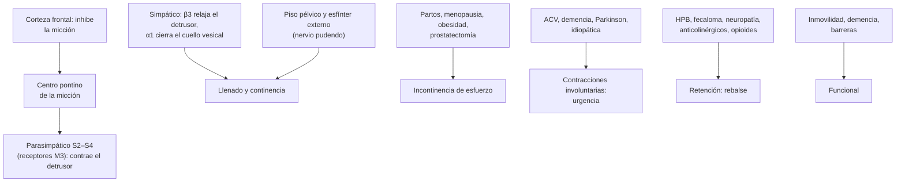

---
tags:
  - Geriatría
  - Frecuente en sala
---

# Incontinencia urinaria

**Subespecialidad**
Geriatría · Urología · Ginecología (uroginecología) · Medicina física y rehabilitación

**Guías principales**
AUA/SUFU 2024: vejiga hiperactiva idiopática · EAU 2018: evaluación y manejo no quirúrgico de la incontinencia urinaria · NICE NG123 (2019): incontinencia urinaria y prolapso en mujeres · ACP 2014: manejo no quirúrgico de la incontinencia en mujeres · AGS Beers 2023: fármacos potencialmente inapropiados · ICS 2002: terminología

**Otras fuentes**
Prevalencia de la incontinencia en mujeres (Milsom y Gyhagen 2019) · Incontinencia en mujeres chilenas: III Estudio Nacional de la Discapacidad 2022 (Moreira 2026)

**GES**
No es GES.

**EUNACOM**
1.07.1.012 Incontinencia urinaria (específico, inicial, derivar)

**Revisado**
Octubre 2026

!!! abstract "Resumen en 60 segundos"
    - La **incontinencia urinaria** es cualquier **pérdida involuntaria de orina**. Es **frecuente** (25–45 % de las mujeres; > 40 % de las ≥ 70 años), **subdiagnosticada** (da vergüenza) y afecta la calidad de vida, el ánimo y el riesgo de **caídas**.
    - **No es normal por la edad**: hay que **preguntar** activamente.
    - **Primero, causas transitorias** (DIAPPERS): delirium, infección, atrofia vaginal, fármacos, exceso de orina, inmovilidad y **fecaloma**.
    - **Tipos**:
        - **De esfuerzo**: escapes al toser o reír.
        - **De urgencia**: deseo imperioso, vejiga hiperactiva.
        - **Mixta**: esfuerzo más urgencia.
        - **Por rebalse**: retención con goteo, residuo alto.
        - **Funcional**: no llega al baño.
    - **Evaluación básica**: historia, **diario miccional** de 3 días, examen (abdomen, genital, tacto rectal, neurológico), **orina completa**, **residuo posmiccional**. No pedir urodinamia antes del tratamiento conservador.
    - **Tratamiento escalonado**:
        - **Esfuerzo**: **ejercicios del piso pélvico** supervisados ≥ 3 meses, bajar de peso; luego cirugía (**cinta suburetral**).
        - **Urgencia**: **entrenamiento vesical**, manejo de líquidos y cafeína; luego **mirabegrón** o un **antimuscarínico**. En los adultos mayores, **evitar la oxibutinina** (deterioro cognitivo). Después, toxina botulínica o neuromodulación.
        - **Rebalse**: **sonda**, tratar la obstrucción (HPB) y suspender los fármacos que retienen.
        - **Funcional**: micción programada y adaptar el entorno.
    - **No** dejar una **sonda Foley** permanente "por la incontinencia": aumenta las ITU, el delirium y la inmovilidad.

## Definición

| Concepto | Definición (ICS) |
|---|---|
| **Incontinencia urinaria** | Cualquier **pérdida involuntaria de orina** |
| **De esfuerzo** | Pérdida con el **esfuerzo**, el ejercicio, la tos o el estornudo |
| **De urgencia** | Pérdida acompañada o precedida de **urgencia** (deseo súbito e imperioso de orinar, difícil de postergar) |
| **Mixta** | Pérdida asociada a la urgencia **y** al esfuerzo |
| **Vejiga hiperactiva** | **Urgencia**, con o sin incontinencia, habitualmente con **frecuencia** y **nicturia**, sin infección ni otra patología evidente |
| **Por rebalse** | Pérdida por **vejiga distendida** que no se vacía (obstrucción o detrusor hipocontráctil) |
| **Funcional** | Pérdida por **incapacidad de llegar al baño** a tiempo (movilidad, cognición, entorno), con la vía urinaria normal |
| **Nicturia** | Despertar **una o más veces** en la noche para orinar |

## Epidemiología

### Mundial

- En las **mujeres**, la prevalencia de cualquier incontinencia es de **25–45 %** en la mayoría de los estudios (rango 5–70 %, según la definición), y supera el **40 %** en las de **≥ 70 años**. Es aún mayor en los muy ancianos y en los institucionalizados (Milsom y Gyhagen 2019).
- La incidencia anual es de **1–9 %** y la remisión espontánea, de **4–30 %**.
- En los **hombres** es menos frecuente y aumenta con la edad (HPB, posprostatectomía).
- En el **adulto mayor** se asocia a **caídas** (urgencia nocturna), lesiones de piel, depresión, aislamiento e **institucionalización**.

!!! chile "Datos nacionales"
    - En el **III Estudio Nacional de la Discapacidad** (2022; 17.314 mujeres ≥ 18 años), la incontinencia **autorreportada** fue de **3,4 %** (Moreira 2026).
        - Fue mayor en las mujeres **> 65 años**, con **menor escolaridad**, peor salud percibida y sin trabajo.
        - La cifra es **mucho menor** que en los estudios que preguntan de forma dirigida: refleja el **subreporte**.
    - En APS, el **EMPAM** pregunta por la incontinencia en el adulto mayor. Ver [fragilidad](fragilidad-y-sarcopenia.md).
    - Los **antimuscarínicos** (como la oxibutinina) se usan mucho y aumentan la **carga anticolinérgica** en los adultos mayores.

## Etiología

### Causas transitorias (DIAPPERS)

| Letra | Causa |
|---|---|
| **D** | **Delirium** |
| **I** | **Infección urinaria** sintomática |
| **A** | **Atrofia** vaginal (uretritis atrófica) |
| **P** | **Psicofármacos y otros fármacos**: **diuréticos**, **anticolinérgicos** y opioides (retención y rebalse), **alfa-bloqueadores** (incontinencia de esfuerzo en mujeres), sedantes, IECA (tos), antagonistas del calcio (edema y nicturia), inhibidores de la colinesterasa |
| **E** | **Exceso de orina**: **glucosuria** (diabetes descompensada, iSGLT2), hipercalcemia, exceso de líquidos o cafeína, **edema** que se moviliza en la noche (insuficiencia cardíaca, insuficiencia venosa) |
| **R** | **Restricción de la movilidad** (fractura, artrosis, contenciones) |
| **S** | **Fecaloma** (*stool*): obstruye la salida y causa urgencia o rebalse |

### Causas establecidas

- **De esfuerzo**: debilidad del piso pélvico e hipermovilidad uretral por **partos vaginales**, **menopausia**, **obesidad**, tos crónica, cirugía pélvica; en el hombre, **posprostatectomía**.
- **De urgencia**: **idiopática** (la más frecuente); **neurológica** (ACV, Parkinson, demencia, esclerosis múltiple, lesión medular); irritación vesical (infección, cálculo, **tumor vesical**, cuerpo extraño); obstrucción del tracto de salida (HPB).
- **Por rebalse**:
    - **Obstrucción**: **HPB**, estenosis uretral, prolapso genital avanzado, fecaloma.
    - **Detrusor hipocontráctil**: **neuropatía diabética**, lesión medular o de raíces sacras, **fármacos** (anticolinérgicos, opioides), posoperatorio.
- **Funcional**: demencia, inmovilidad, barreras arquitectónicas, falta de cuidador.

## Fisiopatología

- **Llenado**: el **detrusor** se relaja (simpático, β3) y el **esfínter** se contrae (simpático α1 en el cuello vesical; somático, nervio pudendo, en el esfínter externo). El centro pontino de la micción está **inhibido** por la corteza frontal.
- **Vaciamiento**: la corteza libera al centro pontino; el **parasimpático** (S2–S4, receptores **muscarínicos M3**) contrae el detrusor y el esfínter se relaja.
- **De esfuerzo**: la presión abdominal supera la de cierre uretral (piso pélvico débil, uretra hipermóvil o esfínter insuficiente).
- **De urgencia**: el detrusor se contrae **de forma involuntaria** durante el llenado (hiperactividad), por pérdida de la inhibición cortical o por cambios locales.
- **Por rebalse**: la vejiga no se vacía (obstrucción o detrusor débil), se distiende y la presión supera la resistencia uretral: goteo continuo.
- **Fármacos**: los **antimuscarínicos** bloquean los receptores M3 (relajan el detrusor) pero también los **cerebrales** (confusión, deterioro cognitivo), salivales (boca seca) e intestinales (constipación). El **mirabegrón** estimula los receptores **β3** del detrusor, sin efecto anticolinérgico.

*Figura 1. Control de la continencia y mecanismos de los tipos de incontinencia. Esquema propio.*

## Clasificación

<figure markdown>
![Cuatro columnas con los tipos de incontinencia. De esfuerzo: escape al toser, reír, estornudar o levantar peso; mecanismo: falla del esfínter o hipermovilidad uretral por partos, menopausia o prostatectomía; clínica: pérdidas pequeñas sin urgencia, test de la tos positivo; primer paso: ejercicios del piso pélvico supervisados por 3 meses o más, bajar de peso, y cirugía con cinta suburetral. De urgencia o vejiga hiperactiva: deseo súbito e imperioso; mecanismo: contracciones no inhibidas del detrusor; clínica: frecuencia, nicturia, pérdidas variables; primer paso: entrenamiento vesical, manejo de café, alcohol y líquidos, y luego mirabegrón o antimuscarínico, evitando la oxibutinina en mayores. Por rebalse: goteo con vejiga distendida; mecanismo: obstrucción o detrusor hipocontráctil; clínica: chorro débil, globo vesical, residuo mayor de 200 mL; primer paso: sonda, tratar la causa, suspender anticolinérgicos, tamsulosina en la HPB, cateterismo intermitente. Funcional: vía urinaria normal, no llega al baño; primer paso: micción programada y adaptar el entorno. Abajo, la definición de incontinencia mixta y la regla DIAPPERS de causas transitorias](../assets/figuras/incontinencia/tipos-de-incontinencia.svg){ loading=lazy }
<figcaption>Figura 2. Tipos de incontinencia urinaria, sus claves clínicas y el primer paso del tratamiento. Esquema propio basado en la terminología ICS (Abrams 2002), EAU 2018, NICE NG123 (2019) y AUA/SUFU 2024.</figcaption>
</figure>

## Clínica

- **Preguntar** activamente (la mayoría no consulta):
    - ¿Se le escapa la orina? ¿Cuándo: al toser o hacer fuerza, o porque no alcanza a llegar al baño?
    - ¿Cuántas veces orina en el día y en la noche?
    - ¿Usa protección (toallas, pañales)? ¿Cuántos al día?
    - ¿Siente que vacía bien la vejiga? ¿Chorro débil, pujo, goteo posmiccional?
- **Síntomas asociados**: **hematuria** (descartar un tumor vesical), **disuria** y fiebre (ITU), **dolor** pélvico, **prolapso** (bulto vaginal), constipación e incontinencia fecal, síntomas **neurológicos**.
- **Antecedentes**: partos, cirugías pélvicas o de próstata, radioterapia, diabetes, ACV, Parkinson, demencia, insuficiencia cardíaca, **fármacos**.
- **Impacto**: en la calidad de vida, el sueño, el ánimo, la actividad sexual y social, y las **caídas**.

!!! alarma "Derivar o estudiar con prioridad"
    - **Hematuria** (sobre todo macroscópica) o síntomas irritativos sin infección: estudiar un **cáncer vesical** (citoscopía, imagen).
    - **Retención urinaria** con **residuo alto**, **globo vesical**, o **deterioro de la función renal**: sonda y evaluación urológica. Ver [LRA](../nefrologia/lesion-renal-aguda.md).
    - **Incontinencia de inicio brusco** con **déficit neurológico**, **dolor lumbar**, anestesia en silla de montar o incontinencia fecal: **compresión medular o cauda equina** (RM urgente). Ver [mielopatías](../neurologia/debilidad-aguda-guillain-barre-y-mielopatias.md).
    - **Dolor pélvico**, ITU **recurrentes**, **prolapso** sintomático, cirugía o radioterapia pélvica previa, **fístula** (pérdida continua).
    - **Falla** del tratamiento conservador y farmacológico.

## Diagnóstico

!!! guia "Evaluación inicial (EAU 2018; NICE NG123; AUA/SUFU 2024)"
    - **Historia** clínica y de los síntomas; clasificar el tipo (esfuerzo, urgencia, mixta).
    - **Diario miccional** (frecuencia y volumen) de al menos **3 días**: muestra la frecuencia, la nicturia, el volumen por micción y la ingesta de líquidos.
    - **Examen físico**: abdomen (globo vesical), **examen genital** (atrofia, prolapso, **test de la tos** con la vejiga llena), **tacto rectal** (fecaloma, próstata, tono anal), examen neurológico (sensibilidad perineal, reflejos).
    - **Orina completa** (± urocultivo): descartar ITU y hematuria. **No** tratar la bacteriuria asintomática.
    - **Residuo posmiccional** (ecografía vesical o sondeo) si hay síntomas de vaciamiento, sospecha de retención, diabetes o neuropatía, o antes de iniciar un antimuscarínico en los de riesgo.
    - **No** se necesita **urodinamia** antes del tratamiento conservador; se reserva para casos complejos, antes de una cirugía o si fallan los tratamientos.
    - Cuestionarios de síntomas y calidad de vida (por ejemplo, ICIQ).

- **En el adulto mayor**: además, **cognición** (demencia), **movilidad** (acceso al baño), **fármacos**, **constipación** y apoyo del cuidador.

## Laboratorio

| Examen | Para qué |
|---|---|
| **Orina completa ± urocultivo** | ITU, hematuria, glucosuria |
| **Glicemia o HbA1c** | Diabetes (poliuria, neuropatía) |
| **Creatinina** | Si hay retención o sospecha de uropatía obstructiva |
| **Calcio** | Poliuria por hipercalcemia (si hay sospecha) |
| **Citología urinaria** | Hematuria o síntomas irritativos sin infección |
| **APE** | Hombre con síntomas obstructivos, según la indicación (no de rutina para la incontinencia) |

## Imágenes

- **Ecografía vesical** (*bladder scan*): **residuo posmiccional**. Un residuo **> 200 mL** sugiere un vaciamiento significativamente alterado.
- **Ecografía renal y vesical**: retención crónica, hidronefrosis, hematuria, ITU recurrentes.
- **Urodinamia**: casos complejos, antes de la cirugía, o falla del tratamiento.
- **Cistoscopía**: hematuria, sospecha de tumor, fístula.
- **RM de columna**: sospecha de causa neurológica.

## Diagnóstico diferencial

| Condición | Claves |
|---|---|
| **ITU** | Disuria, urgencia de inicio reciente, fiebre; orina alterada. Ver [infección urinaria](../nefrologia/infeccion-urinaria.md) |
| **Poliuria** (diabetes, diabetes insípida, hipercalcemia, diuréticos) | Gran volumen por micción y en 24 h en el diario miccional |
| **Poliuria nocturna** | > 33 % de la orina de 24 h en la noche (insuficiencia cardíaca, edema, apnea del sueño) |
| **Tumor vesical o cálculo** | Hematuria, síntomas irritativos persistentes |
| **Prolapso genital** | Bulto vaginal; puede causar obstrucción o enmascarar una incontinencia de esfuerzo |
| **Fístula vesicovaginal** | Pérdida **continua** tras una cirugía, un parto o radioterapia |
| **Compresión medular o cauda equina** | Déficit neurológico, dolor lumbar, anestesia en silla de montar |

## Tratamiento

!!! guia "Tratamiento escalonado (EAU 2018; NICE NG123; AUA/SUFU 2024; ACP 2014)"
    - **Medidas generales para todos**:
        - Tratar las **causas transitorias**: constipación, ITU sintomática, fármacos.
        - **Bajar de peso** si hay obesidad.
        - **Ajustar los líquidos**: ni exceso ni restricción extrema.
        - **Reducir la cafeína** y el alcohol.
        - Tratar la tos crónica y la constipación.
    - **De esfuerzo**:
        - **Ejercicios del piso pélvico** (entrenamiento muscular) **supervisados**, por **al menos 3 meses**: primera línea (ACP: fuerte).
        - Si fallan: **cirugía** (**cinta suburetral** sintética o autóloga, colposuspensión), agentes de relleno uretral. En el hombre posprostatectomía: cinta o **esfínter artificial**.
    - **De urgencia (vejiga hiperactiva)**:
        - **Entrenamiento vesical** (orinar con horario, aumentando progresivamente los intervalos) por al menos 6 semanas, más el manejo de líquidos y cafeína.
        - **Fármacos** si no basta: **agonistas β3** (**mirabegrón**, vibegrón) o **antimuscarínicos**. La AUA/SUFU 2024 pide considerar el **riesgo de deterioro cognitivo** con los antimuscarínicos, sobre todo en los adultos mayores.
        - **Estrógenos vaginales** en las mujeres posmenopáusicas con atrofia.
        - Refractaria: **toxina botulínica** intravesical, **estimulación del nervio tibial** percutánea, **neuromodulación sacra**.
    - **Mixta**: tratar primero el **componente que más molesta**.
    - **Por rebalse**:
        - **Descomprimir** (sonda) y tratar la causa.
        - **HPB**: alfa-bloqueador (**tamsulosina**), inhibidor de la 5-alfa reductasa, cirugía.
        - **Suspender** anticolinérgicos y opioides si es posible.
        - **Detrusor hipocontráctil**: **cateterismo intermitente limpio** (mejor que la sonda permanente).
    - **Funcional**: **micción programada** o inducida (llevar al baño cada 2–3 h), baño accesible, chata o urinario junto a la cama, ropa fácil de sacar, tratar la movilidad.
    - **Absorbentes**: como complemento o en quien no responde; **no** como primera medida.
    - **Sonda permanente**: solo si hay retención que no se resuelve de otra forma, lesiones por presión que necesitan mantenerse secas, o cuidados al final de la vida. **No** "por comodidad".

!!! dosis "Fármacos para la vejiga hiperactiva (dosis del adulto)"
    - **Mirabegrón** (agonista β3): **25–50 mg/día**. Sin efecto anticolinérgico; vigilar la **presión arterial** (evitar en la HTA grave no controlada).
    - **Solifenacina**: **5–10 mg/día**.
    - **Tolterodina**: **2 mg c/12 h** o **4 mg/día** en liberación prolongada.
    - **Trospio**: 20 mg c/12 h (no cruza bien la barrera hematoencefálica).
    - **Oxibutinina**: 5 mg c/8–12 h. **Evitar en los adultos mayores** y en la demencia (más efectos anticolinérgicos centrales; Beers 2023).
    - Efectos adversos de los antimuscarínicos: **boca seca**, **constipación**, visión borrosa, **retención urinaria**, **confusión** y deterioro cognitivo; contraindicados en el glaucoma de ángulo cerrado no tratado y en la retención.
    - Evaluar la respuesta a las **4 semanas** y, si no responde o no tolera, cambiar de fármaco o de clase.
    - **Tamsulosina** (rebalse por HPB): **0,4 mg/día** (riesgo de hipotensión ortostática).
    - **Desmopresina** para la nicturia: **evitar** en los adultos mayores (**hiponatremia**).

## Complicaciones

- **Dermatitis** asociada a la incontinencia, infecciones de la piel, **lesiones por presión**. Ver [inmovilidad y úlceras por presión](inmovilidad-y-ulceras-por-presion.md).
- **ITU** (sobre todo con sonda o residuo alto).
- **Caídas** y fracturas (urgencia nocturna).
- **Depresión**, ansiedad, **aislamiento social**, disfunción sexual.
- **Institucionalización** y sobrecarga del cuidador.
- **De los fármacos**: **deterioro cognitivo** y delirium (antimuscarínicos), retención urinaria, constipación; HTA (mirabegrón).
- **Del rebalse no tratado**: hidronefrosis y **daño renal**.

## Pronóstico y seguimiento

- La mayoría **mejora** con el tratamiento conservador si se hace bien y por tiempo suficiente (al menos 3 meses de ejercicios del piso pélvico).
- La cirugía de la incontinencia de esfuerzo tiene buenos resultados en las pacientes seleccionadas.
- **Seguimiento**:
    - **Diario miccional** y número de absorbentes para medir la respuesta.
    - Revisar los **efectos adversos** (cognición, constipación, PA, residuo).
    - Intentar **suspender** o reducir los fármacos si los síntomas se controlan, sobre todo en los adultos mayores.
    - **Derivar** a urología o uroginecología si hay signos de alarma o falla del tratamiento.

## Perlas para el internado

- **Pregunta** por la incontinencia a todo adulto mayor: casi nadie la menciona por iniciativa propia.
- Antes de recetar, busca **causas transitorias**: fecaloma, ITU, fármacos, glucosuria, inmovilidad.
- **Mide el residuo posmiccional** antes de un antimuscarínico en un hombre o un diabético: si retiene, el fármaco puede empeorarlo.
- **Goteo continuo con globo vesical** = rebalse: el tratamiento es **vaciar** la vejiga, no un antimuscarínico.
- En el adulto mayor, **no** uses **oxibutinina**: prefiere **mirabegrón** o un antimuscarínico con menos efecto central.
- La **sonda Foley** no es un tratamiento de la incontinencia.
- La incontinencia de esfuerzo se trata con **ejercicios del piso pélvico** antes que con cualquier fármaco.
- **Hematuria** + síntomas irritativos sin ITU: piensa en un **tumor vesical**.

## Preguntas de repaso

??? repaso "1. Mujer de 52 años, con 3 partos vaginales, que pierde orina al toser, estornudar y saltar. No tiene urgencia. Orina completa normal. ¿Tipo y tratamiento inicial?"
    **Incontinencia de esfuerzo**.

    - **Ejercicios del piso pélvico** supervisados (kinesiólogo) por **al menos 3 meses**: primera línea.
    - **Bajar de peso** si corresponde; tratar la tos crónica y la constipación.
    - Estrógenos vaginales si hay atrofia posmenopáusica.
    - Si no mejora: derivar a uroginecología para una **cinta suburetral** u otra cirugía.
    - Los fármacos no son el tratamiento de base de la incontinencia de esfuerzo.

??? repaso "2. Mujer de 68 años con urgencia miccional, frecuencia cada hora, nicturia de 3 veces y escapes antes de llegar al baño. Toma 4 tazas de café al día. Orina completa normal, residuo 40 mL. ¿Diagnóstico y manejo?"
    **Vejiga hiperactiva con incontinencia de urgencia**.

    - **Diario miccional** de 3 días.
    - **Entrenamiento vesical** (orinar con horario, aumentando los intervalos), **reducir el café** y ajustar los líquidos (menos en la noche).
    - Si no basta en algunas semanas: **mirabegrón 25–50 mg/día** (sin efecto anticolinérgico) o un antimuscarínico de menor efecto central (solifenacina, trospio). Evitar la oxibutinina.
    - Estrógenos vaginales si hay atrofia.
    - Evaluar la respuesta a las 4 semanas.

??? repaso "3. Hombre de 80 años con demencia, hospitalizado por una neumonía. Desde ayer \"se orina todo el tiempo\" con goteo continuo. Recibe morfina y le iniciaron oxibutinina por la incontinencia. Hay un globo vesical palpable. ¿Qué ocurre y qué hace?"
    **Incontinencia por rebalse** por **retención urinaria** (HPB probable + **opioide** + **anticolinérgico**). La oxibutinina la empeoró.

    - **Sonda** para vaciar la vejiga y medir el volumen; controlar la **creatinina**.
    - **Suspender la oxibutinina** y reducir el opioide si es posible.
    - Buscar y tratar un **fecaloma** (tacto rectal) y el **delirium**.
    - Iniciar **tamsulosina** e intentar retirar la sonda en unos días (prueba de micción).

??? repaso "4. ¿Qué causas transitorias de incontinencia busca en un adulto mayor (DIAPPERS)?"
    - **D**elirium.
    - **I**nfección urinaria sintomática.
    - **A**trofia vaginal.
    - **P**sicofármacos y otros fármacos: diuréticos, anticolinérgicos, opioides, sedantes, alfa-bloqueadores.
    - **E**xceso de orina: glucosuria, hipercalcemia, líquidos, edema.
    - **R**estricción de la movilidad.
    - Fecaloma (***S**tool*).

??? repaso "5. ¿Qué incluye la evaluación inicial de una incontinencia y qué exámenes no son necesarios al principio?"
    **Incluye**:

    - Historia (tipo, impacto, fármacos), **diario miccional** de 3 días.
    - **Examen físico**: abdominal, genital (atrofia, prolapso, test de la tos), tacto rectal, neurológico.
    - **Orina completa** y **residuo posmiccional** si hay síntomas de vaciamiento o riesgo de retención.

    **No necesarios al inicio**: la **urodinamia** (se reserva para casos complejos, antes de la cirugía o si falla el tratamiento) y las imágenes de rutina.

??? repaso "6. Mujer de 84 años con demencia moderada, que vive con su hija, se moja porque \"no llega al baño\" que queda en el segundo piso. Su examen urológico es normal. ¿Qué tipo es y qué recomienda?"
    **Incontinencia funcional**: la vía urinaria funciona, pero la **movilidad**, la **cognición** y el **entorno** impiden llegar a tiempo.

    - **Micción programada** o inducida: llevarla al baño cada 2–3 horas y después de las comidas.
    - **Adaptar el entorno**: baño o silla-baño en el primer piso, chata, luz nocturna, ropa fácil de sacar.
    - Tratar la movilidad (kinesiología) y revisar los fármacos (sedantes, diuréticos).
    - Absorbentes como complemento; **no** sonda permanente.
    - Apoyo y educación a la cuidadora.

## Referencias

1. Cameron AP, Chung DE, Dielubanza EJ, et al. The AUA/SUFU guideline on the diagnosis and treatment of idiopathic overactive bladder. *Neurourol Urodyn.* 2024;43(8):1742–1752. doi:[10.1002/nau.25532](https://doi.org/10.1002/nau.25532)
2. Nambiar AK, Bosch R, Cruz F, et al. EAU guidelines on assessment and nonsurgical management of urinary incontinence. *Eur Urol.* 2018;73(4):596–609. doi:[10.1016/j.eururo.2017.12.031](https://doi.org/10.1016/j.eururo.2017.12.031)
3. National Institute for Health and Care Excellence. Urinary incontinence and pelvic organ prolapse in women: management (NG123). 2019. [nice.org.uk](https://www.nice.org.uk/guidance/ng123)
4. Qaseem A, Dallas P, Forciea MA, et al. Nonsurgical management of urinary incontinence in women: a clinical practice guideline from the American College of Physicians. *Ann Intern Med.* 2014;161(6):429–440. doi:[10.7326/M13-2410](https://doi.org/10.7326/M13-2410)
5. American Geriatrics Society Beers Criteria Update Expert Panel. American Geriatrics Society 2023 updated AGS Beers Criteria for potentially inappropriate medication use in older adults. *J Am Geriatr Soc.* 2023;71(7):2052–2081. doi:[10.1111/jgs.18372](https://doi.org/10.1111/jgs.18372)
6. Abrams P, Cardozo L, Fall M, et al. The standardisation of terminology of lower urinary tract function: report from the Standardisation Sub-committee of the International Continence Society. *Neurourol Urodyn.* 2002;21(2):167–178. doi:[10.1002/nau.10052](https://doi.org/10.1002/nau.10052)
7. Milsom I, Gyhagen M. The prevalence of urinary incontinence. *Climacteric.* 2019;22(3):217–222. doi:[10.1080/13697137.2018.1543263](https://doi.org/10.1080/13697137.2018.1543263)
8. Moreira MA, do Nascimento SL, Cartes-Velásquez R, et al. Prevalence and impact of urinary incontinence on the capacity and performance of Chilean women: a secondary analysis of the III Estudio Nacional de la Discapacidad en Chile national survey. *Int Urogynecol J.* 2026;37(3):627–635. doi:[10.1007/s00192-025-06389-3](https://doi.org/10.1007/s00192-025-06389-3)
