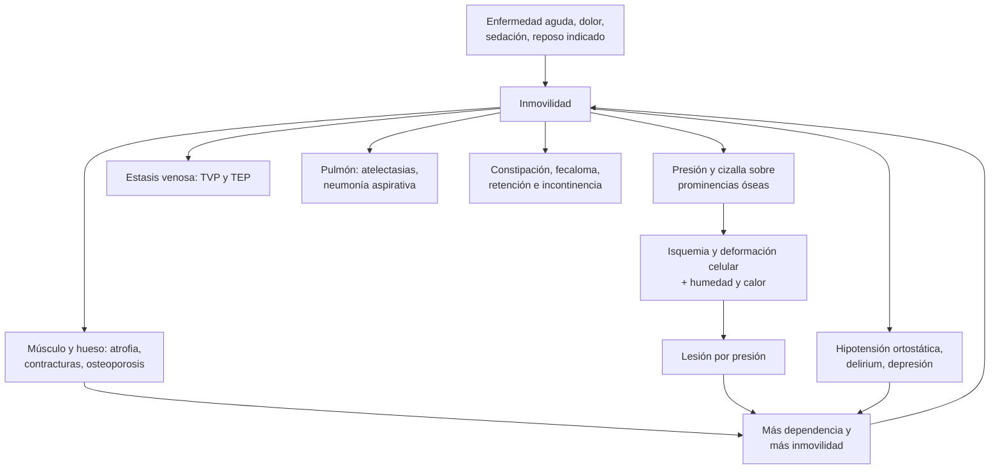

---
tags:
  - Geriatría
  - Frecuente en sala
---

# Inmovilidad y úlceras (lesiones) por presión

**Subespecialidad**
Geriatría · Medicina interna · Enfermería · Medicina física y rehabilitación · Cirugía plástica

**Guías principales**
EPUAP/NPIAP/PPPIA 2025: guía internacional de prevención y tratamiento de lesiones por presión (4.ª edición, en línea) · EPUAP/NPIAP/PPPIA 2019: guía internacional (3.ª edición) · NPIAP 2016: sistema de clasificación de lesiones por presión · ASH 2018: profilaxis de ETV en pacientes médicos

**Otras fuentes**
Escala de Braden (Bergstrom 1987) · Efecto de 10 días de reposo en adultos mayores sanos (Kortebein 2008) · Discapacidad asociada a la hospitalización (Covinsky 2011) · Prevalencia mundial de lesiones por presión (Li 2020) · Úlceras por presión al egreso hospitalario en Chile 2001–2019 (González Nahuelquin 2023) · Programa de atención domiciliaria a personas con dependencia severa (MINSAL)

**GES**
No son GES. Las personas con **dependencia severa** (Barthel ≤ 35) pueden ingresar al **Programa de Atención Domiciliaria a Personas con Dependencia Severa** de APS.

**EUNACOM**
1.07.1.013 Inmovilidad (específico, completo, completo) · 1.07.1.007 Escaras o úlceras por presión (específico, inicial, completo)

**Revisado**
Octubre 2026

!!! abstract "Resumen en 60 segundos"
    - La **inmovilidad** es un **síndrome geriátrico**: la disminución de la capacidad de moverse y de hacer las actividades diarias. Es **causa y consecuencia** de muchas enfermedades, y casi siempre tiene **varias causas**.
    - **El reposo en cama es dañino**: 10 días en cama bajan **13 %** la fuerza de las piernas en un adulto mayor sano. Un **tercio** de los mayores de 70 años hospitalizados sale con una **discapacidad nueva**.
    - **Complicaciones** de la inmovilidad en todos los sistemas:
        - Músculo y hueso: **sarcopenia**, contracturas.
        - **Úlceras por presión**.
        - **Hipotensión ortostática**, **ETV**.
        - **Neumonía aspirativa**.
        - **Constipación** y **fecaloma**.
        - **Incontinencia** e ITU.
        - **Delirium** y depresión.
    - **Prevenir**: **movilización precoz**, evitar sondas y contenciones, kinesiología, **profilaxis de ETV** si corresponde, nutrición.
    - Las **lesiones por presión** se deben a la **presión** y la **cizalla** sobre prominencias óseas (**sacro, talones, trocánteres**). Afectan a **1 de cada 8** adultos hospitalizados.
        - **Categorías**: 1 (eritema que no palidece), 2 (pérdida parcial de piel), 3 (pérdida total de piel), 4 (hueso, tendón o músculo), no clasificable y lesión de tejidos profundos.
        - **Riesgo**: escala de **Braden** (≤ 18 = riesgo).
        - **Prevención**: **cambios de posición** cada 2–3 horas, **colchón** de redistribución de presión, **talones en el aire**, piel limpia y seca, nutrición.
        - **Tratamiento**: aliviar la presión, **limpiar**, **desbridar** el tejido desvitalizado, **cura húmeda**, tratar la infección. Nutrición con **30–35 kcal/kg** y **1,2–1,5 g/kg de proteínas**.

## Definición

| Concepto | Definición |
|---|---|
| **Inmovilidad** | Disminución de la capacidad de desplazarse y de realizar las actividades de la vida diaria por deterioro de las funciones motoras. Va de la **limitación relativa** (sale poco, camina con ayuda) a la **inmovilidad absoluta** (postrado en cama) |
| **Inmovilidad aguda** | Pérdida rápida de la movilidad (días) por una enfermedad aguda o una hospitalización. Es una **urgencia geriátrica**: buscar la causa y movilizar |
| **Discapacidad asociada a la hospitalización** | Pérdida de la capacidad de hacer una o más actividades básicas de la vida diaria entre la admisión y el alta |
| **Dependencia severa** (Chile) | **Índice de Barthel ≤ 35 puntos** (criterio del programa de atención domiciliaria de APS) |
| **Lesión (úlcera) por presión** | Daño localizado de la **piel y/o los tejidos subyacentes**, habitualmente sobre una **prominencia ósea** o relacionado con un **dispositivo médico**, por **presión** intensa o prolongada, o presión combinada con **cizalla** (NPIAP 2016). El término "escara" se refiere al tejido necrótico negro |

## Epidemiología

### Mundial

- **Inmovilidad y reposo**:
    - En adultos mayores **sanos**, **10 días de reposo en cama** reducen la fuerza de los extensores de la rodilla en **13 %** y la capacidad aeróbica en **12 %** (Kortebein 2008).
    - La **discapacidad asociada a la hospitalización** ocurre en ~**un tercio** de los mayores de 70 años, aunque la enfermedad que motivó el ingreso se trate bien (Covinsky 2011).
- **Lesiones por presión** (Li 2020; 39 estudios, > 1,3 millones de pacientes):
    - **Prevalencia** de **12,8 %** en adultos hospitalizados; lesiones **adquiridas en el hospital** en el **8,4 %**.
    - Las más frecuentes son de **categoría 1 (43,5 %)** y **2 (28,0 %)**: las más **prevenibles**.
    - Localización más frecuente: **sacro**, **talones** y **cadera**.

!!! chile "Datos nacionales"
    - **Úlceras por presión al egreso hospitalario** (DEIS, 2001–2019; González Nahuelquin 2023):
        - **11.060** casos registrados; **55,2 %** hombres; edad media de **60 años**.
        - La estadía hospitalaria fue **significativamente mayor** en quienes las tenían.
        - **Tendencia creciente** en Chile y en todas sus regiones: **11,3 %** de aumento anual promedio.
    - La prevención de las lesiones por presión es un **indicador de calidad** de la atención de enfermería en los hospitales.
    - **Programa de Atención Domiciliaria a Personas con Dependencia Severa** (APS):
        - Para personas con **Barthel ≤ 35** (y niños menores de 6 años con dependencia).
        - Incluye **visitas domiciliarias** del equipo de salud, capacitación del **cuidador** y un **estipendio** para el cuidador (administrado por el Ministerio de Desarrollo Social).

## Etiología

### Causas de inmovilidad

| Grupo | Ejemplos |
|---|---|
| **Musculoesqueléticas** | **Artrosis**, **fractura de cadera**, osteoporosis con fracturas vertebrales, problemas de los **pies**, polimialgia, **sarcopenia** |
| **Neurológicas** | **ACV**, **Parkinson**, **demencia** avanzada, neuropatías, mielopatía, hidrocefalia normotensiva |
| **Cardiorrespiratorias** | **Insuficiencia cardíaca**, **EPOC**, angina, enfermedad arterial periférica |
| **Psicológicas** | **Miedo a caer** (síndrome poscaída), **depresión**, ansiedad |
| **Sensoriales** | Déficit **visual** grave, auditivo |
| **Iatrogénicas** | **Reposo en cama** innecesario, **contenciones**, **sondas** y vías, **sedantes**, neurolépticos, antihipertensivos (hipotensión) |
| **Ambientales y sociales** | Barreras arquitectónicas (escaleras, sin baño accesible), falta de ayudas técnicas, aislamiento, falta de cuidador |
| **Agudas** | **Infección**, **delirium**, deshidratación, dolor no controlado, cualquier hospitalización |

### Factores de riesgo de lesiones por presión

- **Factores principales** (guía 2025, evidencia alta): **movilidad limitada**, **actividad limitada**, alto potencial de **fricción y cizalla**, y una **lesión de categoría 1** ya presente.
- **Evidencia moderada**: **diabetes**, alteraciones de la **circulación** (perfusión), estado **nutricional**, aumento de la **temperatura** corporal.
- **Otros**: **humedad** (incontinencia, sudor), alteración de la **sensibilidad** (neuropatía, lesión medular), oxigenación, **edad**, compromiso de conciencia, sedación, **dispositivos médicos** (sondas, mascarillas, férulas).

## Fisiopatología

- **Inmovilidad**: la falta de carga y de movimiento produce:
    - **Atrofia muscular** (sobre todo de las piernas) y pérdida de fuerza en días; desacondicionamiento cardiovascular.
    - **Contracturas** articulares, pérdida ósea.
    - **Hipotensión ortostática** (menor respuesta barorrefleja y menor volumen plasmático).
    - **Estasis venosa** (ETV), **atelectasias** y menor movilización de secreciones (neumonía).
    - **Constipación**, retención urinaria, **delirium** por deprivación sensorial.
- **Lesiones por presión**:
    1. La **presión** sostenida sobre una prominencia ósea comprime los capilares, produce **isquemia** y deforma directamente las células.
    2. La **cizalla** (deslizarse en la cama con la cabecera elevada) y la **fricción** dañan los tejidos profundos.
    3. El **microclima** (humedad, calor) macera y debilita la piel.
    4. El daño empieza muchas veces en los **tejidos profundos**, cerca del hueso (músculo), y se extiende hacia la superficie: la lesión real puede ser **más grande** de lo que se ve en la piel.

*Figura 1. Círculo vicioso de la inmovilidad y sus complicaciones. Esquema propio.*

## Clasificación

### Lesiones por presión

<figure markdown>
![Seis cortes de la piel con sus capas (epidermis, dermis, tejido subcutáneo, músculo y hueso). Categoría 1: eritema que no palidece con piel intacta. Categoría 2: pérdida parcial de la piel con lecho rosado o flictena. Categoría 3: pérdida total de la piel hasta el tejido subcutáneo, se ve grasa pero no hueso. Categoría 4: pérdida total de tejidos con hueso, tendón o músculo expuestos. No clasificable: lecho cubierto por esfacelo o escara. Lesión de tejidos profundos: piel púrpura o granate que no palidece, con daño en el músculo. Abajo, notas sobre la categoría 1 en piel oscura, la escara estable del talón, la lesión de tejidos profundos y las lesiones por dispositivos y de mucosas](../assets/figuras/upp/categorias-lesion-por-presion.svg){ loading=lazy }
<figcaption>Figura 2. Categorías de las lesiones por presión según la profundidad del daño. Esquema propio basado en la clasificación NPIAP (Edsberg 2016) y la guía internacional EPUAP/NPIAP/PPPIA 2019 y 2025.</figcaption>
</figure>

| Categoría (NPIAP/EPUAP) | Descripción |
|---|---|
| **1** | **Piel intacta** con **eritema que no palidece** a la presión. En piel oscura puede verse distinto: buscar cambios de **temperatura**, **consistencia** o **dolor** |
| **2** | **Pérdida parcial** del espesor de la piel con dermis expuesta: lecho **rosado o rojo**, húmedo, o **flictena** intacta o rota. **Sin** tejido adiposo visible, **sin** esfacelo ni escara. No incluye las lesiones por humedad (dermatitis asociada a incontinencia) ni los desgarros de piel |
| **3** | **Pérdida total** del espesor de la piel: se ve **grasa**; puede haber esfacelo, escara, tunelizaciones o socavamiento. **No** se ve fascia, músculo, tendón ni hueso |
| **4** | **Pérdida total de piel y tejidos**: **fascia, músculo, tendón, ligamento, cartílago o hueso** visibles o palpables. Riesgo de **osteomielitis** |
| **No clasificable** | Pérdida total cuya profundidad no se puede ver por **esfacelo** o **escara**. Al retirarlos, será categoría 3 o 4 |
| **Lesión de tejidos profundos** | Área **púrpura o granate** persistente que no palidece, o flictena con contenido hemático, sobre piel intacta o no. Puede evolucionar rápido a una lesión profunda |
| **Otras** | Lesión por **dispositivo médico** (se clasifica con el mismo sistema) y lesión de **mucosas** (no se categoriza) |

### Escala de Braden (riesgo de lesión por presión)

| Ítem | Puntaje |
|---|---|
| Percepción sensorial | 1–4 |
| Humedad | 1–4 |
| Actividad | 1–4 |
| Movilidad | 1–4 |
| Nutrición | 1–4 |
| Fricción y cizalla | 1–3 |
| **Total** | **6–23**: **menor puntaje = mayor riesgo**. **≤ 18** = riesgo; **≤ 12** = riesgo alto |

- La guía 2025 recomienda una evaluación del riesgo en **dos pasos**: identificar a las personas con **movilidad o actividad limitada** y luego hacer una evaluación completa (escala más juicio clínico), **al ingreso** y periódicamente.

## Clínica

- **Inmovilidad**:
    - **Historia**: cómo se movía **antes** (camina solo, con bastón o andador, sale de la casa), desde cuándo, qué cambió, caídas, dolor, ánimo, miedo a caer.
    - **Examen**: fuerza, rangos articulares, **contracturas**, dolor, marcha y equilibrio si es posible, **piel** (sacro, talones, trocánteres), signos de ETV, hidratación, estado nutricional, cognición (delirium).
- **Complicaciones** a buscar en todo paciente inmovilizado:

| Sistema | Complicación |
|---|---|
| **Musculoesquelético** | Atrofia y pérdida de fuerza (**sarcopenia**), **contracturas**, osteoporosis por desuso |
| **Piel** | **Lesiones por presión**, dermatitis asociada a la incontinencia |
| **Cardiovascular** | **Hipotensión ortostática**, desacondicionamiento, **TVP y TEP** |
| **Respiratorio** | Atelectasias, **neumonía aspirativa** |
| **Digestivo** | Anorexia, **constipación**, **fecaloma** |
| **Genitourinario** | **Incontinencia**, retención, **ITU** (sobre todo con sonda) |
| **Metabólico** | Resistencia a la insulina, desnutrición, deshidratación |
| **Neuropsicológico** | **Delirium**, **depresión**, deprivación sensorial |
| **Social** | **Dependencia**, sobrecarga del cuidador, **institucionalización** |

- **Lesión por presión**: describir la **localización**, la **categoría**, el **tamaño** (largo × ancho × profundidad), las **tunelizaciones** o socavamientos, el **lecho** (granulación, esfacelo, escara), el **exudado**, el **olor**, los **bordes** y la **piel perilesional**, el **dolor** y los signos de **infección**.

!!! alarma "Signos de alarma"
    - **Inmovilidad aguda** (dejó de caminar en días): buscar **infección**, **delirium**, **fractura** (cadera, pelvis, vertebral), **ACV**, retención urinaria, fecaloma, fármacos, dolor no tratado.
    - **Lesión por presión infectada**:
        - Signos locales: eritema que avanza (**celulitis**), calor, dolor, **olor**, exudado purulento, crepitación.
        - Signos sistémicos: **fiebre**, **sepsis**, delirium.
        - Evaluar con cirugía si hay **celulitis que avanza** o es una fuente probable de **sepsis**. Ver [sepsis](../infectologia/sepsis-y-shock-septico.md) e [infecciones de piel](../infectologia/infecciones-piel-partes-blandas.md).
    - **Hueso expuesto** o que se **palpa** con un estilete, o lesión que **no cicatriza** pese a un buen tratamiento: sospechar **osteomielitis**.
    - **Pierna edematosa** o **disnea súbita** en un paciente postrado: **TVP o TEP**. Ver [TEP](../respiratorio/tromboembolismo-pulmonar.md).
    - **Lesión en el talón** con pulsos ausentes o claudicación: **isquemia** (no desbridar la escara seca; evaluar la perfusión).

## Diagnóstico

!!! guia "Prevención de lesiones por presión (guía internacional EPUAP/NPIAP/PPPIA 2025)"
    - **Evaluar el riesgo** (2 pasos) y hacer un **examen completo de la piel** al ingreso, con foco en las **prominencias óseas** y **bajo los dispositivos médicos**.
    - **Cambios de posición**:
        - Con un esquema **individualizado**.
        - Cada **2 o 3 horas** es adecuado para la mayoría de las personas en riesgo (condicional).
        - **Decúbito lateral a 30°** (condicional).
        - **Cabecera a 30° o menos** cuando sea posible (condicional), para reducir la cizalla.
    - **Superficie de apoyo**: usar un **colchón de espuma de redistribución de presión** en toda persona en riesgo (**fuerte**); colchón de aire alternante o reactivo según las necesidades.
    - **Talones**: **elevarlos** para que no apoyen (buena práctica), con un dispositivo adecuado; apósito de espuma de silicona multicapa como complemento en sacro y talones.
    - **Nutrición**: tamizaje nutricional en las personas en riesgo; evaluación completa si hay riesgo de desnutrición; suplementos si la ingesta no alcanza. **No** usar sonda de alimentación solo para prevenir lesiones por presión.

- **Inmovilidad**: es un diagnóstico **clínico** y **funcional**. Medir y registrar:
    - **Índice de Barthel** (actividades básicas) y **Lawton** (instrumentales), antes de la enfermedad y ahora.
    - Movilidad: transferencias, sedestación, bipedestación, marcha (Timed Up and Go si camina).
    - **Braden** para el riesgo de lesiones por presión.
    - **Riesgo de ETV** (Padua) y de sangrado.
    - Cognición (CAM para el delirium), ánimo, nutrición (MNA).
- **Lesión por presión**: diagnóstico **clínico** con la categoría y la descripción completa. Seguimiento con fotografía y una escala (por ejemplo, **PUSH**).
- **Osteomielitis** (categoría 4 o lesión que no cicatriza): **prueba de contacto óseo**, radiografía, **RM** y, si es posible, **biopsia ósea** para cultivo.

## Laboratorio

| Examen | Para qué |
|---|---|
| **Hemograma, PCR** | Infección, anemia |
| **Glicemia o HbA1c** | Diabetes (cicatrización, infección) |
| **Albúmina, prealbúmina** | Contexto nutricional e inflamatorio (no definen por sí solas la desnutrición) |
| **Creatinina, electrolitos** | Deshidratación, ajuste de fármacos |
| **Orina completa y urocultivo** | Solo si hay síntomas o sonda con fiebre (no tratar la bacteriuria asintomática) |
| **Cultivo de la lesión** | Solo si hay signos de **infección**: **biopsia** de tejido o hisopado con técnica de Levine (no el exudado superficial) |
| **Biopsia ósea** | Osteomielitis (cultivo e histología) |

## Imágenes

- **Radiografía** del hueso subyacente: poco sensible para la osteomielitis precoz.
- **RM**: la mejor para la **osteomielitis** y las colecciones profundas.
- **TC**: colecciones, extensión de las lesiones profundas.
- **Ecografía Doppler venosa**: sospecha de **TVP**.
- **Índice tobillo-brazo**: lesión en el talón o en las piernas (descartar isquemia).

## Diagnóstico diferencial

| Condición | Claves |
|---|---|
| **Dermatitis asociada a la incontinencia** | Eritema difuso y brillante en zonas de contacto con orina o heces (pliegues, periné), bordes mal definidos, sin relación con prominencias óseas |
| **Desgarro de piel** | Por fricción o trauma en piel frágil (antebrazos, piernas), con colgajo |
| **Úlcera venosa** | Zona maleolar medial, edema, hiperpigmentación, várices |
| **Úlcera arterial** | Distal (dedos, talón), dolorosa, pálida, pulsos ausentes |
| **Úlcera neuropática (pie diabético)** | Planta, zonas de apoyo, neuropatía. Ver [complicaciones de la diabetes](../endocrinologia/complicaciones-cronicas-de-la-diabetes.md) |
| **Pioderma gangrenoso, vasculitis, cáncer (úlcera de Marjolin)** | Bordes violáceos o socavados, evolución atípica; biopsia si no cicatriza |
| **Equimosis** (en la lesión de tejidos profundos) | Antecedente de trauma o anticoagulación; no está sobre una prominencia ósea |

## Tratamiento

### Inmovilidad

- **Prevenir** en todo paciente hospitalizado:
    - **Movilización precoz**: sentarse fuera de la cama y caminar desde el **primer día** si es seguro.
    - **Evitar** el reposo en cama innecesario, las **contenciones**, las **sondas** urinarias y los sedantes.
    - **Kinesiología** motora y respiratoria.
- **Tratar la causa**: dolor (analgesia escalonada), infección, delirium, fractura, insuficiencia cardíaca, depresión, fármacos.
- **Rehabilitación**: ejercicios de rango articular para prevenir **contracturas**, fortalecimiento, reentrenamiento de transferencias y marcha, **ayudas técnicas** (andador, bastón, silla de ruedas), adaptación del hogar.
- **Prevenir las complicaciones**:
    - **ETV**: profilaxis farmacológica en pacientes médicos de alto riesgo (Padua ≥ 4) sin alto riesgo de sangrado (ASH 2018). Ver [TEP](../respiratorio/tromboembolismo-pulmonar.md).
    - **Lesiones por presión**: ver abajo.
    - **Neumonía aspirativa**: cabecera elevada al comer, evaluación de la **deglución**, higiene oral. Ver [disfagia](../gastroenterologia/disfagia-y-afagia-aguda.md).
    - **Constipación**: hidratación, fibra, **laxantes** y movilización. Ver [constipación](../gastroenterologia/constipacion-intestino-irritable-y-diarrea-cronica.md).
    - **Hipotensión ortostática**: sentarlo y pararlo **progresivamente**.
    - **Nutrición**: aporte de energía y **proteínas**.
- **Cuidador y domicilio**: capacitación en cambios de posición, transferencias y cuidado de la piel; derivación al **programa de dependencia severa** si el Barthel es ≤ 35.

### Lesiones por presión

!!! guia "Tratamiento de las lesiones por presión (guía internacional 2019 y 2025)"
    - **Aliviar la presión**: cambios de posición, superficie de apoyo adecuada, **no apoyarse sobre la lesión**, talones elevados.
    - **Limpiar** el lecho, los bordes y la piel perilesional en cada curación (suero fisiológico o agua potable; antisépticos si se sospecha infección o biopelícula).
    - **Desbridar** el tejido desvitalizado (esfacelo, necrosis) y la biopelícula, y mantener el desbridamiento hasta que el lecho tenga **granulación**.
        - **No** retirar una **escara seca y estable** en el **talón** o en una extremidad **isquémica**, salvo que haya infección.
    - **Cura húmeda** con el apósito adecuado al lecho y al exudado.
    - **Terapia de presión negativa** en las lesiones de **categoría 3 y 4** (condicional).
    - **Infección**:
        - Sospecharla si la cicatrización se **estanca** por más de 2 semanas, hay **tejido friable**, mal olor, más exudado o dolor.
        - **Antisépticos** tópicos para la infección local.
        - **Antibióticos sistémicos** si hay **celulitis**, osteomielitis o sepsis.
    - **Nutrición**: **30–35 kcal/kg/día** y **1,2–1,5 g/kg/día de proteínas** en adultos con lesión por presión desnutridos o en riesgo. Suplementos orales hiperproteicos si no se alcanza con la dieta; en las lesiones de categoría 2 o más con desnutrición, fórmulas con **arginina, zinc y antioxidantes**.
    - **Dolor**: evaluarlo y tratarlo, sobre todo **antes de las curaciones**.
    - **Cirugía** (colgajos) en las lesiones de categoría 3–4 que no cicatrizan, una vez optimizado el estado general.

| Lecho de la lesión | Objetivo | Apósitos y medidas |
|---|---|---|
| **Categoría 1** | Proteger | Aliviar la presión, hidratar la piel, ácidos grasos hiperoxigenados, apósito de espuma protector |
| **Categoría 2** (limpia, poco exudado) | Mantener húmedo | Hidrocoloide, espuma, film transparente |
| **Esfacelo o necrosis** | Desbridar | **Hidrogel** (autolítico), colagenasa (enzimático), desbridamiento cortante por personal entrenado |
| **Mucho exudado** | Absorber | **Alginato**, hidrofibra, espuma |
| **Cavidades y tunelizaciones** | Rellenar el espacio | Alginato o hidrofibra en mecha, sin compactar |
| **Infección local o biopelícula** | Controlar la carga bacteriana | Antisépticos (plata, cadexómero yodado, polihexanida) |
| **Categoría 3–4 limpia** | Favorecer la granulación | Espuma, terapia de presión negativa |

!!! dosis "Dosis y metas clave"
    - **Nutrición con lesión por presión** (desnutrición o riesgo): **30–35 kcal/kg/día** y **1,2–1,5 g/kg/día de proteínas**, con hidratación adecuada.
    - **Profilaxis de ETV** en el paciente médico inmovilizado de alto riesgo: **enoxaparina 40 mg SC/día** (20 mg si la depuración es < 30 mL/min) o **heparina no fraccionada 5.000 UI SC c/8–12 h**.
    - **Cambios de posición**: cada **2–3 horas**, individualizado; decúbito lateral a 30°, cabecera ≤ 30°.
    - **Analgesia** antes de las curaciones (paracetamol; opioide de corta acción si el dolor es intenso).

## Complicaciones

- **Lesiones por presión**:
    - **Infección**: **celulitis**, **osteomielitis**, absceso, **bacteriemia** y **sepsis**.
    - Dolor crónico, fístulas, **úlcera de Marjolin** (carcinoma escamoso en una lesión crónica).
    - Pérdida de proteínas por el exudado; **anemia**.
    - Aumento de la estadía hospitalaria y de la **mortalidad**.
- **Inmovilidad**: **sarcopenia**, **contracturas**, **TVP y TEP**, **neumonía**, constipación y fecaloma, ITU, **delirium**, depresión, **dependencia** permanente e **institucionalización**.

## Pronóstico y seguimiento

- La **inmovilidad aguda** es reversible si se trata la causa y se rehabilita **precozmente**; la recuperación es más lenta y menos completa cuanto más dure el reposo y más frágil sea la persona.
- Las lesiones de **categoría 1–2** cicatrizan en días a semanas si se alivia la presión; las de **categoría 3–4** tardan meses y pueden requerir cirugía.
- Una lesión por presión es un **marcador de mal pronóstico global** (fragilidad, enfermedad grave).
- **Seguimiento**:
    - Reevaluar el **Braden** y la **piel** periódicamente (en cada turno en el paciente de alto riesgo).
    - Medir la lesión cada semana (tamaño, lecho, exudado) y ajustar la curación.
    - En domicilio: visitas del equipo de APS (programa de dependencia severa), educación al cuidador, revisión de la nutrición y del colchón.
    - En la etapa final de la vida, el objetivo puede ser el **confort** y no la cicatrización.

## Perlas para el internado

- **Ningún adulto mayor debería quedar en reposo absoluto** sin una indicación clara: cada día en cama cuesta fuerza y autonomía.
- Al ingresar a un paciente, **mira el sacro y los talones** y registra el **Braden**.
- El **eritema que no palidece** al presionarlo con el dedo ya es una lesión por presión (categoría 1).
- **Eleva los talones** con una almohada bajo las pantorrillas: el talón no debe tocar la cama.
- Una lesión cubierta de escara es **no clasificable**: no la llames "categoría 2".
- **No** pidas un cultivo del exudado superficial: todas las heridas están colonizadas. Cultiva tejido solo si hay infección clínica.
- **No** desbrides la escara seca de un talón isquémico.
- La cicatrización necesita **proteínas**: 1,2–1,5 g/kg/día.
- Revisa la **profilaxis de ETV**, la **deglución** y el **tránsito intestinal** de todo paciente postrado.

## Preguntas de repaso

??? repaso "1. Mujer de 86 años con demencia moderada, hospitalizada por una neumonía. Al quinto día tiene un eritema de 4 × 3 cm en el sacro que no palidece al presionarlo, con la piel intacta. Braden 11. ¿Qué tiene y qué indica?"
    **Lesión por presión de categoría 1** en el sacro, con **riesgo alto** (Braden ≤ 12).

    - **Cambios de posición** cada 2–3 horas, decúbito lateral a 30°, evitar apoyar el sacro, cabecera ≤ 30°.
    - **Colchón** de redistribución de presión (espuma o aire alternante).
    - Proteger la piel: mantenerla limpia y seca (manejo de la incontinencia), apósito de espuma de silicona multicapa en el sacro y **talones elevados**.
    - **Nutrición**: tamizaje y aporte de proteínas; evaluar la deglución.
    - **Movilización precoz** con kinesiología, y prevenir el delirium.

??? repaso "2. Hombre de 78 años postrado tras un ACV, con una lesión en el sacro de 6 × 5 cm con pérdida total de piel, se ve tejido graso y un 30 % de esfacelo amarillo, sin hueso visible. Exudado moderado, sin signos de infección. ¿Categoría y manejo?"
    **Lesión por presión de categoría 3** (pérdida total de piel con grasa visible, sin hueso ni músculo).

    - **Aliviar la presión** (cambios de posición, colchón de aire, no apoyar la lesión).
    - **Limpieza** en cada curación y **desbridamiento** del esfacelo (autolítico con hidrogel, enzimático o cortante).
    - **Apósito** según el exudado: **alginato** o hidrofibra con espuma secundaria.
    - **Nutrición**: **30–35 kcal/kg/día** y **1,2–1,5 g/kg/día de proteínas**; suplemento con arginina y zinc si está desnutrido.
    - Analgesia antes de la curación. Considerar la **terapia de presión negativa** cuando el lecho esté limpio.

??? repaso "3. ¿Cuáles son las complicaciones de la inmovilidad prolongada que debes buscar en un paciente postrado?"
    - **Musculoesqueléticas**: sarcopenia, **contracturas**, osteoporosis.
    - **Piel**: **lesiones por presión**.
    - **Cardiovasculares**: **hipotensión ortostática**, **TVP y TEP**.
    - **Respiratorias**: atelectasias, **neumonía aspirativa**.
    - **Digestivas**: anorexia, **constipación**, **fecaloma**.
    - **Urinarias**: incontinencia, retención, **ITU**.
    - **Neuropsicológicas**: **delirium**, depresión.
    - **Sociales**: dependencia, sobrecarga del cuidador, institucionalización.

??? repaso "4. Mujer de 82 años con una lesión de categoría 4 en el trocánter, con hueso palpable, que lleva 2 meses sin mejorar. Afebril. ¿Qué sospecha y cómo lo estudia?"
    **Osteomielitis** subyacente (hueso palpable y lesión que no cicatriza pese al tratamiento).

    - **Prueba de contacto óseo**, hemograma, PCR y VHS.
    - **RM** (la más útil) o, si no está disponible, radiografía o TC.
    - **Biopsia ósea** para cultivo e histología (guía el antibiótico).
    - Tratamiento: **desbridamiento** quirúrgico del hueso infectado y **antibióticos** prolongados según el cultivo. Evaluar la cirugía con colgajo cuando la infección esté controlada.
    - Optimizar la nutrición, aliviar la presión y controlar la glicemia.

??? repaso "5. Hombre de 80 años, autovalente, hospitalizado por una ITU con delirium. Le indicaron \"reposo absoluto\" y una sonda Foley \"por comodidad\". Al tercer día ya no se para. ¿Qué cambia en las indicaciones?"
    Está desarrollando una **discapacidad asociada a la hospitalización** (inmovilidad aguda) por **iatrogenia**.

    - **Suspender el reposo absoluto**: indicar **sentarse fuera de la cama** y **caminar** con asistencia varias veces al día; **kinesiología**.
    - **Retirar la sonda Foley** (no tiene indicación; aumenta el riesgo de ITU, delirium e inmovilidad).
    - Manejar el **delirium** con medidas no farmacológicas (orientación, lentes, audífonos, sueño, hidratación).
    - Revisar la **profilaxis de ETV**, la piel (Braden) y la deglución.
    - Planificar el alta con apoyo y rehabilitación.

??? repaso "6. ¿Cuál es la conducta frente a una escara negra, seca y estable en el talón de un paciente con enfermedad arterial periférica?"
    **No desbridarla** si está **seca, estable** y **sin signos de infección**: actúa como una cubierta protectora en una extremidad **isquémica** (guía internacional 2019).

    - Evaluar la **perfusión**: pulsos, **índice tobillo-brazo**, Doppler; derivar a cirugía vascular si hay isquemia.
    - **Descargar** el talón (elevarlo, dispositivo de descarga), mantener la escara seca y protegida.
    - Si aparece **infección** (eritema, fluctuación, secreción, olor, fiebre) o la escara se reblandece: evaluación quirúrgica urgente y desbridamiento.

## Referencias

1. European Pressure Ulcer Advisory Panel, National Pressure Injury Advisory Panel, Pan Pacific Pressure Injury Alliance. Prevention and treatment of pressure ulcers/injuries: clinical practice guideline. The International Guideline. 4th ed. 2025 (guía en línea). [internationalguideline.com](https://internationalguideline.com/)
2. European Pressure Ulcer Advisory Panel, National Pressure Injury Advisory Panel, Pan Pacific Pressure Injury Alliance. Prevention and treatment of pressure ulcers/injuries: quick reference guide. Haesler E, ed. 2019. [Quick Reference Guide 2019 (PDF)](https://static1.squarespace.com/static/6479484083027f25a6246fcb/t/647dc6c178b260694b5c9365/1685964483662/Quick_Reference_Guide-10Mar2019.pdf)
3. Edsberg LE, Black JM, Goldberg M, et al. Revised National Pressure Ulcer Advisory Panel pressure injury staging system: revised pressure injury staging system. *J Wound Ostomy Continence Nurs.* 2016;43(6):585–597. doi:[10.1097/WON.0000000000000281](https://doi.org/10.1097/WON.0000000000000281)
4. Bergstrom N, Braden BJ, Laguzza A, Holman V. The Braden Scale for predicting pressure sore risk. *Nurs Res.* 1987;36(4):205–210. [PubMed](https://pubmed.ncbi.nlm.nih.gov/3299278/)
5. Li Z, Lin F, Thalib L, Chaboyer W. Global prevalence and incidence of pressure injuries in hospitalised adult patients: a systematic review and meta-analysis. *Int J Nurs Stud.* 2020;105:103546. doi:[10.1016/j.ijnurstu.2020.103546](https://doi.org/10.1016/j.ijnurstu.2020.103546)
6. Kortebein P, Symons TB, Ferrando A, et al. Functional impact of 10 days of bed rest in healthy older adults. *J Gerontol A Biol Sci Med Sci.* 2008;63(10):1076–1081. doi:[10.1093/gerona/63.10.1076](https://doi.org/10.1093/gerona/63.10.1076)
7. Covinsky KE, Pierluissi E, Johnston CB. Hospitalization-associated disability: "She was probably able to ambulate, but I'm not sure". *JAMA.* 2011;306(16):1782–1793. doi:[10.1001/jama.2011.1556](https://doi.org/10.1001/jama.2011.1556)
8. González Nahuelquin C, Maciá-Soler L, Arredondo-González E, et al. Prevalencia de las úlceras por presión al egreso hospitalario en Chile: tendencia del indicador 2001 al 2019. *Cienc Enferm.* 2023;29. doi:[10.29393/ce29-35pucv60035](https://doi.org/10.29393/ce29-35pucv60035)
9. Schünemann HJ, Cushman M, Burnett AE, et al. American Society of Hematology 2018 guidelines for management of venous thromboembolism: prophylaxis for hospitalized and nonhospitalized medical patients. *Blood Adv.* 2018;2(22):3198–3225. doi:[10.1182/bloodadvances.2018022954](https://doi.org/10.1182/bloodadvances.2018022954)
10. Gobierno de Chile. Atención domiciliaria a personas con dependencia severa (ficha del programa). [ventanillaunicasocial.gob.cl](https://www.ventanillaunicasocial.gob.cl/ficha/294/atencion-domiciliaria-personas-dependencia-severa)
