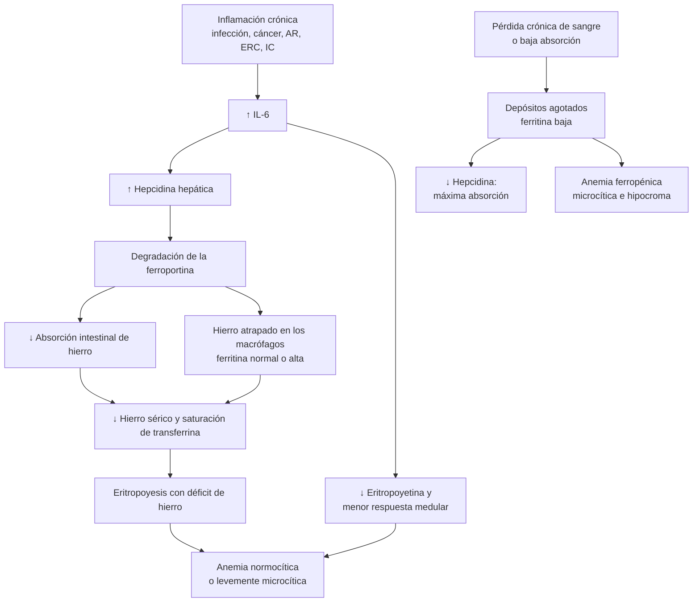
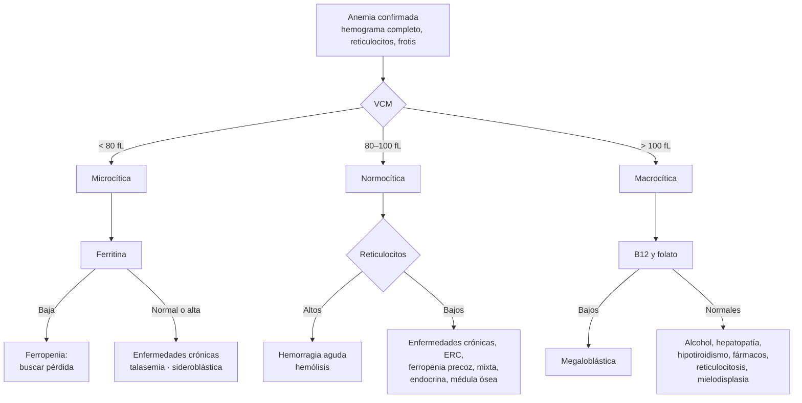

---
tags:
  - Hemato-oncología
  - Frecuente en sala
---

# Anemias: enfoque, ferropénica, de enfermedades crónicas, megaloblástica y hemolítica

**Subespecialidad**
Hematología · Medicina interna · Gastroenterología

**Guías principales**
BSG 2021: anemia ferropénica en adultos (*Gut*) · AGA 2020: evaluación gastrointestinal de la anemia ferropénica · BSH 2014: déficit de cobalamina y folato · Consenso internacional de anemia hemolítica autoinmune (2020) · AABB 2023: transfusión de glóbulos rojos · OMS 2024: puntos de corte de hemoglobina

**Otras fuentes**
GBD 2021 Anaemia (*Lancet Haematol* 2023) · Ensayo MINT (2023) · Estudios chilenos del INTA (Universidad de Chile)

**GES**
No como problema propio. La anemia de la ERC se trata en el GES de la enfermedad renal crónica, y las leucemias y los linfomas tienen sus propios problemas GES

**EUNACOM**
1.08.1.001 Anemia de las enfermedades crónicas (sospecha, inicial, completo) · 1.08.1.002 Anemia ferropénica (específico, completo, completo) · 1.08.1.003 Anemia hemolítica (sospecha, inicial, derivar) · 1.08.1.004 Anemia megaloblástica (sospecha, inicial, completo)

**Revisado**
Septiembre 2026

!!! abstract "Resumen en 60 segundos"
    - **Anemia**: hemoglobina **< 13 g/dL en hombres** y **< 12 g/dL en mujeres** no embarazadas (OMS). Es un **signo**, no un diagnóstico: siempre hay que buscar la causa.
    - **Clasificar por el VCM y los reticulocitos**:
        - **Microcítica**: ferropenia, anemia de enfermedades crónicas, talasemia.
        - **Normocítica**: enfermedades crónicas, ERC, hemorragia aguda, hemólisis, médula ósea.
        - **Macrocítica**: B12, folato, alcohol, hígado, hipotiroidismo, fármacos, mielodisplasia.
    - **Anemia ferropénica**: la más frecuente del mundo. **Ferritina < 30 ng/mL** la confirma; con inflamación, ferritina < 100 y saturación de transferrina < 20 %.
    - **Toda ferropenia en un hombre o en una mujer posmenopáusica** obliga a buscar una **pérdida digestiva**: endoscopía alta y colonoscopía, más serología de enfermedad celíaca.
    - **Fierro oral** en una dosis diaria o **en días alternos** (se absorbe mejor). **Fierro EV** si hay intolerancia, falla, malabsorción o necesidad de una respuesta rápida.
    - **Megaloblástica**: dar **B12 antes que el ácido fólico** (el folato solo puede empeorar el daño neurológico). La B12 oral en dosis altas es tan eficaz como la IM.
    - **Hemólisis**: LDH alta, bilirrubina indirecta alta, **haptoglobina baja** y reticulocitos altos. Pedir el **Coombs directo** y el **frotis** (los **esquistocitos** son una emergencia: PTT o SHU).
    - **Transfusión restrictiva**: umbral de **Hb < 7 g/dL** en la mayoría, y < 8 g/dL con enfermedad cardiovascular.

## Definición

La **anemia** es la disminución de la **masa de glóbulos rojos** o de la concentración de **hemoglobina** bajo el valor normal para la edad, el sexo y el embarazo. Reduce la capacidad de transporte de oxígeno.

| Grupo (OMS) | Anemia si la Hb es menor que |
|---|---|
| Hombres ≥ 15 años | **13,0 g/dL** |
| Mujeres no embarazadas ≥ 15 años | **12,0 g/dL** |
| Embarazadas, primer y tercer trimestre | **11,0 g/dL** |
| Embarazadas, segundo trimestre | 10,5 g/dL |

**Gravedad** (OMS, adultos no embarazados):

- **Leve**: 11–11,9 g/dL (mujeres) o 11–12,9 g/dL (hombres).
- **Moderada**: 8–10,9 g/dL.
- **Grave**: < 8 g/dL.

## Epidemiología

### Mundial

- **GBD 2021**:
    - **1.920 millones** de personas con anemia (**24,3 %** de la población mundial), contra 28,2 % en 1990.
    - Causó **52 millones** de años vividos con discapacidad.
    - Las más afectadas son las **mujeres**, los **menores de 5 años** y las regiones de África subsahariana y Asia del Sur.
    - Las causas principales fueron la **ferropenia dietaria** (la primera), las **hemoglobinopatías y anemias hemolíticas**, y las enfermedades tropicales desatendidas. Juntas explican el **84,7 %** de la carga.
- En los **adultos mayores**, un **10–20 %** tiene anemia. Un tercio se debe a una deficiencia nutricional, un tercio a una enfermedad crónica o una ERC, y un tercio queda sin explicación. Se asocia a caídas, deterioro funcional y mortalidad.
- En los **pacientes hospitalizados**, la anemia es la regla (inflamación, flebotomías, hemodilución).

### Chile

!!! chile "Datos nacionales"
    - **Mujeres en edad fértil**: la prevalencia de anemia fue de **6–10 %** entre 1981 y 2010, sin cambios significativos. La **ferropenia** fue su causa principal (**55–85 %**), y más del 60 % tenía un estado de hierro normal (Ríos-Castillo, INTA, 2013).
    - **Fortificación de alimentos**:
        - La **harina de trigo** se fortifica con **hierro** y vitaminas del complejo B desde hace décadas.
        - Se fortifica con **ácido fólico** desde el **año 2000** (Hertrampf, 2008). Por eso el **déficit de folato es raro en Chile**, y una macrocitosis debe hacer pensar primero en **B12**, **alcohol** o **fármacos**.
    - **Vitamina B12 en adultos mayores**:
        - En diabéticos mayores, el uso de **metformina en dosis altas (≥ 2.550 mg/día)** se asoció a **déficit de B12** (Sánchez, INTA, 2014).
        - Los alimentos del Programa de Alimentación Complementaria del Adulto Mayor (**PACAM**) aportan una dosis de B12 **insuficiente** para prevenir el déficit (Sánchez, 2013).
    - Chile tiene una **alta prevalencia de *Helicobacter pylori***. Esta infección, la gastritis atrófica autoinmune y la **enfermedad celíaca** son causas de ferropenia refractaria al fierro oral.

## Etiología y factores de riesgo

### Clasificación fisiopatológica

| Mecanismo | Reticulocitos | Ejemplos |
|---|---|---|
| **Producción insuficiente** (hipoproliferativa) | **Bajos** | Ferropenia, enfermedades crónicas, **ERC** (déficit de eritropoyetina), B12 o folato, hipotiroidismo, **aplasia**, **mielodisplasia**, infiltración medular (leucemia, mieloma, metástasis), alcohol |
| **Pérdida** (hemorragia aguda) | Altos (después de 3–5 días) | Hemorragia digestiva, trauma, cirugía, hemorragia ginecológica |
| **Destrucción** (hemólisis) | **Altos** | Autoinmune, microangiopática (PTT, SHU, CID, válvulas), esferocitosis, déficit de G6PD, hemoglobinopatías, HPN, malaria, fármacos |

### Causas de ferropenia en el adulto

- **Pérdidas**:
    - **Menstruación abundante**: la causa más frecuente en las mujeres premenopáusicas.
    - **Pérdida digestiva**: **cáncer colorrectal** o **gástrico**, úlcera péptica, esofagitis, angiodisplasias, AINE y aspirina, EII.
    - Hematuria, donación de sangre frecuente, flebotomías.
- **Absorción deficiente**:
    - **Enfermedad celíaca**.
    - **Gastritis atrófica** autoinmune o por ***H. pylori***.
    - **Cirugía bariátrica** o gastrectomía.
    - Uso de **IBP**.
- **Aumento de requerimientos**: embarazo, lactancia, tratamiento con eritropoyetina.
- **Aporte insuficiente**: dietas vegetarianas estrictas. En los adultos es **rara como causa única**.

### Causas de macrocitosis

- **Megaloblástica**:
    - **Déficit de B12**: **anemia perniciosa** (autoinmune: anticuerpos contra el factor intrínseco y las células parietales), **metformina**, **IBP** crónicos, gastrectomía y cirugía bariátrica, resección ileal o **Crohn ileal**, veganos, sobrecrecimiento bacteriano, *Diphyllobothrium*.
    - **Déficit de folato**: alcoholismo, desnutrición, embarazo, hemólisis crónica, **metotrexato**, trimetoprim, fenitoína.
    - **Fármacos** que alteran la síntesis de ADN: hidroxiurea, azatioprina, zidovudina, capecitabina.
- **No megaloblástica**: **alcohol**, **hepatopatía**, **hipotiroidismo**, **reticulocitosis** (hemólisis o hemorragia), **mielodisplasia**, mieloma.

## Fisiopatología

- **Hepcidina**: la hormona hepática que **regula el hierro**. Bloquea la ferroportina, el canal que saca el hierro de los enterocitos y los macrófagos.
    - **Ferropenia**: la hepcidina **baja** y se absorbe más hierro.
    - **Inflamación**: la **IL-6** **sube la hepcidina**. El hierro queda "secuestrado" en los macrófagos: **hay hierro en el cuerpo, pero no llega a la médula** (anemia de enfermedades crónicas o de la inflamación). La inflamación también reduce la eritropoyetina y la vida de los glóbulos rojos.
    - **Consecuencia práctica**: el **fierro oral** en dosis altas o **diarias** sube la hepcidina durante ~ 24 h y **reduce su propia absorción**. Por eso las **dosis en días alternos** se absorben mejor (Stoffel, 2017).
- **Anemia megaloblástica**: la B12 y el folato son necesarios para sintetizar la **timidina** (ADN). Sin ellos, el núcleo madura más lento que el citoplasma y se producen **células grandes** (megaloblastos) que mueren en la médula (**eritropoyesis ineficaz**). Por eso la LDH sube y puede haber pancitopenia.
    - La **B12** también es necesaria para la **mielina** (vía de la metilmalonil-CoA). Su déficit produce **degeneración combinada subaguda** de la médula aun **sin anemia**.
- **Hemólisis**:
    - **Intravascular**: libera hemoglobina libre, que la **haptoglobina** capta (por eso baja). Produce **hemoglobinuria** y hemosiderinuria.
    - **Extravascular**: los macrófagos del **bazo** o del hígado destruyen los glóbulos rojos. Produce **esplenomegalia**, ictericia y cálculos pigmentarios.

*Figura 1. Hepcidina: anemia de enfermedades crónicas (izquierda) y anemia ferropénica (derecha). Esquema propio.*

## Clasificación

*Figura 2. Enfoque de la anemia según el volumen corpuscular medio y los reticulocitos. Esquema propio.*

- **Por el VCM**: microcítica (< 80 fL), normocítica (80–100 fL), macrocítica (> 100 fL).
- **Por los reticulocitos**:
    - **Regenerativa**: índice reticulocitario > 2 %. Hay hemólisis o hemorragia.
    - **Arregenerativa**: índice reticulocitario < 2 %. Hay un problema de producción.
    - **Índice reticulocitario** = reticulocitos (%) × (Hto del paciente / 45) ÷ factor de maduración (1 si el Hto es 45 %, 1,5 si es 35 %, 2 si es 25 %).
- **Por la velocidad de instalación**: aguda (hemorragia, hemólisis) o crónica (bien tolerada aun con Hb muy baja).

## Clínica

- **Síntomas del síndrome anémico**:
    - **Fatiga**, disnea de esfuerzo, palpitaciones, cefalea, mareos.
    - Menor tolerancia al ejercicio.
    - **Angina** o **insuficiencia cardíaca** en los pacientes con cardiopatía.
- **Signos**: **palidez** de piel y mucosas (conjuntivas, lechos ungueales), taquicardia, **soplo sistólico funcional**. En la anemia aguda: hipotensión.
- **Claves de la causa**:

| Tipo | Signos característicos |
|---|---|
| **Ferropénica** | **Pica** (hielo, tierra), **coiloniquia** (uñas en cuchara), queilitis angular, glositis, **síndrome de piernas inquietas**, caída del pelo |
| **Déficit de B12** | **Glositis** (lengua roja y lisa), ictericia leve ("color limón"), **parestesias** en pies y manos, **pérdida de la sensibilidad vibratoria y propioceptiva**, ataxia con Romberg positivo, **deterioro cognitivo**, depresión, psicosis |
| **Hemolítica** | **Ictericia**, **coluria** u orina oscura (hemoglobinuria), **esplenomegalia**, litiasis biliar pigmentaria, úlceras en las piernas (anemias hereditarias) |
| **Infiltración medular** | **Bicitopenia o pancitopenia**, fiebre, infecciones, sangrado, adenopatías, hepatoesplenomegalia, dolor óseo |

!!! alarma "Anemia con signos de alarma"
    - **Anemia aguda con inestabilidad hemodinámica**: buscar una **hemorragia** y reanimar.
    - **Anemia con esquistocitos y trombocitopenia**: **microangiopatía trombótica** (PTT o SHU). Es una **emergencia**, derivar de inmediato.
    - **Pancitopenia** o **blastos** en el frotis: leucemia aguda o aplasia. Hospitalizar y derivar a hematología.
    - **Anemia ferropénica en un hombre** o en una mujer posmenopáusica: **cáncer digestivo** hasta demostrar lo contrario.
    - **Déficit de B12 con síntomas neurológicos**: tratar de inmediato con B12 IM, porque el daño puede ser irreversible.

## Diagnóstico

**Paso 1. Confirmar la anemia y su gravedad**:

- Anamnesis:
    - Sangrado digestivo o ginecológico.
    - Dieta.
    - **Fármacos**: AINE, anticoagulantes, metformina, IBP, metotrexato.
    - Alcohol.
    - Cirugías previas.
    - Antecedentes familiares.
- Examen físico completo, con **tacto rectal** si hay sospecha de sangrado digestivo.

**Paso 2. Primer nivel de exámenes**:

- **Hemograma** con índices (VCM, HCM, **ADE**) y recuento de plaquetas y leucocitos.
- **Reticulocitos**.
- **Frotis de sangre periférica**.

**Paso 3. Según el VCM y los reticulocitos** (figura 2):

- **Microcítica**: **ferritina**, **saturación de transferrina** y PCR.
- **Macrocítica**: **B12** y **folato**, TSH, pruebas hepáticas.
- **Regenerativa**: exámenes de **hemólisis** (LDH, bilirrubina, haptoglobina, Coombs directo, frotis).
- **Arregenerativa normocítica**: creatinina, ferritina, TSH, PCR, electroforesis de proteínas si hay sospecha de mieloma.

**Paso 4. Buscar la causa de la ferropenia** (BSG 2021 y AGA 2020):

- **Hombres** y **mujeres posmenopáusicas** con anemia ferropénica: **endoscopía alta con biopsias duodenales** y **colonoscopía** (estudio bidireccional). Si la **serología para enfermedad celíaca** (IgA anti-transglutaminasa) es positiva, la biopsia duodenal la confirma.
- **Mujeres premenopáusicas**:
    - Serología para enfermedad celíaca.
    - Estudio digestivo si hay síntomas, **edad ≥ 50 años**, antecedente familiar de cáncer colorrectal o falla del tratamiento.
- **Orina completa**, para buscar **hematuria**.
- Si la endoscopía y la colonoscopía son normales y la anemia persiste o recurre: **cápsula endoscópica** (intestino delgado) y búsqueda de *H. pylori*.

<figure markdown>
{ loading=lazy }
<figcaption>Figura 3. Algoritmo de manejo de la anemia ferropénica en adultos (BSG 2021). IRT: terapia de reposición de fierro; OGD: endoscopía digestiva alta. Fuente: Snook J, Bhala N, Beales ILP, et al. British Society of Gastroenterology guidelines for the management of iron deficiency anaemia in adults. <em>Gut.</em> 2021;70:2030–2051, figura 2. Licencia <a href="https://creativecommons.org/licenses/by-nc/4.0/">CC BY-NC 4.0</a>.</figcaption>
</figure>

## Laboratorio

### Estudio de hierro

| Parámetro | **Ferropenia** | **Enfermedades crónicas** | **Mixta** | **Talasemia menor** |
|---|---|---|---|---|
| **VCM** | Bajo | Normal o algo bajo | Bajo o normal | **Muy bajo** (< 75) con **recuento de GR normal o alto** |
| **ADE** (anisocitosis) | **Alto** | Normal | Alto | Normal o algo alto |
| **Ferritina** | **< 30 ng/mL** (< 15 es diagnóstico) | **Normal o alta** (> 100) | **30–100** | Normal |
| **Saturación de transferrina** | **< 20 %** (a menudo < 10 %) | < 20 % | < 20 % | Normal |
| **Transferrina / TIBC** | **Alta** | **Baja o normal** | Normal | Normal |
| **Receptor soluble de transferrina** | Alto | Normal | Alto | Alto |
| **PCR** | Normal | **Alta** | Alta | Normal |
| **Electroforesis de Hb** | Normal | Normal | Normal | **Hb A₂ > 3,5 %** (β-talasemia) |

- **Ferritina**:
    - Es el mejor examen para la ferropenia. Una ferritina **< 15 ng/mL** la confirma (especificidad cercana al 100 %).
    - La BSG considera probable la ferropenia con una ferritina **< 30 ng/mL**, y la AGA usa un punto de corte de **< 45 ng/mL**.
    - La ferritina es un **reactante de fase aguda**: con **inflamación** (PCR alta, ERC, IC), una ferritina de hasta **100 ng/mL** con **saturación < 20 %** sugiere ferropenia.
- **Índice de Mentzer** (VCM / recuento de GR en millones): **< 13** sugiere talasemia; **> 13** sugiere ferropenia.
- **Frotis**:
    - Hipocromía y microcitosis, "células en lápiz": ferropenia.
    - **Macroovalocitos** y **neutrófilos hipersegmentados** (≥ 6 lóbulos): megaloblástica.
    - **Esquistocitos**: microangiopatía.
    - **Esferocitos**: hemólisis autoinmune o esferocitosis hereditaria.
    - Dianocitos: talasemia o hepatopatía.
    - Rouleaux: mieloma.
    - Blastos: leucemia.
    - Dacriocitos: mielofibrosis.

### B12 y folato

- **B12 sérica**:
    - **< 148 pmol/L (< 200 pg/mL)**: déficit probable.
    - **148–221 pmol/L**: zona gris. Medir el **ácido metilmalónico** (alto en el déficit de B12) o la **homocisteína** (alta en el déficit de B12 y de folato).
- **Anemia perniciosa**: **anticuerpos anti-factor intrínseco** (muy específicos, sensibilidad ~ 50 %) y anti-células parietales (sensibles, poco específicos). Gastrina alta. La endoscopía muestra una gastritis atrófica del cuerpo; vigilarla, porque aumenta el riesgo de cáncer gástrico y de tumores neuroendocrinos.
- **Folato sérico** < 7 nmol/L (< 3 ng/mL): déficit.
- La **megaloblástica** muestra **LDH muy alta**, bilirrubina indirecta alta y a veces **pancitopenia** (eritropoyesis ineficaz). Puede **simular una hemólisis** o una leucemia.

### Hemólisis

| Examen | Resultado en la hemólisis |
|---|---|
| **Reticulocitos** | **Altos** |
| **LDH** | **Alta** |
| **Bilirrubina indirecta** | **Alta** |
| **Haptoglobina** | **Baja** (el examen más específico) |
| **Coombs directo** (prueba de antiglobulina directa) | **Positivo** en la hemólisis **autoinmune**: IgG (anemia hemolítica autoinmune por anticuerpos calientes) o C3 (enfermedad por aglutininas frías) |
| **Frotis** | **Esferocitos** (autoinmune, hereditaria), **esquistocitos** (microangiopática), células mordidas (déficit de G6PD) |
| **Orina** | **Hemoglobinuria** (orina oscura sin glóbulos rojos en el sedimento) en la intravascular |

## Imágenes

- En general, **no se necesitan** para la anemia en sí. Se usan para buscar la causa:
    - **Endoscopía alta y colonoscopía**: en la ferropenia (ver diagnóstico).
    - **Cápsula endoscópica** y enteroscopía: sangrado del intestino delgado (angiodisplasias, tumores, Crohn).
    - **Ecografía abdominal**: **esplenomegalia** (hemólisis, linfoma, hepatopatía), litiasis biliar pigmentaria.
    - **TC** de tórax, abdomen y pelvis: sospecha de neoplasia o de linfoma.
- **Mielograma y biopsia de médula ósea** (hematólogo): pancitopenia sin causa, blastos, sospecha de mielodisplasia, aplasia o infiltración.

## Diagnóstico diferencial

| Cuadro | Claves |
|---|---|
| **Talasemia menor** | Microcitosis marcada con **Hb casi normal**, recuento de GR **alto**, ferritina normal, **Mentzer < 13**. **No dar fierro** (sólo si hay ferropenia asociada) |
| **Anemia sideroblástica** | Microcítica o dimórfica, ferritina alta, **sideroblastos en anillo** en la médula. Puede ser por alcohol, déficit de B6 (isoniazida), plomo o cobre, o por una mielodisplasia |
| **Anemia de la ERC** | Normocítica, arregenerativa, con **TFG < 30–45**. Descartar primero la ferropenia; luego **agentes estimulantes de la eritropoyesis** (ver ERC) |
| **Hipotiroidismo** | Anemia normocítica o macrocítica leve; TSH alta |
| **Mielodisplasia** | Adulto mayor, **macrocitosis** con citopenias, B12 y folato normales, displasia en el frotis |
| **Mieloma** | Anemia normocítica, **rouleaux**, VHS muy alta, hipercalcemia, falla renal, dolor óseo |
| **Hemodilución** | Embarazo, sobrecarga de volumen, sueros |

## Tratamiento

### Anemia ferropénica

!!! guia "BSG 2021"
    - **Tratar la causa** y **reponer el fierro** en todos los pacientes con anemia ferropénica, en paralelo con el estudio.
    - **Fierro oral**: **una tableta al día** (por ejemplo, 65 mg de hierro elemental). Si hay efectos adversos, usar dosis más bajas o **en días alternos**. Mantener el tratamiento **~ 3 meses después** de normalizar la Hb, para llenar los depósitos.
    - **Fierro EV** si: intolerancia o falla del fierro oral, **malabsorción** (celíaca, cirugía bariátrica, EII activa), **ERC**, **insuficiencia cardíaca**, pérdidas que superan la absorción, o necesidad de una recuperación rápida (tercer trimestre del embarazo, cirugía cercana).
    - **Control**: Hb a las **2–4 semanas**. Se espera un **aumento de ~ 1 g/dL en 2 semanas** (o ≥ 2 g/dL al mes). Si no ocurre, revisar la adherencia, la pérdida persistente, la malabsorción y el diagnóstico.
    - Luego, hemograma cada 3 meses durante 1 año y después según la clínica, para detectar la recurrencia.

!!! dosis "Fierro"
    - **Sulfato ferroso** 200 mg (≈ **65 mg de hierro elemental**):
        - **1 tableta al día** o **en días alternos**, en ayunas o con **vitamina C** (jugo de naranja).
        - No tomarlo con té, café, lácteos, calcio, antiácidos ni IBP.
        - Efectos adversos: náuseas, dolor epigástrico, **constipación**, deposiciones negras (**no** son melena).
    - **Fierro EV**:
        - **Carboximaltosa férrica**: hasta **1.000 mg** (máximo 20 mg/kg) por dosis, en 15 minutos; puede producir **hipofosfemia** (Wolf, 2020).
        - **Hierro sacarosa**: **200 mg** por dosis, en infusión de 30 minutos, 2–3 veces por semana hasta completar el déficit.
        - Vigilar las **reacciones de hipersensibilidad** (raras con las formulaciones actuales). **No** usarlo en las infecciones activas ni en el primer trimestre del embarazo.
    - **Déficit total de hierro (fórmula de Ganzoni)**: peso (kg) × [Hb objetivo − Hb actual (g/dL)] × 2,4 + 500 mg (depósitos).

### Anemia de enfermedades crónicas

- **Tratar la enfermedad de base**: infección, cáncer, enfermedad autoinmune, IC.
- **Fierro EV** si coexiste una ferropenia (ferritina < 100 y saturación < 20 %). El fierro oral se absorbe mal por la hepcidina alta.
- **Agentes estimulantes de la eritropoyesis** (eritropoyetina, darbepoetina) en la **ERC** y en la anemia por quimioterapia. Meta de **Hb 10–11,5 g/dL**; no buscar una Hb normal (más ACV y trombosis).
- **Transfusión** según los umbrales (ver abajo).

### Anemia megaloblástica

!!! dosis "Vitamina B12 y ácido fólico"
    - **Déficit de B12 con compromiso neurológico o anemia grave**: **B12 IM**.
        - **Hidroxocobalamina 1 mg IM** en días alternos hasta que no haya más mejoría neurológica (BSH), o **cianocobalamina 1.000 µg IM** al día o en días alternos por 1–2 semanas.
        - Luego **semanal** hasta normalizar la Hb.
        - Después **cada 1–3 meses de por vida** en la **anemia perniciosa** o la malabsorción irreversible.
    - **Déficit de B12 sin compromiso neurológico**: **B12 oral 1.000–2.000 µg al día** es tan eficaz como la IM, incluso en la anemia perniciosa: una pequeña fracción se absorbe por difusión pasiva sin factor intrínseco.
    - **Ácido fólico 5 mg VO al día** por **4 meses** (o mientras persista la causa).
    - **Nunca dar ácido fólico solo** sin descartar o tratar antes el déficit de B12: corrige la anemia pero **no** el daño neurológico, que puede progresar.
    - **Respuesta esperada**:
        - **Reticulocitosis** a los **5–7 días**.
        - Hb normal en **~ 8 semanas**.
        - Los síntomas neurológicos mejoran en meses y pueden no revertir por completo.
    - **Al inicio del tratamiento**: vigilar la **hipokalemia** (el potasio entra a las células nuevas) y la ferropenia asociada.

### Anemia hemolítica (manejo inicial y derivación)

- **Hospitalizar** si la anemia es grave o progresa rápido, y **derivar a hematología**.
- **Ácido fólico 5 mg/día** (la hemólisis crónica consume folato).
- **Suspender los fármacos** sospechosos.
- **Anemia hemolítica autoinmune por anticuerpos calientes** (IgG, Coombs positivo):
    - **Prednisona 1 mg/kg/día**, con **rituximab** en los casos graves o que recaen (consenso internacional 2020).
    - Buscar una causa secundaria: **LLC**, linfoma, **LES**, fármacos.
    - Transfundir si es necesario (no postergar por la dificultad de la prueba cruzada).
- **Enfermedad por aglutininas frías** (C3): **evitar el frío** (abrigo, sueros tibios) y usar rituximab. Los **corticoides no sirven**. Buscar un linfoma, un *Mycoplasma* o el VEB.
- **Microangiopatía trombótica** (anemia hemolítica con **esquistocitos** + **trombocitopenia**):
    - **PTT** (fiebre, compromiso neurológico, falla renal leve; **ADAMTS13 < 10 %**; puntaje **PLASMIC ≥ 6** = alta probabilidad): es una **emergencia**. Iniciar **plasmaféresis** y corticoides de inmediato, sin esperar el ADAMTS13. **No transfundir plaquetas**.
    - **SHU**: diarrea por *E. coli* productora de toxina Shiga o forma atípica por complemento.
    - Otras: CID, HTA maligna, preeclampsia o síndrome HELLP.
- **Déficit de G6PD**: evitar los oxidantes (primaquina, dapsona, sulfas, rasburicasa, habas).

### Transfusión de glóbulos rojos

!!! guia "AABB 2023"
    - **Estrategia restrictiva** en los adultos hospitalizados hemodinámicamente estables: transfundir con **Hb < 7 g/dL**.
    - **Hb < 7,5 g/dL** en la cirugía cardíaca, y **< 8 g/dL** en la cirugía ortopédica o con **enfermedad cardiovascular** preexistente.
    - **Infarto agudo al miocardio con anemia**: en el ensayo **MINT** (2023), la estrategia **liberal** (Hb < 10) tuvo una tendencia a menos muerte o reinfarto a 30 días, sin diferencia significativa. En la práctica, se usan umbrales más altos (8–10 g/dL).
    - En la **hemorragia activa**, la decisión se basa en la **hemodinamia** y la velocidad del sangrado, no en la Hb.
    - **Una unidad a la vez**, y reevaluar. Una unidad sube la Hb en **~ 1 g/dL**.
    - **No** transfundir la anemia ferropénica, la megaloblástica ni la de la ERC si el paciente está estable: **reponer lo que falta**.

## Complicaciones

- **Cardiovasculares**: angina, **insuficiencia cardíaca** de alto gasto, arritmias.
- **Neurológicas** (déficit de B12): **degeneración combinada subaguda**, neuropatía, **demencia reversible**, psicosis.
- **Hemólisis**: litiasis biliar pigmentaria, **crisis aplásica** por parvovirus B19, sobrecarga de hierro (hemólisis crónica y transfusiones), trombosis (HPN, anemia hemolítica autoinmune).
- **Del tratamiento**:
    - **Transfusión**: sobrecarga de volumen (TACO), reacciones febriles y alérgicas, reacción hemolítica aguda por incompatibilidad ABO, lesión pulmonar aguda (TRALI).
    - **Fierro EV**: hipersensibilidad, hipofosfemia.
- **Adultos mayores**: caídas, deterioro funcional, delirium, mayor mortalidad.

## Pronóstico y seguimiento

- **Depende de la causa**. La ferropenia y la anemia megaloblástica **se corrigen por completo** con tratamiento. El pronóstico de fondo lo da la causa (por ejemplo, un cáncer de colon).
- **Perfil EUNACOM**:
    - **Anemia ferropénica**: diagnóstico específico, tratamiento y seguimiento **completos**. Incluye pedir el estudio digestivo que corresponde.
    - **Megaloblástica**: sospecha, tratamiento inicial y seguimiento **completo**.
    - **Enfermedades crónicas**: sospecha, tratamiento inicial y seguimiento **completo**.
    - **Hemolítica**: sospecha, tratamiento inicial y **derivación**.
- **Seguimiento**:
    - **Ferropénica**: Hb a las 2–4 semanas. Luego hemograma y **ferritina a los 3 meses** del término del tratamiento, y cada 3 meses durante el primer año.
    - **Déficit de B12**: tratamiento **de por vida** si la causa persiste (anemia perniciosa, gastrectomía). En los usuarios de **metformina** o **IBP**, medir la B12 **periódicamente**.
    - **Anemia perniciosa**: considerar una endoscopía de vigilancia por el riesgo de cáncer gástrico.

## Perlas para el internado

!!! perla "Para la sala y el turno"
    - **Pide los reticulocitos y el frotis** junto con el hemograma: sin ellos no puedes clasificar la anemia.
    - **Una ferritina "normal" no descarta la ferropenia** si hay inflamación: mira la **saturación de transferrina**.
    - Si un **hombre** tiene **anemia ferropénica**, la pregunta no es "¿qué fierro le doy?", sino "**¿dónde está sangrando?**". Pide endoscopía y colonoscopía.
    - **Deposiciones negras con fierro oral**: no son melena. Diferéncialas por el olor, la consistencia y la hemodinamia; ante la duda, haz un tacto rectal.
    - **Macrocitosis con pancitopenia y LDH muy alta** en un adulto mayor: piensa en un **déficit de B12** antes que en una leucemia.
    - **Nunca des ácido fólico solo** a un paciente con macrocitosis sin medir la B12.
    - **Metformina + neuropatía**: mide la B12.
    - **Esquistocitos + plaquetas bajas** = llama al hematólogo **ahora** (PTT).
    - **Toma las muestras de B12, folato, ferritina y hemólisis antes de transfundir**: después se alteran.

## Preguntas de repaso

??? repaso "1. Hombre de 62 años con fatiga. Hb 9,8 g/dL, VCM 72 fL, ADE alto, ferritina 8 ng/mL. No refiere sangrado. ¿Qué haces?"
    Tiene una **anemia ferropénica** confirmada (ferritina < 15). En un **hombre**, la causa más probable es una **pérdida digestiva oculta**, y hay que descartar un **cáncer de colon o gástrico**.

    - **Endoscopía alta con biopsias duodenales** y **colonoscopía**.
    - **Serología para enfermedad celíaca** y orina completa.
    - En paralelo, **sulfato ferroso** 1 tableta al día o en días alternos.
    - Hb de control a las 2–4 semanas. Continuar el fierro 3 meses después de normalizar la Hb.

??? repaso "2. Mujer de 58 años con artritis reumatoide activa. Hb 10,2 g/dL, VCM 84 fL, ferritina 180 ng/mL, saturación de transferrina 14 %, PCR 45 mg/L. ¿Qué tipo de anemia tiene?"
    Es una **anemia de enfermedades crónicas** (o de la inflamación): normocítica, con **ferritina alta** (reactante de fase aguda) y saturación baja. La **IL-6 sube la hepcidina** y el hierro queda atrapado en los macrófagos.

    - El tratamiento es **controlar la artritis reumatoide**.
    - El fierro oral no sirve.
    - Si hubiera ferropenia asociada (ferritina < 100 con saturación < 20 %), se usaría **fierro EV**.

??? repaso "3. Hombre de 70 años, diabético y usuario de metformina 2.550 mg/día y de omeprazol hace años, con parestesias en los pies, marcha inestable y Hb 10,5 g/dL con VCM 112 fL. ¿Qué sospechas y cómo lo tratas?"
    Sospecha de **déficit de vitamina B12** por **metformina** e **IBP**, con **anemia megaloblástica** y compromiso **neurológico** (neuropatía, compromiso de los cordones posteriores).

    1. Confirmar con la **B12 sérica** (y el ácido metilmalónico si está en zona gris). Medir el folato. Considerar los anticuerpos anti-factor intrínseco.
    2. Como hay **síntomas neurológicos**, tratar con **B12 IM** en días alternos, luego semanal y después mensual.
    3. **No dar ácido fólico solo**.
    4. Vigilar el potasio al inicio.
    5. Esperar reticulocitosis a los 5–7 días.
    6. Reevaluar la dosis de metformina y la necesidad del IBP.

??? repaso "4. Mujer de 35 años con ictericia, coluria y Hb 7,5 g/dL. Reticulocitos 9 %, LDH 850 U/L, bilirrubina indirecta 3,5 mg/dL, haptoglobina indetectable. El frotis muestra esferocitos y el Coombs directo es positivo (IgG). ¿Cuál es el diagnóstico y el manejo inicial?"
    Es una **anemia hemolítica autoinmune por anticuerpos calientes** (IgG).

    - **Hospitalizar** y **derivar a hematología**.
    - **Prednisona 1 mg/kg/día** y **ácido fólico**.
    - Transfundir si hay compromiso hemodinámico o síntomas graves.
    - Buscar una causa secundaria: **LES**, LLC o linfoma, fármacos.
    - Usar **rituximab** si es refractaria o grave.

??? repaso "5. Paciente con anemia, plaquetas de 18.000/mm³, esquistocitos en el frotis, fiebre y confusión. ¿Qué sospechas y qué haces?"
    **Microangiopatía trombótica**, sobre todo una **púrpura trombocitopénica trombótica** (PTT): anemia hemolítica microangiopática + trombocitopenia + compromiso neurológico, por déficit de **ADAMTS13**. Es una **emergencia**.

    - Calcular el **PLASMIC**.
    - Enviar la muestra de ADAMTS13 **antes** de tratar, pero **no esperar** su resultado.
    - Iniciar **plasmaféresis** urgente y corticoides.
    - **No transfundir plaquetas** (empeoran la trombosis), salvo una hemorragia con riesgo vital.

??? repaso "6. ¿Cómo distingues una talasemia menor de una anemia ferropénica?"
    - La **talasemia menor** tiene una microcitosis **marcada** (VCM a menudo < 70–75) con **Hb normal o casi normal** y un **recuento de glóbulos rojos alto**. El ADE es normal, la ferritina normal y el **índice de Mentzer < 13**. En la β-talasemia, la electroforesis muestra una **Hb A₂ > 3,5 %**.
    - La **ferropenia** tiene un **ADE alto**, **ferritina baja** y un recuento de glóbulos rojos bajo (Mentzer > 13).
    - A la talasemia **no** se le da fierro, salvo que tenga además una ferropenia.

## Referencias

1. Snook J, Bhala N, Beales ILP, et al. British Society of Gastroenterology guidelines for the management of iron deficiency anaemia in adults. *Gut.* 2021;70:2030–2051. doi:[10.1136/gutjnl-2021-325210](https://doi.org/10.1136/gutjnl-2021-325210)
2. Ko CW, Siddique SM, Patel A, et al. AGA Clinical Practice Guidelines on the Gastrointestinal Evaluation of Iron Deficiency Anemia. *Gastroenterology.* 2020;159:1085–1094. doi:[10.1053/j.gastro.2020.06.046](https://doi.org/10.1053/j.gastro.2020.06.046)
3. Devalia V, Hamilton MS, Molloy AM; British Committee for Standards in Haematology. Guidelines for the diagnosis and treatment of cobalamin and folate disorders. *Br J Haematol.* 2014;166:496–513. doi:[10.1111/bjh.12959](https://doi.org/10.1111/bjh.12959)
4. Jäger U, Barcellini W, Broome CM, et al. Diagnosis and treatment of autoimmune hemolytic anemia in adults: Recommendations from the First International Consensus Meeting. *Blood Rev.* 2020;41:100648. doi:[10.1016/j.blre.2019.100648](https://doi.org/10.1016/j.blre.2019.100648)
5. Carson JL, Stanworth SJ, Guyatt G, et al. Red Blood Cell Transfusion: 2023 AABB International Guidelines. *JAMA.* 2023;330:1892–1902. doi:[10.1001/jama.2023.12914](https://doi.org/10.1001/jama.2023.12914)
6. Carson JL, Brooks MM, Hébert PC, et al. Restrictive or Liberal Transfusion Strategy in Myocardial Infarction and Anemia (MINT). *N Engl J Med.* 2023;389:2446–2456. doi:[10.1056/NEJMoa2307983](https://doi.org/10.1056/NEJMoa2307983)
7. World Health Organization. Guideline on haemoglobin cutoffs to define anaemia in individuals and populations. Geneva: WHO; 2024. [who.int](https://www.who.int/publications/i/item/9789240088542)
8. GBD 2021 Anaemia Collaborators. Prevalence, years lived with disability, and trends in anaemia burden by severity and cause, 1990–2021: findings from the Global Burden of Disease Study 2021. *Lancet Haematol.* 2023;10:e713–e734. doi:[10.1016/S2352-3026(23)00160-6](https://doi.org/10.1016/S2352-3026(23)00160-6)
9. Camaschella C. Iron-deficiency anemia. *N Engl J Med.* 2015;372:1832–1843. doi:[10.1056/NEJMra1401038](https://doi.org/10.1056/NEJMra1401038)
10. Stabler SP. Clinical practice. Vitamin B12 deficiency. *N Engl J Med.* 2013;368:149–160. doi:[10.1056/NEJMcp1113996](https://doi.org/10.1056/NEJMcp1113996)
11. Stoffel NU, Cercamondi CI, Brittenham G, et al. Iron absorption from oral iron supplements given on consecutive versus alternate days and as single morning doses versus twice-daily split dosing in iron-depleted women. *Lancet Haematol.* 2017;4:e524–e533. doi:[10.1016/S2352-3026(17)30182-5](https://doi.org/10.1016/S2352-3026(17)30182-5)
12. Wolf M, Rubin J, Achebe M, et al. Effects of Iron Isomaltoside vs Ferric Carboxymaltose on Hypophosphatemia in Iron-Deficiency Anemia: Two Randomized Clinical Trials. *JAMA.* 2020;323:432–443. doi:[10.1001/jama.2019.22450](https://doi.org/10.1001/jama.2019.22450)
13. Bendapudi PK, Hurwitz S, Fry A, et al. Derivation and external validation of the PLASMIC score for rapid assessment of adults with thrombotic microangiopathies. *Lancet Haematol.* 2017;4:e157–e164. doi:[10.1016/S2352-3026(17)30026-1](https://doi.org/10.1016/S2352-3026(17)30026-1)
14. Ríos-Castillo I, Brito A, Olivares M, et al. Low prevalence of iron deficiency anemia between 1981 and 2010 in Chilean women of childbearing age. *Salud Publica Mex.* 2013;55:478–483. doi:[10.21149/spm.v55i5.7247](https://doi.org/10.21149/spm.v55i5.7247)
15. Hertrampf E, Cortés F. National food-fortification program with folic acid in Chile. *Food Nutr Bull.* 2008;29(2 Suppl):S231–S237. doi:[10.1177/15648265080292S128](https://doi.org/10.1177/15648265080292S128)
16. Sánchez H, Masferrer D, Lera L, et al. Vitamin B12 deficiency associated with high doses of metformin in older people diabetic [artículo en español]. *Nutr Hosp.* 2014;29:1394–1400. doi:[10.3305/nh.2014.29.6.7405](https://doi.org/10.3305/nh.2014.29.6.7405)
17. Sanchez H, Albala C, Lera L, Dangour AD, Uauy R. Effectiveness of the National Program of Complementary Feeding for older adults in Chile on vitamin B12 status in older adults; secondary outcome analysis from the CENEX Study. *Nutr J.* 2013;12:124. doi:[10.1186/1475-2891-12-124](https://doi.org/10.1186/1475-2891-12-124)
