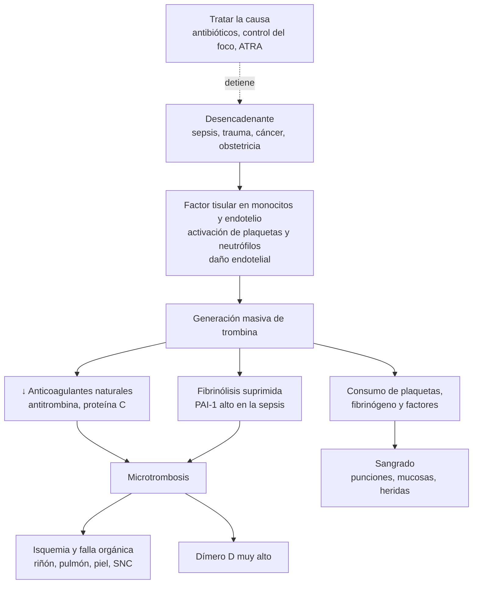

---
tags:
  - Hemato-oncología
  - GES
  - Urgencia
  - Frecuente en sala
---

# Coagulopatías, coagulación intravascular diseminada y reversión de anticoagulantes

**Subespecialidad**
Hematología · Medicina de urgencia · Medicina intensiva

**Guías principales**
ISTH 2025: nueva definición y puntaje de la CID · ACC 2020: sangrado en pacientes con anticoagulantes orales · Neurocritical Care Society/SCCM 2026: hemorragia intracraneal asociada a antitrombóticos · WFH 2020: hemofilia · ASH/ISTH/NHF/WFH 2021: enfermedad de von Willebrand · MINSAL: guía GES de hemofilia

**Otras fuentes**
ANNEXA-I (andexanet, *NEJM* 2024) · REVERSE-AD (idarucizumab, *NEJM* 2017) · ACCP 2012 (manejo del INR elevado)

**GES**
Sí: **hemofilia** (a cualquier edad)

**EUNACOM**
1.08.1.005 Coagulopatías adquiridas (sospecha, inicial, derivar) · 1.08.1.006 Coagulopatías congénitas: hemofilias, von Willebrand (sospecha, inicial, derivar) · 1.08.1.013 Púrpuras vasculares (sospecha, inicial, derivar) · 1.08.2.001 Coagulación intravascular diseminada (sospecha, inicial, no requiere) · 1.08.2.002 Coagulopatía adquirida (sospecha, inicial, completo) · 1.08.2.003 Coagulopatía congénita sangrante (sospecha, inicial, derivar)

**Revisado**
Septiembre 2026

!!! abstract "Resumen en 60 segundos"
    - **El tipo de sangrado orienta**:
        - **Mucocutáneo** (petequias, epistaxis, gingivorragia, menorragia): **plaquetas o von Willebrand**.
        - **Profundo** (hemartrosis, hematomas musculares, sangrado tardío tras una cirugía): **factores de la coagulación** (hemofilia).
    - **Cuatro exámenes iniciales**: **hemograma con plaquetas**, **TP/INR**, **TTPa** y **fibrinógeno**. El patrón define la causa (tabla del diagnóstico).
    - **CID**: activación sistémica de la coagulación, con **microtrombosis**, **consumo** de plaquetas y factores, y **sangrado o falla orgánica**.
        - Causas principales: **sepsis**, trauma, cáncer (leucemia promielocítica), obstetricia.
        - **Puntaje ISTH 2025** de CID manifiesta (**≥ 5**): plaquetas, **dímero D**, TP y fibrinógeno.
        - **Tratar la causa**. Transfundir sólo si hay **sangrado** o un procedimiento.
    - **Reversión de anticoagulantes con sangrado grave**:
        - **AVK** (en Chile, **acenocumarol**): **vitamina K 10 mg EV + CCP de 4 factores**.
        - **Dabigatrán**: **idarucizumab 5 g EV**.
        - **Anti-Xa** (rivaroxabán, apixabán): **CCP de 4 factores 50 U/kg**; la NCS/SCCM 2026 lo prefiere sobre el andexanet en la hemorragia intracraneal.
        - **Heparina**: **protamina**.
    - **Hemofilia** (GES): déficit de **FVIII (A)** o **FIX (B)**, ligada al X. **TTPa prolongado**, TP y plaquetas normales. Ante un trauma o sangrado importante: **"el factor primero"**, antes de las imágenes.
    - **Púrpura palpable** con plaquetas y coagulación normales = **vasculitis** (por ejemplo, vasculitis por IgA).

## Definición

- **Hemostasia**:
    - **Primaria**: formación del **tapón plaquetario** (plaquetas + **factor von Willebrand** + pared vascular).
    - **Secundaria**: la **cascada de la coagulación** genera **trombina**, que convierte el **fibrinógeno en fibrina** (Figura 1).
    - **Fibrinólisis**: la plasmina degrada la fibrina (genera **dímero D**).
- **Coagulopatía**: alteración de la hemostasia secundaria que produce sangrado (o trombosis). Puede ser **congénita** (hemofilias, von Willebrand, otros déficits de factores) o **adquirida** (anticoagulantes, déficit de vitamina K, hepatopatía, CID, dilución, inhibidores adquiridos).
- **Coagulación intravascular diseminada (CID)** (ISTH 2025): "trastorno intravascular **adquirido** y potencialmente mortal, caracterizado por **activación sistémica de la coagulación**, **fibrinólisis desregulada** y **daño endotelial**, que produce **microtrombosis**".
    - Se origina en diversas causas y progresa desde una **fase temprana**, potencialmente asintomática, a una **fase avanzada** con **hemorragia y/o disfunción orgánica**.
    - **Fases** (ISTH 2025): **pre-CID**, **CID de fase temprana** (compensada; en la sepsis se identifica con la **coagulopatía inducida por sepsis, SIC**) y **CID manifiesta** (*overt*, de fase tardía).
- **Púrpura vascular**: sangrado cutáneo por alteración de la **pared de los vasos**, con plaquetas y coagulación **normales**.

<figure markdown>
![Esquema de la cascada de la coagulación. A la izquierda, la vía intrínseca con los factores XII, XI, IX y VIII, que mide el TTPa. A la derecha, la vía extrínseca con el factor tisular y el factor VII, que mide el TP o INR. Ambas convergen en la vía común (factor X con V, protrombina, trombina, fibrinógeno y fibrina), que alarga ambas pruebas. Un círculo verde marca los factores dependientes de vitamina K: II, VII, IX y X. En rojo, los fármacos anti-Xa (rivaroxabán, apixabán, edoxabán, heparinas de bajo peso molecular y fondaparinux) actúan sobre el factor X, y los anti-IIa (dabigatrán y heparina no fraccionada) sobre la trombina. Un recuadro aparte recuerda que la hemostasia primaria (plaquetas y factor von Willebrand) no se mide con el TP ni el TTPa](../assets/figuras/coagulacion/cascada-pruebas-anticoagulantes.svg){ loading=lazy }
<figcaption>Figura 1. Cascada de la coagulación: qué mide cada prueba y dónde actúan los anticoagulantes. Esquema propio.</figcaption>
</figure>

## Epidemiología

### Mundial

- **Hemofilia** (metaanálisis de registros nacionales, Iorio 2019):
    - Prevalencia al nacer de **24,6 por 100.000 varones** en la **hemofilia A** (~ 1 de cada 4.000) y **5,0 por 100.000** en la **hemofilia B** (~ 1 de cada 20.000).
    - Se estiman **~ 1,1 millones** de varones con hemofilia en el mundo, **~ 418.000** con la forma grave.
- **Enfermedad de von Willebrand**: el **trastorno hemorrágico hereditario más frecuente**. Los niveles bajos de factor von Willebrand son comunes en la población, pero la enfermedad sintomática es mucho menos frecuente.
- **CID**: la **sepsis** es su causa más frecuente. La **coagulopatía inducida por sepsis** se encontró en **~ 22–24 %** de los pacientes con sepsis de 2 ensayos clínicos, con una mortalidad a 90 días casi del doble (Iba, 2024).
- **Anticoagulantes**: son una de las principales causas de **hospitalización por efectos adversos de medicamentos**. Los **ACOD** tienen **menos hemorragia intracraneal** que los AVK, pero siguen causando sangrados graves (digestivos, intracraneales, traumáticos).

### Chile

!!! chile "Contexto nacional"
    - **Anticoagulación oral**:
        - En Chile el **AVK estándar es el acenocumarol** (Neo-Sintrom®), no la warfarina que se usa en la mayoría de los países. Su dosis varía mucho entre personas por polimorfismos de **CYP2C9** y **VKORC1** (Mena, 2026).
        - El acceso a los **ACOD** (dabigatrán, rivaroxabán, apixabán) en el sistema público es **limitado**. El **dabigatrán** es el único con un **reversor específico (idarucizumab)** disponible en el sistema público (Abbot, 2025).
        - El **acenocumarol** tiene una **vida media más corta** (~ 8–11 h) que la warfarina: el INR sube y baja más rápido con los cambios de dosis.
    - **Hemofilia** (**GES**, problema de salud N.° 33 del AUGE):
        - **~ 1.700 personas** con diagnóstico confirmado (encuesta de 2017). **62 %** leve, **12 %** moderada y **26 %** grave. **7,9 %** desarrolla **inhibidores** contra el factor.
        - El GES garantiza el **diagnóstico**, el **tratamiento** (concentrados de factor, profilaxis) y el seguimiento en centros de referencia, **a cualquier edad**.

## Etiología

| Tipo | Causas principales |
|---|---|
| **Coagulopatías adquiridas** | **Anticoagulantes** (AVK, ACOD, heparinas); **déficit de vitamina K** (ayuno, antibióticos, malabsorción, colestasis); **hepatopatía** (cirrosis, insuficiencia hepática aguda); **CID**; **coagulopatía del trauma** y **dilucional** (transfusión masiva); **inhibidores adquiridos** (hemofilia adquirida); **uremia** (disfunción plaquetaria); amiloidosis (déficit de factor X) |
| **Coagulopatías congénitas** | **Hemofilia A** (FVIII) y **B** (FIX), ligadas al X; **enfermedad de von Willebrand** (autosómica); déficits raros (factores VII, XI, X, V, II, XIII, fibrinógeno) |
| **CID** | **Sepsis** (gramnegativos, meningococo, neumococo), **trauma** grave y quemaduras, **cáncer** (**leucemia promielocítica aguda**, adenocarcinomas mucinosos), **obstétricas** (desprendimiento de placenta, embolia de líquido amniótico, muerte fetal retenida, HELLP), pancreatitis grave, insuficiencia hepática, golpe de calor, reacción transfusional hemolítica, mordeduras de serpientes, aneurismas grandes o malformaciones vasculares |
| **Púrpuras vasculares** | **Vasculitis por IgA** (Schönlein-Henoch), vasculitis leucocitoclástica (fármacos, infecciones, **crioglobulinemia** por VHC), **púrpura senil**, púrpura por **corticoides**, **escorbuto** (déficit de vitamina C), Ehlers-Danlos, **amiloidosis**, **infecciones graves** (meningococcemia, púrpura fulminante) |

## Fisiopatología

1. **CID**:
    - Un desencadenante (infección, trauma, cáncer) induce la expresión de **factor tisular** en los monocitos y el endotelio, activa las plaquetas y los neutrófilos (trampas extracelulares de neutrófilos) y **daña el endotelio**.
    - Se consumen los **anticoagulantes naturales** (antitrombina, proteína C) y se **suprime la fibrinólisis** (PAI-1 alto, sobre todo en la sepsis).
    - Resultado: **microtrombos** en la microcirculación, que producen **isquemia** y **falla orgánica** (riñón, pulmón, hígado, piel).
    - El **consumo** de plaquetas y factores produce **sangrado**. En algunas causas (leucemia promielocítica, cáncer de próstata, trauma, aneurismas) predomina la **hiperfibrinólisis**, con más sangrado.
2. **Déficit de vitamina K y AVK**: sin vitamina K no se carboxilan los factores **II, VII, IX y X** (ni las proteínas C y S). El **factor VII** (vida media ~ 6 h) cae primero: el **TP/INR** se prolonga antes que el TTPa.
3. **Hepatopatía**: disminuyen los factores procoagulantes **y** los anticoagulantes (proteína C, antitrombina), con plaquetas bajas pero factor von Willebrand alto: **hemostasia "rebalanceada"**. El **INR no predice el sangrado** en la cirrosis (ver [cirrosis](../gastroenterologia/cirrosis-y-complicaciones.md)).
4. **Hemofilia**: sin FVIII o FIX no se amplifica la generación de trombina sobre las plaquetas. El tapón plaquetario inicial se forma, pero **no se estabiliza**: sangrado **profundo y tardío**.
5. **Enfermedad de von Willebrand**: el factor von Willebrand **adhiere las plaquetas** al subendotelio y **transporta el FVIII**. Su déficit produce sangrado **mucocutáneo** (y, si el FVIII es bajo, también profundo).

*Figura 2. Fisiopatología de la CID: la trombosis de la microcirculación y el consumo de plaquetas y factores explican a la vez la falla orgánica y el sangrado. Esquema propio.*

## Clasificación

- **Por el mecanismo**: congénitas o adquiridas; por **déficit** de factores o por **inhibidores** (anticuerpos, anticoagulantes).
- **Hemofilia según la gravedad** (nivel de factor, WFH 2020):

| Gravedad | Nivel de FVIII o FIX | Sangrado típico |
|---|---|---|
| **Grave** | **< 1 %** (< 0,01 UI/mL) | **Espontáneo**: hemartrosis y hematomas musculares |
| **Moderada** | **1–5 %** | Ocasionalmente espontáneo; grave tras un trauma o una cirugía menor |
| **Leve** | **5–40 %** | Sólo tras un trauma importante o una cirugía; puede diagnosticarse en el adulto |

- **Enfermedad de von Willebrand**: **tipo 1** (déficit **parcial**, el más frecuente), **tipo 2** (factor **disfuncional**: 2A, 2B, 2M, 2N) y **tipo 3** (**ausencia** casi total; grave).
- **CID según la fase** (ISTH 2025): pre-CID, **fase temprana** (SIC en la sepsis) y **CID manifiesta**.
- **CID según el fenotipo**: con predominio **trombótico** o de falla orgánica (sepsis), con predominio **hemorrágico** o hiperfibrinolítico (leucemia promielocítica, obstetricia, trauma), y **crónica** o compensada (cáncer, aneurismas; con trombosis venosa y arterial).

## Clínica

- **Anamnesis del sangrado**:
    - **¿Es realmente anormal?** Sangrado desproporcionado al trauma, en varios sitios, que requirió transfusión o se repitió. Existen herramientas estandarizadas (**ISTH-BAT**).
    - **Tipo**: mucocutáneo (plaquetas, von Willebrand) o profundo (factores).
    - **Desde cuándo**: desde la infancia o tras cirugías y extracciones previas (congénito) o reciente (adquirido).
    - **Historia familiar** (varones por línea materna en la hemofilia).
    - **Fármacos**: anticoagulantes, antiagregantes, AINE, ISRS, antibióticos, suplementos (ginkgo, omega 3 en dosis altas).
    - **Enfermedades**: hepatopatía, ERC, cáncer, desnutrición, alcoholismo, malabsorción.

| Característica | Hemostasia primaria (plaquetas, von Willebrand) | Coagulación (factores) |
|---|---|---|
| **Sitio** | **Piel y mucosas** | **Tejidos profundos**: articulaciones, músculos, retroperitoneo |
| **Lesiones cutáneas** | **Petequias**, equimosis pequeñas y múltiples | Equimosis **grandes**, hematomas |
| **Sangrado tras un corte o una extracción** | **Inmediato** | **Tardío** (horas o días) y recurrente |
| **Ejemplos** | Epistaxis, gingivorragia, **menorragia**, hemorragia digestiva | **Hemartrosis**, hematoma muscular, hemorragia intracraneal |
| **Causas típicas** | Trombocitopenia, von Willebrand, aspirina, uremia | Hemofilia, anticoagulantes, déficit de vitamina K |

- **CID**:
    - **Sangrado** en los sitios de **punción**, catéteres y heridas; mucosas; equimosis extensas.
    - **Trombosis**: **cianosis acra**, necrosis de los dedos, **púrpura fulminante** (meningococcemia), trombosis venosa o arterial.
    - **Falla orgánica**: LRA, SDRA, compromiso de conciencia, insuficiencia hepática.
    - **Signos de la causa**: sepsis, trauma, cáncer, embarazo.
- **Hemofilia**:
    - **Hemartrosis** (**65–80 %** de los sangrados en la guía MINSAL): rodillas, codos y tobillos, con dolor, aumento de volumen y limitación. Las repetidas producen **artropatía hemofílica**.
    - **Hematomas musculares** (el del **psoas** puede simular una apendicitis y comprimir el nervio femoral).
    - **Hemorragia intracraneal** (la principal causa de muerte por sangrado), hematuria, sangrado tras una cirugía o una extracción dental.
- **Hemofilia adquirida**: adulto mayor (o posparto, enfermedad autoinmune, cáncer) **sin antecedentes** de sangrado, con **grandes hematomas subcutáneos y musculares** y un **TTPa prolongado aislado** que **no se corrige** con plasma normal.
- **Púrpuras vasculares**:
    - **Púrpura palpable** (en relieve) en las piernas: **vasculitis**. La **vasculitis por IgA** se acompaña de artralgias, dolor abdominal y **nefritis** (hematuria; más grave en el adulto).
    - **Púrpura senil** o por corticoides: equimosis en el dorso de las manos y los antebrazos, en la piel fina.
    - **Escorbuto**: hemorragias **perifoliculares**, pelos "en sacacorchos", **gingivitis** hemorrágica (alcoholismo, dietas muy restrictivas).
    - **Amiloidosis**: púrpura **periorbitaria** ("ojos de mapache").

!!! alarma "Sangrado que es una urgencia"
    - **Petequias y púrpura con fiebre** y compromiso del estado general: **meningococcemia** o sepsis con **CID** (antibióticos de inmediato; ver [meningitis](../infectologia/meningitis-y-encefalitis.md) y [sepsis](../infectologia/sepsis-y-shock-septico.md)).
    - **Paciente anticoagulado con cefalea, compromiso de conciencia o déficit focal**: TC de cerebro urgente y **reversión inmediata** si hay hemorragia.
    - **Hemofílico con trauma encefálico**, cefalea o sangrado importante: **factor primero**, imágenes después.
    - **Sangrado + CID + blastos o pancitopenia**: sospechar una **leucemia promielocítica aguda** (ácido transretinoico, **ATRA**, de inmediato, ante la sola sospecha).
    - **Embarazada o puérpera** con sangrado y CID: urgencia obstétrica.

## Diagnóstico

**Paso 1. Hemograma con recuento de plaquetas y frotis, TP/INR, TTPa y fibrinógeno** en todo paciente con sangrado anormal.

| Plaquetas | TP/INR | TTPa | Pensar en |
|---|---|---|---|
| **↓** | N | N | **Trombocitopenia** (ver [trombocitopenias](trombocitopenias.md)); descartar la **pseudotrombocitopenia** por EDTA |
| N | **↑** | N | **AVK**, **déficit de vitamina K** inicial, **hepatopatía** inicial, déficit de **factor VII**, **ACOD** anti-Xa (sobre todo rivaroxabán) |
| N | N | **↑** | **Heparina no fraccionada**, **hemofilia A o B**, **von Willebrand** con FVIII bajo, déficit de **factor XI**, **inhibidor adquirido** (hemofilia adquirida), **anticoagulante lúpico** (produce **trombosis**, no sangrado), déficit de factor XII (no sangra), dabigatrán |
| N | **↑** | **↑** | **Déficit grave de vitamina K**, **AVK** en exceso, **hepatopatía avanzada**, déficit de factores **X, V, II** o de **fibrinógeno**, dosis altas de heparina o de ACOD |
| **↓** | **↑** | **↑** | **CID**, **hepatopatía** con hiperesplenismo, **transfusión masiva** (dilución) |
| N | N | N | **von Willebrand** (el TTPa suele ser normal en el tipo 1), **disfunción plaquetaria** (aspirina, clopidogrel, uremia), **púrpura vascular**, déficit de **factor XIII**, hiperfibrinólisis |

**Paso 2. Pruebas según el patrón**:

- **Estudio de mezcla** (plasma del paciente + plasma normal 1:1) si el TP o el TTPa están prolongados sin una causa clara:
    - **Se corrige**: **déficit** de un factor (medir los factores).
    - **No se corrige**: **inhibidor** (anticoagulante lúpico, heparina, **anticuerpo contra el FVIII**).
- **Dosificación de factores** (VIII, IX, XI, VII…) y del **inhibidor** (método Bethesda).
- **Estudio de von Willebrand**: antígeno (VWF:Ag), **actividad** (unión a GPIb o cofactor de ristocetina) y **FVIII**. Repetir si es limítrofe (el estrés, el embarazo, los estrógenos y la inflamación lo elevan).
    - **Diagnóstico** (ASH/ISTH 2021): nivel **< 30 UI/dL**, o **< 50 UI/dL con historia de sangrado** anormal.
- **ACOD**: el TP y el TTPa **no miden bien** su efecto.
    - **Dabigatrán**: un **tiempo de trombina normal** prácticamente **descarta** un efecto relevante.
    - **Anti-Xa**: **nivel de anti-Xa calibrado** para el fármaco específico (si está disponible). Un anti-Xa calibrado para heparina **negativo** hace improbable un efecto relevante.
    - En la práctica: **hora de la última dosis** y **función renal**.
- **Pruebas viscoelásticas** (tromboelastografía, ROTEM): guían la transfusión en el trauma, la cirugía cardíaca y la hepatopatía.

**Paso 3. CID: puntaje ISTH de CID manifiesta (versión 2025)**. Sólo en un paciente con una **enfermedad que pueda causarla**:

| Parámetro | Puntos |
|---|---|
| **Plaquetas** | **< 50.000/µL = 2** · 50.000–< 100.000 = 1 |
| **Dímero D** | **> 7 veces el límite superior normal = 3** · > 3 veces = 2 |
| **Prolongación del TP** | **≥ 6 s = 2** · ≥ 3 y < 6 s = 1 |
| **Fibrinógeno** | **< 1 g/L (100 mg/dL) = 1** |
| **Total** | **≥ 5 = CID manifiesta**. Si es < 5, repetir en 1–2 días |

- **Cambios de 2025**: umbrales del **dímero D** como múltiplos del límite normal, y reconocimiento de una **fase temprana** con criterios según la causa.
- **Sepsis: puntaje de coagulopatía inducida por sepsis (SIC)** para detectar la fase temprana:
    - **Plaquetas**: 100.000–< 150.000 = 1; **< 100.000 = 2**.
    - **INR**: > 1,2–1,4 = 1; **> 1,4 = 2**.
    - **SOFA** (suma de los componentes respiratorio, cardiovascular, hepático y renal): 1 = 1; **≥ 2 = 2**.
    - **SIC ≥ 4** (con plaquetas + INR > 2). Casi todos los pacientes que evolucionan a CID manifiesta cumplen antes los criterios de SIC.
- El **fibrinógeno** puede ser **normal** en la CID de la sepsis (es un reactante de fase aguda): lo importante es la **tendencia** (caída de plaquetas y fibrinógeno en series).

<figure markdown>
{ loading=lazy }
<figcaption>Figura 3. Progresión desde la coagulopatía inducida por sepsis (SIC, CID de fase temprana) a la CID manifiesta (fase tardía), con los factores de riesgo de progresión. JAAM DIC: criterios japoneses de CID. Tomado de Iba T, Helms J, Levy JH. <em>Ann Intensive Care</em> 2024;14:148 (figura 2). Licencia <a href="https://creativecommons.org/licenses/by/4.0/">CC BY 4.0</a>.</figcaption>
</figure>

## Laboratorio

| Examen | Uso e interpretación |
|---|---|
| **Hemograma y frotis** | Plaquetas; **esquistocitos** (microangiopatía: CID, PTT, SHU); **blastos** o promielocitos (leucemia); pancitopenia (hiperesplenismo, infiltración medular) |
| **TP/INR** | Vía extrínseca y común. **Control de los AVK** (meta habitual 2–3). Se alarga primero en el déficit de vitamina K y en la hepatopatía |
| **TTPa** | Vía intrínseca y común. **Control de la HNF**. Hemofilias, inhibidores |
| **Fibrinógeno** (Clauss) | **Bajo** en la CID con consumo, la hepatopatía avanzada, la hiperfibrinólisis y la dilución. Meta **> 1,5–2 g/L** en el sangrado activo |
| **Dímero D** | **Muy alto** en la CID (poco específico: también en la TVP, el TEP, el cáncer, las cirugías y el embarazo) |
| **Tiempo de trombina** | Prolongado con heparina, **dabigatrán** y fibrinógeno bajo o disfuncional |
| **Estudio de mezcla, factores, inhibidor** | Déficit vs inhibidor; tipo y gravedad de la hemofilia |
| **VWF:Ag, actividad de VWF, FVIII** | Enfermedad de von Willebrand |
| **Anti-Xa calibrado** | Nivel de HBPM (obesidad, ERC, embarazo) o de un ACOD anti-Xa |
| **Creatinina, pruebas hepáticas** | Uremia (disfunción plaquetaria), aclaramiento de los ACOD, hepatopatía |
| **Grupo y Rh, pruebas cruzadas** | Todo paciente con sangrado relevante |

## Imágenes

- No hay un examen de imagen para diagnosticar la coagulopatía; las imágenes buscan **el sitio del sangrado** y **la causa**.
- **TC de cerebro sin contraste**: en todo paciente anticoagulado o hemofílico con **trauma encefálico**, cefalea intensa, compromiso de conciencia o déficit focal.
- **Ecografía o TC**: hematomas musculares y **retroperitoneales** (psoas), hemoperitoneo, foco de la sepsis.
- **Ecografía articular**: hemartrosis y sinovitis en la hemofilia.
- **Angio-TC y endoscopía**: sangrado digestivo (ver [HDA](../gastroenterologia/hemorragia-digestiva-alta.md) y [HDB](../gastroenterologia/hemorragia-digestiva-baja.md)).

## Diagnóstico diferencial

| Cuadro | Claves |
|---|---|
| **CID** | Enfermedad desencadenante, **plaquetas ↓**, **TP ↑**, **dímero D muy alto**, fibrinógeno ↓ o en descenso, esquistocitos escasos |
| **Hepatopatía** | Estigmas de daño hepático crónico, **FVIII normal o alto** (se produce fuera del hígado), dímero D menos elevado, evolución más estable |
| **Déficit de vitamina K** | Desnutrición, antibióticos, colestasis; TP ↑ con plaquetas y fibrinógeno normales; **se corrige** con vitamina K en 12–24 h |
| **PTT y SHU** | Anemia hemolítica microangiopática con **muchos esquistocitos**, trombocitopenia, **TP y TTPa normales** (ver [trombocitopenias](trombocitopenias.md)) |
| **Transfusión masiva** | Hemorragia con reposición de glóbulos rojos y cristaloides sin plasma ni plaquetas; hipotermia, acidosis e **hipocalcemia** |
| **Sobredosis de anticoagulantes** | Antecedente del fármaco; con AVK, TP/INR muy alto aislado |
| **Hemofilia adquirida** | Adulto sin antecedentes, hematomas extensos, **TTPa aislado que no corrige** con la mezcla |
| **Anticoagulante lúpico** | TTPa prolongado que **no corrige**, **sin sangrado**, con **trombosis** o abortos (síndrome antifosfolípido) |
| **Maltrato o lesiones autoinfligidas** | Hematomas en diferentes etapas y sitios inusuales, con estudio normal |

## Tratamiento

### Principios generales en el paciente que sangra

1. **ABC**, dos vías venosas gruesas, **grupo y Rh**, hemograma, TP, TTPa, fibrinógeno, función renal y hepática.
2. **Suspender** los anticoagulantes y antiagregantes; averiguar **cuál**, la **dosis** y la **hora de la última dosis**.
3. **Control local** del sangrado (compresión, endoscopía, cirugía, radiología intervencional).
4. **Evitar la tríada letal**: **hipotermia**, **acidosis** e **hipocalcemia** (calcio iónico > 1,1 mmol/L).
5. **Hemorragia masiva**: protocolo de **transfusión masiva** (glóbulos rojos, plasma y plaquetas en proporción ~ **1:1:1**) y **ácido tranexámico** en el **trauma** dentro de las **primeras 3 h**.
6. **Reevaluar el reinicio** del anticoagulante (días a semanas según el sitio del sangrado y el riesgo trombótico).

### Reversión de anticoagulantes

!!! guia "ACC 2020 y Neurocritical Care Society/SCCM 2026"
    - **Revertir** si el sangrado es **grave** (inestabilidad hemodinámica, caída de la hemoglobina ≥ 2 g/dL o necesidad de ≥ 2 unidades de glóbulos rojos) o en un **sitio crítico** (**intracraneal**, pericardio, intraocular, intraarticular, intramuscular con síndrome compartimental, retroperitoneo, médula espinal), o si se necesita una **cirugía urgente**.
    - **Sangrado no grave**: suspender el anticoagulante, medidas locales y observar; en general **no revertir**.
    - **Hemorragia intracraneal con un anti-Xa** (NCS/SCCM 2026): se sugiere **CCP de 4 factores en lugar de andexanet**. En **ANNEXA-I** (NEJM 2024), el andexanet logró más hemostasia (**67,0 % vs 53,1 %**), pero con más eventos trombóticos (**10,3 % vs 5,6 %**; ACV isquémico 6,5 % vs 1,5 %) y sin diferencias en la funcionalidad ni la mortalidad a 30 días.
    - **Hemorragia intracraneal espontánea con antiagregantes**: **no transfundir plaquetas** si no se va a operar; **sí** transfundir si se opera a un paciente con **aspirina**.

!!! dosis "Reversión según el anticoagulante"
    | Anticoagulante | Reversión en el sangrado grave |
    |---|---|
    | **AVK** (acenocumarol, warfarina) | **Vitamina K 10 mg EV** lenta (en 20–30 min; efecto en 6–24 h) **+ CCP de 4 factores** (efecto en minutos): **INR 2–< 4: 25 U/kg**; **4–6: 35 U/kg**; **> 6: 50 U/kg** (o una dosis fija según el protocolo local). Controlar el INR a los 15–60 min. **Plasma fresco congelado** 10–15 mL/kg sólo si no hay CCP (más lento, más volumen) |
    | **Dabigatrán** | **Idarucizumab 5 g EV** (2 × 2,5 g). Si no está disponible: **CCP activado** (FEIBA) o CCP de 4 factores 50 U/kg. Es **dializable**. Carbón activado si la ingesta fue hace < 2–4 h |
    | **Rivaroxabán, apixabán, edoxabán** | **CCP de 4 factores 50 U/kg** (o 2.000 U fijas). **Andexanet** donde exista (ver arriba). No son dializables. Carbón activado si la ingesta fue reciente |
    | **Heparina no fraccionada** | **Protamina 1 mg por cada 100 U** de heparina administradas en las **últimas 2–3 h** (máximo **50 mg**), EV lenta (riesgo de hipotensión y anafilaxia) |
    | **Enoxaparina** | Protamina **1 mg por cada 1 mg** de enoxaparina si se dio en las últimas 8 h (0,5 mg/mg si fue hace 8–12 h). Revierte sólo **~ 60 %** del efecto anti-Xa |
    | **Fondaparinux** | Sin antídoto; considerar CCP o factor VIIa recombinante |
    | **Antiagregantes** | Suspender. Transfusión de plaquetas sólo si hay una cirugía urgente o un sangrado grave con cirugía (ver arriba). **Desmopresina 0,4 µg/kg** en casos seleccionados (evidencia insuficiente) |

!!! dosis "INR elevado sin sangrado con AVK (ACCP 2012)"
    - **INR sobre el rango pero < 4,5**: bajar u omitir una dosis; controlar el INR.
    - **INR 4,5–10**: **suspender 1–2 dosis**; **no dar vitamina K** de rutina (salvo alto riesgo de sangrado).
    - **INR > 10**: suspender y dar **vitamina K oral 2,5–5 mg**; controlar el INR en 24 h.
    - Buscar la **causa**: interacciones (antibióticos, amiodarona, azoles), cambios en la dieta, enfermedad intercurrente, error de dosis.

### Coagulación intravascular diseminada

!!! guia "ISTH (2013 y 2025)"
    - **El tratamiento de la causa es la base** (antibióticos y control del foco, evacuación obstétrica, **ATRA** en la leucemia promielocítica, tratamiento del cáncer).
    - **Transfundir según el sangrado, no según los exámenes**:
        - **Plaquetas**: si hay **sangrado** con **< 50.000/µL**; en el paciente sin sangrado, sólo si hay **< 10.000–20.000/µL** con alto riesgo, o antes de un procedimiento.
        - **Plasma fresco congelado** **15 mL/kg** si hay sangrado con **TP o TTPa > 1,5 veces** lo normal.
        - **Crioprecipitado o concentrado de fibrinógeno** si hay sangrado con **fibrinógeno < 1,5 g/L**.
    - **Heparina profiláctica** (tromboprofilaxis) en los pacientes **sin sangrado**.
    - **Heparina en dosis terapéuticas** si predomina la **trombosis** (púrpura fulminante, isquemia acra, TEV).
    - **No usar antifibrinolíticos** (ácido tranexámico) en la CID, salvo hiperfibrinólisis predominante y con el especialista.

!!! dosis "Hemoderivados en la CID y el sangrado"
    - **Plaquetas**: 1 unidad por cada 10 kg (o 1 aféresis); sube ~ 30.000–50.000/µL en el adulto.
    - **Plasma fresco congelado**: **15 mL/kg** (~ 4 unidades en un adulto de 70 kg).
    - **Crioprecipitado**: ~ **1 unidad por cada 10 kg**; sube el fibrinógeno ~ 0,5–1 g/L.
    - **Controlar** plaquetas, TP, TTPa y fibrinógeno después de cada transfusión.

### Hemofilia y enfermedad de von Willebrand

!!! guia "WFH 2020, ASH/ISTH 2021 y guía GES de hemofilia"
    - **Hemofilia**:
        - **Profilaxis** con concentrados de factor (o **emicizumab** en la hemofilia A) en las formas graves: previene la artropatía.
        - **Sangrado agudo**: **concentrado del factor deficiente lo antes posible** (idealmente en las primeras 2 h, en el domicilio o en urgencia). En un sangrado que amenaza la vida: niveles de **80–100 %**.
        - **Inhibidores**: agentes **"bypass"** (factor VIIa recombinante, CCP activado) o emicizumab; inducción de tolerancia inmune.
        - **Hemofilia A leve**: **desmopresina** (sube el FVIII 3–5 veces).
        - **Ácido tranexámico** en el sangrado de las mucosas y las extracciones dentales (no en la hematuria).
        - **Evitar** las inyecciones intramusculares, la aspirina y los AINE (usar paracetamol).
    - **Von Willebrand**:
        - **Desmopresina** en el tipo 1 (con una prueba previa de respuesta).
        - **Concentrados con factor von Willebrand** en los tipos 2 y 3 o si no responde.
        - **Ácido tranexámico** y **tratamiento hormonal** para la menorragia.

!!! dosis "Dosis de factor (cálculo práctico)"
    - **FVIII**: dosis (UI) = **peso (kg) × aumento deseado (%) × 0,5** (1 UI/kg sube ~ 2 %).
    - **FIX**: dosis (UI) = **peso (kg) × aumento deseado (%) × 1** (1 UI/kg sube ~ 1 %; algunos FIX recombinantes requieren más).
    - Ejemplo: hemofilia A grave de 70 kg con una hemorragia intracraneal (meta 100 %): 70 × 100 × 0,5 = **3.500 UI de FVIII** EV y luego dosis de mantención según los niveles.
    - **Desmopresina**: **0,3 µg/kg** EV en 30 min o SC (máximo ~ 20 µg). Restringir el agua (riesgo de **hiponatremia**). Taquifilaxia tras 2–3 dosis.
    - **Ácido tranexámico**: 1 g EV o 1–1,5 g VO cada 8 h.

### Otras coagulopatías adquiridas

- **Déficit de vitamina K**: **vitamina K 10 mg EV** (o VO si no hay sangrado ni malabsorción). Si sangra: agregar **CCP** o plasma.
- **Hepatopatía**: **no corregir el INR** con plasma antes de los procedimientos de bajo riesgo. En el sangrado: control del sitio; plaquetas si **< 50.000/µL** y fibrinógeno (crioprecipitado) si **< 1–1,2 g/L**; la **vitamina K** sólo corrige el componente carencial (colestasis, desnutrición).
- **Uremia**: **diálisis**, corregir la anemia (Hb > 10 g/dL mejora la adhesión plaquetaria), **desmopresina 0,3 µg/kg** antes de un procedimiento, estrógenos conjugados en el sangrado recurrente.
- **Hemofilia adquirida**: derivación urgente a hematología; agentes **bypass** para el sangrado, **inmunosupresión** (corticoides ± ciclofosfamida o rituximab) para eliminar el inhibidor. **No** usar concentrado de FVIII de rutina.
- **Púrpuras vasculares**: tratar la causa (suspender el fármaco, tratar la infección o la crioglobulinemia). **Vasculitis por IgA** del adulto: evaluar la **función renal** y el sedimento urinario (nefritis); corticoides o inmunosupresión según el compromiso. **Escorbuto**: **vitamina C** oral.

## Complicaciones

- **Hemorragia intracraneal**: la complicación más grave de los anticoagulantes y la hemofilia.
- **Shock hemorrágico** y complicaciones de la **transfusión masiva** (sobrecarga circulatoria, lesión pulmonar aguda asociada a transfusión, hipocalcemia, hiperkalemia, hipotermia).
- **CID**: falla orgánica múltiple, **púrpura fulminante** con necrosis y amputaciones, trombosis.
- **Hemofilia**: **artropatía hemofílica**, **pseudotumores**, **inhibidores**, síndrome compartimental; infecciones transmitidas por hemoderivados antiguos (VHC, VIH en las generaciones mayores).
- **De la reversión**: **trombosis** (CCP, andexanet, factor VIIa recombinante), anafilaxia (protamina), sobrecarga de volumen (plasma), hiponatremia (desmopresina).

## Pronóstico y seguimiento

- **CID**: el pronóstico depende de la **causa**. La CID manifiesta en la sepsis **duplica** aproximadamente la mortalidad; el SIC al ingreso predice la progresión y la muerte.
- **Sangrado con anticoagulantes**: la **hemorragia intracraneal** asociada a anticoagulantes tiene una mortalidad alta. El sangrado digestivo tiene mejor pronóstico, pero obliga a buscar una **lesión** (cáncer de colon, úlcera).
- **Hemofilia**: la **profilaxis** con factores (o emicizumab) previene la artropatía y las hemorragias graves. Aun en los países de ingresos altos, se estima una **desventaja en la expectativa de vida de ~ 30 %** en la hemofilia A (Iorio, 2019).
- **Perfil EUNACOM**:
    - **Sospecha** de las coagulopatías congénitas y adquiridas y **derivación** a hematología.
    - **Coagulopatía adquirida en la urgencia**: sospecha, tratamiento inicial y **manejo completo** (reversión de anticoagulantes, vitamina K, hemoderivados).
    - **CID**: sospecha y tratamiento inicial (la causa y el soporte).
- **Seguimiento**:
    - **AVK**: controles de INR en la **policlínica de TACO** (tratamiento anticoagulante oral) de la APS o del hospital; educación sobre las **interacciones** y la dieta.
    - **Hemofilia**: centro de referencia GES, profilaxis, fisiatría y controles dentales.
    - **Tras un sangrado con anticoagulantes**: reevaluar la indicación, la dosis, las interacciones y la función renal antes de reiniciar.

## Perlas para el internado

!!! perla "Para la sala y el turno"
    - **Pregunta siempre por los anticoagulantes** y la **hora de la última dosis**. En Chile, "el Neo" (acenocumarol) es el AVK más común.
    - **Mucosas = plaquetas o von Willebrand; articulaciones y músculos = factores.**
    - **TTPa prolongado aislado** en un adulto mayor con hematomas enormes y sin antecedentes = **hemofilia adquirida** hasta demostrar lo contrario.
    - **TTPa prolongado sin sangrado** en una paciente con abortos o trombosis = **anticoagulante lúpico**.
    - **INR alto sin sangrado**: suspender dosis, no dar vitamina K de rutina bajo 10.
    - **Sangrado grave con AVK**: vitamina K **y** CCP (la vitamina K sola tarda horas).
    - **Anti-Xa con hemorragia intracraneal**: **CCP 50 U/kg**.
    - **CID**: trata la causa; **no transfundas para "corregir los exámenes"** si no sangra.
    - **Dímero D normal** prácticamente descarta una CID.
    - **Púrpura + fiebre = meningococcemia** hasta demostrar lo contrario: antibiótico ya.
    - **CID + blastos**: **ATRA** en la misma hora (leucemia promielocítica).
    - En el hemofílico: **"factor primero"**, sin inyecciones IM ni AINE.

## Preguntas de repaso

??? repaso "1. Mujer de 78 años con FA en tratamiento con acenocumarol. Consulta por melena y mareo. PA 90/60, FC 115, Hb 7,8 g/dL, INR 5,8. ¿Cómo manejas la anticoagulación?"
    **Sangrado grave** (inestabilidad hemodinámica) con **AVK**: revertir de inmediato.

    1. **Suspender** el acenocumarol.
    2. **Vitamina K 10 mg EV** lenta.
    3. **CCP de 4 factores**: con INR 4–6, **35 U/kg** (o la dosis fija del protocolo local). Si no hay CCP: plasma fresco congelado 10–15 mL/kg.
    4. Controlar el INR a los 15–60 min y después.
    5. Reanimación con glóbulos rojos (meta Hb 7–8 g/dL), **IBP** y **endoscopía** alta precoz (ver [HDA](../gastroenterologia/hemorragia-digestiva-alta.md)).
    6. Después: reevaluar el reinicio de la anticoagulación (riesgo de ACV vs sangrado).

??? repaso "2. Hombre de 70 años, en tratamiento con apixabán, que llega con hemiparesia derecha y una hemorragia intraparenquimatosa en la TC. Tomó la última dosis hace 5 horas. ¿Qué indicas?"
    **Hemorragia intracraneal asociada a un anti-Xa**: revertir de inmediato.

    - **CCP de 4 factores 50 U/kg** (la NCS/SCCM 2026 lo prefiere sobre el andexanet, que en ANNEXA-I aumentó los eventos trombóticos sin mejorar la funcionalidad ni la mortalidad).
    - **Control de la PA** (PAS 140 mmHg), cabecera elevada, manejo en una unidad de pacientes críticos o de ACV, evaluación neuroquirúrgica (ver [ACV](../neurologia/accidente-cerebrovascular.md)).
    - **Carbón activado** si la ingesta fue hace < 2–4 h y la vía aérea está protegida.
    - Si hubiera sido **dabigatrán**: **idarucizumab 5 g EV**.

??? repaso "3. Paciente con shock séptico por neumonía, con sangrado en los sitios de punción. Plaquetas 42.000/µL, TP prolongado 7 s, dímero D 10 veces sobre lo normal y fibrinógeno 0,9 g/L. ¿Diagnóstico y manejo?"
    **CID manifiesta**. Puntaje ISTH 2025: plaquetas < 50.000 = 2; dímero D > 7 veces = 3; TP ≥ 6 s = 2; fibrinógeno < 1 g/L = 1. **Total 8 (≥ 5)**.

    - **Tratar la causa**: antibióticos, control del foco y soporte hemodinámico (ver [sepsis](../infectologia/sepsis-y-shock-septico.md)).
    - Como **sangra**:
        - **Plaquetas** (< 50.000 con sangrado).
        - **Plasma fresco congelado 15 mL/kg** (TP > 1,5 veces).
        - **Crioprecipitado** (fibrinógeno < 1,5 g/L).
    - Controlar los exámenes tras cada transfusión.
    - **No** usar ácido tranexámico. Tromboprofilaxis con heparina cuando deje de sangrar.

??? repaso "4. Joven de 19 años con aumento de volumen y dolor de la rodilla tras un trauma menor, con antecedentes de sangrado prolongado tras una extracción dental y un tío materno con \"problemas de sangrado\". Plaquetas y TP normales, TTPa prolongado. ¿Qué sospechas, cómo lo confirmas y qué haces?"
    **Hemofilia** (A o B): varón, hemartrosis, herencia ligada al X (tío materno), **TTPa prolongado aislado**.

    - **Confirmar**: estudio de mezcla (se corrige) y **dosificación de FVIII y FIX** (define el tipo y la gravedad). Buscar inhibidores.
    - **Tratamiento inmediato**: **concentrado del factor** deficiente (en la urgencia, según el protocolo del centro GES), reposo, frío y elevación de la articulación, **paracetamol** (sin AINE ni inyecciones IM).
    - **Derivar** al centro de referencia GES de hemofilia (profilaxis, estudio familiar, consejo genético).

??? repaso "5. Mujer de 30 años con menorragia desde la menarquia, epistaxis frecuentes y sangrado tras una cesárea. Plaquetas, TP y TTPa normales. ¿Qué sospechas y cómo la estudias?"
    **Enfermedad de von Willebrand** (probablemente tipo 1): sangrado **mucocutáneo** de larga data, con TP y TTPa normales (el TTPa sólo se prolonga si el FVIII está bajo).

    - **Estudio**: **VWF:Ag**, **actividad del VWF** (unión a GPIb o cofactor de ristocetina) y **FVIII**; grupo sanguíneo (el grupo O tiene niveles más bajos). Repetir si es limítrofe.
    - **Diagnóstico**: VWF < 30 UI/dL, o < 50 UI/dL con historia de sangrado.
    - **Tratamiento**: **ácido tranexámico** y tratamiento **hormonal** para la menorragia; **desmopresina** (con una prueba de respuesta) antes de procedimientos; concentrados de VWF si no responde.

??? repaso "6. Paciente con infusión de heparina no fraccionada a 1.200 U/h que presenta un hematoma retroperitoneal con inestabilidad. ¿Cómo reviertes la heparina?"
    - **Suspender** la infusión.
    - **Protamina**: 1 mg por cada 100 U de heparina de las **últimas 2–3 h**. En 2–3 h recibió ~ 2.400–3.600 U: **~ 25–36 mg** de protamina (máximo 50 mg), **EV lenta** (riesgo de hipotensión y anafilaxia).
    - Controlar el **TTPa** a los 5–15 min.
    - Reanimación, transfusión, TC y evaluación por radiología intervencional o cirugía.

## Referencias

1. Iba T, Levy JH, Maier CL, et al. Updated definition and scoring of disseminated intravascular coagulation in 2025: communication from the ISTH SSC Subcommittee on Disseminated Intravascular Coagulation. *J Thromb Haemost.* 2025;23:2356–2362. doi:[10.1016/j.jtha.2025.03.038](https://doi.org/10.1016/j.jtha.2025.03.038)
2. Iba T, Helms J, Levy JH. Sepsis-induced coagulopathy (SIC) in the management of sepsis. *Ann Intensive Care.* 2024;14:148. doi:[10.1186/s13613-024-01380-5](https://doi.org/10.1186/s13613-024-01380-5)
3. Wada H, Thachil J, Di Nisio M, et al. Guidance for diagnosis and treatment of DIC from harmonization of the recommendations from three guidelines. *J Thromb Haemost.* 2013. doi:[10.1111/jth.12155](https://doi.org/10.1111/jth.12155)
4. Tomaselli GF, Mahaffey KW, Cuker A, et al. 2020 ACC Expert Consensus Decision Pathway on Management of Bleeding in Patients on Oral Anticoagulants: A Report of the American College of Cardiology Solution Set Oversight Committee. *J Am Coll Cardiol.* 2020;76:594–622. doi:[10.1016/j.jacc.2020.04.053](https://doi.org/10.1016/j.jacc.2020.04.053)
5. Vallejo MC, Kennedy LS, Dengler B, et al. Treatment of Antithrombotic-Associated Intracranial Hemorrhage in Adults: A Focused Guideline Update from the Neurocritical Care Society and the Society of Critical Care Medicine. *Neurocrit Care.* 2026 (publicación electrónica previa a la impresión). doi:[10.1007/s12028-026-02601-4](https://doi.org/10.1007/s12028-026-02601-4)
6. Connolly SJ, Sharma M, Cohen AT, et al. Andexanet for Factor Xa Inhibitor-Associated Acute Intracerebral Hemorrhage. *N Engl J Med.* 2024;390:1745–1755. doi:[10.1056/NEJMoa2313040](https://doi.org/10.1056/NEJMoa2313040)
7. Pollack CV Jr, Reilly PA, van Ryn J, et al. Idarucizumab for Dabigatran Reversal - Full Cohort Analysis. *N Engl J Med.* 2017;377:431–441. doi:[10.1056/NEJMoa1707278](https://doi.org/10.1056/NEJMoa1707278)
8. Holbrook A, Schulman S, Witt DM, et al. Evidence-based management of anticoagulant therapy: Antithrombotic Therapy and Prevention of Thrombosis, 9th ed: American College of Chest Physicians Evidence-Based Clinical Practice Guidelines. *Chest.* 2012;141(2 Suppl):e152S–e184S. doi:[10.1378/chest.11-2295](https://doi.org/10.1378/chest.11-2295)
9. Srivastava A, Santagostino E, Dougall A, et al. WFH Guidelines for the Management of Hemophilia, 3rd edition. *Haemophilia.* 2020;26(Suppl 6):1–158. doi:[10.1111/hae.14046](https://doi.org/10.1111/hae.14046)
10. Iorio A, Stonebraker JS, Chambost H, et al. Establishing the Prevalence and Prevalence at Birth of Hemophilia in Males: A Meta-analytic Approach Using National Registries. *Ann Intern Med.* 2019;171:540–546. doi:[10.7326/M19-1208](https://doi.org/10.7326/M19-1208)
11. James PD, Connell NT, Ameer B, et al. ASH ISTH NHF WFH 2021 guidelines on the diagnosis of von Willebrand disease. *Blood Adv.* 2021;5:280–300. doi:[10.1182/bloodadvances.2020003265](https://doi.org/10.1182/bloodadvances.2020003265)
12. Connell NT, Flood VH, Brignardello-Petersen R, et al. ASH ISTH NHF WFH 2021 guidelines on the management of von Willebrand disease. *Blood Adv.* 2021;5:301–325. doi:[10.1182/bloodadvances.2020003264](https://doi.org/10.1182/bloodadvances.2020003264)
13. Ministerio de Salud de Chile. Hemofilia: descripción y epidemiología; guía de práctica clínica GES (recomendaciones GRADE). [diprece.minsal.cl](https://diprece.minsal.cl/garantias-explicitas-en-salud-auge-o-ges/hemofilia/descripcion-y-epidemiologia/)
14. Abbot T, Armijo N, Orellana LR, et al. Cost-effectiveness of dabigatran for thromboembolic events prevention in atrial fibrillation patients in Chile. *Cost Eff Resour Alloc.* 2025;23:34. doi:[10.1186/s12962-025-00642-8](https://doi.org/10.1186/s12962-025-00642-8)
15. Mena M, Carrasco M, Cerpa LC, et al. Cost-effectiveness of genotype-guided acenocoumarol therapy in atrial fibrillation: a pharmacogenomic simulation study in the chilean population. *Pharmacogenomics J.* 2026;26:15. doi:[10.1038/s41397-026-00411-7](https://doi.org/10.1038/s41397-026-00411-7)
