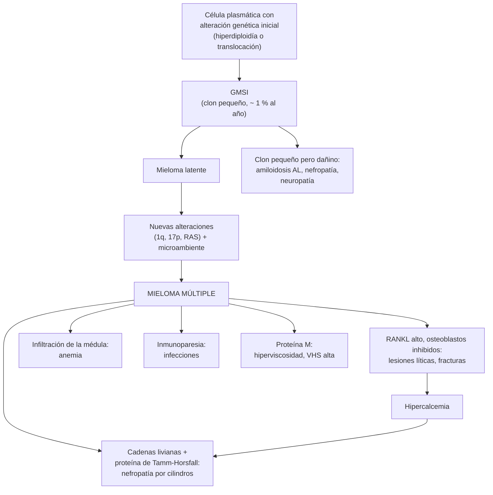

---
tags:
  - Hemato-oncología
  - GES
---

# Gammapatías monoclonales y mieloma múltiple

**Subespecialidad**
Hematología · Hemato-oncología · Medicina interna · Nefrología · Atención primaria (estudio del pico monoclonal)

**Guías principales**
EHA-EMN 2025: mieloma múltiple · EHA-ESMO 2021: mieloma múltiple · IMWG 2014: criterios diagnósticos del mieloma · IMWG 2020: riesgo del mieloma latente · R-ISS (2015) y R2-ISS (2022): etapificación

**Otras fuentes**
Prevalencia y pronóstico de la GMSI (Kyle 2002, 2006 y 2018) · PERSEUS (D-VRd, 2024) · IMROZ (Isa-VRd, 2024) · MAIA (D-Rd, 2019) · Insuficiencia renal en el mieloma en Chile (Peña 2019) · Revisión chilena de las gammapatías (Peña 2026) · GLOBOCAN 2024 · SEER 2026 · Figura: Rodríguez-Laval 2024 (CC BY 4.0)

**GES**
Sí: mieloma múltiple en personas de 15 años y más (problema de salud n.º 84). Cubre desde la **confirmación diagnóstica** (etapificación, tratamiento, seguimiento y recaídas). La GMSI no es GES.

**EUNACOM**
1.08.1.007 Disproteinemias (gammapatías M) (sospecha, inicial, derivar)

**Revisado**
Octubre 2026

!!! abstract "Resumen en 60 segundos"
    - **Gammapatía monoclonal**: un **clon** de células plasmáticas (o de linfocitos B) produce una **inmunoglobulina monoclonal** (**componente o pico M**), completa o solo cadenas livianas.
    - **Espectro**:
        - **GMSI** (gammapatía monoclonal de significado incierto): pico M **< 3 g/dL**, **< 10 %** de células plasmáticas en la médula, **sin daño de órgano**. Afecta al **3 %** de los > 50 años. Progresa **~ 1 % al año**: **no se trata, se controla**.
        - **Mieloma latente**: pico M ≥ 3 g/dL o 10–60 % de células plasmáticas, **sin daño de órgano**: control estrecho.
        - **Mieloma múltiple**: ≥ 10 % de células plasmáticas clonales + **daño de órgano (CRAB)** o un **biomarcador** de alto riesgo.
        - Otras: **macroglobulinemia de Waldenström** (IgM), **amiloidosis AL**, plasmocitoma solitario, gammapatías de significado **renal** o neurológico.
    - **CRAB**: hiper**C**alcemia, insuficiencia **R**enal, **A**nemia y lesiones óseas (**B**one) líticas.
    - **Sospechar mieloma** en un **> 50 años** con **dolor óseo** (espalda), **anemia** sin causa, **VHS muy alta**, **insuficiencia renal**, **hipercalcemia**, **fracturas** patológicas, **infecciones** recurrentes o **proteínas totales altas** con albúmina normal o baja.
    - **Estudio**: **electroforesis de proteínas** + **inmunofijación** (suero y orina) + **cadenas livianas libres en suero**; **TC de cuerpo entero de baja dosis** (o PET-CT, RM); **mielograma y biopsia de médula**.
    - **Tratamiento** (hematólogo):
        - **Candidato a trasplante**: inducción con **anti-CD38 + bortezomib + lenalidomida + dexametasona** (D-VRd), **trasplante autólogo** y **mantención con lenalidomida**.
        - **No candidato**: **daratumumab + lenalidomida + dexametasona** (D-Rd) o esquemas cuádruples.
        - **Soporte**: **ácido zoledrónico** o denosumab, analgesia, **profilaxis** de infecciones y de trombosis, hidratación.
    - **GES 84**: etapificación en **45 días** desde la confirmación; tratamiento en **30 días** desde la indicación.

## Definición

- **Gammapatía monoclonal**: presencia en el suero o la orina de una **inmunoglobulina monoclonal** (igual en todas sus moléculas: una sola cadena pesada y una sola cadena liviana, κ o λ), producida por un clon de **células plasmáticas** o de **linfocitos B**.
    - **Componente M** o **pico M**: la banda estrecha que se ve en la electroforesis (figura 2).
    - **Proteinuria de Bence Jones**: cadenas livianas monoclonales libres en la orina.
- **Criterios de la IMWG** (2014; mieloma latente con riesgo según IMWG 2020):

| Entidad | Pico M | Células plasmáticas clonales en la médula | Daño de órgano |
|---|---|---|---|
| **GMSI no IgM** | **< 3 g/dL** | **< 10 %** | **No** (ni CRAB ni amiloidosis) |
| **GMSI IgM** | < 3 g/dL | < 10 % de infiltración linfoplasmocítica | No |
| **GMSI de cadenas livianas** | Sin cadena pesada; razón κ/λ anormal y cadena involucrada alta | < 10 % | No |
| **Mieloma latente** (*smoldering*) | **≥ 3 g/dL** (o ≥ 500 mg/24 h en orina) | y/o **10–60 %** | **No** |
| **Mieloma múltiple** | Cualquiera (puede no haber pico en el suero) | **≥ 10 %** (o un plasmocitoma demostrado por biopsia) | **Sí**: ≥ 1 evento que define el mieloma (ver abajo) |

- **Eventos que definen el mieloma** (IMWG 2014):
    - **CRAB**:
        - **C**alcio: > 11 mg/dL, o > 1 mg/dL sobre el límite superior.
        - **R**iñón: creatinina **> 2 mg/dL** o clearance **< 40 mL/min**.
        - **A**nemia: Hb **< 10 g/dL**, o > 2 g/dL bajo el límite inferior.
        - **B**one (hueso): **≥ 1 lesión lítica** en la radiografía, la TC o el PET-CT.
    - **Biomarcadores de malignidad** ("SLiM"), aun sin CRAB:
        - **≥ 60 %** de células plasmáticas clonales en la médula (**S**ixty).
        - Razón de cadenas livianas libres involucrada/no involucrada **≥ 100** (**Li**ght chains), con la involucrada ≥ 100 mg/L.
        - **> 1 lesión focal** en la **RM** (≥ 5 mm) (**M**RI).
- **Gammapatía monoclonal de significado clínico**: un clon pequeño (de nivel GMSI) que **daña un órgano** por la proteína que produce. Ejemplos: **amiloidosis AL**, **gammapatía monoclonal de significado renal**, neuropatías (anti-MAG, POEMS), crioglobulinemia.
- **Plasmocitoma solitario**: una masa única de células plasmáticas (ósea o extraósea), sin mieloma en el resto de la médula.
- **Leucemia de células plasmáticas**: **≥ 5 %** de células plasmáticas circulantes (IMWG 2021); muy agresiva.

## Epidemiología

### Mundial

- **GMSI** (Olmsted, Minnesota; Kyle 2006): **3,2 %** de los **≥ 50 años**, **5,3 %** de los **≥ 70 años** y **7,5 %** de los ≥ 85 años. Más en hombres y en personas afrodescendientes.
    - El **63,5 %** tiene un pico M **< 1 g/dL**.
    - **Progresión** a mieloma u otra neoplasia: **~ 1 % al año**, de por vida (Kyle 2002 y 2018).
- **Mieloma múltiple** (SEER):
    - **~ 1–2 %** de los cánceres y **~ 10 %** de las neoplasias hematológicas.
    - **36 000 casos nuevos** y **10 850 muertes** estimados en EE. UU. en 2026.
    - **Mediana de edad: 69 años**; raro antes de los 40.
    - **Sobrevida relativa a 5 años: 64 %**, muy superior a la de hace dos décadas.
- **Todo mieloma** pasa antes por una **GMSI** (o un mieloma latente), aunque casi nunca se haya detectado.

### Chile

!!! chile "Datos nacionales"
    - **GLOBOCAN 2024** (Observatorio Global del Cáncer, IARC): **756 casos nuevos** de mieloma al año (**1,3 %** de los cánceres) y **597 muertes** (**1,9 %** de las muertes por cáncer).
    - **GES 84: mieloma múltiple en personas de 15 años y más** (Superintendencia de Salud):
        - **Etapificación**: **45 días** desde la confirmación diagnóstica.
        - **Tratamiento primario** y **complementario**: **30 días** desde la indicación médica.
        - **Primer control**: 30 días desde la indicación.
        - Copago **0 %** en FONASA.
        - El GES parte con el **diagnóstico confirmado**: la **sospecha** y el estudio inicial los hace el médico tratante.
    - **Insuficiencia renal en el mieloma** (154 pacientes con mieloma recién diagnosticado tratados con esquemas basados en talidomida; Peña 2019):
        - **34 %** tenía insuficiencia renal al diagnóstico; el **51 %** la recuperó por completo con el tratamiento.
        - **Sobrevida a 3 años**: **66 %** sin insuficiencia renal, **47 %** con recuperación renal completa y **13 %** sin recuperación completa.
        - La **insuficiencia renal** y la **hipercalcemia** fueron predictores independientes de peor pronóstico.
    - **Revisión chilena** (Peña 2026): las gammapatías monoclonales incluyen **neoplasias** (mieloma, leucemia de células plasmáticas, plasmocitoma, linfomas B), **gammapatías de significado clínico** (sistémicas o localizadas) y la **GMSI**. La GMSI es un **diagnóstico de exclusión**.

## Etiología y factores de riesgo

- **Edad** avanzada (el principal).
- **Sexo masculino** y **ascendencia africana** (el doble de riesgo).
- **Antecedente familiar** de GMSI o mieloma.
- **Obesidad**.
- Exposiciones: radiación, pesticidas y solventes (asociación débil).
- **Inflamación crónica** y autoinmunidad: más GMSI.
- **Factores de progresión de una GMSI** (Mayo Clinic): pico M **≥ 1,5 g/dL**, tipo **no IgG** (IgA o IgM) y **razón κ/λ anormal**. Con los 3 factores, el riesgo de progresión a 20 años es de ~ 58 %; sin ninguno, ~ 5 %.

## Fisiopatología

- **Origen**: una célula plasmática (o un linfocito B en las IgM) adquiere alteraciones genéticas tempranas: **hiperdiploidía** o **translocaciones** de la cadena pesada (t(11;14), **t(4;14)**, **t(14;16)**). Esto basta para una **GMSI**.
- **Progresión**: se agregan alteraciones de alto riesgo (**ganancia de 1q**, **deleción de 17p** con pérdida de *TP53*, mutaciones de *RAS*) y el clon pasa a depender del **microambiente** de la médula.
- **Daño de órgano**:
    - **Hueso**: las células del mieloma aumentan el **RANKL** y reducen la osteoprotegerina, lo que **activa a los osteoclastos**; además, inhiben a los **osteoblastos** (DKK1). Resultado: **lesiones líticas** "en sacabocado" **sin formación de hueso** (por eso el **cintigrama óseo es normal** y la **fosfatasa alcalina no sube**), **fracturas** y **hipercalcemia**.
    - **Riñón**:
        - **Nefropatía por cilindros** ("riñón de mieloma"): las **cadenas livianas** se unen a la proteína de **Tamm-Horsfall** y obstruyen los túbulos. Empeora con la **deshidratación**, la **hipercalcemia**, los **AINE** y el **contraste**.
        - Otros: amiloidosis AL (proteinuria nefrótica), enfermedad por depósito de cadenas livianas, síndrome de Fanconi, hipercalcemia.
    - **Médula**: la infiltración desplaza a la eritropoyesis: **anemia** (normocítica, con **rouleaux** por el exceso de proteína).
    - **Inmunidad**: la proteína monoclonal reemplaza a las inmunoglobulinas normales (**inmunoparesia**): **infecciones** por bacterias encapsuladas (neumococo) y virus (herpes zóster).
    - **Sangre**: **hiperviscosidad** (más con IgM o IgA en polímeros), sangrado.
    - **Amiloidosis AL**: las cadenas livianas forman **fibrillas** que se depositan en el **corazón**, el **riñón**, los nervios, el hígado y la lengua.

*Figura 1. Fisiopatología de las gammapatías monoclonales y del mieloma múltiple. Esquema propio basado en IMWG 2014 y EHA-EMN 2025.*

## Clasificación

### Tipos de proteína monoclonal en el mieloma

| Tipo | Frecuencia aproximada | Comentario |
|---|---|---|
| **IgG** | **~ 50 %** | El más frecuente |
| **IgA** | ~ 20 % | Más hiperviscosidad (polímeros) |
| **Solo cadenas livianas** (κ o λ) | **~ 15–20 %** | **Sin pico en la electroforesis del suero** o muy pequeño; más **insuficiencia renal**. Se detecta con las **cadenas livianas libres** |
| IgD, IgE | Raros | — |
| **No secretor** | < 3 % | Sin proteína detectable; se sigue con la médula y las imágenes |
| **IgM** | — | En general es una **macroglobulinemia de Waldenström**, no un mieloma |

### Otras gammapatías monoclonales

| Entidad | Claves |
|---|---|
| **Macroglobulinemia de Waldenström** | Linfoma **linfoplasmocítico** con **IgM**; mutación ***MYD88* L265P**. **Hiperviscosidad** (cefalea, visión borrosa, sangrado de mucosas), adenopatías, esplenomegalia, neuropatía, crioglobulinas, anemia. **Sin lesiones líticas** |
| **Amiloidosis AL** | **Síndrome nefrótico**, **miocardiopatía restrictiva** (NT-proBNP y troponina altos, bajo voltaje en el ECG), **neuropatía** y túnel carpiano, **macroglosia**, **púrpura periorbitaria**, hepatomegalia, hipotensión ortostática. Biopsia de **grasa abdominal** (rojo Congo) |
| **Plasmocitoma solitario** | Una lesión ósea o extraósea; **radioterapia**. Riesgo de progresión a mieloma |
| **POEMS** | **P**olineuropatía, **O**rganomegalia, **E**ndocrinopatía, componente **M** (casi siempre λ) y cambios de la piel (**S**kin); lesiones **escleróticas**; VEGF alto |
| **Gammapatía monoclonal de significado renal** | Daño renal por la proteína monoclonal sin criterios de mieloma (glomerulopatías, tubulopatías); requiere **biopsia renal** y tratamiento dirigido al clon |
| **Crioglobulinemia tipo I** | IgM o IgG monoclonal que precipita con el frío: acrocianosis, úlceras, livedo |

### Riesgo del mieloma latente (IMWG 2020, "20/2/20")

- Factores: pico M **> 2 g/dL**, razón de cadenas livianas libres **> 20** y células plasmáticas en la médula **> 20 %**.
- **0 factores**: riesgo bajo; **1**: intermedio; **≥ 2**: **alto** (cerca de la **mitad** progresa a mieloma en 2 años).

### Etapificación del mieloma

| Etapa | ISS | R-ISS (2015) |
|---|---|---|
| **I** | **β2-microglobulina < 3,5 mg/L** y **albúmina ≥ 3,5 g/dL** | ISS I + citogenética de riesgo estándar + LDH normal |
| **II** | Ni I ni III | Ni I ni III |
| **III** | **β2-microglobulina ≥ 5,5 mg/L** | ISS III + **citogenética de alto riesgo** (del(17p), t(4;14), t(14;16)) **o LDH alta** |

- **R2-ISS** (2022): suma puntos por ISS, LDH, del(17p), t(4;14) y **ganancia o amplificación de 1q**; separa mejor a los pacientes de riesgo intermedio.

## Clínica

- **Mieloma múltiple**:
    - **Dolor óseo** (~ 60–70 %): **lumbar**, costal, que empeora con el movimiento; **fracturas** patológicas y **aplastamientos vertebrales** (pérdida de estatura).
    - **Anemia** (~ 70 %): cansancio, disnea.
    - **Insuficiencia renal** (20–40 %): a menudo **aguda**, gatillada por deshidratación, hipercalcemia, AINE o contraste.
    - **Hipercalcemia** (~ 15–30 %): **poliuria**, sed, **constipación**, náuseas, **confusión**, deshidratación.
    - **Infecciones** recurrentes: **neumonía neumocócica**, infección urinaria, **herpes zóster**.
    - **Compresión medular** por un plasmocitoma o un aplastamiento vertebral.
    - **Baja de peso**, cansancio.
    - Menos frecuentes: **hiperviscosidad**, neuropatía, amiloidosis, sangrado.
- **GMSI**: **asintomática**; se descubre por un **hallazgo de laboratorio** (proteínas totales altas, VHS alta, electroforesis pedida por otra razón).
- **Pistas en el laboratorio de rutina**:
    - **VHS muy alta** (> 100 mm/h) y **rouleaux** en el frotis.
    - **Brecha proteica**: **proteínas totales − albúmina > 4 g/dL**.
    - **Anión gap bajo** (la paraproteína IgG es catiónica).
    - **Proteinuria en orina de 24 horas desproporcionada** respecto de la tira reactiva (la tira detecta albúmina, **no cadenas livianas**).
    - **Hipercalcemia con PTH baja**.

!!! alarma "Signos de alarma: derivar de inmediato"
    - **Dolor de espalda** con **debilidad** de las piernas, nivel sensitivo o alteración de los esfínteres (**compresión medular**): RM urgente y dexametasona.
    - **Hipercalcemia** con compromiso de conciencia o deshidratación.
    - **Lesión renal aguda** en un paciente con sospecha o diagnóstico de mieloma.
    - **Hiperviscosidad**: cefalea, alteración visual (venas retinianas "en salchicha"), sangrado de mucosas, compromiso de conciencia, insuficiencia cardíaca → **plasmaféresis**.
    - **Fiebre** en un paciente en tratamiento (inmunoparesia, neutropenia).
    - **Fractura patológica** de un hueso largo o de una vértebra.

## Diagnóstico

!!! guia "Estudio ante la sospecha de una gammapatía monoclonal (IMWG; EHA-EMN 2025)"
    - **Tamizaje** (las tres pruebas juntas aumentan la sensibilidad):
        1. **Electroforesis de proteínas en suero** (cuantifica el pico M).
        2. **Inmunofijación en suero** (identifica la cadena pesada y la liviana).
        3. **Cadenas livianas libres en suero** (κ, λ y su razón; normal 0,26–1,65).
        - Además: **orina de 24 horas** con electroforesis e inmunofijación (proteinuria de Bence Jones).
    - **Buscar daño de órgano (CRAB)**: hemograma, **calcio**, **creatinina**, albúmina, **β2-microglobulina**, LDH.
    - **Imágenes**: **TC de cuerpo entero de baja dosis** (preferida sobre la serie ósea radiográfica); **PET-CT** o **RM de cuerpo entero** si la TC es negativa y hay sospecha de mieloma latente o plasmocitoma.
    - **Mielograma y biopsia de médula ósea**: porcentaje de células plasmáticas, citometría de flujo y **FISH** (del(17p), t(4;14), t(14;16), 1q).
    - **Amiloidosis**: si hay proteinuria, falla cardíaca, neuropatía o hepatomegalia: NT-proBNP, troponina, ecocardiograma y biopsia de la **grasa abdominal**.

- **¿A quién estudiar con médula ósea si hay una GMSI?** No a todos. Se puede **observar sin médula** a una **GMSI de bajo riesgo** (IgG, pico M < 1,5 g/dL y razón κ/λ normal) **sin** anemia, insuficiencia renal, hipercalcemia ni dolor óseo.
- **El mieloma no se descarta con una electroforesis normal**: el de **cadenas livianas** puede no tener pico en el suero. Pedir siempre las **cadenas livianas libres**.

<figure markdown>
![Esquema de tres trazados de electroforesis de proteínas séricas con las bandas de albúmina, alfa 1, alfa 2, beta y gamma. A la izquierda, normal: la albúmina es el peak dominante y la zona gamma es ancha y baja, porque la producen muchos clones de células plasmáticas. Al centro, gammapatía monoclonal: un pico M estrecho y alto en la zona gamma, producido por un solo clon, con el resto de la zona gamma bajo (inmunoparesia); se confirma con inmunofijación. A la derecha, hipergammaglobulinemia policlonal: la zona gamma está alta pero es ancha, por muchos clones, como en la inflamación crónica, la cirrosis, el VIH, la hepatitis C y las enfermedades autoinmunes; no es una neoplasia. Abajo, un recuadro indica que ante un pico M se pide inmunofijación, cadenas livianas libres en suero y orina de 24 horas; que la electroforesis puede no ver el mieloma de cadenas livianas, cerca del 15 a 20 por ciento; que la tira reactiva de orina no detecta las cadenas livianas; que luego se busca daño de órgano (hipercalcemia, insuficiencia renal, anemia y lesiones óseas) y amiloidosis; y que sin daño de órgano, con pico M bajo 3 gramos por decilitro y menos de 10 por ciento de células plasmáticas, se trata de una GMSI, con un riesgo de progresión cercano al 1 por ciento al año](../assets/figuras/mieloma/electroforesis-proteinas.svg){ loading=lazy }
<figcaption>Figura 2. Electroforesis de proteínas séricas: patrón normal, pico monoclonal (gammapatía monoclonal) e hipergammaglobulinemia policlonal. Esquema propio basado en los criterios de la IMWG.</figcaption>
</figure>

## Laboratorio

| Examen | Hallazgo típico en el mieloma |
|---|---|
| **Hemograma** y frotis | **Anemia normocítica**; **rouleaux** (pilas de monedas); células plasmáticas en la sangre (leucemia de células plasmáticas) |
| **VHS** | **Muy alta** (a menudo > 100 mm/h) |
| **Proteínas totales y albúmina** | **Brecha proteica > 4 g/dL**; albúmina baja (pronóstico, ISS) |
| **Electroforesis + inmunofijación** (suero y orina de 24 horas) | Pico M y su tipo |
| **Cadenas livianas libres en suero** | Razón **κ/λ anormal**; ≥ 100 = evento que define el mieloma |
| **Calcio** (corregido o iónico) | Alto en ~ 15–30 % |
| **Creatinina**, electrolitos, orina completa | Insuficiencia renal; **anión gap bajo**; proteinuria tubular |
| **β2-microglobulina** y **LDH** | **Pronóstico** (ISS, R-ISS) |
| **Inmunoglobulinas** (IgG, IgA, IgM) | **Inmunoparesia** (las no involucradas bajas) |
| **Fosfatasas alcalinas** | **Normales** (no hay formación de hueso) |
| **NT-proBNP**, troponina, albuminuria | **Amiloidosis AL** |
| **Mielograma, biopsia y FISH** | Células plasmáticas clonales ≥ 10 %; riesgo citogenético |
| **Viscosidad sérica** | Si hay síntomas de hiperviscosidad (IgM, IgA) |

## Imágenes

- **TC de cuerpo entero de baja dosis**: el examen de elección para buscar **lesiones líticas** (más sensible que la radiografía).
- **PET-CT**: lesiones activas, **plasmocitomas extramedulares** y respuesta al tratamiento (figura 3).
- **RM de cuerpo entero o de columna y pelvis**: la más sensible para la **infiltración difusa** y las **lesiones focales** (> 1 lesión focal = mieloma); **compresión medular**.
- **Serie ósea radiográfica** ("cráneo en sal y pimienta", lesiones en **sacabocado**): menos sensible; se usa si no hay TC.
- **Cintigrama óseo**: **no sirve** (las lesiones son puramente líticas, sin actividad osteoblástica).
- **Ecocardiograma** (amiloidosis) y **ecografía renal**.

<figure markdown>
{ loading=lazy }
<figcaption>Figura 3. Mieloma múltiple en TC y PET-CT: (A) múltiples lesiones líticas ávidas de FDG en el esqueleto axial; (B) lesión lítica de L3 sin captación (enfermedad inactiva o lesión residual); (C) focos hipermetabólicos en el sacro y los ilíacos sin lesión en la TC (infiltración precoz). Fuente: Rodríguez-Laval V, Lumbreras-Fernández B, Aguado-Bueno B, Gómez-León N. Imaging of multiple myeloma: present and future. <em>J Clin Med.</em> 2024;13(1):264, figura 9. Licencia <a href="https://creativecommons.org/licenses/by/4.0/">CC BY 4.0</a>.</figcaption>
</figure>

## Diagnóstico diferencial

| Situación | Diferencial |
|---|---|
| **Pico M** | **GMSI** (lo más frecuente), mieloma, Waldenström, **linfomas B** y **LLC** con componente M, amiloidosis AL; también transitorio en infecciones o tras un trasplante |
| **Hipergammaglobulinemia policlonal** (gamma ancha) | **Cirrosis**, **VIH**, **VHC**, infecciones crónicas (TBC, endocarditis), **enfermedades autoinmunes** (LES, Sjögren, artritis reumatoide), enfermedad relacionada con IgG4 |
| **Lesiones óseas líticas** | **Metástasis** (pulmón, riñón, tiroides, mama), hiperparatiroidismo (tumores pardos), linfoma, histiocitosis |
| **Dolor lumbar + anemia en un adulto mayor** | Metástasis óseas, **osteoporosis** con fractura (ver [osteoporosis](../endocrinologia/osteoporosis.md) y [lumbago](../reumatologia/lumbago-lumbociatica-y-cervicalgia.md)), espondilodiscitis |
| **Hipercalcemia** | **Hiperparatiroidismo primario** (PTH alta), **metástasis**, **PTHrP** (tumores escamosos), granulomas o linfoma (calcitriol alto); ver [calcio](../endocrinologia/trastornos-del-calcio-fosforo-y-magnesio.md) |
| **Insuficiencia renal + anemia** | Enfermedad renal crónica de otra causa, vasculitis, LES |
| **Proteinuria nefrótica en un adulto mayor** | **Amiloidosis AL**, nefropatía membranosa, diabetes (ver [síndromes glomerulares](../nefrologia/sindromes-glomerulares.md)) |

## Tratamiento

### Gammapatía monoclonal de significado incierto

- **No se trata**. Se **controla**:
    - **Riesgo bajo**: electroforesis y hemograma, calcio y creatinina a los **6 meses**; luego cada **2–3 años** (o solo ante síntomas).
    - **Riesgo intermedio o alto**: control **anual**, de por vida.
- **Educar** sobre los síntomas de progresión: dolor óseo, cansancio, infecciones, espuma en la orina, parestesias.
- Buscar y tratar la **osteoporosis** (la GMSI aumenta el riesgo de fracturas).
- No controlar en los pacientes con expectativa de vida corta.

### Mieloma latente

- **Observación** con controles cada **3–6 meses**; imágenes (RM o PET-CT) periódicas.
- **Alto riesgo** (IMWG 2020): considerar un **ensayo clínico** o tratamiento precoz (por ejemplo, daratumumab), según el hematólogo.

### Mieloma múltiple (EHA-EMN 2025)

- **Solo se trata el mieloma activo** (con un evento que define el mieloma).
- **Elegibilidad para el trasplante autólogo**: depende de la **edad biológica** (en general ≤ 65–70 años), la fragilidad y las comorbilidades.

| Grupo | Tratamiento |
|---|---|
| **Candidato a trasplante** | **Inducción** con 4 fármacos: **anti-CD38** (daratumumab o isatuximab) + **bortezomib** + **lenalidomida** + **dexametasona** (D-VRd; PERSEUS) → **melfalán en dosis altas + trasplante autólogo** → consolidación → **mantención con lenalidomida** (± daratumumab) |
| **No candidato a trasplante** | **D-Rd** (daratumumab + lenalidomida + dexametasona; MAIA) o un esquema cuádruple en los aptos (**Isa-VRd**; IMROZ). En los frágiles: dosis reducidas (VRd "*lite*", Rd) |
| **Recaída** | Cambiar de clase: anti-CD38, carfilzomib, pomalidomida; **células CAR-T** anti-BCMA y **anticuerpos biespecíficos** (anti-BCMA, anti-GPRC5D) |
| **Plasmocitoma solitario** | **Radioterapia** local (40–50 Gy) |
| **Amiloidosis AL** | Daratumumab + ciclofosfamida, bortezomib y dexametasona (Dara-CyBorD); trasplante en casos seleccionados |
| **Waldenström** | Solo si hay síntomas: bendamustina-rituximab, inhibidores de BTK; **plasmaféresis** en la hiperviscosidad |

- En el sistema público, los fármacos disponibles dependen del **protocolo GES** vigente.
- **El uso de lenalidomida y talidomida** exige **anticoncepción** estricta (teratogénicos) y **tromboprofilaxis**.

### Tratamiento de soporte (lo que hace el interno)

- **Hueso**:
    - **Ácido zoledrónico** o **denosumab** en **todo** mieloma activo, tenga o no lesiones visibles.
    - Control dental previo (**osteonecrosis mandibular**), calcio y vitamina D (salvo hipercalcemia).
    - **Analgesia**: paracetamol y opioides. **Evitar los AINE** (daño renal).
    - **Radioterapia** paliativa para el dolor o la compresión; **cifoplastía o vertebroplastía** en los aplastamientos dolorosos; cirugía de las fracturas o de la compresión medular inestable.
- **Riñón** (ver [lesión renal aguda](../nefrologia/lesion-renal-aguda.md)):
    - **Hidratación** (≥ 3 L/día si la función cardíaca lo permite).
    - Tratar la **hipercalcemia**; **suspender los AINE** y los nefrotóxicos; **evitar el contraste** yodado.
    - Iniciar pronto un esquema con **bortezomib + dexametasona** (no requiere ajuste renal), para bajar rápido las cadenas livianas.
- **Hipercalcemia**: **suero fisiológico**, **ácido zoledrónico** (o denosumab si hay insuficiencia renal grave), **corticoides** (ver [calcio](../endocrinologia/trastornos-del-calcio-fosforo-y-magnesio.md)).
- **Infecciones**:
    - **Aciclovir o valaciclovir** profiláctico con bortezomib y anti-CD38 (**herpes zóster**).
    - **Levofloxacino** en los primeros 3 meses de tratamiento en algunos esquemas.
    - **Vacunas**: influenza, **neumococo**, COVID-19, **zóster recombinante**.
    - **Inmunoglobulina EV** si hay hipogammaglobulinemia con infecciones graves recurrentes.
- **Trombosis**: **aspirina** o **heparina de bajo peso molecular** (o anticoagulante oral) con talidomida o lenalidomida, según el riesgo.
- **Anemia**: transfusiones; **eritropoyetina** si persiste la anemia sintomática.
- **Compresión medular**: **dexametasona** en dosis altas + **RM urgente** + radioterapia o cirugía.
- **Hiperviscosidad**: **plasmaféresis** de urgencia.

!!! dosis "Dosis de referencia (adulto; las indica el hematólogo)"
    - **Ácido zoledrónico**: **4 mg EV** en 15 minutos **cada 4 semanas** (ajustar si el clearance de creatinina es 30–60 mL/min; **no usar** si es < 30 mL/min).
    - **Denosumab**: **120 mg SC cada 4 semanas** (se puede usar en la insuficiencia renal; vigilar la **hipocalcemia**).
    - **Dexametasona**: **40 mg VO** semanal en los esquemas (20 mg en los > 75 años); en la compresión medular, dosis altas (por ejemplo, **10 mg EV** de carga y luego **4 mg cada 6 horas**), según el protocolo.
    - **Lenalidomida**: **25 mg/día VO** por 21 días cada 28 en la inducción (ajustar a la función renal); **10 mg/día** en la mantención.
    - **Bortezomib**: **1,3 mg/m² SC** (días 1, 4, 8 y 11, o semanal, según el esquema).
    - **Daratumumab**: **1800 mg SC** (semanal, luego cada 2 y cada 4 semanas).
    - **Aciclovir**: **400 mg cada 12 horas VO** (o valaciclovir 500 mg/día) como profilaxis del zóster.
    - **Aspirina 100 mg/día** (riesgo bajo) o **enoxaparina 40 mg/día SC** (riesgo alto) con lenalidomida o talidomida.

## Complicaciones

| Complicación | Claves |
|---|---|
| **Fracturas patológicas** y **aplastamientos vertebrales** | Pérdida de estatura, dolor; compresión medular |
| **Compresión medular** | Urgencia: dexametasona + RM + radioterapia o cirugía |
| **Hipercalcemia** | Poliuria, deshidratación, confusión; empeora la función renal |
| **Lesión renal aguda** (nefropatía por cilindros) | Peor pronóstico si no se recupera; a veces requiere **diálisis** |
| **Infecciones** | Principal causa de muerte temprana: neumococo, gramnegativos, **herpes zóster** |
| **Trombosis venosa** | Con talidomida y lenalidomida, sobre todo con dexametasona y eritropoyetina |
| **Neuropatía periférica** | **Bortezomib** y **talidomida**; también por amiloidosis o POEMS (ver [neuropatías](../neurologia/neuropatias-perifericas-y-sindromes-sensitivos.md)) |
| **Osteonecrosis mandibular** | Ácido zoledrónico y denosumab; control dental |
| **Hiperviscosidad** | Waldenström (IgM), mieloma IgA; plasmaféresis |
| **Amiloidosis AL** | Insuficiencia cardíaca restrictiva (mal pronóstico), síndrome nefrótico |
| **Síndrome de liberación de citoquinas** y neurotoxicidad | Células CAR-T y anticuerpos biespecíficos |
| **Segundas neoplasias** | Lenalidomida (sobre todo tras el melfalán) |

## Pronóstico y seguimiento

- **GMSI**: progresión **~ 1 % al año**; la mayoría **muere por otras causas**. El riesgo depende del tamaño del pico M, el tipo de inmunoglobulina y la razón κ/λ.
- **Mieloma latente**: progresión de **~ 10 % al año** en los primeros 5 años; mucho más en el de alto riesgo.
- **Mieloma múltiple**:
    - Sigue siendo, en general, **incurable**, pero la sobrevida mejoró mucho: **64 % a 5 años** (SEER). Muchos pacientes viven **más de 10 años**.
    - **Peor pronóstico**: **R-ISS III**, citogenética de **alto riesgo** (del(17p), t(4;14), 1q), **LDH alta**, **insuficiencia renal que no se recupera**, plasmocitomas extramedulares, leucemia de células plasmáticas, fragilidad.
    - En Chile, la sobrevida a 3 años con insuficiencia renal sin recuperación completa fue de solo **13 %** (Peña 2019).
    - **Seguimiento**: pico M, cadenas livianas libres, hemograma, calcio y creatinina **cada 1–3 meses**; **enfermedad residual medible** en la médula; imágenes si hay síntomas.

## Perlas para el internado

!!! perla "Para recordar en la sala"
    - **Dolor lumbar + anemia + VHS muy alta en un > 50 años** = pedir **electroforesis, inmunofijación y cadenas livianas libres**.
    - **Brecha proteica > 4 g/dL** (proteínas totales − albúmina): pensar en una paraproteína.
    - **Insuficiencia renal sin explicación en un adulto mayor**: buscar un mieloma; la **tira reactiva no detecta las cadenas livianas**.
    - En el mieloma, el **cintigrama óseo es normal** y la **fosfatasa alcalina no sube**: pedir una **TC de baja dosis**.
    - **No dar AINE** ni **contraste** a un paciente con mieloma; **hidratar**.
    - **GMSI**: es **frecuente** (3 % de los > 50 años), **no se trata** y se controla de por vida.
    - **Un pico M IgM** apunta a una **Waldenström** o un linfoma, no a un mieloma.
    - **Proteinuria nefrótica + insuficiencia cardíaca + macroglosia o púrpura periorbitaria**: **amiloidosis AL**.
    - **Hipercalcemia con PTH baja + anemia + insuficiencia renal**: mieloma hasta demostrar lo contrario.
    - Con **lenalidomida o talidomida**: **tromboprofilaxis** y **anticoncepción**. Con **bortezomib**: **profilaxis del zóster**.

## Preguntas de repaso

??? repaso "1. Hombre de 68 años con 3 meses de dolor lumbar que no cede, cansancio y una neumonía reciente. Hb 9,1 g/dL normocítica, VHS 118 mm/h, creatinina 2,4 mg/dL, calcio 11,8 mg/dL, proteínas totales 9,8 g/dL y albúmina 3,1 g/dL. ¿Qué sospecha y cómo lo estudia?"
    - **Mieloma múltiple** con **CRAB**: hipercalcemia, insuficiencia renal, anemia y dolor óseo; brecha proteica de **6,7 g/dL**, VHS muy alta e infección.
    - **Estudio**:
        - **Electroforesis** e **inmunofijación** en suero y orina de 24 horas; **cadenas livianas libres** en suero.
        - **β2-microglobulina**, LDH, inmunoglobulinas.
        - **TC de cuerpo entero de baja dosis** (lesiones líticas, fracturas).
        - **Mielograma y biopsia** con FISH.
    - **Manejo inicial**:
        - **Hidratación** con suero fisiológico;
        - **ácido zoledrónico** (ajustado a la función renal) o denosumab para la hipercalcemia;
        - suspender los **AINE**; evitar el **contraste**;
        - analgesia con opioides.
    - **Derivar** a hematología (GES 84 desde la confirmación).

??? repaso "2. Mujer de 62 años a la que, por una VHS elevada, se le pidió una electroforesis que mostró un pico M IgG de 0,8 g/dL, con razón κ/λ normal. Hemograma, calcio y creatinina normales; sin dolor óseo. ¿Cuál es el diagnóstico y el manejo?"
    - **Gammapatía monoclonal de significado incierto (GMSI) de bajo riesgo**: IgG, pico M < 1,5 g/dL y razón κ/λ normal, sin daño de órgano.
    - **No necesita** mielograma ni tratamiento.
    - **Control**: electroforesis, hemograma, calcio y creatinina a los **6 meses**; si se mantiene estable, cada **2–3 años** o ante síntomas.
    - **Educar** sobre los síntomas de alarma (dolor óseo, cansancio, infecciones, espuma en la orina).
    - Riesgo de progresión **~ 1 % al año**; evaluar la **osteoporosis**.

??? repaso "3. Hombre de 72 años con mieloma en tratamiento con lenalidomida y dexametasona que consulta por dolor dorsal intenso de 1 semana y, desde hoy, debilidad de ambas piernas y retención urinaria. ¿Qué tiene y qué hace?"
    - **Compresión medular** por un aplastamiento vertebral o un plasmocitoma: **urgencia**.
    - **Manejo**:
        - **Dexametasona** en dosis altas EV de inmediato.
        - **RM de toda la columna** urgente.
        - Interconsulta a **radioterapia** y a **neurocirugía** (cirugía si hay inestabilidad o compresión ósea).
        - Sonda vesical, analgesia y **tromboprofilaxis** (además tiene riesgo por la lenalidomida).
    - El pronóstico funcional depende de la **función motora al iniciar** el tratamiento.

??? repaso "4. Mujer de 70 años con cefalea, visión borrosa y epistaxis. Al fondo de ojo, venas retinianas dilatadas y tortuosas con hemorragias. Tiene adenopatías y un pico M IgM de 4,5 g/dL. ¿Qué sospecha y qué hace?"
    - **Macroglobulinemia de Waldenström** con **síndrome de hiperviscosidad** (la IgM es un pentámero grande).
    - **Manejo urgente**:
        - **Plasmaféresis** (baja rápido la IgM y la viscosidad).
        - **Evitar las transfusiones** de glóbulos rojos antes de la plasmaféresis (aumentan la viscosidad).
    - **Luego**: tratamiento del clon (rituximab con bendamustina o inhibidores de BTK). Confirmar con biopsia de médula y la mutación ***MYD88* L265P**.

??? repaso "5. Hombre de 66 años con edema de las piernas, proteinuria de 6 g/24 h, disnea de esfuerzo, macroglosia y equimosis alrededor de los ojos. El ECG muestra bajo voltaje y el ecocardiograma, paredes gruesas. ¿Qué sospecha?"
    - **Amiloidosis AL**: síndrome nefrótico, **miocardiopatía restrictiva** (bajo voltaje con paredes gruesas), **macroglosia** y **púrpura periorbitaria**.
    - **Estudio**:
        - **Inmunofijación** y **cadenas livianas libres** (más a menudo **λ**).
        - **NT-proBNP** y **troponina** (etapa cardíaca y pronóstico).
        - **Biopsia de la grasa abdominal** (rojo Congo); médula ósea.
        - RM cardíaca.
    - El pronóstico depende del **compromiso cardíaco**. Derivar a hematología con urgencia.

??? repaso "6. Paciente con mieloma recién diagnosticado, de 58 años, sin comorbilidades. ¿Cuál es el esquema general de tratamiento y qué medidas de soporte necesita?"
    - **Candidato a trasplante autólogo**:
        - **Inducción** con un esquema cuádruple: **anti-CD38 + bortezomib + lenalidomida + dexametasona** (D-VRd).
        - **Melfalán en dosis altas + trasplante autólogo**.
        - **Mantención con lenalidomida**.
    - **Soporte**:
        - **Ácido zoledrónico** (control dental previo).
        - **Aciclovir** profiláctico (bortezomib, anti-CD38).
        - **Tromboprofilaxis** con aspirina o heparina (lenalidomida).
        - **Vacunas** (neumococo, influenza, COVID-19, zóster recombinante).
        - Analgesia sin AINE; hidratación.
    - GES 84: tratamiento dentro de **30 días** desde la indicación.

## Referencias

1. Dimopoulos MA, Terpos E, Boccadoro M, et al. EHA–EMN Evidence-Based Guidelines for diagnosis, treatment and follow-up of patients with multiple myeloma. *Nat Rev Clin Oncol.* 2025;22(9):680–700. doi:[10.1038/s41571-025-01041-x](https://doi.org/10.1038/s41571-025-01041-x)
2. Dimopoulos MA, Moreau P, Terpos E, et al. Multiple myeloma: EHA-ESMO Clinical Practice Guidelines for diagnosis, treatment and follow-up. *HemaSphere.* 2021;5(2):e528. [PMC7861652](https://pmc.ncbi.nlm.nih.gov/articles/PMC7861652/)
3. Rajkumar SV, Dimopoulos MA, Palumbo A, et al. International Myeloma Working Group updated criteria for the diagnosis of multiple myeloma. *Lancet Oncol.* 2014;15(12):e538–e548. doi:[10.1016/S1470-2045(14)70442-5](https://doi.org/10.1016/S1470-2045(14)70442-5)
4. Mateos MV, Kumar S, Dimopoulos MA, et al. International Myeloma Working Group risk stratification model for smoldering multiple myeloma (SMM). *Blood Cancer J.* 2020;10(10):102. doi:[10.1038/s41408-020-00366-3](https://doi.org/10.1038/s41408-020-00366-3)
5. Palumbo A, Avet-Loiseau H, Oliva S, et al. Revised International Staging System for multiple myeloma: a report from International Myeloma Working Group. *J Clin Oncol.* 2015;33(26):2863–2869. doi:[10.1200/JCO.2015.61.2267](https://doi.org/10.1200/JCO.2015.61.2267)
6. D'Agostino M, Cairns DA, Lahuerta JJ, et al. Second revision of the International Staging System (R2-ISS) for overall survival in multiple myeloma. *J Clin Oncol.* 2022;40(29):3406–3418. doi:[10.1200/JCO.21.02614](https://doi.org/10.1200/JCO.21.02614)
7. Kyle RA, Therneau TM, Rajkumar SV, et al. A long-term study of prognosis in monoclonal gammopathy of undetermined significance. *N Engl J Med.* 2002;346(8):564–569. doi:[10.1056/NEJMoa01133202](https://doi.org/10.1056/NEJMoa01133202)
8. Kyle RA, Therneau TM, Rajkumar SV, et al. Prevalence of monoclonal gammopathy of undetermined significance. *N Engl J Med.* 2006;354(13):1362–1369. doi:[10.1056/NEJMoa054494](https://doi.org/10.1056/NEJMoa054494)
9. Kyle RA, Larson DR, Therneau TM, et al. Long-term follow-up of monoclonal gammopathy of undetermined significance. *N Engl J Med.* 2018;378(3):241–249. doi:[10.1056/NEJMoa1709974](https://doi.org/10.1056/NEJMoa1709974)
10. Sonneveld P, Dimopoulos MA, Boccadoro M, et al. Daratumumab, bortezomib, lenalidomide, and dexamethasone for multiple myeloma. *N Engl J Med.* 2024;390(4):301–313. doi:[10.1056/NEJMoa2312054](https://doi.org/10.1056/NEJMoa2312054)
11. Facon T, Dimopoulos MA, Leleu XP, et al. Isatuximab, bortezomib, lenalidomide, and dexamethasone for multiple myeloma. *N Engl J Med.* 2024;391(17):1597–1609. doi:[10.1056/NEJMoa2400712](https://doi.org/10.1056/NEJMoa2400712)
12. Facon T, Kumar S, Plesner T, et al. Daratumumab plus lenalidomide and dexamethasone for untreated myeloma. *N Engl J Med.* 2019;380(22):2104–2115. doi:[10.1056/NEJMoa1817249](https://doi.org/10.1056/NEJMoa1817249)
13. Peña C, Valladares X, Gajardo C, et al. Impacto pronóstico de la recuperación de la insuficiencia renal en pacientes con mieloma múltiple de reciente diagnóstico. *Rev Med Chil.* 2019;147(11):1374–1381. doi:[10.4067/S0034-98872019001101374](https://doi.org/10.4067/S0034-98872019001101374)
14. Peña C, Melo J, Inostroza C, et al. Gamapatías monoclonales, más allá del mieloma múltiple: una revisión narrativa. *Rev Med Chil.* 2026;154(5):754–765. doi:[10.4067/s0034-98872026000500754](https://doi.org/10.4067/s0034-98872026000500754)
15. Superintendencia de Salud. Problema de salud 84: mieloma múltiple en personas de 15 años y más. [superdesalud.gob.cl](https://www.superdesalud.gob.cl/orientacion-en-salud/mieloma-multiple-en-personas-de-15-anos-y-mas/)
16. Ervik M, Laversanne M, Lam F, et al. Global Cancer Observatory: Cancer Today (2024 estimates). Lyon: International Agency for Research on Cancer; 2026. Ficha de Chile: [gco.iarc.who.int](https://gco.iarc.who.int/media/globocan/factsheets/populations/152-chile-fact-sheet.pdf)
17. National Cancer Institute. SEER Cancer Stat Facts: myeloma. [seer.cancer.gov](https://seer.cancer.gov/statfacts/html/mulmy.html)
18. Rodríguez-Laval V, Lumbreras-Fernández B, Aguado-Bueno B, Gómez-León N. Imaging of multiple myeloma: present and future. *J Clin Med.* 2024;13(1):264. doi:[10.3390/jcm13010264](https://doi.org/10.3390/jcm13010264)
