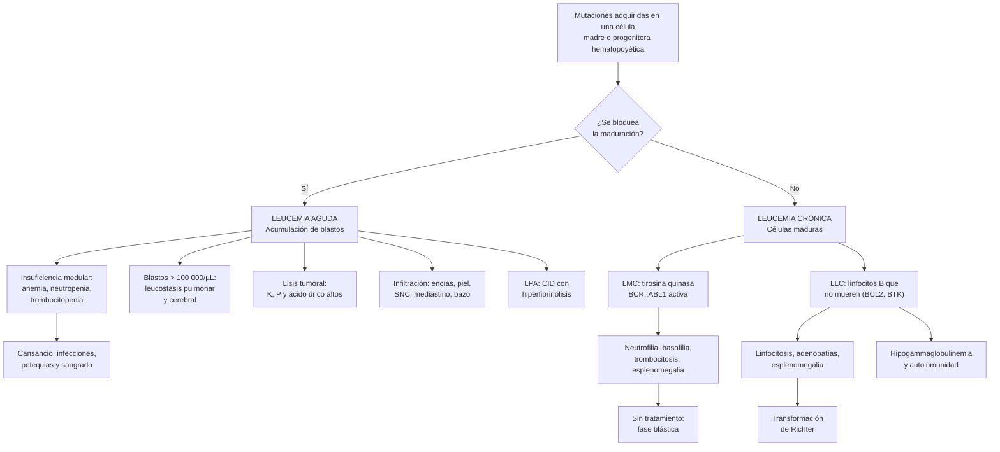

---
tags:
  - Hemato-oncología
  - GES
  - Urgencia
---

# Leucemias agudas y crónicas, reacción leucemoide y síndrome leucoeritroblástico

**Subespecialidad**
Hematología · Hemato-oncología · Medicina interna · Medicina de urgencia

**Guías principales**
ELN 2022: leucemia mieloide aguda · ELN 2019: leucemia promielocítica aguda · ELN 2024: leucemia linfoblástica aguda del adulto · ELN 2025: leucemia mieloide crónica · iwCLL 2018 y ESMO 2021 (actualización 2024): leucemia linfática crónica · OMS 2022 (5.ª edición): clasificación de las neoplasias hematológicas

**Otras fuentes**
APL0406 (ATRA + arsénico, 2013) · RATIFY (midostaurina, 2017) · VIALE-A (azacitidina + venetoclax, 2020) · CLL14 (venetoclax + obinutuzumab, 2019) · E1910 (blinatumomab, 2024) · Hiperleucocitosis (Röllig 2015) · Reacción leucemoide (Sakka 2006) · Series chilenas: protocolo LPA2000, consorcio IC-APL, LMA en el Hospital Sótero del Río, LLA Ph+ en el Hospital del Salvador · GLOBOCAN 2024 · SEER 2026 · Figura: Robak 2023 (CC BY 4.0)

**GES**
Sí: leucemia en personas de 15 años y más (problema de salud n.º 45). Cubre las leucemias **agudas y crónicas**, desde la sospecha, y las recaídas.

**EUNACOM**
1.08.1.009 Leucemias agudas (sospecha, inicial, derivar) · 1.08.1.010 Leucemias crónicas (sospecha, inicial, derivar) · 1.08.1.014 Reacción leucemoide (sospecha, inicial, derivar) · 1.08.1.015 Síndrome leucoeritroblástico (sospecha, inicial, derivar)

**Revisado**
Octubre 2026

!!! abstract "Resumen en 60 segundos"
    - **Leucemia**: neoplasia **clonal** de las células hematopoyéticas que ocupa la médula ósea y pasa a la sangre.
        - **Aguda**: **blastos** (en general **≥ 20 %**) que no maduran; evoluciona en **días o semanas** y es mortal sin tratamiento.
        - **Crónica**: células **maduras** o casi maduras; evoluciona en **meses o años**; a menudo se descubre en un hemograma de rutina.
    - **Leucemia aguda**: sospechar ante **citopenias** (cansancio y palidez, **fiebre e infecciones**, **petequias y sangrado**) con **blastos** en el frotis.
        - Es una **urgencia**: **hospitalizar** y derivar. El GES exige iniciar la quimioterapia **en 72 horas** desde la indicación.
        - **Estudio**: mielograma, **citometría de flujo**, citogenética y biología molecular.
        - **Leucemia mieloide aguda (LMA)**: la aguda más frecuente del adulto (mediana **70 años**). Pacientes aptos: quimioterapia intensiva (**7 + 3**). No aptos: **azacitidina + venetoclax**.
        - **Leucemia promielocítica (LPA)**: **CID** con sangrado grave. Dar **ATRA de inmediato ante la sospecha**, sin esperar la confirmación genética. Con ATRA + arsénico, **> 80 %** se cura.
        - **Leucemia linfoblástica aguda (LLA)**: sobre todo en niños. En el adulto, **~ 25 %** es **Ph+** (*BCR::ABL1*) y se trata con un inhibidor de tirosina quinasa (ITK).
    - **Leucemia linfática crónica (LLC)**: la leucemia más frecuente del adulto mayor en Occidente.
        - **Linfocitos B clonales ≥ 5000/µL** (CD5+ CD19+ CD23+ en la citometría de flujo).
        - Se trata **solo si está activa** (citopenias, síntomas B, bazo o adenopatías masivos o progresivos). En la etapa inicial: **observar**.
    - **Leucemia mieloide crónica (LMC)**: gen **BCR::ABL1** (cromosoma Filadelfia).
        - Leucocitosis con **desviación izquierda completa**, **basofilia** y **esplenomegalia**.
        - **Imatinib** u otro ITK oral: expectativa de vida **casi normal**.
    - **Reacción leucemoide**: leucocitos **> 50 000/µL** por una causa **reactiva** (infección grave, *C. difficile*, hemorragia, corticoides, tumores). Sin basofilia ni blastos. **Tratar la causa**.
    - **Síndrome leucoeritroblástico**: mielocitos + **eritroblastos** + **dacriocitos** en la sangre = **infiltración o fibrosis de la médula** → **biopsia de médula ósea**.
    - **Urgencias** que no se pueden perder: **leucostasis** (leucocitos > 100 000/µL), **lisis tumoral**, **CID** y **neutropenia febril**.

## Definición

- **Leucemia**: proliferación **clonal** de células hematopoyéticas que invade la **médula ósea**, la **sangre** y, a veces, otros órganos (bazo, ganglios, hígado, sistema nervioso central [SNC], piel, encías).
- **Leucemia aguda**: acumulación de **blastos** (células inmaduras) por un **bloqueo de la maduración**.
    - Umbral clásico: **≥ 20 % de blastos** en la médula ósea o en la sangre.
    - Algunas alteraciones genéticas **definen** la LMA con **menos** blastos (por ejemplo, *PML::RARA*, *RUNX1::RUNX1T1*, *CBFB::MYH11* y *NPM1* mutado) (OMS 2022).
    - Según el linaje: **mieloide (LMA)** o **linfoblástica (LLA)**, B o T.
- **Leucemia crónica**: proliferación de células **maduras** o en maduración, con un curso lento.
    - **Leucemia mieloide crónica (LMC)**: neoplasia mieloproliferativa con el gen de fusión ***BCR::ABL1***, producto de la translocación **t(9;22)** (cromosoma **Filadelfia**).
    - **Leucemia linfática crónica (LLC)**: **≥ 5000/µL linfocitos B clonales** en la sangre, mantenidos por **≥ 3 meses**, con el inmunofenotipo típico (iwCLL 2018). Si predominan las **adenopatías** y hay < 5000/µL linfocitos B clonales en la sangre, se llama **linfoma linfocítico de células pequeñas**: es la misma enfermedad.
    - **Linfocitosis B monoclonal**: < 5000/µL linfocitos B clonales **sin** adenopatías, visceromegalias, citopenias ni síntomas. Es un precursor; solo una minoría progresa a LLC.
- **Reacción leucemoide**: leucocitosis **> 50 000/µL**, en general por **neutrofilia** con desviación a izquierda, causada por un proceso **no leucémico**, que se resuelve al tratar la causa. Es más rara la reacción leucemoide **linfocitaria** (tos convulsiva, virus).
- **Síndrome leucoeritroblástico**: presencia en la sangre de **precursores mieloides** (mielocitos, metamielocitos, a veces blastos) y **eritroblastos** (glóbulos rojos nucleados), habitualmente con **dacriocitos** (glóbulos rojos en lágrima). Indica **infiltración** o **fibrosis** de la médula, o un estrés medular extremo.
- **Hiperleucocitosis**: leucocitos **> 100 000/µL** en una leucemia. **Leucostasis**: hiperleucocitosis con **síntomas** por la obstrucción de la microcirculación (pulmón, SNC).

## Epidemiología

### Mundial

- Las leucemias son **~ 2,5 %** de los cánceres.
- Edad, frecuencia y sobrevida en EE. UU. (SEER, *Cancer Stat Facts* 2026):

| Tipo | Casos nuevos estimados en EE. UU. (2026) | Mediana de edad al diagnóstico | Sobrevida relativa a 5 años |
|---|---|---|---|
| **LMA** | 22 720 | **70 años** | **33 %** |
| **LLC** | 22 760 | **71 años** | **90 %** |
| **LMC** | 9650 | 67 años | 71 % |
| **LLA** | 6250 | **18 años** (dos peaks: niños pequeños y > 50 años) | 73 % (niños y adultos) |

- **LMA**: la leucemia aguda más frecuente del **adulto**; su incidencia sube mucho con la edad.
- **LLA**: el cáncer más frecuente de la **infancia**. En los adultos, el pronóstico es mucho peor que en los niños.
- **LLC**: la leucemia más frecuente en los adultos de **Europa y América del Norte**; es rara en Asia.
- **LMC**: **15–20 %** de las leucemias del adulto.

### Chile

!!! chile "Datos nacionales"
    - **GLOBOCAN 2024** (estimación del Observatorio Global del Cáncer de la IARC):
        - **1226 casos nuevos** de leucemia al año (**2,0 %** de los cánceres; 14.º lugar).
        - **868 muertes** (**2,8 %** de las muertes por cáncer; **10.º lugar**).
        - **3840** personas viven con una leucemia diagnosticada en los últimos 5 años.
    - **GES 45: leucemia en personas de 15 años y más** (Superintendencia de Salud):
        - **Confirmación diagnóstica y estudio completo**: **21 días** desde la sospecha en la leucemia **aguda**; **60 días** en la **crónica**.
        - **Inicio de la quimioterapia**: **72 horas** desde la indicación en la **aguda**; **10 días** en la **crónica**.
        - **Primer control**: 14 días en la aguda y 30 días en la crónica.
        - Las leucemias de los **menores de 15 años** son otro problema GES (cáncer infantil).
        - En el sistema público, los adultos se tratan con **protocolos nacionales** del Ministerio de Salud en centros acreditados.
    - **LMA**, Hospital Sótero del Río (2015–2022; Domínguez 2024):
        - **120 pacientes** con LMA no promielocítica; mediana de edad **57 años**.
        - **Sobrevida global a 3 años: 19 %**; **35 %** con quimioterapia intensiva.
        - En los **≥ 60 años**, pocos recibieron quimioterapia intensiva (**15 de 65**). Al año sobrevivió el **46 %** con quimioterapia frente al **5 %** con solo cuidados paliativos.
    - **Estudio de la LMA en Chile** (Jerez 2023): con la citogenética y los pocos estudios moleculares disponibles, **menos de la mitad** de los pacientes puede clasificarse según el riesgo genético. Los autores piden incorporar la **secuenciación de nueva generación**.
    - **Leucemia promielocítica**:
        - **Protocolo chileno LPA2000** (ATRA + quimioterapia; 56 pacientes de 10 centros, 2000–2005): remisión completa **85 %**, **muerte precoz 15 %**, **sobrevida a 5 años 64 %** (Undurraga 2013).
        - **Consorcio internacional IC-APL** (Brasil, **Chile**, Paraguay, Perú y Uruguay; 806 pacientes, 2005–2020): la **mortalidad en la inducción** bajó de **32 % a 14,6 %** y la **sobrevida a 4 años llegó a 81 %** (Koury 2024).
        - Factores de muerte en la inducción: edad ≥ 40 años, mal estado funcional, riesgo alto, albúmina ≤ 3,5 g/dL, **demora de > 48 horas** entre los síntomas y el diagnóstico, y sangrado del SNC o pulmonar.
    - **LLA Ph+** del adulto, Hospital del Salvador (2010–2019; Benavente 2021): **35 pacientes** de 15–59 años con el protocolo nacional + **imatinib**. Remisión completa **97 %**; sobrevida global a 3 años **52 %**.
    - **LLA en recaída**: el grupo GRELAL-Chile informó **74 %** de remisión con **inotuzumab** en 35 pacientes de centros públicos y privados (Espinoza 2025).

## Etiología y factores de riesgo

- En la **mayoría** de los pacientes **no se identifica** una causa.

| Factor | Leucemias asociadas |
|---|---|
| **Edad avanzada** (mutaciones acumuladas; **hematopoyesis clonal**) | LMA, LLC, LMC |
| **Quimioterapia previa** (alquilantes, inhibidores de la topoisomerasa II) y **radioterapia** | **LMA relacionada con el tratamiento** (años después), SMD |
| **Radiación ionizante** (bomba atómica, accidentes) | LMA, LLA, LMC |
| **Benceno** (industria petroquímica, solventes) y **tabaco** | LMA |
| **Otra neoplasia mieloide previa**: síndrome mielodisplásico (SMD), neoplasia mieloproliferativa | LMA secundaria |
| **Síndromes genéticos**: síndrome de Down, anemia de Fanconi, ataxia-telangiectasia | LLA y LMA |
| **Predisposición germinal** (*DDX41*, *RUNX1*, *CEBPA*, *GATA2*, *TP53*) | LMA y SMD; importa para elegir un donante familiar |
| **Antecedente familiar de LLC** o de otros linfomas | LLC |
| **HTLV-1** | Leucemia/linfoma de células T del adulto |

## Fisiopatología

- **Leucemia aguda**:
    - Una célula madre o progenitora adquiere mutaciones que le dan **ventaja proliferativa** y **bloquean la maduración**.
    - Los **blastos** se acumulan en la médula y desplazan a la hematopoyesis normal: **anemia**, **neutropenia** (infecciones) y **trombocitopenia** (sangrado). Por eso, el recuento total de leucocitos puede estar **alto, normal o bajo**.
    - **Infiltración** de otros órganos: encías y piel (LMA monocítica), SNC y testículos (LLA), **mediastino** (LLA-T), hígado, bazo y ganglios.
    - **Leucostasis**: los blastos son grandes y poco deformables. Con recuentos muy altos, obstruyen los capilares del **pulmón** y del **SNC**.
    - **Lisis tumoral**: la destrucción de muchas células (espontánea o con la quimioterapia) libera **potasio, fósforo y ácido úrico**.
    - **LPA**: los promielocitos expresan **factor tisular** y **anexina II**: **CID** con **hiperfibrinólisis** y sangrado grave. El **ATRA** destraba la diferenciación bloqueada por el gen *PML::RARA*.
- **LMC**:
    - La proteína **BCR::ABL1** es una **tirosina quinasa siempre activa**.
    - Produce **proliferación** de las células mieloides, que **sí maduran**: neutrofilia con todas las etapas de maduración, **basofilia**, trombocitosis y **esplenomegalia**.
    - Sin tratamiento, se suman mutaciones y progresa a la **fase blástica** (una leucemia aguda).
    - Los **ITK** (imatinib y otros) bloquean el sitio de unión del ATP de BCR::ABL1.
- **LLC**:
    - Linfocitos B maduros que **sobreviven demasiado** (proteína antiapoptótica **BCL2**) y proliferan en los ganglios por la señal del **receptor de la célula B**, que depende de la **BTK**. Por eso se tratan con **inhibidores de BTK** y de **BCL2** (venetoclax).
    - **Inmunodeficiencia**: **hipogammaglobulinemia** y disfunción de los linfocitos T: **infecciones**.
    - **Autoinmunidad**: **anemia hemolítica autoinmune**, **trombocitopenia inmune**.
    - **Transformación de Richter**: evolución a un **linfoma agresivo** (difuso de células grandes B).
- **Reacción leucemoide**: las citoquinas (G-CSF, IL-6) liberadas por una **infección**, una **inflamación**, una **hemorragia** o un **tumor** movilizan a los neutrófilos y aceleran la granulopoyesis. Las células son **policlonales** y normales.
- **Síndrome leucoeritroblástico**: la **infiltración** (metástasis, linfoma, mieloma) o la **fibrosis** de la médula rompen la barrera médula-sangre, y la hematopoyesis se traslada al **bazo y el hígado** (hematopoyesis extramedular). Salen células inmaduras a la sangre, y los glóbulos rojos se deforman (**lágrima**).

*Figura 1. Fisiopatología de las leucemias agudas y crónicas. Esquema propio basado en ELN 2022, ELN 2025 e iwCLL 2018.*

## Clasificación

### Tipos de leucemia (OMS 2022)

| Grupo | Tipos principales | Clave |
|---|---|---|
| **LMA** | Con alteraciones genéticas definitorias (*PML::RARA*, *RUNX1::RUNX1T1*, *CBFB::MYH11*, *NPM1*, *KMT2A*, *CEBPA*); relacionada con mielodisplasia; definida por la diferenciación (mínimamente diferenciada, monocítica, eritroide, megacarioblástica) | **Mieloperoxidasa** positiva, **bastones de Auer** |
| **LPA** (un subtipo de LMA) | LMA con *PML::RARA*, t(15;17) | **CID**; tratar con ATRA ± arsénico |
| **LLA** | **B** (~ 75 %), con subtipos genéticos (Ph+ *BCR::ABL1*, Ph-like, *KMT2A*); **T** (~ 25 %) | TdT+, CD19/CD22 (B) o CD3 (T) |
| **LMC** | Fase **crónica** (~ 90 % al diagnóstico) y fase **blástica** (blastos ≥ 20 % o proliferación extramedular de blastos). Las guías ELN y la ICC conservan la fase **acelerada** | *BCR::ABL1* |
| **LLC** / linfoma linfocítico | — | CD5+ CD19+ CD20 débil, CD23+, cadena liviana única |
| **Otras leucemias crónicas** | **Tricoleucemia** (pancitopenia, **monocitopenia**, esplenomegalia, *BRAF* V600E); leucemia de linfocitos grandes granulares (neutropenia, artritis reumatoide); leucemia prolinfocítica; LMC atípica y leucemia neutrofílica crónica (*CSF3R*) | Citometría y biología molecular |

### Riesgo genético de la LMA (ELN 2022)

| Riesgo | Alteraciones |
|---|---|
| **Favorable** | t(8;21) *RUNX1::RUNX1T1*; inv(16) o t(16;16) *CBFB::MYH11*; ***NPM1* mutado sin FLT3-ITD**; mutación bZIP de *CEBPA* |
| **Intermedio** | *NPM1* mutado con FLT3-ITD; *NPM1* no mutado con FLT3-ITD (sin alteraciones adversas); t(9;11) *MLLT3::KMT2A*; otras no clasificadas como favorables ni adversas |
| **Adverso** | Cariotipo **complejo** o monosómico; −5 o del(5q), −7, −17/abn(17p); t(6;9); t(9;22) *BCR::ABL1*; inv(3) o t(3;3); reordenamientos de *KMT2A* (salvo t(9;11)); ***TP53* mutado**; mutaciones relacionadas con mielodisplasia (*ASXL1*, *BCOR*, *EZH2*, *RUNX1*, *SF3B1*, *SRSF2*, *STAG2*, *U2AF1*, *ZRSR2*) |

### Riesgo de la leucemia promielocítica (PETHEMA/GIMEMA)

- **Bajo o intermedio**: leucocitos **≤ 10 000/µL**.
- **Alto**: leucocitos **> 10 000/µL**: más muerte precoz (sangrado) y más recaídas.

### Etapas clínicas de la LLC

| Rai | Hallazgos | Binet | Hallazgos |
|---|---|---|---|
| **0** (riesgo bajo) | Solo linfocitosis | **A** | < 3 áreas linfoides comprometidas* |
| **I–II** (intermedio) | + adenopatías (I) o + hepatomegalia o esplenomegalia (II) | **B** | ≥ 3 áreas linfoides comprometidas |
| **III–IV** (alto) | + **anemia** (Hb < 11 g/dL) (III) o + **trombocitopenia** (< 100 000/µL) (IV) | **C** | **Hb < 10 g/dL** o **plaquetas < 100 000/µL** |

\* Áreas de Binet: ganglios cervicales, axilares e inguinales (uni o bilaterales), bazo e hígado.

- **CLL-IPI** (pronóstico): **TP53** alterado (deleción 17p o mutación), ***IGHV* no mutado**, **β2-microglobulina** > 3,5 mg/L, etapa avanzada y edad > 65 años.

## Clínica

| | Leucemia aguda | LMC | LLC |
|---|---|---|---|
| **Inicio** | **Días a semanas** | Insidioso; **~ 50 % asintomático** (hemograma de rutina) | Insidioso; **la mayoría asintomática** al diagnóstico |
| **Por citopenias** | **Anemia** (cansancio, disnea, palidez), **fiebre e infecciones** graves (neutropenia), **petequias, equimosis, gingivorragia, epistaxis** | Rara en la fase crónica | Anemia o trombocitopenia en las etapas avanzadas (por infiltración **o autoinmunes**) |
| **Órganos** | Hepatoesplenomegalia y adenopatías leves (más en la LLA); **hipertrofia gingival** e infiltración de la piel (LMA monocítica); **masa mediastínica** (LLA-T); compromiso del **SNC** (cefalea, pares craneales) | **Esplenomegalia** (a veces masiva): **saciedad precoz**, dolor en el hipocondrio izquierdo | **Adenopatías** indoloras, simétricas, móviles; esplenomegalia |
| **Generales** | Dolor óseo (LLA), baja de peso | Cansancio, baja de peso, sudoración | **Síntomas B** en la enfermedad avanzada; infecciones bacterianas recurrentes; reacción exagerada a las picaduras de insectos |
| **Típico** | **CID** y sangrado en la **LPA**; **leucostasis** con leucocitos muy altos | Leucocitosis y trombocitosis en un hemograma | Linfocitosis en un adulto mayor |

!!! alarma "Signos de alarma: derivar de inmediato"
    - **Blastos** en el frotis, o **pancitopenia** sin causa clara.
    - **Sangrado** con trombocitopenia y alteración de la coagulación (TP prolongado, **fibrinógeno bajo**): sospechar **LPA**.
    - **Fiebre** con neutrófilos **< 500/µL** (neutropenia febril).
    - Leucocitos **> 100 000/µL** con **disnea**, hipoxemia, **compromiso de conciencia**, cefalea o alteraciones visuales (**leucostasis**).
    - **Lisis tumoral**: potasio, fósforo, ácido úrico y creatinina altos; arritmias.
    - **Masa mediastínica** con síndrome de vena cava superior o compresión de la vía aérea (LLA-T).
    - En la LLC: **anemia hemolítica** o caída rápida de las plaquetas; crecimiento rápido de un ganglio, fiebre y LDH alta (**Richter**).

## Diagnóstico

- **El primer paso es el hemograma con frotis**, revisado por un tecnólogo médico o un hematólogo: confirma la célula que aumenta, busca **blastos** y otras células anormales (figura 2).
- **Leucemia aguda**:
    - **Mielograma** (aspirado de médula ósea) y, si es "seco", **biopsia**.
    - **Citometría de flujo**: define el linaje (mieloide, B o T).
    - **Citogenética** (cariograma, FISH) y **biología molecular** (*PML::RARA*, *BCR::ABL1*, *NPM1*, *FLT3*, *CEBPA*, *TP53* y, si está disponible, un panel de secuenciación): definen el **riesgo** y el tratamiento.
    - **Punción lumbar** en la LLA (y en la LMA con síntomas neurológicos), en general **junto con la primera quimioterapia intratecal** y con las plaquetas corregidas.
    - **Tipificación HLA** precoz del paciente y de sus hermanos si es candidato a un trasplante.
- **LMC**: ***BCR::ABL1*** por **PCR cuantitativa** en sangre periférica, y **mielograma con cariograma** al diagnóstico (fase y otras alteraciones cromosómicas).
- **LLC**: **citometría de flujo en sangre periférica**. **No requiere** biopsia de médula ni de ganglio para el diagnóstico.

!!! guia "Criterios diagnósticos"
    - **Leucemia aguda** (OMS 2022): **≥ 20 % de blastos** en la médula ósea o la sangre. Una alteración genética definitoria (por ejemplo, *PML::RARA*, *RUNX1::RUNX1T1*, *CBFB::MYH11* o *NPM1*) permite el diagnóstico de LMA con **menos de 20 %**. La clasificación ICC 2022 usa un umbral de **10 %** para estas alteraciones.
    - **LPA**: blastos y **promielocitos anormales** (gránulos abundantes, **células de Faggot** con haces de bastones de Auer) + ***PML::RARA*** (PCR o FISH) o t(15;17). **La sospecha clínica basta para iniciar el ATRA** (ELN 2019).
    - **LLC** (iwCLL 2018): **≥ 5000/µL linfocitos B** en la sangre por **≥ 3 meses**, con **clonalidad** demostrada por citometría de flujo (restricción de una cadena liviana, κ o λ). Inmunofenotipo: **CD5+, CD19+, CD20 débil, CD23+** e inmunoglobulina de superficie débil.
    - **LMC** (ELN 2025): neutrofilia con desviación izquierda + **cromosoma Filadelfia** o ***BCR::ABL1***.

### Reacción leucemoide frente a LMC

| | Reacción leucemoide | LMC |
|---|---|---|
| **Causa** | Infección grave, inflamación, hemorragia, hemólisis, fármacos, tumores | Neoplasia clonal |
| **Frotis** | Desviación izquierda **con predominio de baciliformes y metamielocitos**; **granulaciones tóxicas, cuerpos de Döhle**, vacuolas | **Todas** las etapas de maduración (peak de **mielocitos** y segmentados); **basofilia** y eosinofilia |
| **Basófilos** | Normales | **Aumentados** (clave) |
| **Plaquetas** | Normales o altas (reactivas) | A menudo **altas** |
| **Esplenomegalia** | No (salvo por la causa) | **Sí**, frecuente |
| **Fosfatasa alcalina leucocitaria** (examen clásico) | **Alta** | **Baja** |
| ***BCR::ABL1*** | **Negativo** | **Positivo** |
| **Evolución** | Se normaliza al **tratar la causa** | Persiste y progresa |

<figure markdown>
![Esquema de enfoque de la leucocitosis. Primer paso: con leucocitos sobre 11 000 por microlitro, repetir el hemograma con frotis revisado y preguntar qué célula aumenta, si hay anemia o trombocitopenia, y si hay blastos, eritroblastos o basofilia; examinar fiebre, foco infeccioso, adenopatías, esplenomegalia, hepatomegalia, sangrado, baja de peso y sudoración nocturna. Cinco caminos. Blastos en el frotis con anemia y trombocitopenia: leucemia aguda, urgencia, hospitalizar y derivar por GES 45; mielograma, citometría de flujo, citogenética y estudio molecular; si hay CID, pensar en leucemia promielocítica y dar ATRA de inmediato. Linfocitosis madura con linfocitos pequeños y sombras de Gumprecht: leucemia linfática crónica; linfocitos B clonales de 5000 o más por microlitro por 3 meses; citometría de flujo CD5, CD19 y CD23 positivos; descartar linfocitosis reactiva por virus, tos convulsiva o estrés. Neutrofilia con basofilia, desviación izquierda completa y esplenomegalia: leucemia mieloide crónica; mielocitos y metamielocitos en el frotis y plaquetas a menudo altas; confirmar con BCR::ABL1 por PCR cuantitativa o cromosoma Filadelfia por cariograma o FISH. Neutrofilia sobre 50 000 con una causa clara, sin basofilia ni blastos: reacción leucemoide por infección grave, C. difficile, hemorragia o hemólisis aguda, corticoides, G-CSF o tumores sólidos de pulmón o riñón; granulaciones tóxicas y cuerpos de Döhle; tratar la causa. Leucoeritroblastosis con mielocitos, eritroblastos y dacriocitos: infiltración o fibrosis de la médula por metástasis de mama, próstata o pulmón, mielofibrosis, linfoma, mieloma o tuberculosis, también en la sepsis o la hemorragia graves; biopsia de médula. Abajo, criterios de derivación urgente al hematólogo: blastos en sangre, leucocitos sobre 100 000 con disnea o compromiso neurológico, CID o sangrado, fiebre con neutrófilos bajo 500, lisis tumoral y pancitopenia sin causa clara](../assets/figuras/leucemias/enfoque-leucocitosis.svg){ loading=lazy }
<figcaption>Figura 2. Enfoque de la leucocitosis: leucemias agudas y crónicas, reacción leucemoide y síndrome leucoeritroblástico. Esquema propio basado en ELN 2022, ELN 2025, iwCLL 2018 y Sakka 2006.</figcaption>
</figure>

## Laboratorio

| Examen | Para qué |
|---|---|
| **Hemograma con frotis** | Citopenias; **blastos**; **bastones de Auer** (LMA); promielocitos con gránulos abundantes (LPA); linfocitos pequeños con **sombras de Gumprecht** (LLC); basofilia (LMC); eritroblastos y dacriocitos (síndrome leucoeritroblástico); granulaciones tóxicas (reacción leucemoide) |
| **Coagulación**: TP, TTPA, **fibrinógeno**, dímero D | **CID** (sobre todo en la **LPA**); repetir cada 6–12 horas en la inducción |
| **Lisis tumoral**: **LDH**, **ácido úrico**, **potasio**, **fósforo**, **calcio**, **creatinina** | Riesgo y diagnóstico del síndrome de lisis tumoral |
| Pruebas hepáticas, albúmina, electrolitos, glicemia | Basales antes de la quimioterapia |
| **Serologías de VHB, VHC y VIH** | **Reactivación del VHB** con la quimioterapia, el rituximab o el obinutuzumab y los inhibidores de BTK; profilaxis antiviral si el HBsAg o el anti-HBc son positivos |
| **Grupo sanguíneo y Rh**, prueba de antiglobulina directa (**Coombs**) | Transfusiones; anemia hemolítica autoinmune en la LLC |
| **Inmunoglobulinas** y **β2-microglobulina** | Hipogammaglobulinemia y pronóstico en la LLC |
| **Hemocultivos** y cultivos dirigidos | Si hay fiebre: **neutropenia febril** |
| **Prueba de embarazo** | Mujeres en edad fértil (quimioterapia, ITK teratogénicos) |
| **Mielograma**, **citometría de flujo**, **citogenética** y **biología molecular** | Diagnóstico, clasificación y riesgo (ver arriba) |
| ***BCR::ABL1*** por **PCR cuantitativa** (escala internacional) | Diagnóstico y **seguimiento** de la LMC y de la LLA Ph+ |
| **Enfermedad residual medible** (citometría o PCR) | Respuesta en la LLA y la LMA; guía la indicación de trasplante |

- **Pseudohiperkalemia** y **pseudohipoxemia**: con leucocitos muy altos, las células consumen oxígeno y liberan potasio en el tubo. Medir los gases de forma inmediata (en hielo) y el potasio en plasma o en sangre total.

## Imágenes

- **Radiografía de tórax**: infiltrados (infección, leucostasis, síndrome de diferenciación) y **masa mediastínica** (LLA-T).
- **Ecografía abdominal**: tamaño del **bazo** y del hígado.
- **Ecocardiograma** (fracción de eyección) **antes de las antraciclinas** (daunorrubicina, idarrubicina).
- **TC de cerebro** si hay compromiso neurológico o cefalea con trombocitopenia o coagulopatía (**hemorragia intracraneana**, sobre todo en la LPA).
- **TC de cuello, tórax, abdomen y pelvis** en la LLC: **no es de rutina**; solo si hay síntomas, para evaluar adenopatías profundas o una sospecha de **Richter** (**PET-CT** para elegir el ganglio que se biopsia).
- **Morfología**: la figura 3 muestra los linfocitos de la LLC.

<figure markdown>
{ loading=lazy }
<figcaption>Figura 3. Morfología de la leucemia linfática crónica: (A) sangre periférica y (B) médula ósea con los linfocitos maduros típicos, pequeños, de citoplasma escaso y cromatina densa; (C) sangre periférica y (D) médula ósea con células de LLC grandes, atípicas (aumento 63×). Fuente: Robak T, Krawczyńska A, Cebula-Obrzut B, et al. Atypical chronic lymphocytic leukemia—the current status. <em>Cancers (Basel).</em> 2023;15(18):4427, figura 1. Licencia <a href="https://creativecommons.org/licenses/by/4.0/">CC BY 4.0</a>.</figcaption>
</figure>

## Diagnóstico diferencial

### Del síndrome leucoeritroblástico

| Grupo | Causas |
|---|---|
| **Infiltración de la médula por un tumor sólido** | Metástasis de **mama**, **próstata**, **pulmón**, estómago; neuroblastoma (niños) |
| **Neoplasias hematológicas** | **Mielofibrosis** primaria (con esplenomegalia masiva), leucemias, **linfomas**, **mieloma**, tricoleucemia |
| **Infecciones y granulomas** | **Tuberculosis** miliar, micosis diseminadas |
| **Otras** | Enfermedades de depósito (Gaucher), osteopetrosis |
| **Estrés medular sin infiltración** | **Sepsis** grave, **hemorragia** o **hemólisis** aguda grave, hipoxemia grave, recuperación tras la quimioterapia, G-CSF |

- **Conducta**: frotis revisado, LDH, búsqueda del tumor primario y **biopsia de médula ósea** (el aspirado suele ser "**seco**" por la fibrosis o la infiltración). Derivar a hematología.

### Otras

| Hallazgo | Diferencial |
|---|---|
| **Pancitopenia** | **Aplasia medular**, **síndrome mielodisplásico**, **déficit de vitamina B12 o folato** (megaloblastosis), **hiperesplenismo** (cirrosis), infiltración (leucemia, linfoma, metástasis), **VIH**, fármacos (quimioterapia, metotrexato, cotrimoxazol), LES, sepsis grave, hemofagocitosis |
| **Linfocitosis** | **Reactiva** (mononucleosis por VEB o CMV, **tos convulsiva**, hepatitis viral, estrés agudo, esplenectomía, tabaquismo); **linfocitosis B monoclonal**; **linfomas leucemizados** (manto: **CD5+ CD23−**, ciclina D1; folicular; zona marginal); leucemia prolinfocítica; tricoleucemia |
| **Linfocitos atípicos** (mononucleosis) frente a **blastos** | Los linfocitos reactivos son **heterogéneos** y abrazan a los glóbulos rojos; los blastos son **monótonos**, con cromatina fina y nucléolos. Ante la duda: **citometría de flujo** |
| **Neutrofilia** | Infecciones, corticoides, tabaquismo, embarazo, ejercicio, estrés, asplenia, inflamación crónica, **LMC** y otras neoplasias mieloproliferativas |
| **Esplenomegalia masiva** | **LMC**, **mielofibrosis**, linfomas, tricoleucemia, malaria, leishmaniasis visceral |
| **Hipertrofia gingival** | **LMA monocítica**, fármacos (fenitoína, ciclosporina, nifedipino) |

## Tratamiento

### Medidas iniciales ante la sospecha de una leucemia aguda

- **Hospitalizar** y llamar al **hematólogo** el mismo día. Notificar el GES.
- **Neutropenia**: aislamiento protector, higiene de manos. Si hay **fiebre**: hemocultivos y **antibiótico de amplio espectro antes de 1 hora** (ver [neutropenia febril](urgencias-oncologicas.md)).
- **Prevención de la lisis tumoral**: hidratación EV (**2–3 L/m²/día**), **alopurinol**; **rasburicasa** si el riesgo es alto (ver [lisis tumoral](urgencias-oncologicas.md)). Control de electrolitos y creatinina **cada 6–12 horas** al iniciar la quimioterapia.
- **Hemocomponentes leucorreducidos** (e irradiados cuando corresponda):
    - **Plaquetas** si son **< 10 000/µL**, o con umbrales más altos si hay fiebre, sangrado o procedimientos.
    - En la **LPA** con coagulopatía: plaquetas **> 30 000–50 000/µL**, **fibrinógeno > 100–150 mg/dL** (crioprecipitado) y plasma fresco congelado para corregir el TP (ELN 2019).
    - **Glóbulos rojos** si la Hb es **< 7 g/dL** o hay síntomas. Con **hiperleucocitosis**, transfundir con **cautela** (aumenta la viscosidad) hasta bajar los leucocitos.
- **Si se sospecha una LPA** (CID, fibrinógeno bajo, promielocitos anormales): **ATRA de inmediato**, sin esperar el estudio genético. **Evitar** las punciones innecesarias, los catéteres centrales y la punción lumbar mientras persista la coagulopatía.
- **Hiperleucocitosis o leucostasis**:
    - **Iniciar el tratamiento de la leucemia** cuanto antes (es lo que más baja los leucocitos).
    - **Hidroxiurea** oral mientras se completa el estudio (LMA).
    - La **leucoaféresis** no ha demostrado mejorar la sobrevida; se usa en casos seleccionados. **Contraindicada en la LPA** (empeora la coagulopatía).
- **Preservación de la fertilidad** (banco de semen) si el tiempo lo permite; anticoncepción.
- **Derivar** a un centro con hematología y unidad de quimioterapia intensiva (protocolos nacionales y GES 45).

### Leucemia mieloide aguda (ELN 2022)

| Situación | Tratamiento |
|---|---|
| **Apto para quimioterapia intensiva** (en general, < 75 años y sin comorbilidades graves) | **Inducción "7 + 3"**: **citarabina** 7 días en infusión continua + **antraciclina** (daunorrubicina ≥ 60 mg/m² o idarrubicina) 3 días. Remisión completa en **60–80 %** |
| *FLT3* mutado | + **midostaurina** (RATIFY: mejor sobrevida) o **quizartinib** (FLT3-ITD) |
| LMA de **factores de unión al núcleo** (*core binding factor*: t(8;21), inv(16)) | + **gemtuzumab ozogamicina** (anti-CD33) |
| LMA **secundaria** o relacionada con mielodisplasia | **CPX-351** (daunorrubicina y citarabina liposomales) |
| **Consolidación** | Riesgo **favorable**: **citarabina en dosis intermedias o altas** por 3–4 ciclos. Riesgo **intermedio o adverso**: **trasplante alogénico** de precursores hematopoyéticos en la primera remisión |
| **No apto** para la quimioterapia intensiva (edad avanzada, comorbilidades) | **Azacitidina + venetoclax** (VIALE-A: mediana de sobrevida **14,7 frente a 9,6 meses** con azacitidina sola; remisión **66 % frente a 28 %**). Alternativas: citarabina en dosis bajas + venetoclax; **ivosidenib + azacitidina** si hay mutación de *IDH1* |
| **Fragilidad extrema** | **Cuidados paliativos**, transfusiones e hidroxiurea para controlar los leucocitos |
| **Recaída** | Según las mutaciones: **gilteritinib** (*FLT3*), inhibidores de *IDH1/IDH2*, menina (*KMT2A* o *NPM1*); trasplante si es posible |

- **Profilaxis** durante la inducción de la LMA: **antifúngica** con **posaconazol** (alto riesgo de aspergilosis); antiviral y antibacteriana según el protocolo local.

### Leucemia promielocítica aguda (ELN 2019)

- **Riesgo bajo o intermedio** (leucocitos ≤ 10 000/µL): **ATRA + trióxido de arsénico**, **sin quimioterapia** (APL0406: sobrevida libre de eventos a 2 años de **97 % frente a 86 %** con ATRA + idarrubicina).
- **Riesgo alto** (leucocitos > 10 000/µL): **ATRA + quimioterapia** (idarrubicina) o **ATRA + arsénico + una antraciclina** (o gemtuzumab).
- **Donde no hay arsénico** (como en el protocolo chileno LPA2000 y el consorcio IC-APL): ATRA + antraciclina; con un manejo de soporte agresivo, la sobrevida es comparable a la de los países de altos ingresos.
- **Síndrome de diferenciación** (antes "síndrome del ácido retinoico"; **hasta 25 %**):
    - **Fiebre**, **disnea**, hipoxemia, **infiltrados pulmonares**, derrame pleural o pericárdico, **aumento de peso** y edema, hipotensión, **lesión renal aguda**.
    - **Tratamiento**: **dexametasona 10 mg EV cada 12 horas** ante la primera sospecha, hasta que se resuelva. Suspender transitoriamente el ATRA o el arsénico si es grave.
    - **Profilaxis** con corticoides si los leucocitos están altos.
- **Arsénico**: prolonga el **QT**. ECG seriados y mantener el **potasio > 4 mEq/L** y el **magnesio > 1,8 mg/dL**.

### Leucemia linfoblástica aguda del adulto (ELN 2024)

- **Esquemas de inspiración pediátrica** en los adolescentes y adultos jóvenes (< 40–55 años, según el protocolo), con **asparaginasa**.
- **Fases**:
    1. **Inducción**: corticoide (prednisona o dexametasona), **vincristina**, antraciclina, asparaginasa.
    2. **Consolidación e intensificación**.
    3. **Profilaxis del SNC**: **quimioterapia intratecal** (metotrexato, citarabina) y dosis altas de metotrexato.
    4. **Mantención** por **2–3 años**: mercaptopurina diaria y metotrexato semanal orales.
- **LLA Ph+**: **ITK** (**imatinib**, dasatinib o **ponatinib**) desde el inicio + quimioterapia o, cada vez más, ITK + **blinatumomab** con poca o ninguna quimioterapia.
- **Inmunoterapia**:
    - **Blinatumomab** (anticuerpo biespecífico CD19-CD3): para la **enfermedad residual medible** positiva y la recaída. En el ensayo E1910, agregarlo a la consolidación de los pacientes con enfermedad residual **negativa** mejoró la sobrevida.
    - **Inotuzumab ozogamicina** (anti-CD22) y **células CAR-T** (anti-CD19) en la recaída o la enfermedad refractaria.
- **Trasplante alogénico** si la enfermedad residual medible persiste positiva, el riesgo genético es alto o hay recaída.
- **Profilaxis de *Pneumocystis*** con cotrimoxazol durante el tratamiento.

### Leucemia mieloide crónica (ELN 2025)

- **Fase crónica**: **ITK oral de por vida** (o hasta lograr una remisión sin tratamiento).

| ITK | Puntos clave | Efectos adversos característicos |
|---|---|---|
| **Imatinib** (1.ª generación) | Primera línea; el más usado y barato | **Edema** periorbitario, **calambres**, náuseas, diarrea, rash |
| **Dasatinib** (2.ª generación) | Respuesta más rápida | **Derrame pleural**, **hipertensión pulmonar**, sangrado |
| **Nilotinib** (2.ª generación) | En ayunas, cada 12 horas | **Eventos vasculares arteriales**, hiperglicemia, dislipidemia, pancreatitis, **QT largo** |
| **Bosutinib** (2.ª generación) | Primera o segunda línea | **Diarrea**, hepatotoxicidad |
| **Asciminib** (inhibidor alostérico) | Primera línea (aprobado en 2024) y tras ≥ 2 ITK | Bien tolerado; pancreatitis, hipertensión |
| **Ponatinib** (3.ª generación) | Mutación **T315I** o resistencia a varios ITK | **Oclusión arterial**, hipertensión, pancreatitis |

- **Metas de respuesta molecular** (*BCR::ABL1* en escala internacional; ELN 2020 y 2025):

| Tiempo | Óptima | Alerta | Falla |
|---|---|---|---|
| **3 meses** | **≤ 10 %** | > 10 % | > 10 % confirmado en 1–3 meses |
| **6 meses** | **≤ 1 %** | > 1–10 % | > 10 % |
| **12 meses** | **≤ 0,1 %** (respuesta molecular mayor) | > 0,1–1 % | > 1 % |
| **Después** | ≤ 0,1 % | > 0,1–1 % o pérdida de ≤ 0,1 % | > 1 % |

- **Falla**: revisar la **adherencia** (la causa más común) y las **interacciones** (inductores e inhibidores del CYP3A4, inhibidores de la bomba de protones con dasatinib); estudiar las **mutaciones** de *ABL1*; cambiar de ITK.
- **Remisión sin tratamiento**: tras **años** de respuesta molecular **profunda y estable**, algunos pacientes pueden **suspender el ITK** con un control estricto por PCR. Cerca de la mitad mantiene la remisión.
- **Fase blástica**: ITK + quimioterapia de leucemia aguda y **trasplante alogénico**.
- **Embarazo**: los ITK son **teratogénicos**. Planificar con el hematólogo.

### Leucemia linfática crónica (iwCLL 2018; ESMO 2021 y 2024)

- **Etapas iniciales asintomáticas** (Rai 0–II, Binet A–B): **observar** ("vigilar y esperar"). El tratamiento precoz **no** mejora la sobrevida.
- **Tratar solo si hay enfermedad activa** (iwCLL 2018), con **al menos uno** de estos criterios:

| Criterio de enfermedad activa |
|---|
| **Insuficiencia medular** progresiva: **Hb < 10 g/dL** o **plaquetas < 100 000/µL** |
| **Esplenomegalia** masiva (≥ 6 cm bajo el reborde costal), progresiva o sintomática |
| **Adenopatías** masivas (≥ 10 cm), progresivas o sintomáticas |
| **Linfocitosis progresiva**: aumento ≥ 50 % en 2 meses o tiempo de duplicación < 6 meses (excluir otras causas) |
| **Anemia o trombocitopenia autoinmunes** que no responden a los corticoides |
| Compromiso **extraganglionar** sintomático (piel, riñón, pulmón, columna) |
| **Síntomas constitucionales**: baja de peso ≥ 10 % en 6 meses, cansancio que impide trabajar, **fiebre ≥ 38 °C por ≥ 2 semanas** sin infección, **sudoración nocturna** por > 1 mes |

- **Antes de tratar**: estudiar ***TP53*** (deleción 17p por FISH y mutación) y el estado mutacional de ***IGHV***.
- **Opciones de primera línea** (terapias dirigidas, sin quimioterapia):
    - **Inhibidores de BTK** continuos: **acalabrutinib**, **zanubrutinib** (mejor perfil cardiovascular) o ibrutinib.
    - **Venetoclax + obinutuzumab** por **12 meses** (duración fija; CLL14).
    - **Venetoclax + ibrutinib** (duración fija).
    - Con ***TP53* alterado**: preferir un **inhibidor de BTK** continuo (o un esquema con venetoclax).
    - La **quimioinmunoterapia** (fludarabina, ciclofosfamida y rituximab [FCR]; bendamustina-rituximab) ya **no** es la primera opción. El FCR puede considerarse en pacientes jóvenes con *IGHV* mutado y sin alteración de *TP53* cuando no hay acceso a las terapias dirigidas.
- **Medidas de soporte**:
    - **Vacunas**: influenza anual, **neumococo**, COVID-19, **herpes zóster recombinante**; **no** usar vacunas a virus vivos.
    - **Inmunoglobulina EV** si hay **hipogammaglobulinemia** (IgG < 500 mg/dL) con **infecciones bacterianas graves o recurrentes**.
    - **Anemia hemolítica autoinmune** o PTI: **corticoides** (prednisona 1 mg/kg/día).
    - Control del **cáncer de piel** (más frecuente).
    - Venetoclax: alto riesgo de **lisis tumoral**; se inicia con **escalada semanal de la dosis**, hidratación y controles de laboratorio.

### Reacción leucemoide

- **Buscar y tratar la causa**: infección grave (incluida la **colitis por *C. difficile***, que puede dar leucocitos > 50 000/µL; ver [diarrea](../gastroenterologia/diarrea-aguda-y-clostridioides-difficile.md)), sepsis, hemorragia o hemólisis aguda, quemaduras, cetoacidosis, hepatitis alcohólica, **fármacos** (corticoides, G-CSF, ATRA), tumores sólidos productores de G-CSF (pulmón, riñón, vejiga) y metástasis en la médula.
- **No requiere** tratamiento citorreductor. Los leucocitos bajan al controlar la causa.
- **Derivar a hematología** si: hay **basofilia**, **blastos**, esplenomegalia sin explicación, citopenias asociadas, o la leucocitosis **persiste** sin causa: estudiar con ***BCR::ABL1*** y citometría de flujo.
- La leucocitosis marcada es un **marcador de gravedad**: en la colitis por *C. difficile*, **> 15 000/µL** define una infección grave.

!!! dosis "Dosis de referencia (adulto; las indica el hematólogo)"
    - **ATRA (tretinoína)**: **45 mg/m²/día VO**, dividida en **2 dosis**, desde la **sospecha** de LPA.
    - **Trióxido de arsénico**: **0,15 mg/kg/día EV** (LPA).
    - **Dexametasona** (síndrome de diferenciación): **10 mg EV cada 12 horas**.
    - **Hidroxiurea** (citorreducción en la hiperleucocitosis): habitualmente **50–100 mg/kg/día VO**, dividida, hasta bajar los leucocitos (Röllig 2015).
    - **Alopurinol**: **300 mg/día VO** (ajustar a la función renal), desde 1–2 días antes de la quimioterapia. **Rasburicasa** EV si el riesgo de lisis es alto (**contraindicada** en el **déficit de G6PD**).
    - **Inducción 7 + 3**: **citarabina 100–200 mg/m²/día** en infusión continua por **7 días** + **daunorrubicina 60–90 mg/m²/día** (o idarrubicina 12 mg/m²/día) por **3 días**.
    - **Azacitidina**: **75 mg/m²/día SC o EV** por **7 días** cada 28 días + **venetoclax** con escalada (**100 mg el día 1, 200 mg el día 2 y 400 mg/día** desde el día 3), ajustado si se usa un azol.
    - **LMC**:
        - **imatinib 400 mg/día VO** con comida;
        - **dasatinib 100 mg/día VO**;
        - **nilotinib 300 mg cada 12 horas VO** (en ayunas);
        - **bosutinib 400 mg/día VO**.
    - **LLC**:
        - **acalabrutinib 100 mg cada 12 horas VO**;
        - **zanubrutinib 160 mg cada 12 horas** (o 320 mg/día) VO;
        - **venetoclax**: escalada semanal **20 → 50 → 100 → 200 → 400 mg/día VO** (prevención de la lisis tumoral).

## Complicaciones

| Complicación | Claves |
|---|---|
| **Neutropenia febril** e infecciones | Principal causa de muerte en la inducción; **aspergilosis invasora** en la LMA; ver [urgencias oncológicas](urgencias-oncologicas.md) |
| **Síndrome de lisis tumoral** | Leucemias agudas con recuento alto, LLA-T y venetoclax en la LLC; hiperkalemia, hiperfosfemia, hipocalcemia y **lesión renal aguda** |
| **Leucostasis** | Hipoxemia, infiltrados, compromiso de conciencia, hemorragia intracraneana. Más en la **LMA** (blastos grandes) que en la LLC, que rara vez la produce aunque tenga > 100 000/µL |
| **CID** y hemorragia | **LPA**: hemorragia **intracraneana** y pulmonar (causa principal de muerte precoz) |
| **Síndrome de diferenciación** | LPA con ATRA o arsénico; también con los inhibidores de *IDH* y de menina |
| **Infiltración del SNC** | LLA y LMA monocítica: profilaxis intratecal |
| **Cardiotoxicidad** | Antraciclinas (insuficiencia cardíaca dependiente de la dosis acumulada); arsénico y nilotinib (QT largo); ibrutinib (**fibrilación auricular**, hipertensión) |
| **Reactivación del VHB** | Con quimioterapia, anticuerpos anti-CD20 e inhibidores de BTK: tamizaje y **profilaxis** con entecavir o tenofovir |
| **Complicaciones de la LLC** | **Infecciones** (hipogammaglobulinemia), **anemia hemolítica autoinmune** y PTI, aplasia pura de serie roja, **transformación de Richter**, **segundos cánceres** (piel) |
| **Progresión de la LMC** | Fase **blástica** (mieloide en ~ 70 %, linfoide en ~ 30 %), sobre todo con mala adherencia o resistencia |
| **Secuelas a largo plazo** | Infertilidad, cardiopatía, segundas neoplasias, efectos del trasplante (enfermedad injerto contra huésped) |

## Pronóstico y seguimiento

- **LMA**: sobrevida a 5 años de **~ 30 %** en general (SEER: 33 %).
    - Mucho mejor en los **jóvenes** con riesgo **favorable** (60–70 %).
    - Pobre en los **> 60 años** y con riesgo **adverso** (*TP53*: < 10 %).
    - En Chile, la sobrevida a 3 años fue de **19 %** en una serie pública (Domínguez 2024).
- **LPA**: la leucemia aguda **más curable** (**> 80 %**). El riesgo está en la **muerte precoz** por sangrado: **diagnosticar y tratar sin demora**.
- **LLA del adulto**: sobrevida a largo plazo de **40–50 %**, mejor en los jóvenes con esquemas pediátricos y con la inmunoterapia. La LLA Ph+ mejoró mucho con los ITK.
- **LMC** en fase crónica con ITK: expectativa de vida **cercana a la de la población general**.
    - **Seguimiento**: ***BCR::ABL1* por PCR cada 3 meses** hasta lograr la respuesta molecular mayor; luego cada **3–6 meses**.
    - Controlar la **adherencia** y los efectos adversos.
- **LLC**: muy heterogénea; sobrevida a 5 años de **~ 90 %** (SEER).
    - Las etapas **Rai 0 / Binet A** pueden no requerir tratamiento por años, o nunca.
    - Pronóstico peor con ***TP53* alterado** e ***IGHV* no mutado** (CLL-IPI).
    - **Seguimiento** en la etapa de observación: **hemograma y examen físico cada 3–12 meses**, según la etapa y la velocidad de progresión.
- **Reacción leucemoide**: el pronóstico es el de la **causa**; en la sepsis y la colitis por *C. difficile*, la leucocitosis extrema se asocia a **más mortalidad**.
- **Síndrome leucoeritroblástico**: depende de la enfermedad de base; en las metástasis de la médula, en general refleja una enfermedad avanzada.

## Perlas para el internado

!!! perla "Para recordar en la sala"
    - **Pancitopenia + blastos** = leucemia aguda hasta demostrar lo contrario: **hospitalizar** y llamar al **hematólogo** el mismo día.
    - **Sangrado + fibrinógeno bajo + "leucemia"** = **LPA**: **ATRA ya**, apoyar con **crioprecipitado y plaquetas**, y evitar las punciones. Es una de las pocas emergencias hematológicas que se curan.
    - En la leucemia aguda, los leucocitos pueden estar **normales o bajos**: lo que importa es el **frotis**.
    - **Fiebre en un paciente con leucemia**: es una **neutropenia febril** hasta demostrar lo contrario; antibiótico **antes de 1 hora**.
    - **Leucocitosis + basofilia + esplenomegalia** = **LMC**: pedir ***BCR::ABL1***. **Leucocitosis + causa clara + granulaciones tóxicas** = **reacción leucemoide**.
    - **Linfocitosis en un adulto mayor asintomático**: pedir **citometría de flujo en sangre**; si es LLC en etapa inicial, **no se trata**: se controla.
    - **LLC con anemia**: distinguir la **infiltración** de la médula (indicación de tratar) de la **hemólisis autoinmune** (Coombs, reticulocitos, LDH, bilirrubina).
    - **Eritroblastos + dacriocitos** en el frotis de un paciente con cáncer = **metástasis en la médula** hasta demostrar lo contrario.
    - Con leucocitos muy altos, una **hiperkalemia** o una **hipoxemia** pueden ser **falsas**: confirmar antes de tratar.
    - Antes de la quimioterapia, el rituximab o un inhibidor de BTK: **serologías de VHB**.

## Preguntas de repaso

??? repaso "1. Hombre de 32 años con 10 días de cansancio, gingivorragia, equimosis y fiebre. Hemograma: Hb 8,1 g/dL, leucocitos 4200/µL con 60 % de células inmaduras con gránulos abundantes y bastones de Auer, plaquetas 18 000/µL. TP 45 %, fibrinógeno 85 mg/dL, dímero D muy elevado. ¿Qué sospecha y qué hace?"
    - **Leucemia promielocítica aguda** con **CID** (promielocitos anormales, bastones de Auer, fibrinógeno bajo). Riesgo **bajo o intermedio** (leucocitos ≤ 10 000/µL).
    - **Manejo**:
        - **Hospitalizar** y llamar al hematólogo **de inmediato**.
        - **ATRA 45 mg/m²/día** desde ya, **sin esperar** el *PML::RARA*.
        - **Soporte de la coagulación**: **crioprecipitado** (fibrinógeno > 100–150 mg/dL), **plaquetas** (> 30 000–50 000/µL) y plasma fresco congelado. Evitar las punciones y los catéteres centrales.
        - Fiebre con neutropenia: hemocultivos y antibiótico de amplio espectro.
        - Confirmar con mielograma, citometría y *PML::RARA*. Activar el **GES 45**.
    - **Tratamiento definitivo**: **ATRA + trióxido de arsénico**. Vigilar el **síndrome de diferenciación** y el QT.

??? repaso "2. Mujer de 74 años, asintomática, con un hemograma de control: leucocitos 26 000/µL con 82 % de linfocitos pequeños maduros y sombras de Gumprecht. Hb 13,2 g/dL, plaquetas 210 000/µL. Sin adenopatías ni visceromegalias. ¿Qué sospecha, cómo lo confirma y cómo la trata?"
    - **Leucemia linfática crónica**: linfocitosis madura en un adulto mayor.
    - **Confirmar** con **citometría de flujo en sangre periférica**: linfocitos B clonales **CD5+ CD19+ CD23+**, con una sola cadena liviana. No necesita una biopsia de médula.
    - **Etapa Rai 0 / Binet A**: **no se trata**. **Observar**, con hemograma y examen físico cada 3–12 meses.
    - **Además**:
        - **vacunas** (influenza, neumococo, COVID-19, zóster recombinante; no las de virus vivos);
        - educar sobre los signos de progresión (síntomas B, adenopatías, infecciones);
        - control del cáncer de piel.

??? repaso "3. Hombre de 52 años con 3 meses de cansancio, saciedad precoz y dolor en el hipocondrio izquierdo. Bazo palpable a 12 cm del reborde costal. Hemograma: leucocitos 168 000/µL con mielocitos, metamielocitos, 8 % de basófilos y 2 % de blastos; plaquetas 640 000/µL. ¿Cuál es el diagnóstico más probable y cómo se trata?"
    - **Leucemia mieloide crónica** en **fase crónica** (blastos < 10 %): desviación izquierda completa, **basofilia**, trombocitosis y **esplenomegalia**.
    - **Confirmar**: ***BCR::ABL1*** por PCR cuantitativa en sangre y **mielograma con cariograma** (cromosoma Filadelfia y fase).
    - **Manejo inicial**: hidratación y **alopurinol**; **hidroxiurea** mientras llega la confirmación.
    - **Tratamiento**: **ITK** (por ejemplo, **imatinib 400 mg/día**). Es un problema GES.
    - **Metas** (*BCR::ABL1*): **≤ 10 % a los 3 meses**, **≤ 1 % a los 6 meses** y **≤ 0,1 % a los 12 meses**. Insistir en la **adherencia**.

??? repaso "4. Mujer de 70 años hospitalizada por una colitis por *C. difficile* grave, con 58 000 leucocitos/µL (90 % neutrófilos con baciliformes y granulaciones tóxicas), sin basófilos ni blastos, y con plaquetas normales. Bazo no palpable. ¿Cómo interpreta el hemograma?"
    - **Reacción leucemoide** por la infección grave: neutrofilia > 50 000/µL con una **causa clara**, **granulaciones tóxicas**, **sin basofilia ni blastos** y sin esplenomegalia.
    - Es un **marcador de gravedad** de la colitis (leucocitos > 15 000/µL = infección grave).
    - **Conducta**: tratar la **infección** (vancomicina oral o fidaxomicina; evaluar con cirugía si es fulminante) y controlar el hemograma.
    - Si la leucocitosis **no baja** al resolver la infección, o aparecen basofilia, blastos o esplenomegalia: estudiar con ***BCR::ABL1*** y derivar a hematología.

??? repaso "5. Mujer de 63 años con antecedente de cáncer de mama tratado hace 6 años, que consulta por cansancio y dolor lumbar. Hb 8,5 g/dL, plaquetas 72 000/µL, leucocitos 9800/µL con mielocitos y metamielocitos; 6 eritroblastos por 100 leucocitos y dacriocitos. ¿Qué síndrome presenta y cómo lo estudia?"
    - **Síndrome leucoeritroblástico**: precursores mieloides + **eritroblastos** + **dacriocitos** en la sangre.
    - En una paciente con antecedente de cáncer de mama, sugiere **metástasis en la médula ósea**.
    - **Estudio**:
        - LDH, fosfatasas alcalinas y calcio.
        - **Biopsia de médula ósea** (el aspirado suele salir "seco").
        - **Imágenes** óseas y de etapificación (TC, cintigrama óseo o PET-CT).
        - Marcadores tumorales como apoyo.
    - **Diferencial**: mielofibrosis, linfoma, mieloma, tuberculosis miliar.
    - **Derivar** a oncología y hematología. Transfundir según los síntomas.

??? repaso "6. Hombre de 58 años con diagnóstico reciente de LMA con 185 000 leucocitos/µL (la mayoría blastos) que presenta disnea, saturación de 86 % y somnolencia. ¿Qué complicación tiene y cuál es el manejo?"
    - **Leucostasis** (hiperleucocitosis sintomática): los blastos obstruyen la microcirculación del **pulmón** y del **cerebro**.
    - **Medidas**:
        - Traslado a una **unidad de paciente crítico**; oxígeno.
        - **Citorreducción urgente**: **iniciar la quimioterapia** de inducción lo antes posible, con **hidroxiurea** como puente.
        - Considerar la **leucoaféresis** en casos seleccionados (no en la LPA).
        - **Prevención de la lisis tumoral**: hidratación, alopurinol o **rasburicasa**, control de electrolitos cada 6 horas.
        - **Evitar transfusiones de glóbulos rojos** innecesarias (aumentan la viscosidad); mantener las plaquetas > 20 000–50 000/µL por el riesgo de hemorragia intracraneana.
        - TC de cerebro si hay compromiso neurológico.
    - **Ojo**: la **hipoxemia** puede ser en parte **falsa** (consumo de oxígeno en la muestra). Usar la oximetría de pulso y medir los gases de inmediato y en hielo.

## Referencias

1. Döhner H, Wei AH, Appelbaum FR, et al. Diagnosis and management of AML in adults: 2022 recommendations from an international expert panel on behalf of the ELN. *Blood.* 2022;140(12):1345–1377. doi:[10.1182/blood.2022016867](https://doi.org/10.1182/blood.2022016867)
2. Khoury JD, Solary E, Abla O, et al. The 5th edition of the World Health Organization Classification of Haematolymphoid Tumours: Myeloid and Histiocytic/Dendritic Neoplasms. *Leukemia.* 2022;36(7):1703–1719. doi:[10.1038/s41375-022-01613-1](https://doi.org/10.1038/s41375-022-01613-1)
3. Sanz MA, Fenaux P, Tallman MS, et al. Management of acute promyelocytic leukemia: updated recommendations from an expert panel of the European LeukemiaNet. *Blood.* 2019;133(15):1630–1643. doi:[10.1182/blood-2019-01-894980](https://doi.org/10.1182/blood-2019-01-894980)
4. Gökbuget N, Boissel N, Chiaretti S, et al. Diagnosis, prognostic factors, and assessment of ALL in adults: 2024 ELN recommendations from a European expert panel. *Blood.* 2024;143(19):1891–1902. doi:[10.1182/blood.2023020794](https://doi.org/10.1182/blood.2023020794)
5. Gökbuget N, Boissel N, Chiaretti S, et al. Management of ALL in adults: 2024 ELN recommendations from a European expert panel. *Blood.* 2024;143(19):1903–1930. doi:[10.1182/blood.2023023568](https://doi.org/10.1182/blood.2023023568)
6. Apperley JF, Milojkovic D, Cross NCP, et al. 2025 European LeukemiaNet recommendations for the management of chronic myeloid leukemia. *Leukemia.* 2025;39(8):1797–1813. doi:[10.1038/s41375-025-02664-w](https://doi.org/10.1038/s41375-025-02664-w)
7. Hochhaus A, Baccarani M, Silver RT, et al. European LeukemiaNet 2020 recommendations for treating chronic myeloid leukemia. *Leukemia.* 2020;34(4):966–984. doi:[10.1038/s41375-020-0776-2](https://doi.org/10.1038/s41375-020-0776-2)
8. Hallek M, Cheson BD, Catovsky D, et al. iwCLL guidelines for diagnosis, indications for treatment, response assessment, and supportive management of CLL. *Blood.* 2018;131(25):2745–2760. doi:[10.1182/blood-2017-09-806398](https://doi.org/10.1182/blood-2017-09-806398)
9. Eichhorst B, Robak T, Montserrat E, et al. Chronic lymphocytic leukaemia: ESMO Clinical Practice Guidelines for diagnosis, treatment and follow-up. *Ann Oncol.* 2021;32(1):23–33. doi:[10.1016/j.annonc.2020.09.019](https://doi.org/10.1016/j.annonc.2020.09.019)
10. Eichhorst B, Ghia P, Niemann CU, et al. ESMO Clinical Practice Guideline interim update on new targeted therapies in the first line and at relapse of chronic lymphocytic leukaemia. *Ann Oncol.* 2024;35(9):762–768. doi:[10.1016/j.annonc.2024.06.016](https://doi.org/10.1016/j.annonc.2024.06.016)
11. Lo-Coco F, Avvisati G, Vignetti M, et al. Retinoic acid and arsenic trioxide for acute promyelocytic leukemia. *N Engl J Med.* 2013;369(2):111–121. doi:[10.1056/NEJMoa1300874](https://doi.org/10.1056/NEJMoa1300874)
12. Stone RM, Mandrekar SJ, Sanford BL, et al. Midostaurin plus chemotherapy for acute myeloid leukemia with a FLT3 mutation. *N Engl J Med.* 2017;377(5):454–464. doi:[10.1056/NEJMoa1614359](https://doi.org/10.1056/NEJMoa1614359)
13. DiNardo CD, Jonas BA, Pullarkat V, et al. Azacitidine and venetoclax in previously untreated acute myeloid leukemia. *N Engl J Med.* 2020;383(7):617–629. doi:[10.1056/NEJMoa2012971](https://doi.org/10.1056/NEJMoa2012971)
14. Fischer K, Al-Sawaf O, Bahlo J, et al. Venetoclax and obinutuzumab in patients with CLL and coexisting conditions. *N Engl J Med.* 2019;380(23):2225–2236. doi:[10.1056/NEJMoa1815281](https://doi.org/10.1056/NEJMoa1815281)
15. Litzow MR, Sun Z, Mattison RJ, et al. Blinatumomab for MRD-negative acute lymphoblastic leukemia in adults. *N Engl J Med.* 2024;391(4):320–333. doi:[10.1056/NEJMoa2312948](https://doi.org/10.1056/NEJMoa2312948)
16. Röllig C, Ehninger G. How I treat hyperleukocytosis in acute myeloid leukemia. *Blood.* 2015;125(21):3246–3252. doi:[10.1182/blood-2014-10-551507](https://doi.org/10.1182/blood-2014-10-551507)
17. Sakka V, Tsiodras S, Giamarellos-Bourboulis EJ, Giamarellou H. An update on the etiology and diagnostic evaluation of a leukemoid reaction. *Eur J Intern Med.* 2006;17(6):394–398. doi:[10.1016/j.ejim.2006.04.004](https://doi.org/10.1016/j.ejim.2006.04.004)
18. Robak T, Krawczyńska A, Cebula-Obrzut B, et al. Atypical chronic lymphocytic leukemia—the current status. *Cancers (Basel).* 2023;15(18):4427. doi:[10.3390/cancers15184427](https://doi.org/10.3390/cancers15184427)
19. Superintendencia de Salud. Problema de salud 45: leucemia en personas de 15 años y más. [superdesalud.gob.cl](https://www.superdesalud.gob.cl/orientacion-en-salud/leucemia-en-personas-de-15-anos-y-mas/)
20. Ervik M, Laversanne M, Lam F, et al. Global Cancer Observatory: Cancer Today (2024 estimates). Lyon: International Agency for Research on Cancer; 2026. Ficha de Chile: [gco.iarc.who.int](https://gco.iarc.who.int/media/globocan/factsheets/populations/152-chile-fact-sheet.pdf)
21. National Cancer Institute. SEER Cancer Stat Facts: acute myeloid leukemia, chronic lymphocytic leukemia, chronic myeloid leukemia y acute lymphocytic leukemia. [seer.cancer.gov](https://seer.cancer.gov/statfacts/html/amyl.html)
22. Domínguez I, Naser R, Abarca M. Sobrevida en pacientes con leucemia mieloide aguda: análisis de 120 pacientes, con énfasis en los mayores de 60 años, en el Hospital Sótero del Río. *Rev Med Chil.* 2024;152(9):939–947. doi:[10.4067/s0034-98872024000900939](https://doi.org/10.4067/s0034-98872024000900939)
23. Jerez J, Briones JL, Buscaglia F, et al. Actualización en el diagnóstico y estratificación de pacientes con leucemia mieloide aguda: una necesidad nacional urgente. *Rev Med Chil.* 2023;151(5):628–638. doi:[10.4067/s0034-98872023000500628](https://doi.org/10.4067/s0034-98872023000500628)
24. Undurraga MS, Puga B, Cabrera ME, et al. Leucemia promielocítica aguda: resultados del protocolo chileno LPA2000. *Rev Med Chil.* 2013;141(10):1231–1239. doi:[10.4067/S0034-98872013001000001](https://doi.org/10.4067/S0034-98872013001000001)
25. Koury LCA, Kim HT, Undurraga MS, et al. Clinical networking results in continuous improvement of the outcome of patients with acute promyelocytic leukemia. *Blood.* 2024;144(12):1257–1270. doi:[10.1182/blood.2024023890](https://doi.org/10.1182/blood.2024023890)
26. Benavente R, Cid F, Puga B, et al. Quimioterapia intensiva con inhibidores de tirosina quinasa en leucemia linfoblástica aguda Filadelfia positiva. *Rev Med Chil.* 2021;149(9):1249–1257. doi:[10.4067/S0034-98872021000901249](https://doi.org/10.4067/S0034-98872021000901249)
27. Espinoza M, Rojas-Vallejos J, Rodríguez N, et al. Real-world data on inotuzumab ozogamicin for adult patients with relapsed/refractory acute lymphoblastic leukemia: a GRELAL-Chile study. *Cancer Med.* 2025;14(18):e71230. doi:[10.1002/cam4.71230](https://doi.org/10.1002/cam4.71230)
