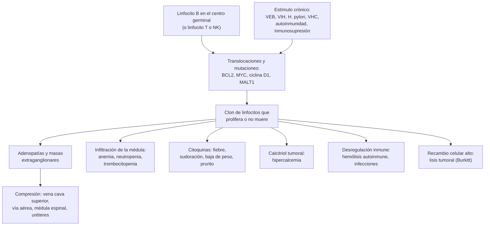

---
tags:
  - Hemato-oncología
  - GES
---

# Linfomas: linfoma de Hodgkin y linfomas no Hodgkin

**Subespecialidad**
Hematología · Hemato-oncología · Medicina interna · Atención primaria (estudio de la adenopatía)

**Guías principales**
EHA 2026: linfoma de Hodgkin · EHA 2025: linfoma B de células grandes · ESMO 2021: linfoma folicular · EHA-EU 2025: linfoma del manto · Lugano 2014: etapificación y respuesta · OMS 2022 (5.ª edición) e ICC 2022: clasificación

**Otras fuentes**
POLARIX (Pola-R-CHP, 2022) · HD21 (BrECADD, 2024) · SWOG S1826 (nivolumab + AVD, 2024) · ECHELON-1 (2018) · IPI (1993) · FLIPI (2004) · Linfoma B difuso en el sistema público chileno (Cabrera 2022) · Linfomas en Centro y Sudamérica (Laurini 2012) · GLOBOCAN 2024 · SEER 2026 · Figuras: Satou 2022 y Voltin 2020 (CC BY 4.0)

**GES**
Sí: linfomas en personas de 15 años y más (problema de salud n.º 17). Cubre la sospecha, el diagnóstico, el tratamiento y las recaídas.

**EUNACOM**
1.08.1.011 Linfomas (sospecha, inicial, derivar)

**Revisado**
Octubre 2026

!!! abstract "Resumen en 60 segundos"
    - **Linfoma**: neoplasia **clonal** de los **linfocitos** (B en ~ 85–90 %; T o NK en el resto) que crece en los **ganglios** y en otros órganos.
        - **Linfoma de Hodgkin** (~ 10 %): **células de Reed-Sternberg** (CD30+ CD15+); adultos jóvenes y > 55 años; **masa mediastínica**; se cura en **> 80–90 %**.
        - **Linfomas no Hodgkin** (~ 90 %): **agresivos** (el más frecuente es el **linfoma B difuso de células grandes**), **indolentes** (folicular, zona marginal) y **linfomas T**.
    - **Sospechar** ante una **adenopatía firme e indolora** de **> 1–1,5 cm** que persiste **> 4 semanas** sin causa, o cualquier adenopatía **supraclavicular**; con **síntomas B** (fiebre, sudoración nocturna, baja de peso > 10 %), esplenomegalia o masa mediastínica.
    - **Diagnóstico**: **biopsia escisional** del ganglio (la **punción con aguja fina no basta**). **No dar corticoides antes de la biopsia**.
    - **Etapificación**: **PET-CT** (clasificación de **Lugano**, basada en Ann Arbor). En el linfoma de Hodgkin y el B difuso, el PET-CT reemplaza a la biopsia de médula ósea.
    - **Tratamiento**:
        - **Hodgkin**: **ABVD** ± radioterapia en las etapas tempranas; **BrECADD** o **nivolumab + AVD** en las avanzadas.
        - **B difuso**: **R-CHOP × 6** (o **Pola-R-CHP** si el IPI es ≥ 2); se cura **~ 60–70 %**. En Chile, el rituximab subió la sobrevida a 5 años de **48 % a 66 %**.
        - **Indolentes**: si no hay carga tumoral alta, **observar**; si la hay, **rituximab** ± quimioterapia. **MALT gástrico** con *H. pylori*: **erradicar** la bacteria.
    - **Urgencias**: **síndrome de vena cava superior**, **compresión medular**, **lisis tumoral** (Burkitt), **hipercalcemia** y **neutropenia febril**.
    - **GES 17**: confirmación diagnóstica en **35 días**, etapificación en **30 días** y quimioterapia en **10 días**.

## Definición

- **Linfoma**: proliferación **clonal** de linfocitos B, T o NK (maduros o inmaduros) que forma masas en los **ganglios linfáticos** y en tejidos **extraganglionares** (estómago, piel, SNC, anillo de Waldeyer, médula ósea, bazo).
- **Linfoma de Hodgkin**: linfoma de origen **B** con pocas células tumorales (**células de Hodgkin y de Reed-Sternberg**, ~ 1 % del tumor) en un **fondo inflamatorio** abundante (linfocitos T, eosinófilos, histiocitos, células plasmáticas).
    - **Clásico** (~ 95 %) y **nodular de predominio linfocitario** (~ 5 %; la ICC lo llama linfoma B nodular de predominio linfocitario).
- **Linfoma no Hodgkin**: todos los demás. Se agrupan según su comportamiento:
    - **Indolentes**: crecen en **meses o años**; en general **no se curan** con la quimioterapia, pero viven muchos años (folicular, zona marginal, linfocítico de células pequeñas).
    - **Agresivos**: crecen en **semanas**; son mortales sin tratamiento, pero **muchos se curan** (B difuso de células grandes, del manto, linfomas T periféricos).
    - **Muy agresivos**: crecen en **días** (Burkitt, linfoblástico).
- **Síntomas B**: **fiebre** > 38 °C sin otra causa, **sudoración nocturna** profusa y **baja de peso > 10 %** en los 6 meses previos.
- **Enfermedad voluminosa** (*bulky*): masa de **≥ 10 cm** o **mediastínica ≥ 1/3** del diámetro torácico en el Hodgkin; **≥ 7,5 cm** en el linfoma B de células grandes (EHA 2025).

## Epidemiología

### Mundial

| | Linfomas no Hodgkin | Linfoma de Hodgkin |
|---|---|---|
| **Casos nuevos estimados en EE. UU. (2026)** | **79 320** (~ 4 % de los cánceres) | 8920 |
| **Mediana de edad al diagnóstico** | **68 años** | **38 años** (dos peaks: adultos jóvenes y > 55 años) |
| **Sobrevida relativa a 5 años** | **74 %** (B difuso de células grandes: 65 %; folicular: 89 %) | **89 %** |

- **Linfoma B de células grandes**: **~ 1/3** de los linfomas del adulto (EHA 2025). Mediana de edad: **67 años**.
- **Folicular**: el linfoma **indolente** más frecuente en los países occidentales (~ 20–25 % de los no Hodgkin).
- **América Latina** (1028 casos de 5 países de Centro y Sudamérica; Laurini 2012):
    - Más linfomas **agresivos** (53 % de los B maduros) que en América del Norte (38 %).
    - **B difuso**: **40 %** frente a 29 % en América del Norte.
    - **Folicular**: **17 %** (salvo Argentina, 34 %, similar a América del Norte).
    - Más linfomas **NK/T extraganglionares** (asociados al VEB).
    - Pacientes **más jóvenes** (mediana de 59 frente a 66 años).

### Chile

!!! chile "Datos nacionales"
    - **GLOBOCAN 2024** (Observatorio Global del Cáncer, IARC):
        - **Linfomas no Hodgkin**: **1586 casos nuevos** al año (**2,6 %** de los cánceres; 12.º lugar) y **785 muertes** (2,5 %).
        - **Linfoma de Hodgkin**: **303 casos** nuevos y **74 muertes** al año.
    - **GES 17: linfomas en personas de 15 años y más** (Superintendencia de Salud):
        - **Confirmación diagnóstica**: **35 días** desde la sospecha.
        - **Etapificación**: **30 días** desde la confirmación.
        - **Quimioterapia**: **10 días** desde la etapificación; **radioterapia**: 25 días desde la indicación.
        - **Seguimiento**: primer control **30 días** después de terminar el tratamiento.
        - Copago **0 %** en FONASA.
    - **Linfoma B difuso de células grandes en el sistema público** (Cabrera 2022):
        - **1807 pacientes** > 15 años, tratados en **18 centros** con los **protocolos nacionales** (2001–2017).
        - Mediana de edad **62 años**; **53 % mujeres**; **VIH positivo en 5 %**.
        - IPI: riesgo bajo **45 %**, intermedio bajo 25 %, intermedio alto 18 %, alto 11 %.
        - **R-CHOP frente a CHOP**: sobrevida a 5 años de **66 % frente a 48 %**; a 10 años, **53 % frente a 35 %**. Los autores concluyen que incluir el **rituximab** en los protocolos nacionales justificó su costo.

## Etiología y factores de riesgo

- En la mayoría de los pacientes **no se encuentra** una causa.

| Factor | Linfomas asociados |
|---|---|
| **Inmunodeficiencia**: **VIH**, **trasplante** de órganos (inmunosupresión), inmunodeficiencias congénitas | B difuso de células grandes, **Burkitt**, linfoma primario del SNC, **trastorno linfoproliferativo postrasplante** (VEB), Hodgkin |
| **Virus de Epstein-Barr (VEB)** | Hodgkin (celularidad mixta), Burkitt endémico, postrasplante, **NK/T extraganglionar de tipo nasal** |
| ***Helicobacter pylori*** | **Linfoma MALT gástrico** (zona marginal) |
| **Virus de la hepatitis C** | Zona marginal (esplénico), B difuso; a menudo con **crioglobulinemia** |
| **HTLV-1** | **Leucemia/linfoma de células T del adulto** |
| **Herpesvirus 8** | Linfoma primario de las cavidades serosas (VIH) |
| **Enfermedades autoinmunes**: **Sjögren** (parótida), **tiroiditis de Hashimoto** (tiroides), artritis reumatoide, LES | Zona marginal (MALT), B difuso |
| **Enfermedad celíaca** no tratada | **Linfoma T asociado a enteropatía** |
| **Implantes mamarios texturizados** | Linfoma anaplásico de células grandes asociado a implantes |
| Antecedente familiar, pesticidas, solventes, obesidad | Varios |

## Fisiopatología

- **Origen**: la mayoría de los linfomas B nace de linfocitos que pasan por el **centro germinal** del ganglio, donde el ADN se modifica (hipermutación somática y cambio de clase). Esos procesos favorecen **translocaciones** que activan **oncogenes**:

| Translocación | Gen activado | Linfoma |
|---|---|---|
| **t(14;18)** | ***BCL2*** (evita la apoptosis) | **Folicular** (~ 85 %) |
| **t(8;14)** | ***MYC*** (proliferación) | **Burkitt** |
| **t(11;14)** | ***CCND1*** (ciclina D1) | **Del manto** |
| **t(11;18)** | *BIRC3::MALT1* | **MALT gástrico** resistente a la erradicación de *H. pylori* |
| ***MYC* + *BCL2*** (± *BCL6*) | "Doble o triple *hit*" | **B de alto grado** (muy agresivo) |
| **t(2;5)** | ***ALK*** | Anaplásico de células grandes ALK+ |

- **Estímulo crónico**: la infección (*H. pylori*, VHC) o la autoinmunidad estimulan a los linfocitos B por largo tiempo y seleccionan un clon. Por eso, **erradicar *H. pylori*** puede curar un MALT gástrico.
- **Linfoma de Hodgkin**: las células de Reed-Sternberg, de origen B, **pierden el programa B** (sin CD20) y sobreviven gracias al **microambiente**:
    - Secretan **citoquinas** que atraen a las células inflamatorias y producen **síntomas B**, **prurito** y eosinofilia.
    - Expresan **PD-L1** (amplificación de 9p24.1) y escapan de los linfocitos T. Por eso responden a los **anti-PD-1** (nivolumab, pembrolizumab).
    - Se diseminan de forma **contigua**, de un grupo ganglionar al vecino.
- **Consecuencias clínicas**:
    - **Masa**: adenopatías y compresión de estructuras vecinas (**vena cava superior**, vía aérea, médula espinal, uréteres, vía biliar).
    - **Infiltración de la médula ósea**: **citopenias**.
    - **Citoquinas**: fiebre, sudoración, baja de peso.
    - **Producción de calcitriol** por el tumor: **hipercalcemia**.
    - **Desregulación inmune**: **anemia hemolítica autoinmune**, trombocitopenia inmune, infecciones.
    - **Recambio celular alto** (Burkitt): **lisis tumoral** espontánea.

*Figura 1. Fisiopatología de los linfomas. Esquema propio basado en OMS 2022 y las guías EHA 2025–2026.*

## Clasificación

### Tipos principales (OMS 2022)

| Grupo | Tipos | Claves |
|---|---|---|
| **Linfoma de Hodgkin clásico** (~ 95 % de los Hodgkin) | **Esclerosis nodular** (el más frecuente; mujeres jóvenes; **mediastino**); **celularidad mixta** (VEB, VIH, adultos mayores); rico en linfocitos; depleción linfocitaria | **CD30+, CD15+**, CD20 negativo o débil, PAX5 débil |
| **Hodgkin nodular de predominio linfocitario** (~ 5 %) | — | Células "LP" **CD20+**, CD30−; evolución lenta |
| **B agresivos** | **B difuso de células grandes** (y B de alto grado con *MYC* y *BCL2*); **B primario del mediastino**; **del manto**; linfoma primario del SNC | CD20+; Ki-67 alto |
| **B muy agresivos** | **Burkitt**; linfoma/leucemia **linfoblástica** | Ki-67 ~ 100 % (Burkitt: "**cielo estrellado**") |
| **B indolentes** | **Folicular** (grados 1–3A); **zona marginal** (**MALT**, ganglionar, esplénico); **linfocítico de células pequeñas** (= LLC); **linfoplasmocítico** (macroglobulinemia de Waldenström, IgM) | CD20+; Ki-67 bajo |
| **T y NK** | **Periférico** no especificado; **angioinmunoblástico**; **anaplásico de células grandes** (ALK+ o ALK−); **micosis fungoide** y síndrome de Sézary (piel); **NK/T extraganglionar de tipo nasal** (VEB); leucemia/linfoma T del adulto (HTLV-1); asociado a enteropatía (celíaca) | En general, peor pronóstico que los B |

### Etapificación de Lugano (2014), basada en Ann Arbor

| Etapa | Compromiso |
|---|---|
| **I** | **Un** ganglio o un grupo de ganglios adyacentes (**IE**: una lesión extraganglionar única, sin ganglios) |
| **II** | **≥ 2 grupos** ganglionares del **mismo lado del diafragma** (**IIE**: + compromiso extraganglionar contiguo limitado) |
| **III** | Ganglios a **ambos lados del diafragma**, o ganglios sobre el diafragma + **bazo** |
| **IV** | Compromiso **extraganglionar no contiguo** (hígado, médula ósea, pulmón, hueso) |

- **Etapas tempranas**: I–II. **Avanzadas**: III–IV (en el Hodgkin, también la IIB con masa mediastínica grande o compromiso extraganglionar).
- Sufijos **A** (sin síntomas B) y **B** (con síntomas B): Lugano los mantiene solo para el **linfoma de Hodgkin**.

### Factores pronósticos

- **Linfoma de Hodgkin en etapa temprana** (factores de riesgo del Grupo Alemán, EHA 2026):
    - **A**: **masa mediastínica grande** (≥ 1/3 del diámetro torácico máximo).
    - **B**: compromiso **extraganglionar**.
    - **C**: **VHS elevada** (> 50 mm/h sin síntomas B; > 30 mm/h con síntomas B).
    - **D**: **≥ 3 áreas ganglionares** comprometidas.
    - Sin factores = **temprano favorable**; con ≥ 1 factor = **temprano desfavorable**.
    - En la etapa **avanzada** se usa el índice pronóstico internacional (IPS, Hasenclever 1998).
- **Índice Pronóstico Internacional (IPI)** de los linfomas agresivos (1 punto por factor):

| Factor | Punto si… |
|---|---|
| **Edad** | > 60 años |
| **LDH** | Sobre el valor normal |
| **Estado funcional (ECOG)** | ≥ 2 |
| **Etapa** | III–IV |
| **Sitios extraganglionares** | ≥ 2 |

- **IPI**: 0–1 riesgo bajo; 2 intermedio bajo; 3 intermedio alto; 4–5 alto. El **SNC-IPI** (IPI + compromiso del **riñón o la suprarrenal**) estima el riesgo de recaída en el SNC.
- **FLIPI** (folicular): edad > 60 años, etapa III–IV, **Hb < 12 g/dL**, **LDH** elevada y **> 4 áreas ganglionares**.

## Clínica

| | Linfoma de Hodgkin | Linfomas no Hodgkin |
|---|---|---|
| **Edad** | **Adultos jóvenes** (20–35 años) y > 55 años | Sobre todo **> 60 años** |
| **Adenopatías** | **Cervicales y supraclaviculares**; **mediastínicas** (tos, disnea, dolor torácico) | Periféricas, a menudo generalizadas; **abdominales** (masas, dolor, obstrucción) |
| **Diseminación** | **Contigua**, predecible | **No contigua** |
| **Extraganglionar** | Poco frecuente al inicio | **Frecuente**: estómago e intestino, anillo de Waldeyer, piel, SNC, testículo, médula ósea |
| **Síntomas B** | ~ 1/3 | Más en los agresivos |
| **Típico** | **Prurito** generalizado; **dolor en los ganglios al beber alcohol** (raro, pero muy específico); fiebre ondulante (Pel-Ebstein) | Indolentes: adenopatías que crecen y disminuyen por años. Agresivos: masa que crece en semanas. Burkitt: **masa abdominal** que crece en **días** |

- **Adenopatía linfomatosa**: **indolora**, **firme o gomosa**, no adherida al inicio, sin signos inflamatorios, que **no desaparece**.
- **Otros hallazgos**: esplenomegalia, hepatomegalia, derrame pleural, ascitis quilosa.
- **Paraneoplásicos**: **anemia hemolítica autoinmune**, trombocitopenia inmune, **hipercalcemia**, **síndrome nefrótico por cambios mínimos** (Hodgkin), degeneración cerebelosa (Hodgkin), pénfigo paraneoplásico.

!!! alarma "Signos de alarma: derivar de inmediato"
    - **Síndrome de vena cava superior** (edema facial y del cuello, circulación colateral en el tórax) o **estridor** por una masa mediastínica.
    - **Dolor de espalda** con **debilidad** de las piernas o alteración de los esfínteres (**compresión medular**).
    - **Masa que crece en días**, con **LDH muy alta**, potasio, fósforo y ácido úrico altos y creatinina en ascenso (**lisis tumoral**; Burkitt, linfoblástico).
    - **Hipercalcemia** sintomática (confusión, poliuria, deshidratación).
    - **Fiebre** en un paciente en quimioterapia (**neutropenia febril**).
    - **Fiebre persistente con citopenias, esplenomegalia, ferritina muy alta y triglicéridos altos** (**síndrome hemofagocítico**, sobre todo en los linfomas T y con VEB).

## Diagnóstico

- **Cuándo biopsiar una adenopatía** (ver [adenopatías](../infectologia/sindrome-mononucleosico-y-adenitis.md)):
    - **> 1 cm** (> 1,5 cm en la ingle) que **persiste > 4 semanas** sin una causa clara;
    - adenopatía **supraclavicular** de cualquier tamaño;
    - dura, adherida, o que **crece**;
    - con **síntomas B**, **esplenomegalia** o **citopenias**;
    - adenopatías **generalizadas** sin causa (VIH, VEB, CMV, toxoplasma y sífilis negativos).
- **No dar corticoides antes de la biopsia**: reducen las adenopatías y pueden hacer **perder el diagnóstico** (excepto en una emergencia, como la compresión de la vía aérea).
- **Biopsia**:
    - **Escisional** (el ganglio completo) es la de elección: permite ver la **arquitectura**.
    - **Con aguja gruesa** guiada por imágenes si el ganglio no es accesible (mediastino, retroperitoneo).
    - La **punción con aguja fina** (citología) **no basta** para diagnosticar ni clasificar un linfoma.
- **Estudio anatomopatológico** en un laboratorio de referencia:
    - **Inmunohistoquímica**: CD20, CD3, **CD30**, **CD15**, CD10, BCL6, MUM1, BCL2, MYC, ciclina D1, **Ki-67**; **EBER** (VEB).
    - **FISH** de *MYC*, *BCL2* y *BCL6* en el linfoma B de células grandes.
    - Citometría de flujo (linfomas B indolentes y leucemizados).
- **Etapificación**:
    - **PET-CT** en los linfomas **ávidos de FDG** (Hodgkin, B difuso, folicular, manto, la mayoría de los T). **TC con contraste** de cuello, tórax, abdomen y pelvis en los demás o si no hay PET-CT.
    - **Biopsia de médula ósea**: **no se necesita** en el Hodgkin ni en el B difuso con PET-CT. Sí en los linfomas **indolentes** y en el **manto**.
    - **RM de cerebro y estudio del LCR** (citología y **citometría de flujo**) si el riesgo de compromiso del SNC es alto.
    - **Endoscopía** si hay compromiso del estómago o del anillo de Waldeyer.

!!! guia "Diagnóstico y etapificación (Lugano 2014; EHA 2025 y 2026)"
    - El diagnóstico se basa en una **biopsia escisional** siempre que sea posible, o una **biopsia con aguja gruesa** si no; la **punción con aguja fina es insuficiente**.
    - La etapificación se hace con **PET-CT** (y TC con contraste) según la clasificación de **Lugano**.
    - Si hay un PET-CT basal, **no se recomienda la biopsia de médula ósea** en el Hodgkin ni en el linfoma B de células grandes.
    - **IPI obligatorio** y **SNC-IPI** muy recomendado antes de tratar un linfoma B de células grandes.
    - **Respuesta**: PET-CT **interino** (si cambia la conducta) y **al final del tratamiento**, con la **escala de Deauville**.

<figure markdown>
![Seis microfotografías de un linfoma de Hodgkin clásico. A: tinción de hematoxilina-eosina con células grandes de Hodgkin y de Reed-Sternberg, de núcleos grandes con nucléolos prominentes, rodeadas de abundantes células inflamatorias reactivas. B: las células de Reed-Sternberg son positivas para CD30, con tinción de la membrana y del aparato de Golgi. C y D: las células tumorales son negativas o débilmente positivas para CD20, mientras los linfocitos B reactivos del fondo son positivos. E: expresión débil de PAX5 en las células tumorales, comparada con la intensa de los linfocitos B pequeños. F: expresión de PD-L1 en las células de Reed-Sternberg](../assets/figuras/linfomas/histologia-hodgkin-satou-2022.jpg){ loading=lazy }
<figcaption>Figura 2. Linfoma de Hodgkin clásico: (A) células de Hodgkin y de Reed-Sternberg en un fondo de células inflamatorias reactivas (hematoxilina-eosina); (B) las células tumorales son CD30+; (C, D) negativas o débiles para CD20; (E) PAX5 débil; (F) PD-L1+. Fuente: Satou A, Takahara T, Nakamura S. An update on the pathology and molecular features of Hodgkin lymphoma. <em>Cancers (Basel).</em> 2022;14(11):2647, figura 1. Licencia <a href="https://creativecommons.org/licenses/by/4.0/">CC BY 4.0</a>.</figcaption>
</figure>

## Laboratorio

| Examen | Para qué |
|---|---|
| **Hemograma** con frotis | Citopenias (infiltración, autoinmunidad, hiperesplenismo); linfocitos anormales en la sangre (linfomas leucemizados); eosinofilia y linfopenia (Hodgkin) |
| **VHS** | **Factor pronóstico** en el Hodgkin temprano |
| **LDH** | Carga tumoral; **IPI**; muy alta en el Burkitt |
| **Ácido úrico**, **potasio**, **fósforo**, **calcio**, **creatinina** | **Lisis tumoral** e **hipercalcemia** |
| Pruebas hepáticas, **albúmina** | Compromiso hepático; pronóstico (IPS en el Hodgkin) |
| **β2-microglobulina** | Pronóstico en los linfomas indolentes |
| **Serologías de VIH, VHB y VHC** | **Siempre**: el VIH cambia el tratamiento; el **VHB se reactiva con el rituximab** (profilaxis) |
| Electroforesis de proteínas | **Componente monoclonal** (IgM en el linfoplasmocítico) |
| Prueba de antiglobulina directa (**Coombs**) | Anemia hemolítica autoinmune |
| **Prueba de embarazo** | Mujeres en edad fértil |
| **Ecocardiograma** (FEVI), ECG | Antes de las **antraciclinas** |
| **Espirometría con DLCO** | Antes de la **bleomicina** (Hodgkin) |
| ***H. pylori*** (biopsia, test de ureasa) | Linfoma MALT gástrico |

## Imágenes

- **PET-CT con FDG**: el examen de elección para **etapificar** y **evaluar la respuesta** de los linfomas ávidos de FDG (figura 3).
    - Detecta el compromiso de la **médula ósea** mejor que la biopsia a ciegas.
    - **Escala de Deauville** para la respuesta (ver tabla).
- **TC con contraste** de cuello, tórax, abdomen y pelvis: tamaño de las masas, relación con los vasos y la vía aérea; seguimiento de los linfomas no ávidos de FDG.
- **Radiografía de tórax**: **ensanchamiento mediastínico** (Hodgkin, B primario del mediastino, linfoblástico T).
- **RM**: SNC (linfoma primario o secundario) y compresión medular.
- **Ecografía**: guiar la biopsia de un ganglio periférico; estudio inicial en la APS.

| Escala de Deauville (PET-CT) | Captación de FDG | Interpretación (Lugano) |
|---|---|---|
| **1** | Sin captación | **Respuesta metabólica completa** |
| **2** | ≤ mediastino (pool vascular) | **Respuesta metabólica completa** |
| **3** | > mediastino pero ≤ hígado | **Respuesta metabólica completa** (en general) |
| **4** | Moderadamente > hígado | Respuesta parcial, enfermedad estable o progresión según la evolución |
| **5** | Marcadamente > hígado o lesiones nuevas | Respuesta parcial, enfermedad estable o **progresión** |

<figure markdown>
![Dos pares de imágenes de PET con FDG de cuerpo entero, de frente y de perfil. A la izquierda, al diagnóstico, una paciente con linfoma B difuso de células grandes muestra múltiples focos de captación en los huesos del esqueleto axial y de las extremidades (compromiso multifocal de la médula ósea) y captación en el bazo y en ganglios. Al centro, una flecha con la leyenda 6 ciclos de R-CHOP-14. A la derecha, después del tratamiento, desaparecen todos los focos y solo queda la captación fisiológica del cerebro, el corazón, los riñones y la vejiga](../assets/figuras/linfomas/pet-ct-linfoma-difuso-voltin-2020.jpg){ loading=lazy }
<figcaption>Figura 3. PET con FDG en una paciente con linfoma B difuso de células grandes: (a) al diagnóstico, compromiso multifocal de la médula ósea que la biopsia a ciegas no detectó; (b) remisión completa tras 6 ciclos de quimioinmunoterapia (R-CHOP-14). Fuente: Voltin CA, Mettler J, Grosse J, et al. FDG-PET imaging for Hodgkin and diffuse large B-cell lymphoma—an updated overview. <em>Cancers (Basel).</em> 2020;12(3):601, figura 1. Licencia <a href="https://creativecommons.org/licenses/by/4.0/">CC BY 4.0</a>.</figcaption>
</figure>

## Diagnóstico diferencial

| Hallazgo | Diferencial |
|---|---|
| **Adenopatías** | **Infecciosas**: VEB, CMV, **VIH**, toxoplasmosis, **tuberculosis**, enfermedad por arañazo de gato, **sífilis** secundaria. **Autoinmunes**: LES, artritis reumatoide, **sarcoidosis**. **Fármacos** (fenitoína, alopurinol). **Metástasis** de carcinomas (cabeza y cuello, pulmón, mama, estómago: **ganglio de Virchow**), melanoma. **LLC**. Enfermedad de Kikuchi, de **Castleman**, relacionada con **IgG4** |
| **Masa del mediastino anterior** | "**4 T**": **timoma**, **tumor de células germinales** ("teratoma"; medir **β-hCG y alfafetoproteína**), **tiroides** (bocio endotorácico) y "**terrible linfoma**" (Hodgkin, B primario del mediastino, linfoblástico T) |
| **Síntomas B** (fiebre prolongada, baja de peso) | Tuberculosis, endocarditis, VIH, abscesos, enfermedades autoinmunes (Still, vasculitis), otras neoplasias |
| **Esplenomegalia** | Hipertensión portal, LMC, mielofibrosis, tricoleucemia, infecciones (malaria, VEB) |
| **Masa abdominal** | Carcinomas (colon, estómago, páncreas), tumores del estroma gastrointestinal, sarcomas |

## Tratamiento

- Lo define el **hematólogo** según el tipo, la etapa, los factores de riesgo y el estado funcional.
- **Lo que hace el médico general o el interno**:
    - **Sospechar**, pedir los exámenes iniciales, **derivar** (GES 17) y **no dar corticoides antes de la biopsia**.
    - Reconocer y tratar las **urgencias** (lisis tumoral, vena cava superior, compresión medular, hipercalcemia, neutropenia febril; ver [urgencias oncológicas](urgencias-oncologicas.md)).
    - Antes del tratamiento: **serologías de VHB** y profilaxis antiviral si corresponde; **vacunas inactivadas** (influenza, neumococo, COVID-19); **preservación de la fertilidad**; ecocardiograma.

<figure markdown>
![Esquema de enfoque de los linfomas. Sospecha: adenopatía de más de 1 a 1,5 centímetros, firme, indolora, que persiste más de 4 semanas sin causa, o supraclavicular; síntomas B como fiebre, sudoración nocturna y baja de peso de más de 10 por ciento; esplenomegalia, masa mediastínica, prurito, citopenias, LDH alta, hipercalcemia, VIH, inmunosupresión o enfermedad autoinmune. Diagnóstico: biopsia escisional del ganglio o biopsia con aguja gruesa si no es posible; la punción con aguja fina no basta; inmunohistoquímica, citometría y genética en un laboratorio de referencia. Etapificación con PET-CT o TC con contraste, hemograma, LDH, VHS, beta 2 microglobulina, VIH, VHB, VHC y ecocardiograma antes de las antraciclinas. Cuatro grupos. Linfoma de Hodgkin: células de Reed-Sternberg CD30 y CD15 positivas, jóvenes y mayores de 55 años, mediastino; temprano: 2 ABVD más radioterapia o 2 + 2 guiado por PET; avanzado: BrECADD o nivolumab más AVD; se cura en más de 80 a 90 por ciento. Linfoma B difuso de células grandes, agresivo, el más frecuente, 30 a 40 por ciento, masa de crecimiento rápido; pronóstico con IPI y SNC-IPI; R-CHOP por 6 ciclos, o Pola-R-CHP si el IPI es 2 o más; en la recaída, CAR-T o trasplante; se cura en 60 a 70 por ciento. Linfomas indolentes: folicular, zona marginal y linfocítico pequeño; lentos y avanzados al inicio; sin carga tumoral alta, observar; con carga alta según los criterios GELF, rituximab con o sin quimioterapia; MALT gástrico: erradicar H. pylori. Otros agresivos y T: Burkitt, linfoblástico, del manto, linfomas T; Burkitt y linfoblástico crecen en días y son una urgencia, con riesgo de lisis tumoral y de compromiso del SNC; quimioterapia intensiva; derivar el mismo día. En todos los pacientes: GES 17 con confirmación diagnóstica en 35 días, etapificación en 30 días y quimioterapia en 10 días; preservar la fertilidad; vacunas inactivadas; profilaxis del VHB con rituximab; prevenir la lisis tumoral; G-CSF y cotrimoxazol según el esquema; vigilar los efectos tardíos en el corazón, la mama y la tiroides](../assets/figuras/linfomas/enfoque-linfomas.svg){ loading=lazy }
<figcaption>Figura 4. Linfomas: sospecha, diagnóstico y tratamiento según el grupo. Esquema propio basado en las guías EHA 2025 y 2026, ESMO 2021 y Lugano 2014.</figcaption>
</figure>

### Linfoma de Hodgkin clásico (EHA 2026)

| Grupo | Tratamiento |
|---|---|
| **Temprano favorable** (I–II sin factores de riesgo) | **2 ciclos de ABVD + radioterapia de 20 Gy** del sitio comprometido. Si el PET-CT es negativo, puede omitirse la radioterapia (con más ciclos de quimioterapia y algo más de recaídas) |
| **Temprano desfavorable** (≤ 60 años) | **2 ciclos de BEACOPP escalado + 2 de ABVD** ("2 + 2"); **radioterapia de 30 Gy solo si el PET-CT final es positivo**. Alternativa: **4 ABVD + 30 Gy** |
| **Avanzado** (III–IV; IIB con masa mediastínica grande o extraganglionar), **≤ 60 años** | **BrECADD** (brentuximab vedotina, etopósido, ciclofosfamida, doxorrubicina, dacarbazina, dexametasona) por **4 o 6 ciclos** según el PET-CT interino. HD21: sobrevida libre de progresión a 5 años de **93,6 %** frente a 90,6 % con BEACOPP, con **menos toxicidad**. Alternativa: **nivolumab + AVD × 6** (S1826) |
| **Avanzado, > 60 años apto** | **Nivolumab + AVD × 6** (S1826: sobrevida libre de progresión a 3 años de **82 %** frente a 58 % con brentuximab + AVD) |
| **Adulto mayor frágil** | Brentuximab o anti-PD-1 ± otros fármacos; intención no curativa |
| **Recaída o refractario** | Rescate (anti-PD-1 + quimioterapia) y luego **quimioterapia en dosis altas + trasplante autólogo**; brentuximab de mantención en los de alto riesgo |

- **Bleomicina**: produce **neumonitis**. En los **> 60 años**, máximo **2 ciclos**; en los **> 70 años**, considerar omitirla.
- **Esquemas intensivos** (BrECADD, BEACOPP): **G-CSF** y **cotrimoxazol** profilácticos obligatorios.
- **Hodgkin nodular de predominio linfocitario**: etapas tempranas con **radioterapia** sola; avanzadas con **rituximab** ± quimioterapia.

### Linfoma B difuso de células grandes (EHA 2025)

| Grupo (< 80 años) | Tratamiento |
|---|---|
| **Etapa I–II sin factores de riesgo** (IPI o IPI ajustado a la edad = 0), no voluminoso | **R-CHOP × 4** (+ 2 dosis de rituximab en ≤ 60 años, como en el ensayo FLYER), o según el PET-CT interino |
| **Etapa I–II voluminosa**, o **un factor de riesgo** (etapa III–IV, LDH alta o mal estado funcional) | **R-CHOP × 6** (cada 21 días) |
| **Etapa III–IV con IPI ≥ 2** | **Pola-R-CHP × 6** (polatuzumab vedotina en lugar de vincristina; POLARIX: **+ 6,5 %** de sobrevida libre de progresión a 2 años). R-CHOP es una alternativa aceptable |
| **≥ 80 años o frágil** | **R-mini-CHOP** (dosis reducidas) |
| **Doble *hit*** (*MYC* + *BCL2*) en etapa avanzada | Esquemas **intensivos** (DA-EPOCH-R, R-CHOEP-14) en los pacientes aptos |
| **Alto riesgo de recaída en el SNC** (SNC-IPI 4–6, testículo, mama, riñón o suprarrenal, epidural) | **RM y LCR** al diagnóstico; considerar **metotrexato en dosis altas** tras la remisión |
| **Refractario o recaída < 12 meses** | **Células CAR-T** (axicabtagén ciloleucel, lisocabtagén maraleucel) |
| **Recaída > 12 meses**, apto | Quimioinmunoterapia de rescate (R-ICE, R-DHAP) y, si responde, **dosis altas + trasplante autólogo** |
| **No apto para CAR-T ni trasplante** | R-GemOx, polatuzumab + bendamustina + rituximab, **anticuerpos biespecíficos** (glofitamab, epcoritamab) |

- **Radioterapia**: solo para una lesión **residual positiva** en el PET-CT, en un sitio único.
- **Prefase con prednisona** (5–7 días) antes del primer ciclo en los **adultos mayores** o con gran carga tumoral: reduce la toxicidad del primer ciclo.
- **G-CSF profiláctico** en los > 60 años con R-CHOP y en los esquemas intensivos.

### Linfomas indolentes

- **Folicular** (ESMO 2021):
    - **Etapa I–II limitada**: **radioterapia** del sitio comprometido (**24 Gy**), con intención curativa.
    - **Avanzado sin carga tumoral alta** (sin criterios GELF): **observar** ("vigilar y esperar") o rituximab solo. El tratamiento precoz no mejora la sobrevida.
    - **Avanzado con carga tumoral alta** (algún criterio GELF): **rituximab u obinutuzumab + quimioterapia** (bendamustina, CHOP o CVP), seguido de **rituximab de mantención** cada 2 meses por 2 años.
    - **Criterios GELF**: cualquier masa **≥ 7 cm**; **≥ 3 grupos** ganglionares de **≥ 3 cm** cada uno; **síntomas B**; **esplenomegalia**; **derrame** pleural o ascitis; síntomas por **compresión**; **citopenias** (leucocitos < 1000/µL o plaquetas < 100 000/µL); fase leucémica (> 5000/µL células tumorales).
    - **Transformación** a un linfoma B difuso (~ 2–3 % por año): sospechar si crece rápido un ganglio, sube la LDH o aparecen síntomas B.
- **MALT gástrico** con ***H. pylori*** en etapa localizada: **erradicar *H. pylori*** (ver [dispepsia y *H. pylori*](../gastroenterologia/dispepsia-ulcera-peptica-y-cancer-gastrico.md)) y controlar con **endoscopías** seriadas; la remisión puede tardar meses. Si no responde (por ejemplo, con **t(11;18)**) o no hay *H. pylori*: **radioterapia** o rituximab.
- **Zona marginal esplénica con VHC**: el **tratamiento antiviral** puede inducir la remisión.

### Otros linfomas

- **Del manto** (EHA-EU 2025): jóvenes aptos: inmunoquimioterapia intensiva con **citarabina** e **inhibidores de BTK**; adultos mayores: **bendamustina-rituximab** o combinaciones con inhibidores de BTK; mantención con rituximab.
- **Burkitt y linfoblástico**: **urgencia**. Prevención agresiva de la **lisis tumoral** (hidratación, **rasburicasa**), quimioterapia **intensiva** de inicio inmediato y **profilaxis del SNC**.
- **Linfomas T periféricos**: **CHOP** o CHOEP; con **brentuximab** (BV-CHP) si son **CD30+** (anaplásico); consolidación con trasplante autólogo en algunos.
- **Asociado al VIH**: tratamiento estándar + **terapia antirretroviral** (ver [VIH](../infectologia/infeccion-por-vih.md)).
- **Primario del SNC**: esquemas con **metotrexato en dosis altas** (ver [tumores del SNC](../neurologia/tumores-del-snc.md)).

!!! dosis "Dosis de referencia (adulto; las indica el hematólogo)"
    - **R-CHOP** (cada 21 días):
        - **rituximab 375 mg/m²** EV día 1;
        - **ciclofosfamida 750 mg/m²** EV día 1;
        - **doxorrubicina 50 mg/m²** EV día 1;
        - **vincristina 1,4 mg/m²** EV día 1 (máximo **2 mg**);
        - **prednisona 100 mg/día** VO, días 1–5.
    - **ABVD** (días 1 y 15, cada 28 días): **doxorrubicina 25 mg/m²**, **bleomicina 10 U/m²**, **vinblastina 6 mg/m²** y **dacarbazina 375 mg/m²**, EV.
    - **Prefase**: **prednisona 100 mg/día VO** por **5–7 días** antes del primer R-CHOP.
    - **Prevención de la lisis tumoral**: **alopurinol 300 mg/día** VO (ajustar a la función renal) e hidratación; **rasburicasa** si el riesgo es alto (contraindicada en el déficit de G6PD).
    - **Profilaxis del VHB** con rituximab (HBsAg positivo, o anti-HBc positivo según el riesgo): **entecavir 0,5 mg/día** VO, desde antes del tratamiento y por al menos **12–18 meses** después del último rituximab.
    - **Profilaxis de *Pneumocystis***: **cotrimoxazol 800/160 mg** 3 veces por semana (esquemas intensivos, BEACOPP, BrECADD, dosis altas de corticoides).

## Complicaciones

| Complicación | Claves |
|---|---|
| **Síndrome de lisis tumoral** | Burkitt, linfoblástico, B difuso voluminoso; a veces **espontánea** |
| **Síndrome de vena cava superior** y compresión de la vía aérea | Masa mediastínica (Hodgkin, B primario del mediastino, linfoblástico T); **biopsia antes de los corticoides** si la situación lo permite |
| **Compresión medular** | Masa paravertebral o epidural |
| **Hipercalcemia** | Producción de **calcitriol** por el tumor (Hodgkin, B difuso); en la leucemia/linfoma T del adulto, por PTHrP |
| **Infecciones** y **neutropenia febril** | Quimioterapia; **hipogammaglobulinemia** con rituximab; *Pneumocystis* con corticoides prolongados |
| **Reactivación del VHB** | Hepatitis fulminante con **rituximab** si no hay profilaxis |
| **Leucoencefalopatía multifocal progresiva** (virus JC) | Rara, con rituximab y brentuximab |
| **Neuropatía periférica** | **Vincristina**, brentuximab, polatuzumab |
| **Neumonitis** | **Bleomicina** (más en los > 60 años y con G-CSF) |
| **Cardiotoxicidad** | **Antraciclinas** (insuficiencia cardíaca) y radioterapia del mediastino (coronariopatía, valvulopatía) |
| **Segundas neoplasias** | **Cáncer de mama** tras la radioterapia del tórax en mujeres jóvenes; pulmón, tiroides; leucemias y mielodisplasias por la quimioterapia |
| **Endocrinas** | **Hipotiroidismo** tras la radioterapia del cuello; **infertilidad** (alquilantes) |
| **Transformación** | De un linfoma indolente a un B difuso de células grandes |
| **Síndrome de liberación de citoquinas** y neurotoxicidad | Células CAR-T y anticuerpos biespecíficos |

## Pronóstico y seguimiento

- **Linfoma de Hodgkin**: se cura en **> 80–90 %** (SEER: sobrevida a 5 años de **89 %**). En los sobrevivientes, las **complicaciones tardías** (cáncer, cardiopatía) son la principal causa de muerte a largo plazo.
- **Linfoma B difuso de células grandes**: se cura en **~ 60–70 %** (SEER: 65 % a 5 años); depende del **IPI**. En Chile, **66 %** a 5 años con R-CHOP en el sistema público.
- **Linfoma folicular**: **no se cura** con la quimioterapia, pero la mayoría vive **muchos años** (SEER: **89 %** a 5 años). Peor pronóstico si recae **antes de 24 meses** (POD24) o se transforma.
- **Linfoma del manto y linfomas T**: pronóstico intermedio a malo.
- **Seguimiento** (EHA 2025):
    - Control con **historia, examen físico y hemograma**, al menos por **2 años**.
    - **No** hacer TC ni PET-CT de rutina en los pacientes **asintomáticos**.
    - **Ecocardiograma** al año, a los 3 y 5 años, y luego cada 5 años tras las antraciclinas.
    - Tras la radioterapia del cuello: **TSH** anual.
    - Mujeres con **radioterapia del tórax** antes de los 30 años: **mamografía y RM de mama** anuales desde los **25 años** o desde **8 años** después de la radioterapia (lo que ocurra último).
    - **Dejar de fumar**, controlar los factores de riesgo cardiovascular y mantener las vacunas.

## Perlas para el internado

!!! perla "Para recordar en la sala"
    - **Adenopatía supraclavicular** = biopsia, a cualquier edad. La **izquierda** (Virchow) sugiere una neoplasia abdominal.
    - **No dar corticoides** a una adenopatía o masa mediastínica **sin biopsia**: pueden "borrar" el linfoma.
    - La **punción con aguja fina** puede sugerir un linfoma, pero **no lo diagnostica**: pedir una **biopsia escisional**.
    - **Masa del mediastino anterior** en un joven: Hodgkin, B primario del mediastino o linfoblástico T, pero también timoma, tumor germinal (**β-hCG y alfafetoproteína**) o bocio.
    - **Prurito generalizado** sin lesiones de la piel + adenopatías: pensar en un **Hodgkin**.
    - **Hipercalcemia con PTH baja y calcitriol alto**: pensar en un **linfoma** (o granulomas).
    - Antes del **rituximab**: **HBsAg y anti-HBc**. Una reactivación del VHB puede ser fulminante.
    - **MALT gástrico con *H. pylori***: el primer tratamiento es **erradicar la bacteria**.
    - **Síndrome nefrótico por cambios mínimos** en un adulto joven: buscar un **Hodgkin**.
    - **Masa abdominal que crece en días** con LDH y ácido úrico muy altos: **Burkitt** y **lisis tumoral**. Hidratar, rasburicasa y derivar el mismo día.

## Preguntas de repaso

??? repaso "1. Mujer de 23 años con 2 meses de adenopatías cervicales y supraclaviculares derechas de 3 cm, indoloras y gomosas, prurito generalizado y sudoración nocturna. La radiografía de tórax muestra un ensanchamiento del mediastino. ¿Qué sospecha y cómo la estudia?"
    - **Linfoma de Hodgkin clásico** (probable esclerosis nodular): mujer joven, adenopatías cervicales y supraclaviculares, **masa mediastínica**, **prurito** y **síntomas B**.
    - **Estudio**:
        - **Biopsia escisional** de la adenopatía supraclavicular (células de Reed-Sternberg **CD30+ CD15+**). **No dar corticoides antes**.
        - **PET-CT** para la etapa (Lugano) y la masa mediastínica (¿≥ 1/3 del diámetro torácico?).
        - Hemograma, **VHS**, LDH, albúmina, pruebas hepáticas y renales; VIH, VHB y VHC; prueba de embarazo.
        - **Ecocardiograma** y **espirometría con DLCO** (antraciclinas y bleomicina).
    - **Derivar** por GES 17; ofrecer **preservación de la fertilidad**.
    - **Pronóstico**: se cura en > 80–90 %.

??? repaso "2. Hombre de 66 años con una masa abdominal que creció en 6 semanas, sudoración nocturna y baja de 9 kg. ECOG 1. LDH 2 veces el valor normal. La biopsia con aguja gruesa muestra un linfoma B difuso de células grandes, y el PET-CT, enfermedad a ambos lados del diafragma y en el hígado y el hueso. ¿Cuál es su IPI y qué tratamiento corresponde?"
    - **IPI = 4** (riesgo alto): edad > 60, LDH alta, etapa IV y ≥ 2 sitios extraganglionares (hígado y hueso). El ECOG 1 no suma.
    - **Tratamiento**: **Pola-R-CHP × 6** (IPI ≥ 2; POLARIX), o **R-CHOP × 6** si no está disponible.
    - **Antes de partir**:
        - **HBsAg y anti-HBc** (profilaxis con entecavir si corresponde);
        - **ecocardiograma**;
        - prevención de la **lisis tumoral** (hidratación, alopurinol);
        - **prefase con prednisona**;
        - **G-CSF** profiláctico (> 60 años).
    - **SNC-IPI**: edad, LDH, etapa, sitios extraganglionares (sin riñón ni suprarrenal) = 4 puntos: **alto riesgo** → **RM y LCR**.
    - **PET-CT** interino y al final del tratamiento (Deauville).

??? repaso "3. Mujer de 59 años con adenopatías cervicales, axilares e inguinales de 1,5–2,5 cm, que aparecen y disminuyen desde hace 1 año. Sin síntomas B. Hemograma y LDH normales. La biopsia muestra un linfoma folicular de grado 1–2, y el PET-CT, etapa III sin masas voluminosas. ¿Cómo se maneja?"
    - **Linfoma folicular avanzado sin carga tumoral alta** (no cumple criterios GELF: sin masas ≥ 7 cm, sin 3 grupos ≥ 3 cm, sin síntomas B, sin citopenias ni compresión).
    - **Conducta**: **observar** ("vigilar y esperar") con controles clínicos y de laboratorio cada 3–6 meses. El tratamiento precoz **no mejora** la sobrevida. Alternativa: rituximab solo.
    - **Tratar** si aparece un criterio GELF: **rituximab u obinutuzumab + quimioterapia** (bendamustina o CHOP) y rituximab de mantención.
    - **Vigilar la transformación**: crecimiento rápido de un ganglio, LDH alta o síntomas B → **nueva biopsia**.

??? repaso "4. Hombre de 54 años con dispepsia. La endoscopía muestra una lesión ulcerada del antro; la biopsia informa un linfoma MALT gástrico con *H. pylori* positivo. La endosonografía y la TC muestran una enfermedad localizada en el estómago. ¿Cuál es el tratamiento?"
    - **Erradicar *H. pylori*** con un esquema de primera línea (por ejemplo, cuádruple con bismuto por 14 días) y confirmar la erradicación.
    - En la enfermedad localizada con *H. pylori*, la mayoría logra la **remisión** solo con la erradicación, aunque puede tardar **meses**.
    - **Seguimiento** con **endoscopías y biopsias** seriadas.
    - Si no responde o tiene la **t(11;18)** (resistente a la erradicación): **radioterapia** gástrica o rituximab.

??? repaso "5. Hombre de 22 años con dolor y distensión abdominal de 10 días. TC: masa ileocecal de 12 cm. LDH 3200 U/L, ácido úrico 12 mg/dL, potasio 6,1 mEq/L, fósforo 6,8 mg/dL, calcio 7,2 mg/dL y creatinina 2,1 mg/dL. ¿Qué sospecha y cuál es el manejo inicial?"
    - **Linfoma de Burkitt** (masa ileocecal que crece en días, LDH muy alta) con **síndrome de lisis tumoral espontáneo** (hiperuricemia, hiperkalemia, hiperfosfemia, hipocalcemia y lesión renal aguda).
    - **Manejo inmediato**:
        - **Monitorización** cardíaca (ECG) y manejo de la **hiperkalemia**.
        - **Hidratación** EV abundante (diuresis > 100 mL/h).
        - **Rasburicasa** (si no hay déficit de G6PD); no usar alopurinol solo.
        - **No corregir la hipocalcemia** asintomática (riesgo de precipitación con el fósforo).
        - **Diálisis** si la hiperkalemia, la acidosis o la sobrecarga de volumen no responden, o si hay oliguria.
    - **Diagnóstico rápido**: biopsia (Ki-67 ~ 100 %, *MYC*), serología de **VIH**, punción lumbar.
    - **Derivar el mismo día** a un centro con hematología para la **quimioterapia intensiva** con profilaxis del SNC. Se cura en una alta proporción si se trata a tiempo.

??? repaso "6. Mujer de 37 años que a los 20 años tuvo un linfoma de Hodgkin tratado con ABVD y radioterapia del mediastino, en remisión desde entonces. ¿Qué controles de largo plazo necesita?"
    - **Cáncer de mama**: riesgo alto por la radioterapia del tórax a una edad joven: **mamografía y RM de mama anuales** (desde los 25 años o 8 años después de la radioterapia, lo que ocurra último; en su caso ya corresponde).
    - **Corazón**: control de los **factores de riesgo cardiovascular**; ecocardiograma periódico (antraciclinas y radioterapia: miocardiopatía, **valvulopatías**, enfermedad coronaria precoz).
    - **Tiroides**: **TSH** anual si el campo de radioterapia incluyó el cuello.
    - **Pulmón**: **no fumar** (riesgo de cáncer pulmonar y efecto de la bleomicina).
    - **Otros**: vacunas al día, fertilidad y salud mental.

## Referencias

1. Eichenauer DA, André M, Borchmann P, et al. Hodgkin lymphoma: EHA Clinical Practice Guidelines for diagnosis, treatment, and follow-up. *HemaSphere.* 2026;10(6):e70422. doi:[10.1002/hem3.70422](https://doi.org/10.1002/hem3.70422)
2. Thieblemont C, Gomes Da Silva M, Leppä S, et al. Large B-cell lymphoma (LBCL): EHA Clinical Practice Guidelines for diagnosis, treatment, and follow-up. *HemaSphere.* 2025;9(9):e70207. doi:[10.1002/hem3.70207](https://doi.org/10.1002/hem3.70207)
3. Dreyling M, Ghielmini M, Rule S, et al. Newly diagnosed and relapsed follicular lymphoma: ESMO Clinical Practice Guidelines for diagnosis, treatment and follow-up. *Ann Oncol.* 2021;32(3):298–308. doi:[10.1016/j.annonc.2020.11.008](https://doi.org/10.1016/j.annonc.2020.11.008)
4. Jerkeman M, Aurer I, Campo E, et al. EHA-EU MCL network guidelines for diagnosis and treatment of mantle cell lymphoma. *HemaSphere.* 2025;9(10):e70233. doi:[10.1002/hem3.70233](https://doi.org/10.1002/hem3.70233)
5. Cheson BD, Fisher RI, Barrington SF, et al. Recommendations for initial evaluation, staging, and response assessment of Hodgkin and non-Hodgkin lymphoma: the Lugano classification. *J Clin Oncol.* 2014;32(27):3059–3068. doi:[10.1200/JCO.2013.54.8800](https://doi.org/10.1200/JCO.2013.54.8800)
6. Alaggio R, Amador C, Anagnostopoulos I, et al. The 5th edition of the World Health Organization Classification of Haematolymphoid Tumours: Lymphoid Neoplasms. *Leukemia.* 2022;36(7):1720–1748. doi:[10.1038/s41375-022-01620-2](https://doi.org/10.1038/s41375-022-01620-2)
7. Campo E, Jaffe ES, Cook JR, et al. The International Consensus Classification of Mature Lymphoid Neoplasms: a report from the Clinical Advisory Committee. *Blood.* 2022;140(11):1229–1253. doi:[10.1182/blood.2022015851](https://doi.org/10.1182/blood.2022015851)
8. Tilly H, Morschhauser F, Sehn LH, et al. Polatuzumab vedotin in previously untreated diffuse large B-cell lymphoma. *N Engl J Med.* 2022;386(4):351–363. doi:[10.1056/NEJMoa2115304](https://doi.org/10.1056/NEJMoa2115304)
9. Borchmann P, Ferdinandus J, Schneider G, et al. Assessing the efficacy and tolerability of PET-guided BrECADD versus eBEACOPP in advanced-stage, classical Hodgkin lymphoma (HD21): a randomised, multicentre, parallel, open-label, phase 3 trial. *Lancet.* 2024;404(10450):341–352. doi:[10.1016/S0140-6736(24)01315-1](https://doi.org/10.1016/S0140-6736(24)01315-1)
10. Herrera AF, LeBlanc M, Castellino SM, et al. Nivolumab+AVD in advanced-stage classic Hodgkin's lymphoma. *N Engl J Med.* 2024;391(15):1379–1389. doi:[10.1056/NEJMoa2405888](https://doi.org/10.1056/NEJMoa2405888)
11. Connors JM, Jurczak W, Straus DJ, et al. Brentuximab vedotin with chemotherapy for stage III or IV Hodgkin's lymphoma. *N Engl J Med.* 2018;378(4):331–344. doi:[10.1056/NEJMoa1708984](https://doi.org/10.1056/NEJMoa1708984)
12. The International Non-Hodgkin's Lymphoma Prognostic Factors Project. A predictive model for aggressive non-Hodgkin's lymphoma. *N Engl J Med.* 1993;329(14):987–994. doi:[10.1056/NEJM199309303291402](https://doi.org/10.1056/NEJM199309303291402)
13. Hasenclever D, Diehl V. A prognostic score for advanced Hodgkin's disease. *N Engl J Med.* 1998;339(21):1506–1514. doi:[10.1056/NEJM199811193392104](https://doi.org/10.1056/NEJM199811193392104)
14. Solal-Céligny P, Roy P, Colombat P, et al. Follicular lymphoma international prognostic index. *Blood.* 2004;104(5):1258–1265. doi:[10.1182/blood-2003-12-4434](https://doi.org/10.1182/blood-2003-12-4434)
15. Cabrera ME, Peña C, Leon P, et al. Diffuse large B-cell lymphoma in Chile: the impact of combined CHOP plus rituximab in the public health system. *JCO Glob Oncol.* 2022;8:e2200165. doi:[10.1200/GO.22.00165](https://doi.org/10.1200/GO.22.00165)
16. Laurini JA, Perry AM, Boilesen E, et al. Classification of non-Hodgkin lymphoma in Central and South America: a review of 1028 cases. *Blood.* 2012;120(24):4795–4801. doi:[10.1182/blood-2012-07-440073](https://doi.org/10.1182/blood-2012-07-440073)
17. Superintendencia de Salud. Problema de salud 17: linfomas en personas de 15 años y más. [superdesalud.gob.cl](https://www.superdesalud.gob.cl/orientacion-en-salud/linfomas-en-personas-de-15-anos-y-mas/)
18. Ervik M, Laversanne M, Lam F, et al. Global Cancer Observatory: Cancer Today (2024 estimates). Lyon: International Agency for Research on Cancer; 2026. Ficha de Chile: [gco.iarc.who.int](https://gco.iarc.who.int/media/globocan/factsheets/populations/152-chile-fact-sheet.pdf)
19. National Cancer Institute. SEER Cancer Stat Facts: non-Hodgkin lymphoma y Hodgkin lymphoma. [seer.cancer.gov](https://seer.cancer.gov/statfacts/html/nhl.html)
20. Satou A, Takahara T, Nakamura S. An update on the pathology and molecular features of Hodgkin lymphoma. *Cancers (Basel).* 2022;14(11):2647. doi:[10.3390/cancers14112647](https://doi.org/10.3390/cancers14112647)
21. Voltin CA, Mettler J, Grosse J, et al. FDG-PET imaging for Hodgkin and diffuse large B-cell lymphoma—an updated overview. *Cancers (Basel).* 2020;12(3):601. doi:[10.3390/cancers12030601](https://doi.org/10.3390/cancers12030601)
