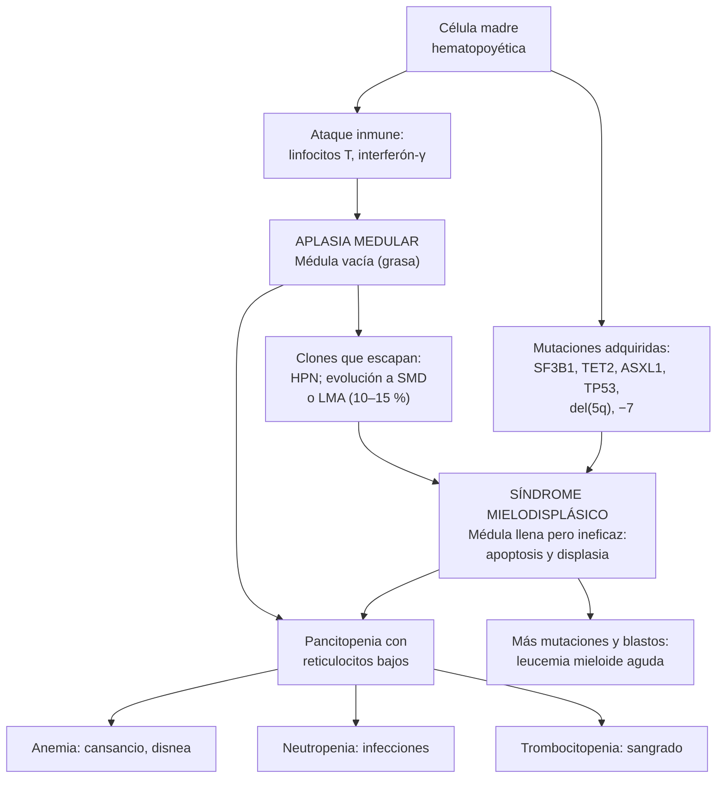

---
tags:
  - Hemato-oncología
---

# Síndromes mielodisplásicos, aplasia medular y enfoque de la pancitopenia

**Subespecialidad**
Hematología · Hemato-oncología · Medicina interna

**Guías principales**
ASH 2026: anemia aplásica grave y muy grave · BSH 2024: anemia aplásica del adulto · ESMO 2021: síndromes mielodisplásicos · OMS 2022 (5.ª edición) e ICC 2022: clasificación · IPSS-R (2012) e IPSS-M (2022): pronóstico de los SMD

**Otras fuentes**
RACE (eltrombopag + inmunosupresión, 2022) · AZA-001 (azacitidina, 2009) · COMMANDS (luspatercept, 2023) · Hematopoyesis clonal asociada a la edad (Jaiswal 2014) · Trasplante haploidéntico en el sistema público chileno (Puga 2025) · Hemoglobinuria paroxística nocturna en Latinoamérica (Goldschmidt 2025) · Figura: Invernizzi 2015 (CC BY 2.0)

**GES**
No. Si un SMD evoluciona a una leucemia aguda, pasa a estar cubierto por el GES 45 (leucemia en personas de 15 años y más).

**EUNACOM**
1.08.1.008 Hipofunción medular (sospecha, inicial, derivar) · 1.08.1.017 Síndromes mielodisplásicos (sospecha, inicial, derivar)

**Revisado**
Octubre 2026

!!! abstract "Resumen en 60 segundos"
    - **Hipofunción (insuficiencia) medular**: la médula ósea **no produce** suficientes células. Se manifiesta con **citopenias** y **reticulocitos bajos**.
    - **Pancitopenia**: primero descartar las causas **periféricas o sistémicas** (hiperesplenismo, **déficit de B12**, alcohol, fármacos, VIH, LES, sepsis). Si no se aclara: **mielograma y biopsia de médula**.
    - **Aplasia medular** (anemia aplásica): pancitopenia + médula **vacía** (celularidad < 25 %), sin infiltración ni displasia.
        - Casi siempre **inmune** (linfocitos T contra las células madre); también por **fármacos**, tóxicos (benceno), radiación, **hepatitis** seronegativa y causas **hereditarias**.
        - **Grave**: ≥ 2 de neutrófilos **< 500/µL**, plaquetas **< 20 000/µL** o reticulocitos muy bajos.
        - **Tratamiento**: **trasplante alogénico** de un **hermano compatible** en los jóvenes; **inmunosupresión** (globulina antitimocítica + **ciclosporina** + **eltrombopag**) en los demás.
    - **Síndromes mielodisplásicos (SMD)**: neoplasias **clonales** de los adultos mayores, con **citopenias**, **displasia** (≥ 10 % de las células de una línea) y riesgo de **leucemia mieloide aguda**.
        - Sospechar ante una **anemia macrocítica** o citopenias **sin causa** en un **> 60–70 años**.
        - **Riesgo**: **IPSS-R** o **IPSS-M**.
        - **Bajo riesgo**: tratar la **anemia** (eritropoyetina, **luspatercept**, transfusiones; **lenalidomida** si hay **del(5q)**).
        - **Alto riesgo**: **azacitidina** y, si es candidato, **trasplante alogénico** (la única opción curativa).
    - **Urgencias**: **fiebre con neutropenia** (antibiótico en < 1 hora), sangrado con plaquetas muy bajas y blastos en el frotis.

## Definición

- **Pancitopenia**: disminución de las **tres series** (anemia, leucopenia o neutropenia y trombocitopenia).
- **Hipofunción o insuficiencia medular**: producción insuficiente de células por la médula ósea. Puede ser por:
    - **falta de células madre** (aplasia);
    - **hematopoyesis ineficaz** (SMD, megaloblastosis);
    - **ocupación** de la médula (leucemia, linfoma, mieloma, metástasis) o **fibrosis** (mielofibrosis).
- **Aplasia medular (anemia aplásica adquirida)**: **pancitopenia** + **médula hipocelular** (celularidad **< 25 %**, o 25–50 % con < 30 % de células hematopoyéticas residuales) **sin** infiltración, fibrosis ni displasia significativa.

| Gravedad (criterios de Camitta, modificados) | Definición |
|---|---|
| **No grave** | Médula hipocelular y citopenias que no cumplen los criterios de grave |
| **Grave** | Médula hipocelular + **≥ 2** de: neutrófilos **< 500/µL**, plaquetas **< 20 000/µL**, reticulocitos **< 60 000/µL** (contador automatizado) o < 20 000/µL (manual) |
| **Muy grave** | Criterios de grave + neutrófilos **< 200/µL** |

- **Aplasia pura de serie roja**: solo falta la serie roja (reticulocitos ~ 0, sin eritroblastos en la médula). Causas: **timoma**, **parvovirus B19** (en inmunosuprimidos), fármacos, leucemia de linfocitos grandes granulares.
- **Síndrome mielodisplásico** (la OMS 2022 lo llama **neoplasia mielodisplásica**): neoplasia **clonal** de la célula madre mieloide con:
    - **citopenias** persistentes (Hb **< 13 g/dL** en hombres y < 12 g/dL en mujeres; neutrófilos **< 1800/µL**; plaquetas **< 150 000/µL**);
    - **displasia** en **≥ 10 %** de las células de al menos una línea, o una alteración genética definitoria;
    - **blastos < 20 %** (con ≥ 20 % es una leucemia aguda).
- **Precursores** del SMD:
    - **Hematopoyesis clonal de potencial indeterminado (CHIP)**: mutación somática en un gen de neoplasias mieloides (frecuencia alélica ≥ 2 %), **sin citopenias**.
    - **Citopenia clonal de significado indeterminado (CCUS)**: mutación + **citopenia**, sin displasia suficiente para un SMD.
- **Hemoglobinuria paroxística nocturna (HPN)**: clon de células madre sin proteínas ancladas por GPI (CD55, CD59), que **hemoliza** por el complemento. Se asocia a la aplasia, a **trombosis** en sitios inusuales y a **hemólisis** intravascular.

## Epidemiología

### Mundial

- **Aplasia medular**: rara, **1,5–7 casos por millón** de habitantes al año (ASH 2026); más frecuente en **Asia**. Dos peaks de edad: **adolescentes y adultos jóvenes**, y **> 60 años**.
- **Síndromes mielodisplásicos**: la neoplasia mieloide más frecuente de los **adultos mayores**. Su incidencia sube mucho con la edad (mediana **> 70 años**); más en hombres.
- **Hematopoyesis clonal** (Jaiswal 2014): rara antes de los 40 años; presente en **9,5 %** de las personas de 70–79 años, **11,7 %** de 80–89 años y **18,4 %** de 90 años o más. Se asocia a más **cánceres hematológicos** (HR 11,1), más **mortalidad** (HR 1,4) y más **enfermedad coronaria** (HR 2,0) e **ictus isquémico** (HR 2,6).

### Chile

!!! chile "Datos nacionales"
    - Los SMD y la aplasia medular **no son problemas GES**. Si un SMD evoluciona a una **leucemia aguda**, entra al **GES 45**.
    - **Trasplante alogénico en el sistema público**: un centro de Santiago informó **82 trasplantes haploidénticos** en adultos (2016–2021), con una **sobrevida a 3 años de 68 %** (Puga 2025). El trasplante es la base del tratamiento de la aplasia grave en los jóvenes y del SMD de alto riesgo.
    - **Causas de pancitopenia "no medular" frecuentes en Chile**:
        - **Déficit de B12** en los adultos mayores: se asocia a la **metformina en dosis altas**, y los alimentos del PACAM aportan poca B12 (estudios del INTA; ver [anemias](anemias.md)).
        - El **déficit de folato** es **raro** por la **fortificación de la harina** con ácido fólico desde el año 2000.
        - **Hiperesplenismo** por **cirrosis** (alcohol, MASLD; ver [cirrosis](../gastroenterologia/cirrosis-y-complicaciones.md)).
    - **HPN en Latinoamérica** (revisión liderada por una hematóloga chilena; Goldschmidt 2025): en Brasil se estima una prevalencia de **1 en 237 000** habitantes, y entre el **14 % y el 30 %** de las muestras enviadas por sospecha de HPN (Brasil y Colombia) fueron positivas.

## Etiología y factores de riesgo

### Aplasia medular

| Grupo | Causas |
|---|---|
| **Idiopática (inmune)** | La **mayoría** de los casos |
| **Fármacos** | **Cloranfenicol**, sulfonamidas, **carbamazepina**, fenitoína, sales de oro, AINE (fenilbutazona), antitiroideos (más a menudo agranulocitosis), **quimioterapia** (dependiente de la dosis) |
| **Tóxicos y radiación** | **Benceno**, solventes, insecticidas; **radiación** ionizante |
| **Infecciones** | **Hepatitis seronegativa** (aplasia 1–3 meses después de una hepatitis aguda), VEB, VIH, CMV; **parvovirus B19** (aplasia pura de serie roja o crisis aplásica en las anemias hemolíticas) |
| **Otras** | **HPN**, **embarazo**, timoma, LES, fascitis eosinofílica |
| **Hereditarias** (sospechar en jóvenes o con antecedentes familiares) | **Anemia de Fanconi**, **telomeropatías** (disqueratosis congénita: uñas distróficas, leucoplaquia, pigmentación reticular, fibrosis pulmonar, cirrosis, canas precoces) |

### Síndromes mielodisplásicos

- **Edad** avanzada (acumulación de mutaciones; **hematopoyesis clonal**).
- **Quimioterapia** previa (alquilantes, inhibidores de la topoisomerasa II) y **radioterapia**: **SMD relacionado con el tratamiento**, de mal pronóstico.
- **Benceno**, tabaco.
- **Aplasia medular** previa (evolución clonal).
- **Síndromes genéticos** y **predisposición germinal** (*DDX41*, *GATA2*, *RUNX1*, telomeropatías).

## Fisiopatología

- **Aplasia medular**:
    - Los **linfocitos T citotóxicos** activados (interferón-γ, TNF) destruyen las **células madre hematopoyéticas**. La médula queda **vacía**, reemplazada por **grasa**.
    - Por eso responde a la **inmunosupresión** (globulina antitimocítica y ciclosporina), y el **eltrombopag** estimula a las células madre que quedan.
    - Bajo la presión inmune sobreviven **clones**: **HPN** (sin GPI, "invisibles" para los linfocitos T) y, en **10–15 %**, **evolución clonal** a SMD o leucemia mieloide aguda tras la inmunosupresión (ASH 2026).
- **Síndromes mielodisplásicos**:
    - Mutaciones adquiridas en la célula madre mieloide (*TET2*, *DNMT3A*, *ASXL1*, ***SF3B1***, *SRSF2*, ***TP53***) y alteraciones cromosómicas (**del(5q)**, −7, +8, cariotipo complejo).
    - **Hematopoyesis ineficaz**: la médula está **normo o hipercelular**, pero las células **mueren dentro de ella** (apoptosis) o salen **displásicas** y funcionan mal.
    - Resultado: **citopenias** con médula "llena", **displasia** morfológica y, con más mutaciones, **aumento de blastos** y **leucemia mieloide aguda**.
    - **Inflamación** (inmunidad innata) y **sobrecarga de hierro** por las transfusiones.

*Figura 1. Fisiopatología de la aplasia medular y de los síndromes mielodisplásicos. Esquema propio basado en ASH 2026, BSH 2024 y ESMO 2021.*

## Clasificación

### Síndromes mielodisplásicos (OMS 2022)

| Grupo | Tipo | Claves |
|---|---|---|
| **Con alteraciones genéticas definitorias** | **SMD con del(5q) aislada** (blastos bajos) | Mujeres mayores, **anemia macrocítica**, plaquetas **normales o altas**, megacariocitos hipolobulados; responde a la **lenalidomida** |
| | **SMD con mutación de *SF3B1*** (blastos bajos) | **Sideroblastos en anillo**; anemia; buen pronóstico; responde al **luspatercept** |
| | **SMD con inactivación bialélica de *TP53*** | Cariotipo complejo; **mal pronóstico** |
| **Definidos por la morfología** | **SMD con blastos bajos** | < 5 % de blastos en la médula y < 2 % en la sangre |
| | **SMD hipoplásico** | Celularidad baja: se confunde con la aplasia |
| | **SMD con exceso de blastos** (IB1 / IB2) | IB1: **5–9 %** en la médula (o 2–4 % en la sangre). IB2: **10–19 %** en la médula (o 5–19 % en la sangre, o bastones de Auer) |
| | **SMD con fibrosis** | Fibrosis de la médula; mal pronóstico |

### Pronóstico de los SMD: IPSS-R (2012)

- Variables: **citogenética** (5 categorías), **porcentaje de blastos** en la médula, **Hb**, **plaquetas** y **neutrófilos**.

| Riesgo IPSS-R | Puntaje | Mediana de sobrevida |
|---|---|---|
| **Muy bajo** | ≤ 1,5 | **8,8 años** |
| **Bajo** | > 1,5–3 | 5,3 años |
| **Intermedio** | > 3–4,5 | 3,0 años |
| **Alto** | > 4,5–6 | 1,6 años |
| **Muy alto** | > 6 | **0,8 años** |

- **IPSS-M** (2022): agrega las **mutaciones** de 31 genes (por ejemplo, *TP53*, *SF3B1*, *ASXL1*) y reclasifica a casi la mitad de los pacientes.
- En la práctica: **SMD de bajo riesgo** (IPSS-R muy bajo, bajo o intermedio con puntaje ≤ 3,5) frente a **alto riesgo** (> 3,5).

## Clínica

- **Por las citopenias** (en ambas enfermedades):
    - **Anemia**: cansancio, disnea, palidez, angina en los adultos mayores; **dependencia de transfusiones**.
    - **Neutropenia**: infecciones **bacterianas** recurrentes o graves, **micosis** (aspergilosis) en la aplasia grave.
    - **Trombocitopenia**: **petequias**, equimosis, gingivorragia, epistaxis, menorragia.
- **Aplasia medular**:
    - Suele afectar a **adultos jóvenes**, a veces tras una **hepatitis** o un fármaco.
    - **Sin esplenomegalia, adenopatías ni hepatomegalia**: si aparecen, pensar en otro diagnóstico (leucemia, linfoma, hiperesplenismo).
    - Pistas de una **falla hereditaria**: baja talla, alteraciones del pulgar o del radio, manchas café con leche (Fanconi); uñas distróficas, leucoplaquia, canas precoces, fibrosis pulmonar (telomeropatías).
    - **HPN asociada**: orina oscura en la mañana, dolor abdominal, disfagia, **trombosis** (venas hepáticas, mesentéricas, cerebrales).
- **SMD**:
    - **Adulto mayor** con **anemia macrocítica** o normocítica, a menudo **asintomática** al inicio o hallada en un hemograma.
    - Manifestaciones **autoinmunes** o inflamatorias (~ 10–20 %): vasculitis, artritis, síndrome de Sweet.
    - **Progresión a leucemia**: aumento de blastos, empeoramiento rápido de las citopenias.

!!! alarma "Signos de alarma: derivar de inmediato"
    - **Fiebre** con neutrófilos **< 500/µL**: hemocultivos y **antibiótico de amplio espectro antes de 1 hora** (ver [neutropenia febril](urgencias-oncologicas.md)).
    - **Sangrado activo** o plaquetas **< 10 000/µL**.
    - **Blastos** en el frotis (leucemia aguda).
    - Pancitopenia **de instalación rápida** (días o semanas).
    - **Trombosis** en sitios inusuales con hemólisis (HPN).

## Diagnóstico

- **Paso 1: confirmar y buscar causas periféricas** (figura 2):
    - **Hemograma con frotis revisado** (displasia, blastos, esquistocitos, leucoeritroblastosis), **reticulocitos** y **VCM**.
    - **B12 y folato**; **cobre** y zinc (el déficit de cobre y el exceso de zinc imitan un SMD).
    - **LDH**, bilirrubina, haptoglobina, prueba de Coombs (hemólisis).
    - Pruebas hepáticas; **ecografía abdominal** (bazo, hígado, signos de hipertensión portal).
    - **VIH**, VHB, VHC; según el caso, VEB, CMV y parvovirus B19.
    - ANA (LES); TSH.
    - **Revisar los fármacos** (metotrexato, azatioprina, cotrimoxazol, linezolid, quimioterapia, antitiroideos), el **alcohol** y la exposición a tóxicos.
    - **Citometría de flujo para HPN** (CD59, FLAER) si hay hemólisis, trombosis o aplasia.
- **Paso 2: mielograma y biopsia de médula ósea** si la causa no se aclara (ASH 2026: buena práctica ante toda pancitopenia sin explicación):
    - **Celularidad** (biopsia): **baja** en la aplasia; **normal o alta** en el SMD y la megaloblastosis.
    - **Morfología**: displasia (figura 3), **porcentaje de blastos**, sideroblastos en anillo (tinción de Perls), infiltración, fibrosis.
    - **Citogenética** (cariograma, FISH de 5q, 7 y 8) y **panel de mutaciones** (SMD; también en la aplasia, para buscar clones).
- **Aplasia**: además, **tipificación HLA precoz** del paciente y sus hermanos; estudio de **longitud de los telómeros** y genética germinal si se sospecha una causa hereditaria.

!!! guia "Puntos clave del diagnóstico (ASH 2026; BSH 2024; ESMO 2021; OMS 2022)"
    - **Pancitopenia persistente sin explicación**: obtener una historia detallada de **exposiciones, fármacos, infecciones y antecedentes familiares**, y realizar **mielograma y biopsia de médula ósea**.
    - **Aplasia grave o muy grave**: se sugiere buscar un **clon HPN**, **mutaciones somáticas** y medir la **longitud de los telómeros**; hacer la **tipificación HLA** lo antes posible en los candidatos a trasplante.
    - **SMD**: diagnóstico con **citopenia persistente** + **displasia ≥ 10 %** en una línea (o alteración genética definitoria) + **blastos < 20 %**, tras **excluir** otras causas de displasia (déficit de B12, folato o cobre; alcohol; VIH; fármacos; quimioterapia reciente).
    - **Riesgo** con el **IPSS-R** o, si hay estudio de mutaciones, el **IPSS-M**.

<figure markdown>
![Esquema de enfoque de la pancitopenia. Arriba: pancitopenia es anemia más leucopenia o neutropenia más trombocitopenia; es urgente si hay fiebre con neutrófilos bajo 500, sangrado, plaquetas bajo 10 000 o blastos en el frotis. Primer estudio: frotis revisado, reticulocitos, VCM, B12 y folato, LDH, bilirrubina, haptoglobina, pruebas hepáticas, VIH, VHB, VHC, VEB, CMV y parvovirus, ANA, ecografía abdominal del bazo y el hígado, revisar fármacos, alcohol, tóxicos y antecedentes familiares, y citometría para HPN si hay hemólisis o trombosis. A la izquierda, causas periféricas o sistémicas con médula normal o hipercelular: hiperesplenismo por cirrosis o hipertensión portal, déficit de B12 o folato, alcohol, fármacos como metotrexato, azatioprina, cotrimoxazol, cloranfenicol y quimioterapia, infecciones como VIH, sepsis, tuberculosis miliar, VEB, parvovirus B19 y leishmaniasis, LES y otras autoinmunes, síndrome hemofagocítico con ferritina muy alta y hemoglobinuria paroxística nocturna; se trata la causa y se estudia la médula si no se aclara. A la derecha, mielograma más biopsia de médula ósea con citogenética y citometría, con cuatro resultados: médula hipocelular bajo 25 por ciento sin displasia ni blastos, aplasia medular, descartando SMD hipoplásico, HPN y fallas hereditarias; displasia de 10 por ciento o más de una línea con blastos bajo 20 por ciento, síndrome mielodisplásico, excluyendo B12, cobre, alcohol, VIH y fármacos; blastos de 20 por ciento o más o una alteración genética definitoria, leucemia aguda, urgencia GES 45; infiltración o fibrosis por linfoma, mieloma, metástasis, mielofibrosis o tuberculosis, con aspirado seco y leucoeritroblastosis](../assets/figuras/medula/enfoque-pancitopenia.svg){ loading=lazy }
<figcaption>Figura 2. Enfoque de la pancitopenia: causas periféricas o sistémicas e interpretación de la médula ósea. Esquema propio basado en ASH 2026, BSH 2024 y OMS 2022.</figcaption>
</figure>

## Laboratorio

| Examen | Aplasia medular | Síndrome mielodisplásico |
|---|---|---|
| **Hemograma** | Pancitopenia; anemia **normo o macrocítica** | Citopenias; anemia **macrocítica** frecuente |
| **Reticulocitos** | **Muy bajos** | Bajos |
| **Frotis** | Sin células anormales | **Displasia**: neutrófilos **hipogranulares** e **hipolobulados** (**pseudo-Pelger-Huët**), glóbulos rojos dimórficos, plaquetas gigantes; a veces **blastos** |
| **Celularidad de la médula** (biopsia) | **< 25 %**, grasa | **Normal o alta** (salvo el SMD hipoplásico) |
| **Morfología de la médula** | Sin displasia relevante ni blastos | **Displasia ≥ 10 %**; **sideroblastos en anillo** (*SF3B1*); micromegacariocitos; blastos |
| **Citogenética** | Normal (las alteraciones sugieren SMD) | del(5q), −7, +8, cariotipo complejo |
| **Mutaciones** | A veces clones pequeños (*PIGA*, *BCOR*, *DNMT3A*) | *SF3B1*, *TET2*, *ASXL1*, *SRSF2*, *TP53* |
| **Citometría para HPN** | Clon HPN en ~ 40–50 % (en general pequeño) | Rara |
| **Eritropoyetina sérica** | Alta | Útil para predecir la respuesta a la eritropoyetina (**< 500 U/L**) |
| **Ferritina** | Alta con muchas transfusiones | Alta con muchas transfusiones |

<figure markdown>
![Nueve microfotografías de frotis de médula ósea con displasia. A y B: diseritropoyesis, con rasgos megaloblastoides, un eritroblasto trinucleado, un eritroblasto con cuerpo de Howell-Jolly, un puente internuclear y un proeritroblasto con citoplasma vacuolado. C: tinción de Perls con sideroblastos en anillo, con gránulos de hierro alrededor de un tercio o más del núcleo. D y E: disgranulopoyesis, con neutrófilos de núcleo hipolobulado (anomalía de Pelger-Huët adquirida), citoplasma agranular y segmentos nucleares gigantes de forma bizarra. F a I: dismegacariopoyesis, con un micromegacariocito del tamaño de las células mieloides, un megacariocito pequeño binucleado, megacariocitos con un solo núcleo redondo y megacariocitos con muchos núcleos separados](../assets/figuras/medula/displasia-smd-invernizzi-2015.jpg){ loading=lazy }
<figcaption>Figura 3. Displasia en los síndromes mielodisplásicos (médula ósea): (A, B) diseritropoyesis; (C) sideroblastos en anillo (tinción de Perls); (D, E) disgranulopoyesis con neutrófilos hipolobulados (pseudo-Pelger-Huët) y agranulares; (F–I) dismegacariopoyesis con micromegacariocitos y megacariocitos de núcleos únicos o separados. Fuente: Invernizzi R, Quaglia F, Della Porta MG. Importance of classical morphology in the diagnosis of myelodysplastic syndrome. <em>Mediterr J Hematol Infect Dis.</em> 2015;7(1):e2015035, figura 2. Licencia <a href="https://creativecommons.org/licenses/by/2.0/">CC BY 2.0</a>.</figcaption>
</figure>

## Imágenes

- **Ecografía abdominal**: **bazo** (la esplenomegalia orienta a hiperesplenismo, linfoma, mielofibrosis o leucemia, **no a aplasia**), hígado y signos de hipertensión portal.
- **Radiografía o TC de tórax**: infecciones; **timoma** en la aplasia pura de serie roja.
- **TC de tórax de alta resolución** si hay neutropenia febril persistente (aspergilosis).
- Ecocardiograma o RM cardíaca (T2*) en los pacientes con **sobrecarga de hierro** transfusional.
- Ecografía o Doppler de las venas hepáticas y del abdomen si hay **HPN** con dolor abdominal (trombosis).

## Diagnóstico diferencial

| Entidad | Cómo distinguirla |
|---|---|
| **Déficit de B12 o folato** | Macrocitosis marcada, neutrófilos **hipersegmentados**, LDH muy alta; médula **megaloblástica hipercelular** que puede parecer un SMD. Se corrige con la vitamina |
| **Hiperesplenismo** | **Esplenomegalia**, cirrosis o hipertensión portal; médula normal o hipercelular |
| **Alcohol, fármacos y tóxicos** | Antecedente; mejora al suspender |
| **Déficit de cobre** (cirugía bariátrica, exceso de zinc) | Anemia y neutropenia con displasia y vacuolas en los precursores; **mieloneuropatía** |
| **VIH**, otras infecciones | Serología; médula con displasia reactiva |
| **Leucemia aguda** (incluida la "aleucémica") | **Blastos ≥ 20 %** en la médula |
| **Tricoleucemia** | Pancitopenia + **monocitopenia** + **esplenomegalia**; aspirado seco; *BRAF* V600E |
| **Mielofibrosis** | **Esplenomegalia masiva**, **leucoeritroblastosis**, dacriocitos, fibrosis en la biopsia |
| **Infiltración** (linfoma, mieloma, metástasis) | Biopsia de médula; leucoeritroblastosis |
| **HPN** | Hemólisis intravascular (LDH alta, hemoglobinuria), trombosis; citometría |
| **Síndrome hemofagocítico** | Fiebre, esplenomegalia, **ferritina muy alta**, triglicéridos altos, fibrinógeno bajo |
| **Agranulocitosis por fármacos** | Solo **neutrófilos** < 500/µL (antitiroideos, metamizol, clozapina, sulfas); el resto del hemograma es normal |

## Tratamiento

### Lo que hace el interno

- **Suspender** los fármacos sospechosos.
- **Neutropenia febril**: hemocultivos y antibiótico de amplio espectro **en menos de 1 hora**.
- **Transfusiones**:
    - **Glóbulos rojos** según los síntomas (en general, Hb < 7–8 g/dL).
    - **Plaquetas** si son **< 10 000/µL** o hay sangrado (umbral mayor si hay fiebre o un procedimiento).
    - Hemocomponentes **leucorreducidos**; **irradiados** en los candidatos a globulina antitimocítica o a trasplante.
    - En los candidatos a trasplante, **evitar las transfusiones de familiares** (sensibilización).
- **No dar G-CSF ni corticoides** de forma rutinaria antes del diagnóstico.
- **Derivar** a hematología con el hemograma, el frotis y los exámenes iniciales.

### Aplasia medular (ASH 2026; BSH 2024)

| Situación | Tratamiento |
|---|---|
| **Grave o muy grave, < 40 años, con hermano HLA idéntico** | **Trasplante alogénico** de precursores hematopoyéticos (cura la enfermedad; sin riesgo de evolución clonal) |
| **Grave o muy grave, > 40 años, o sin hermano compatible** | **Inmunosupresión**: **globulina antitimocítica** (de caballo) + **ciclosporina** + **eltrombopag** |
| **Sin respuesta a la inmunosupresión** a los **3–6 meses** | **Trasplante** (de donante no emparentado o haploidéntico) o un segundo curso de globulina antitimocítica, según la edad. Iniciar la segunda línea **antes de 6 meses** |
| **No grave** | Observación si no requiere transfusiones; ciclosporina ± eltrombopag si las requiere |
| **HPN hemolítica** | Inhibidores del complemento (**eculizumab**, ravulizumab, iptacopán) y anticoagulación si hay trombosis |

- **Eltrombopag** agregado a la inmunosupresión (RACE): más **respuestas completas a los 3 meses** (**22 % frente a 10 %**) y más respuestas globales a los 6 meses (**68 % frente a 41 %**).
- **Respuesta** a la inmunosupresión: lenta, en **3–6 meses**. **Recaídas** al bajar la ciclosporina.
- **Profilaxis** con neutrófilos **< 500/µL** (ASH 2026): **antifúngico activo contra hongos filamentosos** (posaconazol o voriconazol) y **antibiótico** (fluoroquinolona); aciclovir y cotrimoxazol durante la globulina antitimocítica.
- **Quelación de hierro** si hay sobrecarga transfusional.

### Síndromes mielodisplásicos (ESMO 2021)

| Situación | Tratamiento |
|---|---|
| **Bajo riesgo, asintomático** | **Observación** con hemogramas periódicos |
| **Bajo riesgo con anemia sintomática**, eritropoyetina sérica **< 500 U/L** y pocas transfusiones | **Agentes estimulantes de la eritropoyesis** (eritropoyetina, darbepoetina): responde **~ 40–60 %** |
| **Bajo riesgo, sin del(5q)**, con anemia | **Luspatercept**: en COMMANDS (sin tratamiento previo), más independencia de transfusiones con aumento de la Hb que la eritropoyetina (**58 % frente a 31 %**); de elección en el SMD con **sideroblastos en anillo** o *SF3B1* que falla a la eritropoyetina |
| **Bajo riesgo con del(5q)** aislada y dependencia de transfusiones | **Lenalidomida** |
| **Bajo riesgo, hipoplásico** | Inmunosupresión (globulina antitimocítica + ciclosporina) en casos seleccionados |
| **Bajo riesgo refractario** | Imetelstat, agentes hipometilantes, transfusiones crónicas + quelación de hierro |
| **Alto riesgo, candidato** | **Trasplante alogénico** (la **única opción curativa**), con azacitidina antes si hay muchos blastos |
| **Alto riesgo, no candidato** | **Azacitidina** (AZA-001: mediana de sobrevida **24,5 frente a 15 meses** con el tratamiento convencional) |
| **Frágil** | Soporte transfusional y cuidados paliativos |

!!! dosis "Dosis de referencia (adulto; las indica el hematólogo)"
    - **Eritropoyetina alfa**: **40 000–80 000 UI SC por semana** (SMD de bajo riesgo); evaluar la respuesta a las 8–12 semanas.
    - **Luspatercept**: **1 mg/kg SC cada 3 semanas** (puede subirse hasta 1,75 mg/kg).
    - **Lenalidomida** (del(5q)): **10 mg/día VO** por 21 días cada 28 días (vigilar la neutropenia y la trombocitopenia).
    - **Azacitidina**: **75 mg/m²/día SC** por **7 días** cada 28 días, por al menos 6 ciclos antes de juzgar la respuesta.
    - **Globulina antitimocítica de caballo**: **40 mg/kg/día EV por 4 días** (con premedicación con corticoides por la enfermedad del suero).
    - **Ciclosporina**: **5 mg/kg/día VO** en 2 dosis, ajustada a niveles (en general **200–400 ng/mL**), por al menos **12 meses** y luego con disminución lenta.
    - **Eltrombopag** (aplasia): **150 mg/día VO**, en ayunas (separado de los lácteos y antiácidos), por ~ 6 meses.
    - **Deferasirox** (quelación): según la ferritina y la función renal.

## Complicaciones

| Complicación | Claves |
|---|---|
| **Infecciones** | **Bacterianas** y **fúngicas invasoras** (aspergilosis) en la neutropenia profunda: principal causa de muerte en la aplasia grave |
| **Hemorragias** | Trombocitopenia grave; hemorragia intracraneana |
| **Sobrecarga de hierro** | Muchas transfusiones: daño hepático, cardíaco y endocrino |
| **Aloinmunización** | Refractariedad a las transfusiones de plaquetas (anticuerpos anti-HLA) |
| **Evolución clonal** | Aplasia → **HPN**, **SMD** o **leucemia mieloide aguda** (**10–15 %** tras la inmunosupresión) |
| **Transformación a leucemia aguda** | SMD, sobre todo los de alto riesgo (*TP53*, exceso de blastos) |
| **Trombosis** | HPN (venas hepáticas, mesentéricas, cerebrales) |
| **Efectos del tratamiento** | Ciclosporina: **nefrotoxicidad**, hipertensión, hipertricosis, hiperplasia gingival, hipomagnesemia. Globulina antitimocítica: anafilaxia, **enfermedad del suero**. Lenalidomida: citopenias, trombosis. Trasplante: **enfermedad injerto contra huésped**, infecciones |

## Pronóstico y seguimiento

- **Aplasia medular**:
    - Sin tratamiento, la aplasia grave tiene una **mortalidad muy alta**, por infecciones y sangrado.
    - Con el trasplante de un hermano compatible en los jóvenes, la sobrevida a largo plazo supera el **80–90 %**.
    - Con la inmunosupresión, la mayoría responde, pero hay **recaídas** y riesgo de **evolución clonal** (10–15 %).
    - **Seguimiento**: hemograma frecuente, niveles de ciclosporina, función renal; **citometría para HPN** y **médula** periódicas para detectar la evolución clonal.
- **Síndromes mielodisplásicos**:
    - Muy heterogéneos: mediana de sobrevida de **8,8 años** en el riesgo muy bajo y de **0,8 años** en el muy alto (IPSS-R).
    - La causa de muerte es la **insuficiencia medular** (infecciones, sangrado) o la **leucemia aguda**.
    - **Seguimiento**: hemograma cada 1–6 meses según el riesgo; ferritina en los pacientes transfundidos; nueva médula si empeoran las citopenias o aparecen blastos.
- **Hematopoyesis clonal (CHIP y CCUS)**: control del hemograma y de los **factores de riesgo cardiovascular** (más enfermedad coronaria e ictus).

## Perlas para el internado

!!! perla "Para recordar en la sala"
    - **Pancitopenia**: antes de la médula, revisar **fármacos**, **alcohol**, **B12**, **bazo** (ecografía), **VIH** y el **frotis**.
    - **Pancitopenia + esplenomegalia**: **no** es aplasia; pensar en hiperesplenismo, leucemia, linfoma, tricoleucemia, mielofibrosis o leishmaniasis.
    - **Pancitopenia en un joven tras una hepatitis "sin causa"**: aplasia asociada a hepatitis.
    - **Adulto mayor con anemia macrocítica, B12 y folato normales y sin alcohol**: pensar en un **SMD**.
    - **Neutrófilos hipogranulares y bilobulados (pseudo-Pelger-Huët)** en el frotis: displasia.
    - **SMD con del(5q)**: mujer mayor, anemia macrocítica y **plaquetas normales o altas**; responde a la **lenalidomida**.
    - En los **candidatos a trasplante**: hemocomponentes **leucorreducidos** (e irradiados) y **no transfundir sangre de familiares**.
    - **Fiebre con neutrófilos < 500/µL**: antibiótico **antes de 1 hora**, sin esperar los cultivos.
    - **Trombosis en un sitio raro (venas hepáticas, cerebrales, mesentéricas) + hemólisis + citopenias**: pedir **citometría para HPN**.
    - Los **SMD** no son GES, pero si evolucionan a **leucemia aguda**, entran al **GES 45**.

## Preguntas de repaso

??? repaso "1. Hombre de 24 años con 3 semanas de petequias, gingivorragia y cansancio. Tuvo una hepatitis aguda sin causa conocida hace 2 meses. Hb 7,2 g/dL, leucocitos 1200/µL (neutrófilos 300/µL), plaquetas 9000/µL, reticulocitos 15 000/µL. Sin esplenomegalia ni adenopatías. Frotis sin blastos. ¿Qué sospecha y qué hace?"
    - **Aplasia medular asociada a hepatitis**, probablemente **grave** (neutrófilos < 500, plaquetas < 20 000, reticulocitos muy bajos).
    - **Estudio**: **mielograma y biopsia** (médula hipocelular, sin displasia ni blastos), citogenética, **citometría para HPN**, B12, folato, VIH, VHB, VHC, VEB, parvovirus; **tipificación HLA** del paciente y de sus hermanos.
    - **Soporte**:
        - Transfusión de **plaquetas** (< 10 000 con sangrado) y de glóbulos rojos, **leucorreducidos e irradiados**, **no de familiares**.
        - Si tiene **fiebre**: antibiótico de amplio espectro en < 1 hora.
        - Profilaxis antifúngica y antibiótica (neutrófilos < 500/µL).
    - **Tratamiento**: si tiene un **hermano HLA idéntico**, **trasplante alogénico**; si no, **globulina antitimocítica + ciclosporina + eltrombopag**.

??? repaso "2. Mujer de 76 años con cansancio progresivo. Hb 8,4 g/dL, VCM 108 fL, leucocitos 3100/µL, plaquetas 92 000/µL, reticulocitos bajos. B12, folato, TSH y pruebas hepáticas normales; no bebe alcohol. En el frotis hay neutrófilos hipogranulares y bilobulados. ¿Qué sospecha y cómo la estudia?"
    - **Síndrome mielodisplásico**: adulta mayor con citopenias, **macrocitosis** sin déficit vitamínico ni alcohol, y **displasia** granulocítica (pseudo-Pelger-Huët).
    - **Excluir** antes: déficit de **cobre**, VIH, fármacos (metotrexato, azatioprina), hipotiroidismo, hepatopatía.
    - **Estudio**: **mielograma y biopsia** (displasia ≥ 10 %, porcentaje de blastos, sideroblastos en anillo, celularidad), **citogenética** y panel de **mutaciones**.
    - **Riesgo**: **IPSS-R / IPSS-M**. Medir la **eritropoyetina** sérica (predice la respuesta a los agentes estimulantes) y la **ferritina**.
    - **Derivar** a hematología.

??? repaso "3. La paciente anterior tiene un SMD de bajo riesgo según el IPSS-R, sin del(5q), con eritropoyetina sérica de 120 U/L y anemia sintomática. Requiere 2 unidades de glóbulos rojos al mes. ¿Qué tratamiento corresponde?"
    - **Tratar la anemia** (el objetivo en el bajo riesgo es la **calidad de vida** y reducir las transfusiones).
    - **Primera línea**: un **agente estimulante de la eritropoyesis** (eritropoyetina 40 000–80 000 UI/semana) o **luspatercept**, ya que la eritropoyetina sérica es **< 500 U/L**.
        - En COMMANDS, el **luspatercept** logró más independencia de transfusiones que la eritropoyetina; es de elección si hay **sideroblastos en anillo** o mutación de ***SF3B1***.
    - **Soporte**: transfusiones según los síntomas; **quelación de hierro** si la ferritina sube mucho con muchas transfusiones.
    - **Seguimiento**: hemograma periódico; nueva médula si empeora o aparecen blastos.

??? repaso "4. Hombre de 68 años con un SMD con exceso de blastos (12 % en la médula), cariotipo complejo y mutación de *TP53*. Tiene buen estado funcional y pocas comorbilidades. ¿Cuál es el pronóstico y la conducta?"
    - **SMD de muy alto riesgo** (IPSS-R/IPSS-M muy alto): mediana de sobrevida **< 1 año** y alto riesgo de **leucemia mieloide aguda**.
    - **Conducta**:
        - Evaluar para un **trasplante alogénico** (la única opción curativa), con **azacitidina** como puente.
        - Si no es candidato: **azacitidina** (AZA-001: más sobrevida que el tratamiento convencional) o un **ensayo clínico**.
    - **Soporte**: transfusiones, manejo de las infecciones, conversación sobre los **objetivos del tratamiento**.

??? repaso "5. Mujer de 32 años con orina oscura en las mañanas, cansancio, dolor abdominal y ascitis de inicio reciente. Hb 8,9 g/dL, reticulocitos altos, LDH 1800 U/L, haptoglobina indetectable, Coombs negativo, plaquetas 85 000/µL. La ecografía Doppler muestra una trombosis de las venas suprahepáticas. ¿Qué sospecha?"
    - **Hemoglobinuria paroxística nocturna (HPN)**: **hemólisis intravascular** con **Coombs negativo** (LDH muy alta, haptoglobina indetectable, hemoglobinuria), **citopenia** y **trombosis en un sitio inusual** (**síndrome de Budd-Chiari**).
    - **Confirmar** con **citometría de flujo** en sangre periférica (pérdida de CD55, CD59 y FLAER en los granulocitos y monocitos).
    - **Manejo**:
        - **Anticoagulación** (heparina) por la trombosis.
        - **Inhibidor del complemento** (eculizumab, ravulizumab).
        - Ácido fólico; transfusiones si es necesario.
        - Estudiar la **médula** (aplasia asociada).
    - **Derivar** a hematología.

??? repaso "6. Hombre de 55 años en tratamiento con metimazol por una enfermedad de Graves, que consulta por fiebre de 39 °C y odinofagia. Hemograma: Hb 14 g/dL, leucocitos 900/µL (neutrófilos 50/µL), plaquetas 240 000/µL. ¿Es una aplasia medular? ¿Qué hace?"
    - **No**: es una **agranulocitosis por antitiroideos** (solo afecta a los **neutrófilos**; la Hb y las plaquetas son normales).
    - **Manejo inmediato**:
        - **Suspender el metimazol** de forma definitiva (no cambiar a propiltiouracilo: reacción cruzada).
        - **Neutropenia febril**: hemocultivos y **antibiótico de amplio espectro** antes de 1 hora; hospitalizar.
        - Considerar **G-CSF**.
    - Tratar el hipertiroidismo con otra estrategia (yodo radiactivo o cirugía cuando se recupere).
    - Si **también** cayeran las plaquetas y la Hb, estudiar la médula (aplasia).

## Referencias

1. Scheinberg P, O'Neal DA, Basquiera AL, et al. American Society of Hematology 2026 guidelines for the diagnosis and management of severe and very severe aplastic anemia. *Blood Adv.* 2026;10(17):5962–5990. doi:[10.1182/bloodadvances.2025019051](https://doi.org/10.1182/bloodadvances.2025019051)
2. Kulasekararaj A, Cavenagh J, Dokal I, et al. Guidelines for the diagnosis and management of adult aplastic anaemia: a British Society for Haematology Guideline. *Br J Haematol.* 2024;204(3):784–804. doi:[10.1111/bjh.19236](https://doi.org/10.1111/bjh.19236)
3. Fenaux P, Haase D, Santini V, et al. Myelodysplastic syndromes: ESMO Clinical Practice Guidelines for diagnosis, treatment and follow-up. *Ann Oncol.* 2021;32(2):142–156. doi:[10.1016/j.annonc.2020.11.002](https://doi.org/10.1016/j.annonc.2020.11.002)
4. Khoury JD, Solary E, Abla O, et al. The 5th edition of the World Health Organization Classification of Haematolymphoid Tumours: Myeloid and Histiocytic/Dendritic Neoplasms. *Leukemia.* 2022;36(7):1703–1719. doi:[10.1038/s41375-022-01613-1](https://doi.org/10.1038/s41375-022-01613-1)
5. Greenberg PL, Tuechler H, Schanz J, et al. Revised International Prognostic Scoring System for myelodysplastic syndromes. *Blood.* 2012;120(12):2454–2465. doi:[10.1182/blood-2012-03-420489](https://doi.org/10.1182/blood-2012-03-420489)
6. Bernard E, Tuechler H, Greenberg PL, et al. Molecular International Prognostic Scoring System for myelodysplastic syndromes. *NEJM Evid.* 2022;1(7):EVIDoa2200008. doi:[10.1056/EVIDoa2200008](https://doi.org/10.1056/EVIDoa2200008)
7. Peffault de Latour R, Kulasekararaj A, Iacobelli S, et al. Eltrombopag added to immunosuppression in severe aplastic anemia. *N Engl J Med.* 2022;386(1):11–23. doi:[10.1056/NEJMoa2109965](https://doi.org/10.1056/NEJMoa2109965)
8. Fenaux P, Mufti GJ, Hellstrom-Lindberg E, et al. Efficacy of azacitidine compared with that of conventional care regimens in the treatment of higher-risk myelodysplastic syndromes: a randomised, open-label, phase III study. *Lancet Oncol.* 2009;10(3):223–232. doi:[10.1016/S1470-2045(09)70003-8](https://doi.org/10.1016/S1470-2045(09)70003-8)
9. Platzbecker U, Della Porta MG, Santini V, et al. Efficacy and safety of luspatercept versus epoetin alfa in erythropoiesis-stimulating agent-naive, transfusion-dependent, lower-risk myelodysplastic syndromes (COMMANDS): interim analysis of a phase 3, open-label, randomised controlled trial. *Lancet.* 2023;402(10399):373–385. doi:[10.1016/S0140-6736(23)00874-7](https://doi.org/10.1016/S0140-6736(23)00874-7)
10. Jaiswal S, Fontanillas P, Flannick J, et al. Age-related clonal hematopoiesis associated with adverse outcomes. *N Engl J Med.* 2014;371(26):2488–2498. doi:[10.1056/NEJMoa1408617](https://doi.org/10.1056/NEJMoa1408617)
11. Puga B, Bass F, Molina J, et al. Haploidentical hematopoietic stem cell transplantation with post-transplant cyclophosphamide in the public Chilean national health system: a single center study. *Hematol Transfus Cell Ther.* 2025;47(4):103982. doi:[10.1016/j.htct.2025.103982](https://doi.org/10.1016/j.htct.2025.103982)
12. Goldschmidt V, Apodaca EI, Gálvez KM, Wannesson B, Scheinberg P. Clinical characteristics and management of paroxysmal nocturnal haemoglobinuria in Latin America: a narrative review. *Ann Hematol.* 2025;104(2):867–879. doi:[10.1007/s00277-024-05968-6](https://doi.org/10.1007/s00277-024-05968-6)
13. Invernizzi R, Quaglia F, Della Porta MG. Importance of classical morphology in the diagnosis of myelodysplastic syndrome. *Mediterr J Hematol Infect Dis.* 2015;7(1):e2015035. doi:[10.4084/MJHID.2015.035](https://doi.org/10.4084/MJHID.2015.035)
